# CUDA C++ Programming Guide

- Source: https://docs.nvidia.com/cuda/archive/12.2.1/cuda-c-programming-guide/index.html
- Exported At (UTC): 2026-03-08T14:51:24.147046+00:00
- Local Images In This Page: 35

CUDA C++ Programming Guide

The programming guide to the CUDA model and interface.

Changes from Version 12.0

* Added [invoke\_one and invoke\_one\_broadcast](index.md#invoke-one-and-invoke-one-broadcast) APIs in Cooperative Groups.

# 1. Introduction

## 1.1. The Benefits of Using GPUs

The Graphics Processing Unit (GPU)[1](#fn1) provides much higher instruction throughput and memory bandwidth than the CPU within a similar price and power envelope. Many applications leverage these higher capabilities to run faster on the GPU than on the CPU (see [GPU Applications](https://www.nvidia.com/object/gpu-applications.html)). Other computing devices, like FPGAs, are also very energy efficient, but offer much less programming flexibility than GPUs.

This difference in capabilities between the GPU and the CPU exists because they are designed with different goals in mind. While the CPU is designed to excel at executing a sequence of operations, called a *thread*, as fast as possible and can execute a few tens of these threads in parallel, the GPU is designed to excel at executing thousands of them in parallel (amortizing the slower single-thread performance to achieve greater throughput).

The GPU is specialized for highly parallel computations and therefore designed such that more transistors are devoted to data processing rather than data caching and flow control. The schematic [Figure 1](index.md#from-graphics-processing-to-general-purpose-parallel-computing-gpu-devotes-more-transistors-to-data-processing) shows an example distribution of chip resources for a CPU versus a GPU.

[](../images/gpu-devotes-more-transistors-to-data-processing-a11dc5ecce.png)

The GPU Devotes More Transistors to Data Processing

Devoting more transistors to data processing, for example, floating-point computations, is beneficial for highly parallel computations; the GPU can hide memory access latencies with computation, instead of relying on large data caches and complex flow control to avoid long memory access latencies, both of which are expensive in terms of transistors.

In general, an application has a mix of parallel parts and sequential parts, so systems are designed with a mix of GPUs and CPUs in order to maximize overall performance. Applications with a high degree of parallelism can exploit this massively parallel nature of the GPU to achieve higher performance than on the CPU.

## 1.2. CUDA®: A General-Purpose Parallel Computing Platform and Programming Model

In November 2006, NVIDIA® introduced CUDA®, a general purpose parallel computing platform and programming model that leverages the parallel compute engine in NVIDIA GPUs to solve many complex computational problems in a more efficient way than on a CPU.

CUDA comes with a software environment that allows developers to use C++ as a high-level programming language. As illustrated by [Figure 2](index.md#cuda-general-purpose-parallel-computing-architecture-cuda-is-designed-to-support-various-languages-and-application-programming-interfaces), other languages, application programming interfaces, or directives-based approaches are supported, such as FORTRAN, DirectCompute, OpenACC.

[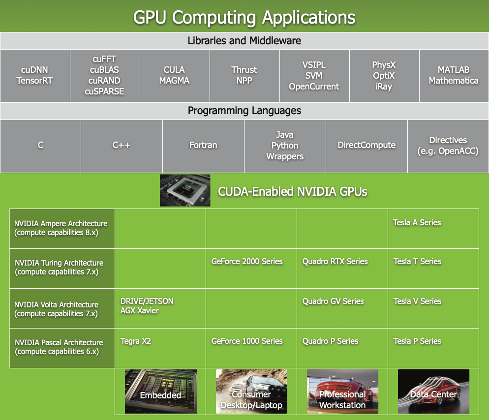](../images/gpu-computing-applications-fe11dca7b1.png)

GPU Computing Applications. CUDA is designed to support various languages and application programming interfaces.

## 1.3. A Scalable Programming Model

The advent of multicore CPUs and manycore GPUs means that mainstream processor chips are now parallel systems. The challenge is to develop application software that transparently scales its parallelism to leverage the increasing number of processor cores, much as 3D graphics applications transparently scale their parallelism to manycore GPUs with widely varying numbers of cores.

The CUDA parallel programming model is designed to overcome this challenge while maintaining a low learning curve for programmers familiar with standard programming languages such as C.

At its core are three key abstractions — a hierarchy of thread groups, shared memories, and barrier synchronization — that are simply exposed to the programmer as a minimal set of language extensions.

These abstractions provide fine-grained data parallelism and thread parallelism, nested within coarse-grained data parallelism and task parallelism. They guide the programmer to partition the problem into coarse sub-problems that can be solved independently in parallel by blocks of threads, and each sub-problem into finer pieces that can be solved cooperatively in parallel by all threads within the block.

This decomposition preserves language expressivity by allowing threads to cooperate when solving each sub-problem, and at the same time enables automatic scalability. Indeed, each block of threads can be scheduled on any of the available multiprocessors within a GPU, in any order, concurrently or sequentially, so that a compiled CUDA program can execute on any number of multiprocessors as illustrated by [Figure 3](index.md#scalable-programming-model-automatic-scalability), and only the runtime system needs to know the physical multiprocessor count.

This scalable programming model allows the GPU architecture to span a wide market range by simply scaling the number of multiprocessors and memory partitions: from the high-performance enthusiast GeForce GPUs and professional Quadro and Tesla computing products to a variety of inexpensive, mainstream GeForce GPUs (see [CUDA-Enabled GPUs](index.md#cuda-enabled-gpus) for a list of all CUDA-enabled GPUs).


Automatic Scalability

Note

A GPU is built around an array of Streaming Multiprocessors (SMs) (see [Hardware Implementation](index.md#hardware-implementation) for more details). A multithreaded program is partitioned into blocks of threads that execute independently from each other, so that a GPU with more multiprocessors will automatically execute the program in less time than a GPU with fewer multiprocessors.

## 1.4. Document Structure

This document is organized into the following sections:

* [Introduction](index.md#introduction) is a general introduction to CUDA.
* [Programming Model](index.md#programming-model) outlines the CUDA programming model.
* [Programming Interface](index.md#programming-interface) describes the programming interface.
* [Hardware Implementation](index.md#hardware-implementation) describes the hardware implementation.
* [Performance Guidelines](index.md#performance-guidelines) gives some guidance on how to achieve maximum performance.
* [CUDA-Enabled GPUs](index.md#cuda-enabled-gpus) lists all CUDA-enabled devices.
* [C++ Language Extensions](index.md#c-language-extensions) is a detailed description of all extensions to the C++ language.
* [Cooperative Groups](index.md#cooperative-groups) describes synchronization primitives for various groups of CUDA threads.
* [CUDA Dynamic Parallelism](index.md#cuda-dynamic-parallelism) describes how to launch and synchronize one kernel from another.
* [Virtual Memory Management](index.md#virtual-memory-management) describes how to manage the unified virtual address space.
* [Stream Ordered Memory Allocator](index.md#stream-ordered-memory-allocator) describes how applications can order memory allocation and deallocation.
* [Graph Memory Nodes](index.md#graph-memory-nodes) describes how graphs can create and own memory allocations.
* [Mathematical Functions](index.md#mathematical-functions-appendix) lists the mathematical functions supported in CUDA.
* [C++ Language Support](index.md#c-cplusplus-language-support) lists the C++ features supported in device code.
* [Texture Fetching](index.md#texture-fetching) gives more details on texture fetching.
* [Compute Capabilities](index.md#compute-capabilities) gives the technical specifications of various devices, as well as more architectural details.
* [Driver API](index.md#driver-api) introduces the low-level driver API.
* [CUDA Environment Variables](index.md#env-vars) lists all the CUDA environment variables.
* [Unified Memory Programming](index.md#um-unified-memory-programming-hd) introduces the Unified Memory programming model.

[1](#id1)
:   The *graphics* qualifier comes from the fact that when the GPU was originally created, two decades ago, it was designed as a specialized processor to accelerate graphics rendering. Driven by the insatiable market demand for real-time, high-definition, 3D graphics, it has evolved into a general processor used for many more workloads than just graphics rendering.

# 2. Programming Model

This chapter introduces the main concepts behind the CUDA programming model by outlining how they are exposed in C++.

An extensive description of CUDA C++ is given in [Programming Interface](index.md#programming-interface).

Full code for the vector addition example used in this chapter and the next can be found in the [vectorAdd CUDA sample](https://docs.nvidia.com/cuda/cuda-samples/index.html#vector-addition).

## 2.1. Kernels

CUDA C++ extends C++ by allowing the programmer to define C++ functions, called *kernels*, that, when called, are executed N times in parallel by N different *CUDA threads*, as opposed to only once like regular C++ functions.

A kernel is defined using the `__global__` declaration specifier and the number of CUDA threads that execute that kernel for a given kernel call is specified using a new `<<<...>>>`*execution configuration* syntax (see [C++ Language Extensions](index.md#c-language-extensions)). Each thread that executes the kernel is given a unique *thread ID* that is accessible within the kernel through built-in variables.

As an illustration, the following sample code, using the built-in variable `threadIdx`, adds two vectors *A* and *B* of size *N* and stores the result into vector *C*:

```
// Kernel definition
__global__ void VecAdd(float* A, float* B, float* C)
{
    int i = threadIdx.x;
    C[i] = A[i] + B[i];
}

int main()
{
    ...
    // Kernel invocation with N threads
    VecAdd<<<1, N>>>(A, B, C);
    ...
}
```

Here, each of the *N* threads that execute `VecAdd()` performs one pair-wise addition.

## 2.2. Thread Hierarchy

For convenience, `threadIdx` is a 3-component vector, so that threads can be identified using a one-dimensional, two-dimensional, or three-dimensional *thread index*, forming a one-dimensional, two-dimensional, or three-dimensional block of threads, called a *thread block*. This provides a natural way to invoke computation across the elements in a domain such as a vector, matrix, or volume.

The index of a thread and its thread ID relate to each other in a straightforward way: For a one-dimensional block, they are the same; for a two-dimensional block of size *(Dx, Dy)*, the thread ID of a thread of index *(x, y)* is *(x + y Dx)*; for a three-dimensional block of size *(Dx, Dy, Dz)*, the thread ID of a thread of index *(x, y, z)* is *(x + y Dx + z Dx Dy)*.

As an example, the following code adds two matrices *A* and *B* of size *NxN* and stores the result into matrix *C*:

```
// Kernel definition
__global__ void MatAdd(float A[N][N], float B[N][N],
                       float C[N][N])
{
    int i = threadIdx.x;
    int j = threadIdx.y;
    C[i][j] = A[i][j] + B[i][j];
}

int main()
{
    ...
    // Kernel invocation with one block of N * N * 1 threads
    int numBlocks = 1;
    dim3 threadsPerBlock(N, N);
    MatAdd<<<numBlocks, threadsPerBlock>>>(A, B, C);
    ...
}
```

There is a limit to the number of threads per block, since all threads of a block are expected to reside on the same streaming multiprocessor core and must share the limited memory resources of that core. On current GPUs, a thread block may contain up to 1024 threads.

However, a kernel can be executed by multiple equally-shaped thread blocks, so that the total number of threads is equal to the number of threads per block times the number of blocks.

Blocks are organized into a one-dimensional, two-dimensional, or three-dimensional *grid* of thread blocks as illustrated by [Figure 4](index.md#thread-hierarchy-grid-of-thread-blocks). The number of thread blocks in a grid is usually dictated by the size of the data being processed, which typically exceeds the number of processors in the system.

[](../images/grid-of-thread-blocks-3d2933144c.png)

Grid of Thread Blocks

The number of threads per block and the number of blocks per grid specified in the `<<<...>>>` syntax can be of type `int` or `dim3`. Two-dimensional blocks or grids can be specified as in the example above.

Each block within the grid can be identified by a one-dimensional, two-dimensional, or three-dimensional unique index accessible within the kernel through the built-in `blockIdx` variable. The dimension of the thread block is accessible within the kernel through the built-in `blockDim` variable.

Extending the previous `MatAdd()` example to handle multiple blocks, the code becomes as follows.

```
// Kernel definition
__global__ void MatAdd(float A[N][N], float B[N][N],
float C[N][N])
{
    int i = blockIdx.x * blockDim.x + threadIdx.x;
    int j = blockIdx.y * blockDim.y + threadIdx.y;
    if (i < N && j < N)
        C[i][j] = A[i][j] + B[i][j];
}

int main()
{
    ...
    // Kernel invocation
    dim3 threadsPerBlock(16, 16);
    dim3 numBlocks(N / threadsPerBlock.x, N / threadsPerBlock.y);
    MatAdd<<<numBlocks, threadsPerBlock>>>(A, B, C);
    ...
}
```

A thread block size of 16x16 (256 threads), although arbitrary in this case, is a common choice. The grid is created with enough blocks to have one thread per matrix element as before. For simplicity, this example assumes that the number of threads per grid in each dimension is evenly divisible by the number of threads per block in that dimension, although that need not be the case.

Thread blocks are required to execute independently: It must be possible to execute them in any order, in parallel or in series. This independence requirement allows thread blocks to be scheduled in any order across any number of cores as illustrated by [Figure 3](index.md#scalable-programming-model-automatic-scalability), enabling programmers to write code that scales with the number of cores.

Threads within a block can cooperate by sharing data through some *shared memory* and by synchronizing their execution to coordinate memory accesses. More precisely, one can specify synchronization points in the kernel by calling the `__syncthreads()` intrinsic function; `__syncthreads()` acts as a barrier at which all threads in the block must wait before any is allowed to proceed. [Shared Memory](index.md#shared-memory) gives an example of using shared memory. In addition to `__syncthreads()`, the [Cooperative Groups API](index.md#cooperative-groups) provides a rich set of thread-synchronization primitives.

For efficient cooperation, the shared memory is expected to be a low-latency memory near each processor core (much like an L1 cache) and `__syncthreads()` is expected to be lightweight.

### 2.2.1. Thread Block Clusters

With the introduction of NVIDIA [Compute Capability 9.0](index.md#compute-capability-9-0), the CUDA programming model introduces an optional level of hierarchy called Thread Block Clusters that are made up of thread blocks. Similar to how threads in a thread block are guaranteed to be co-scheduled on a streaming multiprocessor, thread blocks in a cluster are also guaranteed to be co-scheduled on a GPU Processing Cluster (GPC) in the GPU.

Similar to thread blocks, clusters are also organized into a one-dimension, two-dimension, or three-dimension as illustrated by [Figure 5](index.md#thread-block-clusters-grid-of-clusters). The number of thread blocks in a cluster can be user-defined, and a maximum of 8 thread blocks in a cluster is supported as a portable cluster size in CUDA.
Note that on GPU hardware or MIG configurations which are too small to support 8 multiprocessors the maximum cluster size will be reduced accordingly. Identification of these smaller configurations, as well as of larger configurations supporting a thread block cluster size beyond 8, is architecture-specific and can be queried using the `cudaOccupancyMaxPotentialClusterSize` API.

[](../images/grid-of-clusters-1272b68a6e.png)

Grid of Thread Block Clusters

Note

In a kernel launched using cluster support, the gridDim variable still denotes the size in terms of number of thread blocks, for compatibility purposes. The rank of a block in a cluster can be found using the [Cluster Group](index.md#cluster-group-cg) API.

A thread block cluster can be enabled in a kernel either using a compiler time kernel attribute using `__cluster_dims__(X,Y,Z)` or using the CUDA kernel launch API `cudaLaunchKernelEx`. The example below shows how to launch a cluster using compiler time kernel attribute. The cluster size using kernel attribute is fixed at compile time and then the kernel can be launched using the classical `<<< , >>>`. If a kernel uses compile-time cluster size, the cluster size cannot be modified when launching the kernel.

```
// Kernel definition
// Compile time cluster size 2 in X-dimension and 1 in Y and Z dimension
__global__ void __cluster_dims__(2, 1, 1) cluster_kernel(float *input, float* output)
{

}

int main()
{
    float *input, *output;
    // Kernel invocation with compile time cluster size
    dim3 threadsPerBlock(16, 16);
    dim3 numBlocks(N / threadsPerBlock.x, N / threadsPerBlock.y);

    // The grid dimension is not affected by cluster launch, and is still enumerated
    // using number of blocks.
    // The grid dimension must be a multiple of cluster size.
    cluster_kernel<<<numBlocks, threadsPerBlock>>>(input, output);
}
```

A thread block cluster size can also be set at runtime and the kernel can be launched using the CUDA kernel launch API `cudaLaunchKernelEx`. The code example below shows how to launch a cluster kernel using the extensible API.

```
// Kernel definition
// No compile time attribute attached to the kernel
__global__ void cluster_kernel(float *input, float* output)
{

}

int main()
{
    float *input, *output;
    dim3 threadsPerBlock(16, 16);
    dim3 numBlocks(N / threadsPerBlock.x, N / threadsPerBlock.y);

    // Kernel invocation with runtime cluster size
    {
        cudaLaunchConfig_t config = {0};
        // The grid dimension is not affected by cluster launch, and is still enumerated
        // using number of blocks.
        // The grid dimension should be a multiple of cluster size.
        config.gridDim = numBlocks;
        config.blockDim = threadsPerBlock;

        cudaLaunchAttribute attribute[1];
        attribute[0].id = cudaLaunchAttributeClusterDimension;
        attribute[0].val.clusterDim.x = 2; // Cluster size in X-dimension
        attribute[0].val.clusterDim.y = 1;
        attribute[0].val.clusterDim.z = 1;
        config.attrs = attribute;
        config.numAttrs = 1;

        cudaLaunchKernelEx(&config, cluster_kernel, input, output);
    }
}
```

In GPUs with compute capability 9.0, all the thread blocks in the cluster are guaranteed to be co-scheduled on a single GPU Processing Cluster (GPC) and allow thread blocks in the cluster to perform hardware-supported synchronization using the [Cluster Group](index.md#cluster-group-cg) API `cluster.sync()`. Cluster group also provides member functions to query cluster group size in terms of number of threads or number of blocks using `num_threads()` and `num_blocks()` API respectively. The rank of a thread or block in the cluster group can be queried using `dim_threads()` and `dim_blocks()` API respectively.

Thread blocks that belong to a cluster have access to the Distributed Shared Memory. Thread blocks in a cluster have the ability to read, write, and perform atomics to any address in the distributed shared memory. [Distributed Shared Memory](index.md#distributed-shared-memory) gives an example of performing histograms in distributed shared memory.

## 2.3. Memory Hierarchy

CUDA threads may access data from multiple memory spaces during their execution as illustrated by [Figure 6](index.md#memory-hierarchy-memory-hierarchy-figure). Each thread has private local memory. Each thread block has shared memory visible to all threads of the block and with the same lifetime as the block. Thread blocks in a thread block cluster can perform read, write, and atomics operations on each other’s shared memory. All threads have access to the same global memory.

There are also two additional read-only memory spaces accessible by all threads: the constant and texture memory spaces. The global, constant, and texture memory spaces are optimized for different memory usages (see [Device Memory Accesses](index.md#device-memory-accesses)). Texture memory also offers different addressing modes, as well as data filtering, for some specific data formats (see [Texture and Surface Memory](index.md#texture-and-surface-memory)).

The global, constant, and texture memory spaces are persistent across kernel launches by the same application.

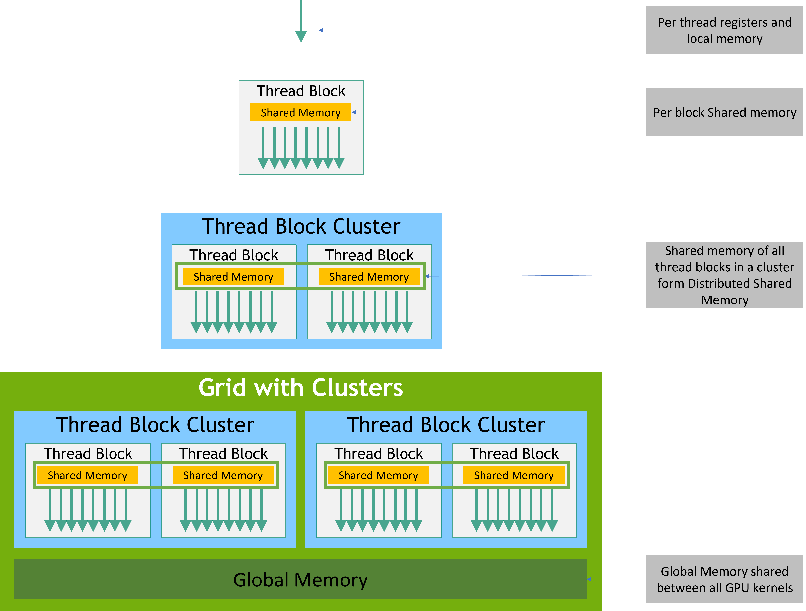

Memory Hierarchy

## 2.4. Heterogeneous Programming

As illustrated by [Figure 7](index.md#heterogeneous-programming-heterogeneous-programming), the CUDA programming model assumes that the CUDA threads execute on a physically separate *device* that operates as a coprocessor to the *host* running the C++ program. This is the case, for example, when the kernels execute on a GPU and the rest of the C++ program executes on a CPU.

The CUDA programming model also assumes that both the host and the device maintain their own separate memory spaces in DRAM, referred to as *host memory* and *device memory*, respectively. Therefore, a program manages the global, constant, and texture memory spaces visible to kernels through calls to the CUDA runtime (described in [Programming Interface](index.md#programming-interface)). This includes device memory allocation and deallocation as well as data transfer between host and device memory.

Unified Memory provides *managed memory* to bridge the host and device memory spaces. Managed memory is accessible from all CPUs and GPUs in the system as a single, coherent memory image with a common address space. This capability enables oversubscription of device memory and can greatly simplify the task of porting applications by eliminating the need to explicitly mirror data on host and device. See [Unified Memory Programming](index.md#um-unified-memory-programming-hd) for an introduction to Unified Memory.


Heterogeneous Programming

Note

Serial code executes on the host while parallel code executes on the device.

## 2.5. Asynchronous SIMT Programming Model

In the CUDA programming model a thread is the lowest level of abstraction for doing a computation or a memory operation. Starting with devices based on the NVIDIA Ampere GPU architecture, the CUDA programming model provides acceleration to memory operations via the asynchronous programming model. The asynchronous programming model defines the behavior of asynchronous operations with respect to CUDA threads.

The asynchronous programming model defines the behavior of [Asynchronous Barrier](index.md#aw-barrier) for synchronization between CUDA threads. The model also explains and defines how [cuda::memcpy\_async](index.md#asynchronous-data-copies) can be used to move data asynchronously from global memory while computing in the GPU.

### 2.5.1. Asynchronous Operations

An asynchronous operation is defined as an operation that is initiated by a CUDA thread and is executed asynchronously as-if by another thread. In a well formed program one or more CUDA threads synchronize with the asynchronous operation. The CUDA thread that initiated the asynchronous operation is not required to be among the synchronizing threads.

Such an asynchronous thread (an as-if thread) is always associated with the CUDA thread that initiated the asynchronous operation. An asynchronous operation uses a synchronization object to synchronize the completion of the operation. Such a synchronization object can be explicitly managed by a user (e.g., `cuda::memcpy_async`) or implicitly managed within a library (e.g., `cooperative_groups::memcpy_async`).

A synchronization object could be a `cuda::barrier` or a `cuda::pipeline`. These objects are explained in detail in [Asynchronous Barrier](index.md#aw-barrier) and [Asynchronous Data Copies using cuda::pipeline](index.md#asynchronous-data-copies). These synchronization objects can be used at different thread scopes. A scope defines the set of threads that may use the synchronization object to synchronize with the asynchronous operation. The following table defines the thread scopes available in CUDA C++ and the threads that can be synchronized with each.

| Thread Scope | Description |
| --- | --- |
| `cuda::thread_scope::thread_scope_thread` | Only the CUDA thread which initiated asynchronous operations synchronizes. |
| `cuda::thread_scope::thread_scope_block` | All or any CUDA threads within the same thread block as the initiating thread synchronizes. |
| `cuda::thread_scope::thread_scope_device` | All or any CUDA threads in the same GPU device as the initiating thread synchronizes. |
| `cuda::thread_scope::thread_scope_system` | All or any CUDA or CPU threads in the same system as the initiating thread synchronizes. |

These thread scopes are implemented as extensions to standard C++ in the [CUDA Standard C++](https://nvidia.github.io/libcudacxx/extended_api/thread_scopes.html) library.

## 2.6. Compute Capability

The *compute capability* of a device is represented by a version number, also sometimes called its “SM version”. This version number identifies the features supported by the GPU hardware and is used by applications at runtime to determine which hardware features and/or instructions are available on the present GPU.

The compute capability comprises a major revision number *X* and a minor revision number *Y* and is denoted by *X.Y*.

Devices with the same major revision number are of the same core architecture. The major revision number is 9 for devices based on the *NVIDIA Hopper GPU* architecture, 8 for devices based on the *NVIDIA Ampere GPU* architecture, 7 for devices based on the *Volta* architecture, 6 for devices based on the *Pascal* architecture, 5 for devices based on the *Maxwell* architecture, and 3 for devices based on the *Kepler* architecture.

The minor revision number corresponds to an incremental improvement to the core architecture, possibly including new features.

*Turing* is the architecture for devices of compute capability 7.5, and is an incremental update based on the *Volta* architecture.

[CUDA-Enabled GPUs](index.md#cuda-enabled-gpus) lists of all CUDA-enabled devices along with their compute capability. [Compute Capabilities](index.md#compute-capabilities) gives the technical specifications of each compute capability.

Note

The compute capability version of a particular GPU should not be confused with the CUDA version (for example, CUDA 7.5, CUDA 8, CUDA 9), which is the version of the CUDA *software platform*. The CUDA platform is used by application developers to create applications that run on many generations of GPU architectures, including future GPU architectures yet to be invented. While new versions of the CUDA platform often add native support for a new GPU architecture by supporting the compute capability version of that architecture, new versions of the CUDA platform typically also include software features that are independent of hardware generation.

The *Tesla* and *Fermi* architectures are no longer supported starting with CUDA 7.0 and CUDA 9.0, respectively.

# 3. Programming Interface

CUDA C++ provides a simple path for users familiar with the C++ programming language to easily write programs for execution by the device.

It consists of a minimal set of extensions to the C++ language and a runtime library.

The core language extensions have been introduced in [Programming Model](index.md#programming-model). They allow programmers to define a kernel as a C++ function and use some new syntax to specify the grid and block dimension each time the function is called. A complete description of all extensions can be found in [C++ Language Extensions](index.md#c-language-extensions). Any source file that contains some of these extensions must be compiled with `nvcc` as outlined in [Compilation with NVCC](index.md#compilation-with-nvcc).

The runtime is introduced in [CUDA Runtime](index.md#cuda-c-runtime). It provides C and C++ functions that execute on the host to allocate and deallocate device memory, transfer data between host memory and device memory, manage systems with multiple devices, etc. A complete description of the runtime can be found in the CUDA reference manual.

The runtime is built on top of a lower-level C API, the CUDA driver API, which is also accessible by the application. The driver API provides an additional level of control by exposing lower-level concepts such as CUDA contexts - the analogue of host processes for the device - and CUDA modules - the analogue of dynamically loaded libraries for the device. Most applications do not use the driver API as they do not need this additional level of control and when using the runtime, context and module management are implicit, resulting in more concise code. As the runtime is interoperable with the driver API, most applications that need some driver API features can default to use the runtime API and only use the driver API where needed. The driver API is introduced in [Driver API](index.md#driver-api) and fully described in the reference manual.

## 3.1. Compilation with NVCC

Kernels can be written using the CUDA instruction set architecture, called *PTX*, which is described in the PTX reference manual. It is however usually more effective to use a high-level programming language such as C++. In both cases, kernels must be compiled into binary code by `nvcc` to execute on the device.

`nvcc` is a compiler driver that simplifies the process of compiling *C++* or *PTX* code: It provides simple and familiar command line options and executes them by invoking the collection of tools that implement the different compilation stages. This section gives an overview of `nvcc` workflow and command options. A complete description can be found in the `nvcc` user manual.

### 3.1.1. Compilation Workflow

#### 3.1.1.1. Offline Compilation

Source files compiled with `nvcc` can include a mix of host code (i.e., code that executes on the host) and device code (i.e., code that executes on the device). `nvcc`’s basic workflow consists in separating device code from host code and then:

* compiling the device code into an assembly form (*PTX* code) and/or binary form (*cubin* object),
* and modifying the host code by replacing the `<<<...>>>` syntax introduced in [Kernels](index.md#kernels) (and described in more details in [Execution Configuration](index.md#execution-configuration)) by the necessary CUDA runtime function calls to load and launch each compiled kernel from the *PTX* code and/or *cubin* object.

The modified host code is output either as C++ code that is left to be compiled using another tool or as object code directly by letting `nvcc` invoke the host compiler during the last compilation stage.

Applications can then:

* Either link to the compiled host code (this is the most common case),
* Or ignore the modified host code (if any) and use the CUDA driver API (see [Driver API](index.md#driver-api)) to load and execute the *PTX* code or *cubin* object.

#### 3.1.1.2. Just-in-Time Compilation

Any *PTX* code loaded by an application at runtime is compiled further to binary code by the device driver. This is called *just-in-time compilation*. Just-in-time compilation increases application load time, but allows the application to benefit from any new compiler improvements coming with each new device driver. It is also the only way for applications to run on devices that did not exist at the time the application was compiled, as detailed in [Application Compatibility](index.md#application-compatibility).

When the device driver just-in-time compiles some *PTX* code for some application, it automatically caches a copy of the generated binary code in order to avoid repeating the compilation in subsequent invocations of the application. The cache - referred to as *compute cache* - is automatically invalidated when the device driver is upgraded, so that applications can benefit from the improvements in the new just-in-time compiler built into the device driver.

Environment variables are available to control just-in-time compilation as described in [CUDA Environment Variables](index.md#env-vars)

As an alternative to using `nvcc` to compile CUDA C++ device code, NVRTC can be used to compile CUDA C++ device code to PTX at runtime. NVRTC is a runtime compilation library for CUDA C++; more information can be found in the NVRTC User guide.

### 3.1.2. Binary Compatibility

Binary code is architecture-specific. A *cubin* object is generated using the compiler option `-code` that specifies the targeted architecture: For example, compiling with `-code=sm_80` produces binary code for devices of [compute capability](index.md#compute-capability) 8.0. Binary compatibility is guaranteed from one minor revision to the next one, but not from one minor revision to the previous one or across major revisions. In other words, a *cubin* object generated for compute capability *X.y* will only execute on devices of compute capability *X.z* where *z≥y*.

Note

Binary compatibility is supported only for the desktop. It is not supported for Tegra. Also, the binary compatibility between desktop and Tegra is not supported.

### 3.1.3. PTX Compatibility

Some *PTX* instructions are only supported on devices of higher compute capabilities. For example, [Warp Shuffle Functions](index.md#warp-shuffle-functions) are only supported on devices of compute capability 5.0 and above. The `-arch` compiler option specifies the compute capability that is assumed when compiling C++ to *PTX* code. So, code that contains warp shuffle, for example, must be compiled with `-arch=compute_50` (or higher).

*PTX* code produced for some specific compute capability can always be compiled to binary code of greater or equal compute capability. Note that a binary compiled from an earlier PTX version may not make use of some hardware features. For example, a binary targeting devices of compute capability 7.0 (Volta) compiled from PTX generated for compute capability 6.0 (Pascal) will not make use of Tensor Core instructions, since these were not available on Pascal. As a result, the final binary may perform worse than would be possible if the binary were generated using the latest version of PTX.

### 3.1.4. Application Compatibility

To execute code on devices of specific compute capability, an application must load binary or *PTX* code that is compatible with this compute capability as described in [Binary Compatibility](index.md#binary-compatibility) and [PTX Compatibility](index.md#ptx-compatibility). In particular, to be able to execute code on future architectures with higher compute capability (for which no binary code can be generated yet), an application must load *PTX* code that will be just-in-time compiled for these devices (see [Just-in-Time Compilation](index.md#just-in-time-compilation)).

Which *PTX* and binary code gets embedded in a CUDA C++ application is controlled by the `-arch` and `-code` compiler options or the `-gencode` compiler option as detailed in the `nvcc` user manual. For example,

```
nvcc x.cu
        -gencode arch=compute_50,code=sm_50
        -gencode arch=compute_60,code=sm_60
        -gencode arch=compute_70,code=\"compute_70,sm_70\"
```

embeds binary code compatible with compute capability 5.0 and 6.0 (first and second `-gencode` options) and *PTX* and binary code compatible with compute capability 7.0 (third `-gencode` option).

Host code is generated to automatically select at runtime the most appropriate code to load and execute, which, in the above example, will be:

* 5.0 binary code for devices with compute capability 5.0 and 5.2,
* 6.0 binary code for devices with compute capability 6.0 and 6.1,
* 7.0 binary code for devices with compute capability 7.0 and 7.5,
* *PTX* code which is compiled to binary code at runtime for devices with compute capability 8.0 and 8.6.

`x.cu` can have an optimized code path that uses warp reduction operations, for example, which are only supported in devices of compute capability 8.0 and higher. The `__CUDA_ARCH__` macro can be used to differentiate various code paths based on compute capability. It is only defined for device code. When compiling with `-arch=compute_80` for example, `__CUDA_ARCH__` is equal to `800`.

Applications using the driver API must compile code to separate files and explicitly load and execute the most appropriate file at runtime.

The Volta architecture introduces *Independent Thread Scheduling* which changes the way threads are scheduled on the GPU. For code relying on specific behavior of [SIMT scheduling](index.md#simt-architecture) in previous architectures, Independent Thread Scheduling may alter the set of participating threads, leading to incorrect results. To aid migration while implementing the corrective actions detailed in [Independent Thread Scheduling](index.md#independent-thread-scheduling-7-x), Volta developers can opt-in to Pascal’s thread scheduling with the compiler option combination `-arch=compute_60 -code=sm_70`.

The `nvcc` user manual lists various shorthands for the `-arch`, `-code`, and `-gencode` compiler options. For example, `-arch=sm_70` is a shorthand for `-arch=compute_70 -code=compute_70,sm_70` (which is the same as `-gencode arch=compute_70,code=\"compute_70,sm_70\"`).

### 3.1.5. C++ Compatibility

The front end of the compiler processes CUDA source files according to C++ syntax rules. Full C++ is supported for the host code. However, only a subset of C++ is fully supported for the device code as described in [C++ Language Support](index.md#c-cplusplus-language-support).

### 3.1.6. 64-Bit Compatibility

The 64-bit version of `nvcc` compiles device code in 64-bit mode (i.e., pointers are 64-bit). Device code compiled in 64-bit mode is only supported with host code compiled in 64-bit mode.

## 3.2. CUDA Runtime

The runtime is implemented in the `cudart` library, which is linked to the application, either statically via `cudart.lib` or `libcudart.a`, or dynamically via `cudart.dll` or `libcudart.so`. Applications that require `cudart.dll` and/or `cudart.so` for dynamic linking typically include them as part of the application installation package. It is only safe to pass the address of CUDA runtime symbols between components that link to the same instance of the CUDA runtime.

All its entry points are prefixed with `cuda`.

As mentioned in [Heterogeneous Programming](index.md#heterogeneous-programming), the CUDA programming model assumes a system composed of a host and a device, each with their own separate memory. [Device Memory](index.md#device-memory) gives an overview of the runtime functions used to manage device memory.

[Shared Memory](index.md#shared-memory) illustrates the use of shared memory, introduced in [Thread Hierarchy](index.md#thread-hierarchy), to maximize performance.

[Page-Locked Host Memory](index.md#page-locked-host-memory) introduces page-locked host memory that is required to overlap kernel execution with data transfers between host and device memory.

[Asynchronous Concurrent Execution](index.md#asynchronous-concurrent-execution) describes the concepts and API used to enable asynchronous concurrent execution at various levels in the system.

[Multi-Device System](index.md#multi-device-system) shows how the programming model extends to a system with multiple devices attached to the same host.

[Error Checking](index.md#error-checking) describes how to properly check the errors generated by the runtime.

[Call Stack](index.md#call-stack) mentions the runtime functions used to manage the CUDA C++ call stack.

[Texture and Surface Memory](index.md#texture-and-surface-memory) presents the texture and surface memory spaces that provide another way to access device memory; they also expose a subset of the GPU texturing hardware.

[Graphics Interoperability](index.md#graphics-interoperability) introduces the various functions the runtime provides to interoperate with the two main graphics APIs, OpenGL and Direct3D.

### 3.2.1. Initialization

As of CUDA 12.0, the `cudaInitDevice()` and `cudaSetDevice()` calls initialize the runtime and the primary context associated with the specified device. Absent these calls, the runtime will implicitly use device 0 and self-initialize as needed to process other runtime API requests. One needs to keep this in mind when timing runtime function calls and when interpreting the error code from the first call into the runtime. Before 12.0, `cudaSetDevice()` would not initialize the runtime and applications would often use the no-op runtime call `cudaFree(0)` to isolate the runtime initialization from other api activity (both for the sake of timing and error handling).

The runtime creates a CUDA context for each device in the system (see [Context](index.md#context) for more details on CUDA contexts). This context is the *primary context* for this device and is initialized at the first runtime function which requires an active context on this device. It is shared among all the host threads of the application. As part of this context creation, the device code is just-in-time compiled if necessary (see [Just-in-Time Compilation](index.md#just-in-time-compilation)) and loaded into device memory. This all happens transparently. If needed, for example, for driver API interoperability, the primary context of a device can be accessed from the driver API as described in [Interoperability between Runtime and Driver APIs](index.md#interoperability-between-runtime-and-driver-apis).

When a host thread calls `cudaDeviceReset()`, this destroys the primary context of the device the host thread currently operates on (i.e., the current device as defined in [Device Selection](index.md#device-selection)). The next runtime function call made by any host thread that has this device as current will create a new primary context for this device.

Note

The CUDA interfaces use global state that is initialized during host program initiation and destroyed during host program termination. The CUDA runtime and driver cannot detect if this state is invalid, so using any of these interfaces (implicitly or explicitly) during program initiation or termination after main) will result in undefined behavior.

As of CUDA 12.0, `cudaSetDevice()` will now explicitly initialize the runtime after changing the current device for the host thread. Previous versions of CUDA delayed runtime initialization on the new device until the first runtime call was made after `cudaSetDevice()`. This change means that it is now very important to check the return value of `cudaSetDevice()` for initialization errors.

The runtime functions from the error handling and version management sections of the reference manual do not initialize the runtime.

### 3.2.2. Device Memory

As mentioned in [Heterogeneous Programming](index.md#heterogeneous-programming), the CUDA programming model assumes a system composed of a host and a device, each with their own separate memory. Kernels operate out of device memory, so the runtime provides functions to allocate, deallocate, and copy device memory, as well as transfer data between host memory and device memory.

Device memory can be allocated either as *linear memory* or as *CUDA arrays*.

CUDA arrays are opaque memory layouts optimized for texture fetching. They are described in [Texture and Surface Memory](index.md#texture-and-surface-memory).

Linear memory is allocated in a single unified address space, which means that separately allocated entities can reference one another via pointers, for example, in a binary tree or linked list. The size of the address space depends on the host system (CPU) and the compute capability of the used GPU:

Table 1. Linear Memory Address Space

|  | x86\_64 (AMD64) | POWER (ppc64le) | ARM64 |
| --- | --- | --- | --- |
| up to compute capability 5.3 (Maxwell) | 40bit | 40bit | 40bit |
| compute capability 6.0 (Pascal) or newer | up to 47bit | up to 49bit | up to 48bit |

Note

On devices of compute capability 5.3 (Maxwell) and earlier, the CUDA driver creates an uncommitted 40bit virtual address reservation to ensure that memory allocations (pointers) fall into the supported range. This reservation appears as reserved virtual memory, but does not occupy any physical memory until the program actually allocates memory.

Linear memory is typically allocated using `cudaMalloc()` and freed using `cudaFree()` and data transfer between host memory and device memory are typically done using `cudaMemcpy()`. In the vector addition code sample of [Kernels](index.md#kernels), the vectors need to be copied from host memory to device memory:

```
// Device code
__global__ void VecAdd(float* A, float* B, float* C, int N)
{
    int i = blockDim.x * blockIdx.x + threadIdx.x;
    if (i < N)
        C[i] = A[i] + B[i];
}

// Host code
int main()
{
    int N = ...;
    size_t size = N * sizeof(float);

    // Allocate input vectors h_A and h_B in host memory
    float* h_A = (float*)malloc(size);
    float* h_B = (float*)malloc(size);
    float* h_C = (float*)malloc(size);

    // Initialize input vectors
    ...

    // Allocate vectors in device memory
    float* d_A;
    cudaMalloc(&d_A, size);
    float* d_B;
    cudaMalloc(&d_B, size);
    float* d_C;
    cudaMalloc(&d_C, size);

    // Copy vectors from host memory to device memory
    cudaMemcpy(d_A, h_A, size, cudaMemcpyHostToDevice);
    cudaMemcpy(d_B, h_B, size, cudaMemcpyHostToDevice);

    // Invoke kernel
    int threadsPerBlock = 256;
    int blocksPerGrid =
            (N + threadsPerBlock - 1) / threadsPerBlock;
    VecAdd<<<blocksPerGrid, threadsPerBlock>>>(d_A, d_B, d_C, N);

    // Copy result from device memory to host memory
    // h_C contains the result in host memory
    cudaMemcpy(h_C, d_C, size, cudaMemcpyDeviceToHost);

    // Free device memory
    cudaFree(d_A);
    cudaFree(d_B);
    cudaFree(d_C);

    // Free host memory
    ...
}
```

Linear memory can also be allocated through `cudaMallocPitch()` and `cudaMalloc3D()`. These functions are recommended for allocations of 2D or 3D arrays as it makes sure that the allocation is appropriately padded to meet the alignment requirements described in [Device Memory Accesses](index.md#device-memory-accesses), therefore ensuring best performance when accessing the row addresses or performing copies between 2D arrays and other regions of device memory (using the `cudaMemcpy2D()` and `cudaMemcpy3D()` functions). The returned pitch (or stride) must be used to access array elements. The following code sample allocates a `width` x `height` 2D array of floating-point values and shows how to loop over the array elements in device code:

```
// Host code
int width = 64, height = 64;
float* devPtr;
size_t pitch;
cudaMallocPitch(&devPtr, &pitch,
                width * sizeof(float), height);
MyKernel<<<100, 512>>>(devPtr, pitch, width, height);

// Device code
__global__ void MyKernel(float* devPtr,
                         size_t pitch, int width, int height)
{
    for (int r = 0; r < height; ++r) {
        float* row = (float*)((char*)devPtr + r * pitch);
        for (int c = 0; c < width; ++c) {
            float element = row[c];
        }
    }
}
```

The following code sample allocates a `width` x `height` x `depth` 3D array of floating-point values and shows how to loop over the array elements in device code:

```
// Host code
int width = 64, height = 64, depth = 64;
cudaExtent extent = make_cudaExtent(width * sizeof(float),
                                    height, depth);
cudaPitchedPtr devPitchedPtr;
cudaMalloc3D(&devPitchedPtr, extent);
MyKernel<<<100, 512>>>(devPitchedPtr, width, height, depth);

// Device code
__global__ void MyKernel(cudaPitchedPtr devPitchedPtr,
                         int width, int height, int depth)
{
    char* devPtr = devPitchedPtr.ptr;
    size_t pitch = devPitchedPtr.pitch;
    size_t slicePitch = pitch * height;
    for (int z = 0; z < depth; ++z) {
        char* slice = devPtr + z * slicePitch;
        for (int y = 0; y < height; ++y) {
            float* row = (float*)(slice + y * pitch);
            for (int x = 0; x < width; ++x) {
                float element = row[x];
            }
        }
    }
}
```

Note

To avoid allocating too much memory and thus impacting system-wide performance, request the allocation parameters from the user based on the problem size. If the allocation fails, you can fallback to other slower memory types (`cudaMallocHost()`, `cudaHostRegister()`, etc.), or return an error telling the user how much memory was needed that was denied. If your application cannot request the allocation parameters for some reason, we recommend using `cudaMallocManaged()` for platforms that support it.

The reference manual lists all the various functions used to copy memory between linear memory allocated with `cudaMalloc()`, linear memory allocated with `cudaMallocPitch()` or `cudaMalloc3D()`, CUDA arrays, and memory allocated for variables declared in global or constant memory space.

The following code sample illustrates various ways of accessing global variables via the runtime API:

```
__constant__ float constData[256];
float data[256];
cudaMemcpyToSymbol(constData, data, sizeof(data));
cudaMemcpyFromSymbol(data, constData, sizeof(data));

__device__ float devData;
float value = 3.14f;
cudaMemcpyToSymbol(devData, &value, sizeof(float));

__device__ float* devPointer;
float* ptr;
cudaMalloc(&ptr, 256 * sizeof(float));
cudaMemcpyToSymbol(devPointer, &ptr, sizeof(ptr));
```

`cudaGetSymbolAddress()` is used to retrieve the address pointing to the memory allocated for a variable declared in global memory space. The size of the allocated memory is obtained through `cudaGetSymbolSize()`.

### 3.2.3. Device Memory L2 Access Management

When a CUDA kernel accesses a data region in the global memory repeatedly, such data accesses can be considered to be *persisting*. On the other hand, if the data is only accessed once, such data accesses can be considered to be *streaming*.

Starting with CUDA 11.0, devices of compute capability 8.0 and above have the capability to influence persistence of data in the L2 cache, potentially providing higher bandwidth and lower latency accesses to global memory.

#### 3.2.3.1. L2 cache Set-Aside for Persisting Accesses

A portion of the L2 cache can be set aside to be used for persisting data accesses to global memory. Persisting accesses have prioritized use of this set-aside portion of L2 cache, whereas normal or streaming, accesses to global memory can only utilize this portion of L2 when it is unused by persisting accesses.

The L2 cache set-aside size for persisting accesses may be adjusted, within limits:

```
cudaGetDeviceProperties(&prop, device_id);
size_t size = min(int(prop.l2CacheSize * 0.75), prop.persistingL2CacheMaxSize);
cudaDeviceSetLimit(cudaLimitPersistingL2CacheSize, size); /* set-aside 3/4 of L2 cache for persisting accesses or the max allowed*/
```

When the GPU is configured in Multi-Instance GPU (MIG) mode, the L2 cache set-aside functionality is disabled.

When using the Multi-Process Service (MPS), the L2 cache set-aside size cannot be changed by `cudaDeviceSetLimit`. Instead, the set-aside size can only be specified at start up of MPS server through the environment variable `CUDA_DEVICE_DEFAULT_PERSISTING_L2_CACHE_PERCENTAGE_LIMIT`.

#### 3.2.3.2. L2 Policy for Persisting Accesses

An access policy window specifies a contiguous region of global memory and a persistence property in the L2 cache for accesses within that region.

The code example below shows how to set an L2 persisting access window using a CUDA Stream.

**CUDA Stream Example**

```
cudaStreamAttrValue stream_attribute;                                         // Stream level attributes data structure
stream_attribute.accessPolicyWindow.base_ptr  = reinterpret_cast<void*>(ptr); // Global Memory data pointer
stream_attribute.accessPolicyWindow.num_bytes = num_bytes;                    // Number of bytes for persistence access.
                                                                              // (Must be less than cudaDeviceProp::accessPolicyMaxWindowSize)
stream_attribute.accessPolicyWindow.hitRatio  = 0.6;                          // Hint for cache hit ratio
stream_attribute.accessPolicyWindow.hitProp   = cudaAccessPropertyPersisting; // Type of access property on cache hit
stream_attribute.accessPolicyWindow.missProp  = cudaAccessPropertyStreaming;  // Type of access property on cache miss.

//Set the attributes to a CUDA stream of type cudaStream_t
cudaStreamSetAttribute(stream, cudaStreamAttributeAccessPolicyWindow, &stream_attribute);
```

When a kernel subsequently executes in CUDA `stream`, memory accesses within the global memory extent `[ptr..ptr+num_bytes)` are more likely to persist in the L2 cache than accesses to other global memory locations.

L2 persistence can also be set for a CUDA Graph Kernel Node as shown in the example below:

**CUDA GraphKernelNode Example**

```
cudaKernelNodeAttrValue node_attribute;                                     // Kernel level attributes data structure
node_attribute.accessPolicyWindow.base_ptr  = reinterpret_cast<void*>(ptr); // Global Memory data pointer
node_attribute.accessPolicyWindow.num_bytes = num_bytes;                    // Number of bytes for persistence access.
                                                                            // (Must be less than cudaDeviceProp::accessPolicyMaxWindowSize)
node_attribute.accessPolicyWindow.hitRatio  = 0.6;                          // Hint for cache hit ratio
node_attribute.accessPolicyWindow.hitProp   = cudaAccessPropertyPersisting; // Type of access property on cache hit
node_attribute.accessPolicyWindow.missProp  = cudaAccessPropertyStreaming;  // Type of access property on cache miss.

//Set the attributes to a CUDA Graph Kernel node of type cudaGraphNode_t
cudaGraphKernelNodeSetAttribute(node, cudaKernelNodeAttributeAccessPolicyWindow, &node_attribute);
```

The `hitRatio` parameter can be used to specify the fraction of accesses that receive the `hitProp` property. In both of the examples above, 60% of the memory accesses in the global memory region `[ptr..ptr+num_bytes)` have the persisting property and 40% of the memory accesses have the streaming property. Which specific memory accesses are classified as persisting (the `hitProp`) is random with a probability of approximately `hitRatio`; the probability distribution depends upon the hardware architecture and the memory extent.

For example, if the L2 set-aside cache size is 16KB and the `num_bytes` in the `accessPolicyWindow` is 32KB:

* With a `hitRatio` of 0.5, the hardware will select, at random, 16KB of the 32KB window to be designated as persisting and cached in the set-aside L2 cache area.
* With a `hitRatio` of 1.0, the hardware will attempt to cache the whole 32KB window in the set-aside L2 cache area. Since the set-aside area is smaller than the window, cache lines will be evicted to keep the most recently used 16KB of the 32KB data in the set-aside portion of the L2 cache.

The `hitRatio` can therefore be used to avoid thrashing of cache lines and overall reduce the amount of data moved into and out of the L2 cache.

A `hitRatio` value below 1.0 can be used to manually control the amount of data different `accessPolicyWindow`s from concurrent CUDA streams can cache in L2. For example, let the L2 set-aside cache size be 16KB; two concurrent kernels in two different CUDA streams, each with a 16KB `accessPolicyWindow`, and both with `hitRatio` value 1.0, might evict each others’ cache lines when competing for the shared L2 resource. However, if both `accessPolicyWindows` have a hitRatio value of 0.5, they will be less likely to evict their own or each others’ persisting cache lines.

#### 3.2.3.3. L2 Access Properties

Three types of access properties are defined for different global memory data accesses:

1. `cudaAccessPropertyStreaming`: Memory accesses that occur with the streaming property are less likely to persist in the L2 cache because these accesses are preferentially evicted.
2. `cudaAccessPropertyPersisting`: Memory accesses that occur with the persisting property are more likely to persist in the L2 cache because these accesses are preferentially retained in the set-aside portion of L2 cache.
3. `cudaAccessPropertyNormal`: This access property forcibly resets previously applied persisting access property to a normal status. Memory accesses with the persisting property from previous CUDA kernels may be retained in L2 cache long after their intended use. This persistence-after-use reduces the amount of L2 cache available to subsequent kernels that do not use the persisting property. Resetting an access property window with the `cudaAccessPropertyNormal` property removes the persisting (preferential retention) status of the prior access, as if the prior access had been without an access property.

#### 3.2.3.4. L2 Persistence Example

The following example shows how to set-aside L2 cache for persistent accesses, use the set-aside L2 cache in CUDA kernels via CUDA Stream and then reset the L2 cache.

```
cudaStream_t stream;
cudaStreamCreate(&stream);                                                                  // Create CUDA stream

cudaDeviceProp prop;                                                                        // CUDA device properties variable
cudaGetDeviceProperties( &prop, device_id);                                                 // Query GPU properties
size_t size = min( int(prop.l2CacheSize * 0.75) , prop.persistingL2CacheMaxSize );
cudaDeviceSetLimit( cudaLimitPersistingL2CacheSize, size);                                  // set-aside 3/4 of L2 cache for persisting accesses or the max allowed

size_t window_size = min(prop.accessPolicyMaxWindowSize, num_bytes);                        // Select minimum of user defined num_bytes and max window size.

cudaStreamAttrValue stream_attribute;                                                       // Stream level attributes data structure
stream_attribute.accessPolicyWindow.base_ptr  = reinterpret_cast<void*>(data1);               // Global Memory data pointer
stream_attribute.accessPolicyWindow.num_bytes = window_size;                                // Number of bytes for persistence access
stream_attribute.accessPolicyWindow.hitRatio  = 0.6;                                        // Hint for cache hit ratio
stream_attribute.accessPolicyWindow.hitProp   = cudaAccessPropertyPersisting;               // Persistence Property
stream_attribute.accessPolicyWindow.missProp  = cudaAccessPropertyStreaming;                // Type of access property on cache miss

cudaStreamSetAttribute(stream, cudaStreamAttributeAccessPolicyWindow, &stream_attribute);   // Set the attributes to a CUDA Stream

for(int i = 0; i < 10; i++) {
    cuda_kernelA<<<grid_size,block_size,0,stream>>>(data1);                                 // This data1 is used by a kernel multiple times
}                                                                                           // [data1 + num_bytes) benefits from L2 persistence
cuda_kernelB<<<grid_size,block_size,0,stream>>>(data1);                                     // A different kernel in the same stream can also benefit
                                                                                            // from the persistence of data1

stream_attribute.accessPolicyWindow.num_bytes = 0;                                          // Setting the window size to 0 disable it
cudaStreamSetAttribute(stream, cudaStreamAttributeAccessPolicyWindow, &stream_attribute);   // Overwrite the access policy attribute to a CUDA Stream
cudaCtxResetPersistingL2Cache();                                                            // Remove any persistent lines in L2

cuda_kernelC<<<grid_size,block_size,0,stream>>>(data2);                                     // data2 can now benefit from full L2 in normal mode
```

#### 3.2.3.5. Reset L2 Access to Normal

A persisting L2 cache line from a previous CUDA kernel may persist in L2 long after it has been used. Hence, a reset to normal for L2 cache is important for streaming or normal memory accesses to utilize the L2 cache with normal priority. There are three ways a persisting access can be reset to normal status.

1. Reset a previous persisting memory region with the access property, `cudaAccessPropertyNormal`.
2. Reset all persisting L2 cache lines to normal by calling `cudaCtxResetPersistingL2Cache()`.
3. **Eventually** untouched lines are automatically reset to normal. Reliance on automatic reset is strongly discouraged because of the undetermined length of time required for automatic reset to occur.

#### 3.2.3.6. Manage Utilization of L2 set-aside cache

Multiple CUDA kernels executing concurrently in different CUDA streams may have a different access policy window assigned to their streams. However, the L2 set-aside cache portion is shared among all these concurrent CUDA kernels. As a result, the net utilization of this set-aside cache portion is the sum of all the concurrent kernels’ individual use. The benefits of designating memory accesses as persisting diminish as the volume of persisting accesses exceeds the set-aside L2 cache capacity.

To manage utilization of the set-aside L2 cache portion, an application must consider the following:

* Size of L2 set-aside cache.
* CUDA kernels that may concurrently execute.
* The access policy window for all the CUDA kernels that may concurrently execute.
* When and how L2 reset is required to allow normal or streaming accesses to utilize the previously set-aside L2 cache with equal priority.

#### 3.2.3.7. Query L2 cache Properties

Properties related to L2 cache are a part of `cudaDeviceProp` struct and can be queried using CUDA runtime API `cudaGetDeviceProperties`

CUDA Device Properties include:

* `l2CacheSize`: The amount of available L2 cache on the GPU.
* `persistingL2CacheMaxSize`: The maximum amount of L2 cache that can be set-aside for persisting memory accesses.
* `accessPolicyMaxWindowSize`: The maximum size of the access policy window.

#### 3.2.3.8. Control L2 Cache Set-Aside Size for Persisting Memory Access

The L2 set-aside cache size for persisting memory accesses is queried using CUDA runtime API `cudaDeviceGetLimit` and set using CUDA runtime API `cudaDeviceSetLimit` as a `cudaLimit`. The maximum value for setting this limit is `cudaDeviceProp::persistingL2CacheMaxSize`.

```
enum cudaLimit {
    /* other fields not shown */
    cudaLimitPersistingL2CacheSize
};
```

### 3.2.4. Shared Memory

As detailed in [Variable Memory Space Specifiers](index.md#variable-memory-space-specifiers) shared memory is allocated using the `__shared__` memory space specifier.

Shared memory is expected to be much faster than global memory as mentioned in [Thread Hierarchy](index.md#thread-hierarchy) and detailed in [Shared Memory](index.md#shared-memory). It can be used as scratchpad memory (or software managed cache) to minimize global memory accesses from a CUDA block as illustrated by the following matrix multiplication example.

The following code sample is a straightforward implementation of matrix multiplication that does not take advantage of shared memory. Each thread reads one row of *A* and one column of *B* and computes the corresponding element of *C* as illustrated in [Figure 8](index.md#shared-memory-matrix-multiplication-no-shared-memory). *A* is therefore read *B.width* times from global memory and *B* is read *A.height* times.

```
// Matrices are stored in row-major order:
// M(row, col) = *(M.elements + row * M.width + col)
typedef struct {
    int width;
    int height;
    float* elements;
} Matrix;

// Thread block size
#define BLOCK_SIZE 16

// Forward declaration of the matrix multiplication kernel
__global__ void MatMulKernel(const Matrix, const Matrix, Matrix);

// Matrix multiplication - Host code
// Matrix dimensions are assumed to be multiples of BLOCK_SIZE
void MatMul(const Matrix A, const Matrix B, Matrix C)
{
    // Load A and B to device memory
    Matrix d_A;
    d_A.width = A.width; d_A.height = A.height;
    size_t size = A.width * A.height * sizeof(float);
    cudaMalloc(&d_A.elements, size);
    cudaMemcpy(d_A.elements, A.elements, size,
               cudaMemcpyHostToDevice);
    Matrix d_B;
    d_B.width = B.width; d_B.height = B.height;
    size = B.width * B.height * sizeof(float);
    cudaMalloc(&d_B.elements, size);
    cudaMemcpy(d_B.elements, B.elements, size,
               cudaMemcpyHostToDevice);

    // Allocate C in device memory
    Matrix d_C;
    d_C.width = C.width; d_C.height = C.height;
    size = C.width * C.height * sizeof(float);
    cudaMalloc(&d_C.elements, size);

    // Invoke kernel
    dim3 dimBlock(BLOCK_SIZE, BLOCK_SIZE);
    dim3 dimGrid(B.width / dimBlock.x, A.height / dimBlock.y);
    MatMulKernel<<<dimGrid, dimBlock>>>(d_A, d_B, d_C);

    // Read C from device memory
    cudaMemcpy(C.elements, d_C.elements, size,
               cudaMemcpyDeviceToHost);

    // Free device memory
    cudaFree(d_A.elements);
    cudaFree(d_B.elements);
    cudaFree(d_C.elements);
}

// Matrix multiplication kernel called by MatMul()
__global__ void MatMulKernel(Matrix A, Matrix B, Matrix C)
{
    // Each thread computes one element of C
    // by accumulating results into Cvalue
    float Cvalue = 0;
    int row = blockIdx.y * blockDim.y + threadIdx.y;
    int col = blockIdx.x * blockDim.x + threadIdx.x;
    for (int e = 0; e < A.width; ++e)
        Cvalue += A.elements[row * A.width + e]
                * B.elements[e * B.width + col];
    C.elements[row * C.width + col] = Cvalue;
}
```


Matrix Multiplication without Shared Memory

The following code sample is an implementation of matrix multiplication that does take advantage of shared memory. In this implementation, each thread block is responsible for computing one square sub-matrix *Csub* of *C* and each thread within the block is responsible for computing one element of *Csub*. As illustrated in [Figure 9](index.md#shared-memory-matrix-multiplication-shared-memory), *Csub* is equal to the product of two rectangular matrices: the sub-matrix of *A* of dimension (*A.width, block\_size*) that has the same row indices as *Csub*, and the sub-matrix of *B* of dimension (*block\_size, A.width* )that has the same column indices as *Csub*. In order to fit into the device’s resources, these two rectangular matrices are divided into as many square matrices of dimension *block\_size* as necessary and *Csub* is computed as the sum of the products of these square matrices. Each of these products is performed by first loading the two corresponding square matrices from global memory to shared memory with one thread loading one element of each matrix, and then by having each thread compute one element of the product. Each thread accumulates the result of each of these products into a register and once done writes the result to global memory.

By blocking the computation this way, we take advantage of fast shared memory and save a lot of global memory bandwidth since *A* is only read (*B.width / block\_size*) times from global memory and *B* is read (*A.height / block\_size*) times.

The *Matrix* type from the previous code sample is augmented with a *stride* field, so that sub-matrices can be efficiently represented with the same type. [\_\_device\_\_](index.md#device-function-specifier) functions are used to get and set elements and build any sub-matrix from a matrix.

```
// Matrices are stored in row-major order:
// M(row, col) = *(M.elements + row * M.stride + col)
typedef struct {
    int width;
    int height;
    int stride;
    float* elements;
} Matrix;
// Get a matrix element
__device__ float GetElement(const Matrix A, int row, int col)
{
    return A.elements[row * A.stride + col];
}
// Set a matrix element
__device__ void SetElement(Matrix A, int row, int col,
                           float value)
{
    A.elements[row * A.stride + col] = value;
}
// Get the BLOCK_SIZExBLOCK_SIZE sub-matrix Asub of A that is
// located col sub-matrices to the right and row sub-matrices down
// from the upper-left corner of A
 __device__ Matrix GetSubMatrix(Matrix A, int row, int col)
{
    Matrix Asub;
    Asub.width    = BLOCK_SIZE;
    Asub.height   = BLOCK_SIZE;
    Asub.stride   = A.stride;
    Asub.elements = &A.elements[A.stride * BLOCK_SIZE * row
                                         + BLOCK_SIZE * col];
    return Asub;
}
// Thread block size
#define BLOCK_SIZE 16
// Forward declaration of the matrix multiplication kernel
__global__ void MatMulKernel(const Matrix, const Matrix, Matrix);
// Matrix multiplication - Host code
// Matrix dimensions are assumed to be multiples of BLOCK_SIZE
void MatMul(const Matrix A, const Matrix B, Matrix C)
{
    // Load A and B to device memory
    Matrix d_A;
    d_A.width = d_A.stride = A.width; d_A.height = A.height;
    size_t size = A.width * A.height * sizeof(float);
    cudaMalloc(&d_A.elements, size);
    cudaMemcpy(d_A.elements, A.elements, size,
               cudaMemcpyHostToDevice);
    Matrix d_B;
    d_B.width = d_B.stride = B.width; d_B.height = B.height;
    size = B.width * B.height * sizeof(float);
    cudaMalloc(&d_B.elements, size);
    cudaMemcpy(d_B.elements, B.elements, size,
    cudaMemcpyHostToDevice);
    // Allocate C in device memory
    Matrix d_C;
    d_C.width = d_C.stride = C.width; d_C.height = C.height;
    size = C.width * C.height * sizeof(float);
    cudaMalloc(&d_C.elements, size);
    // Invoke kernel
    dim3 dimBlock(BLOCK_SIZE, BLOCK_SIZE);
    dim3 dimGrid(B.width / dimBlock.x, A.height / dimBlock.y);
    MatMulKernel<<<dimGrid, dimBlock>>>(d_A, d_B, d_C);
    // Read C from device memory
    cudaMemcpy(C.elements, d_C.elements, size,
               cudaMemcpyDeviceToHost);
    // Free device memory
    cudaFree(d_A.elements);
    cudaFree(d_B.elements);
    cudaFree(d_C.elements);
}
// Matrix multiplication kernel called by MatMul()
 __global__ void MatMulKernel(Matrix A, Matrix B, Matrix C)
{
    // Block row and column
    int blockRow = blockIdx.y;
    int blockCol = blockIdx.x;
    // Each thread block computes one sub-matrix Csub of C
    Matrix Csub = GetSubMatrix(C, blockRow, blockCol);
    // Each thread computes one element of Csub
    // by accumulating results into Cvalue
    float Cvalue = 0;
    // Thread row and column within Csub
    int row = threadIdx.y;
    int col = threadIdx.x;
    // Loop over all the sub-matrices of A and B that are
    // required to compute Csub
    // Multiply each pair of sub-matrices together
    // and accumulate the results
    for (int m = 0; m < (A.width / BLOCK_SIZE); ++m) {
        // Get sub-matrix Asub of A
        Matrix Asub = GetSubMatrix(A, blockRow, m);
        // Get sub-matrix Bsub of B
        Matrix Bsub = GetSubMatrix(B, m, blockCol);
        // Shared memory used to store Asub and Bsub respectively
        __shared__ float As[BLOCK_SIZE][BLOCK_SIZE];
        __shared__ float Bs[BLOCK_SIZE][BLOCK_SIZE];
        // Load Asub and Bsub from device memory to shared memory
        // Each thread loads one element of each sub-matrix
        As[row][col] = GetElement(Asub, row, col);
        Bs[row][col] = GetElement(Bsub, row, col);
        // Synchronize to make sure the sub-matrices are loaded
        // before starting the computation
        __syncthreads();
        // Multiply Asub and Bsub together
        for (int e = 0; e < BLOCK_SIZE; ++e)
            Cvalue += As[row][e] * Bs[e][col];
        // Synchronize to make sure that the preceding
        // computation is done before loading two new
        // sub-matrices of A and B in the next iteration
        __syncthreads();
    }
    // Write Csub to device memory
    // Each thread writes one element
    SetElement(Csub, row, col, Cvalue);
}
```


Matrix Multiplication with Shared Memory

### 3.2.5. Distributed Shared Memory

Thread block clusters introduced in compute capability 9.0 provide the ability for threads in a thread block cluster to access shared memory of all the participating thread blocks in a cluster. This partitioned shared memory is called *Distributed Shared Memory*, and the corresponding address space is called Distributed shared memory address space. Threads that belong to a thread block cluster, can read, write or perform atomics in the distributed address space, regardless whether the address belongs to the local thread block or a remote thread block. Whether a kernel uses distributed shared memory or not, the shared memory size specifications, static or dynamic is still per thread block. The size of distributed shared memory is just the number of thread blocks per cluster multiplied by the size of shared memory per thread block.

Accessing data in distributed shared memory requires all the thread blocks to exist. A user can guarantee that all thread blocks have started executing using `cluster.sync()` from [Cluster Group](index.md#cluster-group-cg) API.
The user also needs to ensure that all distributed shared memory operations happen before the exit of a thread block, e.g., if a remote thread block is trying to read a given thread block’s shared memory, user needs to ensure that the shared memory read by remote thread block is completed before it can exit.

CUDA provides a mechanism to access to distributed shared memory, and applications can benefit from leveraging its capabilities. Lets look at a simple histogram computation and how to optimize it on the GPU using thread block cluster. A standard way of computing histograms is do the computation in the shared memory of each thread block and then perform global memory atomics. A limitation of this approach is the shared memory capacity. Once the histogram bins no longer fit in the shared memory, a user needs to directly compute histograms and hence the atomics in the global memory. With distributed shared memory, CUDA provides an intermediate step, where a depending on the histogram bins size, histogram can be computed in shared memory, distributed shared memory or global memory directly.

The CUDA kernel example below shows how to compute histograms in shared memory or distributed shared memory, depending on the number of histogram bins.

```
#include <cooperative_groups.h>

// Distributed Shared memory histogram kernel
__global__ void clusterHist_kernel(int *bins, const int nbins, const int bins_per_block, const int *__restrict__ input,
                                   size_t array_size)
{
  extern __shared__ int smem[];
  namespace cg = cooperative_groups;
  int tid = cg::this_grid().thread_rank();

  // Cluster initialization, size and calculating local bin offsets.
  cg::cluster_group cluster = cg::this_cluster();
  unsigned int clusterBlockRank = cluster.block_rank();
  int cluster_size = cluster.dim_blocks().x;

  for (int i = threadIdx.x; i < bins_per_block; i += blockDim.x)
  {
    smem[i] = 0; //Initialize shared memory histogram to zeros
  }

  // cluster synchronization ensures that shared memory is initialized to zero in
  // all thread blocks in the cluster. It also ensures that all thread blocks
  // have started executing and they exist concurrently.
  cluster.sync();

  for (int i = tid; i < array_size; i += blockDim.x * gridDim.x)
  {
    int ldata = input[i];

    //Find the right histogram bin.
    int binid = ldata;
    if (ldata < 0)
      binid = 0;
    else if (ldata >= nbins)
      binid = nbins - 1;

    //Find destination block rank and offset for computing
    //distributed shared memory histogram
    int dst_block_rank = (int)(binid / bins_per_block);
    int dst_offset = binid % bins_per_block;

    //Pointer to target block shared memory
    int *dst_smem = cluster.map_shared_rank(smem, dst_block_rank);

    //Perform atomic update of the histogram bin
    atomicAdd(dst_smem + dst_offset, 1);
  }

  // cluster synchronization is required to ensure all distributed shared
  // memory operations are completed and no thread block exits while
  // other thread blocks are still accessing distributed shared memory
  cluster.sync();

  // Perform global memory histogram, using the local distributed memory histogram
  int *lbins = bins + cluster.block_rank() * bins_per_block;
  for (int i = threadIdx.x; i < bins_per_block; i += blockDim.x)
  {
    atomicAdd(&lbins[i], smem[i]);
  }
}
```

The above kernel can be launched at runtime with a cluster size depending on the amount of distributed shared memory required. If histogram is small enough to fit in shared memory of just one block, user can launch kernel with cluster size 1. The code snippet below shows how to launch a cluster kernel dynamically based depending on shared memory requirements.

```
// Launch via extensible launch
{
  cudaLaunchConfig_t config = {0};
  config.gridDim = array_size / threads_per_block;
  config.blockDim = threads_per_block;

  // cluster_size depends on the histogram size.
  // ( cluster_size == 1 ) implies no distributed shared memory, just thread block local shared memory
  int cluster_size = 2; // size 2 is an example here
  int nbins_per_block = nbins / cluster_size;

  //dynamic shared memory size is per block.
  //Distributed shared memory size =  cluster_size * nbins_per_block * sizeof(int)
  config.dynamicSmemBytes = nbins_per_block * sizeof(int);

  CUDA_CHECK(::cudaFuncSetAttribute((void *)clusterHist_kernel, cudaFuncAttributeMaxDynamicSharedMemorySize, config.dynamicSmemBytes));

  cudaLaunchAttribute attribute[1];
  attribute[0].id = cudaLaunchAttributeClusterDimension;
  attribute[0].val.clusterDim.x = cluster_size;
  attribute[0].val.clusterDim.y = 1;
  attribute[0].val.clusterDim.z = 1;

  config.numAttrs = 1;
  config.attrs = attribute;

  cudaLaunchKernelEx(&config, clusterHist_kernel, bins, nbins, nbins_per_block, input, array_size);
}
```

### 3.2.6. Page-Locked Host Memory

The runtime provides functions to allow the use of *page-locked* (also known as *pinned*) host memory (as opposed to regular pageable host memory allocated by `malloc()`):

* `cudaHostAlloc()` and `cudaFreeHost()` allocate and free page-locked host memory;
* `cudaHostRegister()` page-locks a range of memory allocated by `malloc()` (see reference manual for limitations).

Using page-locked host memory has several benefits:

* Copies between page-locked host memory and device memory can be performed concurrently with kernel execution for some devices as mentioned in [Asynchronous Concurrent Execution](index.md#asynchronous-concurrent-execution).
* On some devices, page-locked host memory can be mapped into the address space of the device, eliminating the need to copy it to or from device memory as detailed in [Mapped Memory](index.md#mapped-memory).
* On systems with a front-side bus, bandwidth between host memory and device memory is higher if host memory is allocated as page-locked and even higher if in addition it is allocated as write-combining as described in [Write-Combining Memory](index.md#write-combining-memory).

Note

Page-locked host memory is not cached on non I/O coherent Tegra devices. Also, `cudaHostRegister()` is not supported on non I/O coherent Tegra devices.

The simple zero-copy CUDA sample comes with a detailed document on the page-locked memory APIs.

#### 3.2.6.1. Portable Memory

A block of page-locked memory can be used in conjunction with any device in the system (see [Multi-Device System](index.md#multi-device-system) for more details on multi-device systems), but by default, the benefits of using page-locked memory described above are only available in conjunction with the device that was current when the block was allocated (and with all devices sharing the same unified address space, if any, as described in [Unified Virtual Address Space](index.md#unified-virtual-address-space)). To make these advantages available to all devices, the block needs to be allocated by passing the flag `cudaHostAllocPortable` to `cudaHostAlloc()` or page-locked by passing the flag `cudaHostRegisterPortable` to `cudaHostRegister()`.

#### 3.2.6.2. Write-Combining Memory

By default page-locked host memory is allocated as cacheable. It can optionally be allocated as *write-combining* instead by passing flag `cudaHostAllocWriteCombined` to `cudaHostAlloc()`. Write-combining memory frees up the host’s L1 and L2 cache resources, making more cache available to the rest of the application. In addition, write-combining memory is not snooped during transfers across the PCI Express bus, which can improve transfer performance by up to 40%.

Reading from write-combining memory from the host is prohibitively slow, so write-combining memory should in general be used for memory that the host only writes to.

Using CPU atomic instructions on WC memory should be avoided because not all CPU implementations guarantee that functionality.

#### 3.2.6.3. Mapped Memory

A block of page-locked host memory can also be mapped into the address space of the device by passing flag `cudaHostAllocMapped` to `cudaHostAlloc()` or by passing flag `cudaHostRegisterMapped` to `cudaHostRegister()`. Such a block has therefore in general two addresses: one in host memory that is returned by `cudaHostAlloc()` or `malloc()`, and one in device memory that can be retrieved using `cudaHostGetDevicePointer()` and then used to access the block from within a kernel. The only exception is for pointers allocated with `cudaHostAlloc()` and when a unified address space is used for the host and the device as mentioned in [Unified Virtual Address Space](index.md#unified-virtual-address-space).

Accessing host memory directly from within a kernel does not provide the same bandwidth as device memory, but does have some advantages:

* There is no need to allocate a block in device memory and copy data between this block and the block in host memory; data transfers are implicitly performed as needed by the kernel;
* There is no need to use streams (see [Concurrent Data Transfers](index.md#concurrent-data-transfers)) to overlap data transfers with kernel execution; the kernel-originated data transfers automatically overlap with kernel execution.

Since mapped page-locked memory is shared between host and device however, the application must synchronize memory accesses using streams or events (see [Asynchronous Concurrent Execution](index.md#asynchronous-concurrent-execution)) to avoid any potential read-after-write, write-after-read, or write-after-write hazards.

To be able to retrieve the device pointer to any mapped page-locked memory, page-locked memory mapping must be enabled by calling `cudaSetDeviceFlags()` with the `cudaDeviceMapHost` flag before any other CUDA call is performed. Otherwise, `cudaHostGetDevicePointer()` will return an error.

`cudaHostGetDevicePointer()` also returns an error if the device does not support mapped page-locked host memory. Applications may query this capability by checking the `canMapHostMemory` device property (see [Device Enumeration](index.md#device-enumeration)), which is equal to 1 for devices that support mapped page-locked host memory.

Note that atomic functions (see [Atomic Functions](index.md#atomic-functions)) operating on mapped page-locked memory are not atomic from the point of view of the host or other devices.

Also note that CUDA runtime requires that 1-byte, 2-byte, 4-byte, and 8-byte naturally aligned loads and stores to host memory initiated from the device are preserved as single accesses from the point of view of the host and other devices. On some platforms, atomics to memory may be broken by the hardware into separate load and store operations. These component load and store operations have the same requirements on preservation of naturally aligned accesses. As an example, the CUDA runtime does not support a PCI Express bus topology where a PCI Express bridge splits 8-byte naturally aligned writes into two 4-byte writes between the device and the host.

### 3.2.7. Memory Synchronization Domains

#### 3.2.7.1. Memory Fence Interference

Some CUDA applications may see degraded performance due to memory fence/flush operations waiting on more transactions than those necessitated by the CUDA memory consistency model.

|  |  |  |
| --- | --- | --- |
| ``` __managed__ int x = 0; __device__  cuda::atomic<int, cuda::thread_scope_device> a(0); __managed__ cuda::atomic<int, cuda::thread_scope_system> b(0); ``` |  |  |
| Thread 1 (SM)  ``` x = 1; a = 1; ``` | Thread 2 (SM)  ``` while (a != 1) ; assert(x == 1); b = 1; ``` | Thread 3 (CPU)  ``` while (b != 1) ; assert(x == 1); ``` |

Consider the example above. The CUDA memory consistency model guarantees that the asserted condition will be true, so the write to `x` from thread 1 must be visible to thread 3, before the write to `b` from thread 2.

The memory ordering provided by the release and acquire of `a` is only sufficient to make `x` visible to thread 2, not thread 3, as it is a device-scope operation. The system-scope ordering provided by release and acquire of `b`, therefore, needs to ensure not only writes issued from thread 2 itself are visible to thread 3, but also writes from other threads that are visible to thread 2. This is known as cumulativity. As the GPU cannot know at the time of execution which writes have been guaranteed at the source level to be visible and which are visible only by chance timing, it must cast a conservatively wide net for in-flight memory operations.

This sometimes leads to interference: because the GPU is waiting on memory operations it is not required to at the source level, the fence/flush may take longer than necessary.

Note that fences may occur explicitly as intrinsics or atomics in code, like in the example, or implicitly to implement *synchronizes-with* relationships at task boundaries.

A common example is when a kernel is performing computation in local GPU memory, and a parallel kernel (e.g. from NCCL) is performing communications with a peer. Upon completion, the local kernel will implicitly flush its writes to satisfy any *synchronizes-with* relationships to downstream work. This may unnecessarily wait, fully or partially, on slower nvlink or PCIe writes from the communication kernel.

#### 3.2.7.2. Isolating Traffic with Domains

Beginning with Hopper architecture GPUs and CUDA 12.0, the memory synchronization domains feature provides a way to alleviate such interference. In exchange for explicit assistance from code, the GPU can reduce the net cast by a fence operation. Each kernel launch is given a domain ID. Writes and fences are tagged with the ID, and a fence will only order writes matching the fence’s domain. In the concurrent compute vs communication example, the communication kernels can be placed in a different domain.

When using domains, code must abide by the rule that **ordering or synchronization between distinct domains on the same GPU requires system-scope fencing**. Within a domain, device-scope fencing remains sufficient. This is necessary for cumulativity as one kernel’s writes will not be encompassed by a fence issued from a kernel in another domain. In essence, cumulativity is satisfied by ensuring that cross-domain traffic is flushed to the system scope ahead of time.

Note that this modifies the definition of `thread_scope_device`. However, because kernels will default to domain 0 as described below, backward compatibility is maintained.

#### 3.2.7.3. Using Domains in CUDA

Domains are accessible via the new launch attributes `cudaLaunchAttributeMemSyncDomain` and `cudaLaunchAttributeMemSyncDomainMap`. The former selects between logical domains `cudaLaunchMemSyncDomainDefault` and `cudaLaunchMemSyncDomainRemote`, and the latter provides a mapping from logical to physical domains. The remote domain is intended for kernels performing remote memory access in order to isolate their memory traffic from local kernels. Note, however, the selection of a particular domain does not affect what memory access a kernel may legally perform.

The domain count can be queried via device attribute `cudaDevAttrMemSyncDomainCount`. Hopper has 4 domains. To facilitate portable code, domains functionality can be used on all devices and CUDA will report a count of 1 prior to Hopper.

Having logical domains eases application composition. An individual kernel launch at a low level in the stack, such as from NCCL, can select a semantic logical domain without concern for the surrounding application architecture. Higher levels can steer logical domains using the mapping. The default value for the logical domain if it is not set is the default domain, and the default mapping is to map the default domain to 0 and the remote domain to 1 (on GPUs with more than 1 domain). Specific libraries may tag launches with the remote domain in CUDA 12.0 and later; for example, NCCL 2.16 will do so. Together, this provides a beneficial use pattern for common applications out of the box, with no code changes needed in other components, frameworks, or at application level. An alternative use pattern, for example in an application using nvshmem or with no clear separation of kernel types, could be to partition parallel streams. Stream A may map both logical domains to physical domain 0, stream B to 1, and so on.

```
// Example of launching a kernel with the remote logical domain
cudaLaunchAttribute domainAttr;
domainAttr.id = cudaLaunchAttrMemSyncDomain;
domainAttr.val = cudaLaunchMemSyncDomainRemote;
cudaLaunchConfig_t config;
// Fill out other config fields
config.attrs = &domainAttr;
config.numAttrs = 1;
cudaLaunchKernelEx(&config, myKernel, kernelArg1, kernelArg2...);
```

```
// Example of setting a mapping for a stream
// (This mapping is the default for streams starting on Hopper if not
// explicitly set, and provided for illustration)
cudaLaunchAttributeValue mapAttr;
mapAttr.memSyncDomainMap.default_ = 0;
mapAttr.memSyncDomainMap.remote = 1;
cudaStreamSetAttribute(stream, cudaLaunchAttrMemSyncDomainMap, &mapAttr);
```

```
// Example of mapping different streams to different physical domains, ignoring
// logical domain settings
cudaLaunchAttributeValue mapAttr;
mapAttr.memSyncDomainMap.default_ = 0;
mapAttr.memSyncDomainMap.remote = 0;
cudaStreamSetAttribute(streamA, cudaLaunchAttrMemSyncDomainMap, &mapAttr);
mapAttr.memSyncDomainMap.default_ = 1;
mapAttr.memSyncDomainMap.remote = 1;
cudaStreamSetAttribute(streamB, cudaLaunchAttrMemSyncDomainMap, &mapAttr);
```

As with other launch attributes, these are exposed uniformly on CUDA streams, individual launches using `cudaLaunchKernelEx`, and kernel nodes in CUDA graphs. A typical use would set the mapping at stream level and the logical domain at launch level (or bracketing a section of stream use) as described above.

Both attributes are copied to graph nodes during stream capture. Graphs take both attributes from the node itself, essentially an indirect way of specifying a physical domain. Domain-related attributes set on the stream a graph is launched into are not used in execution of the graph.

### 3.2.8. Asynchronous Concurrent Execution

CUDA exposes the following operations as independent tasks that can operate concurrently with one another:

* Computation on the host;
* Computation on the device;
* Memory transfers from the host to the device;
* Memory transfers from the device to the host;
* Memory transfers within the memory of a given device;
* Memory transfers among devices.

The level of concurrency achieved between these operations will depend on the feature set and compute capability of the device as described below.

#### 3.2.8.1. Concurrent Execution between Host and Device

Concurrent host execution is facilitated through asynchronous library functions that return control to the host thread before the device completes the requested task. Using asynchronous calls, many device operations can be queued up together to be executed by the CUDA driver when appropriate device resources are available. This relieves the host thread of much of the responsibility to manage the device, leaving it free for other tasks. The following device operations are asynchronous with respect to the host:

* Kernel launches;
* Memory copies within a single device’s memory;
* Memory copies from host to device of a memory block of 64 KB or less;
* Memory copies performed by functions that are suffixed with `Async`;
* Memory set function calls.

Programmers can globally disable asynchronicity of kernel launches for all CUDA applications running on a system by setting the `CUDA_LAUNCH_BLOCKING` environment variable to 1. This feature is provided for debugging purposes only and should not be used as a way to make production software run reliably.

Kernel launches are synchronous if hardware counters are collected via a profiler (Nsight, Visual Profiler) unless concurrent kernel profiling is enabled. `Async` memory copies might also be synchronous if they involve host memory that is not page-locked.

#### 3.2.8.2. Concurrent Kernel Execution

Some devices of compute capability 2.x and higher can execute multiple kernels concurrently. Applications may query this capability by checking the `concurrentKernels` device property (see [Device Enumeration](index.md#device-enumeration)), which is equal to 1 for devices that support it.

The maximum number of kernel launches that a device can execute concurrently depends on its compute capability and is listed in [Table 15](index.md#features-and-technical-specifications-technical-specifications-per-compute-capability).

A kernel from one CUDA context cannot execute concurrently with a kernel from another CUDA context. The GPU may time slice to provide forward progress to each context. If a user wants to run kernels from multiple process simultaneously on the SM, one must enable MPS.

Kernels that use many textures or a large amount of local memory are less likely to execute concurrently with other kernels.

#### 3.2.8.3. Overlap of Data Transfer and Kernel Execution

Some devices can perform an asynchronous memory copy to or from the GPU concurrently with kernel execution. Applications may query this capability by checking the `asyncEngineCount` device property (see [Device Enumeration](index.md#device-enumeration)), which is greater than zero for devices that support it. If host memory is involved in the copy, it must be page-locked.

It is also possible to perform an intra-device copy simultaneously with kernel execution (on devices that support the `concurrentKernels` device property) and/or with copies to or from the device (for devices that support the `asyncEngineCount` property). Intra-device copies are initiated using the standard memory copy functions with destination and source addresses residing on the same device.

#### 3.2.8.4. Concurrent Data Transfers

Some devices of compute capability 2.x and higher can overlap copies to and from the device. Applications may query this capability by checking the `asyncEngineCount` device property (see [Device Enumeration](index.md#device-enumeration)), which is equal to 2 for devices that support it. In order to be overlapped, any host memory involved in the transfers must be page-locked.

#### 3.2.8.5. Streams

Applications manage the concurrent operations described above through *streams*. A stream is a sequence of commands (possibly issued by different host threads) that execute in order. Different streams, on the other hand, may execute their commands out of order with respect to one another or concurrently; this behavior is not guaranteed and should therefore not be relied upon for correctness (for example, inter-kernel communication is undefined). The commands issued on a stream may execute when all the dependencies of the command are met. The dependencies could be previously launched commands on same stream or dependencies from other streams. The successful completion of synchronize call guarantees that all the commands launched are completed.

##### 3.2.8.5.1. Creation and Destruction

A stream is defined by creating a stream object and specifying it as the stream parameter to a sequence of kernel launches and host `<->` device memory copies. The following code sample creates two streams and allocates an array `hostPtr` of `float` in page-locked memory.

```
cudaStream_t stream[2];
for (int i = 0; i < 2; ++i)
    cudaStreamCreate(&stream[i]);
float* hostPtr;
cudaMallocHost(&hostPtr, 2 * size);
```

Each of these streams is defined by the following code sample as a sequence of one memory copy from host to device, one kernel launch, and one memory copy from device to host:

```
for (int i = 0; i < 2; ++i) {
    cudaMemcpyAsync(inputDevPtr + i * size, hostPtr + i * size,
                    size, cudaMemcpyHostToDevice, stream[i]);
    MyKernel <<<100, 512, 0, stream[i]>>>
          (outputDevPtr + i * size, inputDevPtr + i * size, size);
    cudaMemcpyAsync(hostPtr + i * size, outputDevPtr + i * size,
                    size, cudaMemcpyDeviceToHost, stream[i]);
}
```

Each stream copies its portion of input array `hostPtr` to array `inputDevPtr` in device memory, processes `inputDevPtr` on the device by calling `MyKernel()`, and copies the result `outputDevPtr` back to the same portion of `hostPtr`. [Overlapping Behavior](index.md#overlapping-behavior) describes how the streams overlap in this example depending on the capability of the device. Note that `hostPtr` must point to page-locked host memory for any overlap to occur.

Streams are released by calling `cudaStreamDestroy()`.

```
for (int i = 0; i < 2; ++i)
    cudaStreamDestroy(stream[i]);
```

In case the device is still doing work in the stream when `cudaStreamDestroy()` is called, the function will return immediately and the resources associated with the stream will be released automatically once the device has completed all work in the stream.

##### 3.2.8.5.2. Default Stream

Kernel launches and host `<->` device memory copies that do not specify any stream parameter, or equivalently that set the stream parameter to zero, are issued to the default stream. They are therefore executed in order.

For code that is compiled using the `--default-stream per-thread` compilation flag (or that defines the `CUDA_API_PER_THREAD_DEFAULT_STREAM` macro before including CUDA headers (`cuda.h` and `cuda_runtime.h`)), the default stream is a regular stream and each host thread has its own default stream.

Note

`#define CUDA_API_PER_THREAD_DEFAULT_STREAM 1` cannot be used to enable this behavior when the code is compiled by `nvcc` as `nvcc` implicitly includes `cuda_runtime.h` at the top of the translation unit. In this case the `--default-stream per-thread` compilation flag needs to be used or the `CUDA_API_PER_THREAD_DEFAULT_STREAM` macro needs to be defined with the `-DCUDA_API_PER_THREAD_DEFAULT_STREAM=1` compiler flag.

For code that is compiled using the `--default-stream legacy` compilation flag, the default stream is a special stream called the *NULL stream* and each device has a single NULL stream used for all host threads. The NULL stream is special as it causes implicit synchronization as described in [Implicit Synchronization](index.md#implicit-synchronization).

For code that is compiled without specifying a `--default-stream` compilation flag, `--default-stream legacy` is assumed as the default.

##### 3.2.8.5.3. Explicit Synchronization

There are various ways to explicitly synchronize streams with each other.

`cudaDeviceSynchronize()` waits until all preceding commands in all streams of all host threads have completed.

`cudaStreamSynchronize()`takes a stream as a parameter and waits until all preceding commands in the given stream have completed. It can be used to synchronize the host with a specific stream, allowing other streams to continue executing on the device.

`cudaStreamWaitEvent()`takes a stream and an event as parameters (see [Events](index.md#events) for a description of events)and makes all the commands added to the given stream after the call to `cudaStreamWaitEvent()`delay their execution until the given event has completed.

`cudaStreamQuery()`provides applications with a way to know if all preceding commands in a stream have completed.

##### 3.2.8.5.4. Implicit Synchronization

Two commands from different streams cannot run concurrently if any one of the following operations is issued in-between them by the host thread:

* a page-locked host memory allocation,
* a device memory allocation,
* a device memory set,
* a memory copy between two addresses to the same device memory,
* any CUDA command to the NULL stream,
* a switch between the L1/shared memory configurations described in [Compute Capability 7.x](index.md#compute-capability-7-x).

Operations that require a dependency check include any other commands within the same stream as the launch being checked and any call to `cudaStreamQuery()` on that stream. Therefore, applications should follow these guidelines to improve their potential for concurrent kernel execution:

* All independent operations should be issued before dependent operations,
* Synchronization of any kind should be delayed as long as possible.

##### 3.2.8.5.5. Overlapping Behavior

The amount of execution overlap between two streams depends on the order in which the commands are issued to each stream and whether or not the device supports overlap of data transfer and kernel execution (see [Overlap of Data Transfer and Kernel Execution](index.md#overlap-of-data-transfer-and-kernel-execution)), concurrent kernel execution (see [Concurrent Kernel Execution](index.md#concurrent-kernel-execution)), and/or concurrent data transfers (see [Concurrent Data Transfers](index.md#concurrent-data-transfers)).

For example, on devices that do not support concurrent data transfers, the two streams of the code sample of [Creation and Destruction](index.md#creation-and-destruction-streams) do not overlap at all because the memory copy from host to device is issued to stream[1] after the memory copy from device to host is issued to stream[0], so it can only start once the memory copy from device to host issued to stream[0] has completed. If the code is rewritten the following way (and assuming the device supports overlap of data transfer and kernel execution)

```
for (int i = 0; i < 2; ++i)
    cudaMemcpyAsync(inputDevPtr + i * size, hostPtr + i * size,
                    size, cudaMemcpyHostToDevice, stream[i]);
for (int i = 0; i < 2; ++i)
    MyKernel<<<100, 512, 0, stream[i]>>>
          (outputDevPtr + i * size, inputDevPtr + i * size, size);
for (int i = 0; i < 2; ++i)
    cudaMemcpyAsync(hostPtr + i * size, outputDevPtr + i * size,
                    size, cudaMemcpyDeviceToHost, stream[i]);
```

then the memory copy from host to device issued to stream[1] overlaps with the kernel launch issued to stream[0].

On devices that do support concurrent data transfers, the two streams of the code sample of [Creation and Destruction](index.md#creation-and-destruction-streams) do overlap: The memory copy from host to device issued to stream[1] overlaps with the memory copy from device to host issued to stream[0] and even with the kernel launch issued to stream[0] (assuming the device supports overlap of data transfer and kernel execution).

##### 3.2.8.5.6. Host Functions (Callbacks)

The runtime provides a way to insert a CPU function call at any point into a stream via `cudaLaunchHostFunc()`. The provided function is executed on the host once all commands issued to the stream before the callback have completed.

The following code sample adds the host function `MyCallback` to each of two streams after issuing a host-to-device memory copy, a kernel launch and a device-to-host memory copy into each stream. The function will begin execution on the host after each of the device-to-host memory copies completes.

```
void CUDART_CB MyCallback(cudaStream_t stream, cudaError_t status, void *data){
    printf("Inside callback %d\n", (size_t)data);
}
...
for (size_t i = 0; i < 2; ++i) {
    cudaMemcpyAsync(devPtrIn[i], hostPtr[i], size, cudaMemcpyHostToDevice, stream[i]);
    MyKernel<<<100, 512, 0, stream[i]>>>(devPtrOut[i], devPtrIn[i], size);
    cudaMemcpyAsync(hostPtr[i], devPtrOut[i], size, cudaMemcpyDeviceToHost, stream[i]);
    cudaLaunchHostFunc(stream[i], MyCallback, (void*)i);
}
```

The commands that are issued in a stream after a host function do not start executing before the function has completed.

A host function enqueued into a stream must not make CUDA API calls (directly or indirectly), as it might end up waiting on itself if it makes such a call leading to a deadlock.

##### 3.2.8.5.7. Stream Priorities

The relative priorities of streams can be specified at creation using `cudaStreamCreateWithPriority()`. The range of allowable priorities, ordered as [ highest priority, lowest priority ] can be obtained using the `cudaDeviceGetStreamPriorityRange()` function. At runtime, pending work in higher-priority streams takes preference over pending work in low-priority streams.

The following code sample obtains the allowable range of priorities for the current device, and creates streams with the highest and lowest available priorities.

```
// get the range of stream priorities for this device
int priority_high, priority_low;
cudaDeviceGetStreamPriorityRange(&priority_low, &priority_high);
// create streams with highest and lowest available priorities
cudaStream_t st_high, st_low;
cudaStreamCreateWithPriority(&st_high, cudaStreamNonBlocking, priority_high);
cudaStreamCreateWithPriority(&st_low, cudaStreamNonBlocking, priority_low);
```

#### 3.2.8.6. Programmatic Dependent Launch and Synchronization

The *Programmatic Dependent Launch* mechanism allows for a dependent *secondary* kernel
to launch before the *primary* kernel it depends on in the same CUDA stream has finished executing.
Available starting with devices of compute capability 9.0, this technique can provide performance
benefits when the *secondary* kernel can complete significant work that does not depend on the results of the *primary* kernel.

##### 3.2.8.6.1. Background

A CUDA application utilizes the GPU by launching and executing multiple kernels on it.
A typical GPU activity timeline is shown in [Figure 10](index.md#gpu-activity).

[](../images/gpu-activity-0436d2d9bf.png)

Figure 10: GPU activity timeline

Here, `secondary_kernel` is launched after `primary_kernel` finishes its execution.
Serialized execution is usually necessary because `secondary_kernel` depends on result data
produced by `primary_kernel`. If `secondary_kernel` has no dependency on `primary_kernel`,
both of them can be launched concurrently by using [CUDA streams](index.md#streams).
Even if `secondary_kernel` is dependent on `primary_kernel`, there is some potential for
concurrent execution. For example, almost all the kernels have
some sort of *preamble* section during which tasks such as zeroing buffers or loading
constant values are performed.

[](../images/secondary-kernel-preamble-b5cdbae260.png)

Figure 11: Preamble section of `secondary_kernel`

[Figure 11](index.md#secondary-kernel-preamble) demonstrates the portion of `secondary_kernel` that could
be executed concurrently without impacting the application.
Note that concurrent launch also allows us to hide the launch latency of `secondary_kernel` behind
the execution of `primary_kernel`.

[](../images/preamble-overlap-82ad37c990.png)

Figure 12: Concurrent execution of `primary_kernel` and `secondary_kernel`

The concurrent launch and execution of `secondary_kernel` shown in [Figure 12](index.md#preamble-overlap) is
achievable using *Programmatic Dependent Launch*.

*Programmatic Dependent Launch* introduces changes to the CUDA kernel launch APIs as explained in following section.
These APIs require at least compute capability 9.0 to provide overlapping execution.

##### 3.2.8.6.2. API Description

In Programmatic Dependent Launch, a primary and a secondary kernel are launched in the same CUDA stream.
The primary kernel should execute `cudaTriggerProgrammaticLaunchCompletion` with all thread blocks when
it’s ready for the secondary kernel to launch. The secondary kernel must be launched using the extensible launch API as shown.

```
__global__ void primary_kernel() {
   // Initial work that should finish before starting secondary kernel

   // Trigger the secondary kernel
   cudaTriggerProgrammaticLaunchCompletion();

   // Work that can coincide with the secondary kernel
}

__global__ void secondary_kernel()
{
   // Independent work

   // Will block until all primary kernels the secondary kernel is dependent on have completed and flushed results to global memory
   cudaGridDependencySynchronize();

   // Dependent work
}

cudaLaunchAttribute attribute[1];
attribute[0].id = cudaLaunchAttributeProgrammaticStreamSerialization;
attribute[0].val.programmaticStreamSerializationAllowed = 1;
configSecondary.attrs = attribute;
configSecondary.numAttrs = 1;

primary_kernel<<<grid_dim, block_dim, 0, stream>>>();
cudaLaunchKernelEx(&configSecondary, secondary_kernel);
```

When the secondary kernel is launched using the `cudaLaunchAttributeProgrammaticStreamSerialization` attribute,
the CUDA driver is safe to launch the secondary kernel early and not wait on the
completion and memory flush of the primary before launching the secondary.

The CUDA driver can launch the secondary kernel when all primary thread blocks have launched and executed
`cudaTriggerProgrammaticLaunchCompletion`.
If the primary kernel doesn’t execute the trigger, it implicitly occurs after
all thread blocks in the primary kernel exit.

In either case, the secondary thread blocks might launch
before data written by the primary kernel is visible. As such, when the secondary kernel is configured with *Programmatic Dependent Launch*,
it must always use `cudaGridDependencySynchronize`
or other means to verify that the result data from the primary is available.

Please note that these methods provide the opportunity for the primary and secondary kernels to execute concurrently, however
this behavior is opportunistic and not guaranteed to lead to concurrent kernel execution.
Reliance on concurrent execution in this manner is unsafe and can lead to deadlock.

#### 3.2.8.7. CUDA Graphs

CUDA Graphs present a new model for work submission in CUDA. A graph is a series of operations, such as kernel launches, connected by dependencies, which is defined separately from its execution. This allows a graph to be defined once and then launched repeatedly. Separating out the definition of a graph from its execution enables a number of optimizations: first, CPU launch costs are reduced compared to streams, because much of the setup is done in advance; second, presenting the whole workflow to CUDA enables optimizations which might not be possible with the piecewise work submission mechanism of streams.

To see the optimizations possible with graphs, consider what happens in a stream: when you place a kernel into a stream, the host driver performs a sequence of operations in preparation for the execution of the kernel on the GPU. These operations, necessary for setting up and launching the kernel, are an overhead cost which must be paid for each kernel that is issued. For a GPU kernel with a short execution time, this overhead cost can be a significant fraction of the overall end-to-end execution time.

Work submission using graphs is separated into three distinct stages: definition, instantiation, and execution.

* During the definition phase, a program creates a description of the operations in the graph along with the dependencies between them.
* Instantiation takes a snapshot of the graph template, validates it, and performs much of the setup and initialization of work with the aim of minimizing what needs to be done at launch. The resulting instance is known as an *executable graph.*
* An executable graph may be launched into a stream, similar to any other CUDA work. It may be launched any number of times without repeating the instantiation.

##### 3.2.8.7.1. Graph Structure

An operation forms a node in a graph. The dependencies between the operations are the edges. These dependencies constrain the execution sequence of the operations.

An operation may be scheduled at any time once the nodes on which it depends are complete. Scheduling is left up to the CUDA system.

###### 3.2.8.7.1.1. Node Types

A graph node can be one of:

* kernel
* CPU function call
* memory copy
* memset
* empty node
* waiting on an [event](index.md#events)
* recording an [event](index.md#events)
* signalling an [external semaphore](index.md#external-resource-interoperability)
* waiting on an [external semaphore](index.md#external-resource-interoperability)
* child graph: To execute a separate nested graph, as shown in the following figure.

[](../images/child-graph-8352e47ccd.png)

Child Graph Example

##### 3.2.8.7.2. Creating a Graph Using Graph APIs

Graphs can be created via two mechanisms: explicit API and stream capture. The following is an example of creating and executing the below graph.

[](../images/create-a-graph-c6f6d65cb3.png)

Creating a Graph Using Graph APIs Example

```
// Create the graph - it starts out empty
cudaGraphCreate(&graph, 0);

// For the purpose of this example, we'll create
// the nodes separately from the dependencies to
// demonstrate that it can be done in two stages.
// Note that dependencies can also be specified
// at node creation.
cudaGraphAddKernelNode(&a, graph, NULL, 0, &nodeParams);
cudaGraphAddKernelNode(&b, graph, NULL, 0, &nodeParams);
cudaGraphAddKernelNode(&c, graph, NULL, 0, &nodeParams);
cudaGraphAddKernelNode(&d, graph, NULL, 0, &nodeParams);

// Now set up dependencies on each node
cudaGraphAddDependencies(graph, &a, &b, 1);     // A->B
cudaGraphAddDependencies(graph, &a, &c, 1);     // A->C
cudaGraphAddDependencies(graph, &b, &d, 1);     // B->D
cudaGraphAddDependencies(graph, &c, &d, 1);     // C->D
```

##### 3.2.8.7.3. Creating a Graph Using Stream Capture

Stream capture provides a mechanism to create a graph from existing stream-based APIs. A section of code which launches work into streams, including existing code, can be bracketed with calls to `cudaStreamBeginCapture()` and `cudaStreamEndCapture()`. See below.

```
cudaGraph_t graph;

cudaStreamBeginCapture(stream);

kernel_A<<< ..., stream >>>(...);
kernel_B<<< ..., stream >>>(...);
libraryCall(stream);
kernel_C<<< ..., stream >>>(...);

cudaStreamEndCapture(stream, &graph);
```

A call to `cudaStreamBeginCapture()` places a stream in capture mode. When a stream is being captured, work launched into the stream is not enqueued for execution. It is instead appended to an internal graph that is progressively being built up. This graph is then returned by calling `cudaStreamEndCapture()`, which also ends capture mode for the stream. A graph which is actively being constructed by stream capture is referred to as a *capture graph.*

Stream capture can be used on any CUDA stream except `cudaStreamLegacy` (the “NULL stream”). Note that it *can* be used on `cudaStreamPerThread`. If a program is using the legacy stream, it may be possible to redefine stream 0 to be the per-thread stream with no functional change. See [Default Stream](index.md#default-stream).

Whether a stream is being captured can be queried with `cudaStreamIsCapturing()`.

###### 3.2.8.7.3.1. Cross-stream Dependencies and Events

Stream capture can handle cross-stream dependencies expressed with `cudaEventRecord()` and `cudaStreamWaitEvent()`, provided the event being waited upon was recorded into the same capture graph.

When an event is recorded in a stream that is in capture mode, it results in a *captured event.* A captured event represents a set of nodes in a capture graph.

When a captured event is waited on by a stream, it places the stream in capture mode if it is not already, and the next item in the stream will have additional dependencies on the nodes in the captured event. The two streams are then being captured to the same capture graph.

When cross-stream dependencies are present in stream capture, `cudaStreamEndCapture()` must still be called in the same stream where `cudaStreamBeginCapture()` was called; this is the *origin stream*. Any other streams which are being captured to the same capture graph, due to event-based dependencies, must also be joined back to the origin stream. This is illustrated below. All streams being captured to the same capture graph are taken out of capture mode upon `cudaStreamEndCapture()`. Failure to rejoin to the origin stream will result in failure of the overall capture operation.

```
// stream1 is the origin stream
cudaStreamBeginCapture(stream1);

kernel_A<<< ..., stream1 >>>(...);

// Fork into stream2
cudaEventRecord(event1, stream1);
cudaStreamWaitEvent(stream2, event1);

kernel_B<<< ..., stream1 >>>(...);
kernel_C<<< ..., stream2 >>>(...);

// Join stream2 back to origin stream (stream1)
cudaEventRecord(event2, stream2);
cudaStreamWaitEvent(stream1, event2);

kernel_D<<< ..., stream1 >>>(...);

// End capture in the origin stream
cudaStreamEndCapture(stream1, &graph);

// stream1 and stream2 no longer in capture mode
```

Graph returned by the above code is shown in [Figure 13](index.md#creating-a-graph-using-api-fig-creating-using-graph-apis).

Note

When a stream is taken out of capture mode, the next non-captured item in the stream (if any) will still have a dependency on the most recent prior non-captured item, despite intermediate items having been removed.

###### 3.2.8.7.3.2. Prohibited and Unhandled Operations

It is invalid to synchronize or query the execution status of a stream which is being captured or a captured event, because they do not represent items scheduled for execution. It is also invalid to query the execution status of or synchronize a broader handle which encompasses an active stream capture, such as a device or context handle when any associated stream is in capture mode.

When any stream in the same context is being captured, and it was not created with `cudaStreamNonBlocking`, any attempted use of the legacy stream is invalid. This is because the legacy stream handle at all times encompasses these other streams; enqueueing to the legacy stream would create a dependency on the streams being captured, and querying it or synchronizing it would query or synchronize the streams being captured.

It is therefore also invalid to call synchronous APIs in this case. Synchronous APIs, such as `cudaMemcpy()`, enqueue work to the legacy stream and synchronize it before returning.

Note

As a general rule, when a dependency relation would connect something that is captured with something that was not captured and instead enqueued for execution, CUDA prefers to return an error rather than ignore the dependency. An exception is made for placing a stream into or out of capture mode; this severs a dependency relation between items added to the stream immediately before and after the mode transition.

It is invalid to merge two separate capture graphs by waiting on a captured event from a stream which is being captured and is associated with a different capture graph than the event. It is invalid to wait on a non-captured event from a stream which is being captured without specifying the cudaEventWaitExternal flag.

A small number of APIs that enqueue asynchronous operations into streams are not currently supported in graphs and will return an error if called with a stream which is being captured, such as `cudaStreamAttachMemAsync()`.

###### 3.2.8.7.3.3. Invalidation

When an invalid operation is attempted during stream capture, any associated capture graphs are *invalidated*. When a capture graph is invalidated, further use of any streams which are being captured or captured events associated with the graph is invalid and will return an error, until stream capture is ended with `cudaStreamEndCapture()`. This call will take the associated streams out of capture mode, but will also return an error value and a NULL graph.

##### 3.2.8.7.4. CUDA User Objects

CUDA User Objects can be used to help manage the lifetime of resources used by asynchronous work in CUDA. In particular, this feature is useful for [CUDA Graphs](index.md#cuda-graphs) and [stream capture](index.md#creating-a-graph-using-stream-capture).

Various resource management schemes are not compatible with CUDA graphs. Consider for example an event-based pool or a synchronous-create, asynchronous-destroy scheme.

```
// Library API with pool allocation
void libraryWork(cudaStream_t stream) {
    auto &resource = pool.claimTemporaryResource();
    resource.waitOnReadyEventInStream(stream);
    launchWork(stream, resource);
    resource.recordReadyEvent(stream);
}
```

```
// Library API with asynchronous resource deletion
void libraryWork(cudaStream_t stream) {
    Resource *resource = new Resource(...);
    launchWork(stream, resource);
    cudaStreamAddCallback(
        stream,
        [](cudaStream_t, cudaError_t, void *resource) {
            delete static_cast<Resource *>(resource);
        },
        resource,
        0);
    // Error handling considerations not shown
}
```

These schemes are difficult with CUDA graphs because of the non-fixed pointer or handle for the resource which requires indirection or graph update, and the synchronous CPU code needed each time the work is submitted. They also do not work with stream capture if these considerations are hidden from the caller of the library, and because of use of disallowed APIs during capture. Various solutions exist such as exposing the resource to the caller. CUDA user objects present another approach.

A CUDA user object associates a user-specified destructor callback with an internal refcount, similar to C++ `shared_ptr`. References may be owned by user code on the CPU and by CUDA graphs. Note that for user-owned references, unlike C++ smart pointers, there is no object representing the reference; users must track user-owned references manually. A typical use case would be to immediately move the sole user-owned reference to a CUDA graph after the user object is created.

When a reference is associated to a CUDA graph, CUDA will manage the graph operations automatically. A cloned `cudaGraph_t` retains a copy of every reference owned by the source `cudaGraph_t`, with the same multiplicity. An instantiated `cudaGraphExec_t` retains a copy of every reference in the source `cudaGraph_t`. When a `cudaGraphExec_t` is destroyed without being synchronized, the references are retained until the execution is completed.

Here is an example use.

```
cudaGraph_t graph;  // Preexisting graph

Object *object = new Object;  // C++ object with possibly nontrivial destructor
cudaUserObject_t cuObject;
cudaUserObjectCreate(
    &cuObject,
    object,  // Here we use a CUDA-provided template wrapper for this API,
             // which supplies a callback to delete the C++ object pointer
    1,  // Initial refcount
    cudaUserObjectNoDestructorSync  // Acknowledge that the callback cannot be
                                    // waited on via CUDA
);
cudaGraphRetainUserObject(
    graph,
    cuObject,
    1,  // Number of references
    cudaGraphUserObjectMove  // Transfer a reference owned by the caller (do
                             // not modify the total reference count)
);
// No more references owned by this thread; no need to call release API
cudaGraphExec_t graphExec;
cudaGraphInstantiate(&graphExec, graph, nullptr, nullptr, 0);  // Will retain a
                                                               // new reference
cudaGraphDestroy(graph);  // graphExec still owns a reference
cudaGraphLaunch(graphExec, 0);  // Async launch has access to the user objects
cudaGraphExecDestroy(graphExec);  // Launch is not synchronized; the release
                                  // will be deferred if needed
cudaStreamSynchronize(0);  // After the launch is synchronized, the remaining
                           // reference is released and the destructor will
                           // execute. Note this happens asynchronously.
// If the destructor callback had signaled a synchronization object, it would
// be safe to wait on it at this point.
```

References owned by graphs in child graph nodes are associated to the child graphs, not the parents. If a child graph is updated or deleted, the references change accordingly. If an executable graph or child graph is updated with `cudaGraphExecUpdate` or `cudaGraphExecChildGraphNodeSetParams`, the references in the new source graph are cloned and replace the references in the target graph. In either case, if previous launches are not synchronized, any references which would be released are held until the launches have finished executing.

There is not currently a mechanism to wait on user object destructors via a CUDA API. Users may signal a synchronization object manually from the destructor code. In addition, it is not legal to call CUDA APIs from the destructor, similar to the restriction on `cudaLaunchHostFunc`. This is to avoid blocking a CUDA internal shared thread and preventing forward progress. It is legal to signal another thread to perform an API call, if the dependency is one way and the thread doing the call cannot block forward progress of CUDA work.

User objects are created with `cudaUserObjectCreate`, which is a good starting point to browse related APIs.

##### 3.2.8.7.5. Updating Instantiated Graphs

Work submission using graphs is separated into three distinct stages: definition, instantiation, and execution. In situations where the workflow is not changing, the overhead of definition and instantiation can be amortized over many executions, and graphs provide a clear advantage over streams.

A graph is a snapshot of a workflow, including kernels, parameters, and dependencies, in order to replay it as rapidly and efficiently as possible. In situations where the workflow changes the graph becomes out of date and must be modified. Major changes to graph structure such as topology or types of nodes will require re-instantiation of the source graph because various topology-related optimization techniques must be re-applied.

The cost of repeated instantiation can reduce the overall performance benefit from graph execution, but it is common for only node parameters, such as kernel parameters and `cudaMemcpy` addresses, to change while graph topology remains the same. For this case, CUDA provides a lightweight mechanism known as “Graph Update,” which allows certain node parameters to be modified in-place without having to rebuild the entire graph. This is much more efficient than re-instantiation.

Updates will take effect the next time the graph is launched, so they will not impact previous graph launches, even if they are running at the time of the update. A graph may be updated and relaunched repeatedly, so multiple updates/launches can be queued on a stream.

CUDA provides two mechanisms for updating instantiated graph parameters, whole graph update and individual node update. Whole graph update allows the user to supply a topologically identical `cudaGraph_t` object whose nodes contain updated parameters. Individual node update allows the user to explicitly update the parameters of individual nodes. Using an updated `cudaGraph_t` is more convenient when a large number of nodes are being updated, or when the graph topology is unknown to the caller (i.e., The graph resulted from stream capture of a library call). Using individual node update is preferred when the number of changes is small and the user has the handles to the nodes requiring updates. Individual node update skips the topology checks and comparisons for unchanged nodes, so it can be more efficient in many cases.

CUDA also provides a mechanism for enabling and disabling individual nodes without affecting their current parameters.

The following sections explain each approach in more detail.

###### 3.2.8.7.5.1. Graph Update Limitations

Kernel nodes:

* The owning context of the function cannot change.
* A node whose function originally did not use CUDA dynamic parallelism cannot be updated to a function which uses CUDA dynamic parallelism.

`cudaMemset` and `cudaMemcpy` nodes:

* The CUDA device(s) to which the operand(s) was allocated/mapped cannot change.
* The source/destination memory must be allocated from the same context as the original source/destination memory.
* Only 1D `cudaMemset`/`cudaMemcpy` nodes can be changed.

Additional memcpy node restrictions:

* Changing either the source or destination memory type (i.e., `cudaPitchedPtr`, `cudaArray_t`, etc.), or the type of transfer (i.e., `cudaMemcpyKind`) is not supported.

External semaphore wait nodes and record nodes:

* Changing the number of semaphores is not supported.

There are no restrictions on updates to host nodes, event record nodes, or event wait nodes.

###### 3.2.8.7.5.2. Whole Graph Update

`cudaGraphExecUpdate()` allows an instantiated graph (the “original graph”) to be updated with the parameters from a topologically identical graph (the “updating” graph). The topology of the updating graph must be identical to the original graph used to instantiate the `cudaGraphExec_t`. In addition, the order in which the dependencies are specified must match. Finally, CUDA needs to consistently order the sink nodes (nodes with no dependencies). CUDA relies on the order of specific api calls to achieve consistent sink node ordering.

More explicitly, following the following rules will cause `cudaGraphExecUpdate()` to pair the nodes in the original graph and the updating graph deterministically:

1. For any capturing stream, the API calls operating on that stream must be made in the same order, including event wait and other api calls not directly corresponding to node creation.
2. The API calls which directly manipulate a given graph node’s incoming edges (including captured stream APIs, node add APIs, and edge addition / removal APIs) must be made in the same order. Moreover, when dependencies are specified in arrays to these APIs, the order in which the dependencies are specified inside those arrays must match.
3. Sink nodes must be consistently ordered. Sink nodes are nodes without dependent nodes / outgoing edges in the final graph at the time of the `cudaGraphExecUpdate()` invocation. The following operations affect sink node ordering (if present) and must (as a combined set) be made in the same order:

   * Node add APIs resulting in a sink node.
   * Edge removal resulting in a node becoming a sink node.
   * `cudaStreamUpdateCaptureDependencies()`, if it removes a sink node from a capturing stream’s dependency set.
   * `cudaStreamEndCapture()`.

The following example shows how the API could be used to update an instantiated graph:

```
cudaGraphExec_t graphExec = NULL;

for (int i = 0; i < 10; i++) {
    cudaGraph_t graph;
    cudaGraphExecUpdateResult updateResult;
    cudaGraphNode_t errorNode;

    // In this example we use stream capture to create the graph.
    // You can also use the Graph API to produce a graph.
    cudaStreamBeginCapture(stream, cudaStreamCaptureModeGlobal);

    // Call a user-defined, stream based workload, for example
    do_cuda_work(stream);

    cudaStreamEndCapture(stream, &graph);

    // If we've already instantiated the graph, try to update it directly
    // and avoid the instantiation overhead
    if (graphExec != NULL) {
        // If the graph fails to update, errorNode will be set to the
        // node causing the failure and updateResult will be set to a
        // reason code.
        cudaGraphExecUpdate(graphExec, graph, &errorNode, &updateResult);
    }

    // Instantiate during the first iteration or whenever the update
    // fails for any reason
    if (graphExec == NULL || updateResult != cudaGraphExecUpdateSuccess) {

        // If a previous update failed, destroy the cudaGraphExec_t
        // before re-instantiating it
        if (graphExec != NULL) {
            cudaGraphExecDestroy(graphExec);
        }
        // Instantiate graphExec from graph. The error node and
        // error message parameters are unused here.
        cudaGraphInstantiate(&graphExec, graph, NULL, NULL, 0);
    }

    cudaGraphDestroy(graph);
    cudaGraphLaunch(graphExec, stream);
    cudaStreamSynchronize(stream);
}
```

A typical workflow is to create the initial `cudaGraph_t` using either the stream capture or graph API. The `cudaGraph_t` is then instantiated and launched as normal. After the initial launch, a new `cudaGraph_t` is created using the same method as the initial graph and `cudaGraphExecUpdate()` is called. If the graph update is successful, indicated by the `updateResult` parameter in the above example, the updated `cudaGraphExec_t` is launched. If the update fails for any reason, the `cudaGraphExecDestroy()` and `cudaGraphInstantiate()` are called to destroy the original `cudaGraphExec_t` and instantiate a new one.

It is also possible to update the `cudaGraph_t` nodes directly (i.e., Using `cudaGraphKernelNodeSetParams()`) and subsequently update the `cudaGraphExec_t`, however it is more efficient to use the explicit node update APIs covered in the next section.

Please see the [Graph API](https://docs.nvidia.com/cuda/cuda-runtime-api/group__CUDART__GRAPH.html#group__CUDART__GRAPH) for more information on usage and current limitations.

###### 3.2.8.7.5.3. Individual node update

Instantiated graph node parameters can be updated directly. This eliminates the overhead of instantiation as well as the overhead of creating a new `cudaGraph_t`. If the number of nodes requiring update is small relative to the total number of nodes in the graph, it is better to update the nodes individually. The following methods are available for updating `cudaGraphExec_t` nodes:

* `cudaGraphExecKernelNodeSetParams()`
* `cudaGraphExecMemcpyNodeSetParams()`
* `cudaGraphExecMemsetNodeSetParams()`
* `cudaGraphExecHostNodeSetParams()`
* `cudaGraphExecChildGraphNodeSetParams()`
* `cudaGraphExecEventRecordNodeSetEvent()`
* `cudaGraphExecEventWaitNodeSetEvent()`
* `cudaGraphExecExternalSemaphoresSignalNodeSetParams()`
* `cudaGraphExecExternalSemaphoresWaitNodeSetParams()`

Please see the [Graph API](https://docs.nvidia.com/cuda/cuda-runtime-api/group__CUDART__GRAPH.html#group__CUDART__GRAPH) for more information on usage and current limitations.

###### 3.2.8.7.5.4. Individual node enable

Kernel, memset and memcpy nodes in an instantiated graph can be enabled or disabled using the cudaGraphNodeSetEnabled() API. This allows the creation of a graph which contains a superset of the desired functionality which can be customized for each launch. The enable state of a node can be queried using the cudaGraphNodeGetEnabled() API.

A disabled node is functionally equivalent to empty node until it is reenabled. Node parameters are not affected by enabling/disabling a node. Enable state is unaffected by individual node update or whole graph update with cudaGraphExecUpdate(). Parameter updates while the node is disabled will take effect when the node is reenabled.

The following methods are available for enabling/disabling `cudaGraphExec_t` nodes, as well as querying their status :

* `cudaGraphNodeSetEnabled()`
* `cudaGraphNodeGetEnabled()`

Please see the [Graph API](https://docs.nvidia.com/cuda/cuda-runtime-api/group__CUDART__GRAPH.html#group__CUDART__GRAPH) for more information on usage and current limitations.

##### 3.2.8.7.6. Using Graph APIs

`cudaGraph_t` objects are not thread-safe. It is the responsibility of the user to ensure that multiple threads do not concurrently access the same `cudaGraph_t`.

A `cudaGraphExec_t` cannot run concurrently with itself. A launch of a `cudaGraphExec_t` will be ordered after previous launches of the same executable graph.

Graph execution is done in streams for ordering with other asynchronous work. However, the stream is for ordering only; it does not constrain the internal parallelism of the graph, nor does it affect where graph nodes execute.

See [Graph API.](https://docs.nvidia.com/cuda/cuda-runtime-api/group__CUDART__GRAPH.html#group__CUDART__GRAPH)

##### 3.2.8.7.7. Device Graph Launch

There are many workflows which need to make data-dependent decisions during runtime and execute different operations depending on those decisions. Rather than offloading this decision-making process to the host, which may require a round-trip from the device, users may prefer to perform it on the device. To that end, CUDA provides a mechanism to launch graphs from the device.

Device graph launch provides a convenient way to perform dynamic control flow from the device, be it something as simple as a loop or as complex as a device-side work scheduler. This functionality is only available on systems which support [unified addressing](index.md#unified-virtual-address-space).

Graphs which can be launched from the device will henceforth be referred to as device graphs, and graphs which cannot be launched from the device will be referred to as host graphs.

Device graphs can be launched from both the host and device, whereas host graphs can only be launched from the host. Unlike host launches, launching a device graph from the device while a previous launch of the graph is running will result in an error, returning `cudaErrorInvalidValue`; therefore, a device graph cannot be launched twice from the device at the same time. Launching a device graph from the host and device simultaneously will result in undefined behavior.

###### 3.2.8.7.7.1. Device Graph Creation

In order for a graph to be launched from the device, it must be instantiated explicitly for device launch. This is achieved by passing the `cudaGraphInstantiateFlagDeviceLaunch` flag to the `cudaGraphInstantiate()` call. As is the case for host graphs, device graph structure is fixed at time of instantiation and cannot be updated without re-instantiation, and instantiation can only be performed on the host. In order for a graph to be able to be instantiated for device launch, it must adhere to various requirements.

###### 3.2.8.7.7.1.1. Device Graph Requirements

General requirements:

* The graph’s nodes must all reside on a single device.
* The graph can only contain kernel nodes, memcpy nodes, memset nodes, and child graph nodes.

Kernel nodes:

* Use of CUDA Dynamic Parallelism by kernels in the graph is not permitted.
* Cooperative launches are permitted so long as MPS is not in use.

Memcpy nodes:

* Only copies involving device memory and/or pinned device-mapped host memory are permitted.
* Copies involving CUDA arrays are not permitted.
* Both operands must be accessible from the current device at time of instantiation. Note that the copy operation will be performed from the device on which the graph resides, even if it is targeting memory on another device.

###### 3.2.8.7.7.1.2. Device Graph Upload

In order to launch a graph on the device, it must first be uploaded to the device to populate the necessary device resources. This can be achieved in one of two ways.

Firstly, the graph can be uploaded explicitly, either via `cudaGraphUpload()` or by requesting an upload as part of instantiation via `cudaGraphInstantiateWithParams()`.

Alternatively, the graph can first be launched from the host, which will perform this upload step implicitly as part of the launch.

Examples of all three methods can be seen below:

```
// Explicit upload after instantiation
cudaGraphInstantiate(&deviceGraphExec1, deviceGraph1, cudaGraphInstantiateFlagDeviceLaunch);
cudaGraphUpload(deviceGraphExec1, stream);

// Explicit upload as part of instantiation
cudaGraphInstantiateParams instantiateParams = {0};
instantiateParams.flags = cudaGraphInstantiateFlagDeviceLaunch | cudaGraphInstantiateFlagUpload;
instantiateParams.uploadStream = stream;
cudaGraphInstantiateWithParams(&deviceGraphExec2, deviceGraph2, &instantiateParams);

// Implicit upload via host launch
cudaGraphInstantiate(&deviceGraphExec3, deviceGraph3, cudaGraphInstantiateFlagDeviceLaunch);
cudaGraphLaunch(deviceGraphExec3, stream);
```

###### 3.2.8.7.7.1.3. Device Graph Update

Device graphs can only be updated from the host, and must be re-uploaded to the device upon executable graph update in order for the changes to take effect. This can be achieved using the same methods outlined in the previous section. Unlike host graphs, launching a device graph from the device while an update is being applied will result in undefined behavior.

###### 3.2.8.7.7.2. Device Launch

Device graphs can be launched from both the host and the device via `cudaGraphLaunch()`, which has the same signature on the device as on the host. Device graphs are launched via the same handle on the host and the device. Device graphs must be launched from another graph when launched from the device.

Device-side graph launch is per-thread and multiple launches may occur from different threads at the same time, so the user will need to select a single thread from which to launch a given graph.

###### 3.2.8.7.7.2.1. Device Launch Modes

Unlike host launch, device graphs cannot be launched into regular CUDA streams, and can only be launched into distinct named streams, which each denote a specific launch mode:

Table 2. Device-only Graph Launch Streams

| Stream | Launch Mode |
| --- | --- |
| `cudaStreamGraphFireAndForget` | Fire and forget launch |
| `cudaStreamGraphTailLaunch` | Tail launch |
| `cudaStreamGraphFireAndForgetAsSibling` | Sibling launch |

###### 3.2.8.7.7.2.1.1. Fire and Forget Launch

As the name suggests, a fire and forget launch is submitted to the GPU immediately, and it runs independently of the launching graph. In a fire-and-forget scenario, the launching graph is the parent, and the launched graph is the child.

[](../images/fire-and-forget-simple-c760e3e948.png)

Fire and forget launch

The above diagram can be generated by the sample code below:

```
__global__ void launchFireAndForgetGraph(cudaGraphExec_t graph) {
    cudaGraphLaunch(graph, cudaStreamGraphFireAndForget);
}

void graphSetup() {
    cudaGraphExec_t gExec1, gExec2;
    cudaGraph_t g1, g2;

    // Create, instantiate, and upload the device graph.
    create_graph(&g2);
    cudaGraphInstantiate(&gExec2, g2, cudaGraphInstantiateFlagDeviceLaunch);
    cudaGraphUpload(gExec2, stream);

    // Create and instantiate the launching graph.
    cudaStreamBeginCapture(stream, cudaStreamCaptureModeGlobal);
    launchFireAndForgetGraph<<<1, 1, 0, stream>>>(gExec2);
    cudaStreamEndCapture(stream, &g1);
    cudaGraphInstantiate(&gExec1, g1);

    // Launch the host graph, which will in turn launch the device graph.
    cudaGraphLaunch(gExec1, stream);
}
```

A graph can have up to 120 total fire-and-forget graphs during the course of its execution. This total resets between launches of the same parent graph.

###### 3.2.8.7.7.2.1.2. Graph Execution Environments

In order to fully understand the device-side synchronization model, it is first necessary to understand the concept of an execution environment.

When a graph is launched from the device, it is launched into its own execution environment. The execution environment of a given graph encapsulates all work in the graph as well as all generated fire and forget work. The graph can be considered complete when it has completed execution and when all generated child work is complete.

The below diagram shows the environment encapsulation that would be generated by the fire-and-forget sample code in the previous section.

[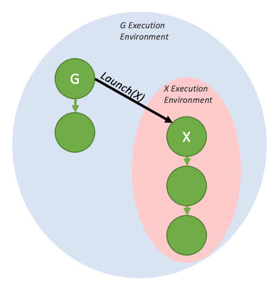](../images/fire-and-forget-environments-0efad6da7d.png)

Fire and forget launch, with execution environments

When launched from the host, a device graph has an additional top level environment called the *stream environment*, which encapsulates all work generated as part of the overall launch. The stream launch is complete (i.e. downstream dependent work may now run) when the overall stream environment is marked as complete.

[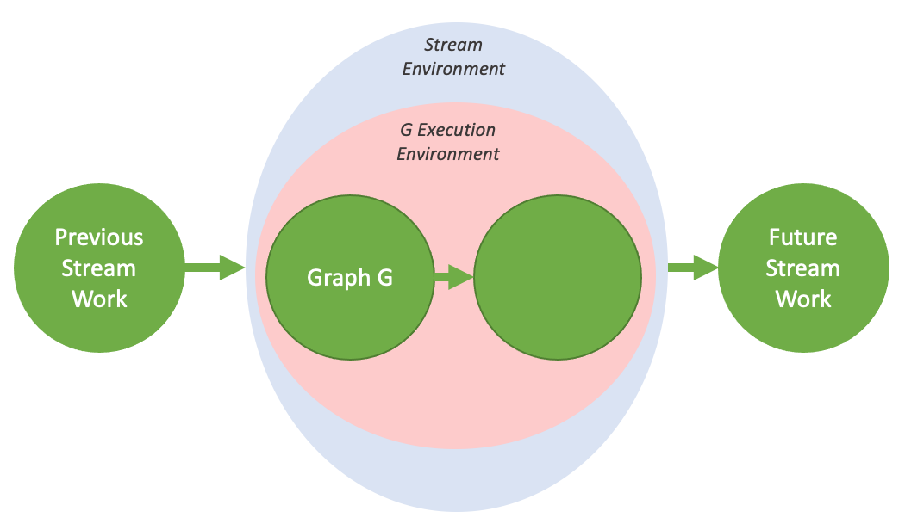](../images/device-graph-stream-environment-6f17140e8c.png)

The stream environment, visualized

These environments are also hierarchical, so a graph environment can include multiple levels of sub-environments from fire and forget launches.

[](../images/fire-and-forget-nested-environments-a0244fb75b.png)

Nested fire and forget environments

###### 3.2.8.7.7.2.1.3. Tail Launch

Unlike on the host, it is not possible to synchronize with device graphs from the GPU via traditional methods such as `cudaDeviceSynchronize()` or `cudaStreamSynchronize()`. Rather, in order to enable serial work dependencies, a different launch mode - tail launch - is offered, to provide similar functionality.

A tail launch executes when a graph’s environment is considered complete - ie, when the graph and all its children are complete. When a graph completes, the environment of the next graph in the tail launch list will replace the completed environment as a child environment of the parent graph. Like fire-and-forget launches, a graph can have multiple graphs enqueued for tail launch.

[](../images/tail-launch-simple-0bdee2ece8.png)

A simple tail launch

The above execution flow can be generated by the code below:

```
__global__ void launchTailGraph(cudaGraphExec_t graph) {
    cudaGraphLaunch(graph, cudaStreamGraphTailLaunch);
}

void graphSetup() {
    cudaGraphExec_t gExec1, gExec2;
    cudaGraph_t g1, g2;

    // Create, instantiate, and upload the device graph.
    create_graph(&g2);
    cudaGraphInstantiate(&gExec2, g2, cudaGraphInstantiateFlagDeviceLaunch);
    cudaGraphUpload(gExec2, stream);

    // Create and instantiate the launching graph.
    cudaStreamBeginCapture(stream, cudaStreamCaptureModeGlobal);
    launchTailGraph<<<1, 1, 0, stream>>>(gExec2);
    cudaStreamEndCapture(stream, &g1);
    cudaGraphInstantiate(&gExec1, g1);

    // Launch the host graph, which will in turn launch the device graph.
    cudaGraphLaunch(gExec1, stream);
}
```

Tail launches enqueued by a given graph will execute one at a time, in order of when they were enqueued. So the first enqueued graph will run first, and then the second, and so on.


Tail launch ordering

Tail launches enqueued by a tail graph will execute before tail launches enqueued by previous graphs in the tail launch list. These new tail launches will execute in the order they are enqueued.

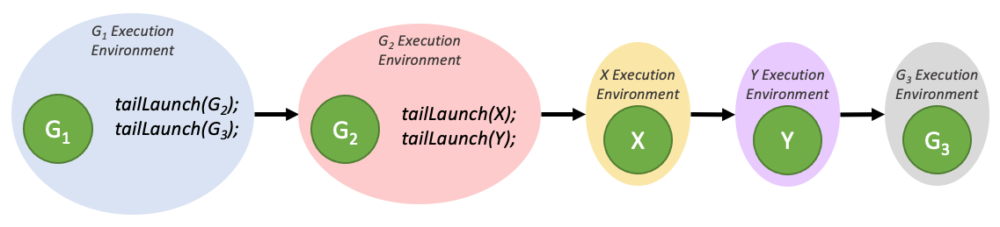

Tail launch ordering when enqueued from multiple graphs

A graph can have up to 255 pending tail launches.

###### 3.2.8.7.7.2.1.3.1. Tail Self-launch

It is possible for a device graph to enqueue itself for a tail launch, although a given graph can only have one self-launch enqueued at a time. In order to query the currently running device graph so that it can be relaunched, a new device-side function is added:

```
cudaGraphExec_t cudaGetCurrentGraphExec();
```

This function returns the handle of the currently running graph if it is a device graph. If the currently executing kernel is not a node within a device graph, this function will return NULL.

Below is sample code showing usage of this function for a relaunch loop:

```
__device__ int relaunchCount = 0;

__global__ void relaunchSelf() {
    int relaunchMax = 100;

    if (threadIdx.x == 0) {
        if (relaunchCount < relaunchMax) {
            cudaGraphLaunch(cudaGetCurrentGraphExec(), cudaStreamGraphTailLaunch);
        }

        relaunchCount++;
    }
}
```

###### 3.2.8.7.7.2.1.4. Sibling Launch

Sibling launch is a variation of fire-and-forget launch in which the graph is launched not as a child of the launching graph’s execution environment, but rather as a child of the launching graph’s parent environment. Sibling launch is equivalent to a fire-and-forget launch from the launching graph’s parent environment.


A simple sibling launch

The above diagram can be generated by the sample code below:

```
__global__ void launchSiblingGraph(cudaGraphExec_t graph) {
    cudaGraphLaunch(graph, cudaStreamGraphFireAndForgetAsSibling);
}

void graphSetup() {
    cudaGraphExec_t gExec1, gExec2;
    cudaGraph_t g1, g2;

    // Create, instantiate, and upload the device graph.
    create_graph(&g2);
    cudaGraphInstantiate(&gExec2, g2, cudaGraphInstantiateFlagDeviceLaunch);
    cudaGraphUpload(gExec2, stream);

    // Create and instantiate the launching graph.
    cudaStreamBeginCapture(stream, cudaStreamCaptureModeGlobal);
    launchSiblingGraph<<<1, 1, 0, stream>>>(gExec2);
    cudaStreamEndCapture(stream, &g1);
    cudaGraphInstantiate(&gExec1, g1);

    // Launch the host graph, which will in turn launch the device graph.
    cudaGraphLaunch(gExec1, stream);
}
```

Since sibling launches are not launched into the launching graph’s execution environment, they will not gate tail launches enqueued by the launching graph.

#### 3.2.8.8. Events

The runtime also provides a way to closely monitor the device’s progress, as well as perform accurate timing, by letting the application asynchronously record *events* at any point in the program, and query when these events are completed. An event has completed when all tasks - or optionally, all commands in a given stream - preceding the event have completed. Events in stream zero are completed after all preceding tasks and commands in all streams are completed.

##### 3.2.8.8.1. Creation and Destruction

The following code sample creates two events:

```
cudaEvent_t start, stop;
cudaEventCreate(&start);
cudaEventCreate(&stop);
```

They are destroyed this way:

```
cudaEventDestroy(start);
cudaEventDestroy(stop);
```

##### 3.2.8.8.2. Elapsed Time

The events created in [Creation and Destruction](index.md#creation-and-destruction-events) can be used to time the code sample of [Creation and Destruction](index.md#creation-and-destruction-streams) the following way:

```
cudaEventRecord(start, 0);
for (int i = 0; i < 2; ++i) {
    cudaMemcpyAsync(inputDev + i * size, inputHost + i * size,
                    size, cudaMemcpyHostToDevice, stream[i]);
    MyKernel<<<100, 512, 0, stream[i]>>>
               (outputDev + i * size, inputDev + i * size, size);
    cudaMemcpyAsync(outputHost + i * size, outputDev + i * size,
                    size, cudaMemcpyDeviceToHost, stream[i]);
}
cudaEventRecord(stop, 0);
cudaEventSynchronize(stop);
float elapsedTime;
cudaEventElapsedTime(&elapsedTime, start, stop);
```

#### 3.2.8.9. Synchronous Calls

When a synchronous function is called, control is not returned to the host thread before the device has completed the requested task. Whether the host thread will then yield, block, or spin can be specified by calling `cudaSetDeviceFlags()`with some specific flags (see reference manual for details) before any other CUDA call is performed by the host thread.

### 3.2.9. Multi-Device System

#### 3.2.9.1. Device Enumeration

A host system can have multiple devices. The following code sample shows how to enumerate these devices, query their properties, and determine the number of CUDA-enabled devices.

```
int deviceCount;
cudaGetDeviceCount(&deviceCount);
int device;
for (device = 0; device < deviceCount; ++device) {
    cudaDeviceProp deviceProp;
    cudaGetDeviceProperties(&deviceProp, device);
    printf("Device %d has compute capability %d.%d.\n",
           device, deviceProp.major, deviceProp.minor);
}
```

#### 3.2.9.2. Device Selection

A host thread can set the device it operates on at any time by calling `cudaSetDevice()`. Device memory allocations and kernel launches are made on the currently set device; streams and events are created in association with the currently set device. If no call to `cudaSetDevice()` is made, the current device is device 0.

The following code sample illustrates how setting the current device affects memory allocation and kernel execution.

```
size_t size = 1024 * sizeof(float);
cudaSetDevice(0);            // Set device 0 as current
float* p0;
cudaMalloc(&p0, size);       // Allocate memory on device 0
MyKernel<<<1000, 128>>>(p0); // Launch kernel on device 0
cudaSetDevice(1);            // Set device 1 as current
float* p1;
cudaMalloc(&p1, size);       // Allocate memory on device 1
MyKernel<<<1000, 128>>>(p1); // Launch kernel on device 1
```

#### 3.2.9.3. Stream and Event Behavior

A kernel launch will fail if it is issued to a stream that is not associated to the current device as illustrated in the following code sample.

```
cudaSetDevice(0);               // Set device 0 as current
cudaStream_t s0;
cudaStreamCreate(&s0);          // Create stream s0 on device 0
MyKernel<<<100, 64, 0, s0>>>(); // Launch kernel on device 0 in s0
cudaSetDevice(1);               // Set device 1 as current
cudaStream_t s1;
cudaStreamCreate(&s1);          // Create stream s1 on device 1
MyKernel<<<100, 64, 0, s1>>>(); // Launch kernel on device 1 in s1

// This kernel launch will fail:
MyKernel<<<100, 64, 0, s0>>>(); // Launch kernel on device 1 in s0
```

A memory copy will succeed even if it is issued to a stream that is not associated to the current device.

`cudaEventRecord()` will fail if the input event and input stream are associated to different devices.

`cudaEventElapsedTime()` will fail if the two input events are associated to different devices.

`cudaEventSynchronize()` and `cudaEventQuery()` will succeed even if the input event is associated to a device that is different from the current device.

`cudaStreamWaitEvent()` will succeed even if the input stream and input event are associated to different devices. `cudaStreamWaitEvent()` can therefore be used to synchronize multiple devices with each other.

Each device has its own default stream (see [Default Stream](index.md#default-stream)), so commands issued to the default stream of a device may execute out of order or concurrently with respect to commands issued to the default stream of any other device.

#### 3.2.9.4. Peer-to-Peer Memory Access

Depending on the system properties, specifically the PCIe and/or NVLINK topology, devices are able to address each other’s memory (i.e., a kernel executing on one device can dereference a pointer to the memory of the other device). This peer-to-peer memory access feature is supported between two devices if `cudaDeviceCanAccessPeer()` returns true for these two devices.

Peer-to-peer memory access is only supported in 64-bit applications and must be enabled between two devices by calling `cudaDeviceEnablePeerAccess()` as illustrated in the following code sample. On non-NVSwitch enabled systems, each device can support a system-wide maximum of eight peer connections.

A unified address space is used for both devices (see [Unified Virtual Address Space](index.md#unified-virtual-address-space)), so the same pointer can be used to address memory from both devices as shown in the code sample below.

```
cudaSetDevice(0);                   // Set device 0 as current
float* p0;
size_t size = 1024 * sizeof(float);
cudaMalloc(&p0, size);              // Allocate memory on device 0
MyKernel<<<1000, 128>>>(p0);        // Launch kernel on device 0
cudaSetDevice(1);                   // Set device 1 as current
cudaDeviceEnablePeerAccess(0, 0);   // Enable peer-to-peer access
                                    // with device 0

// Launch kernel on device 1
// This kernel launch can access memory on device 0 at address p0
MyKernel<<<1000, 128>>>(p0);
```

##### 3.2.9.4.1. IOMMU on Linux

On Linux only, CUDA and the display driver does not support IOMMU-enabled bare-metal PCIe peer to peer memory copy. However, CUDA and the display driver does support IOMMU via VM pass through. As a consequence, users on Linux, when running on a native bare metal system, should disable the IOMMU. The IOMMU should be enabled and the VFIO driver be used as a PCIe pass through for virtual machines.

On Windows the above limitation does not exist.

See also [Allocating DMA Buffers on 64-bit Platforms](https://download.nvidia.com/XFree86/Linux-x86_64/396.51/README/dma_issues.html).

#### 3.2.9.5. Peer-to-Peer Memory Copy

Memory copies can be performed between the memories of two different devices.

When a unified address space is used for both devices (see [Unified Virtual Address Space](index.md#unified-virtual-address-space)), this is done using the regular memory copy functions mentioned in [Device Memory](index.md#device-memory).

Otherwise, this is done using `cudaMemcpyPeer()`, `cudaMemcpyPeerAsync()`, `cudaMemcpy3DPeer()`, or `cudaMemcpy3DPeerAsync()` as illustrated in the following code sample.

```
cudaSetDevice(0);                   // Set device 0 as current
float* p0;
size_t size = 1024 * sizeof(float);
cudaMalloc(&p0, size);              // Allocate memory on device 0
cudaSetDevice(1);                   // Set device 1 as current
float* p1;
cudaMalloc(&p1, size);              // Allocate memory on device 1
cudaSetDevice(0);                   // Set device 0 as current
MyKernel<<<1000, 128>>>(p0);        // Launch kernel on device 0
cudaSetDevice(1);                   // Set device 1 as current
cudaMemcpyPeer(p1, 1, p0, 0, size); // Copy p0 to p1
MyKernel<<<1000, 128>>>(p1);        // Launch kernel on device 1
```

A copy (in the implicit *NULL* stream) between the memories of two different devices:

* does not start until all commands previously issued to either device have completed and
* runs to completion before any commands (see [Asynchronous Concurrent Execution](index.md#asynchronous-concurrent-execution)) issued after the copy to either device can start.

Consistent with the normal behavior of streams, an asynchronous copy between the memories of two devices may overlap with copies or kernels in another stream.

Note that if peer-to-peer access is enabled between two devices via `cudaDeviceEnablePeerAccess()` as described in [Peer-to-Peer Memory Access](index.md#peer-to-peer-memory-access), peer-to-peer memory copy between these two devices no longer needs to be staged through the host and is therefore faster.

### 3.2.10. Unified Virtual Address Space

When the application is run as a 64-bit process, a single address space is used for the host and all the devices of compute capability 2.0 and higher. All host memory allocations made via CUDA API calls and all device memory allocations on supported devices are within this virtual address range. As a consequence:

* The location of any memory on the host allocated through CUDA, or on any of the devices which use the unified address space, can be determined from the value of the pointer using `cudaPointerGetAttributes()`.
* When copying to or from the memory of any device which uses the unified address space, the `cudaMemcpyKind` parameter of `cudaMemcpy*()` can be set to `cudaMemcpyDefault` to determine locations from the pointers. This also works for host pointers not allocated through CUDA, as long as the current device uses unified addressing.
* Allocations via `cudaHostAlloc()` are automatically portable (see [Portable Memory](index.md#portable-memory)) across all the devices for which the unified address space is used, and pointers returned by `cudaHostAlloc()` can be used directly from within kernels running on these devices (i.e., there is no need to obtain a device pointer via `cudaHostGetDevicePointer()` as described in [Mapped Memory](index.md#mapped-memory).

Applications may query if the unified address space is used for a particular device by checking that the `unifiedAddressing` device property (see [Device Enumeration](index.md#device-enumeration)) is equal to 1.

### 3.2.11. Interprocess Communication

Any device memory pointer or event handle created by a host thread can be directly referenced by any other thread within the same process. It is not valid outside this process however, and therefore cannot be directly referenced by threads belonging to a different process.

To share device memory pointers and events across processes, an application must use the Inter Process Communication API, which is described in detail in the reference manual. The IPC API is only supported for 64-bit processes on Linux and for devices of compute capability 2.0 and higher. Note that the IPC API is not supported for `cudaMallocManaged` allocations.

Using this API, an application can get the IPC handle for a given device memory pointer using `cudaIpcGetMemHandle()`, pass it to another process using standard IPC mechanisms (for example, interprocess shared memory or files), and use `cudaIpcOpenMemHandle()` to retrieve a device pointer from the IPC handle that is a valid pointer within this other process. Event handles can be shared using similar entry points.

Note that allocations made by `cudaMalloc()` may be sub-allocated from a larger block of memory for performance reasons. In such case, CUDA IPC APIs will share the entire underlying memory block which may cause other sub-allocations to be shared, which can potentially lead to information disclosure between processes. To prevent this behavior, it is recommended to only share allocations with a 2MiB aligned size.

An example of using the IPC API is where a single primary process generates a batch of input data, making the data available to multiple secondary processes without requiring regeneration or copying.

Applications using CUDA IPC to communicate with each other should be compiled, linked, and run with the same CUDA driver and runtime.

Note

Since CUDA 11.5, only events-sharing IPC APIs are supported on L4T and embedded Linux Tegra devices with compute capability 7.x and higher. The memory-sharing IPC APIs are still not supported on Tegra platforms.

### 3.2.12. Error Checking

All runtime functions return an error code, but for an asynchronous function (see [Asynchronous Concurrent Execution](index.md#asynchronous-concurrent-execution)), this error code cannot possibly report any of the asynchronous errors that could occur on the device since the function returns before the device has completed the task; the error code only reports errors that occur on the host prior to executing the task, typically related to parameter validation; if an asynchronous error occurs, it will be reported by some subsequent unrelated runtime function call.

The only way to check for asynchronous errors just after some asynchronous function call is therefore to synchronize just after the call by calling `cudaDeviceSynchronize()` (or by using any other synchronization mechanisms described in [Asynchronous Concurrent Execution](index.md#asynchronous-concurrent-execution)) and checking the error code returned by `cudaDeviceSynchronize()`.

The runtime maintains an error variable for each host thread that is initialized to `cudaSuccess` and is overwritten by the error code every time an error occurs (be it a parameter validation error or an asynchronous error). `cudaPeekAtLastError()` returns this variable. `cudaGetLastError()` returns this variable and resets it to `cudaSuccess`.

Kernel launches do not return any error code, so `cudaPeekAtLastError()` or `cudaGetLastError()` must be called just after the kernel launch to retrieve any pre-launch errors. To ensure that any error returned by `cudaPeekAtLastError()` or `cudaGetLastError()` does not originate from calls prior to the kernel launch, one has to make sure that the runtime error variable is set to `cudaSuccess` just before the kernel launch, for example, by calling `cudaGetLastError()` just before the kernel launch. Kernel launches are asynchronous, so to check for asynchronous errors, the application must synchronize in-between the kernel launch and the call to `cudaPeekAtLastError()` or `cudaGetLastError()`.

Note that `cudaErrorNotReady` that may be returned by `cudaStreamQuery()` and `cudaEventQuery()` is not considered an error and is therefore not reported by `cudaPeekAtLastError()` or `cudaGetLastError()`.

### 3.2.13. Call Stack

On devices of compute capability 2.x and higher, the size of the call stack can be queried using`cudaDeviceGetLimit()` and set using `cudaDeviceSetLimit()`.

When the call stack overflows, the kernel call fails with a stack overflow error if the application is run via a CUDA debugger (CUDA-GDB, Nsight) or an unspecified launch error, otherwise.
When the compiler cannot determine the stack size, it issues a warning saying Stack size cannot be statically determined. This is usually the case with recursive functions.
Once this warning is issued, user will need to set stack size manually if default stack size is not sufficient.

### 3.2.14. Texture and Surface Memory

CUDA supports a subset of the texturing hardware that the GPU uses for graphics to access texture and surface memory. Reading data from texture or surface memory instead of global memory can have several performance benefits as described in [Device Memory Accesses](index.md#device-memory-accesses).

#### 3.2.14.1. Texture Memory

Texture memory is read from kernels using the device functions described in [Texture Functions](index.md#texture-functions). The process of reading a texture calling one of these functions is called a *texture fetch*. Each texture fetch specifies a parameter called a *texture object* for the texture object API.

The texture object specifies:

* The *texture*, which is the piece of texture memory that is fetched. Texture objects are created at runtime and the texture is specified when creating the texture object as described in [Texture Object API](index.md#texture-object-api).
* Its *dimensionality* that specifies whether the texture is addressed as a one dimensional array using one texture coordinate, a two-dimensional array using two texture coordinates, or a three-dimensional array using three texture coordinates. Elements of the array are called *texels*, short for *texture elements*. The *texture width*, *height*, and *depth* refer to the size of the array in each dimension. [Table 15](index.md#features-and-technical-specifications-technical-specifications-per-compute-capability) lists the maximum texture width, height, and depth depending on the compute capability of the device.
* The type of a texel, which is restricted to the basic integer and single-precision floating-point types and any of the 1-, 2-, and 4-component vector types defined in [Built-in Vector Types](index.md#built-in-vector-types) that are derived from the basic integer and single-precision floating-point types.
* The *read mode*, which is equal to `cudaReadModeNormalizedFloat` or `cudaReadModeElementType`. If it is `cudaReadModeNormalizedFloat` and the type of the texel is a 16-bit or 8-bit integer type, the value returned by the texture fetch is actually returned as floating-point type and the full range of the integer type is mapped to [0.0, 1.0] for unsigned integer type and [-1.0, 1.0] for signed integer type; for example, an unsigned 8-bit texture element with the value 0xff reads as 1. If it is `cudaReadModeElementType`, no conversion is performed.
* Whether texture coordinates are normalized or not. By default, textures are referenced (by the functions of [Texture Functions](index.md#texture-functions)) using floating-point coordinates in the range [0, N-1] where N is the size of the texture in the dimension corresponding to the coordinate. For example, a texture that is 64x32 in size will be referenced with coordinates in the range [0, 63] and [0, 31] for the x and y dimensions, respectively. Normalized texture coordinates cause the coordinates to be specified in the range [0.0, 1.0-1/N] instead of [0, N-1], so the same 64x32 texture would be addressed by normalized coordinates in the range [0, 1-1/N] in both the x and y dimensions. Normalized texture coordinates are a natural fit to some applications’ requirements, if it is preferable for the texture coordinates to be independent of the texture size.
* The *addressing mode*. It is valid to call the device functions of Section B.8 with coordinates that are out of range. The addressing mode defines what happens in that case. The default addressing mode is to clamp the coordinates to the valid range: [0, N) for non-normalized coordinates and [0.0, 1.0) for normalized coordinates. If the border mode is specified instead, texture fetches with out-of-range texture coordinates return zero. For normalized coordinates, the wrap mode and the mirror mode are also available. When using the wrap mode, each coordinate x is converted to *frac(x)=x - floor(x)* where *floor(x)* is the largest integer not greater than *x*. When using the mirror mode, each coordinate *x* is converted to *frac(x)* if *floor(x)* is even and *1-frac(x)* if *floor(x)* is odd. The addressing mode is specified as an array of size three whose first, second, and third elements specify the addressing mode for the first, second, and third texture coordinates, respectively; the addressing mode are `cudaAddressModeBorder`, `cudaAddressModeClamp`, `cudaAddressModeWrap`, and `cudaAddressModeMirror`; `cudaAddressModeWrap` and `cudaAddressModeMirror` are only supported for normalized texture coordinates
* The *filtering* mode which specifies how the value returned when fetching the texture is computed based on the input texture coordinates. Linear texture filtering may be done only for textures that are configured to return floating-point data. It performs low-precision interpolation between neighboring texels. When enabled, the texels surrounding a texture fetch location are read and the return value of the texture fetch is interpolated based on where the texture coordinates fell between the texels. Simple linear interpolation is performed for one-dimensional textures, bilinear interpolation for two-dimensional textures, and trilinear interpolation for three-dimensional textures. [Texture Fetching](index.md#texture-fetching) gives more details on texture fetching. The filtering mode is equal to `cudaFilterModePoint` or `cudaFilterModeLinear`. If it is `cudaFilterModePoint`, the returned value is the texel whose texture coordinates are the closest to the input texture coordinates. If it is `cudaFilterModeLinear`, the returned value is the linear interpolation of the two (for a one-dimensional texture), four (for a two dimensional texture), or eight (for a three dimensional texture) texels whose texture coordinates are the closest to the input texture coordinates. `cudaFilterModeLinear` is only valid for returned values of floating-point type.

[Texture Object API](index.md#texture-object-api) introduces the texture object API.

[16-Bit Floating-Point Textures](index.md#sixteen-bit-floating-point-textures) explains how to deal with 16-bit floating-point textures.

Textures can also be layered as described in [Layered Textures](index.md#layered-textures).

[Cubemap Textures](index.md#cubemap-textures) and [Cubemap Layered Textures](index.md#cubemap-layered-textures) describe a special type of texture, the cubemap texture.

[Texture Gather](index.md#texture-gather) describes a special texture fetch, texture gather.

##### 3.2.14.1.1. Texture Object API

A texture object is created using `cudaCreateTextureObject()` from a resource description of type `struct cudaResourceDesc`, which specifies the texture, and from a texture description defined as such:

```
struct cudaTextureDesc
{
    enum cudaTextureAddressMode addressMode[3];
    enum cudaTextureFilterMode  filterMode;
    enum cudaTextureReadMode    readMode;
    int                         sRGB;
    int                         normalizedCoords;
    unsigned int                maxAnisotropy;
    enum cudaTextureFilterMode  mipmapFilterMode;
    float                       mipmapLevelBias;
    float                       minMipmapLevelClamp;
    float                       maxMipmapLevelClamp;
};
```

* `addressMode` specifies the addressing mode;
* `filterMode` specifies the filter mode;
* `readMode` specifies the read mode;
* `normalizedCoords` specifies whether texture coordinates are normalized or not;
* See reference manual for `sRGB`, `maxAnisotropy`, `mipmapFilterMode`, `mipmapLevelBias`, `minMipmapLevelClamp`, and `maxMipmapLevelClamp`.

The following code sample applies some simple transformation kernel to a texture.

```
// Simple transformation kernel
__global__ void transformKernel(float* output,
                                cudaTextureObject_t texObj,
                                int width, int height,
                                float theta)
{
    // Calculate normalized texture coordinates
    unsigned int x = blockIdx.x * blockDim.x + threadIdx.x;
    unsigned int y = blockIdx.y * blockDim.y + threadIdx.y;

    float u = x / (float)width;
    float v = y / (float)height;

    // Transform coordinates
    u -= 0.5f;
    v -= 0.5f;
    float tu = u * cosf(theta) - v * sinf(theta) + 0.5f;
    float tv = v * cosf(theta) + u * sinf(theta) + 0.5f;

    // Read from texture and write to global memory
    output[y * width + x] = tex2D<float>(texObj, tu, tv);
}
```

```
// Host code
int main()
{
    const int height = 1024;
    const int width = 1024;
    float angle = 0.5;

    // Allocate and set some host data
    float *h_data = (float *)std::malloc(sizeof(float) * width * height);
    for (int i = 0; i < height * width; ++i)
        h_data[i] = i;

    // Allocate CUDA array in device memory
    cudaChannelFormatDesc channelDesc =
        cudaCreateChannelDesc(32, 0, 0, 0, cudaChannelFormatKindFloat);
    cudaArray_t cuArray;
    cudaMallocArray(&cuArray, &channelDesc, width, height);

    // Set pitch of the source (the width in memory in bytes of the 2D array pointed
    // to by src, including padding), we dont have any padding
    const size_t spitch = width * sizeof(float);
    // Copy data located at address h_data in host memory to device memory
    cudaMemcpy2DToArray(cuArray, 0, 0, h_data, spitch, width * sizeof(float),
                        height, cudaMemcpyHostToDevice);

    // Specify texture
    struct cudaResourceDesc resDesc;
    memset(&resDesc, 0, sizeof(resDesc));
    resDesc.resType = cudaResourceTypeArray;
    resDesc.res.array.array = cuArray;

    // Specify texture object parameters
    struct cudaTextureDesc texDesc;
    memset(&texDesc, 0, sizeof(texDesc));
    texDesc.addressMode[0] = cudaAddressModeWrap;
    texDesc.addressMode[1] = cudaAddressModeWrap;
    texDesc.filterMode = cudaFilterModeLinear;
    texDesc.readMode = cudaReadModeElementType;
    texDesc.normalizedCoords = 1;

    // Create texture object
    cudaTextureObject_t texObj = 0;
    cudaCreateTextureObject(&texObj, &resDesc, &texDesc, NULL);

    // Allocate result of transformation in device memory
    float *output;
    cudaMalloc(&output, width * height * sizeof(float));

    // Invoke kernel
    dim3 threadsperBlock(16, 16);
    dim3 numBlocks((width + threadsperBlock.x - 1) / threadsperBlock.x,
                    (height + threadsperBlock.y - 1) / threadsperBlock.y);
    transformKernel<<<numBlocks, threadsperBlock>>>(output, texObj, width, height,
                                                    angle);
    // Copy data from device back to host
    cudaMemcpy(h_data, output, width * height * sizeof(float),
                cudaMemcpyDeviceToHost);

    // Destroy texture object
    cudaDestroyTextureObject(texObj);

    // Free device memory
    cudaFreeArray(cuArray);
    cudaFree(output);

    // Free host memory
    free(h_data);

    return 0;
}
```

##### 3.2.14.1.2. 16-Bit Floating-Point Textures

The 16-bit floating-point or *half* format supported by CUDA arrays is the same as the IEEE 754-2008 binary2 format.

CUDA C++ does not support a matching data type, but provides intrinsic functions to convert to and from the 32-bit floating-point format via the `unsigned short` type: `__float2half_rn(float)` and `__half2float(unsigned short)`. These functions are only supported in device code. Equivalent functions for the host code can be found in the OpenEXR library, for example.

16-bit floating-point components are promoted to 32 bit float during texture fetching before any filtering is performed.

A channel description for the 16-bit floating-point format can be created by calling one of the `cudaCreateChannelDescHalf*()` functions.

##### 3.2.14.1.3. Layered Textures

A one-dimensional or two-dimensional layered texture (also known as *texture array* in Direct3D and *array texture* in OpenGL) is a texture made up of a sequence of layers, all of which are regular textures of same dimensionality, size, and data type.

A one-dimensional layered texture is addressed using an integer index and a floating-point texture coordinate; the index denotes a layer within the sequence and the coordinate addresses a texel within that layer. A two-dimensional layered texture is addressed using an integer index and two floating-point texture coordinates; the index denotes a layer within the sequence and the coordinates address a texel within that layer.

A layered texture can only be a CUDA array by calling `cudaMalloc3DArray()` with the `cudaArrayLayered` flag (and a height of zero for one-dimensional layered texture).

Layered textures are fetched using the device functions described in [tex1DLayered()](index.md#tex1dlayered-object) and [tex2DLayered()](index.md#tex2dlayered-object). Texture filtering (see [Texture Fetching](index.md#texture-fetching)) is done only within a layer, not across layers.

Layered textures are only supported on devices of compute capability 2.0 and higher.

##### 3.2.14.1.4. Cubemap Textures

A *cubemap* texture is a special type of two-dimensional layered texture that has six layers representing the faces of a cube:

* The width of a layer is equal to its height.
* The cubemap is addressed using three texture coordinates *x*, *y*, and *z* that are interpreted as a direction vector emanating from the center of the cube and pointing to one face of the cube and a texel within the layer corresponding to that face. More specifically, the face is selected by the coordinate with largest magnitude *m* and the corresponding layer is addressed using coordinates *(s/m+1)/2* and *(t/m+1)/2* where *s* and *t* are defined in [Table 2](index.md#cubemap-textures-cubemap-fetch).

Table 2. Cubemap Fetch

|  | | face | m | s | t |
| --- | --- | --- | --- | --- | --- |
| `|x| > |y|` and `|x| > |z|` | x ≥ 0 | 0 | x | -z | -y |
| x < 0 | 1 | -x | z | -y |
| `|y| > |x|` and `|y| > |z|` | y ≥ 0 | 2 | y | x | z |
| y < 0 | 3 | -y | x | -z |
| `|z| > |x|` and `|z| > |y|` | z ≥ 0 | 4 | z | x | -y |
| z < 0 | 5 | -z | -x | -y |

A cubemap texture can only be a CUDA array by calling `cudaMalloc3DArray()` with the `cudaArrayCubemap` flag.

Cubemap textures are fetched using the device function described in [texCubemap()](index.md#texcubemap-object).

Cubemap textures are only supported on devices of compute capability 2.0 and higher.

##### 3.2.14.1.5. Cubemap Layered Textures

A *cubemap layered* texture is a layered texture whose layers are cubemaps of same dimension.

A cubemap layered texture is addressed using an integer index and three floating-point texture coordinates; the index denotes a cubemap within the sequence and the coordinates address a texel within that cubemap.

A cubemap layered texture can only be a CUDA array by calling `cudaMalloc3DArray()` with the `cudaArrayLayered` and `cudaArrayCubemap` flags.

Cubemap layered textures are fetched using the device function described in [texCubemapLayered()](index.md#texcubemaplayered-object). Texture filtering (see [Texture Fetching](index.md#texture-fetching)) is done only within a layer, not across layers.

Cubemap layered textures are only supported on devices of compute capability 2.0 and higher.

##### 3.2.14.1.6. Texture Gather

Texture gather is a special texture fetch that is available for two-dimensional textures only. It is performed by the `tex2Dgather()` function, which has the same parameters as `tex2D()`, plus an additional `comp` parameter equal to 0, 1, 2, or 3 (see [tex2Dgather()](index.md#tex2dgather-object)). It returns four 32-bit numbers that correspond to the value of the component `comp` of each of the four texels that would have been used for bilinear filtering during a regular texture fetch. For example, if these texels are of values (253, 20, 31, 255), (250, 25, 29, 254), (249, 16, 37, 253), (251, 22, 30, 250), and `comp` is 2, `tex2Dgather()` returns (31, 29, 37, 30).

Note that texture coordinates are computed with only 8 bits of fractional precision. `tex2Dgather()` may therefore return unexpected results for cases where `tex2D()` would use 1.0 for one of its weights (α or β, see [Linear Filtering](index.md#linear-filtering)). For example, with an *x* texture coordinate of 2.49805: *xB=x-0.5=1.99805*, however the fractional part of *xB* is stored in an 8-bit fixed-point format. Since 0.99805 is closer to 256.f/256.f than it is to 255.f/256.f, *xB* has the value 2. A `tex2Dgather()` in this case would therefore return indices 2 and 3 in *x*, instead of indices 1 and 2.

Texture gather is only supported for CUDA arrays created with the `cudaArrayTextureGather` flag and of width and height less than the maximum specified in [Table 15](index.md#features-and-technical-specifications-technical-specifications-per-compute-capability) for texture gather, which is smaller than for regular texture fetch.

Texture gather is only supported on devices of compute capability 2.0 and higher.

#### 3.2.14.2. Surface Memory

For devices of compute capability 2.0 and higher, a CUDA array (described in [Cubemap Surfaces](index.md#cubemap-surfaces)), created with the `cudaArraySurfaceLoadStore` flag, can be read and written via a *surface object* using the functions described in [Surface Functions](index.md#surface-functions).

[Table 15](index.md#features-and-technical-specifications-technical-specifications-per-compute-capability) lists the maximum surface width, height, and depth depending on the compute capability of the device.

##### 3.2.14.2.1. Surface Object API

A surface object is created using `cudaCreateSurfaceObject()` from a resource description of type `struct cudaResourceDesc`. Unlike texture memory, surface memory uses byte addressing. This means that the x-coordinate used to access a texture element via texture functions needs to be multiplied by the byte size of the element to access the same element via a surface function. For example, the element at texture coordinate x of a one-dimensional floating-point CUDA array bound to a texture object `texObj` and a surface object `surfObj` is read using `tex1d(texObj, x)` via `texObj`, but `surf1Dread(surfObj, 4*x)` via `surfObj`. Similarly, the element at texture coordinate x and y of a two-dimensional floating-point CUDA array bound to a texture object `texObj` and a surface object `surfObj` is accessed using `tex2d(texObj, x, y)` via `texObj`, but `surf2Dread(surfObj, 4*x, y)` via `surObj` (the byte offset of the y-coordinate is internally calculated from the underlying line pitch of the CUDA array).

The following code sample applies some simple transformation kernel to a surface.

```
// Simple copy kernel
__global__ void copyKernel(cudaSurfaceObject_t inputSurfObj,
                           cudaSurfaceObject_t outputSurfObj,
                           int width, int height)
{
    // Calculate surface coordinates
    unsigned int x = blockIdx.x * blockDim.x + threadIdx.x;
    unsigned int y = blockIdx.y * blockDim.y + threadIdx.y;
    if (x < width && y < height) {
        uchar4 data;
        // Read from input surface
        surf2Dread(&data,  inputSurfObj, x * 4, y);
        // Write to output surface
        surf2Dwrite(data, outputSurfObj, x * 4, y);
    }
}

// Host code
int main()
{
    const int height = 1024;
    const int width = 1024;

    // Allocate and set some host data
    unsigned char *h_data =
        (unsigned char *)std::malloc(sizeof(unsigned char) * width * height * 4);
    for (int i = 0; i < height * width * 4; ++i)
        h_data[i] = i;

    // Allocate CUDA arrays in device memory
    cudaChannelFormatDesc channelDesc =
        cudaCreateChannelDesc(8, 8, 8, 8, cudaChannelFormatKindUnsigned);
    cudaArray_t cuInputArray;
    cudaMallocArray(&cuInputArray, &channelDesc, width, height,
                    cudaArraySurfaceLoadStore);
    cudaArray_t cuOutputArray;
    cudaMallocArray(&cuOutputArray, &channelDesc, width, height,
                    cudaArraySurfaceLoadStore);

    // Set pitch of the source (the width in memory in bytes of the 2D array
    // pointed to by src, including padding), we dont have any padding
    const size_t spitch = 4 * width * sizeof(unsigned char);
    // Copy data located at address h_data in host memory to device memory
    cudaMemcpy2DToArray(cuInputArray, 0, 0, h_data, spitch,
                        4 * width * sizeof(unsigned char), height,
                        cudaMemcpyHostToDevice);

    // Specify surface
    struct cudaResourceDesc resDesc;
    memset(&resDesc, 0, sizeof(resDesc));
    resDesc.resType = cudaResourceTypeArray;

    // Create the surface objects
    resDesc.res.array.array = cuInputArray;
    cudaSurfaceObject_t inputSurfObj = 0;
    cudaCreateSurfaceObject(&inputSurfObj, &resDesc);
    resDesc.res.array.array = cuOutputArray;
    cudaSurfaceObject_t outputSurfObj = 0;
    cudaCreateSurfaceObject(&outputSurfObj, &resDesc);

    // Invoke kernel
    dim3 threadsperBlock(16, 16);
    dim3 numBlocks((width + threadsperBlock.x - 1) / threadsperBlock.x,
                    (height + threadsperBlock.y - 1) / threadsperBlock.y);
    copyKernel<<<numBlocks, threadsperBlock>>>(inputSurfObj, outputSurfObj, width,
                                                height);

    // Copy data from device back to host
    cudaMemcpy2DFromArray(h_data, spitch, cuOutputArray, 0, 0,
                            4 * width * sizeof(unsigned char), height,
                            cudaMemcpyDeviceToHost);

    // Destroy surface objects
    cudaDestroySurfaceObject(inputSurfObj);
    cudaDestroySurfaceObject(outputSurfObj);

    // Free device memory
    cudaFreeArray(cuInputArray);
    cudaFreeArray(cuOutputArray);

    // Free host memory
    free(h_data);

  return 0;
}
```

##### 3.2.14.2.2. Cubemap Surfaces

Cubemap surfaces are accessed using`surfCubemapread()` and `surfCubemapwrite()` ([surfCubemapread](index.md#surfcubemapread-object) and [surfCubemapwrite](index.md#surfcubemapwrite-object)) as a two-dimensional layered surface, i.e., using an integer index denoting a face and two floating-point texture coordinates addressing a texel within the layer corresponding to this face. Faces are ordered as indicated in [Table 2](index.md#cubemap-textures-cubemap-fetch).

##### 3.2.14.2.3. Cubemap Layered Surfaces

Cubemap layered surfaces are accessed using `surfCubemapLayeredread()` and `surfCubemapLayeredwrite()` ([surfCubemapLayeredread()](index.md#surfcubemaplayeredread-object) and [surfCubemapLayeredwrite()](index.md#surfcubemaplayeredwrite-object)) as a two-dimensional layered surface, i.e., using an integer index denoting a face of one of the cubemaps and two floating-point texture coordinates addressing a texel within the layer corresponding to this face. Faces are ordered as indicated in [Table 2](index.md#cubemap-textures-cubemap-fetch), so index ((2 \* 6) + 3), for example, accesses the fourth face of the third cubemap.

#### 3.2.14.3. CUDA Arrays

CUDA arrays are opaque memory layouts optimized for texture fetching. They are one dimensional, two dimensional, or three-dimensional and composed of elements, each of which has 1, 2 or 4 components that may be signed or unsigned 8-, 16-, or 32-bit integers, 16-bit floats, or 32-bit floats. CUDA arrays are only accessible by kernels through texture fetching as described in [Texture Memory](index.md#texture-memory) or surface reading and writing as described in [Surface Memory](index.md#surface-memory).

#### 3.2.14.4. Read/Write Coherency

The texture and surface memory is cached (see [Device Memory Accesses](index.md#device-memory-accesses)) and within the same kernel call, the cache is not kept coherent with respect to global memory writes and surface memory writes, so any texture fetch or surface read to an address that has been written to via a global write or a surface write in the same kernel call returns undefined data. In other words, a thread can safely read some texture or surface memory location only if this memory location has been updated by a previous kernel call or memory copy, but not if it has been previously updated by the same thread or another thread from the same kernel call.

### 3.2.15. Graphics Interoperability

Some resources from OpenGL and Direct3D may be mapped into the address space of CUDA, either to enable CUDA to read data written by OpenGL or Direct3D, or to enable CUDA to write data for consumption by OpenGL or Direct3D.

A resource must be registered to CUDA before it can be mapped using the functions mentioned in [OpenGL Interoperability](index.md#opengl-interoperability) and [Direct3D Interoperability](index.md#direct3d-interoperability). These functions return a pointer to a CUDA graphics resource of type `struct cudaGraphicsResource`. Registering a resource is potentially high-overhead and therefore typically called only once per resource. A CUDA graphics resource is unregistered using `cudaGraphicsUnregisterResource()`. Each CUDA context which intends to use the resource is required to register it separately.

Once a resource is registered to CUDA, it can be mapped and unmapped as many times as necessary using `cudaGraphicsMapResources()` and `cudaGraphicsUnmapResources()`. `cudaGraphicsResourceSetMapFlags()` can be called to specify usage hints (write-only, read-only) that the CUDA driver can use to optimize resource management.

A mapped resource can be read from or written to by kernels using the device memory address returned by `cudaGraphicsResourceGetMappedPointer()` for buffers and`cudaGraphicsSubResourceGetMappedArray()` for CUDA arrays.

Accessing a resource through OpenGL, Direct3D, or another CUDA context while it is mapped produces undefined results. [OpenGL Interoperability](index.md#opengl-interoperability) and [Direct3D Interoperability](index.md#direct3d-interoperability) give specifics for each graphics API and some code samples. [SLI Interoperability](index.md#sli-interoperability) gives specifics for when the system is in SLI mode.

#### 3.2.15.1. OpenGL Interoperability

The OpenGL resources that may be mapped into the address space of CUDA are OpenGL buffer, texture, and renderbuffer objects.

A buffer object is registered using `cudaGraphicsGLRegisterBuffer()`. In CUDA, it appears as a device pointer and can therefore be read and written by kernels or via `cudaMemcpy()` calls.

A texture or renderbuffer object is registered using `cudaGraphicsGLRegisterImage()`. In CUDA, it appears as a CUDA array. Kernels can read from the array by binding it to a texture or surface reference. They can also write to it via the surface write functions if the resource has been registered with the `cudaGraphicsRegisterFlagsSurfaceLoadStore` flag. The array can also be read and written via `cudaMemcpy2D()` calls. `cudaGraphicsGLRegisterImage()` supports all texture formats with 1, 2, or 4 components and an internal type of float (for example, `GL_RGBA_FLOAT32`), normalized integer (for example, `GL_RGBA8, GL_INTENSITY16`), and unnormalized integer (for example, `GL_RGBA8UI`) (please note that since unnormalized integer formats require OpenGL 3.0, they can only be written by shaders, not the fixed function pipeline).

The OpenGL context whose resources are being shared has to be current to the host thread making any OpenGL interoperability API calls.

Please note: When an OpenGL texture is made bindless (say for example by requesting an image or texture handle using the `glGetTextureHandle`\*/`glGetImageHandle`\* APIs) it cannot be registered with CUDA. The application needs to register the texture for interop before requesting an image or texture handle.

The following code sample uses a kernel to dynamically modify a 2D `width` x `height` grid of vertices stored in a vertex buffer object:

```
GLuint positionsVBO;
struct cudaGraphicsResource* positionsVBO_CUDA;

int main()
{
    // Initialize OpenGL and GLUT for device 0
    // and make the OpenGL context current
    ...
    glutDisplayFunc(display);

    // Explicitly set device 0
    cudaSetDevice(0);

    // Create buffer object and register it with CUDA
    glGenBuffers(1, &positionsVBO);
    glBindBuffer(GL_ARRAY_BUFFER, positionsVBO);
    unsigned int size = width * height * 4 * sizeof(float);
    glBufferData(GL_ARRAY_BUFFER, size, 0, GL_DYNAMIC_DRAW);
    glBindBuffer(GL_ARRAY_BUFFER, 0);
    cudaGraphicsGLRegisterBuffer(&positionsVBO_CUDA,
                                 positionsVBO,
                                 cudaGraphicsMapFlagsWriteDiscard);

    // Launch rendering loop
    glutMainLoop();

    ...
}

void display()
{
    // Map buffer object for writing from CUDA
    float4* positions;
    cudaGraphicsMapResources(1, &positionsVBO_CUDA, 0);
    size_t num_bytes;
    cudaGraphicsResourceGetMappedPointer((void**)&positions,
                                         &num_bytes,
                                         positionsVBO_CUDA));

    // Execute kernel
    dim3 dimBlock(16, 16, 1);
    dim3 dimGrid(width / dimBlock.x, height / dimBlock.y, 1);
    createVertices<<<dimGrid, dimBlock>>>(positions, time,
                                          width, height);

    // Unmap buffer object
    cudaGraphicsUnmapResources(1, &positionsVBO_CUDA, 0);

    // Render from buffer object
    glClear(GL_COLOR_BUFFER_BIT | GL_DEPTH_BUFFER_BIT);
    glBindBuffer(GL_ARRAY_BUFFER, positionsVBO);
    glVertexPointer(4, GL_FLOAT, 0, 0);
    glEnableClientState(GL_VERTEX_ARRAY);
    glDrawArrays(GL_POINTS, 0, width * height);
    glDisableClientState(GL_VERTEX_ARRAY);

    // Swap buffers
    glutSwapBuffers();
    glutPostRedisplay();
}
```

```
void deleteVBO()
{
    cudaGraphicsUnregisterResource(positionsVBO_CUDA);
    glDeleteBuffers(1, &positionsVBO);
}

__global__ void createVertices(float4* positions, float time,
                               unsigned int width, unsigned int height)
{
    unsigned int x = blockIdx.x * blockDim.x + threadIdx.x;
    unsigned int y = blockIdx.y * blockDim.y + threadIdx.y;

    // Calculate uv coordinates
    float u = x / (float)width;
    float v = y / (float)height;
    u = u * 2.0f - 1.0f;
    v = v * 2.0f - 1.0f;

    // calculate simple sine wave pattern
    float freq = 4.0f;
    float w = sinf(u * freq + time)
            * cosf(v * freq + time) * 0.5f;

    // Write positions
    positions[y * width + x] = make_float4(u, w, v, 1.0f);
}
```

On Windows and for Quadro GPUs, `cudaWGLGetDevice()` can be used to retrieve the CUDA device associated to the handle returned by `wglEnumGpusNV()`. Quadro GPUs offer higher performance OpenGL interoperability than GeForce and Tesla GPUs in a multi-GPU configuration where OpenGL rendering is performed on the Quadro GPU and CUDA computations are performed on other GPUs in the system.

#### 3.2.15.2. Direct3D Interoperability

Direct3D interoperability is supported for Direct3D 9Ex, Direct3D 10, and Direct3D 11.

A CUDA context may interoperate only with Direct3D devices that fulfill the following criteria: Direct3D 9Ex devices must be created with `DeviceType` set to `D3DDEVTYPE_HAL` and `BehaviorFlags` with the `D3DCREATE_HARDWARE_VERTEXPROCESSING` flag; Direct3D 10 and Direct3D 11 devices must be created with `DriverType` set to `D3D_DRIVER_TYPE_HARDWARE`.

The Direct3D resources that may be mapped into the address space of CUDA are Direct3D buffers, textures, and surfaces. These resources are registered using `cudaGraphicsD3D9RegisterResource()`, `cudaGraphicsD3D10RegisterResource()`, and `cudaGraphicsD3D11RegisterResource()`.

The following code sample uses a kernel to dynamically modify a 2D `width` x `height` grid of vertices stored in a vertex buffer object.

##### 3.2.15.2.1. Direct3D 9 Version

```
IDirect3D9* D3D;
IDirect3DDevice9* device;
struct CUSTOMVERTEX {
    FLOAT x, y, z;
    DWORD color;
};
IDirect3DVertexBuffer9* positionsVB;
struct cudaGraphicsResource* positionsVB_CUDA;

int main()
{
    int dev;
    // Initialize Direct3D
    D3D = Direct3DCreate9Ex(D3D_SDK_VERSION);

    // Get a CUDA-enabled adapter
    unsigned int adapter = 0;
    for (; adapter < g_pD3D->GetAdapterCount(); adapter++) {
        D3DADAPTER_IDENTIFIER9 adapterId;
        g_pD3D->GetAdapterIdentifier(adapter, 0, &adapterId);
        if (cudaD3D9GetDevice(&dev, adapterId.DeviceName)
            == cudaSuccess)
            break;
    }

     // Create device
    ...
    D3D->CreateDeviceEx(adapter, D3DDEVTYPE_HAL, hWnd,
                        D3DCREATE_HARDWARE_VERTEXPROCESSING,
                        &params, NULL, &device);

    // Use the same device
    cudaSetDevice(dev);

    // Create vertex buffer and register it with CUDA
    unsigned int size = width * height * sizeof(CUSTOMVERTEX);
    device->CreateVertexBuffer(size, 0, D3DFVF_CUSTOMVERTEX,
                               D3DPOOL_DEFAULT, &positionsVB, 0);
    cudaGraphicsD3D9RegisterResource(&positionsVB_CUDA,
                                     positionsVB,
                                     cudaGraphicsRegisterFlagsNone);
    cudaGraphicsResourceSetMapFlags(positionsVB_CUDA,
                                    cudaGraphicsMapFlagsWriteDiscard);

    // Launch rendering loop
    while (...) {
        ...
        Render();
        ...
    }
    ...
}
```

```
void Render()
{
    // Map vertex buffer for writing from CUDA
    float4* positions;
    cudaGraphicsMapResources(1, &positionsVB_CUDA, 0);
    size_t num_bytes;
    cudaGraphicsResourceGetMappedPointer((void**)&positions,
                                         &num_bytes,
                                         positionsVB_CUDA));

    // Execute kernel
    dim3 dimBlock(16, 16, 1);
    dim3 dimGrid(width / dimBlock.x, height / dimBlock.y, 1);
    createVertices<<<dimGrid, dimBlock>>>(positions, time,
                                          width, height);

    // Unmap vertex buffer
    cudaGraphicsUnmapResources(1, &positionsVB_CUDA, 0);

    // Draw and present
    ...
}

void releaseVB()
{
    cudaGraphicsUnregisterResource(positionsVB_CUDA);
    positionsVB->Release();
}

__global__ void createVertices(float4* positions, float time,
                               unsigned int width, unsigned int height)
{
    unsigned int x = blockIdx.x * blockDim.x + threadIdx.x;
    unsigned int y = blockIdx.y * blockDim.y + threadIdx.y;

    // Calculate uv coordinates
    float u = x / (float)width;
    float v = y / (float)height;
    u = u * 2.0f - 1.0f;
    v = v * 2.0f - 1.0f;

    // Calculate simple sine wave pattern
    float freq = 4.0f;
    float w = sinf(u * freq + time)
            * cosf(v * freq + time) * 0.5f;

    // Write positions
    positions[y * width + x] =
                make_float4(u, w, v, __int_as_float(0xff00ff00));
}
```

##### 3.2.15.2.2. Direct3D 10 Version

```
ID3D10Device* device;
struct CUSTOMVERTEX {
    FLOAT x, y, z;
    DWORD color;
};
ID3D10Buffer* positionsVB;
struct cudaGraphicsResource* positionsVB_CUDA;

int main()
{
    int dev;
    // Get a CUDA-enabled adapter
    IDXGIFactory* factory;
    CreateDXGIFactory(__uuidof(IDXGIFactory), (void**)&factory);
    IDXGIAdapter* adapter = 0;
    for (unsigned int i = 0; !adapter; ++i) {
        if (FAILED(factory->EnumAdapters(i, &adapter))
            break;
        if (cudaD3D10GetDevice(&dev, adapter) == cudaSuccess)
            break;
        adapter->Release();
    }
    factory->Release();

    // Create swap chain and device
    ...
    D3D10CreateDeviceAndSwapChain(adapter,
                                  D3D10_DRIVER_TYPE_HARDWARE, 0,
                                  D3D10_CREATE_DEVICE_DEBUG,
                                  D3D10_SDK_VERSION,
                                  &swapChainDesc, &swapChain,
                                  &device);
    adapter->Release();

    // Use the same device
    cudaSetDevice(dev);

    // Create vertex buffer and register it with CUDA
    unsigned int size = width * height * sizeof(CUSTOMVERTEX);
    D3D10_BUFFER_DESC bufferDesc;
    bufferDesc.Usage          = D3D10_USAGE_DEFAULT;
    bufferDesc.ByteWidth      = size;
    bufferDesc.BindFlags      = D3D10_BIND_VERTEX_BUFFER;
    bufferDesc.CPUAccessFlags = 0;
    bufferDesc.MiscFlags      = 0;
    device->CreateBuffer(&bufferDesc, 0, &positionsVB);
    cudaGraphicsD3D10RegisterResource(&positionsVB_CUDA,
                                      positionsVB,
                                      cudaGraphicsRegisterFlagsNone);
                                      cudaGraphicsResourceSetMapFlags(positionsVB_CUDA,
                                      cudaGraphicsMapFlagsWriteDiscard);

    // Launch rendering loop
    while (...) {
        ...
        Render();
        ...
    }
    ...
}
```

```
void Render()
{
    // Map vertex buffer for writing from CUDA
    float4* positions;
    cudaGraphicsMapResources(1, &positionsVB_CUDA, 0);
    size_t num_bytes;
    cudaGraphicsResourceGetMappedPointer((void**)&positions,
                                         &num_bytes,
                                         positionsVB_CUDA));

    // Execute kernel
    dim3 dimBlock(16, 16, 1);
    dim3 dimGrid(width / dimBlock.x, height / dimBlock.y, 1);
    createVertices<<<dimGrid, dimBlock>>>(positions, time,
                                          width, height);

    // Unmap vertex buffer
    cudaGraphicsUnmapResources(1, &positionsVB_CUDA, 0);

    // Draw and present
    ...
}

void releaseVB()
{
    cudaGraphicsUnregisterResource(positionsVB_CUDA);
    positionsVB->Release();
}

__global__ void createVertices(float4* positions, float time,
                               unsigned int width, unsigned int height)
{
    unsigned int x = blockIdx.x * blockDim.x + threadIdx.x;
    unsigned int y = blockIdx.y * blockDim.y + threadIdx.y;

    // Calculate uv coordinates
    float u = x / (float)width;
    float v = y / (float)height;
    u = u * 2.0f - 1.0f;
    v = v * 2.0f - 1.0f;

    // Calculate simple sine wave pattern
    float freq = 4.0f;
    float w = sinf(u * freq + time)
            * cosf(v * freq + time) * 0.5f;

    // Write positions
    positions[y * width + x] =
                make_float4(u, w, v, __int_as_float(0xff00ff00));
}
```

##### 3.2.15.2.3. Direct3D 11 Version

```
ID3D11Device* device;
struct CUSTOMVERTEX {
    FLOAT x, y, z;
    DWORD color;
};
ID3D11Buffer* positionsVB;
struct cudaGraphicsResource* positionsVB_CUDA;

int main()
{
    int dev;
    // Get a CUDA-enabled adapter
    IDXGIFactory* factory;
    CreateDXGIFactory(__uuidof(IDXGIFactory), (void**)&factory);
    IDXGIAdapter* adapter = 0;
    for (unsigned int i = 0; !adapter; ++i) {
        if (FAILED(factory->EnumAdapters(i, &adapter))
            break;
        if (cudaD3D11GetDevice(&dev, adapter) == cudaSuccess)
            break;
        adapter->Release();
    }
    factory->Release();

    // Create swap chain and device
    ...
    sFnPtr_D3D11CreateDeviceAndSwapChain(adapter,
                                         D3D11_DRIVER_TYPE_HARDWARE,
                                         0,
                                         D3D11_CREATE_DEVICE_DEBUG,
                                         featureLevels, 3,
                                         D3D11_SDK_VERSION,
                                         &swapChainDesc, &swapChain,
                                         &device,
                                         &featureLevel,
                                         &deviceContext);
    adapter->Release();

    // Use the same device
    cudaSetDevice(dev);

    // Create vertex buffer and register it with CUDA
    unsigned int size = width * height * sizeof(CUSTOMVERTEX);
    D3D11_BUFFER_DESC bufferDesc;
    bufferDesc.Usage          = D3D11_USAGE_DEFAULT;
    bufferDesc.ByteWidth      = size;
    bufferDesc.BindFlags      = D3D11_BIND_VERTEX_BUFFER;
    bufferDesc.CPUAccessFlags = 0;
    bufferDesc.MiscFlags      = 0;
    device->CreateBuffer(&bufferDesc, 0, &positionsVB);
    cudaGraphicsD3D11RegisterResource(&positionsVB_CUDA,
                                      positionsVB,
                                      cudaGraphicsRegisterFlagsNone);
    cudaGraphicsResourceSetMapFlags(positionsVB_CUDA,
                                    cudaGraphicsMapFlagsWriteDiscard);

    // Launch rendering loop
    while (...) {
        ...
        Render();
        ...
    }
    ...
}
```

```
void Render()
{
    // Map vertex buffer for writing from CUDA
    float4* positions;
    cudaGraphicsMapResources(1, &positionsVB_CUDA, 0);
    size_t num_bytes;
    cudaGraphicsResourceGetMappedPointer((void**)&positions,
                                         &num_bytes,
                                         positionsVB_CUDA));

    // Execute kernel
    dim3 dimBlock(16, 16, 1);
    dim3 dimGrid(width / dimBlock.x, height / dimBlock.y, 1);
    createVertices<<<dimGrid, dimBlock>>>(positions, time,
                                          width, height);

    // Unmap vertex buffer
    cudaGraphicsUnmapResources(1, &positionsVB_CUDA, 0);

    // Draw and present
    ...
}

void releaseVB()
{
    cudaGraphicsUnregisterResource(positionsVB_CUDA);
    positionsVB->Release();
}

    __global__ void createVertices(float4* positions, float time,
                          unsigned int width, unsigned int height)
{
    unsigned int x = blockIdx.x * blockDim.x + threadIdx.x;
    unsigned int y = blockIdx.y * blockDim.y + threadIdx.y;

// Calculate uv coordinates
    float u = x / (float)width;
    float v = y / (float)height;
    u = u * 2.0f - 1.0f;
    v = v * 2.0f - 1.0f;

    // Calculate simple sine wave pattern
    float freq = 4.0f;
    float w = sinf(u * freq + time)
            * cosf(v * freq + time) * 0.5f;

    // Write positions
    positions[y * width + x] =
                make_float4(u, w, v, __int_as_float(0xff00ff00));
}
```

#### 3.2.15.3. SLI Interoperability

In a system with multiple GPUs, all CUDA-enabled GPUs are accessible via the CUDA driver and runtime as separate devices. There are however special considerations as described below when the system is in SLI mode.

First, an allocation in one CUDA device on one GPU will consume memory on other GPUs that are part of the SLI configuration of the Direct3D or OpenGL device. Because of this, allocations may fail earlier than otherwise expected.

Second, applications should create multiple CUDA contexts, one for each GPU in the SLI configuration. While this is not a strict requirement, it avoids unnecessary data transfers between devices. The application can use the `cudaD3D[9|10|11]GetDevices()` for Direct3D and `cudaGLGetDevices()` for OpenGL set of calls to identify the CUDA device handle(s) for the device(s) that are performing the rendering in the current and next frame. Given this information the application will typically choose the appropriate device and map Direct3D or OpenGL resources to the CUDA device returned by `cudaD3D[9|10|11]GetDevices()` or `cudaGLGetDevices()` when the `deviceList` parameter is set to `cudaD3D[9|10|11]DeviceListCurrentFrame` or `cudaGLDeviceListCurrentFrame`.

Please note that resource returned from `cudaGraphicsD9D[9|10|11]RegisterResource` and `cudaGraphicsGLRegister[Buffer|Image]` must be only used on device the registration happened. Therefore on SLI configurations when data for different frames is computed on different CUDA devices it is necessary to register the resources for each separately.

See [Direct3D Interoperability](index.md#direct3d-interoperability) and [OpenGL Interoperability](index.md#opengl-interoperability) for details on how the CUDA runtime interoperate with Direct3D and OpenGL, respectively.

### 3.2.16. External Resource Interoperability

External resource interoperability allows CUDA to import certain resources that are explicitly exported by other APIs. These objects are typically exported by other APIs using handles native to the Operating System, like file descriptors on Linux or NT handles on Windows. They could also be exported using other unified interfaces such as the NVIDIA Software Communication Interface. There are two types of resources that can be imported: memory objects and synchronization objects.

Memory objects can be imported into CUDA using `cudaImportExternalMemory()`. An imported memory object can be accessed from within kernels using device pointers mapped onto the memory object via `cudaExternalMemoryGetMappedBuffer()`or CUDA mipmapped arrays mapped via `cudaExternalMemoryGetMappedMipmappedArray()`. Depending on the type of memory object, it may be possible for more than one mapping to be setup on a single memory object. The mappings must match the mappings setup in the exporting API. Any mismatched mappings result in undefined behavior. Imported memory objects must be freed using `cudaDestroyExternalMemory()`. Freeing a memory object does not free any mappings to that object. Therefore, any device pointers mapped onto that object must be explicitly freed using `cudaFree()` and any CUDA mipmapped arrays mapped onto that object must be explicitly freed using `cudaFreeMipmappedArray()`. It is illegal to access mappings to an object after it has been destroyed.

Synchronization objects can be imported into CUDA using `cudaImportExternalSemaphore()`. An imported synchronization object can then be signaled using `cudaSignalExternalSemaphoresAsync()` and waited on using `cudaWaitExternalSemaphoresAsync()`. It is illegal to issue a wait before the corresponding signal has been issued. Also, depending on the type of the imported synchronization object, there may be additional constraints imposed on how they can be signaled and waited on, as described in subsequent sections. Imported semaphore objects must be freed using `cudaDestroyExternalSemaphore()`. All outstanding signals and waits must have completed before the semaphore object is destroyed.

#### 3.2.16.1. Vulkan Interoperability

##### 3.2.16.1.1. Matching device UUIDs

When importing memory and synchronization objects exported by Vulkan, they must be imported and mapped on the same device as they were created on. The CUDA device that corresponds to the Vulkan physical device on which the objects were created can be determined by comparing the UUID of a CUDA device with that of the Vulkan physical device, as shown in the following code sample. Note that the Vulkan physical device should not be part of a device group that contains more than one Vulkan physical device. The device group as returned by `vkEnumeratePhysicalDeviceGroups` that contains the given Vulkan physical device must have a physical device count of 1.

```
int getCudaDeviceForVulkanPhysicalDevice(VkPhysicalDevice vkPhysicalDevice) {
    VkPhysicalDeviceIDProperties vkPhysicalDeviceIDProperties = {};
    vkPhysicalDeviceIDProperties.sType = VK_STRUCTURE_TYPE_PHYSICAL_DEVICE_ID_PROPERTIES;
    vkPhysicalDeviceIDProperties.pNext = NULL;

    VkPhysicalDeviceProperties2 vkPhysicalDeviceProperties2 = {};
    vkPhysicalDeviceProperties2.sType = VK_STRUCTURE_TYPE_PHYSICAL_DEVICE_PROPERTIES_2;
    vkPhysicalDeviceProperties2.pNext = &vkPhysicalDeviceIDProperties;

    vkGetPhysicalDeviceProperties2(vkPhysicalDevice, &vkPhysicalDeviceProperties2);

    int cudaDeviceCount;
    cudaGetDeviceCount(&cudaDeviceCount);

    for (int cudaDevice = 0; cudaDevice < cudaDeviceCount; cudaDevice++) {
        cudaDeviceProp deviceProp;
        cudaGetDeviceProperties(&deviceProp, cudaDevice);
        if (!memcmp(&deviceProp.uuid, vkPhysicalDeviceIDProperties.deviceUUID, VK_UUID_SIZE)) {
            return cudaDevice;
        }
    }
    return cudaInvalidDeviceId;
}
```

##### 3.2.16.1.2. Importing Memory Objects

On Linux and Windows 10, both dedicated and non-dedicated memory objects exported by Vulkan can be imported into CUDA. On Windows 7, only dedicated memory objects can be imported. When importing a Vulkan dedicated memory object, the flag `cudaExternalMemoryDedicated` must be set.

A Vulkan memory object exported using `VK_EXTERNAL_MEMORY_HANDLE_TYPE_OPAQUE_FD_BIT` can be imported into CUDA using the file descriptor associated with that object as shown below. Note that CUDA assumes ownership of the file descriptor once it is imported. Using the file descriptor after a successful import results in undefined behavior.

```
cudaExternalMemory_t importVulkanMemoryObjectFromFileDescriptor(int fd, unsigned long long size, bool isDedicated) {
    cudaExternalMemory_t extMem = NULL;
    cudaExternalMemoryHandleDesc desc = {};

    memset(&desc, 0, sizeof(desc));

    desc.type = cudaExternalMemoryHandleTypeOpaqueFd;
    desc.handle.fd = fd;
    desc.size = size;
    if (isDedicated) {
        desc.flags |= cudaExternalMemoryDedicated;
    }

    cudaImportExternalMemory(&extMem, &desc);

    // Input parameter 'fd' should not be used beyond this point as CUDA has assumed ownership of it

    return extMem;
}
```

A Vulkan memory object exported using `VK_EXTERNAL_MEMORY_HANDLE_TYPE_OPAQUE_WIN32_BIT` can be imported into CUDA using the NT handle associated with that object as shown below. Note that CUDA does not assume ownership of the NT handle and it is the application’s responsibility to close the handle when it is not required anymore. The NT handle holds a reference to the resource, so it must be explicitly freed before the underlying memory can be freed.

```
cudaExternalMemory_t importVulkanMemoryObjectFromNTHandle(HANDLE handle, unsigned long long size, bool isDedicated) {
    cudaExternalMemory_t extMem = NULL;
    cudaExternalMemoryHandleDesc desc = {};

    memset(&desc, 0, sizeof(desc));

    desc.type = cudaExternalMemoryHandleTypeOpaqueWin32;
    desc.handle.win32.handle = handle;
    desc.size = size;
    if (isDedicated) {
        desc.flags |= cudaExternalMemoryDedicated;
    }

    cudaImportExternalMemory(&extMem, &desc);

    // Input parameter 'handle' should be closed if it's not needed anymore
    CloseHandle(handle);

    return extMem;
}
```

A Vulkan memory object exported using `VK_EXTERNAL_MEMORY_HANDLE_TYPE_OPAQUE_WIN32_BIT` can also be imported using a named handle if one exists as shown below.

```
cudaExternalMemory_t importVulkanMemoryObjectFromNamedNTHandle(LPCWSTR name, unsigned long long size, bool isDedicated) {
    cudaExternalMemory_t extMem = NULL;
    cudaExternalMemoryHandleDesc desc = {};

    memset(&desc, 0, sizeof(desc));

    desc.type = cudaExternalMemoryHandleTypeOpaqueWin32;
    desc.handle.win32.name = (void *)name;
    desc.size = size;
    if (isDedicated) {
        desc.flags |= cudaExternalMemoryDedicated;
    }

    cudaImportExternalMemory(&extMem, &desc);

    return extMem;
}
```

A Vulkan memory object exported using VK\_EXTERNAL\_MEMORY\_HANDLE\_TYPE\_OPAQUE\_WIN32\_KMT\_BIT can be imported into CUDA using the globally shared D3DKMT handle associated with that object as shown below. Since a globally shared D3DKMT handle does not hold a reference to the underlying memory it is automatically destroyed when all other references to the resource are destroyed.

```
cudaExternalMemory_t importVulkanMemoryObjectFromKMTHandle(HANDLE handle, unsigned long long size, bool isDedicated) {
    cudaExternalMemory_t extMem = NULL;
    cudaExternalMemoryHandleDesc desc = {};

    memset(&desc, 0, sizeof(desc));

    desc.type = cudaExternalMemoryHandleTypeOpaqueWin32Kmt;
    desc.handle.win32.handle = (void *)handle;
    desc.size = size;
    if (isDedicated) {
        desc.flags |= cudaExternalMemoryDedicated;
    }

    cudaImportExternalMemory(&extMem, &desc);

    return extMem;
}
```

##### 3.2.16.1.3. Mapping Buffers onto Imported Memory Objects

A device pointer can be mapped onto an imported memory object as shown below. The offset and size of the mapping must match that specified when creating the mapping using the corresponding Vulkan API. All mapped device pointers must be freed using `cudaFree()`.

```
void * mapBufferOntoExternalMemory(cudaExternalMemory_t extMem, unsigned long long offset, unsigned long long size) {

    void *ptr = NULL;

    cudaExternalMemoryBufferDesc desc = {};

    memset(&desc, 0, sizeof(desc));

    desc.offset = offset;

    desc.size = size;

    cudaExternalMemoryGetMappedBuffer(&ptr, extMem, &desc);

    // Note: ‘ptr’ must eventually be freed using cudaFree()

    return ptr;

}
```

##### 3.2.16.1.4. Mapping Mipmapped Arrays onto Imported Memory Objects

A CUDA mipmapped array can be mapped onto an imported memory object as shown below. The offset, dimensions, format and number of mip levels must match that specified when creating the mapping using the corresponding Vulkan API. Additionally, if the mipmapped array is bound as a color target in Vulkan, the flag`cudaArrayColorAttachment` must be set. All mapped mipmapped arrays must be freed using `cudaFreeMipmappedArray()`. The following code sample shows how to convert Vulkan parameters into the corresponding CUDA parameters when mapping mipmapped arrays onto imported memory objects.

```
cudaMipmappedArray_t mapMipmappedArrayOntoExternalMemory(cudaExternalMemory_t extMem, unsigned long long offset, cudaChannelFormatDesc *formatDesc, cudaExtent *extent, unsigned int flags, unsigned int numLevels) {
    cudaMipmappedArray_t mipmap = NULL;
    cudaExternalMemoryMipmappedArrayDesc desc = {};

    memset(&desc, 0, sizeof(desc));

    desc.offset = offset;
    desc.formatDesc = *formatDesc;
    desc.extent = *extent;
    desc.flags = flags;
    desc.numLevels = numLevels;

    // Note: 'mipmap' must eventually be freed using cudaFreeMipmappedArray()
    cudaExternalMemoryGetMappedMipmappedArray(&mipmap, extMem, &desc);

    return mipmap;
}

cudaChannelFormatDesc getCudaChannelFormatDescForVulkanFormat(VkFormat format)
{
    cudaChannelFormatDesc d;

    memset(&d, 0, sizeof(d));

    switch (format) {
    case VK_FORMAT_R8_UINT:             d.x = 8;  d.y = 0;  d.z = 0;  d.w = 0;  d.f = cudaChannelFormatKindUnsigned; break;
    case VK_FORMAT_R8_SINT:             d.x = 8;  d.y = 0;  d.z = 0;  d.w = 0;  d.f = cudaChannelFormatKindSigned;   break;
    case VK_FORMAT_R8G8_UINT:           d.x = 8;  d.y = 8;  d.z = 0;  d.w = 0;  d.f = cudaChannelFormatKindUnsigned; break;
    case VK_FORMAT_R8G8_SINT:           d.x = 8;  d.y = 8;  d.z = 0;  d.w = 0;  d.f = cudaChannelFormatKindSigned;   break;
    case VK_FORMAT_R8G8B8A8_UINT:       d.x = 8;  d.y = 8;  d.z = 8;  d.w = 8;  d.f = cudaChannelFormatKindUnsigned; break;
    case VK_FORMAT_R8G8B8A8_SINT:       d.x = 8;  d.y = 8;  d.z = 8;  d.w = 8;  d.f = cudaChannelFormatKindSigned;   break;
    case VK_FORMAT_R16_UINT:            d.x = 16; d.y = 0;  d.z = 0;  d.w = 0;  d.f = cudaChannelFormatKindUnsigned; break;
    case VK_FORMAT_R16_SINT:            d.x = 16; d.y = 0;  d.z = 0;  d.w = 0;  d.f = cudaChannelFormatKindSigned;   break;
    case VK_FORMAT_R16G16_UINT:         d.x = 16; d.y = 16; d.z = 0;  d.w = 0;  d.f = cudaChannelFormatKindUnsigned; break;
    case VK_FORMAT_R16G16_SINT:         d.x = 16; d.y = 16; d.z = 0;  d.w = 0;  d.f = cudaChannelFormatKindSigned;   break;
    case VK_FORMAT_R16G16B16A16_UINT:   d.x = 16; d.y = 16; d.z = 16; d.w = 16; d.f = cudaChannelFormatKindUnsigned; break;
    case VK_FORMAT_R16G16B16A16_SINT:   d.x = 16; d.y = 16; d.z = 16; d.w = 16; d.f = cudaChannelFormatKindSigned;   break;
    case VK_FORMAT_R32_UINT:            d.x = 32; d.y = 0;  d.z = 0;  d.w = 0;  d.f = cudaChannelFormatKindUnsigned; break;
    case VK_FORMAT_R32_SINT:            d.x = 32; d.y = 0;  d.z = 0;  d.w = 0;  d.f = cudaChannelFormatKindSigned;   break;
    case VK_FORMAT_R32_SFLOAT:          d.x = 32; d.y = 0;  d.z = 0;  d.w = 0;  d.f = cudaChannelFormatKindFloat;    break;
    case VK_FORMAT_R32G32_UINT:         d.x = 32; d.y = 32; d.z = 0;  d.w = 0;  d.f = cudaChannelFormatKindUnsigned; break;
    case VK_FORMAT_R32G32_SINT:         d.x = 32; d.y = 32; d.z = 0;  d.w = 0;  d.f = cudaChannelFormatKindSigned;   break;
    case VK_FORMAT_R32G32_SFLOAT:       d.x = 32; d.y = 32; d.z = 0;  d.w = 0;  d.f = cudaChannelFormatKindFloat;    break;
    case VK_FORMAT_R32G32B32A32_UINT:   d.x = 32; d.y = 32; d.z = 32; d.w = 32; d.f = cudaChannelFormatKindUnsigned; break;
    case VK_FORMAT_R32G32B32A32_SINT:   d.x = 32; d.y = 32; d.z = 32; d.w = 32; d.f = cudaChannelFormatKindSigned;   break;
    case VK_FORMAT_R32G32B32A32_SFLOAT: d.x = 32; d.y = 32; d.z = 32; d.w = 32; d.f = cudaChannelFormatKindFloat;    break;
    default: assert(0);
    }
```

```
    return d;
}

cudaExtent getCudaExtentForVulkanExtent(VkExtent3D vkExt, uint32_t arrayLayers, VkImageViewType vkImageViewType) {
    cudaExtent e = { 0, 0, 0 };

    switch (vkImageViewType) {
    case VK_IMAGE_VIEW_TYPE_1D:         e.width = vkExt.width; e.height = 0;            e.depth = 0;           break;
    case VK_IMAGE_VIEW_TYPE_2D:         e.width = vkExt.width; e.height = vkExt.height; e.depth = 0;           break;
    case VK_IMAGE_VIEW_TYPE_3D:         e.width = vkExt.width; e.height = vkExt.height; e.depth = vkExt.depth; break;
    case VK_IMAGE_VIEW_TYPE_CUBE:       e.width = vkExt.width; e.height = vkExt.height; e.depth = arrayLayers; break;
    case VK_IMAGE_VIEW_TYPE_1D_ARRAY:   e.width = vkExt.width; e.height = 0;            e.depth = arrayLayers; break;
    case VK_IMAGE_VIEW_TYPE_2D_ARRAY:   e.width = vkExt.width; e.height = vkExt.height; e.depth = arrayLayers; break;
    case VK_IMAGE_VIEW_TYPE_CUBE_ARRAY: e.width = vkExt.width; e.height = vkExt.height; e.depth = arrayLayers; break;
    default: assert(0);
    }

    return e;
}

unsigned int getCudaMipmappedArrayFlagsForVulkanImage(VkImageViewType vkImageViewType, VkImageUsageFlags vkImageUsageFlags, bool allowSurfaceLoadStore) {
    unsigned int flags = 0;

    switch (vkImageViewType) {
    case VK_IMAGE_VIEW_TYPE_CUBE:       flags |= cudaArrayCubemap;                    break;
    case VK_IMAGE_VIEW_TYPE_CUBE_ARRAY: flags |= cudaArrayCubemap | cudaArrayLayered; break;
    case VK_IMAGE_VIEW_TYPE_1D_ARRAY:   flags |= cudaArrayLayered;                    break;
    case VK_IMAGE_VIEW_TYPE_2D_ARRAY:   flags |= cudaArrayLayered;                    break;
    default: break;
    }

    if (vkImageUsageFlags & VK_IMAGE_USAGE_COLOR_ATTACHMENT_BIT) {
        flags |= cudaArrayColorAttachment;
    }

    if (allowSurfaceLoadStore) {
        flags |= cudaArraySurfaceLoadStore;
    }
    return flags;
}
```

##### 3.2.16.1.5. Importing Synchronization Objects

A Vulkan semaphore object exported using `VK_EXTERNAL_SEMAPHORE_HANDLE_TYPE_OPAQUE_FD_BIT`can be imported into CUDA using the file descriptor associated with that object as shown below. Note that CUDA assumes ownership of the file descriptor once it is imported. Using the file descriptor after a successful import results in undefined behavior.

```
cudaExternalSemaphore_t importVulkanSemaphoreObjectFromFileDescriptor(int fd) {
    cudaExternalSemaphore_t extSem = NULL;
    cudaExternalSemaphoreHandleDesc desc = {};

    memset(&desc, 0, sizeof(desc));

    desc.type = cudaExternalSemaphoreHandleTypeOpaqueFd;
    desc.handle.fd = fd;

    cudaImportExternalSemaphore(&extSem, &desc);

    // Input parameter 'fd' should not be used beyond this point as CUDA has assumed ownership of it

    return extSem;
}
```

A Vulkan semaphore object exported using `VK_EXTERNAL_SEMAPHORE_HANDLE_TYPE_OPAQUE_WIN32_BIT` can be imported into CUDA using the NT handle associated with that object as shown below. Note that CUDA does not assume ownership of the NT handle and it is the application’s responsibility to close the handle when it is not required anymore. The NT handle holds a reference to the resource, so it must be explicitly freed before the underlying semaphore can be freed.

```
cudaExternalSemaphore_t importVulkanSemaphoreObjectFromNTHandle(HANDLE handle) {
    cudaExternalSemaphore_t extSem = NULL;
    cudaExternalSemaphoreHandleDesc desc = {};

    memset(&desc, 0, sizeof(desc));

    desc.type = cudaExternalSemaphoreHandleTypeOpaqueWin32;
    desc.handle.win32.handle = handle;

    cudaImportExternalSemaphore(&extSem, &desc);

    // Input parameter 'handle' should be closed if it's not needed anymore
    CloseHandle(handle);

    return extSem;
}
```

A Vulkan semaphore object exported using `VK_EXTERNAL_SEMAPHORE_HANDLE_TYPE_OPAQUE_WIN32_BIT` can also be imported using a named handle if one exists as shown below.

```
cudaExternalSemaphore_t importVulkanSemaphoreObjectFromNamedNTHandle(LPCWSTR name) {
    cudaExternalSemaphore_t extSem = NULL;
    cudaExternalSemaphoreHandleDesc desc = {};

    memset(&desc, 0, sizeof(desc));

    desc.type = cudaExternalSemaphoreHandleTypeOpaqueWin32;
    desc.handle.win32.name = (void *)name;

    cudaImportExternalSemaphore(&extSem, &desc);

    return extSem;
}
```

A Vulkan semaphore object exported using `VK_EXTERNAL_SEMAPHORE_HANDLE_TYPE_OPAQUE_WIN32_KMT_BIT` can be imported into CUDA using the globally shared D3DKMT handle associated with that object as shown below. Since a globally shared D3DKMT handle does not hold a reference to the underlying semaphore it is automatically destroyed when all other references to the resource are destroyed.

```
cudaExternalSemaphore_t importVulkanSemaphoreObjectFromKMTHandle(HANDLE handle) {
    cudaExternalSemaphore_t extSem = NULL;
    cudaExternalSemaphoreHandleDesc desc = {};

    memset(&desc, 0, sizeof(desc));

    desc.type = cudaExternalSemaphoreHandleTypeOpaqueWin32Kmt;
    desc.handle.win32.handle = (void *)handle;

    cudaImportExternalSemaphore(&extSem, &desc);

    return extSem;
}
```

##### 3.2.16.1.6. Signaling/Waiting on Imported Synchronization Objects

An imported Vulkan semaphore object can be signaled as shown below. Signaling such a semaphore object sets it to the signaled state. The corresponding wait that waits on this signal must be issued in Vulkan. Additionally, the wait that waits on this signal must be issued after this signal has been issued.

```
void signalExternalSemaphore(cudaExternalSemaphore_t extSem, cudaStream_t stream) {
    cudaExternalSemaphoreSignalParams params = {};

    memset(&params, 0, sizeof(params));

    cudaSignalExternalSemaphoresAsync(&extSem, &params, 1, stream);
}
```

An imported Vulkan semaphore object can be waited on as shown below. Waiting on such a semaphore object waits until it reaches the signaled state and then resets it back to the unsignaled state. The corresponding signal that this wait is waiting on must be issued in Vulkan. Additionally, the signal must be issued before this wait can be issued.

```
void waitExternalSemaphore(cudaExternalSemaphore_t extSem, cudaStream_t stream) {
    cudaExternalSemaphoreWaitParams params = {};

    memset(&params, 0, sizeof(params));

    cudaWaitExternalSemaphoresAsync(&extSem, &params, 1, stream);
}
```

#### 3.2.16.2. OpenGL Interoperability

Traditional OpenGL-CUDA interop as outlined in [OpenGL Interoperability](index.md#opengl-interoperability) works by CUDA directly consuming handles created in OpenGL. However, since OpenGL can also consume memory and synchronization objects created in Vulkan, there exists an alternative approach to doing OpenGL-CUDA interop. Essentially, memory and synchronization objects exported by Vulkan could be imported into both, OpenGL and CUDA, and then used to coordinate memory accesses between OpenGL and CUDA. Please refer to the following OpenGL extensions for further details on how to import memory and synchronization objects exported by Vulkan:

* GL\_EXT\_memory\_object
* GL\_EXT\_memory\_object\_fd
* GL\_EXT\_memory\_object\_win32
* GL\_EXT\_semaphore
* GL\_EXT\_semaphore\_fd
* GL\_EXT\_semaphore\_win32

#### 3.2.16.3. Direct3D 12 Interoperability

##### 3.2.16.3.1. Matching Device LUIDs

When importing memory and synchronization objects exported by Direct3D 12, they must be imported and mapped on the same device as they were created on. The CUDA device that corresponds to the Direct3D 12 device on which the objects were created can be determined by comparing the LUID of a CUDA device with that of the Direct3D 12 device, as shown in the following code sample. Note that the Direct3D 12 device must not be created on a linked node adapter. I.e. the node count as returned by `ID3D12Device::GetNodeCount` must be 1.

```
int getCudaDeviceForD3D12Device(ID3D12Device *d3d12Device) {
    LUID d3d12Luid = d3d12Device->GetAdapterLuid();

    int cudaDeviceCount;
    cudaGetDeviceCount(&cudaDeviceCount);

    for (int cudaDevice = 0; cudaDevice < cudaDeviceCount; cudaDevice++) {
        cudaDeviceProp deviceProp;
        cudaGetDeviceProperties(&deviceProp, cudaDevice);
        char *cudaLuid = deviceProp.luid;

        if (!memcmp(&d3d12Luid.LowPart, cudaLuid, sizeof(d3d12Luid.LowPart)) &&
            !memcmp(&d3d12Luid.HighPart, cudaLuid + sizeof(d3d12Luid.LowPart), sizeof(d3d12Luid.HighPart))) {
            return cudaDevice;
        }
    }
    return cudaInvalidDeviceId;
}
```

##### 3.2.16.3.2. Importing Memory Objects

A shareable Direct3D 12 heap memory object, created by setting the flag `D3D12_HEAP_FLAG_SHARED` in the call to `ID3D12Device::CreateHeap`, can be imported into CUDA using the NT handle associated with that object as shown below. Note that it is the application’s responsibility to close the NT handle when it is not required anymore. The NT handle holds a reference to the resource, so it must be explicitly freed before the underlying memory can be freed.

```
cudaExternalMemory_t importD3D12HeapFromNTHandle(HANDLE handle, unsigned long long size) {
    cudaExternalMemory_t extMem = NULL;
    cudaExternalMemoryHandleDesc desc = {};

    memset(&desc, 0, sizeof(desc));

    desc.type = cudaExternalMemoryHandleTypeD3D12Heap;
    desc.handle.win32.handle = (void *)handle;
    desc.size = size;

    cudaImportExternalMemory(&extMem, &desc);

    // Input parameter 'handle' should be closed if it's not needed anymore
    CloseHandle(handle);

    return extMem;
}
```

A shareable Direct3D 12 heap memory object can also be imported using a named handle if one exists as shown below.

```
cudaExternalMemory_t importD3D12HeapFromNamedNTHandle(LPCWSTR name, unsigned long long size) {
    cudaExternalMemory_t extMem = NULL;
    cudaExternalMemoryHandleDesc desc = {};

    memset(&desc, 0, sizeof(desc));

    desc.type = cudaExternalMemoryHandleTypeD3D12Heap;
    desc.handle.win32.name = (void *)name;
    desc.size = size;

    cudaImportExternalMemory(&extMem, &desc);

    return extMem;
}
```

A shareable Direct3D 12 committed resource, created by setting the flag `D3D12_HEAP_FLAG_SHARED` in the call to `D3D12Device::CreateCommittedResource`, can be imported into CUDA using the NT handle associated with that object as shown below. When importing a Direct3D 12 committed resource, the flag `cudaExternalMemoryDedicated` must be set. Note that it is the application’s responsibility to close the NT handle when it is not required anymore. The NT handle holds a reference to the resource, so it must be explicitly freed before the underlying memory can be freed.

```
cudaExternalMemory_t importD3D12CommittedResourceFromNTHandle(HANDLE handle, unsigned long long size) {
    cudaExternalMemory_t extMem = NULL;
    cudaExternalMemoryHandleDesc desc = {};

    memset(&desc, 0, sizeof(desc));

    desc.type = cudaExternalMemoryHandleTypeD3D12Resource;
    desc.handle.win32.handle = (void *)handle;
    desc.size = size;
    desc.flags |= cudaExternalMemoryDedicated;

    cudaImportExternalMemory(&extMem, &desc);

    // Input parameter 'handle' should be closed if it's not needed anymore
    CloseHandle(handle);

    return extMem;
}
```

A shareable Direct3D 12 committed resource can also be imported using a named handle if one exists as shown below.

```
cudaExternalMemory_t importD3D12CommittedResourceFromNamedNTHandle(LPCWSTR name, unsigned long long size) {
    cudaExternalMemory_t extMem = NULL;
    cudaExternalMemoryHandleDesc desc = {};

    memset(&desc, 0, sizeof(desc));

    desc.type = cudaExternalMemoryHandleTypeD3D12Resource;
    desc.handle.win32.name = (void *)name;
    desc.size = size;
    desc.flags |= cudaExternalMemoryDedicated;

    cudaImportExternalMemory(&extMem, &desc);

    return extMem;
}
```

##### 3.2.16.3.3. Mapping Buffers onto Imported Memory Objects

A device pointer can be mapped onto an imported memory object as shown below. The offset and size of the mapping must match that specified when creating the mapping using the corresponding Direct3D 12 API. All mapped device pointers must be freed using `cudaFree()`.

```
void * mapBufferOntoExternalMemory(cudaExternalMemory_t extMem, unsigned long long offset, unsigned long long size) {
    void *ptr = NULL;
    cudaExternalMemoryBufferDesc desc = {};

    memset(&desc, 0, sizeof(desc));

    desc.offset = offset;
    desc.size = size;

    cudaExternalMemoryGetMappedBuffer(&ptr, extMem, &desc);

    // Note: 'ptr' must eventually be freed using cudaFree()
    return ptr;
}
```

##### 3.2.16.3.4. Mapping Mipmapped Arrays onto Imported Memory Objects

A CUDA mipmapped array can be mapped onto an imported memory object as shown below. The offset, dimensions, format and number of mip levels must match that specified when creating the mapping using the corresponding Direct3D 12 API. Additionally, if the mipmapped array can be bound as a render target in Direct3D 12, the flag `cudaArrayColorAttachment` must be set. All mapped mipmapped arrays must be freed using `cudaFreeMipmappedArray()`. The following code sample shows how to convert Vulkan parameters into the corresponding CUDA parameters when mapping mipmapped arrays onto imported memory objects.

```
cudaMipmappedArray_t mapMipmappedArrayOntoExternalMemory(cudaExternalMemory_t extMem, unsigned long long offset, cudaChannelFormatDesc *formatDesc, cudaExtent *extent, unsigned int flags, unsigned int numLevels) {
    cudaMipmappedArray_t mipmap = NULL;
    cudaExternalMemoryMipmappedArrayDesc desc = {};

    memset(&desc, 0, sizeof(desc));

    desc.offset = offset;
    desc.formatDesc = *formatDesc;
    desc.extent = *extent;
    desc.flags = flags;
    desc.numLevels = numLevels;

    // Note: 'mipmap' must eventually be freed using cudaFreeMipmappedArray()
    cudaExternalMemoryGetMappedMipmappedArray(&mipmap, extMem, &desc);

    return mipmap;
}

cudaChannelFormatDesc getCudaChannelFormatDescForDxgiFormat(DXGI_FORMAT dxgiFormat)
{
    cudaChannelFormatDesc d;

    memset(&d, 0, sizeof(d));

    switch (dxgiFormat) {
    case DXGI_FORMAT_R8_UINT:            d.x = 8;  d.y = 0;  d.z = 0;  d.w = 0;  d.f = cudaChannelFormatKindUnsigned; break;
    case DXGI_FORMAT_R8_SINT:            d.x = 8;  d.y = 0;  d.z = 0;  d.w = 0;  d.f = cudaChannelFormatKindSigned;   break;
    case DXGI_FORMAT_R8G8_UINT:          d.x = 8;  d.y = 8;  d.z = 0;  d.w = 0;  d.f = cudaChannelFormatKindUnsigned; break;
    case DXGI_FORMAT_R8G8_SINT:          d.x = 8;  d.y = 8;  d.z = 0;  d.w = 0;  d.f = cudaChannelFormatKindSigned;   break;
    case DXGI_FORMAT_R8G8B8A8_UINT:      d.x = 8;  d.y = 8;  d.z = 8;  d.w = 8;  d.f = cudaChannelFormatKindUnsigned; break;
    case DXGI_FORMAT_R8G8B8A8_SINT:      d.x = 8;  d.y = 8;  d.z = 8;  d.w = 8;  d.f = cudaChannelFormatKindSigned;   break;
    case DXGI_FORMAT_R16_UINT:           d.x = 16; d.y = 0;  d.z = 0;  d.w = 0;  d.f = cudaChannelFormatKindUnsigned; break;
    case DXGI_FORMAT_R16_SINT:           d.x = 16; d.y = 0;  d.z = 0;  d.w = 0;  d.f = cudaChannelFormatKindSigned;   break;
    case DXGI_FORMAT_R16G16_UINT:        d.x = 16; d.y = 16; d.z = 0;  d.w = 0;  d.f = cudaChannelFormatKindUnsigned; break;
    case DXGI_FORMAT_R16G16_SINT:        d.x = 16; d.y = 16; d.z = 0;  d.w = 0;  d.f = cudaChannelFormatKindSigned;   break;
    case DXGI_FORMAT_R16G16B16A16_UINT:  d.x = 16; d.y = 16; d.z = 16; d.w = 16; d.f = cudaChannelFormatKindUnsigned; break;
    case DXGI_FORMAT_R16G16B16A16_SINT:  d.x = 16; d.y = 16; d.z = 16; d.w = 16; d.f = cudaChannelFormatKindSigned;   break;
    case DXGI_FORMAT_R32_UINT:           d.x = 32; d.y = 0;  d.z = 0;  d.w = 0;  d.f = cudaChannelFormatKindUnsigned; break;
    case DXGI_FORMAT_R32_SINT:           d.x = 32; d.y = 0;  d.z = 0;  d.w = 0;  d.f = cudaChannelFormatKindSigned;   break;
    case DXGI_FORMAT_R32_FLOAT:          d.x = 32; d.y = 0;  d.z = 0;  d.w = 0;  d.f = cudaChannelFormatKindFloat;    break;
    case DXGI_FORMAT_R32G32_UINT:        d.x = 32; d.y = 32; d.z = 0;  d.w = 0;  d.f = cudaChannelFormatKindUnsigned; break;
    case DXGI_FORMAT_R32G32_SINT:        d.x = 32; d.y = 32; d.z = 0;  d.w = 0;  d.f = cudaChannelFormatKindSigned;   break;
    case DXGI_FORMAT_R32G32_FLOAT:       d.x = 32; d.y = 32; d.z = 0;  d.w = 0;  d.f = cudaChannelFormatKindFloat;    break;
    case DXGI_FORMAT_R32G32B32A32_UINT:  d.x = 32; d.y = 32; d.z = 32; d.w = 32; d.f = cudaChannelFormatKindUnsigned; break;
    case DXGI_FORMAT_R32G32B32A32_SINT:  d.x = 32; d.y = 32; d.z = 32; d.w = 32; d.f = cudaChannelFormatKindSigned;   break;
    case DXGI_FORMAT_R32G32B32A32_FLOAT: d.x = 32; d.y = 32; d.z = 32; d.w = 32; d.f = cudaChannelFormatKindFloat;    break;
    default: assert(0);
```

```
    }

    return d;
}

cudaExtent getCudaExtentForD3D12Extent(UINT64 width, UINT height, UINT16 depthOrArraySize, D3D12_SRV_DIMENSION d3d12SRVDimension) {
    cudaExtent e = { 0, 0, 0 };

    switch (d3d12SRVDimension) {
    case D3D12_SRV_DIMENSION_TEXTURE1D:        e.width = width; e.height = 0;      e.depth = 0;                break;
    case D3D12_SRV_DIMENSION_TEXTURE2D:        e.width = width; e.height = height; e.depth = 0;                break;
    case D3D12_SRV_DIMENSION_TEXTURE3D:        e.width = width; e.height = height; e.depth = depthOrArraySize; break;
    case D3D12_SRV_DIMENSION_TEXTURECUBE:      e.width = width; e.height = height; e.depth = depthOrArraySize; break;
    case D3D12_SRV_DIMENSION_TEXTURE1DARRAY:   e.width = width; e.height = 0;      e.depth = depthOrArraySize; break;
    case D3D12_SRV_DIMENSION_TEXTURE2DARRAY:   e.width = width; e.height = height; e.depth = depthOrArraySize; break;
    case D3D12_SRV_DIMENSION_TEXTURECUBEARRAY: e.width = width; e.height = height; e.depth = depthOrArraySize; break;
    default: assert(0);
    }

    return e;
}

unsigned int getCudaMipmappedArrayFlagsForD3D12Resource(D3D12_SRV_DIMENSION d3d12SRVDimension, D3D12_RESOURCE_FLAGS d3d12ResourceFlags, bool allowSurfaceLoadStore) {
    unsigned int flags = 0;

    switch (d3d12SRVDimension) {
    case D3D12_SRV_DIMENSION_TEXTURECUBE:      flags |= cudaArrayCubemap;                    break;
    case D3D12_SRV_DIMENSION_TEXTURECUBEARRAY: flags |= cudaArrayCubemap | cudaArrayLayered; break;
    case D3D12_SRV_DIMENSION_TEXTURE1DARRAY:   flags |= cudaArrayLayered;                    break;
    case D3D12_SRV_DIMENSION_TEXTURE2DARRAY:   flags |= cudaArrayLayered;                    break;
    default: break;
    }

    if (d3d12ResourceFlags & D3D12_RESOURCE_FLAG_ALLOW_RENDER_TARGET) {
        flags |= cudaArrayColorAttachment;
    }
    if (allowSurfaceLoadStore) {
        flags |= cudaArraySurfaceLoadStore;
    }

    return flags;
}
```

##### 3.2.16.3.5. Importing Synchronization Objects

A shareable Direct3D 12 fence object, created by setting the flag `D3D12_FENCE_FLAG_SHARED` in the call to `ID3D12Device::CreateFence`, can be imported into CUDA using the NT handle associated with that object as shown below. Note that it is the application’s responsibility to close the handle when it is not required anymore. The NT handle holds a reference to the resource, so it must be explicitly freed before the underlying semaphore can be freed.

```
cudaExternalSemaphore_t importD3D12FenceFromNTHandle(HANDLE handle) {
    cudaExternalSemaphore_t extSem = NULL;
    cudaExternalSemaphoreHandleDesc desc = {};

    memset(&desc, 0, sizeof(desc));

    desc.type = cudaExternalSemaphoreHandleTypeD3D12Fence;
    desc.handle.win32.handle = handle;

    cudaImportExternalSemaphore(&extSem, &desc);

    // Input parameter 'handle' should be closed if it's not needed anymore
    CloseHandle(handle);

    return extSem;
}
```

A shareable Direct3D 12 fence object can also be imported using a named handle if one exists as shown below.

```
cudaExternalSemaphore_t importD3D12FenceFromNamedNTHandle(LPCWSTR name) {
    cudaExternalSemaphore_t extSem = NULL;
    cudaExternalSemaphoreHandleDesc desc = {};

    memset(&desc, 0, sizeof(desc));

    desc.type = cudaExternalSemaphoreHandleTypeD3D12Fence;
    desc.handle.win32.name = (void *)name;

    cudaImportExternalSemaphore(&extSem, &desc);

    return extSem;
}
```

##### 3.2.16.3.6. Signaling/Waiting on Imported Synchronization Objects

An imported Direct3D 12 fence object can be signaled as shown below. Signaling such a fence object sets its value to the one specified. The corresponding wait that waits on this signal must be issued in Direct3D 12. Additionally, the wait that waits on this signal must be issued after this signal has been issued.

```
void signalExternalSemaphore(cudaExternalSemaphore_t extSem, unsigned long long value, cudaStream_t stream) {
    cudaExternalSemaphoreSignalParams params = {};

    memset(&params, 0, sizeof(params));

    params.params.fence.value = value;

    cudaSignalExternalSemaphoresAsync(&extSem, &params, 1, stream);
}
```

An imported Direct3D 12 fence object can be waited on as shown below. Waiting on such a fence object waits until its value becomes greater than or equal to the specified value. The corresponding signal that this wait is waiting on must be issued in Direct3D 12. Additionally, the signal must be issued before this wait can be issued.

```
void waitExternalSemaphore(cudaExternalSemaphore_t extSem, unsigned long long value, cudaStream_t stream) {
    cudaExternalSemaphoreWaitParams params = {};

    memset(&params, 0, sizeof(params));

    params.params.fence.value = value;

    cudaWaitExternalSemaphoresAsync(&extSem, &params, 1, stream);
}
```

#### 3.2.16.4. Direct3D 11 Interoperability

##### 3.2.16.4.1. Matching Device LUIDs

When importing memory and synchronization objects exported by Direct3D 11, they must be imported and mapped on the same device as they were created on. The CUDA device that corresponds to the Direct3D 11 device on which the objects were created can be determined by comparing the LUID of a CUDA device with that of the Direct3D 11 device, as shown in the following code sample.

```
int getCudaDeviceForD3D11Device(ID3D11Device *d3d11Device) {
    IDXGIDevice *dxgiDevice;
    d3d11Device->QueryInterface(__uuidof(IDXGIDevice), (void **)&dxgiDevice);

    IDXGIAdapter *dxgiAdapter;
    dxgiDevice->GetAdapter(&dxgiAdapter);

    DXGI_ADAPTER_DESC dxgiAdapterDesc;
    dxgiAdapter->GetDesc(&dxgiAdapterDesc);

    LUID d3d11Luid = dxgiAdapterDesc.AdapterLuid;

    int cudaDeviceCount;
    cudaGetDeviceCount(&cudaDeviceCount);

    for (int cudaDevice = 0; cudaDevice < cudaDeviceCount; cudaDevice++) {
        cudaDeviceProp deviceProp;
        cudaGetDeviceProperties(&deviceProp, cudaDevice);
        char *cudaLuid = deviceProp.luid;

        if (!memcmp(&d3d11Luid.LowPart, cudaLuid, sizeof(d3d11Luid.LowPart)) &&
            !memcmp(&d3d11Luid.HighPart, cudaLuid + sizeof(d3d11Luid.LowPart), sizeof(d3d11Luid.HighPart))) {
            return cudaDevice;
        }
    }
    return cudaInvalidDeviceId;
}
```

##### 3.2.16.4.2. Importing Memory Objects

A shareable Direct3D 11 texture resource, viz, `ID3D11Texture1D`, `ID3D11Texture2D` or `ID3D11Texture3D`, can be created by setting either the `D3D11_RESOURCE_MISC_SHARED` or `D3D11_RESOURCE_MISC_SHARED_KEYEDMUTEX` (on Windows 7) or `D3D11_RESOURCE_MISC_SHARED_NTHANDLE` (on Windows 10) when calling `ID3D11Device:CreateTexture1D`, `ID3D11Device:CreateTexture2D` or `ID3D11Device:CreateTexture3D` respectively. A shareable Direct3D 11 buffer resource, `ID3D11Buffer`, can be created by specifying either of the above flags when calling `ID3D11Device::CreateBuffer`. A shareable resource created by specifying the `D3D11_RESOURCE_MISC_SHARED_NTHANDLE` can be imported into CUDA using the NT handle associated with that object as shown below. Note that it is the application’s responsibility to close the NT handle when it is not required anymore. The NT handle holds a reference to the resource, so it must be explicitly freed before the underlying memory can be freed. When importing a Direct3D 11 resource, the flag `cudaExternalMemoryDedicated` must be set.

```
cudaExternalMemory_t importD3D11ResourceFromNTHandle(HANDLE handle, unsigned long long size) {
    cudaExternalMemory_t extMem = NULL;
    cudaExternalMemoryHandleDesc desc = {};

    memset(&desc, 0, sizeof(desc));

    desc.type = cudaExternalMemoryHandleTypeD3D11Resource;
    desc.handle.win32.handle = (void *)handle;
    desc.size = size;
    desc.flags |= cudaExternalMemoryDedicated;

    cudaImportExternalMemory(&extMem, &desc);

    // Input parameter 'handle' should be closed if it's not needed anymore
    CloseHandle(handle);

    return extMem;
}
```

A shareable Direct3D 11 resource can also be imported using a named handle if one exists as shown below.

```
cudaExternalMemory_t importD3D11ResourceFromNamedNTHandle(LPCWSTR name, unsigned long long size) {
    cudaExternalMemory_t extMem = NULL;
    cudaExternalMemoryHandleDesc desc = {};

    memset(&desc, 0, sizeof(desc));

    desc.type = cudaExternalMemoryHandleTypeD3D11Resource;
    desc.handle.win32.name = (void *)name;
    desc.size = size;
    desc.flags |= cudaExternalMemoryDedicated;

    cudaImportExternalMemory(&extMem, &desc);

    return extMem;
}
```

A shareable Direct3D 11 resource, created by specifying the `D3D11_RESOURCE_MISC_SHARED` or `D3D11_RESOURCE_MISC_SHARED_KEYEDMUTEX`, can be imported into CUDA using the globally shared `D3DKMT` handle associated with that object as shown below. Since a globally shared `D3DKMT` handle does not hold a reference to the underlying memory it is automatically destroyed when all other references to the resource are destroyed.

```
cudaExternalMemory_t importD3D11ResourceFromKMTHandle(HANDLE handle, unsigned long long size) {
    cudaExternalMemory_t extMem = NULL;
    cudaExternalMemoryHandleDesc desc = {};

    memset(&desc, 0, sizeof(desc));

    desc.type = cudaExternalMemoryHandleTypeD3D11ResourceKmt;
    desc.handle.win32.handle = (void *)handle;
    desc.size = size;
    desc.flags |= cudaExternalMemoryDedicated;

    cudaImportExternalMemory(&extMem, &desc);

    return extMem;
}
```

##### 3.2.16.4.3. Mapping Buffers onto Imported Memory Objects

A device pointer can be mapped onto an imported memory object as shown below. The offset and size of the mapping must match that specified when creating the mapping using the corresponding Direct3D 11 API. All mapped device pointers must be freed using `cudaFree()`.

```
void * mapBufferOntoExternalMemory(cudaExternalMemory_t extMem, unsigned long long offset, unsigned long long size) {
    void *ptr = NULL;
    cudaExternalMemoryBufferDesc desc = {};

    memset(&desc, 0, sizeof(desc));

    desc.offset = offset;
    desc.size = size;

    cudaExternalMemoryGetMappedBuffer(&ptr, extMem, &desc);

    // Note: ‘ptr’ must eventually be freed using cudaFree()
    return ptr;
}
```

##### 3.2.16.4.4. Mapping Mipmapped Arrays onto Imported Memory Objects

A CUDA mipmapped array can be mapped onto an imported memory object as shown below. The offset, dimensions, format and number of mip levels must match that specified when creating the mapping using the corresponding Direct3D 11 API. Additionally, if the mipmapped array can be bound as a render target in Direct3D 12, the flag `cudaArrayColorAttachment` must be set. All mapped mipmapped arrays must be freed using `cudaFreeMipmappedArray()`. The following code sample shows how to convert Direct3D 11 parameters into the corresponding CUDA parameters when mapping mipmapped arrays onto imported memory objects.

```
cudaMipmappedArray_t mapMipmappedArrayOntoExternalMemory(cudaExternalMemory_t extMem, unsigned long long offset, cudaChannelFormatDesc *formatDesc, cudaExtent *extent, unsigned int flags, unsigned int numLevels) {
    cudaMipmappedArray_t mipmap = NULL;
    cudaExternalMemoryMipmappedArrayDesc desc = {};

    memset(&desc, 0, sizeof(desc));

    desc.offset = offset;
    desc.formatDesc = *formatDesc;
    desc.extent = *extent;
    desc.flags = flags;
    desc.numLevels = numLevels;

    // Note: 'mipmap' must eventually be freed using cudaFreeMipmappedArray()
    cudaExternalMemoryGetMappedMipmappedArray(&mipmap, extMem, &desc);

    return mipmap;
}

cudaChannelFormatDesc getCudaChannelFormatDescForDxgiFormat(DXGI_FORMAT dxgiFormat)
{
    cudaChannelFormatDesc d;
    memset(&d, 0, sizeof(d));
    switch (dxgiFormat) {
    case DXGI_FORMAT_R8_UINT:            d.x = 8;  d.y = 0;  d.z = 0;  d.w = 0;  d.f = cudaChannelFormatKindUnsigned; break;
    case DXGI_FORMAT_R8_SINT:            d.x = 8;  d.y = 0;  d.z = 0;  d.w = 0;  d.f = cudaChannelFormatKindSigned;   break;
    case DXGI_FORMAT_R8G8_UINT:          d.x = 8;  d.y = 8;  d.z = 0;  d.w = 0;  d.f = cudaChannelFormatKindUnsigned; break;
    case DXGI_FORMAT_R8G8_SINT:          d.x = 8;  d.y = 8;  d.z = 0;  d.w = 0;  d.f = cudaChannelFormatKindSigned;   break;
    case DXGI_FORMAT_R8G8B8A8_UINT:      d.x = 8;  d.y = 8;  d.z = 8;  d.w = 8;  d.f = cudaChannelFormatKindUnsigned; break;
    case DXGI_FORMAT_R8G8B8A8_SINT:      d.x = 8;  d.y = 8;  d.z = 8;  d.w = 8;  d.f = cudaChannelFormatKindSigned;   break;
    case DXGI_FORMAT_R16_UINT:           d.x = 16; d.y = 0;  d.z = 0;  d.w = 0;  d.f = cudaChannelFormatKindUnsigned; break;
    case DXGI_FORMAT_R16_SINT:           d.x = 16; d.y = 0;  d.z = 0;  d.w = 0;  d.f = cudaChannelFormatKindSigned;   break;
    case DXGI_FORMAT_R16G16_UINT:        d.x = 16; d.y = 16; d.z = 0;  d.w = 0;  d.f = cudaChannelFormatKindUnsigned; break;
    case DXGI_FORMAT_R16G16_SINT:        d.x = 16; d.y = 16; d.z = 0;  d.w = 0;  d.f = cudaChannelFormatKindSigned;   break;
    case DXGI_FORMAT_R16G16B16A16_UINT:  d.x = 16; d.y = 16; d.z = 16; d.w = 16; d.f = cudaChannelFormatKindUnsigned; break;
    case DXGI_FORMAT_R16G16B16A16_SINT:  d.x = 16; d.y = 16; d.z = 16; d.w = 16; d.f = cudaChannelFormatKindSigned;   break;
    case DXGI_FORMAT_R32_UINT:           d.x = 32; d.y = 0;  d.z = 0;  d.w = 0;  d.f = cudaChannelFormatKindUnsigned; break;
    case DXGI_FORMAT_R32_SINT:           d.x = 32; d.y = 0;  d.z = 0;  d.w = 0;  d.f = cudaChannelFormatKindSigned;   break;
    case DXGI_FORMAT_R32_FLOAT:          d.x = 32; d.y = 0;  d.z = 0;  d.w = 0;  d.f = cudaChannelFormatKindFloat;    break;
    case DXGI_FORMAT_R32G32_UINT:        d.x = 32; d.y = 32; d.z = 0;  d.w = 0;  d.f = cudaChannelFormatKindUnsigned; break;
    case DXGI_FORMAT_R32G32_SINT:        d.x = 32; d.y = 32; d.z = 0;  d.w = 0;  d.f = cudaChannelFormatKindSigned;   break;
    case DXGI_FORMAT_R32G32_FLOAT:       d.x = 32; d.y = 32; d.z = 0;  d.w = 0;  d.f = cudaChannelFormatKindFloat;    break;
    case DXGI_FORMAT_R32G32B32A32_UINT:  d.x = 32; d.y = 32; d.z = 32; d.w = 32; d.f = cudaChannelFormatKindUnsigned; break;
    case DXGI_FORMAT_R32G32B32A32_SINT:  d.x = 32; d.y = 32; d.z = 32; d.w = 32; d.f = cudaChannelFormatKindSigned;   break;
    case DXGI_FORMAT_R32G32B32A32_FLOAT: d.x = 32; d.y = 32; d.z = 32; d.w = 32; d.f = cudaChannelFormatKindFloat;    break;
    default: assert(0);
    }
```

```
    return d;
}

cudaExtent getCudaExtentForD3D11Extent(UINT64 width, UINT height, UINT16 depthOrArraySize, D3D12_SRV_DIMENSION d3d11SRVDimension) {
    cudaExtent e = { 0, 0, 0 };

    switch (d3d11SRVDimension) {
    case D3D11_SRV_DIMENSION_TEXTURE1D:        e.width = width; e.height = 0;      e.depth = 0;                break;
    case D3D11_SRV_DIMENSION_TEXTURE2D:        e.width = width; e.height = height; e.depth = 0;                break;
    case D3D11_SRV_DIMENSION_TEXTURE3D:        e.width = width; e.height = height; e.depth = depthOrArraySize; break;
    case D3D11_SRV_DIMENSION_TEXTURECUBE:      e.width = width; e.height = height; e.depth = depthOrArraySize; break;
    case D3D11_SRV_DIMENSION_TEXTURE1DARRAY:   e.width = width; e.height = 0;      e.depth = depthOrArraySize; break;
    case D3D11_SRV_DIMENSION_TEXTURE2DARRAY:   e.width = width; e.height = height; e.depth = depthOrArraySize; break;
    case D3D11_SRV_DIMENSION_TEXTURECUBEARRAY: e.width = width; e.height = height; e.depth = depthOrArraySize; break;
    default: assert(0);
    }
    return e;
}

unsigned int getCudaMipmappedArrayFlagsForD3D12Resource(D3D11_SRV_DIMENSION d3d11SRVDimension, D3D11_BIND_FLAG d3d11BindFlags, bool allowSurfaceLoadStore) {
    unsigned int flags = 0;

    switch (d3d11SRVDimension) {
    case D3D11_SRV_DIMENSION_TEXTURECUBE:      flags |= cudaArrayCubemap;                    break;
    case D3D11_SRV_DIMENSION_TEXTURECUBEARRAY: flags |= cudaArrayCubemap | cudaArrayLayered; break;
    case D3D11_SRV_DIMENSION_TEXTURE1DARRAY:   flags |= cudaArrayLayered;                    break;
    case D3D11_SRV_DIMENSION_TEXTURE2DARRAY:   flags |= cudaArrayLayered;                    break;
    default: break;
    }

    if (d3d11BindFlags & D3D11_BIND_RENDER_TARGET) {
        flags |= cudaArrayColorAttachment;
    }

    if (allowSurfaceLoadStore) {
        flags |= cudaArraySurfaceLoadStore;
    }

    return flags;
}
```

##### 3.2.16.4.5. Importing Synchronization Objects

A shareable Direct3D 11 fence object, created by setting the flag `D3D11_FENCE_FLAG_SHARED` in the call to `ID3D11Device5::CreateFence`, can be imported into CUDA using the NT handle associated with that object as shown below. Note that it is the application’s responsibility to close the handle when it is not required anymore. The NT handle holds a reference to the resource, so it must be explicitly freed before the underlying semaphore can be freed.

```
cudaExternalSemaphore_t importD3D11FenceFromNTHandle(HANDLE handle) {
    cudaExternalSemaphore_t extSem = NULL;
    cudaExternalSemaphoreHandleDesc desc = {};

    memset(&desc, 0, sizeof(desc));

    desc.type = cudaExternalSemaphoreHandleTypeD3D11Fence;
    desc.handle.win32.handle = handle;

    cudaImportExternalSemaphore(&extSem, &desc);

    // Input parameter 'handle' should be closed if it's not needed anymore
    CloseHandle(handle);

    return extSem;
}
```

A shareable Direct3D 11 fence object can also be imported using a named handle if one exists as shown below.

```
cudaExternalSemaphore_t importD3D11FenceFromNamedNTHandle(LPCWSTR name) {
    cudaExternalSemaphore_t extSem = NULL;
    cudaExternalSemaphoreHandleDesc desc = {};

    memset(&desc, 0, sizeof(desc));

    desc.type = cudaExternalSemaphoreHandleTypeD3D11Fence;
    desc.handle.win32.name = (void *)name;

    cudaImportExternalSemaphore(&extSem, &desc);

    return extSem;
}
```

A shareable Direct3D 11 keyed mutex object associated with a shareable Direct3D 11 resource, viz, `IDXGIKeyedMutex`, created by setting the flag `D3D11_RESOURCE_MISC_SHARED_KEYEDMUTEX`, can be imported into CUDA using the NT handle associated with that object as shown below. Note that it is the application’s responsibility to close the handle when it is not required anymore. The NT handle holds a reference to the resource, so it must be explicitly freed before the underlying semaphore can be freed.

```
cudaExternalSemaphore_t importD3D11KeyedMutexFromNTHandle(HANDLE handle) {
    cudaExternalSemaphore_t extSem = NULL;
    cudaExternalSemaphoreHandleDesc desc = {};

    memset(&desc, 0, sizeof(desc));

    desc.type = cudaExternalSemaphoreHandleTypeKeyedMutex;
    desc.handle.win32.handle = handle;

    cudaImportExternalSemaphore(&extSem, &desc);

    // Input parameter 'handle' should be closed if it's not needed anymore
    CloseHandle(handle);

    return extSem;
}
```

A shareable Direct3D 11 keyed mutex object can also be imported using a named handle if one exists as shown below.

```
cudaExternalSemaphore_t importD3D11KeyedMutexFromNamedNTHandle(LPCWSTR name) {
    cudaExternalSemaphore_t extSem = NULL;
    cudaExternalSemaphoreHandleDesc desc = {};

    memset(&desc, 0, sizeof(desc));

    desc.type = cudaExternalSemaphoreHandleTypeKeyedMutex;
    desc.handle.win32.name = (void *)name;

    cudaImportExternalSemaphore(&extSem, &desc);

    return extSem;
}
```

A shareable Direct3D 11 keyed mutex object can be imported into CUDA using the globally shared D3DKMT handle associated with that object as shown below. Since a globally shared D3DKMT handle does not hold a reference to the underlying memory it is automatically destroyed when all other references to the resource are destroyed.

```
cudaExternalSemaphore_t importD3D11FenceFromKMTHandle(HANDLE handle) {
    cudaExternalSemaphore_t extSem = NULL;
    cudaExternalSemaphoreHandleDesc desc = {};

    memset(&desc, 0, sizeof(desc));

    desc.type = cudaExternalSemaphoreHandleTypeKeyedMutexKmt;
    desc.handle.win32.handle = handle;

    cudaImportExternalSemaphore(&extSem, &desc);

    // Input parameter 'handle' should be closed if it's not needed anymore
    CloseHandle(handle);

    return extSem;
}
```

##### 3.2.16.4.6. Signaling/Waiting on Imported Synchronization Objects

An imported Direct3D 11 fence object can be signaled as shown below. Signaling such a fence object sets its value to the one specified. The corresponding wait that waits on this signal must be issued in Direct3D 11. Additionally, the wait that waits on this signal must be issued after this signal has been issued.

```
void signalExternalSemaphore(cudaExternalSemaphore_t extSem, unsigned long long value, cudaStream_t stream) {
    cudaExternalSemaphoreSignalParams params = {};

    memset(&params, 0, sizeof(params));

    params.params.fence.value = value;

    cudaSignalExternalSemaphoresAsync(&extSem, &params, 1, stream);
}
```

An imported Direct3D 11 fence object can be waited on as shown below. Waiting on such a fence object waits until its value becomes greater than or equal to the specified value. The corresponding signal that this wait is waiting on must be issued in Direct3D 11. Additionally, the signal must be issued before this wait can be issued.

```
void waitExternalSemaphore(cudaExternalSemaphore_t extSem, unsigned long long value, cudaStream_t stream) {
    cudaExternalSemaphoreWaitParams params = {};

    memset(&params, 0, sizeof(params));

    params.params.fence.value = value;

    cudaWaitExternalSemaphoresAsync(&extSem, &params, 1, stream);
}
```

An imported Direct3D 11 keyed mutex object can be signaled as shown below. Signaling such a keyed mutex object by specifying a key value releases the keyed mutex for that value. The corresponding wait that waits on this signal must be issued in Direct3D 11 with the same key value. Additionally, the Direct3D 11 wait must be issued after this signal has been issued.

```
void signalExternalSemaphore(cudaExternalSemaphore_t extSem, unsigned long long key, cudaStream_t stream) {
    cudaExternalSemaphoreSignalParams params = {};

    memset(&params, 0, sizeof(params));

    params.params.keyedmutex.key = key;

    cudaSignalExternalSemaphoresAsync(&extSem, &params, 1, stream);
}
```

An imported Direct3D 11 keyed mutex object can be waited on as shown below. A timeout value in milliseconds is needed when waiting on such a keyed mutex. The wait operation waits until the keyed mutex value is equal to the specified key value or until the timeout has elapsed. The timeout interval can also be an infinite value. In case an infinite value is specified the timeout never elapses. The windows INFINITE macro must be used to specify an infinite timeout. The corresponding signal that this wait is waiting on must be issued in Direct3D 11. Additionally, the Direct3D 11 signal must be issued before this wait can be issued.

```
void waitExternalSemaphore(cudaExternalSemaphore_t extSem, unsigned long long key, unsigned int timeoutMs, cudaStream_t stream) {
    cudaExternalSemaphoreWaitParams params = {};

    memset(&params, 0, sizeof(params));

    params.params.keyedmutex.key = key;
    params.params.keyedmutex.timeoutMs = timeoutMs;

    cudaWaitExternalSemaphoresAsync(&extSem, &params, 1, stream);
}
```

#### 3.2.16.5. NVIDIA Software Communication Interface Interoperability (NVSCI)

NvSciBuf and NvSciSync are interfaces developed for serving the following purposes:

* NvSciBuf: Allows applications to allocate and exchange buffers in memory
* NvSciSync: Allows applications to manage synchronization objects at operation boundaries

More details on these interfaces are available at: <https://docs.nvidia.com/drive>.

##### 3.2.16.5.1. Importing Memory Objects

For allocating an NvSciBuf object compatible with a given CUDA device, the corresponding GPU id must be set with `NvSciBufGeneralAttrKey_GpuId` in the NvSciBuf attribute list as shown below. Optionally, applications can specify the following attributes -

* `NvSciBufGeneralAttrKey_NeedCpuAccess`: Specifies if CPU access is required for the buffer
* `NvSciBufRawBufferAttrKey_Align`: Specifies the alignment requirement of `NvSciBufType_RawBuffer`
* `NvSciBufGeneralAttrKey_RequiredPerm`: Different access permissions can be configured for different UMDs per NvSciBuf memory object instance. For example, to provide the GPU with read-only access permissions to the buffer, create a duplicate NvSciBuf object using `NvSciBufObjDupWithReducePerm()` with `NvSciBufAccessPerm_Readonly` as the input parameter. Then import this newly created duplicate object with reduced permission into CUDA as shown
* `NvSciBufGeneralAttrKey_EnableGpuCache`: To control GPU L2 cacheability
* `NvSciBufGeneralAttrKey_EnableGpuCompression`: To specify GPU compression

Note

For more details on these attributes and their valid input options, refer to NvSciBuf Documentation.

The following code snippet illustrates their sample usage.

```
NvSciBufObj createNvSciBufObject() {
   // Raw Buffer Attributes for CUDA
    NvSciBufType bufType = NvSciBufType_RawBuffer;
    uint64_t rawsize = SIZE;
    uint64_t align = 0;
    bool cpuaccess_flag = true;
    NvSciBufAttrValAccessPerm perm = NvSciBufAccessPerm_ReadWrite;

    NvSciRmGpuId gpuid[] ={};
    CUuuid uuid;
    cuDeviceGetUuid(&uuid, dev));

    memcpy(&gpuid[0].bytes, &uuid.bytes, sizeof(uuid.bytes));
    // Disable cache on dev
    NvSciBufAttrValGpuCache gpuCache[] = {{gpuid[0], false}};
    NvSciBufAttrValGpuCompression gpuCompression[] = {{gpuid[0], NvSciBufCompressionType_GenericCompressible}};
    // Fill in values
    NvSciBufAttrKeyValuePair rawbuffattrs[] = {
         { NvSciBufGeneralAttrKey_Types, &bufType, sizeof(bufType) },
         { NvSciBufRawBufferAttrKey_Size, &rawsize, sizeof(rawsize) },
         { NvSciBufRawBufferAttrKey_Align, &align, sizeof(align) },
         { NvSciBufGeneralAttrKey_NeedCpuAccess, &cpuaccess_flag, sizeof(cpuaccess_flag) },
         { NvSciBufGeneralAttrKey_RequiredPerm, &perm, sizeof(perm) },
         { NvSciBufGeneralAttrKey_GpuId, &gpuid, sizeof(gpuid) },
         { NvSciBufGeneralAttrKey_EnableGpuCache &gpuCache, sizeof(gpuCache) },
         { NvSciBufGeneralAttrKey_EnableGpuCompression &gpuCompression, sizeof(gpuCompression) }
    };

    // Create list by setting attributes
    err = NvSciBufAttrListSetAttrs(attrListBuffer, rawbuffattrs,
            sizeof(rawbuffattrs)/sizeof(NvSciBufAttrKeyValuePair));

    NvSciBufAttrListCreate(NvSciBufModule, &attrListBuffer);

    // Reconcile And Allocate
    NvSciBufAttrListReconcile(&attrListBuffer, 1, &attrListReconciledBuffer,
                       &attrListConflictBuffer)
    NvSciBufObjAlloc(attrListReconciledBuffer, &bufferObjRaw);
    return bufferObjRaw;
}
```

```
NvSciBufObj bufferObjRo; // Readonly NvSciBuf memory obj
// Create a duplicate handle to the same memory buffer with reduced permissions
NvSciBufObjDupWithReducePerm(bufferObjRaw, NvSciBufAccessPerm_Readonly, &bufferObjRo);
return bufferObjRo;
```

The allocated NvSciBuf memory object can be imported in CUDA using the NvSciBufObj handle as shown below. Application should query the allocated NvSciBufObj for attributes required for filling CUDA External Memory Descriptor. Note that the attribute list and NvSciBuf objects should be maintained by the application. If the NvSciBuf object imported into CUDA is also mapped by other drivers, then based on `NvSciBufGeneralAttrKey_GpuSwNeedCacheCoherency` output attribute value the application must use NvSciSync objects (Refer [Importing Synchronization Objects](index.md#importing-synchronization-objects-nvsci)) as appropriate barriers to maintain coherence between CUDA and the other drivers.

Note

For more details on how to allocate and maintain NvSciBuf objects refer to NvSciBuf API Documentation.

```
cudaExternalMemory_t importNvSciBufObject (NvSciBufObj bufferObjRaw) {

    /*************** Query NvSciBuf Object **************/
    NvSciBufAttrKeyValuePair bufattrs[] = {
                { NvSciBufRawBufferAttrKey_Size, NULL, 0 },
                { NvSciBufGeneralAttrKey_GpuSwNeedCacheCoherency, NULL, 0 },
                { NvSciBufGeneralAttrKey_EnableGpuCompression, NULL, 0 }
    };
    NvSciBufAttrListGetAttrs(retList, bufattrs,
        sizeof(bufattrs)/sizeof(NvSciBufAttrKeyValuePair)));
                ret_size = *(static_cast<const uint64_t*>(bufattrs[0].value));

    // Note cache and compression are per GPU attributes, so read values for specific gpu by comparing UUID
    // Read cacheability granted by NvSciBuf
    int numGpus = bufattrs[1].len / sizeof(NvSciBufAttrValGpuCache);
    NvSciBufAttrValGpuCache[] cacheVal = (NvSciBufAttrValGpuCache *)bufattrs[1].value;
    bool ret_cacheVal;
    for (int i = 0; i < numGpus; i++) {
        if (memcmp(gpuid[0].bytes, cacheVal[i].gpuId.bytes, sizeof(CUuuid)) == 0) {
            ret_cacheVal = cacheVal[i].cacheability);
        }
    }

    // Read compression granted by NvSciBuf
    numGpus = bufattrs[2].len / sizeof(NvSciBufAttrValGpuCompression);
    NvSciBufAttrValGpuCompression[] compVal = (NvSciBufAttrValGpuCompression *)bufattrs[2].value;
    NvSciBufCompressionType ret_compVal;
    for (int i = 0; i < numGpus; i++) {
        if (memcmp(gpuid[0].bytes, compVal[i].gpuId.bytes, sizeof(CUuuid)) == 0) {
            ret_compVal = compVal[i].compressionType);
        }
    }

    /*************** NvSciBuf Registration With CUDA **************/

    // Fill up CUDA_EXTERNAL_MEMORY_HANDLE_DESC
    cudaExternalMemoryHandleDesc memHandleDesc;
    memset(&memHandleDesc, 0, sizeof(memHandleDesc));
    memHandleDesc.type = cudaExternalMemoryHandleTypeNvSciBuf;
    memHandleDesc.handle.nvSciBufObject = bufferObjRaw;
    // Set the NvSciBuf object with required access permissions in this step
    memHandleDesc.handle.nvSciBufObject = bufferObjRo;
    memHandleDesc.size = ret_size;
    cudaImportExternalMemory(&extMemBuffer, &memHandleDesc);
    return extMemBuffer;
 }
```

##### 3.2.16.5.2. Mapping Buffers onto Imported Memory Objects

A device pointer can be mapped onto an imported memory object as shown below. The offset and size of the mapping can be filled as per the attributes of the allocated `NvSciBufObj`. All mapped device pointers must be freed using `cudaFree()`.

```
void * mapBufferOntoExternalMemory(cudaExternalMemory_t extMem, unsigned long long offset, unsigned long long size) {
    void *ptr = NULL;
    cudaExternalMemoryBufferDesc desc = {};

    memset(&desc, 0, sizeof(desc));

    desc.offset = offset;
    desc.size = size;

    cudaExternalMemoryGetMappedBuffer(&ptr, extMem, &desc);

    // Note: 'ptr' must eventually be freed using cudaFree()
    return ptr;
}
```

##### 3.2.16.5.3. Mapping Mipmapped Arrays onto Imported Memory Objects

A CUDA mipmapped array can be mapped onto an imported memory object as shown below. The offset, dimensions and format can be filled as per the attributes of the allocated `NvSciBufObj`. All mapped mipmapped arrays must be freed using `cudaFreeMipmappedArray()`. The following code sample shows how to convert NvSciBuf attributes into the corresponding CUDA parameters when mapping mipmapped arrays onto imported memory objects.

Note

The number of mip levels must be 1.

```
cudaMipmappedArray_t mapMipmappedArrayOntoExternalMemory(cudaExternalMemory_t extMem, unsigned long long offset, cudaChannelFormatDesc *formatDesc, cudaExtent *extent, unsigned int flags, unsigned int numLevels) {
    cudaMipmappedArray_t mipmap = NULL;
    cudaExternalMemoryMipmappedArrayDesc desc = {};

    memset(&desc, 0, sizeof(desc));

    desc.offset = offset;
    desc.formatDesc = *formatDesc;
    desc.extent = *extent;
    desc.flags = flags;
    desc.numLevels = numLevels;

    // Note: 'mipmap' must eventually be freed using cudaFreeMipmappedArray()
    cudaExternalMemoryGetMappedMipmappedArray(&mipmap, extMem, &desc);

    return mipmap;
}
```

##### 3.2.16.5.4. Importing Synchronization Objects

NvSciSync attributes that are compatible with a given CUDA device can be generated using `cudaDeviceGetNvSciSyncAttributes()`. The returned attribute list can be used to create a `NvSciSyncObj` that is guaranteed compatibility with a given CUDA device.

```
NvSciSyncObj createNvSciSyncObject() {
    NvSciSyncObj nvSciSyncObj
    int cudaDev0 = 0;
    int cudaDev1 = 1;
    NvSciSyncAttrList signalerAttrList = NULL;
    NvSciSyncAttrList waiterAttrList = NULL;
    NvSciSyncAttrList reconciledList = NULL;
    NvSciSyncAttrList newConflictList = NULL;

    NvSciSyncAttrListCreate(module, &signalerAttrList);
    NvSciSyncAttrListCreate(module, &waiterAttrList);
    NvSciSyncAttrList unreconciledList[2] = {NULL, NULL};
    unreconciledList[0] = signalerAttrList;
    unreconciledList[1] = waiterAttrList;

    cudaDeviceGetNvSciSyncAttributes(signalerAttrList, cudaDev0, CUDA_NVSCISYNC_ATTR_SIGNAL);
    cudaDeviceGetNvSciSyncAttributes(waiterAttrList, cudaDev1, CUDA_NVSCISYNC_ATTR_WAIT);

    NvSciSyncAttrListReconcile(unreconciledList, 2, &reconciledList, &newConflictList);

    NvSciSyncObjAlloc(reconciledList, &nvSciSyncObj);

    return nvSciSyncObj;
}
```

An NvSciSync object (created as above) can be imported into CUDA using the NvSciSyncObj handle as shown below. Note that ownership of the NvSciSyncObj handle continues to lie with the application even after it is imported.

```
cudaExternalSemaphore_t importNvSciSyncObject(void* nvSciSyncObj) {
    cudaExternalSemaphore_t extSem = NULL;
    cudaExternalSemaphoreHandleDesc desc = {};

    memset(&desc, 0, sizeof(desc));

    desc.type = cudaExternalSemaphoreHandleTypeNvSciSync;
    desc.handle.nvSciSyncObj = nvSciSyncObj;

    cudaImportExternalSemaphore(&extSem, &desc);

    // Deleting/Freeing the nvSciSyncObj beyond this point will lead to undefined behavior in CUDA

    return extSem;
}
```

##### 3.2.16.5.5. Signaling/Waiting on Imported Synchronization Objects

An imported `NvSciSyncObj` object can be signaled as outlined below. Signaling NvSciSync backed semaphore object initializes the *fence* parameter passed as input. This fence parameter is waited upon by a wait operation that corresponds to the aforementioned signal. Additionally, the wait that waits on this signal must be issued after this signal has been issued. If the flags are set to `cudaExternalSemaphoreSignalSkipNvSciBufMemSync` then memory synchronization operations (over all the imported NvSciBuf in this process) that are executed as a part of the signal operation by default are skipped. When `NvsciBufGeneralAttrKey_GpuSwNeedCacheCoherency` is FALSE, this flag should be set.

```
void signalExternalSemaphore(cudaExternalSemaphore_t extSem, cudaStream_t stream, void *fence) {
    cudaExternalSemaphoreSignalParams signalParams = {};

    memset(&signalParams, 0, sizeof(signalParams));

    signalParams.params.nvSciSync.fence = (void*)fence;
    signalParams.flags = 0; //OR cudaExternalSemaphoreSignalSkipNvSciBufMemSync

    cudaSignalExternalSemaphoresAsync(&extSem, &signalParams, 1, stream);

}
```

An imported `NvSciSyncObj` object can be waited upon as outlined below. Waiting on NvSciSync backed semaphore object waits until the input *fence* parameter is signaled by the corresponding signaler. Additionally, the signal must be issued before the wait can be issued. If the flags are set to `cudaExternalSemaphoreWaitSkipNvSciBufMemSync` then memory synchronization operations (over all the imported NvSciBuf in this process) that are executed as a part of the signal operation by default are skipped. When `NvsciBufGeneralAttrKey_GpuSwNeedCacheCoherency` is FALSE, this flag should be set.

```
void waitExternalSemaphore(cudaExternalSemaphore_t extSem, cudaStream_t stream, void *fence) {
     cudaExternalSemaphoreWaitParams waitParams = {};

    memset(&waitParams, 0, sizeof(waitParams));

    waitParams.params.nvSciSync.fence = (void*)fence;
    waitParams.flags = 0; //OR cudaExternalSemaphoreWaitSkipNvSciBufMemSync

    cudaWaitExternalSemaphoresAsync(&extSem, &waitParams, 1, stream);
}
```

## 3.3. Versioning and Compatibility

There are two version numbers that developers should care about when developing a CUDA application: The compute capability that describes the general specifications and features of the compute device (see [Compute Capability](index.md#compute-capability)) and the version of the CUDA driver API that describes the features supported by the driver API and runtime.

The version of the driver API is defined in the driver header file as `CUDA_VERSION`. It allows developers to check whether their application requires a newer device driver than the one currently installed. This is important, because the driver API is *backward compatible*, meaning that applications, plug-ins, and libraries (including the CUDA runtime) compiled against a particular version of the driver API will continue to work on subsequent device driver releases as illustrated in [Figure 12](index.md#versioning-and-compatibility-driver-api-is-backward-but-not-forward-compatible). The driver API is not *forward compatible*, which means that applications, plug-ins, and libraries (including the CUDA runtime) compiled against a particular version of the driver API will not work on previous versions of the device driver.

It is important to note that there are limitations on the mixing and matching of versions that is supported:

* Since only one version of the CUDA Driver can be installed at a time on a system, the installed driver must be of the same or higher version than the maximum Driver API version against which any application, plug-ins, or libraries that must run on that system were built.
* All plug-ins and libraries used by an application must use the same version of the CUDA Runtime unless they statically link to the Runtime, in which case multiple versions of the runtime can coexist in the same process space. Note that if `nvcc` is used to link the application, the static version of the CUDA Runtime library will be used by default, and all CUDA Toolkit libraries are statically linked against the CUDA Runtime.
* All plug-ins and libraries used by an application must use the same version of any libraries that use the runtime (such as cuFFT, cuBLAS, …) unless statically linking to those libraries.

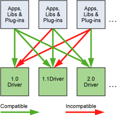

The Driver API Is Backward but Not Forward Compatible

For Tesla GPU products, CUDA 10 introduced a new forward-compatible upgrade path for the user-mode components of the CUDA Driver. This feature is described in [CUDA Compatibility](https://docs.nvidia.com/deploy/cuda-compatibility/index.html). The requirements on the CUDA Driver version described here apply to the version of the user-mode components.

## 3.4. Compute Modes

On Tesla solutions running Windows Server 2008 and later or Linux, one can set any device in a system in one of the three following modes using NVIDIA’s System Management Interface (nvidia-smi), which is a tool distributed as part of the driver:

* *Default* compute mode: Multiple host threads can use the device (by calling `cudaSetDevice()` on this device, when using the runtime API, or by making current a context associated to the device, when using the driver API) at the same time.
* *Exclusive-process* compute mode: Only one CUDA context may be created on the device across all processes in the system. The context may be current to as many threads as desired within the process that created that context.
* *Prohibited* compute mode: No CUDA context can be created on the device.

This means, in particular, that a host thread using the runtime API without explicitly calling `cudaSetDevice()` might be associated with a device other than device 0 if device 0 turns out to be in prohibited mode or in exclusive-process mode and used by another process. `cudaSetValidDevices()` can be used to set a device from a prioritized list of devices.

Note also that, for devices featuring the Pascal architecture onwards (compute capability with major revision number 6 and higher), there exists support for Compute Preemption. This allows compute tasks to be preempted at instruction-level granularity, rather than thread block granularity as in prior Maxwell and Kepler GPU architecture, with the benefit that applications with long-running kernels can be prevented from either monopolizing the system or timing out. However, there will be context switch overheads associated with Compute Preemption, which is automatically enabled on those devices for which support exists. The individual attribute query function `cudaDeviceGetAttribute()` with the attribute `cudaDevAttrComputePreemptionSupported` can be used to determine if the device in use supports Compute Preemption. Users wishing to avoid context switch overheads associated with different processes can ensure that only one process is active on the GPU by selecting exclusive-process mode.

Applications may query the compute mode of a device by checking the `computeMode` device property (see [Device Enumeration](index.md#device-enumeration)).

## 3.5. Mode Switches

GPUs that have a display output dedicate some DRAM memory to the so-called *primary surface*, which is used to refresh the display device whose output is viewed by the user. When users initiate a *mode switch* of the display by changing the resolution or bit depth of the display (using NVIDIA control panel or the Display control panel on Windows), the amount of memory needed for the primary surface changes. For example, if the user changes the display resolution from 1280x1024x32-bit to 1600x1200x32-bit, the system must dedicate 7.68 MB to the primary surface rather than 5.24 MB. (Full-screen graphics applications running with anti-aliasing enabled may require much more display memory for the primary surface.) On Windows, other events that may initiate display mode switches include launching a full-screen DirectX application, hitting Alt+Tab to task switch away from a full-screen DirectX application, or hitting Ctrl+Alt+Del to lock the computer.

If a mode switch increases the amount of memory needed for the primary surface, the system may have to cannibalize memory allocations dedicated to CUDA applications. Therefore, a mode switch results in any call to the CUDA runtime to fail and return an invalid context error.

## 3.6. Tesla Compute Cluster Mode for Windows

Using NVIDIA’s System Management Interface (*nvidia-smi*), the Windows device driver can be put in TCC (Tesla Compute Cluster) mode for devices of the Tesla and Quadro Series.

TCC mode removes support for any graphics functionality.

# 4. Hardware Implementation

The NVIDIA GPU architecture is built around a scalable array of multithreaded *Streaming Multiprocessors* (*SMs*). When a CUDA program on the host CPU invokes a kernel grid, the blocks of the grid are enumerated and distributed to multiprocessors with available execution capacity. The threads of a thread block execute concurrently on one multiprocessor, and multiple thread blocks can execute concurrently on one multiprocessor. As thread blocks terminate, new blocks are launched on the vacated multiprocessors.

A multiprocessor is designed to execute hundreds of threads concurrently. To manage such a large number of threads, it employs a unique architecture called *SIMT* (*Single-Instruction, Multiple-Thread*) that is described in [SIMT Architecture](index.md#simt-architecture). The instructions are pipelined, leveraging instruction-level parallelism within a single thread, as well as extensive thread-level parallelism through simultaneous hardware multithreading as detailed in [Hardware Multithreading](index.md#hardware-multithreading). Unlike CPU cores, they are issued in order and there is no branch prediction or speculative execution.

[SIMT Architecture](index.md#simt-architecture) and [Hardware Multithreading](index.md#hardware-multithreading) describe the architecture features of the streaming multiprocessor that are common to all devices. [Compute Capability 5.x](index.md#compute-capability-5-x), [Compute Capability 6.x](index.md#compute-capability-6-x), and [Compute Capability 7.x](index.md#compute-capability-7-x) provide the specifics for devices of compute capabilities 5.x, 6.x, and 7.x respectively.

The NVIDIA GPU architecture uses a little-endian representation.

## 4.1. SIMT Architecture

The multiprocessor creates, manages, schedules, and executes threads in groups of 32 parallel threads called *warps*. Individual threads composing a warp start together at the same program address, but they have their own instruction address counter and register state and are therefore free to branch and execute independently. The term *warp* originates from weaving, the first parallel thread technology. A *half-warp* is either the first or second half of a warp. A *quarter-warp* is either the first, second, third, or fourth quarter of a warp.

When a multiprocessor is given one or more thread blocks to execute, it partitions them into warps and each warp gets scheduled by a *warp scheduler* for execution. The way a block is partitioned into warps is always the same; each warp contains threads of consecutive, increasing thread IDs with the first warp containing thread 0. [Thread Hierarchy](index.md#thread-hierarchy) describes how thread IDs relate to thread indices in the block.

A warp executes one common instruction at a time, so full efficiency is realized when all 32 threads of a warp agree on their execution path. If threads of a warp diverge via a data-dependent conditional branch, the warp executes each branch path taken, disabling threads that are not on that path. Branch divergence occurs only within a warp; different warps execute independently regardless of whether they are executing common or disjoint code paths.

The SIMT architecture is akin to SIMD (Single Instruction, Multiple Data) vector organizations in that a single instruction controls multiple processing elements. A key difference is that SIMD vector organizations expose the SIMD width to the software, whereas SIMT instructions specify the execution and branching behavior of a single thread. In contrast with SIMD vector machines, SIMT enables programmers to write thread-level parallel code for independent, scalar threads, as well as data-parallel code for coordinated threads. For the purposes of correctness, the programmer can essentially ignore the SIMT behavior; however, substantial performance improvements can be realized by taking care that the code seldom requires threads in a warp to diverge. In practice, this is analogous to the role of cache lines in traditional code: Cache line size can be safely ignored when designing for correctness but must be considered in the code structure when designing for peak performance. Vector architectures, on the other hand, require the software to coalesce loads into vectors and manage divergence manually.

Prior to NVIDIA Volta, warps used a single program counter shared amongst all 32 threads in the warp together with an active mask specifying the active threads of the warp. As a result, threads from the same warp in divergent regions or different states of execution cannot signal each other or exchange data, and algorithms requiring fine-grained sharing of data guarded by locks or mutexes can easily lead to deadlock, depending on which warp the contending threads come from.

Starting with the NVIDIA Volta architecture, *Independent Thread Scheduling* allows full concurrency between threads, regardless of warp. With Independent Thread Scheduling, the GPU maintains execution state per thread, including a program counter and call stack, and can yield execution at a per-thread granularity, either to make better use of execution resources or to allow one thread to wait for data to be produced by another. A schedule optimizer determines how to group active threads from the same warp together into SIMT units. This retains the high throughput of SIMT execution as in prior NVIDIA GPUs, but with much more flexibility: threads can now diverge and reconverge at sub-warp granularity.

Independent Thread Scheduling can lead to a rather different set of threads participating in the executed code than intended if the developer made assumptions about warp-synchronicity[2](#fn2) of previous hardware architectures. In particular, any warp-synchronous code (such as synchronization-free, intra-warp reductions) should be revisited to ensure compatibility with NVIDIA Volta and beyond. See [Compute Capability 7.x](index.md#compute-capability-7-x) for further details.

Note

The threads of a warp that are participating in the current instruction are called the *active* threads, whereas threads not on the current instruction are *inactive* (disabled). Threads can be inactive for a variety of reasons including having exited earlier than other threads of their warp, having taken a different branch path than the branch path currently executed by the warp, or being the last threads of a block whose number of threads is not a multiple of the warp size.

If a non-atomic instruction executed by a warp writes to the same location in global or shared memory for more than one of the threads of the warp, the number of serialized writes that occur to that location varies depending on the compute capability of the device (see [Compute Capability 5.x](index.md#compute-capability-5-x), [Compute Capability 6.x](index.md#compute-capability-6-x), and [Compute Capability 7.x](index.md#compute-capability-7-x)), and which thread performs the final write is undefined.

If an [atomic](index.md#atomic-functions) instruction executed by a warp reads, modifies, and writes to the same location in global memory for more than one of the threads of the warp, each read/modify/write to that location occurs and they are all serialized, but the order in which they occur is undefined.

## 4.2. Hardware Multithreading

The execution context (program counters, registers, and so on) for each warp processed by a multiprocessor is maintained on-chip during the entire lifetime of the warp. Therefore, switching from one execution context to another has no cost, and at every instruction issue time, a warp scheduler selects a warp that has threads ready to execute its next instruction (the [active threads](index.md#simt-architecture-notes) of the warp) and issues the instruction to those threads.

In particular, each multiprocessor has a set of 32-bit registers that are partitioned among the warps, and a *parallel data cache* or *shared memory* that is partitioned among the thread blocks.

The number of blocks and warps that can reside and be processed together on the multiprocessor for a given kernel depends on the amount of registers and shared memory used by the kernel and the amount of registers and shared memory available on the multiprocessor. There are also a maximum number of resident blocks and a maximum number of resident warps per multiprocessor. These limits as well the amount of registers and shared memory available on the multiprocessor are a function of the compute capability of the device and are given in [Compute Capabilities](index.md#compute-capabilities). If there are not enough registers or shared memory available per multiprocessor to process at least one block, the kernel will fail to launch.

The total number of warps in a block is as follows:

\(\text{ceil}\left( \frac{T}{W\_{size}},1 \right)\)

* *T* is the number of threads per block,
* *Wsize* is the warp size, which is equal to 32,
* ceil(x, y) is equal to x rounded up to the nearest multiple of y.

The total number of registers and total amount of shared memory allocated for a block are documented in the CUDA Occupancy Calculator provided in the CUDA Toolkit.

[2](#id20)
:   The term *warp-synchronous* refers to code that implicitly assumes threads in the same warp are synchronized at every instruction.

# 5. Performance Guidelines

## 5.1. Overall Performance Optimization Strategies

Performance optimization revolves around four basic strategies:

* Maximize parallel execution to achieve maximum utilization;
* Optimize memory usage to achieve maximum memory throughput;
* Optimize instruction usage to achieve maximum instruction throughput;
* Minimize memory thrashing.

Which strategies will yield the best performance gain for a particular portion of an application depends on the performance limiters for that portion; optimizing instruction usage of a kernel that is mostly limited by memory accesses will not yield any significant performance gain, for example. Optimization efforts should therefore be constantly directed by measuring and monitoring the performance limiters, for example using the CUDA profiler. Also, comparing the floating-point operation throughput or memory throughput—whichever makes more sense—of a particular kernel to the corresponding peak theoretical throughput of the device indicates how much room for improvement there is for the kernel.

## 5.2. Maximize Utilization

To maximize utilization the application should be structured in a way that it exposes as much parallelism as possible and efficiently maps this parallelism to the various components of the system to keep them busy most of the time.

### 5.2.1. Application Level

At a high level, the application should maximize parallel execution between the host, the devices, and the bus connecting the host to the devices, by using asynchronous functions calls and streams as described in [Asynchronous Concurrent Execution](index.md#asynchronous-concurrent-execution). It should assign to each processor the type of work it does best: serial workloads to the host; parallel workloads to the devices.

For the parallel workloads, at points in the algorithm where parallelism is broken because some threads need to synchronize in order to share data with each other, there are two cases: Either these threads belong to the same block, in which case they should use `__syncthreads()` and share data through shared memory within the same kernel invocation, or they belong to different blocks, in which case they must share data through global memory using two separate kernel invocations, one for writing to and one for reading from global memory. The second case is much less optimal since it adds the overhead of extra kernel invocations and global memory traffic. Its occurrence should therefore be minimized by mapping the algorithm to the CUDA programming model in such a way that the computations that require inter-thread communication are performed within a single thread block as much as possible.

### 5.2.2. Device Level

At a lower level, the application should maximize parallel execution between the multiprocessors of a device.

Multiple kernels can execute concurrently on a device, so maximum utilization can also be achieved by using streams to enable enough kernels to execute concurrently as described in [Asynchronous Concurrent Execution](index.md#asynchronous-concurrent-execution).

### 5.2.3. Multiprocessor Level

At an even lower level, the application should maximize parallel execution between the various functional units within a multiprocessor.

As described in [Hardware Multithreading](index.md#hardware-multithreading), a GPU multiprocessor primarily relies on thread-level parallelism to maximize utilization of its functional units. Utilization is therefore directly linked to the number of resident warps. At every instruction issue time, a warp scheduler selects an instruction that is ready to execute. This instruction can be another independent instruction of the same warp, exploiting instruction-level parallelism, or more commonly an instruction of another warp, exploiting thread-level parallelism. If a ready to execute instruction is selected it is issued to the [active](index.md#simt-architecture-notes) threads of the warp. The number of clock cycles it takes for a warp to be ready to execute its next instruction is called the *latency*, and full utilization is achieved when all warp schedulers always have some instruction to issue for some warp at every clock cycle during that latency period, or in other words, when latency is completely “hidden”. The number of instructions required to hide a latency of L clock cycles depends on the respective throughputs of these instructions (see [Arithmetic Instructions](index.md#arithmetic-instructions) for the throughputs of various arithmetic instructions). If we assume instructions with maximum throughput, it is equal to:

* *4L* for devices of compute capability 5.x, 6.1, 6.2, 7.x and 8.x since for these devices, a multiprocessor issues one instruction per warp over one clock cycle for four warps at a time, as mentioned in [Compute Capabilities](index.md#compute-capabilities).
* *2L* for devices of compute capability 6.0 since for these devices, the two instructions issued every cycle are one instruction for two different warps.

The most common reason a warp is not ready to execute its next instruction is that the instruction’s input operands are not available yet.

If all input operands are registers, latency is caused by register dependencies, i.e., some of the input operands are written by some previous instruction(s) whose execution has not completed yet. In this case, the latency is equal to the execution time of the previous instruction and the warp schedulers must schedule instructions of other warps during that time. Execution time varies depending on the instruction. On devices of compute capability 7.x, for most arithmetic instructions, it is typically 4 clock cycles. This means that 16 active warps per multiprocessor (4 cycles, 4 warp schedulers) are required to hide arithmetic instruction latencies (assuming that warps execute instructions with maximum throughput, otherwise fewer warps are needed). If the individual warps exhibit instruction-level parallelism, i.e. have multiple independent instructions in their instruction stream, fewer warps are needed because multiple independent instructions from a single warp can be issued back to back.

If some input operand resides in off-chip memory, the latency is much higher: typically hundreds of clock cycles. The number of warps required to keep the warp schedulers busy during such high latency periods depends on the kernel code and its degree of instruction-level parallelism. In general, more warps are required if the ratio of the number of instructions with no off-chip memory operands (i.e., arithmetic instructions most of the time) to the number of instructions with off-chip memory operands is low (this ratio is commonly called the arithmetic intensity of the program).

Another reason a warp is not ready to execute its next instruction is that it is waiting at some memory fence ([Memory Fence Functions](index.md#memory-fence-functions)) or synchronization point ([Synchronization Functions](index.md#synchronization-functions)). A synchronization point can force the multiprocessor to idle as more and more warps wait for other warps in the same block to complete execution of instructions prior to the synchronization point. Having multiple resident blocks per multiprocessor can help reduce idling in this case, as warps from different blocks do not need to wait for each other at synchronization points.

The number of blocks and warps residing on each multiprocessor for a given kernel call depends on the execution configuration of the call ([Execution Configuration](index.md#execution-configuration)), the memory resources of the multiprocessor, and the resource requirements of the kernel as described in [Hardware Multithreading](index.md#hardware-multithreading). Register and shared memory usage are reported by the compiler when compiling with the `--ptxas-options=-v` option.

The total amount of shared memory required for a block is equal to the sum of the amount of statically allocated shared memory and the amount of dynamically allocated shared memory.

The number of registers used by a kernel can have a significant impact on the number of resident warps. For example, for devices of compute capability 6.x, if a kernel uses 64 registers and each block has 512 threads and requires very little shared memory, then two blocks (i.e., 32 warps) can reside on the multiprocessor since they require 2x512x64 registers, which exactly matches the number of registers available on the multiprocessor. But as soon as the kernel uses one more register, only one block (i.e., 16 warps) can be resident since two blocks would require 2x512x65 registers, which are more registers than are available on the multiprocessor. Therefore, the compiler attempts to minimize register usage while keeping register spilling (see [Device Memory Accesses](index.md#device-memory-accesses)) and the number of instructions to a minimum. Register usage can be controlled using the `maxrregcount` compiler option or launch bounds as described in [Launch Bounds](index.md#launch-bounds).

The register file is organized as 32-bit registers. So, each variable stored in a register needs at least one 32-bit register, for example, a `double` variable uses two 32-bit registers.

The effect of execution configuration on performance for a given kernel call generally depends on the kernel code. Experimentation is therefore recommended. Applications can also parametrize execution configurations based on register file size and shared memory size, which depends on the compute capability of the device, as well as on the number of multiprocessors and memory bandwidth of the device, all of which can be queried using the runtime (see reference manual).

The number of threads per block should be chosen as a multiple of the warp size to avoid wasting computing resources with under-populated warps as much as possible.

#### 5.2.3.1. Occupancy Calculator

Several API functions exist to assist programmers in choosing thread block size and cluster size based on register and shared memory requirements.

* The occupancy calculator API, `cudaOccupancyMaxActiveBlocksPerMultiprocessor`, can provide an occupancy prediction based on the block size and shared memory usage of a kernel. This function reports occupancy in terms of the number of concurrent thread blocks per multiprocessor.

  + Note that this value can be converted to other metrics. Multiplying by the number of warps per block yields the number of concurrent warps per multiprocessor; further dividing concurrent warps by max warps per multiprocessor gives the occupancy as a percentage.
* The occupancy-based launch configurator APIs, `cudaOccupancyMaxPotentialBlockSize` and `cudaOccupancyMaxPotentialBlockSizeVariableSMem`, heuristically calculate an execution configuration that achieves the maximum multiprocessor-level occupancy.
* The occupancy calculator API, `cudaOccupancyMaxActiveClusters`, can provided occupancy prediction based on the cluster size, block size and shared memory usage of a kernel. This function reports occupancy in terms of number of max active clusters of a given size on the GPU present in the system.

The following code sample calculates the occupancy of MyKernel. It then reports the occupancy level with the ratio between concurrent warps versus maximum warps per multiprocessor.

```
// Device code
__global__ void MyKernel(int *d, int *a, int *b)
{
    int idx = threadIdx.x + blockIdx.x * blockDim.x;
    d[idx] = a[idx] * b[idx];
}

// Host code
int main()
{
    int numBlocks;        // Occupancy in terms of active blocks
    int blockSize = 32;

    // These variables are used to convert occupancy to warps
    int device;
    cudaDeviceProp prop;
    int activeWarps;
    int maxWarps;

    cudaGetDevice(&device);
    cudaGetDeviceProperties(&prop, device);

    cudaOccupancyMaxActiveBlocksPerMultiprocessor(
        &numBlocks,
        MyKernel,
        blockSize,
        0);

    activeWarps = numBlocks * blockSize / prop.warpSize;
    maxWarps = prop.maxThreadsPerMultiProcessor / prop.warpSize;

    std::cout << "Occupancy: " << (double)activeWarps / maxWarps * 100 << "%" << std::endl;

    return 0;
}
```

The following code sample configures an occupancy-based kernel launch of MyKernel according to the user input.

```
// Device code
__global__ void MyKernel(int *array, int arrayCount)
{
    int idx = threadIdx.x + blockIdx.x * blockDim.x;
    if (idx < arrayCount) {
        array[idx] *= array[idx];
    }
}

// Host code
int launchMyKernel(int *array, int arrayCount)
{
    int blockSize;      // The launch configurator returned block size
    int minGridSize;    // The minimum grid size needed to achieve the
                        // maximum occupancy for a full device
                        // launch
    int gridSize;       // The actual grid size needed, based on input
                        // size

    cudaOccupancyMaxPotentialBlockSize(
        &minGridSize,
        &blockSize,
        (void*)MyKernel,
        0,
        arrayCount);

    // Round up according to array size
    gridSize = (arrayCount + blockSize - 1) / blockSize;

    MyKernel<<<gridSize, blockSize>>>(array, arrayCount);
    cudaDeviceSynchronize();

    // If interested, the occupancy can be calculated with
    // cudaOccupancyMaxActiveBlocksPerMultiprocessor

    return 0;
}
```

The following code sample shows how to use the cluster occupancy API to find the max number of active clusters of a given size. Example code below calucaltes occupancy for cluster of size 2 and 128 threads per block.

Cluster size of 8 is forward compatible starting compute capability 9.0, except on GPU hardware or MIG configurations which are too small to support 8 multiprocessors in which case the maximum cluster size will be reduced. But it is recommended that the users query the maximum cluster size before launching a cluster kernel. Max cluster size can be queried using `cudaOccupancyMaxPotentialClusterSize` API.

```
{
  cudaLaunchConfig_t config = {0};
  config.gridDim = number_of_blocks;
  config.blockDim = 128; // threads_per_block = 128
  config.dynamicSmemBytes = dynamic_shared_memory_size;

  cudaLaunchAttribute attribute[1];
  attribute[0].id = cudaLaunchAttributeClusterDimension;
  attribute[0].val.clusterDim.x = 2; // cluster_size = 2
  attribute[0].val.clusterDim.y = 1;
  attribute[0].val.clusterDim.z = 1;
  config.attrs = attribute;
  config.numAttrs = 1;

  int max_cluster_size = 0;
  cudaOccupancyMaxPotentialClusterSize(&max_cluster_size, (void *)kernel, &config);

  int max_active_clusters = 0;
  cudaOccupancyMaxActiveClusters(&max_active_clusters, (void *)kernel, &config);

  std::cout << "Max Active Clusters of size 2: " << max_active_clusters << std::endl;
}
```

The CUDA Nsight Compute User Interface also provides a standalone occupancy calculator and launch configurator implementation in `<CUDA_Toolkit_Path>/include/cuda_occupancy.h` for any use cases that cannot depend on the CUDA software stack. The Nsight Compute version of the occupancy calculator is particularly useful as a learning tool that visualizes the impact of changes to the parameters that affect occupancy (block size, registers per thread, and shared memory per thread).

## 5.3. Maximize Memory Throughput

The first step in maximizing overall memory throughput for the application is to minimize data transfers with low bandwidth.

That means minimizing data transfers between the host and the device, as detailed in [Data Transfer between Host and Device](index.md#data-transfer-between-host-and-device), since these have much lower bandwidth than data transfers between global memory and the device.

That also means minimizing data transfers between global memory and the device by maximizing use of on-chip memory: shared memory and caches (i.e., L1 cache and L2 cache available on devices of compute capability 2.x and higher, texture cache and constant cache available on all devices).

Shared memory is equivalent to a user-managed cache: The application explicitly allocates and accesses it. As illustrated in [CUDA Runtime](index.md#cuda-c-runtime), a typical programming pattern is to stage data coming from device memory into shared memory; in other words, to have each thread of a block:

* Load data from device memory to shared memory,
* Synchronize with all the other threads of the block so that each thread can safely read shared memory locations that were populated by different threads,
* Process the data in shared memory,
* Synchronize again if necessary to make sure that shared memory has been updated with the results,
* Write the results back to device memory.

For some applications (for example, for which global memory access patterns are data-dependent), a traditional hardware-managed cache is more appropriate to exploit data locality. As mentioned in [Compute Capability 7.x](index.md#compute-capability-7-x), [Compute Capability 8.x](index.md#compute-capability-8-x) and [Compute Capability 9.0](index.md#compute-capability-9-0), for devices of compute capability 7.x, 8.x and 9.0, the same on-chip memory is used for both L1 and shared memory, and how much of it is dedicated to L1 versus shared memory is configurable for each kernel call.

The throughput of memory accesses by a kernel can vary by an order of magnitude depending on access pattern for each type of memory. The next step in maximizing memory throughput is therefore to organize memory accesses as optimally as possible based on the optimal memory access patterns described in [Device Memory Accesses](index.md#device-memory-accesses). This optimization is especially important for global memory accesses as global memory bandwidth is low compared to available on-chip bandwidths and arithmetic instruction throughput, so non-optimal global memory accesses generally have a high impact on performance.

### 5.3.1. Data Transfer between Host and Device

Applications should strive to minimize data transfer between the host and the device. One way to accomplish this is to move more code from the host to the device, even if that means running kernels that do not expose enough parallelism to execute on the device with full efficiency. Intermediate data structures may be created in device memory, operated on by the device, and destroyed without ever being mapped by the host or copied to host memory.

Also, because of the overhead associated with each transfer, batching many small transfers into a single large transfer always performs better than making each transfer separately.

On systems with a front-side bus, higher performance for data transfers between host and device is achieved by using page-locked host memory as described in [Page-Locked Host Memory](index.md#page-locked-host-memory).

In addition, when using mapped page-locked memory ([Mapped Memory](index.md#mapped-memory)), there is no need to allocate any device memory and explicitly copy data between device and host memory. Data transfers are implicitly performed each time the kernel accesses the mapped memory. For maximum performance, these memory accesses must be coalesced as with accesses to global memory (see [Device Memory Accesses](index.md#device-memory-accesses)). Assuming that they are and that the mapped memory is read or written only once, using mapped page-locked memory instead of explicit copies between device and host memory can be a win for performance.

On integrated systems where device memory and host memory are physically the same, any copy between host and device memory is superfluous and mapped page-locked memory should be used instead. Applications may query a device is `integrated` by checking that the integrated device property (see [Device Enumeration](index.md#device-enumeration)) is equal to 1.

### 5.3.2. Device Memory Accesses

An instruction that accesses addressable memory (i.e., global, local, shared, constant, or texture memory) might need to be re-issued multiple times depending on the distribution of the memory addresses across the threads within the warp. How the distribution affects the instruction throughput this way is specific to each type of memory and described in the following sections. For example, for global memory, as a general rule, the more scattered the addresses are, the more reduced the throughput is.

**Global Memory**

Global memory resides in device memory and device memory is accessed via 32-, 64-, or 128-byte memory transactions. These memory transactions must be naturally aligned: Only the 32-, 64-, or 128-byte segments of device memory that are aligned to their size (i.e., whose first address is a multiple of their size) can be read or written by memory transactions.

When a warp executes an instruction that accesses global memory, it coalesces the memory accesses of the threads within the warp into one or more of these memory transactions depending on the size of the word accessed by each thread and the distribution of the memory addresses across the threads. In general, the more transactions are necessary, the more unused words are transferred in addition to the words accessed by the threads, reducing the instruction throughput accordingly. For example, if a 32-byte memory transaction is generated for each thread’s 4-byte access, throughput is divided by 8.

How many transactions are necessary and how much throughput is ultimately affected varies with the compute capability of the device. [Compute Capability 5.x](index.md#compute-capability-5-x), [Compute Capability 6.x](index.md#compute-capability-6-x), [Compute Capability 7.x](index.md#compute-capability-7-x), [Compute Capability 8.x](index.md#compute-capability-8-x) and [Compute Capability 9.0](index.md#compute-capability-9-0) give more details on how global memory accesses are handled for various compute capabilities.

To maximize global memory throughput, it is therefore important to maximize coalescing by:

* Following the most optimal access patterns based on [Compute Capability 5.x](index.md#compute-capability-5-x), [Compute Capability 6.x](index.md#compute-capability-6-x), [Compute Capability 7.x](index.md#compute-capability-7-x), [Compute Capability 8.x](index.md#compute-capability-8-x) and [Compute Capability 9.0](index.md#compute-capability-9-0)
* Using data types that meet the size and alignment requirement detailed in the section Size and Alignment Requirement below,
* Padding data in some cases, for example, when accessing a two-dimensional array as described in the section Two-Dimensional Arrays below.

**Size and Alignment Requirement**

Global memory instructions support reading or writing words of size equal to 1, 2, 4, 8, or 16 bytes. Any access (via a variable or a pointer) to data residing in global memory compiles to a single global memory instruction if and only if the size of the data type is 1, 2, 4, 8, or 16 bytes and the data is naturally aligned (i.e., its address is a multiple of that size).

If this size and alignment requirement is not fulfilled, the access compiles to multiple instructions with interleaved access patterns that prevent these instructions from fully coalescing. It is therefore recommended to use types that meet this requirement for data that resides in global memory.

The alignment requirement is automatically fulfilled for the [Built-in Vector Types](index.md#built-in-vector-types).

For structures, the size and alignment requirements can be enforced by the compiler using the alignment specifiers`__align__(8) or                                     __align__(16)`, such as

```
struct __align__(8) {
    float x;
    float y;
};
```

or

```
struct __align__(16) {
    float x;
    float y;
    float z;
};
```

Any address of a variable residing in global memory or returned by one of the memory allocation routines from the driver or runtime API is always aligned to at least 256 bytes.

Reading non-naturally aligned 8-byte or 16-byte words produces incorrect results (off by a few words), so special care must be taken to maintain alignment of the starting address of any value or array of values of these types. A typical case where this might be easily overlooked is when using some custom global memory allocation scheme, whereby the allocations of multiple arrays (with multiple calls to `cudaMalloc()` or `cuMemAlloc()`) is replaced by the allocation of a single large block of memory partitioned into multiple arrays, in which case the starting address of each array is offset from the block’s starting address.

**Two-Dimensional Arrays**

A common global memory access pattern is when each thread of index `(tx,ty)` uses the following address to access one element of a 2D array of width `width`, located at address `BaseAddress` of type `type*` (where `type` meets the requirement described in [Maximize Utilization](index.md#maximize-utilization)):

```
BaseAddress + width * ty + tx
```

For these accesses to be fully coalesced, both the width of the thread block and the width of the array must be a multiple of the warp size.

In particular, this means that an array whose width is not a multiple of this size will be accessed much more efficiently if it is actually allocated with a width rounded up to the closest multiple of this size and its rows padded accordingly. The `cudaMallocPitch()` and `cuMemAllocPitch()` functions and associated memory copy functions described in the reference manual enable programmers to write non-hardware-dependent code to allocate arrays that conform to these constraints.

**Local Memory**

Local memory accesses only occur for some automatic variables as mentioned in [Variable Memory Space Specifiers](index.md#variable-memory-space-specifiers). Automatic variables that the compiler is likely to place in local memory are:

* Arrays for which it cannot determine that they are indexed with constant quantities,
* Large structures or arrays that would consume too much register space,
* Any variable if the kernel uses more registers than available (this is also known as *register spilling*).

Inspection of the *PTX* assembly code (obtained by compiling with the `-ptx` or`-keep` option) will tell if a variable has been placed in local memory during the first compilation phases as it will be declared using the `.local` mnemonic and accessed using the `ld.local` and `st.local` mnemonics. Even if it has not, subsequent compilation phases might still decide otherwise though if they find it consumes too much register space for the targeted architecture: Inspection of the *cubin* object using `cuobjdump` will tell if this is the case. Also, the compiler reports total local memory usage per kernel (`lmem`) when compiling with the `--ptxas-options=-v` option. Note that some mathematical functions have implementation paths that might access local memory.

The local memory space resides in device memory, so local memory accesses have the same high latency and low bandwidth as global memory accesses and are subject to the same requirements for memory coalescing as described in [Device Memory Accesses](index.md#device-memory-accesses). Local memory is however organized such that consecutive 32-bit words are accessed by consecutive thread IDs. Accesses are therefore fully coalesced as long as all threads in a warp access the same relative address (for example, same index in an array variable, same member in a structure variable).

On devices of compute capability 5.x onwards, local memory accesses are always cached in L2 in the same way as global memory accesses (see [Compute Capability 5.x](index.md#compute-capability-5-x) and [Compute Capability 6.x](index.md#compute-capability-6-x)).

**Shared Memory**

Because it is on-chip, shared memory has much higher bandwidth and much lower latency than local or global memory.

To achieve high bandwidth, shared memory is divided into equally-sized memory modules, called banks, which can be accessed simultaneously. Any memory read or write request made of *n* addresses that fall in *n* distinct memory banks can therefore be serviced simultaneously, yielding an overall bandwidth that is *n* times as high as the bandwidth of a single module.

However, if two addresses of a memory request fall in the same memory bank, there is a bank conflict and the access has to be serialized. The hardware splits a memory request with bank conflicts into as many separate conflict-free requests as necessary, decreasing throughput by a factor equal to the number of separate memory requests. If the number of separate memory requests is *n*, the initial memory request is said to cause *n*-way bank conflicts.

To get maximum performance, it is therefore important to understand how memory addresses map to memory banks in order to schedule the memory requests so as to minimize bank conflicts. This is described in [Compute Capability 5.x](index.md#compute-capability-5-x), [Compute Capability 6.x](index.md#compute-capability-6-x), [Compute Capability 7.x](index.md#compute-capability-7-x), [Compute Capability 8.x](index.md#compute-capability-8-x), and [Compute Capability 9.0](index.md#compute-capability-9-0) for devices of compute capability 5.x, 6.x, 7.x, 8.x, and 9.0 respectively.

**Constant Memory**

The constant memory space resides in device memory and is cached in the constant cache.

A request is then split into as many separate requests as there are different memory addresses in the initial request, decreasing throughput by a factor equal to the number of separate requests.

The resulting requests are then serviced at the throughput of the constant cache in case of a cache hit, or at the throughput of device memory otherwise.

**Texture and Surface Memory**

The texture and surface memory spaces reside in device memory and are cached in texture cache, so a texture fetch or surface read costs one memory read from device memory only on a cache miss, otherwise it just costs one read from texture cache. The texture cache is optimized for 2D spatial locality, so threads of the same warp that read texture or surface addresses that are close together in 2D will achieve best performance. Also, it is designed for streaming fetches with a constant latency; a cache hit reduces DRAM bandwidth demand but not fetch latency.

Reading device memory through texture or surface fetching present some benefits that can make it an advantageous alternative to reading device memory from global or constant memory:

* If the memory reads do not follow the access patterns that global or constant memory reads must follow to get good performance, higher bandwidth can be achieved providing that there is locality in the texture fetches or surface reads;
* Addressing calculations are performed outside the kernel by dedicated units;
* Packed data may be broadcast to separate variables in a single operation;
* 8-bit and 16-bit integer input data may be optionally converted to 32 bit floating-point values in the range [0.0, 1.0] or [-1.0, 1.0] (see [Texture Memory](index.md#texture-memory)).

## 5.4. Maximize Instruction Throughput

To maximize instruction throughput the application should:

* Minimize the use of arithmetic instructions with low throughput; this includes trading precision for speed when it does not affect the end result, such as using intrinsic instead of regular functions (intrinsic functions are listed in [Intrinsic Functions](index.md#intrinsic-functions)), single-precision instead of double-precision, or flushing denormalized numbers to zero;
* Minimize divergent warps caused by control flow instructions as detailed in [Control Flow Instructions](index.md#control-flow-instructions)
* Reduce the number of instructions, for example, by optimizing out synchronization points whenever possible as described in [Synchronization Instruction](index.md#synchronization-instruction) or by using restricted pointers as described in [\_\_restrict\_\_](index.md#restrict).

In this section, throughputs are given in number of operations per clock cycle per multiprocessor. For a warp size of 32, one instruction corresponds to 32 operations, so if N is the number of operations per clock cycle, the instruction throughput is N/32 instructions per clock cycle.

All throughputs are for one multiprocessor. They must be multiplied by the number of multiprocessors in the device to get throughput for the whole device.

### 5.4.1. Arithmetic Instructions

[Table 3](index.md#arithmetic-instructions-throughput-native-arithmetic-instructions) gives the throughputs of the arithmetic instructions that are natively supported in hardware for devices of various compute capabilities.

Table 3. Throughput of Native Arithmetic Instructions. (Number of Results per Clock Cycle per Multiprocessor)

| Compute Capability | 5.0, 5.2 | 5.3 | 6.0 | 6.1 | 6.2 | 7.x | 8.0 | 8.6 | 8.9 | 9.0 |
| --- | --- | --- | --- | --- | --- | --- | --- | --- | --- | --- |
| 16-bit floating-point add, multiply, multiply-add | N/A | 256 | 128 | 2 | 256 | 128 | 256[3](#fn3) | | 128 | 256 |
| 32-bit floating-point add, multiply, multiply-add | 128 | | 64 | 128 | | 64 | | 128 | | |
| 64-bit floating-point add, multiply, multiply-add | 4 | | 32 | 4 | | 32[5](#fn5) | 32 | 2 | | 64 |
| 32-bit floating-point reciprocal, reciprocal square root, base-2 logarithm (`__log2f`), base 2 exponential (`exp2f`), sine (`__sinf`), cosine (`__cosf`) | 32 | | 16 | 32 | | 16 | | | | |
| 32-bit integer add, extended-precision add, subtract, extended-precision subtract | 128 | | 64 | 128 | | 64 | | | | |
| 32-bit integer multiply, multiply-add, extended-precision multiply-add | Multiple instruct. | | | | | 64[6](#fn6) | | | | |
| 24-bit integer multiply (`__[u]mul24`) | Multiple instruct. | | | | | | | | | |
| 32-bit integer shift | 64 | | 32 | 64 | | | | | | |
| compare, minimum, maximum | 64 | | 32 | 64 | | | | | | |
| 32-bit integer bit reverse | 64 | | 32 | 64 | | 16 | | | | |
| Bit field extract/insert | 64 | | 32 | 64 | | Multiple Instruct. | | | 64 | |
| 32-bit bitwise AND, OR, XOR | 128 | | 64 | 128 | | 64 | | | | |
| count of leading zeros, most significant non-sign bit | 32 | 16 | 32 | 16 | | | | | | | | | |
| population count | 32 | | 16 | 32 | | 16 | | | | |
| warp shuffle | 32 | | | | | 32[8](#fn8) | 32 | | | |
| warp reduce | Multiple instruct. | | | | | | 16 | | | |
| warp vote | 64 | | | | | | | | | |
| sum of absolute difference | 64 | | 32 | 64 | | | | | | |
| SIMD video instructions `vabsdiff2` | Multiple instruct. | | | | | | | | | |
| SIMD video instructions `vabsdiff4` | Multiple instruct. | | | | | 64 | | | | |
| All other SIMD video instructions | Multiple instruct. | | | | | | | | | |
| Type conversions from 8-bit and 16-bit integer to 32-bit integer types | 32 | | 16 | 32 | | 64 | | | | |
| Type conversions from and to 64-bit types | 4 | | 16 | 4 | | 16[10](#fn10) | 16 | 2 | 2 | 16 |
| All other type conversions | 32 | | 16 | 32 | | 16 | | | | |
| 16-bit DPX | Multiple instruct. | | | | | | | | | 128 |
| 32-bit DPX | Multiple instruct. | | | | | | | | | 64 |

Other instructions and functions are implemented on top of the native instructions. The implementation may be different for devices of different compute capabilities, and the number of native instructions after compilation may fluctuate with every compiler version. For complicated functions, there can be multiple code paths depending on input. `cuobjdump` can be used to inspect a particular implementation in a `cubin` object.

The implementation of some functions are readily available on the CUDA header files (`math_functions.h`, `device_functions.h`, …).

In general, code compiled with `-ftz=true` (denormalized numbers are flushed to zero) tends to have higher performance than code compiled with `-ftz=false`. Similarly, code compiled with `-prec-div=false` (less precise division) tends to have higher performance code than code compiled with `-prec-div=true`, and code compiled with `-prec-sqrt=false` (less precise square root) tends to have higher performance than code compiled with `-prec-sqrt=true`. The nvcc user manual describes these compilation flags in more details.

**Single-Precision Floating-Point Division**

`__fdividef(x, y)` (see [Intrinsic Functions](index.md#intrinsic-functions)) provides faster single-precision floating-point division than the division operator.

**Single-Precision Floating-Point Reciprocal Square Root**

To preserve IEEE-754 semantics the compiler can optimize `1.0/sqrtf()` into `rsqrtf()` only when both reciprocal and square root are approximate, (i.e., with `-prec-div=false` and `-prec-sqrt=false`). It is therefore recommended to invoke `rsqrtf()` directly where desired.

**Single-Precision Floating-Point Square Root**

Single-precision floating-point square root is implemented as a reciprocal square root followed by a reciprocal instead of a reciprocal square root followed by a multiplication so that it gives correct results for 0 and infinity.

**Sine and Cosine**

`sinf(x)`, `cosf(x)`, `tanf(x)`, `sincosf(x)`, and corresponding double-precision instructions are much more expensive and even more so if the argument x is large in magnitude.

More precisely, the argument reduction code (see [Mathematical Functions](index.md#mathematical-functions) for implementation) comprises two code paths referred to as the fast path and the slow path, respectively.

The fast path is used for arguments sufficiently small in magnitude and essentially consists of a few multiply-add operations. The slow path is used for arguments large in magnitude and consists of lengthy computations required to achieve correct results over the entire argument range.

At present, the argument reduction code for the trigonometric functions selects the fast path for arguments whose magnitude is less than `105615.0f` for the single-precision functions, and less than `2147483648.0` for the double-precision functions.

As the slow path requires more registers than the fast path, an attempt has been made to reduce register pressure in the slow path by storing some intermediate variables in local memory, which may affect performance because of local memory high latency and bandwidth (see [Device Memory Accesses](index.md#device-memory-accesses)). At present, 28 bytes of local memory are used by single-precision functions, and 44 bytes are used by double-precision functions. However, the exact amount is subject to change.

Due to the lengthy computations and use of local memory in the slow path, the throughput of these trigonometric functions is lower by one order of magnitude when the slow path reduction is required as opposed to the fast path reduction.

**Integer Arithmetic**

Integer division and modulo operation are costly as they compile to up to 20 instructions. They can be replaced with bitwise operations in some cases: If `n` is a power of 2, (`i/n`) is equivalent to `(i>>log2(n))` and `(i%n)` is equivalent to (`i&(n-1)`); the compiler will perform these conversions if `n` is literal.

`__brev` and `__popc` map to a single instruction and `__brevll` and `__popcll` to a few instructions.

`__[u]mul24` are legacy intrinsic functions that no longer have any reason to be used.

**Half Precision Arithmetic**

In order to achieve good performance for 16-bit precision floating-point add, multiply or multiply-add, it is recommended that the `half2` datatype is used for `half` precision and `__nv_bfloat162` be used for `__nv_bfloat16` precision. Vector intrinsics (for example, `__hadd2`, `__hsub2`, `__hmul2`, `__hfma2`) can then be used to do two operations in a single instruction. Using `half2` or `__nv_bfloat162` in place of two calls using `half` or `__nv_bfloat16` may also help performance of other intrinsics, such as warp shuffles.

The intrinsic `__halves2half2` is provided to convert two `half` precision values to the `half2` datatype.

The intrinsic `__halves2bfloat162` is provided to convert two `__nv_bfloat` precision values to the `__nv_bfloat162` datatype.

**Type Conversion**

Sometimes, the compiler must insert conversion instructions, introducing additional execution cycles. This is the case for:

* Functions operating on variables of type `char` or `short` whose operands generally need to be converted to `int`,
* Double-precision floating-point constants (i.e., those constants defined without any type suffix) used as input to single-precision floating-point computations (as mandated by C/C++ standards).

This last case can be avoided by using single-precision floating-point constants, defined with an `f` suffix such as `3.141592653589793f`, `1.0f`, `0.5f`.

### 5.4.2. Control Flow Instructions

Any flow control instruction (`if`, `switch`, `do`, `for`, `while`) can significantly impact the effective instruction throughput by causing threads of the same warp to diverge (i.e., to follow different execution paths). If this happens, the different executions paths have to be serialized, increasing the total number of instructions executed for this warp.

To obtain best performance in cases where the control flow depends on the thread ID, the controlling condition should be written so as to minimize the number of divergent warps. This is possible because the distribution of the warps across the block is deterministic as mentioned in [SIMT Architecture](index.md#simt-architecture). A trivial example is when the controlling condition only depends on (`threadIdx / warpSize`) where `warpSize` is the warp size. In this case, no warp diverges since the controlling condition is perfectly aligned with the warps.

Sometimes, the compiler may unroll loops or it may optimize out short `if` or `switch` blocks by using branch predication instead, as detailed below. In these cases, no warp can ever diverge. The programmer can also control loop unrolling using the `#pragma unroll` directive (see [#pragma unroll](index.md#pragma-unroll)).

When using branch predication none of the instructions whose execution depends on the controlling condition gets skipped. Instead, each of them is associated with a per-thread condition code or predicate that is set to true or false based on the controlling condition and although each of these instructions gets scheduled for execution, only the instructions with a true predicate are actually executed. Instructions with a false predicate do not write results, and also do not evaluate addresses or read operands.

### 5.4.3. Synchronization Instruction

Throughput for `__syncthreads()` is 32 operations per clock cycle for devices of compute capability 6.0, 16 operations per clock cycle for devices of compute capability 7.x as well as 8.x and 64 operations per clock cycle for devices of compute capability 5.x, 6.1 and 6.2.

Note that `__syncthreads()` can impact performance by forcing the multiprocessor to idle as detailed in [Device Memory Accesses](index.md#device-memory-accesses).

## 5.5. Minimize Memory Thrashing

Applications that constantly allocate and free memory too often may find that the allocation calls tend to get slower over time up to a limit. This is typically expected due to the nature of releasing memory back to the operating system for its own use. For best performance in this regard, we recommend the following:

* Try to size your allocation to the problem at hand. Don’t try to allocate all available memory with `cudaMalloc` / `cudaMallocHost` / `cuMemCreate`, as this forces memory to be resident immediately and prevents other applications from being able to use that memory. This can put more pressure on operating system schedulers, or just prevent other applications using the same GPU from running entirely.
* Try to allocate memory in appropriately sized allocations early in the application and allocations only when the application does not have any use for it. Reduce the number of `cudaMalloc`+`cudaFree` calls in the application, especially in performance-critical regions.
* If an application cannot allocate enough device memory, consider falling back on other memory types such as `cudaMallocHost` or `cudaMallocManaged`, which may not be as performant, but will enable the application to make progress.
* For platforms that support the feature, `cudaMallocManaged` allows for oversubscription, and with the correct `cudaMemAdvise` policies enabled, will allow the application to retain most if not all the performance of `cudaMalloc`. `cudaMallocManaged` also won’t force an allocation to be resident until it is needed or prefetched, reducing the overall pressure on the operating system schedulers and better enabling multi-tenet use cases.

[3](#id21)
:   128 for \_\_nv\_bfloat16

4
:   8 for GeForce GPUs, except for Titan GPUs

[5](#id22)
:   2 for compute capability 7.5 GPUs

[6](#id23)
:   32 for extended-precision

7
:   32 for GeForce GPUs, except for Titan GPUs

[8](#id24)
:   16 for compute capabilities 7.5 GPUs

[9](#id26)
:   8 for GeForce GPUs, except for Titan GPUs

[10](#id25)
:   2 for compute capabilities 7.5 GPUs

# 6. CUDA-Enabled GPUs

<https://developer.nvidia.com/cuda-gpus> lists all CUDA-enabled devices with their compute capability.

The compute capability, number of multiprocessors, clock frequency, total amount of device memory, and other properties can be queried using the runtime (see reference manual).

# 7. C++ Language Extensions

## 7.1. Function Execution Space Specifiers

Function execution space specifiers denote whether a function executes on the host or on the device and whether it is callable from the host or from the device.

### 7.1.1. \_\_global\_\_

The `__global__` execution space specifier declares a function as being a kernel. Such a function is:

* Executed on the device,
* Callable from the host,
* Callable from the device for devices of compute capability 5.0 or higher (see [CUDA Dynamic Parallelism](index.md#cuda-dynamic-parallelism) for more details).

A `__global__` function must have void return type, and cannot be a member of a class.

Any call to a `__global__` function must specify its execution configuration as described in [Execution Configuration](index.md#execution-configuration).

A call to a `__global__` function is asynchronous, meaning it returns before the device has completed its execution.

### 7.1.2. \_\_device\_\_

The `__device__` execution space specifier declares a function that is:

* Executed on the device,
* Callable from the device only.

The `__global__` and `__device__` execution space specifiers cannot be used together.

### 7.1.3. \_\_host\_\_

The `__host__` execution space specifier declares a function that is:

* Executed on the host,
* Callable from the host only.

It is equivalent to declare a function with only the `__host__` execution space specifier or to declare it without any of the `__host__`, `__device__`, or `__global__` execution space specifier; in either case the function is compiled for the host only.

The `__global__` and `__host__` execution space specifiers cannot be used together.

The `__device__` and `__host__` execution space specifiers can be used together however, in which case the function is compiled for both the host and the device. The `__CUDA_ARCH__` macro introduced in [Application Compatibility](index.md#application-compatibility) can be used to differentiate code paths between host and device:

```
__host__ __device__ func()
{
#if __CUDA_ARCH__ >= 800
   // Device code path for compute capability 8.x
#elif __CUDA_ARCH__ >= 700
   // Device code path for compute capability 7.x
#elif __CUDA_ARCH__ >= 600
   // Device code path for compute capability 6.x
#elif __CUDA_ARCH__ >= 500
   // Device code path for compute capability 5.x
#elif !defined(__CUDA_ARCH__)
   // Host code path
#endif
}
```

### 7.1.4. Undefined behavior

A ‘cross-execution space’ call has undefined behavior when:

* `__CUDA_ARCH__` is defined, a call from within a `__global__`, `__device__` or `__host__ __device__` function to a `__host__` function.
* `__CUDA_ARCH__` is undefined, a call from within a `__host__` function to a `__device__` function. [9](#fn9)

### 7.1.5. \_\_noinline\_\_ and \_\_forceinline\_\_

The compiler inlines any `__device__` function when deemed appropriate.

The `__noinline__` function qualifier can be used as a hint for the compiler not to inline the function if possible.

The `__forceinline__` function qualifier can be used to force the compiler to inline the function.

The `__noinline__` and `__forceinline__` function qualifiers cannot be used together, and neither function qualifier can be applied to an inline function.

## 7.2. Variable Memory Space Specifiers

Variable memory space specifiers denote the memory location on the device of a variable.

An automatic variable declared in device code without any of the `__device__`, `__shared__` and `__constant__` memory space specifiers described in this section generally resides in a register. However in some cases the compiler might choose to place it in local memory, which can have adverse performance consequences as detailed in [Device Memory Accesses](index.md#device-memory-accesses).

### 7.2.1. \_\_device\_\_

The `__device__` memory space specifier declares a variable that resides on the device.

At most one of the other memory space specifiers defined in the next three sections may be used together with `__device__` to further denote which memory space the variable belongs to. If none of them is present, the variable:

* Resides in global memory space,
* Has the lifetime of the CUDA context in which it is created,
* Has a distinct object per device,
* Is accessible from all the threads within the grid and from the host through the runtime library `(cudaGetSymbolAddress()` / `cudaGetSymbolSize()` / `cudaMemcpyToSymbol()` / `cudaMemcpyFromSymbol()`).

### 7.2.2. \_\_constant\_\_

The `__constant__` memory space specifier, optionally used together with `__device__`, declares a variable that:

* Resides in constant memory space,
* Has the lifetime of the CUDA context in which it is created,
* Has a distinct object per device,
* Is accessible from all the threads within the grid and from the host through the runtime library (`cudaGetSymbolAddress()` / `cudaGetSymbolSize()` / `cudaMemcpyToSymbol()` / `cudaMemcpyFromSymbol()`).

### 7.2.3. \_\_shared\_\_

The `__shared__` memory space specifier, optionally used together with `__device__`, declares a variable that:

* Resides in the shared memory space of a thread block,
* Has the lifetime of the block,
* Has a distinct object per block,
* Is only accessible from all the threads within the block,
* Does not have a constant address.

When declaring a variable in shared memory as an external array such as

```
extern __shared__ float shared[];
```

the size of the array is determined at launch time (see [Execution Configuration](index.md#execution-configuration)). All variables declared in this fashion, start at the same address in memory, so that the layout of the variables in the array must be explicitly managed through offsets. For example, if one wants the equivalent of

```
short array0[128];
float array1[64];
int   array2[256];
```

in dynamically allocated shared memory, one could declare and initialize the arrays the following way:

```
extern __shared__ float array[];
__device__ void func()      // __device__ or __global__ function
{
    short* array0 = (short*)array;
    float* array1 = (float*)&array0[128];
    int*   array2 =   (int*)&array1[64];
}
```

Note that pointers need to be aligned to the type they point to, so the following code, for example, does not work since array1 is not aligned to 4 bytes.

```
extern __shared__ float array[];
__device__ void func()      // __device__ or __global__ function
{
    short* array0 = (short*)array;
    float* array1 = (float*)&array0[127];
}
```

Alignment requirements for the built-in vector types are listed in [Table 5](index.md#vector-types-alignment-requirements-in-device-code).

### 7.2.4. \_\_grid\_constant\_\_

The `__grid_constant__` annotation for compute architectures greater or equal to 7.0 annotates a `const`-qualified `__global__` function parameter of non-reference type that:

* Has the lifetime of the grid,
* Is private to the grid, i.e., the object is not accessible to host threads and threads from other grids, including sub-grids,
* Has a distinct object per grid, i.e., all threads in the grid see the same address,
* Is read-only, i.e., modifying a `__grid_constant__` object or any of its sub-objects is *undefined behavior*, including `mutable` members.

Requirements:

* Kernel parameters annotated with `__grid_constant__` must have `const`-qualified non-reference types.
* All function declarations must match with respect to any `__grid_constant_` parameters.
* A function template specialization must match the primary template declaration with respect to any `__grid_constant__` parameters.
* A function template instantiation directive must match the primary template declaration with respect to any `__grid_constant__` parameters.

If the address of a `__global__` function parameter is taken, the compiler will ordinarily make a copy of the kernel parameter in thread local memory and use the address of the copy, to partially support C++ semantics, which allow each thread to modify its own local copy of function parameters. Annotating a `__global__` function parameter with `__grid_constant__` ensures that the compiler will not create a copy of the kernel parameter in thread local memory, but will instead use the generic address of the parameter itself. Avoiding the local copy may result in improved performance.

```
__device__ void unknown_function(S const&);
__global__ void kernel(const __grid_constant__ S s) {
   s.x += threadIdx.x;  // Undefined Behavior: tried to modify read-only memory

   // Compiler will _not_ create a per-thread thread local copy of "s":
   unknown_function(s);
}
```

### 7.2.5. \_\_managed\_\_

The `__managed__` memory space specifier, optionally used together with `__device__`, declares a variable that:

* Can be referenced from both device and host code, for example, its address can be taken or it can be read or written directly from a device or host function.
* Has the lifetime of an application.

See [\_\_managed\_\_ Memory Space Specifier](index.md#managed-specifier) for more details.

### 7.2.6. \_\_restrict\_\_

`nvcc` supports restricted pointers via the `__restrict__` keyword.

Restricted pointers were introduced in C99 to alleviate the aliasing problem that exists in C-type languages, and which inhibits all kind of optimization from code re-ordering to common sub-expression elimination.

Here is an example subject to the aliasing issue, where use of restricted pointer can help the compiler to reduce the number of instructions:

```
void foo(const float* a,
         const float* b,
         float* c)
{
    c[0] = a[0] * b[0];
    c[1] = a[0] * b[0];
    c[2] = a[0] * b[0] * a[1];
    c[3] = a[0] * a[1];
    c[4] = a[0] * b[0];
    c[5] = b[0];
    ...
}
```

In C-type languages, the pointers `a`, `b`, and `c` may be aliased, so any write through `c` could modify elements of `a` or `b`. This means that to guarantee functional correctness, the compiler cannot load `a[0]` and `b[0]` into registers, multiply them, and store the result to both `c[0]` and `c[1]`, because the results would differ from the abstract execution model if, say, `a[0]` is really the same location as `c[0]`. So the compiler cannot take advantage of the common sub-expression. Likewise, the compiler cannot just reorder the computation of `c[4]` into the proximity of the computation of `c[0]` and `c[1]` because the preceding write to `c[3]` could change the inputs to the computation of `c[4]`.

By making `a`, `b`, and `c` restricted pointers, the programmer asserts to the compiler that the pointers are in fact not aliased, which in this case means writes through `c` would never overwrite elements of `a` or `b`. This changes the function prototype as follows:

```
void foo(const float* __restrict__ a,
         const float* __restrict__ b,
         float* __restrict__ c);
```

Note that all pointer arguments need to be made restricted for the compiler optimizer to derive any benefit. With the `__restrict__` keywords added, the compiler can now reorder and do common sub-expression elimination at will, while retaining functionality identical with the abstract execution model:

```
void foo(const float* __restrict__ a,
         const float* __restrict__ b,
         float* __restrict__ c)
{
    float t0 = a[0];
    float t1 = b[0];
    float t2 = t0 * t1;
    float t3 = a[1];
    c[0] = t2;
    c[1] = t2;
    c[4] = t2;
    c[2] = t2 * t3;
    c[3] = t0 * t3;
    c[5] = t1;
    ...
}
```

The effects here are a reduced number of memory accesses and reduced number of computations. This is balanced by an increase in register pressure due to “cached” loads and common sub-expressions.

Since register pressure is a critical issue in many CUDA codes, use of restricted pointers can have negative performance impact on CUDA code, due to reduced occupancy.

## 7.3. Built-in Vector Types

### 7.3.1. char, short, int, long, longlong, float, double

These are vector types derived from the basic integer and floating-point types. They are structures and the 1st, 2nd, 3rd, and 4th components are accessible through the fields `x`, `y`, `z`, and `w`, respectively. They all come with a constructor function of the form `make_<type name>`; for example,

```
int2 make_int2(int x, int y);
```

which creates a vector of type `int2` with value`(x, y)`.

The alignment requirements of the vector types are detailed in [Table 5](index.md#vector-types-alignment-requirements-in-device-code).

Table 5. Alignment Requirements

| Type | Alignment |
| --- | --- |
| char1, uchar1 | 1 |
| char2, uchar2 | 2 |
| char3, uchar3 | 1 |
| char4, uchar4 | 4 |
| short1, ushort1 | 2 |
| short2, ushort2 | 4 |
| short3, ushort3 | 2 |
| short4, ushort4 | 8 |
| int1, uint1 | 4 |
| int2, uint2 | 8 |
| int3, uint3 | 4 |
| int4, uint4 | 16 |
| long1, ulong1 | 4 if sizeof(long) is equal to sizeof(int) 8, otherwise |
| long2, ulong2 | 8 if sizeof(long) is equal to sizeof(int), 16, otherwise |
| long3, ulong3 | 4 if sizeof(long) is equal to sizeof(int), 8, otherwise |
| long4, ulong4 | 16 |
| longlong1, ulonglong1 | 8 |
| longlong2, ulonglong2 | 16 |
| longlong3, ulonglong3 | 8 |
| longlong4, ulonglong4 | 16 |
| float1 | 4 |
| float2 | 8 |
| float3 | 4 |
| float4 | 16 |
| double1 | 8 |
| double2 | 16 |
| double3 | 8 |
| double4 | 16 |

### 7.3.2. dim3

This type is an integer vector type based on `uint3` that is used to specify dimensions. When defining a variable of type `dim3`, any component left unspecified is initialized to 1.

## 7.4. Built-in Variables

Built-in variables specify the grid and block dimensions and the block and thread indices. They are only valid within functions that are executed on the device.

### 7.4.1. gridDim

This variable is of type `dim3` (see [dim3](index.md#dim3)) and contains the dimensions of the grid.

### 7.4.2. blockIdx

This variable is of type `uint3` (see [char, short, int, long, longlong, float, double](index.md#vector-types)) and contains the block index within the grid.

### 7.4.3. blockDim

This variable is of type `dim3` (see [dim3](index.md#dim3)) and contains the dimensions of the block.

### 7.4.4. threadIdx

This variable is of type `uint3` (see [char, short, int, long, longlong, float, double](index.md#vector-types) ) and contains the thread index within the block.

### 7.4.5. warpSize

This variable is of type `int` and contains the warp size in threads (see [SIMT Architecture](index.md#simt-architecture) for the definition of a warp).

## 7.5. Memory Fence Functions

The CUDA programming model assumes a device with a weakly-ordered memory model, that is the order in which a CUDA thread writes data to shared memory, global memory, page-locked host memory, or the memory of a peer device is not necessarily the order in which the data is observed being written by another CUDA or host thread. It is undefined behavior for two threads to read from or write to the same memory location without synchronization.

In the following example, thread 1 executes `writeXY()`, while thread 2 executes `readXY()`.

```
__device__ int X = 1, Y = 2;

__device__ void writeXY()
{
    X = 10;
    Y = 20;
}

__device__ void readXY()
{
    int B = Y;
    int A = X;
}
```

The two threads read and write from the same memory locations `X` and `Y` simultaneously. Any data-race is undefined behavior, and has no defined semantics. The resulting values for `A` and `B` can be anything.

Memory fence functions can be used to enforce a [sequentially-consistent](https://en.cppreference.com/w/cpp/atomic/memory_order) ordering on memory accesses. The memory fence functions differ in the [scope](https://nvidia.github.io/libcudacxx/extended_api/thread_scopes.html) in which the orderings are enforced but they are independent of the accessed memory space (shared memory, global memory, page-locked host memory, and the memory of a peer device).

```
void __threadfence_block();
```

is equivalent to [cuda::atomic\_thread\_fence(cuda::memory\_order\_seq\_cst, cuda::thread\_scope\_block)](https://nvidia.github.io/libcudacxx/extended_api/synchronization_primitives/atomic/atomic_thread_fence.html) and ensures that:

* All writes to all memory made by the calling thread before the call to `__threadfence_block()` are observed by all threads in the block of the calling thread as occurring before all writes to all memory made by the calling thread after the call to `__threadfence_block()`;
* All reads from all memory made by the calling thread before the call to `__threadfence_block()` are ordered before all reads from all memory made by the calling thread after the call to `__threadfence_block()`.

```
void __threadfence();
```

is equivalent to [cuda::atomic\_thread\_fence(cuda::memory\_order\_seq\_cst, cuda::thread\_scope\_device)](https://nvidia.github.io/libcudacxx/extended_api/synchronization_primitives/atomic/atomic_thread_fence.html) and ensures that no writes to all memory made by the calling thread after the call to `__threadfence()` are observed by any thread in the device as occurring before any write to all memory made by the calling thread before the call to `__threadfence()`.

```
void __threadfence_system();
```

is equivalent to [cuda::atomic\_thread\_fence(cuda::memory\_order\_seq\_cst, cuda::thread\_scope\_system)](https://nvidia.github.io/libcudacxx/extended_api/synchronization_primitives/atomic/atomic_thread_fence.html) and ensures that all writes to all memory made by the calling thread before the call to `__threadfence_system()` are observed by all threads in the device, host threads, and all threads in peer devices as occurring before all writes to all memory made by the calling thread after the call to `__threadfence_system()`.

`__threadfence_system()` is only supported by devices of compute capability 2.x and higher.

In the previous code sample, we can insert fences in the codes as follows:

```
__device__ int X = 1, Y = 2;

__device__ void writeXY()
{
    X = 10;
    __threadfence();
    Y = 20;
}

__device__ void readXY()
{
    int B = Y;
    __threadfence();
    int A = X;
}
```

For this code, the following outcomes can be observed:

* `A` equal to 1 and `B` equal to 2,
* `A` equal to 10 and `B` equal to 2,
* `A` equal to 10 and `B` equal to 20.

The fourth outcome is not possible, because the first write must be visible before the second write. If thread 1 and 2 belong to the same block, it is enough to use `__threadfence_block()`. If thread 1 and 2 do not belong to the same block, `__threadfence()` must be used if they are CUDA threads from the same device and `__threadfence_system()` must be used if they are CUDA threads from two different devices.

A common use case is when threads consume some data produced by other threads as illustrated by the following code sample of a kernel that computes the sum of an array of N numbers in one call. Each block first sums a subset of the array and stores the result in global memory. When all blocks are done, the last block done reads each of these partial sums from global memory and sums them to obtain the final result. In order to determine which block is finished last, each block atomically increments a counter to signal that it is done with computing and storing its partial sum (see [Atomic Functions](index.md#atomic-functions) about atomic functions). The last block is the one that receives the counter value equal to `gridDim.x-1`. If no fence is placed between storing the partial sum and incrementing the counter, the counter might increment before the partial sum is stored and therefore, might reach `gridDim.x-1` and let the last block start reading partial sums before they have been actually updated in memory.

Memory fence functions only affect the ordering of memory operations by a thread; they do not, by themselves, ensure that these memory operations are visible to other threads (like `__syncthreads()` does for threads within a block (see [Synchronization Functions](index.md#synchronization-functions))). In the code sample below, the visibility of memory operations on the `result` variable is ensured by declaring it as volatile (see [Volatile Qualifier](index.md#volatile-qualifier)).

```
__device__ unsigned int count = 0;
__shared__ bool isLastBlockDone;
__global__ void sum(const float* array, unsigned int N,
                    volatile float* result)
{
    // Each block sums a subset of the input array.
    float partialSum = calculatePartialSum(array, N);

    if (threadIdx.x == 0) {

        // Thread 0 of each block stores the partial sum
        // to global memory. The compiler will use
        // a store operation that bypasses the L1 cache
        // since the "result" variable is declared as
        // volatile. This ensures that the threads of
        // the last block will read the correct partial
        // sums computed by all other blocks.
        result[blockIdx.x] = partialSum;

        // Thread 0 makes sure that the incrementation
        // of the "count" variable is only performed after
        // the partial sum has been written to global memory.
        __threadfence();

        // Thread 0 signals that it is done.
        unsigned int value = atomicInc(&count, gridDim.x);

        // Thread 0 determines if its block is the last
        // block to be done.
        isLastBlockDone = (value == (gridDim.x - 1));
    }

    // Synchronize to make sure that each thread reads
    // the correct value of isLastBlockDone.
    __syncthreads();

    if (isLastBlockDone) {

        // The last block sums the partial sums
        // stored in result[0 .. gridDim.x-1]
        float totalSum = calculateTotalSum(result);

        if (threadIdx.x == 0) {

            // Thread 0 of last block stores the total sum
            // to global memory and resets the count
            // varialble, so that the next kernel call
            // works properly.
            result[0] = totalSum;
            count = 0;
        }
    }
}
```

## 7.6. Synchronization Functions

```
void __syncthreads();
```

waits until all threads in the thread block have reached this point and all global and shared memory accesses made by these threads prior to `__syncthreads()` are visible to all threads in the block.

`__syncthreads()` is used to coordinate communication between the threads of the same block. When some threads within a block access the same addresses in shared or global memory, there are potential read-after-write, write-after-read, or write-after-write hazards for some of these memory accesses. These data hazards can be avoided by synchronizing threads in-between these accesses.

`__syncthreads()` is allowed in conditional code but only if the conditional evaluates identically across the entire thread block, otherwise the code execution is likely to hang or produce unintended side effects.

Devices of compute capability 2.x and higher support three variations of `__syncthreads()` described below.

```
int __syncthreads_count(int predicate);
```

is identical to `__syncthreads()` with the additional feature that it evaluates predicate for all threads of the block and returns the number of threads for which predicate evaluates to non-zero.

```
int __syncthreads_and(int predicate);
```

is identical to `__syncthreads()` with the additional feature that it evaluates predicate for all threads of the block and returns non-zero if and only if predicate evaluates to non-zero for all of them.

```
int __syncthreads_or(int predicate);
```

is identical to `__syncthreads()` with the additional feature that it evaluates predicate for all threads of the block and returns non-zero if and only if predicate evaluates to non-zero for any of them.

```
void __syncwarp(unsigned mask=0xffffffff);
```

will cause the executing thread to wait until all warp lanes named in mask have executed a `__syncwarp()` (with the same mask) before resuming execution. Each calling thread must have its own bit set in the mask and all non-exited threads named in mask must execute a corresponding `__syncwarp()` with the same mask, or the result is undefined.

Executing `__syncwarp()` guarantees memory ordering among threads participating in the barrier. Thus, threads within a warp that wish to communicate via memory can store to memory, execute `__syncwarp()`, and then safely read values stored by other threads in the warp.

Note

For .target sm\_6x or below, all threads in mask must execute the same `__syncwarp()` in convergence, and the union of all values in mask must be equal to the active mask. Otherwise, the behavior is undefined.

## 7.7. Mathematical Functions

The reference manual lists all C/C++ standard library mathematical functions that are supported in device code and all intrinsic functions that are only supported in device code.

[Mathematical Functions](index.md#mathematical-functions-appendix) provides accuracy information for some of these functions when relevant.

## 7.8. Texture Functions

Texture objects are described in [Texture Object API](index.md#texture-object-api)

Texture fetching is described in [Texture Fetching](index.md#texture-fetching).

### 7.8.1. Texture Object API

#### 7.8.1.1. tex1Dfetch()

```
template<class T>
T tex1Dfetch(cudaTextureObject_t texObj, int x);
```

fetches from the region of linear memory specified by the one-dimensional texture object `texObj` using integer texture coordinate `x`. `tex1Dfetch()` only works with non-normalized coordinates, so only the border and clamp addressing modes are supported. It does not perform any texture filtering. For integer types, it may optionally promote the integer to single-precision floating point.

#### 7.8.1.2. tex1D()

```
template<class T>
T tex1D(cudaTextureObject_t texObj, float x);
```

fetches from the CUDA array specified by the one-dimensional texture object `texObj` using texture coordinate `x`.

#### 7.8.1.3. tex1DLod()

```
template<class T>
T tex1DLod(cudaTextureObject_t texObj, float x, float level);
```

fetches from the CUDA array specified by the one-dimensional texture object `texObj` using texture coordinate `x` at the level-of-detail `level`.

#### 7.8.1.4. tex1DGrad()

```
template<class T>
T tex1DGrad(cudaTextureObject_t texObj, float x, float dx, float dy);
```

fetches from the CUDA array specified by the one-dimensional texture object `texObj` using texture coordinate `x`. The level-of-detail is derived from the X-gradient `dx` and Y-gradient `dy`.

#### 7.8.1.5. tex2D()

```
template<class T>
T tex2D(cudaTextureObject_t texObj, float x, float y);
```

fetches from the CUDA array or the region of linear memory specified by the two-dimensional texture object `texObj` using texture coordinate `(x,y)`.

#### 7.8.1.6. tex2D() for sparse CUDA arrays

```
                template<class T>
T tex2D(cudaTextureObject_t texObj, float x, float y, bool* isResident);
```

fetches from the CUDA array specified by the two-dimensional texture object `texObj` using texture coordinate `(x,y)`. Also returns whether the texel is resident in memory via `isResident` pointer. If not, the values fetched will be zeros.

#### 7.8.1.7. tex2Dgather()

```
template<class T>
T tex2Dgather(cudaTextureObject_t texObj,
              float x, float y, int comp = 0);
```

fetches from the CUDA array specified by the 2D texture object `texObj` using texture coordinates `x` and `y` and the `comp` parameter as described in [Texture Gather](index.md#texture-gather).

#### 7.8.1.8. tex2Dgather() for sparse CUDA arrays

```
                template<class T>
T tex2Dgather(cudaTextureObject_t texObj,
            float x, float y, bool* isResident, int comp = 0);
```

fetches from the CUDA array specified by the 2D texture object `texObj` using texture coordinates `x` and `y` and the `comp` parameter as described in [Texture Gather](index.md#texture-gather). Also returns whether the texel is resident in memory via `isResident` pointer. If not, the values fetched will be zeros.

#### 7.8.1.9. tex2DGrad()

```
template<class T>
T tex2DGrad(cudaTextureObject_t texObj, float x, float y,
            float2 dx, float2 dy);
```

fetches from the CUDA array specified by the two-dimensional texture object `texObj` using texture coordinate `(x,y)`. The level-of-detail is derived from the `dx` and `dy` gradients.

#### 7.8.1.10. tex2DGrad() for sparse CUDA arrays

```
                template<class T>
T tex2DGrad(cudaTextureObject_t texObj, float x, float y,
        float2 dx, float2 dy, bool* isResident);
```

fetches from the CUDA array specified by the two-dimensional texture object `texObj` using texture coordinate `(x,y)`. The level-of-detail is derived from the `dx` and `dy` gradients. Also returns whether the texel is resident in memory via `isResident` pointer. If not, the values fetched will be zeros.

#### 7.8.1.11. tex2DLod()

```
template<class T>
tex2DLod(cudaTextureObject_t texObj, float x, float y, float level);
```

fetches from the CUDA array or the region of linear memory specified by the two-dimensional texture object `texObj` using texture coordinate `(x,y)` at level-of-detail `level`.

#### 7.8.1.12. tex2DLod() for sparse CUDA arrays

```
        template<class T>
tex2DLod(cudaTextureObject_t texObj, float x, float y, float level, bool* isResident);
```

fetches from the CUDA array specified by the two-dimensional texture object `texObj` using texture coordinate `(x,y)` at level-of-detail `level`. Also returns whether the texel is resident in memory via `isResident` pointer. If not, the values fetched will be zeros.

#### 7.8.1.13. tex3D()

```
template<class T>
T tex3D(cudaTextureObject_t texObj, float x, float y, float z);
```

fetches from the CUDA array specified by the three-dimensional texture object `texObj` using texture coordinate `(x,y,z)`.

#### 7.8.1.14. tex3D() for sparse CUDA arrays

```
                template<class T>
T tex3D(cudaTextureObject_t texObj, float x, float y, float z, bool* isResident);
```

fetches from the CUDA array specified by the three-dimensional texture object `texObj` using texture coordinate `(x,y,z)`. Also returns whether the texel is resident in memory via `isResident` pointer. If not, the values fetched will be zeros.

#### 7.8.1.15. tex3DLod()

```
template<class T>
T tex3DLod(cudaTextureObject_t texObj, float x, float y, float z, float level);
```

fetches from the CUDA array or the region of linear memory specified by the three-dimensional texture object `texObj` using texture coordinate `(x,y,z)` at level-of-detail `level`.

#### 7.8.1.16. tex3DLod() for sparse CUDA arrays

```
                template<class T>
T tex3DLod(cudaTextureObject_t texObj, float x, float y, float z, float level, bool* isResident);
```

fetches from the CUDA array or the region of linear memory specified by the three-dimensional texture object `texObj` using texture coordinate `(x,y,z)` at level-of-detail `level`. Also returns whether the texel is resident in memory via `isResident` pointer. If not, the values fetched will be zeros.

#### 7.8.1.17. tex3DGrad()

```
template<class T>
T tex3DGrad(cudaTextureObject_t texObj, float x, float y, float z,
            float4 dx, float4 dy);
```

fetches from the CUDA array specified by the three-dimensional texture object `texObj` using texture coordinate `(x,y,z)` at a level-of-detail derived from the X and Y gradients `dx` and `dy`.

#### 7.8.1.18. tex3DGrad() for sparse CUDA arrays

```
                template<class T>
T tex3DGrad(cudaTextureObject_t texObj, float x, float y, float z,
        float4 dx, float4 dy, bool* isResident);
```

fetches from the CUDA array specified by the three-dimensional texture object `texObj` using texture coordinate `(x,y,z)` at a level-of-detail derived from the X and Y gradients `dx` and `dy`. Also returns whether the texel is resident in memory via `isResident` pointer. If not, the values fetched will be zeros.

#### 7.8.1.19. tex1DLayered()

```
template<class T>
T tex1DLayered(cudaTextureObject_t texObj, float x, int layer);
```

fetches from the CUDA array specified by the one-dimensional texture object `texObj` using texture coordinate `x` and index `layer`, as described in [Layered Textures](index.md#layered-textures)

#### 7.8.1.20. tex1DLayeredLod()

```
template<class T>
T tex1DLayeredLod(cudaTextureObject_t texObj, float x, int layer, float level);
```

fetches from the CUDA array specified by the one-dimensional [layered texture](index.md#layered-textures) at layer `layer` using texture coordinate `x` and level-of-detail `level`.

#### 7.8.1.21. tex1DLayeredGrad()

```
template<class T>
T tex1DLayeredGrad(cudaTextureObject_t texObj, float x, int layer,
                   float dx, float dy);
```

fetches from the CUDA array specified by the one-dimensional [layered texture](index.md#layered-textures) at layer `layer` using texture coordinate `x` and a level-of-detail derived from the `dx` and `dy` gradients.

#### 7.8.1.22. tex2DLayered()

```
template<class T>
T tex2DLayered(cudaTextureObject_t texObj,
               float x, float y, int layer);
```

fetches from the CUDA array specified by the two-dimensional texture object `texObj` using texture coordinate `(x,y)` and index `layer`, as described in [Layered Textures](index.md#layered-textures).

#### 7.8.1.23. tex2DLayered() for sparse CUDA arrays

```
                template<class T>
T tex2DLayered(cudaTextureObject_t texObj,
            float x, float y, int layer, bool* isResident);
```

fetches from the CUDA array specified by the two-dimensional texture object `texObj` using texture coordinate `(x,y)` and index `layer`, as described in [Layered Textures](index.md#layered-textures). Also returns whether the texel is resident in memory via `isResident` pointer. If not, the values fetched will be zeros.

#### 7.8.1.24. tex2DLayeredLod()

```
template<class T>
T tex2DLayeredLod(cudaTextureObject_t texObj, float x, float y, int layer,
                  float level);
```

fetches from the CUDA array specified by the two-dimensional [layered texture](index.md#layered-textures) at layer `layer` using texture coordinate `(x,y)`.

#### 7.8.1.25. tex2DLayeredLod() for sparse CUDA arrays

```
                template<class T>
T tex2DLayeredLod(cudaTextureObject_t texObj, float x, float y, int layer,
                float level, bool* isResident);
```

fetches from the CUDA array specified by the two-dimensional [layered texture](index.md#layered-textures) at layer `layer` using texture coordinate `(x,y)`. Also returns whether the texel is resident in memory via `isResident` pointer. If not, the values fetched will be zeros.

#### 7.8.1.26. tex2DLayeredGrad()

```
template<class T>
T tex2DLayeredGrad(cudaTextureObject_t texObj, float x, float y, int layer,
                   float2 dx, float2 dy);
```

fetches from the CUDA array specified by the two-dimensional [layered texture](index.md#layered-textures) at layer `layer` using texture coordinate `(x,y)` and a level-of-detail derived from the `dx` and `dy` gradients.

#### 7.8.1.27. tex2DLayeredGrad() for sparse CUDA arrays

```
                template<class T>
T tex2DLayeredGrad(cudaTextureObject_t texObj, float x, float y, int layer,
                float2 dx, float2 dy, bool* isResident);
```

fetches from the CUDA array specified by the two-dimensional [layered texture](index.md#layered-textures) at layer `layer` using texture coordinate `(x,y)` and a level-of-detail derived from the `dx` and `dy` gradients. Also returns whether the texel is resident in memory via `isResident` pointer. If not, the values fetched will be zeros.

#### 7.8.1.28. texCubemap()

```
template<class T>
T texCubemap(cudaTextureObject_t texObj, float x, float y, float z);
```

fetches the CUDA array specified by the cubemap texture object `texObj` using texture coordinate `(x,y,z)`, as described in [Cubemap Textures](index.md#cubemap-textures).

#### 7.8.1.29. texCubemapGrad()

```
template<class T>
T texCubemapGrad(cudaTextureObject_t texObj, float x, float, y, float z,
                float4 dx, float4 dy);
```

fetches from the CUDA array specified by the cubemap texture object `texObj` using texture coordinate `(x,y,z)` as described in [Cubemap Textures](index.md#cubemap-textures). The level-of-detail used is derived from the `dx` and `dy` gradients.

#### 7.8.1.30. texCubemapLod()

```
template<class T>
T texCubemapLod(cudaTextureObject_t texObj, float x, float, y, float z,
                float level);
```

fetches from the CUDA array specified by the cubemap texture object `texObj` using texture coordinate `(x,y,z)` as described in [Cubemap Textures](index.md#cubemap-textures). The level-of-detail used is given by `level`.

#### 7.8.1.31. texCubemapLayered()

```
template<class T>
T texCubemapLayered(cudaTextureObject_t texObj,
                    float x, float y, float z, int layer);
```

fetches from the CUDA array specified by the cubemap layered texture object `texObj` using texture coordinates `(x,y,z)`, and index `layer`, as described in [Cubemap Layered Textures](index.md#cubemap-layered-textures).

#### 7.8.1.32. texCubemapLayeredGrad()

```
template<class T>
T texCubemapLayeredGrad(cudaTextureObject_t texObj, float x, float y, float z,
                       int layer, float4 dx, float4 dy);
```

fetches from the CUDA array specified by the cubemap layered texture object `texObj` using texture coordinate `(x,y,z)` and index `layer`, as described in [Cubemap Layered Textures](index.md#cubemap-layered-textures), at level-of-detail derived from the `dx` and `dy` gradients.

#### 7.8.1.33. texCubemapLayeredLod()

```
template<class T>
T texCubemapLayeredLod(cudaTextureObject_t texObj, float x, float y, float z,
                       int layer, float level);
```

fetches from the CUDA array specified by the cubemap layered texture object `texObj` using texture coordinate `(x,y,z)` and index `layer`, as described in [Cubemap Layered Textures](index.md#cubemap-layered-textures), at level-of-detail level `level`.

## 7.9. Surface Functions

Surface functions are only supported by devices of compute capability 2.0 and higher.

Surface objects are described in described in [Surface Object API](index.md#surface-object-api-appendix)

In the sections below, `boundaryMode` specifies the boundary mode, that is how out-of-range surface coordinates are handled; it is equal to either `cudaBoundaryModeClamp`, in which case out-of-range coordinates are clamped to the valid range, or `cudaBoundaryModeZero`, in which case out-of-range reads return zero and out-of-range writes are ignored, or `cudaBoundaryModeTrap`, in which case out-of-range accesses cause the kernel execution to fail.

### 7.9.1. Surface Object API

#### 7.9.1.1. surf1Dread()

```
template<class T>
T surf1Dread(cudaSurfaceObject_t surfObj, int x,
               boundaryMode = cudaBoundaryModeTrap);
```

reads the CUDA array specified by the one-dimensional surface object `surfObj` using byte coordinate x.

#### 7.9.1.2. surf1Dwrite

```
template<class T>
void surf1Dwrite(T data,
                  cudaSurfaceObject_t surfObj,
                  int x,
                  boundaryMode = cudaBoundaryModeTrap);
```

writes value data to the CUDA array specified by the one-dimensional surface object `surfObj` at byte coordinate x.

#### 7.9.1.3. surf2Dread()

```
template<class T>
T surf2Dread(cudaSurfaceObject_t surfObj,
              int x, int y,
              boundaryMode = cudaBoundaryModeTrap);
template<class T>
void surf2Dread(T* data,
                 cudaSurfaceObject_t surfObj,
                 int x, int y,
                 boundaryMode = cudaBoundaryModeTrap);
```

reads the CUDA array specified by the two-dimensional surface object `surfObj` using byte coordinates x and y.

#### 7.9.1.4. surf2Dwrite()

```
template<class T>
void surf2Dwrite(T data,
                  cudaSurfaceObject_t surfObj,
                  int x, int y,
                  boundaryMode = cudaBoundaryModeTrap);
```

writes value data to the CUDA array specified by the two-dimensional surface object `surfObj` at byte coordinate x and y.

#### 7.9.1.5. surf3Dread()

```
template<class T>
T surf3Dread(cudaSurfaceObject_t surfObj,
              int x, int y, int z,
              boundaryMode = cudaBoundaryModeTrap);
template<class T>
void surf3Dread(T* data,
                 cudaSurfaceObject_t surfObj,
                 int x, int y, int z,
                 boundaryMode = cudaBoundaryModeTrap);
```

reads the CUDA array specified by the three-dimensional surface object `surfObj` using byte coordinates x, y, and z.

#### 7.9.1.6. surf3Dwrite()

```
template<class T>
void surf3Dwrite(T data,
                  cudaSurfaceObject_t surfObj,
                  int x, int y, int z,
                  boundaryMode = cudaBoundaryModeTrap);
```

writes value data to the CUDA array specified by the three-dimensional object `surfObj` at byte coordinate x, y, and z.

#### 7.9.1.7. surf1DLayeredread()

```
template<class T>
T surf1DLayeredread(
                 cudaSurfaceObject_t surfObj,
                 int x, int layer,
                 boundaryMode = cudaBoundaryModeTrap);
template<class T>
void surf1DLayeredread(T data,
                 cudaSurfaceObject_t surfObj,
                 int x, int layer,
                 boundaryMode = cudaBoundaryModeTrap);
```

reads the CUDA array specified by the one-dimensional layered surface object `surfObj` using byte coordinate x and index `layer`.

#### 7.9.1.8. surf1DLayeredwrite()

```
template<class Type>
void surf1DLayeredwrite(T data,
                 cudaSurfaceObject_t surfObj,
                 int x, int layer,
                 boundaryMode = cudaBoundaryModeTrap);
```

writes value data to the CUDA array specified by the two-dimensional layered surface object `surfObj` at byte coordinate x and index `layer`.

#### 7.9.1.9. surf2DLayeredread()

```
template<class T>
T surf2DLayeredread(
                 cudaSurfaceObject_t surfObj,
                 int x, int y, int layer,
                 boundaryMode = cudaBoundaryModeTrap);
template<class T>
void surf2DLayeredread(T data,
                         cudaSurfaceObject_t surfObj,
                         int x, int y, int layer,
                         boundaryMode = cudaBoundaryModeTrap);
```

reads the CUDA array specified by the two-dimensional layered surface object `surfObj` using byte coordinate x and y, and index `layer`.

#### 7.9.1.10. surf2DLayeredwrite()

```
template<class T>
void surf2DLayeredwrite(T data,
                          cudaSurfaceObject_t surfObj,
                          int x, int y, int layer,
                          boundaryMode = cudaBoundaryModeTrap);
```

writes value data to the CUDA array specified by the one-dimensional layered surface object `surfObj` at byte coordinate x and y, and index `layer`.

#### 7.9.1.11. surfCubemapread()

```
template<class T>
T surfCubemapread(
                 cudaSurfaceObject_t surfObj,
                 int x, int y, int face,
                 boundaryMode = cudaBoundaryModeTrap);
template<class T>
void surfCubemapread(T data,
                 cudaSurfaceObject_t surfObj,
                 int x, int y, int face,
                 boundaryMode = cudaBoundaryModeTrap);
```

reads the CUDA array specified by the cubemap surface object `surfObj` using byte coordinate x and y, and face index face.

#### 7.9.1.12. surfCubemapwrite()

```
template<class T>
void surfCubemapwrite(T data,
                 cudaSurfaceObject_t surfObj,
                 int x, int y, int face,
                 boundaryMode = cudaBoundaryModeTrap);
```

writes value data to the CUDA array specified by the cubemap object `surfObj` at byte coordinate x and y, and face index face.

#### 7.9.1.13. surfCubemapLayeredread()

```
template<class T>
T surfCubemapLayeredread(
             cudaSurfaceObject_t surfObj,
             int x, int y, int layerFace,
             boundaryMode = cudaBoundaryModeTrap);
template<class T>
void surfCubemapLayeredread(T data,
             cudaSurfaceObject_t surfObj,
             int x, int y, int layerFace,
             boundaryMode = cudaBoundaryModeTrap);
```

reads the CUDA array specified by the cubemap layered surface object `surfObj` using byte coordinate x and y, and index `layerFace.`

#### 7.9.1.14. surfCubemapLayeredwrite()

```
template<class T>
void surfCubemapLayeredwrite(T data,
             cudaSurfaceObject_t surfObj,
             int x, int y, int layerFace,
             boundaryMode = cudaBoundaryModeTrap);
```

writes value data to the CUDA array specified by the cubemap layered object `surfObj` at byte coordinate `x` and `y`, and index `layerFace`.

## 7.10. Read-Only Data Cache Load Function

The read-only data cache load function is only supported by devices of compute capability 5.0 and higher.

```
T __ldg(const T* address);
```

returns the data of type `T` located at address `address`, where `T` is `char`, `signed char`, `short`, `int`, `long`, `long long``unsigned char`, `unsigned short`, `unsigned int`, `unsigned long`, `unsigned long long`, `char2`, `char4`, `short2`, `short4`, `int2`, `int4`, `longlong2``uchar2`, `uchar4`, `ushort2`, `ushort4`, `uint2`, `uint4`, `ulonglong2``float`, `float2`, `float4`, `double`, or `double2`. With the `cuda_fp16.h` header included, `T` can be `__half` or `__half2`. Similarly, with the `cuda_bf16.h` header included, `T` can also be `__nv_bfloat16` or `__nv_bfloat162`. The operation is cached in the read-only data cache (see [Global Memory](index.md#global-memory-5-x)).

## 7.11. Load Functions Using Cache Hints

These load functions are only supported by devices of compute capability 5.0 and higher.

```
T __ldcg(const T* address);
T __ldca(const T* address);
T __ldcs(const T* address);
T __ldlu(const T* address);
T __ldcv(const T* address);
```

returns the data of type `T` located at address `address`, where `T` is `char`, `signed char`, `short`, `int`, `long`, `long long``unsigned char`, `unsigned short`, `unsigned int`, `unsigned long`, `unsigned long long`, `char2`, `char4`, `short2`, `short4`, `int2`, `int4`, `longlong2``uchar2`, `uchar4`, `ushort2`, `ushort4`, `uint2`, `uint4`, `ulonglong2``float`, `float2`, `float4`, `double`, or `double2`. With the `cuda_fp16.h` header included, `T` can be `__half` or `__half2`. Similarly, with the `cuda_bf16.h` header included, `T` can also be `__nv_bfloat16` or `__nv_bfloat162`. The operation is using the corresponding cache operator (see [PTX ISA](https://docs.nvidia.com/cuda/parallel-thread-execution/index.html#cache-operators))

## 7.12. Store Functions Using Cache Hints

These store functions are only supported by devices of compute capability 5.0 and higher.

```
void __stwb(T* address, T value);
void __stcg(T* address, T value);
void __stcs(T* address, T value);
void __stwt(T* address, T value);
```

stores the `value` argument of type `T` to the location at address `address`, where `T` is `char`, `signed char`, `short`, `int`, `long`, `long long``unsigned char`, `unsigned short`, `unsigned int`, `unsigned long`, `unsigned long long`, `char2`, `char4`, `short2`, `short4`, `int2`, `int4`, `longlong2``uchar2`, `uchar4`, `ushort2`, `ushort4`, `uint2`, `uint4`, `ulonglong2``float`, `float2`, `float4`, `double`, or `double2`. With the `cuda_fp16.h` header included, `T` can be `__half` or `__half2`. Similarly, with the `cuda_bf16.h` header included, `T` can also be `__nv_bfloat16` or `__nv_bfloat162`. The operation is using the corresponding cache operator (see [PTX ISA](https://docs.nvidia.com/cuda/parallel-thread-execution/index.html#cache-operators) )

## 7.13. Time Function

```
clock_t clock();
long long int clock64();
```

when executed in device code, returns the value of a per-multiprocessor counter that is incremented every clock cycle. Sampling this counter at the beginning and at the end of a kernel, taking the difference of the two samples, and recording the result per thread provides a measure for each thread of the number of clock cycles taken by the device to completely execute the thread, but not of the number of clock cycles the device actually spent executing thread instructions. The former number is greater than the latter since threads are time sliced.

## 7.14. Atomic Functions

An atomic function performs a read-modify-write atomic operation on one 32-bit or 64-bit word residing in global or shared memory. In the case of `float2` or `float4`, the read-modify-write operation is performed on each element of the vector residing in global memory. For example, `atomicAdd()` reads a word at some address in global or shared memory, adds a number to it, and writes the result back to the same address. Atomic functions can only be used in device functions.

The atomic functions described in this section have ordering [cuda::memory\_order\_relaxed](https://en.cppreference.com/w/cpp/atomic/memory_order) and are only atomic at a particular [scope](https://nvidia.github.io/libcudacxx/extended_api/thread_scopes.html):

* Atomic APIs with `_system` suffix (example: `__atomicAdd_system`) are atomic at scope `cuda::thread_scope_system`.
* Atomic APIs without a suffix (example: `__atomicAdd`) are atomic at scope `cuda::thread_scope_device`.
* Atomic APIs with `_block` suffix (example: `__atomicAdd_block`) are atomic at scope `cuda::thread_scope_block`.

In the following example both the CPU and the GPU atomically update an integer value at address `addr`:

```
__global__ void mykernel(int *addr) {
  atomicAdd_system(addr, 10);       // only available on devices with compute capability 6.x
}

void foo() {
  int *addr;
  cudaMallocManaged(&addr, 4);
  *addr = 0;

   mykernel<<<...>>>(addr);
   __sync_fetch_and_add(addr, 10);  // CPU atomic operation
}
```

Note that any atomic operation can be implemented based on `atomicCAS()` (Compare And Swap). For example, `atomicAdd()` for double-precision floating-point numbers is not available on devices with compute capability lower than 6.0 but it can be implemented as follows:

```
#if __CUDA_ARCH__ < 600
__device__ double atomicAdd(double* address, double val)
{
    unsigned long long int* address_as_ull =
                              (unsigned long long int*)address;
    unsigned long long int old = *address_as_ull, assumed;

    do {
        assumed = old;
        old = atomicCAS(address_as_ull, assumed,
                        __double_as_longlong(val +
                               __longlong_as_double(assumed)));

    // Note: uses integer comparison to avoid hang in case of NaN (since NaN != NaN)
    } while (assumed != old);

    return __longlong_as_double(old);
}
#endif
```

There are system-wide and block-wide variants of the following device-wide atomic APIs, with the following exceptions:

* Devices with compute capability less than 6.0 only support device-wide atomic operations,
* Tegra devices with compute capability less than 7.2 do not support system-wide atomic operations.

### 7.14.1. Arithmetic Functions

#### 7.14.1.1. atomicAdd()

```
int atomicAdd(int* address, int val);
unsigned int atomicAdd(unsigned int* address,
                       unsigned int val);
unsigned long long int atomicAdd(unsigned long long int* address,
                                 unsigned long long int val);
float atomicAdd(float* address, float val);
double atomicAdd(double* address, double val);
__half2 atomicAdd(__half2 *address, __half2 val);
__half atomicAdd(__half *address, __half val);
__nv_bfloat162 atomicAdd(__nv_bfloat162 *address, __nv_bfloat162 val);
__nv_bfloat16 atomicAdd(__nv_bfloat16 *address, __nv_bfloat16 val);
float2 atomicAdd(float2* address, float2 val);
float4 atomicAdd(float4* address, float4 val);
```

reads the 16-bit, 32-bit or 64-bit `old` located at the address `address` in global or shared memory, computes `(old + val)`, and stores the result back to memory at the same address. These three operations are performed in one atomic transaction. The function returns `old`.

The 32-bit floating-point version of `atomicAdd()` is only supported by devices of compute capability 2.x and higher.

The 64-bit floating-point version of `atomicAdd()` is only supported by devices of compute capability 6.x and higher.

The 32-bit `__half2` floating-point version of `atomicAdd()` is only supported by devices of compute capability 6.x and higher. The atomicity of the `__half2` or `__nv_bfloat162` add operation is guaranteed separately for each of the two `__half` or `__nv_bfloat16` elements; the entire `__half2` or `__nv_bfloat162` is not guaranteed to be atomic as a single 32-bit access.

The `float2` and `float4` floating-point vector versions of `atomicAdd()` are only supported by devices of compute capability 9.x and higher. The atomicity of the `float2` or `float4` add operation is guaranteed separately for each of the two or four `float` elements; the entire `float2` or `float4` is not guaranteed to be atomic as a single 64-bit or 128-bit access.

The 16-bit `__half` floating-point version of `atomicAdd()` is only supported by devices of compute capability 7.x and higher.

The 16-bit `__nv_bfloat16` floating-point version of `atomicAdd()` is only supported by devices of compute capability 8.x and higher.

The `float2` and `float4` floating-point vector versions of `atomicAdd()` are only supported by devices of compute capability 9.x and higher.

The `float2` and `float4` floating-point vector versions of `atomicAdd()` are only supported for global memory addresses.

#### 7.14.1.2. atomicSub()

```
int atomicSub(int* address, int val);
unsigned int atomicSub(unsigned int* address,
                       unsigned int val);
```

reads the 32-bit word `old` located at the address `address` in global or shared memory, computes `(old - val)`, and stores the result back to memory at the same address. These three operations are performed in one atomic transaction. The function returns `old`.

#### 7.14.1.3. atomicExch()

```
int atomicExch(int* address, int val);
unsigned int atomicExch(unsigned int* address,
                        unsigned int val);
unsigned long long int atomicExch(unsigned long long int* address,
                                  unsigned long long int val);
float atomicExch(float* address, float val);
```

reads the 32-bit or 64-bit word `old` located at the address `address` in global or shared memory and stores `val` back to memory at the same address. These two operations are performed in one atomic transaction. The function returns `old`.

#### 7.14.1.4. atomicMin()

```
int atomicMin(int* address, int val);
unsigned int atomicMin(unsigned int* address,
                       unsigned int val);
unsigned long long int atomicMin(unsigned long long int* address,
                                 unsigned long long int val);
long long int atomicMin(long long int* address,
                                long long int val);
```

reads the 32-bit or 64-bit word `old` located at the address `address` in global or shared memory, computes the minimum of `old` and `val`, and stores the result back to memory at the same address. These three operations are performed in one atomic transaction. The function returns `old`.

The 64-bit version of `atomicMin()` is only supported by devices of compute capability 5.0 and higher.

#### 7.14.1.5. atomicMax()

```
int atomicMax(int* address, int val);
unsigned int atomicMax(unsigned int* address,
                       unsigned int val);
unsigned long long int atomicMax(unsigned long long int* address,
                                 unsigned long long int val);
long long int atomicMax(long long int* address,
                                 long long int val);
```

reads the 32-bit or 64-bit word `old` located at the address `address` in global or shared memory, computes the maximum of `old` and `val`, and stores the result back to memory at the same address. These three operations are performed in one atomic transaction. The function returns `old`.

The 64-bit version of `atomicMax()` is only supported by devices of compute capability 5.0 and higher.

#### 7.14.1.6. atomicInc()

```
unsigned int atomicInc(unsigned int* address,
                       unsigned int val);
```

reads the 32-bit word `old` located at the address `address` in global or shared memory, computes `((old >= val) ? 0 : (old+1))`, and stores the result back to memory at the same address. These three operations are performed in one atomic transaction. The function returns `old`.

#### 7.14.1.7. atomicDec()

```
unsigned int atomicDec(unsigned int* address,
                       unsigned int val);
```

reads the 32-bit word `old` located at the address `address` in global or shared memory, computes `(((old == 0) || (old > val)) ? val : (old-1)` ), and stores the result back to memory at the same address. These three operations are performed in one atomic transaction. The function returns `old`.

#### 7.14.1.8. atomicCAS()

```
int atomicCAS(int* address, int compare, int val);
unsigned int atomicCAS(unsigned int* address,
                       unsigned int compare,
                       unsigned int val);
unsigned long long int atomicCAS(unsigned long long int* address,
                                 unsigned long long int compare,
                                 unsigned long long int val);
unsigned short int atomicCAS(unsigned short int *address,
                             unsigned short int compare,
                             unsigned short int val);
```

reads the 16-bit, 32-bit or 64-bit word `old` located at the address `address` in global or shared memory, computes `(old == compare ? val : old)`, and stores the result back to memory at the same address. These three operations are performed in one atomic transaction. The function returns `old` (Compare And Swap).

### 7.14.2. Bitwise Functions

#### 7.14.2.1. atomicAnd()

```
int atomicAnd(int* address, int val);
unsigned int atomicAnd(unsigned int* address,
                       unsigned int val);
unsigned long long int atomicAnd(unsigned long long int* address,
                                 unsigned long long int val);
```

reads the 32-bit or 64-bit word `old` located at the address `address` in global or shared memory, computes `(old & val`), and stores the result back to memory at the same address. These three operations are performed in one atomic transaction. The function returns `old`.

The 64-bit version of `atomicAnd()` is only supported by devices of compute capability 5.0 and higher.

#### 7.14.2.2. atomicOr()

```
int atomicOr(int* address, int val);
unsigned int atomicOr(unsigned int* address,
                      unsigned int val);
unsigned long long int atomicOr(unsigned long long int* address,
                                unsigned long long int val);
```

reads the 32-bit or 64-bit word `old` located at the address `address` in global or shared memory, computes `(old | val)`, and stores the result back to memory at the same address. These three operations are performed in one atomic transaction. The function returns `old`.

The 64-bit version of `atomicOr()` is only supported by devices of compute capability 5.0 and higher.

#### 7.14.2.3. atomicXor()

```
int atomicXor(int* address, int val);
unsigned int atomicXor(unsigned int* address,
                       unsigned int val);
unsigned long long int atomicXor(unsigned long long int* address,
                                 unsigned long long int val);
```

reads the 32-bit or 64-bit word `old` located at the address `address` in global or shared memory, computes `(old ^ val)`, and stores the result back to memory at the same address. These three operations are performed in one atomic transaction. The function returns `old`.

The 64-bit version of `atomicXor()` is only supported by devices of compute capability 5.0 and higher.

## 7.15. Address Space Predicate Functions

The functions described in this section have unspecified behavior if the argument is a null pointer.

### 7.15.1. \_\_isGlobal()

```
__device__ unsigned int __isGlobal(const void *ptr);
```

Returns 1 if `ptr` contains the generic address of an object in global memory space, otherwise returns 0.

### 7.15.2. \_\_isShared()

```
__device__ unsigned int __isShared(const void *ptr);
```

Returns 1 if `ptr` contains the generic address of an object in shared memory space, otherwise returns 0.

### 7.15.3. \_\_isConstant()

```
__device__ unsigned int __isConstant(const void *ptr);
```

Returns 1 if `ptr` contains the generic address of an object in constant memory space, otherwise returns 0.

### 7.15.4. \_\_isGridConstant()

```
__device__ unsigned int __isGridConstant(const void *ptr);
```

Returns 1 if `ptr` contains the generic address of a kernel parameter annotated with `__grid_constant__`, otherwise returns 0. Only supported for compute architectures greater than or equal to 7.x or later.

### 7.15.5. \_\_isLocal()

```
__device__ unsigned int __isLocal(const void *ptr);
```

Returns 1 if `ptr` contains the generic address of an object in local memory space, otherwise returns 0.

## 7.16. Address Space Conversion Functions

### 7.16.1. \_\_cvta\_generic\_to\_global()

```
__device__ size_t __cvta_generic_to_global(const void *ptr);
```

Returns the result of executing the *PTX*`cvta.to.global` instruction on the generic address denoted by `ptr`.

### 7.16.2. \_\_cvta\_generic\_to\_shared()

```
__device__ size_t __cvta_generic_to_shared(const void *ptr);
```

Returns the result of executing the *PTX*`cvta.to.shared` instruction on the generic address denoted by `ptr`.

### 7.16.3. \_\_cvta\_generic\_to\_constant()

```
__device__ size_t __cvta_generic_to_constant(const void *ptr);
```

Returns the result of executing the *PTX*`cvta.to.const` instruction on the generic address denoted by `ptr`.

### 7.16.4. \_\_cvta\_generic\_to\_local()

```
__device__ size_t __cvta_generic_to_local(const void *ptr);
```

Returns the result of executing the *PTX*`cvta.to.local` instruction on the generic address denoted by `ptr`.

### 7.16.5. \_\_cvta\_global\_to\_generic()

```
__device__ void * __cvta_global_to_generic(size_t rawbits);
```

Returns the generic pointer obtained by executing the *PTX*`cvta.global` instruction on the value provided by `rawbits`.

### 7.16.6. \_\_cvta\_shared\_to\_generic()

```
__device__ void * __cvta_shared_to_generic(size_t rawbits);
```

Returns the generic pointer obtained by executing the *PTX*`cvta.shared` instruction on the value provided by `rawbits`.

### 7.16.7. \_\_cvta\_constant\_to\_generic()

```
__device__ void * __cvta_constant_to_generic(size_t rawbits);
```

Returns the generic pointer obtained by executing the *PTX*`cvta.const` instruction on the value provided by `rawbits`.

### 7.16.8. \_\_cvta\_local\_to\_generic()

```
__device__ void * __cvta_local_to_generic(size_t rawbits);
```

Returns the generic pointer obtained by executing the *PTX*`cvta.local` instruction on the value provided by `rawbits`.

## 7.17. Alloca Function

### 7.17.1. Synopsis

```
__host__ __device__ void * alloca(size_t size);
```

### 7.17.2. Description

The `alloca()` function allocates `size` bytes of memory in the stack frame of the caller. The returned value is a pointer to allocated memory, the beginning of the memory is 16 bytes aligned when the function is invoked from device code. The allocated memory is automatically freed when the caller to `alloca()` is returned.

Note

On Windows platform, `<malloc.h>` must be included before using `alloca()`. Using `alloca()` may cause the stack to overflow, user needs to adjust stack size accordingly.

It is supported with compute capability 5.2 or higher.

### 7.17.3. Example

```
__device__ void foo(unsigned int num) {
    int4 *ptr = (int4 *)alloca(num * sizeof(int4));
    // use of ptr
    ...
}
```

## 7.18. Compiler Optimization Hint Functions

The functions described in this section can be used to provide additional information to the compiler optimizer.

### 7.18.1. \_\_builtin\_assume\_aligned()

```
void * __builtin_assume_aligned (const void *exp, size_t align)
```

Allows the compiler to assume that the argument pointer is aligned to at least `align` bytes, and returns the argument pointer.

Example:

```
void *res = __builtin_assume_aligned(ptr, 32); // compiler can assume 'res' is
                                               // at least 32-byte aligned
```

Three parameter version:

```
void * __builtin_assume_aligned (const void *exp, size_t align,
                                 <integral type> offset)
```

Allows the compiler to assume that `(char *)exp - offset` is aligned to at least `align` bytes, and returns the argument pointer.

Example:

```
void *res = __builtin_assume_aligned(ptr, 32, 8); // compiler can assume
                                                  // '(char *)res - 8' is
                                                  // at least 32-byte aligned.
```

### 7.18.2. \_\_builtin\_assume()

```
void __builtin_assume(bool exp)
```

Allows the compiler to assume that the Boolean argument is true. If the argument is not true at run time, then the behavior is undefined. Note that if the argument has side effects, the behavior is unspecified.

Example:

```
 __device__ int get(int *ptr, int idx) {
   __builtin_assume(idx <= 2);
   return ptr[idx];
}
```

### 7.18.3. \_\_assume()

```
void __assume(bool exp)
```

Allows the compiler to assume that the Boolean argument is true. If the argument is not true at run time, then the behavior is undefined. Note that if the argument has side effects, the behavior is unspecified.

Example:

```
 __device__ int get(int *ptr, int idx) {
   __assume(idx <= 2);
   return ptr[idx];
}
```

### 7.18.4. \_\_builtin\_expect()

```
long __builtin_expect (long exp, long c)
```

Indicates to the compiler that it is expected that `exp == c`, and returns the value of `exp`. Typically used to indicate branch prediction information to the compiler.

Example:

```
// indicate to the compiler that likely "var == 0",
// so the body of the if-block is unlikely to be
// executed at run time.
if (__builtin_expect (var, 0))
  doit ();
```

### 7.18.5. \_\_builtin\_unreachable()

```
void __builtin_unreachable(void)
```

Indicates to the compiler that control flow never reaches the point where this function is being called from. The program has undefined behavior if the control flow does actually reach this point at run time.

Example:

```
// indicates to the compiler that the default case label is never reached.
switch (in) {
case 1: return 4;
case 2: return 10;
default: __builtin_unreachable();
}
```

### 7.18.6. Restrictions

`__assume()` is only supported when using `cl.exe` host compiler. The other functions are supported on all platforms, subject to the following restrictions:

* If the host compiler supports the function, the function can be invoked from anywhere in translation unit.
* Otherwise, the function must be invoked from within the body of a `__device__`/ `__global__`function, or only when the `__CUDA_ARCH__` macro is defined[12](#fn12).

## 7.19. Warp Vote Functions

```
int __all_sync(unsigned mask, int predicate);
int __any_sync(unsigned mask, int predicate);
unsigned __ballot_sync(unsigned mask, int predicate);
unsigned __activemask();
```

Deprecation notice: `__any`, `__all`, and `__ballot` have been deprecated in CUDA 9.0 for all devices.

Removal notice: When targeting devices with compute capability 7.x or higher, `__any`, `__all`, and `__ballot` are no longer available and their sync variants should be used instead.

The warp vote functions allow the threads of a given [warp](index.md#simt-architecture) to perform a reduction-and-broadcast operation. These functions take as input an integer `predicate` from each thread in the warp and compare those values with zero. The results of the comparisons are combined (reduced) across the [active](index.md#simt-architecture-notes) threads of the warp in one of the following ways, broadcasting a single return value to each participating thread:

`__all_sync(unsigned mask, predicate)`:
:   Evaluate `predicate` for all non-exited threads in `mask` and return non-zero if and only if `predicate` evaluates to non-zero for all of them.

`__any_sync(unsigned mask, predicate)`:
:   Evaluate `predicate` for all non-exited threads in `mask` and return non-zero if and only if `predicate` evaluates to non-zero for any of them.

`__ballot_sync(unsigned mask, predicate)`:
:   Evaluate `predicate` for all non-exited threads in `mask` and return an integer whose Nth bit is set if and only if `predicate` evaluates to non-zero for the Nth thread of the warp and the Nth thread is active.

`__activemask()`:
:   Returns a 32-bit integer mask of all currently active threads in the calling warp. The Nth bit is set if the Nth lane in the warp is active when `__activemask()` is called. [Inactive](index.md#simt-architecture-notes) threads are represented by 0 bits in the returned mask. Threads which have exited the program are always marked as inactive. Note that threads that are convergent at an `__activemask()` call are not guaranteed to be convergent at subsequent instructions unless those instructions are synchronizing warp-builtin functions.

For `__all_sync`, `__any_sync`, and `__ballot_sync`, a mask must be passed that specifies the threads participating in the call. A bit, representing the thread’s lane ID, must be set for each participating thread to ensure they are properly converged before the intrinsic is executed by the hardware. Each calling thread must have its own bit set in the mask and all non-exited threads named in mask must execute the same intrinsic with the same mask, or the result is undefined.

These intrinsics do not imply a memory barrier. They do not guarantee any memory ordering.

## 7.20. Warp Match Functions

`__match_any_sync` and `__match_all_sync` perform a broadcast-and-compare operation of a variable between threads within a [warp](index.md#simt-architecture).

Supported by devices of compute capability 7.x or higher.

### 7.20.1. Synopsis

```
unsigned int __match_any_sync(unsigned mask, T value);
unsigned int __match_all_sync(unsigned mask, T value, int *pred);
```

`T` can be `int`, `unsigned int`, `long`, `unsigned long`, `long long`, `unsigned long long`, `float` or `double`.

### 7.20.2. Description

The `__match_sync()` intrinsics permit a broadcast-and-compare of a value `value` across threads in a warp after synchronizing threads named in `mask`.

`__match_any_sync`
:   Returns mask of threads that have same value of `value` in `mask`

`__match_all_sync`
:   Returns `mask` if all threads in `mask` have the same value for `value`; otherwise 0 is returned. Predicate `pred` is set to true if all threads in `mask` have the same value of `value`; otherwise the predicate is set to false.

The new `*_sync` match intrinsics take in a mask indicating the threads participating in the call. A bit, representing the thread’s lane id, must be set for each participating thread to ensure they are properly converged before the intrinsic is executed by the hardware. Each calling thread must have its own bit set in the mask and all non-exited threads named in mask must execute the same intrinsic with the same mask, or the result is undefined.

These intrinsics do not imply a memory barrier. They do not guarantee any memory ordering.

## 7.21. Warp Reduce Functions

The `__reduce_sync(unsigned mask, T value)` intrinsics perform a reduction operation on the data provided in `value` after synchronizing threads named in `mask`. T can be unsigned or signed for {add, min, max} and unsigned only for {and, or, xor} operations.

Supported by devices of compute capability 8.x or higher.

### 7.21.1. Synopsis

```
// add/min/max
unsigned __reduce_add_sync(unsigned mask, unsigned value);
unsigned __reduce_min_sync(unsigned mask, unsigned value);
unsigned __reduce_max_sync(unsigned mask, unsigned value);
int __reduce_add_sync(unsigned mask, int value);
int __reduce_min_sync(unsigned mask, int value);
int __reduce_max_sync(unsigned mask, int value);

// and/or/xor
unsigned __reduce_and_sync(unsigned mask, unsigned value);
unsigned __reduce_or_sync(unsigned mask, unsigned value);
unsigned __reduce_xor_sync(unsigned mask, unsigned value);
```

### 7.21.2. Description

`__reduce_add_sync`, `__reduce_min_sync`, `__reduce_max_sync`
:   Returns the result of applying an arithmetic add, min, or max reduction operation on the values provided in `value` by each thread named in `mask`.

`__reduce_and_sync`, `__reduce_or_sync`, `__reduce_xor_sync`
:   Returns the result of applying a logical AND, OR, or XOR reduction operation on the values provided in `value` by each thread named in `mask`.

The `mask` indicates the threads participating in the call. A bit, representing the thread’s lane id, must be set for each participating thread to ensure they are properly converged before the intrinsic is executed by the hardware. Each calling thread must have its own bit set in the mask and all non-exited threads named in mask must execute the same intrinsic with the same mask, or the result is undefined.

These intrinsics do not imply a memory barrier. They do not guarantee any memory ordering.

## 7.22. Warp Shuffle Functions

`__shfl_sync`, `__shfl_up_sync`, `__shfl_down_sync`, and `__shfl_xor_sync` exchange a variable between threads within a [warp](index.md#simt-architecture).

Supported by devices of compute capability 5.0 or higher.

Deprecation Notice: `__shfl`, `__shfl_up`, `__shfl_down`, and `__shfl_xor` have been deprecated in CUDA 9.0 for all devices.

Removal Notice: When targeting devices with compute capability 7.x or higher, `__shfl`, `__shfl_up`, `__shfl_down`, and `__shfl_xor` are no longer available and their sync variants should be used instead.

### 7.22.1. Synopsis

```
T __shfl_sync(unsigned mask, T var, int srcLane, int width=warpSize);
T __shfl_up_sync(unsigned mask, T var, unsigned int delta, int width=warpSize);
T __shfl_down_sync(unsigned mask, T var, unsigned int delta, int width=warpSize);
T __shfl_xor_sync(unsigned mask, T var, int laneMask, int width=warpSize);
```

`T` can be `int`, `unsigned int`, `long`, `unsigned long`, `long long`, `unsigned long long`, `float` or `double`. With the `cuda_fp16.h` header included, `T` can also be `__half` or `__half2`. Similarly, with the `cuda_bf16.h` header included, `T` can also be `__nv_bfloat16` or `__nv_bfloat162`.

### 7.22.2. Description

The `__shfl_sync()` intrinsics permit exchanging of a variable between threads within a warp without use of shared memory. The exchange occurs simultaneously for all [active](index.md#simt-architecture-notes) threads within the warp (and named in `mask`), moving 4 or 8 bytes of data per thread depending on the type.

Threads within a warp are referred to as *lanes*, and may have an index between 0 and `warpSize-1` (inclusive). Four source-lane addressing modes are supported:

`__shfl_sync()`
:   Direct copy from indexed lane

`__shfl_up_sync()`
:   Copy from a lane with lower ID relative to caller

`__shfl_down_sync()`
:   Copy from a lane with higher ID relative to caller

`__shfl_xor_sync()`
:   Copy from a lane based on bitwise XOR of own lane ID

Threads may only read data from another thread which is actively participating in the `__shfl_sync()` command. If the target thread is [inactive](index.md#simt-architecture-notes), the retrieved value is undefined.

All of the `__shfl_sync()` intrinsics take an optional `width` parameter which alters the behavior of the intrinsic. `width` must have a value which is a power of 2; results are undefined if width is not a power of 2, or is a number greater than `warpSize`.

`__shfl_sync()` returns the value of `var` held by the thread whose ID is given by `srcLane`. If width is less than `warpSize` then each subsection of the warp behaves as a separate entity with a starting logical lane ID of 0. If `srcLane` is outside the range `[0:width-1]`, the value returned corresponds to the value of var held by the `srcLane modulo width` (i.e. within the same subsection).

`__shfl_up_sync()` calculates a source lane ID by subtracting `delta` from the caller’s lane ID. The value of `var` held by the resulting lane ID is returned: in effect, `var` is shifted up the warp by `delta` lanes. If width is less than `warpSize` then each subsection of the warp behaves as a separate entity with a starting logical lane ID of 0. The source lane index will not wrap around the value of `width`, so effectively the lower `delta` lanes will be unchanged.

`__shfl_down_sync()` calculates a source lane ID by adding `delta` to the caller’s lane ID. The value of `var` held by the resulting lane ID is returned: this has the effect of shifting `var` down the warp by `delta` lanes. If width is less than `warpSize` then each subsection of the warp behaves as a separate entity with a starting logical lane ID of 0. As for `__shfl_up_sync()`, the ID number of the source lane will not wrap around the value of width and so the upper `delta` lanes will remain unchanged.

`__shfl_xor_sync()` calculates a source line ID by performing a bitwise XOR of the caller’s lane ID with `laneMask`: the value of `var` held by the resulting lane ID is returned. If `width` is less than `warpSize` then each group of `width` consecutive threads are able to access elements from earlier groups of threads, however if they attempt to access elements from later groups of threads their own value of `var` will be returned. This mode implements a butterfly addressing pattern such as is used in tree reduction and broadcast.

The new `*_sync` shfl intrinsics take in a mask indicating the threads participating in the call. A bit, representing the thread’s lane id, must be set for each participating thread to ensure they are properly converged before the intrinsic is executed by the hardware. Each calling thread must have its own bit set in the mask and all non-exited threads named in mask must execute the same intrinsic with the same mask, or the result is undefined.

Threads may only read data from another thread which is actively participating in the `__shfl_sync()` command. If the target thread is inactive, the retrieved value is undefined.

The `width` must be a power-of-2 (i.e., 2, 4, 8, 16 or 32). Results are unspecified for other values.

These intrinsics do not imply a memory barrier. They do not guarantee any memory ordering.

### 7.22.3. Examples

#### 7.22.3.1. Broadcast of a single value across a warp

```
#include <stdio.h>

__global__ void bcast(int arg) {
    int laneId = threadIdx.x & 0x1f;
    int value;
    if (laneId == 0)        // Note unused variable for
        value = arg;        // all threads except lane 0
    value = __shfl_sync(0xffffffff, value, 0);   // Synchronize all threads in warp, and get "value" from lane 0
    if (value != arg)
        printf("Thread %d failed.\n", threadIdx.x);
}

int main() {
    bcast<<< 1, 32 >>>(1234);
    cudaDeviceSynchronize();

    return 0;
}
```

#### 7.22.3.2. Inclusive plus-scan across sub-partitions of 8 threads

```
#include <stdio.h>

__global__ void scan4() {
    int laneId = threadIdx.x & 0x1f;
    // Seed sample starting value (inverse of lane ID)
    int value = 31 - laneId;

    // Loop to accumulate scan within my partition.
    // Scan requires log2(n) == 3 steps for 8 threads
    // It works by an accumulated sum up the warp
    // by 1, 2, 4, 8 etc. steps.
    for (int i=1; i<=4; i*=2) {
        // We do the __shfl_sync unconditionally so that we
        // can read even from threads which won't do a
        // sum, and then conditionally assign the result.
        int n = __shfl_up_sync(0xffffffff, value, i, 8);
        if ((laneId & 7) >= i)
            value += n;
    }

    printf("Thread %d final value = %d\n", threadIdx.x, value);
}

int main() {
    scan4<<< 1, 32 >>>();
    cudaDeviceSynchronize();

    return 0;
}
```

#### 7.22.3.3. Reduction across a warp

```
#include <stdio.h>

__global__ void warpReduce() {
    int laneId = threadIdx.x & 0x1f;
    // Seed starting value as inverse lane ID
    int value = 31 - laneId;

    // Use XOR mode to perform butterfly reduction
    for (int i=16; i>=1; i/=2)
        value += __shfl_xor_sync(0xffffffff, value, i, 32);

    // "value" now contains the sum across all threads
    printf("Thread %d final value = %d\n", threadIdx.x, value);
}

int main() {
    warpReduce<<< 1, 32 >>>();
    cudaDeviceSynchronize();

    return 0;
}
```

## 7.23. Nanosleep Function

### 7.23.1. Synopsis

```
T __nanosleep(unsigned ns);
```

### 7.23.2. Description

`__nanosleep(ns)` suspends the thread for a sleep duration approximately close to the delay `ns`, specified in nanoseconds.

It is supported with compute capability 7.0 or higher.

### 7.23.3. Example

The following code implements a mutex with exponential back-off.

```
__device__ void mutex_lock(unsigned int *mutex) {
    unsigned int ns = 8;
    while (atomicCAS(mutex, 0, 1) == 1) {
        __nanosleep(ns);
        if (ns < 256) {
            ns *= 2;
        }
    }
}

__device__ void mutex_unlock(unsigned int *mutex) {
    atomicExch(mutex, 0);
}
```

## 7.24. Warp Matrix Functions

C++ warp matrix operations leverage Tensor Cores to accelerate matrix problems of the form `D=A*B+C`. These operations are supported on mixed-precision floating point data for devices of compute capability 7.0 or higher. This requires co-operation from all threads in a [warp](index.md#simt-architecture). In addition, these operations are allowed in conditional code only if the condition evaluates identically across the entire [warp](index.md#simt-architecture), otherwise the code execution is likely to hang.

### 7.24.1. Description

All following functions and types are defined in the namespace `nvcuda::wmma`. Sub-byte operations are considered preview, i.e. the data structures and APIs for them are subject to change and may not be compatible with future releases. This extra functionality is defined in the `nvcuda::wmma::experimental` namespace.

```
template<typename Use, int m, int n, int k, typename T, typename Layout=void> class fragment;

void load_matrix_sync(fragment<...> &a, const T* mptr, unsigned ldm);
void load_matrix_sync(fragment<...> &a, const T* mptr, unsigned ldm, layout_t layout);
void store_matrix_sync(T* mptr, const fragment<...> &a, unsigned ldm, layout_t layout);
void fill_fragment(fragment<...> &a, const T& v);
void mma_sync(fragment<...> &d, const fragment<...> &a, const fragment<...> &b, const fragment<...> &c, bool satf=false);
```

`fragment`
:   An overloaded class containing a section of a matrix distributed across all threads in the warp. The mapping of matrix elements into `fragment` internal storage is unspecified and subject to change in future architectures.

Only certain combinations of template arguments are allowed. The first template parameter specifies how the fragment will participate in the matrix operation. Acceptable values for `Use` are:

* `matrix_a` when the fragment is used as the first multiplicand, `A`,
* `matrix_b` when the fragment is used as the second multiplicand, `B`, or
* `accumulator` when the fragment is used as the source or destination accumulators (`C` or `D`, respectively).

  The `m`, `n` and `k` sizes describe the shape of the warp-wide matrix tiles participating in the multiply-accumulate operation. The dimension of each tile depends on its role. For `matrix_a` the tile takes dimension `m x k`; for `matrix_b` the dimension is `k x n`, and `accumulator` tiles are `m x n`.

  The data type, `T`, may be `double`, `float`, `__half`, `__nv_bfloat16`, `char`, or `unsigned char` for multiplicands and `double`, `float`, `int`, or `__half` for accumulators. As documented in [Element Types and Matrix Sizes](index.md#wmma-type-sizes), limited combinations of accumulator and multiplicand types are supported. The Layout parameter must be specified for `matrix_a` and `matrix_b` fragments. `row_major` or `col_major` indicate that elements within a matrix row or column are contiguous in memory, respectively. The `Layout` parameter for an `accumulator` matrix should retain the default value of `void`. A row or column layout is specified only when the accumulator is loaded or stored as described below.

`load_matrix_sync`
:   Waits until all warp lanes have arrived at load\_matrix\_sync and then loads the matrix fragment a from memory. `mptr` must be a 256-bit aligned pointer pointing to the first element of the matrix in memory. `ldm` describes the stride in elements between consecutive rows (for row major layout) or columns (for column major layout) and must be a multiple of 8 for `__half` element type or multiple of 4 for `float` element type. (i.e., multiple of 16 bytes in both cases). If the fragment is an `accumulator`, the `layout` argument must be specified as either `mem_row_major` or `mem_col_major`. For `matrix_a` and `matrix_b` fragments, the layout is inferred from the fragment’s `layout` parameter. The values of `mptr`, `ldm`, `layout` and all template parameters for `a` must be the same for all threads in the warp. This function must be called by all threads in the warp, or the result is undefined.

`store_matrix_sync`
:   Waits until all warp lanes have arrived at store\_matrix\_sync and then stores the matrix fragment a to memory. `mptr` must be a 256-bit aligned pointer pointing to the first element of the matrix in memory. `ldm` describes the stride in elements between consecutive rows (for row major layout) or columns (for column major layout) and must be a multiple of 8 for `__half` element type or multiple of 4 for `float` element type. (i.e., multiple of 16 bytes in both cases). The layout of the output matrix must be specified as either `mem_row_major` or `mem_col_major`. The values of `mptr`, `ldm`, `layout` and all template parameters for a must be the same for all threads in the warp.

`fill_fragment`
:   Fill a matrix fragment with a constant value `v`. Because the mapping of matrix elements to each fragment is unspecified, this function is ordinarily called by all threads in the warp with a common value for `v`.

`mma_sync`
:   Waits until all warp lanes have arrived at mma\_sync, and then performs the warp-synchronous matrix multiply-accumulate operation `D=A*B+C`. The in-place operation, `C=A*B+C`, is also supported. The value of `satf` and template parameters for each matrix fragment must be the same for all threads in the warp. Also, the template parameters `m`, `n` and `k` must match between fragments `A`, `B`, `C` and `D`. This function must be called by all threads in the warp, or the result is undefined.

If `satf` (saturate to finite value) mode is `true`, the following additional numerical properties apply for the destination accumulator:

* If an element result is +Infinity, the corresponding accumulator will contain `+MAX_NORM`
* If an element result is -Infinity, the corresponding accumulator will contain `-MAX_NORM`
* If an element result is NaN, the corresponding accumulator will contain `+0`

Because the map of matrix elements into each thread’s `fragment` is unspecified, individual matrix elements must be accessed from memory (shared or global) after calling `store_matrix_sync`. In the special case where all threads in the warp will apply an element-wise operation uniformly to all fragment elements, direct element access can be implemented using the following `fragment` class members.

```
enum fragment<Use, m, n, k, T, Layout>::num_elements;
T fragment<Use, m, n, k, T, Layout>::x[num_elements];
```

As an example, the following code scales an `accumulator` matrix tile by half.

```
wmma::fragment<wmma::accumulator, 16, 16, 16, float> frag;
float alpha = 0.5f; // Same value for all threads in warp
/*...*/
for(int t=0; t<frag.num_elements; t++)
frag.x[t] *= alpha;
```

### 7.24.2. Alternate Floating Point

Tensor Cores support alternate types of floating point operations on devices with compute capability 8.0 and higher.

`__nv_bfloat16`
:   This data format is an alternate fp16 format that has the same range as f32 but reduced precision (7 bits). You can use this data format directly with the `__nv_bfloat16` type available in `cuda_bf16.h`. Matrix fragments with `__nv_bfloat16` data types are required to be composed with accumulators of `float` type. The shapes and operations supported are the same as with `__half`.

`tf32`
:   This data format is a special floating point format supported by Tensor Cores, with the same range as f32 and reduced precision (>=10 bits). The internal layout of this format is implementation defined. In order to use this floating point format with WMMA operations, the input matrices must be manually converted to tf32 precision.

    To facilitate conversion, a new intrinsic `__float_to_tf32` is provided. While the input and output arguments to the intrinsic are of `float` type, the output will be `tf32` numerically. This new precision is intended to be used with Tensor Cores only, and if mixed with other `float`type operations, the precision and range of the result will be undefined.

    Once an input matrix (`matrix_a` or `matrix_b`) is converted to tf32 precision, the combination of a `fragment` with `precision::tf32` precision, and a data type of `float` to `load_matrix_sync` will take advantage of this new capability. Both the accumulator fragments must have `float` data types. The only supported matrix size is 16x16x8 (m-n-k).

    The elements of the fragment are represented as `float`, hence the mapping from `element_type<T>` to `storage_element_type<T>` is:

    ```
    precision::tf32 -> float
    ```

### 7.24.3. Double Precision

Tensor Cores support double-precision floating point operations on devices with compute capability 8.0 and higher. To use this new functionality, a `fragment` with the `double` type must be used. The `mma_sync` operation will be performed with the .rn (rounds to nearest even) rounding modifier.

### 7.24.4. Sub-byte Operations

Sub-byte WMMA operations provide a way to access the low-precision capabilities of Tensor Cores. They are considered a preview feature i.e. the data structures and APIs for them are subject to change and may not be compatible with future releases. This functionality is available via the `nvcuda::wmma::experimental` namespace:

```
namespace experimental {
    namespace precision {
        struct u4; // 4-bit unsigned
        struct s4; // 4-bit signed
        struct b1; // 1-bit
   }
    enum bmmaBitOp {
        bmmaBitOpXOR = 1, // compute_75 minimum
        bmmaBitOpAND = 2  // compute_80 minimum
    };
    enum bmmaAccumulateOp { bmmaAccumulateOpPOPC = 1 };
}
```

For 4 bit precision, the APIs available remain the same, but you must specify `experimental::precision::u4` or `experimental::precision::s4` as the fragment data type. Since the elements of the fragment are packed together, `num_storage_elements` will be smaller than `num_elements` for that fragment. The `num_elements` variable for a sub-byte fragment, hence returns the number of elements of sub-byte type `element_type<T>`. This is true for single bit precision as well, in which case, the mapping from `element_type<T>` to `storage_element_type<T>` is as follows:

```
experimental::precision::u4 -> unsigned (8 elements in 1 storage element)
experimental::precision::s4 -> int (8 elements in 1 storage element)
experimental::precision::b1 -> unsigned (32 elements in 1 storage element)
T -> T  //all other types
```

The allowed layouts for sub-byte fragments is always `row_major` for `matrix_a` and `col_major` for `matrix_b`.

For sub-byte operations the value of `ldm` in `load_matrix_sync` should be a multiple of 32 for element type `experimental::precision::u4` and `experimental::precision::s4` or a multiple of 128 for element type `experimental::precision::b1` (i.e., multiple of 16 bytes in both cases).

Note

Support for the following variants for MMA instructions is deprecated and will be removed in sm\_90:

> * `experimental::precision::u4`
> * `experimental::precision::s4`
> * `experimental::precision::b1` with `bmmaBitOp` set to `bmmaBitOpXOR`

`bmma_sync`
:   Waits until all warp lanes have executed bmma\_sync, and then performs the warp-synchronous bit matrix multiply-accumulate operation `D = (A op B) + C`, where `op` consists of a logical operation `bmmaBitOp` followed by the accumulation defined by `bmmaAccumulateOp`. The available operations are:

    `bmmaBitOpXOR`, a 128-bit XOR of a row in `matrix_a` with the 128-bit column of `matrix_b`

    `bmmaBitOpAND`, a 128-bit AND of a row in `matrix_a` with the 128-bit column of `matrix_b`, available on devices with compute capability 8.0 and higher.

    The accumulate op is always `bmmaAccumulateOpPOPC` which counts the number of set bits.

### 7.24.5. Restrictions

The special format required by tensor cores may be different for each major and minor device architecture. This is further complicated by threads holding only a fragment (opaque architecture-specific ABI data structure) of the overall matrix, with the developer not allowed to make assumptions on how the individual parameters are mapped to the registers participating in the matrix multiply-accumulate.

Since fragments are architecture-specific, it is unsafe to pass them from function A to function B if the functions have been compiled for different link-compatible architectures and linked together into the same device executable. In this case, the size and layout of the fragment will be specific to one architecture and using WMMA APIs in the other will lead to incorrect results or potentially, corruption.

An example of two link-compatible architectures, where the layout of the fragment differs, is sm\_70 and sm\_75.

```
fragA.cu: void foo() { wmma::fragment<...> mat_a; bar(&mat_a); }
fragB.cu: void bar(wmma::fragment<...> *mat_a) { // operate on mat_a }
```

```
// sm_70 fragment layout
$> nvcc -dc -arch=compute_70 -code=sm_70 fragA.cu -o fragA.o
// sm_75 fragment layout
$> nvcc -dc -arch=compute_75 -code=sm_75 fragB.cu -o fragB.o
// Linking the two together
$> nvcc -dlink -arch=sm_75 fragA.o fragB.o -o frag.o
```

This undefined behavior might also be undetectable at compilation time and by tools at runtime, so extra care is needed to make sure the layout of the fragments is consistent. This linking hazard is most likely to appear when linking with a legacy library that is both built for a different link-compatible architecture and expecting to be passed a WMMA fragment.

Note that in the case of weak linkages (for example, a CUDA C++ inline function), the linker may choose any available function definition which may result in implicit passes between compilation units.

To avoid these sorts of problems, the matrix should always be stored out to memory for transit through external interfaces (e.g. `wmma::store_matrix_sync(dst, …);`) and then it can be safely passed to `bar()` as a pointer type [e.g. `float *dst`].

Note that since sm\_70 can run on sm\_75, the above example sm\_75 code can be changed to sm\_70 and correctly work on sm\_75. However, it is recommended to have sm\_75 native code in your application when linking with other sm\_75 separately compiled binaries.

### 7.24.6. Element Types and Matrix Sizes

Tensor Cores support a variety of element types and matrix sizes. The following table presents the various combinations of `matrix_a`, `matrix_b` and `accumulator` matrix supported:

| Matrix A | Matrix B | Accumulator | Matrix Size (m-n-k) |
| --- | --- | --- | --- |
| \_\_half | \_\_half | float | 16x16x16 |
| \_\_half | \_\_half | float | 32x8x16 |
| \_\_half | \_\_half | float | 8x32x16 |
| \_\_half | \_\_half | \_\_half | 16x16x16 |
| \_\_half | \_\_half | \_\_half | 32x8x16 |
| \_\_half | \_\_half | \_\_half | 8x32x16 |
| unsigned char | unsigned char | int | 16x16x16 |
| unsigned char | unsigned char | int | 32x8x16 |
| unsigned char | unsigned char | int | 8x32x16 |
| signed char | signed char | int | 16x16x16 |
| signed char | signed char | int | 32x8x16 |
| signed char | signed char | int | 8x32x16 |

Alternate Floating Point support:

| Matrix A | Matrix B | Accumulator | Matrix Size (m-n-k) |
| --- | --- | --- | --- |
| \_\_nv\_bfloat16 | \_\_nv\_bfloat16 | float | 16x16x16 |
| \_\_nv\_bfloat16 | \_\_nv\_bfloat16 | float | 32x8x16 |
| \_\_nv\_bfloat16 | \_\_nv\_bfloat16 | float | 8x32x16 |
| precision::tf32 | precision::tf32 | float | 16x16x8 |

Double Precision Support:

| Matrix A | Matrix B | Accumulator | Matrix Size (m-n-k) |
| --- | --- | --- | --- |
| double | double | double | 8x8x4 |

Experimental support for sub-byte operations:

| Matrix A | Matrix B | Accumulator | Matrix Size (m-n-k) |
| --- | --- | --- | --- |
| precision::u4 | precision::u4 | int | 8x8x32 |
| precision::s4 | precision::s4 | int | 8x8x32 |
| precision::b1 | precision::b1 | int | 8x8x128 |

### 7.24.7. Example

The following code implements a 16x16x16 matrix multiplication in a single warp.

```
#include <mma.h>
using namespace nvcuda;

__global__ void wmma_ker(half *a, half *b, float *c) {
   // Declare the fragments
   wmma::fragment<wmma::matrix_a, 16, 16, 16, half, wmma::col_major> a_frag;
   wmma::fragment<wmma::matrix_b, 16, 16, 16, half, wmma::row_major> b_frag;
   wmma::fragment<wmma::accumulator, 16, 16, 16, float> c_frag;

   // Initialize the output to zero
   wmma::fill_fragment(c_frag, 0.0f);

   // Load the inputs
   wmma::load_matrix_sync(a_frag, a, 16);
   wmma::load_matrix_sync(b_frag, b, 16);

   // Perform the matrix multiplication
   wmma::mma_sync(c_frag, a_frag, b_frag, c_frag);

   // Store the output
   wmma::store_matrix_sync(c, c_frag, 16, wmma::mem_row_major);
}
```

## 7.25. DPX

DPX is a set of functions that enable finding min and max values, as well as fused addition and min/max, for up to three 16 and 32-bit signed or unsigned integer parameters, with optional ReLU (clamping to zero):

* three parameters: `__vimax3_s32`, `__vimax3_s16x2`, `__vimax3_u32`, `__vimax3_u16x2`, `__vimin3_s32`, `__vimin3_s16x2`, `__vimin3_u32`, `__vimin3_u16x2`
* two parameters, with ReLU: `__vimax_s32_relu`, `__vimax_s16x2_relu`, `__vimin_s32_relu`, `__vimin_s16x2_relu`
* three parameters, with ReLU: `__vimax3_s32_relu`, `__vimax3_s16x2_relu`, `__vimin3_s32_relu`, `__vimin3_s16x2_relu`
* two parameters, also returning which parameter was smaller/larger: `__vibmax_s32`, `__vibmax_u32`, `__vibmin_s32`, `__vibmin_u32`, `__vibmax_s16x2`, `__vibmax_u16x2`, `__vibmin_s16x2`, `__vibmin_u16x2`
* three parameters, comparing (first + second) with the third: `__viaddmax_s32`, `__viaddmax_s16x2`, `__viaddmax_u32`, `__viaddmax_u16x2`, `__viaddmin_s32`, `__viaddmin_s16x2`, `__viaddmin_u32`, `__viaddmin_u16x2`
* three parameters, with ReLU, comparing (first + second) with the third and a zero: `__viaddmax_s32_relu`, `__viaddmax_s16x2_relu`, `__viaddmin_s32_relu`, `__viaddmin_s16x2_relu`

These instructions are hardware-accelerated on devices with compute capability 9 and higher, and software emulation on older devices.

Full API can be found in [CUDA Math API documentation](https://docs.nvidia.com/cuda/cuda-math-api/group__CUDA__MATH__INTRINSIC__SIMD.html).

DPX is exceptionally useful when implementing dynamic programming algorithms, such as Smith-Waterman or Needleman–Wunsch in genomics and Floyd-Warshall in route optimization.

### 7.25.1. Examples

Max value of three signed 32-bit integers, with ReLU

```
const int a = -15;
const int b = 8;
const int c = 5;
int max_value_0 = __vimax3_s32_relu(a, b, c); // max(-15, 8, 5, 0) = 8
const int d = -2;
const int e = -4;
int max_value_1 = __vimax3_s32_relu(a, d, e); // max(-15, -2, -4, 0) = 0
```

Min value of the sum of two 32-bit signed integers, another 32-bit signed integer and a zero (ReLU)

```
const int a = -5;
const int b = 6;
const int c = -2;
int max_value_0 = __viaddmax_s32_relu(a, b, c); // max(-5 + 6, -2, 0) = max(1, -2, 0) = 1
const int d = 4;
int max_value_1 = __viaddmax_s32_relu(a, d, c); // max(-5 + 4, -2, 0) = max(-1, -2, 0) = 0
```

Min value of two unsigned 32-bit integers and determining which value is smaller

```
const unsigned int a = 9;
const unsigned int b = 6;
bool smaller_value;
unsigned int min_value = __vibmin_u32(a, b, &smaller_value); // min_value is 6, smaller_value is true
```

Max values of three pairs of unsigned 16-bit integers

```
const unsigned a = 0x00050002;
const unsigned b = 0x00070004;
const unsigned c = 0x00020006;
unsigned int max_value = __vimax3_u16x2(a, b, c); // max(5, 7, 2) and max(2, 4, 6), so max_value is 0x00070006
```

## 7.26. Asynchronous Barrier

The NVIDIA C++ standard library introduces a GPU implementation of [std::barrier](https://nvidia.github.io/libcudacxx/extended_api/synchronization_primitives/barrier.html). Along with the implementation of `std::barrier` the library provides extensions that allow users to specify the scope of barrier objects. The barrier API scopes are documented under [Thread Scopes](https://nvidia.github.io/libcudacxx/extended_api/thread_scopes.html). Devices of compute capability 8.0 or higher provide hardware acceleration for barrier operations and integration of these barriers with the [memcpy\_async](index.md#asynchronous-data-copies) feature. On devices with compute capability below 8.0 but starting 7.0, these barriers are available without hardware acceleration.

`nvcuda::experimental::awbarrier` is deprecated in favor of `cuda::barrier`.

### 7.26.1. Simple Synchronization Pattern

Without the arrive/wait barrier, synchronization is achieved using `__syncthreads()` (to synchronize all threads in a block) or `group.sync()` when using [Cooperative Groups](index.md#cooperative-groups).

```
#include <cooperative_groups.h>

__global__ void simple_sync(int iteration_count) {
    auto block = cooperative_groups::this_thread_block();

    for (int i = 0; i < iteration_count; ++i) {
        /* code before arrive */
        block.sync(); /* wait for all threads to arrive here */
        /* code after wait */
    }
}
```

Threads are blocked at the synchronization point (`block.sync()`) until all threads have reached the synchronization point. In addition, memory updates that happened before the synchronization point are guaranteed to be visible to all threads in the block after the synchronization point, i.e., equivalent to `atomic_thread_fence(memory_order_seq_cst, thread_scope_block)` as well as the `sync`.

This pattern has three stages:

* Code **before** sync performs memory updates that will be read **after** the sync.
* Synchronization point
* Code **after** sync point with visibility of memory updates that happened **before** sync point.

### 7.26.2. Temporal Splitting and Five Stages of Synchronization

The temporally-split synchronization pattern with the `std::barrier` is as follows.

```
#include <cuda/barrier>
#include <cooperative_groups.h>

__device__ void compute(float* data, int curr_iteration);

__global__ void split_arrive_wait(int iteration_count, float *data) {
    using barrier = cuda::barrier<cuda::thread_scope_block>;
    __shared__  barrier bar;
    auto block = cooperative_groups::this_thread_block();

    if (block.thread_rank() == 0) {
        init(&bar, block.size()); // Initialize the barrier with expected arrival count
    }
    block.sync();

    for (int curr_iter = 0; curr_iter < iteration_count; ++curr_iter) {
        /* code before arrive */
       barrier::arrival_token token = bar.arrive(); /* this thread arrives. Arrival does not block a thread */
       compute(data, curr_iter);
       bar.wait(std::move(token)); /* wait for all threads participating in the barrier to complete bar.arrive()*/
        /* code after wait */
    }
}
```

In this pattern, the synchronization point (`block.sync()`) is split into an arrive point (`bar.arrive()`) and a wait point (`bar.wait(std::move(token))`). A thread begins participating in a `cuda::barrier` with its first call to `bar.arrive()`. When a thread calls `bar.wait(std::move(token))` it will be blocked until participating threads have completed `bar.arrive()` the expected number of times as specified by the expected arrival count argument passed to `init()`. Memory updates that happen before participating threads’ call to `bar.arrive()` are guaranteed to be visible to participating threads after their call to `bar.wait(std::move(token))`. Note that the call to `bar.arrive()` does not block a thread, it can proceed with other work that does not depend upon memory updates that happen before other participating threads’ call to `bar.arrive()`.

The *arrive and then wait* pattern has five stages which may be iteratively repeated:

* Code **before** arrive performs memory updates that will be read **after** the wait.
* Arrive point with implicit memory fence (i.e., equivalent to `atomic_thread_fence(memory_order_seq_cst, thread_scope_block)`).
* Code **between** arrive and wait.
* Wait point.
* Code **after** the wait, with visibility of updates that were performed **before** the arrive.

### 7.26.3. Bootstrap Initialization, Expected Arrival Count, and Participation

Initialization must happen before any thread begins participating in a `cuda::barrier`.

```
#include <cuda/barrier>
#include <cooperative_groups.h>

__global__ void init_barrier() {
    __shared__ cuda::barrier<cuda::thread_scope_block> bar;
    auto block = cooperative_groups::this_thread_block();

    if (block.thread_rank() == 0) {
        init(&bar, block.size()); // Single thread initializes the total expected arrival count.
    }
    block.sync();
}
```

Before any thread can participate in `cuda::barrier`, the barrier must be initialized using `init()` with an **expected arrival count**, `block.size()` in this example. Initialization must happen before any thread calls `bar.arrive()`. This poses a bootstrapping challenge in that threads must synchronize before participating in the `cuda::barrier`, but threads are creating a `cuda::barrier` in order to synchronize. In this example, threads that will participate are part of a cooperative group and use `block.sync()` to bootstrap initialization. In this example a whole thread block is participating in initialization, hence `__syncthreads()` could also be used.

The second parameter of `init()` is the **expected arrival count**, i.e., the number of times `bar.arrive()` will be called by participating threads before a participating thread is unblocked from its call to `bar.wait(std::move(token))`. In the prior example the `cuda::barrier` is initialized with the number of threads in the thread block i.e., `cooperative_groups::this_thread_block().size()`, and all threads within the thread block participate in the barrier.

A `cuda::barrier` is flexible in specifying how threads participate (split arrive/wait) and which threads participate. In contrast `this_thread_block.sync()` from cooperative groups or `__syncthreads()` is applicable to whole-thread-block and `__syncwarp(mask)` is a specified subset of a warp. If the intention of the user is to synchronize a full thread block or a full warp we recommend using `__syncthreads()` and `__syncwarp(mask)` respectively for performance reasons.

### 7.26.4. A Barrier’s Phase: Arrival, Countdown, Completion, and Reset

A `cuda::barrier` counts down from the expected arrival count to zero as participating threads call `bar.arrive()`. When the countdown reaches zero, a `cuda::barrier` is complete for the current phase. When the last call to `bar.arrive()` causes the countdown to reach zero, the countdown is automatically and atomically reset. The reset assigns the countdown to the expected arrival count, and moves the `cuda::barrier` to the next phase.

A `token` object of class `cuda::barrier::arrival_token`, as returned from `token=bar.arrive()`, is associated with the current phase of the barrier. A call to `bar.wait(std::move(token))` blocks the calling thread while the `cuda::barrier` is in the current phase, i.e., while the phase associated with the token matches the phase of the `cuda::barrier`. If the phase is advanced (because the countdown reaches zero) before the call to `bar.wait(std::move(token))` then the thread does not block; if the phase is advanced while the thread is blocked in `bar.wait(std::move(token))`, the thread is unblocked.

**It is essential to know when a reset could or could not occur, especially in non-trivial arrive/wait synchronization patterns.**

* A thread’s calls to `token=bar.arrive()` and `bar.wait(std::move(token))` must be sequenced such that `token=bar.arrive()` occurs during the `cuda::barrier`’s current phase, and `bar.wait(std::move(token))` occurs during the same or next phase.
* A thread’s call to `bar.arrive()` must occur when the barrier’s counter is non-zero. After barrier initialization, if a thread’s call to `bar.arrive()` causes the countdown to reach zero then a call to `bar.wait(std::move(token))` must happen before the barrier can be reused for a subsequent call to `bar.arrive()`.
* `bar.wait()` must only be called using a `token` object of the current phase or the immediately preceding phase. For any other values of the `token` object, the behavior is undefined.

For simple arrive/wait synchronization patterns, compliance with these usage rules is straightforward.

### 7.26.5. Spatial Partitioning (also known as Warp Specialization)

A thread block can be spatially partitioned such that warps are specialized to perform independent computations. Spatial partitioning is used in a producer or consumer pattern, where one subset of threads produces data that is concurrently consumed by the other (disjoint) subset of threads.

A producer/consumer spatial partitioning pattern requires two one sided synchronizations to manage a data buffer between the producer and consumer.

| Producer | Consumer |
| --- | --- |
| wait for buffer to be ready to be filled | signal buffer is ready to be filled |
| produce data and fill the buffer |  |
| signal buffer is filled | wait for buffer to be filled |
|  | consume data in filled buffer |

Producer threads wait for consumer threads to signal that the buffer is ready to be filled; however, consumer threads do not wait for this signal. Consumer threads wait for producer threads to signal that the buffer is filled; however, producer threads do not wait for this signal. For full producer/consumer concurrency this pattern has (at least) double buffering where each buffer requires two `cuda::barrier`s.

```
#include <cuda/barrier>
#include <cooperative_groups.h>

using barrier = cuda::barrier<cuda::thread_scope_block>;

__device__ void producer(barrier ready[], barrier filled[], float* buffer, float* in, int N, int buffer_len)
{
    for (int i = 0; i < (N/buffer_len); ++i) {
        ready[i%2].arrive_and_wait(); /* wait for buffer_(i%2) to be ready to be filled */
        /* produce, i.e., fill in, buffer_(i%2)  */
        barrier::arrival_token token = filled[i%2].arrive(); /* buffer_(i%2) is filled */
    }
}

__device__ void consumer(barrier ready[], barrier filled[], float* buffer, float* out, int N, int buffer_len)
{
    barrier::arrival_token token1 = ready[0].arrive(); /* buffer_0 is ready for initial fill */
    barrier::arrival_token token2 = ready[1].arrive(); /* buffer_1 is ready for initial fill */
    for (int i = 0; i < (N/buffer_len); ++i) {
        filled[i%2].arrive_and_wait(); /* wait for buffer_(i%2) to be filled */
        /* consume buffer_(i%2) */
        barrier::arrival_token token = ready[i%2].arrive(); /* buffer_(i%2) is ready to be re-filled */
    }
}

//N is the total number of float elements in arrays in and out
__global__ void producer_consumer_pattern(int N, int buffer_len, float* in, float* out) {

    // Shared memory buffer declared below is of size 2 * buffer_len
    // so that we can alternatively work between two buffers.
    // buffer_0 = buffer and buffer_1 = buffer + buffer_len
    __shared__ extern float buffer[];

    // bar[0] and bar[1] track if buffers buffer_0 and buffer_1 are ready to be filled,
    // while bar[2] and bar[3] track if buffers buffer_0 and buffer_1 are filled-in respectively
    __shared__ barrier bar[4];

    auto block = cooperative_groups::this_thread_block();
    if (block.thread_rank() < 4)
        init(bar + block.thread_rank(), block.size());
    block.sync();

    if (block.thread_rank() < warpSize)
        producer(bar, bar+2, buffer, in, N, buffer_len);
    else
        consumer(bar, bar+2, buffer, out, N, buffer_len);
}
```

In this example the first warp is specialized as the producer and the remaining warps are specialized as the consumer. All producer and consumer threads participate (call `bar.arrive()` or `bar.arrive_and_wait()`) in each of the four `cuda::barrier`s so the expected arrival counts are equal to `block.size()`.

A producer thread waits for the consumer threads to signal that the shared memory buffer can be filled. In order to wait for a `cuda::barrier` a producer thread must first arrive on that `ready[i%2].arrive()` to get a token and then `ready[i%2].wait(token)` with that token. For simplicity `ready[i%2].arrive_and_wait()` combines these operations.

```
bar.arrive_and_wait();
/* is equivalent to */
bar.wait(bar.arrive());
```

Producer threads compute and fill the ready buffer, they then signal that the buffer is filled by arriving on the filled barrier, `filled[i%2].arrive()`. A producer thread does not wait at this point, instead it waits until the next iteration’s buffer (double buffering) is ready to be filled.

A consumer thread begins by signaling that both buffers are ready to be filled. A consumer thread does not wait at this point, instead it waits for this iteration’s buffer to be filled, `filled[i%2].arrive_and_wait()`. After the consumer threads consume the buffer they signal that the buffer is ready to be filled again, `ready[i%2].arrive()`, and then wait for the next iteration’s buffer to be filled.

### 7.26.6. Early Exit (Dropping out of Participation)

When a thread that is participating in a sequence of synchronizations must exit early from that sequence, that thread must explicitly drop out of participation before exiting. The remaining participating threads can proceed normally with subsequent `cuda::barrier` arrive and wait operations.

```
#include <cuda/barrier>
#include <cooperative_groups.h>

__device__ bool condition_check();

__global__ void early_exit_kernel(int N) {
    using barrier = cuda::barrier<cuda::thread_scope_block>;
    __shared__ barrier bar;
    auto block = cooperative_groups::this_thread_block();

    if (block.thread_rank() == 0)
        init(&bar , block.size());
    block.sync();

    for (int i = 0; i < N; ++i) {
        if (condition_check()) {
          bar.arrive_and_drop();
          return;
        }
        /* other threads can proceed normally */
        barrier::arrival_token token = bar.arrive();
        /* code between arrive and wait */
        bar.wait(std::move(token)); /* wait for all threads to arrive */
        /* code after wait */
    }
}
```

This operation arrives on the `cuda::barrier` to fulfill the participating thread’s obligation to arrive in the **current** phase, and then decrements the expected arrival count for the **next** phase so that this thread is no longer expected to arrive on the barrier.

### 7.26.7. Completion function

The `CompletionFunction` of `cuda::barrier<Scope, CompletionFunction>` is executed once per phase, after the last thread *arrives* and before any thread is unblocked from the `wait`. Memory operations performed by the threads that arrived at the `barrier` during the phase are visible to the thread executing the `CompletionFunction`, and all memory operations performed within the `CompletionFunction` are visible to all threads waiting at the `barrier` once they are unblocked from the `wait`.

```
#include <cuda/barrier>
#include <cooperative_groups.h>
#include <functional>
namespace cg = cooperative_groups;

__device__ int divergent_compute(int*, int);
__device__ int independent_computation(int*, int);

__global__ void psum(int* data, int n, int* acc) {
  auto block = cg::this_thread_block();

  constexpr int BlockSize = 128;
  __shared__ int smem[BlockSize];
  assert(BlockSize == block.size());
  assert(n % 128 == 0);

  auto completion_fn = [&] {
    int sum = 0;
    for (int i = 0; i < 128; ++i) sum += smem[i];
    *acc += sum;
  };

  // Barrier storage
  // Note: the barrier is not default-constructible because
  //       completion_fn is not default-constructible due
  //       to the capture.
  using completion_fn_t = decltype(completion_fn);
  using barrier_t = cuda::barrier<cuda::thread_scope_block,
                                  completion_fn_t>;
  __shared__ std::aligned_storage<sizeof(barrier_t),
                                  alignof(barrier_t)> bar_storage;

  // Initialize barrier:
  barrier_t* bar = (barrier_t*)&bar_storage;
  if (block.thread_rank() == 0) {
    assert(*acc == 0);
    assert(blockDim.x == blockDim.y == blockDim.y == 1);
    new (bar) barrier_t{block.size(), completion_fn};
    // equivalent to: init(bar, block.size(), completion_fn);
  }
  block.sync();

  // Main loop
  for (int i = 0; i < n; i += block.size()) {
    smem[block.thread_rank()] = data[i] + *acc;
    auto t = bar->arrive();
    // We can do independent computation here
    bar->wait(std::move(t));
    // shared-memory is safe to re-use in the next iteration
    // since all threads are done with it, including the one
    // that did the reduction
  }
}
```

### 7.26.8. Memory Barrier Primitives Interface

Memory barrier primitives are C-like interfaces to `cuda::barrier` functionality. These primitives are available through including the `<cuda_awbarrier_primitives.h>` header.

#### 7.26.8.1. Data Types

```
typedef /* implementation defined */ __mbarrier_t;
typedef /* implementation defined */ __mbarrier_token_t;
```

#### 7.26.8.2. Memory Barrier Primitives API

```
uint32_t __mbarrier_maximum_count();
void __mbarrier_init(__mbarrier_t* bar, uint32_t expected_count);
```

* `bar` must be a pointer to `__shared__` memory.
* `expected_count <= __mbarrier_maximum_count()`
* Initialize `*bar` expected arrival count for the current and next phase to `expected_count`.

```
void __mbarrier_inval(__mbarrier_t* bar);
```

* `bar` must be a pointer to the mbarrier object residing in shared memory.
* Invalidation of `*bar` is required before the corresponding shared memory can be repurposed.

```
__mbarrier_token_t __mbarrier_arrive(__mbarrier_t* bar);
```

* Initialization of `*bar` must happen before this call.
* Pending count must not be zero.
* Atomically decrement the pending count for the current phase of the barrier.
* Return an arrival token associated with the barrier state immediately prior to the decrement.

```
__mbarrier_token_t __mbarrier_arrive_and_drop(__mbarrier_t* bar);
```

* Initialization of `*bar` must happen before this call.
* Pending count must not be zero.
* Atomically decrement the pending count for the current phase and expected count for the next phase of the barrier.
* Return an arrival token associated with the barrier state immediately prior to the decrement.

```
bool __mbarrier_test_wait(__mbarrier_t* bar, __mbarrier_token_t token);
```

* `token` must be associated with the immediately preceding phase or current phase of `*this`.
* Returns `true` if `token` is associated with the immediately preceding phase of `*bar`, otherwise returns `false`.

```
//Note: This API has been deprecated in CUDA 11.1
uint32_t __mbarrier_pending_count(__mbarrier_token_t token);
```

## 7.27. Asynchronous Data Copies

CUDA 11 introduces Asynchronous Data operations with `memcpy_async` API to allow device code to explicitly manage the asynchronous copying of data. The `memcpy_async` feature enables CUDA kernels to overlap computation with data movement.

### 7.27.1. `memcpy_async` API

The `memcpy_async` APIs are provided in the `cuda/barrier`, `cuda/pipeline`, and `cooperative_groups/memcpy_async.h` header files.

The `cuda::memcpy_async` APIs work with `cuda::barrier` and `cuda::pipeline` synchronization primitives, while the `cooperative_groups::memcpy_async` synchronizes using `coopertive_groups::wait`.

These APIs have very similar semantics: copy objects from `src` to `dst` as-if performed by another thread which, on completion of the copy, can be synchronized through `cuda::pipeline`, `cuda::barrier`, or `cooperative_groups::wait`.

The complete API documentation of the `cuda::memcpy_async` overloads for `cuda::barrier` and `cuda::pipeline` is provided in the [libcudacxx API](https://nvidia.github.io/libcudacxx) documentation along with some examples.

The API documentation of [cooperative\_groups::memcpy\_async](index.md#collectives-cg-memcpy-async) is provided in the [cooperative groups](index.md#cooperative-groups) Section of the documentation.

The `memcpy_async` APIs that use [cuda::barrier](index.md#aw-barrier) and `cuda::pipeline` require compute capability 7.0 or higher. On devices with compute capability 8.0 or higher, `memcpy_async` operations from global to shared memory can benefit from hardware acceleration.

### 7.27.2. Copy and Compute Pattern - Staging Data Through Shared Memory

CUDA applications often employ a *copy and compute* pattern that:

* fetches data from global memory,
* stores data to shared memory, and
* performs computations on shared memory data, and potentially writes results back to global memory.

The following sections illustrate how this pattern can be expressed without and with the `memcpy_async` feature:

* The section [Without memcpy\_async](index.md#without-memcpy-async) introduces an example that does not overlap computation with data movement and uses an intermediate register to copy data.
* The section [With memcpy\_async](index.md#with-memcpy-async) improves the previous example by introducing the [cooperative\_groups::memcpy\_async](index.md#collectives-cg-memcpy-async) and the `cuda::memcpy_async` APIs to directly copy data from global to shared memory without using intermediate registers.
* Section [Asynchronous Data Copies using cuda::barrier](index.md#memcpy-async-barrier) shows memcpy with cooperative groups and barrier
* Section [Single-Stage Asynchronous Data Copies using cuda::pipeline](index.md#with-memcpy-async-pipeline-pattern-single) show memcpy with single stage pipeline
* Section [Multi-Stage Asynchronous Data Copies using cuda::pipeline](index.md#with-memcpy-async-pipeline-pattern-multi) show memcpy with multi stage pipeline

### 7.27.3. Without `memcpy_async`

Without `memcpy_async`, the *copy* phase of the *copy and compute* pattern is expressed as `shared[local_idx] = global[global_idx]`. This global to shared memory copy is expanded to a read from global memory into a register, followed by a write to shared memory from the register.

When this pattern occurs within an iterative algorithm, each thread block needs to synchronize after the `shared[local_idx] = global[global_idx]` assignment, to ensure all writes to shared memory have completed before the compute phase can begin. The thread block also needs to synchronize again after the compute phase, to prevent overwriting shared memory before all threads have completed their computations. This pattern is illustrated in the following code snippet.

```
#include <cooperative_groups.h>
__device__ void compute(int* global_out, int const* shared_in) {
    // Computes using all values of current batch from shared memory.
    // Stores this thread's result back to global memory.
}

__global__ void without_memcpy_async(int* global_out, int const* global_in, size_t size, size_t batch_sz) {
  auto grid = cooperative_groups::this_grid();
  auto block = cooperative_groups::this_thread_block();
  assert(size == batch_sz * grid.size()); // Exposition: input size fits batch_sz * grid_size

  extern __shared__ int shared[]; // block.size() * sizeof(int) bytes

  size_t local_idx = block.thread_rank();

  for (size_t batch = 0; batch < batch_sz; ++batch) {
    // Compute the index of the current batch for this block in global memory:
    size_t block_batch_idx = block.group_index().x * block.size() + grid.size() * batch;
    size_t global_idx = block_batch_idx + threadIdx.x;
    shared[local_idx] = global_in[global_idx];

    block.sync(); // Wait for all copies to complete

    compute(global_out + block_batch_idx, shared); // Compute and write result to global memory

    block.sync(); // Wait for compute using shared memory to finish
  }
}
```

### 7.27.4. With `memcpy_async`

With `memcpy_async`, the assignment of shared memory from global memory

```
shared[local_idx] = global_in[global_idx];
```

is replaced with an asynchronous copy operation from [cooperative groups](index.md#cooperative-groups)

```
cooperative_groups::memcpy_async(group, shared, global_in + batch_idx, sizeof(int) * block.size());
```

The [cooperative\_groups::memcpy\_async](index.md#collectives-cg-memcpy-async) API copies `sizeof(int) * block.size()` bytes from global memory starting at `global_in + batch_idx` to the `shared` data. This operation happens as-if performed by another thread, which synchronizes with the current thread’s call to [cooperative\_groups::wait](index.md#collectives-cg-wait) after the copy has completed. Until the copy operation completes, modifying the global data or reading or writing the shared data introduces a data race.

On devices with compute capability 8.0 or higher, `memcpy_async` transfers from global to shared memory can benefit from hardware acceleration, which avoids transfering the data through an intermediate register.

```
#include <cooperative_groups.h>
#include <cooperative_groups/memcpy_async.h>

__device__ void compute(int* global_out, int const* shared_in);

__global__ void with_memcpy_async(int* global_out, int const* global_in, size_t size, size_t batch_sz) {
  auto grid = cooperative_groups::this_grid();
  auto block = cooperative_groups::this_thread_block();
  assert(size == batch_sz * grid.size()); // Exposition: input size fits batch_sz * grid_size

  extern __shared__ int shared[]; // block.size() * sizeof(int) bytes

  for (size_t batch = 0; batch < batch_sz; ++batch) {
    size_t block_batch_idx = block.group_index().x * block.size() + grid.size() * batch;
    // Whole thread-group cooperatively copies whole batch to shared memory:
    cooperative_groups::memcpy_async(block, shared, global_in + block_batch_idx, sizeof(int) * block.size());

    cooperative_groups::wait(block); // Joins all threads, waits for all copies to complete

    compute(global_out + block_batch_idx, shared);

    block.sync();
  }
}}
```

### 7.27.5. Asynchronous Data Copies using `cuda::barrier`

The `cuda::memcpy_async` overload for [cuda::barrier](index.md#aw-barrier) enables synchronizing asynchronous data transfers using a `barrier`. This overloads executes the copy operation as-if performed by another thread bound to the barrier by: incrementing the expected count of the current phase on creation, and decrementing it on completion of the copy operation, such that the phase of the `barrier` will only advance when all threads participating in the barrier have arrived, and all `memcpy_async` bound to the current phase of the barrier have completed. The following example uses a block-wide `barrier`, where all block threads participate, and swaps the wait operation with a barrier `arrive_and_wait`, while providing the same functionality as the previous example:

```
#include <cooperative_groups.h>
#include <cuda/barrier>
__device__ void compute(int* global_out, int const* shared_in);

__global__ void with_barrier(int* global_out, int const* global_in, size_t size, size_t batch_sz) {
  auto grid = cooperative_groups::this_grid();
  auto block = cooperative_groups::this_thread_block();
  assert(size == batch_sz * grid.size()); // Assume input size fits batch_sz * grid_size

  extern __shared__ int shared[]; // block.size() * sizeof(int) bytes

  // Create a synchronization object (C++20 barrier)
  __shared__ cuda::barrier<cuda::thread_scope::thread_scope_block> barrier;
  if (block.thread_rank() == 0) {
    init(&barrier, block.size()); // Friend function initializes barrier
  }
  block.sync();

  for (size_t batch = 0; batch < batch_sz; ++batch) {
    size_t block_batch_idx = block.group_index().x * block.size() + grid.size() * batch;
    cuda::memcpy_async(block, shared, global_in + block_batch_idx, sizeof(int) * block.size(), barrier);

    barrier.arrive_and_wait(); // Waits for all copies to complete

    compute(global_out + block_batch_idx, shared);

    block.sync();
  }
}
```

### 7.27.6. Performance Guidance for `memcpy_async`

For compute capability 8.x, the pipeline mechanism is shared among CUDA threads in the same CUDA warp. This sharing causes batches of `memcpy_async` to be entangled within a warp, which can impact performance under certain circumstances.

This section highlights the warp-entanglement effect on *commit*, *wait*, and *arrive* operations. Please refer to the [Pipeline Interface](index.md#pipeline-interface) and the [Pipeline Primitives Interface](index.md#pipeline-primitives-interface) for an overview of the individual operations.

#### 7.27.6.1. Alignment

On devices with compute capability 8.0, the [cp.async family of instructions](https://docs.nvidia.com/cuda/parallel-thread-execution/index.html#data-movement-and-conversion-instructions-cp-async) allows copying data from global to shared memory asynchronously. These instructions support copying 4, 8, and 16 bytes at a time. If the size provided to `memcpy_async` is a multiple of 4, 8, or 16, and both pointers passed to `memcpy_async` are aligned to a 4, 8, or 16 alignment boundary, then `memcpy_async` can be implemented using exclusively asynchronous memory operations.

Additionally for achieving best performance when using `memcpy_async` API, an alignment of 128 Bytes for both shared memory and global memory is required.

For pointers to values of types with an alignment requirement of 1 or 2, it is often not possible to prove that the pointers are always aligned to a higher alignment boundary. Determining whether the `cp.async` instructions can or cannot be used must be delayed until run-time. Performing such a runtime alignment check increases code-size and adds runtime overhead.

The [cuda::aligned\_size\_t<size\_t Align>(size\_t size)](https://nvidia.github.io/libcudacxx)[Shape](https://nvidia.github.io/libcudacxx) can be used to supply a proof that both pointers passed to `memcpy_async` are aligned to an `Align` alignment boundary and that `size` is a multiple of `Align`, by passing it as an argument where the `memcpy_async` APIs expect a `Shape`:

```
cuda::memcpy_async(group, dst, src, cuda::aligned_size_t<16>(N * block.size()), pipeline);
```

If the proof is incorrect, the behavior is undefined.

#### 7.27.6.2. Trivially copyable

On devices with compute capability 8.0, the [cp.async family of instructions](https://docs.nvidia.com/cuda/parallel-thread-execution/index.html#data-movement-and-conversion-instructions-cp-async) allows copying data from global to shared memory asynchronously. If the pointer types passed to `memcpy_async` do not point to [TriviallyCopyable](https://en.cppreference.com/w/cpp/named_req/TriviallyCopyable) types, the copy constructor of each output element needs to be invoked, and these instructions cannot be used to accelerate `memcpy_async`.

#### 7.27.6.3. Warp Entanglement - Commit

The sequence of `memcpy_async` batches is shared across the warp. The commit operation is coalesced such that the sequence is incremented once for all converged threads that invoke the commit operation. If the warp is fully converged, the sequence is incremented by one; if the warp is fully diverged, the sequence is incremented by 32.

* Let *PB* be the warp-shared pipeline’s *actual* sequence of batches.

  `PB = {BP0, BP1, BP2, …, BPL}`
* Let *TB* be a thread’s *perceived* sequence of batches, as if the sequence were only incremented by this thread’s invocation of the commit operation.

  `TB = {BT0, BT1, BT2, …, BTL}`

  The `pipeline::producer_commit()` return value is from the thread’s *perceived* batch sequence.
* An index in a thread’s perceived sequence always aligns to an equal or larger index in the actual warp-shared sequence. The sequences are equal only when all commit operations are invoked from converged threads.

  `BTn ≡ BPm` where `n <= m`

For example, when a warp is fully diverged:

* The warp-shared pipeline’s actual sequence would be: `PB = {0, 1, 2, 3, ..., 31}` (`PL=31`).
* The perceived sequence for each thread of this warp would be:

  + Thread 0: `TB = {0}` (`TL=0`)
  + Thread 1: `TB = {0}` (`TL=0`)
  + `…`
  + Thread 31: `TB = {0}` (`TL=0`)

#### 7.27.6.4. Warp Entanglement - Wait

A CUDA thread invokes either `pipeline_consumer_wait_prior<N>()` or `pipeline::consumer_wait()` to wait for batches in the *perceived* sequence `TB` to complete. Note that `pipeline::consumer_wait()` is equivalent to `pipeline_consumer_wait_prior<N>()`, where `N =                                        PL`.

The `pipeline_consumer_wait_prior<N>()` function waits for batches in the *actual* sequence at least up to and including `PL-N`. Since `TL <= PL`, waiting for batch up to and including `PL-N` includes waiting for batch `TL-N`. Thus, when `TL < PL`, the thread will unintentionally wait for additional, more recent batches.

In the extreme fully-diverged warp example above, each thread could wait for all 32 batches.

#### 7.27.6.5. Warp Entanglement - Arrive-On

Warp-divergence affects the number of times an `arrive_on(bar)` operation updates the barrier. If the invoking warp is fully converged, then the barrier is updated once. If the invoking warp is fully diverged, then 32 individual updates are applied to the barrier.

#### 7.27.6.6. Keep Commit and Arrive-On Operations Converged

It is recommended that commit and arrive-on invocations are by converged threads:

* to not over-wait, by keeping threads’ perceived sequence of batches aligned with the actual sequence, and
* to minimize updates to the barrier object.

When code preceding these operations diverges threads, then the warp should be re-converged, via `__syncwarp` before invoking commit or arrive-on operations.

## 7.28. Asynchronous Data Copies using `cuda::pipeline`

CUDA provides the `cuda::pipeline` synchronization object to manage and overlap asynchronous data movement with computation.

The API documentation for `cuda::pipeline` is provided in the [libcudacxx API](https://nvidia.github.io/libcudacxx). A pipeline object is a double-ended N stage queue with a *head* and a *tail*, and is used to process work in a first-in first-out (FIFO) order. The pipeline object has following member functions to manage the stages of the pipeline.

| Pipeline Class Member Function | Description |
| --- | --- |
| `producer_acquire` | Acquires an available stage in the pipeline internal queue. |
| `producer_commit` | Commits the asynchronous operations issued after the producer\_acquire call on the currently acquired stage of the pipeline. |
| `consumer_wait` | Wait for completion of all asynchronous operations on the oldest stage of the pipeline. |
| `consumer_release` | Release the oldest stage of the pipeline to the pipeline object for reuse. The released stage can be then acquired by the producer. |

### 7.28.1. Single-Stage Asynchronous Data Copies using `cuda::pipeline`

In previous examples we showed how to use [cooperative\_groups](index.md#collectives-cg-wait) and [cuda::barrier](index.md#aw-barrier) to do asynchronous data transfers. In this section, we will use the `cuda::pipeline` API with a single stage to schedule asynchronous copies. And later we will expand this example to show multi staged overlapped compute and copy.

```
#include <cooperative_groups/memcpy_async.h>
#include <cuda/pipeline>

__device__ void compute(int* global_out, int const* shared_in);
__global__ void with_single_stage(int* global_out, int const* global_in, size_t size, size_t batch_sz) {
    auto grid = cooperative_groups::this_grid();
    auto block = cooperative_groups::this_thread_block();
    assert(size == batch_sz * grid.size()); // Assume input size fits batch_sz * grid_size

    constexpr size_t stages_count = 1; // Pipeline with one stage
    // One batch must fit in shared memory:
    extern __shared__ int shared[];  // block.size() * sizeof(int) bytes

    // Allocate shared storage for a single stage cuda::pipeline:
    __shared__ cuda::pipeline_shared_state<
        cuda::thread_scope::thread_scope_block,
        stages_count
    > shared_state;
    auto pipeline = cuda::make_pipeline(block, &shared_state);

    // Each thread processes `batch_sz` elements.
    // Compute offset of the batch `batch` of this thread block in global memory:
    auto block_batch = [&](size_t batch) -> int {
      return block.group_index().x * block.size() + grid.size() * batch;
    };

    for (size_t batch = 0; batch < batch_sz; ++batch) {
        size_t global_idx = block_batch(batch);

        // Collectively acquire the pipeline head stage from all producer threads:
        pipeline.producer_acquire();

        // Submit async copies to the pipeline's head stage to be
        // computed in the next loop iteration
        cuda::memcpy_async(block, shared, global_in + global_idx, sizeof(int) * block.size(), pipeline);
        // Collectively commit (advance) the pipeline's head stage
        pipeline.producer_commit();

        // Collectively wait for the operations committed to the
        // previous `compute` stage to complete:
        pipeline.consumer_wait();

        // Computation overlapped with the memcpy_async of the "copy" stage:
        compute(global_out + global_idx, shared);

        // Collectively release the stage resources
        pipeline.consumer_release();
    }
}
```

### 7.28.2. Multi-Stage Asynchronous Data Copies using `cuda::pipeline`

In the previous examples with [cooperative\_groups::wait](index.md#collectives-cg-wait) and [cuda::barrier](index.md#aw-barrier), the kernel threads immediately wait for the data transfer to shared memory to complete. This avoids data transfers from global memory into registers, but does not *hide* the latency of the `memcpy_async` operation by overlapping computation.

For that we use the CUDA [pipeline](index.md#pipeline-interface) feature in the following example. It provides a mechanism for managing a sequence of `memcpy_async` batches, enabling CUDA kernels to overlap memory transfers with computation. The following example implements a two-stage pipeline that overlaps data-transfer with computation. It:

* Initializes the pipeline shared state (more below)
* Kickstarts the pipeline by scheduling a `memcpy_async` for the first batch.
* Loops over all the batches: it schedules `memcpy_async` for the next batch, blocks all threads on the completion of the `memcpy_async` for the previous batch, and then overlaps the computation on the previous batch with the asynchronous copy of the memory for the next batch.
* Finally, it drains the pipeline by performing the computation on the last batch.

Note that, for interoperability with `cuda::pipeline`, `cuda::memcpy_async` from the `cuda/pipeline` header is used here.

```
#include <cooperative_groups/memcpy_async.h>
#include <cuda/pipeline>

__device__ void compute(int* global_out, int const* shared_in);
__global__ void with_staging(int* global_out, int const* global_in, size_t size, size_t batch_sz) {
    auto grid = cooperative_groups::this_grid();
    auto block = cooperative_groups::this_thread_block();
    assert(size == batch_sz * grid.size()); // Assume input size fits batch_sz * grid_size

    constexpr size_t stages_count = 2; // Pipeline with two stages
    // Two batches must fit in shared memory:
    extern __shared__ int shared[];  // stages_count * block.size() * sizeof(int) bytes
    size_t shared_offset[stages_count] = { 0, block.size() }; // Offsets to each batch

    // Allocate shared storage for a two-stage cuda::pipeline:
    __shared__ cuda::pipeline_shared_state<
        cuda::thread_scope::thread_scope_block,
        stages_count
    > shared_state;
    auto pipeline = cuda::make_pipeline(block, &shared_state);

    // Each thread processes `batch_sz` elements.
    // Compute offset of the batch `batch` of this thread block in global memory:
    auto block_batch = [&](size_t batch) -> int {
      return block.group_index().x * block.size() + grid.size() * batch;
    };

    // Initialize first pipeline stage by submitting a `memcpy_async` to fetch a whole batch for the block:
    if (batch_sz == 0) return;
    pipeline.producer_acquire();
    cuda::memcpy_async(block, shared + shared_offset[0], global_in + block_batch(0), sizeof(int) * block.size(), pipeline);
    pipeline.producer_commit();

    // Pipelined copy/compute:
    for (size_t batch = 1; batch < batch_sz; ++batch) {
        // Stage indices for the compute and copy stages:
        size_t compute_stage_idx = (batch - 1) % 2;
        size_t copy_stage_idx = batch % 2;

        size_t global_idx = block_batch(batch);

        // Collectively acquire the pipeline head stage from all producer threads:
        pipeline.producer_acquire();

        // Submit async copies to the pipeline's head stage to be
        // computed in the next loop iteration
        cuda::memcpy_async(block, shared + shared_offset[copy_stage_idx], global_in + global_idx, sizeof(int) * block.size(), pipeline);
        // Collectively commit (advance) the pipeline's head stage
        pipeline.producer_commit();

        // Collectively wait for the operations commited to the
        // previous `compute` stage to complete:
        pipeline.consumer_wait();

        // Computation overlapped with the memcpy_async of the "copy" stage:
        compute(global_out + global_idx, shared + shared_offset[compute_stage_idx]);

        // Collectively release the stage resources
        pipeline.consumer_release();
    }

    // Compute the data fetch by the last iteration
    pipeline.consumer_wait();
    compute(global_out + block_batch(batch_sz-1), shared + shared_offset[(batch_sz - 1) % 2]);
    pipeline.consumer_release();
}
```

A [pipeline object](index.md#pipeline-interface) is a double-ended queue with a *head* and a *tail*, and is used to process work in a first-in first-out (FIFO) order. Producer threads commit work to the pipeline’s head, while consumer threads pull work from the pipeline’s tail. In the example above, all threads are both producer and consumer threads. The threads first *commit*`memcpy_async` operations to fetch the *next* batch while they *wait* on the *previous* batch of `memcpy_async` operations to complete.

* Committing work to a pipeline stage involves:

  + Collectively *acquiring* the pipeline *head* from a set of producer threads using `pipeline.producer_acquire()`.
  + Submitting `memcpy_async` operations to the pipeline head.
  + Collectively *commiting* (advancing) the pipeline head using `pipeline.producer_commit()`.
* Using a previously commited stage involves:

  + Collectively waiting for the stage to complete, e.g., using `pipeline.consumer_wait()` to wait on the tail (oldest) stage.
  + Collectively *releasing* the stage using `pipeline.consumer_release()`.

`cuda::pipeline_shared_state<scope, count>` encapsulates the finite resources that allow a pipeline to process up to `count` concurrent stages. If all resources are in use, `pipeline.producer_acquire()` blocks producer threads until the resources of the next pipeline stage are released by consumer threads.

This example can be written in a more concise manner by merging the prolog and epilog of the loop with the loop itself as follows:

```
template <size_t stages_count = 2 /* Pipeline with stages_count stages */>
__global__ void with_staging_unified(int* global_out, int const* global_in, size_t size, size_t batch_sz) {
    auto grid = cooperative_groups::this_grid();
    auto block = cooperative_groups::this_thread_block();
    assert(size == batch_sz * grid.size()); // Assume input size fits batch_sz * grid_size

    extern __shared__ int shared[]; // stages_count * block.size() * sizeof(int) bytes
    size_t shared_offset[stages_count];
    for (int s = 0; s < stages_count; ++s) shared_offset[s] = s * block.size();

    __shared__ cuda::pipeline_shared_state<
        cuda::thread_scope::thread_scope_block,
        stages_count
    > shared_state;
    auto pipeline = cuda::make_pipeline(block, &shared_state);

    auto block_batch = [&](size_t batch) -> int {
        return block.group_index().x * block.size() + grid.size() * batch;
    };

    // compute_batch: next batch to process
    // fetch_batch:  next batch to fetch from global memory
    for (size_t compute_batch = 0, fetch_batch = 0; compute_batch < batch_sz; ++compute_batch) {
        // The outer loop iterates over the computation of the batches
        for (; fetch_batch < batch_sz && fetch_batch < (compute_batch + stages_count); ++fetch_batch) {
            // This inner loop iterates over the memory transfers, making sure that the pipeline is always full
            pipeline.producer_acquire();
            size_t shared_idx = fetch_batch % stages_count;
            size_t batch_idx = fetch_batch;
            size_t block_batch_idx = block_batch(batch_idx);
            cuda::memcpy_async(block, shared + shared_offset[shared_idx], global_in + block_batch_idx, sizeof(int) * block.size(), pipeline);
            pipeline.producer_commit();
        }
        pipeline.consumer_wait();
        int shared_idx = compute_batch % stages_count;
        int batch_idx = compute_batch;
        compute(global_out + block_batch(batch_idx), shared + shared_offset[shared_idx]);
        pipeline.consumer_release();
    }
}
```

The `pipeline<thread_scope_block>` primitive used above is very flexible, and supports two features that our examples above are not using: any arbitrary subset of threads in the block can participate in the `pipeline`, and from the threads that participate, any subsets can be producers, consumers, or both. In the following example, threads with an “even” thread rank are producers, while other threads are consumers:

```
__device__ void compute(int* global_out, int shared_in);

template <size_t stages_count = 2>
__global__ void with_specialized_staging_unified(int* global_out, int const* global_in, size_t size, size_t batch_sz) {
    auto grid = cooperative_groups::this_grid();
    auto block = cooperative_groups::this_thread_block();

    // In this example, threads with "even" thread rank are producers, while threads with "odd" thread rank are consumers:
    const cuda::pipeline_role thread_role
      = block.thread_rank() % 2 == 0? cuda::pipeline_role::producer : cuda::pipeline_role::consumer;

    // Each thread block only has half of its threads as producers:
    auto producer_threads = block.size() / 2;

    // Map adjacent even and odd threads to the same id:
    const int thread_idx = block.thread_rank() / 2;

    auto elements_per_batch = size / batch_sz;
    auto elements_per_batch_per_block = elements_per_batch / grid.group_dim().x;

    extern __shared__ int shared[]; // stages_count * elements_per_batch_per_block * sizeof(int) bytes
    size_t shared_offset[stages_count];
    for (int s = 0; s < stages_count; ++s) shared_offset[s] = s * elements_per_batch_per_block;

    __shared__ cuda::pipeline_shared_state<
        cuda::thread_scope::thread_scope_block,
        stages_count
    > shared_state;
    cuda::pipeline pipeline = cuda::make_pipeline(block, &shared_state, thread_role);

    // Each thread block processes `batch_sz` batches.
    // Compute offset of the batch `batch` of this thread block in global memory:
    auto block_batch = [&](size_t batch) -> int {
      return elements_per_batch * batch + elements_per_batch_per_block * blockIdx.x;
    };

    for (size_t compute_batch = 0, fetch_batch = 0; compute_batch < batch_sz; ++compute_batch) {
        // The outer loop iterates over the computation of the batches
        for (; fetch_batch < batch_sz && fetch_batch < (compute_batch + stages_count); ++fetch_batch) {
            // This inner loop iterates over the memory transfers, making sure that the pipeline is always full
            if (thread_role == cuda::pipeline_role::producer) {
                // Only the producer threads schedule asynchronous memcpys:
                pipeline.producer_acquire();
                size_t shared_idx = fetch_batch % stages_count;
                size_t batch_idx = fetch_batch;
                size_t global_batch_idx = block_batch(batch_idx) + thread_idx;
                size_t shared_batch_idx = shared_offset[shared_idx] + thread_idx;
                cuda::memcpy_async(shared + shared_batch_idx, global_in + global_batch_idx, sizeof(int), pipeline);
                pipeline.producer_commit();
            }
        }
        if (thread_role == cuda::pipeline_role::consumer) {
            // Only the consumer threads compute:
            pipeline.consumer_wait();
            size_t shared_idx = compute_batch % stages_count;
            size_t global_batch_idx = block_batch(compute_batch) + thread_idx;
            size_t shared_batch_idx = shared_offset[shared_idx] + thread_idx;
            compute(global_out + global_batch_idx, *(shared + shared_batch_idx));
            pipeline.consumer_release();
        }
    }
}
```

There are some optimizations that `pipeline` performs, for example, when all threads are both producers and consumers, but in general, the cost of supporting all these features cannot be fully eliminated. For example, `pipeline` stores and uses a set of barriers in shared memory for synchronization, which is not really necessary if all threads in the block participate in the pipeline.

For the particular case in which all threads in the block participate in the `pipeline`, we can do better than `pipeline<thread_scope_block>` by using a `pipeline<thread_scope_thread>` combined with `__syncthreads()`:

```
template<size_t stages_count>
__global__ void with_staging_scope_thread(int* global_out, int const* global_in, size_t size, size_t batch_sz) {
    auto grid = cooperative_groups::this_grid();
    auto block = cooperative_groups::this_thread_block();
    auto thread = cooperative_groups::this_thread();
    assert(size == batch_sz * grid.size()); // Assume input size fits batch_sz * grid_size

    extern __shared__ int shared[]; // stages_count * block.size() * sizeof(int) bytes
    size_t shared_offset[stages_count];
    for (int s = 0; s < stages_count; ++s) shared_offset[s] = s * block.size();

    // No pipeline::shared_state needed
    cuda::pipeline<cuda::thread_scope_thread> pipeline = cuda::make_pipeline();

    auto block_batch = [&](size_t batch) -> int {
        return block.group_index().x * block.size() + grid.size() * batch;
    };

    for (size_t compute_batch = 0, fetch_batch = 0; compute_batch < batch_sz; ++compute_batch) {
        for (; fetch_batch < batch_sz && fetch_batch < (compute_batch + stages_count); ++fetch_batch) {
            pipeline.producer_acquire();
            size_t shared_idx = fetch_batch % stages_count;
            size_t batch_idx = fetch_batch;
            // Each thread fetches its own data:
            size_t thread_batch_idx = block_batch(batch_idx) + threadIdx.x;
            // The copy is performed by a single `thread` and the size of the batch is now that of a single element:
            cuda::memcpy_async(thread, shared + shared_offset[shared_idx] + threadIdx.x, global_in + thread_batch_idx, sizeof(int), pipeline);
            pipeline.producer_commit();
        }
        pipeline.consumer_wait();
        block.sync(); // __syncthreads: All memcpy_async of all threads in the block for this stage have completed here
        int shared_idx = compute_batch % stages_count;
        int batch_idx = compute_batch;
        compute(global_out + block_batch(batch_idx), shared + shared_offset[shared_idx]);
        pipeline.consumer_release();
    }
}
```

If the `compute` operation only reads shared memory written to by other threads in the same warp as the current thread, `__syncwarp()` suffices.

### 7.28.3. Pipeline Interface

The complete API documentation for `cuda::memcpy_async` is provided in the [libcudacxx API](https://nvidia.github.io/libcudacxx) documentation along with some examples.

The `pipeline` interface requires

* at least CUDA 11.0,
* at least ISO C++ 2011 compatibility, e.g., to be compiled with `-std=c++11`, and
* `#include <cuda/pipeline>`.

For a C-like interface, when compiling without ISO C++ 2011 compatibility, see [Pipeline Primitives Interface](index.md#pipeline-primitives-interface).

### 7.28.4. Pipeline Primitives Interface

Pipeline primitives are a C-like interface for `memcpy_async` functionality. The pipeline primitives interface is available by including the `<cuda_pipeline.h>` header. When compiling without ISO C++ 2011 compatibility, include the `<cuda_pipeline_primitives.h>` header.

#### 7.28.4.1. `memcpy_async` Primitive

```
void __pipeline_memcpy_async(void* __restrict__ dst_shared,
                             const void* __restrict__ src_global,
                             size_t size_and_align,
                             size_t zfill=0);
```

* Request that the following operation be submitted for asynchronous evaluation:

  ```
  size_t i = 0;
  for (; i < size_and_align - zfill; ++i) ((char*)dst_shared)[i] = ((char*)src_global)[i]; /* copy */
  for (; i < size_and_align; ++i) ((char*)dst_shared)[i] = 0; /* zero-fill */
  ```
* Requirements:

  + `dst_shared` must be a pointer to the shared memory destination for the `memcpy_async`.
  + `src_global` must be a pointer to the global memory source for the `memcpy_async`.
  + `size_and_align` must be 4, 8, or 16.
  + `zfill <= size_and_align`.
  + `size_and_align` must be the alignment of `dst_shared` and `src_global`.
* It is a race condition for any thread to modify the source memory or observe the destination memory prior to waiting for the `memcpy_async` operation to complete. Between submitting a `memcpy_async` operation and waiting for its completion, any of the following actions introduces a race condition:

  + Loading from `dst_shared`.
  + Storing to `dst_shared` or `src_global`.
  + Applying an atomic update to `dst_shared` or `src_global`.

#### 7.28.4.2. Commit Primitive

```
void __pipeline_commit();
```

* Commit submitted `memcpy_async` to the pipeline as the current batch.

#### 7.28.4.3. Wait Primitive

```
void __pipeline_wait_prior(size_t N);
```

* Let `{0, 1, 2, ..., L}` be the sequence of indices associated with invocations of `__pipeline_commit()` by a given thread.
* Wait for completion of batches *at least* up to and including `L-N`.

#### 7.28.4.4. Arrive On Barrier Primitive

```
void __pipeline_arrive_on(__mbarrier_t* bar);
```

* `bar` points to a barrier in shared memory.
* Increments the barrier arrival count by one, when all memcpy\_async operations sequenced before this call have completed, the arrival count is decremented by one and hence the net effect on the arrival count is zero. It is user’s responsibility to make sure that the increment on the arrival count does not exceed `__mbarrier_maximum_count()`.

## 7.29. Profiler Counter Function

Each multiprocessor has a set of sixteen hardware counters that an application can increment with a single instruction by calling the `__prof_trigger()` function.

```
void __prof_trigger(int counter);
```

increments by one per warp the per-multiprocessor hardware counter of index `counter`. Counters 8 to 15 are reserved and should not be used by applications.

The value of counters 0, 1, …, 7 can be obtained via `nvprof` by `nvprof --events prof_trigger_0x` where `x` is 0, 1, …, 7. All counters are reset before each kernel launch (note that when collecting counters, kernel launches are synchronous as mentioned in [Concurrent Execution between Host and Device](index.md#concurrent-execution-host-device)).

## 7.30. Assertion

Assertion is only supported by devices of compute capability 2.x and higher.

```
void assert(int expression);
```

stops the kernel execution if `expression` is equal to zero. If the program is run within a debugger, this triggers a breakpoint and the debugger can be used to inspect the current state of the device. Otherwise, each thread for which `expression` is equal to zero prints a message to *stderr* after synchronization with the host via `cudaDeviceSynchronize()`, `cudaStreamSynchronize()`, or `cudaEventSynchronize()`. The format of this message is as follows:

```
<filename>:<line number>:<function>:
block: [blockId.x,blockId.x,blockIdx.z],
thread: [threadIdx.x,threadIdx.y,threadIdx.z]
Assertion `<expression>` failed.
```

Any subsequent host-side synchronization calls made for the same device will return `cudaErrorAssert`. No more commands can be sent to this device until `cudaDeviceReset()` is called to reinitialize the device.

If `expression` is different from zero, the kernel execution is unaffected.

For example, the following program from source file *test.cu*

```
#include <assert.h>

__global__ void testAssert(void)
{
    int is_one = 1;
    int should_be_one = 0;

    // This will have no effect
    assert(is_one);

    // This will halt kernel execution
    assert(should_be_one);
}

int main(int argc, char* argv[])
{
    testAssert<<<1,1>>>();
    cudaDeviceSynchronize();

    return 0;
}
```

will output:

```
test.cu:19: void testAssert(): block: [0,0,0], thread: [0,0,0] Assertion `should_be_one` failed.
```

Assertions are for debugging purposes. They can affect performance and it is therefore recommended to disable them in production code. They can be disabled at compile time by defining the `NDEBUG` preprocessor macro before including `assert.h`. Note that `expression` should not be an expression with side effects (something like`(++i > 0)`, for example), otherwise disabling the assertion will affect the functionality of the code.

## 7.31. Trap function

A trap operation can be initiated by calling the `__trap()` function from any device thread.

```
void __trap();
```

The execution of the kernel is aborted and an interrupt is raised in the host program.

## 7.32. Breakpoint Function

Execution of a kernel function can be suspended by calling the `__brkpt()` function from any device thread.

```
void __brkpt();
```

## 7.33. Formatted Output

Formatted output is only supported by devices of compute capability 2.x and higher.

```
int printf(const char *format[, arg, ...]);
```

prints formatted output from a kernel to a host-side output stream.

The in-kernel `printf()` function behaves in a similar way to the standard C-library `printf()` function, and the user is referred to the host system’s manual pages for a complete description of `printf()` behavior. In essence, the string passed in as `format` is output to a stream on the host, with substitutions made from the argument list wherever a format specifier is encountered. Supported format specifiers are listed below.

The `printf()` command is executed as any other device-side function: per-thread, and in the context of the calling thread. From a multi-threaded kernel, this means that a straightforward call to `printf()` will be executed by every thread, using that thread’s data as specified. Multiple versions of the output string will then appear at the host stream, once for each thread which encountered the `printf()`.

It is up to the programmer to limit the output to a single thread if only a single output string is desired (see [Examples](index.md#examples-per-thread) for an illustrative example).

Unlike the C-standard `printf()`, which returns the number of characters printed, CUDA’s `printf()` returns the number of arguments parsed. If no arguments follow the format string, 0 is returned. If the format string is NULL, -1 is returned. If an internal error occurs, -2 is returned.

### 7.33.1. Format Specifiers

As for standard `printf()`, format specifiers take the form: `%[flags][width][.precision][size]type`

The following fields are supported (see widely-available documentation for a complete description of all behaviors):

* Flags: `'#' ' ' '0' '+' '-'`
* Width: `'*' '0-9'`
* Precision: `'0-9'`
* Size: `'h' 'l' 'll'`
* Type: `"%cdiouxXpeEfgGaAs"`

Note that CUDA’s `printf()`will accept any combination of flag, width, precision, size and type, whether or not overall they form a valid format specifier. In other words, “`%hd`” will be accepted and printf will expect a double-precision variable in the corresponding location in the argument list.

### 7.33.2. Limitations

Final formatting of the `printf()`output takes place on the host system. This means that the format string must be understood by the host-system’s compiler and C library. Every effort has been made to ensure that the format specifiers supported by CUDA’s printf function form a universal subset from the most common host compilers, but exact behavior will be host-OS-dependent.

As described in [Format Specifiers](index.md#format-specifiers), `printf()` will accept *all* combinations of valid flags and types. This is because it cannot determine what will and will not be valid on the host system where the final output is formatted. The effect of this is that output may be undefined if the program emits a format string which contains invalid combinations.

The `printf()` command can accept at most 32 arguments in addition to the format string. Additional arguments beyond this will be ignored, and the format specifier output as-is.

Owing to the differing size of the `long` type on 64-bit Windows platforms (four bytes on 64-bit Windows platforms, eight bytes on other 64-bit platforms), a kernel which is compiled on a non-Windows 64-bit machine but then run on a win64 machine will see corrupted output for all format strings which include “`%ld`”. It is recommended that the compilation platform matches the execution platform to ensure safety.

The output buffer for `printf()` is set to a fixed size before kernel launch (see [Associated Host-Side API](index.md#associated-host-side-api)). It is circular and if more output is produced during kernel execution than can fit in the buffer, older output is overwritten. It is flushed only when one of these actions is performed:

* Kernel launch via `<<<>>>` or `cuLaunchKernel()` (at the start of the launch, and if the CUDA\_LAUNCH\_BLOCKING environment variable is set to 1, at the end of the launch as well),
* Synchronization via `cudaDeviceSynchronize()`, `cuCtxSynchronize()`, `cudaStreamSynchronize()`, `cuStreamSynchronize()`, `cudaEventSynchronize()`, or `cuEventSynchronize()`,
* Memory copies via any blocking version of `cudaMemcpy*()` or `cuMemcpy*()`,
* Module loading/unloading via `cuModuleLoad()` or `cuModuleUnload()`,
* Context destruction via `cudaDeviceReset()` or `cuCtxDestroy()`.
* Prior to executing a stream callback added by `cudaStreamAddCallback` or `cuStreamAddCallback`.

Note that the buffer is not flushed automatically when the program exits. The user must call `cudaDeviceReset()` or `cuCtxDestroy()` explicitly, as shown in the examples below.

Internally `printf()` uses a shared data structure and so it is possible that calling `printf()` might change the order of execution of threads. In particular, a thread which calls `printf()` might take a longer execution path than one which does not call `printf()`, and that path length is dependent upon the parameters of the `printf()`. Note, however, that CUDA makes no guarantees of thread execution order except at explicit `__syncthreads()` barriers, so it is impossible to tell whether execution order has been modified by `printf()` or by other scheduling behavior in the hardware.

### 7.33.3. Associated Host-Side API

The following API functions get and set the size of the buffer used to transfer the `printf()` arguments and internal metadata to the host (default is 1 megabyte):

* `cudaDeviceGetLimit(size_t* size,cudaLimitPrintfFifoSize)`
* `cudaDeviceSetLimit(cudaLimitPrintfFifoSize, size_t size)`

### 7.33.4. Examples

The following code sample:

```
#include <stdio.h>

__global__ void helloCUDA(float f)
{
    printf("Hello thread %d, f=%f\n", threadIdx.x, f);
}

int main()
{
    helloCUDA<<<1, 5>>>(1.2345f);
    cudaDeviceSynchronize();
    return 0;
}
```

will output:

```
Hello thread 2, f=1.2345
Hello thread 1, f=1.2345
Hello thread 4, f=1.2345
Hello thread 0, f=1.2345
Hello thread 3, f=1.2345
```

Notice how each thread encounters the `printf()` command, so there are as many lines of output as there were threads launched in the grid. As expected, global values (i.e., `float f`) are common between all threads, and local values (i.e., `threadIdx.x`) are distinct per-thread.

The following code sample:

```
#include <stdio.h>

__global__ void helloCUDA(float f)
{
    if (threadIdx.x == 0)
        printf("Hello thread %d, f=%f\n", threadIdx.x, f) ;
}

int main()
{
    helloCUDA<<<1, 5>>>(1.2345f);
    cudaDeviceSynchronize();
    return 0;
}
```

will output:

```
Hello thread 0, f=1.2345
```

Self-evidently, the `if()` statement limits which threads will call `printf`, so that only a single line of output is seen.

## 7.34. Dynamic Global Memory Allocation and Operations

Dynamic global memory allocation and operations are only supported by devices of compute capability 2.x and higher.

```
__host__ __device__ void* malloc(size_t size);
__device__ void *__nv_aligned_device_malloc(size_t size, size_t align);
__host__ __device__  void free(void* ptr);
```

allocate and free memory dynamically from a fixed-size heap in global memory.

```
__host__ __device__ void* memcpy(void* dest, const void* src, size_t size);
```

copy `size` bytes from the memory location pointed by `src` to the memory location pointed by `dest`.

```
__host__ __device__ void* memset(void* ptr, int value, size_t size);
```

set `size` bytes of memory block pointed by `ptr` to `value` (interpreted as an unsigned char).

The CUDA in-kernel `malloc()`function allocates at least `size` bytes from the device heap and returns a pointer to the allocated memory or NULL if insufficient memory exists to fulfill the request. The returned pointer is guaranteed to be aligned to a 16-byte boundary.

The CUDA in-kernel `__nv_aligned_device_malloc()` function allocates at least `size` bytes from the device heap and returns a pointer to the allocated memory or NULL if insufficient memory exists to fulfill the requested size or alignment. The address of the allocated memory will be a multiple of `align`. `align` must be a non-zero power of 2.

The CUDA in-kernel `free()` function deallocates the memory pointed to by `ptr`, which must have been returned by a previous call to `malloc()` or `__nv_aligned_device_malloc()`. If `ptr` is NULL, the call to `free()` is ignored. Repeated calls to `free()` with the same `ptr` has undefined behavior.

The memory allocated by a given CUDA thread via `malloc()` or `__nv_aligned_device_malloc()` remains allocated for the lifetime of the CUDA context, or until it is explicitly released by a call to `free()`. It can be used by any other CUDA threads even from subsequent kernel launches. Any CUDA thread may free memory allocated by another thread, but care should be taken to ensure that the same pointer is not freed more than once.

### 7.34.1. Heap Memory Allocation

The device memory heap has a fixed size that must be specified before any program using `malloc()`, `__nv_aligned_device_malloc()` or `free()` is loaded into the context. A default heap of eight megabytes is allocated if any program uses `malloc()` or `__nv_aligned_device_malloc()` without explicitly specifying the heap size.

The following API functions get and set the heap size:

* `cudaDeviceGetLimit(size_t* size, cudaLimitMallocHeapSize)`
* `cudaDeviceSetLimit(cudaLimitMallocHeapSize, size_t size)`

The heap size granted will be at least `size` bytes. `cuCtxGetLimit()`and `cudaDeviceGetLimit()` return the currently requested heap size.

The actual memory allocation for the heap occurs when a module is loaded into the context, either explicitly via the CUDA driver API (see [Module](index.md#module)), or implicitly via the CUDA runtime API (see [CUDA Runtime](index.md#cuda-c-runtime)). If the memory allocation fails, the module load will generate a `CUDA_ERROR_SHARED_OBJECT_INIT_FAILED` error.

Heap size cannot be changed once a module load has occurred and it does not resize dynamically according to need.

Memory reserved for the device heap is in addition to memory allocated through host-side CUDA API calls such as `cudaMalloc()`.

### 7.34.2. Interoperability with Host Memory API

Memory allocated via device `malloc()` or `__nv_aligned_device_malloc()` cannot be freed using the runtime (i.e., by calling any of the free memory functions from [Device Memory](index.md#device-memory)).

Similarly, memory allocated via the runtime (i.e., by calling any of the memory allocation functions from [Device Memory](index.md#device-memory)) cannot be freed via `free()`.

In addition, memory allocated by a call to `malloc()` or `__nv_aligned_device_malloc()` in device code cannot be used in any runtime or driver API calls (i.e. cudaMemcpy, cudaMemset, etc).

### 7.34.3. Examples

#### 7.34.3.1. Per Thread Allocation

The following code sample:

```
#include <stdlib.h>
#include <stdio.h>

__global__ void mallocTest()
{
    size_t size = 123;
    char* ptr = (char*)malloc(size);
    memset(ptr, 0, size);
    printf("Thread %d got pointer: %p\n", threadIdx.x, ptr);
    free(ptr);
}

int main()
{
    // Set a heap size of 128 megabytes. Note that this must
    // be done before any kernel is launched.
    cudaDeviceSetLimit(cudaLimitMallocHeapSize, 128*1024*1024);
    mallocTest<<<1, 5>>>();
    cudaDeviceSynchronize();
    return 0;
}
```

will output:

```
Thread 0 got pointer: 00057020
Thread 1 got pointer: 0005708c
Thread 2 got pointer: 000570f8
Thread 3 got pointer: 00057164
Thread 4 got pointer: 000571d0
```

Notice how each thread encounters the `malloc()` and `memset()` commands and so receives and initializes its own allocation. (Exact pointer values will vary: these are illustrative.)

#### 7.34.3.2. Per Thread Block Allocation

```
#include <stdlib.h>

__global__ void mallocTest()
{
    __shared__ int* data;

    // The first thread in the block does the allocation and then
    // shares the pointer with all other threads through shared memory,
    // so that access can easily be coalesced.
    // 64 bytes per thread are allocated.
    if (threadIdx.x == 0) {
        size_t size = blockDim.x * 64;
        data = (int*)malloc(size);
    }
    __syncthreads();

    // Check for failure
    if (data == NULL)
        return;

    // Threads index into the memory, ensuring coalescence
    int* ptr = data;
    for (int i = 0; i < 64; ++i)
        ptr[i * blockDim.x + threadIdx.x] = threadIdx.x;

    // Ensure all threads complete before freeing
    __syncthreads();

    // Only one thread may free the memory!
    if (threadIdx.x == 0)
        free(data);
}

int main()
{
    cudaDeviceSetLimit(cudaLimitMallocHeapSize, 128*1024*1024);
    mallocTest<<<10, 128>>>();
    cudaDeviceSynchronize();
    return 0;
}
```

#### 7.34.3.3. Allocation Persisting Between Kernel Launches

```
#include <stdlib.h>
#include <stdio.h>

#define NUM_BLOCKS 20

__device__ int* dataptr[NUM_BLOCKS]; // Per-block pointer

__global__ void allocmem()
{
    // Only the first thread in the block does the allocation
    // since we want only one allocation per block.
    if (threadIdx.x == 0)
        dataptr[blockIdx.x] = (int*)malloc(blockDim.x * 4);
    __syncthreads();

    // Check for failure
    if (dataptr[blockIdx.x] == NULL)
        return;

    // Zero the data with all threads in parallel
    dataptr[blockIdx.x][threadIdx.x] = 0;
}

// Simple example: store thread ID into each element
__global__ void usemem()
{
    int* ptr = dataptr[blockIdx.x];
    if (ptr != NULL)
        ptr[threadIdx.x] += threadIdx.x;
}

// Print the content of the buffer before freeing it
__global__ void freemem()
{
    int* ptr = dataptr[blockIdx.x];
    if (ptr != NULL)
        printf("Block %d, Thread %d: final value = %d\n",
                      blockIdx.x, threadIdx.x, ptr[threadIdx.x]);

    // Only free from one thread!
    if (threadIdx.x == 0)
        free(ptr);
}

int main()
{
    cudaDeviceSetLimit(cudaLimitMallocHeapSize, 128*1024*1024);

    // Allocate memory
    allocmem<<< NUM_BLOCKS, 10 >>>();

    // Use memory
    usemem<<< NUM_BLOCKS, 10 >>>();
    usemem<<< NUM_BLOCKS, 10 >>>();
    usemem<<< NUM_BLOCKS, 10 >>>();

    // Free memory
    freemem<<< NUM_BLOCKS, 10 >>>();

    cudaDeviceSynchronize();

    return 0;
}
```

## 7.35. Execution Configuration

Any call to a `__global__` function must specify the *execution configuration* for that call. The execution configuration defines the dimension of the grid and blocks that will be used to execute the function on the device, as well as the associated stream (see [CUDA Runtime](index.md#cuda-c-runtime) for a description of streams).

The execution configuration is specified by inserting an expression of the form `<<< Dg, Db, Ns, S >>>` between the function name and the parenthesized argument list, where:

* `Dg` is of type `dim3` (see [dim3](index.md#dim3)) and specifies the dimension and size of the grid, such that `Dg.x * Dg.y * Dg.z` equals the number of blocks being launched;
* `Db` is of type `dim3` (see [dim3](index.md#dim3)) and specifies the dimension and size of each block, such that `Db.x * Db.y * Db.z` equals the number of threads per block;
* `Ns` is of type `size_t` and specifies the number of bytes in shared memory that is dynamically allocated per block for this call in addition to the statically allocated memory; this dynamically allocated memory is used by any of the variables declared as an external array as mentioned in [\_\_shared\_\_](index.md#shared); `Ns` is an optional argument which defaults to 0;
* `S` is of type `cudaStream_t` and specifies the associated stream; `S` is an optional argument which defaults to 0.

As an example, a function declared as

```
__global__ void Func(float* parameter);
```

must be called like this:

```
Func<<< Dg, Db, Ns >>>(parameter);
```

The arguments to the execution configuration are evaluated before the actual function arguments.

The function call will fail if `Dg` or `Db` are greater than the maximum sizes allowed for the device as specified in [Compute Capabilities](index.md#compute-capabilities), or if `Ns` is greater than the maximum amount of shared memory available on the device, minus the amount of shared memory required for static allocation.

Compute capability 9.0 and above allows users to specify compile time thread block cluster dimensions, so that the kernel can use the cluster hierarchy in CUDA. Compile time cluster dimension can be specified using `__cluster_dims__([x, [y, [z]]])`. The example below shows compile time cluster size of 2 in X dimension and 1 in Y and Z dimension.

```
__global__ void __cluster_dims__(2, 1, 1) Func(float* parameter);
```

Thread block cluster dimensions can also be sepcified at runtime and kernel with the cluster can be launched using `cudaLaunchKernelEx` API. The API takes a configuration arugument of type `cudaLaunchConfig_t`, kernel function pointer and kernel arguments. Runtime kernel configuration is shown in the example below.

```
__global__ void Func(float* parameter);

// Kernel invocation with runtime cluster size
{
    cudaLaunchConfig_t config = {0};
    // The grid dimension is not affected by cluster launch, and is still enumerated
    // using number of blocks.
    // The grid dimension should be a multiple of cluster size.
    config.gridDim = Dg;
    config.blockDim = Db;
    config.dynamicSmemBytes = Ns;

    cudaLaunchAttribute attribute[1];
    attribute[0].id = cudaLaunchAttributeClusterDimension;
    attribute[0].val.clusterDim.x = 2; // Cluster size in X-dimension
    attribute[0].val.clusterDim.y = 1;
    attribute[0].val.clusterDim.z = 1;
    config.attrs = attribute;
    config.numAttrs = 1;

    float* parameter;
    cudaLaunchKernelEx(&config, Func, parameter);
}
```

## 7.36. Launch Bounds

As discussed in detail in [Multiprocessor Level](index.md#multiprocessor-level), the fewer registers a kernel uses, the more threads and thread blocks are likely to reside on a multiprocessor, which can improve performance.

Therefore, the compiler uses heuristics to minimize register usage while keeping register spilling (see [Device Memory Accesses](index.md#device-memory-accesses)) and instruction count to a minimum. An application can optionally aid these heuristics by providing additional information to the compiler in the form of launch bounds that are specified using the `__launch_bounds__()` qualifier in the definition of a `__global__` function:

```
__global__ void
__launch_bounds__(maxThreadsPerBlock, minBlocksPerMultiprocessor, maxBlocksPerCluster)
MyKernel(...)
{
    ...
}
```

* `maxThreadsPerBlock` specifies the maximum number of threads per block with which the application will ever launch `MyKernel()`; it compiles to the `.maxntid`*PTX* directive.
* `minBlocksPerMultiprocessor` is optional and specifies the desired minimum number of resident blocks per multiprocessor; it compiles to the `.minnctapersm`*PTX* directive.
* `maxBlocksPerCluster` is optional and specifies the desired maximum number thread blocks per cluster with which the application will ever launch `MyKernel()`; it compiles to the `.maxclusterrank`*PTX* directive.

If launch bounds are specified, the compiler first derives from them the upper limit *L* on the number of registers the kernel should use to ensure that `minBlocksPerMultiprocessor` blocks (or a single block if `minBlocksPerMultiprocessor` is not specified) of `maxThreadsPerBlock` threads can reside on the multiprocessor (see [Hardware Multithreading](index.md#hardware-multithreading) for the relationship between the number of registers used by a kernel and the number of registers allocated per block). The compiler then optimizes register usage in the following way:

* If the initial register usage is higher than *L*, the compiler reduces it further until it becomes less or equal to *L*, usually at the expense of more local memory usage and/or higher number of instructions;
* If the initial register usage is lower than *L*

  + If `maxThreadsPerBlock` is specified and `minBlocksPerMultiprocessor` is not, the compiler uses `maxThreadsPerBlock` to determine the register usage thresholds for the transitions between `n` and `n+1` resident blocks (i.e., when using one less register makes room for an additional resident block as in the example of [Multiprocessor Level](index.md#multiprocessor-level)) and then applies similar heuristics as when no launch bounds are specified;
  + If both `minBlocksPerMultiprocessor` and `maxThreadsPerBlock` are specified, the compiler may increase register usage as high as *L* to reduce the number of instructions and better hide single thread instruction latency.

A kernel will fail to launch if it is executed with more threads per block than its launch bound `maxThreadsPerBlock`.

A kernel will fail to launch if it is executed with more thread blocks per cluster than its launch bound `maxBlocksPerCluster`.

Per thread resources required by a CUDA kernel might limit the maximum block size in an unwanted way. In order to maintain forward compatibility to future hardware and toolkits and to ensure that at least one thread block can run on an SM, developers should include the single argument `__launch_bounds__(maxThreadsPerBlock)` which specifies the largest block size that the kernel will be launched with. Failure to do so could lead to “too many resources requested for launch” errors. Providing the two argument version of `__launch_bounds__(maxThreadsPerBlock,minBlocksPerMultiprocessor)` can improve performance in some cases. The right value for `minBlocksPerMultiprocessor` should be determined using a detailed per kernel analysis.

Optimal launch bounds for a given kernel will usually differ across major architecture revisions. The sample code below shows how this is typically handled in device code using the `__CUDA_ARCH__` macro introduced in [Application Compatibility](index.md#application-compatibility)

```
#define THREADS_PER_BLOCK          256
#if __CUDA_ARCH__ >= 200
    #define MY_KERNEL_MAX_THREADS  (2 * THREADS_PER_BLOCK)
    #define MY_KERNEL_MIN_BLOCKS   3
#else
    #define MY_KERNEL_MAX_THREADS  THREADS_PER_BLOCK
    #define MY_KERNEL_MIN_BLOCKS   2
#endif

// Device code
__global__ void
__launch_bounds__(MY_KERNEL_MAX_THREADS, MY_KERNEL_MIN_BLOCKS)
MyKernel(...)
{
    ...
}
```

In the common case where `MyKernel` is invoked with the maximum number of threads per block (specified as the first parameter of `__launch_bounds__()`), it is tempting to use `MY_KERNEL_MAX_THREADS` as the number of threads per block in the execution configuration:

```
// Host code
MyKernel<<<blocksPerGrid, MY_KERNEL_MAX_THREADS>>>(...);
```

This will not work however since `__CUDA_ARCH__` is undefined in host code as mentioned in [Application Compatibility](index.md#application-compatibility), so `MyKernel` will launch with 256 threads per block even when `__CUDA_ARCH__` is greater or equal to 200. Instead the number of threads per block should be determined:

* Either at compile time using a macro that does not depend on `__CUDA_ARCH__`, for example

  ```
  // Host code
  MyKernel<<<blocksPerGrid, THREADS_PER_BLOCK>>>(...);
  ```
* Or at runtime based on the compute capability

  ```
  // Host code
  cudaGetDeviceProperties(&deviceProp, device);
  int threadsPerBlock =
            (deviceProp.major >= 2 ?
                      2 * THREADS_PER_BLOCK : THREADS_PER_BLOCK);
  MyKernel<<<blocksPerGrid, threadsPerBlock>>>(...);
  ```

Register usage is reported by the `--ptxas-options=-v` compiler option. The number of resident blocks can be derived from the occupancy reported by the CUDA profiler (see [Device Memory Accesses](index.md#device-memory-accesses)for a definition of occupancy).

Register usage can also be controlled for all `__global__` functions in a file using the `maxrregcount` compiler option. The value of `maxrregcount` is ignored for functions with launch bounds.

## 7.37. #pragma unroll

By default, the compiler unrolls small loops with a known trip count. The `#pragma unroll` directive however can be used to control unrolling of any given loop. It must be placed immediately before the loop and only applies to that loop. It is optionally followed by an integral constant expression (ICE)[13](#fn13). If the ICE is absent, the loop will be completely unrolled if its trip count is constant. If the ICE evaluates to 1, the compiler will not unroll the loop. The pragma will be ignored if the ICE evaluates to a non-positive integer or to an integer greater than the maximum value representable by the `int` data type.

Examples:

```
struct S1_t { static const int value = 4; };
template <int X, typename T2>
__device__ void foo(int *p1, int *p2) {

// no argument specified, loop will be completely unrolled
#pragma unroll
for (int i = 0; i < 12; ++i)
  p1[i] += p2[i]*2;

// unroll value = 8
#pragma unroll (X+1)
for (int i = 0; i < 12; ++i)
  p1[i] += p2[i]*4;

// unroll value = 1, loop unrolling disabled
#pragma unroll 1
for (int i = 0; i < 12; ++i)
  p1[i] += p2[i]*8;

// unroll value = 4
#pragma unroll (T2::value)
for (int i = 0; i < 12; ++i)
  p1[i] += p2[i]*16;
}

__global__ void bar(int *p1, int *p2) {
foo<7, S1_t>(p1, p2);
}
```

## 7.38. SIMD Video Instructions

PTX ISA version 3.0 includes SIMD (Single Instruction, Multiple Data) video instructions which operate on pairs of 16-bit values and quads of 8-bit values. These are available on devices of compute capability 3.0.

The SIMD video instructions are:

* vadd2, vadd4
* vsub2, vsub4
* vavrg2, vavrg4
* vabsdiff2, vabsdiff4
* vmin2, vmin4
* vmax2, vmax4
* vset2, vset4

PTX instructions, such as the SIMD video instructions, can be included in CUDA programs by way of the assembler, `asm()`, statement.

The basic syntax of an `asm()` statement is:

```
asm("template-string" : "constraint"(output) : "constraint"(input)"));
```

An example of using the `vabsdiff4` PTX instruction is:

```
asm("vabsdiff4.u32.u32.u32.add" " %0, %1, %2, %3;": "=r" (result):"r" (A), "r" (B), "r" (C));
```

This uses the `vabsdiff4` instruction to compute an integer quad byte SIMD sum of absolute differences. The absolute difference value is computed for each byte of the unsigned integers A and B in SIMD fashion. The optional accumulate operation (`.add`) is specified to sum these differences.

Refer to the document “Using Inline PTX Assembly in CUDA” for details on using the assembly statement in your code. Refer to the PTX ISA documentation (“Parallel Thread Execution ISA Version 3.0” for example) for details on the PTX instructions for the version of PTX that you are using.

## 7.39. Diagnostic Pragmas

The following pragmas may be used to control the error severity used when a given diagnostic message is issued.

```
#pragma nv_diag_suppress
#pragma nv_diag_warning
#pragma nv_diag_error
#pragma nv_diag_default
#pragma nv_diag_once
```

Uses of these pragmas have the following form:

```
#pragma nv_diag_xxx error_number, error_number ...
```

The diagnostic affected is specified using an error number showed in a warning message. Any diagnostic may be overridden to be an error, but only warnings may have their severity suppressed or be restored to a warning after being promoted to an error. The `nv_diag_default` pragma is used to return the severity of a diagnostic to the one that was in effect before any pragmas were issued (i.e., the normal severity of the message as modified by any command-line options). The following example suppresses the `"declared but never referenced"` warning on the declaration of `foo`:

```
#pragma nv_diag_suppress 177
void foo()
{
  int i=0;
}
#pragma nv_diag_default 177
void bar()
{
  int i=0;
}
```

The following pragmas may be used to save and restore the current diagnostic pragma state:

```
#pragma nv_diagnostic push
#pragma nv_diagnostic pop
```

Examples:

```
#pragma nv_diagnostic push
#pragma nv_diag_suppress 177
void foo()
{
  int i=0;
}
#pragma nv_diagnostic pop
void bar()
{
  int i=0;
}
```

Note that the pragmas only affect the nvcc CUDA frontend compiler; they have no effect on the host compiler.

Removal Notice: The support of diagnostic pragmas without `nv_` prefix are removed from CUDA 12.0, if the pragmas are inside the device code, warning `unrecognized #pragma in device code` will be emitted, otherwise they will be passed to the host compiler. If they are intended for CUDA code, use the pragmas with `nv_` prefix instead.

11
:   When the enclosing \_\_host\_\_ function is a template, nvcc may currently fail to issue a diagnostic message in some cases; this behavior may change in the future.

[12](#id30)
:   The intent is to prevent the host compiler from encountering the call to the function if the host compiler does not support it.

13([1](#id48),[2](#id68))
:   See the C++ Standard for definition of integral constant expression.

# 8. Cooperative Groups

## 8.1. Introduction

Cooperative Groups is an extension to the CUDA programming model, introduced in CUDA 9, for organizing groups of communicating threads. Cooperative Groups allows developers to express the granularity at which threads are communicating, helping them to express richer, more efficient parallel decompositions.

Historically, the CUDA programming model has provided a single, simple construct for synchronizing cooperating threads: a barrier across all threads of a thread block, as implemented with the `__syncthreads()` intrinsic function. However, programmers would like to define and synchronize groups of threads at other granularities to enable greater performance, design flexibility, and software reuse in the form of “collective” group-wide function interfaces. In an effort to express broader patterns of parallel interaction, many performance-oriented programmers have resorted to writing their own ad hoc and unsafe primitives for synchronizing threads within a single warp, or across sets of thread blocks running on a single GPU. Whilst the performance improvements achieved have often been valuable, this has resulted in an ever-growing collection of brittle code that is expensive to write, tune, and maintain over time and across GPU generations. Cooperative Groups addresses this by providing a safe and future-proof mechanism to enable performant code.

## 8.2. What’s New in Cooperative Groups

### 8.2.1. CUDA 12.2

* `barrier_arrive` and `barrier_wait` member functions were added for [grid\_group](index.md#grid-group) and [thread\_block](index.md#thread-block-group). Description of the API is available [here](index.md#barrier-arrive-and-barrier-wait).

### 8.2.2. CUDA 12.1

* [invoke\_one and invoke\_one\_broadcast](index.md#invoke-one-and-invoke-one-broadcast) APIs were added.

### 8.2.3. CUDA 12.0

* The following experimental APIs are now moved to the main namespace:

  + asynchronous reduce and scan update added in CUDA 11.7
  + `thread_block_tile` larger than 32 added in CUDA 11.1
* It is no longer required to provide memory using the `block_tile_memory` object in order to create these large tiles on Compute Capability 8.0 or higher.

## 8.3. Programming Model Concept

The Cooperative Groups programming model describes synchronization patterns both within and across CUDA thread blocks. It provides both the means for applications to define their own groups of threads, and the interfaces to synchronize them. It also provides new launch APIs that enforce certain restrictions and therefore can guarantee the synchronization will work. These primitives enable new patterns of cooperative parallelism within CUDA, including producer-consumer parallelism, opportunistic parallelism, and global synchronization across the entire Grid.

The Cooperative Groups programming model consists of the following elements:

* Data types for representing groups of cooperating threads;
* Operations to obtain implicit groups defined by the CUDA launch API (e.g., thread blocks);
* Collectives for partitioning existing groups into new groups;
* Collective Algorithms for data movement and manipulation (e.g. memcpy\_async, reduce, scan);
* An operation to synchronize all threads within the group;
* Operations to inspect the group properties;
* Collectives that expose low-level, group-specific and often HW accelerated, operations.

The main concept in Cooperative Groups is that of objects naming the set of threads that are part of it. This expression of groups as first-class program objects improves software composition, since collective functions can receive an explicit object representing the group of participating threads. This object also makes programmer intent explicit, which eliminates unsound architectural assumptions that result in brittle code, undesirable restrictions upon compiler optimizations, and better compatibility with new GPU generations.

To write efficient code, its best to use specialized groups (going generic loses a lot of compile time optimizations), and pass these group objects by reference to functions that intend to use these threads in some cooperative fashion.

Cooperative Groups requires CUDA 9.0 or later. To use Cooperative Groups, include the header file:

```
// Primary header is compatible with pre-C++11, collective algorithm headers require C++11
#include <cooperative_groups.h>
// Optionally include for memcpy_async() collective
#include <cooperative_groups/memcpy_async.h>
// Optionally include for reduce() collective
#include <cooperative_groups/reduce.h>
// Optionally include for inclusive_scan() and exclusive_scan() collectives
#include <cooperative_groups/scan.h>
```

and use the Cooperative Groups namespace:

```
using namespace cooperative_groups;
// Alternatively use an alias to avoid polluting the namespace with collective algorithms
namespace cg = cooperative_groups;
```

The code can be compiled in a normal way using nvcc, however if you wish to use memcpy\_async, reduce or scan functionality and your host compiler’s default dialect is not C++11 or higher, then you must add `--std=c++11` to the command line.

### 8.3.1. Composition Example

To illustrate the concept of groups, this example attempts to perform a block-wide sum reduction. Previously, there were hidden constraints on the implementation when writing this code:

```
__device__ int sum(int *x, int n) {
    // ...
    __syncthreads();
    return total;
}

__global__ void parallel_kernel(float *x) {
    // ...
    // Entire thread block must call sum
    sum(x, n);
}
```

All threads in the thread block must arrive at the `__syncthreads()` barrier, however, this constraint is hidden from the developer who might want to use `sum(…)`. With Cooperative Groups, a better way of writing this would be:

```
__device__ int sum(const thread_block& g, int *x, int n) {
    // ...
    g.sync()
    return total;
}

__global__ void parallel_kernel(...) {
    // ...
    // Entire thread block must call sum
    thread_block tb = this_thread_block();
    sum(tb, x, n);
    // ...
}
```

## 8.4. Group Types

### 8.4.1. Implicit Groups

Implicit groups represent the launch configuration of the kernel. Regardless of how your kernel is written, it always has a set number of threads, blocks and block dimensions, a single grid and grid dimensions. In addition, if the multi-device cooperative launch API is used, it can have multiple grids (single grid per device). These groups provide a starting point for decomposition into finer grained groups which are typically HW accelerated and are more specialized for the problem the developer is solving.

Although you can create an implicit group anywhere in the code, it is dangerous to do so. Creating a handle for an implicit group is a collective operation—all threads in the group must participate. If the group was created in a conditional branch that not all threads reach, this can lead to deadlocks or data corruption. For this reason, it is recommended that you create a handle for the implicit group upfront (as early as possible, before any branching has occurred) and use that handle throughout the kernel. Group handles must be initialized at declaration time (there is no default constructor) for the same reason and copy-constructing them is discouraged.

#### 8.4.1.1. Thread Block Group

Any CUDA programmer is already familiar with a certain group of threads: the thread block. The Cooperative Groups extension introduces a new datatype, `thread_block`, to explicitly represent this concept within the kernel.

`class thread_block;`

Constructed via:

```
thread_block g = this_thread_block();
```

**Public Member Functions:**

`static void sync()`: Synchronize the threads named in the group, equivalent to `g.barrier_wait(g.barrier_arrive())`

`thread_block::arrival_token barrier_arrive()`: Arrive on the thread\_block barrier, returns a token that needs to be passed into `barrier_wait()`. More details [here](index.md#barrier-arrive-and-barrier-wait)

`void barrier_wait(thread_block::arrival_token&& t)`: Wait on the thread\_block barrier, takes arrival token returned from `barrier_arrive()` as a rvalue reference. More details [here](index.md#barrier-arrive-and-barrier-wait)

`static unsigned int thread_rank()`: Rank of the calling thread within [0, num\_threads)

`static dim3 group_index()`: 3-Dimensional index of the block within the launched grid

`static dim3 thread_index()`: 3-Dimensional index of the thread within the launched block

`static dim3 dim_threads()`: Dimensions of the launched block in units of threads

`static unsigned int num_threads()`: Total number of threads in the group

Legacy member functions (aliases):

`static unsigned int size()`: Total number of threads in the group (alias of `num_threads()`)

`static dim3 group_dim()`: Dimensions of the launched block (alias of `dim_threads()`)

**Example:**

```
/// Loading an integer from global into shared memory
__global__ void kernel(int *globalInput) {
    __shared__ int x;
    thread_block g = this_thread_block();
    // Choose a leader in the thread block
    if (g.thread_rank() == 0) {
        // load from global into shared for all threads to work with
        x = (*globalInput);
    }
    // After loading data into shared memory, you want to synchronize
    // if all threads in your thread block need to see it
    g.sync(); // equivalent to __syncthreads();
}
```

**Note:** that all threads in the group must participate in collective operations, or the behavior is undefined.

**Related:** The `thread_block` datatype is derived from the more generic `thread_group` datatype, which can be used to represent a wider class of groups.

#### 8.4.1.2. Cluster Group

This group object represents all the threads launched in a single cluster. Refer to [Thread Block Clusters](index.md#thread-block-clusters). The APIs are available on all hardware with Compute Capability 9.0+. In such cases, when a non-cluster grid is launched, the APIs assume a 1x1x1 cluster.

`class cluster_group;`

Constructed via:

```
cluster_group g = this_cluster();
```

**Public Member Functions:**

`static void sync()`: Synchronize the threads named in the group, equivalent to `g.barrier_wait(g.barrier_arrive())`

`static cluster_group::arrival_token barrier_arrive()`: Arrive on the cluster barrier, returns a token that needs to be passed into `barrier_wait()`. More details [here](index.md#barrier-arrive-and-barrier-wait)

`static void barrier_wait(cluster_group::arrival_token&& t)`: Wait on the cluster barrier, takes arrival token returned from `barrier_arrive()` as a rvalue reference. More details [here](index.md#barrier-arrive-and-barrier-wait)

`static unsigned int thread_rank()`: Rank of the calling thread within [0, num\_threads)

`static unsigned int block_rank()`: Rank of the calling block within [0, num\_blocks)

`static unsigned int num_threads()`: Total number of threads in the group

`static unsigned int num_blocks()`: Total number of blocks in the group

`static dim3 dim_threads()`: Dimensions of the launched cluster in units of threads

`static dim3 dim_blocks()`: Dimensions of the launched cluster in units of blocks

`static dim3 block_index()`: 3-Dimensional index of the calling block within the launched cluster

`static unsigned int query_shared_rank(const void *addr)`: Obtain the block rank to which a shared memory address belongs

`static T* map_shared_rank(T *addr, int rank)`: Obtain the address of a shared memory variable of another block in the cluster

Legacy member functions (aliases):

`static unsigned int size()`: Total number of threads in the group (alias of `num_threads()`)

#### 8.4.1.3. Grid Group

This group object represents all the threads launched in a single grid. APIs other than `sync()` are available at all times, but to be able to synchronize across the grid, you need to use the cooperative launch API.

`class grid_group;`

Constructed via:

```
grid_group g = this_grid();
```

**Public Member Functions:**

`bool is_valid() const`: Returns whether the grid\_group can synchronize

`void sync() const`: Synchronize the threads named in the group, equivalent to `g.barrier_wait(g.barrier_arrive())`

`grid_group::arrival_token barrier_arrive()`: Arrive on the grid barrier, returns a token that needs to be passed into `barrier_wait()`. More details [here](index.md#barrier-arrive-and-barrier-wait)

`void barrier_wait(grid_group::arrival_token&& t)`: Wait on the grid barrier, takes arrival token returned from `barrier_arrive()` as a rvalue reference. More details [here](index.md#barrier-arrive-and-barrier-wait)

`static unsigned long long thread_rank()`: Rank of the calling thread within [0, num\_threads)

`static unsigned long long block_rank()`: Rank of the calling block within [0, num\_blocks)

`static unsigned long long cluster_rank()`: Rank of the calling cluster within [0, num\_clusters)

`static unsigned long long num_threads()`: Total number of threads in the group

`static unsigned long long num_blocks()`: Total number of blocks in the group

`static unsigned long long num_clusters()`: Total number of clusters in the group

`static dim3 dim_blocks()`: Dimensions of the launched grid in units of blocks

`static dim3 dim_clusters()`: Dimensions of the launched grid in units of clusters

`static dim3 block_index()`: 3-Dimensional index of the block within the launched grid

`static dim3 cluster_index()`: 3-Dimensional index of the cluster within the launched grid

Legacy member functions (aliases):

`static unsigned long long size()`: Total number of threads in the group (alias of `num_threads()`)

`static dim3 group_dim()`: Dimensions of the launched grid (alias of `dim_blocks()`)

#### 8.4.1.4. Multi Grid Group

This group object represents all the threads launched across all devices of a multi-device cooperative launch. Unlike the grid.group, all the APIs require that you have used the appropriate launch API.

`class multi_grid_group;`

Constructed via:

```
// Kernel must be launched with the cooperative multi-device API
multi_grid_group g = this_multi_grid();
```

**Public Member Functions:**

`bool is_valid() const`: Returns whether the `multi_grid_group` can be used

`void sync() const`: Synchronize the threads named in the group

`unsigned long long num_threads() const`: Total number of threads in the group

`unsigned long long thread_rank() const`: Rank of the calling thread within [0, num\_threads)

`unsigned int grid_rank() const`: Rank of the grid within [0,num\_grids]

`unsigned int num_grids() const`: Total number of grids launched

Legacy member functions (aliases):

`unsigned long long size() const`: Total number of threads in the group (alias of `num_threads()`)

Deprecation Notice: `multi_grid_group` has been deprecated in CUDA 11.3 for all devices.

### 8.4.2. Explicit Groups

#### 8.4.2.1. Thread Block Tile

A templated version of a tiled group, where a template parameter is used to specify the size of the tile - with this known at compile time there is the potential for more optimal execution.

```
template <unsigned int Size, typename ParentT = void>
class thread_block_tile;
```

Constructed via:

```
template <unsigned int Size, typename ParentT>
_CG_QUALIFIER thread_block_tile<Size, ParentT> tiled_partition(const ParentT& g)
```

`Size` must be a power of 2 and less than or equal to 1024. Notes section describes extra steps needed to create tiles of size larger than 32 on hardware with Compute Capability 7.5 or lower.

`ParentT` is the parent-type from which this group was partitioned. It is automatically inferred, but a value of void will store this information in the group handle rather than in the type.

**Public Member Functions:**

`void sync() const`: Synchronize the threads named in the group

`unsigned long long num_threads() const`: Total number of threads in the group

`unsigned long long thread_rank() const`: Rank of the calling thread within [0, num\_threads)

`unsigned long long meta_group_size() const`: Returns the number of groups created when the parent group was partitioned.

`unsigned long long meta_group_rank() const`: Linear rank of the group within the set of tiles partitioned from a parent group (bounded by meta\_group\_size)

`T shfl(T var, unsigned int src_rank) const`: Refer to [Warp Shuffle Functions](index.md#warp-shuffle-functions), **Note: For sizes larger than 32 all threads in the group have to specify the same src\_rank, otherwise the behavior is undefined.**

`T shfl_up(T var, int delta) const`: Refer to [Warp Shuffle Functions](index.md#warp-shuffle-functions), available only for sizes lower or equal to 32.

`T shfl_down(T var, int delta) const`: Refer to [Warp Shuffle Functions](index.md#warp-shuffle-functions), available only for sizes lower or equal to 32.

`T shfl_xor(T var, int delta) const`: Refer to [Warp Shuffle Functions](index.md#warp-shuffle-functions), available only for sizes lower or equal to 32.

`T any(int predicate) const`: Refer to [Warp Vote Functions](index.md#warp-vote-functions)

`T all(int predicate) const`: Refer to [Warp Vote Functions](index.md#warp-vote-functions)

`T ballot(int predicate) const`: Refer to [Warp Vote Functions](index.md#warp-vote-functions), available only for sizes lower or equal to 32.

`unsigned int match_any(T val) const`: Refer to [Warp Match Functions](index.md#warp-match-functions), available only for sizes lower or equal to 32.

`unsigned int match_all(T val, int &pred) const`: Refer to [Warp Match Functions](index.md#warp-match-functions), available only for sizes lower or equal to 32.

Legacy member functions (aliases):

`unsigned long long size() const`: Total number of threads in the group (alias of `num_threads()`)

**Notes:**

* `thread_block_tile` templated data structure is being used here, the size of the group is passed to the `tiled_partition` call as a template parameter rather than an argument.
* `shfl, shfl_up, shfl_down, and shfl_xor` functions accept objects of any type when compiled with C++11 or later. This means it’s possible to shuffle non-integral types as long as they satisfy the below constraints:

  + Qualifies as trivially copyable i.e., `is_trivially_copyable<T>::value == true`
  + `sizeof(T) <= 32` for tile sizes lower or equal 32, `sizeof(T) <= 8` for larger tiles
* On hardware with Compute Capability 7.5 or lower tiles of size larger than 32 need small amount of memory reserved for them. This can be done using `cooperative_groups::block_tile_memory` struct template that has to reside in either shared or global memory.

  ```
  template <unsigned int MaxBlockSize = 1024>
  struct block_tile_memory;
  ```

  `MaxBlockSize` Specifies the maximal number of threads in the current thread block. This parameter can be used to minimize the shared memory usage of `block_tile_memory` in kernels launched only with smaller thread counts.

  This `block_tile_memory` needs be then passed into `cooperative_groups::this_thread_block`, allowing the resulting `thread_block` to be partitioned into tiles of sizes larger than 32. Overload of `this_thread_block` accepting `block_tile_memory` argument is a collective operation and has to be called with all threads in the `thread_block`.

  `block_tile_memory` can be used on hardware with Compute Capability 8.0 or higher in order to be able to write one source targeting multiple different Compute Capabilities. It should consume no memory when instantiated in shared memory in cases where its not required.

**Examples:**

```
/// The following code will create two sets of tiled groups, of size 32 and 4 respectively:
/// The latter has the provenance encoded in the type, while the first stores it in the handle
thread_block block = this_thread_block();
thread_block_tile<32> tile32 = tiled_partition<32>(block);
thread_block_tile<4, thread_block> tile4 = tiled_partition<4>(block);
```

```
/// The following code will create tiles of size 128 on all Compute Capabilities.
/// block_tile_memory can be omitted on Compute Capability 8.0 or higher.
__global__ void kernel(...) {
    // reserve shared memory for thread_block_tile usage,
    //   specify that block size will be at most 256 threads.
    __shared__ block_tile_memory<256> shared;
    thread_block thb = this_thread_block(shared);

    // Create tiles with 128 threads.
    auto tile = tiled_partition<128>(thb);

    // ...
}
```

##### 8.4.2.1.1. Warp-Synchronous Code Pattern

Developers might have had warp-synchronous codes that they previously made implicit assumptions about the warp size and would code around that number. Now this needs to be specified explicitly.

```
__global__ void cooperative_kernel(...) {
    // obtain default "current thread block" group
    thread_block my_block = this_thread_block();

    // subdivide into 32-thread, tiled subgroups
    // Tiled subgroups evenly partition a parent group into
    // adjacent sets of threads - in this case each one warp in size
    auto my_tile = tiled_partition<32>(my_block);

    // This operation will be performed by only the
    // first 32-thread tile of each block
    if (my_tile.meta_group_rank() == 0) {
        // ...
        my_tile.sync();
    }
}
```

##### 8.4.2.1.2. Single thread group

Group representing the current thread can be obtained from `this_thread` function:

```
thread_block_tile<1> this_thread();
```

The following `memcpy_async` API uses a `thread_group`, to copy an int element from source to destination:

```
#include <cooperative_groups.h>
#include <cooperative_groups/memcpy_async.h>

cooperative_groups::memcpy_async(cooperative_groups::this_thread(), dest, src, sizeof(int));
```

More detailed examples of using `this_thread` to perform asynchronous copies can be found in the [Single-Stage Asynchronous Data Copies using cuda::pipeline](index.md#single-stage-asynchronous-data-copies-using-cuda-pipeline) and [Multi-Stage Asynchronous Data Copies using cuda::pipeline](index.md#multi-stage-asynchronous-data-copies-using-cuda-pipeline) sections.

#### 8.4.2.2. Coalesced Groups

In CUDA’s SIMT architecture, at the hardware level the multiprocessor executes threads in groups of 32 called warps. If there exists a data-dependent conditional branch in the application code such that threads within a warp diverge, then the warp serially executes each branch disabling threads not on that path. The threads that remain active on the path are referred to as coalesced. Cooperative Groups has functionality to discover, and create, a group containing all coalesced threads.

Constructing the group handle via `coalesced_threads()` is opportunistic. It returns the set of active threads at that point in time, and makes no guarantee about which threads are returned (as long as they are active) or that they will stay coalesced throughout execution (they will be brought back together for the execution of a collective but can diverge again afterwards).

`class coalesced_group;`

Constructed via:

```
coalesced_group active = coalesced_threads();
```

**Public Member Functions:**

`void sync() const`: Synchronize the threads named in the group

`unsigned long long num_threads() const`: Total number of threads in the group

`unsigned long long thread_rank() const`: Rank of the calling thread within [0, num\_threads)

`unsigned long long meta_group_size() const`: Returns the number of groups created when the parent group was partitioned. If this group was created by querying the set of active threads, e.g. `coalesced_threads()` the value of `meta_group_size()` will be 1.

`unsigned long long meta_group_rank() const`: Linear rank of the group within the set of tiles partitioned from a parent group (bounded by meta\_group\_size). If this group was created by querying the set of active threads, e.g. `coalesced_threads()` the value of `meta_group_rank()` will always be 0.

`T shfl(T var, unsigned int src_rank) const`: Refer to [Warp Shuffle Functions](index.md#warp-shuffle-functions)

`T shfl_up(T var, int delta) const`: Refer to [Warp Shuffle Functions](index.md#warp-shuffle-functions)

`T shfl_down(T var, int delta) const`: Refer to [Warp Shuffle Functions](index.md#warp-shuffle-functions)

`T any(int predicate) const`: Refer to [Warp Vote Functions](index.md#warp-vote-functions)

`T all(int predicate) const`: Refer to [Warp Vote Functions](index.md#warp-vote-functions)

`T ballot(int predicate) const`: Refer to [Warp Vote Functions](index.md#warp-vote-functions)

`unsigned int match_any(T val) const`: Refer to [Warp Match Functions](index.md#warp-match-functions)

`unsigned int match_all(T val, int &pred) const`: Refer to [Warp Match Functions](index.md#warp-match-functions)

Legacy member functions (aliases):

`unsigned long long size() const`: Total number of threads in the group (alias of `num_threads()`)

**Notes:**

`shfl, shfl_up, and shfl_down` functions accept objects of any type when compiled with C++11 or later. This means it’s possible to shuffle non-integral types as long as they satisfy the below constraints:

* Qualifies as trivially copyable i.e. `is_trivially_copyable<T>::value == true`
* `sizeof(T) <= 32`

**Example:**

```
/// Consider a situation whereby there is a branch in the
/// code in which only the 2nd, 4th and 8th threads in each warp are
/// active. The coalesced_threads() call, placed in that branch, will create (for each
/// warp) a group, active, that has three threads (with
/// ranks 0-2 inclusive).
__global__ void kernel(int *globalInput) {
    // Lets say globalInput says that threads 2, 4, 8 should handle the data
    if (threadIdx.x == *globalInput) {
        coalesced_group active = coalesced_threads();
        // active contains 0-2 inclusive
        active.sync();
    }
}
```

##### 8.4.2.2.1. Discovery Pattern

Commonly developers need to work with the current active set of threads. No assumption is made about the threads that are present, and instead developers work with the threads that happen to be there. This is seen in the following “aggregating atomic increment across threads in a warp” example (written using the correct CUDA 9.0 set of intrinsics):

```
{
    unsigned int writemask = __activemask();
    unsigned int total = __popc(writemask);
    unsigned int prefix = __popc(writemask & __lanemask_lt());
    // Find the lowest-numbered active lane
    int elected_lane = __ffs(writemask) - 1;
    int base_offset = 0;
    if (prefix == 0) {
        base_offset = atomicAdd(p, total);
    }
    base_offset = __shfl_sync(writemask, base_offset, elected_lane);
    int thread_offset = prefix + base_offset;
    return thread_offset;
}
```

This can be re-written with Cooperative Groups as follows:

```
{
    cg::coalesced_group g = cg::coalesced_threads();
    int prev;
    if (g.thread_rank() == 0) {
        prev = atomicAdd(p, g.num_threads());
    }
    prev = g.thread_rank() + g.shfl(prev, 0);
    return prev;
}
```

## 8.5. Group Partitioning

### 8.5.1. `tiled_partition`

```
template <unsigned int Size, typename ParentT>
thread_block_tile<Size, ParentT> tiled_partition(const ParentT& g);
```

```
thread_group tiled_partition(const thread_group& parent, unsigned int tilesz);
```

The `tiled_partition` method is a collective operation that partitions the parent group into a one-dimensional, row-major, tiling of subgroups. A total of ((size(parent)/tilesz) subgroups will be created, therefore the parent group size must be evenly divisible by the `Size`. The allowed parent groups are `thread_block` or `thread_block_tile`.

The implementation may cause the calling thread to wait until all the members of the parent group have invoked the operation before resuming execution. Functionality is limited to native hardware sizes, 1/2/4/8/16/32 and the `cg::size(parent)` must be greater than the `Size` parameter. The templated version of `tiled_partition` supports 64/128/256/512 sizes as well, but some additional steps are required on Compute Capability 7.5 or lower, refer to [Thread Block Tile](index.md#thread-block-tile) for details.

**Codegen Requirements:** Compute Capability 5.0 minimum, C++11 for sizes larger than 32

**Example:**

```
/// The following code will create a 32-thread tile
thread_block block = this_thread_block();
thread_block_tile<32> tile32 = tiled_partition<32>(block);
```

We can partition each of these groups into even smaller groups, each of size 4 threads:

```
auto tile4 = tiled_partition<4>(tile32);
// or using a general group
// thread_group tile4 = tiled_partition(tile32, 4);
```

If, for instance, if we were to then include the following line of code:

```
if (tile4.thread_rank()==0) printf("Hello from tile4 rank 0\n");
```

then the statement would be printed by every fourth thread in the block: the threads of rank 0 in each `tile4` group, which correspond to those threads with ranks 0,4,8,12,etc. in the `block` group.

### 8.5.2. `labeled_partition`

```
template <typename Label>
coalesced_group labeled_partition(const coalesced_group& g, Label label);
```

```
template <unsigned int Size, typename Label>
coalesced_group labeled_partition(const thread_block_tile<Size>& g, Label label);
```

The `labeled_partition` method is a collective operation that partitions the parent group into one-dimensional subgroups within which the threads are coalesced. The implementation will evaluate a condition label and assign threads that have the same value for label into the same group.

`Label` can be any integral type.

The implementation may cause the calling thread to wait until all the members of the parent group have invoked the operation before resuming execution.

**Note:** This functionality is still being evaluated and may slightly change in the future.

**Codegen Requirements:** Compute Capability 7.0 minimum, C++11

### 8.5.3. `binary_partition`

```
coalesced_group binary_partition(const coalesced_group& g, bool pred);
```

```
template <unsigned int Size>
coalesced_group binary_partition(const thread_block_tile<Size>& g, bool pred);
```

The `binary_partition()` method is a collective operation that partitions the parent group into one-dimensional subgroups within which the threads are coalesced. The implementation will evaluate a predicate and assign threads that have the same value into the same group. This is a specialized form of `labeled_partition()`, where the label can only be 0 or 1.

The implementation may cause the calling thread to wait until all the members of the parent group have invoked the operation before resuming execution.

**Note:** This functionality is still being evaluated and may slightly change in the future.

**Codegen Requirements:** Compute Capability 7.0 minimum, C++11

**Example:**

```
/// This example divides a 32-sized tile into a group with odd
/// numbers and a group with even numbers
_global__ void oddEven(int *inputArr) {
    auto block = cg::this_thread_block();
    auto tile32 = cg::tiled_partition<32>(block);

    // inputArr contains random integers
    int elem = inputArr[block.thread_rank()];
    // after this, tile32 is split into 2 groups,
    // a subtile where elem&1 is true and one where its false
    auto subtile = cg::binary_partition(tile32, (elem & 1));
}
```

## 8.6. Group Collectives

Cooperative Groups library provides a set of collective operations that can be performed by a group of threads.
These operations require participation of all threads in the specified group in order to complete the operation.
All threads in the group need to pass the same values for corresponding arguments to each collective call, unless
different values are explicitly allowed in the argument description. Otherwise the behavior of the call is undefined.

### 8.6.1. Synchronization

#### 8.6.1.1. `barrier_arrive` and `barrier_wait`

```
T::arrival_token T::barrier_arrive();
void T::barrier_wait(T::arrival_token&&);
```

`barrier_arrive` and `barrier_wait` member functions provide a synchronization API similar to `cuda::barrier` [(read more)](index.md#asynchronous-barrier). Cooperative Groups automatically initializes the group barrier, but arrive and wait operations have an additional restriction resulting from collective nature of those operations: All threads in the group must arrive and wait at the barrier once per phase.
When `barrier_arrive` is called with a group, result of calling any collective operation or another barrier arrival with that group is undefined until completion of the barrier phase is observed with `barrier_wait` call. Threads blocked on `barrier_wait` might be released from the synchronization before other threads call `barrier_wait`, but only after all threads in the group called `barrier_arrive`.
Group type `T` can be any of the [implicit groups](index.md#implicit-groups) .This allows threads to do independent work after they arrive and before they wait for the synchronization to resolve, allowing to hide some of the synchronization latency.
`barrier_arrive` returns an `arrival_token` object that must be passed into the corresponding `barrier_wait`. Token is consumed this way and can not be used for another `barrier_wait` call.

**Example of barrier\_arrive and barrier\_wait used to synchronize initization of shared memory across the cluster:**

```
#include <cooperative_groups.h>

using namespace cooperative_groups;

void __device__ init_shared_data(const thread_block& block, int *data);
void __device__ local_processing(const thread_block& block);
void __device__ process_shared_data(const thread_block& block, int *data);

__global__ void cluster_kernel() {
    extern __shared__ int array[];
    auto cluster = this_cluster();
    auto block   = this_thread_block();

    // Use this thread block to initialize some shared state
    init_shared_data(block, &array[0]);

    auto token = cluster.barrier_arrive(); // Let other blocks know this block is running and data was initialized

    // Do some local processing to hide the synchronization latency
    local_processing(block);

    // Map data in shared memory from the next block in the cluster
    int *dsmem = cluster.map_shared_rank(&array[0], (cluster.block_rank() + 1) % cluster.num_blocks());

    // Make sure all other blocks in the cluster are running and initialized shared data before accessing dsmem
    cluster.barrier_wait(std::move(token));

    // Consume data in distributed shared memory
    process_shared_data(block, dsmem);
    cluster.sync();
}
```

#### 8.6.1.2. `sync`

```
static void T::sync();

template <typename T>
void sync(T& group);
```

`sync` synchronizes the threads named in the group. Group type `T` can be any of the existing group types, as all of them support synchronization. Its available as a member function in every group type or as a free function taking a group as parameter.
If the group is a `grid_group` or a `multi_grid_group` the kernel must have been launched using the appropriate cooperative launch APIs. Equivalent to `T.barrier_wait(T.barrier_arrive())`.

### 8.6.2. Data Transfer

#### 8.6.2.1. `memcpy_async`

`memcpy_async` is a group-wide collective memcpy that utilizes hardware accelerated support for non-blocking memory transactions from global to shared memory. Given a set of threads named in the group, `memcpy_async` will move specified amount of bytes or elements of the input type through a single pipeline stage. Additionally for achieving best performance when using the `memcpy_async` API, an alignment of 16 bytes for both shared memory and global memory is required. It is important to note that while this is a memcpy in the general case, it is only asynchronous if the source is global memory and the destination is shared memory and both can be addressed with 16, 8, or 4 byte alignments. Asynchronously copied data should only be read following a call to wait or wait\_prior which signals that the corresponding stage has completed moving data to shared memory.

Having to wait on all outstanding requests can lose some flexibility (but gain simplicity). In order to efficiently overlap data transfer and execution, its important to be able to kick off an **N+1**`memcpy_async` request while waiting on and operating on request **N**. To do so, use `memcpy_async` and wait on it using the collective stage-based `wait_prior` API. See [wait and wait\_prior](index.md#wait-and-wait-prior) for more details.

Usage 1

```
template <typename TyGroup, typename TyElem, typename TyShape>
void memcpy_async(
  const TyGroup &group,
  TyElem *__restrict__ _dst,
  const TyElem *__restrict__ _src,
  const TyShape &shape
);
```

Performs a copy of **``shape`` bytes**.

Usage 2

```
template <typename TyGroup, typename TyElem, typename TyDstLayout, typename TySrcLayout>
void memcpy_async(
  const TyGroup &group,
  TyElem *__restrict__ dst,
  const TyDstLayout &dstLayout,
  const TyElem *__restrict__ src,
  const TySrcLayout &srcLayout
);
```

Performs a copy of **``min(dstLayout, srcLayout)`` elements**. If layouts are of type `cuda::aligned_size_t<N>`, both must specify the same alignment.

**Errata**
The `memcpy_async` API introduced in CUDA 11.1 with both src and dst input layouts, expects the layout to be provided in elements rather than bytes. The element type is inferred from `TyElem` and has the size `sizeof(TyElem)`. If `cuda::aligned_size_t<N>` type is used as the layout, the number of elements specified times `sizeof(TyElem)` must be a multiple of N and it is recommended to use `std::byte` or `char` as the element type.

If specified shape or layout of the copy is of type `cuda::aligned_size_t<N>`, alignment will be guaranteed to be at least `min(16, N)`. In that case both `dst` and `src` pointers need to be aligned to N bytes and the number of bytes copied needs to be a multiple of N.

**Codegen Requirements:** Compute Capability 5.0 minimum, Compute Capability 8.0 for asynchronicity, C++11

`cooperative_groups/memcpy_async.h` header needs to be included.

**Example:**

```
/// This example streams elementsPerThreadBlock worth of data from global memory
/// into a limited sized shared memory (elementsInShared) block to operate on.
#include <cooperative_groups.h>
#include <cooperative_groups/memcpy_async.h>

namespace cg = cooperative_groups;

__global__ void kernel(int* global_data) {
    cg::thread_block tb = cg::this_thread_block();
    const size_t elementsPerThreadBlock = 16 * 1024;
    const size_t elementsInShared = 128;
    __shared__ int local_smem[elementsInShared];

    size_t copy_count;
    size_t index = 0;
    while (index < elementsPerThreadBlock) {
        cg::memcpy_async(tb, local_smem, elementsInShared, global_data + index, elementsPerThreadBlock - index);
        copy_count = min(elementsInShared, elementsPerThreadBlock - index);
        cg::wait(tb);
        // Work with local_smem
        index += copy_count;
    }
}
```

#### 8.6.2.2. `wait and wait_prior`

```
template <typename TyGroup>
void wait(TyGroup & group);

template <unsigned int NumStages, typename TyGroup>
void wair_prior(TyGroup & group);
```

`wait` and `wait_prior` collectives allow to wait for memcpy\_async copies to complete. `wait` blocks calling threads until all previous copies are done. `wait_prior` allows that the latest NumStages are still not done and waits for all the previous requests. So with `N` total copies requested, it waits until the first `N-NumStages` are done and the last `NumStages` might still be in progress. Both `wait` and `wait_prior` will synchronize the named group.

**Codegen Requirements:** Compute Capability 5.0 minimum, Compute Capability 8.0 for asynchronicity, C++11

`cooperative_groups/memcpy_async.h` header needs to be included.

**Example:**

```
/// This example streams elementsPerThreadBlock worth of data from global memory
/// into a limited sized shared memory (elementsInShared) block to operate on in
/// multiple (two) stages. As stage N is kicked off, we can wait on and operate on stage N-1.
#include <cooperative_groups.h>
#include <cooperative_groups/memcpy_async.h>

namespace cg = cooperative_groups;

__global__ void kernel(int* global_data) {
    cg::thread_block tb = cg::this_thread_block();
    const size_t elementsPerThreadBlock = 16 * 1024 + 64;
    const size_t elementsInShared = 128;
    __align__(16) __shared__ int local_smem[2][elementsInShared];
    int stage = 0;
    // First kick off an extra request
    size_t copy_count = elementsInShared;
    size_t index = copy_count;
    cg::memcpy_async(tb, local_smem[stage], elementsInShared, global_data, elementsPerThreadBlock - index);
    while (index < elementsPerThreadBlock) {
        // Now we kick off the next request...
        cg::memcpy_async(tb, local_smem[stage ^ 1], elementsInShared, global_data + index, elementsPerThreadBlock - index);
        // ... but we wait on the one before it
        cg::wait_prior<1>(tb);

        // Its now available and we can work with local_smem[stage] here
        // (...)
        //

        // Calculate the amount fo data that was actually copied, for the next iteration.
        copy_count = min(elementsInShared, elementsPerThreadBlock - index);
        index += copy_count;

        // A cg::sync(tb) might be needed here depending on whether
        // the work done with local_smem[stage] can release threads to race ahead or not
        // Wrap to the next stage
        stage ^= 1;
    }
    cg::wait(tb);
    // The last local_smem[stage] can be handled here
}
```

### 8.6.3. Data Manipulation

#### 8.6.3.1. `reduce`

```
template <typename TyGroup, typename TyArg, typename TyOp>
auto reduce(const TyGroup& group, TyArg&& val, TyOp&& op) -> decltype(op(val, val));
```

`reduce` performs a reduction operation on the data provided by each thread named in the group passed in. This takes advantage of hardware acceleration (on compute 80 and higher devices) for the arithmetic add, min, or max operations and the logical AND, OR, or XOR, as well as providing a software fallback on older generation hardware. Only 4B types are accelerated by hardware.

`group`: Valid group types are `coalesced_group` and `thread_block_tile`.

`val`: Any type that satisfies the below requirements:

* Qualifies as trivially copyable i.e. `is_trivially_copyable<TyArg>::value == true`
* `sizeof(T) <= 32` for `coalesced_group` and tiles of size lower or equal 32, `sizeof(T) <= 8` for larger tiles
* Has suitable arithmetic or comparative operators for the given function object.

**Note:** Different threads in the group can pass different values for this argument.

`op`: Valid function objects that will provide hardware acceleration with integral types are `plus(), less(), greater(), bit_and(), bit_xor(), bit_or()`. These must be constructed, hence the TyVal template argument is required, i.e. `plus<int>()`. Reduce also supports lambdas and other function objects that can be invoked using `operator()`

Asynchronous reduce

```
template <typename TyGroup, typename TyArg, typename TyAtomic, typename TyOp>
void reduce_update_async(const TyGroup& group, TyAtomic& atomic, TyArg&& val, TyOp&& op);

template <typename TyGroup, typename TyArg, typename TyAtomic, typename TyOp>
void reduce_store_async(const TyGroup& group, TyAtomic& atomic, TyArg&& val, TyOp&& op);

template <typename TyGroup, typename TyArg, typename TyOp>
void reduce_store_async(const TyGroup& group, TyArg* ptr, TyArg&& val, TyOp&& op);
```

`*_async` variants of the API are asynchronously calculating the result to either store to or update a specified destination by one of the participating threads, instead of returning it by each thread. To observe the effect of these asynchronous calls, calling group of threads or a larger group containing them need to be synchronized.

* In case of the atomic store or update variant, `atomic` argument can be either of `cuda::atomic` or `cuda::atomic_ref` available in [CUDA C++ Standard Library](https://nvidia.github.io/libcudacxx/extended_api/synchronization_primitives.html). This variant of the API is available only on platforms and devices, where these types are supported by the CUDA C++ Standard Library. Result of the reduction is used to atomically update the atomic according to the specified `op`, eg. the result is atomically added to the atomic in case of `cg::plus()`. Type held by the `atomic` must match the type of `TyArg`. Scope of the atomic must include all the threads in the group and if multiple groups are using the same atomic concurrently, scope must include all threads in all groups using it. Atomic update is performed with relaxed memory ordering.
* In case of the pointer store variant, result of the reduction will be weakly stored into the `dst` pointer.

**Codegen Requirements:** Compute Capability 5.0 minimum, Compute Capability 8.0 for HW acceleration, C++11.

`cooperative_groups/reduce.h` header needs to be included.

**Example of approximate standard deviation for integer vector:**

```
#include <cooperative_groups.h>
#include <cooperative_groups/reduce.h>
namespace cg = cooperative_groups;

/// Calculate approximate standard deviation of integers in vec
__device__ int std_dev(const cg::thread_block_tile<32>& tile, int *vec, int length) {
    int thread_sum = 0;

    // calculate average first
    for (int i = tile.thread_rank(); i < length; i += tile.num_threads()) {
        thread_sum += vec[i];
    }
    // cg::plus<int> allows cg::reduce() to know it can use hardware acceleration for addition
    int avg = cg::reduce(tile, thread_sum, cg::plus<int>()) / length;

    int thread_diffs_sum = 0;
    for (int i = tile.thread_rank(); i < length; i += tile.num_threads()) {
        int diff = vec[i] - avg;
        thread_diffs_sum += diff * diff;
    }

    // temporarily use floats to calculate the square root
    float diff_sum = static_cast<float>(cg::reduce(tile, thread_diffs_sum, cg::plus<int>())) / length;

    return static_cast<int>(sqrtf(diff_sum));
}
```

**Example of block wide reduction:**

```
#include <cooperative_groups.h>
#include <cooperative_groups/reduce.h>
namespace cg=cooperative_groups;

/// The following example accepts input in *A and outputs a result into *sum
/// It spreads the data equally within the block
__device__ void block_reduce(const int* A, int count, cuda::atomic<int, cuda::thread_scope_block>& total_sum) {
    auto block = cg::this_thread_block();
    auto tile = cg::tiled_partition<32>(block);
    int thread_sum = 0;

    // Stride loop over all values, each thread accumulates its part of the array.
    for (int i = block.thread_rank(); i < count; i += block.size()) {
        thread_sum += A[i];
    }

    // reduce thread sums across the tile, add the result to the atomic
    // cg::plus<int> allows cg::reduce() to know it can use hardware acceleration for addition
 cg::reduce_update_async(tile, total_sum, thread_sum, cg::plus<int>());

 // synchronize the block, to ensure all async reductions are ready
    block.sync();
}
```

#### 8.6.3.2. `Reduce Operators`

Below are the prototypes of function objects for some of the basic operations that can be done with `reduce`

```
namespace cooperative_groups {
  template <typename Ty>
  struct cg::plus;

  template <typename Ty>
  struct cg::less;

  template <typename Ty>
  struct cg::greater;

  template <typename Ty>
  struct cg::bit_and;

  template <typename Ty>
  struct cg::bit_xor;

  template <typename Ty>
  struct cg::bit_or;
}
```

Reduce is limited to the information available to the implementation at compile time. Thus in order to make use of intrinsics introduced in CC 8.0, the `cg::` namespace exposes several functional objects that mirror the hardware. These objects appear similar to those presented in the C++ STL, with the exception of `less/greater`. The reason for any difference from the STL is that these function objects are designed to actually mirror the operation of the hardware intrinsics.

**Functional description:**

* `cg::plus:` Accepts two values and returns the sum of both using operator+.
* `cg::less:` Accepts two values and returns the lesser using operator<. This differs in that the **lower value is returned** rather than a Boolean.
* `cg::greater:` Accepts two values and returns the greater using operator<. This differs in that the **greater value is returned** rather than a Boolean.
* `cg::bit_and:` Accepts two values and returns the result of operator&.
* `cg::bit_xor:` Accepts two values and returns the result of operator^.
* `cg::bit_or:` Accepts two values and returns the result of operator|.

**Example:**

```
{
    // cg::plus<int> is specialized within cg::reduce and calls __reduce_add_sync(...) on CC 8.0+
    cg::reduce(tile, (int)val, cg::plus<int>());

    // cg::plus<float> fails to match with an accelerator and instead performs a standard shuffle based reduction
    cg::reduce(tile, (float)val, cg::plus<float>());

    // While individual components of a vector are supported, reduce will not use hardware intrinsics for the following
    // It will also be necessary to define a corresponding operator for vector and any custom types that may be used
    int4 vec = {...};
    cg::reduce(tile, vec, cg::plus<int4>())

    // Finally lambdas and other function objects cannot be inspected for dispatch
    // and will instead perform shuffle based reductions using the provided function object.
    cg::reduce(tile, (int)val, [](int l, int r) -> int {return l + r;});
}
```

#### 8.6.3.3. `inclusive_scan` and `exclusive_scan`

```
template <typename TyGroup, typename TyVal, typename TyFn>
auto inclusive_scan(const TyGroup& group, TyVal&& val, TyFn&& op) -> decltype(op(val, val));

template <typename TyGroup, typename TyVal>
TyVal inclusive_scan(const TyGroup& group, TyVal&& val);

template <typename TyGroup, typename TyVal, typename TyFn>
auto exclusive_scan(const TyGroup& group, TyVal&& val, TyFn&& op) -> decltype(op(val, val));

template <typename TyGroup, typename TyVal>
TyVal exclusive_scan(const TyGroup& group, TyVal&& val);
```

`inclusive_scan` and `exclusive_scan` performs a scan operation on the data provided by each thread named in the group passed in. Result for each thread is a reduction of data from threads with lower `thread_rank` than that thread in case of `exclusive_scan`. `inclusive_scan` result also includes the calling thread data in the reduction.

`group`: Valid group types are `coalesced_group` and `thread_block_tile`.

`val`: Any type that satisfies the below requirements:

* Qualifies as trivially copyable i.e. `is_trivially_copyable<TyArg>::value == true`
* `sizeof(T) <= 32` for `coalesced_group` and tiles of size lower or equal 32, `sizeof(T) <= 8` for larger tiles
* Has suitable arithmetic or comparative operators for the given function object.

**Note:** Different threads in the group can pass different values for this argument.

`op`: Function objects defined for convenience are `plus(), less(), greater(), bit_and(), bit_xor(), bit_or()` described in [Reduce Operators](index.md#reduce-operators). These must be constructed, hence the TyVal template argument is required, i.e. `plus<int>()`. `inclusive_scan` and `exclusive_scan` also supports lambdas and other function objects that can be invoked using `operator()`. Overloads without this argument use `cg::plus<TyVal>()`.

**Scan update**

```
template <typename TyGroup, typename TyAtomic, typename TyVal, typename TyFn>
auto inclusive_scan_update(const TyGroup& group, TyAtomic& atomic, TyVal&& val, TyFn&& op) -> decltype(op(val, val));

template <typename TyGroup, typename TyAtomic, typename TyVal>
TyVal inclusive_scan_update(const TyGroup& group, TyAtomic& atomic, TyVal&& val);

template <typename TyGroup, typename TyAtomic, typename TyVal, typename TyFn>
auto exclusive_scan_update(const TyGroup& group, TyAtomic& atomic, TyVal&& val, TyFn&& op) -> decltype(op(val, val));

template <typename TyGroup, typename TyAtomic, typename TyVal>
TyVal exclusive_scan_update(const TyGroup& group, TyAtomic& atomic, TyVal&& val);
```

`*_scan_update` collectives take an additional argument `atomic` that can be either of `cuda::atomic` or `cuda::atomic_ref` available in [CUDA C++ Standard Library](https://nvidia.github.io/libcudacxx/extended_api/synchronization_primitives.html). These variants of the API are available only on platforms and devices, where these types are supported by the CUDA C++ Standard Library. These variants will perform an update to the `atomic` according to `op` with value of the sum of input values of all threads in the group. Previous value of the `atomic` will be combined with the result of scan by each thread and returned. Type held by the `atomic` must match the type of `TyVal`. Scope of the atomic must include all the threads in the group and if multiple groups are using the same atomic concurrently, scope must include all threads in all groups using it. Atomic update is performed with relaxed memory ordering.

Following pseudocode illustrates how the update variant of scan works:

```
/*
 inclusive_scan_update behaves as the following block,
 except both reduce and inclusive_scan is calculated simultaneously.
auto total = reduce(group, val, op);
TyVal old;
if (group.thread_rank() == selected_thread) {
    atomicaly {
        old = atomic.load();
        atomic.store(op(old, total));
    }
}
old = group.shfl(old, selected_thread);
return op(inclusive_scan(group, val, op), old);
*/
```

**Codegen Requirements:** Compute Capability 5.0 minimum, C++11.

`cooperative_groups/scan.h` header needs to be included.

**Example:**

```
#include <stdio.h>
#include <cooperative_groups.h>
#include <cooperative_groups/scan.h>
namespace cg = cooperative_groups;

__global__ void kernel() {
    auto thread_block = cg::this_thread_block();
    auto tile = cg::tiled_partition<8>(thread_block);
    unsigned int val = cg::inclusive_scan(tile, tile.thread_rank());
    printf("%u: %u\n", tile.thread_rank(), val);
}

/*  prints for each group:
    0: 0
    1: 1
    2: 3
    3: 6
    4: 10
    5: 15
    6: 21
    7: 28
*/
```

**Example of stream compaction using exclusive\_scan:**

```
#include <cooperative_groups.h>
#include <cooperative_groups/scan.h>
namespace cg = cooperative_groups;

// put data from input into output only if it passes test_fn predicate
template<typename Group, typename Data, typename TyFn>
__device__ int stream_compaction(Group &g, Data *input, int count, TyFn&& test_fn, Data *output) {
    int per_thread = count / g.num_threads();
    int thread_start = min(g.thread_rank() * per_thread, count);
    int my_count = min(per_thread, count - thread_start);

    // get all passing items from my part of the input
    //  into a contagious part of the array and count them.
    int i = thread_start;
    while (i < my_count + thread_start) {
        if (test_fn(input[i])) {
            i++;
        }
        else {
            my_count--;
            input[i] = input[my_count + thread_start];
        }
    }

    // scan over counts from each thread to calculate my starting
    //  index in the output
    int my_idx = cg::exclusive_scan(g, my_count);

    for (i = 0; i < my_count; ++i) {
        output[my_idx + i] = input[thread_start + i];
    }
    // return the total number of items in the output
    return g.shfl(my_idx + my_count, g.num_threads() - 1);
}
```

**Example of dynamic buffer space allocation using exclusive\_scan\_update:**

```
#include <cooperative_groups.h>
#include <cooperative_groups/scan.h>
namespace cg = cooperative_groups;

// Buffer partitioning is static to make the example easier to follow,
// but any arbitrary dynamic allocation scheme can be implemented by replacing this function.
__device__ int calculate_buffer_space_needed(cg::thread_block_tile<32>& tile) {
    return tile.thread_rank() % 2 + 1;
}

__device__ int my_thread_data(int i) {
    return i;
}

__global__ void kernel() {
    __shared__ extern int buffer[];
    __shared__ cuda::atomic<int, cuda::thread_scope_block> buffer_used;

    auto block = cg::this_thread_block();
    auto tile = cg::tiled_partition<32>(block);
    buffer_used = 0;
    block.sync();

    // each thread calculates buffer size it needs
    int buf_needed = calculate_buffer_space_needed(tile);

    // scan over the needs of each thread, result for each thread is an offset
    // of that thread’s part of the buffer. buffer_used is atomically updated with
    // the sum of all thread's inputs, to correctly offset other tile’s allocations
    int buf_offset =
        cg::exclusive_scan_update(tile, buffer_used, buf_needed);

    // each thread fills its own part of the buffer with thread specific data
    for (int i = 0 ; i < buf_needed ; ++i) {
        buffer[buf_offset + i] = my_thread_data(i);
    }

    block.sync();
    // buffer_used now holds total amount of memory allocated
    // buffer is {0, 0, 1, 0, 0, 1 ...};
}
```

### 8.6.4. Execution control

#### 8.6.4.1. `invoke_one` and `invoke_one_broadcast`

```
template<typename Group, typename Fn, typename... Args>
void invoke_one(const Group& group, Fn&& fn, Args&&... args);

template<typename Group, typename Fn, typename... Args>
auto invoke_one_broadcast(const Group& group, Fn&& fn, Args&&... args) -> decltype(fn(args...));
```

`invoke_one` selects a single arbitrary thread from the calling `group` and uses that thread to call the supplied invocable `fn` with the supplied arguments `args`.
In case of `invoke_one_broadcast` the result of the call is also distributed to all threads in the group and returned from this collective.

Calling group can be synchronized with the selected thread before and/or after it calls the supplied invocable. It means that communication within the calling group
is not allowed inside the supplied invocable body, otherwise forward progress is not guaranteed. Communication with threads outside of the calling group is allowed in the
body of the supplied invocable. Thread selection mechanism is **not** guranteed to be deterministic.

On devices with Compute Capability 9.0 or higher hardware acceleration might be used to select the thread when called with [explicit group types](index.md#explicit-groups).

`group`: All group types are valid for `invoke_one`, `coalesced_group` and `thread_block_tile` are valid for `invoke_one_broadcast`.

`fn`: Function or object that can be invoked using `operator()`.

`args`: Parameter pack of types matching types of parameters of the supplied invocable `fn`.

In case of `invoke_one_broadcast` the return type of the supplied invocable `fn` must satisfy the below requirements:

* Qualifies as trivially copyable i.e. `is_trivially_copyable<T>::value == true`
* `sizeof(T) <= 32` for `coalesced_group` and tiles of size lower or equal 32, `sizeof(T) <= 8` for larger tiles

**Codegen Requirements:** Compute Capability 5.0 minimum, Compute Capability 9.0 for hardware acceleration, C++11.

**Aggregated atomic example from** [Discovery pattern section](index.md#discovery-pattern) **re-written to use invoke\_one\_broadcast:**

```
#include <cooperative_groups.h>
#include <cuda/atomic>
namespace cg = cooperative_groups;

template<cuda::thread_scope Scope>
__device__ unsigned int atomicAddOneRelaxed(cuda::atomic<unsigned int, Scope>& atomic) {
    auto g = cg::coalesced_threads();
    auto prev = cg::invoke_one_broadcast(g, [&] () {
        return atomic.fetch_add(g.num_threads(), cuda::memory_order_relaxed);
    });
    return prev + g.thread_rank();
}
```

## 8.7. Grid Synchronization

Prior to the introduction of Cooperative Groups, the CUDA programming model only allowed synchronization between thread blocks at a kernel completion boundary. The kernel boundary carries with it an implicit invalidation of state, and with it, potential performance implications.

For example, in certain use cases, applications have a large number of small kernels, with each kernel representing a stage in a processing pipeline. The presence of these kernels is required by the current CUDA programming model to ensure that the thread blocks operating on one pipeline stage have produced data before the thread block operating on the next pipeline stage is ready to consume it. In such cases, the ability to provide global inter thread block synchronization would allow the application to be restructured to have persistent thread blocks, which are able to synchronize on the device when a given stage is complete.

To synchronize across the grid, from within a kernel, you would simply use the `grid.sync()` function:

```
grid_group grid = this_grid();
grid.sync();
```

And when launching the kernel it is necessary to use, instead of the `<<<...>>>` execution configuration syntax, the `cudaLaunchCooperativeKernel` CUDA runtime launch API or the `CUDA driver equivalent`.

**Example:**

To guarantee co-residency of the thread blocks on the GPU, the number of blocks launched needs to be carefully considered. For example, as many blocks as there are SMs can be launched as follows:

```
int device = 0;
cudaDeviceProp deviceProp;
cudaGetDeviceProperties(&deviceProp, dev);
// initialize, then launch
cudaLaunchCooperativeKernel((void*)my_kernel, deviceProp.multiProcessorCount, numThreads, args);
```

Alternatively, you can maximize the exposed parallelism by calculating how many blocks can fit simultaneously per-SM using the occupancy calculator as follows:

```
/// This will launch a grid that can maximally fill the GPU, on the default stream with kernel arguments
int numBlocksPerSm = 0;
 // Number of threads my_kernel will be launched with
int numThreads = 128;
cudaDeviceProp deviceProp;
cudaGetDeviceProperties(&deviceProp, dev);
cudaOccupancyMaxActiveBlocksPerMultiprocessor(&numBlocksPerSm, my_kernel, numThreads, 0);
// launch
void *kernelArgs[] = { /* add kernel args */ };
dim3 dimBlock(numThreads, 1, 1);
dim3 dimGrid(deviceProp.multiProcessorCount*numBlocksPerSm, 1, 1);
cudaLaunchCooperativeKernel((void*)my_kernel, dimGrid, dimBlock, kernelArgs);
```

It is good practice to first ensure the device supports cooperative launches by querying the device attribute `cudaDevAttrCooperativeLaunch`:

```
int dev = 0;
int supportsCoopLaunch = 0;
cudaDeviceGetAttribute(&supportsCoopLaunch, cudaDevAttrCooperativeLaunch, dev);
```

which will set `supportsCoopLaunch` to 1 if the property is supported on device 0. Only devices with compute capability of 6.0 and higher are supported. In addition, you need to be running on either of these:

* The Linux platform without MPS
* The Linux platform with MPS and on a device with compute capability 7.0 or higher
* The latest Windows platform

## 8.8. Multi-Device Synchronization

In order to enable synchronization across multiple devices with Cooperative Groups, use of the `cudaLaunchCooperativeKernelMultiDevice` CUDA API is required. This, a significant departure from existing CUDA APIs, will allow a single host thread to launch a kernel across multiple devices. In addition to the constraints and guarantees made by `cudaLaunchCooperativeKernel`, this API has additional semantics:

* This API will ensure that a launch is atomic, i.e. if the API call succeeds, then the provided number of thread blocks will launch on all specified devices.
* The functions launched via this API must be identical. No explicit checks are done by the driver in this regard because it is largely not feasible. It is up to the application to ensure this.
* No two entries in the provided `cudaLaunchParams` may map to the same device.
* All devices being targeted by this launch must be of the same compute capability - major and minor versions.
* The block size, grid size and amount of shared memory per grid must be the same across all devices. Note that this means the maximum number of blocks that can be launched per device will be limited by the device with the least number of SMs.
* Any user defined `__device__`, `__constant__` or `__managed__` device global variables present in the module that owns the CUfunction being launched are independently instantiated on every device. The user is responsible for initializing such device global variables appropriately.

Deprecation Notice: `cudaLaunchCooperativeKernelMultiDevice` has been deprecated in CUDA 11.3 for all devices. Example of an alternative approach can be found in the multi device conjugate gradient sample.

Optimal performance in multi-device synchronization is achieved by enabling peer access via `cuCtxEnablePeerAccess` or `cudaDeviceEnablePeerAccess` for all participating devices.

The launch parameters should be defined using an array of structs (one per device), and launched with `cudaLaunchCooperativeKernelMultiDevice`

**Example:**

```
cudaDeviceProp deviceProp;
cudaGetDeviceCount(&numGpus);

// Per device launch parameters
cudaLaunchParams *launchParams = (cudaLaunchParams*)malloc(sizeof(cudaLaunchParams) * numGpus);
cudaStream_t *streams = (cudaStream_t*)malloc(sizeof(cudaStream_t) * numGpus);

// The kernel arguments are copied over during launch
// Its also possible to have individual copies of kernel arguments per device, but
// the signature and name of the function/kernel must be the same.
void *kernelArgs[] = { /* Add kernel arguments */ };

for (int i = 0; i < numGpus; i++) {
    cudaSetDevice(i);
    // Per device stream, but its also possible to use the default NULL stream of each device
    cudaStreamCreate(&streams[i]);
    // Loop over other devices and cudaDeviceEnablePeerAccess to get a faster barrier implementation
}
// Since all devices must be of the same compute capability and have the same launch configuration
// it is sufficient to query device 0 here
cudaGetDeviceProperties(&deviceProp[i], 0);
dim3 dimBlock(numThreads, 1, 1);
dim3 dimGrid(deviceProp.multiProcessorCount, 1, 1);
for (int i = 0; i < numGpus; i++) {
    launchParamsList[i].func = (void*)my_kernel;
    launchParamsList[i].gridDim = dimGrid;
    launchParamsList[i].blockDim = dimBlock;
    launchParamsList[i].sharedMem = 0;
    launchParamsList[i].stream = streams[i];
    launchParamsList[i].args = kernelArgs;
}
cudaLaunchCooperativeKernelMultiDevice(launchParams, numGpus);
```

Also, as with grid-wide synchronization, the resulting device code looks very similar:

```
multi_grid_group multi_grid = this_multi_grid();
multi_grid.sync();
```

However, the code needs to be compiled in separate compilation by passing `-rdc=true` to nvcc.

It is good practice to first ensure the device supports multi-device cooperative launches by querying the device attribute `cudaDevAttrCooperativeMultiDeviceLaunch`:

```
int dev = 0;
int supportsMdCoopLaunch = 0;
cudaDeviceGetAttribute(&supportsMdCoopLaunch, cudaDevAttrCooperativeMultiDeviceLaunch, dev);
```

which will set `supportsMdCoopLaunch` to 1 if the property is supported on device 0. Only devices with compute capability of 6.0 and higher are supported. In addition, you need to be running on the Linux platform (without MPS) or on current versions of Windows with the device in TCC mode.

See the `cudaLaunchCooperativeKernelMultiDevice` API documentation for more information.

# 9. CUDA Dynamic Parallelism

## 9.1. Introduction

### 9.1.1. Overview

*Dynamic Parallelism* is an extension to the CUDA programming model enabling a CUDA kernel to create and synchronize with new work directly on the GPU. The creation of parallelism dynamically at whichever point in a program that it is needed offers exciting capabilities.

The ability to create work directly from the GPU can reduce the need to transfer execution control and data between host and device, as launch configuration decisions can now be made at runtime by threads executing on the device. Additionally, data-dependent parallel work can be generated inline within a kernel at run-time, taking advantage of the GPU’s hardware schedulers and load balancers dynamically and adapting in response to data-driven decisions or workloads. Algorithms and programming patterns that had previously required modifications to eliminate recursion, irregular loop structure, or other constructs that do not fit a flat, single-level of parallelism may more transparently be expressed.

This document describes the extended capabilities of CUDA which enable Dynamic Parallelism, including the modifications and additions to the CUDA programming model necessary to take advantage of these, as well as guidelines and best practices for exploiting this added capacity.

Dynamic Parallelism is only supported by devices of compute capability 3.5 and higher.

### 9.1.2. Glossary

Definitions for terms used in this guide.

Grid
:   A Grid is a collection of *Threads*. Threads in a Grid execute a *Kernel Function* and are divided into *Thread Blocks*.

Thread Block
:   A Thread Block is a group of threads which execute on the same multiprocessor (*SM*). Threads within a Thread Block have access to shared memory and can be explicitly synchronized.

Kernel Function
:   A Kernel Function is an implicitly parallel subroutine that executes under the CUDA execution and memory model for every Thread in a Grid.

Host
:   The Host refers to the execution environment that initially invoked CUDA. Typically the thread running on a system’s CPU processor.

Parent
:   A *Parent Thread*, Thread Block, or Grid is one that has launched new grid(s), the *Child* Grid(s). The Parent is not considered completed until all of its launched Child Grids have also completed.

Child
:   A Child thread, block, or grid is one that has been launched by a Parent grid. A Child grid must complete before the Parent Thread, Thread Block, or Grid are considered complete.

Thread Block Scope
:   Objects with Thread Block Scope have the lifetime of a single Thread Block. They only have defined behavior when operated on by Threads in the Thread Block that created the object and are destroyed when the Thread Block that created them is complete.

Device Runtime
:   The Device Runtime refers to the runtime system and APIs available to enable Kernel Functions to use Dynamic Parallelism.

## 9.2. Execution Environment and Memory Model

### 9.2.1. Execution Environment

The CUDA execution model is based on primitives of threads, thread blocks, and grids, with kernel functions defining the program executed by individual threads within a thread block and grid. When a kernel function is invoked the grid’s properties are described by an execution configuration, which has a special syntax in CUDA. Support for dynamic parallelism in CUDA extends the ability to configure, launch, and implicitly synchronize upon new grids to threads that are running on the device.

#### 9.2.1.1. Parent and Child Grids

A device thread that configures and launches a new grid belongs to the parent grid, and the grid created by the invocation is a child grid.

The invocation and completion of child grids is properly nested, meaning that the parent grid is not considered complete until all child grids created by its threads have completed, and the runtime guarantees an implicit synchronization between the parent and child.

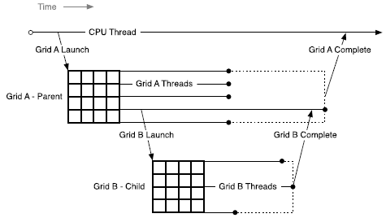

Parent-Child Launch Nesting

#### 9.2.1.2. Scope of CUDA Primitives

On both host and device, the CUDA runtime offers an API for launching kernels and for tracking dependencies between launches via streams and events. On the host system, the state of launches and the CUDA primitives referencing streams and events are shared by all threads within a process; however processes execute independently and may not share CUDA objects.

On the device, launched kernels and CUDA objects are visible to all threads in a grid. This means, for example, that a stream may be created by one thread and used by any other thread in the grid.

#### 9.2.1.3. Synchronization

Warning

Explicit synchronization with child kernels from a parent block (i.e. using `cudaDeviceSynchronize()` in device code) is deprecated in CUDA 11.6 and removed for compute\_90+ compilation. For compute capability < 9.0, compile-time opt-in by specifying `-DCUDA_FORCE_CDP1_IF_SUPPORTED` is required to continue using `cudaDeviceSynchronize()` in device code. Note that this is slated for full removal in a future CUDA release.

CUDA runtime operations from any thread, including kernel launches, are visible across all the threads in a grid. This means that an invoking thread in the parent grid may perform synchronization to control the launch order of grids launched by any thread in the grid on streams created by any thread in the grid. Execution of a grid is not considered complete until all launches by all threads in the grid have completed. If all threads in a grid exit before all child launches have completed, an implicit synchronization operation will automatically be triggered.

#### 9.2.1.4. Streams and Events

CUDA *Streams* and *Events* allow control over dependencies between grid launches: grids launched into the same stream execute in-order, and events may be used to create dependencies between streams. Streams and events created on the device serve this exact same purpose.

Streams and events created within a grid exist within grid scope, but have undefined behavior when used outside of the grid where they were created. As described above, all work launched by a grid is implicitly synchronized when the grid exits; work launched into streams is included in this, with all dependencies resolved appropriately. The behavior of operations on a stream that has been modified outside of grid scope is undefined.

Streams and events created on the host have undefined behavior when used within any kernel, just as streams and events created by a parent grid have undefined behavior if used within a child grid.

#### 9.2.1.5. Ordering and Concurrency

The ordering of kernel launches from the device runtime follows CUDA Stream ordering semantics. Within a grid, all kernel launches into the same stream (with the exception of the fire-and-forget stream discussed later) are executed in-order. With multiple threads in the same grid launching into the same stream, the ordering within the stream is dependent on the thread scheduling within the grid, which may be controlled with synchronization primitives such as `__syncthreads()`.

Note that while named streams are shared by all threads within a grid, the implicit *NULL* stream is only shared by all threads within a thread block. If multiple threads in a thread block launch into the implicit stream, then these launches will be executed in-order. If multiple threads in different thread blocks launch into the implicit stream, then these launches may be executed concurrently. If concurrency is desired for launches by multiple threads within a thread block, explicit named streams should be used.

*Dynamic Parallelism* enables concurrency to be expressed more easily within a program; however, the device runtime introduces no new concurrency guarantees within the CUDA execution model. There is no guarantee of concurrent execution between any number of different thread blocks on a device.

The lack of concurrency guarantee extends to a parent grid and their child grids. When a parent grid launches a child grid, the child may start to execute once stream dependencies are satisfied and hardware resources are available to host the child, but is not guaranteed to begin execution until the parent grid reaches an implicit synchronization point.

While concurrency will often easily be achieved, it may vary as a function of device configuration, application workload, and runtime scheduling. It is therefore unsafe to depend upon any concurrency between different thread blocks.

#### 9.2.1.6. Device Management

There is no multi-GPU support from the device runtime; the device runtime is only capable of operating on the device upon which it is currently executing. It is permitted, however, to query properties for any CUDA capable device in the system.

### 9.2.2. Memory Model

Parent and child grids share the same global and constant memory storage, but have distinct local and shared memory.

#### 9.2.2.1. Coherence and Consistency

##### 9.2.2.1.1. Global Memory

Parent and child grids have coherent access to global memory, with weak consistency guarantees between child and parent. There is only one point of time in the execution of a child grid when its view of memory is fully consistent with the parent thread: at the point when the child grid is invoked by the parent.

All global memory operations in the parent thread prior to the child grid’s invocation are visible to the child grid. With the removal of `cudaDeviceSynchronize()`, it is no longer possible to access the modifications made by the threads in the child grid from the parent grid. The only way to access the modifications made by the threads in the child grid before the parent grid exits is via a kernel launched into the `cudaStreamTailLaunch` stream.

In the following example, the child grid executing `child_launch` is only guaranteed to see the modifications to `data` made before the child grid was launched. Since thread 0 of the parent is performing the launch, the child will be consistent with the memory seen by thread 0 of the parent. Due to the first `__syncthreads()` call, the child will see `data[0]=0`, `data[1]=1`, …, `data[255]=255` (without the `__syncthreads()` call, only `data[0]=0` would be guaranteed to be seen by the child). The child grid is only guaranteed to return at an implicit synchronization. This means that the modifications made by the threads in the child grid are never guaranteed to become available to the parent grid. To access modifications made by `child_launch`, a `tail_launch` kernel is launched into the `cudaStreamTailLaunch` stream.

```
__global__ void tail_launch(int *data) {
   data[threadIdx.x] = data[threadIdx.x]+1;
}

__global__ void child_launch(int *data) {
   data[threadIdx.x] = data[threadIdx.x]+1;
}

__global__ void parent_launch(int *data) {
   data[threadIdx.x] = threadIdx.x;

   __syncthreads();

   if (threadIdx.x == 0) {
       child_launch<<< 1, 256 >>>(data);
       tail_launch<<< 1, 256, 0, cudaStreamTailLaunch >>>(data);
   }
}

void host_launch(int *data) {
    parent_launch<<< 1, 256 >>>(data);
}
```

##### 9.2.2.1.2. Zero Copy Memory

Zero-copy system memory has identical coherence and consistency guarantees to global memory, and follows the semantics detailed above. A kernel may not allocate or free zero-copy memory, but may use pointers to zero-copy passed in from the host program.

##### 9.2.2.1.3. Constant Memory

Constants are immutable and may not be modified from the device, even between parent and child launches. That is to say, the value of all `__constant__` variables must be set from the host prior to launch. Constant memory is inherited automatically by all child kernels from their respective parents.

Taking the address of a constant memory object from within a kernel thread has the same semantics as for all CUDA programs, and passing that pointer from parent to child or from a child to parent is naturally supported.

##### 9.2.2.1.4. Shared and Local Memory

Shared and Local memory is private to a thread block or thread, respectively, and is not visible or coherent between parent and child. Behavior is undefined when an object in one of these locations is referenced outside of the scope within which it belongs, and may cause an error.

The NVIDIA compiler will attempt to warn if it can detect that a pointer to local or shared memory is being passed as an argument to a kernel launch. At runtime, the programmer may use the `__isGlobal()` intrinsic to determine whether a pointer references global memory and so may safely be passed to a child launch.

Note that calls to `cudaMemcpy*Async()` or `cudaMemset*Async()` may invoke new child kernels on the device in order to preserve stream semantics. As such, passing shared or local memory pointers to these APIs is illegal and will return an error.

##### 9.2.2.1.5. Local Memory

Local memory is private storage for an executing thread, and is not visible outside of that thread. It is illegal to pass a pointer to local memory as a launch argument when launching a child kernel. The result of dereferencing such a local memory pointer from a child will be undefined.

For example the following is illegal, with undefined behavior if `x_array` is accessed by `child_launch`:

```
int x_array[10];       // Creates x_array in parent's local memory
child_launch<<< 1, 1 >>>(x_array);
```

It is sometimes difficult for a programmer to be aware of when a variable is placed into local memory by the compiler. As a general rule, all storage passed to a child kernel should be allocated explicitly from the global-memory heap, either with `cudaMalloc()`, `new()` or by declaring `__device__` storage at global scope. For example:

```
// Correct - "value" is global storage
__device__ int value;
__device__ void x() {
    value = 5;
    child<<< 1, 1 >>>(&value);
}
```

```
// Invalid - "value" is local storage
__device__ void y() {
    int value = 5;
    child<<< 1, 1 >>>(&value);
}
```

##### 9.2.2.1.6. Texture Memory

Writes to the global memory region over which a texture is mapped are incoherent with respect to texture accesses. Coherence for texture memory is enforced at the invocation of a child grid and when a child grid completes. This means that writes to memory prior to a child kernel launch are reflected in texture memory accesses of the child. Similarly to Global Memory above, writes to memory by a child are never guaranteed to be reflected in the texture memory accesses by a parent. The only way to access the modifications made by the threads in the child grid before the parent grid exits is via a kernel launched into the `cudaStreamTailLaunch` stream. Concurrent accesses by parent and child may result in inconsistent data.

## 9.3. Programming Interface

### 9.3.1. CUDA C++ Reference

This section describes changes and additions to the CUDA C++ language extensions for supporting *Dynamic Parallelism*.

The language interface and API available to CUDA kernels using CUDA C++ for Dynamic Parallelism, referred to as the *Device Runtime*, is substantially like that of the CUDA Runtime API available on the host. Where possible the syntax and semantics of the CUDA Runtime API have been retained in order to facilitate ease of code reuse for routines that may run in either the host or device environments.

As with all code in CUDA C++, the APIs and code outlined here is per-thread code. This enables each thread to make unique, dynamic decisions regarding what kernel or operation to execute next. There are no synchronization requirements between threads within a block to execute any of the provided device runtime APIs, which enables the device runtime API functions to be called in arbitrarily divergent kernel code without deadlock.

#### 9.3.1.1. Device-Side Kernel Launch

Kernels may be launched from the device using the standard CUDA <<< >>> syntax:

```
kernel_name<<< Dg, Db, Ns, S >>>([kernel arguments]);
```

* `Dg` is of type `dim3` and specifies the dimensions and size of the grid
* `Db` is of type `dim3` and specifies the dimensions and size of each thread block
* `Ns` is of type `size_t` and specifies the number of bytes of shared memory that is dynamically allocated per thread block for this call in addition to statically allocated memory. `Ns` is an optional argument that defaults to 0.
* `S` is of type `cudaStream_t` and specifies the stream associated with this call. The stream must have been allocated in the same grid where the call is being made. `S` is an optional argument that defaults to the NULL stream.

##### 9.3.1.1.1. Launches are Asynchronous

Identical to host-side launches, all device-side kernel launches are asynchronous with respect to the launching thread. That is to say, the `<<<>>>` launch command will return immediately and the launching thread will continue to execute until it hits an implicit launch-synchronization point (such as at a kernel launched into the `cudaStreamTailLaunch` stream).

The child grid launch is posted to the device and will execute independently of the parent thread. The child grid may begin execution at any time after launch, but is not guaranteed to begin execution until the launching thread reaches an implicit launch-synchronization point.

##### 9.3.1.1.2. Launch Environment Configuration

All global device configuration settings (for example, shared memory and L1 cache size as returned from `cudaDeviceGetCacheConfig()`, and device limits returned from `cudaDeviceGetLimit()`) will be inherited from the parent. Likewise, device limits such as stack size will remain as-configured.

For host-launched kernels, per-kernel configurations set from the host will take precedence over the global setting. These configurations will be used when the kernel is launched from the device as well. It is not possible to reconfigure a kernel’s environment from the device.

#### 9.3.1.2. Streams

Both named and unnamed (NULL) streams are available from the device runtime. Named streams may be used by any thread within a grid, but stream handles may not be passed to other child/parent kernels. In other words, a stream should be treated as private to the grid in which it is created.

Similar to host-side launch, work launched into separate streams may run concurrently, but actual concurrency is not guaranteed. Programs that depend upon concurrency between child kernels are not supported by the CUDA programming model and will have undefined behavior.

The host-side NULL stream’s cross-stream barrier semantic is not supported on the device (see below for details). In order to retain semantic compatibility with the host runtime, all device streams must be created using the `cudaStreamCreateWithFlags()` API, passing the `cudaStreamNonBlocking` flag. The `cudaStreamCreate()` call is a host-runtime- only API and will fail to compile for the device.

As `cudaStreamSynchronize()` and `cudaStreamQuery()` are unsupported by the device runtime, a kernel launched into the `cudaStreamTailLaunch` stream should be used instead when the application needs to know that stream-launched child kernels have completed.

##### 9.3.1.2.1. The Implicit (NULL) Stream

Within a host program, the unnamed (NULL) stream has additional barrier synchronization semantics with other streams (see [Default Stream](index.md#default-stream) for details). The device runtime offers a single implicit, unnamed stream shared between all threads in a thread block, but as all named streams must be created with the `cudaStreamNonBlocking` flag, work launched into the NULL stream will not insert an implicit dependency on pending work in any other streams (including NULL streams of other thread blocks).

##### 9.3.1.2.2. The Fire-and-Forget Stream

The fire-and-forget named stream (`cudaStreamFireAndForget`) allows the user to launch fire-and-forget work with less boilerplate and without stream tracking overhead. It is functionally identical to, but faster than, creating a new stream per launch, and launching into that stream.

Fire-and-forget launches are immediately scheduled for launch without any dependency on the completion of previously launched grids. No other grid launches can depend on the completion of a fire-and-forget launch, except through the implicit synchronization at the end of the parent grid. So a tail launch or the next grid in parent grid’s stream won’t launch before a parent grid’s fire-and-forget work has completed.

```
// In this example, C2's launch will not wait for C1's completion
__global__ void P( ... ) {
   C1<<< ... , cudaStreamFireAndForget >>>( ... );
   C2<<< ... , cudaStreamFireAndForget >>>( ... );
}
```

The fire-and-forget stream cannot be used to record or wait on events. Attempting to do so results in `cudaErrorInvalidValue`. The fire-and-forget stream is not supported when compiled with `CUDA_FORCE_CDP1_IF_SUPPORTED` defined. Fire-and-forget stream usage requires compilation to be in 64-bit mode.

##### 9.3.1.2.3. The Tail Launch Stream

The tail launch named stream (`cudaStreamTailLaunch`) allows a grid to schedule a new grid for launch after its completion. It should be possible to to use a tail launch to achieve the same functionality as a `cudaDeviceSynchronize()` in most cases.

Each grid has its own tail launch stream. All non-tail launch work launched by a grid is implicitly synchronized before the tail stream is kicked off. I.e. A parent grid’s tail launch does not launch until the parent grid and all work launched by the parent grid to ordinary streams or per-thread or fire-and-forget streams have completed. If two grids are launched to the same grid’s tail launch stream, the later grid does not launch until the earlier grid and all its descendent work has completed.

```
// In this example, C2 will only launch after C1 completes.
__global__ void P( ... ) {
   C1<<< ... , cudaStreamTailLaunch >>>( ... );
   C2<<< ... , cudaStreamTailLaunch >>>( ... );
}
```

Grids launched into the tail launch stream will not launch until the completion of all work by the parent grid, including all other grids (and their descendants) launched by the parent in all non-tail launched streams, including work executed or launched after the tail launch.

```
// In this example, C will only launch after all X, F and P complete.
__global__ void P( ... ) {
   C<<< ... , cudaStreamTailLaunch >>>( ... );
   X<<< ... , cudaStreamPerThread >>>( ... );
   F<<< ... , cudaStreamFireAndForget >>>( ... )
}
```

The next grid in the parent grid’s stream will not be launched before a parent grid’s tail launch work has completed. In other words, the tail launch stream behaves as if it were inserted between its parent grid and the next grid in its parent grid’s stream.

```
// In this example, P2 will only launch after C completes.
__global__ void P1( ... ) {
   C<<< ... , cudaStreamTailLaunch >>>( ... );
}

__global__ void P2( ... ) {
}

int main ( ... ) {
   ...
   P1<<< ... >>>( ... );
   P2<<< ... >>>( ... );
   ...
}
```

Each grid only gets one tail launch stream. To tail launch concurrent grids, it can be done like the example below.

```
// In this example,  C1 and C2 will launch concurrently after P's completion
__global__ void T( ... ) {
   C1<<< ... , cudaStreamFireAndForget >>>( ... );
   C2<<< ... , cudaStreamFireAndForget >>>( ... );
}

__global__ void P( ... ) {
   ...
   T<<< ... , cudaStreamTailLaunch >>>( ... );
}
```

The tail launch stream cannot be used to record or wait on events. Attempting to do so results in `cudaErrorInvalidValue`. The tail launch stream is not supported when compiled with `CUDA_FORCE_CDP1_IF_SUPPORTED` defined. Tail launch stream usage requires compilation to be in 64-bit mode.

#### 9.3.1.3. Events

Only the inter-stream synchronization capabilities of CUDA events are supported. This means that `cudaStreamWaitEvent()` is supported, but `cudaEventSynchronize()`, `cudaEventElapsedTime()`, and `cudaEventQuery()` are not. As `cudaEventElapsedTime()` is not supported, cudaEvents must be created via `cudaEventCreateWithFlags()`, passing the `cudaEventDisableTiming` flag.

As with named streams, event objects may be shared between all threads within the grid which created them but are local to that grid and may not be passed to other kernels. Event handles are not guaranteed to be unique between grids, so using an event handle within a grid that did not create it will result in undefined behavior.

#### 9.3.1.4. Synchronization

It is up to the program to perform sufficient inter-thread synchronization, for example via a CUDA Event, if the calling thread is intended to synchronize with child grids invoked from other threads.

As it is not possible to explicitly synchronize child work from a parent thread, there is no way to guarantee that changes occuring in child grids are visible to threads within the parent grid.

#### 9.3.1.5. Device Management

Only the device on which a kernel is running will be controllable from that kernel. This means that device APIs such as `cudaSetDevice()` are not supported by the device runtime. The active device as seen from the GPU (returned from `cudaGetDevice()`) will have the same device number as seen from the host system. The `cudaDeviceGetAttribute()` call may request information about another device as this API allows specification of a device ID as a parameter of the call. Note that the catch-all `cudaGetDeviceProperties()` API is not offered by the device runtime - properties must be queried individually.

#### 9.3.1.6. Memory Declarations

##### 9.3.1.6.1. Device and Constant Memory

Memory declared at file scope with `__device__` or `__constant__` memory space specifiers behaves identically when using the device runtime. All kernels may read or write device variables, whether the kernel was initially launched by the host or device runtime. Equivalently, all kernels will have the same view of `__constant__`s as declared at the module scope.

##### 9.3.1.6.2. Textures and Surfaces

CUDA supports dynamically created texture and surface objects[14](#fn14), where a texture reference may be created on the host, passed to a kernel, used by that kernel, and then destroyed from the host. The device runtime does not allow creation or destruction of texture or surface objects from within device code, but texture and surface objects created from the host may be used and passed around freely on the device. Regardless of where they are created, dynamically created texture objects are always valid and may be passed to child kernels from a parent.

Note

The device runtime does not support legacy module-scope (i.e., Fermi-style) textures and surfaces within a kernel launched from the device. Module-scope (legacy) textures may be created from the host and used in device code as for any kernel, but may only be used by a top-level kernel (i.e., the one which is launched from the host).

##### 9.3.1.6.3. Shared Memory Variable Declarations

In CUDA C++ shared memory can be declared either as a statically sized file-scope or function-scoped variable, or as an `extern` variable with the size determined at runtime by the kernel’s caller via a launch configuration argument. Both types of declarations are valid under the device runtime.

```
__global__ void permute(int n, int *data) {
   extern __shared__ int smem[];
   if (n <= 1)
       return;

   smem[threadIdx.x] = data[threadIdx.x];
   __syncthreads();

   permute_data(smem, n);
   __syncthreads();

   // Write back to GMEM since we can't pass SMEM to children.
   data[threadIdx.x] = smem[threadIdx.x];
   __syncthreads();

   if (threadIdx.x == 0) {
       permute<<< 1, 256, n/2*sizeof(int) >>>(n/2, data);
       permute<<< 1, 256, n/2*sizeof(int) >>>(n/2, data+n/2);
   }
}

void host_launch(int *data) {
    permute<<< 1, 256, 256*sizeof(int) >>>(256, data);
}
```

##### 9.3.1.6.4. Symbol Addresses

Device-side symbols (i.e., those marked `__device__`) may be referenced from within a kernel simply via the `&` operator, as all global-scope device variables are in the kernel’s visible address space. This also applies to `__constant__` symbols, although in this case the pointer will reference read-only data.

Given that device-side symbols can be referenced directly, those CUDA runtime APIs which reference symbols (e.g., `cudaMemcpyToSymbol()` or `cudaGetSymbolAddress()`) are redundant and hence not supported by the device runtime. Note this implies that constant data cannot be altered from within a running kernel, even ahead of a child kernel launch, as references to `__constant__` space are read-only.

#### 9.3.1.7. API Errors and Launch Failures

As usual for the CUDA runtime, any function may return an error code. The last error code returned is recorded and may be retrieved via the `cudaGetLastError()` call. Errors are recorded per-thread, so that each thread can identify the most recent error that it has generated. The error code is of type `cudaError_t`.

Similar to a host-side launch, device-side launches may fail for many reasons (invalid arguments, etc). The user must call `cudaGetLastError()` to determine if a launch generated an error, however lack of an error after launch does not imply the child kernel completed successfully.

For device-side exceptions, e.g., access to an invalid address, an error in a child grid will be returned to the host.

##### 9.3.1.7.1. Launch Setup APIs

Kernel launch is a system-level mechanism exposed through the device runtime library, and as such is available directly from PTX via the underlying `cudaGetParameterBuffer()` and `cudaLaunchDevice()` APIs. It is permitted for a CUDA application to call these APIs itself, with the same requirements as for PTX. In both cases, the user is then responsible for correctly populating all necessary data structures in the correct format according to specification. Backwards compatibility is guaranteed in these data structures.

As with host-side launch, the device-side operator `<<<>>>` maps to underlying kernel launch APIs. This is so that users targeting PTX will be able to enact a launch, and so that the compiler front-end can translate `<<<>>>` into these calls.

Table 5. New Device-only Launch Implementation Functions

| Runtime API Launch Functions | Description of Difference From Host Runtime Behaviour (behavior is identical if no description) |
| --- | --- |
| `cudaGetParameterBuffer` | Generated automatically from `<<<>>>`. Note different API to host equivalent. |
| `cudaLaunchDevice` | Generated automatically from `<<<>>>`. Note different API to host equivalent. |

The APIs for these launch functions are different to those of the CUDA Runtime API, and are defined as follows:

```
extern   device   cudaError_t cudaGetParameterBuffer(void **params);
extern __device__ cudaError_t cudaLaunchDevice(void *kernel,
                                        void *params, dim3 gridDim,
                                        dim3 blockDim,
                                        unsigned int sharedMemSize = 0,
                                        cudaStream_t stream = 0);
```

#### 9.3.1.8. API Reference

The portions of the CUDA Runtime API supported in the device runtime are detailed here. Host and device runtime APIs have identical syntax; semantics are the same except where indicated. The table below provides an overview of the API relative to the version available from the host.

Table 6. Supported API Functions

| Runtime API Functions | Details |
| --- | --- |
| `cudaDeviceGetCacheConfig` |  |
| `cudaDeviceGetLimit` |  |
| `cudaGetLastError` | Last error is per-thread state, not per-block state |
| `cudaPeekAtLastError` |  |
| `cudaGetErrorString` |  |
| `cudaGetDeviceCount` |  |
| `cudaDeviceGetAttribute` | Will return attributes for any device |
| `cudaGetDevice` | Always returns current device ID as would be seen from host |
| `cudaStreamCreateWithFlags` | Must pass `cudaStreamNonBlocking` flag |
| `cudaStreamDestroy` |  |
| `cudaStreamWaitEvent` |  |
| `cudaEventCreateWithFlags` | Must pass `cudaEventDisableTiming` flag |
| `cudaEventRecord` |  |
| `cudaEventDestroy` |  |
| `cudaFuncGetAttributes` |  |
| `cudaMemcpyAsync` | Notes about all `memcpy/memset` functions:   * Only async `memcpy/set` functions are supported * Only device-to-device `memcpy` is permitted * May not pass in local or shared memory pointers |
| `cudaMemcpy2DAsync` |  |
| `cudaMemcpy3DAsync` |  |
| `cudaMemsetAsync` |  |
| `cudaMemset2DAsync` |  |
| `cudaMemset3DAsync` |  |
| `cudaRuntimeGetVersion` |  |
| `cudaMalloc` | May not call `cudaFree` on the device on a pointer created on the host, and vice-versa |
| `cudaFree` |  |
| `cudaOccupancyMaxActiveBlocksPerMultiprocessor` |  |
| `cudaOccupancyMaxPotentialBlockSize` |  |
| `cudaOccupancyMaxPotentialBlockSizeVariableSMem` |  |

### 9.3.2. Device-side Launch from PTX

This section is for the programming language and compiler implementers who target *Parallel Thread Execution* (PTX) and plan to support *Dynamic Parallelism* in their language. It provides the low-level details related to supporting kernel launches at the PTX level.

#### 9.3.2.1. Kernel Launch APIs

Device-side kernel launches can be implemented using the following two APIs accessible from PTX: `cudaLaunchDevice()` and `cudaGetParameterBuffer()`. `cudaLaunchDevice()` launches the specified kernel with the parameter buffer that is obtained by calling `cudaGetParameterBuffer()` and filled with the parameters to the launched kernel. The parameter buffer can be NULL, i.e., no need to invoke `cudaGetParameterBuffer()`, if the launched kernel does not take any parameters.

##### 9.3.2.1.1. cudaLaunchDevice

At the PTX level, `cudaLaunchDevice()`needs to be declared in one of the two forms shown below before it is used.

```
// PTX-level Declaration of cudaLaunchDevice() when .address_size is 64
.extern .func(.param .b32 func_retval0) cudaLaunchDevice
(
  .param .b64 func,
  .param .b64 parameterBuffer,
  .param .align 4 .b8 gridDimension[12],
  .param .align 4 .b8 blockDimension[12],
  .param .b32 sharedMemSize,
  .param .b64 stream
)
;
```

The CUDA-level declaration below is mapped to one of the aforementioned PTX-level declarations and is found in the system header file `cuda_device_runtime_api.h`. The function is defined in the `cudadevrt` system library, which must be linked with a program in order to use device-side kernel launch functionality.

```
// CUDA-level declaration of cudaLaunchDevice()
extern "C" __device__
cudaError_t cudaLaunchDevice(void *func, void *parameterBuffer,
                             dim3 gridDimension, dim3 blockDimension,
                             unsigned int sharedMemSize,
                             cudaStream_t stream);
```

The first parameter is a pointer to the kernel to be is launched, and the second parameter is the parameter buffer that holds the actual parameters to the launched kernel. The layout of the parameter buffer is explained in [Parameter Buffer Layout](index.md#parameter-buffer-layout), below. Other parameters specify the launch configuration, i.e., as grid dimension, block dimension, shared memory size, and the stream associated with the launch (please refer to [Execution Configuration](index.md#execution-configuration) for the detailed description of launch configuration.

##### 9.3.2.1.2. cudaGetParameterBuffer

`cudaGetParameterBuffer()` needs to be declared at the PTX level before it’s used. The PTX-level declaration must be in one of the two forms given below, depending on address size:

```
// PTX-level Declaration of cudaGetParameterBuffer() when .address_size is 64
.extern .func(.param .b64 func_retval0) cudaGetParameterBuffer
(
  .param .b64 alignment,
  .param .b64 size
)
;
```

The following CUDA-level declaration of `cudaGetParameterBuffer()` is mapped to the aforementioned PTX-level declaration:

```
// CUDA-level Declaration of cudaGetParameterBuffer()
extern "C" __device__
void *cudaGetParameterBuffer(size_t alignment, size_t size);
```

The first parameter specifies the alignment requirement of the parameter buffer and the second parameter the size requirement in bytes. In the current implementation, the parameter buffer returned by `cudaGetParameterBuffer()` is always guaranteed to be 64- byte aligned, and the alignment requirement parameter is ignored. However, it is recommended to pass the correct alignment requirement value - which is the largest alignment of any parameter to be placed in the parameter buffer - to `cudaGetParameterBuffer()` to ensure portability in the future.

#### 9.3.2.2. Parameter Buffer Layout

Parameter reordering in the parameter buffer is prohibited, and each individual parameter placed in the parameter buffer is required to be aligned. That is, each parameter must be placed at the *n*th byte in the parameter buffer, where *n* is the smallest multiple of the parameter size that is greater than the offset of the last byte taken by the preceding parameter. The maximum size of the parameter buffer is 4KB.

For a more detailed description of PTX code generated by the CUDA compiler, please refer to the PTX-3.5 specification.

### 9.3.3. Toolkit Support for Dynamic Parallelism

#### 9.3.3.1. Including Device Runtime API in CUDA Code

Similar to the host-side runtime API, prototypes for the CUDA device runtime API are included automatically during program compilation. There is no need to include`cuda_device_runtime_api.h` explicitly.

#### 9.3.3.2. Compiling and Linking

When compiling and linking CUDA programs using dynamic parallelism with `nvcc`, the program will automatically link against the static device runtime library `libcudadevrt`.

The device runtime is offered as a static library (`cudadevrt.lib` on Windows, `libcudadevrt.a` under Linux), against which a GPU application that uses the device runtime must be linked. Linking of device libraries can be accomplished through `nvcc` and/or `nvlink`. Two simple examples are shown below.

A device runtime program may be compiled and linked in a single step, if all required source files can be specified from the command line:

```
$ nvcc -arch=sm_75 -rdc=true hello_world.cu -o hello -lcudadevrt
```

It is also possible to compile CUDA .cu source files first to object files, and then link these together in a two-stage process:

```
$ nvcc -arch=sm_75 -dc hello_world.cu -o hello_world.o
$ nvcc -arch=sm_75 -rdc=true hello_world.o -o hello -lcudadevrt
```

Please see the Using Separate Compilation section of The CUDA Driver Compiler NVCC guide for more details.

## 9.4. Programming Guidelines

### 9.4.1. Basics

The device runtime is a functional subset of the host runtime. API level device management, kernel launching, device memcpy, stream management, and event management are exposed from the device runtime.

Programming for the device runtime should be familiar to someone who already has experience with CUDA. Device runtime syntax and semantics are largely the same as that of the host API, with any exceptions detailed earlier in this document.

The following example shows a simple *Hello World* program incorporating dynamic parallelism:

```
#include <stdio.h>

__global__ void childKernel()
{
    printf("Hello ");
}

__global__ void tailKernel()
{
    printf("World!\n");
}

__global__ void parentKernel()
{
    // launch child
    childKernel<<<1,1>>>();
    if (cudaSuccess != cudaGetLastError()) {
        return;
    }

    // launch tail into cudaStreamTailLaunch stream
    // implicitly synchronizes: waits for child to complete
    tailKernel<<<1,1,0,cudaStreamTailLaunch>>>();

}

int main(int argc, char *argv[])
{
    // launch parent
    parentKernel<<<1,1>>>();
    if (cudaSuccess != cudaGetLastError()) {
        return 1;
    }

    // wait for parent to complete
    if (cudaSuccess != cudaDeviceSynchronize()) {
        return 2;
    }

    return 0;
}
```

This program may be built in a single step from the command line as follows:

```
$ nvcc -arch=sm_75 -rdc=true hello_world.cu -o hello -lcudadevrt
```

### 9.4.2. Performance

#### 9.4.2.1. Dynamic-parallelism-enabled Kernel Overhead

System software which is active when controlling dynamic launches may impose an overhead on any kernel which is running at the time, whether or not it invokes kernel launches of its own. This overhead arises from the device runtime’s execution tracking and management software and may result in decreased performance. This overhead is, in general, incurred for applications that link against the device runtime library.

### 9.4.3. Implementation Restrictions and Limitations

*Dynamic Parallelism* guarantees all semantics described in this document, however, certain hardware and software resources are implementation-dependent and limit the scale, performance and other properties of a program which uses the device runtime.

#### 9.4.3.1. Runtime

##### 9.4.3.1.1. Memory Footprint

The device runtime system software reserves memory for various management purposes, in particular a reservation for tracking pending grid launches. Configuration controls are available to reduce the size of this reservation in exchange for certain launch limitations. See [Configuration Options](index.md#configuration-options), below, for details.

##### 9.4.3.1.2. Pending Kernel Launches

When a kernel is launched, all associated configuration and parameter data is tracked until the kernel completes. This data is stored within a system-managed launch pool.

The size of the fixed-size launch pool is configurable by calling `cudaDeviceSetLimit()` from the host and specifying `cudaLimitDevRuntimePendingLaunchCount`.

##### 9.4.3.1.3. Configuration Options

Resource allocation for the device runtime system software is controlled via the `cudaDeviceSetLimit()` API from the host program. Limits must be set before any kernel is launched, and may not be changed while the GPU is actively running programs.

The following named limits may be set:

| Limit | Behavior |
| --- | --- |
| `cudaLimitDevRuntimePendingLaunchCount` | Controls the amount of memory set aside for buffering kernel launches and events which have not yet begun to execute, due either to unresolved dependencies or lack of execution resources. When the buffer is full, an attempt to allocate a launch slot during a device side kernel launch will fail and return `cudaErrorLaunchOutOfResources`, while an attempt to allocate an event slot will fail and return `cudaErrorMemoryAllocation`. The default number of launch slots is 2048. Applications may increase the number of launch and/or event slots by setting `cudaLimitDevRuntimePendingLaunchCount`. The number of event slots allocated is twice the value of that limit. |
| `cudaLimitStackSize` | Controls the stack size in bytes of each GPU thread. The CUDA driver automatically increases the per-thread stack size for each kernel launch as needed. This size isn’t reset back to the original value after each launch. To set the per-thread stack size to a different value, `cudaDeviceSetLimit()` can be called to set this limit. The stack will be immediately resized, and if necessary, the device will block until all preceding requested tasks are complete. `cudaDeviceGetLimit()` can be called to get the current per-thread stack size. |

##### 9.4.3.1.4. Memory Allocation and Lifetime

`cudaMalloc()` and `cudaFree()` have distinct semantics between the host and device environments. When invoked from the host, `cudaMalloc()` allocates a new region from unused device memory. When invoked from the device runtime these functions map to device-side `malloc()` and `free()`. This implies that within the device environment the total allocatable memory is limited to the device `malloc()` heap size, which may be smaller than the available unused device memory. Also, it is an error to invoke `cudaFree()` from the host program on a pointer which was allocated by `cudaMalloc()` on the device or vice-versa.

|  | `cudaMalloc()` on Host | `cudaMalloc()` on Device |
| --- | --- | --- |
| `cudaFree()` on Host | Supported | Not Supported |
| `cudaFree()` on Device | Not Supported | Supported |
| Allocation limit | Free device memory | `cudaLimitMallocHeapSize` |

##### 9.4.3.1.5. SM Id and Warp Id

Note that in PTX `%smid` and `%warpid` are defined as volatile values. The device runtime may reschedule thread blocks onto different SMs in order to more efficiently manage resources. As such, it is unsafe to rely upon `%smid` or `%warpid` remaining unchanged across the lifetime of a thread or thread block.

##### 9.4.3.1.6. ECC Errors

No notification of ECC errors is available to code within a CUDA kernel. ECC errors are reported at the host side once the entire launch tree has completed. Any ECC errors which arise during execution of a nested program will either generate an exception or continue execution (depending upon error and configuration).

## 9.5. CDP2 vs CDP1

This section summarises the differences between, and the compatibility and interoperability of, the new (CDP2) and legacy (CDP1) CUDA Dynamic Parallelism interfaces. It also shows how to opt-out of the CDP2 interface on devices of compute capability less than 9.0.

### 9.5.1. Differences Between CDP1 and CDP2

Explicit device-side synchronization is no longer possible with CDP2 or on devices of compute capability 9.0 or higher. Implicit synchronization (such as tail launches) must be used instead.

Attempting to query or set `cudaLimitDevRuntimeSyncDepth` (or `CU_LIMIT_DEV_RUNTIME_SYNC_DEPTH`) with CDP2 or on devices of compute capability 9.0 or higher results in `cudaErrorUnsupportedLimit`.

CDP2 no longer has a virtualized pool for pending launches that don’t fit in the fixed-sized pool. `cudaLimitDevRuntimePendingLaunchCount` must be set to be large enough to avoid running out of launch slots.

For CDP2, there is a limit to the total number of events existing at once (note that events are destroyed only after a launch completes), equal to twice the pending launch count. `cudaLimitDevRuntimePendingLaunchCount` must be set to be large enough to avoid running out of event slots.

Streams are tracked per grid with CDP2 or on devices of compute capability 9.0 or higher, not per thread block. This allows work to be launched into a stream created by another thread block. Attempting to do so with the CDP1 results in `cudaErrorInvalidValue`.

CDP2 introduces the tail launch (`cudaStreamTailLaunch`) and fire-and-forget (`cudaStreamFireAndForget`) named streams.

CDP2 is supported only under 64-bit compilation mode.

### 9.5.2. Compatibility and Interoperability

CDP2 is the default. Functions can be compiled with `-DCUDA_FORCE_CDP1_IF_SUPPORTED` to opt-out of using CDP2 on devices of compute capability less than 9.0.

|  | Function compiler with CUDA 12.0 and newer (default) | Function compiled with pre-CUDA 12.0 or with CUDA 12.0 and newer with `-DCUDA_FORCE_CDP1_IF_SUPPORTED` specified |
| --- | --- | --- |
| Compilation | Compile error if device code references `cudaDeviceSynchronize`. | Compile error if code references `cudaStreamTailLaunch` or `cudaStreamFireAndForget`. Compile error if device code references `cudaDeviceSynchronize` and code is compiled for sm\_90 or newer. |
| Compute capability < 9.0 | New interface is used. | Legacy interface is used. |
| Compute capability 9.0 and higher | New interface is used. | New interface is used. If function references `cudaDeviceSynchronize` in device code, function load returns `cudaErrorSymbolNotFound` (this could happen if the code is compiled for devices of compute capability less than 9.0, but run on devices of compute capability 9.0 or higher using JIT). |

Functions using CDP1 and CDP2 may be loaded and run simultaneously in the same context. The CDP1 functions are able to use CDP1-specific features (e.g. `cudaDeviceSynchronize`) and CDP2 functions are able to use CDP2-specific features (e.g. tail launch and fire-and-forget launch).

A function using CDP1 cannot launch a function using CDP2, and vice versa. If a function that would use CDP1 contains in its call graph a function that would use CDP2, or vice versa, `cudaErrorCdpVersionMismatch` would result during function load.

## 9.6. Legacy CUDA Dynamic Parallelism (CDP1)

See [CUDA Dynamic Parallelism](index.md#cuda-dynamic-parallelism), above, for CDP2 version of document.

### 9.6.1. Execution Environment and Memory Model (CDP1)

See [Execution Environment and Memory Model](index.md#execution-environment-and-memory-model), above, for CDP2 version of document.

#### 9.6.1.1. Execution Environment (CDP1)

See [Execution Environment](index.md#execution-environment), above, for CDP2 version of document.

The CUDA execution model is based on primitives of threads, thread blocks, and grids, with kernel functions defining the program executed by individual threads within a thread block and grid. When a kernel function is invoked the grid’s properties are described by an execution configuration, which has a special syntax in CUDA. Support for dynamic parallelism in CUDA extends the ability to configure, launch, and synchronize upon new grids to threads that are running on the device.

Warning

Explicit synchronization with child kernels from a parent block (i.e. using `cudaDeviceSynchronize()` in device code) block is deprecated in CUDA 11.6, removed for compute\_90+ compilation, and is slated for full removal in a future CUDA release.

##### 9.6.1.1.1. Parent and Child Grids (CDP1)

See [Parent and Child Grids](index.md#parent-and-child-grids), above, for CDP2 version of document.

A device thread that configures and launches a new grid belongs to the parent grid, and the grid created by the invocation is a child grid.

The invocation and completion of child grids is properly nested, meaning that the parent grid is not considered complete until all child grids created by its threads have completed. Even if the invoking threads do not explicitly synchronize on the child grids launched, the runtime guarantees an implicit synchronization between the parent and child.

Warning

Explicit synchronization with child kernels from a parent block (i.e. using `cudaDeviceSynchronize()` in device code) is deprecated in CUDA 11.6, removed for compute\_90+ compilation, and is slated for full removal in a future CUDA release.

[](../images/parent-child-launch-nesting-885681f81c.png)

Parent-Child Launch Nesting

##### 9.6.1.1.2. Scope of CUDA Primitives (CDP1)

See [Scope of CUDA Primitives](index.md#scope-of-cuda-primitives), above, for CDP2 version of document.

On both host and device, the CUDA runtime offers an API for launching kernels, for waiting for launched work to complete, and for tracking dependencies between launches via streams and events. On the host system, the state of launches and the CUDA primitives referencing streams and events are shared by all threads within a process; however processes execute independently and may not share CUDA objects.

A similar hierarchy exists on the device: launched kernels and CUDA objects are visible to all threads in a thread block, but are independent between thread blocks. This means for example that a stream may be created by one thread and used by any other thread in the same thread block, but may not be shared with threads in any other thread block.

##### 9.6.1.1.3. Synchronization (CDP1)

See [Synchronization](index.md#synchronization), above, for CDP2 version of document.

Warning

Explicit synchronization with child kernels from a parent block (i.e. using `cudaDeviceSynchronize()` in device code) is deprecated in CUDA 11.6, removed for compute\_90+ compilation, and is slated for full removal in a future CUDA release.

CUDA runtime operations from any thread, including kernel launches, are visible across a thread block. This means that an invoking thread in the parent grid may perform synchronization on the grids launched by that thread, by other threads in the thread block, or on streams created within the same thread block. Execution of a thread block is not considered complete until all launches by all threads in the block have completed. If all threads in a block exit before all child launches have completed, a synchronization operation will automatically be triggered.

##### 9.6.1.1.4. Streams and Events (CDP1)

See [Streams and Events](index.md#streams-and-events), above, for CDP2 version of document.

CUDA *Streams* and *Events* allow control over dependencies between grid launches: grids launched into the same stream execute in-order, and events may be used to create dependencies between streams. Streams and events created on the device serve this exact same purpose.

Streams and events created within a grid exist within thread block scope but have undefined behavior when used outside of the thread block where they were created. As described above, all work launched by a thread block is implicitly synchronized when the block exits; work launched into streams is included in this, with all dependencies resolved appropriately. The behavior of operations on a stream that has been modified outside of thread block scope is undefined.

Streams and events created on the host have undefined behavior when used within any kernel, just as streams and events created by a parent grid have undefined behavior if used within a child grid.

##### 9.6.1.1.5. Ordering and Concurrency (CDP1)

See [Ordering and Concurrency](index.md#ordering-and-concurrency), above, for CDP2 version of document.

The ordering of kernel launches from the device runtime follows CUDA Stream ordering semantics. Within a thread block, all kernel launches into the same stream are executed in-order. With multiple threads in the same thread block launching into the same stream, the ordering within the stream is dependent on the thread scheduling within the block, which may be controlled with synchronization primitives such as `__syncthreads()`.

Note that because streams are shared by all threads within a thread block, the implicit *NULL* stream is also shared. If multiple threads in a thread block launch into the implicit stream, then these launches will be executed in-order. If concurrency is desired, explicit named streams should be used.

*Dynamic Parallelism* enables concurrency to be expressed more easily within a program; however, the device runtime introduces no new concurrency guarantees within the CUDA execution model. There is no guarantee of concurrent execution between any number of different thread blocks on a device.

The lack of concurrency guarantee extends to parent thread blocks and their child grids. When a parent thread block launches a child grid, the child is not guaranteed to begin execution until the parent thread block reaches an explicit synchronization point (such as `cudaDeviceSynchronize()`).

Warning

Explicit synchronization with child kernels from a parent block (i.e. using `cudaDeviceSynchronize()` in device code) is deprecated in CUDA 11.6, removed for compute\_90+ compilation, and is slated for full removal in a future CUDA release.

While concurrency will often easily be achieved, it may vary as a function of deviceconfiguration, application workload, and runtime scheduling. It is therefore unsafe to depend upon any concurrency between different thread blocks.

##### 9.6.1.1.6. Device Management (CDP1)

See [Device Management](index.md#device-management), above, for CDP2 version of document.

There is no multi-GPU support from the device runtime; the device runtime is only capable of operating on the device upon which it is currently executing. It is permitted, however, to query properties for any CUDA capable device in the system.

#### 9.6.1.2. Memory Model (CDP1)

See [Memory Model](index.md#memory-model), above, for CDP2 version of document.

Parent and child grids share the same global and constant memory storage, but have distinct local and shared memory.

##### 9.6.1.2.1. Coherence and Consistency (CDP1)

See [Coherence and Consistency](index.md#coherence-and-consistency), above, for CDP2 version of document.

###### 9.6.1.2.1.1. Global Memory (CDP1)

See [Global Memory](index.md#global-memory), above, for CDP2 version of document.

Parent and child grids have coherent access to global memory, with weak consistency guarantees between child and parent. There are two points in the execution of a child grid when its view of memory is fully consistent with the parent thread: when the child grid is invoked by the parent, and when the child grid completes as signaled by a synchronization API invocation in the parent thread.

Warning

Explicit synchronization with child kernels from a parent block (i.e. using `cudaDeviceSynchronize()` in device code) is deprecated in CUDA 11.6, removed for compute\_90+ compilation, and is slated for full removal in a future CUDA release.

All global memory operations in the parent thread prior to the child grid’s invocation are visible to the child grid. All memory operations of the child grid are visible to the parent after the parent has synchronized on the child grid’s completion.

In the following example, the child grid executing `child_launch` is only guaranteed to see the modifications to `data` made before the child grid was launched. Since thread 0 of the parent is performing the launch, the child will be consistent with the memory seen by thread 0 of the parent. Due to the first `__syncthreads()` call, the child will see `data[0]=0`, `data[1]=1`, …, `data[255]=255` (without the `__syncthreads()` call, only `data[0]` would be guaranteed to be seen by the child). When the child grid returns, thread 0 is guaranteed to see modifications made by the threads in its child grid. Those modifications become available to the other threads of the parent grid only after the second `__syncthreads()` call:

```
__global__ void child_launch(int *data) {
   data[threadIdx.x] = data[threadIdx.x]+1;
}

__global__ void parent_launch(int *data) {
   data[threadIdx.x] = threadIdx.x;

   __syncthreads();

   if (threadIdx.x == 0) {
       child_launch<<< 1, 256 >>>(data);
       cudaDeviceSynchronize();
   }

   __syncthreads();
}

void host_launch(int *data) {
    parent_launch<<< 1, 256 >>>(data);
}
```

###### 9.6.1.2.1.2. Zero Copy Memory (CDP1)

See [Zero Copy Memory](index.md#zero-copy-memory), above, for CDP2 version of document.

Zero-copy system memory has identical coherence and consistency guarantees to global memory, and follows the semantics detailed above. A kernel may not allocate or free zero-copy memory, but may use pointers to zero-copy passed in from the host program.

###### 9.6.1.2.1.3. Constant Memory (CDP1)

See [Constant Memory](index.md#constant-memory), above, for CDP2 version of document.

Constants are immutable and may not be modified from the device, even between parent and child launches. That is to say, the value of all `__constant__` variables must be set from the host prior to launch. Constant memory is inherited automatically by all child kernels from their respective parents.

Taking the address of a constant memory object from within a kernel thread has the same semantics as for all CUDA programs, and passing that pointer from parent to child or from a child to parent is naturally supported.

###### 9.6.1.2.1.4. Shared and Local Memory (CDP1)

See [Shared and Local Memory](index.md#shared-and-local-memory), above, for CDP2 version of document.

Shared and Local memory is private to a thread block or thread, respectively, and is not visible or coherent between parent and child. Behavior is undefined when an object in one of these locations is referenced outside of the scope within which it belongs, and may cause an error.

The NVIDIA compiler will attempt to warn if it can detect that a pointer to local or shared memory is being passed as an argument to a kernel launch. At runtime, the programmer may use the `__isGlobal()` intrinsic to determine whether a pointer references global memory and so may safely be passed to a child launch.

Note that calls to `cudaMemcpy*Async()` or `cudaMemset*Async()` may invoke new child kernels on the device in order to preserve stream semantics. As such, passing shared or local memory pointers to these APIs is illegal and will return an error.

###### 9.6.1.2.1.5. Local Memory (CDP1)

See [Local Memory](index.md#local-memory), above, for CDP2 version of document.

Local memory is private storage for an executing thread, and is not visible outside of that thread. It is illegal to pass a pointer to local memory as a launch argument when launching a child kernel. The result of dereferencing such a local memory pointer from a child will be undefined.

For example the following is illegal, with undefined behavior if `x_array` is accessed by `child_launch`:

```
int x_array[10];       // Creates x_array in parent's local memory
child_launch<<< 1, 1 >>>(x_array);
```

It is sometimes difficult for a programmer to be aware of when a variable is placed into local memory by the compiler. As a general rule, all storage passed to a child kernel should be allocated explicitly from the global-memory heap, either with `cudaMalloc()`, `new()` or by declaring `__device__` storage at global scope. For example:

```
// Correct - "value" is global storage
__device__ int value;
__device__ void x() {
    value = 5;
    child<<< 1, 1 >>>(&value);
}
```

```
// Invalid - "value" is local storage
__device__ void y() {
    int value = 5;
    child<<< 1, 1 >>>(&value);
}
```

###### 9.6.1.2.1.6. Texture Memory (CDP1)

See [Texture Memory](index.md#texture-memory-cdp), above, for CDP2 version of document.

Writes to the global memory region over which a texture is mapped are incoherent with respect to texture accesses. Coherence for texture memory is enforced at the invocation of a child grid and when a child grid completes. This means that writes to memory prior to a child kernel launch are reflected in texture memory accesses of the child. Similarly, writes to memory by a child will be reflected in the texture memory accesses by a parent, but only after the parent synchronizes on the child’s completion. Concurrent accesses by parent and child may result in inconsistent data.

Warning

Explicit synchronization with child kernels from a parent block (i.e. using `cudaDeviceSynchronize()` in device code) is deprecated in CUDA 11.6, removed for compute\_90+ compilation, and is slated for full removal in a future CUDA release.

### 9.6.2. Programming Interface (CDP1)

See [Programming Interface](index.md#programming-interface-cdp), above, for CDP2 version of document.

#### 9.6.2.1. CUDA C++ Reference (CDP1)

See [CUDA C++ Reference](index.md#cuda-c-reference), above, for CDP2 version of document.

This section describes changes and additions to the CUDA C++ language extensions for supporting *Dynamic Parallelism*.

The language interface and API available to CUDA kernels using CUDA C++ for Dynamic Parallelism, referred to as the *Device Runtime*, is substantially like that of the CUDA Runtime API available on the host. Where possible the syntax and semantics of the CUDA Runtime API have been retained in order to facilitate ease of code reuse for routines that may run in either the host or device environments.

As with all code in CUDA C++, the APIs and code outlined here is per-thread code. This enables each thread to make unique, dynamic decisions regarding what kernel or operation to execute next. There are no synchronization requirements between threads within a block to execute any of the provided device runtime APIs, which enables the device runtime API functions to be called in arbitrarily divergent kernel code without deadlock.

##### 9.6.2.1.1. Device-Side Kernel Launch (CDP1)

See [Device-Side Kernel Launch](index.md#device-side-kernel-launch), above, for CDP2 version of document.

Kernels may be launched from the device using the standard CUDA <<< >>> syntax:

```
kernel_name<<< Dg, Db, Ns, S >>>([kernel arguments]);
```

* `Dg` is of type `dim3` and specifies the dimensions and size of the grid
* `Db` is of type `dim3` and specifies the dimensions and size of each thread block
* `Ns` is of type `size_t` and specifies the number of bytes of shared memory that is dynamically allocated per thread block for this call and addition to statically allocated memory. `Ns` is an optional argument that defaults to 0.
* `S` is of type `cudaStream_t` and specifies the stream associated with this call. The stream must have been allocated in the same thread block where the call is being made. `S` is an optional argument that defaults to 0.

###### 9.6.2.1.1.1. Launches are Asynchronous (CDP1)

See [Launches are Asynchronous](index.md#launches-are-asynchronous), above, for CDP2 version of document.

Identical to host-side launches, all device-side kernel launches are asynchronous with respect to the launching thread. That is to say, the `<<<>>>` launch command will return immediately and the launching thread will continue to execute until it hits an explicit launch-synchronization point such as `cudaDeviceSynchronize()`.

Warning

Explicit synchronization with child kernels from a parent block (i.e. using `cudaDeviceSynchronize()` in device code) is deprecated in CUDA 11.6, removed for compute\_90+ compilation, and is slated for full removal in a future CUDA release.

The grid launch is posted to the device and will execute independently of the parent thread. The child grid may begin execution at any time after launch, but is not guaranteed to begin execution until the launching thread reaches an explicit launch-synchronization point.

###### 9.6.2.1.1.2. Launch Environment Configuration (CDP1)

See [Launch Environment Configuration](index.md#launch-environment-configuration), above, for CDP2 version of document.

All global device configuration settings (for example, shared memory and L1 cache size as returned from `cudaDeviceGetCacheConfig()`, and device limits returned from `cudaDeviceGetLimit()`) will be inherited from the parent. Likewise, device limits such as stack size will remain as-configured.

For host-launched kernels, per-kernel configurations set from the host will take precedence over the global setting. These configurations will be used when the kernel is launched from the device as well. It is not possible to reconfigure a kernel’s environment from the device.

##### 9.6.2.1.2. Streams (CDP1)

See [Streams](index.md#streams-cdp), above, for CDP2 version of document.

Both named and unnamed (NULL) streams are available from the device runtime. Named streams may be used by any thread within a thread-block, but stream handles may not be passed to other blocks or child/parent kernels. In other words, a stream should be treated as private to the block in which it is created. Stream handles are not guaranteed to be unique between blocks, so using a stream handle within a block that did not allocate it will result in undefined behavior.

Similar to host-side launch, work launched into separate streams may run concurrently, but actual concurrency is not guaranteed. Programs that depend upon concurrency between child kernels are not supported by the CUDA programming model and will have undefined behavior.

The host-side NULL stream’s cross-stream barrier semantic is not supported on the device (see below for details). In order to retain semantic compatibility with the host runtime, all device streams must be created using the `cudaStreamCreateWithFlags()` API, passing the `cudaStreamNonBlocking` flag. The `cudaStreamCreate()` call is a host-runtime- only API and will fail to compile for the device.

As `cudaStreamSynchronize()` and `cudaStreamQuery()` are unsupported by the device runtime, `cudaDeviceSynchronize()` should be used instead when the application needs to know that stream-launched child kernels have completed.

Warning

Explicit synchronization with child kernels from a parent block (i.e. using `cudaDeviceSynchronize()` in device code) is deprecated in CUDA 11.6, removed for compute\_90+ compilation, and is slated for full removal in a future CUDA release.

###### 9.6.2.1.2.1. The Implicit (NULL) Stream (CDP1)

See [The Implicit (NULL) Stream](index.md#the-implicit-null-stream), above, for CDP2 version of document.

Within a host program, the unnamed (NULL) stream has additional barrier synchronization semantics with other streams (see [Default Stream](index.md#default-stream) for details). The device runtime offers a single implicit, unnamed stream shared between all threads in a block, but as all named streams must be created with the `cudaStreamNonBlocking` flag, work launched into the NULL stream will not insert an implicit dependency on pending work in any other streams (including NULL streams of other thread blocks).

##### 9.6.2.1.3. Events (CDP1)

See [Events](index.md#events-cdp), above, for CDP2 version of document.

Only the inter-stream synchronization capabilities of CUDA events are supported. This means that `cudaStreamWaitEvent()` is supported, but `cudaEventSynchronize()`, `cudaEventElapsedTime()`, and `cudaEventQuery()` are not. As `cudaEventElapsedTime()` is not supported, cudaEvents must be created via `cudaEventCreateWithFlags()`, passing the `cudaEventDisableTiming` flag.

As for all device runtime objects, event objects may be shared between all threads within the thread-block which created them but are local to that block and may not be passed to other kernels, or between blocks within the same kernel. Event handles are not guaranteed to be unique between blocks, so using an event handle within a block that did not create it will result in undefined behavior.

##### 9.6.2.1.4. Synchronization (CDP1)

See [Synchronization](index.md#synchronization-programming-interface), above, for CDP2 version of document.

Warning

Explicit synchronization with child kernels from a parent block (i.e. using `cudaDeviceSynchronize()` in device code) is deprecated in CUDA 11.6, removed for compute\_90+ compilation, and is slated for full removal in a future CUDA release.

The `cudaDeviceSynchronize()` function will synchronize on all work launched by any thread in the thread-block up to the point where `cudaDeviceSynchronize()` was called. Note that `cudaDeviceSynchronize()` may be called from within divergent code (see [Block Wide Synchronization (CDP1)](index.md#block-wide-synchronization-cdp1)).

It is up to the program to perform sufficient additional inter-thread synchronization, for example via a call to `__syncthreads()`, if the calling thread is intended to synchronize with child grids invoked from other threads.

###### 9.6.2.1.4.1. Block Wide Synchronization (CDP1)

See [CUDA Dynamic Parallelism](index.md#cuda-dynamic-parallelism), above, for CDP2 version of document.

The `cudaDeviceSynchronize()` function does not imply intra-block synchronization. In particular, without explicit synchronization via a `__syncthreads()` directive the calling thread can make no assumptions about what work has been launched by any thread other than itself. For example if multiple threads within a block are each launching work and synchronization is desired for all this work at once (perhaps because of event-based dependencies), it is up to the program to guarantee that this work is submitted by all threads before calling `cudaDeviceSynchronize()`.

Because the implementation is permitted to synchronize on launches from any thread in the block, it is quite possible that simultaneous calls to `cudaDeviceSynchronize()` by multiple threads will drain all work in the first call and then have no effect for the later calls.

##### 9.6.2.1.5. Device Management (CDP1)

See [Device Management](index.md#device-management-programming), above, for CDP2 version of document.

Only the device on which a kernel is running will be controllable from that kernel. This means that device APIs such as `cudaSetDevice()` are not supported by the device runtime. The active device as seen from the GPU (returned from `cudaGetDevice()`) will have the same device number as seen from the host system. The `cudaDeviceGetAttribute()` call may request information about another device as this API allows specification of a device ID as a parameter of the call. Note that the catch-all `cudaGetDeviceProperties()` API is not offered by the device runtime - properties must be queried individually.

##### 9.6.2.1.6. Memory Declarations (CDP1)

See [Memory Declarations](index.md#memory-declarations), above, for CDP2 version of document.

###### 9.6.2.1.6.1. Device and Constant Memory (CDP1)

See [Device and Constant Memory](index.md#device-and-constant-memory), above, for CDP2 version of document.

Memory declared at file scope with `__device__` or `__constant__` memory space specifiers behaves identically when using the device runtime. All kernels may read or write device variables, whether the kernel was initially launched by the host or device runtime. Equivalently, all kernels will have the same view of `__constant__`s as declared at the module scope.

###### 9.6.2.1.6.2. Textures and Surfaces (CDP1)

See [Textures and Surfaces](index.md#textures-and-surfaces), above, for CDP2 version of document.

CUDA supports dynamically created texture and surface objects[14](#fn14), where a texture reference may be created on the host, passed to a kernel, used by that kernel, and then destroyed from the host. The device runtime does not allow creation or destruction of texture or surface objects from within device code, but texture and surface objects created from the host may be used and passed around freely on the device. Regardless of where they are created, dynamically created texture objects are always valid and may be passed to child kernels from a parent.

Note

The device runtime does not support legacy module-scope (i.e., Fermi-style) textures and surfaces within a kernel launched from the device. Module-scope (legacy) textures may be created from the host and used in device code as for any kernel, but may only be used by a top-level kernel (i.e., the one which is launched from the host).

###### 9.6.2.1.6.3. Shared Memory Variable Declarations (CDP1)

See [Shared Memory Variable Declarations](index.md#shared-memory-variable-declarations), above, for CDP2 version of document.

In CUDA C++ shared memory can be declared either as a statically sized file-scope or function-scoped variable, or as an `extern` variable with the size determined at runtime by the kernel’s caller via a launch configuration argument. Both types of declarations are valid under the device runtime.

```
__global__ void permute(int n, int *data) {
   extern __shared__ int smem[];
   if (n <= 1)
       return;

   smem[threadIdx.x] = data[threadIdx.x];
   __syncthreads();

   permute_data(smem, n);
   __syncthreads();

   // Write back to GMEM since we can't pass SMEM to children.
   data[threadIdx.x] = smem[threadIdx.x];
   __syncthreads();

   if (threadIdx.x == 0) {
       permute<<< 1, 256, n/2*sizeof(int) >>>(n/2, data);
       permute<<< 1, 256, n/2*sizeof(int) >>>(n/2, data+n/2);
   }
}

void host_launch(int *data) {
    permute<<< 1, 256, 256*sizeof(int) >>>(256, data);
}
```

###### 9.6.2.1.6.4. Symbol Addresses (CDP1)

See [Symbol Addresses](index.md#symbol-addresses), above, for CDP2 version of document.

Device-side symbols (i.e., those marked `__device__`) may be referenced from within a kernel simply via the `&` operator, as all global-scope device variables are in the kernel’s visible address space. This also applies to `__constant__` symbols, although in this case the pointer will reference read-only data.

Given that device-side symbols can be referenced directly, those CUDA runtime APIs which reference symbols (e.g., `cudaMemcpyToSymbol()` or `cudaGetSymbolAddress()`) are redundant and hence not supported by the device runtime. Note this implies that constant data cannot be altered from within a running kernel, even ahead of a child kernel launch, as references to `__constant__` space are read-only.

##### 9.6.2.1.7. API Errors and Launch Failures (CDP1)

See [API Errors and Launch Failures](index.md#api-errors-and-launch-failures), above, for CDP2 version of document.

As usual for the CUDA runtime, any function may return an error code. The last error code returned is recorded and may be retrieved via the `cudaGetLastError()` call. Errors are recorded per-thread, so that each thread can identify the most recent error that it has generated. The error code is of type `cudaError_t`.

Similar to a host-side launch, device-side launches may fail for many reasons (invalid arguments, etc). The user must call `cudaGetLastError()` to determine if a launch generated an error, however lack of an error after launch does not imply the child kernel completed successfully.

For device-side exceptions, e.g., access to an invalid address, an error in a child grid will be returned to the host instead of being returned by the parent’s call to `cudaDeviceSynchronize()`.

###### 9.6.2.1.7.1. Launch Setup APIs (CDP1)

See [Launch Setup APIs](index.md#launch-setup-apis), above, for CDP2 version of document.

Kernel launch is a system-level mechanism exposed through the device runtime library, and as such is available directly from PTX via the underlying `cudaGetParameterBuffer()` and `cudaLaunchDevice()` APIs. It is permitted for a CUDA application to call these APIs itself, with the same requirements as for PTX. In both cases, the user is then responsible for correctly populating all necessary data structures in the correct format according to specification. Backwards compatibility is guaranteed in these data structures.

As with host-side launch, the device-side operator `<<<>>>` maps to underlying kernel launch APIs. This is so that users targeting PTX will be able to enact a launch, and so that the compiler front-end can translate `<<<>>>` into these calls.

Table 5. New Device-only Launch Implementation Functions

| Runtime API Launch Functions | Description of Difference From Host Runtime Behaviour (behavior is identical if no description) |
| --- | --- |
| `cudaGetParameterBuffer` | Generated automatically from `<<<>>>`. Note different API to host equivalent. |
| `cudaLaunchDevice` | Generated automatically from `<<<>>>`. Note different API to host equivalent. |

The APIs for these launch functions are different to those of the CUDA Runtime API, and are defined as follows:

```
extern   device   cudaError_t cudaGetParameterBuffer(void **params);
extern __device__ cudaError_t cudaLaunchDevice(void *kernel,
                                        void *params, dim3 gridDim,
                                        dim3 blockDim,
                                        unsigned int sharedMemSize = 0,
                                        cudaStream_t stream = 0);
```

##### 9.6.2.1.8. API Reference (CDP1)

See [API Reference](index.md#api-reference), above, for CDP2 version of document.

The portions of the CUDA Runtime API supported in the device runtime are detailed here. Host and device runtime APIs have identical syntax; semantics are the same except where indicated. The table below provides an overview of the API relative to the version available from the host.

Table 6. Supported API Functions

| Runtime API Functions | Details |
| --- | --- |
| `cudaDeviceSynchronize` | Synchronizes on work launched from thread’s own block only.  Warning  Note that calling this API from device code is deprecated in CUDA 11.6, removed for compute\_90+ compilation, and is slated for full removal in a future CUDA release. |
| `cudaDeviceGetCacheConfig` |  |
| `cudaDeviceGetLimit` |  |
| `cudaGetLastError` | Last error is per-thread state, not per-block state |
| `cudaPeekAtLastError` |  |
| `cudaGetErrorString` |  |
| `cudaGetDeviceCount` |  |
| `cudaDeviceGetAttribute` | Will return attributes for any device |
| `cudaGetDevice` | Always returns current device ID as would be seen from host |
| `cudaStreamCreateWithFlags` | Must pass `cudaStreamNonBlocking` flag |
| `cudaStreamDestroy` |  |
| `cudaStreamWaitEvent` |  |
| `cudaEventCreateWithFlags` | Must pass `cudaEventDisableTiming` flag |
| `cudaEventRecord` |  |
| `cudaEventDestroy` |  |
| `cudaFuncGetAttributes` |  |
| `cudaMemcpyAsync` | Notes about all `memcpy/memset` functions:   * Only async `memcpy/set` functions are supported * Only device-to-device `memcpy` is permitted * May not pass in local or shared memory pointers |
| `cudaMemcpy2DAsync` |  |
| `cudaMemcpy3DAsync` |  |
| `cudaMemsetAsync` |  |
| `cudaMemset2DAsync` |  |
| `cudaMemset3DAsync` |  |
| `cudaRuntimeGetVersion` |  |
| `cudaMalloc` | May not call `cudaFree` on the device on a pointer created on the host, and vice-versa |
| `cudaFree` |  |
| `cudaOccupancyMaxActiveBlocksPerMultiprocessor` |  |
| `cudaOccupancyMaxPotentialBlockSize` |  |
| `cudaOccupancyMaxPotentialBlockSizeVariableSMem` |  |

#### 9.6.2.2. Device-side Launch from PTX (CDP1)

See [Device-side Launch from PTX](index.md#device-side-launch-from-ptx), above, for CDP2 version of document.

This section is for the programming language and compiler implementers who target *Parallel Thread Execution* (PTX) and plan to support *Dynamic Parallelism* in their language. It provides the low-level details related to supporting kernel launches at the PTX level.

##### 9.6.2.2.1. Kernel Launch APIs (CDP1)

See [Kernel Launch APIs](index.md#kernel-launch-apis), above, for CDP2 version of document.

Device-side kernel launches can be implemented using the following two APIs accessible from PTX: `cudaLaunchDevice()` and `cudaGetParameterBuffer()`. `cudaLaunchDevice()` launches the specified kernel with the parameter buffer that is obtained by calling `cudaGetParameterBuffer()` and filled with the parameters to the launched kernel. The parameter buffer can be NULL, i.e., no need to invoke `cudaGetParameterBuffer()`, if the launched kernel does not take any parameters.

###### 9.6.2.2.1.1. cudaLaunchDevice (CDP1)

See [cudaLaunchDevice](index.md#cudalaunchdevice), above, for CDP2 version of document.

At the PTX level, `cudaLaunchDevice()`needs to be declared in one of the two forms shown below before it is used.

```
// PTX-level Declaration of cudaLaunchDevice() when .address_size is 64
.extern .func(.param .b32 func_retval0) cudaLaunchDevice
(
  .param .b64 func,
  .param .b64 parameterBuffer,
  .param .align 4 .b8 gridDimension[12],
  .param .align 4 .b8 blockDimension[12],
  .param .b32 sharedMemSize,
  .param .b64 stream
)
;
```

```
// PTX-level Declaration of cudaLaunchDevice() when .address_size is 32
.extern .func(.param .b32 func_retval0) cudaLaunchDevice
(
  .param .b32 func,
  .param .b32 parameterBuffer,
  .param .align 4 .b8 gridDimension[12],
  .param .align 4 .b8 blockDimension[12],
  .param .b32 sharedMemSize,
  .param .b32 stream
)
;
```

The CUDA-level declaration below is mapped to one of the aforementioned PTX-level declarations and is found in the system header file `cuda_device_runtime_api.h`. The function is defined in the `cudadevrt` system library, which must be linked with a program in order to use device-side kernel launch functionality.

```
// CUDA-level declaration of cudaLaunchDevice()
extern "C" __device__
cudaError_t cudaLaunchDevice(void *func, void *parameterBuffer,
                             dim3 gridDimension, dim3 blockDimension,
                             unsigned int sharedMemSize,
                             cudaStream_t stream);
```

The first parameter is a pointer to the kernel to be is launched, and the second parameter is the parameter buffer that holds the actual parameters to the launched kernel. The layout of the parameter buffer is explained in [Parameter Buffer Layout (CDP1)](index.md#parameter-buffer-layout-cdp1), below. Other parameters specify the launch configuration, i.e., as grid dimension, block dimension, shared memory size, and the stream associated with the launch (please refer to [Execution Configuration](index.md#execution-configuration) for the detailed description of launch configuration.

###### 9.6.2.2.1.2. cudaGetParameterBuffer (CDP1)

See [cudaGetParameterBuffer](index.md#cudagetparameterbuffer), above, for CDP2 version of document.

`cudaGetParameterBuffer()` needs to be declared at the PTX level before it’s used. The PTX-level declaration must be in one of the two forms given below, depending on address size:

```
// PTX-level Declaration of cudaGetParameterBuffer() when .address_size is 64
// When .address_size is 64
.extern .func(.param .b64 func_retval0) cudaGetParameterBuffer
(
  .param .b64 alignment,
  .param .b64 size
)
;
```

```
// PTX-level Declaration of cudaGetParameterBuffer() when .address_size is 32
.extern .func(.param .b32 func_retval0) cudaGetParameterBuffer
(
  .param .b32 alignment,
  .param .b32 size
)
;
```

The following CUDA-level declaration of `cudaGetParameterBuffer()` is mapped to the aforementioned PTX-level declaration:

```
// CUDA-level Declaration of cudaGetParameterBuffer()
extern "C" __device__
void *cudaGetParameterBuffer(size_t alignment, size_t size);
```

The first parameter specifies the alignment requirement of the parameter buffer and the second parameter the size requirement in bytes. In the current implementation, the parameter buffer returned by `cudaGetParameterBuffer()` is always guaranteed to be 64- byte aligned, and the alignment requirement parameter is ignored. However, it is recommended to pass the correct alignment requirement value - which is the largest alignment of any parameter to be placed in the parameter buffer - to `cudaGetParameterBuffer()` to ensure portability in the future.

##### 9.6.2.2.2. Parameter Buffer Layout (CDP1)

See [Parameter Buffer Layout](index.md#parameter-buffer-layout), above, for CDP2 version of document.

Parameter reordering in the parameter buffer is prohibited, and each individual parameter placed in the parameter buffer is required to be aligned. That is, each parameter must be placed at the *n*th byte in the parameter buffer, where *n* is the smallest multiple of the parameter size that is greater than the offset of the last byte taken by the preceding parameter. The maximum size of the parameter buffer is 4KB.

For a more detailed description of PTX code generated by the CUDA compiler, please refer to the PTX-3.5 specification.

#### 9.6.2.3. Toolkit Support for Dynamic Parallelism (CDP1)

See [Toolkit Support for Dynamic Parallelism](index.md#toolkit-support-for-dynamic-parallelism), above, for CDP2 version of document.

##### 9.6.2.3.1. Including Device Runtime API in CUDA Code (CDP1)

See [Including Device Runtime API in CUDA Code](index.md#including-device-runtime-api-in-cuda-code), above, for CDP2 version of document.

Similar to the host-side runtime API, prototypes for the CUDA device runtime API are included automatically during program compilation. There is no need to include`cuda_device_runtime_api.h` explicitly.

##### 9.6.2.3.2. Compiling and Linking (CDP1)

See [Compiling and Linking](index.md#compiling-and-linking), above, for CDP2 version of document.

When compiling and linking CUDA programs using dynamic parallelism with `nvcc`, the program will automatically link against the static device runtime library `libcudadevrt`.

The device runtime is offered as a static library (`cudadevrt.lib` on Windows, `libcudadevrt.a` under Linux), against which a GPU application that uses the device runtime must be linked. Linking of device libraries can be accomplished through `nvcc` and/or `nvlink`. Two simple examples are shown below.

A device runtime program may be compiled and linked in a single step, if all required source files can be specified from the command line:

```
$ nvcc -arch=sm_75 -rdc=true hello_world.cu -o hello -lcudadevrt
```

It is also possible to compile CUDA .cu source files first to object files, and then link these together in a two-stage process:

```
$ nvcc -arch=sm_75 -dc hello_world.cu -o hello_world.o
$ nvcc -arch=sm_75 -rdc=true hello_world.o -o hello -lcudadevrt
```

Please see the Using Separate Compilation section of The CUDA Driver Compiler NVCC guide for more details.

### 9.6.3. Programming Guidelines (CDP1)

See [Programming Guidelines](index.md#programming-guidelines), above, for CDP2 version of document.

#### 9.6.3.1. Basics (CDP1)

See [Basics](index.md#basics), above, for CDP2 version of document.

The device runtime is a functional subset of the host runtime. API level device management, kernel launching, device memcpy, stream management, and event management are exposed from the device runtime.

Programming for the device runtime should be familiar to someone who already has experience with CUDA. Device runtime syntax and semantics are largely the same as that of the host API, with any exceptions detailed earlier in this document.

Warning

Explicit synchronization with child kernels from a parent block (i.e. using `cudaDeviceSynchronize()` in device code) is deprecated in CUDA 11.6, removed for compute\_90+ compilation, and is slated for full removal in a future CUDA release.

The following example shows a simple *Hello World* program incorporating dynamic parallelism:

```
#include <stdio.h>

__global__ void childKernel()
{
    printf("Hello ");
}

__global__ void parentKernel()
{
    // launch child
    childKernel<<<1,1>>>();
    if (cudaSuccess != cudaGetLastError()) {
        return;
    }

    // wait for child to complete
    if (cudaSuccess != cudaDeviceSynchronize()) {
        return;
    }

    printf("World!\n");
}

int main(int argc, char *argv[])
{
    // launch parent
    parentKernel<<<1,1>>>();
    if (cudaSuccess != cudaGetLastError()) {
        return 1;
    }

    // wait for parent to complete
    if (cudaSuccess != cudaDeviceSynchronize()) {
        return 2;
    }

    return 0;
}
```

This program may be built in a single step from the command line as follows:

```
$ nvcc -arch=sm_75 -rdc=true hello_world.cu -o hello -lcudadevrt
```

#### 9.6.3.2. Performance (CDP1)

See [Performance](index.md#performance), above, for CDP2 version of document.

##### 9.6.3.2.1. Synchronization (CDP1)

See [CUDA Dynamic Parallelism](index.md#cuda-dynamic-parallelism), above, for CDP2 version of document.

Warning

Explicit synchronization with child kernels from a parent block (such as using `cudaDeviceSynchronize()` in device code) is deprecated in CUDA 11.6, removed for compute\_90+ compilation, and is slated for full removal in a future CUDA release.

Synchronization by one thread may impact the performance of other threads in the same *Thread Block*, even when those other threads do not call `cudaDeviceSynchronize()` themselves. This impact will depend upon the underlying implementation. In general the implicit synchronization of child kernels done when a thread block ends is more efficient compared to calling `cudaDeviceSynchronize()` explicitly. It is therefore recommended to only call `cudaDeviceSynchronize()` if it is needed to synchronize with a child kernel before a thread block ends.

##### 9.6.3.2.2. Dynamic-parallelism-enabled Kernel Overhead (CDP1)

See [Dynamic-parallelism-enabled Kernel Overhead](index.md#dynamic-parallelism-enabled-kernel-overhead), above, for CDP2 version of document.

System software which is active when controlling dynamic launches may impose an overhead on any kernel which is running at the time, whether or not it invokes kernel launches of its own. This overhead arises from the device runtime’s execution tracking and management software and may result in decreased performance for example, library calls when made from the device compared to from the host side. This overhead is, in general, incurred for applications that link against the device runtime library.

#### 9.6.3.3. Implementation Restrictions and Limitations (CDP1)

See [Implementation Restrictions and Limitations](index.md#implementation-restrictions-and-limitations), above, for CDP2 version of document.

*Dynamic Parallelism* guarantees all semantics described in this document, however, certain hardware and software resources are implementation-dependent and limit the scale, performance and other properties of a program which uses the device runtime.

##### 9.6.3.3.1. Runtime (CDP1)

See [Runtime](index.md#runtime), above, for CDP2 version of document.

###### 9.6.3.3.1.1. Memory Footprint (CDP1)

See [Memory Footprint](index.md#memory-footprint), above, for CDP2 version of document.

The device runtime system software reserves memory for various management purposes, in particular one reservation which is used for saving parent-grid state during synchronization, and a second reservation for tracking pending grid launches. Configuration controls are available to reduce the size of these reservations in exchange for certain launch limitations. See [Configuration Options (CDP1)](index.md#configuration-options-cdp1), below, for details.

The majority of reserved memory is allocated as backing-store for parent kernel state, for use when synchronizing on a child launch. Conservatively, this memory must support storing of state for the maximum number of live threads possible on the device. This means that each parent generation at which `cudaDeviceSynchronize()` is callable may require up to 860MB of device memory, depending on the device configuration, which will be unavailable for program use even if it is not all consumed.

###### 9.6.3.3.1.2. Nesting and Synchronization Depth (CDP1)

See [CUDA Dynamic Parallelism](index.md#cuda-dynamic-parallelism), above, for CDP2 version of document.

Using the device runtime, one kernel may launch another kernel, and that kernel may launch another, and so on. Each subordinate launch is considered a new *nesting level*, and the total number of levels is the *nesting depth* of the program. The *synchronization depth* is defined as the deepest level at which the program will explicitly synchronize on a child launch. Typically this is one less than the nesting depth of the program, but if the program does not need to call `cudaDeviceSynchronize()` at all levels then the synchronization depth might be substantially different to the nesting depth.

Warning

Explicit synchronization with child kernels from a parent block (i.e. using `cudaDeviceSynchronize()` in device code) is deprecated in CUDA 11.6, removed for compute\_90+ compilation, and is slated for full removal in a future CUDA release.

The overall maximum nesting depth is limited to 24, but practically speaking the real limit will be the amount of memory required by the system for each new level (see [Memory Footprint (CDP1)](index.md#memory-footprint-cdp1) above). Any launch which would result in a kernel at a deeper level than the maximum will fail. Note that this may also apply to `cudaMemcpyAsync()`, which might itself generate a kernel launch. See [Configuration Options (CDP1)](index.md#configuration-options-cdp1) for details.

By default, sufficient storage is reserved for two levels of synchronization. This maximum synchronization depth (and hence reserved storage) may be controlled by calling `cudaDeviceSetLimit()` and specifying `cudaLimitDevRuntimeSyncDepth`. The number of levels to be supported must be configured before the top-level kernel is launched from the host, in order to guarantee successful execution of a nested program. Calling `cudaDeviceSynchronize()` at a depth greater than the specified maximum synchronization depth will return an error.

An optimization is permitted where the system detects that it need not reserve space for the parent’s state in cases where the parent kernel never calls `cudaDeviceSynchronize()`. In this case, because explicit parent/child synchronization never occurs, the memory footprint required for a program will be much less than the conservative maximum. Such a program could specify a shallower maximum synchronization depth to avoid over-allocation of backing store.

###### 9.6.3.3.1.3. Pending Kernel Launches (CDP1)

See [Pending Kernel Launches](index.md#pending-kernel-launches), above, for CDP2 version of document.

When a kernel is launched, all associated configuration and parameter data is tracked until the kernel completes. This data is stored within a system-managed launch pool.

The launch pool is divided into a fixed-size pool and a virtualized pool with lower performance. The device runtime system software will try to track launch data in the fixed-size pool first. The virtualized pool will be used to track new launches when the fixed-size pool is full.

The size of the fixed-size launch pool is configurable by calling `cudaDeviceSetLimit()` from the host and specifying `cudaLimitDevRuntimePendingLaunchCount`.

###### 9.6.3.3.1.4. Configuration Options (CDP1)

See [Configuration Options](index.md#configuration-options), above, for CDP2 version of document.

Resource allocation for the device runtime system software is controlled via the `cudaDeviceSetLimit()` API from the host program. Limits must be set before any kernel is launched, and may not be changed while the GPU is actively running programs.

Warning

Explicit synchronization with child kernels from a parent block (i.e. using `cudaDeviceSynchronize()` in device code) is deprecated in CUDA 11.6, removed for compute\_90+ compilation, and is slated for full removal in a future CUDA release.

The following named limits may be set:

| Limit | Behavior |
| --- | --- |
| `cudaLimitDevRuntimeSyncDepth` | Sets the maximum depth at which `cudaDeviceSynchronize()` may be called. Launches may be performed deeper than this, but explicit synchronization deeper than this limit will return the `cudaErrorLaunchMaxDepthExceeded`. The default maximum sync depth is 2. |
| `cudaLimitDevRuntimePendingLaunchCount` | Controls the amount of memory set aside for buffering kernel launches which have not yet begun to execute, due either to unresolved dependencies or lack of execution resources. When the buffer is full, the device runtime system software will attempt to track new pending launches in a lower performance virtualized buffer. If the virtualized buffer is also full, i.e. when all available heap space is consumed, launches will not occur, and the thread’s last error will be set to `cudaErrorLaunchPendingCountExceeded`. The default pending launch count is 2048 launches. |
| `cudaLimitStackSize` | Controls the stack size in bytes of each GPU thread. The CUDA driver automatically increases the per-thread stack size for each kernel launch as needed. This size isn’t reset back to the original value after each launch. To set the per-thread stack size to a different value, `cudaDeviceSetLimit()` can be called to set this limit. The stack will be immediately resized, and if necessary, the device will block until all preceding requested tasks are complete. `cudaDeviceGetLimit()` can be called to get the current per-thread stack size. |

###### 9.6.3.3.1.5. Memory Allocation and Lifetime (CDP1)

See [Memory Allocation and Lifetime](index.md#memory-allocation-and-lifetime), above, for CDP2 version of document.

`cudaMalloc()` and `cudaFree()` have distinct semantics between the host and device environments. When invoked from the host, `cudaMalloc()` allocates a new region from unused device memory. When invoked from the device runtime these functions map to device-side `malloc()` and `free()`. This implies that within the device environment the total allocatable memory is limited to the device `malloc()` heap size, which may be smaller than the available unused device memory. Also, it is an error to invoke `cudaFree()` from the host program on a pointer which was allocated by `cudaMalloc()` on the device or vice-versa.

|  | `cudaMalloc()` on Host | `cudaMalloc()` on Device |
| --- | --- | --- |
| `cudaFree()` on Host | Supported | Not Supported |
| `cudaFree()` on Device | Not Supported | Supported |
| Allocation limit | Free device memory | `cudaLimitMallocHeapSize` |

###### 9.6.3.3.1.6. SM Id and Warp Id (CDP1)

See [SM Id and Warp Id](index.md#sm-id-and-warp-id), above, for CDP2 version of document.

Note that in PTX `%smid` and `%warpid` are defined as volatile values. The device runtime may reschedule thread blocks onto different SMs in order to more efficiently manage resources. As such, it is unsafe to rely upon `%smid` or `%warpid` remaining unchanged across the lifetime of a thread or thread block.

###### 9.6.3.3.1.7. ECC Errors (CDP1)

See [ECC Errors](index.md#ecc-errors), above, for CDP2 version of document.

No notification of ECC errors is available to code within a CUDA kernel. ECC errors are reported at the host side once the entire launch tree has completed. Any ECC errors which arise during execution of a nested program will either generate an exception or continue execution (depending upon error and configuration).

14([1](#id58),[2](#id61),[3](#id70))
:   Dynamically created texture and surface objects are an addition to the CUDA memory model introduced with CUDA 5.0. Please see the *CUDA Programming Guide* for details.

# 10. Virtual Memory Management

## 10.1. Introduction

The [Virtual Memory Management APIs](https://docs.nvidia.com/cuda/cuda-driver-api/group__CUDA__VA.html) provide a way for the application to directly manage the unified virtual address space that CUDA provides to map physical memory to virtual addresses accessible by the GPU. Introduced in CUDA 10.2, these APIs additionally provide a new way to interop with other processes and graphics APIs like OpenGL and Vulkan, as well as provide newer memory attributes that a user can tune to fit their applications.

Historically, memory allocation calls (such as `cudaMalloc()`) in the CUDA programming model have returned a memory address that points to the GPU memory. The address thus obtained could be used with any CUDA API or inside a device kernel. However, the memory allocated could not be resized depending on the user’s memory needs. In order to increase an allocation’s size, the user had to explicitly allocate a larger buffer, copy data from the initial allocation, free it and then continue to keep track of the newer allocation’s address. This often leads to lower performance and higher peak memory utilization for applications. Essentially, users had a malloc-like interface for allocating GPU memory, but did not have a corresponding realloc to complement it. The Virtual Memory Management APIs decouple the idea of an address and memory and allow the application to handle them separately. The APIs allow applications to map and unmap memory from a virtual address range as they see fit.

In the case of enabling peer device access to memory allocations by using `cudaEnablePeerAccess`, all past and future user allocations are mapped to the target peer device. This lead to users unwittingly paying runtime cost of mapping all cudaMalloc allocations to peer devices. However, in most situations applications communicate by sharing only a few allocations with another device and not all allocations are required to be mapped to all the devices. With Virtual Memory Management, applications can specifically choose certain allocations to be accessible from target devices.

The CUDA Virtual Memory Management APIs expose fine grained control to the user for managing the GPU memory in applications. It provides APIs that let users:

* Place memory allocated on different devices into a contiguous VA range.
* Perform interprocess communication for memory sharing using platform-specific mechanisms.
* Opt into newer memory types on the devices that support them.

In order to allocate memory, the Virtual Memory Management programming model exposes the following functionality:

* Allocating physical memory.
* Reserving a VA range.
* Mapping allocated memory to the VA range.
* Controlling access rights on the mapped range.

Note that the suite of APIs described in this section require a system that supports UVA.

## 10.2. Query for Support

Before attempting to use Virtual Memory Management APIs, applications must ensure that the devices they want to use support CUDA Virtual Memory Management. The following code sample shows querying for Virtual Memory Management support:

```
int deviceSupportsVmm;
CUresult result = cuDeviceGetAttribute(&deviceSupportsVmm, CU_DEVICE_ATTRIBUTE_VIRTUAL_MEMORY_MANAGEMENT_SUPPORTED, device);
if (deviceSupportsVmm != 0) {
    // `device` supports Virtual Memory Management
}
```

## 10.3. Allocating Physical Memory

The first step in memory allocation using Virtual Memory Management APIs is to create a physical memory chunk that will provide a backing for the allocation. In order to allocate physical memory, applications must use the `cuMemCreate` API. The allocation created by this function does not have any device or host mappings. The function argument `CUmemGenericAllocationHandle` describes the properties of the memory to allocate such as the location of the allocation, if the allocation is going to be shared to another process (or other Graphics APIs), or the physical attributes of the memory to be allocated. Users must ensure the requested allocation’s size must be aligned to appropriate granularity. Information regarding an allocation’s granularity requirements can be queried using `cuMemGetAllocationGranularity`. The following code snippet shows allocating physical memory with `cuMemCreate`:

```
CUmemGenericAllocationHandle allocatePhysicalMemory(int device, size_t size) {
    CUmemAllocationProp prop = {};
    prop.type = CU_MEM_ALLOCATION_TYPE_PINNED;
    prop.location.type = CU_MEM_LOCATION_TYPE_DEVICE;
    prop.location.id = device;
    cuMemGetAllocationGranularity(&granularity, &prop, CU_MEM_ALLOC_GRANULARITY_MINIMUM);

    // Ensure size matches granularity requirements for the allocation
    size_t padded_size = ROUND_UP(size, granularity);

    // Allocate physical memory
    CUmemGenericAllocationHandle allocHandle;
    cuMemCreate(&allocHandle, padded_size, &prop, 0);

    return allocHandle;
}
```

The memory allocated by `cuMemCreate` is referenced by the `CUmemGenericAllocationHandle` it returns. This is a departure from the cudaMalloc-style of allocation, which returns a pointer to the GPU memory, which was directly accessible by CUDA kernel executing on the device. The memory allocated cannot be used for any operations other than querying properties using `cuMemGetAllocationPropertiesFromHandle`. In order to make this memory accessible, applications must map this memory into a VA range reserved by `cuMemAddressReserve` and provide suitable access rights to it. Applications must free the allocated memory using the `cuMemRelease` API.

### 10.3.1. Shareable Memory Allocations

With `cuMemCreate` users now have the facility to indicate to CUDA, at allocation time, that they have earmarked a particular allocation for Inter process communication and graphics interop purposes. Applications can do this by setting `CUmemAllocationProp::requestedHandleTypes` to a platform-specific field. On Windows, when `CUmemAllocationProp::requestedHandleTypes` is set to `CU_MEM_HANDLE_TYPE_WIN32` applications must also specify an LPSECURITYATTRIBUTES attribute in `CUmemAllocationProp::win32HandleMetaData`. This security attribute defines the scope of which exported allocations may be transferred to other processes.

The CUDA Virtual Memory Management API functions do not support the legacy interprocess communication functions with their memory. Instead, they expose a new mechanism for interprocess communication that uses OS-specific handles. Applications can obtain these OS-specific handles corresponding to the allocations by using `cuMemExportToShareableHandle`. The handles thus obtained can be transferred by using the usual OS native mechanisms for inter process communication. The recipient process should import the allocation by using `cuMemImportFromShareableHandle`.

Users must ensure they query for support of the requested handle type before attempting to export memory allocated with `cuMemCreate`. The following code snippet illustrates query for handle type support in a platform-specific way.

```
int deviceSupportsIpcHandle;
#if defined(__linux__)
    cuDeviceGetAttribute(&deviceSupportsIpcHandle, CU_DEVICE_ATTRIBUTE_HANDLE_TYPE_POSIX_FILE_DESCRIPTOR_SUPPORTED, device));
#else
    cuDeviceGetAttribute(&deviceSupportsIpcHandle, CU_DEVICE_ATTRIBUTE_HANDLE_TYPE_WIN32_HANDLE_SUPPORTED, device));
#endif
```

Users should set the `CUmemAllocationProp::requestedHandleTypes` appropriately as shown below:

```
#if defined(__linux__)
    prop.requestedHandleTypes = CU_MEM_HANDLE_TYPE_POSIX_FILE_DESCRIPTOR;
#else
    prop.requestedHandleTypes = CU_MEM_HANDLE_TYPE_WIN32;
    prop.win32HandleMetaData = // Windows specific LPSECURITYATTRIBUTES attribute.
#endif
```

The [memMapIpcDrv](https://github.com/NVIDIA/cuda-samples/tree/master/Samples/3_CUDA_Features/memMapIPCDrv/) sample can be used as an example for using IPC with Virtual Memory Management allocations.

### 10.3.2. Memory Type

Before CUDA 10.2, applications had no user-controlled way of allocating any special type of memory that certain devices may support. With `cuMemCreate`, applications can additionally specify memory type requirements using the `CUmemAllocationProp::allocFlags` to opt into any specific memory features. Applications must also ensure that the requested memory type is supported on the device of allocation.

#### 10.3.2.1. Compressible Memory

Compressible memory can be used to accelerate accesses to data with unstructured sparsity and other compressible data patterns. Compression can save DRAM bandwidth, L2 read bandwidth and L2 capacity depending on the data being operated on. Applications that want to allocate compressible memory on devices that support Compute Data Compression can do so by setting `CUmemAllocationProp::allocFlags::compressionType` to `CU_MEM_ALLOCATION_COMP_GENERIC`. Users must query if device supports Compute Data Compression by using `CU_DEVICE_ATTRIBUTE_GENERIC_COMPRESSION_SUPPORTED`. The following code snippet illustrates querying compressible memory support `cuDeviceGetAttribute`.

```
int compressionSupported = 0;
cuDeviceGetAttribute(&compressionSupported, CU_DEVICE_ATTRIBUTE_GENERIC_COMPRESSION_SUPPORTED, device);
```

On devices that support Compute Data Compression, users must opt in at allocation time as shown below:

```
prop.allocFlags.compressionType = CU_MEM_ALLOCATION_COMP_GENERIC;
```

Due to various reasons such as limited HW resources, the allocation may not have compression attributes, the user is expected to query back the properties of the allocated memory using `cuMemGetAllocationPropertiesFromHandle` and check for compression attribute.

```
CUmemAllocationPropPrivate allocationProp = {};
cuMemGetAllocationPropertiesFromHandle(&allocationProp, allocationHandle);

if (allocationProp.allocFlags.compressionType == CU_MEM_ALLOCATION_COMP_GENERIC)
{
    // Obtained compressible memory allocation
}
```

## 10.4. Reserving a Virtual Address Range

Since with Virtual Memory Management the notions of address and memory are distinct, applications must carve out an address range that can hold the memory allocations made by `cuMemCreate`. The address range reserved must be at least as large as the sum of the sizes of all the physical memory allocations the user plans to place in them.

Applications can reserve a virtual address range by passing appropriate parameters to `cuMemAddressReserve`. The address range obtained will not have any device or host physical memory associated with it. The reserved virtual address range can be mapped to memory chunks belonging to any device in the system, thus providing the application a continuous VA range backed and mapped by memory belonging to different devices. Applications are expected to return the virtual address range back to CUDA using `cuMemAddressFree`. Users must ensure that the entire VA range is unmapped before calling `cuMemAddressFree`. These functions are conceptually similar to mmap/munmap (on Linux) or VirtualAlloc/VirtualFree (on Windows) functions. The following code snippet illustrates the usage for the function:

```
CUdeviceptr ptr;
// `ptr` holds the returned start of virtual address range reserved.
CUresult result = cuMemAddressReserve(&ptr, size, 0, 0, 0); // alignment = 0 for default alignment
```

## 10.5. Virtual Aliasing Support

The Virtual Memory Management APIs provide a way to create multiple virtual memory mappings or “proxies” to the same allocation using multiple calls to `cuMemMap` with different virtual addresses, so-called virtual aliasing. Unless otherwise noted in the PTX ISA, writes to one proxy of the allocation are considered inconsistent and incoherent with any other proxy of the same memory until the writing device operation (grid launch, memcpy, memset, and so on) completes. Grids present on the GPU prior to a writing device operation but reading after the writing device operation completes are also considered to have inconsistent and incoherent proxies.

For example, the following snippet is considered undefined, assuming device pointers A and B are virtual aliases of the same memory allocation:

```
__global__ void foo(char *A, char *B) {
  *A = 0x1;
  printf("%d\n", *B);    // Undefined behavior!  *B can take on either
// the previous value or some value in-between.
}
```

The following is defined behavior, assuming these two kernels are ordered monotonically (by streams or events).

```
__global__ void foo1(char *A) {
  *A = 0x1;
}

__global__ void foo2(char *B) {
  printf("%d\n", *B);    // *B == *A == 0x1 assuming foo2 waits for foo1
// to complete before launching
}

cudaMemcpyAsync(B, input, size, stream1);    // Aliases are allowed at
// operation boundaries
foo1<<<1,1,0,stream1>>>(A);                  // allowing foo1 to access A.
cudaEventRecord(event, stream1);
cudaStreamWaitEvent(stream2, event);
foo2<<<1,1,0,stream2>>>(B);
cudaStreamWaitEvent(stream3, event);
cudaMemcpyAsync(output, B, size, stream3);  // Both launches of foo2 and
                                            // cudaMemcpy (which both
                                            // read) wait for foo1 (which writes)
                                            // to complete before proceeding
```

## 10.6. Mapping Memory

The allocated physical memory and the carved out virtual address space from the previous two sections represent the memory and address distinction introduced by the Virtual Memory Management APIs. For the allocated memory to be useable, the user must first place the memory in the address space. The address range obtained from `cuMemAddressReserve` and the physical allocation obtained from `cuMemCreate` or `cuMemImportFromShareableHandle` must be associated with each other by using `cuMemMap`.

Users can associate allocations from multiple devices to reside in contiguous virtual address ranges as long as they have carved out enough address space. In order to decouple the physical allocation and the address range, users must unmap the address of the mapping by using `cuMemUnmap`. Users can map and unmap memory to the same address range as many times as they want, as long as they ensure that they don’t attempt to create mappings on VA range reservations that are already mapped. The following code snippet illustrates the usage for the function:

```
CUdeviceptr ptr;
// `ptr`: address in the address range previously reserved by cuMemAddressReserve.
// `allocHandle`: CUmemGenericAllocationHandle obtained by a previous call to cuMemCreate.
CUresult result = cuMemMap(ptr, size, 0, allocHandle, 0);
```

## 10.7. Control Access Rights

The Virtual Memory Management APIs enable applications to explicitly protect their VA ranges with access control mechanisms. Mapping the allocation to a region of the address range using `cuMemMap` does not make the address accessible, and would result in a program crash if accessed by a CUDA kernel. Users must specifically select access control using the `cuMemSetAccess` function, which allows or restricts access for specific devices to a mapped address range. The following code snippet illustrates the usage for the function:

```
void setAccessOnDevice(int device, CUdeviceptr ptr, size_t size) {
    CUmemAccessDesc accessDesc = {};
    accessDesc.location.type = CU_MEM_LOCATION_TYPE_DEVICE;
    accessDesc.location.id = device;
    accessDesc.flags = CU_MEM_ACCESS_FLAGS_PROT_READWRITE;

    // Make the address accessible
    cuMemSetAccess(ptr, size, &accessDesc, 1);
}
```

The access control mechanism exposed with Virtual Memory Management allows users to be explicit about which allocations they want to share with other peer devices on the system. As specified earlier, `cudaEnablePeerAccess` forces all prior and future cudaMalloc’d allocations to be mapped to the target peer device. This can be convenient in many cases as user doesn’t have to worry about tracking the mapping state of every allocation to every device in the system. But for users concerned with performance of their applications this approach [has performance implications](https://devblogs.nvidia.com/introducing-low-level-gpu-virtual-memory-management/). With access control at allocation granularity Virtual Memory Management exposes a mechanism to have peer mappings with minimal overhead.

The `vectorAddMMAP` sample can be used as an example for using the Virtual Memory Management APIs.

# 11. Stream Ordered Memory Allocator

## 11.1. Introduction

Managing memory allocations using `cudaMalloc` and `cudaFree` causes GPU to synchronize across all executing CUDA streams. The Stream Order Memory Allocator enables applications to order memory allocation and deallocation with other work launched into a CUDA stream such as kernel launches and asynchronous copies. This improves application memory use by taking advantage of stream-ordering semantics to reuse memory allocations. The allocator also allows applications to control the allocator’s memory caching behavior. When set up with an appropriate release threshold, the caching behavior allows the allocator to avoid expensive calls into the OS when the application indicates it is willing to accept a bigger memory footprint. The allocator also supports the easy and secure sharing of allocations between processes.

For many applications, the Stream Ordered Memory Allocator reduces the need for custom memory management abstractions, and makes it easier to create high-performance custom memory management for applications that need it. For applications and libraries that already have custom memory allocators, adopting the Stream Ordered Memory Allocator enables multiple libraries to share a common pool of memory managed by the driver, thus reducing excess memory consumption. Additionally, the driver can perform optimizations based on its awareness of the allocator and other stream management APIs. Finally, Nsight Compute and the Next-Gen CUDA debugger is aware of the allocator as part of their CUDA 11.3 toolkit support.

## 11.2. Query for Support

The user can determine whether or not a device supports the stream ordered memory allocator by calling `cudaDeviceGetAttribute()` with the device attribute `cudaDevAttrMemoryPoolsSupported`.

Starting with CUDA 11.3, IPC memory pool support can be queried with the `cudaDevAttrMemoryPoolSupportedHandleTypes` device attribute. Previous drivers will return `cudaErrorInvalidValue` as those drivers are unaware of the attribute enum.

```
int driverVersion = 0;
int deviceSupportsMemoryPools = 0;
int poolSupportedHandleTypes = 0;
cudaDriverGetVersion(&driverVersion);
if (driverVersion >= 11020) {
    cudaDeviceGetAttribute(&deviceSupportsMemoryPools,
                           cudaDevAttrMemoryPoolsSupported, device);
}
if (deviceSupportsMemoryPools != 0) {
    // `device` supports the Stream Ordered Memory Allocator
}

if (driverVersion >= 11030) {
    cudaDeviceGetAttribute(&poolSupportedHandleTypes,
              cudaDevAttrMemoryPoolSupportedHandleTypes, device);
}
if (poolSupportedHandleTypes & cudaMemHandleTypePosixFileDescriptor) {
   // Pools on the specified device can be created with posix file descriptor-based IPC
}
```

Performing the driver version check before the query avoids hitting a `cudaErrorInvalidValue` error on drivers where the attribute was not yet defined. One can use `cudaGetLastError` to clear the error instead of avoiding it.

## 11.3. API Fundamentals (cudaMallocAsync and cudaFreeAsync)

The APIs `cudaMallocAsync` and `cudaFreeAsync` form the core of the allocator. `cudaMallocAsync` returns an allocation and `cudaFreeAsync` frees an allocation. Both APIs accept stream arguments to define when the allocation will become and stop being available for use. The pointer value returned by `cudaMallocAsync` is determined synchronously and is available for constructing future work. It is important to note that `cudaMallocAsync` ignores the current device/context when determining where the allocation will reside. Instead, `cudaMallocAsync` determines the resident device based on the specified memory pool or the supplied stream. The simplest use pattern is when the memory is allocated, used, and freed back into the same stream.

```
void *ptr;
size_t size = 512;
cudaMallocAsync(&ptr, size, cudaStreamPerThread);
// do work using the allocation
kernel<<<..., cudaStreamPerThread>>>(ptr, ...);
// An asynchronous free can be specified without synchronizing the cpu and GPU
cudaFreeAsync(ptr, cudaStreamPerThread);
```

When using an allocation in a stream other than the allocating stream, the user must guarantee that the access will happen after the allocation operation, otherwise the behavior is undefined. The user may make this guarantee either by synchronizing the allocating stream, or by using CUDA events to synchronize the producing and consuming streams.

`cudaFreeAsync()` inserts a free operation into the stream. The user must guarantee that the free operation happens after the allocation operation and any use of the allocation. Also, any use of the allocation after the free operation starts results in undefined behavior. Events and/or stream synchronizing operations should be used to guarantee any access to the allocation on other streams is complete before the freeing stream begins the free operation.

```
cudaMallocAsync(&ptr, size, stream1);
cudaEventRecord(event1, stream1);
//stream2 must wait for the allocation to be ready before accessing
cudaStreamWaitEvent(stream2, event1);
kernel<<<..., stream2>>>(ptr, ...);
cudaEventRecord(event2, stream2);
// stream3 must wait for stream2 to finish accessing the allocation before
// freeing the allocation
cudaStreamWaitEvent(stream3, event2);
cudaFreeAsync(ptr, stream3);
```

The user can free allocations allocated with `cudaMalloc()` with `cudaFreeAsync()`. The user must make the same guarantees about accesses being complete before the free operation begins.

```
cudaMalloc(&ptr, size);
kernel<<<..., stream>>>(ptr, ...);
cudaFreeAsync(ptr, stream);
```

The user can free memory allocated with `cudaMallocAsync` with `cudaFree()`. When freeing such allocations through the `cudaFree()` API, the driver assumes that all accesses to the allocation are complete and performs no further synchronization. The user can use `cudaStreamQuery` / `cudaStreamSynchronize` / `cudaEventQuery` / `cudaEventSynchronize` / `cudaDeviceSynchronize` to guarantee that the appropriate asynchronous work is complete and that the GPU will not try to access the allocation.

```
cudaMallocAsync(&ptr, size,stream);
kernel<<<..., stream>>>(ptr, ...);
// synchronize is needed to avoid prematurely freeing the memory
cudaStreamSynchronize(stream);
cudaFree(ptr);
```

## 11.4. Memory Pools and the cudaMemPool\_t

Memory pools encapsulate virtual address and physical memory resources that are allocated and managed according to the pools attributes and properties. The primary aspect of a memory pool is the kind and location of memory it manages.

All calls to `cudaMallocAsync` use the resources of a memory pool. In the absence of a specified memory pool, `cudaMallocAsync` uses the current memory pool of the supplied stream’s device. The current memory pool for a device may be set with `cudaDeviceSetMempool` and queried with `cudaDeviceGetMempool`. By default (in the absence of a `cudaDeviceSetMempool` call), the current memory pool is the default memory pool of a device. The API `cudaMallocFromPoolAsync` and [c++ overloads of cudaMallocAsync](https://docs.nvidia.com/cuda/cuda-runtime-api/group__CUDART__HIGHLEVEL.html#group__CUDART__HIGHLEVEL_1ga31efcffc48981621feddd98d71a0feb) allow a user to specify the pool to be used for an allocation without setting it as the current pool. The APIs `cudaDeviceGetDefaultMempool` and `cudaMemPoolCreate` give users handles to memory pools.

Note

The mempool current to a device will be local to that device. So allocating without specifying a memory pool will always yield an allocation local to the stream’s device.

Note

`cudaMemPoolSetAttribute` and `cudaMemPoolGetAttribute` control the attributes of the memory pools.

## 11.5. Default/Implicit Pools

The default memory pool of a device may be retrieved with the `cudaDeviceGetDefaultMempool` API. Allocations from the default memory pool of a device are non-migratable device allocation located on that device. These allocations will always be accessible from that device. The accessibility of the default memory pool may be modified with `cudaMemPoolSetAccess` and queried by `cudaMemPoolGetAccess`. Since the default pools do not need to be explicitly created, they are sometimes referred to as implicit pools. The default memory pool of a device does not support IPC.

## 11.6. Explicit Pools

The API `cudaMemPoolCreate` creates an explicit pool. Currently memory pools can only allocate device allocations. The device the allocations will be resident on must be designated in the properties structure. The primary use case for explicit pools is IPC capability.

```
// create a pool similar to the implicit pool on device 0
int device = 0;
cudaMemPoolProps poolProps = { };
poolProps.allocType = cudaMemAllocationTypePinned;
poolProps.location.id = device;
poolProps.location.type = cudaMemLocationTypeDevice;

cudaMemPoolCreate(&memPool, &poolProps));
```

## 11.7. Physical Page Caching Behavior

By default, the allocator tries to minimize the physical memory owned by a pool. To minimize the OS calls to allocate and free physical memory, applications must configure a memory footprint for each pool. Applications can do this with the release threshold attribute (`cudaMemPoolAttrReleaseThreshold`).

The release threshold is the amount of memory in bytes a pool should hold onto before trying to release memory back to the OS. When more than the release threshold bytes of memory are held by the memory pool, the allocator will try to release memory back to the OS on the next call to stream, event or device synchronize. Setting the release threshold to UINT64\_MAX will prevent the driver from attempting to shrink the pool after every synchronization.

```
Cuuint64_t setVal = UINT64_MAX;
cudaMemPoolSetAttribute(memPool, cudaMemPoolAttrReleaseThreshold, &setVal);
```

Applications that set `cudaMemPoolAttrReleaseThreshold` high enough to effectively disable memory pool shrinking may wish to explicitly shrink a memory pool’s memory footprint. `cudaMemPoolTrimTo` allows such applications to do so. When trimming a memory pool’s footprint, the `minBytesToKeep` parameter allows an application to hold onto an amount of memory it expects to need in a subsequent phase of execution.

```
Cuuint64_t setVal = UINT64_MAX;
cudaMemPoolSetAttribute(memPool, cudaMemPoolAttrReleaseThreshold, &setVal);

// application phase needing a lot of memory from the stream ordered allocator
for (i=0; i<10; i++) {
    for (j=0; j<10; j++) {
        cudaMallocAsync(&ptrs[j],size[j], stream);
    }
    kernel<<<...,stream>>>(ptrs,...);
    for (j=0; j<10; j++) {
        cudaFreeAsync(ptrs[j], stream);
    }
}

// Process does not need as much memory for the next phase.
// Synchronize so that the trim operation will know that the allocations are no
// longer in use.
cudaStreamSynchronize(stream);
cudaMemPoolTrimTo(mempool, 0);

// Some other process/allocation mechanism can now use the physical memory
// released by the trimming operation.
```

## 11.8. Resource Usage Statistics

In CUDA 11.3, the pool attributes `cudaMemPoolAttrReservedMemCurrent`, `cudaMemPoolAttrReservedMemHigh`, `cudaMemPoolAttrUsedMemCurrent`, and `cudaMemPoolAttrUsedMemHigh` were added to query the memory usage of a pool.

Querying the `cudaMemPoolAttrReservedMemCurrent` attribute of a pool reports the current total physical GPU memory consumed by the pool. Querying the `cudaMemPoolAttrUsedMemCurrent` of a pool returns the total size of all of the memory allocated from the pool and not available for reuse.

The`cudaMemPoolAttr*MemHigh` attributes are watermarks recording the max value achieved by the respective `cudaMemPoolAttr*MemCurrent` attribute since last reset. They can be reset to the current value by using the `cudaMemPoolSetAttribute` API.

```
// sample helper functions for getting the usage statistics in bulk
struct usageStatistics {
    cuuint64_t reserved;
    cuuint64_t reservedHigh;
    cuuint64_t used;
    cuuint64_t usedHigh;
};

void getUsageStatistics(cudaMemoryPool_t memPool, struct usageStatistics *statistics)
{
    cudaMemPoolGetAttribute(memPool, cudaMemPoolAttrReservedMemCurrent, statistics->reserved);
    cudaMemPoolGetAttribute(memPool, cudaMemPoolAttrReservedMemHigh, statistics->reservedHigh);
    cudaMemPoolGetAttribute(memPool, cudaMemPoolAttrUsedMemCurrent, statistics->used);
    cudaMemPoolGetAttribute(memPool, cudaMemPoolAttrUsedMemHigh, statistics->usedHigh);
}

// resetting the watermarks will make them take on the current value.
void resetStatistics(cudaMemoryPool_t memPool)
{
    cuuint64_t value = 0;
    cudaMemPoolSetAttribute(memPool, cudaMemPoolAttrReservedMemHigh, &value);
    cudaMemPoolSetAttribute(memPool, cudaMemPoolAttrUsedMemHigh, &value);
}
```

## 11.9. Memory Reuse Policies

In order to service an allocation request, the driver attempts to reuse memory that was previously freed via `cudaFreeAsync()` before attempting to allocate more memory from the OS. For example, memory freed in a stream can immediately be reused for a subsequent allocation request in the same stream. Similarly, when a stream is synchronized with the CPU, the memory that was previously freed in that stream becomes available for reuse for an allocation in any stream.

The stream ordered allocator has a few controllable allocation policies. The pool attributes `cudaMemPoolReuseFollowEventDependencies`, `cudaMemPoolReuseAllowOpportunistic`, and `cudaMemPoolReuseAllowInternalDependencies` control these policies. Upgrading to a newer CUDA driver may change, enhance, augment and/or reorder the reuse policies.

### 11.9.1. cudaMemPoolReuseFollowEventDependencies

Before allocating more physical GPU memory, the allocator examines dependency information established by CUDA events and tries to allocate from memory freed in another stream.

```
cudaMallocAsync(&ptr, size, originalStream);
kernel<<<..., originalStream>>>(ptr, ...);
cudaFreeAsync(ptr, originalStream);
cudaEventRecord(event,originalStream);

// waiting on the event that captures the free in another stream
// allows the allocator to reuse the memory to satisfy
// a new allocation request in the other stream when
// cudaMemPoolReuseFollowEventDependencies is enabled.
cudaStreamWaitEvent(otherStream, event);
cudaMallocAsync(&ptr2, size, otherStream);
```

### 11.9.2. cudaMemPoolReuseAllowOpportunistic

According to the `cudaMemPoolReuseAllowOpportunistic` policy, the allocator examines freed allocations to see if the free’s stream order semantic has been met (such as the stream has passed the point of execution indicated by the free). When this is disabled, the allocator will still reuse memory made available when a stream is synchronized with the CPU. Disabling this policy does not stop the `cudaMemPoolReuseFollowEventDependencies` from applying.

```
cudaMallocAsync(&ptr, size, originalStream);
kernel<<<..., originalStream>>>(ptr, ...);
cudaFreeAsync(ptr, originalStream);

// after some time, the kernel finishes running
wait(10);

// When cudaMemPoolReuseAllowOpportunistic is enabled this allocation request
// can be fulfilled with the prior allocation based on the progress of originalStream.
cudaMallocAsync(&ptr2, size, otherStream);
```

### 11.9.3. cudaMemPoolReuseAllowInternalDependencies

Failing to allocate and map more physical memory from the OS, the driver will look for memory whose availability depends on another stream’s pending progress. If such memory is found, the driver will insert the required dependency into the allocating stream and reuse the memory.

```
cudaMallocAsync(&ptr, size, originalStream);
kernel<<<..., originalStream>>>(ptr, ...);
cudaFreeAsync(ptr, originalStream);

// When cudaMemPoolReuseAllowInternalDependencies is enabled
// and the driver fails to allocate more physical memory, the driver may
// effectively perform a cudaStreamWaitEvent in the allocating stream
// to make sure that future work in ‘otherStream’ happens after the work
// in the original stream that would be allowed to access the original allocation.
cudaMallocAsync(&ptr2, size, otherStream);
```

### 11.9.4. Disabling Reuse Policies

While the controllable reuse policies improve memory reuse, users may want to disable them. Allowing opportunistic reuse (such as `cudaMemPoolReuseAllowOpportunistic`) introduces run to run variance in allocation patterns based on the interleaving of CPU and GPU execution. Internal dependency insertion (such as `cudaMemPoolReuseAllowInternalDependencies`) can serialize work in unexpected and potentially non-deterministic ways when the user would rather explicitly synchronize an event or stream on allocation failure.

## 11.10. Device Accessibility for Multi-GPU Support

Just like allocation accessibility controlled through the virtual memory management APIs, memory pool allocation accessibility does not follow `cudaDeviceEnablePeerAccess` or `cuCtxEnablePeerAccess`. Instead, the API `cudaMemPoolSetAccess` modifies what devices can access allocations from a pool. By default, allocations are accessible from the device where the allocations are located. This access cannot be revoked. To enable access from other devices, the accessing device must be peer capable with the memory pool’s device; check with `cudaDeviceCanAccessPeer`. If the peer capability is not checked, the set access may fail with `cudaErrorInvalidDevice`. If no allocations had been made from the pool, the `cudaMemPoolSetAccess` call may succeed even when the devices are not peer capable; in this case, the next allocation from the pool will fail.

It is worth noting that `cudaMemPoolSetAccess` affects all allocations from the memory pool, not just future ones. Also the accessibility reported by `cudaMemPoolGetAccess` applies to all allocations from the pool, not just future ones. It is recommended that the accessibility settings of a pool for a given GPU not be changed frequently; once a pool is made accessible from a given GPU, it should remain accessible from that GPU for the lifetime of the pool.

```
// snippet showing usage of cudaMemPoolSetAccess:
cudaError_t setAccessOnDevice(cudaMemPool_t memPool, int residentDevice,
              int accessingDevice) {
    cudaMemAccessDesc accessDesc = {};
    accessDesc.location.type = cudaMemLocationTypeDevice;
    accessDesc.location.id = accessingDevice;
    accessDesc.flags = cudaMemAccessFlagsProtReadWrite;

    int canAccess = 0;
    cudaError_t error = cudaDeviceCanAccessPeer(&canAccess, accessingDevice,
              residentDevice);
    if (error != cudaSuccess) {
        return error;
    } else if (canAccess == 0) {
        return cudaErrorPeerAccessUnsupported;
    }

    // Make the address accessible
    return cudaMemPoolSetAccess(memPool, &accessDesc, 1);
}
```

## 11.11. IPC Memory Pools

IPC capable memory pools allow easy, efficient and secure sharing of GPU memory between processes. CUDA’s IPC memory pools provide the same security benefits as CUDA’s virtual memory management APIs.

There are two phases to sharing memory between processes with memory pools. The processes first need to share access to the pool, then share specific allocations from that pool. The first phase establishes and enforces security. The second phase coordinates what virtual addresses are used in each process and when mappings need to be valid in the importing process.

### 11.11.1. Creating and Sharing IPC Memory Pools

Sharing access to a pool involves retrieving an OS native handle to the pool (with the `cudaMemPoolExportToShareableHandle()` API), transferring the handle to the importing process using the usual OS native IPC mechanisms, and creating an imported memory pool (with the `cudaMemPoolImportFromShareableHandle()` API). For `cudaMemPoolExportToShareableHandle` to succeed, the memory pool had to be created with the requested handle type specified in the pool properties structure. Please reference samples for the appropriate IPC mechanisms to transfer the OS native handle between processes. The rest of the procedure can be found in the following code snippets.

```
// in exporting process
// create an exportable IPC capable pool on device 0
cudaMemPoolProps poolProps = { };
poolProps.allocType = cudaMemAllocationTypePinned;
poolProps.location.id = 0;
poolProps.location.type = cudaMemLocationTypeDevice;

// Setting handleTypes to a non zero value will make the pool exportable (IPC capable)
poolProps.handleTypes = CU_MEM_HANDLE_TYPE_POSIX_FILE_DESCRIPTOR;

cudaMemPoolCreate(&memPool, &poolProps));

// FD based handles are integer types
int fdHandle = 0;

// Retrieve an OS native handle to the pool.
// Note that a pointer to the handle memory is passed in here.
cudaMemPoolExportToShareableHandle(&fdHandle,
             memPool,
             CU_MEM_HANDLE_TYPE_POSIX_FILE_DESCRIPTOR,
             0);

// The handle must be sent to the importing process with the appropriate
// OS specific APIs.
```

```
// in importing process
 int fdHandle;
// The handle needs to be retrieved from the exporting process with the
// appropriate OS specific APIs.
// Create an imported pool from the shareable handle.
// Note that the handle is passed by value here.
cudaMemPoolImportFromShareableHandle(&importedMemPool,
          (void*)fdHandle,
          CU_MEM_HANDLE_TYPE_POSIX_FILE_DESCRIPTOR,
          0);
```

### 11.11.2. Set Access in the Importing Process

Imported memory pools are initially only accessible from their resident device. The imported memory pool does not inherit any accessibility set by the exporting process. The importing process needs to enable access (with `cudaMemPoolSetAccess`) from any GPU it plans to access the memory from.

If the imported memory pool belongs to a non-visible device in the importing process, the user must use the `cudaMemPoolSetAccess` API to enable access from the GPUs the allocations will be used on.

### 11.11.3. Creating and Sharing Allocations from an Exported Pool

Once the pool has been shared, allocations made with `cudaMallocAsync()` from the pool in the exporting process can be shared with other processes that have imported the pool. Since the pool’s security policy is established and verified at the pool level, the OS does not need extra bookkeeping to provide security for specific pool allocations; In other words, the opaque `cudaMemPoolPtrExportData` required to import a pool allocation may be sent to the importing process using any mechanism.

While allocations may be exported and even imported without synchronizing with the allocating stream in any way, the importing process must follow the same rules as the exporting process when accessing the allocation. Namely, access to the allocation must happen after the stream ordering of the allocation operation in the allocating stream. The two following code snippets show `cudaMemPoolExportPointer()` and `cudaMemPoolImportPointer()` sharing the allocation with an IPC event used to guarantee that the allocation isn’t accessed in the importing process before the allocation is ready.

```
// preparing an allocation in the exporting process
cudaMemPoolPtrExportData exportData;
cudaEvent_t readyIpcEvent;
cudaIpcEventHandle_t readyIpcEventHandle;

// ipc event for coordinating between processes
// cudaEventInterprocess flag makes the event an ipc event
// cudaEventDisableTiming  is set for performance reasons

cudaEventCreate(
        &readyIpcEvent, cudaEventDisableTiming | cudaEventInterprocess)

// allocate from the exporting mem pool
cudaMallocAsync(&ptr, size,exportMemPool, stream);

// event for sharing when the allocation is ready.
cudaEventRecord(readyIpcEvent, stream);
cudaMemPoolExportPointer(&exportData, ptr);
cudaIpcGetEventHandle(&readyIpcEventHandle, readyIpcEvent);

// Share IPC event and pointer export data with the importing process using
//  any mechanism. Here we copy the data into shared memory
shmem->ptrData = exportData;
shmem->readyIpcEventHandle = readyIpcEventHandle;
// signal consumers data is ready
```

```
// Importing an allocation
cudaMemPoolPtrExportData *importData = &shmem->prtData;
cudaEvent_t readyIpcEvent;
cudaIpcEventHandle_t *readyIpcEventHandle = &shmem->readyIpcEventHandle;

// Need to retrieve the ipc event handle and the export data from the
// exporting process using any mechanism.  Here we are using shmem and just
// need synchronization to make sure the shared memory is filled in.

cudaIpcOpenEventHandle(&readyIpcEvent, readyIpcEventHandle);

// import the allocation. The operation does not block on the allocation being ready.
cudaMemPoolImportPointer(&ptr, importedMemPool, importData);

// Wait for the prior stream operations in the allocating stream to complete before
// using the allocation in the importing process.
cudaStreamWaitEvent(stream, readyIpcEvent);
kernel<<<..., stream>>>(ptr, ...);
```

When freeing the allocation, the allocation needs to be freed in the importing process before it is freed in the exporting process. The following code snippet demonstrates the use of CUDA IPC events to provide the required synchronization between the `cudaFreeAsync` operations in both processes. Access to the allocation from the importing process is obviously restricted by the free operation in the importing process side. It is worth noting that `cudaFree` can be used to free the allocation in both processes and that other stream synchronization APIs may be used instead of CUDA IPC events.

```
// The free must happen in importing process before the exporting process
kernel<<<..., stream>>>(ptr, ...);

// Last access in importing process
cudaFreeAsync(ptr, stream);

// Access not allowed in the importing process after the free
cudaIpcEventRecord(finishedIpcEvent, stream);
```

```
// Exporting process
// The exporting process needs to coordinate its free with the stream order
// of the importing process’s free.
cudaStreamWaitEvent(stream, finishedIpcEvent);
kernel<<<..., stream>>>(ptrInExportingProcess, ...);

// The free in the importing process doesn’t stop the exporting process
// from using the allocation.
cudFreeAsync(ptrInExportingProcess,stream);
```

### 11.11.4. IPC Export Pool Limitations

IPC pools currently do not support releasing physical blocks back to the OS. As a result the `cudaMemPoolTrimTo` API acts as a no-op and the `cudaMemPoolAttrReleaseThreshold` effectively gets ignored. This behavior is controlled by the driver, not the runtime and may change in a future driver update.

### 11.11.5. IPC Import Pool Limitations

Allocating from an import pool is not allowed; specifically, import pools cannot be set current and cannot be used in the `cudaMallocFromPoolAsync` API. As such, the allocation reuse policy attributes are meaningless for these pools.

IPC pools currently do not support releasing physical blocks back to the OS. As a result the `cudaMemPoolTrimTo` API acts as a no-op and the `cudaMemPoolAttrReleaseThreshold` effectively gets ignored.

The resource usage stat attribute queries only reflect the allocations imported into the process and the associated physical memory.

## 11.12. Synchronization API Actions

One of the optimizations that comes with the allocator being part of the CUDA driver is integration with the synchronize APIs. When the user requests that the CUDA driver synchronize, the driver waits for asynchronous work to complete. Before returning, the driver will determine what frees the synchronization guaranteed to be completed. These allocations are made available for allocation regardless of specified stream or disabled allocation policies. The driver also checks `cudaMemPoolAttrReleaseThreshold` here and releases any excess physical memory that it can.

## 11.13. Addendums

### 11.13.1. cudaMemcpyAsync Current Context/Device Sensitivity

In the current CUDA driver, any async `memcpy` involving memory from `cudaMallocAsync` should be done using the specified stream’s context as the calling thread’s current context. This is not necessary for `cudaMemcpyPeerAsync`, as the device primary contexts specified in the API are referenced instead of the current context.

### 11.13.2. cuPointerGetAttribute Query

Invoking `cuPointerGetAttribute` on an allocation after invoking `cudaFreeAsync` on it results in undefined behavior. Specifically, it does not matter if an allocation is still accessible from a given stream: the behavior is still undefined.

### 11.13.3. cuGraphAddMemsetNode

`cuGraphAddMemsetNode` does not work with memory allocated via the stream ordered allocator. However, memsets of the allocations can be stream captured.

### 11.13.4. Pointer Attributes

The `cuPointerGetAttributes` query works on stream ordered allocations. Since stream ordered allocations are not context associated, querying `CU_POINTER_ATTRIBUTE_CONTEXT` will succeed but return NULL in `*data`. The attribute `CU_POINTER_ATTRIBUTE_DEVICE_ORDINAL` can be used to determine the location of the allocation: this can be useful when selecting a context for making p2h2p copies using `cudaMemcpyPeerAsync`. The attribute `CU_POINTER_ATTRIBUTE_MEMPOOL_HANDLE` was added in CUDA 11.3 and can be useful for debugging and for confirming which pool an allocation comes from before doing IPC.

# 12. Graph Memory Nodes

## 12.1. Introduction

Graph memory nodes allow graphs to create and own memory allocations. Graph memory nodes have GPU ordered lifetime semantics, which dictate when memory is allowed to be accessed on the device. These GPU ordered lifetime semantics enable driver-managed memory reuse, and match those of the stream ordered allocation APIs `cudaMallocAsync` and `cudaFreeAsync`, which may be captured when creating a graph.

Graph allocations have fixed addresses over the life of a graph including repeated instantiations and launches. This allows the memory to be directly referenced by other operations within the graph without the need of a graph update, even when CUDA changes the backing physical memory. Within a graph, allocations whose graph ordered lifetimes do not overlap may use the same underlying physical memory.

CUDA may reuse the same physical memory for allocations across multiple graphs, aliasing virtual address mappings according to the GPU ordered lifetime semantics. For example when different graphs are launched into the same stream, CUDA may virtually alias the same physical memory to satisfy the needs of allocations which have single-graph lifetimes.

## 12.2. Support and Compatibility

Graph memory nodes require an 11.4 capable CUDA driver and support for the stream ordered allocator on the GPU. The following snippet shows how to check for support on a given device.

```
int driverVersion = 0;
int deviceSupportsMemoryPools = 0;
int deviceSupportsMemoryNodes = 0;
cudaDriverGetVersion(&driverVersion);
if (driverVersion >= 11020) { // avoid invalid value error in cudaDeviceGetAttribute
    cudaDeviceGetAttribute(&deviceSupportsMemoryPools, cudaDevAttrMemoryPoolsSupported, device);
}
deviceSupportsMemoryNodes = (driverVersion >= 11040) && (deviceSupportsMemoryPools != 0);
```

Doing the attribute query inside the driver version check avoids an invalid value return code on 11.0 and 11.1 drivers. Be aware that the compute sanitizer emits warnings when it detects CUDA returning error codes, and a version check before reading the attribute will avoid this. Graph memory nodes are only supported on driver versions 11.4 and newer.

## 12.3. API Fundamentals

Graph memory nodes are graph nodes representing either memory allocation or free actions. As a shorthand, nodes that allocate memory are called allocation nodes. Likewise, nodes that free memory are called free nodes. Allocations created by allocation nodes are called graph allocations. CUDA assigns virtual addresses for the graph allocation at node creation time. While these virtual addresses are fixed for the lifetime of the allocation node, the allocation contents are not persistent past the freeing operation and may be overwritten by accesses referring to a different allocation.

Graph allocations are considered recreated every time a graph runs. A graph allocation’s lifetime, which differs from the node’s lifetime, begins when GPU execution reaches the allocating graph node and ends when one of the following occurs:

* GPU execution reaches the freeing graph node
* GPU execution reaches the freeing `cudaFreeAsync()` stream call
* immediately upon the freeing call to `cudaFree()`

Note

Graph destruction does not automatically free any live graph-allocated memory, even though it ends the lifetime of the allocation node. The allocation must subsequently be freed in another graph, or using `cudaFreeAsync()``/cudaFree()`.

Just like other [graph nodes](index.md#graph-structure), graph memory nodes are ordered within a graph by dependency edges. A program must guarantee that operations accessing graph memory:

* are ordered after the allocation node
* are ordered before the operation freeing the memory

Graph allocation lifetimes begin and usually end according to GPU execution (as opposed to API invocation). GPU ordering is the order that work runs on the GPU as opposed to the order that the work is enqueued or described. Thus, graph allocations are considered ‘GPU ordered.’

### 12.3.1. Graph Node APIs

Graph memory nodes may be explicitly created with the memory node creation APIs, `cudaGraphAddMemAllocNode` and `cudaGraphAddMemFreeNode`. The address allocated by `cudaGraphAddMemAllocNode` is returned to the user in the `dptr` field of the passed `CUDA_MEM_ALLOC_NODE_PARAMS` structure. All operations using graph allocations inside the allocating graph must be ordered after the allocating node. Similarly, any free nodes must be ordered after all uses of the allocation within the graph. `cudaGraphAddMemFreeNode` creates free nodes.

In the following figure, there is an example graph with an alloc and a free node. Kernel nodes **a**, **b**, and **c** are ordered after the allocation node and before the free node such that the kernels can access the allocation. Kernel node **e** is not ordered after the alloc node and therefore cannot safely access the memory. Kernel node **d** is not ordered before the free node, therefore it cannot safely access the memory.

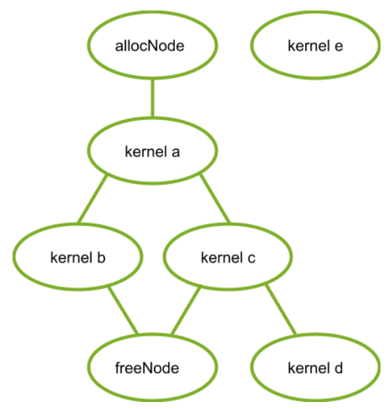

Kernel Nodes

The following code snippet establishes the graph in this figure:

```
// Create the graph - it starts out empty
cudaGraphCreate(&graph, 0);

// parameters for a basic allocation
cudaMemAllocNodeParams params = {};
params.poolProps.allocType = cudaMemAllocationTypePinned;
params.poolProps.location.type = cudaMemLocationTypeDevice;
// specify device 0 as the resident device
params.poolProps.location.id = 0;
params.bytesize = size;

cudaGraphAddMemAllocNode(&allocNode, graph, NULL, 0, &params);
nodeParams->kernelParams[0] = params.dptr;
cudaGraphAddKernelNode(&a, graph, &allocNode, 1, &nodeParams);
cudaGraphAddKernelNode(&b, graph, &a, 1, &nodeParams);
cudaGraphAddKernelNode(&c, graph, &a, 1, &nodeParams);
cudaGraphNode_t dependencies[2];
// kernel nodes b and c are using the graph allocation, so the freeing node must depend on them.  Since the dependency of node b on node a establishes an indirect dependency, the free node does not need to explicitly depend on node a.
dependencies[0] = b;
dependencies[1] = c;
cudaGraphAddMemFreeNode(&freeNode, graph, dependencies, 2, params.dptr);
// free node does not depend on kernel node d, so it must not access the freed graph allocation.
cudaGraphAddKernelNode(&d, graph, &c, 1, &nodeParams);

// node e does not depend on the allocation node, so it must not access the allocation.  This would be true even if the freeNode depended on kernel node e.
cudaGraphAddKernelNode(&e, graph, NULL, 0, &nodeParams);
```

### 12.3.2. Stream Capture

Graph memory nodes can be created by capturing the corresponding stream ordered allocation and free calls `cudaMallocAsync` and `cudaFreeAsync`. In this case, the virtual addresses returned by the captured allocation API can be used by other operations inside the graph. Since the stream ordered dependencies will be captured into the graph, the ordering requirements of the stream ordered allocation APIs guarantee that the graph memory nodes will be properly ordered with respect to the captured stream operations (for correctly written stream code).

Ignoring kernel nodes **d** and **e**, for clarity, the following code snippet shows how to use stream capture to create the graph from the previous figure:

```
cudaMallocAsync(&dptr, size, stream1);
kernel_A<<< ..., stream1 >>>(dptr, ...);

// Fork into stream2
cudaEventRecord(event1, stream1);
cudaStreamWaitEvent(stream2, event1);

kernel_B<<< ..., stream1 >>>(dptr, ...);
// event dependencies translated into graph dependencies, so the kernel node created by the capture of kernel C will depend on the allocation node created by capturing the cudaMallocAsync call.
kernel_C<<< ..., stream2 >>>(dptr, ...);

// Join stream2 back to origin stream (stream1)
cudaEventRecord(event2, stream2);
cudaStreamWaitEvent(stream1, event2);

// Free depends on all work accessing the memory.
cudaFreeAsync(dptr, stream1);

// End capture in the origin stream
cudaStreamEndCapture(stream1, &graph);
```

### 12.3.3. Accessing and Freeing Graph Memory Outside of the Allocating Graph

Graph allocations do not have to be freed by the allocating graph. When a graph does not free an allocation, that allocation persists beyond the execution of the graph and can be accessed by subsequent CUDA operations. These allocations may be accessed in another graph or directly using a stream operation as long as the accessing operation is ordered after the allocation through CUDA events and other stream ordering mechanisms. An allocation may subsequently be freed by regular calls to `cudaFree`, `cudaFreeAsync`, or by the launch of another graph with a corresponding free node, or a subsequent launch of the allocating graph (if it was instantiated with the [cudaGraphInstantiateFlagAutoFreeOnLaunch](index.md#graph-memory-nodes-cudagraphinstantiateflagautofreeonlaunch) flag). It is illegal to access memory after it has been freed - the free operation must be ordered after all operations accessing the memory using graph dependencies, CUDA events, and other stream ordering mechanisms.

Note

Because graph allocations may share underlying physical memory with each other, the [Virtual Aliasing Support](https://docs.nvidia.com/cuda/cuda-c-programming-guide/index.html#virtual-aliasing-support) rules relating to consistency and coherency must be considered. Simply put, the free operation must be ordered after the full device operation (for example, compute kernel / memcpy) completes. Specifically, out of band synchronization - for example a handshake through memory as part of a compute kernel that accesses the graph-allocated memory - is not sufficient for providing ordering guarantees between the memory writes to graph memory and the free operation of that graph memory.

The following code snippets demonstrate accessing graph allocations outside of the allocating graph with ordering properly established by: using a single stream, using events between streams, and using events baked into the allocating and freeing graph.

**Ordering established by using a single stream:**

```
void *dptr;
cudaGraphAddMemAllocNode(&allocNode, allocGraph, NULL, 0, &params);
dptr = params.dptr;

cudaGraphInstantiate(&allocGraphExec, allocGraph, NULL, NULL, 0);

cudaGraphLaunch(allocGraphExec, stream);
kernel<<< …, stream >>>(dptr, …);
cudaFreeAsync(dptr, stream);
```

**Ordering established by recording and waiting on CUDA events:**

```
void *dptr;

// Contents of allocating graph
cudaGraphAddMemAllocNode(&allocNode, allocGraph, NULL, 0, &params);
dptr = params.dptr;

// contents of consuming/freeing graph
nodeParams->kernelParams[0] = params.dptr;
cudaGraphAddKernelNode(&a, graph, NULL, 0, &nodeParams);
cudaGraphAddMemFreeNode(&freeNode, freeGraph, &a, 1, dptr);

cudaGraphInstantiate(&allocGraphExec, allocGraph, NULL, NULL, 0);
cudaGraphInstantiate(&freeGraphExec, freeGraph, NULL, NULL, 0);

cudaGraphLaunch(allocGraphExec, allocStream);

// establish the dependency of stream2 on the allocation node
// note: the dependency could also have been established with a stream synchronize operation
cudaEventRecord(allocEvent, allocStream)
cudaStreamWaitEvent(stream2, allocEvent);

kernel<<< …, stream2 >>> (dptr, …);

// establish the dependency between the stream 3 and the allocation use
cudaStreamRecordEvent(streamUseDoneEvent, stream2);
cudaStreamWaitEvent(stream3, streamUseDoneEvent);

// it is now safe to launch the freeing graph, which may also access the memory
cudaGraphLaunch(freeGraphExec, stream3);
```

**Ordering established by using graph external event nodes:**

```
void *dptr;
cudaEvent_t allocEvent; // event indicating when the allocation will be ready for use.
cudaEvent_t streamUseDoneEvent; // event indicating when the stream operations are done with the allocation.

// Contents of allocating graph with event record node
cudaGraphAddMemAllocNode(&allocNode, allocGraph, NULL, 0, &params);
dptr = params.dptr;
// note: this event record node depends on the alloc node
cudaGraphAddEventRecordNode(&recordNode, allocGraph, &allocNode, 1, allocEvent);
cudaGraphInstantiate(&allocGraphExec, allocGraph, NULL, NULL, 0);

// contents of consuming/freeing graph with event wait nodes
cudaGraphAddEventWaitNode(&streamUseDoneEventNode, waitAndFreeGraph, NULL, 0, streamUseDoneEvent);
cudaGraphAddEventWaitNode(&allocReadyEventNode, waitAndFreeGraph, NULL, 0, allocEvent);
nodeParams->kernelParams[0] = params.dptr;

// The allocReadyEventNode provides ordering with the alloc node for use in a consuming graph.
cudaGraphAddKernelNode(&kernelNode, waitAndFreeGraph, &allocReadyEventNode, 1, &nodeParams);

// The free node has to be ordered after both external and internal users.
// Thus the node must depend on both the kernelNode and the
// streamUseDoneEventNode.
dependencies[0] = kernelNode;
dependencies[1] = streamUseDoneEventNode;
cudaGraphAddMemFreeNode(&freeNode, waitAndFreeGraph, &dependencies, 2, dptr);
cudaGraphInstantiate(&waitAndFreeGraphExec, waitAndFreeGraph, NULL, NULL, 0);

cudaGraphLaunch(allocGraphExec, allocStream);

// establish the dependency of stream2 on the event node satisfies the ordering requirement
cudaStreamWaitEvent(stream2, allocEvent);
kernel<<< …, stream2 >>> (dptr, …);
cudaStreamRecordEvent(streamUseDoneEvent, stream2);

// the event wait node in the waitAndFreeGraphExec establishes the dependency on the “readyForFreeEvent” that is needed to prevent the kernel running in stream two from accessing the allocation after the free node in execution order.
cudaGraphLaunch(waitAndFreeGraphExec, stream3);
```

### 12.3.4. cudaGraphInstantiateFlagAutoFreeOnLaunch

Under normal circumstances, CUDA will prevent a graph from being relaunched if it has unfreed memory allocations because multiple allocations at the same address will leak memory. Instantiating a graph with the `cudaGraphInstantiateFlagAutoFreeOnLaunch` flag allows the graph to be relaunched while it still has unfreed allocations. In this case, the launch automatically inserts an asynchronous free of the unfreed allocations.

Auto free on launch is useful for single-producer multiple-consumer algorithms. At each iteration, a producer graph creates several allocations, and, depending on runtime conditions, a varying set of consumers accesses those allocations. This type of variable execution sequence means that consumers cannot free the allocations because a subsequent consumer may require access. Auto free on launch means that the launch loop does not need to track the producer’s allocations - instead, that information remains isolated to the producer’s creation and destruction logic. In general, auto free on launch simplifies an algorithm which would otherwise need to free all the allocations owned by a graph before each relaunch.

Note

The `cudaGraphInstantiateFlagAutoFreeOnLaunch` flag does not change the behavior of graph destruction. The application must explicitly free the unfreed memory in order to avoid memory leaks, even for graphs instantiated with the flag.
The following code shows the use of `cudaGraphInstantiateFlagAutoFreeOnLaunch` to simplify a single-producer / multiple-consumer algorithm:

```
// Create producer graph which allocates memory and populates it with data
cudaStreamBeginCapture(cudaStreamPerThread, cudaStreamCaptureModeGlobal);
cudaMallocAsync(&data1, blocks * threads, cudaStreamPerThread);
cudaMallocAsync(&data2, blocks * threads, cudaStreamPerThread);
produce<<<blocks, threads, 0, cudaStreamPerThread>>>(data1, data2);
...
cudaStreamEndCapture(cudaStreamPerThread, &graph);
cudaGraphInstantiateWithFlags(&producer,
                              graph,
                              cudaGraphInstantiateFlagAutoFreeOnLaunch);
cudaGraphDestroy(graph);

// Create first consumer graph by capturing an asynchronous library call
cudaStreamBeginCapture(cudaStreamPerThread, cudaStreamCaptureModeGlobal);
consumerFromLibrary(data1, cudaStreamPerThread);
cudaStreamEndCapture(cudaStreamPerThread, &graph);
cudaGraphInstantiateWithFlags(&consumer1, graph, 0); //regular instantiation
cudaGraphDestroy(graph);

// Create second consumer graph
cudaStreamBeginCapture(cudaStreamPerThread, cudaStreamCaptureModeGlobal);
consume2<<<blocks, threads, 0, cudaStreamPerThread>>>(data2);
...
cudaStreamEndCapture(cudaStreamPerThread, &graph);
cudaGraphInstantiateWithFlags(&consumer2, graph, 0);
cudaGraphDestroy(graph);

// Launch in a loop
bool launchConsumer2 = false;
do {
    cudaGraphLaunch(producer, myStream);
    cudaGraphLaunch(consumer1, myStream);
    if (launchConsumer2) {
        cudaGraphLaunch(consumer2, myStream);
    }
} while (determineAction(&launchConsumer2));

cudaFreeAsync(data1, myStream);
cudaFreeAsync(data2, myStream);

cudaGraphExecDestroy(producer);
cudaGraphExecDestroy(consumer1);
cudaGraphExecDestroy(consumer2);
```

## 12.4. Optimized Memory Reuse

CUDA reuses memory in two ways:

* Virtual and physical memory reuse within a graph is based on virtual address assignment, like in the stream ordered allocator.
* Physical memory reuse between graphs is done with virtual aliasing: different graphs can map the same physical memory to their unique virtual addresses.

### 12.4.1. Address Reuse within a Graph

CUDA may reuse memory within a graph by assigning the same virtual address ranges to different allocations whose lifetimes do not overlap. Since virtual addresses may be reused, pointers to different allocations with disjoint lifetimes are not guaranteed to be unique.

The following figure shows adding a new allocation node (2) that can reuse the address freed by a dependent node (1).


Adding New Alloc Node 2

The following figure shows adding a new alloc node (4). The new alloc node is not dependent on the free node (2) so cannot reuse the address from the associated alloc node (2). If the alloc node (2) used the address freed by free node (1), the new alloc node 3 would need a new address.


Adding New Alloc Node 3

### 12.4.2. Physical Memory Management and Sharing

CUDA is responsible for mapping physical memory to the virtual address before the allocating node is reached in GPU order. As an optimization for memory footprint and mapping overhead, multiple graphs may use the same physical memory for distinct allocations if they will not run simultaneously; however, physical pages cannot be reused if they are bound to more than one executing graph at the same time, or to a graph allocation which remains unfreed.

CUDA may update physical memory mappings at any time during graph instantiation, launch, or execution. CUDA may also introduce synchronization between future graph launches in order to prevent live graph allocations from referring to the same physical memory. As for any allocate-free-allocate pattern, if a program accesses a pointer outside of an allocation’s lifetime, the erroneous access may silently read or write live data owned by another allocation (even if the virtual address of the allocation is unique). Use of compute sanitizer tools can catch this error.

The following figure shows graphs sequentially launched in the same stream. In this example, each graph frees all the memory it allocates. Since the graphs in the same stream never run concurrently, CUDA can and should use the same physical memory to satisfy all the allocations.

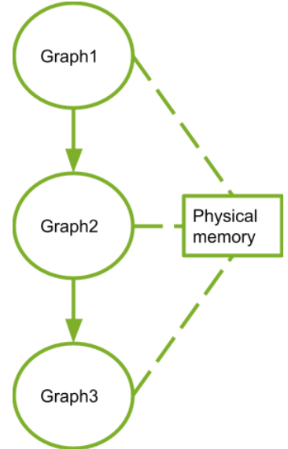

Sequentially Launched Graphs

## 12.5. Performance Considerations

When multiple graphs are launched into the same stream, CUDA attempts to allocate the same physical memory to them because the execution of these graphs cannot overlap. Physical mappings for a graph are retained between launches as an optimization to avoid the cost of remapping. If, at a later time, one of the graphs is launched such that its execution may overlap with the others (for example if it is launched into a different stream) then CUDA must perform some remapping because concurrent graphs require distinct memory to avoid data corruption.

In general, remapping of graph memory in CUDA is likely caused by these operations:

* Changing the stream into which a graph is launched
* A trim operation on the graph memory pool, which explicitly frees unused memory (discussed in [Physical Memory Footprint](index.md#graph-memory-nodes-physical-memory-footprint))
* Relaunching a graph while an unfreed allocation from another graph is mapped to the same memory will cause a remap of memory before relaunch

Remapping must happen in execution order, but after any previous execution of that graph is complete (otherwise memory that is still in use could be unmapped). Due to this ordering dependency, as well as because mapping operations are OS calls, mapping operations can be relatively expensive. Applications can avoid this cost by launching graphs containing allocation memory nodes consistently into the same stream.

### 12.5.1. First Launch / cudaGraphUpload

Physical memory cannot be allocated or mapped during graph instantiation because the stream in which the graph will execute is unknown. Mapping is done instead during graph launch. Calling `cudaGraphUpload` can separate out the cost of allocation from the launch by performing all mappings for that graph immediately and associating the graph with the upload stream. If the graph is then launched into the same stream, it will launch without any additional remapping.

Using different streams for graph upload and graph launch behaves similarly to switching streams, likely resulting in remap operations. In addition, unrelated memory pool management is permitted to pull memory from an idle stream, which could negate the impact of the uploads.

## 12.6. Physical Memory Footprint

The pool-management behavior of asynchronous allocation means that destroying a graph which contains memory nodes (even if their allocations are free) will not immediately return physical memory to the OS for use by other processes. To explicitly release memory back to the OS, an application should use the `cudaDeviceGraphMemTrim` API.

`cudaDeviceGraphMemTrim` will unmap and release any physical memory reserved by graph memory nodes that is not actively in use. Allocations that have not been freed and graphs that are scheduled or running are considered to be actively using the physical memory and will not be impacted. Use of the trim API will make physical memory available to other allocation APIs and other applications or processes, but will cause CUDA to reallocate and remap memory when the trimmed graphs are next launched. Note that `cudaDeviceGraphMemTrim` operates on a different pool from `cudaMemPoolTrimTo()`. The graph memory pool is not exposed to the steam ordered memory allocator. CUDA allows applications to query their graph memory footprint through the `cudaDeviceGetGraphMemAttribute` API. Querying the attribute `cudaGraphMemAttrReservedMemCurrent` returns the amount of physical memory reserved by the driver for graph allocations in the current process. Querying `cudaGraphMemAttrUsedMemCurrent` returns the amount of physical memory currently mapped by at least one graph. Either of these attributes can be used to track when new physical memory is acquired by CUDA for the sake of an allocating graph. Both of these attributes are useful for examining how much memory is saved by the sharing mechanism.

## 12.7. Peer Access

Graph allocations can be configured for access from multiple GPUs, in which case CUDA will map the allocations onto the peer GPUs as required. CUDA allows graph allocations requiring different mappings to reuse the same virtual address. When this occurs, the address range is mapped onto all GPUs required by the different allocations. This means an allocation may sometimes allow more peer access than was requested during its creation; however, relying on these extra mappings is still an error.

### 12.7.1. Peer Access with Graph Node APIs

The `cudaGraphAddMemAllocNode` API accepts mapping requests in the `accessDescs` array field of the node parameters structures. The `poolProps.location` embedded structure specifies the resident device for the allocation. Access from the allocating GPU is assumed to be needed, thus the application does not need to specify an entry for the resident device in the `accessDescs` array.

```
cudaMemAllocNodeParams params = {};
params.poolProps.allocType = cudaMemAllocationTypePinned;
params.poolProps.location.type = cudaMemLocationTypeDevice;
// specify device 1 as the resident device
params.poolProps.location.id = 1;
params.bytesize = size;

// allocate an allocation resident on device 1 accessible from device 1
cudaGraphAddMemAllocNode(&allocNode, graph, NULL, 0, &params);

accessDescs[2];
// boilerplate for the access descs (only ReadWrite and Device access supported by the add node api)
accessDescs[0].flags = cudaMemAccessFlagsProtReadWrite;
accessDescs[0].location.type = cudaMemLocationTypeDevice;
accessDescs[1].flags = cudaMemAccessFlagsProtReadWrite;
accessDescs[1].location.type = cudaMemLocationTypeDevice;

// access being requested for device 0 & 2.  Device 1 access requirement left implicit.
accessDescs[0].location.id = 0;
accessDescs[1].location.id = 2;

// access request array has 2 entries.
params.accessDescCount = 2;
params.accessDescs = accessDescs;

// allocate an allocation resident on device 1 accessible from devices 0, 1 and 2. (0 & 2 from the descriptors, 1 from it being the resident device).
cudaGraphAddMemAllocNode(&allocNode, graph, NULL, 0, &params);
```

### 12.7.2. Peer Access with Stream Capture

For stream capture, the allocation node records the peer accessibility of the allocating pool at the time of the capture. Altering the peer accessibility of the allocating pool after a `cudaMallocFromPoolAsync` call is captured does not affect the mappings that the graph will make for the allocation.

```
// boilerplate for the access descs (only ReadWrite and Device access supported by the add node api)
accessDesc.flags = cudaMemAccessFlagsProtReadWrite;
accessDesc.location.type = cudaMemLocationTypeDevice;
accessDesc.location.id = 1;

// let memPool be resident and accessible on device 0

cudaStreamBeginCapture(stream);
cudaMallocAsync(&dptr1, size, memPool, stream);
cudaStreamEndCapture(stream, &graph1);

cudaMemPoolSetAccess(memPool, &accessDesc, 1);

cudaStreamBeginCapture(stream);
cudaMallocAsync(&dptr2, size, memPool, stream);
cudaStreamEndCapture(stream, &graph2);

//The graph node allocating dptr1 would only have the device 0 accessibility even though memPool now has device 1 accessibility.
//The graph node allocating dptr2 will have device 0 and device 1 accessibility, since that was the pool accessibility at the time of the cudaMallocAsync call.
```

# 13. Mathematical Functions

The reference manual lists, along with their description, all the functions of the C/C++ standard library mathematical functions that are supported in device code, as well as all intrinsic functions (that are only supported in device code).

This section provides accuracy information for some of these functions when applicable. It uses ULP for quantification. For further information on the definition of the Unit in the Last Place (ULP), please see Jean-Michel Muller’s paper *On the definition of ulp(x)*, RR-5504, LIP RR-2005-09, INRIA, LIP. 2005, pp.16 at <https://hal.inria.fr/inria-00070503/document>.

Mathematical functions supported in device code do not set the global `errno` variable, nor report any floating-point exceptions to indicate errors; thus, if error diagnostic mechanisms are required, the user should implement additional screening for inputs and outputs of the functions. The user is responsible for the validity of pointer arguments. The user must not pass uninitialized parameters to the Mathematical functions as this may result in undefined behavior: functions are inlined in the user program and thus are subject to compiler optimizations.

## 13.1. Standard Functions

The functions from this section can be used in both host and device code.

This section specifies the error bounds of each function when executed on the device and also when executed on the host in the case where the host does not supply the function.

The error bounds are generated from extensive but not exhaustive tests, so they are not guaranteed bounds.

**Single-Precision Floating-Point Functions**

Addition and multiplication are IEEE-compliant, so have a maximum error of 0.5 ulp.

The recommended way to round a single-precision floating-point operand to an integer, with the result being a single-precision floating-point number is `rintf()`, not `roundf()`. The reason is that `roundf()` maps to a 4-instruction sequence on the device, whereas `rintf()` maps to a single instruction. `truncf()`, `ceilf()`, and `floorf()` each map to a single instruction as well.

Table 7. Single-Precision Mathematical Standard Library Functions with Maximum ULP Error. The maximum error is stated as the absolute value of the difference in ulps between a correctly rounded single-precision result and the result returned by the CUDA library function.

| Function | Maximum ulp error |
| --- | --- |
| `x+y` | 0 (IEEE-754 round-to-nearest-even) |
| `x*y` | 0 (IEEE-754 round-to-nearest-even) |
| `x/y` | 0 for compute capability ≥ 2 when compiled with `-prec-div=true`  2 (full range), otherwise |
| `1/x` | 0 for compute capability ≥ 2 when compiled with `-prec-div=true`  1 (full range), otherwise |
| `rsqrtf(x)`  `1/sqrtf(x)` | 2 (full range)  Applies to `1/sqrtf(x)` only when it is converted to `rsqrtf(x)` by the compiler. |
| `sqrtf(x)` | 0 when compiled with `-prec-sqrt=true`  Otherwise 1 for compute capability ≥ 5.2  and 3 for older architectures |
| `cbrtf(x)` | 1 (full range) |
| `rcbrtf(x)` | 1 (full range) |
| `hypotf(x,y)` | 3 (full range) |
| `rhypotf(x,y)` | 2 (full range) |
| `norm3df(x,y,z)` | 3 (full range) |
| `rnorm3df(x,y,z)` | 2 (full range) |
| `norm4df(x,y,z,t)` | 3 (full range) |
| `rnorm4df(x,y,z,t)` | 2 (full range) |
| `normf(dim,arr)` | An error bound cannot be provided because a fast algorithm is used with accuracy loss due to round-off. . |
| `rnormf(dim,arr)` | An error bound cannot be provided because a fast algorithm is used with accuracy loss due to round-off. . |
| `expf(x)` | 2 (full range) |
| `exp2f(x)` | 2 (full range) |
| `exp10f(x)` | 2 (full range) |
| `expm1f(x)` | 1 (full range) |
| `logf(x)` | 1 (full range) |
| `log2f(x)` | 1 (full range) |
| `log10f(x)` | 2 (full range) |
| `log1pf(x)` | 1 (full range) |
| `sinf(x)` | 2 (full range) |
| `cosf(x)` | 2 (full range) |
| `tanf(x)` | 4 (full range) |
| `sincosf(x,sptr,cptr)` | 2 (full range) |
| `sinpif(x)` | 2 (full range) |
| `cospif(x)` | 2 (full range) |
| `sincospif(x,sptr,cptr)` | 2 (full range) |
| `asinf(x)` | 2 (full range) |
| `acosf(x)` | 2 (full range) |
| `atanf(x)` | 2 (full range) |
| `atan2f(y,x)` | 3 (full range) |
| `sinhf(x)` | 3 (full range) |
| `coshf(x)` | 2 (full range) |
| `tanhf(x)` | 2 (full range) |
| `asinhf(x)` | 3 (full range) |
| `acoshf(x)` | 4 (full range) |
| `atanhf(x)` | 3 (full range) |
| `powf(x,y)` | 4 (full range) |
| `erff(x)` | 2 (full range) |
| `erfcf(x)` | 4 (full range) |
| `erfinvf(x)` | 2 (full range) |
| `erfcinvf(x)` | 4 (full range) |
| `erfcxf(x)` | 4 (full range) |
| `normcdff(x)` | 5 (full range) |
| `normcdfinvf(x)` | 5 (full range) |
| `lgammaf(x)` | 6 (outside interval -10.001 … -2.264; larger inside) |
| `tgammaf(x)` | 5 (full range) |
| `fmaf(x,y,z)` | 0 (full range) |
| `frexpf(x,exp)` | 0 (full range) |
| `ldexpf(x,exp)` | 0 (full range) |
| `scalbnf(x,n)` | 0 (full range) |
| `scalblnf(x,l)` | 0 (full range) |
| `logbf(x)` | 0 (full range) |
| `ilogbf(x)` | 0 (full range) |
| `j0f(x)` | 9 for |x| < 8  otherwise, the maximum absolute error is 2.2 x 10-6 |
| `j1f(x)` | 9 for |x| < 8  otherwise, the maximum absolute error is 2.2 x 10-6 |
| `jnf(n,x)` | For n = 128, the maximum absolute error is 2.2 x 10-6 |
| `y0f(x)` | 9 for |x| < 8  otherwise, the maximum absolute error is 2.2 x 10-6 |
| `y1f(x)` | 9 for |x| < 8  otherwise, the maximum absolute error is 2.2 x 10-6 |
| `ynf(n,x)` | ceil(2 + 2.5n) for |x| < n  otherwise, the maximum absolute error is 2.2 x 10-6 |
| `cyl_bessel_i0f(x)` | 6 (full range) |
| `cyl_bessel_i1f(x)` | 6 (full range) |
| `fmodf(x,y)` | 0 (full range) |
| `remainderf(x,y)` | 0 (full range) |
| `remquof(x,y,iptr)` | 0 (full range) |
| `modff(x,iptr)` | 0 (full range) |
| `fdimf(x,y)` | 0 (full range) |
| `truncf(x)` | 0 (full range) |
| `roundf(x)` | 0 (full range) |
| `rintf(x)` | 0 (full range) |
| `nearbyintf(x)` | 0 (full range) |
| `ceilf(x)` | 0 (full range) |
| `floorf(x)` | 0 (full range) |
| `lrintf(x)` | 0 (full range) |
| `lroundf(x)` | 0 (full range) |
| `llrintf(x)` | 0 (full range) |
| `llroundf(x)` | 0 (full range) |

**Double-Precision Floating-Point Functions**

The recommended way to round a double-precision floating-point operand to an integer, with the result being a double-precision floating-point number is `rint()`, not `round()`. The reason is that `round()` maps to a 5-instruction sequence on the device, whereas `rint()` maps to a single instruction. `trunc()`, `ceil()`, and `floor()` each map to a single instruction as well.

Table 8. Double-Precision Mathematical Standard Library Functions with Maximum ULP Error. The maximum error is stated as the absolute value of the difference in ulps between a correctly rounded double-precision result and the result returned by the CUDA library function.

| Function | Maximum ulp error |
| --- | --- |
| `x+y` | 0 (IEEE-754 round-to-nearest-even) |
| `x*y` | 0 (IEEE-754 round-to-nearest-even) |
| `x/y` | 0 (IEEE-754 round-to-nearest-even) |
| `1/x` | 0 (IEEE-754 round-to-nearest-even) |
| `sqrt(x)` | 0 (IEEE-754 round-to-nearest-even) |
| `rsqrt(x)` | 1 (full range) |
| `cbrt(x)` | 1 (full range) |
| `rcbrt(x)` | 1 (full range) |
| `hypot(x,y)` | 2 (full range) |
| `rhypot(x,y)` | 1 (full range) |
| `norm3d(x,y,z)` | 2 (full range) |
| `rnorm3d(x,y,z)` | 1 (full range) |
| `norm4d(x,y,z,t)` | 2 (full range) |
| `rnorm4d(x,y,z,t)` | 1 (full range) |
| `norm(dim,arr)` | An error bound cannot be provided because a fast algorithm is used with accuracy loss due to round-off. |
| `rnorm(dim,arr)` | An error bound cannot be provided because a fast algorithm is used with accuracy loss due to round-off. |
| `exp(x)` | 1 (full range) |
| `exp2(x)` | 1 (full range) |
| `exp10(x)` | 1 (full range) |
| `expm1(x)` | 1 (full range) |
| `log(x)` | 1 (full range) |
| `log2(x)` | 1 (full range) |
| `log10(x)` | 1 (full range) |
| `log1p(x)` | 1 (full range) |
| `sin(x)` | 2 (full range) |
| `cos(x)` | 2 (full range) |
| `tan(x)` | 2 (full range) |
| `sincos(x,sptr,cptr)` | 2 (full range) |
| `sinpi(x)` | 2 (full range) |
| `cospi(x)` | 2 (full range) |
| `sincospi(x,sptr,cptr)` | 2 (full range) |
| `asin(x)` | 2 (full range) |
| `acos(x)` | 2 (full range) |
| `atan(x)` | 2 (full range) |
| `atan2(y,x)` | 2 (full range) |
| `sinh(x)` | 2 (full range) |
| `cosh(x)` | 1 (full range) |
| `tanh(x)` | 1 (full range) |
| `asinh(x)` | 3 (full range) |
| `acosh(x)` | 3 (full range) |
| `atanh(x)` | 2 (full range) |
| `pow(x,y)` | 2 (full range) |
| `erf(x)` | 2 (full range) |
| `erfc(x)` | 5 (full range) |
| `erfinv(x)` | 5 (full range) |
| `erfcinv(x)` | 6 (full range) |
| `erfcx(x)` | 4 (full range) |
| `normcdf(x)` | 5 (full range) |
| `normcdfinv(x)` | 8 (full range) |
| `lgamma(x)` | 4 (outside interval -11.0001 … -2.2637; larger inside) |
| `tgamma(x)` | 10 (full range) |
| `fma(x,y,z)` | 0 (IEEE-754 round-to-nearest-even) |
| `frexp(x,exp)` | 0 (full range) |
| `ldexp(x,exp)` | 0 (full range) |
| `scalbn(x,n)` | 0 (full range) |
| `scalbln(x,l)` | 0 (full range) |
| `logb(x)` | 0 (full range) |
| `ilogb(x)` | 0 (full range) |
| `j0(x)` | 7 for |x| < 8  otherwise, the maximum absolute error is 5 x 10-12 |
| `j1(x)` | 7 for |x| < 8  otherwise, the maximum absolute error is 5 x 10-12 |
| `jn(n,x)` | For n = 128, the maximum absolute error is 5 x 10-12 |
| `y0(x)` | 7 for |x| < 8  otherwise, the maximum absolute error is 5 x 10-12 |
| `y1(x)` | 7 for |x| < 8  otherwise, the maximum absolute error is 5 x 10-12 |
| `yn(n,x)` | For |x| > 1.5n, the maximum absolute error is 5 x 10-12 |
| `cyl_bessel_i0(x)` | 6 (full range) |
| `cyl_bessel_i1(x)` | 6 (full range) |
| `fmod(x,y)` | 0 (full range) |
| `remainder(x,y)` | 0 (full range) |
| `remquo(x,y,iptr)` | 0 (full range) |
| `modf(x,iptr)` | 0 (full range) |
| `fdim(x,y)` | 0 (full range) |
| `trunc(x)` | 0 (full range) |
| `round(x)` | 0 (full range) |
| `rint(x)` | 0 (full range) |
| `nearbyint(x)` | 0 (full range) |
| `ceil(x)` | 0 (full range) |
| `floor(x)` | 0 (full range) |
| `lrint(x)` | 0 (full range) |
| `lround(x)` | 0 (full range) |
| `llrint(x)` | 0 (full range) |
| `llround(x)` | 0 (full range) |

## 13.2. [Intrinsic Functions](#intrinsic-functions)

The functions from this section can only be used in device code.

Among these functions are the less accurate, but faster versions of some of the functions of [Standard Functions](index.md#standard-functions) .They have the same name prefixed with `__` (such as `__sinf(x)`). They are faster as they map to fewer native instructions. The compiler has an option (`-use_fast_math`) that forces each function in [Table 9](index.md#intrinsic-functions-functions-affected-use-fast-math) to compile to its intrinsic counterpart. In addition to reducing the accuracy of the affected functions, it may also cause some differences in special case handling. A more robust approach is to selectively replace mathematical function calls by calls to intrinsic functions only where it is merited by the performance gains and where changed properties such as reduced accuracy and different special case handling can be tolerated.

Table 9. Functions Affected by -use\_fast\_math

| Operator/Function | Device Function |
| --- | --- |
| `x/y` | `__fdividef(x,y)` |
| `sinf(x)` | `__sinf(x)` |
| `cosf(x)` | `__cosf(x)` |
| `tanf(x)` | `__tanf(x)` |
| `sincosf(x,sptr,cptr)` | `__sincosf(x,sptr,cptr)` |
| `logf(x)` | `__logf(x)` |
| `log2f(x)` | `__log2f(x)` |
| `log10f(x)` | `__log10f(x)` |
| `expf(x)` | `__expf(x)` |
| `exp10f(x)` | `__exp10f(x)` |
| `powf(x,y)` | `__powf(x,y)` |

**Single-Precision Floating-Point Functions**

`__fadd_[rn,rz,ru,rd]()` and `__fmul_[rn,rz,ru,rd]()` map to addition and multiplication operations that the compiler never merges into FMADs. By contrast, additions and multiplications generated from the ‘\*’ and ‘+’ operators will frequently be combined into FMADs.

Functions suffixed with `_rn` operate using the round to nearest even rounding mode.

Functions suffixed with `_rz` operate using the round towards zero rounding mode.

Functions suffixed with `_ru` operate using the round up (to positive infinity) rounding mode.

Functions suffixed with `_rd` operate using the round down (to negative infinity) rounding mode.

The accuracy of floating-point division varies depending on whether the code is compiled with `-prec-div=false` or `-prec-div=true`. When the code is compiled with `-prec-div=false`, both the regular division `/` operator and `__fdividef(x,y)` have the same accuracy, but for 2126 < `|y|` < 2128, `__fdividef(x,y)` delivers a result of zero, whereas the `/` operator delivers the correct result to within the accuracy stated in [Table 10](index.md#intrinsic-functions-single-precision-floating-point-intrinsic-functions-supported-by-cuda-runtime-library). Also, for 2126 < `|y|` < 2128, if `x` is infinity, `__fdividef(x,y)` delivers a `NaN` (as a result of multiplying infinity by zero), while the `/` operator returns infinity. On the other hand, the `/` operator is IEEE-compliant when the code is compiled with `-prec-div=true` or without any `-prec-div` option at all since its default value is true.

Table 10. Single-Precision Floating-Point Intrinsic Functions. (Supported by the CUDA Runtime Library with Respective Error Bounds)

| Function | Error bounds |
| --- | --- |
| `__fadd_[rn,rz,ru,rd](x,y)` | IEEE-compliant. |
| `__fsub_[rn,rz,ru,rd](x,y)` | IEEE-compliant. |
| `__fmul_[rn,rz,ru,rd](x,y)` | IEEE-compliant. |
| `__fmaf_[rn,rz,ru,rd](x,y,z)` | IEEE-compliant. |
| `__frcp_[rn,rz,ru,rd](x)` | IEEE-compliant. |
| `__fsqrt_[rn,rz,ru,rd](x)` | IEEE-compliant. |
| `__frsqrt_rn(x)` | IEEE-compliant. |
| `__fdiv_[rn,rz,ru,rd](x,y)` | IEEE-compliant. |
| `__fdividef(x,y)` | For `|y|` in [2-126, 2126], the maximum ulp error is 2. |
| `__expf(x)` | The maximum ulp error is `2 + floor(abs(1.173 * x))`. |
| `__exp10f(x)` | The maximum ulp error is `2 + floor(abs(2.97 * x))`. |
| `__logf(x)` | For `x` in [0.5, 2], the maximum absolute error is 2-21.41, otherwise, the maximum ulp error is 3. |
| `__log2f(x)` | For `x` in [0.5, 2], the maximum absolute error is 2-22, otherwise, the maximum ulp error is 2. |
| `__log10f(x)` | For `x` in [0.5, 2], the maximum absolute error is 2-24, otherwise, the maximum ulp error is 3. |
| `__sinf(x)` | For `x` in [-π,π], the maximum absolute error is 2-21.41, and larger otherwise. |
| `__cosf(x)` | For `x` in [-π,π], the maximum absolute error is 2-21.19, and larger otherwise. |
| `__sincosf(x,sptr,cptr)` | Same as `__sinf(x)` and `__cosf(x)`. |
| `__tanf(x)` | Derived from its implementation as `__sinf(x) * (1/__cosf(x))`. |
| `__powf(x, y)` | Derived from its implementation as `exp2f(y * __log2f(x))`. |

**Double-Precision Floating-Point Functions**

`__dadd_rn()` and `__dmul_rn()` map to addition and multiplication operations that the compiler never merges into FMADs. By contrast, additions and multiplications generated from the ‘\*’ and ‘+’ operators will frequently be combined into FMADs.

Table 11. Double-Precision Floating-Point Intrinsic Functions. (Supported by the CUDA Runtime Library with Respective Error Bounds)

| Function | Error bounds |
| --- | --- |
| `__dadd_[rn,rz,ru,rd](x,y)` | IEEE-compliant. |
| `__dsub_[rn,rz,ru,rd](x,y)` | IEEE-compliant. |
| `__dmul_[rn,rz,ru,rd](x,y)` | IEEE-compliant. |
| `__fma_[rn,rz,ru,rd](x,y,z)` | IEEE-compliant. |
| `__ddiv_[rn,rz,ru,rd](x,y)(x,y)` | IEEE-compliant.  Requires compute capability *>* 2. |
| `__drcp_[rn,rz,ru,rd](x)` | IEEE-compliant.  Requires compute capability *>* 2. |
| `__dsqrt_[rn,rz,ru,rd](x)` | IEEE-compliant.  Requires compute capability *>* 2. |

# 14. C++ Language Support

As described in [Compilation with NVCC](index.md#compilation-with-nvcc), CUDA source files compiled with `nvcc` can include a mix of host code and device code. The CUDA front-end compiler aims to emulate the host compiler behavior with respect to C++ input code. The input source code is processed according to the C++ ISO/IEC 14882:2003, C++ ISO/IEC 14882:2011, C++ ISO/IEC 14882:2014 or C++ ISO/IEC 14882:2017 specifications, and the CUDA front-end compiler aims to emulate any host compiler divergences from the ISO specification. In addition, the supported language is extended with CUDA-specific constructs described in this document [13](#fn13), and is subject to the restrictions described below.

[C++11 Language Features](index.md#cpp11-language-features), [C++14 Language Features](index.md#cpp14-language-features) and [C++17 Language Features](index.md#cpp17-language-features) provide support matrices for the C++11, C++14, C++17 and C++20 features, respectively. [Restrictions](index.md#restrictions) lists the language restrictions. [Polymorphic Function Wrappers](index.md#polymorphic-function-wrappers) and [Extended Lambdas](index.md#extended-lambda) describe additional features. [Code Samples](index.md#code-samples) gives code samples.

## 14.1. C++11 Language Features

The following table lists new language features that have been accepted into the C++11 standard. The “Proposal” column provides a link to the ISO C++ committee proposal that describes the feature, while the “Available in nvcc (device code)” column indicates the first version of nvcc that contains an implementation of this feature (if it has been implemented) for device code.

Table 12. C++11 Language Features

| Language Feature | C++11 Proposal | Available in nvcc (device code) |
| --- | --- | --- |
| Rvalue references | [N2118](http://www.open-std.org/jtc1/sc22/wg21/docs/papers/2006/n2118.html) | 7.0 |
| Rvalue references for `*this` | [N2439](http://www.open-std.org/jtc1/sc22/wg21/docs/papers/2007/n2439.htm) | 7.0 |
| Initialization of class objects by rvalues | [N1610](http://www.open-std.org/jtc1/sc22/wg21/docs/papers/2004/n1610.html) | 7.0 |
| Non-static data member initializers | [N2756](http://www.open-std.org/JTC1/SC22/WG21/docs/papers/2008/n2756.htm) | 7.0 |
| Variadic templates | [N2242](http://www.open-std.org/jtc1/sc22/wg21/docs/papers/2007/n2242.pdf) | 7.0 |
| Extending variadic template template parameters | [N2555](http://www.open-std.org/jtc1/sc22/wg21/docs/papers/2008/n2555.pdf) | 7.0 |
| Initializer lists | [N2672](http://www.open-std.org/jtc1/sc22/wg21/docs/papers/2008/n2672.htm) | 7.0 |
| Static assertions | [N1720](http://www.open-std.org/jtc1/sc22/wg21/docs/papers/2004/n1720.html) | 7.0 |
| `auto`-typed variables | [N1984](http://www.open-std.org/jtc1/sc22/wg21/docs/papers/2006/n1984.pdf) | 7.0 |
| Multi-declarator `auto` | [N1737](http://www.open-std.org/jtc1/sc22/wg21/docs/papers/2004/n1737.pdf) | 7.0 |
| Removal of auto as a storage-class specifier | [N2546](http://www.open-std.org/jtc1/sc22/wg21/docs/papers/2008/n2546.htm) | 7.0 |
| New function declarator syntax | [N2541](http://www.open-std.org/jtc1/sc22/wg21/docs/papers/2008/n2541.htm) | 7.0 |
| Lambda expressions | [N2927](http://www.open-std.org/JTC1/SC22/WG21/docs/papers/2009/n2927.pdf) | 7.0 |
| Declared type of an expression | [N2343](http://www.open-std.org/jtc1/sc22/wg21/docs/papers/2007/n2343.pdf) | 7.0 |
| Incomplete return types | [N3276](http://www.open-std.org/jtc1/sc22/wg21/docs/papers/2011/n3276.pdf) | 7.0 |
| Right angle brackets | [N1757](http://www.open-std.org/jtc1/sc22/wg21/docs/papers/2005/n1757.html) | 7.0 |
| Default template arguments for function templates | [DR226](http://www.open-std.org/jtc1/sc22/wg21/docs/cwg_defects.html#226) | 7.0 |
| Solving the SFINAE problem for expressions | [DR339](http://www.open-std.org/jtc1/sc22/wg21/docs/papers/2008/n2634.html) | 7.0 |
| Alias templates | [N2258](http://www.open-std.org/jtc1/sc22/wg21/docs/papers/2007/n2258.pdf) | 7.0 |
| Extern templates | [N1987](http://www.open-std.org/jtc1/sc22/wg21/docs/papers/2006/n1987.htm) | 7.0 |
| Null pointer constant | [N2431](http://www.open-std.org/jtc1/sc22/wg21/docs/papers/2007/n2431.pdf) | 7.0 |
| Strongly-typed enums | [N2347](http://www.open-std.org/jtc1/sc22/wg21/docs/papers/2007/n2347.pdf) | 7.0 |
| Forward declarations for enums | [N2764](http://www.open-std.org/jtc1/sc22/wg21/docs/papers/2008/n2764.pdf) [DR1206](http://www.open-std.org/jtc1/sc22/wg21/docs/cwg_defects.html#1206) | 7.0 |
| Standardized attribute syntax | [N2761](http://www.open-std.org/jtc1/sc22/wg21/docs/papers/2008/n2761.pdf) | 7.0 |
| Generalized constant expressions | [N2235](http://www.open-std.org/jtc1/sc22/wg21/docs/papers/2007/n2235.pdf) | 7.0 |
| Alignment support | [N2341](http://www.open-std.org/jtc1/sc22/wg21/docs/papers/2007/n2341.pdf) | 7.0 |
| Conditionally-support behavior | [N1627](http://www.open-std.org/jtc1/sc22/wg21/docs/papers/2004/n1627.pdf) | 7.0 |
| Changing undefined behavior into diagnosable errors | [N1727](http://www.open-std.org/jtc1/sc22/wg21/docs/papers/2004/n1727.pdf) | 7.0 |
| Delegating constructors | [N1986](http://www.open-std.org/jtc1/sc22/wg21/docs/papers/2006/n1986.pdf) | 7.0 |
| Inheriting constructors | [N2540](http://www.open-std.org/jtc1/sc22/wg21/docs/papers/2008/n2540.htm) | 7.0 |
| Explicit conversion operators | [N2437](http://www.open-std.org/jtc1/sc22/wg21/docs/papers/2007/n2437.pdf) | 7.0 |
| New character types | [N2249](http://www.open-std.org/jtc1/sc22/wg21/docs/papers/2007/n2249.html) | 7.0 |
| Unicode string literals | [N2442](http://www.open-std.org/jtc1/sc22/wg21/docs/papers/2007/n2442.htm) | 7.0 |
| Raw string literals | [N2442](http://www.open-std.org/jtc1/sc22/wg21/docs/papers/2007/n2442.htm) | 7.0 |
| Universal character names in literals | [N2170](http://www.open-std.org/jtc1/sc22/wg21/docs/papers/2007/n2170.html) | 7.0 |
| User-defined literals | [N2765](http://www.open-std.org/jtc1/sc22/wg21/docs/papers/2008/n2765.pdf) | 7.0 |
| Standard Layout Types | [N2342](http://www.open-std.org/jtc1/sc22/wg21/docs/papers/2007/n2342.htm) | 7.0 |
| Defaulted functions | [N2346](http://www.open-std.org/jtc1/sc22/wg21/docs/papers/2007/n2346.htm) | 7.0 |
| Deleted functions | [N2346](http://www.open-std.org/jtc1/sc22/wg21/docs/papers/2007/n2346.htm) | 7.0 |
| Extended friend declarations | [N1791](http://www.open-std.org/jtc1/sc22/wg21/docs/papers/2005/n1791.pdf) | 7.0 |
| Extending `sizeof` | [N2253](http://www.open-std.org/jtc1/sc22/wg21/docs/papers/2007/n2253.html) [DR850](http://www.open-std.org/jtc1/sc22/wg21/docs/cwg_defects.html#850) | 7.0 |
| Inline namespaces | [N2535](http://www.open-std.org/jtc1/sc22/wg21/docs/papers/2008/n2535.htm) | 7.0 |
| Unrestricted unions | [N2544](http://www.open-std.org/jtc1/sc22/wg21/docs/papers/2008/n2544.pdf) | 7.0 |
| Local and unnamed types as template arguments | [N2657](http://www.open-std.org/jtc1/sc22/wg21/docs/papers/2008/n2657.htm) | 7.0 |
| Range-based for | [N2930](http://www.open-std.org/JTC1/SC22/WG21/docs/papers/2009/n2930.html) | 7.0 |
| Explicit virtual overrides | [N2928](http://www.open-std.org/JTC1/SC22/WG21/docs/papers/2009/n2928.htm) [N3206](http://www.open-std.org/jtc1/sc22/wg21/docs/papers/2010/n3206.htm) [N3272](http://www.open-std.org/jtc1/sc22/wg21/docs/papers/2011/n3272.htm) | 7.0 |
| Minimal support for garbage collection and reachability-based leak detection | [N2670](http://www.open-std.org/jtc1/sc22/wg21/docs/papers/2008/n2670.htm) | N/A (see [Restrictions](index.md#restrictions)) |
| Allowing move constructors to throw [noexcept] | [N3050](http://www.open-std.org/jtc1/sc22/wg21/docs/papers/2010/n3050.html) | 7.0 |
| Defining move special member functions | [N3053](http://www.open-std.org/jtc1/sc22/wg21/docs/papers/2010/n3053.html) | 7.0 |
| **Concurrency** |  |  |
| Sequence points | [N2239](http://www.open-std.org/jtc1/sc22/wg21/docs/papers/2007/n2239.html) |  |
| Atomic operations | [N2427](http://www.open-std.org/jtc1/sc22/wg21/docs/papers/2007/n2427.html) |  |
| Strong Compare and Exchange | [N2748](http://www.open-std.org/jtc1/sc22/wg21/docs/papers/2008/n2748.html) |  |
| Bidirectional Fences | [N2752](http://www.open-std.org/jtc1/sc22/wg21/docs/papers/2008/n2752.htm) |  |
| Memory model | [N2429](http://www.open-std.org/jtc1/sc22/wg21/docs/papers/2007/n2429.htm) |  |
| Data-dependency ordering: atomics and memory model | [N2664](http://www.open-std.org/jtc1/sc22/wg21/docs/papers/2008/n2664.htm) |  |
| Propagating exceptions | [N2179](http://www.open-std.org/jtc1/sc22/wg21/docs/papers/2007/n2179.html) |  |
| Allow atomics use in signal handlers | [N2547](http://www.open-std.org/jtc1/sc22/wg21/docs/papers/2008/n2547.htm) |  |
| Thread-local storage | [N2659](http://www.open-std.org/jtc1/sc22/wg21/docs/papers/2008/n2659.htm) |  |
| Dynamic initialization and destruction with concurrency | [N2660](http://www.open-std.org/jtc1/sc22/wg21/docs/papers/2008/n2660.htm) |  |
| **C99 Features in C++11** |  |  |
| `__func__` predefined identifier | [N2340](http://www.open-std.org/jtc1/sc22/wg21/docs/papers/2007/n2340.htm) | 7.0 |
| C99 preprocessor | [N1653](http://www.open-std.org/jtc1/sc22/wg21/docs/papers/2004/n1653.htm) | 7.0 |
| `long long` | [N1811](http://www.open-std.org/jtc1/sc22/wg21/docs/papers/2005/n1811.pdf) | 7.0 |
| Extended integral types | [N1988](http://www.open-std.org/jtc1/sc22/wg21/docs/papers/2006/n1988.pdf) |  |

## 14.2. C++14 Language Features

The following table lists new language features that have been accepted into the C++14 standard.

Table 13. C++14 Language Features

| Language Feature | C++14 Proposal | Available in nvcc (device code) |
| --- | --- | --- |
| Tweak to certain C++ contextual conversions | [N3323](http://www.open-std.org/jtc1/sc22/wg21/docs/papers/2012/n3323.pdf) | 9.0 |
| Binary literals | [N3472](http://www.open-std.org/jtc1/sc22/wg21/docs/papers/2012/n3472.pdf) | 9.0 |
| Functions with deduced return type | [N3638](https://isocpp.org/files/papers/N3638.html) | 9.0 |
| Generalized lambda capture (init-capture) | [N3648](https://isocpp.org/files/papers/N3648.html) | 9.0 |
| Generic (polymorphic) lambda expressions | [N3649](https://isocpp.org/files/papers/N3649.html) | 9.0 |
| Variable templates | [N3651](https://isocpp.org/files/papers/N3651.pdf) | 9.0 |
| Relaxing requirements on constexpr functions | [N3652](https://isocpp.org/files/papers/N3652.html) | 9.0 |
| Member initializers and aggregates | [N3653](http://www.open-std.org/jtc1/sc22/wg21/docs/papers/2013/n3653.html) | 9.0 |
| Clarifying memory allocation | [N3664](http://www.open-std.org/jtc1/sc22/wg21/docs/papers/2013/n3664.html) |  |
| Sized deallocation | [N3778](https://isocpp.org/files/papers/n3778.html) |  |
| `[[deprecated]]` attribute | [N3760](http://www.open-std.org/jtc1/sc22/wg21/docs/papers/2013/n3760.html) | 9.0 |
| Single-quotation-mark as a digit separator | [N3781](http://www.open-std.org/jtc1/sc22/wg21/docs/papers/2013/n3781.pdf) | 9.0 |

## 14.3. C++17 Language Features

All C++17 language features are supported in nvcc version 11.0 and later, subject to restrictions described [here](index.md#cpp17).

## 14.4. C++20 Language Features

All C++20 language features are supported in nvcc version 12.0 and later, subject to restrictions described [here](index.md#cpp20).

## 14.5. Restrictions

### 14.5.1. Host Compiler Extensions

Host compiler specific language extensions are not supported in device code.

`__Complex` types are only supported in host code.

`__int128` type is supported in device code when compiled in conjunction with a host compiler that supports it.

`__float128` type is only supported in host code on 64-bit x86 Linux platforms. A constant expression of `__float128` type may be processed by the compiler in a floating point representation with lower precision.

### 14.5.2. Preprocessor Symbols

#### 14.5.2.1. \_\_CUDA\_ARCH\_\_

1. The type signature of the following entities shall not depend on whether `__CUDA_ARCH__` is defined or not, or on a particular value of `__CUDA_ARCH__`:

   * `__global__` functions and function templates
   * `__device__` and `__constant__` variables
   * textures and surfaces

   Example:

   ```
   #if !defined(__CUDA_ARCH__)
   typedef int mytype;
   #else
   typedef double mytype;
   #endif

   __device__ mytype xxx;         // error: xxx's type depends on __CUDA_ARCH__
   __global__ void foo(mytype in, // error: foo's type depends on __CUDA_ARCH__
                       mytype *ptr)
   {
     *ptr = in;
   }
   ```
2. If a `__global__` function template is instantiated and launched from the host, then the function template must be instantiated with the same template arguments irrespective of whether `__CUDA_ARCH__` is defined and regardless of the value of `__CUDA_ARCH__`.

   Example:

   ```
   __device__ int result;
   template <typename T>
   __global__ void kern(T in)
   {
     result = in;
   }

   __host__ __device__ void foo(void)
   {
   #if !defined(__CUDA_ARCH__)
     kern<<<1,1>>>(1);      // error: "kern<int>" instantiation only
                            // when __CUDA_ARCH__ is undefined!
   #endif
   }

   int main(void)
   {
     foo();
     cudaDeviceSynchronize();
     return 0;
   }
   ```
3. In separate compilation mode, the presence or absence of a definition of a function or variable with external linkage shall not depend on whether `__CUDA_ARCH__` is defined or on a particular value of `__CUDA_ARCH__`[14](#fn14).

   Example:

   ```
   #if !defined(__CUDA_ARCH__)
   void foo(void) { }                  // error: The definition of foo()
                                       // is only present when __CUDA_ARCH__
                                       // is undefined
   #endif
   ```
4. In separate compilation, `__CUDA_ARCH__` must not be used in headers such that different objects could contain different behavior. Or, it must be guaranteed that all objects will compile for the same compute\_arch. If a weak function or template function is defined in a header and its behavior depends on `__CUDA_ARCH__`, then the instances of that function in the objects could conflict if the objects are compiled for different compute arch.

   For example, if an a.h contains:

   ```
   template<typename T>
   __device__ T* getptr(void)
   {
   #if __CUDA_ARCH__ == 700
     return NULL; /* no address */
   #else
     __shared__ T arr[256];
     return arr;
   #endif
   }
   ```

   Then if `a.cu` and `b.cu` both include `a.h` and instantiate `getptr` for the same type, and `b.cu` expects a non-NULL address, and compile with:

   ```
   nvcc –arch=compute_70 –dc a.cu
   nvcc –arch=compute_80 –dc b.cu
   nvcc –arch=sm_80 a.o b.o
   ```

   At link time only one version of the `getptr` is used, so the behavior would depend on which version is chosen. To avoid this, either `a.cu` and `b.cu` must be compiled for the same compute arch, or `__CUDA_ARCH__` should not be used in the shared header function.

The compiler does not guarantee that a diagnostic will be generated for the unsupported uses of `__CUDA_ARCH__` described above.

### 14.5.3. Qualifiers

#### 14.5.3.1. Device Memory Space Specifiers

The `__device__`, `__shared__`, `__managed__` and `__constant__` memory space specifiers are not allowed on:

* `class`, `struct`, and `union` data members,
* formal parameters,
* non-extern variable declarations within a function that executes on the host.

The `__device__`, `__constant__` and `__managed__` memory space specifiers are not allowed on variable declarations that are neither extern nor static within a function that executes on the device.

A `__device__`, `__constant__`, `__managed__` or `__shared__` variable definition cannot have a class type with a non-empty constructor or a non-empty destructor. A constructor for a class type is considered empty at a point in the translation unit, if it is either a trivial constructor or it satisfies all of the following conditions:

* The constructor function has been defined.
* The constructor function has no parameters, the initializer list is empty and the function body is an empty compound statement.
* Its class has no virtual functions, no virtual base classes and no non-static data member initializers.
* The default constructors of all base classes of its class can be considered empty.
* For all the nonstatic data members of its class that are of class type (or array thereof), the default constructors can be considered empty.

A destructor for a class is considered empty at a point in the translation unit, if it is either a trivial destructor or it satisfies all of the following conditions:

* The destructor function has been defined.
* The destructor function body is an empty compound statement.
* Its class has no virtual functions and no virtual base classes.
* The destructors of all base classes of its class can be considered empty.
* For all the nonstatic data members of its class that are of class type (or array thereof), the destructor can be considered empty.

When compiling in the whole program compilation mode (see the nvcc user manual for a description of this mode), `__device__`, `__shared__`, `__managed__` and `__constant__` variables cannot be defined as external using the `extern` keyword. The only exception is for dynamically allocated `__shared__` variables as described in [index.html#\_\_shared\_\_](shared).

When compiling in the separate compilation mode (see the nvcc user manual for a description of this mode), `__device__`, `__shared__`, `__managed__` and `__constant__` variables can be defined as external using the `extern` keyword. `nvlink` will generate an error when it cannot find a definition for an external variable (unless it is a dynamically allocated `__shared__` variable).

#### 14.5.3.2. \_\_managed\_\_ Memory Space Specifier

Variables marked with the `__managed__` memory space specifier (“managed” variables) have the following restrictions:

* The address of a managed variable is not a constant expression.
* A managed variable shall not have a const qualified type.
* A managed variable shall not have a reference type.
* The address or value of a managed variable shall not be used when the CUDA runtime may not be in a valid state, including the following cases:

  + In static/dynamic initialization or destruction of an object with static or thread local storage duration.
  + In code that executes after exit() has been called (for example, a function marked with gcc’s “`__attribute__((destructor))`”).
  + In code that executes when CUDA runtime may not be initialized (for example, a function marked with gcc’s “`__attribute__((constructor))`”).
* A managed variable cannot be used as an unparenthesized id-expression argument to a `decltype()` expression.
* Managed variables have the same coherence and consistency behavior as specified for dynamically allocated managed memory.
* When a CUDA program containing managed variables is run on an execution platform with multiple GPUs, the variables are allocated only once, and not per GPU.
* A managed variable declaration without the extern linkage is not allowed within a function that executes on the host.
* A managed variable declaration without the extern or static linkage is not allowed within a function that executes on the device.

Here are examples of legal and illegal uses of managed variables:

```
__device__ __managed__ int xxx = 10;         // OK

int *ptr = &xxx;                             // error: use of managed variable
                                             // (xxx) in static initialization
struct S1_t {
  int field;
  S1_t(void) : field(xxx) { };
};
struct S2_t {
  ~S2_t(void) { xxx = 10; }
};

S1_t temp1;                                 // error: use of managed variable
                                            // (xxx) in dynamic initialization

S2_t temp2;                                 // error: use of managed variable
                                            // (xxx) in the destructor of
                                            // object with static storage
                                            // duration

__device__ __managed__ const int yyy = 10;  // error: const qualified type

__device__ __managed__ int &zzz = xxx;      // error: reference type

template <int *addr> struct S3_t { };
S3_t<&xxx> temp;                            // error: address of managed
                                            // variable(xxx) not a
                                            // constant expression

__global__ void kern(int *ptr)
{
  assert(ptr == &xxx);                      // OK
  xxx = 20;                                 // OK
}
int main(void)
{
  int *ptr = &xxx;                          // OK
  kern<<<1,1>>>(ptr);
  cudaDeviceSynchronize();
  xxx++;                                    // OK
  decltype(xxx) qqq;                        // error: managed variable(xxx) used
                                            // as unparenthized argument to
                                            // decltype

  decltype((xxx)) zzz = yyy;                // OK
}
```

#### 14.5.3.3. Volatile Qualifier

The compiler is free to optimize reads and writes to global or shared memory (for example, by caching global reads into registers or L1 cache) as long as it respects the memory ordering semantics of memory fence functions ([Memory Fence Functions](index.md#memory-fence-functions)) and memory visibility semantics of synchronization functions ([Synchronization Functions](index.md#synchronization-functions)).

These optimizations can be disabled using the `volatile` keyword: If a variable located in global or shared memory is declared as volatile, the compiler assumes that its value can be changed or used at any time by another thread and therefore any reference to this variable compiles to an actual memory read or write instruction.

### 14.5.4. Pointers

Dereferencing a pointer either to global or shared memory in code that is executed on the host, or to host memory in code that is executed on the device results in an undefined behavior, most often in a segmentation fault and application termination.

The address obtained by taking the address of a `__device__`, `__shared__` or `__constant__` variable can only be used in device code. The address of a `__device__` or `__constant__` variable obtained through `cudaGetSymbolAddress()` as described in [Device Memory](index.md#device-memory) can only be used in host code.

### 14.5.5. Operators

#### 14.5.5.1. Assignment Operator

`__constant__` variables can only be assigned from the host code through runtime functions ([Device Memory](index.md#device-memory)); they cannot be assigned from the device code.

`__shared__` variables cannot have an initialization as part of their declaration.

It is not allowed to assign values to any of the built-in variables defined in [Built-in Variables](index.md#built-in-variables).

#### 14.5.5.2. Address Operator

It is not allowed to take the address of any of the built-in variables defined in [Built-in Variables](index.md#built-in-variables).

### 14.5.6. Run Time Type Information (RTTI)

The following RTTI-related features are supported in host code, but not in device code.

* `typeid` operator
* `std::type_info`
* `dynamic_cast` operator

### 14.5.7. Exception Handling

Exception handling is only supported in host code, but not in device code.

Exception specification is not supported for `__global__` functions.

### 14.5.8. Standard Library

Standard libraries are only supported in host code, but not in device code, unless specified otherwise.

### 14.5.9. Namespace Reservations

Unless an exception is otherwise noted, it is undefined behavior to add any declarations or definitions to `cuda::`, `nv::`, `cooperative_groups::` or any namespace nested within.

Examples:

```
namespace cuda{
   // Bad: class declaration added to namespace cuda
   struct foo{};

   // Bad: function definition added to namespace cuda
   cudaStream_t make_stream(){
      cudaStream_t s;
      cudaStreamCreate(&s);
      return s;
   }
} // namespace cuda

namespace cuda{
   namespace utils{
      // Bad: function definition added to namespace nested within cuda
      cudaStream_t make_stream(){
          cudaStream_t s;
          cudaStreamCreate(&s);
          return s;
      }
   } // namespace utils
} // namespace cuda

namespace utils{
   namespace cuda{
     // Okay: namespace cuda may be used nested within a non-reserved namespace
     cudaStream_t make_stream(){
          cudaStream_t s;
          cudaStreamCreate(&s);
          return s;
      }
   } // namespace cuda
} // namespace utils

// Bad: Equivalent to adding symbols to namespace cuda at global scope
using namespace utils;
```

### 14.5.10. Functions

#### 14.5.10.1. External Linkage

A call within some device code of a function declared with the extern qualifier is only allowed if the function is defined within the same compilation unit as the device code, i.e., a single file or several files linked together with relocatable device code and nvlink.

#### 14.5.10.2. Implicitly-declared and explicitly-defaulted functions

Let `F` denote a function that is either implicitly-declared or is explicitly-defaulted on its first declaration The execution space specifiers (`__host__`, `__device__`) for `F` are the union of the execution space specifiers of all the functions that invoke it (note that a `__global__` caller will be treated as a `__device__` caller for this analysis). For example:

```
class Base {
  int x;
public:
  __host__ __device__ Base(void) : x(10) {}
};

class Derived : public Base {
  int y;
};

class Other: public Base {
  int z;
};

__device__ void foo(void)
{
  Derived D1;
  Other D2;
}

__host__ void bar(void)
{
  Other D3;
}
```

Here, the implicitly-declared constructor function “Derived::Derived” will be treated as a `__device__` function, since it is invoked only from the `__device__` function “foo”. The implicitly-declared constructor function “Other::Other” will be treated as a `__host__ __device__` function, since it is invoked both from a `__device__` function “foo” and a `__host__` function “bar”.

In addition, if `F` is a virtual destructor, then the execution spaces of each virtual destructor `D` overridden by `F` are added to the set of execution spaces for `F`, if `D` is either not implicitly defined or is explicitly defaulted on a declaration other than its first declaration.

For example:

```
struct Base1 { virtual __host__ __device__ ~Base1() { } };
struct Derived1 : Base1 { }; // implicitly-declared virtual destructor
                             // ~Derived1 has __host__ __device__
                             // execution space specifiers

struct Base2 { virtual __device__ ~Base2(); };
__device__ Base2::~Base2() = default;
struct Derived2 : Base2 { }; // implicitly-declared virtual destructor
                             // ~Derived2 has __device__ execution
                             // space specifiers
```

#### 14.5.10.3. Function Parameters

`__global__` function parameters are passed to the device via constant memory and are limited to 32,764 bytes starting with Volta, and 4 KB on older architectures.

`__global__` functions cannot have a variable number of arguments.

`__global__` function parameters cannot be pass-by-reference.

In separate compilation mode, if a `__device__` or `__global__` function is ODR-used in a particular translation unit, then the parameter and return types of the function must be complete in that translation unit.

Example:

```
//first.cu:
struct S;
__device__ void foo(S); // error: type 'S' is incomplete
__device__ auto *ptr = foo;

int main() { }

//second.cu:
struct S { int x; };
__device__ void foo(S) { }
```

```
//compiler invocation
$nvcc -std=c++14 -rdc=true first.cu second.cu -o first
nvlink error   : Prototype doesn't match for '_Z3foo1S' in '/tmp/tmpxft_00005c8c_00000000-18_second.o', first defined in '/tmp/tmpxft_00005c8c_00000000-18_second.o'
nvlink fatal   : merge_elf failed
```

##### 14.5.10.3.1. `__global__` Function Argument Processing

When a `__global__` function is launched from device code, each argument must be trivially copyable and trivially destructible.

When a `__global__` function is launched from host code, each argument type is allowed to be non-trivially copyable or non-trivially-destructible, but the processing for such types does not follow the standard C++ model, as described below. User code must ensure that this workflow does not affect program correctness. The workflow diverges from standard C++ in two areas:

1. **Memcpy instead of copy constructor invocation**

   When lowering a `__global__` function launch from host code, the compiler generates stub functions that copy the parameters one or more times by value, before eventually using `memcpy` to copy the arguments to the `__global__` function’s parameter memory on the device. This occurs even if an argument was non-trivially-copyable, and therefore may break programs where the copy constructor has side effects.

   Example:

   ```
   #include <cassert>
   struct S {
    int x;
    int *ptr;
    __host__ __device__ S() { }
    __host__ __device__ S(const S &) { ptr = &x; }
   };

   __global__ void foo(S in) {
    // this assert may fail, because the compiler
    // generated code will memcpy the contents of "in"
    // from host to kernel parameter memory, so the
    // "in.ptr" is not initialized to "&in.x" because
    // the copy constructor is skipped.
    assert(in.ptr == &in.x);
   }

   int main() {
     S tmp;
     foo<<<1,1>>>(tmp);
     cudaDeviceSynchronize();
   }
   ```

   Example:

   ```
   #include <cassert>

   __managed__ int counter;
   struct S1 {
   S1() { }
   S1(const S1 &) { ++counter; }
   };

   __global__ void foo(S1) {

   /* this assertion may fail, because
      the compiler generates stub
      functions on the host for a kernel
      launch, and they may copy the
      argument by value more than once.
   */
   assert(counter == 1);
   }

   int main() {
   S1 V;
   foo<<<1,1>>>(V);
   cudaDeviceSynchronize();
   }
   ```
2. **Destructor may be invoked before the ``\_\_global\_\_`` function has finished**

   Kernel launches are asynchronous with host execution. As a result, if a `__global__` function argument has a non-trivial destructor, the destructor may execute in host code even before the `__global__` function has finished execution. This may break programs where the destructor has side effects.

   Example:

   ```
   struct S {
    int *ptr;
    S() : ptr(nullptr) { }
    S(const S &) { cudaMallocManaged(&ptr, sizeof(int)); }
    ~S() { cudaFree(ptr); }
   };

   __global__ void foo(S in) {

     //error: This store may write to memory that has already been
     //       freed (see below).
     *(in.ptr) = 4;

   }

   int main() {
    S V;

    /* The object 'V' is first copied by value to a compiler-generated
     * stub function that does the kernel launch, and the stub function
     * bitwise copies the contents of the argument to kernel parameter
     * memory.
     * However, GPU kernel execution is asynchronous with host
     * execution.
     * As a result, S::~S() will execute when the stub function   returns, releasing allocated memory, even though the kernel may not have finished execution.
     */
    foo<<<1,1>>>(V);
    cudaDeviceSynchronize();
   }
   ```

##### 14.5.10.3.2. Toolkit and Driver Compatibility

Developers must use the 12.1 Toolkit and r530 driver or higher to compile, launch, and debug kernels that accept parameters larger than 4KB. If such kernels are launched on older drivers, CUDA will issue the error `CUDA_ERROR_NOT_SUPPORTED`.

##### 14.5.10.3.3. Link Compatibility across Toolkit Revisions

When linking device objects, if at least one device object contains a kernel with a parameter larger than 4KB, the developer must recompile all objects from their respective device sources with the 12.1 toolkit or higher before linking them together. Failure to do so will result in a linker error.

#### 14.5.10.4. Static Variables within Function

Variable memory space specifiers are allowed in the declaration of a static variable `V` within the immediate or nested block scope of a function `F` where:

* `F` is a `__global__` or `__device__`-only function.
* `F` is a `__host__ __device__` function and `__CUDA_ARCH__` is defined [17](#fn17).

If no explicit memory space specifier is present in the declaration of `V`, an implicit `__device__` specifier is assumed during device compilation.

`V` has the same initialization restrictions as a variable with the same memory space specifiers declared in namespace scope for example a `__device__` variable cannot have a ‘non-empty’ constructor (see [Device Memory Space Specifiers](index.md#device-memory-specifiers)).

Examples of legal and illegal uses of function-scope static variables are shown below.

```
struct S1_t {
  int x;
};

struct S2_t {
  int x;
  __device__ S2_t(void) { x = 10; }
};

struct S3_t {
  int x;
  __device__ S3_t(int p) : x(p) { }
};

__device__ void f1() {
  static int i1;              // OK, implicit __device__ memory space specifier
  static int i2 = 11;         // OK, implicit __device__ memory space specifier
  static __managed__ int m1;  // OK
  static __device__ int d1;   // OK
  static __constant__ int c1; // OK

  static S1_t i3;             // OK, implicit __device__ memory space specifier
  static S1_t i4 = {22};      // OK, implicit __device__ memory space specifier

  static __shared__ int i5;   // OK

  int x = 33;
  static int i6 = x;          // error: dynamic initialization is not allowed
  static S1_t i7 = {x};       // error: dynamic initialization is not allowed

  static S2_t i8;             // error: dynamic initialization is not allowed
  static S3_t i9(44);         // error: dynamic initialization is not allowed
}

__host__ __device__ void f2() {
  static int i1;              // OK, implicit __device__ memory space specifier
                              // during device compilation.
#ifdef __CUDA_ARCH__
  static __device__ int d1;   // OK, declaration is only visible during device
                              // compilation  (__CUDA_ARCH__ is defined)
#else
  static int d0;              // OK, declaration is only visible during host
                              // compilation (__CUDA_ARCH__ is not defined)
#endif

  static __device__ int d2;   // error: __device__ variable inside
                              // a host function during host compilation
                              // i.e. when __CUDA_ARCH__ is not defined

  static __shared__ int i2;  // error: __shared__ variable inside
                             // a host function during host compilation
                             // i.e. when __CUDA_ARCH__ is not defined
}
```

#### 14.5.10.5. Function Pointers

The address of a `__global__` function taken in host code cannot be used in device code (e.g. to launch the kernel). Similarly, the address of a `__global__` function taken in device code cannot be used in host code.

It is not allowed to take the address of a `__device__` function in host code.

#### 14.5.10.6. Function Recursion

`__global__` functions do not support recursion.

#### 14.5.10.7. Friend Functions

A `__global__` function or function template cannot be defined in a friend declaration.

Example:

```
struct S1_t {
  friend __global__
  void foo1(void);  // OK: not a definition
  template<typename T>
  friend __global__
  void foo2(void); // OK: not a definition

  friend __global__
  void foo3(void) { } // error: definition in friend declaration

  template<typename T>
  friend __global__
  void foo4(void) { } // error: definition in friend declaration
};
```

#### 14.5.10.8. Operator Function

An operator function cannot be a `__global__` function.

### 14.5.11. Classes

#### 14.5.11.1. Data Members

Static data members are not supported except for those that are also const-qualified (see [Const-qualified variables](index.md#const-variables)).

#### 14.5.11.2. Function Members

Static member functions cannot be `__global__` functions.

#### 14.5.11.3. Virtual Functions

When a function in a derived class overrides a virtual function in a base class, the execution space specifiers (i.e., `__host__`, `__device__`) on the overridden and overriding functions must match.

It is not allowed to pass as an argument to a `__global__` function an object of a class with virtual functions.

If an object is created in host code, invoking a virtual function for that object in device code has undefined behavior.

If an object is created in device code, invoking a virtual function for that object in host code has undefined behavior.

See [Windows-Specific](index.md#windows-specific) for additional constraints when using the Microsoft host compiler.

Example:

```
struct S1 { virtual __host__ __device__ void foo() { } };

__managed__ S1 *ptr1, *ptr2;

__managed__ __align__(16) char buf1[128];
__global__ void kern() {
  ptr1->foo();     // error: virtual function call on a object
                   //        created in host code.
  ptr2 = new(buf1) S1();
}

int main(void) {
  void *buf;
  cudaMallocManaged(&buf, sizeof(S1), cudaMemAttachGlobal);
  ptr1 = new (buf) S1();
  kern<<<1,1>>>();
  cudaDeviceSynchronize();
  ptr2->foo();  // error: virtual function call on an object
                //        created in device code.
}
```

#### 14.5.11.4. Virtual Base Classes

It is not allowed to pass as an argument to a `__global__` function an object of a class derived from virtual base classes.

See [Windows-Specific](index.md#windows-specific) for additional constraints when using the Microsoft host compiler.

#### 14.5.11.5. Anonymous Unions

Member variables of a namespace scope anonymous union cannot be referenced in a `__global__` or `__device__` function.

#### 14.5.11.6. Windows-Specific

The CUDA compiler follows the IA64 ABI for class layout, while the Microsoft host compiler does not. Let `T` denote a pointer to member type, or a class type that satisfies any of the following conditions:

* `T` has virtual functions.
* `T` has a virtual base class.
* `T` has multiple inheritance with more than one direct or indirect empty base class.
* All direct and indirect base classes `B` of `T` are empty and the type of the first field `F` of `T` uses `B` in its definition, such that `B` is laid out at offset 0 in the definition of `F`.

Let `C` denote `T` or a class type that has `T` as a field type or as a base class type. The CUDA compiler may compute the class layout and size differently than the Microsoft host compiler for the type `C`.

As long as the type `C` is used exclusively in host or device code, the program should work correctly.

Passing an object of type `C` between host and device code has undefined behavior, for example, as an argument to a `__global__` function or through `cudaMemcpy*()` calls.

Accessing an object of type `C` or any subobject in device code, or invoking a member function in device code, has undefined behavior if the object is created in host code.

Accessing an object of type `C` or any subobject in host code, or invoking a member function in host code, has undefined behavior if the object is created in device code [18](#fn19).

### 14.5.12. Templates

A type or template cannot be used in the type, non-type or template template argument of a `__global__` function template instantiation or a `__device__/__constant__` variable instantiation if either:

* The type or template is defined within a `__host__` or `__host__ __device__`.
* The type or template is a class member with `private` or `protected` access and its parent class is not defined within a `__device__` or `__global__` function.
* The type is unnamed.
* The type is compounded from any of the types above.

Example:

```
template <typename T>
__global__ void myKernel(void) { }

class myClass {
private:
    struct inner_t { };
public:
    static void launch(void)
    {
       // error: inner_t is used in template argument
       // but it is private
       myKernel<inner_t><<<1,1>>>();
    }
};

// C++14 only
template <typename T> __device__ T d1;

template <typename T1, typename T2> __device__ T1 d2;

void fn() {
  struct S1_t { };
  // error (C++14 only): S1_t is local to the function fn
  d1<S1_t> = {};

  auto lam1 = [] { };
  // error (C++14 only): a closure type cannot be used for
  // instantiating a variable template
  d2<int, decltype(lam1)> = 10;
}
```

### 14.5.13. Trigraphs and Digraphs

Trigraphs are not supported on any platform. Digraphs are not supported on Windows.

### 14.5.14. Const-qualified variables

Let ‘V’ denote a namespace scope variable or a class static member variable that has const qualified type and does not have execution space annotations (for example, `__device__, __constant__, __shared__`). V is considered to be a host code variable.

The value of V may be directly used in device code, if

* V has been initialized with a constant expression before the point of use,
* the type of V is not volatile-qualified, and
* it has one of the following types:

  + built-in floating point type except when the Microsoft compiler is used as the host compiler,
  + built-in integral type.

Device source code cannot contain a reference to V or take the address of V.

Example:

```
const int xxx = 10;
struct S1_t {  static const int yyy = 20; };

extern const int zzz;
const float www = 5.0;
__device__ void foo(void) {
  int local1[xxx];          // OK
  int local2[S1_t::yyy];    // OK

  int val1 = xxx;           // OK

  int val2 = S1_t::yyy;     // OK

  int val3 = zzz;           // error: zzz not initialized with constant
                            // expression at the point of use.

  const int &val3 = xxx;    // error: reference to host variable
  const int *val4 = &xxx;   // error: address of host variable
  const float val5 = www;   // OK except when the Microsoft compiler is used as
                            // the host compiler.
}
const int zzz = 20;
```

### 14.5.15. Long Double

The use of `long double` type is not supported in device code.

### 14.5.16. Deprecation Annotation

nvcc supports the use of `deprecated` attribute when using `gcc`, `clang`, `xlC`, `icc` or `pgcc` host compilers, and the use of `deprecated` declspec when using the `cl.exe` host compiler. It also supports the `[[deprecated]]` standard attribute when the C++14 dialect has been enabled. The CUDA frontend compiler will generate a deprecation diagnostic for a reference to a deprecated entity from within the body of a `__device__`, `__global__` or `__host__ __device__` function when `__CUDA_ARCH__` is defined (i.e., during device compilation phase). Other references to deprecated entities will be handled by the host compiler, e.g., a reference from within a `__host__` function.

The CUDA frontend compiler does not support the `#pragma gcc diagnostic` or `#pragma warning` mechanisms supported by various host compilers. Therefore, deprecation diagnostics generated by the CUDA frontend compiler are not affected by these pragmas, but diagnostics generated by the host compiler will be affected. To suppress the warning for device-code, user can use NVIDIA specific pragma [#pragma nv\_diag\_suppress](index.md#nv-diagnostic-pragmas). The `nvcc` flag `-Wno-deprecated-declarations` can be used to suppress all deprecation warnings, and the flag `-Werror=deprecated-declarations` can be used to turn deprecation warnings into errors.

### 14.5.17. Noreturn Annotation

nvcc supports the use of `noreturn` attribute when using `gcc`, `clang`, `xlC`, `icc` or `pgcc` host compilers, and the use of `noreturn` declspec when using the `cl.exe` host compiler. It also supports the `[[noreturn]]` standard attribute when the C++11 dialect has been enabled.

The attribute/declspec can be used in both host and device code.

### 14.5.18. [[likely]] / [[unlikely]] Standard Attributes

These attributes are accepted in all configurations that support the C++ standard attribute syntax. The attributes can be used to hint to the device compiler optimizer whether a statement is more or less likely to be executed compared to any alternative path that does not include the statement.

Example:

```
__device__ int foo(int x) {

 if (i < 10) [[likely]] { // the 'if' block will likely be entered
  return 4;
 }
 if (i < 20) [[unlikely]] { // the 'if' block will not likely be entered
  return 1;
 }
 return 0;
}
```

If these attributes are used in host code when `__CUDA_ARCH__` is undefined, then they will be present in the code parsed by the host compiler, which may generate a warning if the attributes are not supported. For example, `clang`11 host compiler will generate an ‘unknown attribute’ warning.

### 14.5.19. const and pure GNU Attributes

These attributes are supported for both host and device functions, when using a language dialect and host compiler that also supports these attributes e.g. with g++ host compiler.

For a device function annotated with the `pure` attribute, the device code optimizer assumes that the function does not change any mutable state visible to caller functions (e.g. memory).

For a device function annotated with the `const` attribute, the device code optimizer assumes that the function does not access or change any mutable state visible to caller functions (e.g. memory).

Example:

```
__attribute__((const)) __device__ int get(int in);

__device__ int doit(int in) {
int sum = 0;

//because 'get' is marked with 'const' attribute
//device code optimizer can recognize that the
//second call to get() can be commoned out.
sum = get(in);
sum += get(in);

return sum;
}
```

### 14.5.20. Intel Host Compiler Specific

The CUDA frontend compiler parser does not recognize some of the intrinsic functions supported by the Intel compiler (e.g. `icc`). When using the Intel compiler as a host compiler, `nvcc` will therefore enable the macro `__INTEL_COMPILER_USE_INTRINSIC_PROTOTYPES` during preprocessing. This macro enables explicit declarations of the Intel compiler intrinsic functions in the associated header files, allowing `nvcc` to support use of such functions in host code[19](#fn20).

### 14.5.21. C++11 Features

C++11 features that are enabled by default by the host compiler are also supported by nvcc, subject to the restrictions described in this document. In addition, invoking nvcc with `-std=c++11` flag turns on all C++11 features and also invokes the host preprocessor, compiler and linker with the corresponding C++11 dialect option [20](#fn21).

#### 14.5.21.1. Lambda Expressions

The execution space specifiers for all member functions[21](#fn22) of the closure class associated with a lambda expression are derived by the compiler as follows. As described in the C++11 standard, the compiler creates a closure type in the smallest block scope, class scope or namespace scope that contains the lambda expression. The innermost function scope enclosing the closure type is computed, and the corresponding function’s execution space specifiers are assigned to the closure class member functions. If there is no enclosing function scope, the execution space specifier is `__host__`.

Examples of lambda expressions and computed execution space specifiers are shown below (in comments).

```
auto globalVar = [] { return 0; }; // __host__

void f1(void) {
  auto l1 = [] { return 1; };      // __host__
}

__device__ void f2(void) {
  auto l2 = [] { return 2; };      // __device__
}

__host__ __device__ void f3(void) {
  auto l3 = [] { return 3; };      // __host__ __device__
}

__device__ void f4(int (*fp)() = [] { return 4; } /* __host__ */) {
}

__global__ void f5(void) {
  auto l5 = [] { return 5; };      // __device__
}

__device__ void f6(void) {
  struct S1_t {
    static void helper(int (*fp)() = [] {return 6; } /* __device__ */) {
    }
  };
}
```

The closure type of a lambda expression cannot be used in the type or non-type argument of a `__global__` function template instantiation, unless the lambda is defined within a `__device__` or `__global__` function.

Example:

```
template <typename T>
__global__ void foo(T in) { };

template <typename T>
struct S1_t { };

void bar(void) {
  auto temp1 = [] { };

  foo<<<1,1>>>(temp1);                    // error: lambda closure type used in
                                          // template type argument
  foo<<<1,1>>>( S1_t<decltype(temp1)>()); // error: lambda closure type used in
                                          // template type argument
}
```

#### 14.5.21.2. std::initializer\_list

By default, the CUDA compiler will implicitly consider the member functions of `std::initializer_list` to have `__host__ __device__` execution space specifiers, and therefore they can be invoked directly from device code. The nvcc flag `--no-host-device-initializer-list` will disable this behavior; member functions of `std::initializer_list` will then be considered as `__host__` functions and will not be directly invokable from device code.

Example:

```
#include <initializer_list>

__device__ int foo(std::initializer_list<int> in);

__device__ void bar(void)
  {
    foo({4,5,6});   // (a) initializer list containing only
                    // constant expressions.

    int i = 4;
    foo({i,5,6});   // (b) initializer list with at least one
                    // non-constant element.
                    // This form may have better performance than (a).
  }
```

#### 14.5.21.3. Rvalue references

By default, the CUDA compiler will implicitly consider `std::move` and `std::forward` function templates to have `__host__ __device__` execution space specifiers, and therefore they can be invoked directly from device code. The nvcc flag `--no-host-device-move-forward` will disable this behavior; `std::move` and `std::forward` will then be considered as `__host__` functions and will not be directly invokable from device code.

#### 14.5.21.4. Constexpr functions and function templates

By default, a constexpr function cannot be called from a function with incompatible execution space [22](#fn23). The experimental nvcc flag `--expt-relaxed-constexpr` removes this restriction [23](#fn24). When this flag is specified, host code can invoke a `__device__` constexpr function and device code can invoke a `__host__` constexpr function. nvcc will define the macro `__CUDACC_RELAXED_CONSTEXPR__` when `--expt-relaxed-constexpr` has been specified. Note that a function template instantiation may not be a constexpr function even if the corresponding template is marked with the keyword `constexpr` (C++11 Standard Section `[dcl.constexpr.p6]`).

#### 14.5.21.5. Constexpr variables

Let ‘V’ denote a namespace scope variable or a class static member variable that has been marked constexpr and that does not have execution space annotations (e.g., `__device__, __constant__, __shared__`). V is considered to be a host code variable.

If V is of scalar type [24](#fn25) other than `long double` and the type is not volatile-qualified, the value of V can be directly used in device code. In addition, if V is of a non-scalar type then scalar elements of V can be used inside a constexpr `__device__` or `__host__ __device__` function, if the call to the function is a constant expression [25](#fn26). Device source code cannot contain a reference to V or take the address of V.

Example:

```
constexpr int xxx = 10;
constexpr int yyy = xxx + 4;
struct S1_t { static constexpr int qqq = 100; };

constexpr int host_arr[] = { 1, 2, 3};
constexpr __device__ int get(int idx) { return host_arr[idx]; }

__device__ int foo(int idx) {
  int v1 = xxx + yyy + S1_t::qqq;  // OK
  const int &v2 = xxx;             // error: reference to host constexpr
                                   // variable
  const int *v3 = &xxx;            // error: address of host constexpr
                                   // variable
  const int &v4 = S1_t::qqq;       // error: reference to host constexpr
                                   // variable
  const int *v5 = &S1_t::qqq;      // error: address of host constexpr
                                   // variable

  v1 += get(2);                    // OK: 'get(2)' is a constant
                                   // expression.
  v1 += get(idx);                  // error: 'get(idx)' is not a constant
                                   // expression
  v1 += host_arr[2];               // error: 'host_arr' does not have
                                   // scalar type.
  return v1;
}
```

#### 14.5.21.6. Inline namespaces

For an input CUDA translation unit, the CUDA compiler may invoke the host compiler for compiling the host code within the translation unit. In the code passed to the host compiler, the CUDA compiler will inject additional compiler generated code, if the input CUDA translation unit contained a definition of any of the following entities:

* `__global__` function or function template instantiation
* `__device__`, `__constant__`
* variables with surface or texture type

The compiler generated code contains a reference to the defined entity. If the entity is defined within an inline namespace and another entity of the same name and type signature is defined in an enclosing namespace, this reference may be considered ambiguous by the host compiler and host compilation will fail.

This limitation can be avoided by using unique names for such entities defined within an inline namespace.

Example:

```
__device__ int Gvar;
inline namespace N1 {
  __device__ int Gvar;
}

// <-- CUDA compiler inserts a reference to "Gvar" at this point in the
// translation unit. This reference will be considered ambiguous by the
// host compiler and compilation will fail.
```

Example:

```
inline namespace N1 {
  namespace N2 {
    __device__ int Gvar;
  }
}

namespace N2 {
  __device__ int Gvar;
}

// <-- CUDA compiler inserts reference to "::N2::Gvar" at this point in
// the translation unit. This reference will be considered ambiguous by
// the host compiler and compilation will fail.
```

##### 14.5.21.6.1. Inline unnamed namespaces

The following entities cannot be declared in namespace scope within an inline unnamed namespace:

* `__managed__`, `__device__`, `__shared__` and `__constant__` variables
* `__global__` function and function templates
* variables with surface or texture type

Example:

```
inline namespace {
  namespace N2 {
    template <typename T>
    __global__ void foo(void);            // error

    __global__ void bar(void) { }         // error

    template <>
    __global__ void foo<int>(void) { }    // error

    __device__ int x1b;                   // error
    __constant__ int x2b;                 // error
    __shared__ int x3b;                   // error

    texture<int> q2;                      // error
    surface<int> s2;                      // error
  }
};
```

#### 14.5.21.7. thread\_local

The `thread_local` storage specifier is not allowed in device code.

#### 14.5.21.8. \_\_global\_\_ functions and function templates

If the closure type associated with a lambda expression is used in a template argument of a `__global__` function template instantiation, the lambda expression must either be defined in the immediate or nested block scope of a `__device__` or `__global__` function, or must be an [extended lambda](index.md#extended-lambda).

Example:

```
template <typename T>
__global__ void kernel(T in) { }

__device__ void foo_device(void)
{
  // All kernel instantiations in this function
  // are valid, since the lambdas are defined inside
  // a __device__ function.

  kernel<<<1,1>>>( [] __device__ { } );
  kernel<<<1,1>>>( [] __host__ __device__ { } );
  kernel<<<1,1>>>( []  { } );
}

auto lam1 = [] { };

auto lam2 = [] __host__ __device__ { };

void foo_host(void)
{
   // OK: instantiated with closure type of an extended __device__ lambda
   kernel<<<1,1>>>( [] __device__ { } );

   // OK: instantiated with closure type of an extended __host__ __device__
   // lambda
   kernel<<<1,1>>>( [] __host__ __device__ { } );

   // error: unsupported: instantiated with closure type of a lambda
   // that is not an extended lambda
   kernel<<<1,1>>>( []  { } );

   // error: unsupported: instantiated with closure type of a lambda
   // that is not an extended lambda
   kernel<<<1,1>>>( lam1);

   // error: unsupported: instantiated with closure type of a lambda
   // that is not an extended lambda
   kernel<<<1,1>>>( lam2);
}
```

A `__global__` function or function template cannot be declared as `constexpr`.

A `__global__` function or function template cannot have a parameter of type `std::initializer_list` or `va_list`.

A `__global__` function cannot have a parameter of rvalue reference type.

A variadic `__global__` function template has the following restrictions:

* Only a single pack parameter is allowed.
* The pack parameter must be listed last in the template parameter list.

Example:

```
// ok
template <template <typename...> class Wrapper, typename... Pack>
__global__ void foo1(Wrapper<Pack...>);

// error: pack parameter is not last in parameter list
template <typename... Pack, template <typename...> class Wrapper>
__global__ void foo2(Wrapper<Pack...>);

// error: multiple parameter packs
template <typename... Pack1, int...Pack2, template<typename...> class Wrapper1,
          template<int...> class Wrapper2>
__global__ void foo3(Wrapper1<Pack1...>, Wrapper2<Pack2...>);
```

#### 14.5.21.9. \_\_managed\_\_ and \_\_shared\_\_ variables

`` `__managed__ `` and `__shared__` variables cannot be marked with the keyword `constexpr`.

#### 14.5.21.10. Defaulted functions

Execution space specifiers on a function that is explicitly-defaulted on its first declaration are ignored by the CUDA compiler. Instead, the CUDA compiler will infer the execution space specifiers as described in [Implicitly-declared and explicitly-defaulted functions](index.md#compiler-generated-functions).

Execution space specifiers are not ignored if the function is explicitly-defaulted, but not on its first declaration.

Example:

```
struct S1 {
  // warning: __host__ annotation is ignored on a function that
  //          is explicitly-defaulted on its first declaration
  __host__ S1() = default;
};

__device__ void foo1() {
  //note: __device__ execution space is derived for S1::S1
  //       based on implicit call from within __device__ function
  //       foo1
  S1 s1;
}

struct S2 {
  __host__ S2();
};

//note: S2::S2 is not defaulted on its first declaration, and
//      its execution space is fixed to __host__  based on its
//      first declaration.
S2::S2() = default;

__device__ void foo2() {
   // error: call from __device__ function 'foo2' to
   //        __host__ function 'S2::S2'
   S2 s2;
}
```

### 14.5.22. C++14 Features

C++14 features enabled by default by the host compiler are also supported by nvcc. Passing nvcc `-std=c++14` flag turns on all C++14 features and also invokes the host preprocessor, compiler and linker with the corresponding C++14 dialect option [26](#fn27). This section describes the restrictions on the supported C++14 features.

#### 14.5.22.1. Functions with deduced return type

A `__global__` function cannot have a deduced return type.

If a `__device__` function has deduced return type, the CUDA frontend compiler will change the function declaration to have a `void` return type, before invoking the host compiler. This may cause issues for introspecting the deduced return type of the `__device__` function in host code. Thus, the CUDA compiler will issue compile-time errors for referencing such deduced return type outside device function bodies, except if the reference is absent when `__CUDA_ARCH__` is undefined.

Examples:

```
__device__ auto fn1(int x) {
  return x;
}

__device__ decltype(auto) fn2(int x) {
  return x;
}

__device__ void device_fn1() {
  // OK
  int (*p1)(int) = fn1;
}

// error: referenced outside device function bodies
decltype(fn1(10)) g1;

void host_fn1() {
  // error: referenced outside device function bodies
  int (*p1)(int) = fn1;

  struct S_local_t {
    // error: referenced outside device function bodies
    decltype(fn2(10)) m1;

    S_local_t() : m1(10) { }
  };
}

// error: referenced outside device function bodies
template <typename T = decltype(fn2)>
void host_fn2() { }

template<typename T> struct S1_t { };

// error: referenced outside device function bodies
struct S1_derived_t : S1_t<decltype(fn1)> { };
```

#### 14.5.22.2. Variable templates

A `__device__/__constant__` variable template cannot have a const qualified type when using the Microsoft host compiler.

Examples:

```
// error: a __device__ variable template cannot
// have a const qualified type on Windows
template <typename T>
__device__ const T d1(2);

int *const x = nullptr;
// error: a __device__ variable template cannot
// have a const qualified type on Windows
template <typename T>
__device__ T *const d2(x);

// OK
template <typename T>
__device__ const T *d3;

__device__ void fn() {
  int t1 = d1<int>;

  int *const t2 = d2<int>;

  const int *t3 = d3<int>;
}
```

### 14.5.23. C++17 Features

C++17 features enabled by default by the host compiler are also supported by nvcc. Passing nvcc `-std=c++17` flag turns on all C++17 features and also invokes the host preprocessor, compiler and linker with the corresponding C++17 dialect option [27](#fn28). This section describes the restrictions on the supported C++17 features.

#### 14.5.23.1. Inline Variable

* A namespace scope inline variable declared with `__device__` or `__constant__` or `__managed__` memory space specifier must have internal linkage, if the code is compiled with nvcc in whole program compilation mode.

  Examples:

  ```
  inline __device__ int xxx; //error when compiled with nvcc in
                             //whole program compilation mode.
                             //ok when compiled with nvcc in
                             //separate compilation mode.

  inline __shared__ int yyy0; // ok.

  static inline __device__ int yyy; // ok: internal linkage
  namespace {
  inline __device__ int zzz; // ok: internal linkage
  }
  ```
* When using g++ host compiler, an inline variable declared with `__managed__` memory space specifier may not be visible to the debugger.

#### 14.5.23.2. Structured Binding

A structured binding cannot be declared with a variable memory space specifier.

Example:

```
struct S { int x; int y; };
__device__ auto [a1, b1] = S{4,5}; // error
```

### 14.5.24. C++20 Features

C++20 features enabled by default by the host compiler are also supported by nvcc. Passing nvcc `-std=c++20` flag turns on all C++20 features and also invokes the host preprocessor, compiler and linker with the corresponding C++20 dialect option [28](#fn29). This section describes the restrictions on the supported C++20 features.

#### 14.5.24.1. Module support

Modules are not supported in CUDA C++, in either host or device code. Uses of the `module`, `export` and `import` keywords are diagnosed as errors.

#### 14.5.24.2. Coroutine support

Coroutines are not supported in device code. Uses of the `co_await`, `co_yield` and `co_return` keywords in the scope of a device function are diagnosed as error during device compilation.

#### 14.5.24.3. Three-way comparison operator

The three-way comparison operator is supported in both host and device code, but some uses implicitly rely on functionality from the Standard Template Library provided by the host implementation. Uses of those operators may require specifying the flag `--expt-relaxed-constexpr` to silence warnings and the functionality requires that the host implementation satisfies the requirements of device code.

Example:

```
#include<compare>
struct S {
  int x, y, z;
  auto operator<=>(const S& rhs) const = default;
  __host__ __device__ bool operator<=>(int rhs) const { return false; }
};
__host__ __device__ bool f(S a, S b) {
  if (a <=> 1) // ok, calls a user-defined host-device overload
    return true;
  return a < b; // call to an implicitly-declared function and requires
                // a device-compatible std::strong_ordering implementation
}
```

#### 14.5.24.4. Consteval functions

Ordinarily, cross execution space calls are not allowed, and cause a compiler diagnostic (warning or error). This restriction does not apply when the called function is declared with the `consteval` specifier. Thus, a `__device__` or `__global__` function can call a `__host__``consteval` function, and a `__host__` function can call a `__device__ consteval` function.

Example:

```
namespace N1 {
//consteval host function
consteval int hcallee() { return 10; }

__device__ int dfunc() { return hcallee(); /* OK */ }
__global__ void gfunc() { (void)hcallee(); /* OK */ }
__host__ __device__ int hdfunc() { return hcallee();  /* OK */ }
int hfunc() { return hcallee(); /* OK */ }
} // namespace N1

namespace N2 {
//consteval device function
consteval __device__ int dcallee() { return 10; }

__device__ int dfunc() { return dcallee(); /* OK */ }
__global__ void gfunc() { (void)dcallee(); /* OK */ }
__host__ __device__ int hdfunc() { return dcallee();  /* OK */ }
int hfunc() { return dcallee(); /* OK */ }
}
```

## 14.6. Polymorphic Function Wrappers

A polymorphic function wrapper class template `nvstd::function` is provided in the `nvfunctional` header. Instances of this class template can be used to store, copy and invoke any callable target, e.g., lambda expressions. `nvstd::function` can be used in both host and device code.

Example:

```
#include <nvfunctional>

__device__ int foo_d() { return 1; }
__host__ __device__ int foo_hd () { return 2; }
__host__ int foo_h() { return 3; }

__global__ void kernel(int *result) {
  nvstd::function<int()> fn1 = foo_d;
  nvstd::function<int()> fn2 = foo_hd;
  nvstd::function<int()> fn3 =  []() { return 10; };

  *result = fn1() + fn2() + fn3();
}

__host__ __device__ void hostdevice_func(int *result) {
  nvstd::function<int()> fn1 = foo_hd;
  nvstd::function<int()> fn2 =  []() { return 10; };

  *result = fn1() + fn2();
}

__host__ void host_func(int *result) {
  nvstd::function<int()> fn1 = foo_h;
  nvstd::function<int()> fn2 = foo_hd;
  nvstd::function<int()> fn3 =  []() { return 10; };

  *result = fn1() + fn2() + fn3();
}
```

Instances of `nvstd::function` in host code cannot be initialized with the address of a `__device__` function or with a functor whose `operator()` is a `__device__` function. Instances of `nvstd::function` in device code cannot be initialized with the address of a `__host__` function or with a functor whose `operator()` is a `__host__` function.

`nvstd::function` instances cannot be passed from host code to device code (and vice versa) at run time. `nvstd::function` cannot be used in the parameter type of a `__global__` function, if the `__global__` function is launched from host code.

Example:

```
#include <nvfunctional>

__device__ int foo_d() { return 1; }
__host__ int foo_h() { return 3; }
auto lam_h = [] { return 0; };

__global__ void k(void) {
  // error: initialized with address of __host__ function
  nvstd::function<int()> fn1 = foo_h;

  // error: initialized with address of functor with
  // __host__ operator() function
  nvstd::function<int()> fn2 = lam_h;
}

__global__ void kern(nvstd::function<int()> f1) { }

void foo(void) {
  // error: initialized with address of __device__ function
  nvstd::function<int()> fn1 = foo_d;

  auto lam_d = [=] __device__ { return 1; };

  // error: initialized with address of functor with
  // __device__ operator() function
  nvstd::function<int()> fn2 = lam_d;

  // error: passing nvstd::function from host to device
  kern<<<1,1>>>(fn2);
}
```

`nvstd::function` is defined in the `nvfunctional` header as follows:

```
namespace nvstd {
  template <class _RetType, class ..._ArgTypes>
  class function<_RetType(_ArgTypes...)>
  {
    public:
      // constructors
      __device__ __host__  function() noexcept;
      __device__ __host__  function(nullptr_t) noexcept;
      __device__ __host__  function(const function &);
      __device__ __host__  function(function &&);

      template<class _F>
      __device__ __host__  function(_F);

      // destructor
      __device__ __host__  ~function();

      // assignment operators
      __device__ __host__  function& operator=(const function&);
      __device__ __host__  function& operator=(function&&);
      __device__ __host__  function& operator=(nullptr_t);
      __device__ __host__  function& operator=(_F&&);

      // swap
      __device__ __host__  void swap(function&) noexcept;

      // function capacity
      __device__ __host__  explicit operator bool() const noexcept;

      // function invocation
      __device__ _RetType operator()(_ArgTypes...) const;
  };

  // null pointer comparisons
  template <class _R, class... _ArgTypes>
  __device__ __host__
  bool operator==(const function<_R(_ArgTypes...)>&, nullptr_t) noexcept;

  template <class _R, class... _ArgTypes>
  __device__ __host__
  bool operator==(nullptr_t, const function<_R(_ArgTypes...)>&) noexcept;

  template <class _R, class... _ArgTypes>
  __device__ __host__
  bool operator!=(const function<_R(_ArgTypes...)>&, nullptr_t) noexcept;

  template <class _R, class... _ArgTypes>
  __device__ __host__
  bool operator!=(nullptr_t, const function<_R(_ArgTypes...)>&) noexcept;

  // specialized algorithms
  template <class _R, class... _ArgTypes>
  __device__ __host__
  void swap(function<_R(_ArgTypes...)>&, function<_R(_ArgTypes...)>&);
}
```

## 14.7. Extended Lambdas

The nvcc flag `'--extended-lambda'` allows explicit execution space annotations in a lambda expression [29](#fn30). The execution space annotations should be present after the ‘lambda-introducer’ and before the optional ‘lambda-declarator’. nvcc will define the macro `__CUDACC_EXTENDED_LAMBDA__` when the `'--extended-lambda'` flag has been specified.

An ‘extended `__device__` lambda’ is a lambda expression that is annotated explicitly with ‘`__device__`’, and is defined within the immediate or nested block scope of a `__host__` or `__host__ __device__` function.

An ‘extended `__host__ __device__` lambda’ is a lambda expression that is annotated explicitly with both ‘`__host__`’ and ‘`__device__`’, and is defined within the immediate or nested block scope of a `__host__` or `__host__ __device__` function.

An ‘extended lambda’ denotes either an extended `__device__` lambda or an extended `__host__ __device__` lambda. Extended lambdas can be used in the type arguments of [\_\_global\_\_ function template instantiation](index.md#cpp11-global).

If the execution space annotations are not explicitly specified, they are computed based on the scopes enclosing the closure class associated with the lambda, as described in the section on C++11 support. The execution space annotations are applied to all methods of the closure class associated with the lambda.

Example:

```
void foo_host(void) {
  // not an extended lambda: no explicit execution space annotations
  auto lam1 = [] { };

  // extended __device__ lambda
  auto lam2 = [] __device__ { };

  // extended __host__ __device__ lambda
  auto lam3 = [] __host__ __device__ { };

  // not an extended lambda: explicitly annotated with only '__host__'
  auto lam4 = [] __host__ { };
}

__host__ __device__ void foo_host_device(void) {
  // not an extended lambda: no explicit execution space annotations
  auto lam1 = [] { };

  // extended __device__ lambda
  auto lam2 = [] __device__ { };

  // extended __host__ __device__ lambda
  auto lam3 = [] __host__ __device__ { };

  // not an extended lambda: explicitly annotated with only '__host__'
  auto lam4 = [] __host__ { };
}

__device__ void foo_device(void) {
  // none of the lambdas within this function are extended lambdas,
  // because the enclosing function is not a __host__ or __host__ __device__
  // function.
  auto lam1 = [] { };
  auto lam2 = [] __device__ { };
  auto lam3 = [] __host__ __device__ { };
  auto lam4 = [] __host__ { };
}

// lam1 and lam2 are not extended lambdas because they are not defined
// within a __host__ or __host__ __device__ function.
auto lam1 = [] { };
auto lam2 = [] __host__ __device__ { };
```

### 14.7.1. Extended Lambda Type Traits

The compiler provides type traits to detect closure types for extended lambdas at compile time:

`__nv_is_extended_device_lambda_closure_type(type)`: If ‘type’ is the closure class created for an extended `__device__` lambda, then the trait is true, otherwise it is false.

`__nv_is_extended_host_device_lambda_closure_type(type)`: If ‘type’ is the closure class created for an extended `__host__ __device__` lambda, then the trait is true, otherwise it is false.

These traits can be used in all compilation modes, irrespective of whether lambdas or extended lambdas are enabled[30](#fn31).

Example:

```
#define IS_D_LAMBDA(X) __nv_is_extended_device_lambda_closure_type(X)
#define IS_HD_LAMBDA(X) __nv_is_extended_host_device_lambda_closure_type(X)

auto lam0 = [] __host__ __device__ { };

void foo(void) {
  auto lam1 = [] { };
  auto lam2 = [] __device__ { };
  auto lam3 = [] __host__ __device__ { };

  // lam0 is not an extended lambda (since defined outside function scope)
  static_assert(!IS_D_LAMBDA(decltype(lam0)), "");
  static_assert(!IS_HD_LAMBDA(decltype(lam0)), "");

  // lam1 is not an extended lambda (since no execution space annotations)
  static_assert(!IS_D_LAMBDA(decltype(lam1)), "");
  static_assert(!IS_HD_LAMBDA(decltype(lam1)), "");

  // lam2 is an extended __device__ lambda
  static_assert(IS_D_LAMBDA(decltype(lam2)), "");
  static_assert(!IS_HD_LAMBDA(decltype(lam2)), "");

  // lam3 is an extended __host__ __device__ lambda
  static_assert(!IS_D_LAMBDA(decltype(lam3)), "");
  static_assert(IS_HD_LAMBDA(decltype(lam3)), "");
}
```

### 14.7.2. Extended Lambda Restrictions

The CUDA compiler will replace an extended lambda expression with an instance of a placeholder type defined in namespace scope, before invoking the host compiler. The template argument of the placeholder type requires taking the address of a function enclosing the original extended lambda expression. This is required for the correct execution of any `__global__` function template whose template argument involves the closure type of an extended lambda. The *enclosing function* is computed as follows.

By definition, the extended lambda is present within the immediate or nested block scope of a `__host__` or `__host__ __device__` function. If this function is not the `operator()` of a lambda expression, then it is considered the enclosing function for the extended lambda. Otherwise, the extended lambda is defined within the immediate or nested block scope of the `operator()` of one or more enclosing lambda expressions. If the outermost such lambda expression is defined in the immediate or nested block scope of a function `F`, then `F` is the computed enclosing function, else the enclosing function does not exist.

Example:

```
void foo(void) {
  // enclosing function for lam1 is "foo"
  auto lam1 = [] __device__ { };

  auto lam2 = [] {
     auto lam3 = [] {
        // enclosing function for lam4 is "foo"
        auto lam4 = [] __host__ __device__ { };
     };
  };
}

auto lam6 = [] {
  // enclosing function for lam7 does not exist
  auto lam7 = [] __host__ __device__ { };
};
```

Here are the restrictions on extended lambdas:

1. An extended lambda cannot be defined inside another extended lambda expression.

   Example:

   ```
   void foo(void) {
     auto lam1 = [] __host__ __device__  {
       // error: extended lambda defined within another extended lambda
       auto lam2 = [] __host__ __device__ { };
     };
   }
   ```
2. An extended lambda cannot be defined inside a generic lambda expression.

   Example:

   ```
   void foo(void) {
     auto lam1 = [] (auto) {
       // error: extended lambda defined within a generic lambda
       auto lam2 = [] __host__ __device__ { };
     };
   }
   ```
3. If an extended lambda is defined within the immediate or nested block scope of one or more nested lambda expression, the outermost such lambda expression must be defined inside the immediate or nested block scope of a function.

   Example:

   ```
   auto lam1 = []  {
     // error: outer enclosing lambda is not defined within a
     // non-lambda-operator() function.
     auto lam2 = [] __host__ __device__ { };
   };
   ```
4. The enclosing function for the extended lambda must be named and its address can be taken. If the enclosing function is a class member, then the following conditions must be satisfied:

   * All classes enclosing the member function must have a name.
   * The member function must not have private or protected access within its parent class.
   * All enclosing classes must not have private or protected access within their respective parent classes.

   Example:

   ```
   void foo(void) {
     // OK
     auto lam1 = [] __device__ { return 0; };
     {
       // OK
       auto lam2 = [] __device__ { return 0; };
       // OK
       auto lam3 = [] __device__ __host__ { return 0; };
     }
   }

   struct S1_t {
     S1_t(void) {
       // Error: cannot take address of enclosing function
       auto lam4 = [] __device__ { return 0; };
     }
   };

   class C0_t {
     void foo(void) {
       // Error: enclosing function has private access in parent class
       auto temp1 = [] __device__ { return 10; };
     }
     struct S2_t {
       void foo(void) {
         // Error: enclosing class S2_t has private access in its
         // parent class
         auto temp1 = [] __device__ { return 10; };
       }
     };
   };
   ```
5. It must be possible to take the address of the enclosing routine unambiguously, at the point where the extended lambda has been defined. This may not be feasible in some cases e.g. when a class typedef shadows a template type argument of the same name.

   Example:

   ```
   template <typename> struct A {
     typedef void Bar;
     void test();
   };

   template<> struct A<void> { };

   template <typename Bar>
   void A<Bar>::test() {
     /* In code sent to host compiler, nvcc will inject an
        address expression here, of the form:
        (void (A< Bar> ::*)(void))(&A::test))

        However, the class typedef 'Bar' (to void) shadows the
        template argument 'Bar', causing the address
        expression in A<int>::test to actually refer to:
        (void (A< void> ::*)(void))(&A::test))

        ..which doesn't take the address of the enclosing
        routine 'A<int>::test' correctly.
     */
     auto lam1 = [] __host__ __device__ { return 4; };
   }

   int main() {
     A<int> xxx;
     xxx.test();
   }
   ```
6. An extended lambda cannot be defined in a class that is local to a function.

   Example:

   ```
   void foo(void) {
     struct S1_t {
       void bar(void) {
         // Error: bar is member of a class that is local to a function.
         auto lam4 = [] __host__ __device__ { return 0; };
       }
     };
   }
   ```
7. The enclosing function for an extended lambda cannot have deduced return type.

   Example:

   ```
   auto foo(void) {
     // Error: the return type of foo is deduced.
     auto lam1 = [] __host__ __device__ { return 0; };
   }
   ```
8. \_\_host\_\_ \_\_device\_\_ extended lambdas cannot be generic lambdas.

   Example:

   ```
   void foo(void) {
     // Error: __host__ __device__ extended lambdas cannot be
     // generic lambdas.
     auto lam1 = [] __host__ __device__ (auto i) { return i; };

     // Error: __host__ __device__ extended lambdas cannot be
     // generic lambdas.
     auto lam2 = [] __host__ __device__ (auto ...i) {
                  return sizeof...(i);
                 };
   }
   ```
9. If the enclosing function is an instantiation of a function template or a member function template, and/or the function is a member of a class template, the template(s) must satisfy the following constraints:

   * The template must have at most one variadic parameter, and it must be listed last in the template parameter list.
   * The template parameters must be named.
   * The template instantiation argument types cannot involve types that are either local to a function (except for closure types for extended lambdas), or are private or protected class members.

   Example:

   ```
   template <typename T>
   __global__ void kern(T in) { in(); }

   template <typename... T>
   struct foo {};

   template < template <typename...> class T, typename... P1,
             typename... P2>
   void bar1(const T<P1...>, const T<P2...>) {
     // Error: enclosing function has multiple parameter packs
     auto lam1 =  [] __device__ { return 10; };
   }

   template < template <typename...> class T, typename... P1,
             typename T2>
   void bar2(const T<P1...>, T2) {
     // Error: for enclosing function, the
     // parameter pack is not last in the template parameter list.
     auto lam1 =  [] __device__ { return 10; };
   }

   template <typename T, T>
   void bar3(void) {
     // Error: for enclosing function, the second template
     // parameter is not named.
     auto lam1 =  [] __device__ { return 10; };
   }

   int main() {
     foo<char, int, float> f1;
     foo<char, int> f2;
     bar1(f1, f2);
     bar2(f1, 10);
     bar3<int, 10>();
   }
   ```

   Example:

   ```
   template <typename T>
   __global__ void kern(T in) { in(); }

   template <typename T>
   void bar4(void) {
     auto lam1 =  [] __device__ { return 10; };
     kern<<<1,1>>>(lam1);
   }

   struct C1_t { struct S1_t { }; friend int main(void); };
   int main() {
     struct S1_t { };
     // Error: enclosing function for device lambda in bar4
     // is instantiated with a type local to main.
     bar4<S1_t>();

     // Error: enclosing function for device lambda in bar4
     // is instantiated with a type that is a private member
     // of a class.
     bar4<C1_t::S1_t>();
   }
   ```
10. With Visual Studio host compilers, the enclosing function must have external linkage. The restriction is present because this host compiler does not support using the address of non-extern linkage functions as template arguments, which is needed by the CUDA compiler transformations to support extended lambdas.
11. With Visual Studio host compilers, an extended lambda shall not be defined within the body of an ‘if-constexpr’ block.
12. An extended lambda has the following restrictions on captured variables:

    * In the code sent to the host compiler, the variable may be passed by value to a sequence of helper functions before being used to direct-initialize the field of the class type used to represent the closure type for the extended lambda[31](#fn32).
    * A variable can only be captured by value.
    * A variable of array type cannot be captured if the number of array dimensions is greater than 7.
    * For a variable of array type, in the code sent to the host compiler, the closure type’s array field is first default-initialized, and then each element of the array field is copy-assigned from the corresponding element of the captured array variable. Therefore, the array element type must be default-constructible and copy-assignable in host code.
    * A function parameter that is an element of a variadic argument pack cannot be captured.
    * The type of the captured variable cannot involve types that are either local to a function (except for closure types of extended lambdas), or are private or protected class members.
    * For a \_\_host\_\_ \_\_device\_\_ extended lambda, the types used in the return or parameter types of the lambda expression’s `operator()` cannot involve types that are either local to a function (except for closure types of extended lambdas), or are private or protected class members.
    * Init-capture is not supported for \_\_host\_\_ \_\_device\_\_ extended lambdas. Init-capture is supported for \_\_device\_\_ extended lambdas, except when the init-capture is of array type or of type `std::initializer_list`.
    * The function call operator for an extended lambda is not constexpr. The closure type for an extended lambda is not a literal type. The constexpr and consteval specifier cannot be used in the declaration of an extended lambda.
    * A variable cannot be implicitly captured inside an if-constexpr block lexically nested inside an extended lambda, unless it has already been implicitly captured earlier outside the if-constexpr block or appears in the explicit capture list for the extended lambda (see example below).

    Example

    ```
    void foo(void) {
      // OK: an init-capture is allowed for an
      // extended __device__ lambda.
      auto lam1 = [x = 1] __device__ () { return x; };

      // Error: an init-capture is not allowed for
      // an extended __host__ __device__ lambda.
      auto lam2 = [x = 1] __host__ __device__ () { return x; };

      int a = 1;
      // Error: an extended __device__ lambda cannot capture
      // variables by reference.
      auto lam3 = [&a] __device__ () { return a; };

      // Error: by-reference capture is not allowed
      // for an extended __device__ lambda.
      auto lam4 = [&x = a] __device__ () { return x; };

      struct S1_t { };
      S1_t s1;
      // Error: a type local to a function cannot be used in the type
      // of a captured variable.
      auto lam6 = [s1] __device__ () { };

      // Error: an init-capture cannot be of type std::initializer_list.
      auto lam7 = [x = {11}] __device__ () { };

      std::initializer_list<int> b = {11,22,33};
      // Error: an init-capture cannot be of type std::initializer_list.
      auto lam8 = [x = b] __device__ () { };

      // Error scenario (lam9) and supported scenarios (lam10, lam11)
      // for capture within 'if-constexpr' block
      int yyy = 4;
      auto lam9 = [=] __device__ {
        int result = 0;
        if constexpr(false) {
          //Error: An extended __device__ lambda cannot first-capture
          //      'yyy' in constexpr-if context
          result += yyy;
        }
        return result;
      };

      auto lam10 = [yyy] __device__ {
        int result = 0;
        if constexpr(false) {
          //OK: 'yyy' already listed in explicit capture list for the extended lambda
          result += yyy;
        }
        return result;
      };

      auto lam11 = [=] __device__ {
        int result = yyy;
        if constexpr(false) {
          //OK: 'yyy' already implicit captured outside the 'if-constexpr' block
          result += yyy;
        }
        return result;
      };
    }
    ```
13. When parsing a function, the CUDA compiler assigns a counter value to each extended lambda within that function. This counter value is used in the substituted named type passed to the host compiler. Hence, whether or not an extended lambda is defined within a function should not depend on a particular value of `__CUDA_ARCH__`, or on `__CUDA_ARCH__` being undefined.

    Example

    ```
    template <typename T>
    __global__ void kernel(T in) { in(); }

    __host__ __device__ void foo(void) {
      // Error: the number and relative declaration
      // order of extended lambdas depends on
      // __CUDA_ARCH__
    #if defined(__CUDA_ARCH__)
      auto lam1 = [] __device__ { return 0; };
      auto lam1b = [] __host___ __device__ { return 10; };
    #endif
      auto lam2 = [] __device__ { return 4; };
      kernel<<<1,1>>>(lam2);
    }
    ```
14. As described above, the CUDA compiler replaces a `__device__` extended lambda defined in a host function with a placeholder type defined in namespace scope. This placeholder type does not define a `operator()` function equivalent to the original lambda declaration. An attempt to determine the return type or parameter types of the `operator()` function may therefore work incorrectly in host code, as the code processed by the host compiler will be semantically different than the input code processed by the CUDA compiler. However, it is OK to introspect the return type or parameter types of the `operator()` function within device code. Note that this restriction does not apply to `__host__ __device__` extended lambdas.

    Example

    ```
    #include <type_traits>

    void foo(void) {
      auto lam1 = [] __device__ { return 10; };

      // Error: attempt to extract the return type
      // of a __device__ lambda in host code
      std::result_of<decltype(lam1)()>::type xx1 = 1;

      auto lam2 = [] __host__ __device__  { return 10; };

      // OK : lam2 represents a __host__ __device__ extended lambda
      std::result_of<decltype(lam2)()>::type xx2 = 1;
    }
    ```
15. If the functor object represented by an extended lambda is passed from host to device code (e.g., as the argument of a `__global__` function), then any expression in the body of the lambda expression that captures variables must be remain unchanged irrespective of whether the `__CUDA_ARCH__` macro is defined, and whether the macro has a particular value. This restriction arises because the lambda’s closure class layout depends on the order in which captured variables are encountered when the compiler processes the lambda expression; the program may execute incorrectly if the closure class layout differs in device and host compilation.

    Example

    ```
    __device__ int result;

    template <typename T>
    __global__ void kernel(T in) { result = in(); }

    void foo(void) {
      int x1 = 1;
      auto lam1 = [=] __host__ __device__ {
        // Error: "x1" is only captured when __CUDA_ARCH__ is defined.
    #ifdef __CUDA_ARCH__
        return x1 + 1;
    #else
        return 10;
    #endif
      };
      kernel<<<1,1>>>(lam1);
    }
    ```
16. As described previously, the CUDA compiler replaces an extended `__device__` lambda expression with an instance of a placeholder type in the code sent to the host compiler. This placeholder type does not define a pointer-to-function conversion operator in host code, however the conversion operator is provided in device code. Note that this restriction does not apply to `__host__ __device__` extended lambdas.

    Example

    ```
    template <typename T>
    __global__ void kern(T in) {
      int (*fp)(double) = in;

      // OK: conversion in device code is supported
      fp(0);
      auto lam1 = [](double) { return 1; };

      // OK: conversion in device code is supported
      fp = lam1;
      fp(0);
    }

    void foo(void) {
      auto lam_d = [] __device__ (double) { return 1; };
      auto lam_hd = [] __host__ __device__ (double) { return 1; };
      kern<<<1,1>>>(lam_d);
      kern<<<1,1>>>(lam_hd);

      // OK : conversion for __host__ __device__ lambda is supported
      // in host code
      int (*fp)(double) = lam_hd;

      // Error: conversion for __device__ lambda is not supported in
      // host code.
      int (*fp2)(double) = lam_d;
    }
    ```
17. As described previously, the CUDA compiler replaces an extended `__device__` or `__host__ __device__` lambda expression with an instance of a placeholder type in the code sent to the host compiler. This placeholder type may define C++ special member functions (e.g. constructor, destructor). As a result, some standard C++ type traits may return different results for the closure type of the extended lambda, in the CUDA frontend compiler versus the host compiler. The following type traits are affected: `std::is_trivially_copyable`, `std::is_trivially_constructible`, `std::is_trivially_copy_constructible`, `std::is_trivially_move_constructible`, `std::is_trivially_destructible`.

    Care must be taken that the results of these type traits are not used in `__global__` function template instantiation or in `__device__ / __constant__ / __managed__` variable template instantiation.

    Example

    ```
    template <bool b>
    void __global__ foo() { printf("hi"); }

    template <typename T>
    void dolaunch() {

    // ERROR: this kernel launch may fail, because CUDA frontend compiler
    // and host compiler may disagree on the result of
    // std::is_trivially_copyable() trait on the closure type of the
    // extended lambda
    foo<std::is_trivially_copyable<T>::value><<<1,1>>>();
    cudaDeviceSynchronize();
    }

    int main() {
    int x = 0;
    auto lam1 = [=] __host__ __device__ () { return x; };
    dolaunch<decltype(lam1)>();
    }
    ```

The CUDA compiler will generate compiler diagnostics for a subset of cases described in 1-12; no diagnostic will be generated for cases 13-17, but the host compiler may fail to compile the generated code.

### 14.7.3. Notes on \_\_host\_\_ \_\_device\_\_ lambdas

Unlike `__device__` lambdas, `__host__ __device__` lambdas can be called from host code. As described earlier, the CUDA compiler replaces an extended lambda expression defined in host code with an instance of a named placeholder type. The placeholder type for an extended `__host__ __device__` lambda invokes the original lambda’s `operator()` with an indirect function call [30](#fn31).

The presence of the indirect function call may cause an extended `__host__ __device__` lambda to be less optimized by the host compiler than lambdas that are implicitly or explicitly `__host__` only. In the latter case, the host compiler can easily inline the body of the lambda into the calling context. But in case of an extended `__host__                                  __device__` lambda, the host compiler encounters the indirect function call and may not be able to easily inline the original `__host__ __device__` lambda body.

### 14.7.4. \*this Capture By Value

When a lambda is defined within a non-static class member function, and the body of the lambda refers to a class member variable, C++11/C++14 rules require that the `this` pointer of the class is captured by value, instead of the referenced member variable. If the lambda is an extended `__device__` or `__host__``__device__` lambda defined in a host function, and the lambda is executed on the GPU, accessing the referenced member variable on the GPU will cause a run time error if the `this` pointer points to host memory.

Example:

```
#include <cstdio>

template <typename T>
__global__ void foo(T in) { printf("\n value = %d", in()); }

struct S1_t {
  int xxx;
  __host__ __device__ S1_t(void) : xxx(10) { };

  void doit(void) {

    auto lam1 = [=] __device__ {
       // reference to "xxx" causes
       // the 'this' pointer (S1_t*) to be captured by value
       return xxx + 1;

    };

    // Kernel launch fails at run time because 'this->xxx'
    // is not accessible from the GPU
    foo<<<1,1>>>(lam1);
    cudaDeviceSynchronize();
  }
};

int main(void) {
  S1_t s1;
  s1.doit();
}
```

C++17 solves this problem by adding a new “\*this” capture mode. In this mode, the compiler makes a copy of the object denoted by “\*this” instead of capturing the pointer `this` by value. The “\*this” capture mode is described in more detail here: `http://www.open-std.org/jtc1/sc22/wg21/docs/papers/2016/p0018r3.html` .

The CUDA compiler supports the “\*this” capture mode for lambdas defined within `__device__` and `__global__` functions and for extended `__device__` lambdas defined in host code, when the `--extended-lambda` nvcc flag is used.

Here’s the above example modified to use “\*this” capture mode:

```
#include <cstdio>

template <typename T>
__global__ void foo(T in) { printf("\n value = %d", in()); }

struct S1_t {
  int xxx;
  __host__ __device__ S1_t(void) : xxx(10) { };

  void doit(void) {

    // note the "*this" capture specification
    auto lam1 = [=, *this] __device__ {

       // reference to "xxx" causes
       // the object denoted by '*this' to be captured by
       // value, and the GPU code will access copy_of_star_this->xxx
       return xxx + 1;

    };

    // Kernel launch succeeds
    foo<<<1,1>>>(lam1);
    cudaDeviceSynchronize();
  }
};

int main(void) {
  S1_t s1;
  s1.doit();
}
```

“\*this” capture mode is not allowed for unannotated lambdas defined in host code, or for extended `__host__``__device__` lambdas. Examples of supported and unsupported usage:

```
struct S1_t {
  int xxx;
  __host__ __device__ S1_t(void) : xxx(10) { };

  void host_func(void) {

    // OK: use in an extended __device__ lambda
    auto lam1 = [=, *this] __device__ { return xxx; };

    // Error: use in an extended __host__ __device__ lambda
    auto lam2 = [=, *this] __host__ __device__ { return xxx; };

    // Error: use in an unannotated lambda in host function
    auto lam3 = [=, *this]  { return xxx; };
  }

  __device__ void device_func(void) {

    // OK: use in a lambda defined in a __device__ function
    auto lam1 = [=, *this] __device__ { return xxx; };

    // OK: use in a lambda defined in a __device__ function
    auto lam2 = [=, *this] __host__ __device__ { return xxx; };

    // OK: use in a lambda defined in a __device__ function
    auto lam3 = [=, *this]  { return xxx; };
  }

   __host__ __device__ void host_device_func(void) {

    // OK: use in an extended __device__ lambda
    auto lam1 = [=, *this] __device__ { return xxx; };

    // Error: use in an extended __host__ __device__ lambda
    auto lam2 = [=, *this] __host__ __device__ { return xxx; };

    // Error: use in an unannotated lambda in a __host__ __device__ function
    auto lam3 = [=, *this]  { return xxx; };
  }
};
```

### 14.7.5. Additional Notes

1. `ADL Lookup`: As described earlier, the CUDA compiler will replace an extended lambda expression with an instance of a placeholder type, before invoking the host compiler. One template argument of the placeholder type uses the address of the function enclosing the original lambda expression. This may cause additional namespaces to participate in argument dependent lookup (ADL), for any host function call whose argument types involve the closure type of the extended lambda expression. This may cause an incorrect function to be selected by the host compiler.

   Example:

   ```
   namespace N1 {
     struct S1_t { };
     template <typename T>  void foo(T);
   };

   namespace N2 {
     template <typename T> int foo(T);

     template <typename T>  void doit(T in) {     foo(in);  }
   }

   void bar(N1::S1_t in) {
     /* extended __device__ lambda. In the code sent to the host compiler, this
        is replaced with the placeholder type instantiation expression
        ' __nv_dl_wrapper_t< __nv_dl_tag<void (*)(N1::S1_t in),(&bar),1> > { }'

        As a result, the namespace 'N1' participates in ADL lookup of the
        call to "foo" in the body of N2::doit, causing ambiguity.
     */
     auto lam1 = [=] __device__ { };
     N2::doit(lam1);
   }
   ```

   In the example above, the CUDA compiler replaced the extended lambda with a placeholder type that involves the `N1` namespace. As a result, the namespace `N1` participates in the ADL lookup for `foo(in)` in the body of `N2::doit`, and host compilation fails because multiple overload candidates `N1::foo` and `N2::foo` are found.

## 14.8. Code Samples

### 14.8.1. Data Aggregation Class

```
class PixelRGBA {
public:
    __device__ PixelRGBA(): r_(0), g_(0), b_(0), a_(0) { }

    __device__ PixelRGBA(unsigned char r, unsigned char g,
                         unsigned char b, unsigned char a = 255):
                         r_(r), g_(g), b_(b), a_(a) { }

private:
    unsigned char r_, g_, b_, a_;

    friend PixelRGBA operator+(const PixelRGBA&, const PixelRGBA&);
};

__device__
PixelRGBA operator+(const PixelRGBA& p1, const PixelRGBA& p2)
{
    return PixelRGBA(p1.r_ + p2.r_, p1.g_ + p2.g_,
                     p1.b_ + p2.b_, p1.a_ + p2.a_);
}

__device__ void func(void)
{
    PixelRGBA p1, p2;
    // ...      // Initialization of p1 and p2 here
    PixelRGBA p3 = p1 + p2;
}
```

### 14.8.2. Derived Class

```
__device__ void* operator new(size_t bytes, MemoryPool& p);
__device__ void operator delete(void*, MemoryPool& p);
class Shape {
public:
    __device__ Shape(void) { }
    __device__ void putThis(PrintBuffer *p) const;
    __device__ virtual void Draw(PrintBuffer *p) const {
         p->put("Shapeless");
    }
    __device__ virtual ~Shape() {}
};
class Point : public Shape {
public:
    __device__ Point() : x(0), y(0) {}
    __device__ Point(int ix, int iy) : x(ix), y(iy) { }
    __device__ void PutCoord(PrintBuffer *p) const;
    __device__ void Draw(PrintBuffer *p) const;
    __device__ ~Point() {}
private:
    int x, y;
};
__device__ Shape* GetPointObj(MemoryPool& pool)
{
    Shape* shape = new(pool) Point(rand(-20,10), rand(-100,-20));
    return shape;
}
```

### 14.8.3. Class Template

```
template <class T>
class myValues {
    T values[MAX_VALUES];
public:
    __device__ myValues(T clear) { ... }
    __device__ void setValue(int Idx, T value) { ... }
    __device__ void putToMemory(T* valueLocation) { ... }
};

template <class T>
void __global__ useValues(T* memoryBuffer) {
    myValues<T> myLocation(0);
    ...
}

__device__ void* buffer;

int main()
{
    ...
    useValues<int><<<blocks, threads>>>(buffer);
    ...
}
```

### 14.8.4. Function Template

```
template <typename T>
__device__ bool func(T x)
{
   ...
   return (...);
}

template <>
__device__ bool func<int>(T x) // Specialization
{
   return true;
}

// Explicit argument specification
bool result = func<double>(0.5);

// Implicit argument deduction
int x = 1;
bool result = func(x);
```

### 14.8.5. Functor Class

```
class Add {
public:
    __device__  float operator() (float a, float b) const
    {
        return a + b;
    }
};

class Sub {
public:
    __device__  float operator() (float a, float b) const
    {
        return a - b;
    }
};

// Device code
template<class O> __global__
void VectorOperation(const float * A, const float * B, float * C,
                     unsigned int N, O op)
{
    unsigned int iElement = blockDim.x * blockIdx.x + threadIdx.x;
    if (iElement < N)
        C[iElement] = op(A[iElement], B[iElement]);
}

// Host code
int main()
{
    ...
    VectorOperation<<<blocks, threads>>>(v1, v2, v3, N, Add());
    ...
}
```

15
:   e.g., the `<<<...>>>` syntax for launching kernels.

16
:   This does not apply to entities that may be defined in more than one translation unit, such as compiler generated template instantiations.

[17](#id71)
:   The intent is to allow variable memory space specifiers for static variables in a `__host__ __device__` function during device compilation, but disallow it during host compilation

[18](#id72)
:   One way to debug suspected layout mismatch of a type `C` is to use `printf` to output the values of `sizeof(C)` and `offsetof(C, field)` in host and device code.

[19](#id73)
:   Note that this may negatively impact compile time due to presence of extra declarations.

[20](#id74)
:   At present, the `-std=c++11` flag is supported only for the following host compilers : gcc version >= 4.7, clang, icc >= 15, and xlc >= 13.1

[21](#id75)
:   including `operator()`

[22](#id76)
:   The restrictions are the same as with a non-constexpr callee function.

[23](#id77)
:   Note that the behavior of experimental flags may change in future compiler releases.

[24](#id78)
:   C++ Standard Section `[basic.types]`

[25](#id79)
:   C++ Standard Section `[expr.const]`

[26](#id80)
:   At present, the `-std=c++14` flag is supported only for the following host compilers : gcc version >= 5.1, clang version >= 3.7 and icc version >= 17

[27](#id81)
:   At present, the `-std=c++17` flag is supported only for the following host compilers : gcc version >= 7.0, clang version >= 8.0, Visual Studio version >= 2017, pgi compiler version >= 19.0, icc compiler version >= 19.0

[28](#id82)
:   At present, the `-std=c++20` flag is supported only for the following host compilers : gcc version >= 10.0, clang version >= 10.0, Visual Studio Version >= 2022 and nvc++ version >= 20.7.

[29](#id83)
:   When using the icc host compiler, this flag is only supported for icc >= 1800.

30([1](#id84),[2](#id86))
:   The traits will always return false if extended lambda mode is not active.

[31](#id85)
:   In contrast, the C++ standard specifies that the captured variable is used to direct-initialize the field of the closure type.

# 15. Texture Fetching

This section gives the formula used to compute the value returned by the texture functions of [Texture Functions](index.md#texture-functions) depending on the various attributes of the texture reference (see [Texture and Surface Memory](index.md#texture-and-surface-memory)).

The texture bound to the texture reference is represented as an array *T* of

* *N* texels for a one-dimensional texture,
* *N x M* texels for a two-dimensional texture,
* *N x M x L* texels for a three-dimensional texture.

It is fetched using non-normalized texture coordinates *x*, *y*, and *z*, or the normalized texture coordinates *x/N*, *y/M*, and *z/L* as described in [Texture Memory](index.md#texture-memory). In this section, the coordinates are assumed to be in the valid range. [Texture Memory](index.md#texture-memory) explained how out-of-range coordinates are remapped to the valid range based on the addressing mode.

## 15.1. Nearest-Point Sampling

In this filtering mode, the value returned by the texture fetch is

* *tex(x)=T[i]* for a one-dimensional texture,
* *tex(x,y)=T[i,j]* for a two-dimensional texture,
* *tex(x,y,z)=T[i,j,k]* for a three-dimensional texture,

where *i=floor(x)*, *j=floor(y)*, and *k=floor(z)*.

[Figure 18](index.md#nearest-point-sampling-nearest-point-sampling-fig) illustrates nearest-point sampling for a one-dimensional texture with *N=4*.

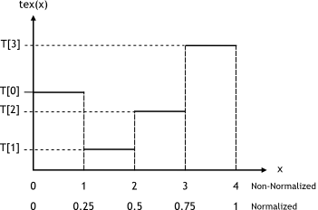

Nearest-Point Sampling Filtering Mode

For integer textures, the value returned by the texture fetch can be optionally remapped to [0.0, 1.0] (see [Texture Memory](index.md#texture-memory)).

## 15.2. Linear Filtering

In this filtering mode, which is only available for floating-point textures, the value returned by the texture fetch is

* *tex(x)=(1−α)T[i]+αT[i+1]* for a one-dimensional texture,
* *tex(x,y)=(1−α)(1−β)T[i,j]+α(1−β)T[i+1,j]+(1−α)βT[i,j+1]+αβT[i+1,j+1]* for a two-dimensional texture,
* *tex(x,y,z)* =

  *(1−α)(1−β)(1−γ)T[i,j,k]+α(1−β)(1−γ)T[i+1,j,k]+*

  *(1−α)β(1−γ)T[i,j+1,k]+αβ(1−γ)T[i+1,j+1,k]+*

  *(1−α)(1−β)γT[i,j,k+1]+α(1−β)γT[i+1,j,k+1]+*

  *(1−α)βγT[i,j+1,k+1]+αβγT[i+1,j+1,k+1]*

  for a three-dimensional texture,

where:

* *i=floor(xB)*, *α=frac(xB)*, *xB=x-0.5,*
* *j=floor(yB)*, *β=frac(yB)*, *yB=y-0.5*,
* *k=floor(zB)*, *γ=frac(zB)*, *zB= z-0.5*,

*α*, *β*, and *γ* are stored in 9-bit fixed point format with 8 bits of fractional value (so 1.0 is exactly represented).

[Figure 19](index.md#linear-filtering-linear-filtering-of-1-d-texture-of-4-texels) illustrates linear filtering of a one-dimensional texture with *N=4*.

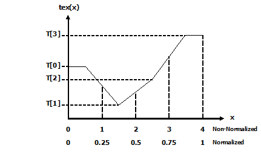

Linear Filtering Mode

## 15.3. Table Lookup

A table lookup *TL(x)* where *x* spans the interval *[0,R]* can be implemented as *TL(x)=tex((N-1)/R)x+0.5)* in order to ensure that *TL(0)=T[0]* and *TL(R)=T[N-1]*.

[Figure 20](index.md#table-lookup-1-d-table-lookup-using-linear-filtering) illustrates the use of texture filtering to implement a table lookup with *R=4* or *R=1* from a one-dimensional texture with *N=4*.

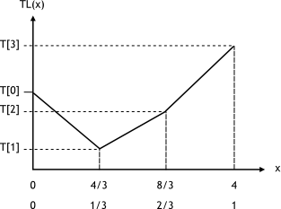

One-Dimensional Table Lookup Using Linear Filtering

# 16. Compute Capabilities

The general specifications and features of a compute device depend on its compute capability (see [Compute Capability](index.md#compute-capability)).

[Table 14](index.md#features-and-technical-specifications-feature-support-per-compute-capability) and [Table 15](index.md#features-and-technical-specifications-technical-specifications-per-compute-capability) show the features and technical specifications associated with each compute capability that is currently supported.

[Floating-Point Standard](index.md#floating-point-standard) reviews the compliance with the IEEE floating-point standard.

Sections [Compute Capability 5.x](index.md#compute-capability-5-x), [Compute Capability 6.x](index.md#compute-capability-6-x), [Compute Capability 7.x](index.md#compute-capability-7-x), [Compute Capability 8.x](index.md#compute-capability-8-x) and [Compute Capability 9.0](index.md#compute-capability-9-0) give more details on the architecture of devices of compute capabilities 5.x, 6.x, 7.x, 8.x and 9.0 respectively.

## 16.1. Feature Availability

A compute feature is introduced with a compute architecture with the intention that the feature will be available on all subsequent architectures. This is shown in Table 14 by the “yes” for availability of a feature on compute capabilities subsequent to its introduction.

Highly specialized compute features that are introduced with an architecture may not be guaranteed to be available on all subsequent compute capabilities. These features target acceleration of specialized operations which are not intended for all classes of compute capabilities (denoted by the compute capability’s minor number) or are likely to significantly change on future generations (denoted by the compute capability’s major number).

There are potentially two sets of compute features for a given compute capability:

**Compute Capability #.#**: The predominant set of compute features that are introduced with the intent to be available for subsequent compute architectures. These features and their availability are summarized in Table 14.

**Compute Capability #.#a**: A small and highly specialized set of features that are introduced to accelerate specialized operations, which are not guaranteed to be available or might change significantly on subsequent compute architecture. These features are summarized in the respective “Compute Capability #.#”” subsection.

Compilation of device code targets a particular compute capability. A feature which appears in device code must be available for the targeted compute capability. For example:

* The `compute_90` compilation target allows use of Compute Capability 9.0 features but does not allow use of Compute Capability 9.0a features.
* The `compute_90a` compilation target allows use of the complete set of compute device features, both 9.0a features and 9.0 features.

## 16.2. Features and Technical Specifications

Table 14. Feature Support per Compute Capability

| Feature Support | Compute Capability | | | | | |
| --- | --- | --- | --- | --- | --- | --- |
| (Unlisted features are supported for all compute capabilities) | 5.0, 5.2 | 5.3 | 6.x | 7.x | 8.x | 9.0 |
| Atomic functions operating on 32-bit integer values in global memory ([Atomic Functions](index.md#atomic-functions)) | Yes | | | | | |
| Atomic functions operating on 32-bit integer values in shared memory ([Atomic Functions](index.md#atomic-functions)) | Yes | | | | | |
| Atomic functions operating on 64-bit integer values in global memory ([Atomic Functions](index.md#atomic-functions)) | Yes | | | | | |
| Atomic functions operating on 64-bit integer values in shared memory ([Atomic Functions](index.md#atomic-functions)) | Yes | | | | | |
| Atomic addition operating on 32-bit floating point values in global and shared memory ([atomicAdd()](index.md#atomicadd)) | Yes | | | | | |
| Atomic addition operating on 64-bit floating point values in global memory and shared memory ([atomicAdd()](index.md#atomicadd)) | No | | Yes | | | |
| Atomic addition operating on float2 and float4 floating point vectors in global memory ([atomicAdd()](index.md#atomicadd)) | No | | | | | Yes |
| Warp vote functions ([Warp Vote Functions](index.md#warp-vote-functions)) | Yes | | | | | |
| Memory fence functions ([Memory Fence Functions](index.md#memory-fence-functions)) | Yes | | | | | |
| Synchronization functions ([Synchronization Functions](index.md#synchronization-functions)) | Yes | | | | | |
| Surface functions ([Surface Functions](index.md#surface-functions)) | Yes | | | | | |
| Unified Memory Programming ([Unified Memory Programming](index.md#um-unified-memory-programming-hd)) | Yes | | | | | |
| Dynamic Parallelism ([CUDA Dynamic Parallelism](index.md#cuda-dynamic-parallelism)) | Yes | | | | | |
| Half-precision floating-point operations: addition, subtraction, multiplication, comparison, warp shuffle functions, conversion | No | Yes | | | | |
| Bfloat16-precision floating-point operations: addition, subtraction, multiplication, comparison, warp shuffle functions, conversion | No | | | | Yes | |
| Tensor Cores | No | | | Yes | | |
| Mixed Precision Warp-Matrix Functions ([Warp matrix functions](index.md#wmma)) | No | | | Yes | | |
| Hardware-accelerated `memcpy_async` ([Asynchronous Data Copies using cuda::pipeline](index.md#memcpy-async-pipeline)) | No | | | | Yes | |
| Hardware-accelerated Split Arrive/Wait Barrier ([Asynchronous Barrier](index.md#aw-barrier)) | No | | | | Yes | |
| L2 Cache Residency Management ([Device Memory L2 Access Management](index.md#l2-access-intro)) | No | | | | Yes | |
| DPX Instructions for Accelerated Dynamic Programming | No | | | | | Yes |
| Distributed Shared Memory | No | | | | | Yes |
| Thread Block Cluster | No | | | | | Yes |
| Tensor Memory Accelerator (TMA) unit | No | | | | | Yes |

Note that the KB and K units used in the following table correspond to 1024 bytes (i.e., a KiB) and 1024 respectively.

Table 15. Technical Specifications per Compute Capability

|  | **Compute Capability** | | | | | | | | | | | | | |
| --- | --- | --- | --- | --- | --- | --- | --- | --- | --- | --- | --- | --- | --- | --- |
| Technical Specifications | 5.0 | 5.2 | 5.3 | 6.0 | 6.1 | 6.2 | 7.0 | 7.2 | 7.5 | 8.0 | 8.6 | 8.7 | 8.9 | 9.0 |
| Maximum number of resident grids per device (Concurrent Kernel Execution) | 32 | | 16 | 128 | 32 | 16 | 128 | 16 | 128 | | | | | |
| Maximum dimensionality of grid of thread blocks | 3 | | | | | | | | | | | | | |
| Maximum x -dimension of a grid of thread blocks | 231-1 | | | | | | | | | | | | | |
| Maximum y- or z-dimension of a grid of thread blocks | 65535 | | | | | | | | | | | | | |
| Maximum dimensionality of thread block | 3 | | | | | | | | | | | | | |
| Maximum x- or y-dimensionality of a block | 1024 | | | | | | | | | | | | | |
| Maximum z-dimension of a block | 64 | | | | | | | | | | | | | |
| Maximum number of threads per block | 1024 | | | | | | | | | | | | | |
| Warp size | 32 | | | | | | | | | | | | | |
| Maximum number of resident blocks per SM | 32 | | | | | | | | 16 | 32 | 16 | | 24 | 32 |
| Maximum number of resident warps per SM | 64 | | | | | | | | 32 | 64 | 48 | | | 64 |
| Maximum number of resident threads per SM | 2048 | | | | | | | | 1024 | 2048 | 1536 | | | 2048 |
| Number of 32-bit registers per SM | 64 K | | | | | | | | | | | | | |
| Maximum number of 32-bit registers per thread block | 64 K | | 32 K | 64 K | | 32 K | 64 K | | | | | | | |
| Maximum number of 32-bit registers per thread | 255 | | | | | | | | | | | | | |
| Maximum amount of shared memory per SM | 64 KB | 96 KB | 64 KB | | 96 KB | 64 KB | 96 KB | | 64 KB | 164 KB | 100 KB | 164 KB | 100 KB | 228 KB |
| Maximum amount of shared memory per thread block [32](#fn33) | 48 KB | | | | | | 96 KB | 96 KB | 64 KB | 163 KB | 99 KB | 163 KB | 99 KB | 227 KB |
| Number of shared memory banks | 32 | | | | | | | | | | | | | |
| Maximum amount of local memory per thread | 512 KB | | | | | | | | | | | | | |
| Constant memory size | 64 KB | | | | | | | | | | | | | |
| Cache working set per SM for constant memory | 8 KB | | | 4 KB | 8 KB | | | | | | | | | |
| Cache working set per SM for texture memory | Between 12 KB and 48 KB | | | Between 24 KB and 48 KB | | | 32 ~ 128 KB | | 32 or 64 KB | 28 KB ~ 192 KB | 28 KB ~ 128 KB | 28 KB ~ 192 KB | 28 KB ~ 128 KB | 28 KB ~ 256 KB |
| Maximum width for a 1D texture reference bound to a CUDA array | 65536 | | | 131072 | | | | | | | | | | |
| Maximum width for a 1D texture reference bound to linear memory | 227 | | | 228 | 227 | | 228 | 227 | 228 | | | | | |
| Maximum width and number of layers for a 1D layered texture reference | 16384 x 2048 | | | 32768 x 2048 | | | | | | | | | | |
| Maximum width and height for a 2D texture reference bound to a CUDA array | 65536 x 65536 | | | 131072 x 65536 | | | | | | | | | | |
| Maximum width and height for a 2D texture reference bound to linear memory | 65536 x 65536 | | | 131072 x 65000 | | | | | | | | | | |
| Maximum width and height for a 2D texture reference bound to a CUDA array supporting texture gather | 16384 x 16384 | | | 32768 x 32768 | | | | | | | | | | |
| Maximum width, height, and number of layers for a 2D layered texture reference | 16384 x 16384 x 2048 | | | 32768 x 32768 x 2048 | | | | | | | | | | |
| Maximum width, height, and depth for a 3D texture reference bound to a CUDA array | 4096 x 4096 x 4096 | | | 16384 x 16384 x 16384 | | | | | | | | | | |
| Maximum width (and height) for a cubemap texture reference | 16384 | | | 32768 | | | | | | | | | | |
| Maximum width (and height) and number of layers for a cubemap layered texture reference | 16384 x 2046 | | | 32768 x 2046 | | | | | | | | | | |
| Maximum number of textures that can be bound to a kernel | 256 | | | | | | | | | | | | | |
| Maximum width for a 1D surface reference bound to a CUDA array | 16384 | | | 32768 | | | | | | | | | | |
| Maximum width and number of layers for a 1D layered surface reference | 16384 x 2048 | | | 32768 x 2048 | | | | | | | | | | |
| Maximum width and height for a 2D surface reference bound to a CUDA array | 65536 x 65536 | | | 1 31072 x 65536 | | | | | | | | | | |
| Maximum width, height, and number of layers for a 2D layered surface reference | 16384 x 16384 x 2048 | | | 32768 x 32768 x 1048 | | | | | | | | | | |
| Maximum width, height, and depth for a 3D surface reference bound to a CUDA array | 4096 x 4096 x 4096 | | | 16384 x 16384 x 16384 | | | | | | | | | | |
| Maximum width (and height) for a cubemap surface reference bound to a CUDA array | 16384 | | | 32768 | | | | | | | | | | |
| Maximum width (and height) and number of layers for a cubemap layered surface reference | 16384 x 2046 | | | 32768 x 2046 | | | | | | | | | | |
| Maximum number of surfaces that can be bound to a kernel | 16 | | | | | | 32 | | | | | | | |

## 16.3. Floating-Point Standard

All compute devices follow the IEEE 754-2008 standard for binary floating-point arithmetic with the following deviations:

* There is no dynamically configurable rounding mode; however, most of the operations support multiple IEEE rounding modes, exposed via device intrinsics.
* There is no mechanism for detecting that a floating-point exception has occurred and all operations behave as if the IEEE-754 exceptions are always masked, and deliver the masked response as defined by IEEE-754 if there is an exceptional event. For the same reason, while SNaN encodings are supported, they are not signaling and are handled as quiet.
* The result of a single-precision floating-point operation involving one or more input NaNs is the quiet NaN of bit pattern 0x7fffffff.
* Double-precision floating-point absolute value and negation are not compliant with IEEE-754 with respect to NaNs; these are passed through unchanged.

Code must be compiled with `-ftz=false`, `-prec-div=true`, and `-prec-sqrt=true` to ensure IEEE compliance (this is the default setting; see the `nvcc` user manual for description of these compilation flags).

Regardless of the setting of the compiler flag `-ftz`,

* atomic single-precision floating-point adds on global memory always operate in flush-to-zero mode, i.e., behave equivalent to `FADD.F32.FTZ.RN`,
* atomic single-precision floating-point adds on shared memory always operate with denormal support, i.e., behave equivalent to `FADD.F32.RN`.

In accordance to the IEEE-754R standard, if one of the input parameters to `fminf()`, `fmin()`, `fmaxf()`, or `fmax()` is NaN, but not the other, the result is the non-NaN parameter.

The conversion of a floating-point value to an integer value in the case where the floating-point value falls outside the range of the integer format is left undefined by IEEE-754. For compute devices, the behavior is to clamp to the end of the supported range. This is unlike the x86 architecture behavior.

The behavior of integer division by zero and integer overflow is left undefined by IEEE-754. For compute devices, there is no mechanism for detecting that such integer operation exceptions have occurred. Integer division by zero yields an unspecified, machine-specific value.

<https://developer.nvidia.com/content/precision-performance-floating-point-and-ieee-754-compliance-nvidia-gpus> includes more information on the floating point accuracy and compliance of NVIDIA GPUs.

## 16.4. Compute Capability 5.x

### 16.4.1. Architecture

An SM consists of:

* 128 CUDA cores for arithmetic operations (see [Arithmetic Instructions](index.md#arithmetic-instructions) for throughputs of arithmetic operations),
* 32 special function units for single-precision floating-point transcendental functions,
* 4 warp schedulers.

When an SM is given warps to execute, it first distributes them among the four schedulers. Then, at every instruction issue time, each scheduler issues one instruction for one of its assigned warps that is ready to execute, if any.

An SM has:

* a read-only constant cache that is shared by all functional units and speeds up reads from the constant memory space, which resides in device memory,
* a unified L1/texture cache of 24 KB used to cache reads from global memory,
* 64 KB of shared memory for devices of compute capability 5.0 or 96 KB of shared memory for devices of compute capability 5.2.

The unified L1/texture cache is also used by the texture unit that implements the various addressing modes and data filtering mentioned in [Texture and Surface Memory](index.md#texture-and-surface-memory).

There is also an L2 cache shared by all SMs that is used to cache accesses to local or global memory, including temporary register spills. Applications may query the L2 cache size by checking the `l2CacheSize` device property (see [Device Enumeration](index.md#device-enumeration)).

The cache behavior (e.g., whether reads are cached in both the unified L1/texture cache and L2 or in L2 only) can be partially configured on a per-access basis using modifiers to the load instruction.

### 16.4.2. Global Memory

Global memory accesses are always cached in L2.

Data that is read-only for the entire lifetime of the kernel can also be cached in the unified L1/texture cache described in the previous section by reading it using the `__ldg()` function (see [Read-Only Data Cache Load Function](index.md#ldg-function)). When the compiler detects that the read-only condition is satisfied for some data, it will use `__ldg()` to read it. The compiler might not always be able to detect that the read-only condition is satisfied for some data. Marking pointers used for loading such data with both the `const` and `__restrict__` qualifiers increases the likelihood that the compiler will detect the read-only condition.

Data that is not read-only for the entire lifetime of the kernel cannot be cached in the unified L1/texture cache for devices of compute capability 5.0. For devices of compute capability 5.2, it is, by default, not cached in the unified L1/texture cache, but caching may be enabled using the following mechanisms:

* Perform the read using inline assembly with the appropriate modifier as described in the PTX reference manual;
* Compile with the `-Xptxas -dlcm=ca` compilation flag, in which case all reads are cached, except reads that are performed using inline assembly with a modifier that disables caching;
* Compile with the `-Xptxas -fscm=ca` compilation flag, in which case all reads are cached, including reads that are performed using inline assembly regardless of the modifier used.

When caching is enabled using one of the three mechanisms listed above, devices of compute capability 5.2 will cache global memory reads in the unified L1/texture cache for all kernel launches except for the kernel launches for which thread blocks consume too much of the SM’s register file. These exceptions are reported by the profiler.

### 16.4.3. Shared Memory

Shared memory has 32 banks that are organized such that successive 32-bit words map to successive banks. Each bank has a bandwidth of 32 bits per clock cycle.

A shared memory request for a warp does not generate a bank conflict between two threads that access any address within the same 32-bit word (even though the two addresses fall in the same bank). In that case, for read accesses, the word is broadcast to the requesting threads and for write accesses, each address is written by only one of the threads (which thread performs the write is undefined).

[Figure 22](index.md#shared-memory-5-x-examples-of-strided-shared-memory-accesses) shows some examples of strided access.

[Figure 23](index.md#shared-memory-5-x-examples-of-irregular-shared-memory-accesses) shows some examples of memory read accesses that involve the broadcast mechanism.


Strided Shared Memory Accesses in 32 bit bank size mode.

Left
:   Linear addressing with a stride of one 32-bit word (no bank conflict).

Middle
:   Linear addressing with a stride of two 32-bit words (two-way bank conflict).

Right
:   Linear addressing with a stride of three 32-bit words (no bank conflict).


Irregular Shared Memory Accesses.

Left
:   Conflict-free access via random permutation.

Middle
:   Conflict-free access since threads 3, 4, 6, 7, and 9 access the same word within bank 5.

Right
:   Conflict-free broadcast access (threads access the same word within a bank).

## 16.5. Compute Capability 6.x

### 16.5.1. Architecture

An SM consists of:

* 64 (compute capability 6.0) or 128 (6.1 and 6.2) CUDA cores for arithmetic operations,
* 16 (6.0) or 32 (6.1 and 6.2) special function units for single-precision floating-point transcendental functions,
* 2 (6.0) or 4 (6.1 and 6.2) warp schedulers.

When an SM is given warps to execute, it first distributes them among its schedulers. Then, at every instruction issue time, each scheduler issues one instruction for one of its assigned warps that is ready to execute, if any.

An SM has:

* a read-only constant cache that is shared by all functional units and speeds up reads from the constant memory space, which resides in device memory,
* a unified L1/texture cache for reads from global memory of size 24 KB (6.0 and 6.2) or 48 KB (6.1),
* a shared memory of size 64 KB (6.0 and 6.2) or 96 KB (6.1).

The unified L1/texture cache is also used by the texture unit that implements the various addressing modes and data filtering mentioned in [Texture and Surface Memory](index.md#texture-and-surface-memory).

There is also an L2 cache shared by all SMs that is used to cache accesses to local or global memory, including temporary register spills. Applications may query the L2 cache size by checking the `l2CacheSize` device property (see [Device Enumeration](index.md#device-enumeration)).

The cache behavior (e.g., whether reads are cached in both the unified L1/texture cache and L2 or in L2 only) can be partially configured on a per-access basis using modifiers to the load instruction.

### 16.5.2. Global Memory

Global memory behaves the same way as in devices of compute capability 5.x (See [Global Memory](index.md#global-memory-5-x)).

### 16.5.3. Shared Memory

Shared memory behaves the same way as in devices of compute capability 5.x (See [Shared Memory](index.md#shared-memory-5-x)).

## 16.6. Compute Capability 7.x

### 16.6.1. Architecture

An SM consists of:

* 64 FP32 cores for single-precision arithmetic operations,
* 32 FP64 cores for double-precision arithmetic operations,[34](#fn35)
* 64 INT32 cores for integer math,
* 8 mixed-precision Tensor Cores for deep learning matrix arithmetic
* 16 special function units for single-precision floating-point transcendental functions,
* 4 warp schedulers.

An SM statically distributes its warps among its schedulers. Then, at every instruction issue time, each scheduler issues one instruction for one of its assigned warps that is ready to execute, if any.

An SM has:

* a read-only constant cache that is shared by all functional units and speeds up reads from the constant memory space, which resides in device memory,
* a unified data cache and shared memory with a total size of 128 KB (*Volta*) or 96 KB (*Turing*).

Shared memory is partitioned out of unified data cache, and can be configured to various sizes (See [Shared Memory](index.md#shared-memory-7-x).) The remaining data cache serves as an L1 cache and is also used by the texture unit that implements the various addressing and data filtering modes mentioned in [Texture and Surface Memory](index.md#texture-and-surface-memory).

### 16.6.2. Independent Thread Scheduling

The *Volta* architecture introduces *Independent Thread Scheduling* among threads in a warp, enabling intra-warp synchronization patterns previously unavailable and simplifying code changes when porting CPU code. However, this can lead to a rather different set of threads participating in the executed code than intended if the developer made assumptions about warp-synchronicity of previous hardware architectures.

Below are code patterns of concern and suggested corrective actions for Volta-safe code.

1. For applications using warp intrinsics (`__shfl*`, `__any`, `__all`, `__ballot`), it is necessary that developers port their code to the new, safe, synchronizing counterpart, with the `*_sync` suffix. The new warp intrinsics take in a mask of threads that explicitly define which lanes (threads of a warp) must participate in the warp intrinsic. See [Warp Vote Functions](index.md#warp-vote-functions) and [Warp Shuffle Functions](index.md#warp-shuffle-functions) for details.

Since the intrinsics are available with CUDA 9.0+, (if necessary) code can be executed conditionally with the following preprocessor macro:

```
#if defined(CUDART_VERSION) && CUDART_VERSION >= 9000
// *_sync intrinsic
#endif
```

These intrinsics are available on all architectures, not just *Volta* or *Turing*, and in most cases a single code-base will suffice for all architectures. Note, however, that for *Pascal* and earlier architectures, all threads in mask must execute the same warp intrinsic instruction in convergence, and the union of all values in mask must be equal to the warp’s active mask. The following code pattern is valid on *Volta*, but not on *Pascal* or earlier architectures.

> ```
> if (tid % warpSize < 16) {
>     ...
>     float swapped = __shfl_xor_sync(0xffffffff, val, 16);
>     ...
> } else {
>     ...
>     float swapped = __shfl_xor_sync(0xffffffff, val, 16);
>     ...
> }
> ```

The replacement for `__ballot(1)` is `__activemask()`. Note that threads within a warp can diverge even within a single code path. As a result, `__activemask()` and `__ballot(1)` may return only a subset of the threads on the current code path. The following invalid code example sets bit `i` of `output` to 1 when `data[i]` is greater than `threshold`. `__activemask()` is used in an attempt to enable cases where `dataLen` is not a multiple of 32.

> ```
> // Sets bit in output[] to 1 if the correspond element in data[i]
> // is greater than 'threshold', using 32 threads in a warp.
>
> for (int i = warpLane; i < dataLen; i += warpSize) {
>     unsigned active = __activemask();
>     unsigned bitPack = __ballot_sync(active, data[i] > threshold);
>     if (warpLane == 0) {
>         output[i / 32] = bitPack;
>     }
> }
> ```

This code is invalid because CUDA does not guarantee that the warp will diverge ONLY at the loop condition. When divergence happens for other reasons, conflicting results will be computed for the same 32-bit output element by different subsets of threads in the warp. A correct code might use a non-divergent loop condition together with `__ballot_sync()` to safely enumerate the set of threads in the warp participating in the threshold calculation as follows.

> ```
> for (int i = warpLane; i - warpLane < dataLen; i += warpSize) {
>     unsigned active = __ballot_sync(0xFFFFFFFF, i < dataLen);
>     if (i < dataLen) {
>         unsigned bitPack = __ballot_sync(active, data[i] > threshold);
>         if (warpLane == 0) {
>             output[i / 32] = bitPack;
>         }
>     }
> }
> ```

[Discovery Pattern](index.md#discovery-pattern-cg) demonstrates a valid use case for `__activemask()`.

1. If applications have warp-synchronous codes, they will need to insert the new `__syncwarp()` warp-wide barrier synchronization instruction between any steps where data is exchanged between threads via global or shared memory. Assumptions that code is executed in lockstep or that reads/writes from separate threads are visible across a warp without synchronization are invalid.

   ```
   __shared__ float s_buff[BLOCK_SIZE];
   s_buff[tid] = val;
   __syncthreads();

   // Inter-warp reduction
   for (int i = BLOCK_SIZE / 2; i >= 32; i /= 2) {
       if (tid < i) {
           s_buff[tid] += s_buff[tid+i];
       }
       __syncthreads();
   }

   // Intra-warp reduction
   // Butterfly reduction simplifies syncwarp mask
   if (tid < 32) {
       float temp;
       temp = s_buff[tid ^ 16]; __syncwarp();
       s_buff[tid] += temp;     __syncwarp();
       temp = s_buff[tid ^ 8];  __syncwarp();
       s_buff[tid] += temp;     __syncwarp();
       temp = s_buff[tid ^ 4];  __syncwarp();
       s_buff[tid] += temp;     __syncwarp();
       temp = s_buff[tid ^ 2];  __syncwarp();
       s_buff[tid] += temp;     __syncwarp();
   }

   if (tid == 0) {
       *output = s_buff[0] + s_buff[1];
   }
   __syncthreads();
   ```
2. Although `__syncthreads()` has been consistently documented as synchronizing all threads in the thread block, *Pascal* and prior architectures could only enforce synchronization at the warp level. In certain cases, this allowed a barrier to succeed without being executed by every thread as long as at least some thread in every warp reached the barrier. Starting with *Volta*, the CUDA built-in `__syncthreads()` and PTX instruction `bar.sync` (and their derivatives) are enforced per thread and thus will not succeed until reached by all non-exited threads in the block. Code exploiting the previous behavior will likely deadlock and must be modified to ensure that all non-exited threads reach the barrier.

The `racecheck` and `synccheck` tools provided by `compute-saniter` can help with locating violations.

To aid migration while implementing the above-mentioned corrective actions, developers can opt-in to the Pascal scheduling model that does not support independent thread scheduling. See [Application Compatibility](index.md#application-compatibility) for details.

### 16.6.3. Global Memory

Global memory behaves the same way as in devices of compute capability 5.x (See [Global Memory](index.md#global-memory-5-x)).

### 16.6.4. Shared Memory

The amount of the unified data cache reserved for shared memory is configurable on a per kernel basis. For the *Volta* architecture (compute capability 7.0), the unified data cache has a size of 128 KB, and the shared memory capacity can be set to 0, 8, 16, 32, 64 or 96 KB. For the *Turing* architecture (compute capability 7.5), the unified data cache has a size of 96 KB, and the shared memory capacity can be set to either 32 KB or 64 KB. Unlike Kepler, the driver automatically configures the shared memory capacity for each kernel to avoid shared memory occupancy bottlenecks while also allowing concurrent execution with already launched kernels where possible. In most cases, the driver’s default behavior should provide optimal performance.

Because the driver is not always aware of the full workload, it is sometimes useful for applications to provide additional hints regarding the desired shared memory configuration. For example, a kernel with little or no shared memory use may request a larger carveout in order to encourage concurrent execution with later kernels that require more shared memory. The new `cudaFuncSetAttribute()` API allows applications to set a preferred shared memory capacity, or `carveout`, as a percentage of the maximum supported shared memory capacity (96 KB for *Volta*, and 64 KB for *Turing*).

`cudaFuncSetAttribute()` relaxes enforcement of the preferred shared capacity compared to the legacy `cudaFuncSetCacheConfig()` API introduced with Kepler. The legacy API treated shared memory capacities as hard requirements for kernel launch. As a result, interleaving kernels with different shared memory configurations would needlessly serialize launches behind shared memory reconfigurations. With the new API, the carveout is treated as a hint. The driver may choose a different configuration if required to execute the function or to avoid thrashing.

```
// Device code
__global__ void MyKernel(...)
{
    __shared__ float buffer[BLOCK_DIM];
    ...
}

// Host code
int carveout = 50; // prefer shared memory capacity 50% of maximum
// Named Carveout Values:
// carveout = cudaSharedmemCarveoutDefault;   //  (-1)
// carveout = cudaSharedmemCarveoutMaxL1;     //   (0)
// carveout = cudaSharedmemCarveoutMaxShared; // (100)
cudaFuncSetAttribute(MyKernel, cudaFuncAttributePreferredSharedMemoryCarveout, carveout);
MyKernel <<<gridDim, BLOCK_DIM>>>(...);
```

In addition to an integer percentage, several convenience enums are provided as listed in the code comments above. Where a chosen integer percentage does not map exactly to a supported capacity (SM 7.0 devices support shared capacities of 0, 8, 16, 32, 64, or 96 KB), the next larger capacity is used. For instance, in the example above, 50% of the 96 KB maximum is 48 KB, which is not a supported shared memory capacity. Thus, the preference is rounded up to 64 KB.

Compute capability 7.x devices allow a single thread block to address the full capacity of shared memory: 96 KB on *Volta*, 64 KB on *Turing*. Kernels relying on shared memory allocations over 48 KB per block are architecture-specific, as such they must use dynamic shared memory (rather than statically sized arrays) and require an explicit opt-in using `cudaFuncSetAttribute()` as follows.

```
// Device code
__global__ void MyKernel(...)
{
    extern __shared__ float buffer[];
    ...
}

// Host code
int maxbytes = 98304; // 96 KB
cudaFuncSetAttribute(MyKernel, cudaFuncAttributeMaxDynamicSharedMemorySize, maxbytes);
MyKernel <<<gridDim, blockDim, maxbytes>>>(...);
```

Otherwise, shared memory behaves the same way as for devices of compute capability 5.x (See [Shared Memory](index.md#shared-memory-5-x)).

## 16.7. Compute Capability 8.x

### 16.7.1. Architecture

A Streaming Multiprocessor (SM) consists of:

* 64 FP32 cores for single-precision arithmetic operations in devices of compute capability 8.0 and 128 FP32 cores in devices of compute capability 8.6, 8.7 and 8.9,
* 32 FP64 cores for double-precision arithmetic operations in devices of compute capability 8.0 and 2 FP64 cores in devices of compute capability 8.6, 8.7 and 8.9
* 64 INT32 cores for integer math,
* 4 mixed-precision Third-Generation Tensor Cores supporting half-precision (fp16), `__nv_bfloat16`, `tf32`, sub-byte and double precision (fp64) matrix arithmetic for compute capabilities 8.0, 8.6 and 8.7 (see [Warp matrix functions](index.md#wmma) for details),
* 4 mixed-precision Fourth-Generation Tensor Cores supporting `fp8`, `fp16`, `__nv_bfloat16`, `tf32`, sub-byte and `fp64` for compute capability 8.9 (see [Warp matrix functions](index.md#wmma) for details),
* 16 special function units for single-precision floating-point transcendental functions,
* 4 warp schedulers.

An SM statically distributes its warps among its schedulers. Then, at every instruction issue time, each scheduler issues one instruction for one of its assigned warps that is ready to execute, if any.

An SM has:

* a read-only constant cache that is shared by all functional units and speeds up reads from the constant memory space, which resides in device memory,
* a unified data cache and shared memory with a total size of 192 KB for devices of compute capability 8.0 and 8.7 (1.5x *Volta*’s 128 KB capacity) and 128 KB for devices of compute capabilities 8.6 and 8.9.

Shared memory is partitioned out of the unified data cache, and can be configured to various sizes (see [Shared Memory](index.md#shared-memory-8-x) section). The remaining data cache serves as an L1 cache and is also used by the texture unit that implements the various addressing and data filtering modes mentioned in [Texture and Surface Memory](index.md#texture-and-surface-memory).

### 16.7.2. Global Memory

Global memory behaves the same way as for devices of compute capability 5.x (See [Global Memory](index.md#global-memory-5-x)).

### 16.7.3. Shared Memory

Similar to the [Volta architecture](index.md#architecture-7-x), the amount of the unified data cache reserved for shared memory is configurable on a per kernel basis. For the *NVIDIA Ampere GPU architecture*, the unified data cache has a size of 192 KB for devices of compute capability 8.0 and 8.7 and 128 KB for devices of compute capabilities 8.6 and 8.9. The shared memory capacity can be set to 0, 8, 16, 32, 64, 100, 132 or 164 KB for devices of compute capability 8.0 and 8.7, and to 0, 8, 16, 32, 64 or 100 KB for devices of compute capabilities 8.6 and 8.9.

An application can set the `carveout`, i.e., the preferred shared memory capacity, with the `cudaFuncSetAttribute()`.

```
cudaFuncSetAttribute(kernel_name, cudaFuncAttributePreferredSharedMemoryCarveout, carveout);
```

The API can specify the carveout either as an integer percentage of the maximum supported shared memory capacity of 164 KB for devices of compute capability 8.0 and 8.7 and 100 KB for devices of compute capabilities 8.6 and 8.9 respectively, or as one of the following values: `{cudaSharedmemCarveoutDefault`, `cudaSharedmemCarveoutMaxL1`, or `cudaSharedmemCarveoutMaxShared`. When using a percentage, the carveout is rounded up to the nearest supported shared memory capacity. For example, for devices of compute capability 8.0, 50% will map to a 100 KB carveout instead of an 82 KB one. Setting the `cudaFuncAttributePreferredSharedMemoryCarveout` is considered a hint by the driver; the driver may choose a different configuration, if needed.

Devices of compute capability 8.0 and 8.7 allow a single thread block to address up to 163 KB of shared memory, while devices of compute capabilities 8.6 and 8.9 allow up to 99 KB of shared memory. Kernels relying on shared memory allocations over 48 KB per block are architecture-specific, and must use dynamic shared memory rather than statically sized shared memory arrays. These kernels require an explicit opt-in by using `cudaFuncSetAttribute()` to set the `cudaFuncAttributeMaxDynamicSharedMemorySize`; see [Shared Memory](index.md#shared-memory-7-x) for the Volta architecture.

Note that the maximum amount of shared memory per thread block is smaller than the maximum shared memory partition available per SM. The 1 KB of shared memory not made available to a thread block is reserved for system use.

## 16.8. Compute Capability 9.0

### 16.8.1. Architecture

A Streaming Multiprocessor (SM) consists of:

* 128 FP32 cores for single-precision arithmetic operations,
* 64 FP64 cores for double-precision arithmetic operations,
* 64 INT32 cores for integer math,
* 4 mixed-precision fourth-generation Tensor Cores supporting the new `FP8` input type in either `E4M3` or `E5M2` for exponent (E) and mantissa (M), half-precision (fp16), `__nv_bfloat16`, `tf32`, INT8 and double precision (fp64) matrix arithmetic (see [Warp Matrix Functions](index.md#wmma) for details) with sparsity support,
* 16 special function units for single-precision floating-point transcendental functions,
* 4 warp schedulers.

An SM statically distributes its warps among its schedulers. Then, at every instruction issue time, each scheduler issues one instruction for one of its assigned warps that is ready to execute, if any.

An SM has:

* a read-only constant cache that is shared by all functional units and speeds up reads from the constant memory space, which resides in device memory,
* a unified data cache and shared memory with a total size of 256 KB for devices of compute capability 9.0 (1.33x *NVIDIA Ampere GPU Architecture*’s 192 KB capacity).

Shared memory is partitioned out of the unified data cache, and can be configured to various sizes (see [Shared Memory](index.md#shared-memory-9-0) section). The remaining data cache serves as an L1 cache and is also used by the texture unit that implements the various addressing and data filtering modes mentioned in [Texture and Surface Memory](index.md#texture-and-surface-memory).

### 16.8.2. Global Memory

Global memory behaves the same way as for devices of compute capability 5.x (See [Global Memory](index.md#global-memory-5-x)).

### 16.8.3. Shared Memory

Similar to the [NVIDIA Ampere GPU architecture](index.md#architecture-8-x), the amount of the unified data cache reserved for shared memory is configurable on a per kernel basis. For the *NVIDIA H100 Tensor Core GPU architecture*, the unified data cache has a size of 256 KB for devices of compute capability 9.0. The shared memory capacity can be set to 0, 8, 16, 32, 64, 100, 132, 164, 196 or 228 KB.

As with the [NVIDIA Ampere GPU architecture](index.md#shared-memory-8-x), an application can configure its preferred shared memory capacity, i.e., the `carveout`. Devices of compute capability 9.0 allow a single thread block to address up to 227 KB of shared memory. Kernels relying on shared memory allocations over 48 KB per block are architecture-specific, and must use dynamic shared memory rather than statically sized shared memory arrays. These kernels require an explicit opt-in by using `cudaFuncSetAttribute()` to set the `cudaFuncAttributeMaxDynamicSharedMemorySize`; see [Shared Memory](index.md#shared-memory-7-x) for the Volta architecture.

Note that the maximum amount of shared memory per thread block is smaller than the maximum shared memory partition available per SM. The 1 KB of shared memory not made available to a thread block is reserved for system use.

[32](#id87)
:   above 48 KB requires dynamic shared memory

33
:   2 FP64 cores for double-precision arithmetic operations for devices of compute capabilities 7.5

[34](#id94)
:   2 FP64 cores for double-precision arithmetic operations for devices of compute capabilities 7.5

### 16.8.4. Features Accelerating Specialized Computations

The NVIDIA Hopper GPU architecture includes features to accelerate matrix multiply-accumulate (MMA) computations with:

* asynchronous execution of MMA instructions
* MMA instructions acting on large matrices spanning a warp-group
* dynamic reassignment of register capacity among warp-groups to support even larger matrices, and
* operand matrices accessed directly from shared memory

This feature set is only available within the CUDA compilation toolchain through inline PTX.

It is strongly recommended that applications utilize this complex feature set through CUDA-X libraries such as cuBLAS, cuDNN, or cuFFT.

It is strongly recommended that device kernels utilize this complex feature set through [CUTLASS](https://github.com/NVIDIA/cutlass), a collection of CUDA C++ template abstractions for implementing high-performance matrix-multiplication (GEMM) and related computations at all levels and scales within CUDA.

# 17. Driver API

This section assumes knowledge of the concepts described in [CUDA Runtime](index.md#cuda-c-runtime).

The driver API is implemented in the `cuda` dynamic library (`cuda.dll` or `cuda.so`) which is copied on the system during the installation of the device driver. All its entry points are prefixed with cu.

It is a handle-based, imperative API: Most objects are referenced by opaque handles that may be specified to functions to manipulate the objects.

The objects available in the driver API are summarized in [Table 16](index.md#driver-api-objects-available-in-cuda-driver-api).

Table 16. Objects Available in the CUDA Driver API

| Object | Handle | Description |
| --- | --- | --- |
| Device | CUdevice | CUDA-enabled device |
| Context | CUcontext | Roughly equivalent to a CPU process |
| Module | CUmodule | Roughly equivalent to a dynamic library |
| Function | CUfunction | Kernel |
| Heap memory | CUdeviceptr | Pointer to device memory |
| CUDA array | CUarray | Opaque container for one-dimensional or two-dimensional data on the device, readable via texture or surface references |
| Texture reference | CUtexref | Object that describes how to interpret texture memory data |
| Surface reference | CUsurfref | Object that describes how to read or write CUDA arrays |
| Stream | CUstream | Object that describes a CUDA stream |
| Event | CUevent | Object that describes a CUDA event |

The driver API must be initialized with `cuInit()` before any function from the driver API is called. A CUDA context must then be created that is attached to a specific device and made current to the calling host thread as detailed in [Context](index.md#context).

Within a CUDA context, kernels are explicitly loaded as PTX or binary objects by the host code as described in [Module](index.md#module). Kernels written in C++ must therefore be compiled separately into *PTX* or binary objects. Kernels are launched using API entry points as described in [Kernel Execution](index.md#kernel-execution).

Any application that wants to run on future device architectures must load *PTX*, not binary code. This is because binary code is architecture-specific and therefore incompatible with future architectures, whereas *PTX* code is compiled to binary code at load time by the device driver.

Here is the host code of the sample from [Kernels](index.md#kernels) written using the driver API:

```
int main()
{
    int N = ...;
    size_t size = N * sizeof(float);

    // Allocate input vectors h_A and h_B in host memory
    float* h_A = (float*)malloc(size);
    float* h_B = (float*)malloc(size);

    // Initialize input vectors
    ...

    // Initialize
    cuInit(0);

    // Get number of devices supporting CUDA
    int deviceCount = 0;
    cuDeviceGetCount(&deviceCount);
    if (deviceCount == 0) {
        printf("There is no device supporting CUDA.\n");
        exit (0);
    }

    // Get handle for device 0
    CUdevice cuDevice;
    cuDeviceGet(&cuDevice, 0);

    // Create context
    CUcontext cuContext;
    cuCtxCreate(&cuContext, 0, cuDevice);

    // Create module from binary file
    CUmodule cuModule;
    cuModuleLoad(&cuModule, "VecAdd.ptx");

    // Allocate vectors in device memory
    CUdeviceptr d_A;
    cuMemAlloc(&d_A, size);
    CUdeviceptr d_B;
    cuMemAlloc(&d_B, size);
    CUdeviceptr d_C;
    cuMemAlloc(&d_C, size);

    // Copy vectors from host memory to device memory
    cuMemcpyHtoD(d_A, h_A, size);
    cuMemcpyHtoD(d_B, h_B, size);

    // Get function handle from module
    CUfunction vecAdd;
    cuModuleGetFunction(&vecAdd, cuModule, "VecAdd");

    // Invoke kernel
    int threadsPerBlock = 256;
    int blocksPerGrid =
            (N + threadsPerBlock - 1) / threadsPerBlock;
    void* args[] = { &d_A, &d_B, &d_C, &N };
    cuLaunchKernel(vecAdd,
                   blocksPerGrid, 1, 1, threadsPerBlock, 1, 1,
                   0, 0, args, 0);

    ...
}
```

Full code can be found in the `vectorAddDrv` CUDA sample.

## 17.1. Context

A CUDA context is analogous to a CPU process. All resources and actions performed within the driver API are encapsulated inside a CUDA context, and the system automatically cleans up these resources when the context is destroyed. Besides objects such as modules and texture or surface references, each context has its own distinct address space. As a result, `CUdeviceptr` values from different contexts reference different memory locations.

A host thread may have only one device context current at a time. When a context is created with `cuCtxCreate(`), it is made current to the calling host thread. CUDA functions that operate in a context (most functions that do not involve device enumeration or context management) will return `CUDA_ERROR_INVALID_CONTEXT` if a valid context is not current to the thread.

Each host thread has a stack of current contexts. `cuCtxCreate()` pushes the new context onto the top of the stack. `cuCtxPopCurrent()` may be called to detach the context from the host thread. The context is then “floating” and may be pushed as the current context for any host thread. `cuCtxPopCurrent()` also restores the previous current context, if any.

A usage count is also maintained for each context. `cuCtxCreate()` creates a context with a usage count of 1. `cuCtxAttach()` increments the usage count and `cuCtxDetach()` decrements it. A context is destroyed when the usage count goes to 0 when calling `cuCtxDetach()` or `cuCtxDestroy()`.

The driver API is interoperable with the runtime and it is possible to access the *primary context* (see [Initialization](index.md#initialization)) managed by the runtime from the driver API via `cuDevicePrimaryCtxRetain()`.

Usage count facilitates interoperability between third party authored code operating in the same context. For example, if three libraries are loaded to use the same context, each library would call `cuCtxAttach()` to increment the usage count and `cuCtxDetach()` to decrement the usage count when the library is done using the context. For most libraries, it is expected that the application will have created a context before loading or initializing the library; that way, the application can create the context using its own heuristics, and the library simply operates on the context handed to it. Libraries that wish to create their own contexts - unbeknownst to their API clients who may or may not have created contexts of their own - would use `cuCtxPushCurrent()` and `cuCtxPopCurrent()` as illustrated in the following figure.


Library Context Management

## 17.2. Module

Modules are dynamically loadable packages of device code and data, akin to DLLs in Windows, that are output by nvcc (see [Compilation with NVCC](index.md#compilation-with-nvcc)). The names for all symbols, including functions, global variables, and texture or surface references, are maintained at module scope so that modules written by independent third parties may interoperate in the same CUDA context.

This code sample loads a module and retrieves a handle to some kernel:

```
CUmodule cuModule;
cuModuleLoad(&cuModule, "myModule.ptx");
CUfunction myKernel;
cuModuleGetFunction(&myKernel, cuModule, "MyKernel");
```

This code sample compiles and loads a new module from PTX code and parses compilation errors:

```
#define BUFFER_SIZE 8192
CUmodule cuModule;
CUjit_option options[3];
void* values[3];
char* PTXCode = "some PTX code";
char error_log[BUFFER_SIZE];
int err;
options[0] = CU_JIT_ERROR_LOG_BUFFER;
values[0]  = (void*)error_log;
options[1] = CU_JIT_ERROR_LOG_BUFFER_SIZE_BYTES;
values[1]  = (void*)BUFFER_SIZE;
options[2] = CU_JIT_TARGET_FROM_CUCONTEXT;
values[2]  = 0;
err = cuModuleLoadDataEx(&cuModule, PTXCode, 3, options, values);
if (err != CUDA_SUCCESS)
    printf("Link error:\n%s\n", error_log);
```

This code sample compiles, links, and loads a new module from multiple PTX codes and parses link and compilation errors:

```
#define BUFFER_SIZE 8192
CUmodule cuModule;
CUjit_option options[6];
void* values[6];
float walltime;
char error_log[BUFFER_SIZE], info_log[BUFFER_SIZE];
char* PTXCode0 = "some PTX code";
char* PTXCode1 = "some other PTX code";
CUlinkState linkState;
int err;
void* cubin;
size_t cubinSize;
options[0] = CU_JIT_WALL_TIME;
values[0] = (void*)&walltime;
options[1] = CU_JIT_INFO_LOG_BUFFER;
values[1] = (void*)info_log;
options[2] = CU_JIT_INFO_LOG_BUFFER_SIZE_BYTES;
values[2] = (void*)BUFFER_SIZE;
options[3] = CU_JIT_ERROR_LOG_BUFFER;
values[3] = (void*)error_log;
options[4] = CU_JIT_ERROR_LOG_BUFFER_SIZE_BYTES;
values[4] = (void*)BUFFER_SIZE;
options[5] = CU_JIT_LOG_VERBOSE;
values[5] = (void*)1;
cuLinkCreate(6, options, values, &linkState);
err = cuLinkAddData(linkState, CU_JIT_INPUT_PTX,
                    (void*)PTXCode0, strlen(PTXCode0) + 1, 0, 0, 0, 0);
if (err != CUDA_SUCCESS)
    printf("Link error:\n%s\n", error_log);
err = cuLinkAddData(linkState, CU_JIT_INPUT_PTX,
                    (void*)PTXCode1, strlen(PTXCode1) + 1, 0, 0, 0, 0);
if (err != CUDA_SUCCESS)
    printf("Link error:\n%s\n", error_log);
cuLinkComplete(linkState, &cubin, &cubinSize);
printf("Link completed in %fms. Linker Output:\n%s\n", walltime, info_log);
cuModuleLoadData(cuModule, cubin);
cuLinkDestroy(linkState);
```

Full code can be found in the `ptxjit` CUDA sample.

## 17.3. Kernel Execution

`cuLaunchKernel()` launches a kernel with a given execution configuration.

Parameters are passed either as an array of pointers (next to last parameter of `cuLaunchKernel()`) where the nth pointer corresponds to the nth parameter and points to a region of memory from which the parameter is copied, or as one of the extra options (last parameter of `cuLaunchKernel()`).

When parameters are passed as an extra option (the `CU_LAUNCH_PARAM_BUFFER_POINTER` option), they are passed as a pointer to a single buffer where parameters are assumed to be properly offset with respect to each other by matching the alignment requirement for each parameter type in device code.

Alignment requirements in device code for the built-in vector types are listed in [Table 4](index.md#vector-types-alignment-requirements-in-device-code). For all other basic types, the alignment requirement in device code matches the alignment requirement in host code and can therefore be obtained using `__alignof()`. The only exception is when the host compiler aligns `double` and `long long` (and `long` on a 64-bit system) on a one-word boundary instead of a two-word boundary (for example, using `gcc`’s compilation flag `-mno-align-double`) since in device code these types are always aligned on a two-word boundary.

`CUdeviceptr` is an integer, but represents a pointer, so its alignment requirement is `__alignof(void*)`.

The following code sample uses a macro (`ALIGN_UP()`) to adjust the offset of each parameter to meet its alignment requirement and another macro (`ADD_TO_PARAM_BUFFER()`) to add each parameter to the parameter buffer passed to the `CU_LAUNCH_PARAM_BUFFER_POINTER` option.

```
#define ALIGN_UP(offset, alignment) \
      (offset) = ((offset) + (alignment) - 1) & ~((alignment) - 1)

char paramBuffer[1024];
size_t paramBufferSize = 0;

#define ADD_TO_PARAM_BUFFER(value, alignment)                   \
    do {                                                        \
        paramBufferSize = ALIGN_UP(paramBufferSize, alignment); \
        memcpy(paramBuffer + paramBufferSize,                   \
               &(value), sizeof(value));                        \
        paramBufferSize += sizeof(value);                       \
    } while (0)

int i;
ADD_TO_PARAM_BUFFER(i, __alignof(i));
float4 f4;
ADD_TO_PARAM_BUFFER(f4, 16); // float4's alignment is 16
char c;
ADD_TO_PARAM_BUFFER(c, __alignof(c));
float f;
ADD_TO_PARAM_BUFFER(f, __alignof(f));
CUdeviceptr devPtr;
ADD_TO_PARAM_BUFFER(devPtr, __alignof(devPtr));
float2 f2;
ADD_TO_PARAM_BUFFER(f2, 8); // float2's alignment is 8

void* extra[] = {
    CU_LAUNCH_PARAM_BUFFER_POINTER, paramBuffer,
    CU_LAUNCH_PARAM_BUFFER_SIZE,    &paramBufferSize,
    CU_LAUNCH_PARAM_END
};
cuLaunchKernel(cuFunction,
               blockWidth, blockHeight, blockDepth,
               gridWidth, gridHeight, gridDepth,
               0, 0, 0, extra);
```

The alignment requirement of a structure is equal to the maximum of the alignment requirements of its fields. The alignment requirement of a structure that contains built-in vector types, `CUdeviceptr`, or non-aligned `double` and `long long`, might therefore differ between device code and host code. Such a structure might also be padded differently. The following structure, for example, is not padded at all in host code, but it is padded in device code with 12 bytes after field `f` since the alignment requirement for field `f4` is 16.

```
typedef struct {
    float  f;
    float4 f4;
} myStruct;
```

## 17.4. Interoperability between Runtime and Driver APIs

An application can mix runtime API code with driver API code.

If a context is created and made current via the driver API, subsequent runtime calls will pick up this context instead of creating a new one.

If the runtime is initialized (implicitly as mentioned in [CUDA Runtime](index.md#cuda-c-runtime)), `cuCtxGetCurrent()` can be used to retrieve the context created during initialization. This context can be used by subsequent driver API calls.

The implicitly created context from the runtime is called the *primary context* (see [Initialization](index.md#initialization)). It can be managed from the driver API with the [Primary Context Management](https://docs.nvidia.com/cuda/cuda-driver-api/group__CUDA__PRIMARY__CTX.html) functions.

Device memory can be allocated and freed using either API. `CUdeviceptr` can be cast to regular pointers and vice-versa:

```
CUdeviceptr devPtr;
float* d_data;

// Allocation using driver API
cuMemAlloc(&devPtr, size);
d_data = (float*)devPtr;

// Allocation using runtime API
cudaMalloc(&d_data, size);
devPtr = (CUdeviceptr)d_data;
```

In particular, this means that applications written using the driver API can invoke libraries written using the runtime API (such as cuFFT, cuBLAS, …).

All functions from the device and version management sections of the reference manual can be used interchangeably.

## 17.5. Driver Entry Point Access

### 17.5.1. Introduction

The `Driver Entry Point Access APIs` provide a way to retrieve the address of a CUDA driver function. Starting from CUDA 11.3, users can call into available CUDA driver APIs using function pointers obtained from these APIs.

These APIs provide functionality similar to their counterparts, dlsym on POSIX platforms and GetProcAddress on Windows. The provided APIs will let users:

* Retrieve the address of a driver function using the `CUDA Driver API.`
* Retrieve the address of a driver function using the `CUDA Runtime API.`
* Request *per-thread default stream* version of a CUDA driver function. For more details, see [Retrieve per-thread default stream versions](index.md#retrieve-per-thread-default-stream-versions)
* Access new CUDA features on older toolkits but with a newer driver.

### 17.5.2. Driver Function Typedefs

To help retrieve the CUDA Driver API entry points, the CUDA Toolkit provides access to headers containing the function pointer definitions for all CUDA driver APIs. These headers are installed with the CUDA Toolkit and are made available in the toolkit’s `include/` directory. The table below summarizes the header files containing the `typedefs` for each CUDA API header file.

Table 17. Typedefs header files for CUDA driver APIs

| API header file | API Typedef header file |
| --- | --- |
| `cuda.h` | `cudaTypedefs.h` |
| `cudaGL.h` | `cudaGLTypedefs.h` |
| `cudaProfiler.h` | `cudaProfilerTypedefs.h` |
| `cudaVDPAU.h` | `cudaVDPAUTypedefs.h` |
| `cudaEGL.h` | `cudaEGLTypedefs.h` |
| `cudaD3D9.h` | `cudaD3D9Typedefs.h` |
| `cudaD3D10.h` | `cudaD3D10Typedefs.h` |
| `cudaD3D11.h` | `cudaD3D11Typedefs.h` |

The above headers do not define actual function pointers themselves; they define the typedefs for function pointers. For example, `cudaTypedefs.h` has the below typedefs for the driver API `cuMemAlloc`:

```
typedef CUresult (CUDAAPI *PFN_cuMemAlloc_v3020)(CUdeviceptr_v2 *dptr, size_t bytesize);
typedef CUresult (CUDAAPI *PFN_cuMemAlloc_v2000)(CUdeviceptr_v1 *dptr, unsigned int bytesize);
```

CUDA driver symbols have a version based naming scheme with a `_v*` extension in its name except for the first version. When the signature or the semantics of a specific CUDA driver API changes, we increment the version number of the corresponding driver symbol. In the case of the `cuMemAlloc` driver API, the first driver symbol name is `cuMemAlloc` and the next symbol name is `cuMemAlloc_v2`. The typedef for the first version which was introduced in CUDA 2.0 (2000) is `PFN_cuMemAlloc_v2000`. The typedef for the next version which was introduced in CUDA 3.2 (3020) is `PFN_cuMemAlloc_v3020`.

The `typedefs` can be used to more easily define a function pointer of the appropriate type in code:

```
PFN_cuMemAlloc_v3020 pfn_cuMemAlloc_v2;
PFN_cuMemAlloc_v2000 pfn_cuMemAlloc_v1;
```

The above method is preferable if users are interested in a specific version of the API. Additionally, the headers have predefined macros for the latest version of all driver symbols that were available when the installed CUDA toolkit was released; these typedefs do not have a `_v*` suffix. For CUDA 11.3 toolkit, `cuMemAlloc_v2` was the latest version and so we can also define its function pointer as below:

```
PFN_cuMemAlloc pfn_cuMemAlloc;
```

### 17.5.3. Driver Function Retrieval

Using the Driver Entry Point Access APIs and the appropriate typedef, we can get the function pointer to any CUDA driver API.

#### 17.5.3.1. Using the driver API

The driver API requires CUDA version as an argument to get the ABI compatible version for the requested driver symbol. CUDA Driver APIs have a per-function ABI denoted with a `_v*` extension. For example, consider the versions of `cuStreamBeginCapture` and their corresponding `typedefs` from `cudaTypedefs.h`:

```
// cuda.h
CUresult CUDAAPI cuStreamBeginCapture(CUstream hStream);
CUresult CUDAAPI cuStreamBeginCapture_v2(CUstream hStream, CUstreamCaptureMode mode);

// cudaTypedefs.h
typedef CUresult (CUDAAPI *PFN_cuStreamBeginCapture_v10000)(CUstream hStream);
typedef CUresult (CUDAAPI *PFN_cuStreamBeginCapture_v10010)(CUstream hStream, CUstreamCaptureMode mode);
```

From the above `typedefs` in the code snippet, version suffixes `_v10000` and `_v10010` indicate that the above APIs were introduced in CUDA 10.0 and CUDA 10.1 respectively.

```
#include <cudaTypedefs.h>

// Declare the entry points for cuStreamBeginCapture
PFN_cuStreamBeginCapture_v10000 pfn_cuStreamBeginCapture_v1;
PFN_cuStreamBeginCapture_v10010 pfn_cuStreamBeginCapture_v2;

// Get the function pointer to the cuStreamBeginCapture driver symbol
cuGetProcAddress("cuStreamBeginCapture", &pfn_cuStreamBeginCapture_v1, 10000, CU_GET_PROC_ADDRESS_DEFAULT, &driverStatus);
// Get the function pointer to the cuStreamBeginCapture_v2 driver symbol
cuGetProcAddress("cuStreamBeginCapture", &pfn_cuStreamBeginCapture_v2, 10010, CU_GET_PROC_ADDRESS_DEFAULT, &driverStatus);
```

Referring to the code snippet above, to retrieve the address to the `_v1` version of the driver API `cuStreamBeginCapture`, the CUDA version argument should be exactly 10.0 (10000). Similarly, the CUDA version for retrieving the address to the `_v2` version of the API should be 10.1 (10010). Specifying a higher CUDA version for retrieving a specific version of a driver API might not always be portable. For example, using 11030 here would still return the `_v2` symbol, but if a hypothetical `_v3` version is released in CUDA 11.3, the `cuGetProcAddress` API would start returning the newer `_v3` symbol instead when paired with a CUDA 11.3 driver. Since the ABI and function signatures of the `_v2` and `_v3` symbols might differ, calling the `_v3` function using the `_v10010` typedef intended for the `_v2` symbol would exhibit undefined behavior.

To retrieve the latest version of a driver API for a given CUDA Toolkit, we can also specify CUDA\_VERSION as the `version` argument and use the unversioned typedef to define the function pointer. Since `_v2` is the latest version of the driver API `cuStreamBeginCapture` in CUDA 11.3, the below code snippet shows a different method to retrieve it.

```
// Assuming we are using CUDA 11.3 Toolkit

#include <cudaTypedefs.h>

// Declare the entry point
PFN_cuStreamBeginCapture pfn_cuStreamBeginCapture_latest;

// Intialize the entry point. Specifying CUDA_VERSION will give the function pointer to the
// cuStreamBeginCapture_v2 symbol since it is latest version on CUDA 11.3.
cuGetProcAddress("cuStreamBeginCapture", &pfn_cuStreamBeginCapture_latest, CUDA_VERSION, CU_GET_PROC_ADDRESS_DEFAULT, &driverStatus);
```

Note that requesting a driver API with an invalid CUDA version will return an error `CUDA_ERROR_NOT_FOUND`. In the above code examples, passing in a version less than 10000 (CUDA 10.0) would be invalid.

#### 17.5.3.2. Using the runtime API

The runtime API uses the CUDA runtime version to get the ABI compatible version for the requested driver symbol. In the below code snippet, the minimum CUDA runtime version required would be CUDA 11.2 as `cuMemAllocAsync` was introduced then.

```
#include <cudaTypedefs.h>

// Declare the entry point
PFN_cuMemAllocAsync pfn_cuMemAllocAsync;

// Intialize the entry point. Assuming CUDA runtime version >= 11.2
cudaGetDriverEntryPoint("cuMemAllocAsync", &pfn_cuMemAllocAsync, cudaEnableDefault, &driverStatus);

// Call the entry point
if(driverStatus == cudaDriverEntryPointSuccess && pfn_cuMemAllocAsync) {
    pfn_cuMemAllocAsync(...);
}
```

#### 17.5.3.3. Retrieve per-thread default stream versions

Some CUDA driver APIs can be configured to have *default stream* or *per-thread default stream* semantics. Driver APIs having *per-thread default stream* semantics are suffixed with *\_ptsz* or *\_ptds* in their name. For example, `cuLaunchKernel` has a *per-thread default stream* variant named `cuLaunchKernel_ptsz`. With the Driver Entry Point Access APIs, users can request for the *per-thread default stream* version of the driver API `cuLaunchKernel` instead of the *default stream* version. Configuring the CUDA driver APIs for *default stream* or *per-thread default stream* semantics affects the synchronization behavior. More details can be found [here](https://docs.nvidia.com/cuda/cuda-driver-api/stream-sync-behavior.html#stream-sync-behavior__default-stream).

The *default stream* or *per-thread default stream* versions of a driver API can be obtained by one of the following ways:

* Use the compilation flag `--default-stream per-thread` or define the macro `CUDA_API_PER_THREAD_DEFAULT_STREAM` to get *per-thread default stream* behavior.
* Force *default stream* or *per-thread default stream* behavior using the flags `CU_GET_PROC_ADDRESS_LEGACY_STREAM/cudaEnableLegacyStream` or `CU_GET_PROC_ADDRESS_PER_THREAD_DEFAULT_STREAM/cudaEnablePerThreadDefaultStream` respectively.

#### 17.5.3.4. Access new CUDA features

It is always recommended to install the latest CUDA toolkit to access new CUDA driver features, but if for some reason, a user does not want to update or does not have access to the latest toolkit, the API can be used to access new CUDA features with only an updated CUDA driver. For discussion, let us assume the user is on CUDA 11.3 and wants to use a new driver API `cuFoo` available in the CUDA 12.0 driver. The below code snippet illustrates this use-case:

```
int main()
{
    // Assuming we have CUDA 12.0 driver installed.

    // Manually define the prototype as cudaTypedefs.h in CUDA 11.3 does not have the cuFoo typedef
    typedef CUresult (CUDAAPI *PFN_cuFoo)(...);
    PFN_cuFoo pfn_cuFoo = NULL;
    CUdriverProcAddressQueryResult driverStatus;

    // Get the address for cuFoo API using cuGetProcAddress. Specify CUDA version as
    // 12000 since cuFoo was introduced then or get the driver version dynamically
    // using cuDriverGetVersion
    int driverVersion;
    cuDriverGetVersion(&driverVersion);
    CUresult status = cuGetProcAddress("cuFoo", &pfn_cuFoo, driverVersion, CU_GET_PROC_ADDRESS_DEFAULT, &driverStatus);

    if (status == CUDA_SUCCESS && pfn_cuFoo) {
        pfn_cuFoo(...);
    }
    else {
        printf("Cannot retrieve the address to cuFoo - driverStatus = %d. Check if the latest driver for CUDA 12.0 is installed.\n", driverStatus);
        assert(0);
    }

    // rest of code here

}
```

### 17.5.4. Potential Implications with cuGetProcAddress

Below is a set of concrete and theoretical examples of potential issues with `cuGetProcAddress` and `cudaGetDriverEntryPoint`.

#### 17.5.4.1. Implications with cuGetProcAddress vs Implicit Linking

`cuDeviceGetUuid` was introduced in CUDA 9.2. This API has a newer revision (`cuDeviceGetUuid_v2`) introduced in CUDA 11.4. To preserve minor version compatibility, `cuDeviceGetUuid` will not be version bumped to `cuDeviceGetUuid_v2` in cuda.h until CUDA 12.0. This means that calling it by obtaining a function pointer to it via `cuGetProcAddress` might have different behavior. Example using the API directly:

```
#include <cuda.h>

CUuuid uuid;
CUdevice dev;
CUresult status;

status = cuDeviceGet(&dev, 0); // Get device 0
// handle status

status = cuDeviceGetUuid(&uuid, dev) // Get uuid of device 0
```

In this example, assume the user is compiling with CUDA 11.4. Note that this will perform the behavior of `cuDeviceGetUuid`, not \_v2 version. Now an example of using `cuGetProcAddress`:

```
#include <cudaTypedefs.h>

CUuuid uuid;
CUdevice dev;
CUresult status;
CUdriverProcAddressQueryResult driverStatus;

status = cuDeviceGet(&dev, 0); // Get device 0
// handle status

PFN_cuDeviceGetUuid pfn_cuDeviceGetUuid;
status = cuGetProcAddress("cuDeviceGetUuid", &pfn_cuDeviceGetUuid, CUDA_VERSION, CU_GET_PROC_ADDRESS_DEFAULT, &driverStatus);
if(CUDA_SUCCESS == status && pfn_cuDeviceGetUuid) {
    // pfn_cuDeviceGetUuid points to ???
}
```

In this example, assume the user is compiling with CUDA 11.4. This will get the function pointer of `cuDeviceGetUuid_v2`. Calling the function pointer will then invoke the new \_v2 function, not the same `cuDeviceGetUuid` as shown in the previous example.

#### 17.5.4.2. Compile Time vs Runtime Version Usage in cuGetProcAddress

Let’s take the same issue and make one small tweak. The last example used the compile time constant of CUDA\_VERSION to determine which function pointer to obtain. More complications arise if the user queries the driver version dynamically using `cuDriverGetVersion` or `cudaDriverGetVersion` to pass to `cuGetProcAddress`. Example:

```
#include <cudaTypedefs.h>

CUuuid uuid;
CUdevice dev;
CUresult status;
int cudaVersion;
CUdriverProcAddressQueryResult driverStatus;

status = cuDeviceGet(&dev, 0); // Get device 0
// handle status

status = cuDriverGetVersion(&cudaVersion);
// handle status

PFN_cuDeviceGetUuid pfn_cuDeviceGetUuid;
status = cuGetProcAddress("cuDeviceGetUuid", &pfn_cuDeviceGetUuid, cudaVersion, CU_GET_PROC_ADDRESS_DEFAULT, &driverStatus);
if(CUDA_SUCCESS == status && pfn_cuDeviceGetUuid) {
    // pfn_cuDeviceGetUuid points to ???
}
```

In this example, assume the user is compiling with CUDA 11.3. The user would debug, test, and deploy this application with the known behavior of getting `cuDeviceGetUuid` (not the \_v2 version). Since CUDA has guaranteed ABI compatibility between minor versions, this same application is expected to run after the driver is upgraded to CUDA 11.4 (without updating the toolkit and runtime) without requiring recompilation. This will have undefined behavior though, because now the typedef for `PFN_cuDeviceGetUuid` will still be of the signature for the original version, but since `cudaVersion` would now be 11040 (CUDA 11.4), `cuGetProcAddress` would return the function pointer to the \_v2 version, meaning calling it might have undefined behavior.

Note in this case the original (not the \_v2 version) typedef looks like:

```
typedef CUresult (CUDAAPI *PFN_cuDeviceGetUuid_v9020)(CUuuid *uuid, CUdevice_v1 dev);
```

But the \_v2 version typedef looks like:

```
typedef CUresult (CUDAAPI *PFN_cuDeviceGetUuid_v11040)(CUuuid *uuid, CUdevice_v1 dev);
```

So in this case, the API/ABI is going to be the same and the runtime API call will likely not cause issues—only the potential for unknown uuid return. In [Implications to API/ABI](index.md#implications-to-api-abi), we discuss a more problematic case of API/ABI compatibility.

#### 17.5.4.3. API Version Bumps with Explicit Version Checks

Above, was a specific concrete example. Now for instance let’s use a theoretical example that still has issues with compatibility across driver versions. Example:

```
CUresult cuFoo(int bar); // Introduced in CUDA 11.4
CUresult cuFoo_v2(int bar); // Introduced in CUDA 11.5
CUresult cuFoo_v3(int bar, void* jazz); // Introduced in CUDA 11.6

typedef CUresult (CUDAAPI *PFN_cuFoo_v11040)(int bar);
typedef CUresult (CUDAAPI *PFN_cuFoo_v11050)(int bar);
typedef CUresult (CUDAAPI *PFN_cuFoo_v11060)(int bar, void* jazz);
```

Notice that the API has been modified twice since original creation in CUDA 11.4 and the latest in CUDA 11.6 also modified the API/ABI interface to the function. The usage in user code compiled against CUDA 11.5 is:

```
#include <cuda.h>
#include <cudaTypedefs.h>

CUresult status;
int cudaVersion;
CUdriverProcAddressQueryResult driverStatus;

status = cuDriverGetVersion(&cudaVersion);
// handle status

PFN_cuFoo_v11040 pfn_cuFoo_v11040;
PFN_cuFoo_v11050 pfn_cuFoo_v11050;
if(cudaVersion < 11050 ) {
    // We know to get the CUDA 11.4 version
    status = cuGetProcAddress("cuFoo", &pfn_cuFoo_v11040, cudaVersion, CU_GET_PROC_ADDRESS_DEFAULT, &driverStatus);
    // Handle status and validating pfn_cuFoo_v11040
}
else {
    // Assume >= CUDA 11.5 version we can use the second version
    status = cuGetProcAddress("cuFoo", &pfn_cuFoo_v11050, cudaVersion, CU_GET_PROC_ADDRESS_DEFAULT, &driverStatus);
    // Handle status and validating pfn_cuFoo_v11050
}
```

In this example, without updates for the new typedef in CUDA 11.6 and recompiling the application with those new typedefs and case handling, the application will get the cuFoo\_v3 function pointer returned and any usage of that function would then cause undefined behavior. The point of this example was to illustrate that even explicit version checks for `cuGetProcAddress` may not safely cover the minor version bumps within a CUDA major release.

#### 17.5.4.4. Issues with Runtime API Usage

The above examples were focused on the issues with the Driver API usage for obtaining the function pointers to driver APIs. Now we will discuss the potential issues with the Runtime API usage for `cudaApiGetDriverEntryPoint`.

We will start by using the Runtime APIs similar to the above.

```
#include <cuda.h>
#include <cudaTypedefs.h>
#include <cuda_runtime.h>

CUresult status;
cudaError_t error;
int driverVersion, runtimeVersion;
CUdriverProcAddressQueryResult driverStatus;

// Ask the runtime for the function
PFN_cuDeviceGetUuid pfn_cuDeviceGetUuidRuntime;
error = cudaGetDriverEntryPoint ("cuDeviceGetUuid", &pfn_cuDeviceGetUuidRuntime, cudaEnableDefault, &driverStatus);
if(cudaSuccess == error && pfn_cuDeviceGetUuidRuntime) {
    // pfn_cuDeviceGetUuid points to ???
}
```

The function pointer in this example is even more complicated than the driver only examples above because there is no control over which version of the function to obtain; it will always get the API for the current CUDA Runtime version. See the following table for more information:

|  | Static Runtime Version Linkage | |
| --- | --- | --- |
| Driver Version Installed | **V11.3** | **V11.4** |
| **V11.3** | v1 | v1x |
| **V11.4** | v1 | v2 |

```
V11.3 => 11.3 CUDA Runtime and Toolkit (includes header files cuda.h and cudaTypedefs.h)
V11.4 => 11.4 CUDA Runtime and Toolkit (includes header files cuda.h and cudaTypedefs.h)
v1 => cuDeviceGetUuid
v2 => cuDeviceGetUuid_v2

x => Implies the typedef function pointer won't match the returned
     function pointer.  In these cases, the typedef at compile time
     using a CUDA 11.4 runtime, would match the _v2 version, but the
     returned function pointer would be the original (non _v2) function.
```

The problem in the table comes in with a newer CUDA 11.4 Runtime and Toolkit and older driver (CUDA 11.3) combination, labeled as v1x in the above. This combination would have the driver returning the pointer to the older function (non \_v2), but the typedef used in the application would be for the new function pointer.

#### 17.5.4.5. Issues with Runtime API and Dynamic Versioning

More complications arise when we consider different combinations of the CUDA version with which an application is compiled, CUDA runtime version, and CUDA driver version that an application dynamically links against.

```
#include <cuda.h>
#include <cudaTypedefs.h>
#include <cuda_runtime.h>

CUresult status;
cudaError_t error;
int driverVersion, runtimeVersion;
CUdriverProcAddressQueryResult driverStatus;
enum cudaDriverEntryPointQueryResult runtimeStatus;

PFN_cuDeviceGetUuid pfn_cuDeviceGetUuidDriver;
status = cuGetProcAddress("cuDeviceGetUuid", &pfn_cuDeviceGetUuidDriver, CUDA_VERSION, CU_GET_PROC_ADDRESS_DEFAULT, &driverStatus);
if(CUDA_SUCCESS == status && pfn_cuDeviceGetUuidDriver) {
    // pfn_cuDeviceGetUuidDriver points to ???
}

// Ask the runtime for the function
PFN_cuDeviceGetUuid pfn_cuDeviceGetUuidRuntime;
error = cudaGetDriverEntryPoint ("cuDeviceGetUuid", &pfn_cuDeviceGetUuidRuntime, cudaEnableDefault, &runtimeStatus);
if(cudaSuccess == error && pfn_cuDeviceGetUuidRuntime) {
    // pfn_cuDeviceGetUuidRuntime points to ???
}

// Ask the driver for the function based on the driver version (obtained via runtime)
error = cudaDriverGetVersion(&driverVersion);
PFN_cuDeviceGetUuid pfn_cuDeviceGetUuidDriverDriverVer;
status = cuGetProcAddress ("cuDeviceGetUuid", &pfn_cuDeviceGetUuidDriverDriverVer, driverVersion, CU_GET_PROC_ADDRESS_DEFAULT, &driverStatus);
if(CUDA_SUCCESS == status && pfn_cuDeviceGetUuidDriverDriverVer) {
    // pfn_cuDeviceGetUuidDriverDriverVer points to ???
}
```

The following matrix of function pointers is expected:

|  |  |  |  |  |  |  |  |  |
| --- | --- | --- | --- | --- | --- | --- | --- | --- |
| **Function Pointer** | **Application Compiled/Runtime Dynamic Linked Version/Driver Version** | | | | | | | |
| **(3 => CUDA 11.3 and 4 => CUDA 11.4)** | | | | | | | |
| **3/3/3** | **3/3/4** | **3/4/3** | **3/4/4** | **4/3/3** | **4/3/4** | **4/4/3** | **4/4/4** |
| `pfn_cuDeviceGetUuidDriver` | t1/v1 | t1/v1 | t1/v1 | t1/v1 | N/A | N/A | **t2/v1** | t2/v2 |
| `pfn_cuDeviceGetUuidRuntime` | t1/v1 | t1/v1 | t1/v1 | **t1/v2** | N/A | N/A | **t2/v1** | t2/v2 |
| `pfn_cuDeviceGetUuidDriverDriverVer` | t1/v1 | **t1/v2** | t1/v1 | **t1/v2** | N/A | N/A | **t2/v1** | t2/v2 |

```
tX -> Typedef version used at compile time
vX -> Version returned/used at runtime
```

If the application is compiled against CUDA Version 11.3, it would have the typedef for the original function, but if compiled against CUDA Version 11.4, it would have the typedef for the \_v2 function. Because of that, notice the number of cases where the typedef does not match the actual version returned/used.

#### 17.5.4.6. Implications to API/ABI

In the above examples using `cuDeviceGetUuid`, the implications of the mismatched API are minimal, and may not be entirely noticeable to many users as the \_v2 was added to support Multi-Instance GPU (MIG) mode. So, on a system without MIG, the user might not even realize they are getting a different API.

More problematic is an API which changes its application signature (and hence ABI) such as `cuCtxCreate`. The \_v2 version, introduced in CUDA 3.2 is currently used as the default `cuCtxCreate` when using `cuda.h` but now has a newer version introduced in CUDA 11.4 (`cuCtxCreate_v3`). The API signature has been modified as well, and now takes extra arguments. So, in some of the cases above, where the typedef to the function pointer doesn’t match the returned function pointer, there is a chance for non-obvious ABI incompatibility which would lead to undefined behavior.

For example, assume the following code compiled against a CUDA 11.3 toolkit with a CUDA 11.4 driver installed:

```
PFN_cuCtxCreate cuUnknown;
CUdriverProcAddressQueryResult driverStatus;

status = cuGetProcAddress("cuCtxCreate", (void**)&cuUnknown, cudaVersion, CU_GET_PROC_ADDRESS_DEFAULT, &driverStatus);
if(CUDA_SUCCESS == status && cuUnknown) {
    status = cuUnknown(&ctx, 0, dev);
}
```

Running this code where `cudaVersion` is set to anything >=11040 (indicating CUDA 11.4) could have undefined behavior due to not having adequately supplied all the parameters required for the \_v3 version of the `cuCtxCreate_v3` API.

### 17.5.5. Determining cuGetProcAddress Failure Reasons

There are two types of errors with cuGetProcAddress. Those are (1) API/usage errors and (2) inability to find the driver API requested. The first error type will return error codes from the API via the CUresult return value. Things like passing NULL as the `pfn` variable or passing invalid `flags`.

The second error type encodes in the `CUdriverProcAddressQueryResult *symbolStatus` and can be used to help distinguish potential issues with the driver not being able to find the symbol requested. Take the following example:

```
// cuDeviceGetExecAffinitySupport was introduced in release CUDA 11.4
#include <cuda.h>
CUdriverProcAddressQueryResult driverStatus;
cudaVersion = ...;
status = cuGetProcAddress("cuDeviceGetExecAffinitySupport", &pfn, cudaVersion, 0, &driverStatus);
if (CUDA_SUCCESS == status) {
    if (CU_GET_PROC_ADDRESS_VERSION_NOT_SUFFICIENT == driverStatus) {
        printf("We can use the new feature when you upgrade cudaVersion to 11.4, but CUDA driver is good to go!\n");
        // Indicating cudaVersion was < 11.4 but run against a CUDA driver >= 11.4
    }
    else if (CU_GET_PROC_ADDRESS_SYMBOL_NOT_FOUND == driverStatus) {
        printf("Please update both CUDA driver and cudaVersion to at least 11.4 to use the new feature!\n");
        // Indicating driver is < 11.4 since string not found, doesn't matter what cudaVersion was
    }
    else if (CU_GET_PROC_ADDRESS_SUCCESS == driverStatus && pfn) {
        printf("You're using cudaVersion and CUDA driver >= 11.4, using new feature!\n");
        pfn();
    }
}
```

The first case with the return code `CU_GET_PROC_ADDRESS_VERSION_NOT_SUFFICIENT` indicates that the `symbol` was found when searching in the CUDA driver but it was added later than the `cudaVersion` supplied. In the example, specifying `cudaVersion` as anything 11030 or less and when running against a CUDA driver >= CUDA 11.4 would give this result of `CU_GET_PROC_ADDRESS_VERSION_NOT_SUFFICIENT`. This is because `cuDeviceGetExecAffinitySupport` was added in CUDA 11.4 (11040).

The second case with the return code `CU_GET_PROC_ADDRESS_SYMBOL_NOT_FOUND` indicates that the `symbol` was not found when searching in the CUDA driver. This can be due to a few reasons such as unsupported CUDA function due to older driver as well as just having a typo. In the latter, similar to the last example if the user had put `symbol` as CUDeviceGetExecAffinitySupport - notice the capital CU to start the string - `cuGetProcAddress` would not be able to find the API because the string doesn’t match. In the former case an example might be the user developing an application against a CUDA driver supporting the new API, and deploying the application against an older CUDA driver. Using the last example, if the developer developed against CUDA 11.4 or later but was deployed against a CUDA 11.3 driver, during their development they may have had a succesful `cuGetProcAddress`, but when deploying an application running against a CUDA 11.3 driver the call would no longer work with the `CU_GET_PROC_ADDRESS_SYMBOL_NOT_FOUND` returned in `driverStatus`.

# 18. CUDA Environment Variables

The following table lists the CUDA environment variables. Environment variables related to the Multi-Process Service are documented in the Multi-Process Service section of the GPU Deployment and Management guide.

Table 18. CUDA Environment Variables

| Variable | Values | Description |
| --- | --- | --- |
| **Device Enumeration and Properties** |  |  |
| CUDA\_VISIBLE\_DEVICES | A comma-separated sequence of GPU identifiers MIG support: `MIG-<GPU-UUID>/<GPU instance ID>/<compute instance ID>` | GPU identifiers are given as integer indices or as UUID strings. GPU UUID strings should follow the same format as given by *nvidia-smi*, such as GPU-8932f937-d72c-4106-c12f-20bd9faed9f6. However, for convenience, abbreviated forms are allowed; simply specify enough digits from the beginning of the GPU UUID to uniquely identify that GPU in the target system. For example, CUDA\_VISIBLE\_DEVICES=GPU-8932f937 may be a valid way to refer to the above GPU UUID, assuming no other GPU in the system shares this prefix. Only the devices whose index is present in the sequence are visible to CUDA applications and they are enumerated in the order of the sequence. If one of the indices is invalid, only the devices whose index precedes the invalid index are visible to CUDA applications. For example, setting CUDA\_VISIBLE\_DEVICES to 2,1 causes device 0 to be invisible and device 2 to be enumerated before device 1. Setting CUDA\_VISIBLE\_DEVICES to 0,2,-1,1 causes devices 0 and 2 to be visible and device 1 to be invisible. MIG format starts with MIG keyword and GPU UUID should follow the same format as given by *nvidia-smi*. For example, MIG-GPU-8932f937-d72c-4106-c12f-20bd9faed9f6/1/2. Only single MIG instance enumeration is supported. |
| CUDA\_MANAGED\_FORCE\_DEVICE\_ALLOC | 0 or 1 (default is 0) | Forces the driver to place all managed allocations in device memory. |
| CUDA\_DEVICE\_ORDER | FASTEST\_FIRST, PCI\_BUS\_ID, (default is FASTEST\_FIRST) | FASTEST\_FIRST causes CUDA to enumerate the available devices in fastest to slowest order using a simple heuristic. PCI\_BUS\_ID orders devices by PCI bus ID in ascending order. |
| **Compilation** |  |  |
| CUDA\_CACHE\_DISABLE | 0 or 1 (default is 0) | Disables caching (when set to 1) or enables caching (when set to 0) for just-in-time-compilation. When disabled, no binary code is added to or retrieved from the cache. |
| CUDA\_CACHE\_PATH | filepath | Specifies the folder where the just-in-time compiler caches binary codes; the default values are:   * on Windows, `%APPDATA%\NVIDIA\ComputeCache` * on Linux, `~/.nv/ComputeCache` |
| CUDA\_CACHE\_MAXSIZE | integer (default is 1073741824 (1 GiB) for desktop/server platforms and 268435456 (256 MiB) for embedded platforms and the maximum is 4294967296 (4 GiB)) | Specifies the size in bytes of the cache used by the just-in-time compiler. Binary codes whose size exceeds the cache size are not cached. Older binary codes are evicted from the cache to make room for newer binary codes if needed. |
| CUDA\_FORCE\_PTX\_JIT | 0 or 1 (default is 0) | When set to 1, forces the device driver to ignore any binary code embedded in an application (see [Application Compatibility](index.md#application-compatibility)) and to just-in-time compile embedded PTX code instead. If a kernel does not have embedded PTX code, it will fail to load. This environment variable can be used to validate that PTX code is embedded in an application and that its just-in-time compilation works as expected to guarantee application forward compatibility with future architectures (see [Just-in-Time Compilation](index.md#just-in-time-compilation)). |
| CUDA\_DISABLE\_PTX\_JIT | 0 or 1 (default is 0) | When set to 1, disables the just-in-time compilation of embedded PTX code and use the compatible binary code embedded in an application (see [Application Compatibility](index.md#application-compatibility)). If a kernel does not have embedded binary code or the embedded binary was compiled for an incompatible architecture, then it will fail to load. This environment variable can be used to validate that an application has the compatible *SASS* code generated for each kernel.(see [Binary Compatibility](index.md#binary-compatibility)). |
| CUDA\_FORCE\_JIT | 0 or 1 (default is 0) | When set to 1, forces the device driver to ignore any binary code embedded in an application (see [Application Compatibility](index.md#application-compatibility)) and to just-in-time compile embedded PTX code instead. If a kernel does not have embedded PTX code, it will fail to load. This environment variable can be used to validate that PTX code is embedded in an application and that its just-in-time compilation works as expected to guarantee application forward compatibility with future architectures (see [Just-in-Time Compilation](index.md#just-in-time-compilation)). The behavior can be overridden for embedded PTX by setting `CUDA_FORCE_PTX_JIT=0`. |
| CUDA\_DISABLE\_JIT | 0 or 1 (default is 0) | When set to 1, disables the just-in-time compilation of embedded PTX code and use the compatible binary code embedded in an application (see [Application Compatibility](index.md#application-compatibility)). If a kernel does not have embedded binary code or the embedded binary was compiled for an incompatible architecture, then it will fail to load. This environment variable can be used to validate that an application has the compatible SASS code generated for each kernel.(see [Binary Compatibility](index.md#binary-compatibility)). The behavior can be overridden for embedded PTX by setting `CUDA_DISABLE_PTX_JIT=0`. |
| **Execution** |  |  |
| CUDA\_LAUNCH\_BLOCKING | 0 or 1 (default is 0) | Disables (when set to 1) or enables (when set to 0) asynchronous kernel launches. |
| CUDA\_DEVICE\_MAX\_CONNECTIONS | 1 to 32 (default is 8) | Sets the number of compute and copy engine concurrent connections (work queues) from the host to each device of compute capability 3.5 and above. |
| CUDA\_AUTO\_BOOST | 0 or 1 | Overrides the autoboost behavior set by the –auto-boost-default option of nvidia-smi. If an application requests via this environment variable a behavior that is different from nvidia-smi’s, its request is honored if there is no other application currently running on the same GPU that successfully requested a different behavior, otherwise it is ignored. |
| **cuda-gdb (on Linux platform)** |  |  |
| CUDA\_DEVICE\_WAITS\_ON\_EXCEPTION | 0 or 1 (default is 0) | When set to 1, a CUDA application will halt when a device exception occurs, allowing a debugger to be attached for further debugging. |
| **MPS service (on Linux platform)** |  |  |
| CUDA\_DEVICE\_DEFAULT\_PERSISTING\_L2\_CACHE\_PERCENTAGE\_LIMIT | Percentage value (between 0 - 100, default is 0) | Devices of compute capability 8.x allow, a portion of L2 cache to be set-aside for persisting data accesses to global memory. When using CUDA MPS service, the set-aside size can only be controlled using this environment variable, before starting CUDA MPS control daemon. I.e., the environment variable should be set before running the command `nvidia-cuda-mps-control -d`. |
| **Module loading** |  |  |
| CUDA\_MODULE\_LOADING | DEFAULT, LAZY, EAGER | Specifies the module loading mode for the application. When set to EAGER, all kernels from a cubin, fatbin or a PTX file are fully loaded upon corresponding `cuModuleLoad*` API call. This is the same behavior as in all preceding CUDA releases. When set to LAZY, loading of a specific kernel is delayed to the point a CUfunc handle is extracted with `cuModuleGetFunction` API call. This mode allows for lowering initial module loading latency and decreasing initial module-related device memory consumption, at the cost of higher latency of `cuModuleGetFunction` API call. Default behavior is LAZY on Linux and EAGER on Windows and WSL. Default behavior may change in future CUDA releases. |
| **Pre-loading dependent libraries** |  |  |
| CUDA\_FORCE\_PRELOAD\_LIBRARIES | 0 or 1 (default is 0) | When set to 1, forces the driver to preload the libraries required for NVVM and PTX just-in-time compilation during driver initialization. This will increase the memory footprint and the time taken for CUDA driver initialization. This environment variable needs to be set to avoid certain deadlock situations involving multiple CUDA threads. |

# 19. Unified Memory Programming

## 19.1. Unified Memory Introduction

Unified Memory is a component of the CUDA programming model, first introduced in CUDA 6.0, that defines a *managed* memory space in which all processors see a single coherent memory image with a common address space.

Note

A *processor* refers to any independent execution unit with a dedicated MMU. This includes both CPUs and GPUs of any type and architecture.

The underlying system manages data access and locality within a CUDA program without need for explicit memory copy calls. This benefits GPU programming in two primary ways:

* GPU programming is simplified by unifying memory spaces coherently across all GPUs and CPUs in the system and by providing tighter and more straightforward language integration for CUDA programmers.
* Data access speed is maximized by transparently migrating data towards the processor using it.

In simple terms, Unified Memory eliminates the need for explicit data movement via the `cudaMemcpy*()` routines without the performance penalty incurred by placing all data into zero-copy memory. Data movement, of course, still takes place, so a program’s run time typically does not decrease; Unified Memory instead enables the writing of simpler and more maintainable code.

Unified Memory offers a “single-pointer-to-data” model that is conceptually similar to CUDA’s zero-copy memory. One key difference between the two is that with zero-copy allocations the physical location of memory is pinned in CPU system memory such that a program may have fast or slow access to it depending on where it is being accessed from. Unified Memory, on the other hand, decouples memory and execution spaces so that all data accesses are fast.

The term *Unified Memory* describes a system that provides memory management services to a wide range of programs, from those targeting the Runtime API down to those using the Virtual ISA (PTX). Part of this system defines the managed memory space that opts in to Unified Memory services.

Managed memory is interoperable and interchangeable with device-specific allocations, such as those created using the `cudaMalloc()` routine. All CUDA operations that are valid on device memory are also valid on managed memory; the primary difference is that the host portion of a program is able to reference and access the memory as well.

Note

Unified memory is not supported on discrete GPUs attached to Tegra.

### 19.1.1. System Requirements

Unified Memory has two basic requirements:

* a GPU with SM architecture 3.0 or higher (Kepler class or newer)
* a 64-bit host application and non-embedded operating system (Linux or Windows)

GPUs with SM architecture 6.x or higher (Pascal class or newer) provide additional Unified Memory features such as on-demand page migration and GPU memory oversubscription that are outlined throughout this document. Note that currently these features are *only* supported on Linux operating systems. Applications running on Windows (whether in TCC or WDDM mode) will use the basic Unified Memory model as on pre-6.x architectures even when they are running on hardware with compute capability 6.x or higher. See [Data Migration and Coherency](index.md#um-data-migration) for details.

### 19.1.2. Simplifying GPU Programming

Unification of memory spaces means that there is no longer any need for explicit memory transfers between host and device. Any allocation created in the managed memory space is automatically migrated to where it is needed.

A program allocates managed memory in one of two ways: via the `cudaMallocManaged()` routine, which is semantically similar to `cudaMalloc()`; or by defining a global `__managed__` variable, which is semantically similar to a `__device__` variable. Precise definitions of these are found later in this document.

Note

On supporting platforms with devices of compute capability 6.x and higher, Unified Memory will enable applications to allocate and share data using the default system allocator. This allows the GPU to access the entire system virtual memory without using a special allocator. See [System Allocator](index.md#um-system-allocator) for more detail.

The following code examples illustrate how the use of managed memory can change the way in which host code is written. First, a simple program written without the benefit of Unified Memory:

```
__global__ void AplusB(int *ret, int a, int b) {
    ret[threadIdx.x] = a + b + threadIdx.x;
}
int main() {
    int *ret;
    cudaMalloc(&ret, 1000 * sizeof(int));
    AplusB<<< 1, 1000 >>>(ret, 10, 100);
    int *host_ret = (int *)malloc(1000 * sizeof(int));
    cudaMemcpy(host_ret, ret, 1000 * sizeof(int), cudaMemcpyDefault);
    for(int i = 0; i < 1000; i++)
        printf("%d: A+B = %d\n", i, host_ret[i]);
    free(host_ret);
    cudaFree(ret);
    return 0;
}
```

This first example combines two numbers together on the GPU with a per-thread ID and returns the values in an array. Without managed memory, both host- and device-side storage for the return values is required (`host_ret` and `ret` in the example), as is an explicit copy between the two using `cudaMemcpy()`.

Compare this with the Unified Memory version of the program, which allows direct access of GPU data from the host. Notice the `cudaMallocManaged()` routine, which returns a pointer valid from both host and device code. This allows `ret` to be used without a separate `host_ret` copy, greatly simplifying and reducing the size of the program.

```
__global__ void AplusB(int *ret, int a, int b) {
    ret[threadIdx.x] = a + b + threadIdx.x;
}
int main() {
    int *ret;
    cudaMallocManaged(&ret, 1000 * sizeof(int));
    AplusB<<< 1, 1000 >>>(ret, 10, 100);
    cudaDeviceSynchronize();
    for(int i = 0; i < 1000; i++)
        printf("%d: A+B = %d\n", i, ret[i]);
    cudaFree(ret);
    return 0;
}
```

Finally, language integration allows direct reference of a GPU-declared `__managed__` variable and simplifies a program further when global variables are used.

```
__device__ __managed__ int ret[1000];
__global__ void AplusB(int a, int b) {
    ret[threadIdx.x] = a + b + threadIdx.x;
}
int main() {
    AplusB<<< 1, 1000 >>>(10, 100);
    cudaDeviceSynchronize();
    for(int i = 0; i < 1000; i++)
        printf("%d: A+B = %d\n", i, ret[i]);
    return 0;
}
```

Note the absence of explicit `cudaMemcpy()` commands and the fact that the return array `ret` is visible on both CPU and GPU.

It is worth a comment on the synchronization between host and device. Notice how in the non-managed example, the synchronous `cudaMemcpy()` routine is used both to synchronize the kernel (that is, to wait for it to finish running), and to transfer the data to the host. The Unified Memory examples do not call `cudaMemcpy()` and so require an explicit `cudaDeviceSynchronize()` before the host program can safely use the output from the GPU.

### 19.1.3. Data Migration and Coherency

Unified Memory attempts to optimize memory performance by migrating data towards the device where it is being accessed (that is, moving data to host memory if the CPU is accessing it and to device memory if the GPU will access it). Data migration is fundamental to Unified Memory, but is transparent to a program. The system will try to place data in the location where it can most efficiently be accessed without violating coherency.

The physical location of data is invisible to a program and may be changed at any time, but accesses to the data’s virtual address will remain valid and coherent from any processor regardless of locality. Note that maintaining coherence is the primary requirement, ahead of performance; within the constraints of the host operating system, the system is permitted to either fail accesses or move data in order to maintain global coherence between processors.

GPU architectures of compute capability lower than 6.x do not support fine-grained movement of the managed data to GPU on-demand. Whenever a GPU kernel is launched all managed memory generally has to be transferred to GPU memory to avoid faulting on memory access. With compute capability 6.x a new GPU page faulting mechanism is introduced that provides more seamless Unified Memory functionality. Combined with the system-wide virtual address space, page faulting provides several benefits. First, page faulting means that the CUDA system software doesn’t need to synchronize all managed memory allocations to the GPU before each kernel launch. If a kernel running on the GPU accesses a page that is not resident in its memory, it faults, allowing the page to be automatically migrated to the GPU memory on-demand. Alternatively, the page may be mapped into the GPU address space for access over the PCIe or NVLink interconnects (mapping on access can sometimes be faster than migration). Note that Unified Memory is system-wide: GPUs (and CPUs) can fault on and migrate memory pages either from CPU memory or from the memory of other GPUs in the system.

### 19.1.4. GPU Memory Oversubscription

Devices of compute capability lower than 6.x cannot allocate more managed memory than the physical size of GPU memory.

Devices of compute capability 6.x extend addressing mode to support 49-bit virtual addressing. This is large enough to cover the 48-bit virtual address spaces of modern CPUs, as well as the GPU’s own memory. The large virtual address space and page faulting capability enable applications to access the entire system virtual memory, not limited by the physical memory size of any one processor. This means that applications can oversubscribe the memory system: in other words they can allocate, access, and share arrays larger than the total physical capacity of the system, enabling out-of-core processing of very large datasets. `cudaMallocManaged` will not run out of memory as long as there is enough system memory available for the allocation.

### 19.1.5. Multi-GPU

For devices of compute capability lower than 6.x managed memory allocation behaves identically to unmanaged memory allocated using `cudaMalloc()`: the current active device is the home for the physical allocation, and all other GPUs receive peer mappings to the memory. This means that other GPUs in the system will access the memory at reduced bandwidth over the PCIe bus. Note that if peer mappings are not supported between the GPUs in the system, then the managed memory pages are placed in CPU system memory (“zero-copy” memory), and all GPUs will experience PCIe bandwidth restrictions. See [Managed Memory with Multi-GPU Programs on pre-6.x Architectures](index.md#um-managed-memory) for details.

Managed allocations on systems with devices of compute capability 6.x are visible to all GPUs and can migrate to any processor on-demand. Unified Memory performance hints (see [Performance Tuning](index.md#um-performance-tuning)) allow developers to explore custom usage patterns, such as read duplication of data across GPUs and direct access to peer GPU memory without migration.

### 19.1.6. System Allocator

Devices of compute capability 7.0 support Address Translation Services (ATS) over NVLink. If supported by the host CPU and operating system, ATS allows the GPU to directly access the CPU’s page tables. A miss in the GPU MMU will result in an Address Translation Request (ATR) to the CPU. The CPU looks in its page tables for the virtual-to-physical mapping for that address and supplies the translation back to the GPU. ATS provides the GPU full access to system memory, such as memory allocated with `malloc`, memory allocated on stack, global variables and file-backed memory. An application can query whether the device supports coherently accessing pageable memory via ATS by checking the new `pageableMemoryAccessUsesHostPageTables` property.

Here is an example code that works on any system that satisfies the basic requirements for Unified Memory (see [System Requirements](index.md#um-requirements)):

```
int *data;
cudaMallocManaged(&data, sizeof(int) * n);
kernel<<<grid, block>>>(data);
```

These new access patterns are supported on systems with `pageableMemoryAccess` property:

```
int *data = (int*)malloc(sizeof(int) * n);
kernel<<<grid, block>>>(data);
```

```
int data[1024];
kernel<<<grid, block>>>(data);
```

```
extern int *data;
kernel<<<grid, block>>>(data);
```

In the example above, `data` could be initialized by a third party CPU library, and then directly accessed by the GPU kernel. On systems with `pageableMemoryAccess`, users may also prefetch pageable memory to the GPU by using `cudaMemPrefetchAsync`. This could yield performance benefits through optimized data locality.

Note

ATS over NVLink is currently supported only on IBM Power9 systems.

### 19.1.7. Hardware Coherency

The second generation of NVLink allows direct load/store/atomic access from the CPU to each GPU’s memory. Coupled with a new CPU mastering capability, NVLink supports coherency operations allowing data reads from GPU memory to be stored in the CPU’s cache hierarchy. The lower latency of access from the CPU’s cache is key for CPU performance. Devices of compute capability 6.x support only peer GPU atomics. Devices of compute capability 7.x can send GPU atomics across NVLink and have them completed at the target CPU, thus the second generation of NVLink adds support for atomics initiated by either the GPU or the CPU.

Note that `cudaMalloc` allocations are not accessible from the CPU. Therefore, to take advantage of hardware coherency users must use Unified Memory allocators such as `cudaMallocManaged` or system allocator with ATS support (see [System Allocator](index.md#um-system-allocator)). The new property `directManagedMemAccessFromHost` indicates if the host can directly access managed memory on the device without migration. By default, any CPU access of `cudaMallocManaged` allocations resident in GPU memory will trigger page faults and data migration. Applications can use `cudaMemAdviseSetAccessedBy` performance hint with `cudaCpuDeviceId` to enable direct access of GPU memory on supported systems.

Consider an example code below:

```
__global__ void write(int *ret, int a, int b) {
    ret[threadIdx.x] = a + b + threadIdx.x;
}
__global__ void append(int *ret, int a, int b) {
    ret[threadIdx.x] += a + b + threadIdx.x;
}
int main() {
    int *ret;
    cudaMallocManaged(&ret, 1000 * sizeof(int));
    cudaMemAdvise(ret, 1000 * sizeof(int), cudaMemAdviseSetAccessedBy, cudaCpuDeviceId);  // set direct access hint

    write<<< 1, 1000 >>>(ret, 10, 100);            // pages populated in GPU memory
    cudaDeviceSynchronize();
    for(int i = 0; i < 1000; i++)
        printf("%d: A+B = %d\n", i, ret[i]);        // directManagedMemAccessFromHost=1: CPU accesses GPU memory directly without migrations
                                                    // directManagedMemAccessFromHost=0: CPU faults and triggers device-to-host migrations
    append<<< 1, 1000 >>>(ret, 10, 100);            // directManagedMemAccessFromHost=1: GPU accesses GPU memory without migrations
    cudaDeviceSynchronize();                        // directManagedMemAccessFromHost=0: GPU faults and triggers host-to-device migrations
    cudaFree(ret);
    return 0;
}
```

After `write` kernel is completed, `ret` will be created and initialized in GPU memory. Next, the CPU will access `ret` followed by `append` kernel using the same `ret` memory again. This code will show different behavior depending on the system architecture and support of hardware coherency:

* On systems with `directManagedMemAccessFromHost=1`: CPU accesses to the managed buffer will not trigger any migrations; the data will remain resident in GPU memory and any subsequent GPU kernels can continue to access it directly without inflicting faults or migrations.
* On systems with `directManagedMemAccessFromHost=0`: CPU accesses to the managed buffer will page fault and initiate data migration; any GPU kernel trying to access the same data first time will page fault and migrate pages back to GPU memory.

### 19.1.8. Access Counters

Devices of compute capability 7.0 introduce a new Access Counter feature that keeps track of the frequency of access that a GPU makes to memory located on other processors. Access Counters help ensure memory pages are moved to the physical memory of the processor that is accessing the pages most frequently. The Access Counters feature can guide migrations between CPU and GPU, and between peer GPUs.

For `cudaMallocManaged`, Access Counters migration can be opt-in by using `cudaMemAdviseSetAccessedBy` hint with the corresponding device id. The driver may also use Access Counters for more efficient thrashing mitigation or memory oversubscription scenarios.

Note

Access Counters are currently enabled only on IBM Power9 systems and only for the `cudaMallocManaged` allocator.

## 19.2. Programming Model

### 19.2.1. Managed Memory Opt In

Most platforms require a program to opt in to automatic data management by either annotating a `__device__` variable with the `__managed__` keyword (see the [Language Integration](index.md#um-language-integration) section) or by using a new `cudaMallocManaged()` call to allocate data.

Devices of compute capability lower than 6.x must always allocate managed memory on the heap, either with an allocator or by declaring global storage. It is not possible either to associate previously allocated memory with Unified Memory, or to have the Unified Memory system manage a CPU or a GPU stack pointer.

Starting with CUDA 8.0 and on supporting systems with devices of compute capability 6.x, memory allocated with the default OS allocator (e.g. `malloc` or `new`) can be accessed from both GPU code and CPU code using the same pointer. On these systems, Unified Memory is the default: there is no need to use a special allocator or the creation of a specially managed memory pool.

#### 19.2.1.1. Explicit Allocation Using `cudaMallocManaged()`

Unified memory is most commonly created using an allocation function that is semantically and syntactically similar to the standard CUDA allocator, `cudaMalloc()`. The function description is as follows:

```
cudaError_t cudaMallocManaged(void **devPtr,
                              size_t size,
                              unsigned int flags=0);
```

The `cudaMallocManaged()` function reserves `size` bytes of managed memory and returns a pointer in `devPtr`. Note the difference in `cudaMallocManaged()` behavior between various GPU architectures. By default, the devices of compute capability lower than 6.x allocate managed memory directly on the GPU. However, the devices of compute capability 6.x and greater do not allocate physical memory when calling `cudaMallocManaged()`: in this case physical memory is populated on first touch and may be resident on the CPU or the GPU. The managed pointer is valid on all GPUs and the CPU in the system, although program accesses to this pointer must obey the concurrency rules of the Unified Memory programming model (see [Coherency and Concurrency](index.md#um-coherency-hd)). Below is a simple example, showing the use of `cudaMallocManaged()`:

```
__global__ void printme(char *str) {
    printf(str);
}
int main() {
    // Allocate 100 bytes of memory, accessible to both Host and Device code
    char *s;
    cudaMallocManaged(&s, 100);
    // Note direct Host-code use of "s"
    strncpy(s, "Hello Unified Memory\n", 99);
    // Here we pass "s" to a kernel without explicitly copying
    printme<<< 1, 1 >>>(s);
    cudaDeviceSynchronize();
    // Free as for normal CUDA allocations
    cudaFree(s);
    return  0;
}
```

A program’s behavior is functionally unchanged when `cudaMalloc()` is replaced with `cudaMallocManaged(`); however, the program should go on to eliminate explicit memory copies and take advantage of automatic migration. Additionally, dual pointers (one to host and one to device memory) can be eliminated.

Device code is not able to call `cudaMallocManaged()`. All managed memory must be allocated from the host or at global scope (see the next section). Allocations on the device heap using `malloc()` in a kernel will not be created in the managed memory space, and so will not be accessible to CPU code.

#### 19.2.1.2. Global-Scope Managed Variables Using `__managed__`

File-scope and global-scope CUDA `__device__`variables may also opt-in to Unified Memory management by adding a new `__managed__` annotation to the declaration. These may then be referenced directly from either host or device code, as follows:

```
__device__ __managed__ int x[2];
__device__ __managed__ int y;
__global__ void kernel() {
    x[1] = x[0] + y;
}
int main() {
    x[0] = 3;
    y = 5;
    kernel<<< 1, 1 >>>();
    cudaDeviceSynchronize();
    printf("result = %d\n", x[1]);
    return  0;
}
```

All semantics of the original `__device__` memory space, along with some additional unified-memory-specific constraints, are inherited by the managed variable (see [Compilation with NVCC](index.md#compilation-with-nvcc)).

Note that variables marked `__constant__` may not also be marked as `__managed__`; this annotation is reserved for `__device__` variables only. Constant memory must be set either statically at compile time or by using `cudaMemcpyToSymbol()` as usual in CUDA.

### 19.2.2. Coherency and Concurrency

Simultaneous access to managed memory on devices of compute capability lower than 6.x is not possible, because coherence could not be guaranteed if the CPU accessed a Unified Memory allocation while a GPU kernel was active. However, devices of compute capability 6.x on supporting operating systems allow the CPUs and GPUs to access Unified Memory allocations simultaneously via the new page faulting mechanism. A program can query whether a device supports concurrent access to managed memory by checking a new `concurrentManagedAccess` property. Note, as with any parallel application, developers need to ensure correct synchronization to avoid data hazards between processors.

#### 19.2.2.1. GPU Exclusive Access To Managed Memory

To ensure coherency on pre-6.x GPU architectures, the Unified Memory programming model puts constraints on data accesses while both the CPU and GPU are executing concurrently. In effect, the GPU has exclusive access to all managed data while any kernel operation is executing, regardless of whether the specific kernel is actively using the data. When managed data is used with `cudaMemcpy*()` or `cudaMemset*()`, the system may choose to access the source or destination from the host or the device, which will put constraints on concurrent CPU access to that data while the `cudaMemcpy*()` or `cudaMemset*()` is executing. See [Memcpy()/Memset() Behavior With Managed Memory](index.md#um-memcpy-memset) for further details.

It is not permitted for the CPU to access any managed allocations or variables while the GPU is active for devices with `concurrentManagedAccess` property set to 0. On these systems concurrent CPU/GPU accesses, even to different managed memory allocations, will cause a segmentation fault because the page is considered inaccessible to the CPU.

```
__device__ __managed__ int x, y=2;
__global__  void  kernel() {
    x = 10;
}
int main() {
    kernel<<< 1, 1 >>>();
    y = 20;            // Error on GPUs not supporting concurrent access

    cudaDeviceSynchronize();
    return  0;
}
```

In example above, the GPU program `kernel` is still active when the CPU touches `y`. (Note how it occurs before `cudaDeviceSynchronize()`.) The code runs successfully on devices of compute capability 6.x due to the GPU page faulting capability which lifts all restrictions on simultaneous access. However, such memory access is invalid on pre-6.x architectures even though the CPU is accessing different data than the GPU. The program must explicitly synchronize with the GPU before accessing `y`:

```
__device__ __managed__ int x, y=2;
__global__  void  kernel() {
    x = 10;
}
int main() {
    kernel<<< 1, 1 >>>();
    cudaDeviceSynchronize();
    y = 20;            //  Success on GPUs not supporing concurrent access
    return  0;
}
```

As this example shows, on systems with pre-6.x GPU architectures, a CPU thread may not access any managed data in between performing a kernel launch and a subsequent synchronization call, regardless of whether the GPU kernel actually touches that same data (or any managed data at all). The mere potential for concurrent CPU and GPU access is sufficient for a process-level exception to be raised.

Note that if memory is dynamically allocated with `cudaMallocManaged()` or `cuMemAllocManaged()` while the GPU is active, the behavior of the memory is unspecified until additional work is launched or the GPU is synchronized. Attempting to access the memory on the CPU during this time may or may not cause a segmentation fault. This does not apply to memory allocated using the flag `cudaMemAttachHost` or `CU_MEM_ATTACH_HOST`.

#### 19.2.2.2. Explicit Synchronization and Logical GPU Activity

Note that explicit synchronization is required even if `kernel` runs quickly and finishes before the CPU touches `y` in the above example. Unified Memory uses logical activity to determine whether the GPU is idle. This aligns with the CUDA programming model, which specifies that a kernel can run at any time following a launch and is not guaranteed to have finished until the host issues a synchronization call.

Any function call that logically guarantees the GPU completes its work is valid. This includes `cudaDeviceSynchronize()`; `cudaStreamSynchronize()` and `cudaStreamQuery()` (provided it returns `cudaSuccess` and not `cudaErrorNotReady`) where the specified stream is the only stream still executing on the GPU; `cudaEventSynchronize()` and `cudaEventQuery()` in cases where the specified event is not followed by any device work; as well as uses of `cudaMemcpy()` and `cudaMemset()` that are documented as being fully synchronous with respect to the host.

Dependencies created between streams will be followed to infer completion of other streams by synchronizing on a stream or event. Dependencies can be created via `cudaStreamWaitEvent()` or implicitly when using the default (NULL) stream.

It is legal for the CPU to access managed data from within a stream callback, provided no other stream that could potentially be accessing managed data is active on the GPU. In addition, a callback that is not followed by any device work can be used for synchronization: for example, by signaling a condition variable from inside the callback; otherwise, CPU access is valid only for the duration of the callback(s).

There are several important points of note:

* It is always permitted for the CPU to access non-managed zero-copy data while the GPU is active.
* The GPU is considered active when it is running any kernel, even if that kernel does not make use of managed data. If a kernel might use data, then access is forbidden, unless device property `concurrentManagedAccess` is 1.
* There are no constraints on concurrent inter-GPU access of managed memory, other than those that apply to multi-GPU access of non-managed memory.
* There are no constraints on concurrent GPU kernels accessing managed data.

Note how the last point allows for races between GPU kernels, as is currently the case for non-managed GPU memory. As mentioned previously, managed memory functions identically to non-managed memory from the perspective of the GPU. The following code example illustrates these points:

```
int main() {
    cudaStream_t stream1, stream2;
    cudaStreamCreate(&stream1);
    cudaStreamCreate(&stream2);
    int *non_managed, *managed, *also_managed;
    cudaMallocHost(&non_managed, 4);    // Non-managed, CPU-accessible memory
    cudaMallocManaged(&managed, 4);
    cudaMallocManaged(&also_managed, 4);
    // Point 1: CPU can access non-managed data.
    kernel<<< 1, 1, 0, stream1 >>>(managed);
    *non_managed = 1;
    // Point 2: CPU cannot access any managed data while GPU is busy,
    //          unless concurrentManagedAccess = 1
    // Note we have not yet synchronized, so "kernel" is still active.
    *also_managed = 2;      // Will issue segmentation fault
    // Point 3: Concurrent GPU kernels can access the same data.
    kernel<<< 1, 1, 0, stream2 >>>(managed);
    // Point 4: Multi-GPU concurrent access is also permitted.
    cudaSetDevice(1);
    kernel<<< 1, 1 >>>(managed);
    return  0;
}
```

#### 19.2.2.3. Managing Data Visibility and Concurrent CPU + GPU Access with Streams

Until now it was assumed that for SM architectures before 6.x: 1) any active kernel may use any managed memory, and 2) it was invalid to use managed memory from the CPU while a kernel is active. Here we present a system for finer-grained control of managed memory designed to work on all devices supporting managed memory, including older architectures with `concurrentManagedAccess` equal to 0.

The CUDA programming model provides streams as a mechanism for programs to indicate dependence and independence among kernel launches. Kernels launched into the same stream are guaranteed to execute consecutively, while kernels launched into different streams are permitted to execute concurrently. Streams describe independence between work items and hence allow potentially greater efficiency through concurrency.

Unified Memory builds upon the stream-independence model by allowing a CUDA program to explicitly associate managed allocations with a CUDA stream. In this way, the programmer indicates the use of data by kernels based on whether they are launched into a specified stream or not. This enables opportunities for concurrency based on program-specific data access patterns. The function to control this behavior is:

```
cudaError_t cudaStreamAttachMemAsync(cudaStream_t stream,
                                     void *ptr,
                                     size_t length=0,
                                     unsigned int flags=0);
```

The `cudaStreamAttachMemAsync()` function associates `length` bytes of memory starting from `ptr` with the specified `stream`. (Currently, `length` must always be 0 to indicate that the entire region should be attached.) Because of this association, the Unified Memory system allows CPU access to this memory region so long as all operations in `stream` have completed, regardless of whether other streams are active. In effect, this constrains exclusive ownership of the managed memory region by an active GPU to per-stream activity instead of whole-GPU activity.

Most importantly, if an allocation is not associated with a specific stream, it is visible to all running kernels regardless of their stream. This is the default visibility for a `cudaMallocManaged()` allocation or a `__managed__` variable; hence, the simple-case rule that the CPU may not touch the data while any kernel is running.

By associating an allocation with a specific stream, the program makes a guarantee that only kernels launched into that stream will touch that data. No error checking is performed by the Unified Memory system: it is the programmer’s responsibility to ensure that guarantee is honored.

In addition to allowing greater concurrency, the use of `cudaStreamAttachMemAsync()` can (and typically does) enable data transfer optimizations within the Unified Memory system that may affect latencies and other overhead.

#### 19.2.2.4. Stream Association Examples

Associating data with a stream allows fine-grained control over CPU + GPU concurrency, but what data is visible to which streams must be kept in mind when using devices of compute capability lower than 6.x. Looking at the earlier synchronization example:

```
__device__ __managed__ int x, y=2;
__global__  void  kernel() {
    x = 10;
}
int main() {
    cudaStream_t stream1;
    cudaStreamCreate(&stream1);
    cudaStreamAttachMemAsync(stream1, &y, 0, cudaMemAttachHost);
    cudaDeviceSynchronize();          // Wait for Host attachment to occur.
    kernel<<< 1, 1, 0, stream1 >>>(); // Note: Launches into stream1.
    y = 20;                           // Success – a kernel is running but “y”
                                      // has been associated with no stream.
    return  0;
}
```

Here we explicitly associate `y` with host accessibility, thus enabling access at all times from the CPU. (As before, note the absence of `cudaDeviceSynchronize()` before the access.) Accesses to `y` by the GPU running `kernel` will now produce undefined results.

Note that associating a variable with a stream does not change the associating of any other variable. E.g. associating `x` with `stream1` does not ensure that only `x` is accessed by kernels launched in `stream1`, thus an error is caused by this code:

```
__device__ __managed__ int x, y=2;
__global__  void  kernel() {
    x = 10;
}
int main() {
    cudaStream_t stream1;
    cudaStreamCreate(&stream1);
    cudaStreamAttachMemAsync(stream1, &x);// Associate “x” with stream1.
    cudaDeviceSynchronize();              // Wait for “x” attachment to occur.
    kernel<<< 1, 1, 0, stream1 >>>();     // Note: Launches into stream1.
    y = 20;                               // ERROR: “y” is still associated globally
                                          // with all streams by default
    return  0;
}
```

Note how the access to `y` will cause an error because, even though `x` has been associated with a stream, we have told the system nothing about who can see `y`. The system therefore conservatively assumes that `kernel` might access it and prevents the CPU from doing so.

#### 19.2.2.5. Stream Attach With Multithreaded Host Programs

The primary use for `cudaStreamAttachMemAsync()` is to enable independent task parallelism using CPU threads. Typically in such a program, a CPU thread creates its own stream for all work that it generates because using CUDA’s NULL stream would cause dependencies between threads.

The default global visibility of managed data to any GPU stream can make it difficult to avoid interactions between CPU threads in a multi-threaded program. Function `cudaStreamAttachMemAsync()` is therefore used to associate a thread’s managed allocations with that thread’s own stream, and the association is typically not changed for the life of the thread.

Such a program would simply add a single call to `cudaStreamAttachMemAsync()` to use unified memory for its data accesses:

```
// This function performs some task, in its own private stream.
void run_task(int *in, int *out, int length) {
    // Create a stream for us to use.
    cudaStream_t stream;
    cudaStreamCreate(&stream);
    // Allocate some managed data and associate with our stream.
    // Note the use of the host-attach flag to cudaMallocManaged();
    // we then associate the allocation with our stream so that
    // our GPU kernel launches can access it.
    int *data;
    cudaMallocManaged((void **)&data, length, cudaMemAttachHost);
    cudaStreamAttachMemAsync(stream, data);
    cudaStreamSynchronize(stream);
    // Iterate on the data in some way, using both Host & Device.
    for(int i=0; i<N; i++) {
        transform<<< 100, 256, 0, stream >>>(in, data, length);
        cudaStreamSynchronize(stream);
        host_process(data, length);    // CPU uses managed data.
        convert<<< 100, 256, 0, stream >>>(out, data, length);
    }
    cudaStreamSynchronize(stream);
    cudaStreamDestroy(stream);
    cudaFree(data);
}
```

In this example, the allocation-stream association is established just once, and then `data` is used repeatedly by both the host and device. The result is much simpler code than occurs with explicitly copying data between host and device, although the result is the same.

#### 19.2.2.6. Advanced Topic: Modular Programs and Data Access Constraints

In the previous example `cudaMallocManaged()` specifies the `cudaMemAttachHost` flag, which creates an allocation that is initially invisible to device-side execution. (The default allocation would be visible to all GPU kernels on all streams.) This ensures that there is no accidental interaction with another thread’s execution in the interval between the data allocation and when the data is acquired for a specific stream.

Without this flag, a new allocation would be considered in-use on the GPU if a kernel launched by another thread happens to be running. This might impact the thread’s ability to access the newly allocated data from the CPU (for example, within a base-class constructor) before it is able to explicitly attach it to a private stream. To enable safe independence between threads, therefore, allocations should be made specifying this flag.

Note

An alternative would be to place a process-wide barrier across all threads after the allocation has been attached to the stream. This would ensure that all threads complete their data/stream associations before any kernels are launched, avoiding the hazard. A second barrier would be needed before the stream is destroyed because stream destruction causes allocations to revert to their default visibility. The `cudaMemAttachHost` flag exists both to simplify this process, and because it is not always possible to insert global barriers where required.

#### 19.2.2.7. Memcpy()/Memset() Behavior With Managed Memory

Since managed memory can be accessed from either the host or the device, `cudaMemcpy*()` relies on the type of transfer, specified using `cudaMemcpyKind`, to determine whether the data should be accessed as a host pointer or a device pointer.

If `cudaMemcpyHostTo*` is specified and the source data is managed, then it will accessed from the host if it is coherently accessible from the host in the copy stream (1); otherwise it will be accessed from the device. Similar rules apply to the destination when `cudaMemcpy*ToHost` is specified and the destination is managed memory.

If `cudaMemcpyDeviceTo*` is specified and the source data is managed, then it will be accessed from the device. The source must be coherently accessible from the device in the copy stream (2); otherwise, an error is returned. Similar rules apply to the destination when `cudaMemcpy*ToDevice` is specified and the destination is managed memory.

If `cudaMemcpyDefault` is specified, then managed data will be accessed from the host either if it cannot be coherently accessed from the device in the copy stream (2) or if the preferred location for the data is `cudaCpuDeviceId` and it can be coherently accessed from the host in the copy stream (1); otherwise, it will be accessed from the device.

When using `cudaMemset*()` with managed memory, the data is always accessed from the device. The data must be coherently accessible from the device in the stream being used for the `cudaMemset()` operation (2); otherwise, an error is returned.

When data is accessed from the device either by `cudaMemcpy*` or `cudaMemset*`, the stream of operation is considered to be active on the GPU. During this time, any CPU access of data that is associated with that stream or data that has global visibility, will result in a segmentation fault if the GPU has a zero value for the device attribute `concurrentManagedAccess`. The program must synchronize appropriately to ensure the operation has completed before accessing any associated data from the CPU.

1. For managed memory to be coherently accessible from the host in a given stream, at least one of the following conditions must be satisfied:

* The given stream is associated with a device that has a non-zero value for the device attribute `concurrentManagedAccess`.
* The memory neither has global visibility nor is it associated with the given stream.

2. For managed memory to be coherently accessible from the device in a given stream, at least one of the following conditions must be satisfied:

* The device has a non-zero value for the device attribute `concurrentManagedAccess`.
* The memory either has global visibility or is associated with the given stream.

### 19.2.3. Language Integration

Users of the CUDA Runtime API who compile their host code using `nvcc` have access to additional language integration features, such as shared symbol names and inline kernel launch via the `<<<...>>>` operator. Unified Memory adds one additional element to CUDA’s language integration: variables annotated with the `__managed__` keyword can be referenced directly from both host and device code.

The following example, seen earlier in [Simplifying GPU Programming](index.md#um-simplifying), illustrates a simple use of `__managed__` global declarations:

```
// Managed variable declaration is an extra annotation with __device__
__device__ __managed__  int  x;
__global__  void  kernel() {
    // Reference "x" directly - it's a normal variable on the GPU.
    printf( "GPU sees: x = %d\n" , x);
}
int  main() {
    // Set "x" from Host code. Note it's just a normal variable on the CPU.
    x = 1234;

    // Launch a kernel which uses "x" from the GPU.
    kernel<<< 1, 1 >>>();
    cudaDeviceSynchronize();
    return  0;
}
```

The capability available with `__managed__` variables is that the symbol is available in both device code and in host code without the need to dereference a pointer, and the data is shared by all. This makes it particularly easy to exchange data between host and device programs without the need for explicit allocations or copying.

Semantically, the behavior of `__managed__` variables is identical to that of storage allocated via `cudaMallocManaged()`. See [Explicit Allocation Using cudaMallocManaged()](index.md#um-explicit-allocation) for detailed explanation. Stream visibility defaults to `cudaMemAttachGlobal`, but may be constrained using `cudaStreamAttachMemAsync()`.

A valid CUDA context is necessary for the correct operation of `__managed__` variables. Accessing `__managed__` variables can trigger CUDA context creation if a context for the current device hasn’t already been created. In the example above, accessing `x` before the kernel launch triggers context creation on device 0. In the absence of that access, the kernel launch would have triggered context creation.

C++ objects declared as `__managed__` are subject to certain specific constraints, particularly where static initializers are concerned. Please refer to [C++ Language Support](index.md#c-cplusplus-language-support) in the CUDA C++ Programming Guide for a list of these constraints.

#### 19.2.3.1. Host Program Errors with `__managed__` Variables

The use of `__managed__` variables depends upon the underlying Unified Memory system functioning correctly. Incorrect functioning can occur if, for example, the CUDA installation failed or if the CUDA context creation was unsuccessful.

When CUDA-specific operations fail, typically an error is returned that indicates the source of the failure. Using `__managed__` variables introduces a new failure mode whereby a non-CUDA operation (for example, CPU access to what should be a valid host memory address) can fail if the Unified Memory system is not operating correctly. Such invalid memory accesses cannot easily be attributed to the underlying CUDA subsystem, although a debugger such as `cuda-gdb` will indicate that a managed memory address is the source of the failure.

### 19.2.4. Querying Unified Memory Support

#### 19.2.4.1. Device Properties

Unified Memory is supported only on devices with compute capability 3.0 or higher. A program may query whether a GPU device supports managed memory by using `cudaGetDeviceProperties()` and checking the new `managedMemory` property. The capability can also be determined using the individual attribute query function `cudaDeviceGetAttribute()` with the attribute `cudaDevAttrManagedMemory`.

Either property will be set to 1 if managed memory allocations are permitted on the GPU and under the current operating system. Note that Unified Memory is not supported for 32-bit applications (unless on Android), even if a GPU is of sufficient capability.

Devices of compute capability 6.x on supporting platforms can access pageable memory without calling `cudaHostRegister` on it. An application can query whether the device supports coherently accessing pageable memory by checking the new `pageableMemoryAccess` property.

With the new page fault mechanism, global data coherency is guaranteed with Unified Memory. This means that the CPUs and GPUs can access Unified Memory allocations simultaneously. This was illegal on devices of compute capability lower than 6.x, because coherence could not be guaranteed if the CPU accessed a Unified Memory allocation while a GPU kernel was active. A program can query concurrent access support by checking `concurrentManagedAccess` property. See [Coherency and Concurrency](index.md#um-coherency-hd) for details.

#### 19.2.4.2. Pointer Attributes

To determine if a given pointer refers to managed memory, a program can call `cudaPointerGetAttributes()` and check the value of the `isManaged` attribute. This attribute is set to 1 if the pointer refers to managed memory and to 0 if not.

### 19.2.5. Advanced Topics

#### 19.2.5.1. Managed Memory with Multi-GPU Programs on pre-6.x Architectures

On systems with devices of compute capabilities lower than 6.x managed allocations are automatically visible to all GPUs in a system via the peer-to-peer capabilities of the GPUs.

On Linux the managed memory is allocated in GPU memory as long as all GPUs that are actively being used by a program have the peer-to-peer support. If at any time the application starts using a GPU that doesn’t have peer-to-peer support with any of the other GPUs that have managed allocations on them, then the driver will migrate all managed allocations to system memory.

On Windows if peer mappings are not available (for example, between GPUs of different architectures), then the system will automatically fall back to using zero-copy memory, regardless of whether both GPUs are actually used by a program. If only one GPU is actually going to be used, it is necessary to set the `CUDA_VISIBLE_DEVICES` environment variable before launching the program. This constrains which GPUs are visible and allows managed memory to be allocated in GPU memory.

Alternatively, on Windows users can also set `CUDA_MANAGED_FORCE_DEVICE_ALLOC` to a non-zero value to force the driver to always use device memory for physical storage. When this environment variable is set to a non-zero value, all devices used in that process that support managed memory have to be peer-to-peer compatible with each other. The error `::cudaErrorInvalidDevice` will be returned if a device that supports managed memory is used and it is not peer-to-peer compatible with any of the other managed memory supporting devices that were previously used in that process, even if `::cudaDeviceReset` has been called on those devices. These environment variables are described in [CUDA Environment Variables](index.md#env-vars). Note that starting from CUDA 8.0 `CUDA_MANAGED_FORCE_DEVICE_ALLOC` has no effect on Linux operating systems.

#### 19.2.5.2. Using `fork()` with Managed Memory

The Unified Memory system does not allow sharing of managed memory pointers between processes. It will not correctly manage memory handles that have been duplicated via a `fork()` operation. Results will be undefined if either the child or parent accesses managed data following a `fork()`.

It is safe, however, to `fork()` a child process that then immediately exits via an `exec()` call, because the child drops the memory handles and the parent becomes the sole owner once again. It is not safe for the parent to exit and leave the child to access the handles.

## 19.3. Performance Tuning

In order to achieve good performance with Unified Memory, the following objectives must be met:

* Faults should be avoided: While replayable faults are fundamental to enabling a simpler programming model, they can be severely detrimental to application performance. Fault handling can take tens of microseconds because it may involve TLB invalidates, data migrations and page table updates. All the while, execution in certain portions of the application will be halted, thereby potentially impacting overall performance.
* Data should be local to the accessing processor: As mentioned before, memory access latencies and bandwidth are significantly better when the data is placed local to the processor accessing it. Therefore, data should be suitably migrated to take advantage of lower latencies and higher bandwidth.
* Memory thrashing should be prevented: If data is frequently accessed by multiple processors and has to be constantly migrated around to achieve data locality, then the overhead of migration may exceed the benefits of locality. Memory thrashing should be prevented to the extent possible. If it cannot be prevented, it must be detected and resolved appropriately.

To achieve the same level of performance as what’s possible without using Unified Memory, the application has to guide the Unified Memory driver subsystem into avoiding the aforementioned pitfalls. It is worthy to note that the Unified Memory driver subsystem can detect common data access patterns and achieve some of these objectives automatically without application participation. But when the data access patterns are non-obvious, explicit guidance from the application is crucial. CUDA 8.0 introduces useful APIs for providing the runtime with memory usage hints (`cudaMemAdvise()`) and for explicit prefetching (`cudaMemPrefetchAsync()`). These tools allow the same capabilities as explicit memory copy and pinning APIs without reverting to the limitations of explicit GPU memory allocation.

Note

`cudaMemPrefetchAsync()` is not supported on Tegra devices.

### 19.3.1. Data Prefetching

Data prefetching means migrating data to a processor’s memory and mapping it in that processor’s page tables before the processor begins accessing that data. The intent of data prefetching is to avoid faults while also establishing data locality. This is most valuable for applications that access data primarily from a single processor at any given time. As the accessing processor changes during the lifetime of the application, the data can be prefetched accordingly to follow the execution flow of the application. Since work is launched in streams in CUDA, it is expected of data prefetching to also be a streamed operation as shown in the following API:

```
cudaError_t cudaMemPrefetchAsync(const void *devPtr,
                                 size_t count,
                                 int dstDevice,
                                 cudaStream_t stream);
```

where the memory region specified by `devPtr` pointer and `count` number of bytes, with `ptr` rounded down to the nearest page boundary and `count` rounded up to the nearest page boundary, is migrated to the `dstDevice` by enqueueing a migration operation in `stream`. Passing in `cudaCpuDeviceId` for `dstDevice` will cause data to be migrated to CPU memory.

Consider a simple code example below:

```
void foo(cudaStream_t s) {
  char *data;
  cudaMallocManaged(&data, N);
  init_data(data, N);                                   // execute on CPU
  cudaMemPrefetchAsync(data, N, myGpuId, s);            // prefetch to GPU
  mykernel<<<..., s>>>(data, N, 1, compare);            // execute on GPU
  cudaMemPrefetchAsync(data, N, cudaCpuDeviceId, s);    // prefetch to CPU
  cudaStreamSynchronize(s);
  use_data(data, N);
  cudaFree(data);
}
```

Without performance hints the kernel `mykernel` will fault on first access to `data` which creates additional overhead of the fault processing and generally slows down the application. By prefetching `data` in advance it is possible to avoid page faults and achieve better performance.

This API follows stream ordering semantics, i.e. the migration does not begin until all prior operations in the stream have completed, and any subsequent operation in the stream does not begin until the migration has completed.

### 19.3.2. Data Usage Hints

Data prefetching alone is insufficient when multiple processors need to simultaneously access the same data. In such scenarios, it’s useful for the application to provide hints on how the data will actually be used. The following advisory API can be used to specify data usage:

```
cudaError_t cudaMemAdvise(const void *devPtr,
                          size_t count,
                          enum cudaMemoryAdvise advice,
                          int device);
```

where `advice`, specified for data contained in region starting from `devPtr` address and with the length of `count` bytes, rounded to the nearest page boundary, can take the following values:

* `cudaMemAdviseSetReadMostly`: This implies that the data is mostly going to be read from and only occasionally written to. This allows the driver to create read-only copies of the data in a processor’s memory when that processor accesses it. Similarly, if `cudaMemPrefetchAsync` is called on this region, it will create a read-only copy of the data on the destination processor. When a processor writes to this data, all copies of the corresponding page are invalidated except for the one where the write occurred. The `device` argument is ignored for this advice. This advice allows multiple processors to simultaneously access the same data at maximal bandwidth as illustrated in the following code snippet:

  ```
  char *dataPtr;
  size_t dataSize = 4096;
  // Allocate memory using malloc or cudaMallocManaged
  dataPtr = (char *)malloc(dataSize);
  // Set the advice on the memory region
  cudaMemAdvise(dataPtr, dataSize, cudaMemAdviseSetReadMostly, 0);
  int outerLoopIter = 0;
  while (outerLoopIter < maxOuterLoopIter) {
      // The data is written to in the outer loop on the CPU
      initializeData(dataPtr, dataSize);
      // The data is made available to all GPUs by prefetching.
      // Prefetching here causes read duplication of data instead
      // of data migration
      for (int device = 0; device < maxDevices; device++) {
          cudaMemPrefetchAsync(dataPtr, dataSize, device, stream);
      }
      // The kernel only reads this data in the inner loop
      int innerLoopIter = 0;
      while (innerLoopIter < maxInnerLoopIter) {
          kernel<<<32,32>>>((const char *)dataPtr);
          innerLoopIter++;
      }
      outerLoopIter++;
  }
  ```
* `cudaMemAdviseSetPreferredLocation`: This advice sets the preferred location for the data to be the memory belonging to `device`. Passing in a value of `cudaCpuDeviceId` for `device` sets the preferred location as CPU memory. Setting the preferred location does not cause data to migrate to that location immediately. Instead, it guides the migration policy when a fault occurs on that memory region. If the data is already in its preferred location and the faulting processor can establish a mapping without requiring the data to be migrated, then the migration will be avoided. On the other hand, if the data is not in its preferred location or if a direct mapping cannot be established, then it will be migrated to the processor accessing it. It is important to note that setting the preferred location does not prevent data prefetching done using `cudaMemPrefetchAsync`.
* `cudaMemAdviseSetAccessedBy`: This advice implies that the data will be accessed by `device`. This does not cause data migration and has no impact on the location of the data per se. Instead, it causes the data to always be mapped in the specified processor’s page tables, as long as the location of the data permits a mapping to be established. If the data gets migrated for any reason, the mappings are updated accordingly. This advice is useful in scenarios where data locality is not important, but avoiding faults is. Consider for example a system containing multiple GPUs with peer-to-peer access enabled, where the data located on one GPU is occasionally accessed by other GPUs. In such scenarios, migrating data over to the other GPUs is not as important because the accesses are infrequent and the overhead of migration may be too high. But preventing faults can still help improve performance, and so having a mapping set up in advance is useful. Note that on CPU access of this data, the data may be migrated to CPU memory because the CPU cannot access GPU memory directly. Any GPU that had the `cudaMemAdviceSetAccessedBy` flag set for this data will now have its mapping updated to point to the page in CPU memory.

Each advice can be also unset by using one of the following values: `cudaMemAdviseUnsetReadMostly`, `cudaMemAdviseUnsetPreferredLocation` and `cudaMemAdviseUnsetAccessedBy`.

### 19.3.3. Querying Usage Attributes

A program can query memory range attributes assigned through `cudaMemAdvise` or `cudaMemPrefetchAsync` by using the following API:

```
cudaMemRangeGetAttribute(void *data,
                         size_t dataSize,
                         enum cudaMemRangeAttribute attribute,
                         const void *devPtr,
                         size_t count);
```

This function queries an attribute of the memory range starting at `devPtr` with a size of `count` bytes. The memory range must refer to managed memory allocated via `cudaMallocManaged` or declared via `__managed__` variables. It is possible to query the following attributes:

* `cudaMemRangeAttributeReadMostly`: the result returned will be 1 if all pages in the given memory range have read-duplication enabled, or 0 otherwise.
* `cudaMemRangeAttributePreferredLocation`: the result returned will be a GPU device id or `cudaCpuDeviceId` if all pages in the memory range have the corresponding processor as their preferred location, otherwise `cudaInvalidDeviceId` will be returned. An application can use this query API to make decision about staging data through CPU or GPU depending on the preferred location attribute of the managed pointer. Note that the actual location of the pages in the memory range at the time of the query may be different from the preferred location.
* `cudaMemRangeAttributeAccessedBy`: will return the list of devices that have that advise set for that memory range.
* `cudaMemRangeAttributeLastPrefetchLocation`: will return the last location to which all pages in the memory range were prefetched explicitly using `cudaMemPrefetchAsync`. Note that this simply returns the last location that the application requested to prefetch the memory range to. It gives no indication as to whether the prefetch operation to that location has completed or even begun.

Additionally, multiple attributes can be queried by using corresponding `cudaMemRangeGetAttributes` function.

# 20. Lazy Loading

## 20.1. What is Lazy Loading?

Lazy Loading delays loading of CUDA modules and kernels from program initalization closer to kernels execution.
If a program does not use every single kernel it has included, then some kernels will be loaded unneccesarily.
This is very common, especially if you include any libraries.
Most of the time, programs only use a small amount of kernels from libraries they include.

Thanks to Lazy Loading, programs are able to only load kernels they are actually going to use, saving time on initialization.
This reduces memory overhead, both on GPU memory and host memory

Lazy Loading is enabled by setting the `CUDA_MODULE_LOADING` environment variable to `LAZY`.

Firstly, CUDA Runtime will no longer load all modules during program initialization, with the exception of modules containing managed variables.
Each module will be loaded on first usage of a variable or a kernel from that module.
This optimization is only relevant to CUDA Runtime users, CUDA Driver users are unaffected. This optimization shipped in CUDA 11.8.

Secondly, loading a module (`cuModuleLoad*()` family of functions) will not be loading kernels immediately,
instead it will delay loading of a kernel until `cuModuleGetFunction()` is called.
There are certain exceptions here, some kernels have to be loaded during `cuModuleLoad*()`,
such as kernels of which pointers are stored in global variables.
This optimization is relevant to both CUDA Runtime and CUDA Driver users.
CUDA Runtime will only call `cuModuleGetFunction()` when a kernel is used/referenced for the first time.
This optimization shipped in CUDA 11.7.

Both of these optimizations are designed to be invisible to the user, assuming CUDA Programming Model is followed.

## 20.2. Lazy Loading version support

Lazy Loading is a CUDA Runtime and CUDA Driver feature. Upgrades to both might be necessary to utilize the feature.

### 20.2.1. Driver

Lazy Loading requires R515+ user-mode library, but it supports Forward Compatibility, meaning it can run on top of older kernel mode drivers.

Without R515+ user-mode library, Lazy Loading is not available in any shape or form, even if toolkit version is 11.7+.

### 20.2.2. Toolkit

Lazy Loading was introduced in CUDA 11.7, and received a significant upgrade in CUDA 11.8.

If your application uses CUDA Runtime, then in order to see benefits from Lazy Loading your application must use 11.7+ CUDA Runtime.

As CUDA Runtime is usually linked statically into programs and libraries,
this means that you have to recompile your program with CUDA 11.7+ toolkit and use CUDA 11.7+ libraries.

Otherwise you will not see the benefits of Lazy Loading, even if your driver version supports it.

If only some of your libraries are 11.7+, you will only see benefits of Lazy Loading in those libraries.
Other libraries will still load everything eagerly.

### 20.2.3. Compiler

Lazy Loading does not require any compiler support. Both SASS and PTX compiled with pre-11.7 compilers can be loaded with Lazy Loading enabled,
and will see full benefits of the feature. However, 11.7+ CUDA Runtime is still required, as described above.

## 20.3. Triggering loading of kernels in lazy mode

Loading kernels and variables happens automatically, without any need for explicit loading.
Simply launching a kernel or referencing a variable or a kernel will automatically load relevant modules and kernels.

However, if for any reason you wish to load a kernel without executing it or modifying it in any way, we recommend the following.

### 20.3.1. CUDA Driver API

Loading of kernels happens during `cuModuleGetFunction()` call.
This call is necessary even without Lazy Loading, as it is the only way to obtain a kernel handle.

However, you can also use this API to control with finer granularity when kernels are loaded.

### 20.3.2. CUDA Runtime API

CUDA Runtime API manages module management automatically,
so we recommend simply using `cudaFuncGetAttributes()` to reference the kernel.

This will ensure that the kernel is loaded without changing the state.

## 20.4. Querying whether Lazy Loading is turned on

In order to check whether user enabled Lazy Loading, `CUresult cuModuleGetLoadingMode ( CUmoduleLoadingMode* mode )` can be used.

It’s important to note that CUDA must be initialized before running this function. Sample usage can be seen in the snippet below.

```
#include "cuda.h"
#include "assert.h"
#include "iostream"

int main() {
        CUmoduleLoadingMode mode;

        assert(CUDA_SUCCESS == cuInit(0));
        assert(CUDA_SUCCESS == cuModuleGetLoadingMode(&mode));

        std::cout << "CUDA Module Loading Mode is " << ((mode == CU_MODULE_LAZY_LOADING) ? "lazy" : "eager") << std::endl;

        return 0;
}
```

## 20.5. Possible issues when adopting lazy loading

Lazy Loading is designed so that it should not require any modifications to applications to use it.
That said, there are some caveats, especially when applications are not fully compliant with CUDA Programming Model.

### 20.5.1. Concurrent execution

Loading kernels might require context synchronization.
Some programs incorrectly treat the possibility of concurrent execution of kernels as a guarantee.
In such cases, if program assumes that two kernels will be able to execute concurrently,
and one of the kernels will not return without the other kernel executing, there is a possibility of a deadlock.

If kernel A will be spinning in an infinite loop until kernel B is executing.
In such case launching kernel B will trigger lazy loading of kernel B. If this loading will require context synchronization,
then we have a deadlock: kernel A is waiting for kernel B, but loading kernel B is stuck waiting for kernel A to finish to synchronize the context.

Such program is an anti-pattern, but if for any reason you want to keep it you can do the following:

* preload all kernels that you hope to execute concurrently prior to launching them

### 20.5.2. Allocators

Lazy Loading delays loading code from initialization phase of the program closer to execution phase.
Loading code onto the GPU requires memory allocation.

If your application tries to allocate the entire VRAM on startup, e.g. to use it for its own allocator,
then it might turn out that there will be no more memory left to load the kernels.
This is despite the fact that overall Lazy Loading frees up more memory for the user.
CUDA will need to allocate some memory to load each kernel, which usually happens at first launch time of each kernel.
If your application allocator greedily allocated everything, CUDA will fail to allocate memory.

Possible solutions:

* use cudaMallocAsync() instead of an allocator that allocates the entire VRAM on startup
* add some buffer to compensate for the delayed loading of kernels
* preload all kernels that will be used in the program before trying to initialize your allocator

### 20.5.3. Autotuning

Some applications launch several kernels implementing the same functionality to determine which one is the fastest.
While it is overall advisable to run at least one warmup iteration, it becomes especially important with Lazy Loading.
After all, including time taken to load the kernel will skew your results.

Possible solutions:

* do at least one warmup interaction prior to measurement
* preload the benchmarked kernel prior to launching it

# 21. Notices

## 21.1. Notice

This document is provided for information purposes only and shall not be regarded as a warranty of a certain functionality, condition, or quality of a product. NVIDIA Corporation (“NVIDIA”) makes no representations or warranties, expressed or implied, as to the accuracy or completeness of the information contained in this document and assumes no responsibility for any errors contained herein. NVIDIA shall have no liability for the consequences or use of such information or for any infringement of patents or other rights of third parties that may result from its use. This document is not a commitment to develop, release, or deliver any Material (defined below), code, or functionality.

NVIDIA reserves the right to make corrections, modifications, enhancements, improvements, and any other changes to this document, at any time without notice.

Customer should obtain the latest relevant information before placing orders and should verify that such information is current and complete.

NVIDIA products are sold subject to the NVIDIA standard terms and conditions of sale supplied at the time of order acknowledgement, unless otherwise agreed in an individual sales agreement signed by authorized representatives of NVIDIA and customer (“Terms of Sale”). NVIDIA hereby expressly objects to applying any customer general terms and conditions with regards to the purchase of the NVIDIA product referenced in this document. No contractual obligations are formed either directly or indirectly by this document.

NVIDIA products are not designed, authorized, or warranted to be suitable for use in medical, military, aircraft, space, or life support equipment, nor in applications where failure or malfunction of the NVIDIA product can reasonably be expected to result in personal injury, death, or property or environmental damage. NVIDIA accepts no liability for inclusion and/or use of NVIDIA products in such equipment or applications and therefore such inclusion and/or use is at customer’s own risk.

NVIDIA makes no representation or warranty that products based on this document will be suitable for any specified use. Testing of all parameters of each product is not necessarily performed by NVIDIA. It is customer’s sole responsibility to evaluate and determine the applicability of any information contained in this document, ensure the product is suitable and fit for the application planned by customer, and perform the necessary testing for the application in order to avoid a default of the application or the product. Weaknesses in customer’s product designs may affect the quality and reliability of the NVIDIA product and may result in additional or different conditions and/or requirements beyond those contained in this document. NVIDIA accepts no liability related to any default, damage, costs, or problem which may be based on or attributable to: (i) the use of the NVIDIA product in any manner that is contrary to this document or (ii) customer product designs.

No license, either expressed or implied, is granted under any NVIDIA patent right, copyright, or other NVIDIA intellectual property right under this document. Information published by NVIDIA regarding third-party products or services does not constitute a license from NVIDIA to use such products or services or a warranty or endorsement thereof. Use of such information may require a license from a third party under the patents or other intellectual property rights of the third party, or a license from NVIDIA under the patents or other intellectual property rights of NVIDIA.

Reproduction of information in this document is permissible only if approved in advance by NVIDIA in writing, reproduced without alteration and in full compliance with all applicable export laws and regulations, and accompanied by all associated conditions, limitations, and notices.

THIS DOCUMENT AND ALL NVIDIA DESIGN SPECIFICATIONS, REFERENCE BOARDS, FILES, DRAWINGS, DIAGNOSTICS, LISTS, AND OTHER DOCUMENTS (TOGETHER AND SEPARATELY, “MATERIALS”) ARE BEING PROVIDED “AS IS.” NVIDIA MAKES NO WARRANTIES, EXPRESSED, IMPLIED, STATUTORY, OR OTHERWISE WITH RESPECT TO THE MATERIALS, AND EXPRESSLY DISCLAIMS ALL IMPLIED WARRANTIES OF NONINFRINGEMENT, MERCHANTABILITY, AND FITNESS FOR A PARTICULAR PURPOSE. TO THE EXTENT NOT PROHIBITED BY LAW, IN NO EVENT WILL NVIDIA BE LIABLE FOR ANY DAMAGES, INCLUDING WITHOUT LIMITATION ANY DIRECT, INDIRECT, SPECIAL, INCIDENTAL, PUNITIVE, OR CONSEQUENTIAL DAMAGES, HOWEVER CAUSED AND REGARDLESS OF THE THEORY OF LIABILITY, ARISING OUT OF ANY USE OF THIS DOCUMENT, EVEN IF NVIDIA HAS BEEN ADVISED OF THE POSSIBILITY OF SUCH DAMAGES. Notwithstanding any damages that customer might incur for any reason whatsoever, NVIDIA’s aggregate and cumulative liability towards customer for the products described herein shall be limited in accordance with the Terms of Sale for the product.

## 21.2. OpenCL

OpenCL is a trademark of Apple Inc. used under license to the Khronos Group Inc.

## 21.3. Trademarks

NVIDIA and the NVIDIA logo are trademarks or registered trademarks of NVIDIA Corporation in the U.S. and other countries. Other company and product names may be trademarks of the respective companies with which they are associated.
