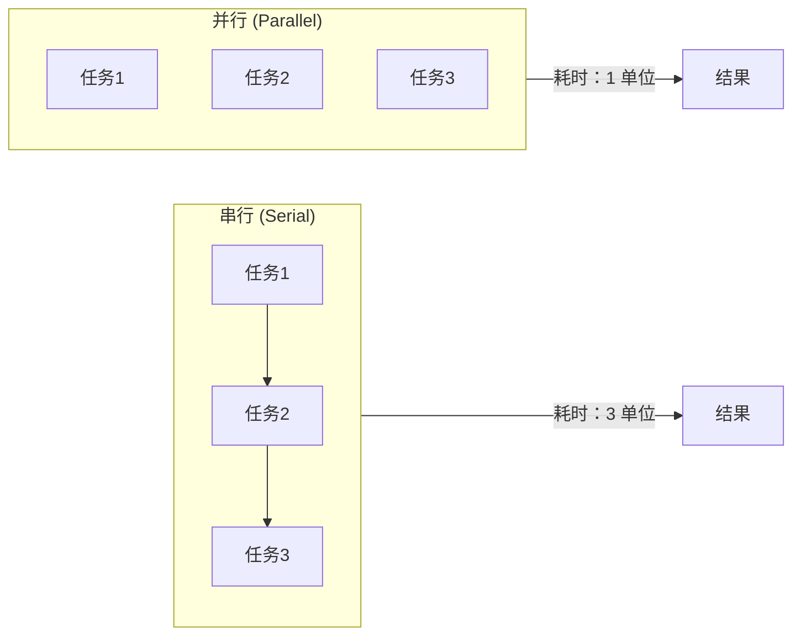
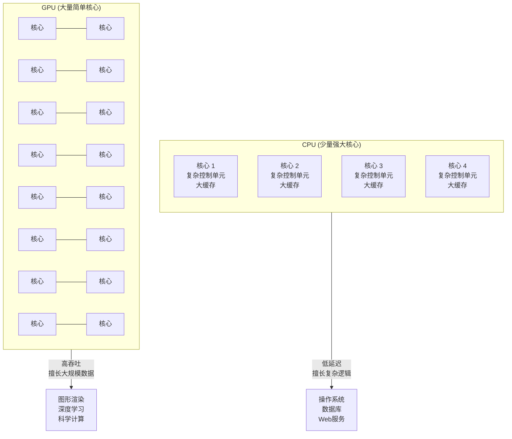
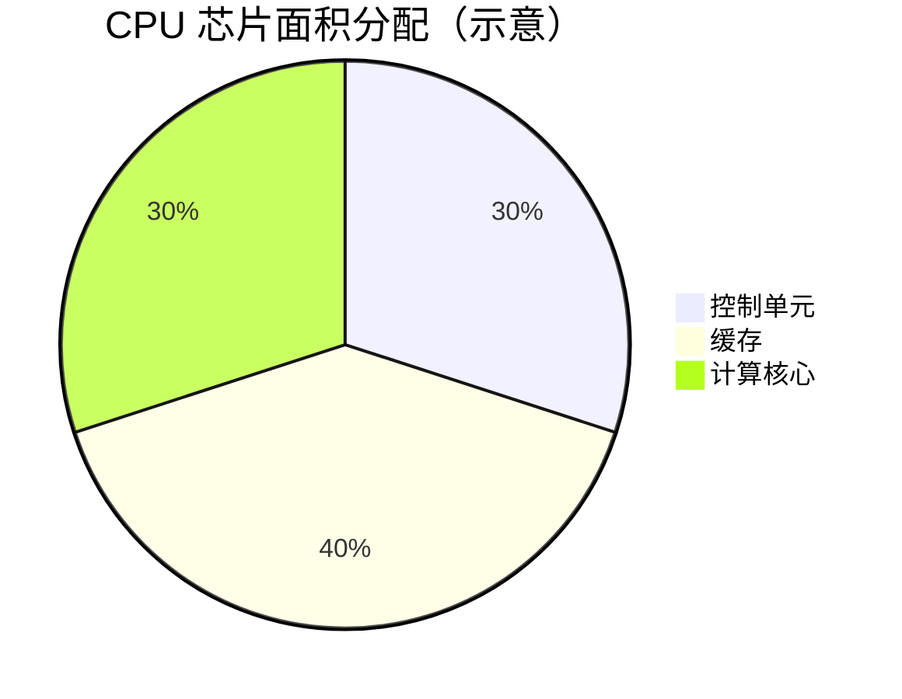
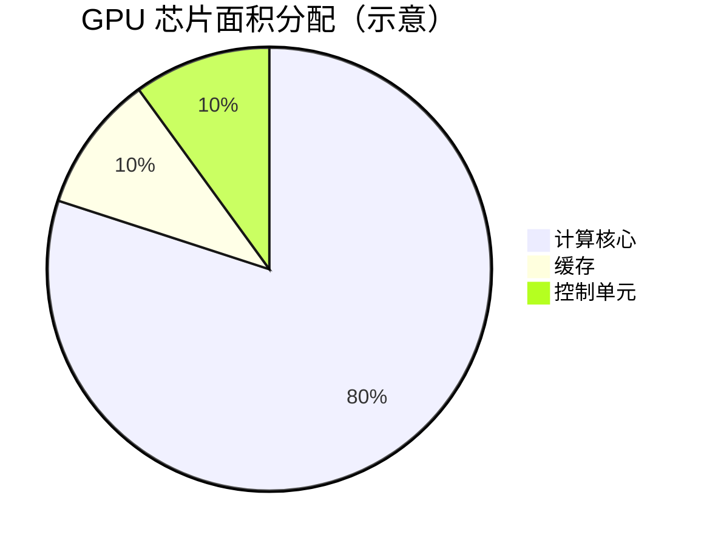
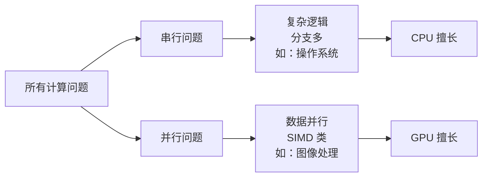
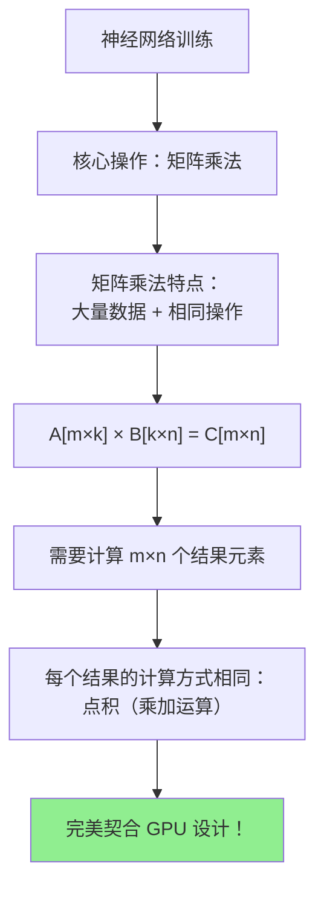
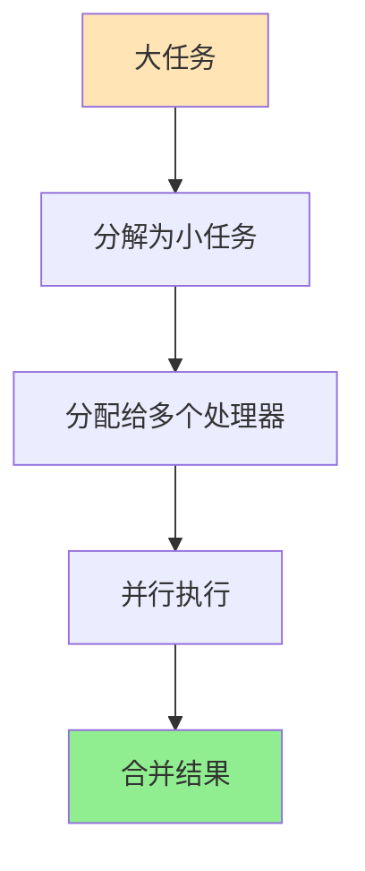
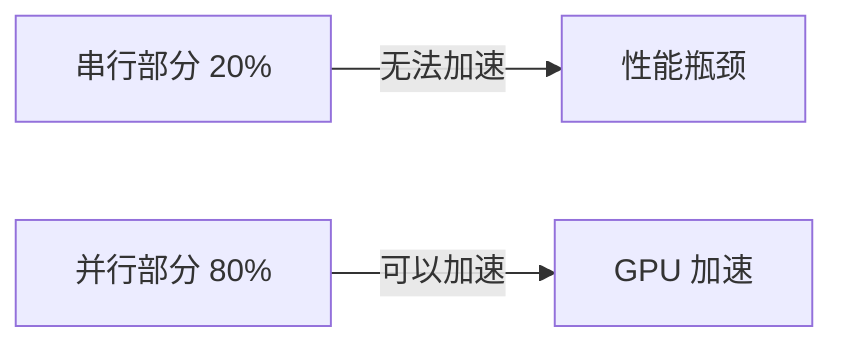
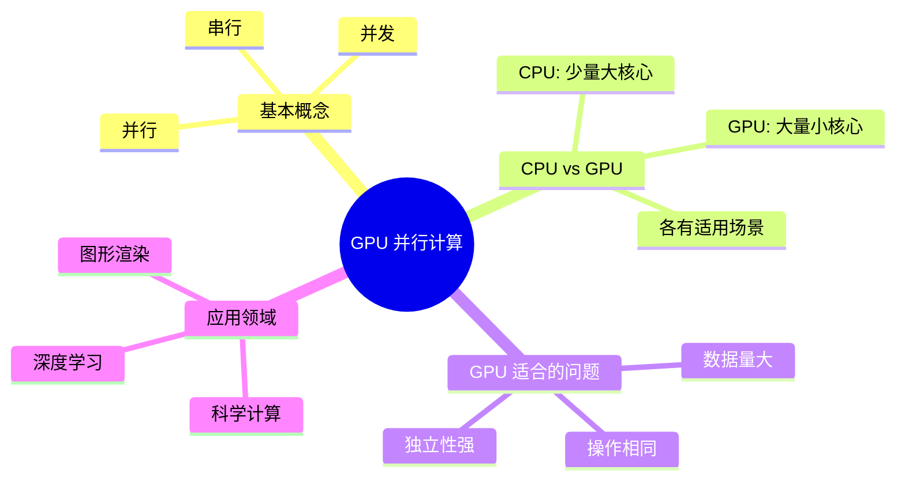

# 第一章：什么是 GPU 并行计算？

> 学习目标：理解并行计算的基本概念，以及为什么 GPU 适合并行计算
>
> 预计阅读时间：15 分钟

---

## 1. 从生活中的例子说起

### 1.1 一个简单的问题

假设你需要计算 100 道数学题，每道题需要 1 分钟。

**方案 A：一个人做**
- 你一个人做，需要 100 分钟
- 这就是**串行（Serial）**

**方案 B：找 10 个人一起做**
- 每个人做 10 道题，同时开始
- 只需要 10 分钟就能完成
- 这就是**并行（Parallel）**

### 1.2 三个重要概念

| 概念 | 定义 | 生活中的例子 |
|------|------|-------------|
| **串行** | 任务一个接一个执行 | 一个窗口的银行，客户排队等候 |
| **并发** | 多个任务交替执行，看起来同时进行 | 一个接待员快速在多个客户间切换 |
| **并行** | 多个任务在同一时刻真正同时执行 | 多个接待员同时各自服务一个客户 |



**关键区别**：
- 并发是"看起来同时"，实际上还是一个接一个（快速切换）
- 并行是"真正同时"，多个任务在同一时刻执行

---

## 2. CPU vs GPU：两种不同的设计哲学

### 2.1 一个类比

想象你需要搬运 1000 个箱子：

**CPU 就像一个大力士**
- 力气很大，一次能搬很多箱子
- 但是只有一个人
- 适合处理**复杂、逻辑性强**的任务

**GPU 就像 1000 个小学生**
- 每个人力气小，一次只能搬一个箱子
- 但是有 1000 个人，同时动手
- 适合处理**简单、重复性高**的任务

### 2.2 架构对比图

#### 官方文档对比图


> **图示说明**（来自 CUDA C++ Programming Guide 12.2.1）：GPU 将更多晶体管用于数据处理，而非数据缓存和流控制。这使得 GPU 在大规模并行计算中具有更高的吞吐量。



### 2.3 详细对比

| 特性 | CPU | GPU |
|------|-----|-----|
| **核心数量** | 少（4-64 个） | 多（数千个） |
| **核心类型** | 复杂核心，擅长复杂逻辑 | 简单核心，擅长简单运算 |
| **控制单元** | 复杂，支持分支预测、乱序执行 | 简单，适合相同指令 |
| **缓存** | 大（MB 级别） | 小（KB 级别/核心） |
| **设计目标** | 低延迟（单任务快） | 高吞吐（整体快） |
| **适合场景** | 复杂逻辑、操作系统、数据库 | 大规模数据并行、图形渲染、深度学习 |

### 2.4 为什么 GPU 核心数量这么多？





**关键洞察**：GPU 把更多的芯片面积用于计算核心，而不是控制单元和缓存。

---

## 3. GPU 适合解决什么问题？

### 3.1 问题的分类



### 3.2 数据并行的特征

GPU 适合的问题通常有以下特征：

1. **数据量大**：需要处理大量数据元素
2. **操作相同**：对每个数据元素执行相同的操作
3. **独立性强**：数据元素之间的依赖关系少

**典型例子**：

| 应用场景 | 数据元素 | 操作 |
|----------|----------|------|
| 图像处理 | 每个像素 | 颜色变换、滤镜 |
| 视频编码 | 每帧/每个宏块 | 压缩、解码 |
| 深度学习 | 每个神经元 | 矩阵乘法、激活函数 |
| 科学计算 | 每个网格点 | 物理模拟、数值计算 |
| 密码学 | 每个候选密钥 | 加密、哈希 |

### 3.3 为什么深度学习用 GPU？



**矩阵乘法示例**：

```
输入：A 是一个 1024×1024 的矩阵
     B 是一个 1024×1024 的矩阵

输出：C = A × B，也是一个 1024×1024 的矩阵

计算量：
- 每个元素需要 1024 次乘法和 1023 次加法
- 总共需要计算 1024×1024 = 1,048,576 个元素
- 这 100 多万个计算可以同时进行！

GPU 优势：
- 假设有 1000 个核心，每个核心处理约 1000 个元素
- 大幅加速训练过程
```

---

## 4. 并行计算的基本原理

### 4.1 分而治之



### 4.2 并行计算的局限性

**阿姆达尔定律（Amdahl's Law）**：

```
加速比 = 1 / [(1 - P) + P/N]

其中：
- P：可以并行化的部分比例
- N：处理器数量
- (1-P)：必须串行执行的部分
```

**例子**：

假设程序 80% 可以并行化（P = 0.8），使用 100 个处理器：

```
加速比 = 1 / [0.2 + 0.8/100] = 1 / 0.208 ≈ 4.8 倍
```

**结论**：即使有无限多的处理器，加速比也最多是 1/(1-P) = 5 倍。



---

## 5. 本章小结

### 5.1 关键概念回顾



### 5.2 思考题

1. 以下场景哪些适合用 GPU 加速？为什么？
   - 排序一个数组
   - 处理一张图片的每个像素
   - 运行操作系统
   - 训练神经网络

2. 为什么 GPU 不能完全替代 CPU？

3. 如果一个程序 50% 可以并行化，使用 10 个处理器最多能加速多少倍？

---

## 下一章

[第二章：什么是 CUDA？](./02_CUDA是什么.md) - 了解 CUDA 编程平台的基本概念

---

*参考资料：[CUDA C++ Programming Guide](https://docs.nvidia.com/cuda/cuda-c-programming-guide/)*