# 第二章：什么是 CUDA？

> 学习目标：理解 CUDA 平台的基本概念，包括 Host、Device、Kernel 等
>
> 预计阅读时间：20 分钟
>
> 前置知识：[第一章：什么是 GPU 并行计算？](./01_什么是GPU并行计算.md)

---

## 1. CUDA 是什么？

### 1.1 定义

**CUDA**（Compute Unified Device Architecture，统一计算设备架构）是 NVIDIA 开发的一个并行计算平台和编程模型。

### 1.2 CUDA 的四个核心特点

| 特点 | 说明 |
|------|------|
| **C/C++ 语法** | 基于 C/C++ 语言，学习门槛低 |
| **CPU-GPU 协作** | CPU 负责程序逻辑，GPU 负责大规模并行计算 |
| **SIMT 模式** | Single Instruction Multiple Threads，一条指令被多个线程同时执行 |
| **自动调度** | 开发者只需指定线程配置，CUDA 自动调度到 GPU 硬件 |

### 1.3 CUDA 在软件栈中的位置

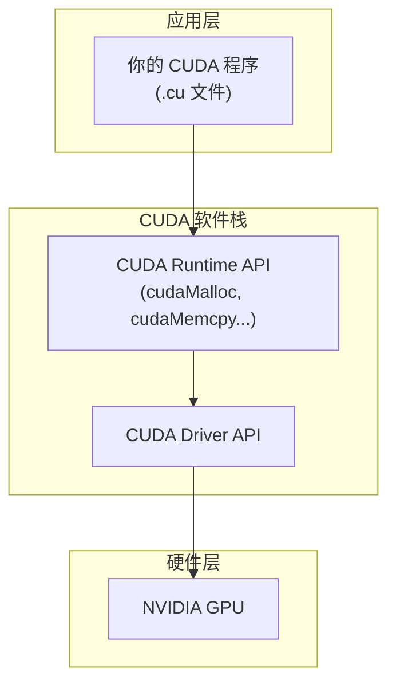

---

## 2. CUDA 核心概念

### 2.1 Host 与 Device

CUDA 程序运行在两个不同的环境中：

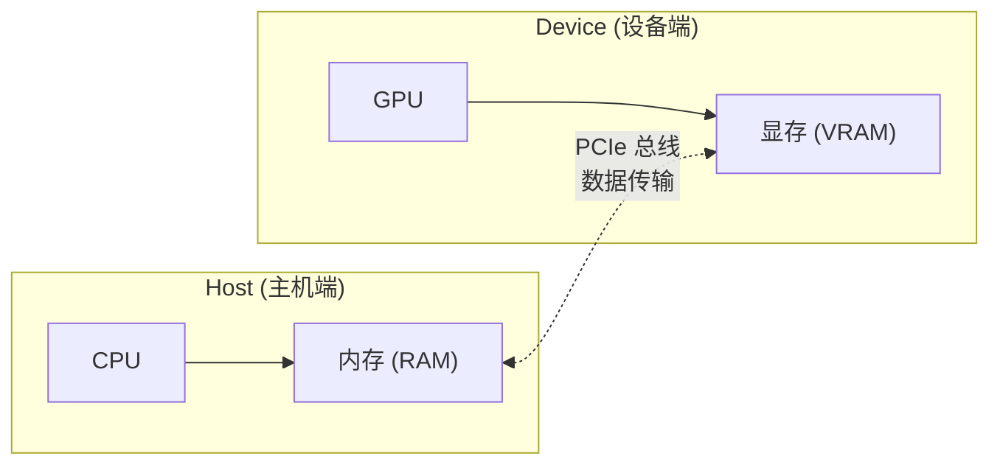

| 概念 | 定义 | 硬件 |
|------|------|------|
| **Host（主机端）** | CPU 及其内存 | CPU + RAM |
| **Device（设备端）** | GPU 及其显存 | GPU + VRAM |

**关键点**：
- Host 和 Device 的内存是**相互独立**的
- 数据需要在两者之间**显式传输**

### 2.2 Kernel（核函数）

**Kernel** 是在 GPU 上执行的函数，由 CPU 调用，在 GPU 上并行运行。

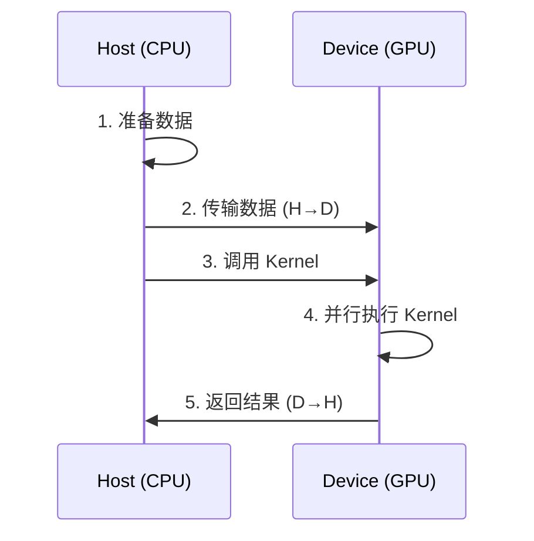

**Kernel 的特点**：
- 用 `__global__` 关键字修饰
- 由 CPU 调用，在 GPU 上执行
- 被成千上万个线程同时执行

### 2.3 CUDA 程序的基本结构

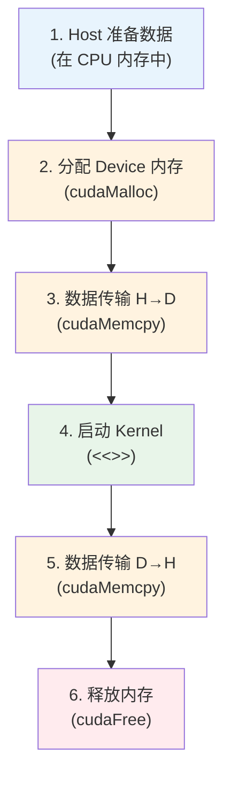

---

## 3. 第一个 CUDA 程序结构预览

在深入学习之前，我们先看一个 CUDA 程序的基本骨架：

```cpp
// ========== 文件：hello_cuda.cu ==========

#include <cuda_runtime.h>  // CUDA 运行时 API
#include <stdio.h>

// ------------------------------------------------
// Kernel 函数：在 GPU 上执行
// __global__ 表示这是一个核函数
// ------------------------------------------------
__global__ void hello_kernel() {
    // 这个函数会被多个线程同时执行
    printf("Hello from GPU thread %d!\n", threadIdx.x);
}

// ------------------------------------------------
// main 函数：在 CPU 上执行
// ------------------------------------------------
int main() {
    // 步骤 1：调用核函数
    // <<<1, 5>>> 表示启动 1 个 Block，每个 Block 有 5 个线程
    hello_kernel<<<1, 5>>>();

    // 步骤 2：等待 GPU 执行完毕
    cudaDeviceSynchronize();

    return 0;
}
```

**执行流程图解**：

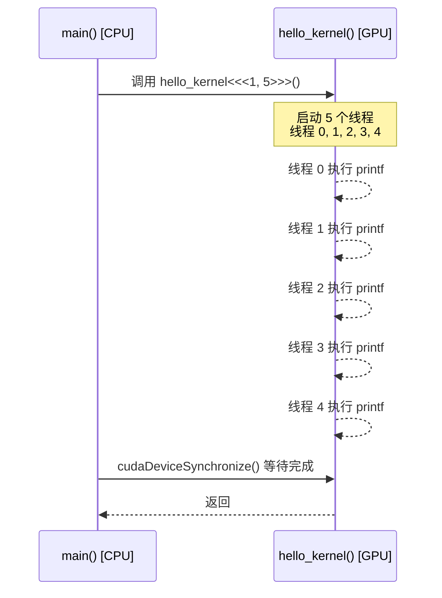

**预期输出**：
```
Hello from GPU thread 0!
Hello from GPU thread 1!
Hello from GPU thread 2!
Hello from GPU thread 3!
Hello from GPU thread 4!
```

> **注意**：输出的顺序可能不同，因为各线程是并行执行的，谁先完成是不确定的。

---

## 4. CUDA 编程模型详解

### 4.1 SIMT 执行模型

**SIMT**（Single Instruction, Multiple Threads）是 CUDA 的核心执行模型。

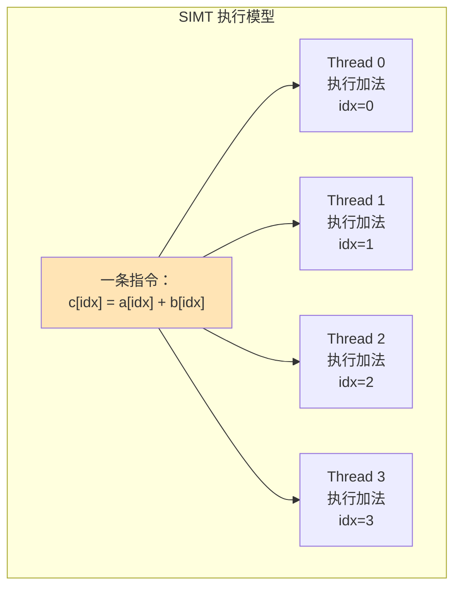

**理解 SIMT**：
- 所有线程执行**相同的代码**（同一个 Kernel）
- 每个线程处理**不同的数据**（通过线程索引区分）
- 类似于"同一个老师讲课，每个学生做不同的练习题"

### 4.2 线程的组织方式

CUDA 使用**三级层次结构**来组织线程：

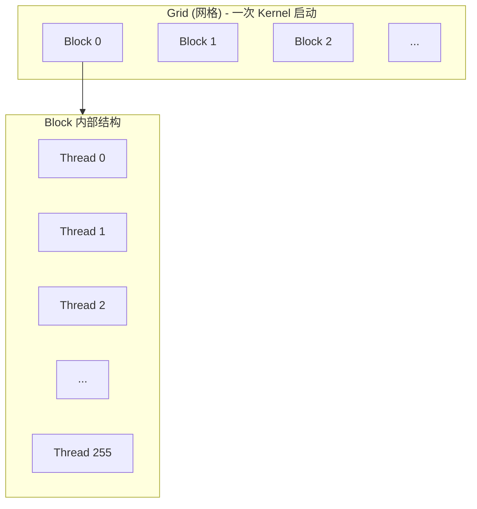

| 层次 | 说明 | 最大数量（典型值） |
|------|------|-------------------|
| **Grid** | 一次 Kernel 启动的所有线程 | 数十亿个 Block |
| **Block** | 线程组，可以协作 | 最多 1024 个线程 |
| **Thread** | 最小执行单位 | - |

### 4.3 线程索引

每个线程都有一个唯一的全局索引，用于确定它应该处理哪个数据：

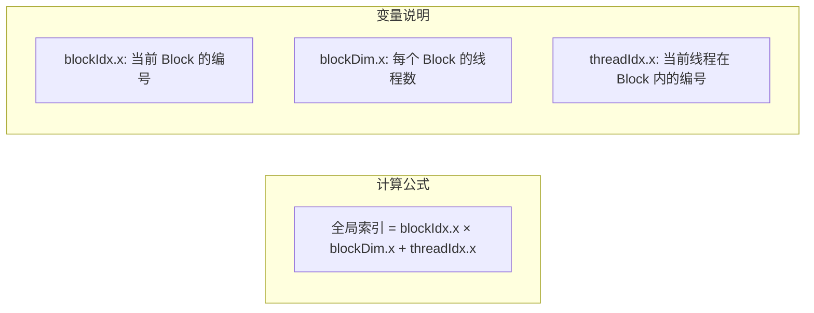

**具体例子**：

假设：
- Grid 有 3 个 Block（blockIdx.x = 0, 1, 2）
- 每个 Block 有 256 个线程（blockDim.x = 256）

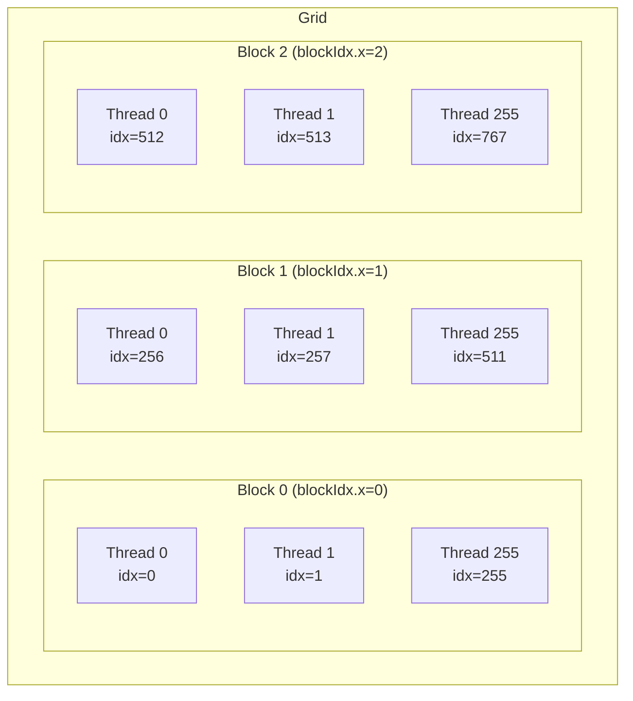

**计算过程**：
- Block 0, Thread 0: `0 × 256 + 0 = 0`
- Block 0, Thread 255: `0 × 256 + 255 = 255`
- Block 1, Thread 0: `1 × 256 + 0 = 256`
- Block 1, Thread 255: `1 × 256 + 255 = 511`
- Block 2, Thread 0: `2 × 256 + 0 = 512`

---

## 5. CUDA 编程关键字速查

### 5.1 函数类型限定符

| 限定符 | 执行位置 | 调用位置 | 说明 |
|--------|----------|----------|------|
| `__global__` | Device (GPU) | Host (CPU) | 核函数，返回值必须是 void |
| `__device__` | Device (GPU) | Device (GPU) | 设备函数，只能被 GPU 调用 |
| `__host__` | Host (CPU) | Host (CPU) | 主机函数，默认情况 |

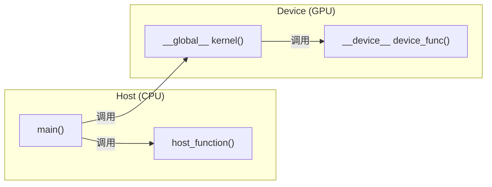

### 5.2 内存管理 API

| 函数 | 作用 | 类比 |
|------|------|------|
| `cudaMalloc(&ptr, size)` | 在 GPU 上分配内存 | 类似 `malloc` |
| `cudaFree(ptr)` | 释放 GPU 内存 | 类似 `free` |
| `cudaMemcpy(dst, src, size, dir)` | 数据传输 | 类似 `memcpy` |

**cudaMemcpy 的方向参数**：

| 参数 | 含义 |
|------|------|
| `cudaMemcpyHostToDevice` | CPU → GPU |
| `cudaMemcpyDeviceToHost` | GPU → CPU |
| `cudaMemcpyDeviceToDevice` | GPU → GPU |

### 5.3 内置变量

| 变量 | 类型 | 说明 |
|------|------|------|
| `threadIdx` | uint3 | 当前线程在 Block 内的索引 |
| `blockIdx` | uint3 | 当前 Block 在 Grid 内的索引 |
| `blockDim` | dim3 | Block 的维度（线程数） |
| `gridDim` | dim3 | Grid 的维度（Block 数） |

---

## 6. 本章小结

### 6.1 知识图谱

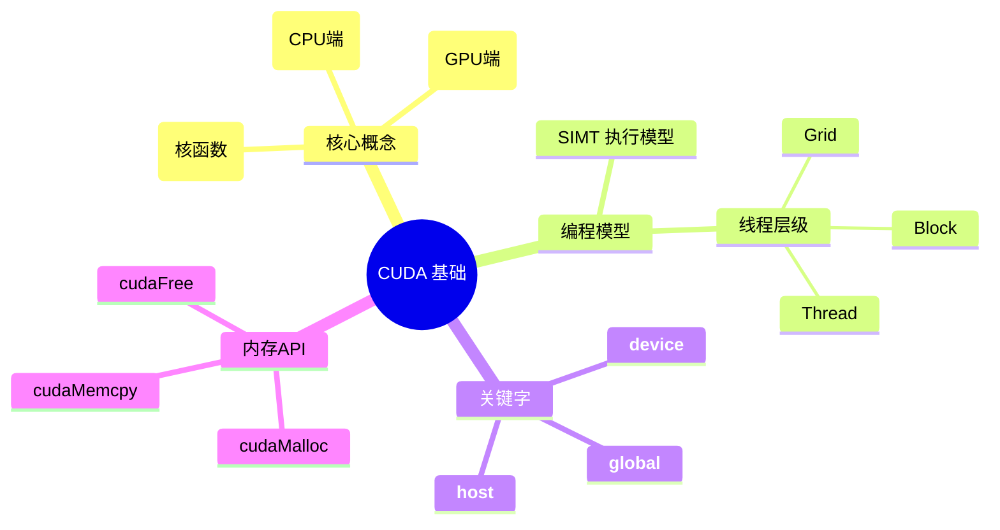

### 6.2 记忆要点

1. **CUDA 程序运行在两个环境**：Host (CPU) 和 Device (GPU)
2. **Kernel 是核心**：由 CPU 调用，在 GPU 上并行执行
3. **线程是并行的基本单位**：通过索引区分不同线程
4. **数据需要显式传输**：Host 和 Device 的内存相互独立

### 6.3 思考题

1. 为什么 CUDA 需要 Host 和 Device 两个环境？
2. `__global__` 和 `__device__` 有什么区别？
3. 如果启动 `<<<2, 128>>>`，一共有多少个线程？Block 1 的 Thread 0 的全局索引是多少？

---

## 下一章

[第三章：GPU 硬件架构入门](./03_GPU硬件架构入门.md) - 了解 GPU 内部是如何工作的

---

*参考资料：[CUDA C++ Programming Guide](https://docs.nvidia.com/cuda/cuda-c-programming-guide/)*