# 第三章：GPU 硬件架构入门

> 学习目标：了解 GPU 内部结构，理解 SM、CUDA Core、Warp 等核心概念
>
> 预计阅读时间：25 分钟
>
> 前置知识：[第二章：什么是 CUDA？](./02_CUDA是什么.md)

---

## 1. 从宏观到微观：GPU 架构总览

### 1.1 GPU 内部结构图

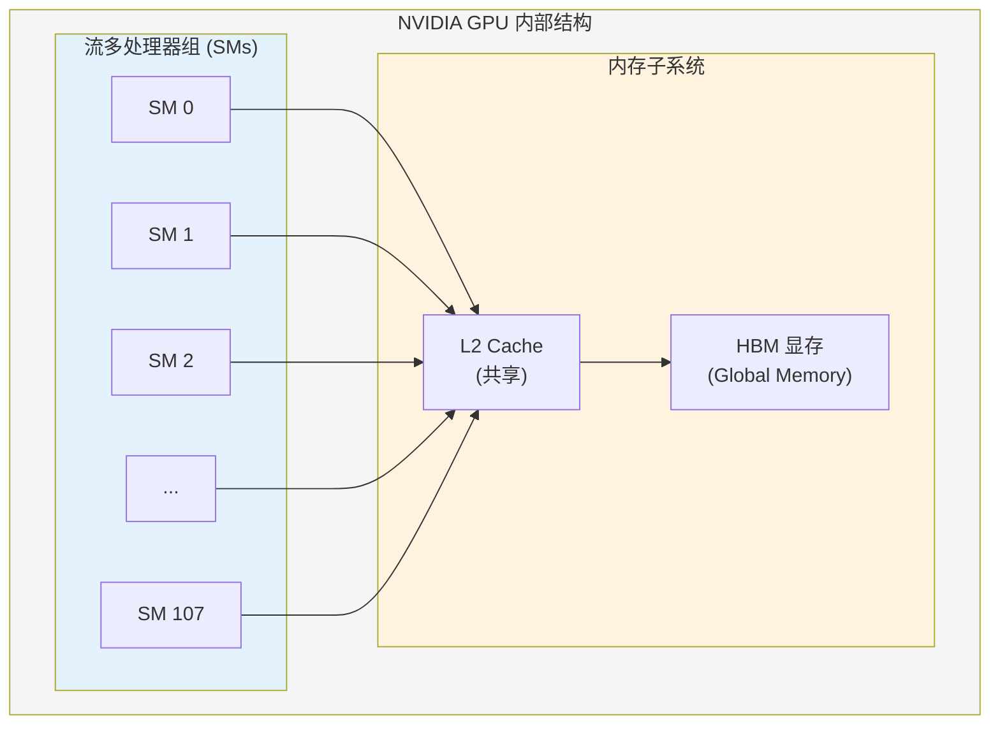

### 1.2 NVIDIA A100 参数示例

| 组件 | 数量 | 说明 |
|------|------|------|
| **SM（流多处理器）** | 108 个 | GPU 的基本计算单元 |
| **CUDA Core** | 6912 个 | 每个 SM 有 64 个 |
| **Tensor Core** | 432 个 | 矩阵运算加速单元 |
| **显存（HBM2e）** | 80 GB | 全局内存 |
| **带宽** | 2039 GB/s | 内存带宽 |

---

## 2. SM（流多处理器）详解

### 2.1 什么是 SM？

**SM**（Streaming Multiprocessor，流多处理器）是 GPU 的基本计算单元。

### 2.2 一个类比

把 GPU 想象成一个大型工厂：

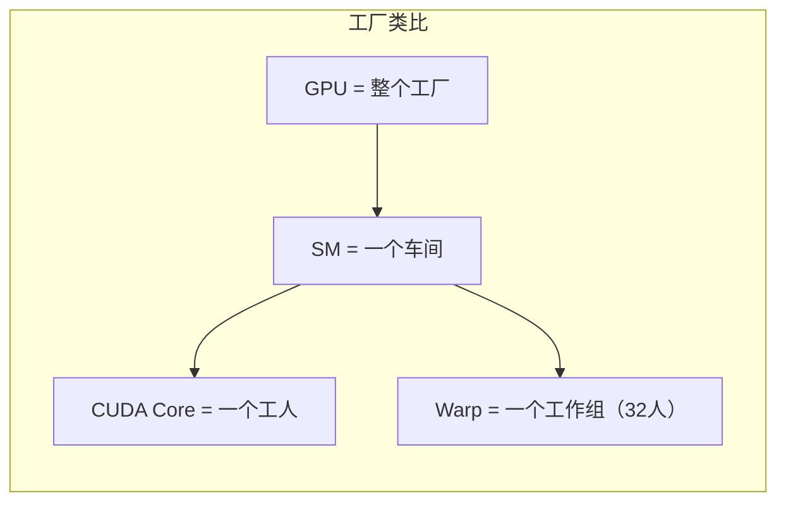

| 概念 | 类比 | 说明 |
|------|------|------|
| **GPU** | 整个工厂 | 所有计算资源的集合 |
| **SM** | 一个车间 | 独立的计算单元 |
| **CUDA Core** | 一个工人 | 执行基本运算 |
| **Warp** | 工作组 | 协同工作的 32 个线程 |

### 2.3 SM 内部结构

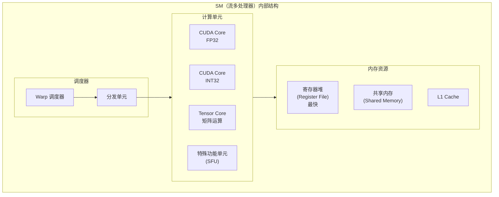

### 2.4 SM 的工作原理

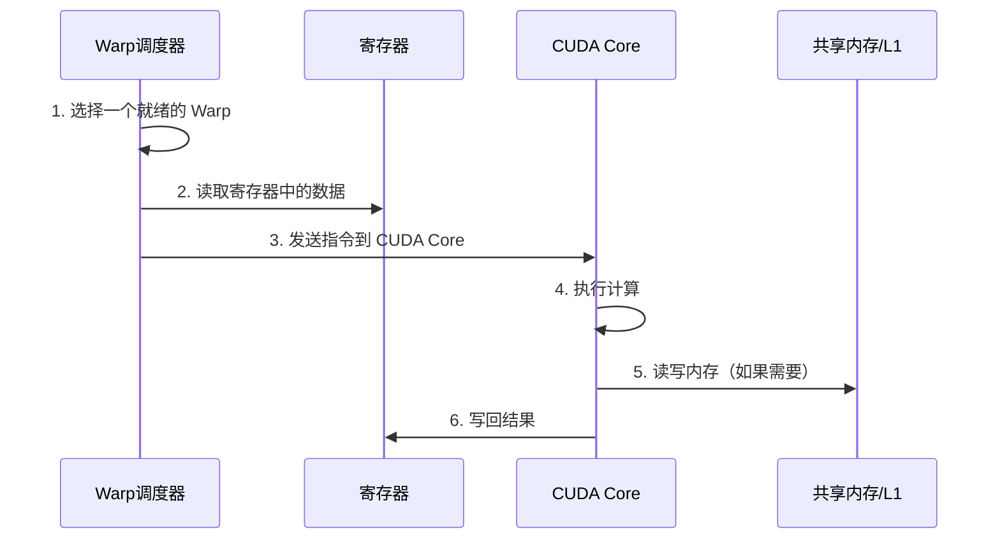

---

## 3. CUDA Core vs Tensor Core

### 3.1 CUDA Core

**CUDA Core** 是 GPU 的基本计算单元，执行标量运算。

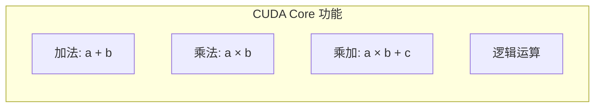

**特点**：
- 每个 CUDA Core 每个时钟周期执行**一条**浮点运算
- 适合通用计算

### 3.2 Tensor Core

**Tensor Core** 是专门用于矩阵乘法的加速单元。

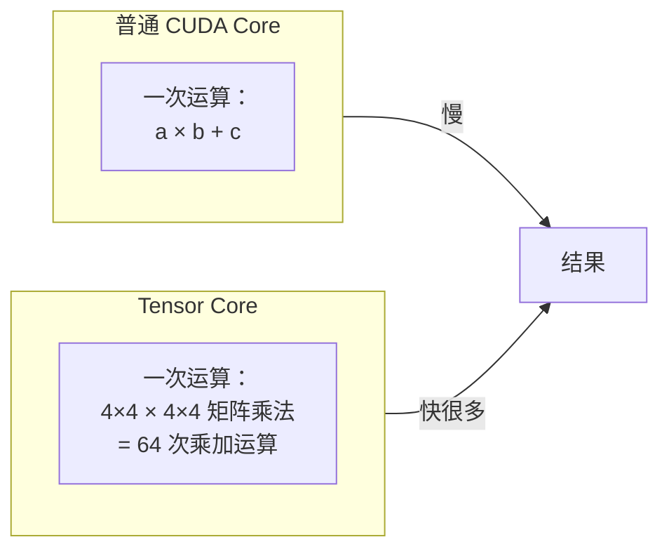

**对比**：

| 特性 | CUDA Core | Tensor Core |
|------|-----------|-------------|
| **运算类型** | 标量运算 | 矩阵运算 |
| **每次运算量** | 1 次 FP32 运算 | 64 次矩阵运算 |
| **适用场景** | 通用计算 | 深度学习（矩阵乘法） |
| **编程接口** | 普通 C++ 代码 | WMMA API / cuBLAS |

### 3.3 为什么深度学习需要 Tensor Core？

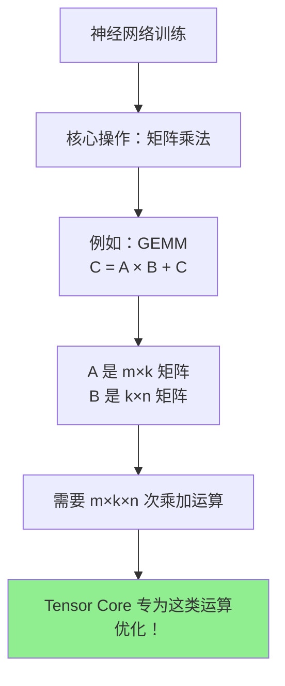

---

## 4. Warp：GPU 的调度单位

### 4.1 什么是 Warp？

**Warp** 是 GPU 线程调度的最小单位，一个 Warp 包含 **32 个线程**。

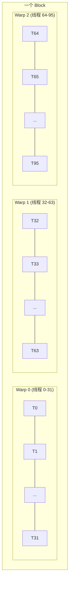

### 4.2 Warp 执行模型

**关键规则**：同一 Warp 中的 32 个线程**同时执行同一条指令**。

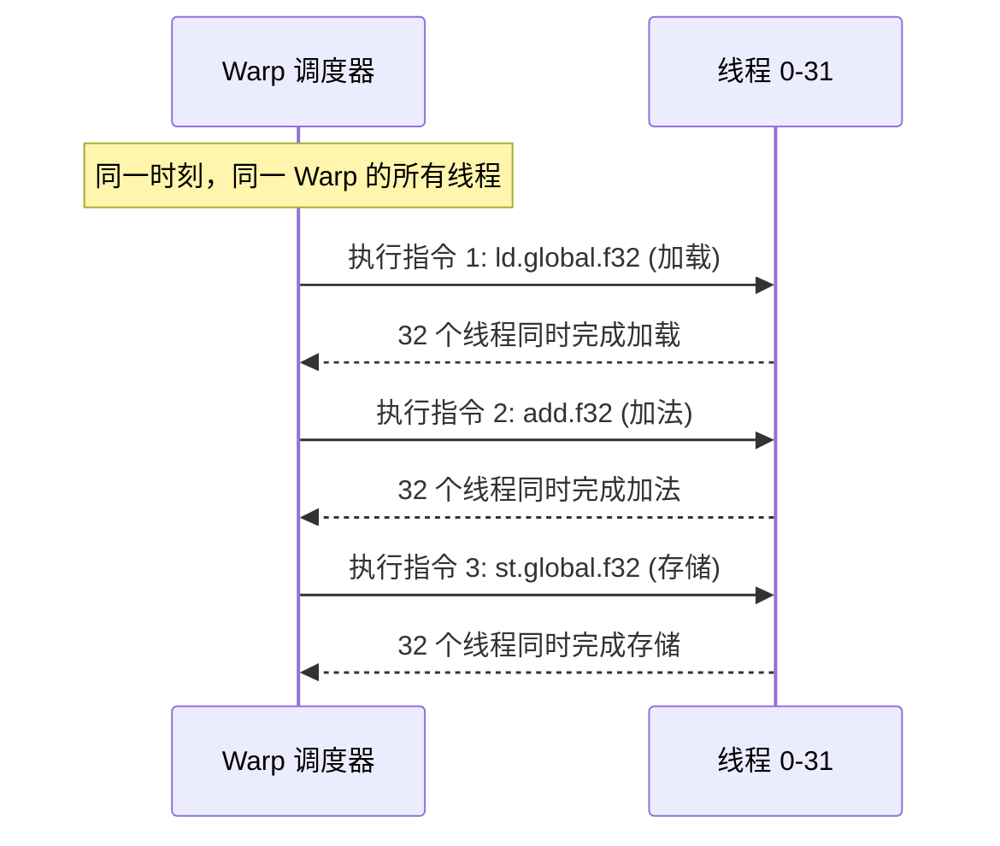

### 4.3 Warp Divergence（分支分歧）

**问题**：当 Warp 内的线程遇到不同的分支时，会发生什么？

```cpp
// 代码示例
if (threadIdx.x < 16) {
    // 分支 A：线程 0-15 执行
    result = a + b;
} else {
    // 分支 B：线程 16-31 执行
    result = a - b;
}
```

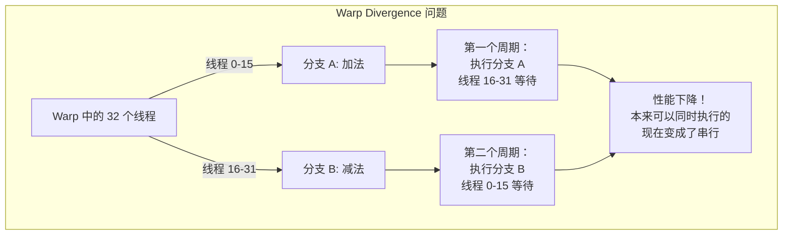

**解决方案**：尽量让 Warp 内的线程走相同的分支路径。

---

## 5. GPU 内存层级

### 5.1 内存层级图

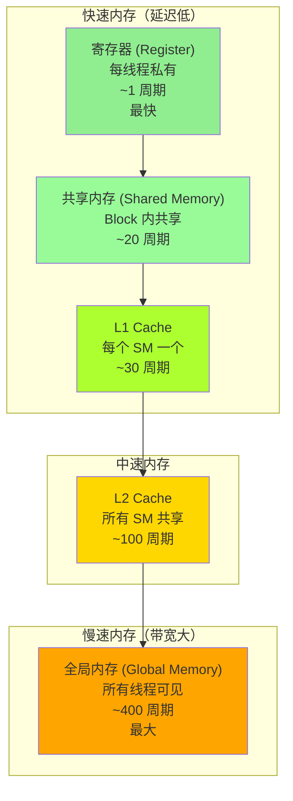

### 5.2 各级内存详解

| 内存类型 | 位置 | 访问速度 | 可见性 | 大小（典型值） |
|----------|------|----------|--------|----------------|
| **寄存器** | SM 内部 | 1 周期 | 线程私有 | 256 KB / SM |
| **共享内存** | SM 内部 | ~20 周期 | Block 内共享 | 164 KB / SM |
| **L1 Cache** | SM 内部 | ~30 周期 | SM 内共享 | 128 KB / SM |
| **L2 Cache** | GPU 全局 | ~100 周期 | 全局共享 | 40 MB |
| **全局内存** | HBM | ~400 周期 | 全局共享 | 80 GB |

### 5.3 内存访问原则

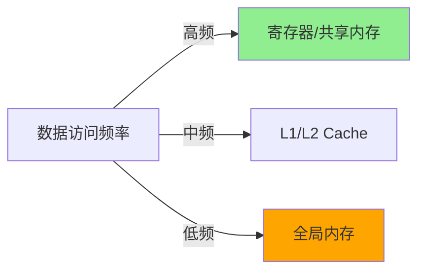

**优化原则**：
1. **高频访问的数据** → 放在寄存器或共享内存
2. **利用数据局部性** → 让 L1/L2 Cache 发挥作用
3. **减少全局内存访问** → 这是性能的主要瓶颈

---

## 6. Block 如何映射到 SM

### 6.1 映射规则

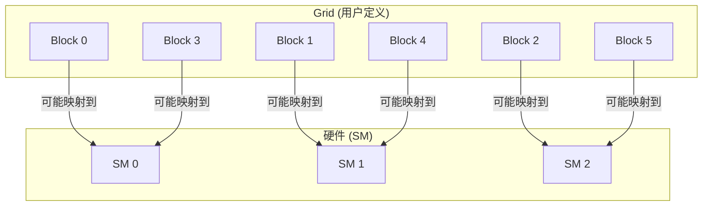

**关键点**：
1. **Block 到 SM 的映射由硬件自动完成**，程序员无法控制
2. **一个 Block 只能在一个 SM 上执行**
3. **一个 SM 可以同时执行多个 Block**（如果资源足够）

### 6.2 资源限制

一个 SM 能同时运行多少个 Block，取决于：

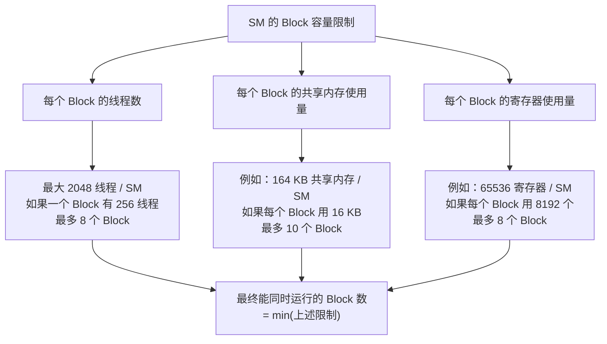

---

## 7. 计算能力（Compute Capability）

### 7.1 什么是计算能力？

**Compute Capability**（计算能力）是 NVIDIA 用来描述 GPU 功能集的版本号，格式为 `X.Y`。

### 7.2 各代架构对比

| 架构 | 代表 GPU | 计算能力 | SM 数量 | 特性 |
|------|----------|----------|---------|------|
| **Volta** | V100 | 7.0 | 80 | 第一代 Tensor Core |
| **Turing** | RTX 2080 | 7.5 | 46 | RT Core |
| **Ampere** | A100 | 8.0 | 108 | 第三代 Tensor Core |
| **Ampere** | RTX 3090 | 8.6 | 82 | 消费级旗舰 |
| **Ada Lovelace** | RTX 4090 | 8.9 | 128 | 第四代 Tensor Core |
| **Hopper** | H100 | 9.0 | 132 | FP8 支持 |

### 7.3 查看你的 GPU 计算能力

```bash
# 方法 1：nvidia-smi
nvidia-smi --query-gpu=name,compute_cap --format=csv

# 方法 2：CUDA 程序
# 见后续章节
```

---

## 8. 本章小结

### 8.1 知识图谱

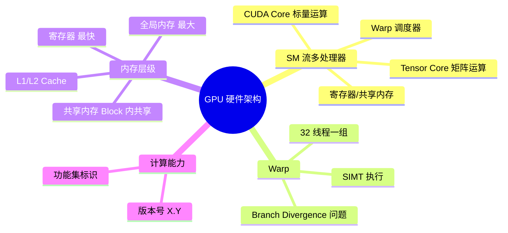

### 8.2 关键要点

1. **SM 是基本计算单元**：包含多个 CUDA Core、Tensor Core 和内存资源
2. **Warp 是调度单位**：32 个线程同时执行同一条指令
3. **内存层级很重要**：寄存器 > 共享内存 > L1/L2 > 全局内存
4. **Block 映射由硬件决定**：一个 Block 只能在一个 SM 上执行

### 8.3 思考题

1. 如果一个 Block 有 100 个线程，它会被分成几个 Warp？
2. 为什么共享内存比全局内存快这么多？
3. Tensor Core 和 CUDA Core 有什么区别？各适合什么场景？

---

## 下一章

[第四章：线程层级结构](./04_线程层级结构.md) - 深入理解 CUDA 的线程组织方式

---

*参考资料：[CUDA C++ Programming Guide](https://docs.nvidia.com/cuda/cuda-c-programming-guide/) | [NVIDIA GPU Architecture](https://www.nvidia.com/en-us/data-center/technologies/hopper-architecture/)*