# 第四章：线程层级结构

> 学习目标：深入理解 CUDA 的线程组织方式（Thread、Block、Grid），掌握线程索引计算
>
> 预计阅读时间：30 分钟
>
> 前置知识：[第三章：GPU 硬件架构入门](./03_GPU硬件架构入门.md)

---

## 1. 为什么需要三级线程结构？

### 1.1 一个生活中的类比

想象你要组织一场大规模的**合唱比赛**，有 10000 人参加：

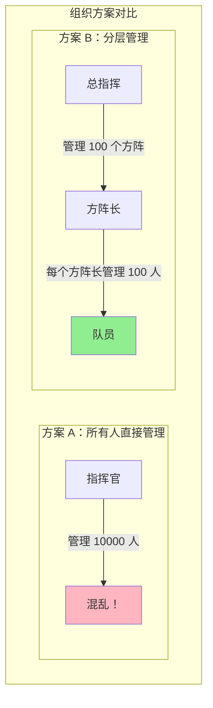

**分层管理的优势**：
1. **总指挥不需要知道每个人**：只需管理方阵长
2. **方阵长管理自己的人**：内部事务自己处理
3. **方便并行**：各方阵可以同时训练，互不干扰

### 1.2 CUDA 三级结构的对应关系

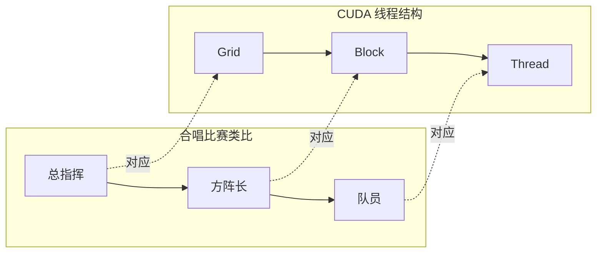

| 合唱比赛 | CUDA | 说明 |
|----------|------|------|
| **总指挥** | **Grid** | 一次 Kernel 启动的所有线程 |
| **方阵** | **Block** | 一组可以协作的线程 |
| **队员** | **Thread** | 最小的执行单位 |

#### 官方文档：Grid of Thread Blocks


> **图示说明**（来自 CUDA C++ Programming Guide 12.2.1）：Thread Blocks 组织成一维、二维或三维的 Grid。每个 Block 内的线程可以通过共享内存协作，并同步执行。

### 1.3 硬件层面的原因

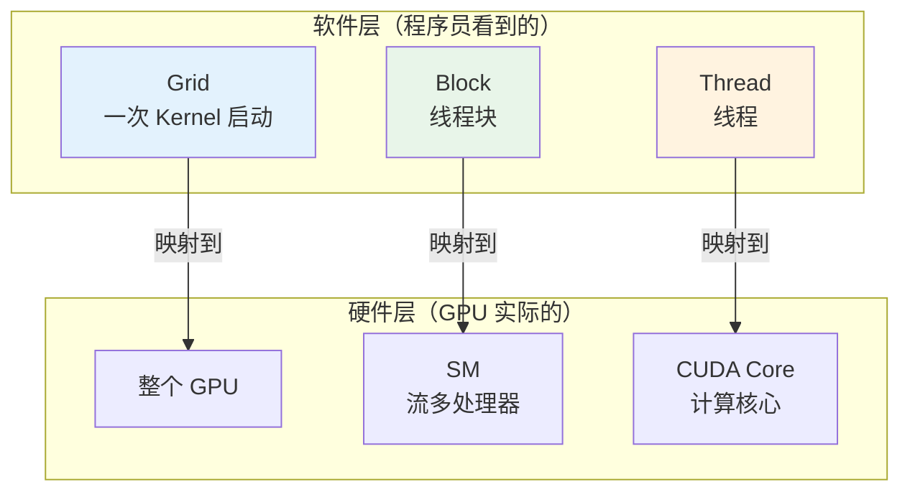

**为什么是三级结构？这与 GPU 硬件设计一一对应：**

1. **Grid → 整个 GPU**：一次 Kernel 启动使用整个 GPU 的资源
2. **Block → SM**：一个 Block 被分配到一个 SM 上执行，Block 内的线程可以共享内存和同步
3. **Thread → CUDA Core**：一个线程在一个 CUDA Core 上执行

**关键设计理念**：
- Block 内的线程可以**协作**（共享内存、同步）
- Block 之间**相互独立**（不能共享内存、不能同步）
- 这使得硬件可以灵活调度 Block 到不同的 SM

---

## 2. 线程层级结构详解

### 2.1 整体结构图

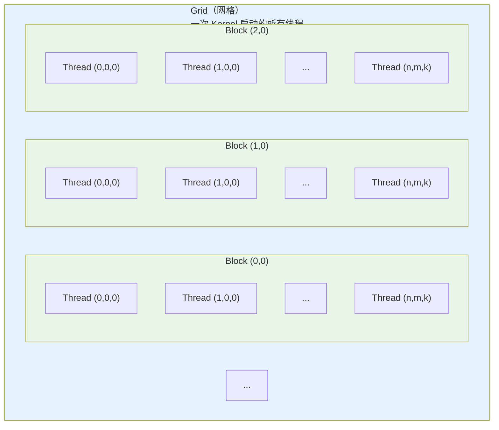

### 2.2 三级结构详细说明

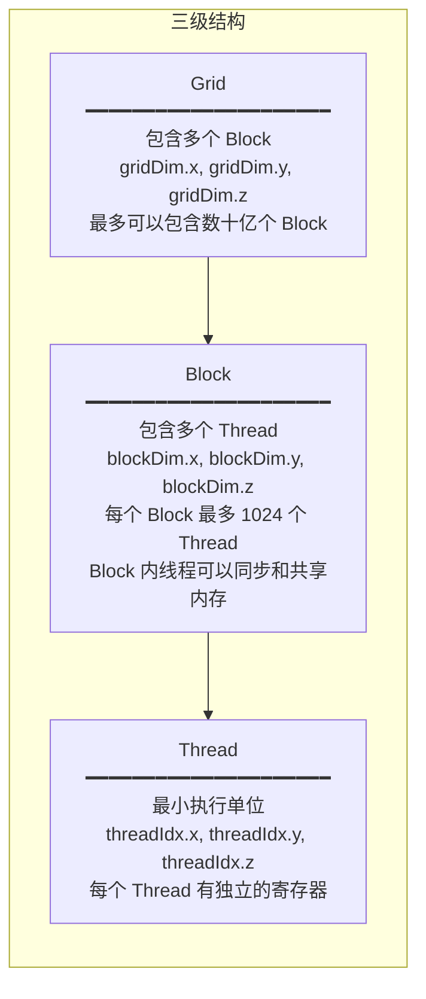

| 层级 | 说明 | 内置变量 | 最大限制 |
|------|------|----------|----------|
| **Grid** | 一次 Kernel 启动 | `gridDim` (dim3) | 约 2^31 - 1 个 Block |
| **Block** | 线程组 | `blockIdx` (uint3), `blockDim` (dim3) | 最多 1024 个线程 |
| **Thread** | 单个线程 | `threadIdx` (uint3) | - |

### 2.3 维度的概念

CUDA 支持 **1D、2D、3D** 三种维度，这让处理不同类型的数据更自然：

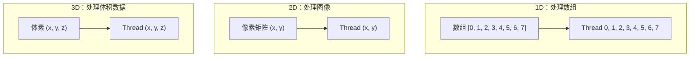

**生活类比**：

| 维度 | 类比 | 应用场景 |
|------|------|----------|
| **1D** | 排队买票的人 | 数组处理、向量运算 |
| **2D** | 电影院座位 | 图像处理、矩阵运算 |
| **3D** | 停车场的车位 | 体积渲染、3D 物理 |

---

### 2.4 Thread Block Clusters（线程块簇）

**重要更新**：从 CUDA 12.0 和计算能力 9.0（Hopper 架构）开始，CUDA 引入了新的可选层级——**Thread Block Clusters**。

#### 官方文档：Grid of Clusters


> **图示说明**（来自 CUDA C++ Programming Guide 12.2.1）：与线程块中的线程被保证在同一个流多处理器上协同调度类似，线程块簇中的线程块也被保证在 GPU 处理簇（GPC）上协同调度。

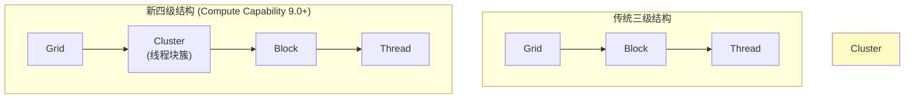

**Cluster 的特点**：

| 特性 | 说明 |
|------|------|
| **协同调度** | 同一 Cluster 中的 Block 保证在同一 GPC 上执行 |
| **最大 Block 数** | 8 个 Block（便携配置） |
| **分布式共享内存** | Cluster 内的 Block 可以互相访问共享内存 |
| **硬件同步** | 支持 `cluster.sync()` 进行 Cluster 级别同步 |

**Cluster 启动示例**：

```cpp
// 方法1：编译时指定 Cluster 大小
__global__ void __cluster_dims__(2, 1, 1) cluster_kernel(float *data) {
    // Cluster 包含 2x1x1 = 2 个 Block
}

// 方法2：运行时指定 Cluster 大小
cudaLaunchConfig_t config = {0};
config.gridDim = numBlocks;
config.blockDim = threadsPerBlock;

cudaLaunchAttribute attrs[1];
attrs[0].id = cudaLaunchAttributeClusterDimension;
attrs[0].val.clusterDim = {2, 1, 1};  // Cluster 大小
config.attrs = attrs;
config.numAttrs = 1;

cudaLaunchKernelEx(&config, cluster_kernel, data);
```

> **注意**：Thread Block Clusters 需要计算能力 9.0+（如 H100 GPU）。对于早期硬件，可以忽略此特性。

---

## 3. 线程索引计算公式推导

### 3.1 一维情况（最简单）

**场景**：处理一个长度为 N 的数组，每个线程处理一个元素。

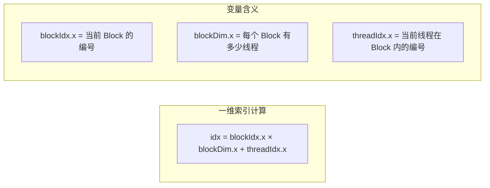

**一步步推导**：

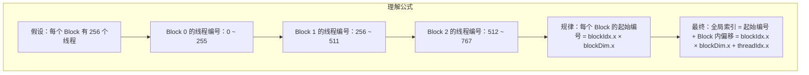

**具体例子**：

假设 Grid 有 3 个 Block，每个 Block 有 4 个线程：

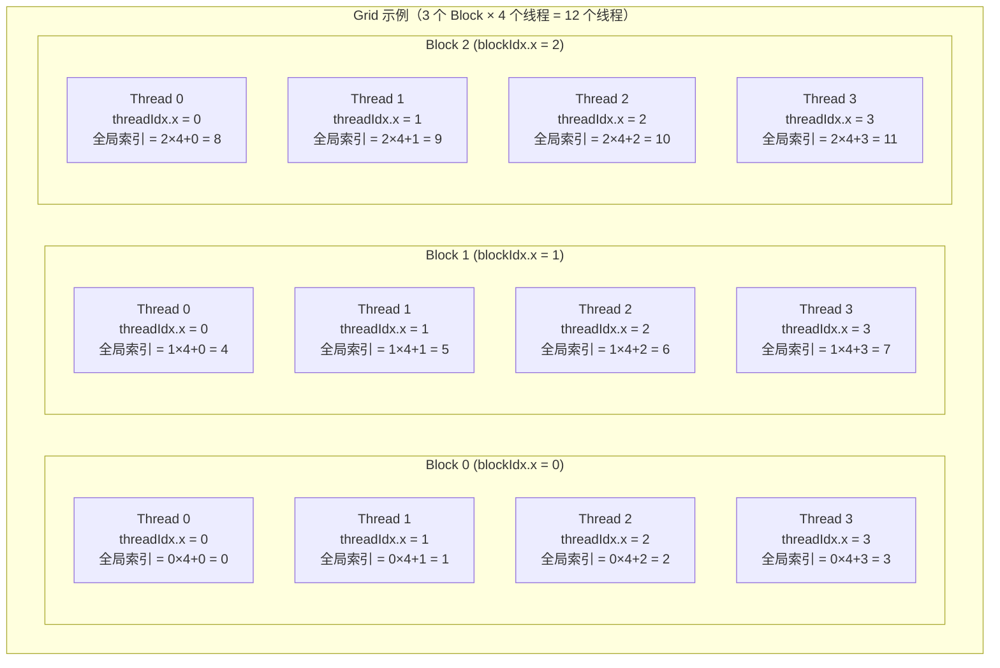

### 3.2 二维情况

**场景**：处理一张图片，每个线程处理一个像素。

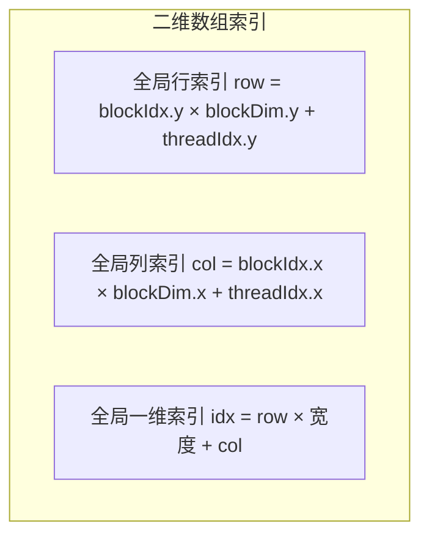

**图解二维索引**：

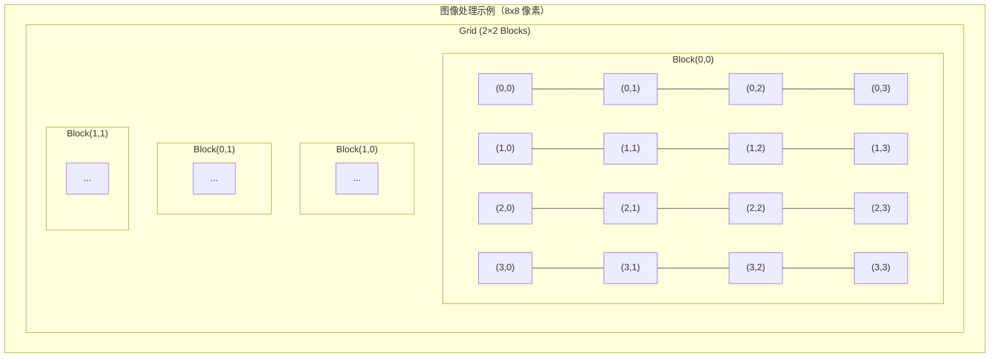

**计算公式**：

```cpp
// 二维索引计算
// blockIdx.x, blockIdx.y: Block 在 Grid 中的位置
// threadIdx.x, threadIdx.y: Thread 在 Block 中的位置
// blockDim.x, blockDim.y: Block 的维度

int row = blockIdx.y * blockDim.y + threadIdx.y;  // 行索引
int col = blockIdx.x * blockDim.x + threadIdx.x;   // 列索引

// 如果需要一维索引
int idx = row * width + col;  // width 是图像的宽度
```

### 3.3 三维情况

**场景**：处理三维体积数据。

```cpp
// 三维索引计算
int z = blockIdx.z * blockDim.z + threadIdx.z;  // 深度索引
int y = blockIdx.y * blockDim.y + threadIdx.y;  // 行索引
int x = blockIdx.x * blockDim.x + threadIdx.x;  // 列索引

// 转换为一维索引
int idx = z * (height * width) + y * width + x;
```

### 3.4 索引计算公式总结

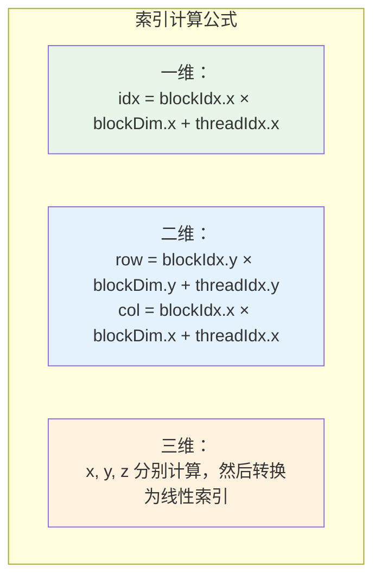

**记忆技巧**：

```
全局索引 = Block偏移 + Block内偏移
         = Block编号 × Block大小 + 线程序号
         = blockIdx   × blockDim   + threadIdx
```

---

## 4. 线程层级与硬件映射

### 4.1 为什么 Block 之间不能同步？

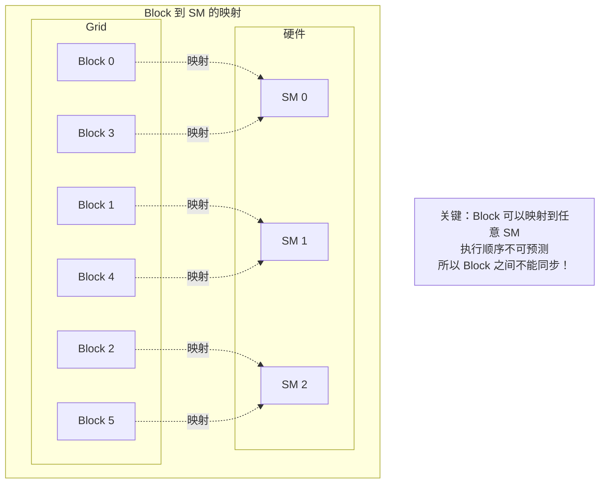

**原因分析**：

1. **硬件调度不确定**：Block 由硬件调度，程序员无法控制 Block 在哪个 SM 上执行
2. **执行顺序不确定**：Block 0 不一定比 Block 1 先完成
3. **没有全局同步机制**：CUDA 没有提供 Block 之间的同步原语

### 4.2 为什么 Block 内可以同步？

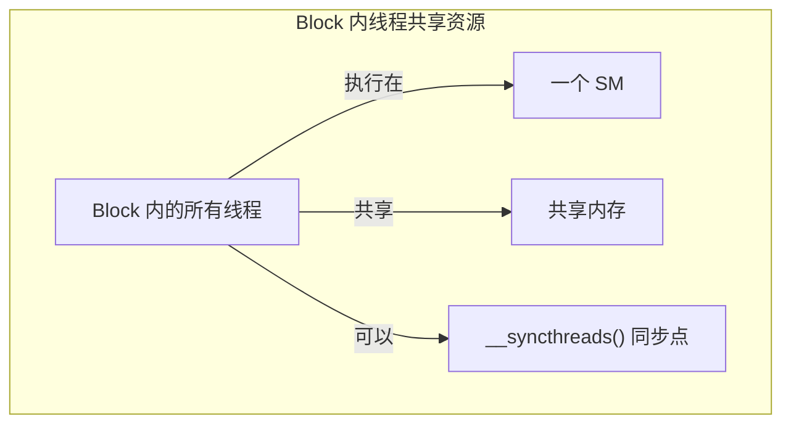

**原因分析**：

1. **同一个 Block 的线程在同一个 SM 上**：可以共享 SM 的资源
2. **共享内存可见**：Block 内的线程可以访问同一块共享内存
3. **有同步原语**：`__syncthreads()` 可以让 Block 内所有线程同步

### 4.3 Block 大小的选择

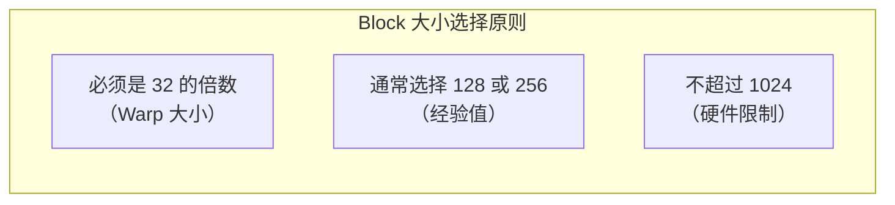

**常见选择**：

| Block 大小 | 优点 | 缺点 | 适用场景 |
|------------|------|------|----------|
| **32** | 精确控制 | 占用率低 | 简单任务 |
| **128** | 平衡 | - | 大多数场景 |
| **256** | 高占用率 | 资源消耗大 | 计算密集型 |
| **512** | 最高占用率 | 寄存器压力大 | 需要测试验证 |

---

## 5. 实战：打印线程信息

### 5.1 完整代码示例

```cpp
// ========== 文件：thread_info.cu ==========
// 功能：演示线程层级结构，打印每个线程的信息

#include <cuda_runtime.h>  // CUDA 运行时 API 头文件
#include <stdio.h>         // 标准输入输出头文件

// ============================================================================
// 核函数：打印线程信息
// ============================================================================
// __global__ 修饰符表示这是一个核函数，在 GPU 上执行
// 每个线程都会执行这个函数一次
// ============================================================================
__global__ void print_thread_info() {
    // --------------------------------------------------------
    // 获取当前线程的各种索引信息
    // 这些是 CUDA 内置变量，不需要声明，直接使用
    // --------------------------------------------------------

    // blockIdx：当前 Block 在 Grid 中的索引
    // .x, .y, .z 分别表示三个维度
    int block_x = blockIdx.x;    // Block 在 x 方向的索引
    int block_y = blockIdx.y;    // Block 在 y 方向的索引
    int block_z = blockIdx.z;    // Block 在 z 方向的索引

    // threadIdx：当前线程在 Block 内的索引
    int thread_x = threadIdx.x;  // 线程在 Block 内 x 方向的索引
    int thread_y = threadIdx.y;  // 线程在 Block 内 y 方向的索引
    int thread_z = threadIdx.z;  // 线程在 Block 内 z 方向的索引

    // blockDim：Block 的维度（每个 Block 有多少线程）
    int block_dim_x = blockDim.x;  // Block 在 x 方向的线程数
    int block_dim_y = blockDim.y;  // Block 在 y 方向的线程数
    int block_dim_z = blockDim.z;  // Block 在 z 方向的线程数

    // gridDim：Grid 的维度（Grid 有多少 Block）
    int grid_dim_x = gridDim.x;    // Grid 在 x 方向的 Block 数
    int grid_dim_y = gridDim.y;    // Grid 在 y 方向的 Block 数
    int grid_dim_z = gridDim.z;    // Grid 在 z 方向的 Block 数

    // --------------------------------------------------------
    // 计算全局唯一索引（一维）
    // 公式：idx = blockIdx.x * blockDim.x + threadIdx.x
    // --------------------------------------------------------
    int global_idx = blockIdx.x * blockDim.x + threadIdx.x;

    // --------------------------------------------------------
    // 打印线程信息
    // 注意：GPU 上 printf 的输出会有缓冲，顺序可能不确定
    // --------------------------------------------------------
    printf("Thread %2d: Block(%d,%d,%d) Thread(%d,%d,%d) "
           "blockDim(%d,%d,%d) gridDim(%d,%d,%d) global_idx=%d\n",
           global_idx,                      // 全局索引
           block_x, block_y, block_z,       // Block 索引
           thread_x, thread_y, thread_z,    // Thread 索引
           block_dim_x, block_dim_y, block_dim_z,  // Block 维度
           grid_dim_x, grid_dim_y, grid_dim_z,     // Grid 维度
           global_idx);                     // 全局索引（重复一次方便查看）
}

// ============================================================================
// 主函数
// ============================================================================
int main() {
    printf("========== CUDA 线程层级结构演示 ==========\n\n");

    // --------------------------------------------------------
    // 配置 Grid 和 Block 的维度
    // dim3 是 CUDA 内置的三维向量类型
    // --------------------------------------------------------

    // 配置 Block 维度：每个 Block 有 2x2x1 = 4 个线程
    // dim3 构造函数：dim3(x, y, z)，默认 y=1, z=1
    dim3 block_size(2, 2, 1);  // x 方向 2 个，y 方向 2 个，z 方向 1 个

    // 配置 Grid 维度：Grid 有 2x1x1 = 2 个 Block
    dim3 grid_size(2, 1, 1);   // x 方向 2 个 Block，y 方向 1 个，z 方向 1 个

    // 打印启动配置信息
    printf("启动配置：\n");
    printf("  Grid 维度: (%d, %d, %d) = %d 个 Block\n",
           grid_size.x, grid_size.y, grid_size.z,
           grid_size.x * grid_size.y * grid_size.z);
    printf("  Block 维度: (%d, %d, %d) = %d 个 Thread/Block\n",
           block_size.x, block_size.y, block_size.z,
           block_size.x * block_size.y * block_size.z);
    printf("  总线程数: %d\n\n",
           grid_size.x * grid_size.y * grid_size.z *
           block_size.x * block_size.y * block_size.z);

    printf("---------- 各线程信息 ----------\n");

    // --------------------------------------------------------
    // 启动核函数
    // 语法：kernel<<<grid_size, block_size>>>(参数...)
    // <<<>>> 内叫执行配置，指定 Grid 和 Block 的维度
    // --------------------------------------------------------
    print_thread_info<<<grid_size, block_size>>>();

    // --------------------------------------------------------
    // 等待 GPU 执行完毕
    // cudaDeviceSynchronize() 会阻塞 CPU，直到 GPU 完成所有任务
    // 这里必须调用，否则 printf 输出可能不会显示
    // --------------------------------------------------------
    cudaError_t err = cudaDeviceSynchronize();

    // --------------------------------------------------------
    // 错误检查
    // 每一个 CUDA API 调用后都应该检查错误
    // --------------------------------------------------------
    if (err != cudaSuccess) {
        printf("CUDA 错误: %s\n", cudaGetErrorString(err));
        return -1;  // 返回错误码
    }

    printf("\n========== 程序结束 ==========\n");
    return 0;  // 正常退出
}
```

### 5.2 编译和运行

```bash
# 编译
nvcc thread_info.cu -o thread_info

# 运行
./thread_info
```

### 5.3 预期输出分析

```
========== CUDA 线程层级结构演示 ==========

启动配置：
  Grid 维度: (2, 1, 1) = 2 个 Block
  Block 维度: (2, 2, 1) = 4 个 Thread/Block
  总线程数: 8

---------- 各线程信息 ----------
Thread  0: Block(0,0,0) Thread(0,0,0) blockDim(2,2,1) gridDim(2,1,1) global_idx=0
Thread  1: Block(0,0,0) Thread(1,0,0) blockDim(2,2,1) gridDim(2,1,1) global_idx=1
Thread  2: Block(0,0,0) Thread(0,1,0) blockDim(2,2,1) gridDim(2,1,1) global_idx=2
Thread  3: Block(0,0,0) Thread(1,1,0) blockDim(2,2,1) gridDim(2,1,1) global_idx=3
Thread  4: Block(1,0,0) Thread(0,0,0) blockDim(2,2,1) gridDim(2,1,1) global_idx=4
Thread  5: Block(1,0,0) Thread(1,0,0) blockDim(2,2,1) gridDim(2,1,1) global_idx=5
Thread  6: Block(1,0,0) Thread(0,1,0) blockDim(2,2,1) gridDim(2,1,1) global_idx=6
Thread  7: Block(1,0,0) Thread(1,1,0) blockDim(2,2,1) gridDim(2,1,1) global_idx=7

========== 程序结束 ==========
```

> **注意**：输出的顺序可能不同，因为线程是并行执行的。

### 5.4 输出解读

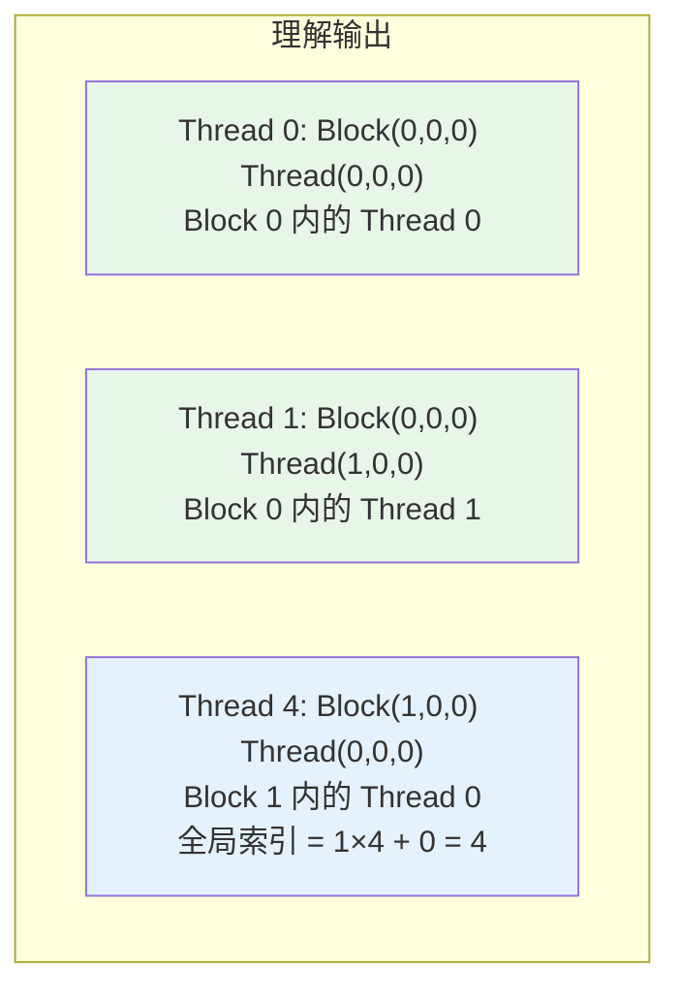

---

## 6. 实战：使用线程索引处理数组

### 6.1 向量加法示例

```cpp
// ========== 文件：vector_add.cu ==========
// 功能：使用线程索引实现向量加法 C = A + B

#include <cuda_runtime.h>
#include <stdio.h>

// ============================================================================
// 核函数：向量加法
// ============================================================================
// 参数：
//   a: 输入向量 A
//   b: 输入向量 B
//   c: 输出向量 C = A + B
//   n: 向量长度
// ============================================================================
__global__ void vector_add(const float *a, const float *b, float *c, int n) {
    // --------------------------------------------------------
    // 步骤 1：计算全局索引
    // 使用经典公式：idx = blockIdx.x * blockDim.x + threadIdx.x
    // --------------------------------------------------------
    int idx = blockIdx.x * blockDim.x + threadIdx.x;

    // --------------------------------------------------------
    // 步骤 2：边界检查
    // 重要！因为线程数可能超过元素数
    // 如果不检查，可能访问越界内存
    // --------------------------------------------------------
    if (idx < n) {
        // 执行加法：C[idx] = A[idx] + B[idx]
        c[idx] = a[idx] + b[idx];
    }
}

// ============================================================================
// 主函数
// ============================================================================
int main() {
    // --------------------------------------------------------
    // 配置参数
    // --------------------------------------------------------
    int n = 1000;                    // 向量长度
    size_t bytes = n * sizeof(float);  // 需要的字节数

    // --------------------------------------------------------
    // 分配主机内存（CPU）
    // malloc 在 CPU 内存中分配
    // --------------------------------------------------------
    float *h_a = (float*)malloc(bytes);  // 主机向量 A
    float *h_b = (float*)malloc(bytes);  // 主机向量 B
    float *h_c = (float*)malloc(bytes);  // 主机向量 C（结果）

    // --------------------------------------------------------
    // 初始化主机数据
    // --------------------------------------------------------
    for (int i = 0; i < n; i++) {
        h_a[i] = (float)i;       // A[i] = i
        h_b[i] = (float)(i * 2); // B[i] = 2*i
    }

    // --------------------------------------------------------
    // 分配设备内存（GPU）
    // cudaMalloc 在 GPU 显存中分配
    // 参数：指针的地址，字节数
    // --------------------------------------------------------
    float *d_a, *d_b, *d_c;  // 设备指针
    cudaMalloc(&d_a, bytes);  // 分配 GPU 内存给 A
    cudaMalloc(&d_b, bytes);  // 分配 GPU 内存给 B
    cudaMalloc(&d_c, bytes);  // 分配 GPU 内存给 C

    // --------------------------------------------------------
    // 数据传输：Host → Device
    // cudaMemcpy 类似于 memcpy，但用于 CPU 和 GPU 之间
    // cudaMemcpyHostToDevice 表示从 CPU 复制到 GPU
    // --------------------------------------------------------
    cudaMemcpy(d_a, h_a, bytes, cudaMemcpyHostToDevice);  // A: CPU → GPU
    cudaMemcpy(d_b, h_b, bytes, cudaMemcpyHostToDevice);  // B: CPU → GPU

    // --------------------------------------------------------
    // 配置线程层级
    // --------------------------------------------------------
    int threads_per_block = 256;  // 每个 Block 有 256 个线程（常用值）
    int blocks_per_grid = (n + threads_per_block - 1) / threads_per_block;  // 向上取整

    printf("向量长度: %d\n", n);
    printf("每个 Block 线程数: %d\n", threads_per_block);
    printf("Grid 中 Block 数: %d\n", blocks_per_grid);
    printf("总线程数: %d\n\n", blocks_per_grid * threads_per_block);

    // --------------------------------------------------------
    // 启动核函数
    // <<<blocks_per_grid, threads_per_block>>> 是执行配置
    // --------------------------------------------------------
    vector_add<<<blocks_per_grid, threads_per_block>>>(d_a, d_b, d_c, n);

    // --------------------------------------------------------
    // 等待 GPU 完成并检查错误
    // --------------------------------------------------------
    cudaError_t err = cudaDeviceSynchronize();
    if (err != cudaSuccess) {
        printf("CUDA 错误: %s\n", cudaGetErrorString(err));
        return -1;
    }

    // --------------------------------------------------------
    // 数据传输：Device → Host
    // cudaMemcpyDeviceToHost 表示从 GPU 复制到 CPU
    // --------------------------------------------------------
    cudaMemcpy(h_c, d_c, bytes, cudaMemcpyDeviceToHost);  // C: GPU → CPU

    // --------------------------------------------------------
    // 验证结果
    // --------------------------------------------------------
    printf("验证结果（前 10 个元素）：\n");
    printf("%-10s %-10s %-10s %-10s\n", "索引", "A[i]", "B[i]", "C[i]=A+B");
    printf("%-10s %-10s %-10s %-10s\n", "----", "----", "----", "------");

    bool correct = true;
    for (int i = 0; i < n; i++) {
        float expected = h_a[i] + h_b[i];  // 期望结果
        if (fabs(h_c[i] - expected) > 1e-5) {  // 比较浮点数
            correct = false;
            printf("错误！索引 %d: 期望 %.1f，实际 %.1f\n", i, expected, h_c[i]);
        }

        // 打印前 10 个元素
        if (i < 10) {
            printf("%-10d %-10.1f %-10.1f %-10.1f\n", i, h_a[i], h_b[i], h_c[i]);
        }
    }

    if (correct) {
        printf("\n结果正确！\n");
    }

    // --------------------------------------------------------
    // 释放内存
    // 记得先释放 GPU 内存，再释放 CPU 内存
    // --------------------------------------------------------
    cudaFree(d_a);  // 释放 GPU 内存
    cudaFree(d_b);
    cudaFree(d_c);
    free(h_a);      // 释放 CPU 内存
    free(h_b);
    free(h_c);

    return 0;
}
```

### 6.2 Block 数量计算

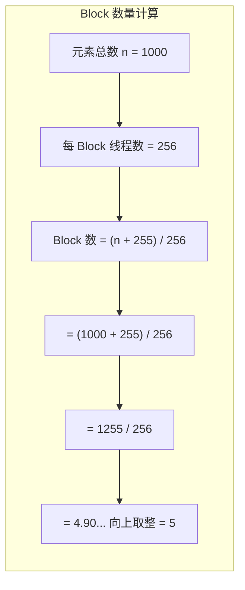

**为什么要向上取整？**

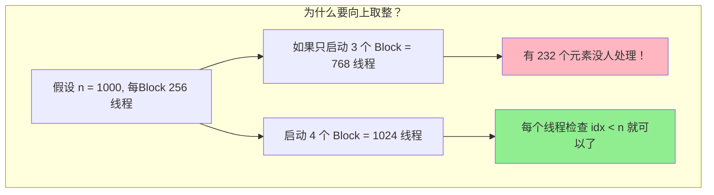

**整数向上取整技巧**：

```cpp
// 方法 1：使用整数除法（推荐）
int blocks = (n + threads_per_block - 1) / threads_per_block;

// 方法 2：使用 ceil 函数
int blocks = (int)ceil((float)n / threads_per_block);

// 为什么方法 1 更好？
// - 不需要类型转换
// - 纯整数运算，效率更高
// - 不会引入浮点精度问题
```

---

## 7. 常见错误与解决方法

### 7.1 错误一：忘记边界检查

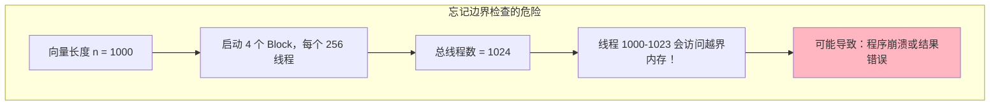

**错误代码**：

```cpp
// 错误示例：没有边界检查
__global__ void vector_add_wrong(float *a, float *b, float *c, int n) {
    int idx = blockIdx.x * blockDim.x + threadIdx.x;
    // 危险！如果 idx >= n，会访问越界内存
    c[idx] = a[idx] + b[idx];
}
```

**正确代码**：

```cpp
// 正确示例：有边界检查
__global__ void vector_add_correct(float *a, float *b, float *c, int n) {
    int idx = blockIdx.x * blockDim.x + threadIdx.x;
    // 安全：只有合法索引才访问内存
    if (idx < n) {
        c[idx] = a[idx] + b[idx];
    }
}
```

### 7.2 错误二：Block 大小不是 32 的倍数

```mermaid
graph TB
    subgraph 问题分析["Block 大小问题"]
        A["Warp 大小 = 32"]
        B["如果 Block 大小 = 100"]
        C["100 / 32 = 3 余 4"]
        D["最后一个 Warp 只有 4 个活跃线程"]
        E["其余 28 个线程空闲，浪费资源！"]
    end

    A --> B --> C --> D --> E

    style E fill:#FFB6C1
```

**建议**：

```cpp
// 不推荐：Block 大小不是 32 的倍数
dim3 block(100);  // 最后一个 Warp 只有 4 个线程

// 推荐：Block 大小是 32 的倍数
dim3 block(128);  // 4 个完整的 Warp
dim3 block(256);  // 8 个完整的 Warp
```

### 7.3 错误三：Block 线程数超过限制

```mermaid
graph TB
    subgraph 限制说明["Block 线程数限制"]
        A["每个 Block 最多 1024 个线程"]
        B["超过限制会导致启动失败"]
    end

    A --> B

    style B fill:#FFB6C1
```

**错误代码**：

```cpp
// 错误：超过限制
dim3 block(33, 33, 1);  // 33 × 33 = 1089 > 1024
kernel<<<grid, block>>>();  // 启动失败！
```

**正确做法**：

```cpp
// 正确：检查限制
dim3 block(32, 32, 1);  // 32 × 32 = 1024 <= 1024
kernel<<<grid, block>>>();  // OK

// 或者使用一维
dim3 block(1024);  // 正好 1024
kernel<<<grid, block>>>();  // OK
```

### 7.4 错误四：混淆 blockIdx 和 threadIdx

```cpp
// 错误：混淆了 blockIdx 和 threadIdx
__global__ void wrong_kernel(float *data, int n) {
    // 错误：把 blockIdx 当成了线程索引
    int idx = threadIdx.x * blockDim.x + blockIdx.x;  // 顺序反了！
    if (idx < n) {
        data[idx] = 0;
    }
}

// 正确：
__global__ void correct_kernel(float *data, int n) {
    int idx = blockIdx.x * blockDim.x + threadIdx.x;  // 正确顺序
    if (idx < n) {
        data[idx] = 0;
    }
}
```

**记忆技巧**：

```
Block 的索引 × Block 的大小 + Thread 的索引
blockIdx  ×  blockDim   +  threadIdx
大的在前面！
```

### 7.5 错误五：忘记同步

```cpp
// 错误示例：使用共享内存但没有同步
__global__ void wrong_shared(float *data) {
    __shared__ float shared_data[256];

    int idx = threadIdx.x;
    shared_data[idx] = data[idx];  // 写入共享内存

    // 错误！没有同步，其他线程可能还没写完
    float val = shared_data[255 - idx];  // 可能读到错误数据
    data[idx] = val;
}

// 正确示例：使用 __syncthreads() 同步
__global__ void correct_shared(float *data) {
    __shared__ float shared_data[256];

    int idx = threadIdx.x;
    shared_data[idx] = data[idx];  // 写入共享内存

    __syncthreads();  // 等待所有线程完成写入

    // 安全：所有线程都已完成写入
    float val = shared_data[255 - idx];
    data[idx] = val;
}
```

---

## 8. 内置变量速查表

### 8.1 索引相关变量

| 变量 | 类型 | 说明 | 示例值 |
|------|------|------|--------|
| `threadIdx` | uint3 | 线程在 Block 内的索引 | (0, 0, 0) |
| `blockIdx` | uint3 | Block 在 Grid 内的索引 | (0, 0, 0) |
| `blockDim` | dim3 | Block 的维度（线程数） | (256, 1, 1) |
| `gridDim` | dim3 | Grid 的维度（Block 数） | (10, 1, 1) |

### 8.2 维度访问方式

```cpp
// 一维访问
int tx = threadIdx.x;
int bx = blockIdx.x;
int bdim = blockDim.x;
int gdim = gridDim.x;

// 二维访问
int tx = threadIdx.x;  int ty = threadIdx.y;
int bx = blockIdx.x;   int by = blockIdx.y;
int bdimx = blockDim.x; int bdimy = blockDim.y;

// 三维访问
int tx = threadIdx.x;  int ty = threadIdx.y;  int tz = threadIdx.z;
int bx = blockIdx.x;   int by = blockIdx.y;   int bz = blockIdx.z;
```

### 8.3 dim3 类型

```cpp
// dim3 是 CUDA 内置的三维向量类型
dim3 v;              // 默认构造：(1, 1, 1)
dim3 v(10);          // 简化构造：(10, 1, 1)
dim3 v(10, 20);      // 简化构造：(10, 20, 1)
dim3 v(10, 20, 30);  // 完整构造：(10, 20, 30)

// 访问成员
int x = v.x;
int y = v.y;
int z = v.z;
```

---

## 9. 本章小结

### 9.1 知识图谱

```mermaid
mindmap
  root((线程层级结构))
    三级结构
      Grid 一次 Kernel 启动
      Block 线程组 可同步
      Thread 最小执行单位
    硬件映射
      Grid 映射到 GPU
      Block 映射到 SM
      Thread 映射到 CUDA Core
    索引计算
      一维 idx = blockIdx.x × blockDim.x + threadIdx.x
      二维 row 和 col 分别计算
      三维 x y z 分别计算
    常见错误
      忘记边界检查
      Block 大小不当
      混淆索引变量
```

### 9.2 核心要点

1. **三级结构对应硬件**：Grid→GPU, Block→SM, Thread→Core
2. **索引公式是关键**：`idx = blockIdx.x × blockDim.x + threadIdx.x`
3. **Block 内可协作**：共享内存、同步
4. **Block 间独立**：不能同步，执行顺序不确定
5. **边界检查很重要**：避免内存越界

### 9.3 思考题

1. 为什么 CUDA 要设计成三级线程结构，而不是一级或两级？
2. 假设 Grid 有 5 个 Block，每个 Block 有 128 个线程，Block 2 的 Thread 64 的全局索引是多少？
3. 为什么 Block 内的线程可以同步，而 Block 之间不能？
4. 如果 Block 大小设为 100，会有什么问题？

---

## 下一章

[第五章：第一个 CUDA 程序](./05_第一个CUDA程序.md) - 编写、编译并运行你的第一个完整 CUDA 程序

---

*参考资料：[CUDA C++ Programming Guide](https://docs.nvidia.com/cuda/cuda-c-programming-guide/)*