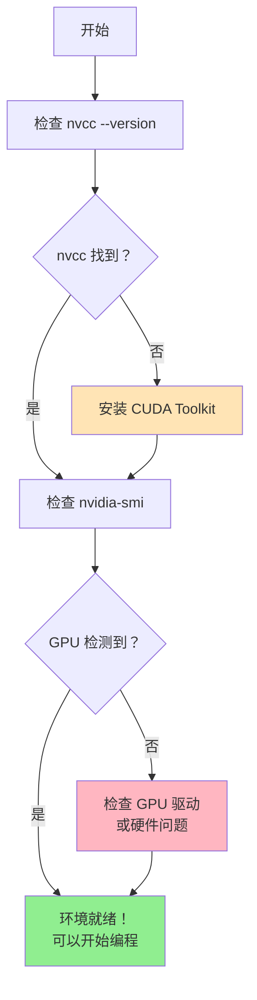
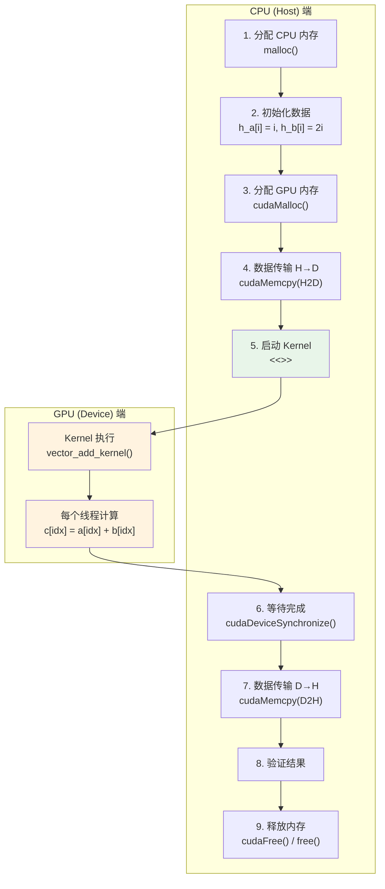
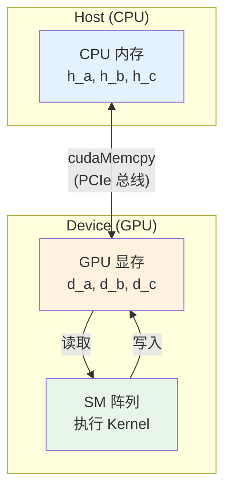
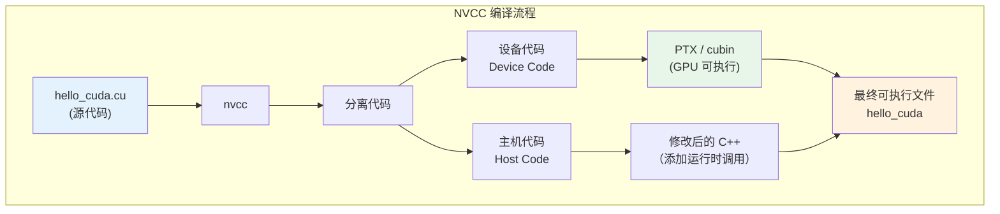
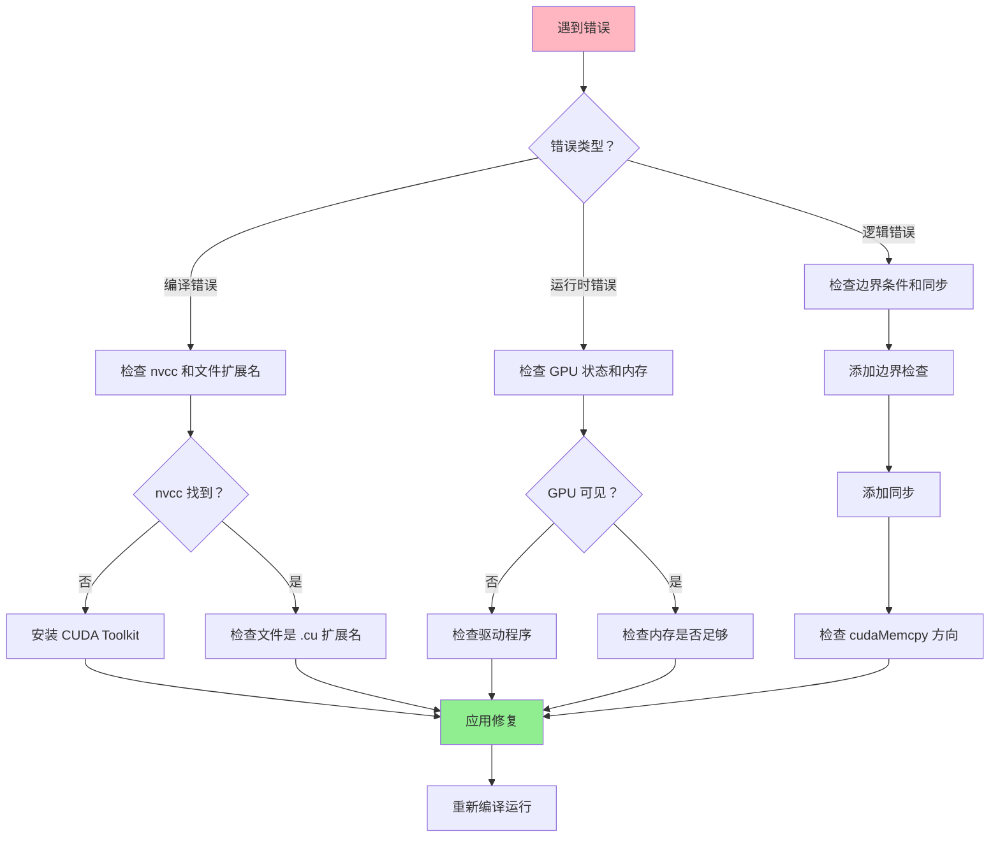
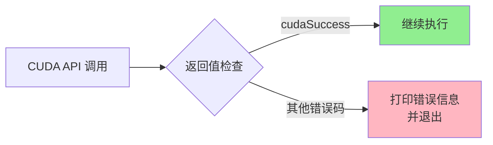
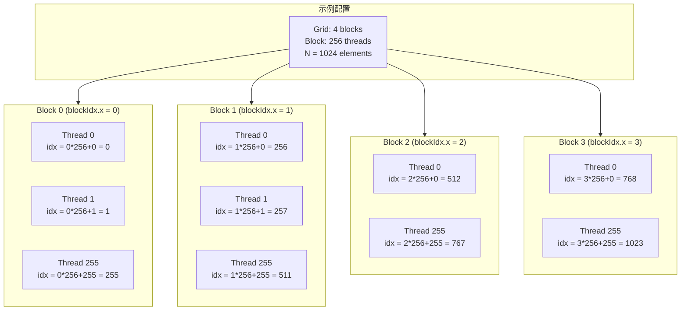
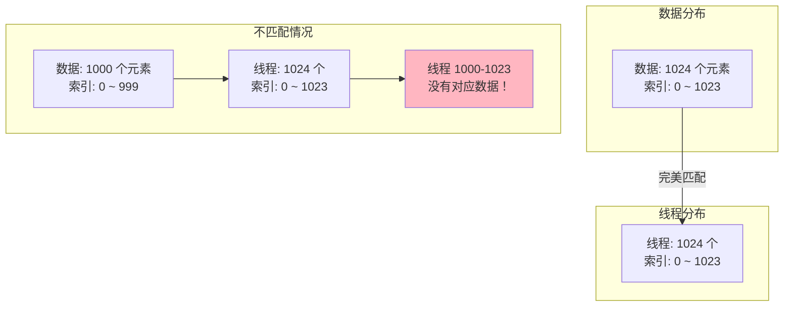
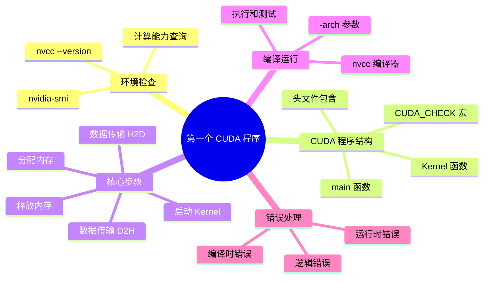

# 第五章：第一个 CUDA 程序

> 学习目标：编写、编译并运行你的第一个完整 CUDA 程序
>
> 预计阅读时间：30 分钟
>
> 前置知识：[第三章：GPU 硬件架构入门](./03_GPU硬件架构入门.md)

---

## 1. 环境检查：确认 CUDA 已安装

在开始编写代码之前，我们需要确认 CUDA 工具包已经正确安装在您的系统上。

### 1.1 检查 CUDA 编译器（nvcc）

```bash
# 检查 nvcc 是否安装
nvcc --version
```

**预期输出示例**：

```
nvcc: NVIDIA (R) Cuda compiler driver
Copyright (c) 2005-2024 NVIDIA Corporation
Build cuda_12.4.r12.4/compiler.34097995_0

Cuda compilation tools, release 12.4, V12.4.131
Build cuda_12.4.r12.4/compiler.34097995_0
```

### 1.2 检查 GPU 设备

```bash
# 检查 GPU 信息
nvidia-smi
```

**预期输出示例**：

```
+-----------------------------------------------------------------------------------------+
| NVIDIA-SMI 550.54.15              Driver Version: 550.54.15      CUDA Version: 12.4     |
|-----------------------------------------+------------------------+----------------------+
| GPU  Name                 Persistence-M | Bus-Id          Disp.A | Volatile Uncorr. ECC |
| Fan  Temp   Perf          Pwr:Usage/Cap |           Memory-Usage | GPU-Util  Compute M. |
|                                         |                        |               MIG M. |
|=========================================+========================+======================|
|   0  NVIDIA GeForce RTX 3090        Off |   00000000:01:00.0  On |                  N/A |
| 30%   45C    P8             25W / 350W |     888MiB /  24576MiB |      5%      Default |
|                                         |                        |                  N/A |
+-----------------------------------------+------------------------+----------------------+
```

### 1.3 查看详细的 GPU 信息

```bash
# 查看计算能力
nvidia-smi --query-gpu=name,compute_cap,memory.total --format=csv
```

**预期输出示例**：

```
name, compute_cap, memory.total
NVIDIA GeForce RTX 3090, 8.6, 24576 MiB
```

### 1.4 环境检查流程图



### 1.5 如果环境未就绪

| 问题 | 解决方案 |
|------|----------|
| `nvcc: command not found` | 安装 CUDA Toolkit：<https://developer.nvidia.com/cuda-downloads> |
| `NVIDIA-SMI has failed` | 安装或更新 NVIDIA 驱动程序 |
| 没有检测到 GPU | 确认系统有 NVIDIA GPU，或检查硬件连接 |

---

## 2. 第一个完整 CUDA 程序

现在让我们编写一个完整的 CUDA 程序，它将展示 CUDA 编程的核心流程。

### 2.1 完整代码

```cpp
// ============================================================
// 文件名：hello_cuda.cu
// 功能：第一个完整的 CUDA 程序
// 编译命令：nvcc -o hello_cuda hello_cuda.cu
// 运行命令：./hello_cuda
// ============================================================

// ------------------------------------------------
// 头文件包含
// ------------------------------------------------
#include <cuda_runtime.h>    // CUDA 运行时 API，提供 cudaMalloc、cudaMemcpy 等函数
#include <stdio.h>           // 标准输入输出，用于 printf
#include <stdlib.h>          // 标准库，用于 malloc、free 等

// ------------------------------------------------
// CUDA 错误检查宏
// 用法：CUDA_CHECK(cudaMalloc(...));
// 功能：当 CUDA API 调用失败时，打印错误信息并退出程序
// ------------------------------------------------
#define CUDA_CHECK(call)                                                      \
    do {                                                                       \
        /* 执行 CUDA API 调用，获取返回状态码 */                               \
        cudaError_t err = call;                                               \
        /* 检查是否成功，cudaSuccess 表示成功 */                               \
        if (err != cudaSuccess) {                                             \
            /* 打印详细错误信息 */                                             \
            fprintf(stderr, "CUDA 错误 at %s:%d - %s\n",                      \
                    __FILE__,        /* 错误发生的源文件名 */                   \
                    __LINE__,        /* 错误发生的行号 */                       \
                    cudaGetErrorString(err));  /* 人类可读的错误描述 */         \
            /* 退出程序，返回错误码 */                                         \
            exit(EXIT_FAILURE);                                               \
        }                                                                      \
    } while (0)  /* do-while(0) 确保宏在使用时可以安全加分号 */

// ------------------------------------------------
// Kernel 函数：向量加法
// ------------------------------------------------
// __global__ 修饰符表示这是一个核函数：
//   - 由 CPU（Host）调用
//   - 在 GPU（Device）上执行
//   - 被成千上万个线程并行执行
// ------------------------------------------------
__global__ void vector_add_kernel(
    const float *a,    // 输入向量 a，const 表示只读
    const float *b,    // 输入向量 b，const 表示只读
    float *c,          // 输出向量 c = a + b
    int n              // 向量长度（元素个数）
) {
    // ------------------------------------------------
    // 步骤 1：计算当前线程负责处理的全局索引
    // ------------------------------------------------
    // blockIdx.x：当前 Block 在 Grid 中的索引（0, 1, 2, ...）
    // blockDim.x：每个 Block 包含的线程数量
    // threadIdx.x：当前线程在 Block 内的索引（0, 1, 2, ...）
    // 全局索引 = Block索引 * Block大小 + 线程索引
    // ------------------------------------------------
    int idx = blockIdx.x * blockDim.x + threadIdx.x;

    // ------------------------------------------------
    // 步骤 2：边界检查
    // ------------------------------------------------
    // 为什么需要边界检查？
    //   - 假设向量有 100 个元素，Block 大小是 32
    //   - 我们启动 4 个 Block（128 个线程）
    //   - 线程 100-127 没有对应的数据，需要跳过
    // 不做边界检查会导致数组越界访问，产生未定义行为
    // ------------------------------------------------
    if (idx < n) {
        // ------------------------------------------------
        // 步骤 3：执行加法运算
        // ------------------------------------------------
        // 每个线程独立地处理一个数据元素
        // 所有线程同时执行这行代码（SIMT 模式）
        // ------------------------------------------------
        c[idx] = a[idx] + b[idx];
    }
    // 函数结束，线程完成任务
    // 注意：核函数返回值必须是 void
}

// ------------------------------------------------
// 主函数：CPU 端程序入口
// ------------------------------------------------
int main() {
    // ============================================
    // 第一阶段：准备数据（在 CPU 上）
    // ============================================

    // ------------------------------------------------
    // 定义向量长度
    // ------------------------------------------------
    const int N = 1024;  // 向量有 1024 个元素
    // 计算字节大小：元素个数 × 每个元素的大小（float 是 4 字节）
    const size_t bytes = N * sizeof(float);

    // ------------------------------------------------
    // 在 CPU 内存（Host Memory）中分配空间
    // ------------------------------------------------
    // malloc 分配的是 CPU 可以访问的普通内存
    float *h_a = (float *)malloc(bytes);  // 输入向量 a
    float *h_b = (float *)malloc(bytes);  // 输入向量 b
    float *h_c = (float *)malloc(bytes);  // 输出向量 c（用于存储 GPU 计算结果）

    // ------------------------------------------------
    // 检查 CPU 内存分配是否成功
    // ------------------------------------------------
    if (h_a == NULL || h_b == NULL || h_c == NULL) {
        fprintf(stderr, "CPU 内存分配失败！\n");
        return EXIT_FAILURE;
    }

    // ------------------------------------------------
    // 初始化输入数据
    // ------------------------------------------------
    // 我们让 a[i] = i，b[i] = i * 2
    // 预期结果：c[i] = i + i*2 = i * 3
    // ------------------------------------------------
    for (int i = 0; i < N; i++) {
        h_a[i] = (float)i;        // a[i] = 0, 1, 2, 3, ...
        h_b[i] = (float)(i * 2);  // b[i] = 0, 2, 4, 6, ...
    }
    // h_c 目前是未初始化的，将由 GPU 填充结果

    printf("=== 第一个 CUDA 程序 ===\n");
    printf("向量长度: %d 元素\n", N);
    printf("数据大小: %zu 字节\n", bytes);

    // ============================================
    // 第二阶段：分配 GPU 内存
    // ============================================

    // ------------------------------------------------
    // 定义 GPU 内存指针
    // ------------------------------------------------
    float *d_a = NULL;  // GPU 端向量 a
    float *d_b = NULL;  // GPU 端向量 b
    float *d_c = NULL;  // GPU 端向量 c

    // ------------------------------------------------
    // 在 GPU 显存（Device Memory）中分配空间
    // ------------------------------------------------
    // cudaMalloc 的参数：
    //   参数1：指针的地址（void **类型）
    //   参数2：要分配的字节数
    // 返回值：cudaSuccess 表示成功
    // ------------------------------------------------
    // 注意：这里使用我们定义的 CUDA_CHECK 宏进行错误检查
    // ------------------------------------------------
    CUDA_CHECK(cudaMalloc(&d_a, bytes));  // 为向量 a 分配 GPU 内存
    CUDA_CHECK(cudaMalloc(&d_b, bytes));  // 为向量 b 分配 GPU 内存
    CUDA_CHECK(cudaMalloc(&d_c, bytes));  // 为向量 c 分配 GPU 内存

    printf("[OK] GPU 内存分配成功\n");

    // ============================================
    // 第三阶段：数据传输（CPU -> GPU）
    // ============================================

    // ------------------------------------------------
    // 将数据从 CPU 内存复制到 GPU 显存
    // ------------------------------------------------
    // cudaMemcpy 的参数：
    //   参数1：目标地址（这里是 GPU 地址）
    //   参数2：源地址（这里是 CPU 地址）
    //   参数3：要复制的字节数
    //   参数4：复制方向
    // cudaMemcpyHostToDevice：从 CPU（Host）复制到 GPU（Device）
    // ------------------------------------------------
    CUDA_CHECK(cudaMemcpy(d_a, h_a, bytes, cudaMemcpyHostToDevice));
    CUDA_CHECK(cudaMemcpy(d_b, h_b, bytes, cudaMemcpyHostToDevice));

    printf("[OK] 数据已传输到 GPU\n");

    // ============================================
    // 第四阶段：启动 Kernel（在 GPU 上执行）
    // ============================================

    // ------------------------------------------------
    // 配置线程网格（Grid）和线程块（Block）
    // ------------------------------------------------
    // CUDA 使用三级结构组织线程：Grid -> Block -> Thread
    // Grid 是 Block 的集合，Block 是 Thread 的集合
    // ------------------------------------------------
    int threads_per_block = 256;  // 每个 Block 包含 256 个线程
    // 计算 Block 数量：向上取整确保所有数据都被处理
    // 公式：(N + threads_per_block - 1) / threads_per_block
    // 这等价于 ceil(N / threads_per_block)
    int blocks_per_grid = (N + threads_per_block - 1) / threads_per_block;

    printf("[启动 Kernel] Grid 大小: %d blocks, Block 大小: %d threads\n",
           blocks_per_grid, threads_per_block);
    printf("[启动 Kernel] 总线程数: %d\n", blocks_per_grid * threads_per_block);

    // ------------------------------------------------
    // 调用核函数
    // ------------------------------------------------
    // 核函数调用语法：kernel<<<grid, block>>>(参数...)
    // <<<blocks_per_grid, threads_per_block>>> 是执行配置：
    //   - blocks_per_grid：Grid 中 Block 的数量
    //   - threads_per_block：每个 Block 中 Thread 的数量
    // 这是 CUDA 特有的语法，告诉 GPU 如何组织线程
    // ------------------------------------------------
    vector_add_kernel<<<blocks_per_grid, threads_per_block>>>(
        d_a,    // GPU 端向量 a
        d_b,    // GPU 端向量 b
        d_c,    // GPU 端向量 c（输出）
        N       // 向量长度
    );

    // ------------------------------------------------
    // 检查核函数启动是否成功
    // ------------------------------------------------
    // cudaGetLastError() 返回最近一次 CUDA 调用的错误
    // 核函数启动是异步的，这个检查只验证启动参数是否正确
    // ------------------------------------------------
    CUDA_CHECK(cudaGetLastError());

    // ------------------------------------------------
    // 等待 GPU 执行完成
    // ------------------------------------------------
    // cudaDeviceSynchronize() 阻塞 CPU，直到 GPU 完成所有任务
    // 核函数启动是异步的，CPU 会立即继续执行
    // 如果不等待，后续的 cudaMemcpy 可能读到不完整的数据
    // ------------------------------------------------
    CUDA_CHECK(cudaDeviceSynchronize());

    printf("[OK] Kernel 执行完成\n");

    // ============================================
    // 第五阶段：数据传输（GPU -> CPU）
    // ============================================

    // ------------------------------------------------
    // 将计算结果从 GPU 复制回 CPU
    // ------------------------------------------------
    // cudaMemcpyDeviceToHost：从 GPU（Device）复制到 CPU（Host）
    // ------------------------------------------------
    CUDA_CHECK(cudaMemcpy(h_c, d_c, bytes, cudaMemcpyDeviceToHost));

    printf("[OK] 结果已传输回 CPU\n");

    // ============================================
    // 第六阶段：验证结果
    // ============================================

    printf("\n=== 结果验证 ===\n");

    // ------------------------------------------------
    // 检查计算结果是否正确
    // ------------------------------------------------
    int errors = 0;
    for (int i = 0; i < N; i++) {
        // 预期：c[i] = a[i] + b[i] = i + i*2 = i*3
        float expected = h_a[i] + h_b[i];
        float actual = h_c[i];

        // 由于浮点数精度问题，使用小量误差容忍
        if (fabs(expected - actual) > 1e-5) {
            if (errors < 5) {  // 只打印前 5 个错误
                printf("[错误] 索引 %d: 预期 %.1f, 实际 %.1f\n",
                       i, expected, actual);
            }
            errors++;
        }
    }

    // ------------------------------------------------
    // 打印一些示例数据
    // ------------------------------------------------
    printf("\n示例数据（前 5 个元素）:\n");
    printf("索引 |   a[i]  |   b[i]  |   c[i]  |  预期值\n");
    printf("-----|---------|---------|---------|--------\n");
    for (int i = 0; i < 5; i++) {
        printf("%4d | %7.1f | %7.1f | %7.1f | %7.1f\n",
               i, h_a[i], h_b[i], h_c[i], h_a[i] + h_b[i]);
    }

    // ------------------------------------------------
    // 打印最终结果
    // ------------------------------------------------
    if (errors == 0) {
        printf("\n[成功] 所有 %d 个元素计算正确！\n", N);
    } else {
        printf("\n[失败] 发现 %d 个错误！\n", errors);
    }

    // ============================================
    // 第七阶段：清理资源
    // ============================================

    // ------------------------------------------------
    // 释放 GPU 显存
    // ------------------------------------------------
    // cudaFree 释放 cudaMalloc 分配的 GPU 内存
    // ------------------------------------------------
    CUDA_CHECK(cudaFree(d_a));
    CUDA_CHECK(cudaFree(d_b));
    CUDA_CHECK(cudaFree(d_c));

    printf("[OK] GPU 内存已释放\n");

    // ------------------------------------------------
    // 释放 CPU 内存
    // ------------------------------------------------
    free(h_a);
    free(h_b);
    free(h_c);

    printf("[OK] CPU 内存已释放\n");

    // ------------------------------------------------
    // 程序结束
    // ------------------------------------------------
    printf("\n=== 程序执行完毕 ===\n");

    return (errors == 0) ? EXIT_SUCCESS : EXIT_FAILURE;
}
```

### 2.2 程序执行流程图



### 2.3 CUDA 内存模型图



---

## 3. 编译和运行

### 3.1 创建源文件

首先，创建源代码文件：

```bash
# 进入工作目录（可根据需要修改）
cd ~/cuda_learning

# 创建源文件（将上面的代码保存为 hello_cuda.cu）
# 可以使用任何文本编辑器，如 vim、nano 或 VS Code
vim hello_cuda.cu
```

### 3.2 编译程序

使用 NVIDIA CUDA 编译器 `nvcc` 编译：

```bash
# 基本编译
nvcc -o hello_cuda hello_cuda.cu

# 带调试信息的编译（用于调试）
nvcc -g -G -o hello_cuda_debug hello_cuda.cu

# 指定 GPU 架构的编译（优化性能）
# 例如 RTX 3090 的计算能力是 8.6
nvcc -arch=sm_86 -o hello_cuda hello_cuda.cu

# 常见 GPU 架构参数：
# sm_70 - V100
# sm_75 - RTX 2080, T4
# sm_80 - A100
# sm_86 - RTX 3090
# sm_89 - RTX 4090
# sm_90 - H100
```

#### NVCC 编译流程详解

> **官方文档说明**（来自 CUDA C++ Programming Guide 12.2.1）：
>
> `nvcc` 是一个编译器驱动程序，它简化了编译 C++ 或 PTX 代码的过程。`nvcc` 的基本工作流程包括：
>
> 1. 将设备代码与主机代码分离
> 2. 将设备代码编译为 PTX 汇编或 cubin 二进制
> 3. 修改主机代码，将 `<<<...>>>` 语法替换为运行时函数调用



#### 计算能力与架构参数

| GPU 架构 | 计算能力 | nvcc 参数 | 代表 GPU |
|----------|----------|-----------|----------|
| **Kepler** | 3.0, 3.5 | sm_30, sm_35 | K40, K80 |
| **Maxwell** | 5.0, 5.2 | sm_50, sm_52 | GTX 980, M40 |
| **Pascal** | 6.0, 6.1 | sm_60, sm_61 | P100, GTX 1080 |
| **Volta** | 7.0 | sm_70 | V100 |
| **Turing** | 7.5 | sm_75 | RTX 2080, T4 |
| **Ampere** | 8.0, 8.6 | sm_80, sm_86 | A100, RTX 3090 |
| **Ada Lovelace** | 8.9 | sm_89 | RTX 4090 |
| **Hopper** | 9.0 | sm_90 | H100 |

> **重要**：二进制代码是架构特定的。为计算能力 X.y 生成的 cubin 对象只能在计算能力 X.z（其中 z≥y）的设备上执行。

#### 多架构编译

为了确保应用程序能在不同 GPU 上运行，可以生成多架构支持：

```bash
# 生成多架构支持的二进制文件
nvcc -gencode arch=compute_70,code=sm_70 \
      -gencode arch=compute_80,code=sm_80 \
      -gencode arch=compute_86,code=sm_86 \
      -o hello_cuda hello_cuda.cu
```

这会生成：
- sm_70 二进制：在计算能力 7.0 和 7.5 的设备上运行
- sm_80 二进制：在计算能力 8.0 的设备上运行
- sm_86 二进制：在计算能力 8.6 的设备上运行

### 3.3 运行程序

```bash
# 运行编译好的程序
./hello_cuda
```

### 3.4 预期输出

```
=== 第一个 CUDA 程序 ===
向量长度: 1024 元素
数据大小: 4096 字节
[OK] GPU 内存分配成功
[OK] 数据已传输到 GPU
[启动 Kernel] Grid 大小: 4 blocks, Block 大小: 256 threads
[启动 Kernel] 总线程数: 1024
[OK] Kernel 执行完成
[OK] 结果已传输回 CPU

=== 结果验证 ===

示例数据（前 5 个元素）:
索引 |   a[i]  |   b[i]  |   c[i]  |  预期值
-----|---------|---------|---------|--------
   0 |     0.0 |     0.0 |     0.0 |     0.0
   1 |     1.0 |     2.0 |     3.0 |     3.0
   2 |     2.0 |     4.0 |     6.0 |     6.0
   3 |     3.0 |     6.0 |     9.0 |     9.0
   4 |     4.0 |     8.0 |    12.0 |    12.0

[成功] 所有 1024 个元素计算正确！
[OK] GPU 内存已释放
[OK] CPU 内存已释放

=== 程序执行完毕 ===
```

### 3.5 编译流程图


---

## 4. 常见错误和故障排除

### 4.1 编译时错误

#### 错误 1：`nvcc: command not found`

**原因**：CUDA Toolkit 未安装或未添加到 PATH

**解决方案**：

```bash
# 检查 CUDA 安装路径
ls /usr/local/cuda*/bin/nvcc

# 临时添加到 PATH（每次需要重新执行）
export PATH=/usr/local/cuda/bin:$PATH
export LD_LIBRARY_PATH=/usr/local/cuda/lib64:$LD_LIBRARY_PATH

# 永久添加（添加到 ~/.bashrc 或 ~/.zshrc）
echo 'export PATH=/usr/local/cuda/bin:$PATH' >> ~/.bashrc
echo 'export LD_LIBRARY_PATH=/usr/local/cuda/lib64:$LD_LIBRARY_PATH' >> ~/.bashrc
source ~/.bashrc
```

#### 错误 2：`error: identifier "threadIdx" is undefined`

**原因**：文件扩展名不是 `.cu`，编译器未识别为 CUDA 代码

**解决方案**：

```bash
# 确保文件扩展名是 .cu
mv hello_cuda.cpp hello_cuda.cu
nvcc -o hello_cuda hello_cuda.cu
```

#### 错误 3：`fatal error: cuda_runtime.h: No such file or directory`

**原因**：CUDA 头文件路径未正确设置

**解决方案**：

```bash
# 检查 CUDA 安装
ls /usr/local/cuda/include/cuda_runtime.h

# 如果不存在，重新安装 CUDA Toolkit
```

### 4.2 运行时错误

#### 错误 4：`CUDA 错误: out of memory`

**原因**：GPU 显存不足

**解决方案**：

```cpp
// 减小数据规模
const int N = 1024;  // 而不是 1024 * 1024 * 1024

// 或者在程序开始时释放 GPU 缓存
cudaDeviceReset();
```

#### 错误 5：`CUDA 错误: invalid device function`

**原因**：编译时的架构参数与实际 GPU 不匹配

**解决方案**：

```bash
# 查看 GPU 计算能力
nvidia-smi --query-gpu=compute_cap --format=csv

# 使用正确的架构参数重新编译
# 例如 RTX 3090 是 sm_86
nvcc -arch=sm_86 -o hello_cuda hello_cuda.cu
```

#### 错误 6：`CUDA 错误: no kernel image is available for execution on the device`

**原因**：编译时未指定或指定了错误的 GPU 架构

**解决方案**：

```bash
# 方法 1：使用通用编译（可能性能较优）
nvcc -arch=sm_86 -o hello_cuda hello_cuda.cu

# 方法 2：生成多架构支持
nvcc -gencode arch=compute_70,code=sm_70 \
      -gencode arch=compute_80,code=sm_80 \
      -gencode arch=compute_86,code=sm_86 \
      -o hello_cuda hello_cuda.cu
```

### 4.3 逻辑错误

#### 错误 7：结果不正确或随机值

**原因**：忘记同步或边界检查

**检查清单**：

```cpp
// 1. 确保有边界检查
if (idx < n) {
    c[idx] = a[idx] + b[idx];
}

// 2. 确保 Kernel 后有同步
cudaDeviceSynchronize();

// 3. 确保复制方向正确
cudaMemcpy(h_c, d_c, bytes, cudaMemcpyDeviceToHost);  // GPU -> CPU
```

#### 错误 8：程序卡住不返回

**原因**：GPU 执行错误或死锁

**解决方案**：

```bash
# 检查 GPU 状态
nvidia-smi

# 重置 GPU（谨慎使用，会影响其他程序）
sudo nvidia-smi --gpu-reset
```

### 4.4 错误排除流程图



### 4.5 常见错误速查表

| 错误信息 | 可能原因 | 解决方案 |
|----------|----------|----------|
| `nvcc: command not found` | CUDA 未安装或未添加 PATH | 安装 CUDA 或配置环境变量 |
| `out of memory` | GPU 显存不足 | 减小数据规模 |
| `invalid device function` | 架构不匹配 | 使用正确 `-arch` 参数 |
| `unspecified launch failure` | GPU 执行异常 | 检查核函数代码 |
| `invalid argument` | 参数错误 | 检查 API 参数 |

---

## 5. 代码详解：关键概念

### 5.1 CUDA_CHECK 宏详解

```cpp
#define CUDA_CHECK(call)                                    \
    do {                                                     \
        cudaError_t err = call;                             \
        if (err != cudaSuccess) {                           \
            fprintf(stderr, "CUDA 错误 at %s:%d - %s\n",    \
                    __FILE__, __LINE__,                     \
                    cudaGetErrorString(err));               \
            exit(EXIT_FAILURE);                             \
        }                                                    \
    } while (0)
```

**为什么要使用错误检查？**



**常见错误码**：

| 错误码 | 含义 |
|--------|------|
| `cudaSuccess` | 操作成功 |
| `cudaErrorInvalidValue` | 参数无效 |
| `cudaErrorMemoryAllocation` | 内存分配失败 |
| `cudaErrorInvalidDevice` | 无效设备 |

### 5.2 线程索引计算详解



### 5.3 边界检查的必要性



---

## 6. 本章小结

### 6.1 知识图谱



### 6.2 CUDA 程序标准流程

1. **准备数据** - 在 CPU 上分配和初始化数据
2. **分配 GPU 内存** - 使用 `cudaMalloc`
3. **数据传输 H→D** - 使用 `cudaMemcpy(HostToDevice)`
4. **启动 Kernel** - 使用 `<<<grid, block>>>` 语法
5. **等待完成** - 使用 `cudaDeviceSynchronize`
6. **数据传输 D→H** - 使用 `cudaMemcpy(DeviceToHost)`
7. **验证结果** - 检查计算是否正确
8. **释放内存** - 使用 `cudaFree` 和 `free`

### 6.3 思考题

1. 为什么需要在 Kernel 调用后使用 `cudaDeviceSynchronize()`？
2. 如果把 `threads_per_block` 设为 128，`blocks_per_grid` 会变成多少？
3. `cudaMemcpy` 的方向参数有哪些？各表示什么含义？

---

## 下一章

[第六章：CUDA 内存管理基础](./06_内存管理基础.md) - 掌握 CUDA 内存管理核心函数

---

*参考资料：[CUDA C++ Programming Guide](https://docs.nvidia.com/cuda/cuda-c-programming-guide/) | [CUDA Best Practices Guide](https://docs.nvidia.com/cuda/cuda-c-best-practices-guide/)*
