# 第六章：CUDA 内存管理基础

> 学习目标：掌握 CUDA 内存管理核心函数，理解 Host 与 Device 之间的数据传输机制
>
> 预计阅读时间：30 分钟
>
> 前置知识：[第三章：GPU 硬件架构入门](./03_GPU硬件架构入门.md)

---

## 1. 为什么需要显式的内存管理？

### 1.1 Host 与 Device 的内存隔离

在 CUDA 编程中，CPU（Host）和 GPU（Device）拥有各自独立的内存空间：

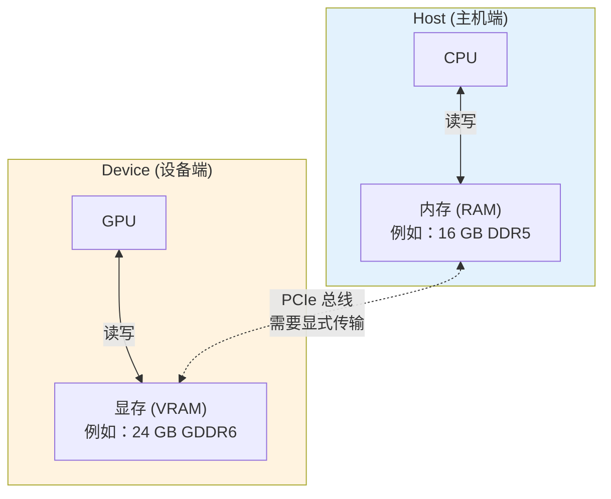

**关键点**：
- CPU 不能直接访问显存，GPU 不能直接访问内存
- 数据在两者之间必须通过 PCIe 总线显式传输
- 这是 CUDA 编程模型的核心特点之一

#### 官方文档：CUDA 内存层次结构


> **图示说明**（来自 CUDA C++ Programming Guide 12.2.1）：
> - 每个 Thread 有私有的**本地内存 (Local Memory)**
> - 每个 Block 有共享的**共享内存 (Shared Memory)**
> - **Thread Block Clusters**（计算能力 9.0+）内的 Block 可以互相访问分布式共享内存
> - 所有 Thread 可访问**全局内存 (Global Memory)**
> - 还有只读的**常量内存**和**纹理内存**

#### 内存空间详解

| 内存类型 | 位置 | 访问速度 | 可见性 | 生命周期 |
|----------|------|----------|--------|----------|
| **寄存器 (Register)** | SM 内部 | 最快 (~1周期) | 线程私有 | 线程 |
| **本地内存 (Local)** | 全局内存 | 慢 (~400周期) | 线程私有 | 线程 |
| **共享内存 (Shared)** | SM 内部 | 快 (~20周期) | Block 内共享 | Block |
| **分布式共享内存** | 多个SM | 中等 | Cluster 内共享 | Cluster |
| **全局内存 (Global)** | HBM/GDDR | 慢 (~400周期) | 所有线程 | 应用程序 |
| **常量内存 (Constant)** | 全局内存 | 快 (缓存) | 所有线程 | 应用程序 |
| **纹理内存 (Texture)** | 全局内存 | 快 (缓存) | 所有线程 | 应用程序 |

> **注意**：全局内存、常量内存和纹理内存的空间在同一应用程序的多次 kernel 启动之间保持持久。

### 1.2 一个形象的类比

把内存管理想象成两个仓库之间的货物搬运：

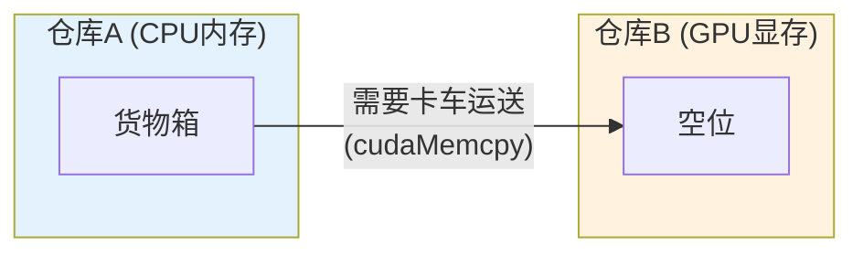

| 操作 | 类比 | CUDA 函数 |
|------|------|-----------|
| 在仓库B开辟空间 | 申请货架 | `cudaMalloc` |
| 把货物从A运到B | 卡车运送 | `cudaMemcpyHostToDevice` |
| 把货物从B运回A | 卡车运回 | `cudaMemcpyDeviceToHost` |
| 清空仓库B的货架 | 释放空间 | `cudaFree` |

---

## 2. cudaMalloc：在 GPU 上分配内存

### 2.1 函数原型

```cpp
cudaError_t cudaMalloc(void** devPtr, size_t size);
```

**参数说明**：
| 参数 | 类型 | 说明 |
|------|------|------|
| `devPtr` | `void**` | 指向指针的指针，用于接收分配的显存地址 |
| `size` | `size_t` | 要分配的字节数 |

**返回值**：
- `cudaSuccess`：分配成功
- 其他错误码：分配失败（如显存不足）

### 2.2 为什么是双重指针？

这是一个常见的困惑点。让我们用图解说明：

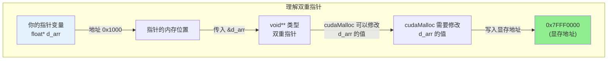

**对比理解**：

```cpp
// 普通的 malloc - 只需要返回值
float* h_arr = (float*)malloc(size);  // h_arr 接收返回值

// cudaMalloc - 需要传入指针的地址
float* d_arr;
cudaMalloc(&d_arr, size);  // 传入 &d_arr，函数内部修改 d_arr
```

### 2.3 完整示例

```cpp
// ========== 基本的 cudaMalloc 使用 ==========

#include <cuda_runtime.h>
#include <stdio.h>

int main() {
    // ------------------------------------------------
    // 1. 定义指针（此时指针未指向任何有效地址）
    // ------------------------------------------------
    float* d_array = nullptr;  // d_ 前缀表示 device（设备端）

    // ------------------------------------------------
    // 2. 计算需要的字节数
    //    假设要存储 1024 个 float
    // ------------------------------------------------
    int n = 1024;
    size_t bytes = n * sizeof(float);  // 1024 * 4 = 4096 字节

    // ------------------------------------------------
    // 3. 在 GPU 上分配内存
    //    注意：传入的是 &d_array（指针的地址）
    // ------------------------------------------------
    cudaError_t err = cudaMalloc(&d_array, bytes);

    // ------------------------------------------------
    // 4. 错误检查
    // ------------------------------------------------
    if (err != cudaSuccess) {
        printf("cudaMalloc 失败: %s\n", cudaGetErrorString(err));
        return -1;
    }

    printf("成功分配 %zu 字节显存，地址: %p\n", bytes, d_array);

    // ------------------------------------------------
    // 5. 使用完毕后释放内存
    // ------------------------------------------------
    cudaFree(d_array);

    return 0;
}
```

### 2.4 内存分配示意图

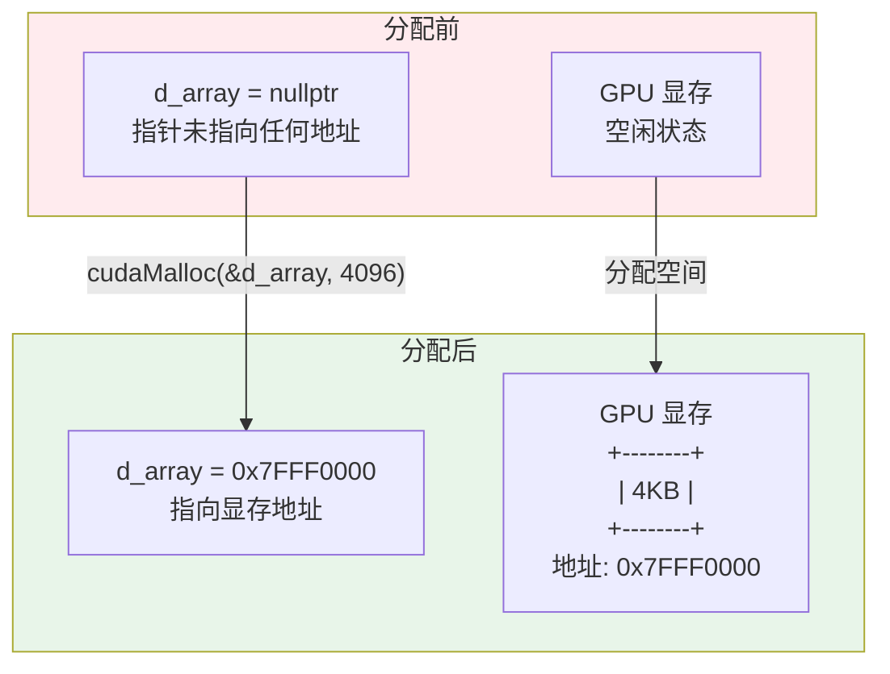

---

## 3. cudaMemcpy：数据传输

### 3.1 函数原型

```cpp
cudaError_t cudaMemcpy(
    void* dst,           // 目标地址
    const void* src,     // 源地址
    size_t count,        // 传输字节数
    enum cudaMemcpyKind kind  // 传输方向
);
```

### 3.2 传输方向参数详解

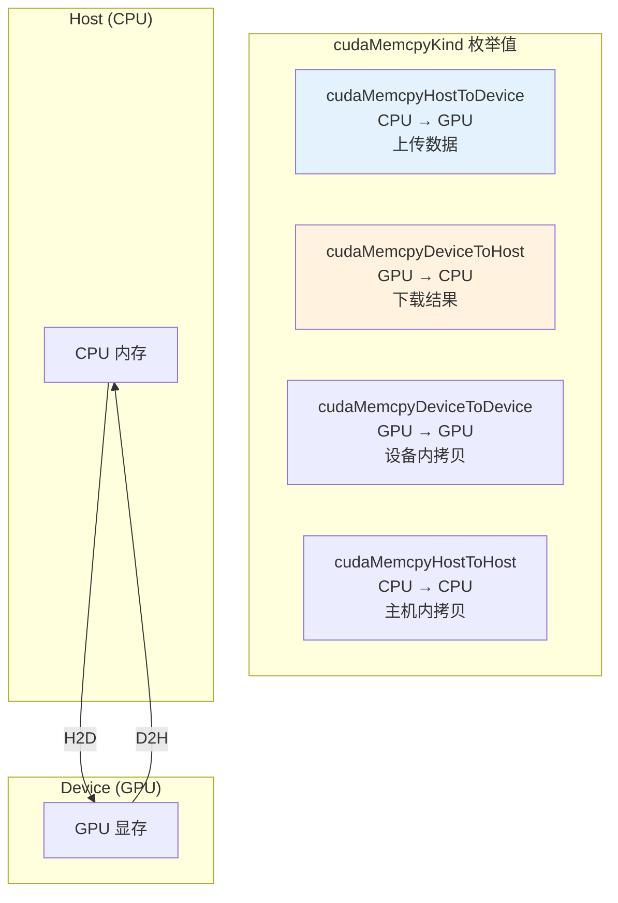

| 方向常量 | 含义 | 典型场景 |
|----------|------|----------|
| `cudaMemcpyHostToDevice` | Host → Device | 上传输入数据到 GPU |
| `cudaMemcpyDeviceToHost` | Device → Host | 下载计算结果到 CPU |
| `cudaMemcpyDeviceToDevice` | Device → Device | GPU 内部数据拷贝 |

### 3.3 数据传输流程图

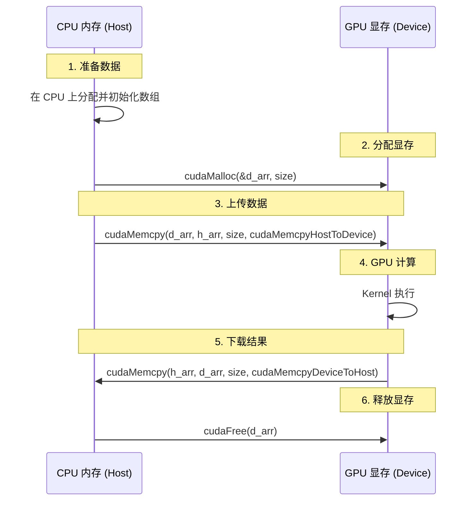

### 3.4 完整示例

```cpp
// ========== 完整的数据传输示例 ==========

#include <cuda_runtime.h>
#include <stdio.h>

int main() {
    const int N = 1024;           // 数据元素个数
    size_t bytes = N * sizeof(float);

    // ============================================
    // 步骤 1：在 Host 上准备数据
    // ============================================
    float* h_array = (float*)malloc(bytes);  // h_ 前缀表示 host（主机端）

    // 初始化数据
    for (int i = 0; i < N; i++) {
        h_array[i] = (float)i * 0.5f;
    }
    printf("Host 数据准备完成: h_array[0]=%.1f, h_array[1023]=%.1f\n",
           h_array[0], h_array[1023]);

    // ============================================
    // 步骤 2：在 Device 上分配内存
    // ============================================
    float* d_array = nullptr;
    cudaError_t err = cudaMalloc(&d_array, bytes);
    if (err != cudaSuccess) {
        printf("cudaMalloc 失败: %s\n", cudaGetErrorString(err));
        free(h_array);
        return -1;
    }
    printf("Device 内存分配成功\n");

    // ============================================
    // 步骤 3：将数据从 Host 传输到 Device
    //         cudaMemcpyHostToDevice: CPU → GPU
    // ============================================
    err = cudaMemcpy(d_array,           // 目标：GPU 地址
                     h_array,           // 源：CPU 地址
                     bytes,             // 字节数
                     cudaMemcpyHostToDevice);  // 方向

    if (err != cudaSuccess) {
        printf("cudaMemcpy H2D 失败: %s\n", cudaGetErrorString(err));
        cudaFree(d_array);
        free(h_array);
        return -1;
    }
    printf("数据上传到 GPU 完成\n");

    // ============================================
    // 步骤 4：模拟 GPU 处理
    //         （这里暂时不做处理，后续章节会加入 Kernel）
    // ============================================
    printf("GPU 处理中...\n");

    // ============================================
    // 步骤 5：将结果从 Device 传输回 Host
    //         cudaMemcpyDeviceToHost: GPU → CPU
    // ============================================
    float* h_result = (float*)malloc(bytes);  // 用于接收结果

    err = cudaMemcpy(h_result,          // 目标：CPU 地址
                    d_array,            // 源：GPU 地址
                    bytes,              // 字节数
                    cudaMemcpyDeviceToHost);  // 方向

    if (err != cudaSuccess) {
        printf("cudaMemcpy D2H 失败: %s\n", cudaGetErrorString(err));
        cudaFree(d_array);
        free(h_array);
        free(h_result);
        return -1;
    }
    printf("数据从 GPU 下载完成\n");

    // ============================================
    // 步骤 6：验证结果
    // ============================================
    bool correct = true;
    for (int i = 0; i < N; i++) {
        if (h_result[i] != h_array[i]) {
            correct = false;
            printf("错误: h_result[%d]=%.1f, 期望=%.1f\n",
                   i, h_result[i], h_array[i]);
            break;
        }
    }
    if (correct) {
        printf("验证通过！数据传输正确\n");
    }

    // ============================================
    // 步骤 7：清理资源
    // ============================================
    cudaFree(d_array);    // 释放 GPU 内存
    free(h_array);        // 释放 CPU 内存
    free(h_result);       // 释放 CPU 内存

    printf("资源清理完成\n");

    return 0;
}
```

---

## 4. cudaFree：释放 GPU 内存

### 4.1 函数原型

```cpp
cudaError_t cudaFree(void* devPtr);
```

**参数说明**：
| 参数 | 类型 | 说明 |
|------|------|------|
| `devPtr` | `void*` | 要释放的显存地址 |

### 4.2 使用注意事项

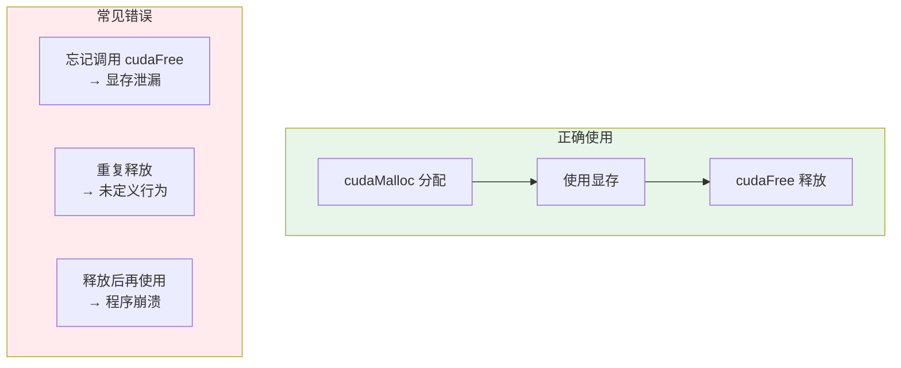

```cpp
// ========== 正确的资源管理模式 ==========

void process_data() {
    float* d_data = nullptr;

    // 分配
    cudaMalloc(&d_data, 1024 * sizeof(float));

    // 使用...（Kernel 调用等）

    // 释放 - 使用 RAII 模式更好（见后续章节）
    cudaFree(d_data);
    d_data = nullptr;  // 好习惯：释放后置空
}

// ========== 推荐的 RAII 封装（C++） ==========
class CudaBuffer {
public:
    CudaBuffer(size_t size) {
        cudaMalloc(&ptr_, size);
    }
    ~CudaBuffer() {
        if (ptr_) {
            cudaFree(ptr_);
        }
    }
    // 禁止拷贝
    CudaBuffer(const CudaBuffer&) = delete;
    CudaBuffer& operator=(const CudaBuffer&) = delete;

    float* get() { return ptr_; }

private:
    float* ptr_ = nullptr;
};
```

---

## 5. Host vs Device 内存布局对比

### 5.1 完整的内存模型

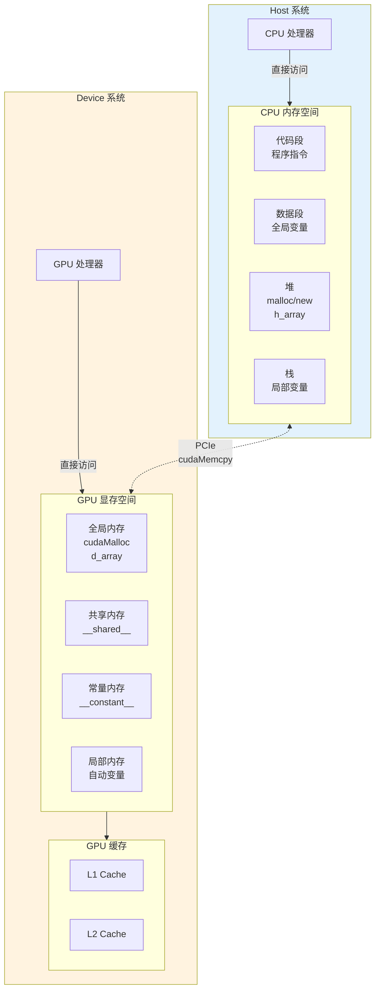

### 5.2 指针命名规范

良好的命名规范可以提高代码可读性：

```cpp
// ========== 推荐的指针命名规范 ==========

// h_ 前缀：Host (CPU) 内存指针
float* h_input;      // CPU 上的输入数据
float* h_output;      // CPU 上的输出数据

// d_ 前缀：Device (GPU) 显存指针
float* d_input;      // GPU 上的输入数据
float* d_output;     // GPU 上的输出数据

// 这样一眼就能看出数据在哪里：
// h_xxx → CPU 内存
// d_xxx → GPU 显存
```

### 5.3 内存访问规则

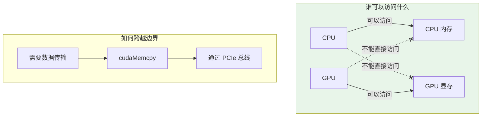

| 操作者 | 可访问 | 不可访问 | 解决方案 |
|--------|--------|----------|----------|
| CPU | CPU 内存 | GPU 显存 | 使用 cudaMemcpy |
| GPU | GPU 显存 | CPU 内存 | 使用 cudaMemcpy |

---

## 6. 实战：向量加法的完整实现

### 6.1 完整代码示例

```cpp
// ========== 文件：vector_add.cu ==========
// 功能：实现向量加法 C = A + B
// 展示完整的 CUDA 内存管理流程

#include <cuda_runtime.h>
#include <stdio.h>
#include <stdlib.h>

// ============================================
// Kernel 函数：向量加法
// ============================================
__global__ void vector_add_kernel(
    const float* a,    // 输入向量 A
    const float* b,    // 输入向量 B
    float* c,          // 输出向量 C
    int n              // 向量长度
) {
    // 计算当前线程处理的全局索引
    int idx = blockIdx.x * blockDim.x + threadIdx.x;

    // 边界检查：防止越界访问
    if (idx < n) {
        c[idx] = a[idx] + b[idx];
    }
}

// ============================================
// 辅助函数：检查 CUDA 错误
// ============================================
#define CUDA_CHECK(call)                                    \
    do {                                                     \
        cudaError_t err = call;                              \
        if (err != cudaSuccess) {                            \
            fprintf(stderr, "CUDA 错误 %s:%d: %s\n",        \
                    __FILE__, __LINE__,                      \
                    cudaGetErrorString(err));                \
            exit(EXIT_FAILURE);                              \
        }                                                    \
    } while (0)

// ============================================
// 主函数
// ============================================
int main() {
    const int N = 1 << 20;  // 1M 个元素
    const size_t bytes = N * sizeof(float);

    printf("向量加法演示\n");
    printf("元素数量: %d (%.2f MB)\n\n", N, bytes / 1024.0 / 1024.0);

    // ========================================
    // 步骤 1：在 Host 上分配并初始化数据
    // ========================================
    printf("[步骤 1] 分配 Host 内存...\n");

    float* h_a = (float*)malloc(bytes);
    float* h_b = (float*)malloc(bytes);
    float* h_c = (float*)malloc(bytes);  // 用于接收结果

    // 初始化输入数据
    for (int i = 0; i < N; i++) {
        h_a[i] = (float)i;
        h_b[i] = (float)(i * 2);
    }

    // ========================================
    // 步骤 2：在 Device 上分配内存
    // ========================================
    printf("[步骤 2] 分配 Device 内存...\n");

    float* d_a = nullptr;
    float* d_b = nullptr;
    float* d_c = nullptr;

    CUDA_CHECK(cudaMalloc(&d_a, bytes));
    CUDA_CHECK(cudaMalloc(&d_b, bytes));
    CUDA_CHECK(cudaMalloc(&d_c, bytes));

    printf("  - d_a: %p\n", d_a);
    printf("  - d_b: %p\n", d_b);
    printf("  - d_c: %p\n", d_c);

    // ========================================
    // 步骤 3：将数据从 Host 传输到 Device
    // ========================================
    printf("[步骤 3] 上传数据到 GPU...\n");

    CUDA_CHECK(cudaMemcpy(d_a, h_a, bytes, cudaMemcpyHostToDevice));
    CUDA_CHECK(cudaMemcpy(d_b, h_b, bytes, cudaMemcpyHostToDevice));

    printf("  传输完成: 2 x %.2f MB\n", bytes / 1024.0 / 1024.0);

    // ========================================
    // 步骤 4：启动 Kernel 执行计算
    // ========================================
    printf("[步骤 4] 启动 Kernel...\n");

    // 配置线程块
    int threads_per_block = 256;
    int blocks_per_grid = (N + threads_per_block - 1) / threads_per_block;

    printf("  - 每块线程数: %d\n", threads_per_block);
    printf("  - 块数量: %d\n", blocks_per_grid);
    printf("  - 总线程数: %d\n", threads_per_block * blocks_per_grid);

    // 调用 Kernel
    vector_add_kernel<<<blocks_per_grid, threads_per_block>>>(
        d_a, d_b, d_c, N
    );

    // 等待 GPU 完成并检查错误
    CUDA_CHECK(cudaGetLastError());
    CUDA_CHECK(cudaDeviceSynchronize());

    printf("  Kernel 执行完成\n");

    // ========================================
    // 步骤 5：将结果从 Device 传输回 Host
    // ========================================
    printf("[步骤 5] 下载结果到 CPU...\n");

    CUDA_CHECK(cudaMemcpy(h_c, d_c, bytes, cudaMemcpyDeviceToHost));

    printf("  下载完成: %.2f MB\n", bytes / 1024.0 / 1024.0);

    // ========================================
    // 步骤 6：验证结果
    // ========================================
    printf("[步骤 6] 验证结果...\n");

    int errors = 0;
    for (int i = 0; i < N; i++) {
        float expected = h_a[i] + h_b[i];
        if (fabs(h_c[i] - expected) > 1e-5) {
            errors++;
            if (errors <= 5) {
                printf("  错误 [%d]: 期望 %.1f, 实际 %.1f\n",
                       i, expected, h_c[i]);
            }
        }
    }

    if (errors == 0) {
        printf("  验证通过！所有 %d 个元素计算正确\n", N);
    } else {
        printf("  发现 %d 个错误\n", errors);
    }

    // ========================================
    // 步骤 7：释放所有内存
    // ========================================
    printf("[步骤 7] 释放内存...\n");

    CUDA_CHECK(cudaFree(d_a));
    CUDA_CHECK(cudaFree(d_b));
    CUDA_CHECK(cudaFree(d_c));

    free(h_a);
    free(h_b);
    free(h_c);

    printf("完成！\n");

    return 0;
}
```

### 6.2 执行流程图解

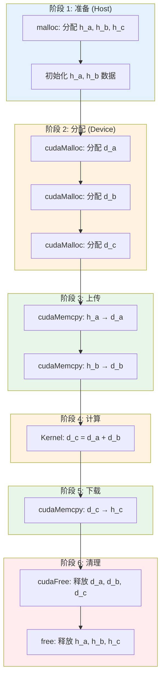

---

## 7. 常见错误与最佳实践

### 7.1 常见错误类型

#### 错误 1：忘记检查返回值

```cpp
// ========== 错误示例：忽略返回值 ==========
float* d_arr;
cudaMalloc(&d_arr, size);  // 如果失败，d_arr 仍为 nullptr
cudaMemcpy(d_arr, h_arr, size, cudaMemcpyHostToDevice);  // 崩溃！

// ========== 正确做法：检查返回值 ==========
float* d_arr;
cudaError_t err = cudaMalloc(&d_arr, size);
if (err != cudaSuccess) {
    printf("错误: %s\n", cudaGetErrorString(err));
    return -1;
}
```

#### 错误 2：内存越界访问

```cpp
// ========== 错误示例：越界访问 ==========
__global__ void bad_kernel(float* arr, int n) {
    int idx = blockIdx.x * blockDim.x + threadIdx.x;
    arr[idx] = 1.0f;  // 如果 idx >= n，会越界！
}

// ========== 正确做法：边界检查 ==========
__global__ void good_kernel(float* arr, int n) {
    int idx = blockIdx.x * blockDim.x + threadIdx.x;
    if (idx < n) {  // 边界检查
        arr[idx] = 1.0f;
    }
}
```

#### 错误 3：使用未初始化的指针

```cpp
// ========== 错误示例：指针未初始化 ==========
float* d_arr;  // 未初始化，可能是任意值
cudaMemcpy(d_arr, h_arr, size, cudaMemcpyHostToDevice);  // 使用无效指针

// ========== 正确做法：初始化为 nullptr ==========
float* d_arr = nullptr;
cudaMalloc(&d_arr, size);  // 先分配
cudaMemcpy(d_arr, h_arr, size, cudaMemcpyHostToDevice);  // 再使用
```

#### 错误 4：忘记释放内存

```cpp
// ========== 错误示例：内存泄漏 ==========
void process() {
    float* d_arr;
    cudaMalloc(&d_arr, size);
    // ... 使用 ...
    // 忘记 cudaFree！每次调用都会泄漏显存
}

// ========== 正确做法：成对使用 malloc/free ==========
void process() {
    float* d_arr = nullptr;
    cudaMalloc(&d_arr, size);
    // ... 使用 ...
    cudaFree(d_arr);  // 记得释放
}
```

### 7.2 错误处理宏

```cpp
// ========== 推荐的错误检查宏 ==========

// 基本版本
#define CUDA_CHECK(call)                                    \
    do {                                                     \
        cudaError_t err = call;                              \
        if (err != cudaSuccess) {                            \
            fprintf(stderr, "CUDA 错误 %s:%d: %s\n",        \
                    __FILE__, __LINE__,                      \
                    cudaGetErrorString(err));                \
            exit(EXIT_FAILURE);                              \
        }                                                    \
    } while (0)

// 使用示例
CUDA_CHECK(cudaMalloc(&d_arr, size));
CUDA_CHECK(cudaMemcpy(d_arr, h_arr, size, cudaMemcpyHostToDevice));

// Kernel 后的错误检查
kernel<<<grid, block>>>(args);
CUDA_CHECK(cudaGetLastError());      // 检查启动错误
CUDA_CHECK(cudaDeviceSynchronize()); // 检查执行错误
```

### 7.3 最佳实践总结

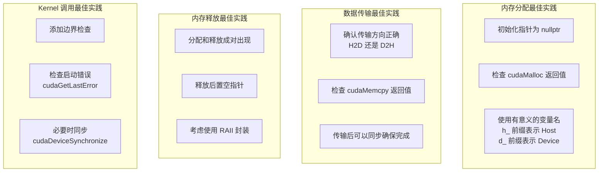

### 7.4 内存检查工具

CUDA 提供了工具来帮助检测内存问题：

```bash
# 使用 cuda-memcheck 检查内存错误
cuda-memcheck ./your_program

# 输出示例：
# ========= CUDA-MEMCHECK
# ========= Error: uninitialized write
# =========     at 0x... in kernel ...
```

---

## 8. 性能考虑

### 8.1 数据传输的开销

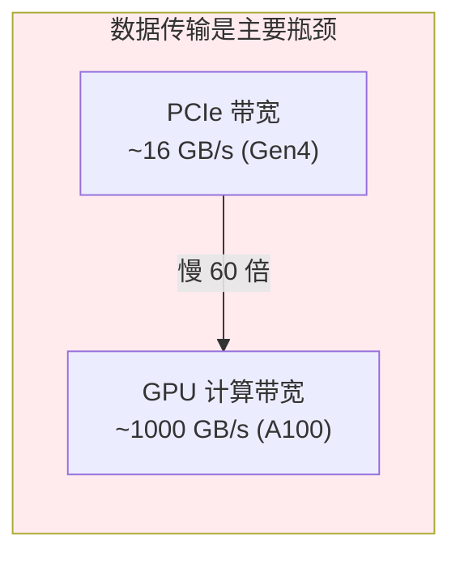

**关键洞察**：
- PCIe 传输带宽远低于 GPU 计算带宽
- 数据传输往往是 CUDA 程序的性能瓶颈
- 应尽量减少 Host 和 Device 之间的数据传输

### 8.2 优化策略

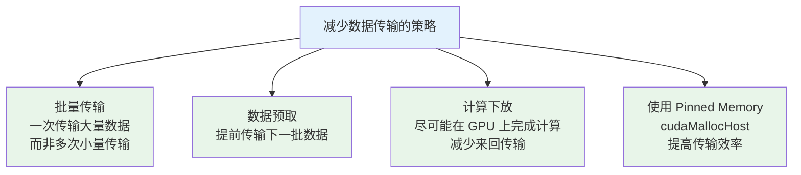

---

## 9. 本章小结

### 9.1 核心函数速查表

| 函数 | 作用 | 类似 CPU 函数 |
|------|------|--------------|
| `cudaMalloc(&ptr, size)` | 在 GPU 上分配内存 | `malloc` |
| `cudaFree(ptr)` | 释放 GPU 内存 | `free` |
| `cudaMemcpy(dst, src, size, kind)` | 数据传输 | `memcpy` |

### 9.2 知识图谱

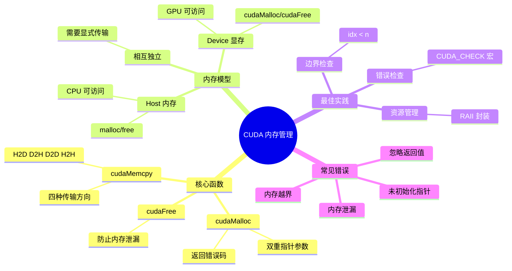

### 9.3 记忆要点

1. **Host 和 Device 内存独立**：CPU 不能直接访问显存，GPU 不能直接访问内存
2. **cudaMalloc 用双重指针**：`cudaMalloc(&ptr, size)` 而不是 `cudaMalloc(ptr, size)`
3. **cudaMemcpy 需指定方向**：HostToDevice 或 DeviceToHost
4. **成对使用 malloc 和 free**：每次 `cudaMalloc` 都要有对应的 `cudaFree`
5. **始终检查错误**：使用 `CUDA_CHECK` 宏

### 9.4 思考题

1. 为什么 `cudaMalloc` 需要传入双重指针而不是返回指针？
2. 如果在 Kernel 中访问 Host 内存会发生什么？
3. 如何优化 Host 和 Device 之间的数据传输？
4. 下面的代码有什么问题？
   ```cpp
   float* d_arr;
   cudaMemcpy(d_arr, h_arr, size, cudaMemcpyHostToDevice);
   ```

---

## 下一章

[第七章：核函数深入](./07_核函数深入.md) - 深入理解 CUDA 核函数的定义、调用规则和执行模型

---

*参考资料：[CUDA C++ Programming Guide - Memory Management](https://docs.nvidia.com/cuda/cuda-c-programming-guide/index.html#memory-management)*