# 第七章：核函数深入

> 学习目标：深入理解 CUDA 核函数的定义、调用规则和执行模型
>
> 预计阅读时间：30 分钟
>
> 前置知识：[第二章：什么是 CUDA？](./02_CUDA是什么.md) | [第三章：GPU 硬件架构入门](./03_GPU硬件架构入门.md)

---

## 1. 函数限定符详解

### 1.1 三大限定符概览

CUDA 提供了三种函数限定符，用于指定函数的执行位置和调用方式：

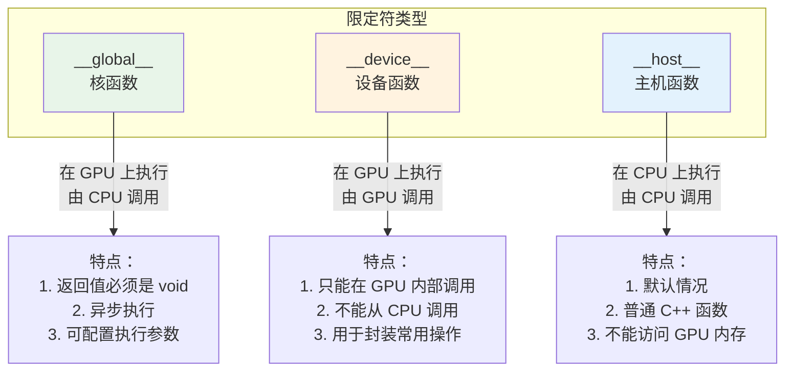

### 1.2 限定符详细对比

| 限定符 | 执行位置 | 调用位置 | 返回值 | 特殊语法 |
|--------|----------|----------|--------|----------|
| `__global__` | Device (GPU) | Host (CPU) 或 Device (GPU) | 必须是 void | 支持 `<<<grid, block>>>` |
| `__device__` | Device (GPU) | Device (GPU) | 任意类型 | 不支持 |
| `__host__` | Host (CPU) | Host (CPU) | 任意类型 | 不支持 |

### 1.3 函数调用关系图

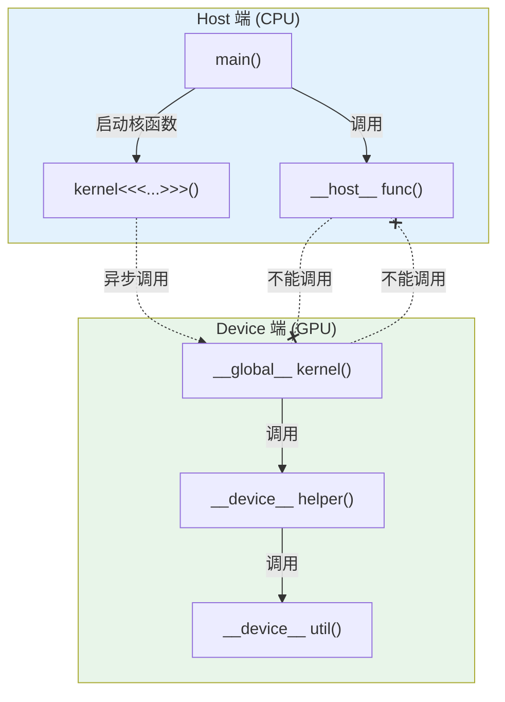

### 1.4 限定符组合使用

限定符可以组合使用：

```cpp
// 同时定义为 host 和 device 函数
// 可以在 CPU 和 GPU 上都调用
__host__ __device__ int add(int a, int b) {
    return a + b;
}
```

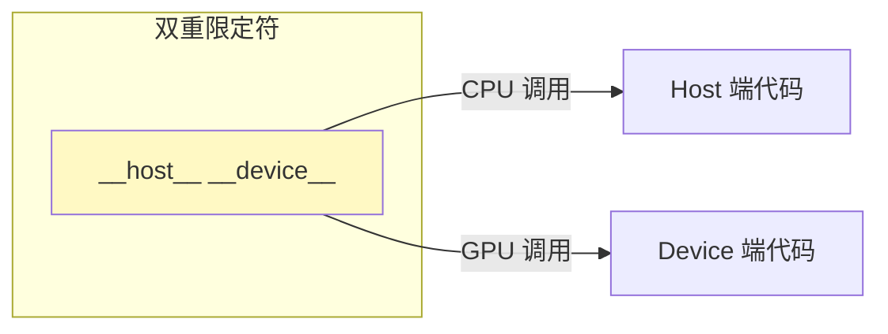

---

## 2. 核函数的限制

### 2.1 可以做的事

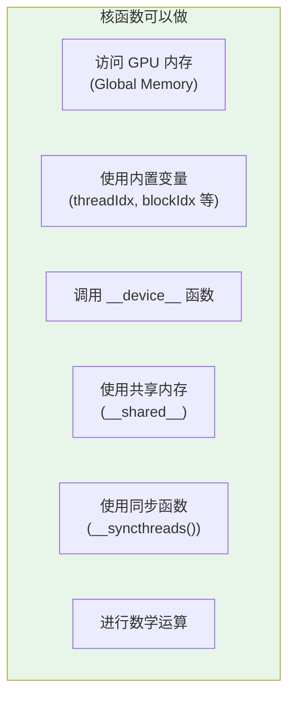

### 2.2 不能做的事

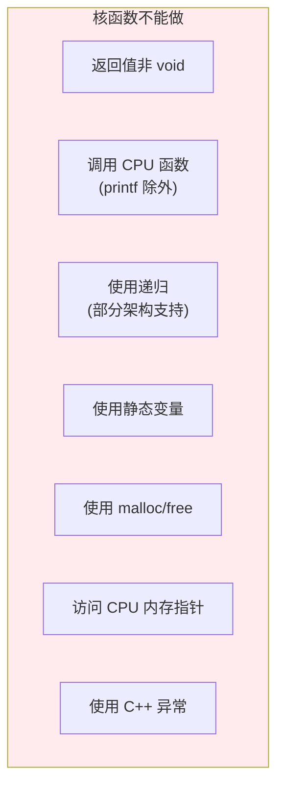

### 2.3 限制对照表

| 特性 | 核函数 (__global__) | 设备函数 (__device__) | 主机函数 (__host__) |
|------|---------------------|----------------------|---------------------|
| 返回 void | 必须 | 可选 | 可选 |
| 返回值 | 不支持 | 支持 | 支持 |
| 访问 GPU 内存 | 支持 | 支持 | 不支持 |
| 访问 CPU 内存 | 不支持 | 不支持 | 支持 |
| 递归 | 有限支持 | 有限支持 | 支持 |
| 静态变量 | 不支持 | 不支持 | 支持 |
| printf | 支持 | 支持 | 支持 |
| 动态内存分配 | 不支持 | 不支持 | 支持 |

---

## 3. 核函数启动语法 <<<grid, block>>>

### 3.1 基本语法

核函数的启动使用特殊的执行配置语法：

```cpp
kernel<<<grid, block>>>(args);
       //  ^     ^
       //  |     |
       //  |     +-- 每个 Block 的线程数
       //  +-------- Grid 中的 Block 数量
```

### 3.2 执行配置详解

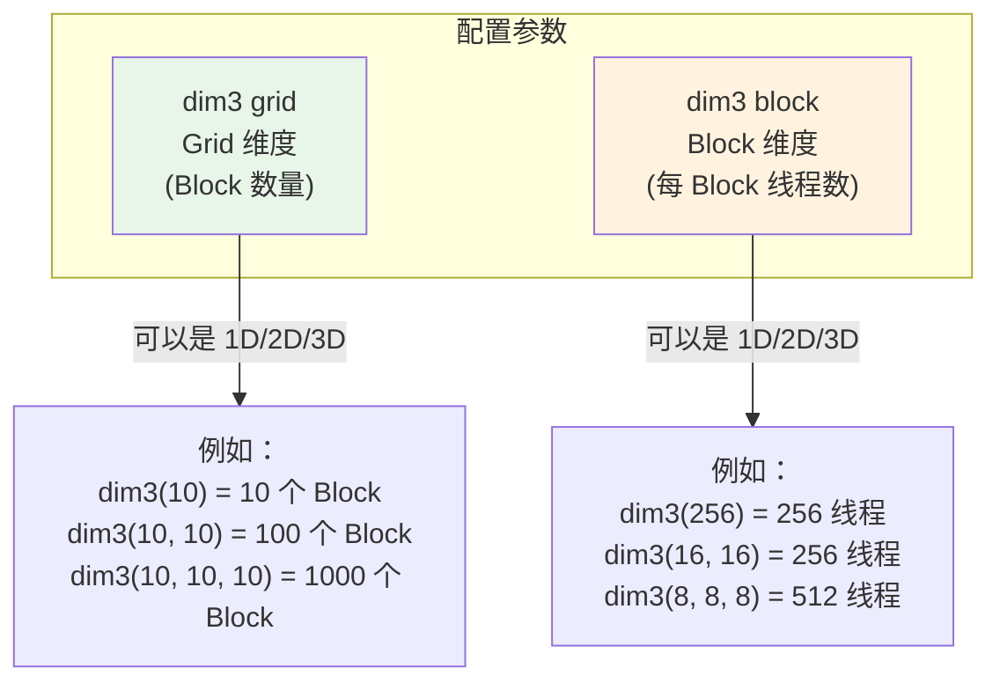

### 3.3 维度选择指南

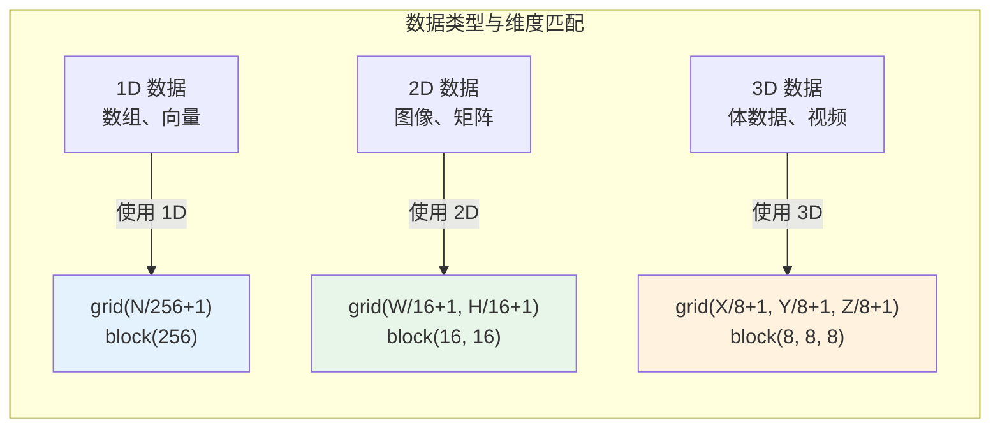

### 3.4 完整执行配置

核函数启动还支持更多参数：

```cpp
kernel<<<grid, block, shared_mem_size, stream>>>(args);
       //     |      |           |              |
       //     |      |           |              +-- CUDA 流
       //     |      |           +-- 动态共享内存大小（字节）
       //     |      +-- 每个 Block 的线程数
       //     +-- Grid 中的 Block 数量
```

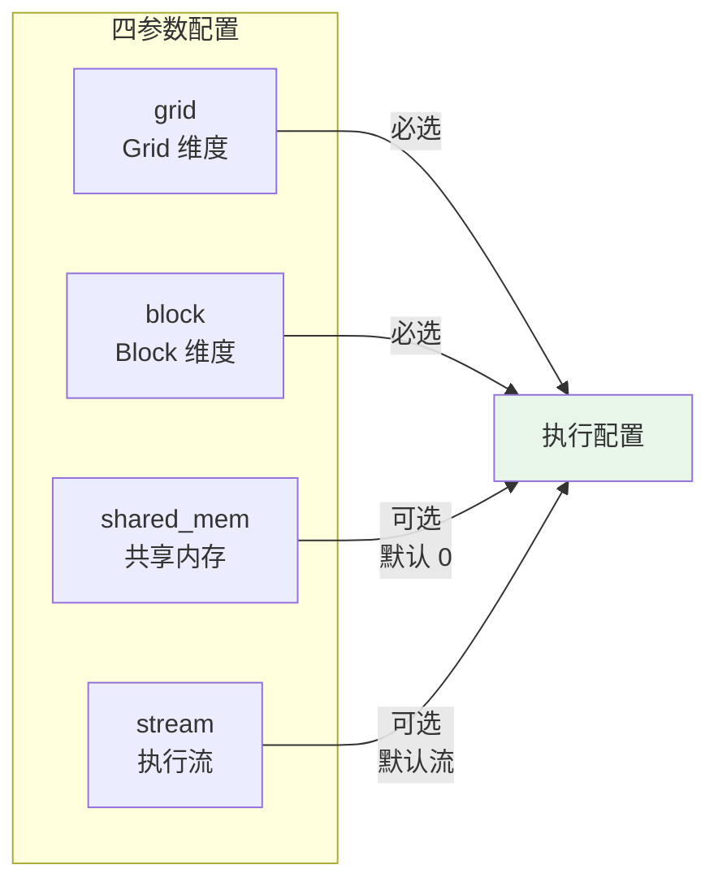

---

## 4. 实战示例

### 4.1 简单的 __global__ 核函数

```cpp
// ========== 文件：simple_kernel.cu ==========
#include <cuda_runtime.h>
#include <stdio.h>

// ------------------------------------------------
// 核函数：向量加法
// 功能：c[i] = a[i] + b[i]
// ------------------------------------------------
__global__ void vector_add(float *a, float *b, float *c, int n) {
    // 步骤 1：计算当前线程负责处理的数据索引
    // blockIdx.x: 当前 Block 在 Grid 中的索引
    // blockDim.x: 每个 Block 中的线程数
    // threadIdx.x: 当前线程在 Block 中的索引
    int idx = blockIdx.x * blockDim.x + threadIdx.x;

    // 步骤 2：边界检查
    // 防止线程数超过数据量时越界访问
    if (idx < n) {
        c[idx] = a[idx] + b[idx];
    }

    // 说明：
    // - 每个线程处理一个数组元素
    // - 通过全局索引 idx 区分不同线程处理的数据
    // - 所有线程执行相同的代码，但处理不同的数据（SIMT）
}

// ------------------------------------------------
// 主机函数：启动核函数
// ------------------------------------------------
int main() {
    int n = 1000;
    size_t size = n * sizeof(float);

    // 1. 分配主机内存
    float *h_a = (float*)malloc(size);
    float *h_b = (float*)malloc(size);
    float *h_c = (float*)malloc(size);

    // 2. 初始化数据
    for (int i = 0; i < n; i++) {
        h_a[i] = i;
        h_b[i] = i * 2;
    }

    // 3. 分配设备内存
    float *d_a, *d_b, *d_c;
    cudaMalloc(&d_a, size);
    cudaMalloc(&d_b, size);
    cudaMalloc(&d_c, size);

    // 4. 拷贝数据到设备
    cudaMemcpy(d_a, h_a, size, cudaMemcpyHostToDevice);
    cudaMemcpy(d_b, h_b, size, cudaMemcpyHostToDevice);

    // 5. 启动核函数
    // 配置：每个 Block 256 个线程
    int block_size = 256;
    // 计算需要的 Block 数量（向上取整）
    int grid_size = (n + block_size - 1) / block_size;

    // 启动核函数
    vector_add<<<grid_size, block_size>>>(d_a, d_b, d_c, n);

    // 6. 拷贝结果回主机
    cudaMemcpy(h_c, d_c, size, cudaMemcpyDeviceToHost);

    // 7. 验证结果
    for (int i = 0; i < 5; i++) {
        printf("c[%d] = %f\n", i, h_c[i]);
    }

    // 8. 释放内存
    cudaFree(d_a);
    cudaFree(d_b);
    cudaFree(d_c);
    free(h_a);
    free(h_b);
    free(h_c);

    return 0;
}
```

**执行流程图解**：

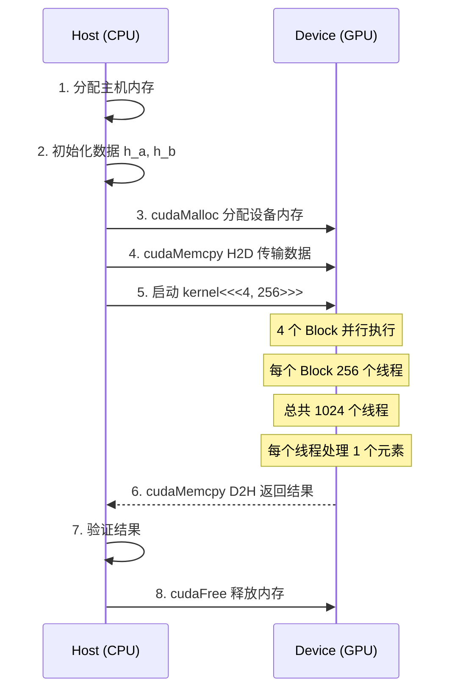

### 4.2 __device__ 辅助函数示例

```cpp
// ========== 文件：device_function.cu ==========
#include <cuda_runtime.h>
#include <stdio.h>

// ------------------------------------------------
// __device__ 函数：计算平方
// 只能在 GPU 上被调用
// ------------------------------------------------
__device__ float square(float x) {
    return x * x;
}

// ------------------------------------------------
// __device__ 函数：计算两数之和
// 可以被其他 __device__ 或 __global__ 函数调用
// ------------------------------------------------
__device__ float add(float a, float b) {
    return a + b;
}

// ------------------------------------------------
// __device__ 函数：计算欧几里得距离的平方
// 展示 __device__ 函数之间的调用
// ------------------------------------------------
__device__ float distance_squared(float x1, float y1, float x2, float y2) {
    float dx = add(x1, -x2);  // 调用 __device__ 函数
    float dy = add(y1, -y2);
    return add(square(dx), square(dy));  // 链式调用
}

// ------------------------------------------------
// __global__ 核函数：计算点到原点的距离
// 调用 __device__ 辅助函数
// ------------------------------------------------
__global__ void compute_distances(float *x, float *y, float *dist, int n) {
    int idx = blockIdx.x * blockDim.x + threadIdx.x;

    if (idx < n) {
        // 调用 __device__ 函数计算到原点 (0,0) 的距离平方
        dist[idx] = distance_squared(x[idx], y[idx], 0.0f, 0.0f);
    }
}

// ------------------------------------------------
// __host__ __device__ 函数：既可以在 CPU 也可以在 GPU 上使用
// 这种写法可以减少代码重复
// ------------------------------------------------
__host__ __device__ float clamp(float value, float min_val, float max_val) {
    if (value < min_val) return min_val;
    if (value > max_val) return max_val;
    return value;
}

// ------------------------------------------------
// __global__ 核函数：使用双重限定符函数
// ------------------------------------------------
__global__ void clamp_array(float *data, float min_val, float max_val, int n) {
    int idx = blockIdx.x * blockDim.x + threadIdx.x;

    if (idx < n) {
        // clamp 函数可以在 GPU 上调用
        data[idx] = clamp(data[idx], min_val, max_val);
    }
}

// ------------------------------------------------
// 主函数
// ------------------------------------------------
int main() {
    int n = 5;
    size_t size = n * sizeof(float);

    // 主机数据
    float h_x[] = {3.0f, 0.0f, 4.0f, 1.0f, 2.0f};
    float h_y[] = {4.0f, 5.0f, 0.0f, 1.0f, 2.0f};
    float h_dist[5];

    // 设备数据
    float *d_x, *d_y, *d_dist;
    cudaMalloc(&d_x, size);
    cudaMalloc(&d_y, size);
    cudaMalloc(&d_dist, size);

    // 拷贝数据
    cudaMemcpy(d_x, h_x, size, cudaMemcpyHostToDevice);
    cudaMemcpy(d_y, h_y, size, cudaMemcpyHostToDevice);

    // 启动核函数
    compute_distances<<<1, n>>>(d_x, d_y, d_dist, n);

    // 获取结果
    cudaMemcpy(h_dist, d_dist, size, cudaMemcpyDeviceToHost);

    // 打印结果
    printf("点到原点的距离平方:\n");
    for (int i = 0; i < n; i++) {
        printf("  点 (%.1f, %.1f) -> %.2f\n", h_x[i], h_y[i], h_dist[i]);
    }

    // 演示 __host__ __device__ 函数在 CPU 上的使用
    printf("\n在 CPU 上使用 clamp 函数:\n");
    printf("  clamp(1.5, 0.0, 1.0) = %.2f\n", clamp(1.5f, 0.0f, 1.0f));
    printf("  clamp(-0.5, 0.0, 1.0) = %.2f\n", clamp(-0.5f, 0.0f, 1.0f));

    // 释放内存
    cudaFree(d_x);
    cudaFree(d_y);
    cudaFree(d_dist);

    return 0;
}
```

**函数调用关系图**：

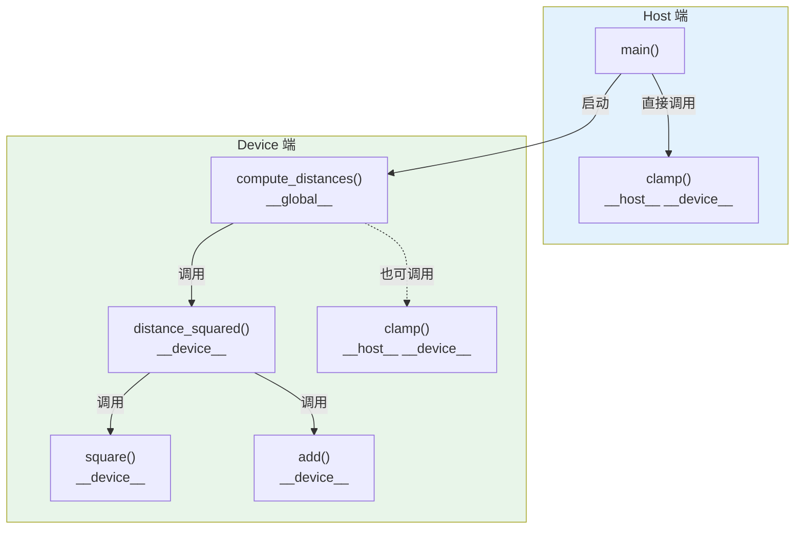

### 4.3 不同的启动配置示例

```cpp
// ========== 文件：launch_configs.cu ==========
#include <cuda_runtime.h>
#include <stdio.h>

// ------------------------------------------------
// 简单核函数：打印线程信息
// ------------------------------------------------
__global__ void print_thread_info() {
    // 全局唯一索引
    int idx = blockIdx.x * blockDim.x + threadIdx.x;

    printf("Block %d, Thread %d, Global Index %d\n",
           blockIdx.x, threadIdx.x, idx);
}

// ------------------------------------------------
// 2D 核函数：处理二维数据（如图像）
// ------------------------------------------------
__global__ void process_2d(float *image, int width, int height) {
    // 计算 2D 索引
    int x = blockIdx.x * blockDim.x + threadIdx.x;
    int y = blockIdx.y * blockDim.y + threadIdx.y;

    // 转换为 1D 索引
    int idx = y * width + x;

    // 边界检查
    if (x < width && y < height) {
        // 处理像素 (x, y)
        image[idx] = image[idx] * 2.0f;  // 简单示例：亮度翻倍
    }
}

// ------------------------------------------------
// 3D 核函数：处理三维数据（如体积数据）
// ------------------------------------------------
__global__ void process_3d(float *volume, int nx, int ny, int nz) {
    // 计算 3D 索引
    int x = blockIdx.x * blockDim.x + threadIdx.x;
    int y = blockIdx.y * blockDim.y + threadIdx.y;
    int z = blockIdx.z * blockDim.z + threadIdx.z;

    // 转换为 1D 索引
    int idx = z * nx * ny + y * nx + x;

    // 边界检查
    if (x < nx && y < ny && z < nz) {
        // 处理体素 (x, y, z)
        volume[idx] = volume[idx] + 1.0f;
    }
}

// ------------------------------------------------
// 主函数：展示不同的启动配置
// ------------------------------------------------
int main() {
    printf("========== 配置 1：1D 简单配置 ==========\n");
    // 配置：4 个 Block，每个 Block 8 个线程
    // 总线程数：4 * 8 = 32
    print_thread_info<<<4, 8>>>();
    cudaDeviceSynchronize();
    printf("\n");

    printf("========== 配置 2：dim3 类型配置 ==========\n");
    // 使用 dim3 类型指定维度
    dim3 grid(2, 1, 1);   // 2 个 Block（1D）
    dim3 block(4, 1, 1);  // 每个 Block 4 个线程（1D）
    print_thread_info<<<grid, block>>>();
    cudaDeviceSynchronize();
    printf("\n");

    printf("========== 配置 3：2D 配置（图像处理） ==========\n");
    // 假设图像大小 16x16
    int width = 16, height = 16;
    float *d_image;
    cudaMalloc(&d_image, width * height * sizeof(float));

    // 2D Grid 和 Block
    dim3 block_2d(4, 4);              // 每个 Block 4x4 = 16 个线程
    dim3 grid_2d(4, 4);               // Grid 4x4 = 16 个 Block
    // 总线程数：16 * 16 = 256，正好覆盖 16x16 图像

    process_2d<<<grid_2d, block_2d>>>(d_image, width, height);
    cudaDeviceSynchronize();
    printf("2D 配置：Grid(4,4), Block(4,4) -> 总线程 256\n\n");

    printf("========== 配置 4：3D 配置（体积数据） ==========\n");
    // 假设体积数据 8x8x8
    int nx = 8, ny = 8, nz = 8;
    float *d_volume;
    cudaMalloc(&d_volume, nx * ny * nz * sizeof(float));

    // 3D Grid 和 Block
    dim3 block_3d(4, 4, 4);           // 每个 Block 4x4x4 = 64 个线程
    dim3 grid_3d(2, 2, 2);            // Grid 2x2x2 = 8 个 Block
    // 总线程数：64 * 8 = 512，足够覆盖 8x8x8 = 512 个体素

    process_3d<<<grid_3d, block_3d>>>(d_volume, nx, ny, nz);
    cudaDeviceSynchronize();
    printf("3D 配置：Grid(2,2,2), Block(4,4,4) -> 总线程 512\n\n");

    printf("========== 配置 5：动态共享内存 ==========\n");
    // 核函数使用动态共享内存的示例
    // 第三个参数：每个 Block 动态分配的共享内存大小（字节）

    // 假设我们需要 256 个 float 的共享内存
    size_t shared_mem_size = 256 * sizeof(float);

    // 注意：这里展示语法，实际核函数需要在内部声明动态共享内存
    // extern __shared__ float s_data[];
    print_thread_info<<<grid, block, shared_mem_size>>>();
    cudaDeviceSynchronize();
    printf("使用动态共享内存：%zu 字节\n\n", shared_mem_size);

    // 释放内存
    cudaFree(d_image);
    cudaFree(d_volume);

    return 0;
}
```

**维度配置图解**：

```mermaid
graph TB
    subgraph "1D 配置"
        D1["dim3 grid(N, 1, 1)"]
        D1_B["dim3 block(256, 1, 1)"]
        D1 --> D1_B
        D1_R["总线程 = N × 256<br/>适合：数组、向量"]
        D1_B --> D1_R
    end

    subgraph "2D 配置"
        D2["dim3 grid(W/16, H/16, 1)"]
        D2_B["dim3 block(16, 16, 1)"]
        D2 --> D2_B
        D2_R["总线程 = (W/16 × H/16) × 256<br/>适合：图像、矩阵"]
        D2_B --> D2_R
    end

    subgraph "3D 配置"
        D3["dim3 grid(X/8, Y/8, Z/8)"]
        D3_B["dim3 block(8, 8, 8)"]
        D3 --> D3_B
        D3_R["总线程 = (X/8 × Y/8 × Z/8) × 512<br/>适合：体积数据、视频"]
        D3_B --> D3_R
    end

    style 1D 配置 fill:#E3F2FD
    style 2D 配置 fill:#E8F5E9
    style 3D 配置 fill:#FFF3E0
```

---

## 5. 核函数执行模型

### 5.1 从启动到执行的完整流程

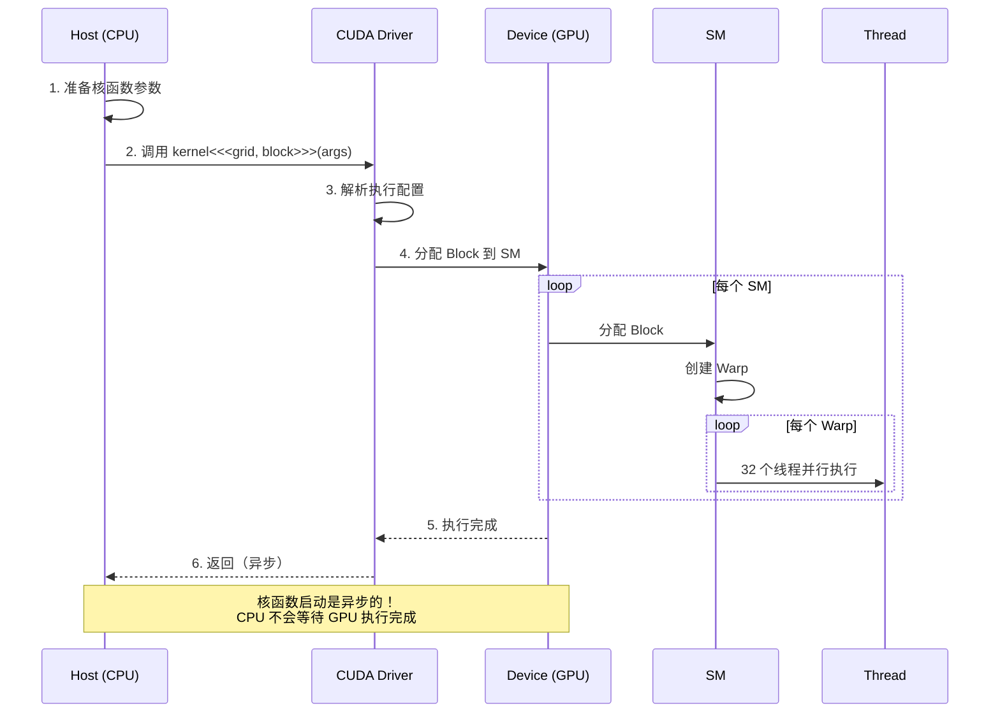

### 5.2 线程索引计算详解

```mermaid
graph TB
    subgraph "1D 索引计算"
        F1["idx = blockIdx.x × blockDim.x + threadIdx.x"]
        E1["示例：<br/>Grid: 10 个 Block<br/>Block: 256 线程<br/>Block 3, Thread 100<br/>idx = 3 × 256 + 100 = 868"]
    end

    subgraph "2D 索引计算"
        F2["x = blockIdx.x × blockDim.x + threadIdx.x<br/>y = blockIdx.y × blockDim.y + threadIdx.y<br/>idx = y × width + x"]
        E2["示例：<br/>图像 64×64<br/>Block (2, 3), Thread (8, 4)<br/>BlockDim (16, 16)<br/>x = 2×16+8 = 40<br/>y = 3×16+4 = 52<br/>idx = 52×64+40 = 3328"]
    end

    subgraph "3D 索引计算"
        F3["x = blockIdx.x × blockDim.x + threadIdx.x<br/>y = blockIdx.y × blockDim.y + threadIdx.y<br/>z = blockIdx.z × blockDim.z + threadIdx.z<br/>idx = z × nx × ny + y × nx + x"]
        E3["示例：<br/>体积 32×32×32<br/>Block (1,2,1), Thread (4,0,2)<br/>BlockDim (8,8,8)<br/>x = 1×8+4 = 12<br/>y = 2×8+0 = 16<br/>z = 1×8+2 = 10<br/>idx = 10×32×32+16×32+12 = 10764"]
    end

    F1 --> E1
    F2 --> E2
    F3 --> E3

    style 1D 索引计算 fill:#E3F2FD
    style 2D 索引计算 fill:#E8F5E9
    style 3D 索引计算 fill:#FFF3E0
```

### 5.3 Block 和 Grid 大小选择

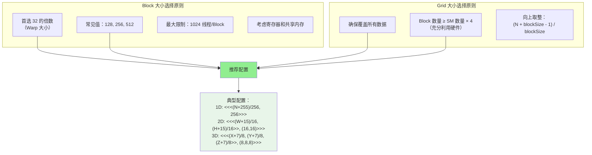

---

## 6. 常见错误与调试

### 6.1 常见错误

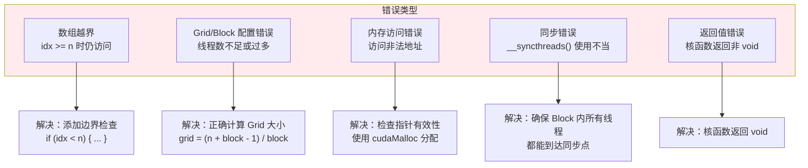

### 6.2 错误检查示例

```cpp
// ========== 错误检查宏 ==========
#define CUDA_CHECK(call)                                        \
    do {                                                         \
        cudaError_t err = call;                                  \
        if (err != cudaSuccess) {                                \
            printf("CUDA Error at %s:%d: %s\n",                  \
                   __FILE__, __LINE__,                           \
                   cudaGetErrorString(err));                     \
            exit(1);                                             \
        }                                                        \
    } while(0)

// 使用示例
int main() {
    float *d_data;
    CUDA_CHECK(cudaMalloc(&d_data, 1024 * sizeof(float)));

    my_kernel<<<10, 256>>>(d_data, 1024);

    // 检查核函数启动错误
    CUDA_CHECK(cudaGetLastError());

    // 等待核函数完成
    CUDA_CHECK(cudaDeviceSynchronize());

    CUDA_CHECK(cudaFree(d_data));
    return 0;
}
```

---

## 7. 本章小结

### 7.1 知识图谱

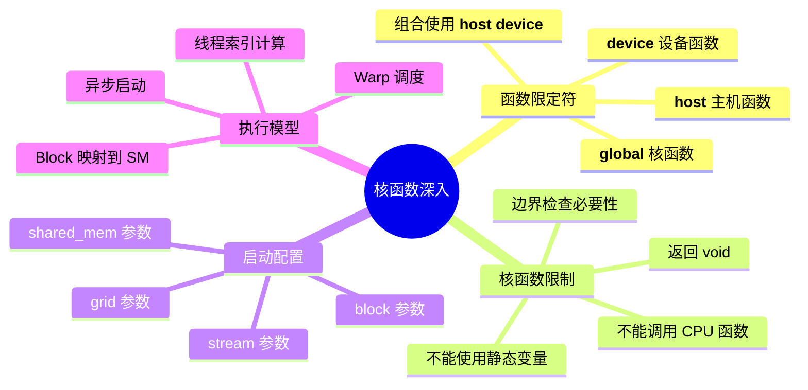

### 7.2 关键要点

1. **__global__** 核函数由 CPU 调用，在 GPU 上执行，是并行计算的入口
2. **__device__** 设备函数只能在 GPU 内部调用，用于代码复用
3. **<<<grid, block>>>** 配置决定了线程的组织方式和数量
4. **线程索引计算** 是核函数的核心，确保每个线程处理正确的数据
5. **边界检查** 是防止数组越界的必要手段

### 7.3 最佳实践

| 场景 | 推荐配置 | 说明 |
|------|----------|------|
| 1D 数组 | block=256, grid=(n+255)/256 | Warp 对齐，效率高 |
| 2D 图像 | block=(16,16), grid 覆盖图像 | 每个 Block 256 线程 |
| 3D 体积 | block=(8,8,8), grid 覆盖体积 | 每个 Block 512 线程 |
| 通用 | block=128/256, grid≥4×SM数 | 充分利用硬件 |

### 7.4 思考题

1. 为什么核函数的返回值必须是 void？如果需要返回结果应该怎么做？
2. `__device__` 函数和 `__global__` 函数有什么区别？
3. 如果数据量是 1000，Block 大小是 256，应该配置多少个 Block？
4. 2D 索引 (x, y) 如何转换为 1D 索引？

---

## 下一章

[第八章：线程层级结构](./08_线程层级结构.md) - 深入理解 Grid、Block、Thread 的组织方式

---

*参考资料：[CUDA C++ Programming Guide](https://docs.nvidia.com/cuda/cuda-c-programming-guide/) | [CUDA Best Practices Guide](https://docs.nvidia.com/cuda/cuda-c-best-practices-guide/)*