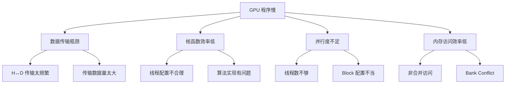
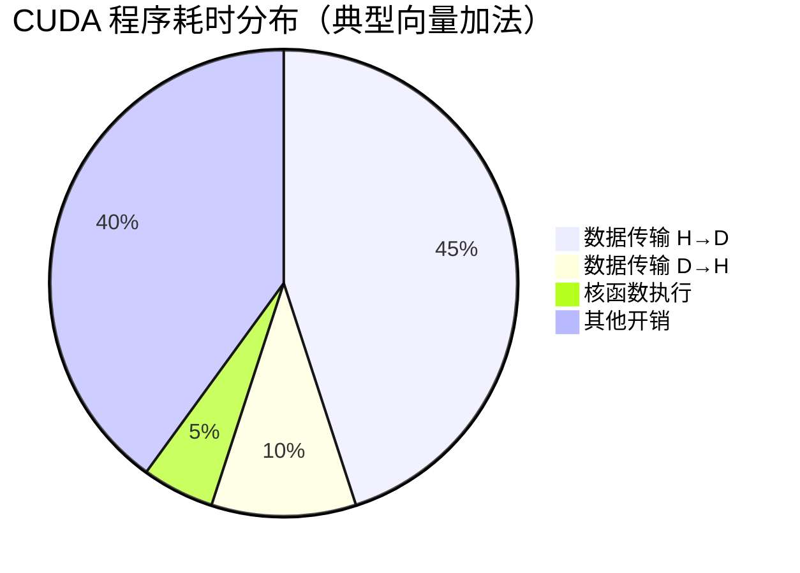
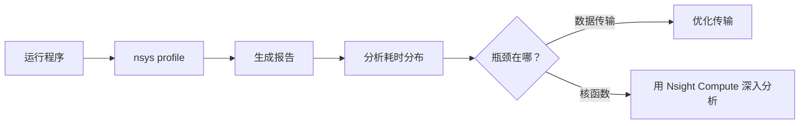
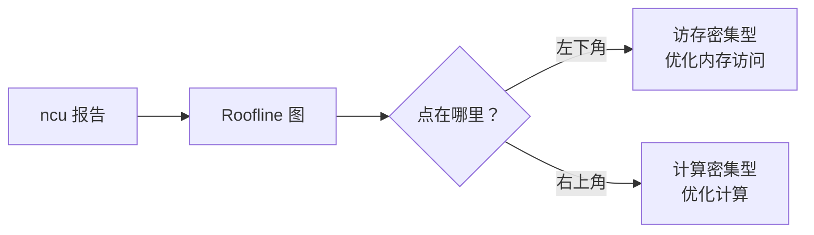
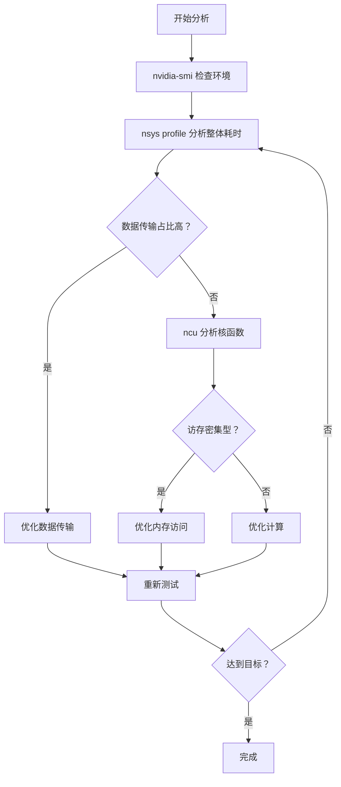
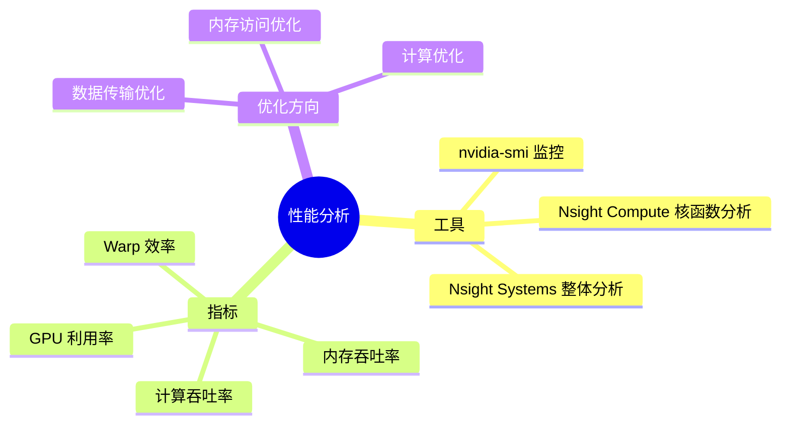

# 第八章：性能分析入门

> 学习目标：学会使用工具分析 CUDA 程序性能，找出瓶颈
>
> 预计阅读时间：20 分钟
>
> 前置知识：[第七章：核函数深入](./07_核函数深入.md)

---

## 1. 为什么我的程序不快？

### 1.1 一个常见的问题场景

你写好了第一个 CUDA 程序，运行也成功了，但是：

> "为什么我的 GPU 程序比 CPU 还慢？"

这是每个 CUDA 初学者都会遇到的问题。

### 1.2 性能瓶颈的可能原因



### 1.3 CUDA 程序的耗时组成



**关键洞察**：对于简单算子，数据传输时间往往远大于计算时间！

---

## 2. nvidia-smi：GPU 监控基础

### 2.1 什么是 nvidia-smi？

**nvidia-smi**（NVIDIA System Management Interface）是 NVIDIA 提供的 GPU 监控工具。

### 2.2 基本用法

```bash
# 查看 GPU 状态
nvidia-smi

# 每秒刷新一次
watch -n 1 nvidia-smi

# 查看详细信息
nvidia-smi -q

# 只看特定信息
nvidia-smi --query-gpu=name,memory.total,memory.used --format=csv
```

### 2.3 输出解读

```
+-----------------------------------------------------------------------------+
| NVIDIA-SMI 525.85.12    Driver Version: 525.85.12    CUDA Version: 12.0   |
|-------------------------------+----------------------+----------------------+
| GPU  Name        Persistence-M| Bus-Id        Disp.A | Volatile Uncorr. ECC |
| Fan  Temp  Perf  Pwr:Usage/Cap|         Memory-Usage | GPU-Util  Compute M. |
|===============================+======================+======================|
|   0  NVIDIA A100-SXM...  On   | 00000000:00:04.0 Off |                    0 |
| N/A   32C    P0    50W / 400W |      4MiB / 81920MiB |      0%      Default |
+-------------------------------+----------------------+----------------------+
```

| 字段 | 含义 |
|------|------|
| **GPU-Util** | GPU 计算利用率 |
| **Memory-Usage** | 显存使用量 |
| **Temp** | GPU 温度 |
| **Pwr** | 功耗 |

### 2.4 常用查询命令

```bash
# 查看计算能力
nvidia-smi --query-gpu=compute_cap --format=csv

# 查看显存信息
nvidia-smi --query-gpu=memory.total,memory.used,memory.free --format=csv

# 查看 GPU 名称
nvidia-smi --query-gpu=name --format=csv

# 查看所有 GPU 的 UUID
nvidia-smi --query-gpu=uuid --format=csv
```

---

## 3. Nsight Systems：系统级分析

### 3.1 什么是 Nsight Systems？

**Nsight Systems**（nsys）是 NVIDIA 的系统级性能分析工具，可以分析整个程序的执行情况。

### 3.2 使用方法

```bash
# 基本用法
nsys profile ./your_program

# 生成报告文件
nsys profile -o report ./your_program

# 显示详细统计
nsys profile --stats=true ./your_program

# 分析已有报告
nsys stats report.nsys-rep
```

### 3.3 分析输出示例

```
Time (%)  Total Time   Instances  Average    Name
--------  -----------  ---------  --------   ----
   85.3%   12.5 ms            1   12.5 ms   cudaMemcpy HtoD
    9.2%    1.35 ms           1    1.35 ms  cudaMemcpy DtoH
    5.5%    0.81 ms           1    0.81 ms  vector_add_kernel
```

### 3.4 分析流程



---

## 4. Nsight Compute：内核级分析

### 4.1 什么是 Nsight Compute？

**Nsight Compute**（ncu）是 NVIDIA 的内核级性能分析工具，可以深入分析单个核函数的性能。

### 4.2 使用方法

```bash
# 基本用法
ncu ./your_program

# 生成报告文件
ncu -o report ./your_program

# 完整分析
ncu --set full ./your_program

# GUI 查看报告
ncu-ui report.ncu-rep
```

### 4.3 关键指标解读

| 指标 | 含义 | 理想值 |
|------|------|--------|
| **GPU Time** | 核函数执行时间 | 越低越好 |
| **Memory Throughput** | 内存吞吐率 | 接近带宽上限 |
| **Compute Throughput** | 计算吞吐率 | 接近算力上限 |
| **Warp Execution Efficiency** | Warp 执行效率 | 接近 100% |

### 4.4 Roofline 分析



### 4.5 常见问题和优化方向

| 问题 | 指标表现 | 优化方向 |
|------|----------|----------|
| **内存带宽不足** | Memory Throughput 低 | 向量化访问、合并访问 |
| **Warp 分歧** | Warp Efficiency 低 | 减少分支、重排线程 |
| **计算不足** | Compute Throughput 低 | 增加计算量、算子融合 |

---

## 5. 性能分析工作流

### 5.1 标准分析流程



### 5.2 各工具的适用场景

| 工具 | 分析粒度 | 适用场景 |
|------|----------|----------|
| **nvidia-smi** | GPU 级别 | 监控 GPU 状态、资源使用 |
| **Nsight Systems** | 程序级别 | 分析整体耗时分布、API 调用 |
| **Nsight Compute** | 核函数级别 | 深入分析单个核函数性能 |

---

## 6. 实战示例

### 6.1 分析向量加法程序

```bash
# 1. 编译程序
nvcc -arch=sm_80 vector_add.cu -o vector_add

# 2. 检查 GPU 状态
nvidia-smi

# 3. 系统级分析
nsys profile --stats=true ./vector_add

# 4. 查看耗时分布
nsys stats report.nsys-rep

# 5. 如果核函数是瓶颈，深入分析
ncu --set full ./vector_add
```

### 6.2 解读 Nsight Compute 报告

```
Section: GPU Speed of Light Throughput
┌─────────────────────────────────────────────────────────────┐
│ Memory Throughput                          65.2%  ████████ │
│ Compute Throughput                          5.1%  █        │
└─────────────────────────────────────────────────────────────┘

分析结论：
- 内存吞吐率 65%，说明内存访问还有优化空间
- 计算吞吐率只有 5%，说明这是访存密集型算子
- 优化方向：提升内存访问效率
```

---

## 7. 本章小结

### 7.1 工具速查表

| 工具 | 命令 | 用途 |
|------|------|------|
| nvidia-smi | `nvidia-smi` | GPU 状态监控 |
| Nsight Systems | `nsys profile` | 整体耗时分析 |
| Nsight Compute | `ncu` | 核函数深入分析 |

### 7.2 分析要点



### 7.3 思考题

1. 如何判断一个程序是访存密集型还是计算密集型？
2. 为什么数据传输时间往往比核函数时间还长？
3. 如果 Warp Efficiency 很低，可能是什么原因？

---

## 下一章

[第九章：内存访问优化](./09_内存访问优化.md) - 学习如何优化 GPU 内存访问

---

*参考资料：[Nsight Systems Documentation](https://docs.nvidia.com/nsight-systems/) | [Nsight Compute Documentation](https://docs.nvidia.com/nsight-compute/)*