# 第九章：内存访问优化

> 学习目标：理解 CUDA 全局内存访问模式，掌握合并访问和向量化访存技术
>
> 预计阅读时间：45 分钟
>
> 前置知识：[第六章：内存管理基础](./06_内存管理基础.md) | [第七章：核函数深入](./07_核函数深入.md)

---

## 1. 为什么内存访问优化很重要？

### 1.1 内存带宽：GPU 性能的关键瓶颈

在 GPU 编程中，内存访问往往是性能的主要瓶颈：

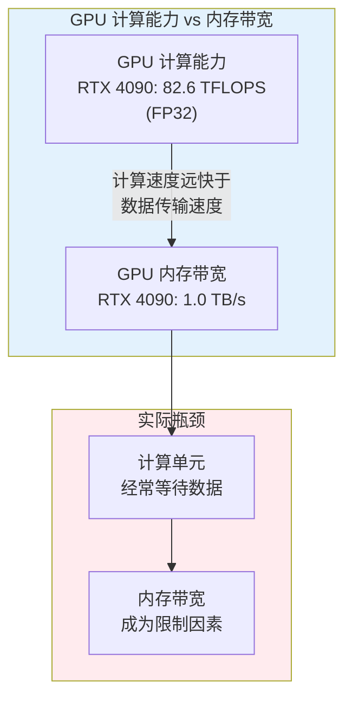

**关键洞察**：
- GPU 计算能力强大，但内存带宽有限
- 不良的内存访问模式会严重降低性能
- 优化内存访问是提升 CUDA 程序性能的关键

### 1.2 本章核心概念

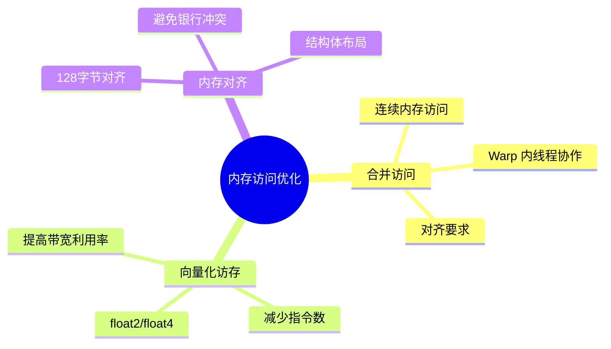

---

## 2. 全局内存访问模式

### 2.1 GPU 内存层次结构回顾

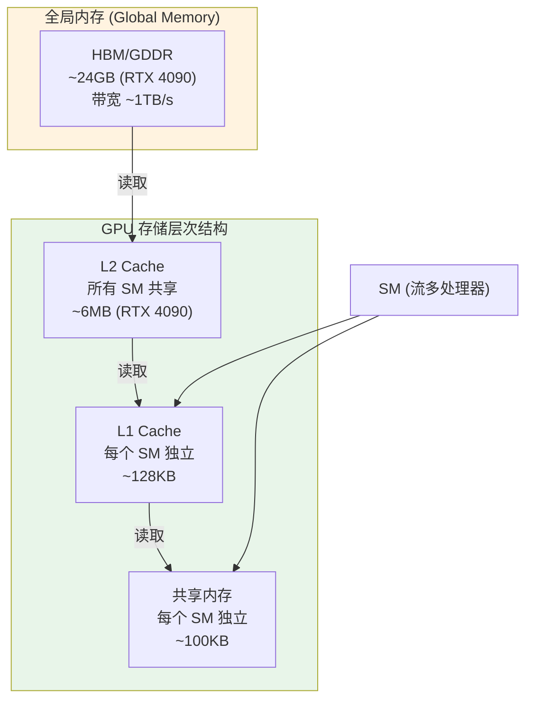

### 2.2 全局内存事务（Memory Transaction）

GPU 访问全局内存时，不是按字节传输，而是以"事务"为单位：

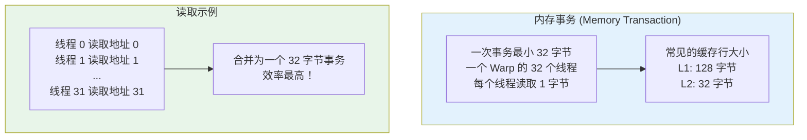

### 2.3 Warp 与内存访问

一个 Warp 包含 32 个线程，它们**同时**执行相同的指令：

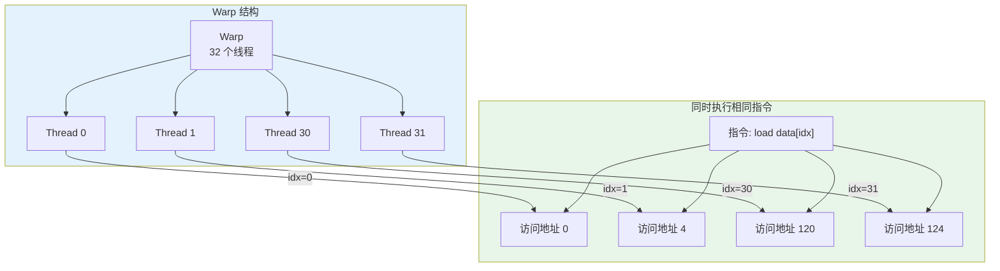

---

## 3. 合并访问（Coalesced Access）

### 3.1 什么是合并访问？

**合并访问**：当一个 Warp 的 32 个线程访问连续的内存地址时，GPU 可以将这些访问合并为最少数量的内存事务。

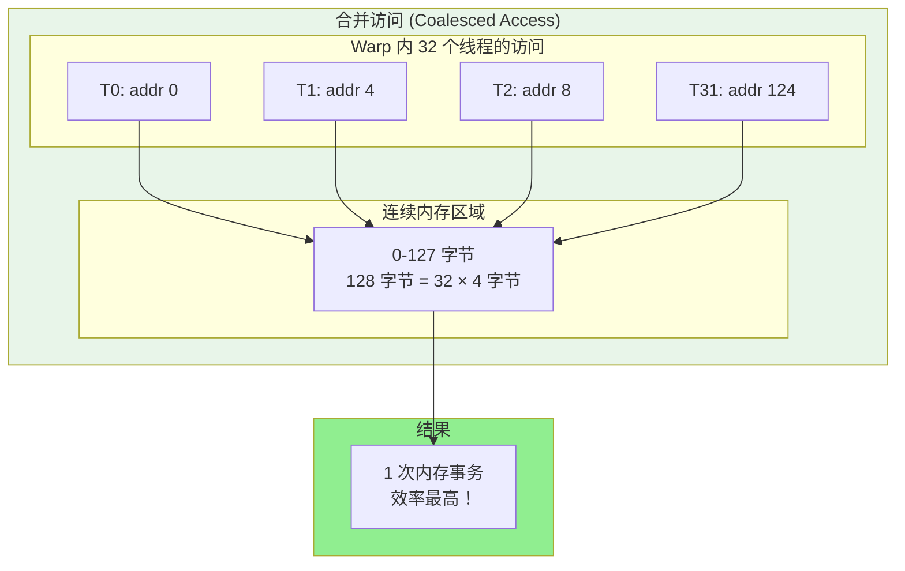

### 3.2 合并访问 vs 非合并访问

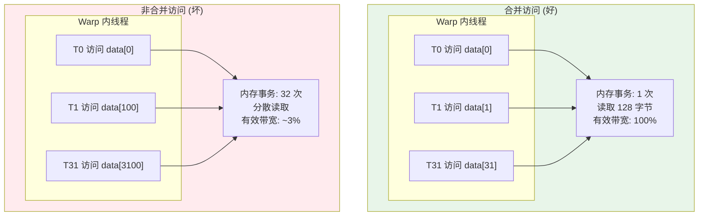

### 3.3 详细对比示例

```cpp
// ========== 文件：coalescing_demo.cu ==========
// 功能：演示合并访问与非合并访问的性能差异

#include <cuda_runtime.h>
#include <stdio.h>

// ------------------------------------------------
// 核函数 1：合并访问（好）
// 线程 i 访问 data[i]，地址连续
// ------------------------------------------------
__global__ void coalesced_access(float* data, int n) {
    // 步骤 1：计算线程索引
    int idx = blockIdx.x * blockDim.x + threadIdx.x;

    // 步骤 2：边界检查
    if (idx < n) {
        // 步骤 3：直接按索引访问
        // 关键点：相邻线程访问相邻地址
        // T0 -> data[0], T1 -> data[1], ...
        // 这是一个完美的合并访问模式
        data[idx] = data[idx] * 2.0f;
    }
}

// ------------------------------------------------
// 核函数 2：非合并访问（坏）
// 使用跨步访问，地址不连续
// ------------------------------------------------
__global__ void uncoalesced_access(float* data, int n, int stride) {
    // 步骤 1：计算线程索引
    int idx = blockIdx.x * blockDim.x + threadIdx.x;

    // 步骤 2：计算实际访问索引
    // 关键点：使用 stride 跨步
    // 当 stride = 32 时：
    // T0 -> data[0], T1 -> data[32], T2 -> data[64], ...
    // 相邻线程访问的地址相距很远，无法合并
    int access_idx = idx * stride;

    // 步骤 3：边界检查
    if (access_idx < n) {
        data[access_idx] = data[access_idx] * 2.0f;
    }
}

// ------------------------------------------------
// 核函数 3：交错访问（中等效率）
// 线程访问模式：T0 -> data[0], T1 -> data[32], T2 -> data[1], T3 -> data[33]
// ------------------------------------------------
__global__ void interleaved_access(float* data, int n) {
    int idx = blockIdx.x * blockDim.x + threadIdx.x;

    // 交错模式：每 32 个线程访问一个 32 元素块
    // T0-T31 访问 data[0-31]
    // 但访问顺序是：T0->0, T1->32, ..., T31->31
    int block = idx / 32;        // 哪个 32 元素块
    int lane = idx % 32;         // 块内偏移
    int access_idx = block * 32 + lane;

    if (access_idx < n) {
        data[access_idx] = data[access_idx] * 2.0f;
    }
}

// ------------------------------------------------
// 辅助函数：计算时间（毫秒）
// ------------------------------------------------
float elapsed_ms(cudaEvent_t start, cudaEvent_t stop) {
    cudaEventSynchronize(stop);
    float ms;
    cudaEventElapsedTime(&ms, start, stop);
    return ms;
}

// ------------------------------------------------
// 主函数：性能测试
// ------------------------------------------------
int main() {
    const int N = 32 * 1024 * 1024;  // 32M 元素
    const size_t bytes = N * sizeof(float);

    printf("=== 合并访问性能测试 ===\n");
    printf("数据量: %d 元素 (%.2f MB)\n\n", N, bytes / 1024.0 / 1024.0);

    // 分配内存
    float *d_data;
    cudaMalloc(&d_data, bytes);

    // 创建计时事件
    cudaEvent_t start, stop;
    cudaEventCreate(&start);
    cudaEventCreate(&stop);

    // 配置核函数
    int block_size = 256;
    int grid_size = (N + block_size - 1) / block_size;

    // ----------------------------------------
    // 测试 1：合并访问
    // ----------------------------------------
    cudaEventRecord(start);
    for (int i = 0; i < 10; i++) {
        coalesced_access<<<grid_size, block_size>>>(d_data, N);
    }
    cudaEventRecord(stop);
    cudaEventSynchronize(stop);
    float time_coalesced = elapsed_ms(start, stop) / 10.0f;

    printf("[合并访问]\n");
    printf("  平均时间: %.3f ms\n", time_coalesced);
    printf("  有效带宽: %.2f GB/s\n", (2.0 * bytes) / (time_coalesced * 1e6));

    // ----------------------------------------
    // 测试 2：非合并访问（stride = 32）
    // ----------------------------------------
    int stride = 32;
    int grid_size2 = ((N / stride) + block_size - 1) / block_size;

    cudaEventRecord(start);
    for (int i = 0; i < 10; i++) {
        uncoalesced_access<<<grid_size2, block_size>>>(d_data, N, stride);
    }
    cudaEventRecord(stop);
    cudaEventSynchronize(stop);
    float time_uncoalesced = elapsed_ms(start, stop) / 10.0f;

    printf("\n[非合并访问, stride=%d]\n", stride);
    printf("  平均时间: %.3f ms\n", time_uncoalesced);
    printf("  有效带宽: %.2f GB/s\n", (2.0 * bytes / stride) / (time_uncoalesced * 1e6));
    printf("  性能下降: %.1fx\n", time_uncoalesced / time_coalesced);

    // 清理
    cudaEventDestroy(start);
    cudaEventDestroy(stop);
    cudaFree(d_data);

    return 0;
}
```

### 3.4 合并访问的条件

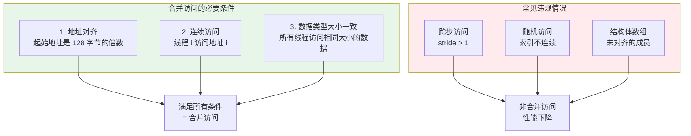

### 3.5 内存访问模式图解

#### 官方文档：共享内存访问模式


> **图示说明**（来自 CUDA C++ Programming Guide 12.2.1）：跨步共享内存访问示例。当访问模式不是连续的时，会导致多个内存事务，降低带宽利用率。


> **图示说明**（来自 CUDA C++ Programming Guide 12.2.1）：不规则共享内存访问示例。随机或不规则的访问模式会严重影响性能。

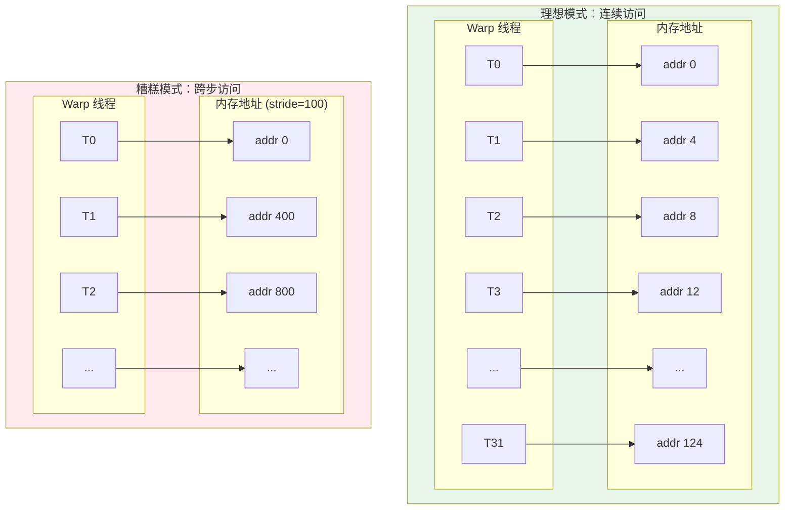

---

## 4. 向量化访存（Vectorized Memory Access）

### 4.1 什么是向量化访存？

向量化访存是指使用 `float2`、`float4`、`int2`、`int4` 等向量类型，一次读写多个数据元素：


### 4.2 向量类型详解

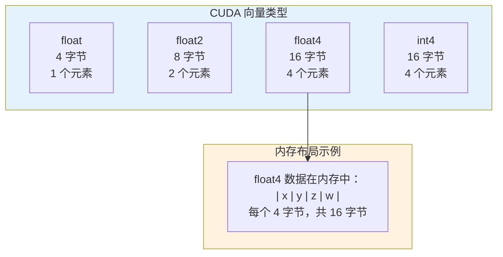

### 4.3 向量化访存的优势


### 4.4 向量化访存代码示例

```cpp
// ========== 文件：vectorized_access.cu ==========
// 功能：演示向量化访存的实现和性能优势

#include <cuda_runtime.h>
#include <stdio.h>

// ------------------------------------------------
// 核函数 1：标量访问（基准）
// 每个线程处理 1 个元素
// ------------------------------------------------
__global__ void scalar_copy(const float* __restrict__ src,
                            float* __restrict__ dst,
                            int n) {
    // 步骤 1：计算线程索引
    int idx = blockIdx.x * blockDim.x + threadIdx.x;

    // 步骤 2：边界检查
    if (idx < n) {
        // 步骤 3：标量加载和存储
        // 每个线程加载 1 个 float (4 字节)
        dst[idx] = src[idx];
    }
}

// ------------------------------------------------
// 核函数 2：使用 float2 向量化访存
// 每个线程处理 2 个元素
// ------------------------------------------------
__global__ void vectorized_copy_float2(const float* __restrict__ src,
                                       float* __restrict__ dst,
                                       int n) {
    // 步骤 1：将指针转换为 float2 类型
    // float2 包含 2 个 float，共 8 字节
    const float2* src2 = reinterpret_cast<const float2*>(src);
    float2* dst2 = reinterpret_cast<float2*>(dst);

    // 步骤 2：计算线程索引
    // 因为每个线程处理 2 个元素，所以总线程数减半
    int idx = blockIdx.x * blockDim.x + threadIdx.x;
    int n2 = n / 2;  // float2 数组的元素数

    // 步骤 3：边界检查
    if (idx < n2) {
        // 步骤 4：向量加载和存储
        // 一次加载 8 字节（2 个 float）
        // float2 结构: {x, y} 分别是两个 float
        float2 val = src2[idx];

        // 可以分别访问 x 和 y 成员
        // val.x 和 val.y

        // 步骤 5：向量存储
        dst2[idx] = val;
    }

    // 步骤 6：处理剩余元素（如果 n 不是 2 的倍数）
    if (n % 2 != 0 && idx == n2) {
        dst[n - 1] = src[n - 1];
    }
}

// ------------------------------------------------
// 核函数 3：使用 float4 向量化访存（最高效）
// 每个线程处理 4 个元素
// ------------------------------------------------
__global__ void vectorized_copy_float4(const float* __restrict__ src,
                                       float* __restrict__ dst,
                                       int n) {
    // 步骤 1：将指针转换为 float4 类型
    // float4 包含 4 个 float，共 16 字节
    // 这是 GPU 内存访问的最佳粒度之一
    const float4* src4 = reinterpret_cast<const float4*>(src);
    float4* dst4 = reinterpret_cast<float4*>(dst);

    // 步骤 2：计算线程索引
    // 因为每个线程处理 4 个元素，所以总线程数是原来的 1/4
    int idx = blockIdx.x * blockDim.x + threadIdx.x;
    int n4 = n / 4;  // float4 数组的元素数

    // 步骤 3：边界检查
    if (idx < n4) {
        // 步骤 4：向量加载
        // 一次加载 16 字节（4 个 float）
        // 这是 GPU 内存系统的最佳访问粒度
        float4 val = src4[idx];

        // 步骤 5：可以对每个分量进行操作
        // val.x, val.y, val.z, val.w
        // 例如：各分量乘以 2
        // val.x *= 2.0f;
        // val.y *= 2.0f;
        // val.z *= 2.0f;
        // val.w *= 2.0f;

        // 步骤 6：向量存储
        dst4[idx] = val;
    }

    // 步骤 7：处理剩余元素（如果 n 不是 4 的倍数）
    int remaining_start = n4 * 4;
    for (int i = remaining_start + idx; i < n; i += blockDim.x * gridDim.x) {
        dst[i] = src[i];
    }
}

// ------------------------------------------------
// 核函数 4：使用 float4 进行向量加法
// 展示实际计算中的应用
// ------------------------------------------------
__global__ void vectorized_add_float4(const float* __restrict__ a,
                                      const float* __restrict__ b,
                                      float* __restrict__ c,
                                      int n) {
    // 步骤 1：转换指针类型
    const float4* a4 = reinterpret_cast<const float4*>(a);
    const float4* b4 = reinterpret_cast<const float4*>(b);
    float4* c4 = reinterpret_cast<float4*>(c);

    // 步骤 2：计算索引
    int idx = blockIdx.x * blockDim.x + threadIdx.x;
    int n4 = n / 4;

    // 步骤 3：向量化加法
    if (idx < n4) {
        // 加载 4 个元素
        float4 va = a4[idx];
        float4 vb = b4[idx];

        // 逐分量加法
        // GPU 会并行执行这 4 个加法
        float4 vc;
        vc.x = va.x + vb.x;
        vc.y = va.y + vb.y;
        vc.z = va.z + vb.z;
        vc.w = va.w + vb.w;

        // 存储 4 个结果
        c4[idx] = vc;
    }

    // 步骤 4：处理剩余元素
    int remaining_start = n4 * 4;
    for (int i = remaining_start + idx; i < n; i += blockDim.x * gridDim.x) {
        c[i] = a[i] + b[i];
    }
}

// ------------------------------------------------
// 辅助宏：CUDA 错误检查
// ------------------------------------------------
#define CUDA_CHECK(call)                                    \
    do {                                                     \
        cudaError_t err = call;                              \
        if (err != cudaSuccess) {                            \
            fprintf(stderr, "CUDA 错误 %s:%d: %s\n",        \
                    __FILE__, __LINE__,                      \
                    cudaGetErrorString(err));                \
            exit(EXIT_FAILURE);                              \
        }                                                    \
    } while (0)

// ------------------------------------------------
// 主函数：性能对比测试
// ------------------------------------------------
int main() {
    // 数据大小：16M 个 float = 64MB
    const int N = 16 * 1024 * 1024;
    const size_t bytes = N * sizeof(float);

    printf("=== 向量化访存性能测试 ===\n");
    printf("数据量: %d 元素 (%.2f MB)\n\n", N, bytes / 1024.0 / 1024.0);

    // 分配主机内存
    float *h_src = (float*)malloc(bytes);
    float *h_dst = (float*)malloc(bytes);

    // 初始化数据
    for (int i = 0; i < N; i++) {
        h_src[i] = (float)i;
    }

    // 分配设备内存
    // 使用 cudaMalloc 分配的内存默认 256 字节对齐
    // 满足 float4 的 16 字节对齐要求
    float *d_src, *d_dst;
    CUDA_CHECK(cudaMalloc(&d_src, bytes));
    CUDA_CHECK(cudaMalloc(&d_dst, bytes));

    // 拷贝数据到设备
    CUDA_CHECK(cudaMemcpy(d_src, h_src, bytes, cudaMemcpyHostToDevice));

    // 创建计时事件
    cudaEvent_t start, stop;
    cudaEventCreate(&start);
    cudaEventCreate(&stop);

    // 核函数配置
    int block_size = 256;

    // ----------------------------------------
    // 测试 1：标量访问
    // ----------------------------------------
    int grid_scalar = (N + block_size - 1) / block_size;

    cudaEventRecord(start);
    for (int i = 0; i < 10; i++) {
        scalar_copy<<<grid_scalar, block_size>>>(d_src, d_dst, N);
    }
    cudaEventRecord(stop);
    CUDA_CHECK(cudaEventSynchronize(stop));

    float ms_scalar;
    cudaEventElapsedTime(&ms_scalar, start, stop);
    ms_scalar /= 10.0f;

    float bandwidth_scalar = (2.0 * bytes) / (ms_scalar * 1e6);

    printf("[1] 标量访问 (float):\n");
    printf("    时间: %.3f ms\n", ms_scalar);
    printf("    带宽: %.2f GB/s\n\n", bandwidth_scalar);

    // ----------------------------------------
    // 测试 2：float2 向量化
    // ----------------------------------------
    int grid_float2 = (N / 2 + block_size - 1) / block_size;

    cudaEventRecord(start);
    for (int i = 0; i < 10; i++) {
        vectorized_copy_float2<<<grid_float2, block_size>>>(d_src, d_dst, N);
    }
    cudaEventRecord(stop);
    CUDA_CHECK(cudaEventSynchronize(stop));

    float ms_float2;
    cudaEventElapsedTime(&ms_float2, start, stop);
    ms_float2 /= 10.0f;

    float bandwidth_float2 = (2.0 * bytes) / (ms_float2 * 1e6);

    printf("[2] 向量化访问 (float2):\n");
    printf("    时间: %.3f ms\n", ms_float2);
    printf("    带宽: %.2f GB/s\n", bandwidth_float2);
    printf("    相比标量加速: %.2fx\n\n", ms_scalar / ms_float2);

    // ----------------------------------------
    // 测试 3：float4 向量化
    // ----------------------------------------
    int grid_float4 = (N / 4 + block_size - 1) / block_size;

    cudaEventRecord(start);
    for (int i = 0; i < 10; i++) {
        vectorized_copy_float4<<<grid_float4, block_size>>>(d_src, d_dst, N);
    }
    cudaEventRecord(stop);
    CUDA_CHECK(cudaEventSynchronize(stop));

    float ms_float4;
    cudaEventElapsedTime(&ms_float4, start, stop);
    ms_float4 /= 10.0f;

    float bandwidth_float4 = (2.0 * bytes) / (ms_float4 * 1e6);

    printf("[3] 向量化访问 (float4):\n");
    printf("    时间: %.3f ms\n", ms_float4);
    printf("    带宽: %.2f GB/s\n", bandwidth_float4);
    printf("    相比标量加速: %.2fx\n\n", ms_scalar / ms_float4);

    // 验证结果
    CUDA_CHECK(cudaMemcpy(h_dst, d_dst, bytes, cudaMemcpyDeviceToHost));
    bool correct = true;
    for (int i = 0; i < N; i++) {
        if (h_dst[i] != h_src[i]) {
            correct = false;
            break;
        }
    }
    printf("验证: %s\n", correct ? "通过" : "失败");

    // 清理
    cudaEventDestroy(start);
    cudaEventDestroy(stop);
    cudaFree(d_src);
    cudaFree(d_dst);
    free(h_src);
    free(h_dst);

    return 0;
}
```

### 4.5 使用向量化访存的注意事项

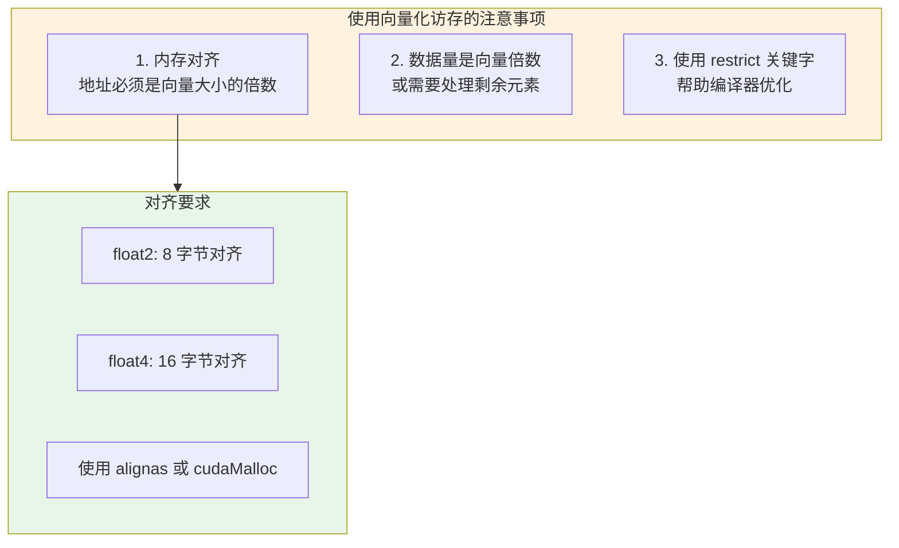

---

## 5. 为什么 float3 比 float4 慢？

### 5.1 float3 vs float4 内存布局

这是一个经典的性能陷阱：


### 5.2 内存对齐问题图解

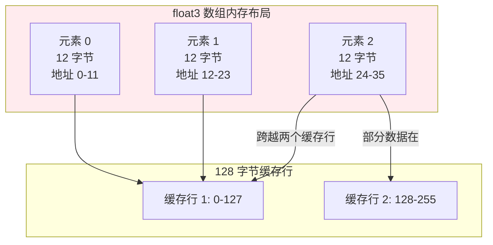

### 5.3 对比代码示例

```cpp
// ========== 文件：float3_vs_float4.cu ==========
// 功能：演示 float3 和 float4 的性能差异

#include <cuda_runtime.h>
#include <stdio.h>

// ------------------------------------------------
// 使用 float3 的结构体（不推荐）
// ------------------------------------------------
struct Float3 {
    float x, y, z;
};

// ------------------------------------------------
// 使用 float4 的结构体（推荐）
// 即使 w 分量不使用，也比 float3 快
// ------------------------------------------------
struct Float4 {
    float x, y, z, w;  // w 可能是填充或未使用
};

// ------------------------------------------------
// 核函数：处理 float3 数据
// 注意：性能较差！
// ------------------------------------------------
__global__ void process_float3(const Float3* __restrict__ input,
                               Float3* __restrict__ output,
                               int n) {
    int idx = blockIdx.x * blockDim.x + threadIdx.x;

    if (idx < n) {
        // 加载 float3 (12 字节)
        // 问题：不满足 16 字节对齐
        // GPU 需要额外的内存事务
        Float3 val = input[idx];

        // 处理数据
        val.x *= 2.0f;
        val.y *= 2.0f;
        val.z *= 2.0f;

        output[idx] = val;
    }
}

// ------------------------------------------------
// 核函数：处理 float4 数据
// 推荐：性能更好！
// ------------------------------------------------
__global__ void process_float4(const Float4* __restrict__ input,
                               Float4* __restrict__ output,
                               int n) {
    int idx = blockIdx.x * blockDim.x + threadIdx.x;

    if (idx < n) {
        // 加载 float4 (16 字节)
        // 优势：完美对齐，单次内存事务
        Float4 val = input[idx];

        // 处理数据
        val.x *= 2.0f;
        val.y *= 2.0f;
        val.z *= 2.0f;
        // val.w 未使用，但不影响性能

        output[idx] = val;
    }
}

// ------------------------------------------------
// 推荐的替代方案：使用结构体数组 (AoS) 转 数组结构体 (SoA)
// ------------------------------------------------
__global__ void process_soa(const float* __restrict__ x,
                            const float* __restrict__ y,
                            const float* __restrict__ z,
                            float* __restrict__ out_x,
                            float* __restrict__ out_y,
                            float* __restrict__ out_z,
                            int n) {
    int idx = blockIdx.x * blockDim.x + threadIdx.x;

    if (idx < n) {
        // 每个数组都是连续的 float
        // 完美的合并访问模式
        out_x[idx] = x[idx] * 2.0f;
        out_y[idx] = y[idx] * 2.0f;
        out_z[idx] = z[idx] * 2.0f;
    }
}

// ------------------------------------------------
// 主函数：性能对比
// ------------------------------------------------
int main() {
    const int N = 1024 * 1024;  // 1M 元素

    printf("=== float3 vs float4 性能对比 ===\n");
    printf("元素数量: %d\n\n", N);

    // 计算内存大小
    size_t bytes_float3 = N * sizeof(Float3);  // 12 MB
    size_t bytes_float4 = N * sizeof(Float4);  // 16 MB

    printf("float3 内存: %.2f MB\n", bytes_float3 / 1024.0 / 1024.0);
    printf("float4 内存: %.2f MB\n", bytes_float4 / 1024.0 / 1024.0);
    printf("float4 多用 %.2f MB 内存，但性能更好\n\n",
           (bytes_float4 - bytes_float3) / 1024.0 / 1024.0);

    // 分配内存
    Float3 *d_in3, *d_out3;
    Float4 *d_in4, *d_out4;

    cudaMalloc(&d_in3, bytes_float3);
    cudaMalloc(&d_out3, bytes_float3);
    cudaMalloc(&d_in4, bytes_float4);
    cudaMalloc(&d_out4, bytes_float4);

    // 计时
    cudaEvent_t start, stop;
    cudaEventCreate(&start);
    cudaEventCreate(&stop);

    int block = 256;
    int grid = (N + block - 1) / block;

    // 测试 float3
    cudaEventRecord(start);
    for (int i = 0; i < 100; i++) {
        process_float3<<<grid, block>>>(d_in3, d_out3, N);
    }
    cudaEventRecord(stop);
    cudaEventSynchronize(stop);

    float ms3;
    cudaEventElapsedTime(&ms3, start, stop);
    ms3 /= 100.0f;

    // 测试 float4
    cudaEventRecord(start);
    for (int i = 0; i < 100; i++) {
        process_float4<<<grid, block>>>(d_in4, d_out4, N);
    }
    cudaEventRecord(stop);
    cudaEventSynchronize(stop);

    float ms4;
    cudaEventElapsedTime(&ms4, start, stop);
    ms4 /= 100.0f;

    printf("float3 时间: %.3f ms\n", ms3);
    printf("float4 时间: %.3f ms\n", ms4);
    printf("float4 快 %.2fx\n", ms3 / ms4);

    // 清理
    cudaEventDestroy(start);
    cudaEventDestroy(stop);
    cudaFree(d_in3);
    cudaFree(d_out3);
    cudaFree(d_in4);
    cudaFree(d_out4);

    return 0;
}
```

### 5.4 性能差异原因总结

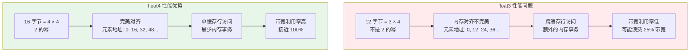

---

## 6. 实战：优化向量加法

### 6.1 完整的优化示例

下面展示一个完整的向量加法优化过程：

```cpp
// ========== 文件：optimized_vector_add.cu ==========
// 功能：展示向量加法的多种优化技术
// 编译: nvcc -O3 -arch=sm_86 -o vector_add_opt optimized_vector_add.cu

#include <cuda_runtime.h>
#include <stdio.h>
#include <stdlib.h>

// ============================================
// 版本 1：基础版本（未优化）
// ============================================
__global__ void vector_add_v1(const float* a, const float* b, float* c, int n) {
    // 基础的向量加法
    // 每个线程处理 1 个元素
    int idx = blockIdx.x * blockDim.x + threadIdx.x;

    if (idx < n) {
        c[idx] = a[idx] + b[idx];
    }
}

// ============================================
// 版本 2：向量化访存 (float4)
// ============================================
__global__ void vector_add_v2(const float* __restrict__ a,
                              const float* __restrict__ b,
                              float* __restrict__ c,
                              int n) {
    // 使用 float4 向量化访存
    // 每个线程处理 4 个元素

    // 步骤 1：指针类型转换
    // __restrict__ 告诉编译器指针不重叠，可以进行更激进的优化
    const float4* a4 = reinterpret_cast<const float4*>(a);
    const float4* b4 = reinterpret_cast<const float4*>(b);
    float4* c4 = reinterpret_cast<float4*>(c);

    // 步骤 2：计算索引
    int idx = blockIdx.x * blockDim.x + threadIdx.x;
    int n4 = n / 4;  // float4 元素数量

    // 步骤 3：向量化计算
    if (idx < n4) {
        // 一次加载 4 个 float
        float4 va = a4[idx];
        float4 vb = b4[idx];

        // 并行执行 4 个加法
        float4 vc;
        vc.x = va.x + vb.x;
        vc.y = va.y + vb.y;
        vc.z = va.z + vb.z;
        vc.w = va.w + vb.w;

        // 存储 4 个结果
        c4[idx] = vc;
    }

    // 步骤 4：处理剩余元素
    // 当 n 不是 4 的倍数时，处理尾部元素
    int remaining_start = n4 * 4;
    for (int i = remaining_start + idx; i < n; i += blockDim.x * gridDim.x) {
        c[i] = a[i] + b[i];
    }
}

// ============================================
// 版本 3：循环展开 + 向量化
// ============================================
__global__ void vector_add_v3(const float* __restrict__ a,
                              const float* __restrict__ b,
                              float* __restrict__ c,
                              int n) {
    // 每个线程处理多个 float4 元素
    // 使用循环展开进一步提高性能

    const float4* a4 = reinterpret_cast<const float4*>(a);
    const float4* b4 = reinterpret_cast<const float4*>(b);
    float4* c4 = reinterpret_cast<float4*>(c);

    // 步骤 1：计算每个线程处理的元素范围
    int idx = blockIdx.x * blockDim.x + threadIdx.x;
    int n4 = n / 4;

    // 步骤 2：每个线程处理 4 个 float4 (16 个 float)
    // 这减少了线程数量，提高了每个线程的工作量
    const int ITEMS_PER_THREAD = 4;
    int start = idx * ITEMS_PER_THREAD;
    int end = min(start + ITEMS_PER_THREAD, n4);

    // 步骤 3：处理分配的元素
    for (int i = start; i < end; i++) {
        float4 va = a4[i];
        float4 vb = b4[i];

        float4 vc;
        vc.x = va.x + vb.x;
        vc.y = va.y + vb.y;
        vc.z = va.z + vb.z;
        vc.w = va.w + vb.w;

        c4[i] = vc;
    }

    // 步骤 4：处理剩余元素
    int remaining_start = n4 * 4;
    int total_threads = blockDim.x * gridDim.x;
    for (int i = remaining_start + idx; i < n; i += total_threads) {
        c[i] = a[i] + b[i];
    }
}

// ============================================
// 版本 4：使用对齐内存分配
// ============================================
__global__ void vector_add_v4(const float* __restrict__ a,
                              const float* __restrict__ b,
                              float* __restrict__ c,
                              int n) {
    // 这个版本与 v2 相同，但使用 cudaMallocPitch 或对齐分配
    // 确保内存对齐到 128 字节边界

    const float4* a4 = reinterpret_cast<const float4*>(a);
    const float4* b4 = reinterpret_cast<const float4*>(b);
    float4* c4 = reinterpret_cast<float4*>(c);

    int idx = blockIdx.x * blockDim.x + threadIdx.x;
    int n4 = n / 4;

    if (idx < n4) {
        float4 va = a4[idx];
        float4 vb = b4[idx];

        float4 vc;
        vc.x = va.x + vb.x;
        vc.y = va.y + vb.y;
        vc.z = va.z + vb.z;
        vc.w = va.w + vb.w;

        c4[idx] = vc;
    }

    int remaining_start = n4 * 4;
    for (int i = remaining_start + idx; i < n; i += blockDim.x * gridDim.x) {
        c[i] = a[i] + b[i];
    }
}

// ============================================
// 辅助函数
// ============================================
#define CUDA_CHECK(call)                                    \
    do {                                                     \
        cudaError_t err = call;                              \
        if (err != cudaSuccess) {                            \
            fprintf(stderr, "CUDA 错误 %s:%d: %s\n",        \
                    __FILE__, __LINE__,                      \
                    cudaGetErrorString(err));                \
            exit(EXIT_FAILURE);                              \
        }                                                    \
    } while (0)

// 计算有效带宽 (GB/s)
float calc_bandwidth(size_t bytes, float ms) {
    // 向量加法: 读 a, 读 b, 写 c = 3 次内存访问
    return (3.0 * bytes) / (ms * 1e6);
}

// ============================================
// 主函数
// ============================================
int main() {
    // 数据大小：64M 元素 = 256 MB
    const int N = 64 * 1024 * 1024;
    const size_t bytes = N * sizeof(float);

    printf("================================================\n");
    printf("       向量加法优化技术对比测试\n");
    printf("================================================\n");
    printf("数据量: %d 元素 (%.2f MB)\n", N, bytes / 1024.0 / 1024.0);
    printf("------------------------------------------------\n\n");

    // 分配主机内存
    float *h_a = (float*)malloc(bytes);
    float *h_b = (float*)malloc(bytes);
    float *h_c = (float*)malloc(bytes);

    // 初始化数据
    for (int i = 0; i < N; i++) {
        h_a[i] = (float)i;
        h_b[i] = (float)(i * 2);
    }

    // 分配设备内存
    float *d_a, *d_b, *d_c;
    CUDA_CHECK(cudaMalloc(&d_a, bytes));
    CUDA_CHECK(cudaMalloc(&d_b, bytes));
    CUDA_CHECK(cudaMalloc(&d_c, bytes));

    // 拷贝数据到设备
    CUDA_CHECK(cudaMemcpy(d_a, h_a, bytes, cudaMemcpyHostToDevice));
    CUDA_CHECK(cudaMemcpy(d_b, h_b, bytes, cudaMemcpyHostToDevice));

    // 创建计时事件
    cudaEvent_t start, stop;
    CUDA_CHECK(cudaEventCreate(&start));
    CUDA_CHECK(cudaEventCreate(&stop));

    // 核函数配置
    int block_size = 256;

    printf("版本                          时间(ms)    带宽(GB/s)    加速比\n");
    printf("---------------------------------------------------------------\n");

    // ----------------------------------------
    // 测试版本 1：基础版本
    // ----------------------------------------
    int grid_v1 = (N + block_size - 1) / block_size;

    CUDA_CHECK(cudaEventRecord(start));
    for (int i = 0; i < 10; i++) {
        vector_add_v1<<<grid_v1, block_size>>>(d_a, d_b, d_c, N);
    }
    CUDA_CHECK(cudaEventRecord(stop));
    CUDA_CHECK(cudaEventSynchronize(stop));

    float ms_v1;
    CUDA_CHECK(cudaEventElapsedTime(&ms_v1, start, stop));
    ms_v1 /= 10.0f;

    printf("v1: 基础版本                  %7.3f     %8.2f       1.00x\n",
           ms_v1, calc_bandwidth(bytes, ms_v1));

    // ----------------------------------------
    // 测试版本 2：向量化 (float4)
    // ----------------------------------------
    int grid_v2 = (N / 4 + block_size - 1) / block_size;

    CUDA_CHECK(cudaEventRecord(start));
    for (int i = 0; i < 10; i++) {
        vector_add_v2<<<grid_v2, block_size>>>(d_a, d_b, d_c, N);
    }
    CUDA_CHECK(cudaEventRecord(stop));
    CUDA_CHECK(cudaEventSynchronize(stop));

    float ms_v2;
    CUDA_CHECK(cudaEventElapsedTime(&ms_v2, start, stop));
    ms_v2 /= 10.0f;

    printf("v2: 向量化 (float4)           %7.3f     %8.2f       %.2fx\n",
           ms_v2, calc_bandwidth(bytes, ms_v2), ms_v1 / ms_v2);

    // ----------------------------------------
    // 测试版本 3：循环展开 + 向量化
    // ----------------------------------------
    int items_per_thread = 4;
    int grid_v3 = ((N / 4) / items_per_thread + block_size - 1) / block_size;

    CUDA_CHECK(cudaEventRecord(start));
    for (int i = 0; i < 10; i++) {
        vector_add_v3<<<grid_v3, block_size>>>(d_a, d_b, d_c, N);
    }
    CUDA_CHECK(cudaEventRecord(stop));
    CUDA_CHECK(cudaEventSynchronize(stop));

    float ms_v3;
    CUDA_CHECK(cudaEventElapsedTime(&ms_v3, start, stop));
    ms_v3 /= 10.0f;

    printf("v3: 循环展开+向量化           %7.3f     %8.2f       %.2fx\n",
           ms_v3, calc_bandwidth(bytes, ms_v3), ms_v1 / ms_v3);

    printf("---------------------------------------------------------------\n\n");

    // 验证结果正确性
    CUDA_CHECK(cudaMemcpy(h_c, d_c, bytes, cudaMemcpyDeviceToHost));

    bool correct = true;
    for (int i = 0; i < min(N, 1000); i++) {
        float expected = h_a[i] + h_b[i];
        if (fabs(h_c[i] - expected) > 1e-5) {
            correct = false;
            printf("错误: c[%d] = %f, 期望 %f\n", i, h_c[i], expected);
            break;
        }
    }

    printf("结果验证: %s\n", correct ? "通过" : "失败");

    // 清理资源
    CUDA_CHECK(cudaEventDestroy(start));
    CUDA_CHECK(cudaEventDestroy(stop));
    CUDA_CHECK(cudaFree(d_a));
    CUDA_CHECK(cudaFree(d_b));
    CUDA_CHECK(cudaFree(d_c));
    free(h_a);
    free(h_b);
    free(h_c);

    printf("\n优化技术总结:\n");
    printf("1. 向量化访存 (float4): 减少内存事务数量\n");
    printf("2. __restrict__ 关键字: 帮助编译器优化\n");
    printf("3. 内存对齐: 确保高效的内存访问\n");
    printf("4. 循环展开: 减少循环开销\n");

    return 0;
}
```

### 6.2 优化技术对比

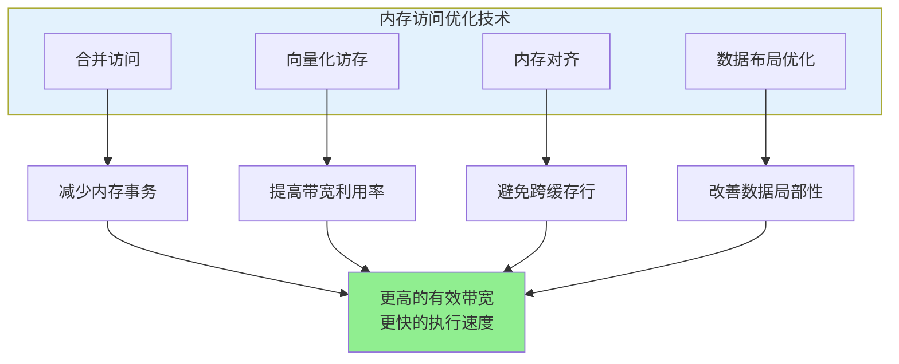

---

## 7. 内存对齐详解

### 7.1 什么是内存对齐？

**内存对齐**是指数据的内存地址是其大小的整数倍。GPU 对对齐的内存访问有显著的性能优势：


### 7.2 对齐要求

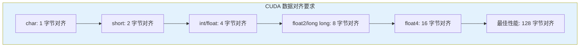

### 7.3 如何确保内存对齐

```cpp
// ========== 文件：memory_alignment.cu ==========
// 功能：演示内存对齐的正确方法

#include <cuda_runtime.h>
#include <stdio.h>

// ------------------------------------------------
// 方法 1：使用 alignas 说明符
// ------------------------------------------------
struct alignas(16) AlignedStruct {
    float x, y, z, w;
};

// ------------------------------------------------
// 方法 2：使用 __align__ (CUDA 特有)
// ------------------------------------------------
struct __align__(16) AlignedStruct2 {
    float x, y, z, w;
};

// ------------------------------------------------
// 方法 3：使用填充确保对齐
// ------------------------------------------------
struct PaddedStruct {
    float x, y, z;     // 12 字节
    float padding;      // 4 字节填充，总共 16 字节
};

// ------------------------------------------------
// 方法 4：使用 cudaMallocPitch
// 用于 2D 数组，自动处理对齐
// ------------------------------------------------
void allocate_aligned_2d() {
    int width = 1024;
    int height = 1024;
    size_t pitch;  // 实际的每行字节数（包含填充）

    float* d_data;
    // cudaMallocPitch 会自动添加填充以满足对齐要求
    // pitch 是实际分配的每行字节数，通常 >= width * sizeof(float)
    cudaMallocPitch(&d_data, &pitch, width * sizeof(float), height);

    printf("请求宽度: %zu 字节\n", width * sizeof(float));
    printf("实际宽度 (pitch): %zu 字节\n", pitch);
    printf("对齐到: %zu 字节边界\n", pitch / sizeof(float) * sizeof(float));

    // 使用 pitch 访问元素
    // 第 (row, col) 个元素的地址: d_data + row * pitch + col
    // 在核函数中：
    // float val = *(float*)((char*)d_data + row * pitch + col * sizeof(float));

    cudaFree(d_data);
}

// ------------------------------------------------
// 方法 5：使用 cudaMalloc 保证 256 字节对齐
// ------------------------------------------------
void allocate_aligned_1d() {
    // cudaMalloc 分配的内存默认至少 256 字节对齐
    // 这满足 float4 的 16 字节对齐要求
    float4* d_data;
    cudaMalloc(&d_data, 1024 * sizeof(float4));

    // 检查对齐
    printf("分配地址: %p\n", d_data);
    printf("是否 16 字节对齐: %s\n",
           ((size_t)d_data % 16 == 0) ? "是" : "否");

    cudaFree(d_data);
}

// ------------------------------------------------
// 核函数：正确使用 pitch 访问 2D 数组
// ------------------------------------------------
__global__ void process_2d_with_pitch(float* data, size_t pitch, int width, int height) {
    // 计算线程索引
    int x = blockIdx.x * blockDim.x + threadIdx.x;
    int y = blockIdx.y * blockDim.y + threadIdx.y;

    if (x < width && y < height) {
        // 方法 1：使用 char* 指针计算偏移
        // float* row_ptr = (float*)((char*)data + y * pitch);

        // 方法 2：直接计算
        // pitch 是字节数，需要转换为元素偏移
        float* row_start = (float*)((char*)data + y * pitch);
        row_start[x] *= 2.0f;
    }
}

// ------------------------------------------------
// 主函数
// ------------------------------------------------
int main() {
    printf("=== CUDA 内存对齐演示 ===\n\n");

    // 测试 cudaMalloc 的对齐
    allocate_aligned_1d();
    printf("\n");

    // 测试 cudaMallocPitch 的对齐
    allocate_aligned_2d();
    printf("\n");

    // 测试结构体大小
    printf("结构体大小:\n");
    printf("  AlignedStruct: %zu 字节\n", sizeof(AlignedStruct));
    printf("  PaddedStruct: %zu 字节\n", sizeof(PaddedStruct));

    return 0;
}
```

### 7.4 对齐检查技巧

```cpp
// 检查指针是否对齐
bool is_aligned(void* ptr, size_t alignment) {
    return ((size_t)ptr % alignment) == 0;
}

// 使用示例
float4* data;
cudaMalloc(&data, size);
printf("16 字节对齐: %s\n", is_aligned(data, 16) ? "是" : "否");
printf("128 字节对齐: %s\n", is_aligned(data, 128) ? "是" : "否");
```

---

## 8. 性能分析工具

### 8.1 使用 Nsight Compute 分析内存效率

```bash
# 分析核函数的内存吞吐量
ncu --set memory ./your_program

# 查看详细的内存访问指标
ncu --metrics gpu__memory_throughput,gpu__dram_throughput ./your_program

# 分析内存访问模式
ncu --metrics l1tex__t_sectors_pipe_lsu_mem_global_op_ld.sum ./your_program
```

### 8.2 关键性能指标

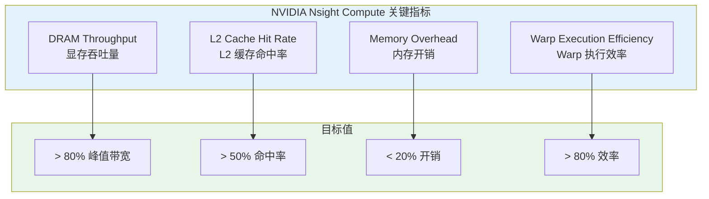

---

## 9. 本章小结

### 9.1 知识图谱

```mermaid
mindmap
  root((内存访问优化))
    合并访问
      连续地址访问
      Warp 内协作
      128 字节对齐
      避免跨步访问
    向量化访存
      float2/float4
      减少内存事务
      提高带宽利用率
      处理剩余元素
    内存对齐
      128 字节对齐
      缓存行边界
      结构体填充
      cudaMallocPitch
    常见陷阱
      float3 比 float4 慢
      非对齐访问
      随机访问模式
```

### 9.2 关键要点

| 概念 | 要点 | 最佳实践 |
|------|------|----------|
| 合并访问 | Warp 内线程访问连续地址 | 让线程 i 访问 data[i] |
| 向量化访存 | 使用 float2/float4 | 地址必须对齐到向量大小 |
| 内存对齐 | 起始地址是缓存行的倍数 | 使用 cudaMalloc 或 alignas |
| float3 问题 | 12 字节不是 2 的幂 | 使用 float4 或分开存储 |

### 9.3 优化检查清单

- [ ] 线程访问模式是否连续（合并访问）
- [ ] 是否可以使用向量化访存（float4）
- [ ] 数据是否正确对齐（16/128 字节）
- [ ] 是否避免了 float3 类型（使用 float4）
- [ ] 是否使用 __restrict__ 关键字
- [ ] 是否处理了数组末尾的剩余元素

### 9.4 思考题

1. 为什么 Warp 内的线程需要访问连续地址才能实现合并访问？
2. float4 相比 float 有什么性能优势？在什么情况下不明显？
3. 如果数据访问模式天生不连续（如稀疏矩阵），有哪些优化方法？
4. cudaMallocPitch 相比 cudaMalloc 有什么优势？适用于什么场景？

---

## 下一章

[第十章：精度与性能](./10_精度与性能.md) - 理解 FP32 与 FP16 精度差异，掌握半精度编程技巧

---

*参考资料：[CUDA C++ Best Practices Guide - Memory Access Patterns](https://docs.nvidia.com/cuda/cuda-c-best-practices-guide/index.html#memory-access-patterns) | [CUDA C++ Programming Guide - Global Memory](https://docs.nvidia.com/cuda/cuda-c-programming-guide/index.html#global-memory-3-0)*