# 第十章：精度与性能

> 学习目标：理解 FP32 与 FP16 精度差异，掌握半精度编程技巧
>
> 预计阅读时间：35 分钟
>
> 前置知识：[第八章：性能分析入门](./08_性能分析入门.md)

---

## 1. 为什么需要不同的精度？

### 1.1 精度与性能的权衡

在深度学习和科学计算中，我们经常面临一个核心问题：

> "更高的精度值得付出性能代价吗？"

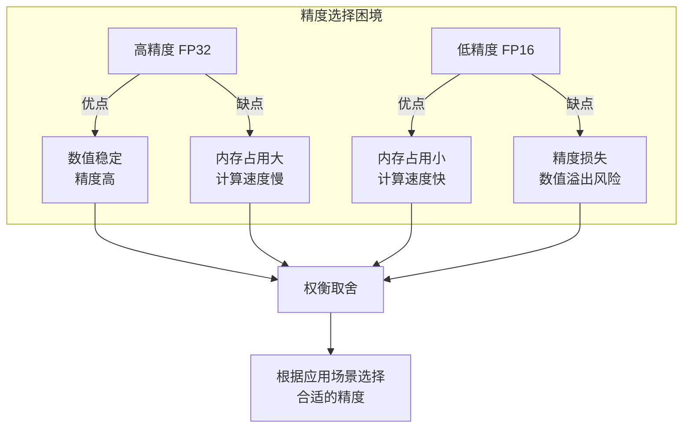

### 1.2 GPU 精度演进

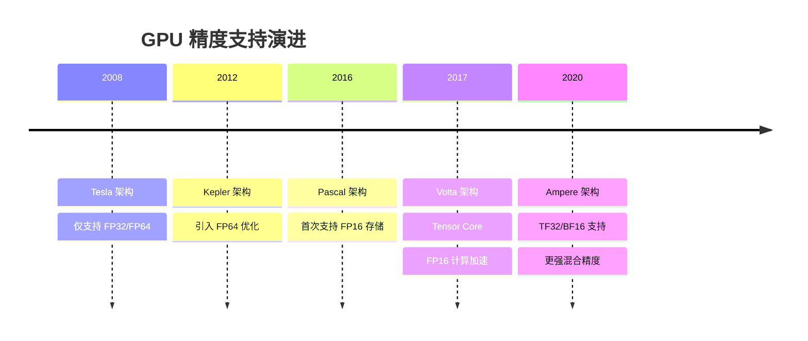

### 1.3 不同精度类型对比

| 精度类型 | 位数 | 符号位 | 指数位 | 尾数位 | 范围 | 精度 |
|----------|------|--------|--------|--------|------|------|
| **FP64** | 64 | 1 | 11 | 52 | 约 10^308 | 约 15-17 位十进制 |
| **FP32** | 32 | 1 | 8 | 23 | 约 10^38 | 约 7 位十进制 |
| **FP16** | 16 | 1 | 5 | 10 | 约 65504 | 约 3 位十进制 |
| **BF16** | 16 | 1 | 8 | 7 | 约 10^38 | 约 2 位十进制 |

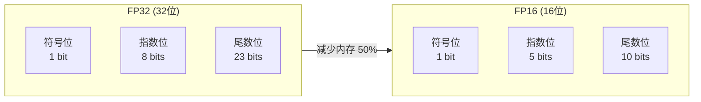

---

## 2. FP32 与 FP16 详细对比

### 2.1 数值范围对比

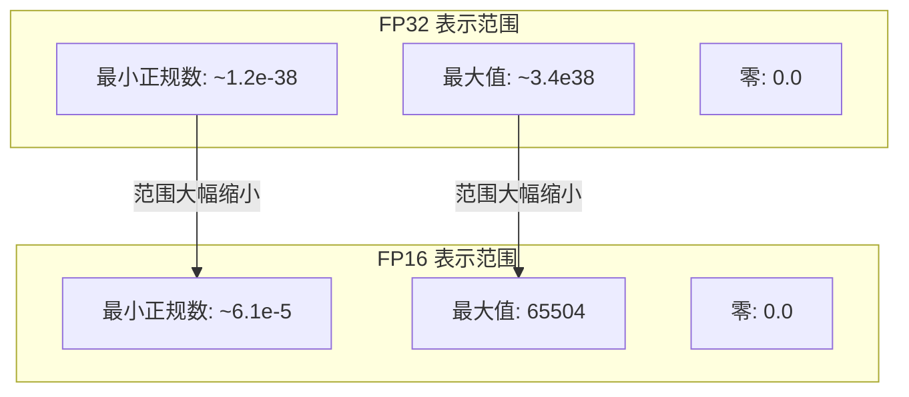

### 2.2 精度损失可视化

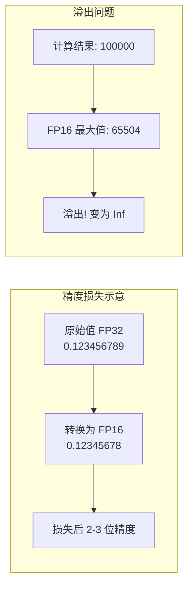

### 2.3 内存带宽优势

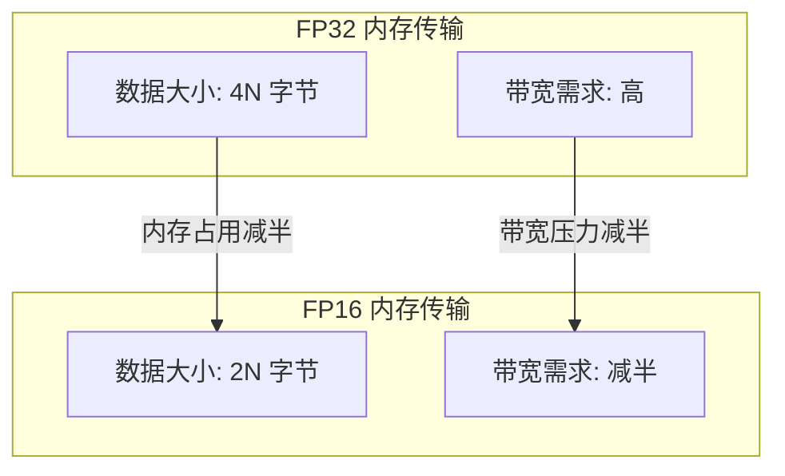

### 2.4 计算吞吐量对比

| GPU 架构 | FP32 吞吐量 | FP16 吞吐量 | 加速比 |
|----------|-------------|-------------|--------|
| Volta (V100) | 15.7 TFLOPS | 31.4 TFLOPS | 2x |
| Turing (RTX 2080) | 10.1 TFLOPS | 20.2 TFLOPS | 2x |
| Ampere (A100) | 19.5 TFLOPS | 78.0 TFLOPS | 4x (Tensor Core) |
| Hopper (H100) | 67 TFLOPS | 1979 TFLOPS | 29x (Tensor Core) |

---

## 3. 半精度编程基础

### 3.1 头文件和类型定义

```cpp
// ========== 头文件引入 ==========
#include <cuda_fp16.h>    // 半精度支持的核心头文件

// ========== 类型定义 ==========
// half:   单个半精度数（16位）
// half2:  两个半精度数打包（32位，便于向量化）
```

### 3.2 half 和 half2 类型详解

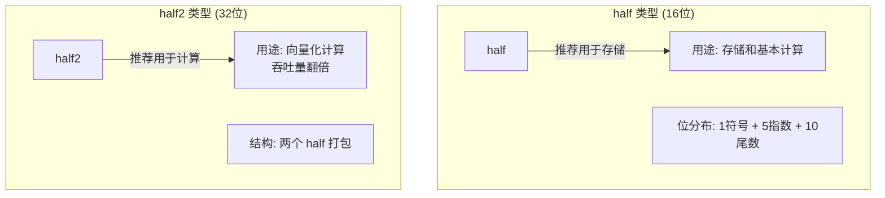

### 3.3 基本类型使用示例

```cpp
// ========== 文件：half_basics.cu ==========
#include <cuda_fp16.h>
#include <stdio.h>

// ------------------------------------------------
// half 类型基础操作
// ------------------------------------------------
__global__ void half_basics_kernel() {
    // ====== 1. half 变量声明和初始化 ======
    half a = __float2half(3.14f);   // 从 float 转换
    half b = __float2half(2.71f);

    // 直接赋值（C++ 风格）
    half c = __float2half(1.0f);
    half d = __float2half(0.0f);

    // ====== 2. half 算术运算 ======
    // 注意：half 类型的运算需要使用内置函数

    // 加法
    half sum = __hadd(a, b);

    // 减法
    half diff = __hsub(a, b);

    // 乘法
    half prod = __hmul(a, b);

    // 除法
    half quot = __hdiv(a, b);

    // ====== 3. half 转换回 float ======
    float f_sum = __half2float(sum);
    float f_diff = __half2float(diff);
    float f_prod = __half2float(prod);

    // 打印结果（仅在 thread 0 打印）
    if (threadIdx.x == 0) {
        printf("half 加法: %.4f + %.4f = %.4f\n",
               __half2float(a), __half2float(b), f_sum);
        printf("half 减法: %.4f - %.4f = %.4f\n",
               __half2float(a), __half2float(b), f_diff);
        printf("half 乘法: %.4f * %.4f = %.4f\n",
               __half2float(a), __half2float(b), f_prod);
    }
}

// ------------------------------------------------
// 主函数
// ------------------------------------------------
int main() {
    // 启动核函数
    half_basics_kernel<<<1, 1>>>();
    cudaDeviceSynchronize();

    return 0;
}
```

### 3.4 half2 向量化操作

```cpp
// ========== 文件：half2_vector.cu ==========
#include <cuda_fp16.h>
#include <stdio.h>

// ------------------------------------------------
// half2 向量化加法
// 一次处理两个 half 值，效率更高
// ------------------------------------------------
__global__ void half2_add_kernel() {
    // ====== 1. 创建 half2 变量 ======
    // 方法 1：使用构造函数
    half2 a = __floats2half2_rn(1.0f, 2.0f);  // a = {1.0, 2.0}
    half2 b = __floats2half2_rn(3.0f, 4.0f);  // b = {3.0, 4.0}

    // 方法 2：使用 make_half2（在某些架构上）
    // half2 c = make_half2(__float2half(1.0f), __float2half(2.0f));

    // ====== 2. half2 算术运算 ======
    // 向量化加法：同时计算两个 half 的加法
    half2 sum = __hadd2(a, b);    // sum = {1.0+3.0, 2.0+4.0} = {4.0, 6.0}

    // 向量化减法
    half2 diff = __hsub2(a, b);   // diff = {1.0-3.0, 2.0-4.0} = {-2.0, -2.0}

    // 向量化乘法
    half2 prod = __hmul2(a, b);   // prod = {1.0*3.0, 2.0*4.0} = {3.0, 8.0}

    // ====== 3. 提取 half2 中的值 ======
    // 获取低位和高位的 half 值
    half low = __low2half(sum);   // 获取第一个元素
    half high = __high2half(sum); // 获取第二个元素

    // 转换为 float 输出
    float f_low = __half2float(low);
    float f_high = __half2float(high);

    if (threadIdx.x == 0) {
        printf("half2 加法: {%.1f, %.1f} + {%.1f, %.1f} = {%.1f, %.1f}\n",
               1.0f, 2.0f, 3.0f, 4.0f, f_low, f_high);
        printf("half2 乘法: {%.1f, %.1f} * {%.1f, %.1f} = {%.1f, %.1f}\n",
               1.0f, 2.0f, 3.0f, 4.0f,
               __half2float(__low2half(prod)),
               __half2float(__high2half(prod)));
    }
}

// ------------------------------------------------
// 主函数
// ------------------------------------------------
int main() {
    half2_add_kernel<<<1, 1>>>();
    cudaDeviceSynchronize();

    return 0;
}
```

---

## 4. 类型转换函数详解

### 4.1 常用类型转换函数

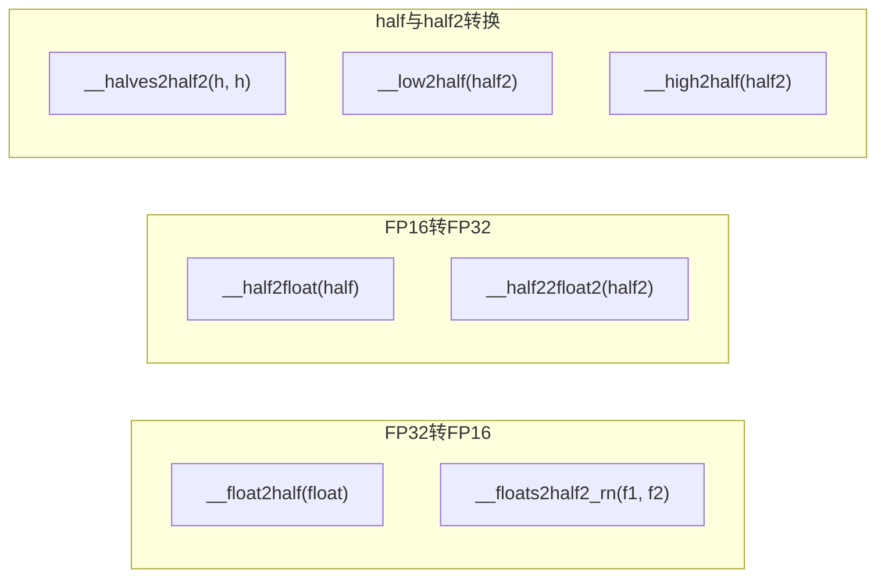

### 4.2 转换函数速查表

| 函数 | 输入 | 输出 | 说明 |
|------|------|------|------|
| `__float2half(f)` | float | half | 单精度转半精度 |
| `__half2float(h)` | half | float | 半精度转单精度 |
| `__floats2half2_rn(f1, f2)` | float, float | half2 | 两个 float 打包成 half2 |
| `__half22float2(h2)` | half2 | float2 | half2 解包成两个 float |
| `__halves2half2(l, h)` | half, half | half2 | 两个 half 打包 |
| `__low2half(h2)` | half2 | half | 取 half2 低位 |
| `__high2half(h2)` | half2 | half | 取 half2 高位 |
| `__lows2half2(h2, h2)` | half2, half2 | half2 | 取两个 half2 的低位组合 |

### 4.3 类型转换示例

```cpp
// ========== 文件：type_conversion.cu ==========
#include <cuda_fp16.h>
#include <stdio.h>

// ------------------------------------------------
// 类型转换完整示例
// ------------------------------------------------
__global__ void conversion_demo_kernel() {
    if (threadIdx.x != 0) return;

    printf("========== 类型转换示例 ==========\n\n");

    // ====== 1. float <-> half 转换 ======
    float f_val = 3.14159f;
    half h_val = __float2half(f_val);
    float f_back = __half2float(h_val);

    printf("1. float <-> half:\n");
    printf("   原始 float: %.6f\n", f_val);
    printf("   转换为 half 后再转回: %.6f\n", f_back);
    printf("   精度损失: %.6f\n\n", f_val - f_back);

    // ====== 2. float pair <-> half2 转换 ======
    float f1 = 1.234f, f2 = 5.678f;
    half2 h2_val = __floats2half2_rn(f1, f2);

    printf("2. float pair -> half2:\n");
    printf("   输入: %.3f, %.3f\n", f1, f2);
    printf("   half2 的低位: %.3f\n", __half2float(__low2half(h2_val)));
    printf("   half2 的高位: %.3f\n\n", __half2float(__high2half(h2_val)));

    // ====== 3. half2 -> float2 转换 ======
    float2 f2_back = __half22float2(h2_val);
    printf("3. half2 -> float2:\n");
    printf("   float2.x = %.3f\n", f2_back.x);
    printf("   float2.y = %.3f\n\n", f2_back.y);

    // ====== 4. half 打包成 half2 ======
    half ha = __float2half(10.0f);
    half hb = __float2half(20.0f);
    half2 h2_packed = __halves2half2(ha, hb);

    printf("4. half 打包成 half2:\n");
    printf("   half a = %.1f, half b = %.1f\n",
           __half2float(ha), __half2float(hb));
    printf("   打包后: {%.1f, %.1f}\n\n",
           __half2float(__low2half(h2_packed)),
           __half2float(__high2half(h2_packed)));
}

// ------------------------------------------------
// 主函数
// ------------------------------------------------
int main() {
    conversion_demo_kernel<<<1, 32>>>();
    cudaDeviceSynchronize();

    return 0;
}
```

---

## 5. 半精度运算函数详解

### 5.1 单值运算函数

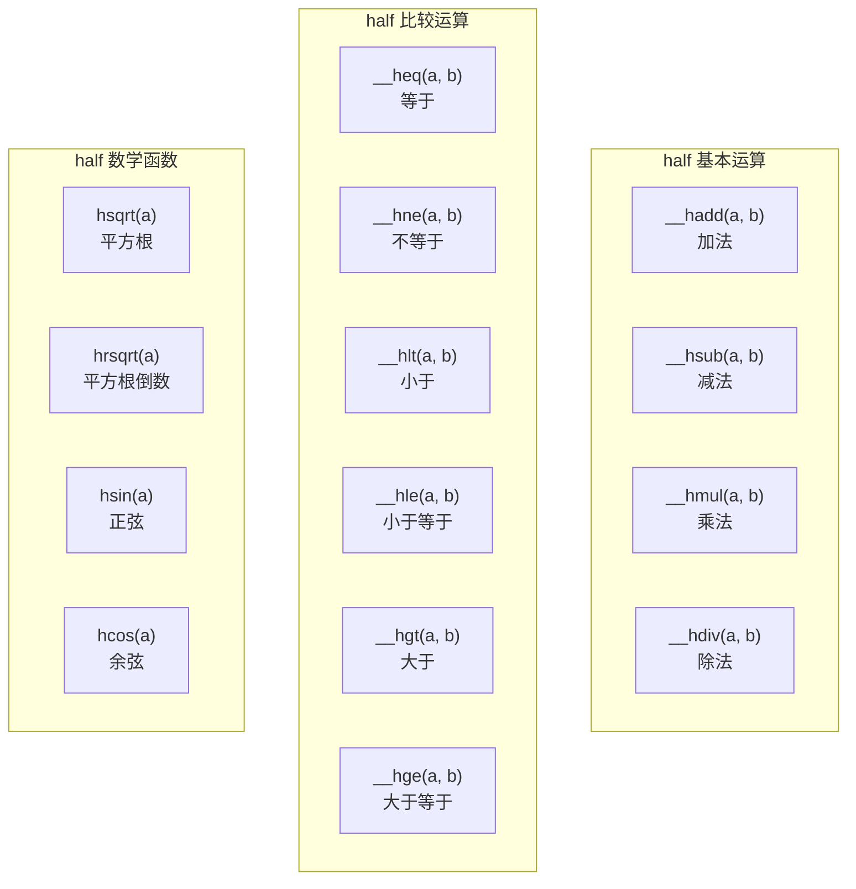

### 5.2 向量化运算函数

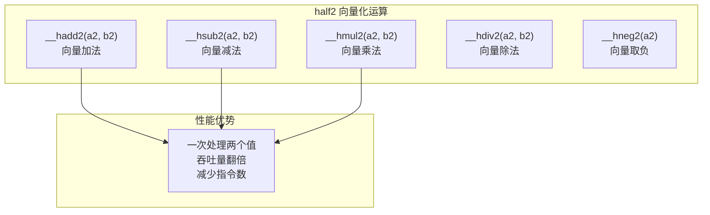

### 5.3 运算函数速查表

| 函数类别 | 函数名 | 操作数 | 说明 |
|----------|--------|--------|------|
| **基本运算** | `__hadd` | half | 加法 |
| | `__hsub` | half | 减法 |
| | `__hmul` | half | 乘法 |
| | `__hdiv` | half | 除法 |
| | `__hneg` | half | 取负 |
| **向量化运算** | `__hadd2` | half2 | 向量加法 |
| | `__hsub2` | half2 | 向量减法 |
| | `__hmul2` | half2 | 向量乘法 |
| | `__hdiv2` | half2 | 向量除法 |
| | `__hneg2` | half2 | 向量取负 |
| **比较运算** | `__heq` | half | 等于 |
| | `__hne` | half | 不等于 |
| | `__hlt` | half | 小于 |
| | `__hle` | half | 小于等于 |
| | `__hgt` | half | 大于 |
| | `__hge` | half | 大于等于 |
| **数学函数** | `hsqrt` | half | 平方根 |
| | `hrsqrt` | half | 平方根倒数 |
| | `hsin` | half | 正弦 |
| | `hcos` | half | 余弦 |

---

## 6. 实战示例：FP16 向量运算

### 6.1 FP16 向量加法

```cpp
// ========== 文件：half_vector_add.cu ==========
#include <cuda_fp16.h>
#include <cuda_runtime.h>
#include <stdio.h>

// ------------------------------------------------
// 核函数：half 向量加法（使用 half 类型）
// ------------------------------------------------
__global__ void half_vector_add_kernel(
    const half *a,    // 输入向量 a
    const half *b,    // 输入向量 b
    half *c,          // 输出向量 c = a + b
    int n             // 向量长度
) {
    int idx = blockIdx.x * blockDim.x + threadIdx.x;

    if (idx < n) {
        // 使用 __hadd 进行半精度加法
        c[idx] = __hadd(a[idx], b[idx]);
    }
}

// ------------------------------------------------
// 核函数：half2 向量加法（向量化版本，性能更好）
// ------------------------------------------------
__global__ void half2_vector_add_kernel(
    const half2 *a,   // 输入向量 a（half2 打包）
    const half2 *b,   // 输入向量 b（half2 打包）
    half2 *c,         // 输出向量 c（half2 打包）
    int n             // 向量长度（half2 个数）
) {
    int idx = blockIdx.x * blockDim.x + threadIdx.x;

    if (idx < n) {
        // 使用 __hadd2 进行向量化加法，一次处理两个 half
        c[idx] = __hadd2(a[idx], b[idx]);
    }
}

// ------------------------------------------------
// 主函数：比较两种实现
// ------------------------------------------------
int main() {
    const int N = 1024;
    const size_t bytes_half = N * sizeof(half);
    const size_t bytes_half2 = (N / 2) * sizeof(half2);

    // ====== 1. 准备主机数据 ======
    float *h_a = (float*)malloc(N * sizeof(float));
    float *h_b = (float*)malloc(N * sizeof(float));
    float *h_c_half = (float*)malloc(N * sizeof(float));
    float *h_c_half2 = (float*)malloc(N * sizeof(float));

    for (int i = 0; i < N; i++) {
        h_a[i] = (float)i * 0.01f;
        h_b[i] = (float)i * 0.02f;
    }

    // ====== 2. 分配设备内存 ======
    half *d_a_half, *d_b_half, *d_c_half;
    half2 *d_a_half2, *d_b_half2, *d_c_half2;

    cudaMalloc(&d_a_half, bytes_half);
    cudaMalloc(&d_b_half, bytes_half);
    cudaMalloc(&d_c_half, bytes_half);

    cudaMalloc(&d_a_half2, bytes_half2);
    cudaMalloc(&d_b_half2, bytes_half2);
    cudaMalloc(&d_c_half2, bytes_half2);

    // ====== 3. 准备 half 格式数据 ======
    half *h_a_half = (half*)malloc(bytes_half);
    half *h_b_half = (half*)malloc(bytes_half);
    half2 *h_a_half2 = (half2*)malloc(bytes_half2);
    half2 *h_b_half2 = (half2*)malloc(bytes_half2);

    // 转换 float 到 half
    for (int i = 0; i < N; i++) {
        h_a_half[i] = __float2half(h_a[i]);
        h_b_half[i] = __float2half(h_b[i]);
    }

    // 打包成 half2
    for (int i = 0; i < N / 2; i++) {
        h_a_half2[i] = __halves2half2(h_a_half[i*2], h_a_half[i*2+1]);
        h_b_half2[i] = __halves2half2(h_b_half[i*2], h_b_half[i*2+1]);
    }

    // ====== 4. 拷贝数据到设备 ======
    cudaMemcpy(d_a_half, h_a_half, bytes_half, cudaMemcpyHostToDevice);
    cudaMemcpy(d_b_half, h_b_half, bytes_half, cudaMemcpyHostToDevice);
    cudaMemcpy(d_a_half2, h_a_half2, bytes_half2, cudaMemcpyHostToDevice);
    cudaMemcpy(d_b_half2, h_b_half2, bytes_half2, cudaMemcpyHostToDevice);

    // ====== 5. 启动核函数 ======
    int block_size = 256;
    int grid_half = (N + block_size - 1) / block_size;
    int grid_half2 = (N / 2 + block_size - 1) / block_size;

    // 创建 CUDA 事件用于计时
    cudaEvent_t start, stop;
    cudaEventCreate(&start);
    cudaEventCreate(&stop);

    // ----- half 版本 -----
    cudaEventRecord(start);
    half_vector_add_kernel<<<grid_half, block_size>>>(d_a_half, d_b_half, d_c_half, N);
    cudaEventRecord(stop);
    cudaEventSynchronize(stop);

    float time_half;
    cudaEventElapsedTime(&time_half, start, stop);

    // ----- half2 版本 -----
    cudaEventRecord(start);
    half2_vector_add_kernel<<<grid_half2, block_size>>>(d_a_half2, d_b_half2, d_c_half2, N / 2);
    cudaEventRecord(stop);
    cudaEventSynchronize(stop);

    float time_half2;
    cudaEventElapsedTime(&time_half2, start, stop);

    // ====== 6. 拷贝结果回主机 ======
    half *h_c_half_raw = (half*)malloc(bytes_half);
    half2 *h_c_half2_raw = (half2*)malloc(bytes_half2);

    cudaMemcpy(h_c_half_raw, d_c_half, bytes_half, cudaMemcpyDeviceToHost);
    cudaMemcpy(h_c_half2_raw, d_c_half2, bytes_half2, cudaMemcpyDeviceToHost);

    // 转换回 float
    for (int i = 0; i < N; i++) {
        h_c_half[i] = __half2float(h_c_half_raw[i]);
    }

    for (int i = 0; i < N / 2; i++) {
        h_c_half2[i*2] = __half2float(__low2half(h_c_half2_raw[i]));
        h_c_half2[i*2+1] = __half2float(__high2half(h_c_half2_raw[i]));
    }

    // ====== 7. 验证和输出结果 ======
    printf("========== FP16 向量加法性能对比 ==========\n\n");
    printf("向量长度: %d 元素\n", N);
    printf("half  版本耗时: %.4f ms\n", time_half);
    printf("half2 版本耗时: %.4f ms\n", time_half2);
    printf("加速比: %.2fx\n\n", time_half / time_half2);

    printf("前 5 个结果对比:\n");
    printf("索引 |  期望值  |  half结果  |  half2结果\n");
    printf("-----|----------|------------|------------\n");
    for (int i = 0; i < 5; i++) {
        float expected = h_a[i] + h_b[i];
        printf("%4d | %8.4f | %10.4f | %10.4f\n",
               i, expected, h_c_half[i], h_c_half2[i]);
    }

    // ====== 8. 清理资源 ======
    cudaEventDestroy(start);
    cudaEventDestroy(stop);
    cudaFree(d_a_half); cudaFree(d_b_half); cudaFree(d_c_half);
    cudaFree(d_a_half2); cudaFree(d_b_half2); cudaFree(d_c_half2);
    free(h_a); free(h_b); free(h_c_half); free(h_c_half2);
    free(h_a_half); free(h_b_half); free(h_c_half_raw); free(h_c_half2_raw);

    return 0;
}
```

### 6.2 执行流程图

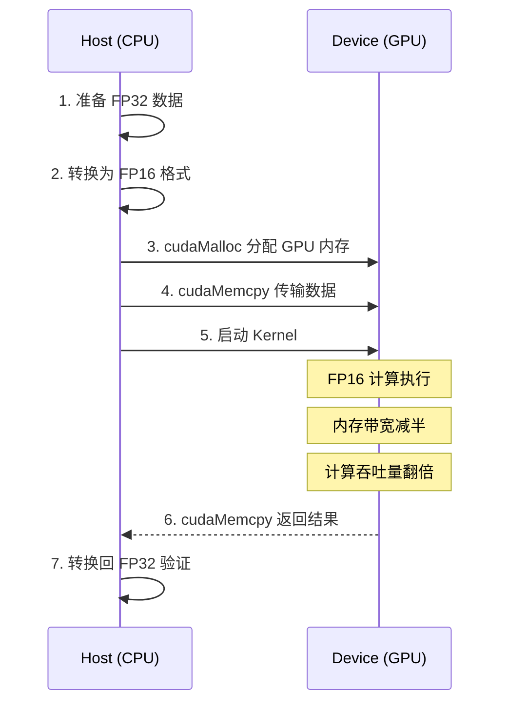

---

## 7. 何时使用 FP16

### 7.1 适用场景

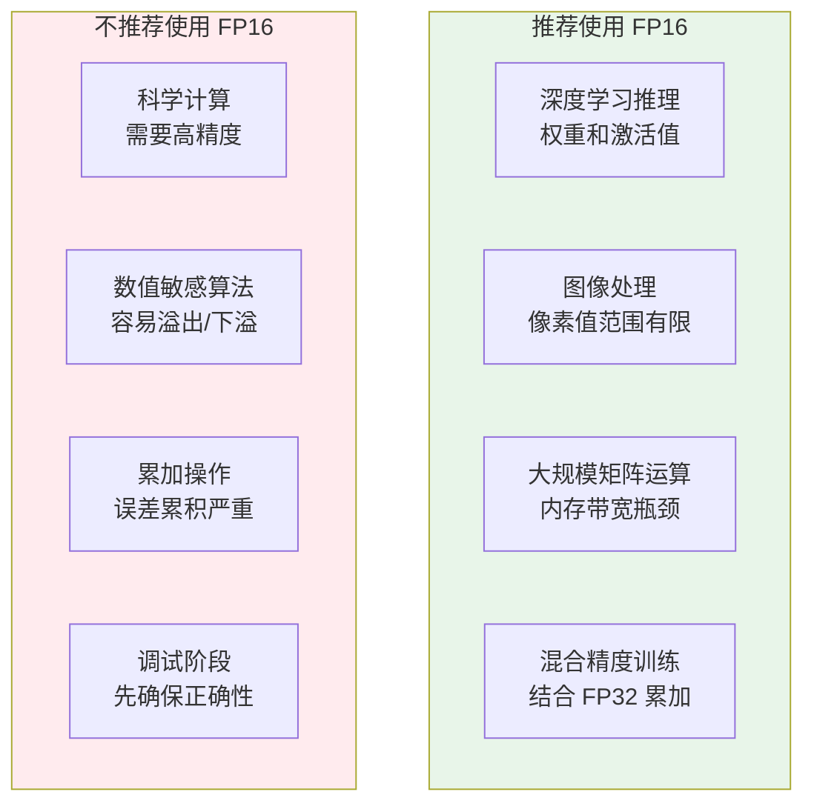

### 7.2 决策流程图

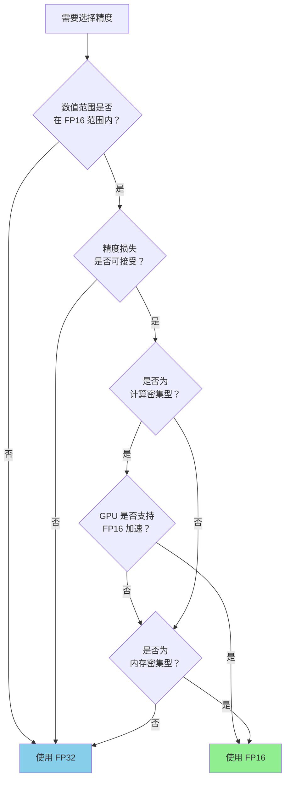

### 7.3 混合精度策略

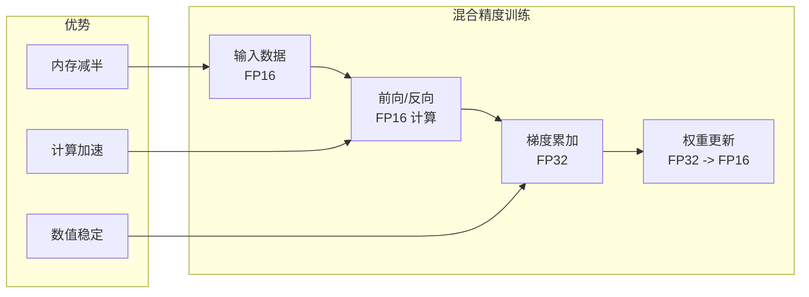

---

## 8. 精度损失注意事项

### 8.1 常见问题

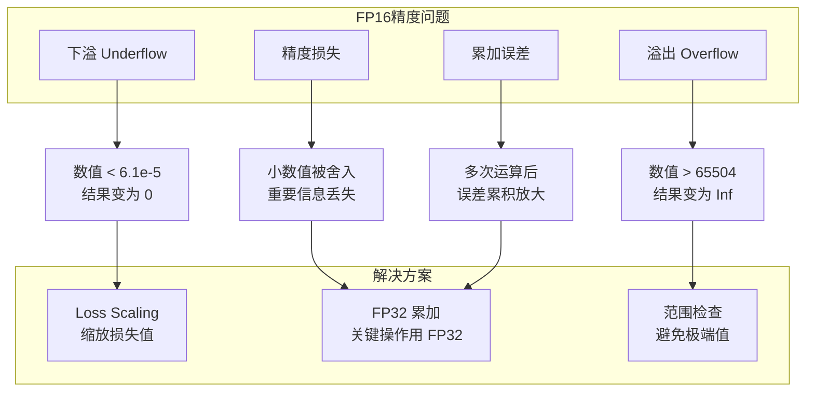

### 8.2 溢出检测示例

```cpp
// ========== 文件：overflow_check.cu ==========
#include <cuda_fp16.h>
#include <stdio.h>

// ------------------------------------------------
// 演示 FP16 溢出问题
// ------------------------------------------------
__global__ void overflow_demo_kernel() {
    if (threadIdx.x != 0) return;

    printf("========== FP16 溢出演示 ==========\n\n");

    // 正常范围
    half normal = __float2half(10000.0f);
    printf("正常值: 10000 -> %f\n", __half2float(normal));

    // 接近上限
    half near_max = __float2half(65000.0f);
    printf("接近上限: 65000 -> %f\n", __half2float(near_max));

    // 超过上限
    float overflow_val = 70000.0f;
    half overflow = __float2half(overflow_val);
    printf("超过上限: 70000 -> %f (应为 Inf)\n", __half2float(overflow));

    // 下溢
    float underflow_val = 1e-8f;
    half underflow = __float2half(underflow_val);
    printf("下溢值: 1e-8 -> %f (可能为 0)\n", __half2float(underflow));

    // 精度损失示例
    float precise = 0.123456789f;
    half half_precise = __float2half(precise);
    float back = __half2float(half_precise);
    printf("\n精度损失示例:\n");
    printf("原始值: %.9f\n", precise);
    printf("转换后: %.9f\n", back);
    printf("损失: %.9f\n", precise - back);
}

// ------------------------------------------------
// 主函数
// ------------------------------------------------
int main() {
    overflow_demo_kernel<<<1, 32>>>();
    cudaDeviceSynchronize();

    return 0;
}
```

### 8.3 最佳实践

| 问题 | 症状 | 解决方案 |
|------|------|----------|
| **溢出** | 结果变为 Inf 或 NaN | 检查数值范围，使用 Loss Scaling |
| **下溢** | 小数值变为 0 | 使用更大的缩放因子 |
| **精度损失** | 结果不准确 | 关键操作使用 FP32 |
| **累加误差** | 多次运算后偏差大 | 使用 Kahan 累加或 FP32 累加 |

---

## 9. 性能对比总结

### 9.1 性能对比表

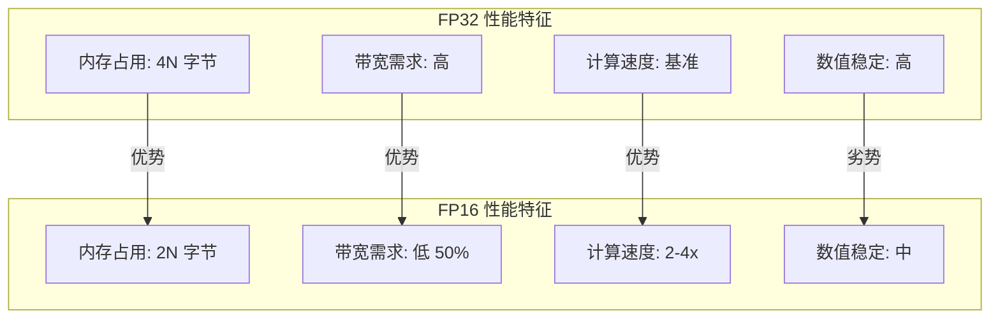

### 9.2 性能对比表

| 指标 | FP32 | FP16 | FP16 优势 |
|------|------|------|-----------|
| **内存占用** | 4N 字节 | 2N 字节 | 减少 50% |
| **内存带宽** | 基准 | 减半 | 提升 2x |
| **计算吞吐量** | 基准 | 2-4x | 显著提升 |
| **数值范围** | ~10^38 | ~65504 | 需注意溢出 |
| **精度** | ~7 位 | ~3 位 | 需验证可接受 |
| **开发复杂度** | 低 | 中 | 需要转换 |

### 9.3 实际应用建议

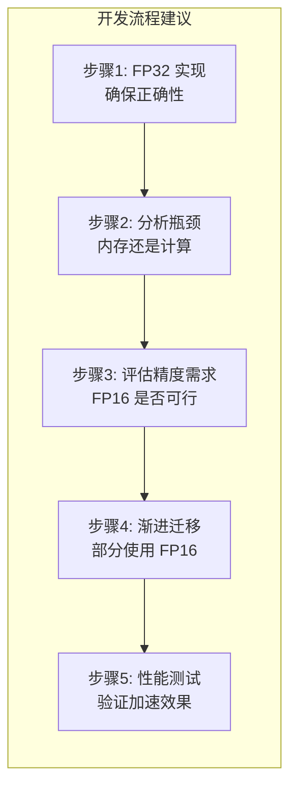

---

## 10. 本章小结

### 10.1 知识图谱

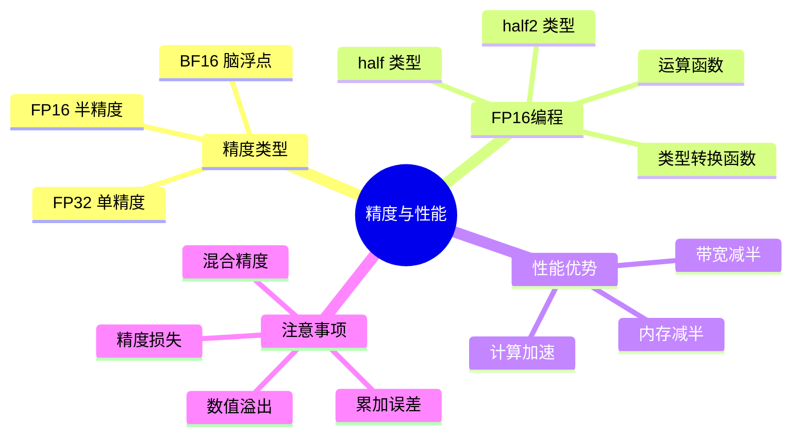

### 10.2 关键要点

1. **FP16 内存占用是 FP32 的一半**，显著降低内存带宽压力
2. **half 类型用于存储，half2 类型用于计算**，可获最佳性能
3. **类型转换使用 __float2half 和 __half2float**，注意精度损失
4. **运算使用 __hadd、__hmul2 等内置函数**，不要直接使用运算符
5. **混合精度策略**可以在保持数值稳定的同时获得性能提升

### 10.3 常用函数速查

| 用途 | 函数 | 示例 |
|------|------|------|
| float 转 half | `__float2half` | `half h = __float2half(1.0f);` |
| half 转 float | `__half2float` | `float f = __half2float(h);` |
| half 加法 | `__hadd` | `half c = __hadd(a, b);` |
| half 乘法 | `__hmul` | `half c = __hmul(a, b);` |
| half2 加法 | `__hadd2` | `half2 c = __hadd2(a, b);` |
| half2 乘法 | `__hmul2` | `half2 c = __hmul2(a, b);` |
| 打包 half2 | `__halves2half2` | `half2 h2 = __halves2half2(a, b);` |

### 10.4 思考题

1. 为什么 FP16 的数值范围比 FP32 小这么多？这对深度学习有什么影响？
2. half 和 half2 类型在存储和计算上各有什么优势？
3. 什么情况下应该使用混合精度而不是纯 FP16？
4. 如何检测和处理 FP16 计算中的溢出问题？

---

## 下一章

[第十一章：共享内存优化](./11_共享内存优化.md) - 学习如何使用共享内存提升性能

---

*参考资料：[CUDA C++ Programming Guide - Half Precision](https://docs.nvidia.com/cuda/cuda-c-programming-guide/index.html#half-precision) | [CUDA Math API](https://docs.nvidia.com/cuda/cuda-math-api/)*