# 第十一章：Roofline 性能模型

> 学习目标：理解 Roofline 模型，学会判断和优化 GPU 核函数性能
>
> 预计阅读时间：25 分钟
>
> 前置知识：[第八章：性能分析入门](./08_性能分析入门.md)

---

## 1. 什么是 Roofline 模型？

### 1.1 一个简单的类比

想象你开一家餐厅：

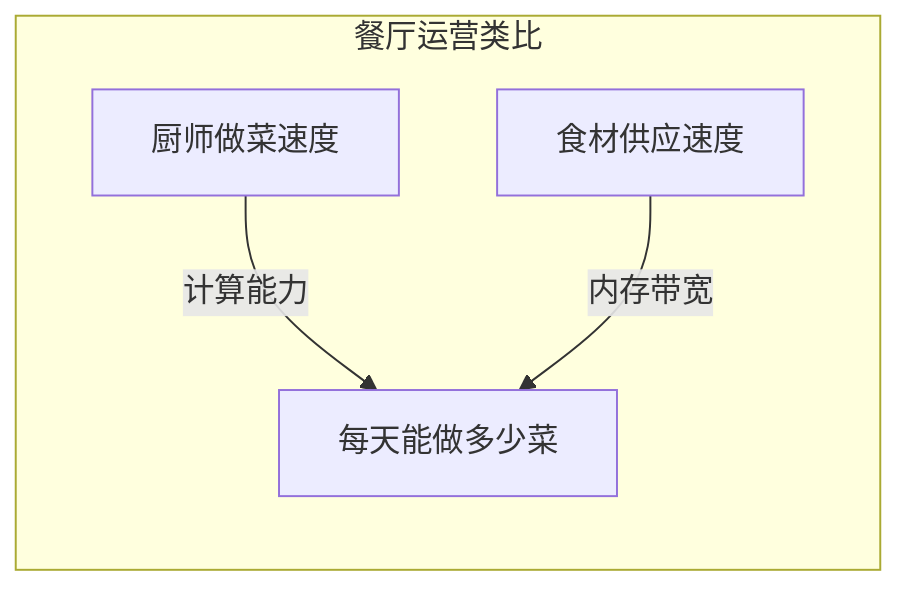

**问题**：每天能做多少菜，取决于什么？

- 如果**厨师不够快**，就算食材堆积如山也没用 → **计算瓶颈**
- 如果**食材供应不上**，厨师再快也只能干等着 → **访存瓶颈**

**Roofline 模型**告诉我们：程序性能最终会被这两个瓶颈之一限制。

### 1.2 Roofline 模型的核心思想

**Roofline 模型**（屋顶线模型）是一个可视化性能分析工具，由加州伯克利实验室提出。

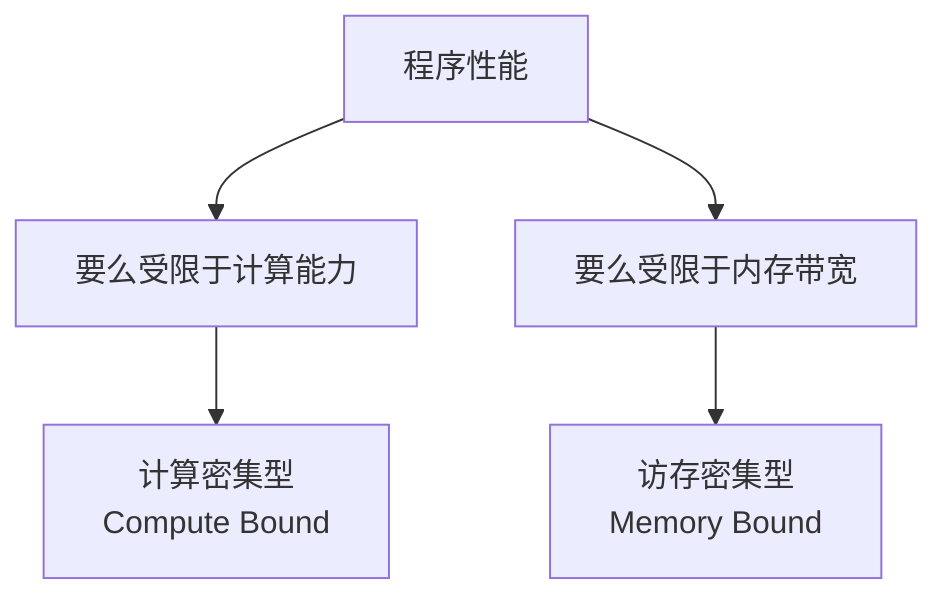

**核心公式**：

```
性能 (FLOPS) = min(峰值算力, 计算强度 x 内存带宽)
```

### 1.3 为什么叫 Roofline？

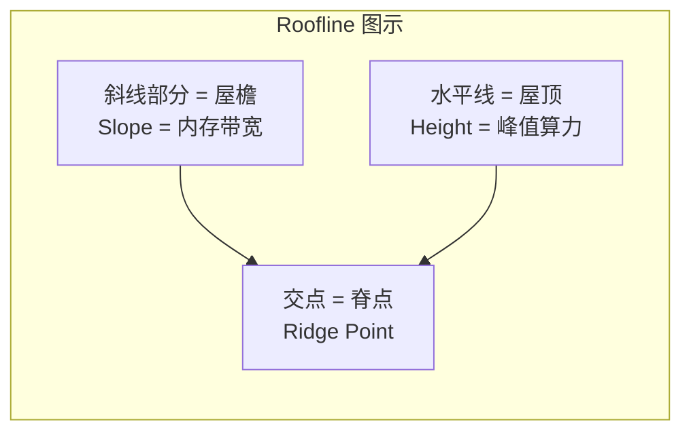

- **屋顶 (Roof)**：峰值算力，代表计算能力的上限
- **屋檐 (Slope)**：内存带宽，代表数据传输能力的限制
- **脊点 (Ridge Point)**：两者的交汇点，是判断程序类型的关键

---

## 2. 计算强度 (Arithmetic Intensity)

### 2.1 什么是计算强度？

**计算强度**（Arithmetic Intensity，AI）是 Roofline 模型的核心概念。

```
计算强度 (AI) = 浮点运算次数 (FLOP) / 数据访问量 (Bytes)
```

**单位**：FLOP/Byte（每次内存访问做多少次浮点运算）

### 2.2 一个直观的例子

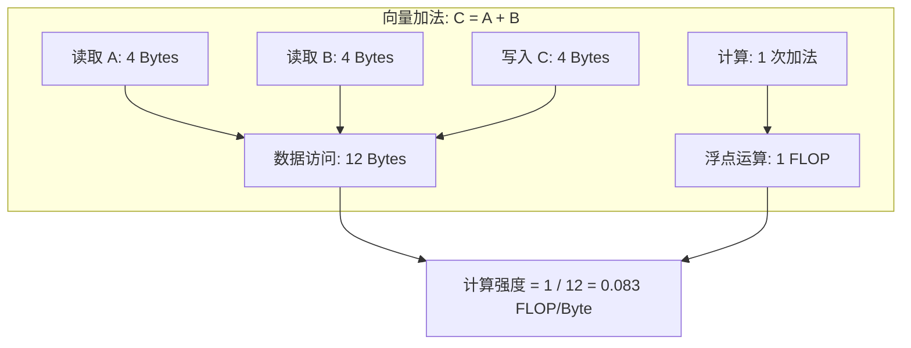

**向量加法的计算强度**：
- 数据访问：读取 A (4B) + 读取 B (4B) + 写入 C (4B) = 12 Bytes
- 浮点运算：1 次加法 = 1 FLOP
- 计算强度：1 / 12 = **0.083 FLOP/Byte**

### 2.3 常见算子的计算强度

| 算子 | 计算强度 | 说明 |
|------|----------|------|
| **向量加法** | ~0.08 | 访存密集型 |
| **向量点积** | ~0.25 | 访存密集型 |
| **矩阵-向量乘** | ~2 | 中等 |
| **矩阵乘法** | ~n (可变) | 计算密集型（大矩阵） |
| **卷积 (3x3)** | ~几到几十 | 取决于通道数 |

### 2.4 计算强度与性能的关系

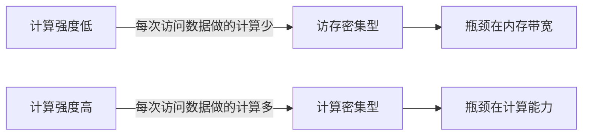

---

## 3. 脊点 (Ridge Point) 计算

### 3.1 什么是脊点？

**脊点**是 Roofline 图中斜线和水平线的交点，代表从访存密集型到计算密集型的转折点。

```
脊点计算强度 = 峰值算力 (FLOPS) / 峰值带宽 (Bytes/s)
```

### 3.2 NVIDIA A100 的脊点计算

**A100 (FP32) 规格参数**：

| 参数 | 值 | 说明 |
|------|-----|------|
| **峰值算力 (FP32)** | 19.5 TFLOPS | 每秒 19.5 万亿次浮点运算 |
| **峰值带宽 (HBM2e)** | 2039 GB/s | 每秒传输 2039 GB 数据 |

**脊点计算**：

```
脊点 = 19.5 TFLOPS / 2039 GB/s
     = 19.5 x 10^12 / 2039 x 10^9
     = 19.5 / 2.039
     ≈ 9.57 FLOP/Byte
```

### 3.3 脊点的含义

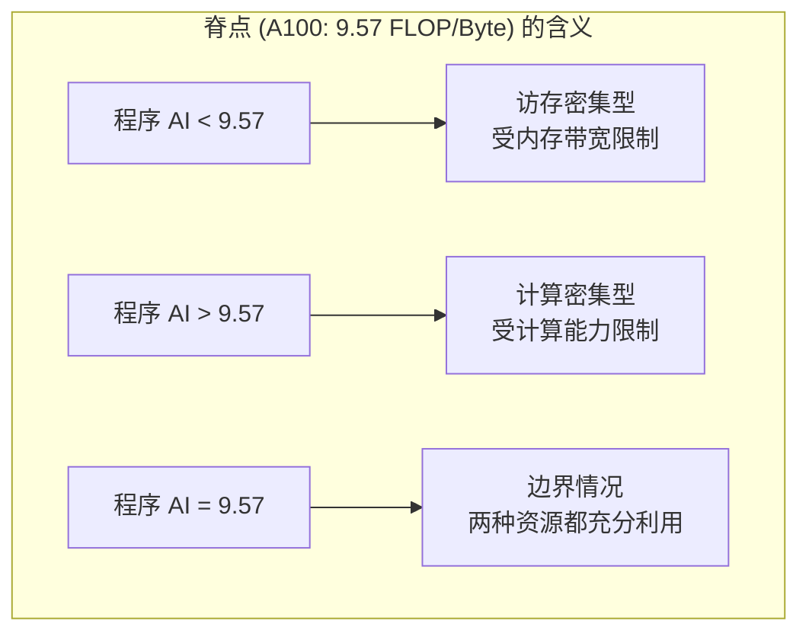

**解读**：
- 对于 A100，如果你的程序计算强度 **低于 9.57 FLOP/Byte**，再快的计算单元也无济于事，因为数据供不上
- 如果计算强度 **高于 9.57 FLOP/Byte**，内存带宽不是瓶颈，需要更强的计算能力

### 3.4 不同 GPU 的脊点对比

| GPU | 峰值算力 (FP32) | 峰值带宽 | 脊点 |
|-----|-----------------|----------|------|
| **A100** | 19.5 TFLOPS | 2039 GB/s | **9.57** |
| **V100** | 15.7 TFLOPS | 900 GB/s | **17.4** |
| **H100** | 67 TFLOPS | 3352 GB/s | **20.0** |
| **RTX 4090** | 82.6 TFLOPS | 1008 GB/s | **82.0** |

**观察**：
- RTX 4090 的脊点高达 82，意味着大多数程序都是访存密集型
- V100/A100/H100 的脊点较低，更多程序可以达到计算密集型

---

## 4. 判断程序类型：访存密集型 vs 计算密集型

### 4.1 判断方法

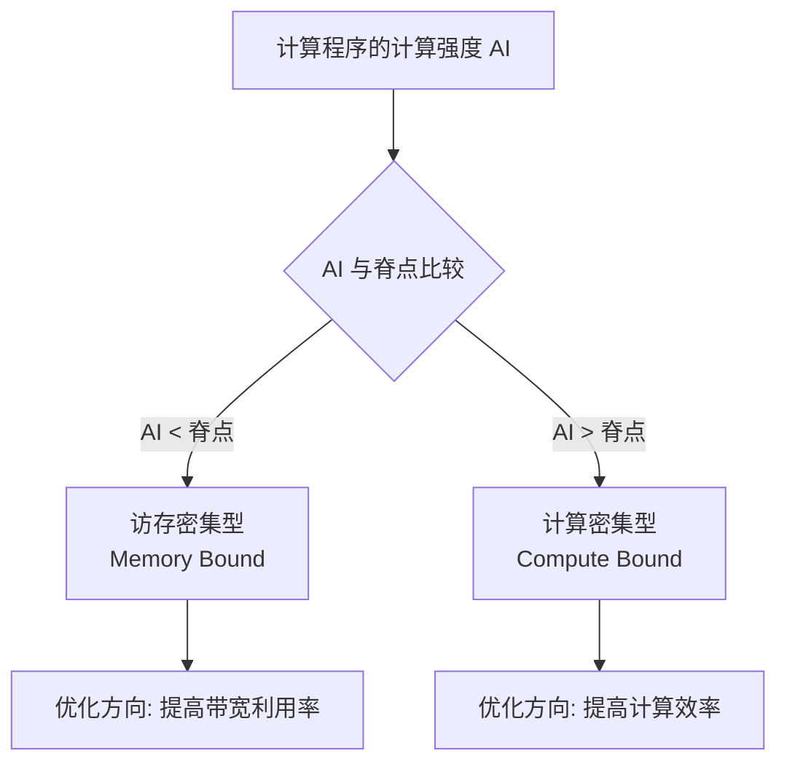

### 4.2 实例分析

**示例 1：向量加法 (在 A100 上)**


**性能预测**：
```
理论性能 = AI x 带宽 = 0.08 x 2039 GB/s = 163 GFLOPS
```
仅为 A100 峰值的 **0.8%**！

**示例 2：大矩阵乘法 (在 A100 上)**


**性能预测**：
```
理论性能 = 峰值算力 = 19.5 TFLOPS
```
可以达到 A100 峰值的 **100%**！

### 4.3 性能上限公式

```
性能上限 = min(峰值算力, 计算强度 x 内存带宽)
```

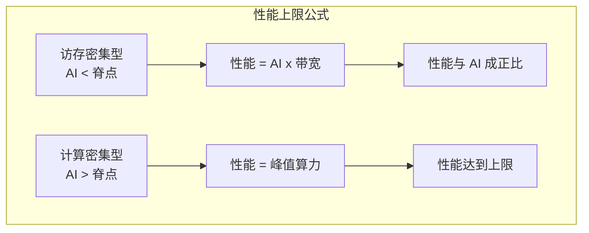

---

## 5. 基于 Roofline 的优化方向选择

### 5.1 优化决策树

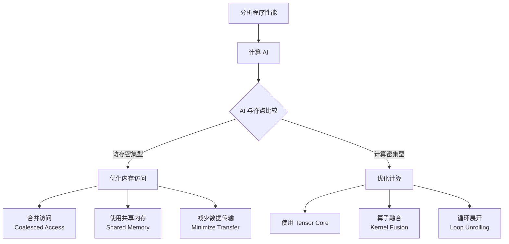

### 5.2 访存密集型优化策略

当你的程序是**访存密集型**时，优化重点是**提高内存带宽利用率**：

| 优化技术 | 作用 | 效果 |
|----------|------|------|
| **合并访问** | 让相邻线程访问连续内存 | 大幅提升带宽 |
| **共享内存** | 减少全局内存访问 | 降低延迟 |
| **数据预取** | 提前加载数据 | 隐藏延迟 |
| **算子融合** | 减少中间结果存储 | 减少总数据量 |

### 5.3 计算密集型优化策略

当你的程序是**计算密集型**时，优化重点是**提高计算效率**：

| 优化技术 | 作用 | 效果 |
|----------|------|------|
| **Tensor Core** | 使用矩阵加速单元 | 数倍提升算力 |
| **循环展开** | 减少循环开销 | 提高指令级并行 |
| **指令级并行** | 增加独立指令 | 提高流水线效率 |
| **多流水线** | 利用多个计算单元 | 提高吞吐量 |

### 5.4 提升计算强度的方法

如果你想把程序从访存密集型变成计算密集型，可以：

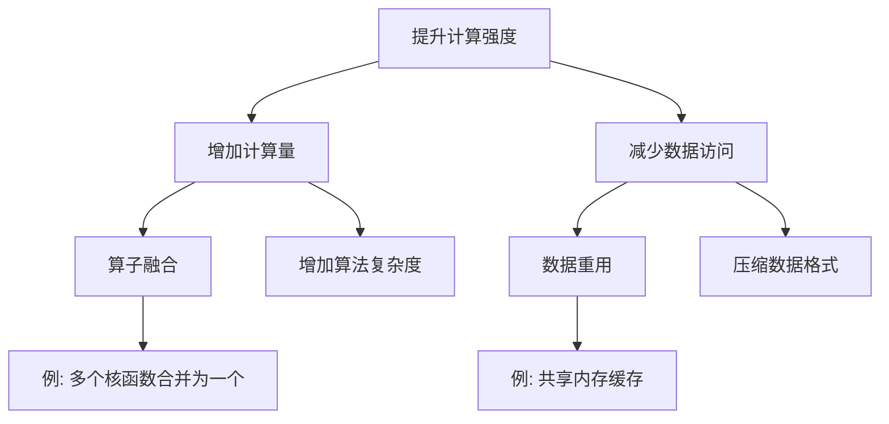

**实例：算子融合**

```
原始方式（两次全局内存访问）：
  Kernel 1: C = A + B        (读 A, B; 写 C)
  Kernel 2: D = C * E        (读 C, E; 写 D)

融合后（减少一次全局内存访问）：
  Kernel: D = (A + B) * E    (读 A, B, E; 写 D)
```

---

## 6. 实战案例：A100 性能分析

### 6.1 案例一：向量点积

**问题**：两个长度为 N 的向量点积，在 A100 上的理论性能是多少？

**分析**：

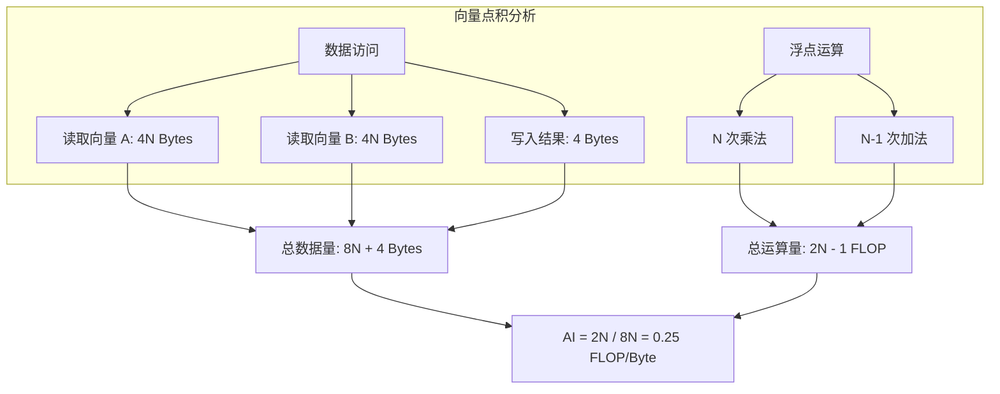

**结论**：
- 计算强度 AI = 0.25 FLOP/Byte
- 远小于 A100 脊点 9.57
- **访存密集型**

**理论性能**：
```
性能 = 0.25 x 2039 GB/s = 510 GFLOPS
```

### 6.2 案例二：矩阵乘法

**问题**：计算 C = A x B，其中 A 是 MxK，B 是 KxN，在 A100 上的理论性能？

**分析**：

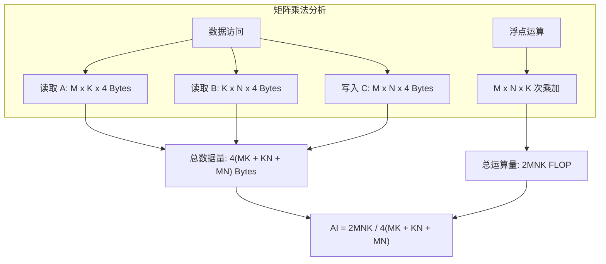

**简化**：当 M, N, K 都较大时：

```
AI ≈ MNK / (MK + KN + MN) x 2

例如：M = N = K = 1024
AI ≈ 1024 / 3 x 2 ≈ 682 FLOP/Byte
```

**结论**：
- 计算强度 AI ≈ 682 FLOP/Byte
- 远大于 A100 脊点 9.57
- **计算密集型**

**理论性能**：
```
性能 = 峰值算力 = 19.5 TFLOPS
```

### 6.3 Nsight Compute 中的 Roofline

使用 Nsight Compute 可以直接看到 Roofline 分析：

```bash
# 运行 Roofline 分析
ncu --set roofline ./your_program

# 或者在 GUI 中查看
ncu-ui report.ncu-rep
```

**Roofline 图解读**：

```
                    峰值算力
                       ↓
    性能(FLOPS)        |
              ┌────────┼────────
              │        │
              │   你   │  ← 计算密集型区域
              │ 的程序 │
              │   ●    │
              │        │
    ──────────┼────────┼────────
              │\       │
              │ \      │  ← 访存密集型区域
              │  \     │
              │   \脊点│
              │    \   │
              └────────┴────────
                   计算强度 (FLOP/Byte)
```

---

## 7. 本章小结

### 7.1 核心公式速查

| 公式 | 说明 |
|------|------|
| `AI = FLOP / Bytes` | 计算强度定义 |
| `脊点 = 峰值算力 / 峰值带宽` | 判断分界点 |
| `性能 = min(峰值算力, AI x 带宽)` | 性能上限 |

### 7.2 分析流程

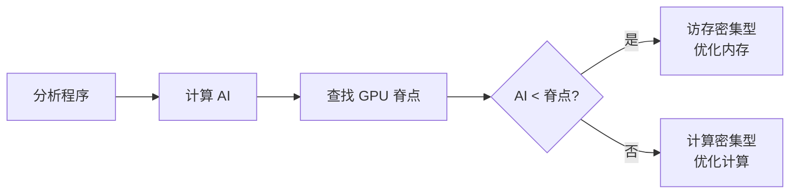

### 7.3 A100 关键参数

| 参数 | 值 |
|------|-----|
| 峰值算力 (FP32) | 19.5 TFLOPS |
| 峰值带宽 | 2039 GB/s |
| **脊点** | **9.57 FLOP/Byte** |

### 7.4 思考题

1. 为什么 RTX 4090 的脊点比 A100 高那么多？这意味着什么？
2. 如果你的程序 AI = 5，在 A100 上应该优化什么？
3. 算子融合如何改变程序的计算强度？

---

## 下一章

[第十二章：内存访问优化](./12_内存访问优化.md) - 深入学习 GPU 内存访问优化技术

---

*参考资料：[Roofline: An Insightful Visual Performance Model](https://people.eecs.berkeley.edu/~kubitron/cs252/handouts/papers/RooflineVyNoCores.pdf) | [NVIDIA Nsight Compute](https://docs.nvidia.com/nsight-compute/)*