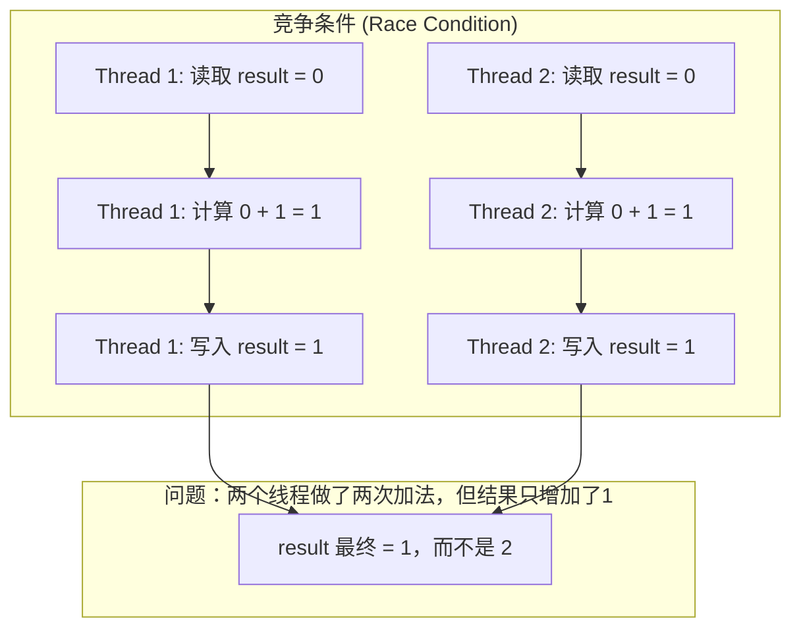
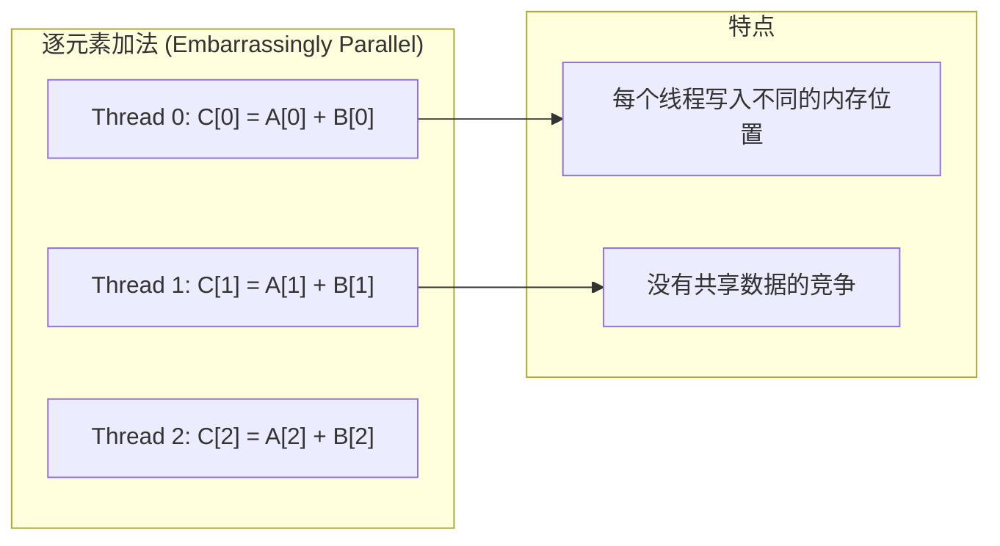
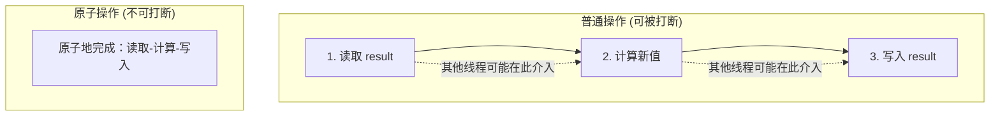
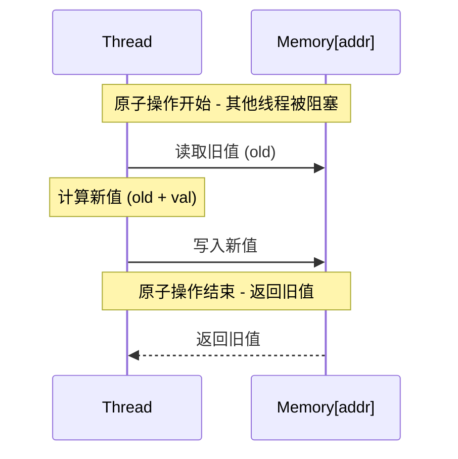
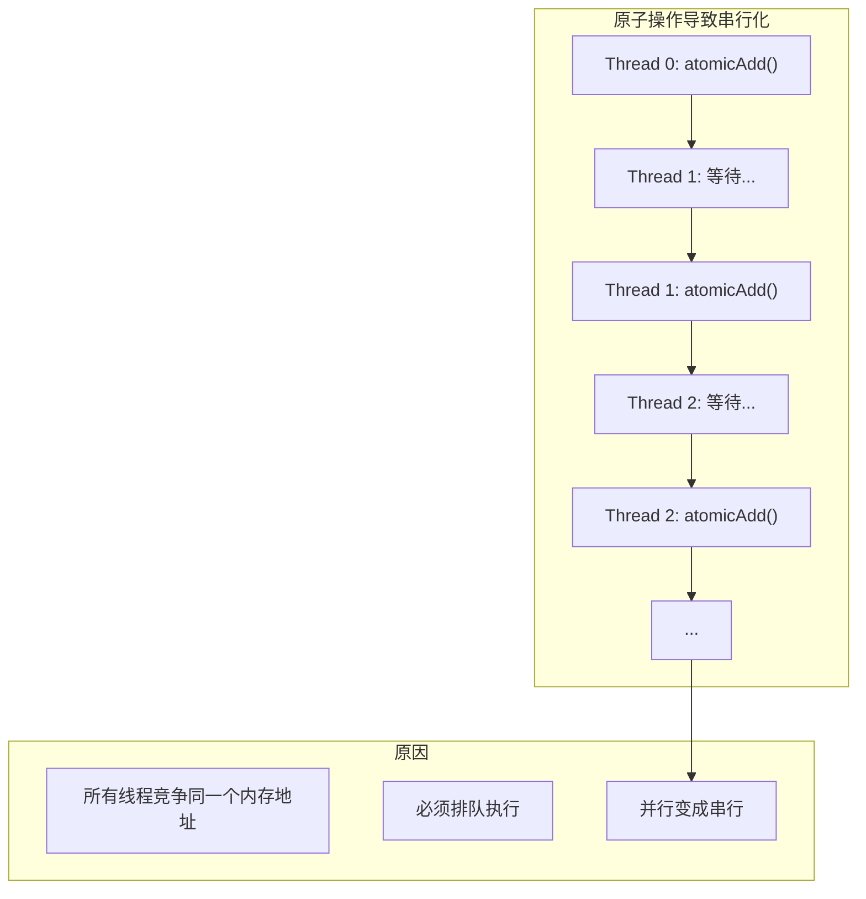
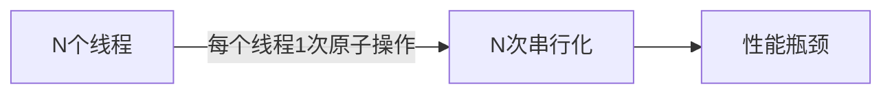
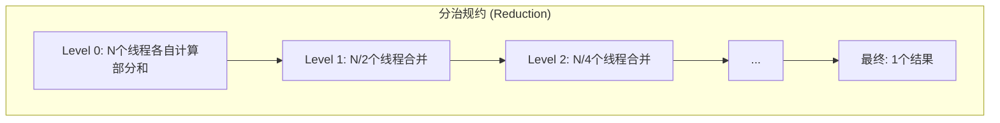
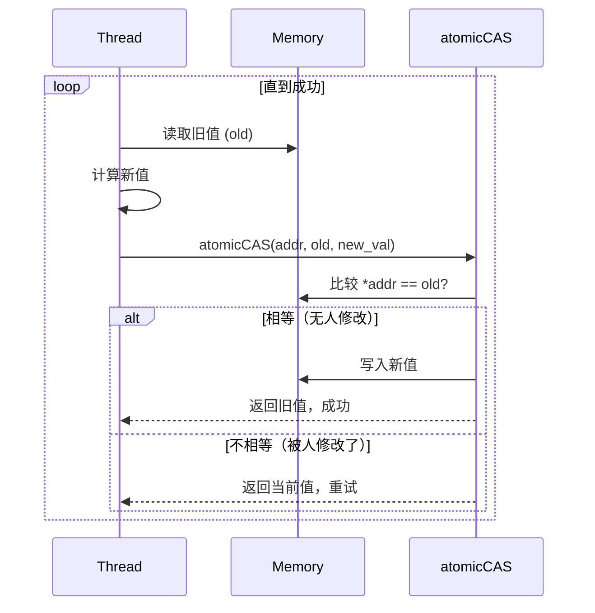
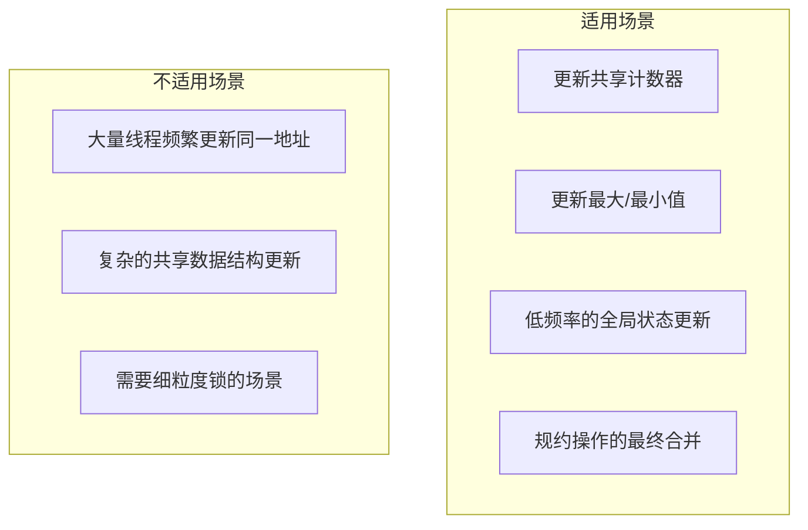
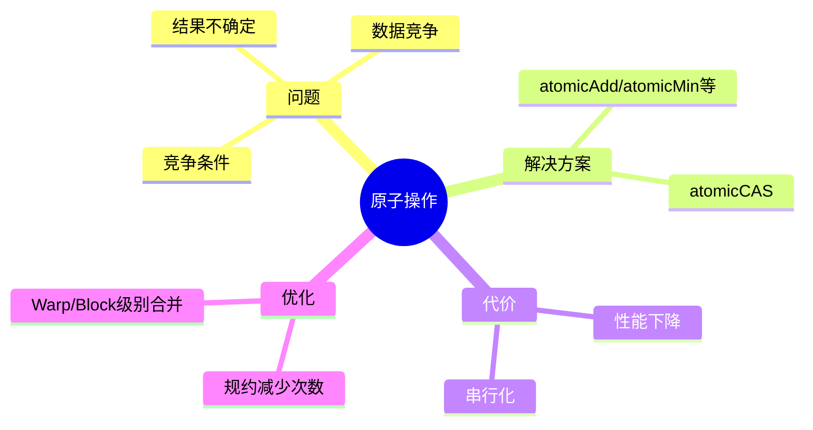

# 第十二章：原子操作与竞争条件

> 学习目标：理解并行程序中的竞争条件，掌握CUDA原子操作的使用场景与性能特点
>
> 预计阅读时间：30 分钟
>
> 前置知识：[第七章：核函数深入](./07_核函数深入.md) | [第九章：内存访问优化](./09_内存访问优化.md)

---

## 1. 从一个简单问题说起

### 1.1 并行累加：看起来很简单？

假设我们需要计算一个数组中所有元素的和。在CPU上，这是一个简单的循环：

```cpp
// CPU版本：简单直观
float sum = 0;
for (int i = 0; i < N; i++) {
    sum += data[i];
}
```

在GPU上，我们可能会这样写：

```cpp
// GPU版本：并行累加（有问题！）
__global__ void sum_kernel(float* data, float* result, int N) {
    int idx = blockIdx.x * blockDim.x + threadIdx.x;
    if (idx < N) {
        *result += data[idx];  // 多个线程同时写入！
    }
}
```

**问题**：这个核函数能正确运行吗？

### 1.2 实验验证

让我们实际运行一下：

```cpp
#include <stdio.h>

__global__ void sum_kernel(float* data, float* result, int N) {
    int idx = blockIdx.x * blockDim.x + threadIdx.x;
    if (idx < N) {
        *result += data[idx];
    }
}

int main() {
    int N = 1024;
    float *d_data, *d_result;

    cudaMalloc(&d_data, N * sizeof(float));
    cudaMalloc(&d_result, sizeof(float));

    // 初始化数据全为1，正确结果应该是1024
    float* h_data = new float[N];
    for (int i = 0; i < N; i++) h_data[i] = 1.0f;
    cudaMemcpy(d_data, h_data, N * sizeof(float), cudaMemcpyHostToDevice);

    // 结果初始化为0
    float zero = 0.0f;
    cudaMemcpy(d_result, &zero, sizeof(float), cudaMemcpyHostToDevice);

    // 启动核函数
    sum_kernel<<<4, 256>>>(d_data, d_result, N);

    // 获取结果
    float h_result;
    cudaMemcpy(&h_result, d_result, sizeof(float), cudaMemcpyDeviceToHost);

    printf("Expected: %d, Got: %f\n", N, h_result);

    return 0;
}
```

**运行结果**：
```
Expected: 1024, Got: 157.000000  // 每次运行结果都不同！
```

---

## 2. 竞争条件（Race Condition）

### 2.1 什么是竞争条件？



**竞争条件定义**：当多个线程同时访问同一内存位置，且至少有一个线程在写入时，如果访问的顺序会影响最终结果，就发生了竞争条件。

### 2.2 为什么之前的逐元素加法没问题？



**尴尬并行（Embarrassingly Parallel）**：每个线程独立处理不同的数据，不需要线程间通信或同步。

### 2.3 竞争条件的时序分析

```
时间轴：Thread 0 和 Thread 1 同时执行 *result += data[i]

时钟周期    Thread 0                Thread 1                result值
─────────────────────────────────────────────────────────────────────
   1        LOAD result             LOAD result               0
   2        (result=0)              (result=0)                0
   3        ADD data[0]             ADD data[1]               0
   4        (temp=0+1=1)            (temp=0+1=1)              0
   5        STORE result=1          -                         1
   6        -                       STORE result=1            1  ← 覆盖！
─────────────────────────────────────────────────────────────────────
最终 result = 1，但期望是 2
```

---

## 3. 原子操作（Atomic Operations）

### 3.1 什么是原子操作？

> **CUDA官方文档定义**：原子操作是一种特殊的内存操作，它在执行过程中不会被其他线程打断。原子操作将读取、修改、写入三个步骤合并为一个不可分割的整体。



### 3.2 CUDA支持的原子操作

根据CUDA官方文档，以下是常用的原子操作：

| 函数 | 操作 | 描述 |
|------|------|------|
| `atomicAdd(addr, val)` | `*addr += val` | 原子加法 |
| `atomicSub(addr, val)` | `*addr -= val` | 原子减法 |
| `atomicExch(addr, val)` | `*addr = val` | 原子交换 |
| `atomicMin(addr, val)` | `*addr = min(*addr, val)` | 原子最小值 |
| `atomicMax(addr, val)` | `*addr = max(*addr, val)` | 原子最大值 |
| `atomicInc(addr, val)` | `*addr = (*addr >= val) ? 0 : *addr + 1` | 原子递增 |
| `atomicDec(addr, val)` | `*addr = (*addr == 0 \|\| *addr > val) ? val : *addr - 1` | 原子递减 |
| `atomicCAS(addr, cmp, val)` | 比较并交换 | 原子比较交换 |
| `atomicAnd(addr, val)` | `*addr &= val` | 原子与运算 |
| `atomicOr(addr, val)` | `*addr \|= val` | 原子或运算 |
| `atomicXor(addr, val)` | `*addr ^= val` | 原子异或 |

### 3.3 atomicAdd 支持的数据类型

`atomicAdd` 支持多种数据类型，不同计算能力的设备支持情况不同：

| 数据类型 | 计算能力要求 | 说明 |
|----------|--------------|------|
| `int`, `unsigned int` | 1.2+ | 基本支持 |
| `unsigned long long` | 1.2+ | 64位整数 |
| `float` | 2.0+ | 32位浮点 |
| `double` | 6.0+ | 64位浮点 |
| `__half`, `__half2` | 6.0+ / 7.0+ | 半精度浮点 |
| `__nv_bfloat16`, `__nv_bfloat162` | 8.0+ | BF16浮点 |
| `float2`, `float4` | 9.0+ | 浮点向量（仅全局内存） |

> **注意**：`float2` 和 `float4` 版本的 `atomicAdd` 只支持全局内存地址，原子性分别对每个 `float` 元素保证，不保证整个向量作为单个访问的原子性。

### 3.3 使用原子操作修复并行累加

```cpp
// GPU版本：使用原子操作（正确！）
__global__ void sum_kernel_atomic(float* data, float* result, int N) {
    int idx = blockIdx.x * blockDim.x + threadIdx.x;
    if (idx < N) {
        atomicAdd(result, data[idx]);  // 原子加法，确保正确性
    }
}
```

**运行结果**：
```
Expected: 1024, Got: 1024.000000  // 正确！
```

### 3.4 atomicAdd 详细说明

```cpp
// atomicAdd 的函数原型
float atomicAdd(float* address, float val);
int atomicAdd(int* address, int val);
unsigned int atomicAdd(unsigned int* address, unsigned int val);
unsigned long long atomicAdd(unsigned long long* address, unsigned long long val);
```

**工作原理**：



**返回值**：`atomicAdd` 返回该地址在操作前的旧值。

---

## 4. 原子操作的性能代价

### 4.1 性能对比

```cpp
#include <stdio.h>
#include <cuda_runtime.h>

// 普通加法（有竞争条件）
__global__ void sum_naive(float* data, float* result, int N) {
    int idx = blockIdx.x * blockDim.x + threadIdx.x;
    if (idx < N) {
        *result += data[idx];
    }
}

// 原子加法（正确但慢）
__global__ void sum_atomic(float* data, float* result, int N) {
    int idx = blockIdx.x * blockDim.x + threadIdx.x;
    if (idx < N) {
        atomicAdd(result, data[idx]);
    }
}

int main() {
    int N = 1024 * 1024;  // 1M 元素

    // ... 分配内存和初始化 ...

    // 创建事件计时
    cudaEvent_t start, stop;
    cudaEventCreate(&start);
    cudaEventCreate(&stop);

    // 测试原子操作版本
    cudaEventRecord(start);
    sum_atomic<<<256, 256>>>(d_data, d_result, N);
    cudaEventRecord(stop);
    cudaEventSynchronize(stop);

    float ms;
    cudaEventElapsedTime(&ms, start, stop);
    printf("Atomic version: %f ms\n", ms);

    return 0;
}
```

**性能对比结果**：

| 实现方式 | 正确性 | 相对性能 |
|----------|--------|----------|
| 普通加法 | ❌ 错误 | 100% (基准) |
| 原子加法 | ✅ 正确 | ~0.5% (慢200倍！) |

### 4.2 为什么原子操作这么慢？



**关键洞察**：原子操作虽然保证正确性，但会导致严重的串行化问题。当大量线程同时对同一地址执行原子操作时，性能会急剧下降。

### 4.3 Nsight Compute 分析

使用 `ncu` 分析原子操作版本：

```bash
ncu --set full ./sum_atomic
```

**观察到的指标**：

```
GPU Speed of Light:
  Compute Throughput: 0.12%    ← 计算利用率极低
  Memory Throughput: 0.23%     ← 内存利用率极低

Warp State Statistics:
  Stall Long Scoreboard: 85%   ← 大量等待内存操作
```

---

## 5. 减少原子操作：规约思想

### 5.1 问题分析



**核心问题**：每个线程都直接对最终结果做原子操作，导致N次串行。

### 5.2 解决思路：分治规约



**核心思想**：先在更小的范围内合并，减少需要做的原子操作数量。

### 5.3 Warp级别规约

```cpp
// Warp级别规约：减少原子操作次数
__global__ void sum_warp_reduce(float* data, float* result, int N) {
    int idx = blockIdx.x * blockDim.x + threadIdx.x;
    int warp_idx = idx / 32;      // 每个warp的索引
    int lane = idx % 32;          // 线程在warp内的编号

    // 每个线程先读取数据
    float val = (idx < N) ? data[idx] : 0.0f;

    // Warp内规约：每个warp选一个线程（lane 0）汇总
    // 使用shuffle指令在warp内交换数据
    for (int offset = 16; offset > 0; offset /= 2) {
        val += __shfl_down_sync(0xffffffff, val, offset);
    }

    // 只有每个warp的第一个线程写入结果
    if (lane == 0) {
        atomicAdd(result, val);
    }
}
```

**原子操作次数变化**：
- 原始版本：N 次
- Warp规约版本：N/32 次

### 5.4 Block级别规约

```cpp
// Block级别规约：使用共享内存
__global__ void sum_block_reduce(float* data, float* result, int N) {
    __shared__ float sdata[256];  // 每个block 256个线程

    int tid = threadIdx.x;
    int idx = blockIdx.x * blockDim.x + threadIdx.x;

    // 每个线程读取数据到共享内存
    sdata[tid] = (idx < N) ? data[idx] : 0.0f;
    __syncthreads();

    // Block内树状规约
    for (int s = blockDim.x / 2; s > 0; s >>= 1) {
        if (tid < s) {
            sdata[tid] += sdata[tid + s];
        }
        __syncthreads();
    }

    // 只有线程0写入全局结果
    if (tid == 0) {
        atomicAdd(result, sdata[0]);
    }
}
```

**原子操作次数变化**：
- 原始版本：N 次
- Block规约版本：GridSize 次（减少了几百倍！）

### 5.5 性能对比总结

| 实现方式 | 原子操作次数 | 相对性能 | 正确性 |
|----------|--------------|----------|--------|
| 直接原子加 | N | 1x (最慢) | ✅ |
| Warp规约 | N/32 | ~30x | ✅ |
| Block规约 | GridSize | ~200x | ✅ |
| 两阶段规约 | 0 或 1 | 最优 | ✅ |

---

## 6. atomicCAS：构建自定义原子操作

### 6.1 atomicCAS 原理

`atomicCAS`（Compare-And-Swap）是最基础的原子操作，可以用它实现其他原子操作。

```cpp
int atomicCAS(int* address, int compare, int val);
```

**语义**：
```cpp
// 原子地执行以下操作：
old = *address;
if (old == compare) {
    *address = val;
}
return old;
```

### 6.2 使用 atomicCAS 实现原子乘法

CUDA没有直接提供 `atomicMul`，但我们可以用 `atomicCAS` 实现：

```cpp
__device__ float atomicMul(float* address, float val) {
    int* address_as_int = (int*)address;
    int old = *address_as_int;
    int assumed;

    do {
        assumed = old;
        // 将int解释回float，乘以val，再转回int
        float result = __int_as_float(assumed) * val;
        old = atomicCAS(address_as_int, assumed, __float_as_int(result));
    } while (assumed != old);  // 如果CAS失败，重试

    return __int_as_float(old);
}
```

### 6.3 atomicCAS 的工作流程



---

## 7. 何时使用原子操作？

### 7.1 适用场景



### 7.2 使用建议

1. **减少原子操作频率**：通过规约、分块等技术减少需要做原子操作的次数

2. **使用适当的数据类型**：`int` 和 `unsigned int` 的原子操作通常比 `float` 更高效

3. **考虑替代方案**：
   - 共享内存 + 同步
   - Warp Shuffle
   - Cooperative Groups

4. **避免热点地址**：如果多个线程块频繁更新同一地址，考虑使用per-block的结果数组

---

## 8. 本章小结

### 8.1 关键概念

| 概念 | 描述 |
|------|------|
| 竞争条件 | 多线程同时访问同一内存，至少一个写入，结果依赖执行顺序 |
| 原子操作 | 读取-修改-写入作为一个不可分割的操作 |
| 串行化 | 原子操作导致并行变成顺序执行 |
| 规约 | 通过分治减少原子操作次数 |

### 8.2 核心要点



### 8.3 性能优化原则

```
原子操作优化原则：
1. 减少次数 > 减少每次耗时
2. 先在更小范围内合并，再做原子操作
3. 考虑是否真的需要原子操作
```

### 8.4 思考题

1. 为什么原子操作会严重影响性能？
2. `atomicCAS` 为什么可能需要多次重试？
3. 如果要实现一个原子操作版本的"取最大值并递增"，应该怎么写？

---

## 下一章

[第十三章：共享内存深入](./13_共享内存深入.md) - 深入理解共享内存的原理和优化技巧

---

*参考资料：[CUDA C++ Programming Guide - B.12. Atomic Functions](https://docs.nvidia.com/cuda/cuda-c-programming-guide/index.html#atomic-functions)*