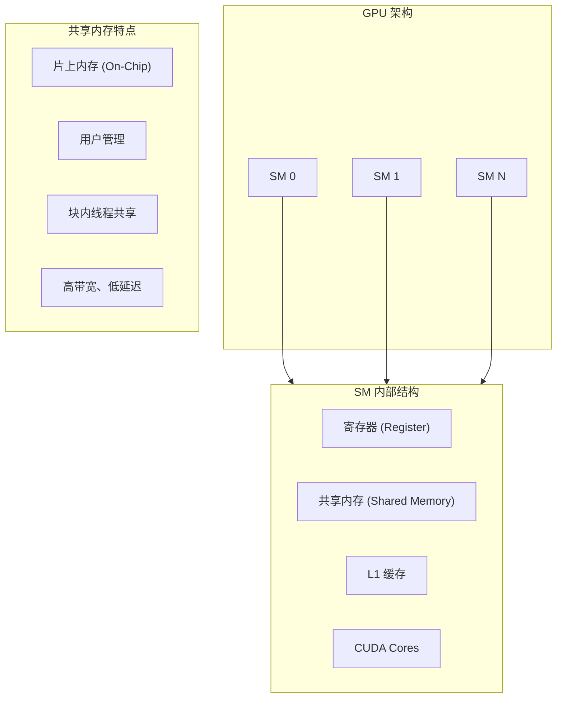
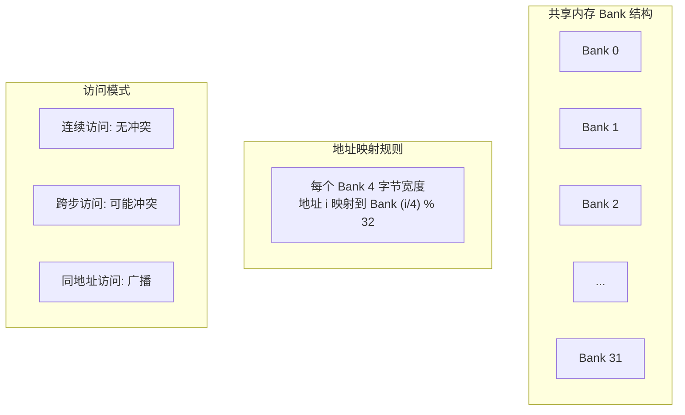
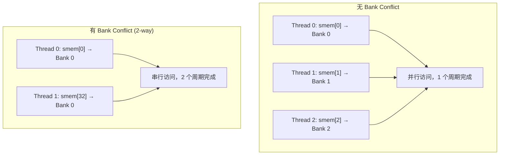
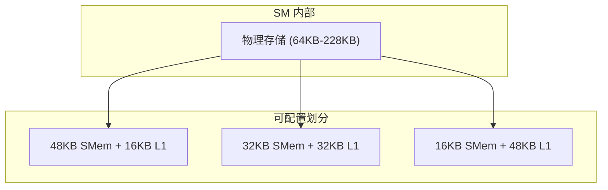
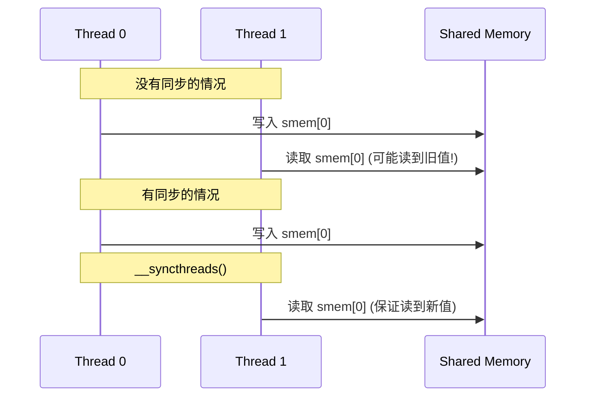
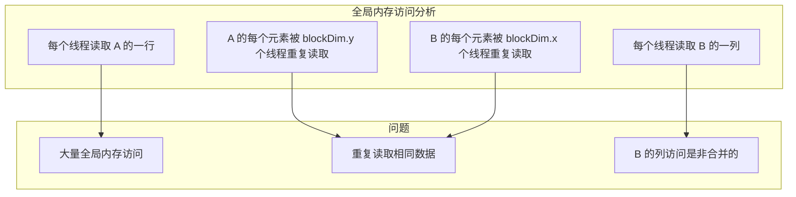
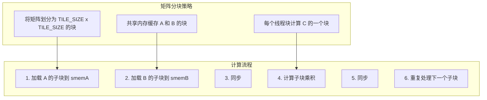
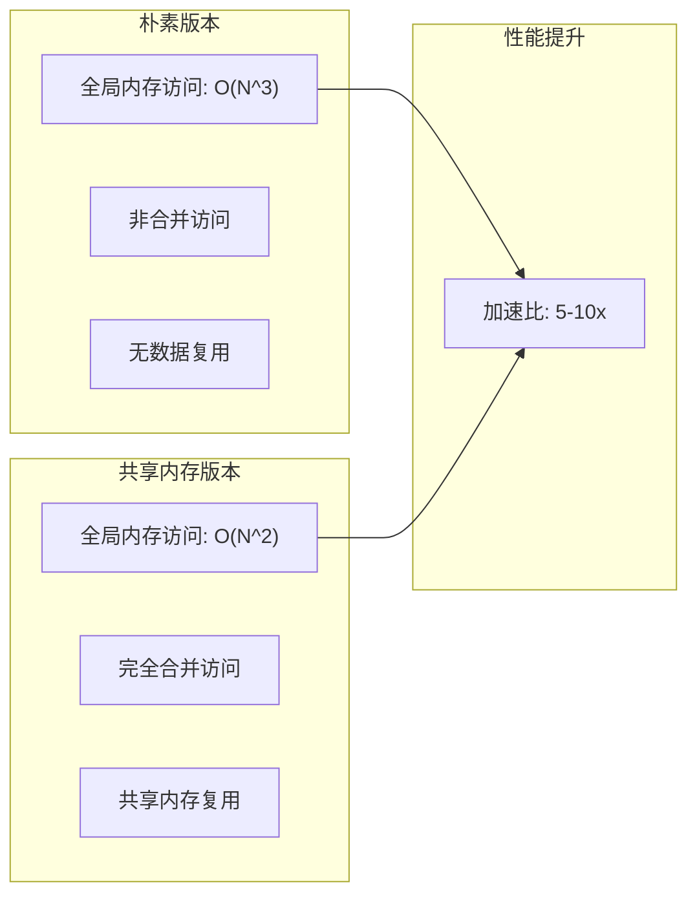
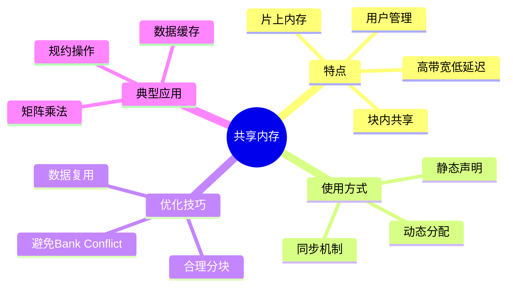

# 第十三章：共享内存深入

> 学习目标：深入理解共享内存的硬件结构、使用方法和优化技巧
>
> 预计阅读时间：40 分钟
>
> 前置知识：[第六章：内存模型基础](./06_内存模型基础.md) | [第十二章：原子操作与竞争条件](./12_原子操作与竞争条件.md)

---

## 1. 共享内存概述

### 1.1 什么是共享内存？

共享内存（Shared Memory）是GPU上一种特殊的片上内存，位于每个SM（Streaming Multiprocessor）内部。它是CUDA程序员可以直接控制的用户管理缓存。


> **图：CUDA 内存层次结构**（来源：CUDA C++ Programming Guide）
>
> 如图所示，每个线程拥有私有的本地内存（Local Memory），每个线程块拥有共享内存（Shared Memory），对所有线程可见且生命周期与块相同。所有线程都可以访问全局内存（Global Memory）。



### 1.2 共享内存的优势

| 特性 | 共享内存 | 全局内存 |
|------|----------|----------|
| 位置 | 片上 (On-Chip) | 片外 (Off-Chip, DRAM) |
| 延迟 | ~20-30 周期 | ~400-600 周期 |
| 带宽 | ~数 TB/s | ~数百 GB/s |
| 容量 | 48KB-227KB/SM | 数 GB - 数十 GB |
| 可见性 | 同一线程块内 | 所有线程 |
| 管理 | 程序员显式管理 | 硬件缓存管理 |

**关键优势**：
1. **低延迟**：比全局内存快 20-30 倍
2. **高带宽**：片上带宽极高
3. **数据复用**：避免重复访问全局内存
4. **线程协作**：支持线程间通信

### 1.3 共享内存的典型用途


**具体场景**：
- 矩阵乘法中的分块（Tiling）
- 规约操作中的中间结果存储
- 需要多次访问同一数据的情况
- 线程间需要交换数据

---

## 2. 硬件结构

### 2.1 Bank 结构

共享内存被划分为 32 个等宽的存储单元，称为 **Bank**。这种设计允许并行访问，提高吞吐量。



**Bank 映射规则**：

对于 4 字节模式（默认），地址 `i` 处的 4 字节数据映射到 Bank `(i >> 2) & 31`（即 `(i / 4) % 32`）。

```
地址偏移（字节）    Bank
──────────────────────────
0, 1, 2, 3          Bank 0
4, 5, 6, 7          Bank 1
8, 9, 10, 11        Bank 2
...
124, 125, 126, 127  Bank 31
128, 129, 130, 131  Bank 0  ← 循环
...
```

### 2.2 Bank Conflict

当一个 Warp 中的多个线程访问同一个 Bank 的不同地址时，这些访问必须串行执行，这就是 **Bank Conflict**。



**Bank Conflict 程度**：
- **无冲突**：所有线程访问不同 Bank
- **2-way 冲突**：两个线程访问同一 Bank，需要 2 次访问
- **N-way 冲突**：N 个线程访问同一 Bank，需要 N 次访问

### 2.3 广播和多播

当多个线程读取同一 Bank 的**相同地址**时，不会产生 Bank Conflict，而是发生**广播**。

```cpp
// 无 Bank Conflict - 所有线程读取同一地址
float val = smem[0];  // 广播给所有线程

// 有 Bank Conflict - 线程 0 和线程 32 读取不同地址但同一 Bank
float val0 = smem[0];   // Bank 0
float val32 = smem[32]; // Bank 0 (不同地址)
```

### 2.4 共享内存与 L1 缓存的关系

共享内存和 L1 缓存共享同一物理存储空间，但逻辑上是分离的。



**配置方法**：

```cpp
// 使用 cudaFuncSetAttribute 设置共享内存配置
cudaFuncSetAttribute(
    my_kernel,
    cudaFuncAttributePreferredSharedMemoryCarveout,
    50  // 50% 给共享内存
);
```

---

## 3. 静态 vs 动态共享内存

### 3.1 静态共享内存

静态共享内存在编译时确定大小，使用 `__shared__` 关键字声明。

```cpp
__global__ void static_smem_demo() {
    // 静态共享内存 - 大小在编译时确定
    __shared__ float sdata[256];  // 固定 256 个元素

    int tid = threadIdx.x;
    sdata[tid] = tid * 2.0f;
    __syncthreads();

    // 使用 sdata...
}
```

**特点**：
- 大小在编译时固定
- 声明简单直观
- 每个核函数可以有多个静态共享内存变量

### 3.2 动态共享内存

动态共享内存在运行时确定大小，需要在核函数启动时指定。

```cpp
// 动态共享内存 - 使用 extern 关键字
extern __shared__ float dynamic_smem[];

__global__ void dynamic_smem_demo(int n) {
    int tid = threadIdx.x;
    if (tid < n) {
        dynamic_smem[tid] = tid * 2.0f;
    }
    __syncthreads();
    // 使用 dynamic_smem...
}

// 启动时指定大小（第三个参数）
int smem_size = 1024 * sizeof(float);
dynamic_smem_demo<<<1, 256, smem_size>>>(1024);
```

**关键区别**：

| 特性 | 静态共享内存 | 动态共享内存 |
|------|--------------|--------------|
| 大小确定时机 | 编译时 | 运行时 |
| 声明方式 | `__shared__ float data[N]` | `extern __shared__ float data[]` |
| 启动参数 | 不需要 | 第三个参数指定字节数 |
| 灵活性 | 固定 | 可根据问题规模调整 |

### 3.3 多个动态共享内存数组

当需要多个动态共享内存数组时，需要手动管理偏移：

```cpp
extern __shared__ char smem_buffer[];  // 使用 char 类型作为基础

__global__ void multi_dynamic_smem(int n) {
    // 手动划分共享内存
    float* arr1 = (float*)smem_buffer;
    int* arr2 = (int*)(smem_buffer + n * sizeof(float));
    double* arr3 = (double*)(smem_buffer + n * sizeof(float) + n * sizeof(int));

    int tid = threadIdx.x;
    arr1[tid] = tid * 1.0f;
    arr2[tid] = tid * 2;
    arr3[tid] = tid * 3.0;
}

// 计算总共享内存大小
int smem_size = n * sizeof(float) + n * sizeof(int) + n * sizeof(double);
multi_dynamic_smem<<<1, 256, smem_size>>>(n);
```

---

## 4. __syncthreads() 同步

### 4.1 为什么需要同步？

共享内存对同一线程块内的所有线程可见，但线程执行是异步的。当一个线程写入共享内存时，其他线程可能还没有执行到那一步。



### 4.2 __syncthreads() 的作用

`__syncthreads()` 是一个线程块级别的屏障同步：

- 确保块内所有线程都执行到该点后才继续
- 保证之前的内存写入对块内所有线程可见
- 不保证不同线程块之间的同步

```cpp
__global__ void syncthreads_demo(float* input, float* output, int n) {
    __shared__ float sdata[256];

    int tid = threadIdx.x;
    int idx = blockIdx.x * blockDim.x + threadIdx.x;

    // 阶段1: 从全局内存加载到共享内存
    if (idx < n) {
        sdata[tid] = input[idx];
    }

    // 必须同步！确保所有线程都完成写入
    __syncthreads();

    // 阶段2: 从共享内存读取并处理
    // 此时所有 sdata 都已就绪
    if (tid > 0 && idx < n) {
        output[idx] = sdata[tid] + sdata[tid - 1];
    }
}
```

### 4.3 使用注意事项

```cpp
// 错误示例：条件分支中的同步
__global__ void bad_syncthreads() {
    __shared__ float sdata[256];
    int tid = threadIdx.x;

    if (tid < 128) {
        sdata[tid] = tid;
        __syncthreads();  // 危险！可能导致死锁
    }
}

// 正确示例：同步放在条件分支外
__global__ void good_syncthreads() {
    __shared__ float sdata[256];
    int tid = threadIdx.x;

    if (tid < 128) {
        sdata[tid] = tid;
    }
    __syncthreads();  // 安全：所有线程都执行到这一行
}
```

**重要规则**：
1. `__syncthreads()` 必须被块内所有线程执行
2. 不要在可能发散的条件分支中使用
3. 避免在循环中使用可能提前退出的同步

### 4.4 其他同步原语

CUDA 还提供了其他同步函数：

```cpp
// 块内同步，带谓词版本
void __syncthreads_count(int predicate);
void __syncthreads_and(int predicate);
void __syncthreads_or(int predicate);

// Warp 级同步
void __syncwarp(unsigned mask = 0xffffffff);

// 内存屏障
void __threadfence_block();  // 块内内存可见性
void __threadfence();        // 设备级内存可见性
void __threadfence_system(); // 系统级内存可见性
```

---

## 5. 使用共享内存优化矩阵乘法

### 5.1 朴素矩阵乘法的问题

```cpp
// 朴素实现：每个线程计算 C 的一个元素
__global__ void matmul_naive(float* A, float* B, float* C, int N) {
    int row = blockIdx.y * blockDim.y + threadIdx.y;
    int col = blockIdx.x * blockDim.x + threadIdx.x;

    if (row < N && col < N) {
        float sum = 0.0f;
        for (int k = 0; k < N; k++) {
            // 每次迭代访问全局内存！
            sum += A[row * N + k] * B[k * N + col];
        }
        C[row * N + col] = sum;
    }
}
```

**性能问题分析**：



**访存次数计算**：
- 计算 N×N 的矩阵乘法
- 全局内存访问次数：O(N^3)
- 理想情况应该是：O(N^2) 读 + O(N^2) 写

### 5.2 分块矩阵乘法

核心思想：利用共享内存缓存数据，减少全局内存访问。



### 5.3 优化实现

```cpp
#define TILE_SIZE 32

__global__ void matmul_shared(float* A, float* B, float* C, int N) {
    // 共享内存缓存矩阵块
    __shared__ float sA[TILE_SIZE][TILE_SIZE];
    __shared__ float sB[TILE_SIZE][TILE_SIZE];

    int row = blockIdx.y * TILE_SIZE + threadIdx.y;
    int col = blockIdx.x * TILE_SIZE + threadIdx.x;
    int tx = threadIdx.x;
    int ty = threadIdx.y;

    float sum = 0.0f;

    // 循环处理所有子块
    for (int t = 0; t < N / TILE_SIZE; t++) {
        // 从全局内存加载到共享内存
        sA[ty][tx] = A[row * N + t * TILE_SIZE + tx];
        sB[ty][tx] = B[(t * TILE_SIZE + ty) * N + col];

        // 同步确保数据加载完成
        __syncthreads();

        // 计算子块乘积
        #pragma unroll
        for (int k = 0; k < TILE_SIZE; k++) {
            sum += sA[ty][k] * sB[k][tx];
        }

        // 同步确保所有线程完成计算后再加载下一块
        __syncthreads();
    }

    if (row < N && col < N) {
        C[row * N + col] = sum;
    }
}
```

### 5.4 性能对比



**理论分析**：

| 指标 | 朴素版本 | 共享内存版本 |
|------|----------|--------------|
| 全局内存读取 | 2N^3 | 2N^3 / TILE_SIZE |
| 数据复用 | 无 | TILE_SIZE 次 |
| 访问模式 | 部分非合并 | 完全合并 |
| 共享内存使用 | 0 | 2 * TILE_SIZE^2 * 4 字节 |

---

## 6. 共享内存配置

### 6.1 查询设备属性

```cpp
cudaDeviceProp prop;
cudaGetDeviceProperties(&prop, 0);

printf("共享内存大小: %zu KB/SM\n", prop.sharedMemPerBlock / 1024);
printf("共享内存 per Block: %zu 字节\n", prop.sharedMemPerBlock);
printf("共享内存 per SM: %zu 字节\n", prop.sharedMemPerMultiprocessor);
printf("Warp 大小: %d\n", prop.warpSize);
```

### 6.2 共享内存 Bank 大小

现代 GPU 支持配置 Bank 宽度：

```cpp
// 设置 Bank 宽度为 8 字节（适用于双精度计算）
cudaDeviceSetSharedMemConfig(cudaSharedMemBankSizeEightByte);

// 设置 Bank 宽度为 4 字节（默认）
cudaDeviceSetSharedMemConfig(cudaSharedMemBankSizeFourByte);
```

### 6.3 共享内存 Carveout

控制共享内存与 L1 缓存的划分：

```cpp
// 方法1: 使用 cudaFuncSetAttribute
cudaFuncSetAttribute(
    my_kernel,
    cudaFuncAttributePreferredSharedMemoryCarveout,
    75  // 75% 给共享内存
);

// 方法2: 使用启动属性
cudaLaunchConfig_t config = {0};
config.gridDim = grid;
config.blockDim = block;
config.sharedMem = smem_size;

cudaLaunchAttribute attrs[1];
attrs[0].id = cudaLaunchAttributeSharedMemoryCarveout;
attrs[0].val.sharedMemoryCarveout = 75;

config.attrs = attrs;
config.numAttrs = 1;

cudaLaunchKernelEx(&config, my_kernel, args...);
```

---

## 7. 最佳实践

### 7.1 避免 Bank Conflict

```cpp
// Bank Conflict 示例
__global__ void bad_access() {
    __shared__ float data[256];
    int tid = threadIdx.x;

    // 跨步 32 访问 → 32-way Bank Conflict
    float val = data[tid * 32];  // Bad!

    // 改为连续访问 → 无冲突
    float val2 = data[tid];  // Good!
}

// 使用填充避免 Bank Conflict
__global__ void padding_solution() {
    // 添加 1 列填充，改变 Bank 映射
    __shared__ float data[32][33];  // 33 = 32 + 1 padding

    int tid = threadIdx.x;
    // 现在 data[tid][tid] 访问不同 Bank
    float val = data[tid][tid];
}
```

### 7.2 合理使用共享内存大小

```cpp
// 检查共享内存使用是否超限
int smem_per_block = 2 * TILE_SIZE * TILE_SIZE * sizeof(float);

if (smem_per_block > prop.sharedMemPerBlock) {
    printf("共享内存超限！需要 %d 字节，最大 %zu 字节\n",
           smem_per_block, prop.sharedMemPerBlock);
}
```

### 7.3 占用率考虑

```cpp
// 计算占用率
int max_blocks_per_sm;
cudaOccupancyMaxActiveBlocksPerMultiprocessor(
    &max_blocks_per_sm,
    my_kernel,
    block_size,
    smem_size
);

float occupancy = (float)max_blocks_per_sm * block_size / prop.maxThreadsPerMultiProcessor;
printf("理论占用率: %.2f%%\n", occupancy * 100);
```

---

## 8. 本章小结

### 8.1 关键概念

| 概念 | 描述 |
|------|------|
| 共享内存 | 片上高速内存，块内线程共享 |
| Bank | 共享内存的 32 个存储单元，支持并行访问 |
| Bank Conflict | 多线程访问同一 Bank 的不同地址导致的串行化 |
| 静态共享内存 | 编译时确定大小 |
| 动态共享内存 | 运行时确定大小 |
| `__syncthreads()` | 块内线程同步屏障 |

### 8.2 核心要点



### 8.3 性能优化清单

```
共享内存优化清单:
[ ] 检查 Bank Conflict
[ ] 使用填充避免冲突
[ ] 确保合并访问全局内存
[ ] 合理设置分块大小
[ ] 检查占用率
[ ] 验证同步正确性
```

### 8.4 思考题

1. 为什么共享内存比全局内存快这么多？
2. 静态和动态共享内存各有什么优缺点？何时选择哪种？
3. 如果共享内存太小无法容纳整个数据块，应该如何处理？
4. 矩阵乘法中，为什么需要两次 `__syncthreads()`？

---

## 下一章

[第十四章：规约算法优化](./14_规约算法优化.md) - 深入学习规约操作的多种优化技术

---

*参考资料：[CUDA C++ Programming Guide - 3.2.4. Shared Memory](https://docs.nvidia.com/cuda/cuda-c-programming-guide/index.html#shared-memory)*