# 第十四章：规约算法优化

> 学习目标：深入理解规约算法原理，掌握多种CUDA规约优化技术
>
> 预计阅读时间：45 分钟
>
> 前置知识：[第十二章：原子操作与竞争条件](./12_原子操作与竞争条件.md) | [第十三章：共享内存深入](./13_共享内存深入.md)

---

## 1. 规约问题概述

### 1.1 什么是规约操作？

**规约（Reduction）** 是指将一组数据通过某种运算合并为一个（或少数几个）结果的操作。常见的规约操作包括：

- **求和（Sum）**：计算数组所有元素的总和
- **求积（Product）**：计算数组所有元素的乘积
- **求最大/最小值（Max/Min）**：找出数组中的极值
- **逻辑运算**：判断所有元素是否满足某条件

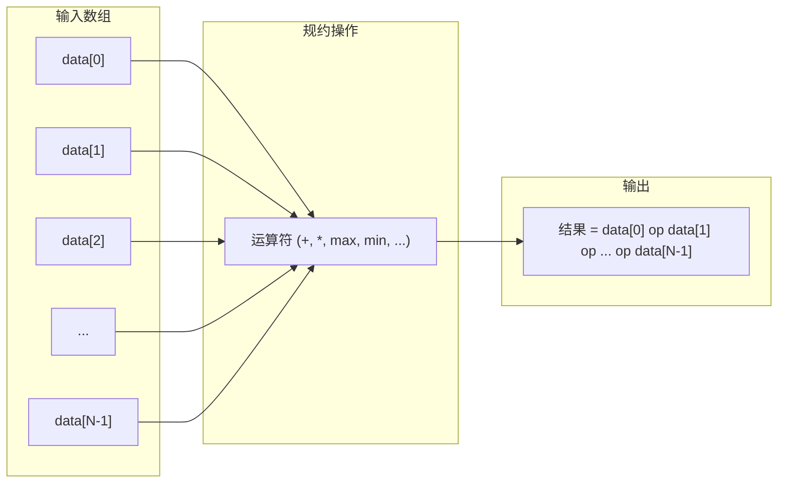

### 1.2 规约的并行挑战

在串行程序中，规约是一个简单的循环：

```cpp
// 串行规约：O(N) 时间复杂度
float sum = 0;
for (int i = 0; i < N; i++) {
    sum += data[i];
}
```

在并行环境中，规约面临以下挑战：

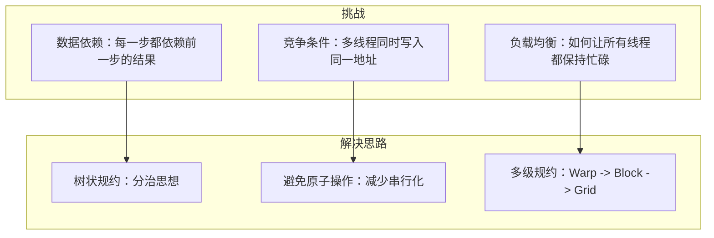

---

## 2. 朴素规约与问题分析

### 2.1 朴素原子规约

最直接的并行规约方法是让每个线程直接累加到全局结果：

```cpp
// 朴素原子规约（正确但性能差）
__global__ void naive_reduce(float* data, float* result, int N) {
    int idx = blockIdx.x * blockDim.x + threadIdx.x;
    if (idx < N) {
        atomicAdd(result, data[idx]);  // N次原子操作！
    }
}
```

### 2.2 性能问题分析

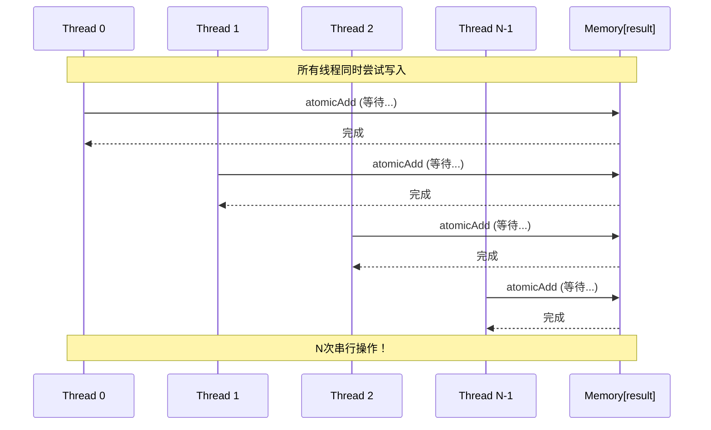

**性能瓶颈**：
- N个线程 = N次原子操作 = N次串行等待
- 并行度完全丧失
- 性能比串行版本还差

---

## 3. 树状规约原理

### 3.1 分治思想

树状规约采用分治策略，将大规模规约分解为多个小规模规约：

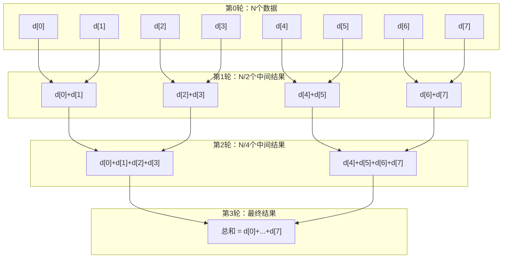

### 3.2 时间复杂度分析

| 方法 | 时间复杂度 | 并行度 |
|------|------------|--------|
| 串行规约 | O(N) | 1 |
| 朴素原子规约 | O(N) 串行 | 1（实际） |
| 树状规约 | O(log N) | N/2 -> N/4 -> ... -> 1 |

### 3.3 共享内存树状规约

```cpp
// 共享内存树状规约
__global__ void tree_reduce_smem(float* data, float* result, int N) {
    __shared__ float sdata[256];  // 每个block的共享内存

    int tid = threadIdx.x;
    int idx = blockIdx.x * blockDim.x + threadIdx.x;

    // 步骤1：加载数据到共享内存
    sdata[tid] = (idx < N) ? data[idx] : 0.0f;
    __syncthreads();

    // 步骤2：树状规约
    for (int s = blockDim.x / 2; s > 0; s >>= 1) {
        if (tid < s) {
            sdata[tid] += sdata[tid + s];
        }
        __syncthreads();  // 同步确保所有线程完成当前轮
    }

    // 步骤3：只有线程0写入全局结果
    if (tid == 0) {
        atomicAdd(result, sdata[0]);
    }
}
```

**原子操作次数减少**：从 N 次降到 GridSize 次！

---

## 4. Warp Shuffle 规约

### 4.1 Warp Shuffle 指令介绍

Warp Shuffle 允许同一 Warp 内的线程直接交换寄存器数据，无需使用共享内存：

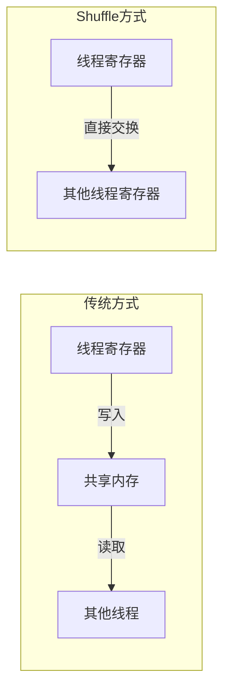

### 4.2 Warp Shuffle 函数详解

| 函数 | 描述 |
|------|------|
| `__shfl_sync(mask, var, srcLane)` | 从指定 lane 获取值 |
| `__shfl_up_sync(mask, var, delta)` | 从 lane - delta 获取值 |
| `__shfl_down_sync(mask, var, delta)` | 从 lane + delta 获取值 |
| `__shfl_xor_sync(mask, var, laneMask)` | 从 lane ^ laneMask 获取值 |

### 4.3 __shfl_down_sync 规约原理

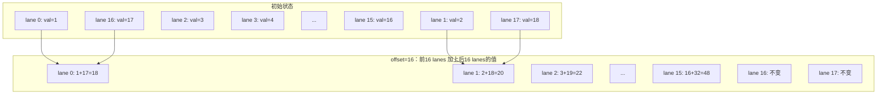

### 4.4 Warp Shuffle 规约实现

```cpp
// 使用 __shfl_down_sync 的 Warp 规约
__device__ float warp_reduce_shfl(float val) {
    // 5轮规约：32 -> 16 -> 8 -> 4 -> 2 -> 1
    val += __shfl_down_sync(0xffffffff, val, 16);
    val += __shfl_down_sync(0xffffffff, val, 8);
    val += __shfl_down_sync(0xffffffff, val, 4);
    val += __shfl_down_sync(0xffffffff, val, 2);
    val += __shfl_down_sync(0xffffffff, val, 1);
    return val;  // 现在 lane 0 拥有完整的 warp 规约结果
}

__global__ void reduce_shfl(float* data, float* result, int N) {
    int idx = blockIdx.x * blockDim.x + threadIdx.x;
    int lane = threadIdx.x & 31;  // lane ID

    // 加载数据
    float val = (idx < N) ? data[idx] : 0.0f;

    // Warp 内规约
    val = warp_reduce_shfl(val);

    // 只有 lane 0 写入结果
    if (lane == 0) {
        atomicAdd(result, val);
    }
}
```

### 4.5 __shfl_xor_sync 规约

`__shfl_xor_sync` 提供了一种对称的规约方式：

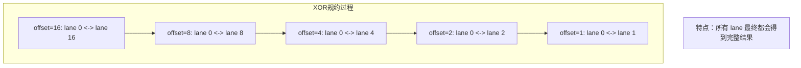

```cpp
// 使用 __shfl_xor_sync 的 Warp 规约
__device__ float warp_reduce_xor(float val) {
    for (int offset = 16; offset > 0; offset /= 2) {
        val += __shfl_xor_sync(0xffffffff, val, offset);
    }
    return val;  // 所有 lane 都拥有完整的 warp 规约结果
}
```

**Shuffle 规约优势**：
- 无需共享内存
- 无需同步（Warp 内是锁步执行）
- 避免 Bank Conflict
- 更高的带宽利用率

---

## 5. 共享内存树状规约优化

### 5.1 Bank Conflict 问题

共享内存被划分为 32 个 Bank，每个 Bank 宽度为 4 字节。当一个 Warp 中的多个线程访问同一 Bank 的不同地址时，会发生 Bank Conflict。

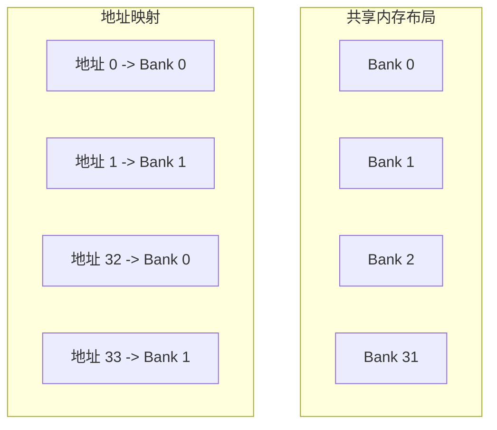

### 5.2 两种树状规约模式对比

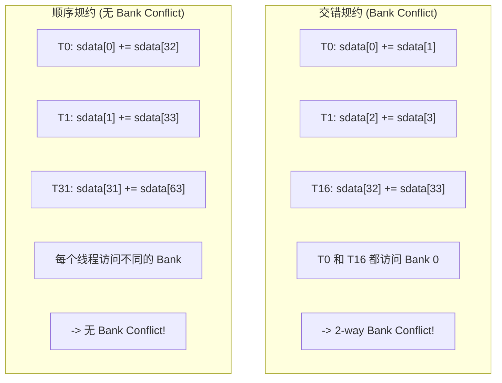

### 5.3 Bank Conflict Free 的树状规约

```cpp
// Bank Conflict Free 的树状规约
__global__ void tree_reduce_bank_free(float* data, float* result, int N) {
    __shared__ float sdata[256];

    int tid = threadIdx.x;
    int idx = blockIdx.x * blockDim.x + threadIdx.x;

    sdata[tid] = (idx < N) ? data[idx] : 0.0f;
    __syncthreads();

    // 顺序规约：从 blockDim.x/2 开始向前取值
    // 避免了 Bank Conflict
    for (int s = blockDim.x / 2; s > 0; s >>= 1) {
        if (tid < s) {
            sdata[tid] += sdata[tid + s];  // tid 和 tid+s 访问不同的 Bank
        }
        __syncthreads();
    }

    if (tid == 0) {
        atomicAdd(result, sdata[0]);
    }
}
```

---

## 6. Two-Pass 规约

### 6.1 两阶段规约思想

当数据量非常大时，可以使用两个 Kernel 来完成规约，避免原子操作：

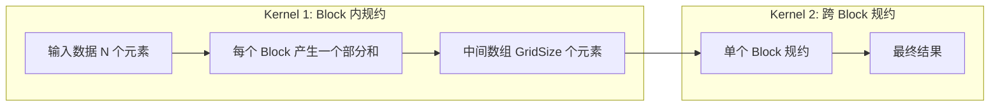

### 6.2 Two-Pass 规约实现

```cpp
// Kernel 1: 每个 Block 产生一个部分和
__global__ void reduce_block(float* data, float* partial_sums, int N) {
    __shared__ float sdata[256];

    int tid = threadIdx.x;
    int idx = blockIdx.x * blockDim.x + threadIdx.x;

    // Grid-stride 循环累加
    float sum = 0.0f;
    for (int i = idx; i < N; i += blockDim.x * gridDim.x) {
        sum += data[i];
    }

    sdata[tid] = sum;
    __syncthreads();

    // Block 内规约
    for (int s = blockDim.x / 2; s > 0; s >>= 1) {
        if (tid < s) {
            sdata[tid] += sdata[tid + s];
        }
        __syncthreads();
    }

    // 写入部分和（无原子操作）
    if (tid == 0) {
        partial_sums[blockIdx.x] = sdata[0];
    }
}

// Kernel 2: 对部分和进行规约
__global__ void reduce_final(float* partial_sums, float* result, int N) {
    __shared__ float sdata[256];

    int tid = threadIdx.x;

    // Block-stride 循环累加部分和
    float sum = 0.0f;
    for (int i = tid; i < N; i += blockDim.x) {
        sum += partial_sums[i];
    }

    sdata[tid] = sum;
    __syncthreads();

    // Block 内规约
    for (int s = blockDim.x / 2; s > 0; s >>= 1) {
        if (tid < s) {
            sdata[tid] += sdata[tid + s];
        }
        __syncthreads();
    }

    if (tid == 0) {
        *result = sdata[0];  // 直接赋值，无原子操作
    }
}
```

### 6.3 Two-Pass 优缺点

| 特性 | Two-Pass | 单 Kernel + 原子操作 |
|------|----------|---------------------|
| 原子操作次数 | 0 | GridSize |
| Kernel 发射开销 | 2次 | 1次 |
| 额外内存需求 | 需要 | 不需要 |
| 适用场景 | 大数据量 | 小数据量 |

---

## 7. Cooperative Groups 规约

### 7.1 Cooperative Groups 简介

Cooperative Groups 是 CUDA 9.0 引入的特性，允许线程块之间进行同步和协作：

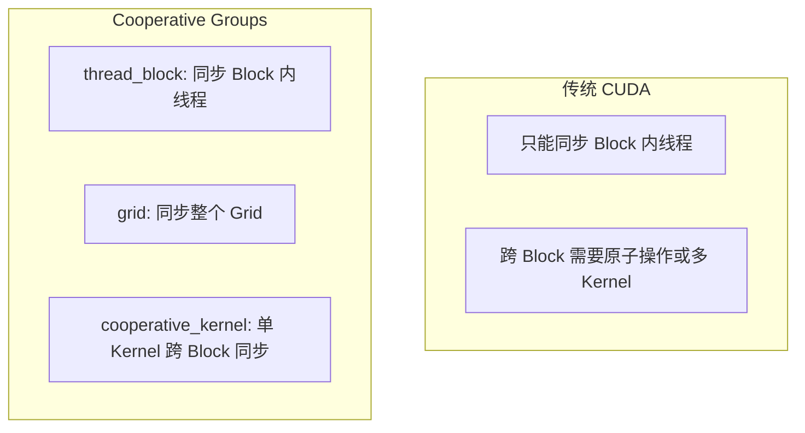

### 7.2 Grid 同步规约

```cpp
#include <cooperative_groups.h>
namespace cg = cooperative_groups;

__global__ void reduce_grid_sync(float* data, float* result, int N) {
    // 获取 grid 级别的线程组
    cg::grid_group grid = cg::this_grid();
    __shared__ float sdata[256];

    int tid = threadIdx.x;

    // Grid-stride 循环累加
    float sum = 0.0f;
    for (int i = grid.thread_rank(); i < N; i += grid.size()) {
        sum += data[i];
    }

    sdata[tid] = sum;
    cg::sync(grid);  // Grid 级同步

    // Block 内规约
    for (int s = blockDim.x / 2; s > 0; s >>= 1) {
        if (tid < s) {
            sdata[tid] += sdata[tid + s];
        }
        cg::sync(grid);
    }

    // 只有 Block 0 的线程 0 写入结果
    if (grid.thread_rank() == 0) {
        *result = sdata[0];
    }
}
```

### 7.3 Cooperative Kernel 启动

```cpp
// 需要使用 cudaLaunchCooperativeKernel 启动
void launch_cooperative_reduce(float* d_data, float* d_result, int N) {
    int blockSize = 256;
    int numBlocks;

    // 获取每个 SM 的最大 Block 数
    cudaOccupancyMaxActiveBlocksPerMultiprocessor(
        &numBlocks, reduce_grid_sync, blockSize, 0);

    // 获取设备属性
    cudaDeviceProp prop;
    cudaGetDeviceProperties(&prop, 0);

    // 计算总 Block 数
    int numSM = prop.multiProcessorCount;
    int totalBlocks = numSM * numBlocks;

    // 使用协作启动
    void* args[] = {&d_data, &d_result, &N};
    cudaLaunchCooperativeKernel(
        (void*)reduce_grid_sync,
        totalBlocks, blockSize,
        args);
}
```

### 7.4 Cooperative Groups 规约优势

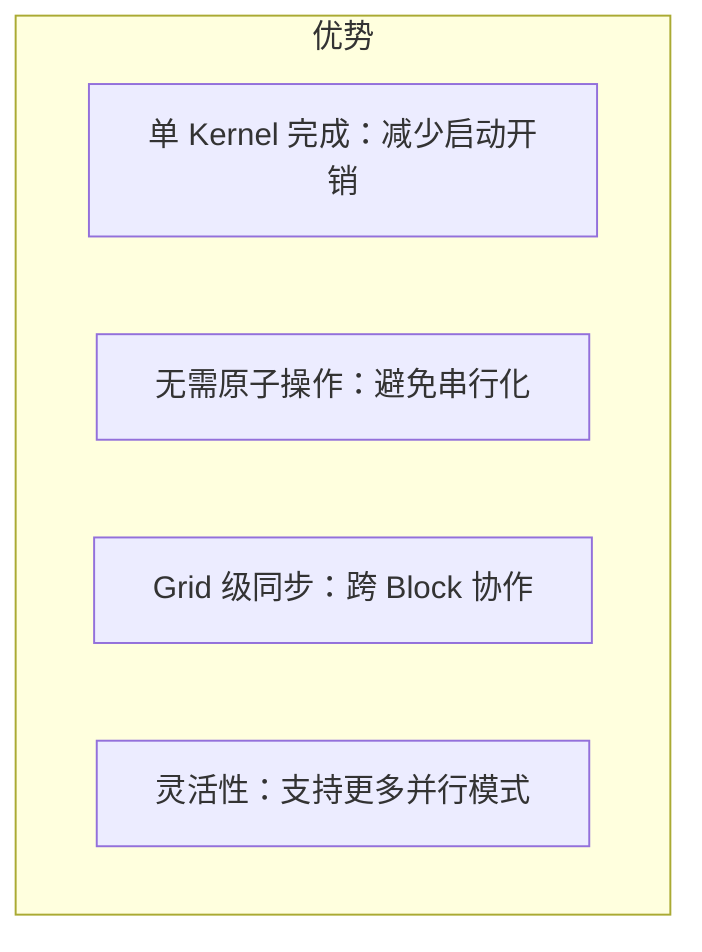

---

## 8. 性能对比分析

### 8.1 各方法性能对比

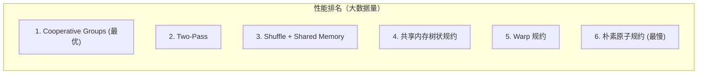

### 8.2 性能对比表

| 方法 | 原子操作 | 共享内存 | 同步次数 | 适用场景 |
|------|----------|----------|----------|----------|
| 朴素原子规约 | N | 无 | 0 | 不推荐 |
| Warp 规约 | N/32 | 无 | 0 | 小数据量 |
| 共享内存树状规约 | GridSize | 需要 | log(blockDim) | 中等数据量 |
| Shuffle + SM | GridSize | 少量 | 1 | 中等数据量 |
| Two-Pass | 0 | 需要 | 2x log | 大数据量 |
| Cooperative Groups | 0 | 需要 | log | 大数据量 |

### 8.3 优化建议

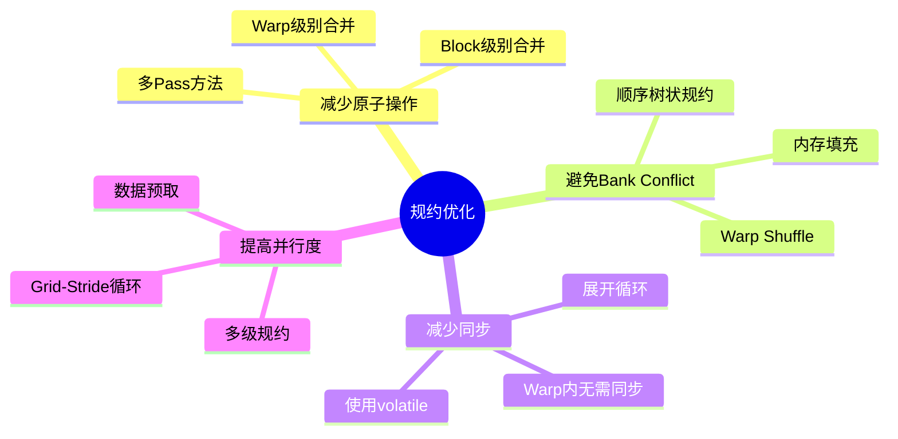

---

## 9. 实战案例：多级规约

### 9.1 完整的多级规约实现

```cpp
// 完整的多级规约：Warp -> Block -> Grid
__device__ float warp_reduce(float val) {
    val += __shfl_down_sync(0xffffffff, val, 16);
    val += __shfl_down_sync(0xffffffff, val, 8);
    val += __shfl_down_sync(0xffffffff, val, 4);
    val += __shfl_down_sync(0xffffffff, val, 2);
    val += __shfl_down_sync(0xffffffff, val, 1);
    return val;
}

__global__ void multi_level_reduce(float* data, float* result, int N) {
    __shared__ float warp_sums[32];  // 每个 Warp 一个部分和

    int tid = threadIdx.x;
    int lane = tid & 31;
    int warp_id = tid >> 5;
    int idx = blockIdx.x * blockDim.x + tid;

    // Level 1: Grid-stride 循环累加
    float sum = 0.0f;
    for (int i = idx; i < N; i += blockDim.x * gridDim.x) {
        sum += data[i];
    }

    // Level 2: Warp 内规约（无同步）
    sum = warp_reduce(sum);

    // Level 3: Warp 间规约（使用共享内存）
    if (lane == 0) {
        warp_sums[warp_id] = sum;
    }
    __syncthreads();

    // Level 4: 第一个 Warp 对 Warp 部分和规约
    if (warp_id == 0) {
        sum = (lane < blockDim.x / 32) ? warp_sums[lane] : 0.0f;
        sum = warp_reduce(sum);

        if (lane == 0) {
            atomicAdd(result, sum);
        }
    }
}
```

---

## 10. 本章小结

### 10.1 关键概念

| 概念 | 描述 |
|------|------|
| 规约 | 将多个数据合并为单个结果的操作 |
| 树状规约 | 采用分治策略的并行规约方法 |
| Warp Shuffle | Warp 内线程直接交换寄存器数据 |
| Bank Conflict | 多线程访问同一 Bank 的冲突 |
| Two-Pass | 使用两个 Kernel 完成规约 |
| Cooperative Groups | 支持跨 Block 同步的 CUDA 特性 |

### 10.2 优化要点

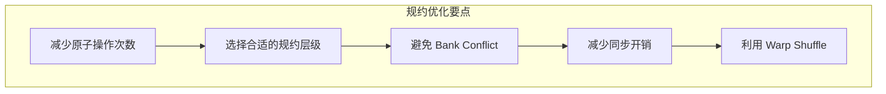

### 10.3 方法选择指南

| 数据规模 | 推荐方法 |
|----------|----------|
| N < 32 | 单 Warp + Shuffle |
| N < blockDim | 单 Block 树状规约 |
| N < 1M | Shuffle + Shared Memory |
| N > 1M | Two-Pass 或 Cooperative Groups |

### 10.4 思考题

1. 为什么 Warp Shuffle 比共享内存树状规约更高效？
2. 在什么情况下 Two-Pass 规约比单 Kernel 规约更有优势？
3. 如何修改规约算法来计算数组的最小值/最大值？
4. Cooperative Groups 有哪些使用限制？

---

## 下一章

[第十五章：Bank Conflict 优化](./15_Bank_Conflict_优化.md) - 深入理解共享内存 Bank Conflict 及其解决方法

---

*参考资料：*
- *[CUDA C++ Programming Guide - B.14. Warp Shuffle Functions](https://docs.nvidia.com/cuda/cuda-c-programming-guide/index.html#warp-shuffle-functions)*
- *[CUDA C++ Programming Guide - B.15. Warp Matrix Functions](https://docs.nvidia.com/cuda/cuda-c-programming-guide/index.html#warp-matrix-functions)*
- *[NVIDIA Developer Blog - Optimizing Parallel Reduction in CUDA](https://developer.download.nvidia.com/assets/cuda/files/reduction.pdf)*