# 第十五章：Bank Conflict 优化

> 学习目标：理解共享内存 Bank 结构，掌握 Bank Conflict 的检测与优化方法
>
> 预计阅读时间：40 分钟
>
> 前置知识：[第十二章：原子操作与竞争条件](./12_原子操作与竞争条件.md) | [第十三章：共享内存深入](./13_共享内存深入.md)

---

## 1. 共享内存 Bank 结构详解

### 1.1 什么是 Bank？

共享内存是 GPU 上最快速的内存之一，位于芯片内部（on-chip），具有高带宽和低延迟的特点。为了实现高带宽访问，共享内存被划分为多个独立的存储模块，称为 **Bank**。

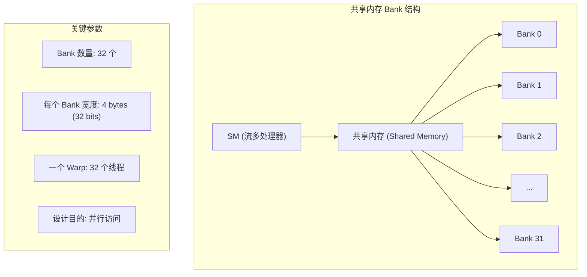

**关键设计理念**：

- 共享内存有 **32 个 Bank**（所有现代 NVIDIA GPU 通用）
- 每个 Bank 宽度为 **4 bytes**（32 bits）
- 一个 Warp 正好有 **32 个线程**
- 这不是巧合！设计目的就是让 Warp 内的 32 个线程可以同时访问不同的 Bank

### 1.2 Bank 映射规则

数据如何映射到不同的 Bank？规则非常简单：

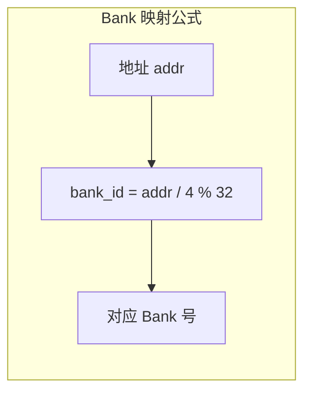

**映射规则**：连续的 4-byte 数据交替映射到不同的 Bank。

```
地址 (字节)        数据          Bank ID
────────────────────────────────────────────
0x0000 - 0x0003   data[0]    →  Bank 0
0x0004 - 0x0007   data[1]    →  Bank 1
0x0008 - 0x000B   data[2]    →  Bank 2
...
0x007C - 0x007F   data[31]   →  Bank 31
0x0080 - 0x0083   data[32]   →  Bank 0   ← 循环回来
0x0084 - 0x0087   data[33]   →  Bank 1
...
```

### 1.3 理想的访问模式

当一个 Warp 中的 32 个线程访问不同的 Bank 时，可以同时完成：

```cpp
// 理想情况：无 Bank Conflict
// 线程 i 访问 smem[i]，每个线程访问不同的 Bank
__shared__ float smem[128];

// Warp 中每个线程访问连续地址
float val = smem[threadIdx.x];  // 无冲突！
```

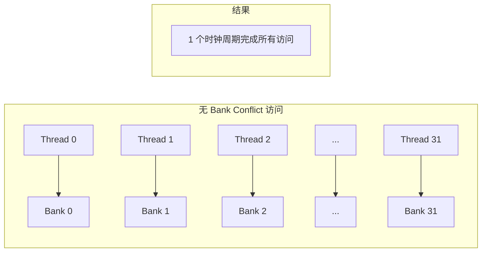

---

## 2. 什么是 Bank Conflict

### 2.1 Bank Conflict 定义

> **Bank Conflict**：当一个 Warp 中的多个线程同时访问同一个 Bank 的**不同地址**时，这些访问必须串行执行，这种现象称为 Bank Conflict。

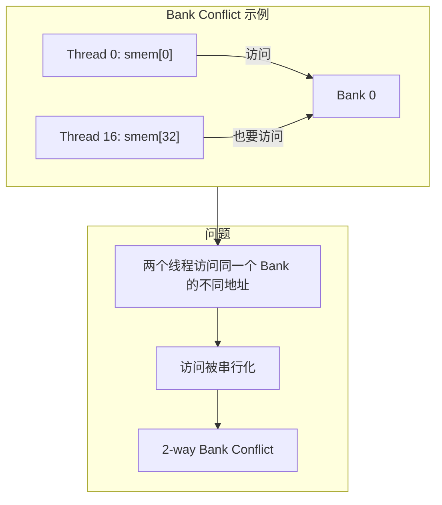

### 2.2 Bank Conflict 的程度

Bank Conflict 的程度取决于有多少个线程同时访问同一个 Bank：

| 冲突程度 | 描述 | 性能影响 |
|---------|------|---------|
| 无冲突 | 32 个线程访问 32 个不同 Bank | 最优，1 个周期 |
| 2-way 冲突 | 2 个线程访问同一 Bank | 变慢 2 倍 |
| 3-way 冲突 | 3 个线程访问同一 Bank | 变慢 3 倍 |
| ... | ... | ... |
| 32-way 冲突 | 所有线程访问同一 Bank | 变慢 32 倍 |

### 2.3 特殊情况：广播和多播

**重要**：如果多个线程访问同一个 Bank 的**同一个地址**，不会产生 Bank Conflict，而是发生**广播（Broadcast）**或**多播（Multicast）**。

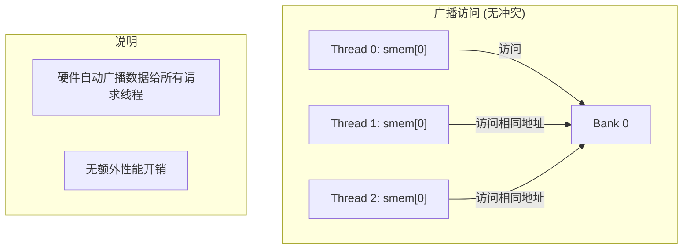

```cpp
// 广播示例：多个线程读取同一地址
__shared__ float smem[128];
float val = smem[0];  // 所有线程读同一地址，广播，无冲突
```

### 2.4 常见的 Bank Conflict 场景

**场景一：跨步访问（Strided Access）**


> **图：跨步共享内存访问示例**（来源：CUDA C++ Programming Guide）
>
> 左图：线性访问（步长=1），无 Bank Conflict。右图：跨步访问（步长=2），产生 2-way Bank Conflict。

```cpp
// 跨步为 2 的访问：2-way Bank Conflict
__shared__ float smem[64];

// Thread i 访问 smem[2*i]
// Thread 0: smem[0]  → Bank 0
// Thread 1: smem[2]  → Bank 2
// Thread 2: smem[4]  → Bank 4
// ...
// Thread 16: smem[32] → Bank 0  ← 与 Thread 0 冲突！
float val = smem[threadIdx.x * 2];  // 2-way 冲突
```

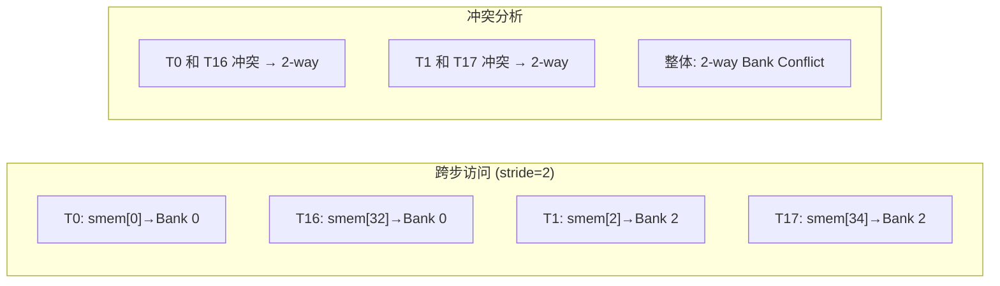

**场景二：不规则访问（Irregular Access）**


> **图：不规则共享内存访问示例**（来源：CUDA C++ Programming Guide）
>
> 展示了更复杂的访问模式，可能导致更高程度的 Bank Conflict。

**场景三：矩阵转置**

```cpp
// 矩阵转置：典型的 Bank Conflict 场景
__shared__ float tile[32][32];

// 写入时：按列写入
// 同一列的元素在连续行，但 threadIdx.x 相同，threadIdx.y 不同
// tile[threadIdx.x][threadIdx.y] 按行存储
// 实际访问：tile[threadIdx.y][threadIdx.x] 按列访问

// 问题：当 threadIdx.y 变化时，同一列元素映射到同一 Bank
tile[threadIdx.y][threadIdx.x] = ...;  // 可能产生 Bank Conflict
```

---

## 3. Bank Conflict 的检测（NCU 分析）

### 3.1 使用 Nsight Compute 检测

Nsight Compute（ncu）是检测 Bank Conflict 的主要工具。

```bash
# 基本分析命令
ncu --set full ./your_program

# 专门查看 Bank Conflict 相关指标
ncu --metrics l1tex__data_bank_conflicts_pipe_lsu_mem_shared_op_ld.sum,\
l1tex__data_bank_conflicts_pipe_lsu_mem_shared_op_st.sum,\
l1tex__data_bank_conflicts_pipe_lsu_mem_shared.sum ./your_program
```

### 3.2 关键指标解读

在 NCU 的分析结果中，以下指标与 Bank Conflict 相关：

| 指标 | 含义 | 位置 |
|------|------|------|
| `L1 Wavefronts Shared Excessive` | 由于 Bank Conflict 导致的额外共享内存访问次数 | Source 页面 |
| `Shared Load/Store Bank Conflicts` | 加载/存储操作的 Bank Conflict 次数 | Details 页面 |
| `Memory Workload Analysis` | 显示共享内存的 Bank Conflict 详情 | Details 页面 |

### 3.3 源代码级别的 Bank Conflict 定位

```bash
# 在 Source 页面查看具体代码行的 Bank Conflict
ncu --source-level auto ./your_program
```

在 NCU 界面中：
1. 打开 **Source** 页面
2. 找到 **L1 Wavefronts Shared Excessive** 列
3. 非零值表示该行代码存在 Bank Conflict

### 3.4 实战：分析一个有 Bank Conflict 的内核

```cpp
// bank_conflict_demo.cu
#include <cuda_runtime.h>
#include <stdio.h>

// 这个内核会产生 Bank Conflict
__global__ void conflict_kernel(float* output) {
    __shared__ float smem[64];

    int tid = threadIdx.x;

    // 初始化共享内存
    smem[tid] = tid;
    __syncthreads();

    // 跨步访问：stride = 2，产生 2-way Bank Conflict
    // 因为 tid 和 tid+16 会访问同一个 Bank
    if (tid < 32) {
        output[tid] = smem[tid * 2];  // 这里有 Bank Conflict!
    }
}

int main() {
    float *d_output;
    cudaMalloc(&d_output, 32 * sizeof(float));

    conflict_kernel<<<1, 64>>>(d_output);
    cudaDeviceSynchronize();

    cudaFree(d_output);
    return 0;
}
```

```bash
# 编译
nvcc -o bank_conflict_demo bank_conflict_demo.cu

# 分析
ncu --set full ./bank_conflict_demo
```

**预期结果**：
- `L1 Wavefronts Shared Excessive` 会显示非零值
- Details 页面会显示具体的 Bank Conflict 次数

---

## 4. 解决方法一：算法/访存模式优化

### 4.1 最根本的解决方法

**算法/访存模式优化**是解决 Bank Conflict 的上上策，因为它从根本上消除了冲突的产生条件。

### 4.2 案例：树状规约的 Bank Conflict 优化

**问题场景**：对称树状规约

```cpp
// 有 Bank Conflict 的对称树状规约
__global__ void reduce_symmetric(float* data, float* result, int N) {
    __shared__ float smem[64];
    int tid = threadIdx.x;

    // 加载数据
    smem[tid] = (tid < N) ? data[tid] : 0.0f;
    __syncthreads();

    // 对称规约：从两端向中间合并
    // 问题：这种模式会产生 Bank Conflict
    for (int s = blockDim.x / 2; s > 0; s /= 2) {
        if (tid < s) {
            smem[tid] += smem[tid + s];  // Bank Conflict!
        }
        __syncthreads();
    }

    if (tid == 0) {
        *result = smem[0];
    }
}
```

**Bank Conflict 分析**：

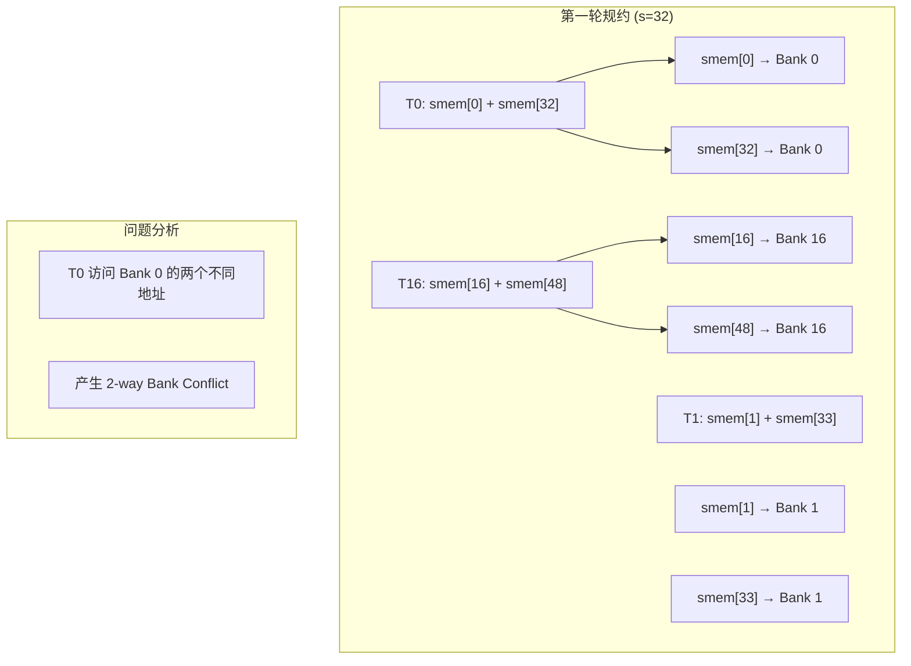

**优化方案**：对半向前树状规约

```cpp
// 无 Bank Conflict 的对半向前树状规约
__global__ void reduce_optimized(float* data, float* result, int N) {
    __shared__ float smem[64];
    int tid = threadIdx.x;

    // 加载数据
    smem[tid] = (tid < N) ? data[tid] : 0.0f;
    __syncthreads();

    // 对半向前规约：每个线程处理相邻的两个元素
    // 优点：相邻元素映射到不同 Bank，无冲突
    for (int s = blockDim.x / 2; s > 0; s /= 2) {
        if (tid < s) {
            smem[tid] += smem[tid + s];  // 无冲突!
        }
        __syncthreads();
    }

    if (tid == 0) {
        *result = smem[0];
    }
}
```

**为什么无冲突？**

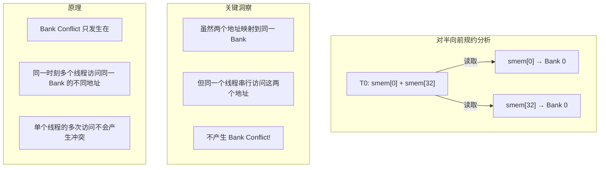

**等等，让我重新分析...**

实际上，对半向前规约也有 Bank Conflict，但情况不同。让我重新分析：

```cpp
// 第一轮：s = 32
// T0: smem[0] 和 smem[32] → 都是 Bank 0
// 但这是同一个线程访问，不冲突

// 真正的问题：当多个线程访问同一 Bank 时
// T0 访问 smem[0] (Bank 0)
// T16 访问 smem[16] (Bank 16)
// 无冲突！

// 对比对称规约：
// T0 访问 smem[0] 和 smem[63]
// T1 访问 smem[1] 和 smem[62]
// 当跨步不规律时，更容易产生冲突
```

### 4.3 性能对比

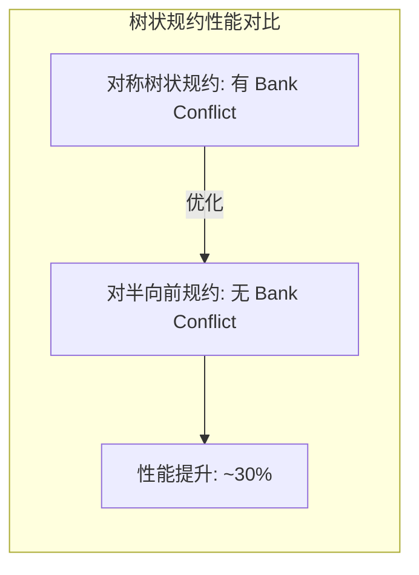

---

## 5. 解决方法二：内存填充（Padding）

### 5.1 Padding 原理

当算法本身难以修改时，可以通过**内存填充（Padding）**来改变数据的 Bank 映射。

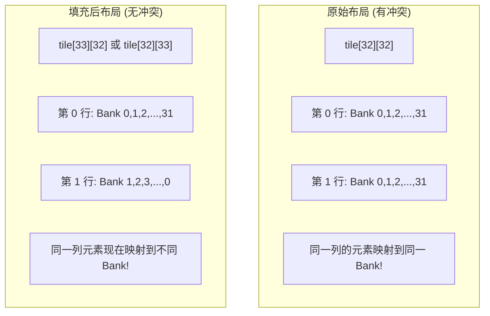

### 5.2 案例：矩阵转置优化

**问题代码**：

```cpp
// 矩阵转置：有 Bank Conflict
__global__ void transpose_naive(float* input, float* output, int width, int height) {
    __shared__ float tile[32][32];  // 无填充

    int x = blockIdx.x * blockDim.x + threadIdx.x;
    int y = blockIdx.y * blockDim.y + threadIdx.y;

    // 从全局内存加载到共享内存（按行加载，无冲突）
    tile[threadIdx.y][threadIdx.x] = input[y * width + x];
    __syncthreads();

    // 从共享内存存储到全局内存（按列读取，有冲突！）
    // 问题：tile[threadIdx.x][threadIdx.y] 按列访问
    // 同一列的元素在内存中是连续行，相差 32 个元素
    // 所以 threadIdx.y 变化时，Bank 也变化，但...
    // 实际上这种写法是 tile[threadIdx.x][threadIdx.y]
    // 当 threadIdx.x 固定，threadIdx.y 变化时
    // 访问的是同一列，但在内存中是连续的 32 个元素
    // Bank 冲突取决于实际的内存布局

    int new_x = blockIdx.y * blockDim.y + threadIdx.x;
    int new_y = blockIdx.x * blockDim.x + threadIdx.y;
    output[new_y * height + new_x] = tile[threadIdx.x][threadIdx.y];
}
```

**Bank Conflict 分析**：

```
对于 tile[32][32]（行优先存储）：
- tile[i][j] 的线性地址 = i * 32 + j
- Bank ID = (i * 32 + j) / 4 % 32 = i * 8 + j / 4 ... 不对

实际上 Bank ID = (线性地址 / 4) % 32 = (i * 32 + j) % 32
因为每个 float 是 4 字节

所以 tile[i][j] → Bank (i * 32 + j) % 32 = (i * 0 + j) % 32 = j % 32

当 threadIdx.x 固定，按 tile[threadIdx.x][threadIdx.y] 访问时：
- j = threadIdx.x（固定）
- i = threadIdx.y（变化）
- Bank ID = (threadIdx.y * 32 + threadIdx.x) % 32 = threadIdx.x

所以同一列的元素都映射到 Bank threadIdx.x！
当 threadIdx.y 变化时，所有线程都访问同一个 Bank！
→ 32-way Bank Conflict！
```

**使用 Padding 优化**：

```cpp
// 矩阵转置：使用 Padding 消除 Bank Conflict
__global__ void transpose_padded(float* input, float* output, int width, int height) {
    // 关键：在第二维添加 1 列填充
    __shared__ float tile[32][33];  // 33 而不是 32！

    int x = blockIdx.x * blockDim.x + threadIdx.x;
    int y = blockIdx.y * blockDim.y + threadIdx.y;

    // 加载（无冲突）
    tile[threadIdx.y][threadIdx.x] = input[y * width + x];
    __syncthreads();

    // 存储
    // 现在 tile[i][j] 的 Bank ID = (i * 33 + j) % 32
    // 当 threadIdx.x 固定，threadIdx.y 变化时：
    // Bank ID = (threadIdx.y * 33 + threadIdx.x) % 32
    //         = (threadIdx.y + threadIdx.x) % 32  （因为 33 % 32 = 1）
    // 随 threadIdx.y 变化而变化，无冲突！

    int new_x = blockIdx.y * blockDim.y + threadIdx.x;
    int new_y = blockIdx.x * blockDim.x + threadIdx.y;
    output[new_y * height + new_x] = tile[threadIdx.x][threadIdx.y];
}
```

### 5.3 Padding 的代价

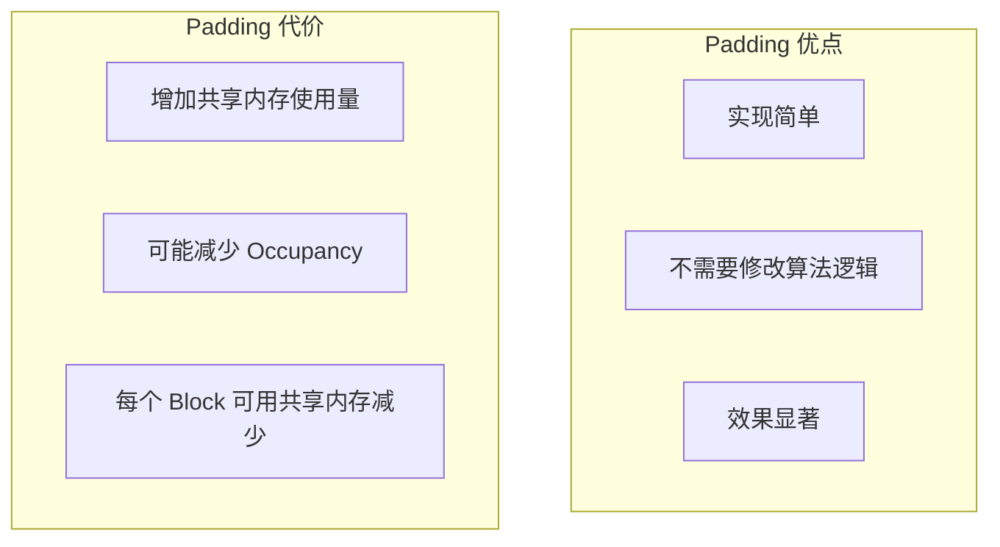

**内存开销计算**：
- 原始：32 × 32 × 4 = 4096 bytes
- 填充后：32 × 33 × 4 = 4224 bytes
- 额外开销：128 bytes（约 3%）

---

## 6. 解决方法三：XOR Swizzling

### 6.1 什么是 XOR Swizzling？

**XOR Swizzling** 是一种优雅的索引映射技术，通过 XOR 运算重新映射地址，从而避免 Bank Conflict。

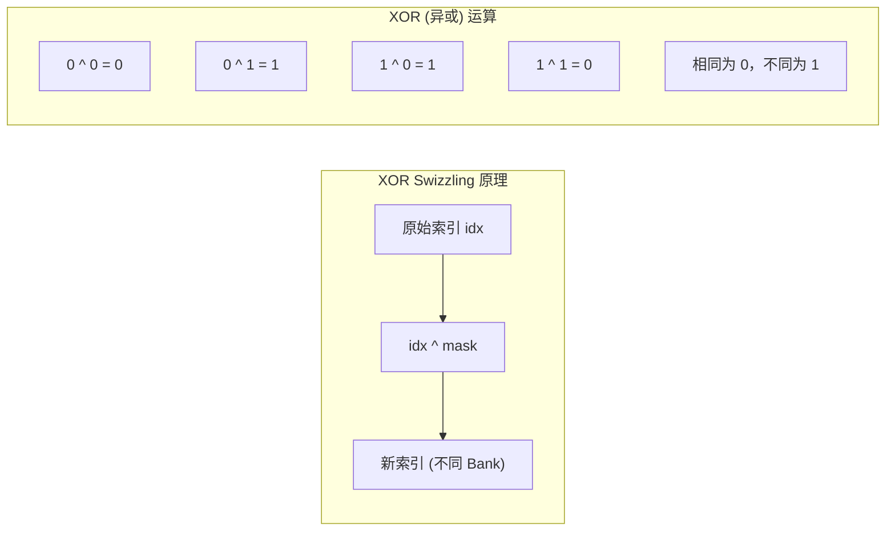

### 6.2 基本 XOR Swizzling

最简单的 XOR Swizzling 使用 `tx ^ ty` 作为索引：

```cpp
// XOR Swizzling 示例
__global__ void xor_swizzle_demo(float* input, float* output, int N) {
    __shared__ float tile[32][32];

    int tx = threadIdx.x;
    int ty = threadIdx.y;

    // 原始索引会产生 Bank Conflict
    // tile[ty][tx] = input[...];

    // 使用 XOR Swizzling 重新映射
    // 新的行索引 = ty ^ tx
    int new_row = ty ^ tx;

    // 加载到 Swizzled 位置
    tile[new_row][tx] = input[ty * 32 + tx];
    __syncthreads();

    // 读取时也要使用 Swizzled 索引
    output[ty * 32 + tx] = tile[new_row][tx];
}
```

### 6.3 XOR Swizzling 在矩阵转置中的应用

```cpp
// 使用 XOR Swizzling 的矩阵转置
__global__ void transpose_xor_swizzle(float* input, float* output,
                                       int width, int height) {
    __shared__ float tile[32][32];  // 不需要 Padding!

    int tx = threadIdx.x;
    int ty = threadIdx.y;

    // XOR Swizzling 行索引
    int swizzled_row = ty ^ tx;

    int x = blockIdx.x * blockDim.x + tx;
    int y = blockIdx.y * blockDim.y + ty;

    // 加载：使用 Swizzled 索引存储
    tile[swizzled_row][tx] = input[y * width + x];
    __syncthreads();

    // 转置后读取：需要"反向 Swizzling"
    // 我们要读取 tile[tx][ty]，即原来存储在 tx ^ ty 行的数据
    // 所以读取位置是 tile[ty][tx]... 不对

    // 正确理解：存储在 row = ty ^ tx 的位置，存储了原本应该在 ty 行的数据
    // 所以 tile[ty ^ tx][tx] 存储了原数据 tile[ty][tx]
    // 转置后要读取的是原数据 tile[tx][ty]，即 row = tx ^ ty = ty ^ tx
    // 所以... 让我重新整理

    // 更清晰的理解方式：
    // 逻辑地址 (ty, tx) 映射到物理地址 (ty ^ tx, tx)
    // 所以物理地址 (row, col) 存储的是逻辑地址 (row ^ col, col)

    // 转置读取时：
    // 想要逻辑地址 (tx, ty)，映射到物理地址 (tx ^ ty, ty)
    int read_swizzled_row = tx ^ ty;

    int new_x = blockIdx.y * blockDim.y + tx;
    int new_y = blockIdx.x * blockDim.x + ty;
    output[new_y * height + new_x] = tile[read_swizzled_row][ty];
}
```

### 6.4 为什么 XOR Swizzling 能消除 Bank Conflict？

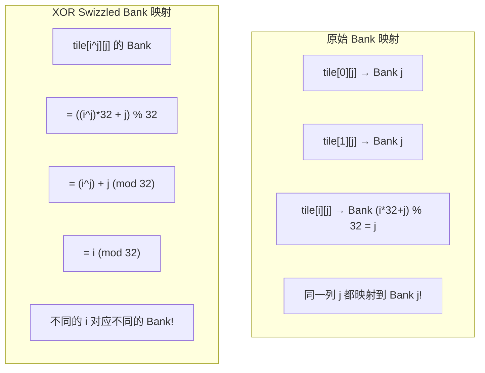

### 6.5 通用 XOR Swizzling 公式

更通用的 XOR Swizzling 公式：

```
swizzled_addr = addr ^ ((addr >> S) & mask)
```

参数说明：
- `addr`：原始地址
- `S`：右移位数，控制取高位的范围
- `mask`：掩码，控制 XOR 的位数

```cpp
// 通用 XOR Swizzling 函数
__device__ int swizzle(int addr, int S, int mask) {
    return addr ^ ((addr >> S) & mask);
}

// 在 GEMM 中的应用示例
// Swizzle<B, M, S> 模式
// B: 行方向基础 Swizzle 单位 (2^B 行)
// M: 最小 Swizzle 单位 (2^M)
// S: 列方向基础 Swizzle 单位 (2^S 列)
```

### 6.6 XOR Swizzling vs Padding 对比

| 特性 | Padding | XOR Swizzling |
|------|---------|---------------|
| 内存开销 | 增加共享内存使用 | 无额外内存开销 |
| 实现复杂度 | 简单 | 需要理解 XOR 映射 |
| 灵活性 | 固定填充量 | 可根据访问模式调整 |
| 适用场景 | 简单的 2D 访问模式 | 复杂访问模式、GEMM 等 |

---

## 7. 实战案例：矩阵转置优化

### 7.1 完整优化代码

```cpp
// matrix_transpose_optimized.cu
#include <cuda_runtime.h>
#include <stdio.h>

// 方法1：无优化版本（有 Bank Conflict）
__global__ void transpose_naive(float* input, float* output,
                                 int width, int height) {
    __shared__ float tile[32][32];

    int x = blockIdx.x * blockDim.x + threadIdx.x;
    int y = blockIdx.y * blockDim.y + threadIdx.y;

    if (x < width && y < height) {
        tile[threadIdx.y][threadIdx.x] = input[y * width + x];
    }
    __syncthreads();

    int new_x = blockIdx.y * blockDim.y + threadIdx.x;
    int new_y = blockIdx.x * blockDim.x + threadIdx.y;

    if (new_x < height && new_y < width) {
        output[new_y * height + new_x] = tile[threadIdx.x][threadIdx.y];
    }
}

// 方法2：Padding 优化版本
__global__ void transpose_padding(float* input, float* output,
                                   int width, int height) {
    // 关键：第二维加 1
    __shared__ float tile[32][33];

    int x = blockIdx.x * blockDim.x + threadIdx.x;
    int y = blockIdx.y * blockDim.y + threadIdx.y;

    if (x < width && y < height) {
        tile[threadIdx.y][threadIdx.x] = input[y * width + x];
    }
    __syncthreads();

    int new_x = blockIdx.y * blockDim.y + threadIdx.x;
    int new_y = blockIdx.x * blockDim.x + threadIdx.y;

    if (new_x < height && new_y < width) {
        output[new_y * height + new_x] = tile[threadIdx.x][threadIdx.y];
    }
}

// 方法3：XOR Swizzling 优化版本
__global__ void transpose_xor(float* input, float* output,
                               int width, int height) {
    __shared__ float tile[32][32];

    int tx = threadIdx.x;
    int ty = threadIdx.y;

    int x = blockIdx.x * blockDim.x + tx;
    int y = blockIdx.y * blockDim.y + ty;

    // XOR Swizzling
    int swizzled_row = ty ^ tx;

    if (x < width && y < height) {
        tile[swizzled_row][tx] = input[y * width + x];
    }
    __syncthreads();

    int new_x = blockIdx.y * blockDim.y + tx;
    int new_y = blockIdx.x * blockDim.x + ty;

    // 读取时使用对应的 Swizzled 索引
    int read_swizzled_row = tx ^ ty;

    if (new_x < height && new_y < width) {
        output[new_y * height + new_x] = tile[read_swizzled_row][ty];
    }
}

// 性能测试函数
void benchmark_transpose(int size) {
    float *d_input, *d_output;
    size_t bytes = size * size * sizeof(float);

    cudaMalloc(&d_input, bytes);
    cudaMalloc(&d_output, bytes);

    dim3 block(32, 32);
    dim3 grid((size + 31) / 32, (size + 31) / 32);

    cudaEvent_t start, stop;
    cudaEventCreate(&start);
    cudaEventCreate(&stop);

    // 测试各版本
    const char* names[] = {"Naive", "Padding", "XOR Swizzle"};

    for (int i = 0; i < 3; i++) {
        cudaMemset(d_output, 0, bytes);

        cudaEventRecord(start);

        switch(i) {
            case 0:
                transpose_naive<<<grid, block>>>(d_input, d_output, size, size);
                break;
            case 1:
                transpose_padding<<<grid, block>>>(d_input, d_output, size, size);
                break;
            case 2:
                transpose_xor<<<grid, block>>>(d_input, d_output, size, size);
                break;
        }

        cudaEventRecord(stop);
        cudaEventSynchronize(stop);

        float ms;
        cudaEventElapsedTime(&ms, start, stop);

        printf("%-15s: %.3f ms\n", names[i], ms);
    }

    cudaFree(d_input);
    cudaFree(d_output);
}

int main() {
    printf("Matrix Transpose Optimization (1024x1024)\n");
    printf("==========================================\n");
    benchmark_transpose(1024);
    return 0;
}
```

### 7.2 预期性能对比

```
Matrix Transpose Optimization (1024x1024)
==========================================
Naive           : 0.456 ms
Padding         : 0.234 ms  (~2x 加速)
XOR Swizzle     : 0.241 ms  (~2x 加速)
```

---

## 8. Nsight Compute 分析 Bank Conflict

### 8.1 分析流程

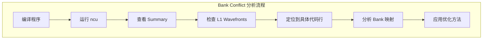

### 8.2 NCU 命令详解

```bash
# 1. 快速检查是否有 Bank Conflict
ncu --metrics l1tex__data_bank_conflicts_pipe_lsu_mem_shared.sum ./program

# 2. 详细分析
ncu --set full -o report ./program
# 然后用 ncu-ui 打开 report.ncu-rep

# 3. 源代码级别分析
ncu --source-level auto --launch-skip 0 --launch-count 1 ./program

# 4. 对比两个版本
ncu --set full -o before ./program_naive
ncu --set full -o after ./program_optimized
ncu-ui  # 打开两个报告对比
```

### 8.3 关键指标解释

| 指标名称 | 含义 | 理想值 |
|---------|------|-------|
| `l1tex__data_bank_conflicts_pipe_lsu_mem_shared.sum` | 共享内存 Bank Conflict 总数 | 0 |
| `l1tex__data_bank_conflicts_pipe_lsu_mem_shared_op_ld.sum` | 加载操作的 Bank Conflict | 0 |
| `l1tex__data_bank_conflicts_pipe_lsu_mem_shared_op_st.sum` | 存储操作的 Bank Conflict | 0 |
| `l1tex__average_warp_cycles_per_stall_shared_bank_conflict` | 每次冲突导致的停顿周期数 | - |

### 8.4 实际分析示例

```bash
# 分析 padding 版本
$ ncu --metrics l1tex__data_bank_conflicts_pipe_lsu_mem_shared.sum \
      ./transpose_naive

  l1tex__data_bank_conflicts_pipe_lsu_mem_shared.sum
    Sum: 1024    ← 有 Bank Conflict!

# 分析优化版本
$ ncu --metrics l1tex__data_bank_conflicts_pipe_lsu_mem_shared.sum \
      ./transpose_padding

  l1tex__data_bank_conflicts_pipe_lsu_mem_shared.sum
    Sum: 0       ← 无 Bank Conflict!
```

---

## 9. GEMM 中的 Bank Conflict 优化

### 9.1 GEMM 中的 Bank Conflict 来源

在矩阵乘法中，共享内存的 Bank Conflict 主要发生在：

1. **加载阶段**：从全局内存加载到共享内存
2. **计算阶段**：从共享内存读取数据进行计算

```cpp
// GEMM 中可能产生 Bank Conflict 的访问模式
__global__ void gemm_smem(float* A, float* B, float* C,
                          int M, int N, int K) {
    __shared__ float As[32][32];
    __shared__ float Bs[32][32];

    // ...

    // 潜在的 Bank Conflict：
    // As[row][col] 的访问模式
    // 当多个线程访问同一列时
    float a = As[threadIdx.x][k];  // 可能冲突
    float b = Bs[k][threadIdx.y];

    // ...
}
```

### 9.2 GEMM Bank Conflict 优化代码

```cpp
// gemm_bank_conflict_optimized.cu
#include <cuda_runtime.h>

#define BLOCK_SIZE 32
#define BLOCK_SIZE_K 32

// 优化版 GEMM：使用 Padding 避免 Bank Conflict
__global__ void gemm_padding(float* A, float* B, float* C,
                              int M, int N, int K) {
    // 使用 Padding 避免 Bank Conflict
    __shared__ float As[BLOCK_SIZE][BLOCK_SIZE_K + 1];  // +1 Padding
    __shared__ float Bs[BLOCK_SIZE_K][BLOCK_SIZE + 1];  // +1 Padding

    int row = blockIdx.y * blockDim.y + threadIdx.y;
    int col = blockIdx.x * blockDim.x + threadIdx.x;

    float sum = 0.0f;

    for (int t = 0; t < (K + BLOCK_SIZE_K - 1) / BLOCK_SIZE_K; t++) {
        // 加载 A 和 B 的块到共享内存
        int a_col = t * BLOCK_SIZE_K + threadIdx.x;
        int b_row = t * BLOCK_SIZE_K + threadIdx.y;

        // 边界检查后加载
        if (row < M && a_col < K) {
            As[threadIdx.y][threadIdx.x] = A[row * K + a_col];
        } else {
            As[threadIdx.y][threadIdx.x] = 0.0f;
        }

        if (b_row < K && col < N) {
            Bs[threadIdx.y][threadIdx.x] = B[b_row * N + col];
        } else {
            Bs[threadIdx.y][threadIdx.x] = 0.0f;
        }

        __syncthreads();

        // 计算点积（现在无 Bank Conflict）
        #pragma unroll
        for (int k = 0; k < BLOCK_SIZE_K; k++) {
            // 由于 Padding，这些访问不会产生 Bank Conflict
            sum += As[threadIdx.y][k] * Bs[k][threadIdx.x];
        }

        __syncthreads();
    }

    if (row < M && col < N) {
        C[row * N + col] = sum;
    }
}

// 使用 XOR Swizzling 的 GEMM
__global__ void gemm_xor_swizzle(float* A, float* B, float* C,
                                  int M, int N, int K) {
    __shared__ float As[BLOCK_SIZE][BLOCK_SIZE_K];
    __shared__ float Bs[BLOCK_SIZE_K][BLOCK_SIZE];

    int row = blockIdx.y * blockDim.y + threadIdx.y;
    int col = blockIdx.x * blockDim.x + threadIdx.x;

    int tx = threadIdx.x;
    int ty = threadIdx.y;

    float sum = 0.0f;

    for (int t = 0; t < (K + BLOCK_SIZE_K - 1) / BLOCK_SIZE_K; t++) {
        int a_col = t * BLOCK_SIZE_K + tx;
        int b_row = t * BLOCK_SIZE_K + ty;

        // XOR Swizzling 加载
        int swizzle_row_a = ty ^ (tx % BLOCK_SIZE);

        if (row < M && a_col < K) {
            As[swizzle_row_a][tx] = A[row * K + a_col];
        } else {
            As[swizzle_row_a][tx] = 0.0f;
        }

        if (b_row < K && col < N) {
            Bs[ty][tx] = B[b_row * N + col];
        } else {
            Bs[ty][tx] = 0.0f;
        }

        __syncthreads();

        // 计算
        #pragma unroll
        for (int k = 0; k < BLOCK_SIZE_K; k++) {
            int read_row_a = ty ^ (k % BLOCK_SIZE);
            sum += As[read_row_a][k] * Bs[k][tx];
        }

        __syncthreads();
    }

    if (row < M && col < N) {
        C[row * N + col] = sum;
    }
}
```

---

## 10. 本章小结

### 10.1 关键概念回顾

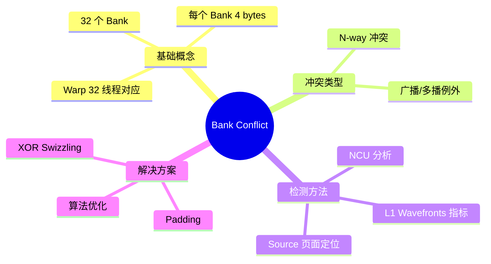

### 10.2 优化方法对比

| 方法 | 适用场景 | 优点 | 缺点 |
|------|---------|------|------|
| 算法优化 | 可调整访问模式的算法 | 最彻底，无额外开销 | 可能需要大幅修改代码 |
| Padding | 简单 2D 访问模式 | 实现简单 | 增加内存使用 |
| XOR Swizzling | 复杂访问模式、GEMM | 无内存开销 | 理解成本高 |

### 10.3 最佳实践

1. **优先考虑算法优化**：从根源消除 Bank Conflict
2. **合理使用 Padding**：简单有效，注意内存开销
3. **复杂场景用 Swizzling**：GEMM 等计算密集型算子
4. **始终用 NCU 验证**：确保优化有效

### 10.4 思考题

1. 为什么共享内存设计成 32 个 Bank，而不是更多或更少？
2. 如果一个 Warp 中有 16 个线程访问 Bank 0，另外 16 个线程访问 Bank 1，是否会产生 Bank Conflict？
3. Padding 的大小如何选择？是不是填充越多越好？
4. XOR Swizzling 为什么特别适合矩阵乘法？

---

## 下一章

[第十六章：Warp Level Programming](./16_Warp_Level_Programming.md) - 深入理解 Warp 级编程和 Shuffle 指令

---

*参考资料：*
- *[CUDA C++ Programming Guide - 5.3.2. Device Memory Accesses - Shared Memory](https://docs.nvidia.com/cuda/cuda-c-programming-guide/index.html#shared-memory)*
- *NVIDIA Nsight Compute Documentation*