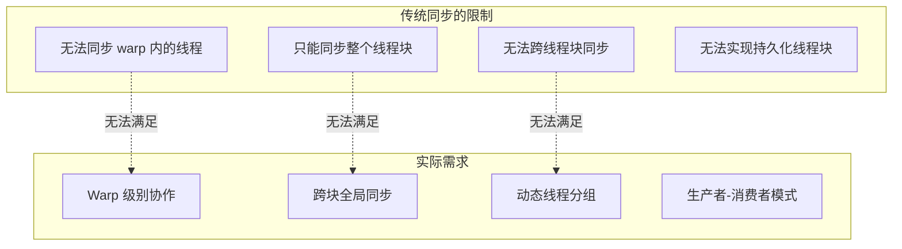
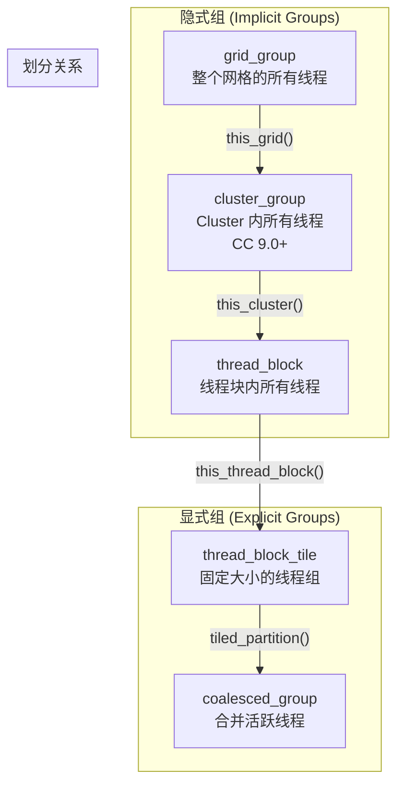
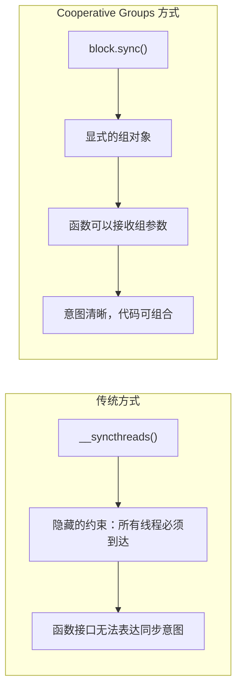
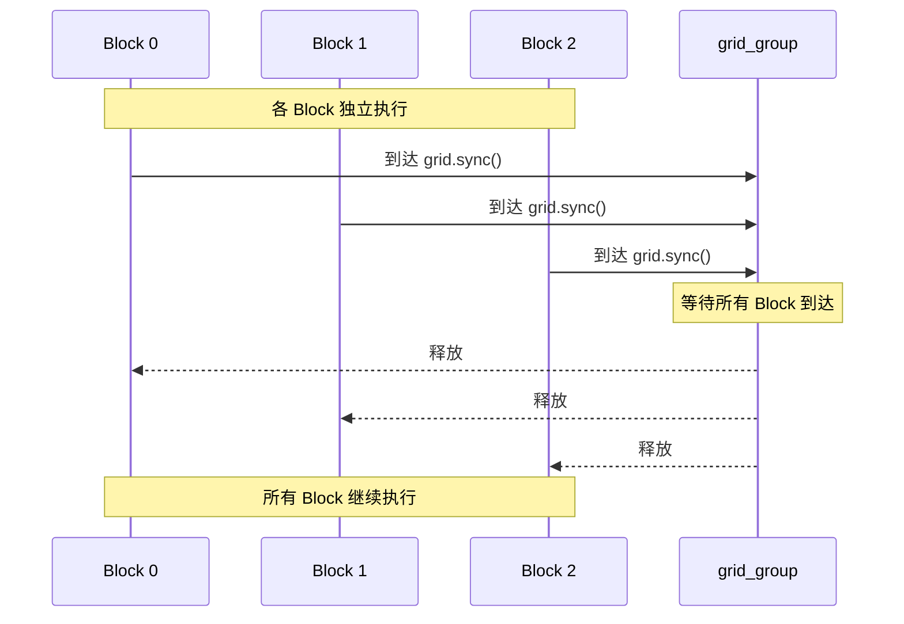
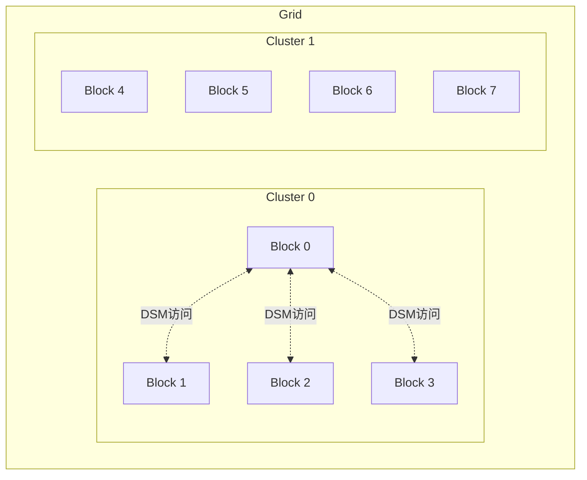
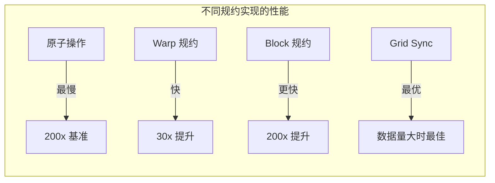
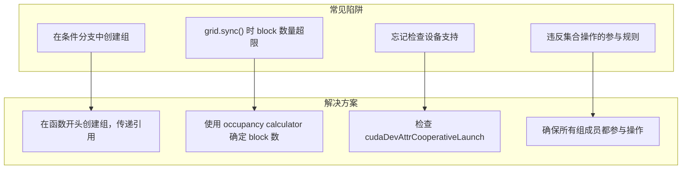

# 第十六章：Cooperative Groups

> 学习目标：掌握Cooperative Groups API，实现跨块同步和协作
>
> 预计阅读时间：45 分钟
>
> 前置知识：[第十二章：原子操作与竞争条件](./12_原子操作与竞争条件.md) | [第十三章：共享内存深入](./13_共享内存深入.md)

---

## 1. Cooperative Groups 概述

### 1.1 为什么需要 Cooperative Groups？

在 CUDA 9.0 之前，CUDA 编程模型只提供了一种同步机制：`__syncthreads()`，用于同步线程块内的所有线程。但实际开发中，我们常常需要更灵活的同步粒度：



**Cooperative Groups** 是 CUDA 9.0 引入的扩展，允许开发者：
- 表达线程通信的粒度
- 实现更丰富、更高效的并行分解
- 安全地进行跨块同步

### 1.2 头文件与命名空间

```cpp
// 主要头文件（兼容 C++11 之前）
#include <cooperative_groups.h>

// 可选：memcpy_async 集合操作
#include <cooperative_groups/memcpy_async.h>

// 可选：reduce 集合操作
#include <cooperative_groups/reduce.h>

// 可选：scan 集合操作
#include <cooperative_groups/scan.h>

// 使用命名空间
namespace cg = cooperative_groups;
```

---

## 2. 线程组类型

### 2.1 组类型层级结构



### 2.2 隐式组类型对比

| 组类型 | 获取方式 | 同步范围 | 计算能力要求 |
|--------|----------|----------|--------------|
| `thread_block` | `this_thread_block()` | 线程块内 | CC 5.0+ |
| `cluster_group` | `this_cluster()` | Cluster 内 | CC 9.0+ |
| `grid_group` | `this_grid()` | 整个网格 | CC 6.0+ (需协作启动) |
| `multi_grid_group` | `this_multi_grid()` | 多设备 | CC 6.0+ (已弃用) |

---

## 3. 块内同步：thread_block

### 3.1 基本用法

`thread_block` 是最基础的组类型，代表线程块内的所有线程：

```cpp
#include <cooperative_groups.h>
namespace cg = cooperative_groups;

__global__ void block_sync_example(float* data) {
    // 获取当前线程块组
    cg::thread_block block = cg::this_thread_block();

    // 获取线程在块内的 rank（0 到 num_threads-1）
    unsigned int rank = block.thread_rank();

    // 获取块内的线程总数
    unsigned int size = block.num_threads();

    // 获取块在网格中的索引
    dim3 block_idx = block.group_index();

    // 获取线程在块内的 3D 索引
    dim3 thread_idx = block.thread_index();

    // 同步：等价于 __syncthreads()
    block.sync();
}
```

### 3.2 与 __syncthreads() 的对比



**示例：使用组参数的函数**

```cpp
// 传统方式：同步约束隐藏在函数内部
__device__ float sum_traditional(float* data, int n) {
    // ... 计算部分和 ...
    __syncthreads();  // 调用者不知道这里需要同步！
    return total;
}

// Cooperative Groups 方式：同步意图显式表达
__device__ float sum_cg(const cg::thread_block& block, float* data, int n) {
    // ... 计算部分和 ...
    block.sync();  // 组参数明确表示需要块级同步
    return total;
}

__global__ void kernel(float* data) {
    cg::thread_block block = cg::this_thread_block();

    // 函数签名明确表示需要块级协作
    float result = sum_cg(block, data, N);
}
```

### 3.3 barrier_arrive 和 barrier_wait

CUDA 12.2 引入了更细粒度的屏障控制：

```cpp
__global__ void barrier_example(float* data) {
    cg::thread_block block = cg::this_thread_block();

    // 线程到达屏障，获取 token
    auto token = block.barrier_arrive();

    // 在等待其他线程到达期间，可以做一些独立工作
    // 这些工作不依赖于其他线程的状态
    do_independent_work();

    // 等待所有线程到达屏障
    block.barrier_wait(std::move(token));

    // 此时所有线程都已到达，可以安全访问共享数据
}
```

---

## 4. Warp 级操作

### 4.1 thread_block_tile

`thread_block_tile` 是编译时确定大小的线程组，支持高效的 warp 级操作：

```cpp
__global__ void tile_example(float* data) {
    // 获取线程块
    cg::thread_block block = cg::this_thread_block();

    // 划分为 32 线程的 tile（通常是一个 warp）
    cg::thread_block_tile<32> tile32 = cg::tiled_partition<32>(block);

    // 获取线程在 tile 内的 rank
    unsigned int rank = tile32.thread_rank();

    // 获取 tile 的大小（编译时常量）
    unsigned int size = tile32.num_threads();  // = 32

    // 同步 tile 内的线程
    tile32.sync();

    // Shuffle 操作：从指定 rank 获取值
    float val = data[rank];
    float from_rank_0 = tile32.shfl(val, 0);  // 所有线程都从 rank 0 获取

    // 向下 shuffle：每个线程从 rank + delta 处获取
    float down_val = tile32.shfl_down(val, 1);

    // 向上 shuffle
    float up_val = tile32.shfl_up(val, 1);

    // XOR shuffle
    float xor_val = tile32.shfl_xor(val, 16);
}
```

### 4.2 使用 Warp Shuffle 进行规约

```cpp
__device__ float warp_reduce_sum(cg::thread_block_tile<32>& tile, float val) {
    // 使用 shfl_down 进行 warp 内规约
    for (int offset = tile.num_threads() / 2; offset > 0; offset /= 2) {
        val += tile.shfl_down(val, offset);
    }
    return val;  // 只有 rank 0 有正确的完整和
}

__global__ void reduce_kernel(float* input, float* output, int N) {
    cg::thread_block block = cg::this_thread_block();
    cg::thread_block_tile<32> tile = cg::tiled_partition<32>(block);

    // Grid-stride 循环累加
    float sum = 0.0f;
    for (int i = blockIdx.x * blockDim.x + threadIdx.x; i < N; i += blockDim.x * gridDim.x) {
        sum += input[i];
    }

    // Warp 内规约
    sum = warp_reduce_sum(tile, sum);

    // 只有每个 warp 的 lane 0 需要写入
    if (tile.thread_rank() == 0) {
        atomicAdd(output, sum);
    }
}
```

### 4.3 coalesced_threads()

当 warp 内发生分支分歧时，`coalesced_threads()` 可以获取当前活跃的线程：

```cpp
__global__ void coalesced_example(int* data, int* counter) {
    // 只有偶数线程执行
    if (threadIdx.x % 2 == 0) {
        // 创建包含所有活跃线程的组
        cg::coalesced_group active = cg::coalesced_threads();

        // 获取在活跃组内的 rank
        int rank = active.thread_rank();

        // 使用活跃线程进行协作
        int prev = 0;
        if (rank == 0) {
            prev = atomicAdd(counter, active.num_threads());
        }

        // 广播 leader 的结果
        prev = active.shfl(prev, 0);

        // 每个活跃线程获得唯一的偏移量
        data[prev + rank] = threadIdx.x;
    }
}
```

---

## 5. 跨块同步：grid_group

### 5.1 grid.sync() 原理



### 5.2 使用 cudaLaunchCooperativeKernel

要使用 `grid.sync()`，必须使用协作启动 API：

```cpp
#include <cooperative_groups.h>
namespace cg = cooperative_groups;

// 使用 grid.sync() 的核函数
__global__ void grid_sync_kernel(float* data, int* partial, int N) {
    cg::grid_group grid = cg::this_grid();

    // 第一阶段：每个 block 计算部分和
    float sum = 0.0f;
    for (int i = blockIdx.x * blockDim.x + threadIdx.x; i < N; i += blockDim.x * gridDim.x) {
        sum += data[i];
    }

    // Block 内规约
    __shared__ float s_sum;
    if (threadIdx.x == 0) s_sum = 0;
    __syncthreads();
    atomicAdd(&s_sum, sum);
    __syncthreads();

    // 每个 block 的 lane 0 存储部分结果
    if (threadIdx.x == 0) {
        partial[blockIdx.x] = s_sum;
    }

    // 跨块同步：等待所有 block 完成第一阶段
    grid.sync();

    // 第二阶段：block 0 汇总所有部分和
    if (blockIdx.x == 0) {
        float total = 0.0f;
        for (int i = threadIdx.x; i < gridDim.x; i += blockDim.x) {
            total += partial[i];
        }

        // Block 内规约得到最终结果
        __shared__ float final_sum;
        if (threadIdx.x == 0) final_sum = 0;
        __syncthreads();
        atomicAdd(&final_sum, total);
        __syncthreads();

        if (threadIdx.x == 0) {
            data[0] = final_sum;
        }
    }
}

// 主机端启动代码
void launch_cooperative_kernel(float* d_data, int* d_partial, int N, int num_blocks, int threads_per_block) {
    // 检查设备是否支持协作启动
    int supports_coop = 0;
    cudaDeviceGetAttribute(&supports_coop, cudaDevAttrCooperativeLaunch, 0);

    if (!supports_coop) {
        printf("Device does not support cooperative launch!\n");
        return;
    }

    // 准备核函数参数
    void* args[] = { &d_data, &d_partial, &N };

    // 使用协作启动 API
    cudaLaunchCooperativeKernel(
        (void*)grid_sync_kernel,
        dim3(num_blocks),
        dim3(threads_per_block),
        args,
        0,  // shared memory
        0   // stream
    );
}
```

### 5.3 确定合适的 Block 数量

使用 `grid.sync()` 时，所有 block 必须能够同时在 GPU 上驻留：

```cpp
void setup_cooperative_launch(int device, int threads_per_block) {
    cudaDeviceProp prop;
    cudaGetDeviceProperties(&prop, device);

    // 方法 1：每个 SM 一个 block（最保守）
    int num_blocks = prop.multiProcessorCount;

    // 方法 2：使用 occupancy calculator（更高效）
    int num_blocks_per_sm = 0;
    cudaOccupancyMaxActiveBlocksPerMultiprocessor(
        &num_blocks_per_sm,
        grid_sync_kernel,
        threads_per_block,
        0  // dynamic shared memory
    );
    num_blocks = prop.multiProcessorCount * num_blocks_per_sm;

    printf("Launching %d blocks with %d threads each\n", num_blocks, threads_per_block);
}
```

### 5.4 计算能力要求

| 功能 | 最低计算能力 | 备注 |
|------|--------------|------|
| `thread_block` | 5.0 | 所有现代 GPU |
| `grid_group.sync()` | 6.0 | 需要协作启动 |
| `cluster_group` | 9.0 | Hopper 架构 |

**平台限制**：
- Linux：支持（无 MPS 或 CC 7.0+ 有 MPS）
- Windows：最新版本支持
- TCC 模式：完全支持

---

## 6. Thread Block Clusters（CC 9.0+）

### 6.1 什么是 Cluster？

Thread Block Cluster 是 Hopper 架构（H100, CC 9.0+）引入的新特性，允许多个线程块组成一个 Cluster，共享分布式共享内存。



### 6.2 Cluster API 使用

```cpp
#include <cooperative_groups.h>
namespace cg = cooperative_groups;

// 需要 CC 9.0+
__cluster_dims__(2, 1, 1)  // 指定 cluster 大小为 2x1x1
__global__ void cluster_kernel(int* data) {
    // 获取 cluster 组
    cg::cluster_group cluster = cg::this_cluster();

    // 获取 block 在 cluster 内的 rank
    unsigned int block_rank = cluster.block_rank();

    // 获取 cluster 内的 block 数量
    unsigned int num_blocks = cluster.num_blocks();

    // 获取 cluster 内的总线程数
    unsigned long long total_threads = cluster.num_threads();

    // 获取当前线程在 cluster 内的全局 rank
    unsigned long long thread_rank = cluster.thread_rank();

    // Cluster 级同步
    cluster.sync();

    // 访问其他 block 的共享内存（分布式共享内存）
    extern __shared__ int shared_data[];

    // 映射其他 block 的共享内存地址
    int* other_block_smem = cluster.map_shared_rank(shared_data, (block_rank + 1) % num_blocks);

    // 现在可以直接访问其他 block 的共享内存
    int value = other_block_smem[threadIdx.x];
}
```

### 6.3 Cluster 启动方式

```cpp
// 方式 1：使用 __cluster_dims__ 属性（编译时确定）
__cluster_dims__(2, 2, 1)  // 2x2x1 = 4 blocks per cluster
__global__ void kernel_v1() { ... }

// 方式 2：使用 cudaLaunchKernelEx（运行时确定）
void launch_cluster_kernel() {
    cudaLaunchConfig_t config = {
        .gridDim = dim3(16, 16, 1),  // 总共 256 个 blocks
        .blockDim = dim3(128, 1, 1),
    };

    // 设置 cluster 大小
    cudaLaunchAttribute attrs[1];
    attrs[0].id = cudaLaunchAttributeClusterDimension;
    attrs[0].val.clusterDim = {4, 4, 1};  // 4x4x1 = 16 blocks per cluster

    cudaLaunchKernelEx(&config, kernel_v2, attrs, 1);
}
```

### 6.4 分布式共享内存（Distributed Shared Memory）

Thread Block Clusters 的一个关键特性是**分布式共享内存（DSM）**，允许同一 Cluster 内的不同 Block 访问彼此的共享内存。

> **重要提示**：访问分布式共享内存需要所有线程块都存在。用户可以使用 `cluster.sync()` 确保所有线程块都已开始执行。

```cpp
// 分布式共享内存直方图示例
__cluster_dims__(2)  // 2 个 block 组成一个 cluster
__global__ void histogram_dsm(int* global_bins, int nbins, int* data, int N) {
    // 每个block的共享内存
    extern __shared__ int smem[];

    // 初始化本地共享内存
    for (int i = threadIdx.x; i < nbins; i += blockDim.x) {
        smem[i] = 0;
    }

    // Cluster 同步，确保所有共享内存都已初始化
    cluster.sync();

    // 处理数据
    for (int i = blockIdx.x * blockDim.x + threadIdx.x; i < N; i += gridDim.x * blockDim.x) {
        int bin = data[i] % nbins;

        // 决定使用哪个 block 的共享内存
        int target_block = bin % cluster.num_blocks();
        int local_bin = bin / cluster.num_blocks();

        // 获取目标 block 的共享内存指针
        int* dst_smem = cluster.map_shared_rank(smem, target_block);

        // 原子更新分布式共享内存
        atomicAdd(dst_smem + local_bin, 1);
    }

    // Cluster 同步，确保所有分布式共享内存操作完成
    cluster.sync();

    // 将结果写回全局内存
    for (int i = threadIdx.x; i < nbins; i += blockDim.x) {
        atomicAdd(&global_bins[i], smem[i]);
    }
}
```

### 6.5 Cluster 使用注意事项

1. **最大 Cluster 大小**：CUDA 便携式 Cluster 大小最大为 8 个线程块。在 GPU 硬件或 MIG 配置较小的情况下，最大 Cluster 大小会相应减少。

2. **Grid 维度**：Grid 维度必须是 Cluster 大小的整数倍。

3. **同步要求**：在访问其他 Block 的共享内存之前，必须确保目标 Block 已经开始执行（使用 `cluster.sync()`）。

4. **退出顺序**：需要确保所有分布式共享内存操作在 Block 退出前完成。

---

## 7. 使用 Cooperative Groups 的规约实现

### 7.1 完整的高性能规约实现

```cpp
#include <cooperative_groups.h>
#include <cooperative_groups/reduce.h>
namespace cg = cooperative_groups;

// Warp 级规约函数
__device__ float warp_reduce(cg::thread_block_tile<32>& warp, float val) {
    // 使用 CG 内置的 reduce 操作（CUDA 11.0+）
    // 或者手动实现：
    #pragma unroll
    for (int offset = 16; offset > 0; offset /= 2) {
        val += warp.shfl_down(val, offset);
    }
    return val;
}

// Block 级规约
__device__ float block_reduce(cg::thread_block& block, float val) {
    // 分割为 warps
    cg::thread_block_tile<32> warp = cg::tiled_partition<32>(block);

    // Warp 内规约
    val = warp_reduce(warp, val);

    // 使用共享内存进行 warp 间规约
    __shared__ float warp_sums[32];  // 假设最多 32 个 warp
    int warp_id = block.thread_rank() / 32;
    int lane_id = block.thread_rank() % 32;

    // 每个 warp 的 lane 0 写入结果
    if (lane_id == 0) {
        warp_sums[warp_id] = val;
    }
    block.sync();

    // 第一个 warp 读取并规约所有 warp 的结果
    float result = 0.0f;
    if (warp_id == 0) {
        result = (lane_id < block.num_threads() / 32) ? warp_sums[lane_id] : 0.0f;
        result = warp_reduce(warp, result);
    }

    return result;
}

// 完整的 Grid 级规约（使用 grid.sync）
__global__ void grid_reduce_kernel(float* input, float* output, float* partial, int N) {
    cg::grid_group grid = cg::this_grid();
    cg::thread_block block = cg::this_thread_block();

    // 第一阶段：Grid-stride 循环 + Block 内规约
    float sum = 0.0f;
    for (int i = blockIdx.x * blockDim.x + threadIdx.x; i < N; i += blockDim.x * gridDim.x) {
        sum += input[i];
    }

    sum = block_reduce(block, sum);

    // Block 0 的线程 0 存储部分和
    if (block.thread_rank() == 0) {
        partial[blockIdx.x] = sum;
    }

    // 跨 Block 同步
    grid.sync();

    // 第二阶段：Block 0 汇总
    if (blockIdx.x == 0) {
        float total = 0.0f;
        for (int i = threadIdx.x; i < gridDim.x; i += blockDim.x) {
            total += partial[i];
        }

        total = block_reduce(block, total);

        if (block.thread_rank() == 0) {
            *output = total;
        }
    }
}
```

### 7.2 性能对比



---

## 8. 注意事项与最佳实践

### 8.1 常见陷阱



### 8.2 死锁示例与修复

```cpp
// 错误示例：在分支中创建组会导致死锁
__global__ void bad_example(int* flag) {
    // 错误！只有部分线程创建组
    if (threadIdx.x < 16) {
        cg::thread_block block = cg::this_thread_block();
        block.sync();  // 死锁！所有线程都需要到达
    }
}

// 正确示例：在函数开头创建组
__global__ void good_example(int* flag) {
    cg::thread_block block = cg::this_thread_block();

    // 可以安全地在子函数中传递组引用
    if (threadIdx.x < 16) {
        do_work(block);  // 函数内部可以使用 block.sync()
    }
}
```

### 8.3 最佳实践清单

1. **尽早创建组对象**：在核函数开头创建，避免在条件分支中创建

2. **传递引用而非值**：
   ```cpp
   __device__ void process(const cg::thread_block& block) { ... }  // 正确
   __device__ void process(cg::thread_block block) { ... }         // 避免拷贝
   ```

3. **使用模板化的 tile**：编译时已知大小可以更好地优化
   ```cpp
   auto tile = cg::tiled_partition<32>(block);  // 推荐
   // vs
   cg::thread_group tile = cg::tiled_partition(block, 32);  // 运行时开销
   ```

4. **检查设备支持**：
   ```cpp
   int supports_coop = 0;
   cudaDeviceGetAttribute(&supports_coop, cudaDevAttrCooperativeLaunch, 0);
   if (!supports_coop) {
       // 回退到两阶段实现
   }
   ```

5. **正确计算 block 数量**：确保所有 block 可以同时驻留

---

## 9. 本章小结

### 9.1 关键概念

| 概念 | 描述 |
|------|------|
| `thread_block` | 线程块级别的组，等价于 `__syncthreads()` |
| `thread_block_tile` | 固定大小的线程组，支持 shuffle 操作 |
| `coalesced_group` | 活跃线程的动态分组 |
| `grid_group` | 整个网格级别的同步 |
| `cluster_group` | Cluster 级协作（CC 9.0+） |

### 9.2 API 速查表

```cpp
// 获取隐式组
cg::thread_block block = cg::this_thread_block();
cg::grid_group grid = cg::this_grid();
cg::cluster_group cluster = cg::this_cluster();  // CC 9.0+

// 划分组
auto tile32 = cg::tiled_partition<32>(block);
auto active = cg::coalesced_threads();

// 组操作
block.sync();
block.thread_rank();
block.num_threads();

// Tile 操作（编译时大小）
tile32.shfl(val, src_rank);
tile32.shfl_down(val, delta);
tile32.shfl_up(val, delta);

// Barrier 操作（CUDA 12.2+）
auto token = block.barrier_arrive();
block.barrier_wait(std::move(token));
```

### 9.3 思考题

1. 为什么 `grid.sync()` 必须使用 `cudaLaunchCooperativeKernel` 启动？
2. `thread_block_tile<32>` 和 `coalesced_threads()` 有什么区别？
3. 在什么情况下应该使用 Cluster 而不是普通的线程块？

---

## 下一章

[第十七章：GEMM优化入门](./17_GEMM优化入门.md) - 学习矩阵乘法的基本优化技术

---

*参考资料：*
- *[CUDA C++ Programming Guide - Cooperative Groups](https://docs.nvidia.com/cuda/cuda-c-programming-guide/index.html#cooperative-groups)*
- *[CUDA C++ Programming Guide - Thread Block Clusters](https://docs.nvidia.com/cuda/cuda-c-programming-guide/index.html#thread-block-clusters)*