# 第十七章：GEMM优化入门

> 学习目标：理解矩阵乘法的基本原理，掌握GEMM的朴素实现与内存合并优化
>
> 预计阅读时间：50 分钟
>
> 前置知识：[第九章：内存访问优化](./09_内存访问优化.md) | [第十三章：共享内存深入](./13_共享内存深入.md)

---

## 1. GEMM概述

### 1.1 什么是GEMM？

**GEMM（General Matrix Multiply）** 是广义矩阵乘法，是深度学习和科学计算中最重要的算子之一。

基本形式：**C = alpha * A * B + beta * C**

其中：
- A 是 M x K 矩阵
- B 是 K x N 矩阵
- C 是 M x N 矩阵
- alpha 和 beta 是标量缩放因子

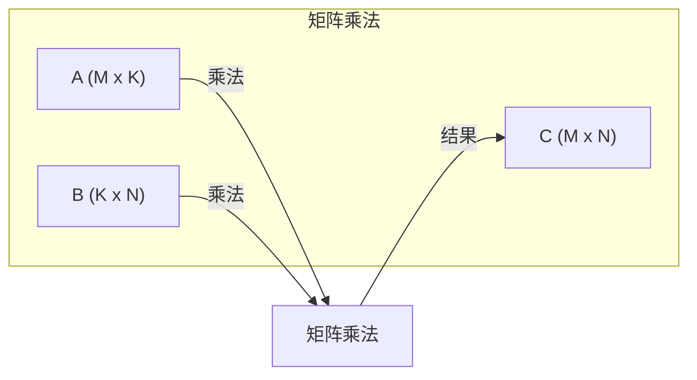

### 1.2 GEMM的重要性

GEMM在深度学习中的应用：

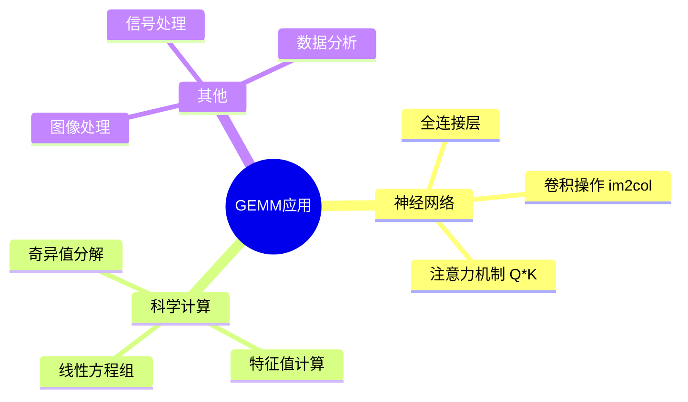

**计算特点**：
- 计算复杂度：O(M * N * K)
- 访存复杂度：O(M * K + K * N + M * N)
- 计算密集型算子（理想情况下）

### 1.3 矩阵存储格式

矩阵在内存中有两种主要存储格式：

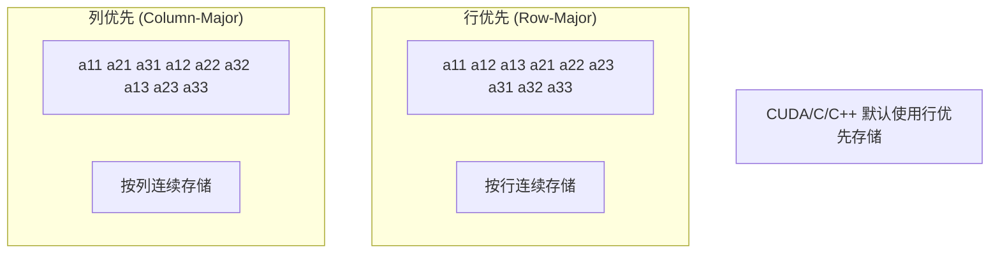

| 格式 | 特点 | 使用场景 |
|------|------|----------|
| 行优先 | 同一行元素连续存储 | C/C++、CUDA |
| 列优先 | 同一列元素连续存储 | Fortran、BLAS |

---

## 2. 朴素GEMM实现

### 2.1 算法原理

矩阵乘法的数学定义：

```
C[i][j] = sum(A[i][k] * B[k][j]) for k = 0 to K-1
```

每个C中的元素是A的一行与B的一列的点积。

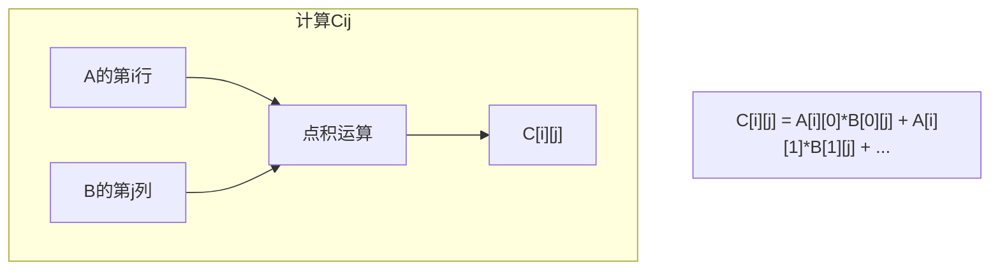

### 2.2 朴素GPU实现

```cpp
// 朴素GEMM核函数
// 每个线程计算C矩阵中的一个元素
__global__ void naive_gemm(float* A, float* B, float* C, int M, int N, int K) {
    // 使用2D线程索引映射到矩阵位置
    int row = blockIdx.y * blockDim.y + threadIdx.y;  // M方向
    int col = blockIdx.x * blockDim.x + threadIdx.x;  // N方向

    if (row < M && col < N) {
        float sum = 0.0f;
        // 沿K维度累加
        for (int k = 0; k < K; k++) {
            sum += A[row * K + k] * B[k * N + col];
        }
        C[row * N + col] = sum;
    }
}
```

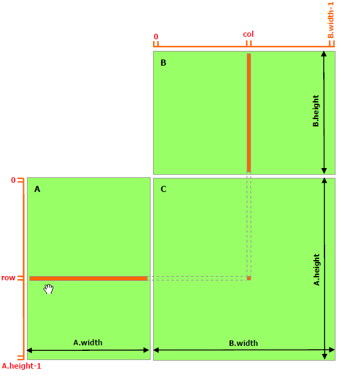

> **图：不使用共享内存的矩阵乘法**（来源：CUDA C++ Programming Guide）
>
> 在朴素实现中，每个线程读取 A 的一行和 B 的一列来计算 C 的一个元素。A 被读取 B.width 次，B 被读取 A.height 次，造成大量的全局内存访问。

**线程组织**：
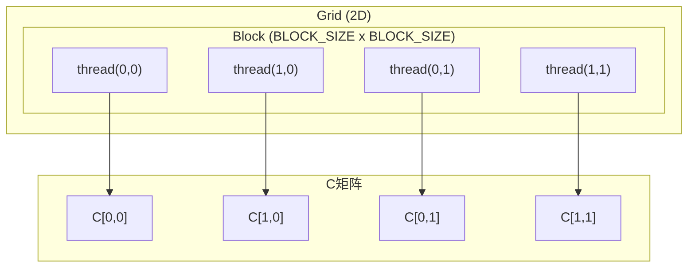

### 2.3 朴素实现的问题

让我们分析朴素实现的访存模式：

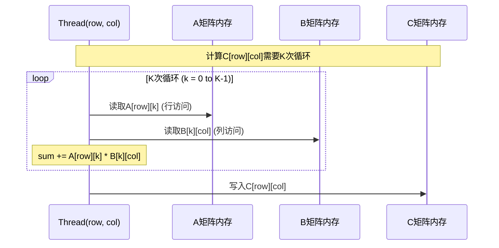

**问题分析**：

1. **A矩阵访问**：同一行元素连续，行优先存储下访问模式良好
2. **B矩阵访问**：按列访问，在行优先存储下访问不连续
3. **Warp内线程**：
   - 相邻线程（相邻col）访问A的同一行（好）
   - 相邻线程访问B的不同列，地址跨度为N（差）

---

## 3. 内存合并问题分析

### 3.1 NCU性能分析

使用NCU分析朴素GEMM的性能：

```bash
# 运行NCU分析
ncu --set full -o naive_gemm_report ./01_naive_gemm

# 查看关键指标
ncu --metrics l1tex__t_sectors_pipe_lsu_mem_global_op_ld.sum,\
    l1tex__t_requests_pipe_lsu_mem_global_op_ld.sum ./01_naive_gemm
```

**常见问题指标**：
- `L1TEX Global Load/Store Access Pattern` - 访存模式问题
- `Uncoalesced Global Accesses` - 全局内存未合并访问
- `L2 Theoretical Sectors Global Excessive` - 过多的L2访问

### 3.2 访存模式详解

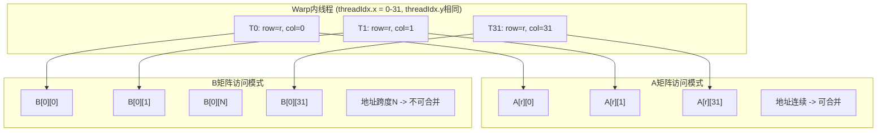

**内存合并条件**：
1. Warp内线程访问连续的128字节对齐内存块
2. 每个线程访问4字节（float）时，32个线程访问128字节
3. 如果访问地址不连续或跨度大，则无法合并

### 3.3 访存效率计算

```
朴素实现的访存分析：
- 每个线程读取A的一行：K次读取
- 每个线程读取B的一列：K次读取（跨度为N）
- 总读取次数：M * N * 2 * K

理想合并情况：
- A矩阵：连续访问，可合并
- B矩阵：跨步访问，不可合并，每次访问可能触发独立的内存事务
```

---

## 4. 内存合并优化

### 4.1 优化思路

**关键洞察**：交换循环顺序，改变访存模式

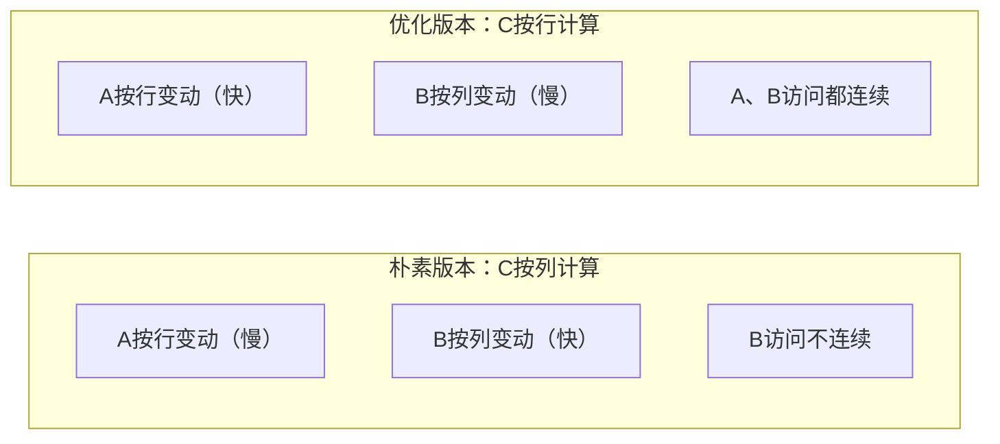

### 4.2 优化后的核函数

```cpp
// 内存合并优化的GEMM
// 关键修改：交换计算顺序
__global__ void coalesced_gemm(float* A, float* B, float* C, int M, int N, int K) {
    int row = blockIdx.y * blockDim.y + threadIdx.y;
    int col = blockIdx.x * blockDim.x + threadIdx.x;

    if (row < M && col < N) {
        float sum = 0.0f;

        // 核心：交换 threadIdx.x 和 threadIdx.y 的角色
        // 使Warp内线程在col方向连续
        // 这样访问A和B都能实现内存合并

        for (int k = 0; k < K; k++) {
            // A[row][k]: 同一Warp内不同线程访问同一元素 -> 广播
            // B[k][col]: 同一Warp内col连续 -> 合并访问
            sum += A[row * K + k] * B[k * N + col];
        }
        C[row * N + col] = sum;
    }
}
```

**更清晰的版本 - 转置思路**：

```cpp
// 通过调整线程映射实现内存合并
__global__ void coalesced_gemm_v2(float* A, float* B, float* C, int M, int N, int K) {
    // 方法：让Warp内线程在M方向连续
    // 而不是在N方向连续

    int tx = threadIdx.x;
    int ty = threadIdx.y;
    int bx = blockIdx.x;
    int by = blockIdx.y;

    // 重新映射：tx用于M方向（行），ty用于N方向（列）
    int row = by * blockDim.y + ty;  // M方向
    int col = bx * blockDim.x + tx;  // N方向

    if (row < M && col < N) {
        float sum = 0.0f;
        for (int k = 0; k < K; k++) {
            sum += A[row * K + k] * B[k * N + col];
        }
        C[row * N + col] = sum;
    }
}
```

### 4.3 优化效果分析

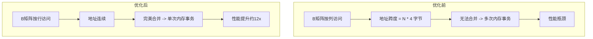

**性能提升原因**：
1. 减少内存事务次数
2. 提高有效带宽利用率
3. 降低L2缓存压力

---

## 5. 分块（Tiling）技术

### 5.1 为什么需要分块？

朴素实现和合并优化版本都有一个共同问题：

**数据复用低效**：
- 计算C的多个元素时，A的同一行被多次读取
- 计算C的多个元素时，B的同一列被多次读取
- 每次都从全局内存读取，延迟高

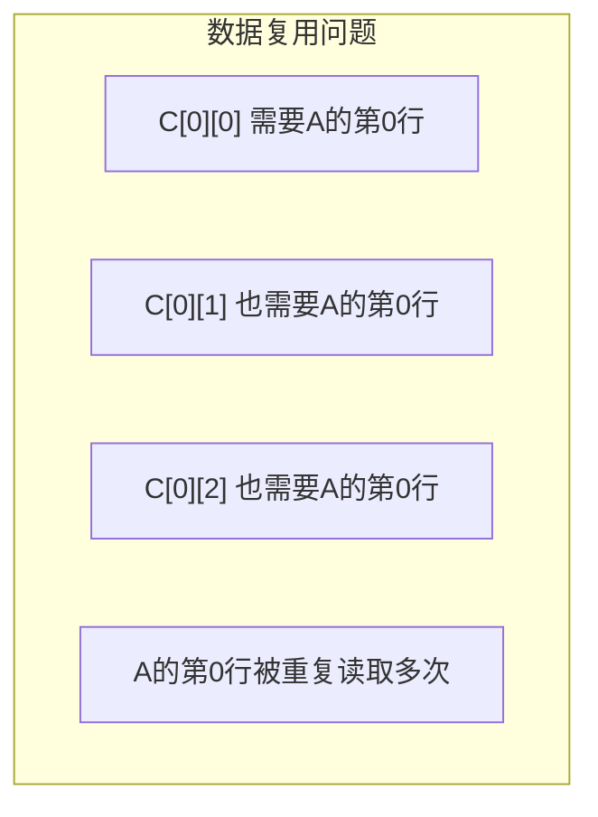

### 5.2 分块思想

**解决方案**：将矩阵分成小块（Tile），利用共享内存缓存

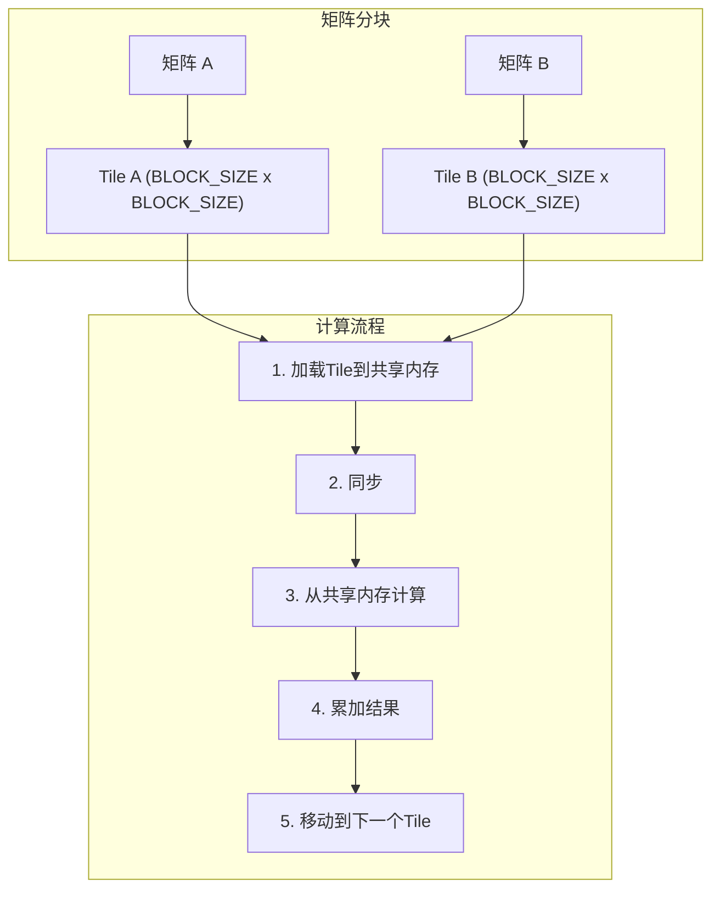

### 5.3 分块GEMM实现

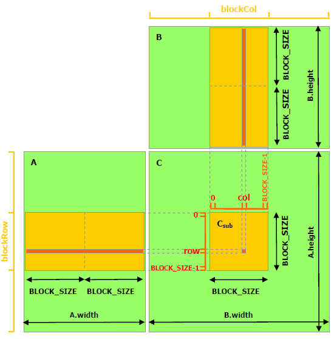

> **图：使用共享内存的矩阵乘法**（来源：CUDA C++ Programming Guide）
>
> 通过分块计算，A 只需要从全局内存读取 (B.width / BLOCK_SIZE) 次，B 只需要读取 (A.height / BLOCK_SIZE) 次，大大减少了全局内存访问。

```cpp
#define BLOCK_SIZE 32

// 分块GEMM核函数
__global__ void tiled_gemm(float* A, float* B, float* C, int M, int N, int K) {
    // 共享内存缓存Tile
    __shared__ float As[BLOCK_SIZE][BLOCK_SIZE];
    __shared__ float Bs[BLOCK_SIZE][BLOCK_SIZE];

    int tx = threadIdx.x;
    int ty = threadIdx.y;
    int row = blockIdx.y * BLOCK_SIZE + ty;
    int col = blockIdx.x * BLOCK_SIZE + tx;

    float sum = 0.0f;

    // 沿K方向迭代Tile
    for (int t = 0; t < (K + BLOCK_SIZE - 1) / BLOCK_SIZE; t++) {
        // 加载A的Tile到共享内存
        int a_col = t * BLOCK_SIZE + tx;
        if (row < M && a_col < K) {
            As[ty][tx] = A[row * K + a_col];
        } else {
            As[ty][tx] = 0.0f;
        }

        // 加载B的Tile到共享内存
        int b_row = t * BLOCK_SIZE + ty;
        if (b_row < K && col < N) {
            Bs[ty][tx] = B[b_row * N + col];
        } else {
            Bs[ty][tx] = 0.0f;
        }

        // 同步：确保所有线程都加载完成
        __syncthreads();

        // 计算Tile内的部分结果
        for (int k = 0; k < BLOCK_SIZE; k++) {
            sum += As[ty][k] * Bs[k][tx];
        }

        // 同步：确保所有线程都计算完成后再加载下一个Tile
        __syncthreads();
    }

    // 写回结果
    if (row < M && col < N) {
        C[row * N + col] = sum;
    }
}
```

### 5.4 分块执行流程

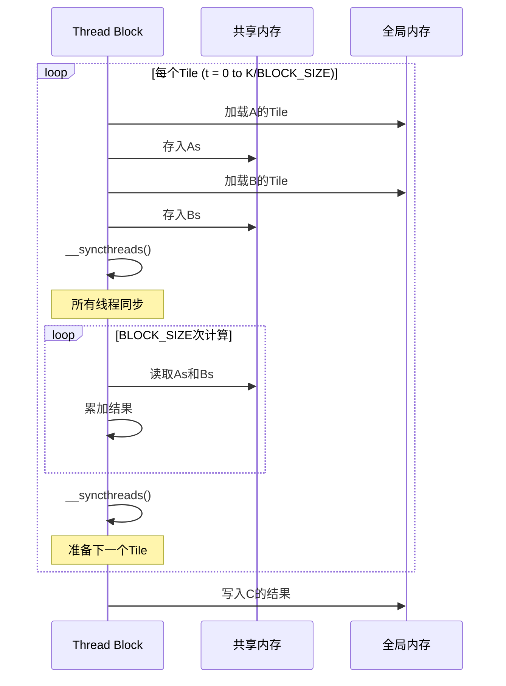

### 5.5 分块的优势

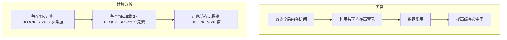

**数据复用分析**：
- 加载一个Tile：2 * BLOCK_SIZE^2 次全局内存读取
- 使用Tile计算：BLOCK_SIZE^3 次乘法
- 复用因子：BLOCK_SIZE / 2

---

## 6. 性能对比与分析

### 6.1 三种实现对比

| 实现 | 关键优化 | 全局内存访问 | 相对性能 |
|------|----------|--------------|----------|
| 朴素实现 | 无 | 高（B矩阵不连续） | 1x |
| 内存合并 | 访存模式优化 | 中（合并访问） | ~12x |
| 分块GEMM | 共享内存缓存 | 低（数据复用） | ~15x |

### 6.2 Roofline分析

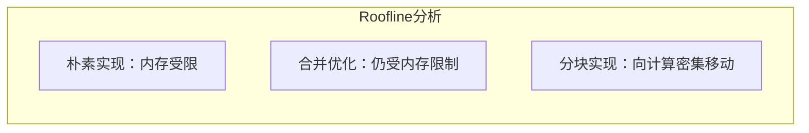

**算术强度计算**：
```
朴素/合并版本：
- 访存：M*N*K*2 次读取 + M*N 次写入
- 计算：M*N*K*2 次浮点运算
- AI = 2*M*N*K / (2*M*N*K + M*N) ≈ 1

分块版本：
- 每个Block访存：2 * BLOCK_SIZE^2 次
- 每个Block计算：BLOCK_SIZE^3 次乘加
- 局部AI = BLOCK_SIZE / 2
```

### 6.3 NCU分析要点

```bash
# 分析内存合并情况
ncu --metrics l1tex__t_requests_pipe_lsu_mem_global_op_ld.sum,\
    l1tex__t_sectors_pipe_lsu_mem_global_op_ld.sum \
    ./02_coalesced_gemm

# 分析共享内存使用
ncu --metrics l1tex__data_pipe_lsu_wavefronts_mem_shared.op_ld_sum,\
    l1tex__data_pipe_lsu_wavefronts_mem_shared.op_st_sum \
    ./03_tiled_gemm

# 分析Stall原因
ncu --metrics smsp__warp_issue_stall_immediate_scoreboard_per_warp_active.pct,\
    smsp__warp_issue_stall_short_scoreboard_per_warp_active.pct \
    ./03_tiled_gemm
```

---

## 7. 本章小结

### 7.1 关键概念

| 概念 | 描述 |
|------|------|
| GEMM | 广义矩阵乘法，深度学习核心算子 |
| 内存合并 | Warp内线程访问连续内存，减少内存事务 |
| 分块（Tiling） | 将矩阵分成小块，利用共享内存缓存 |
| 数据复用 | 同一数据被多次使用，减少重复加载 |

### 7.2 优化路径

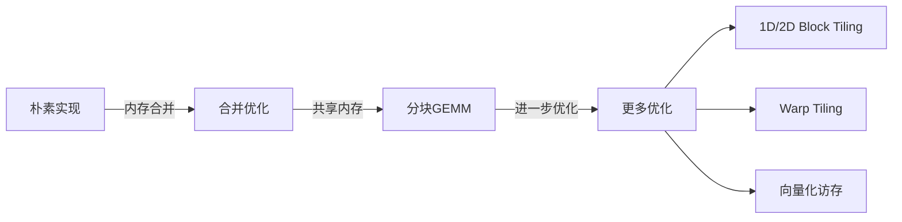

### 7.3 思考题

1. 为什么B矩阵的访问模式在朴素实现中无法实现内存合并？
2. 分块大小BLOCK_SIZE的选择对性能有什么影响？
3. 共享内存大小限制如何影响分块策略？
4. 如果矩阵尺寸不是BLOCK_SIZE的整数倍，应该如何处理？

---

## 下一章

[第十八章：GEMM分块优化](./18_GEMM分块优化.md) - 深入理解1D/2D Block Tiling和Warp Tiling优化技术

---

*参考资料：*
- *[CUDA C++ Programming Guide - Shared Memory](https://docs.nvidia.com/cuda/cuda-c-programming-guide/index.html#shared-memory)*
- *[NVIDIA Developer Blog - Programmable Matrix Multiply](https://developer.nvidia.com/blog/cutlass-linear-algebra-cuda/)*
- *[Programming Massively Parallel Processers, Chapter 4](https://www.elsevier.com/books/programming-massively-parallel-processors/hwu/978-0-12-811986-0)*
