# 第十八章：GEMM分块优化

> 学习目标：深入理解分块优化技术，掌握1D/2D Block Tiling和Warp Tiling
>
> 预计阅读时间：60 分钟
>
> 前置知识：[第十七章：GEMM优化入门](./17_GEMM优化入门.md)

---

## 1. 分块优化进阶

### 1.1 回顾：基础分块的问题

上一章介绍的基础分块GEMM：

```cpp
// 基础分块：每个线程计算C中的一个元素
__global__ void tiled_gemm(float* A, float* B, float* C, int M, int N, int K) {
    __shared__ float As[BLOCK_SIZE][BLOCK_SIZE];
    __shared__ float Bs[BLOCK_SIZE][BLOCK_SIZE];

    // 每个线程计算C中的一个元素
    // 需要K/BLOCK_SIZE次Tile迭代
    // 每次Tile加载 2*BLOCK_SIZE^2 个元素
}
```

**问题分析**：
- 每个线程只负责一个C元素
- 共享内存访问频繁，可能成为瓶颈
- 寄存器利用率不足

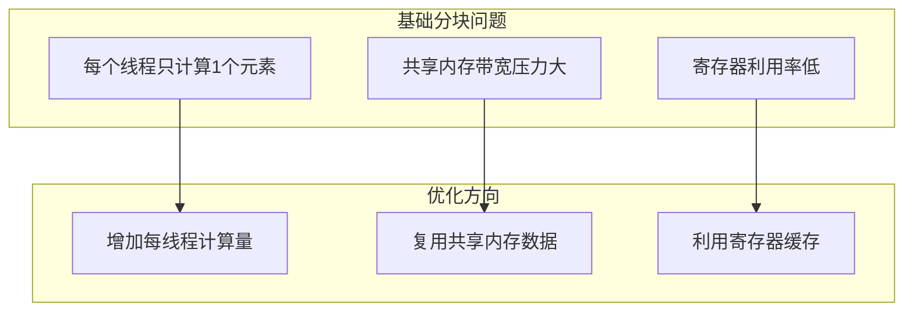

### 1.2 分层分块思想

现代GEMM优化采用分层分块策略：

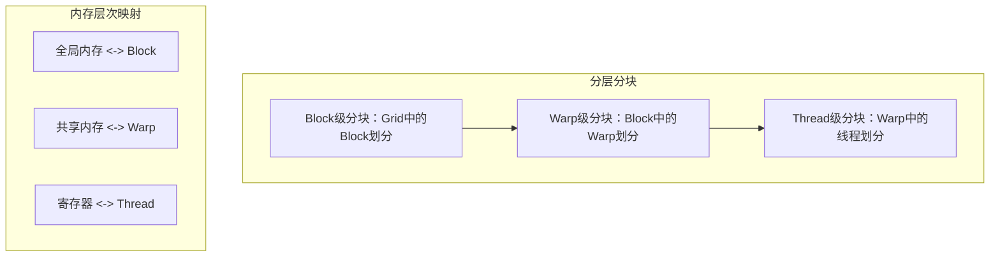

---

## 2. 共享内存缓存优化

### 2.1 SMEM Caching原理

让每个线程计算多个元素，增加数据复用：

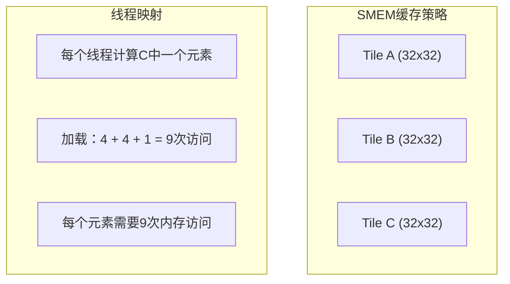

### 2.2 SMEM Caching实现

```cpp
#define BLOCK_SIZE 32

// SMEM Caching版本
__global__ void smem_caching_gemm(float* A, float* B, float* C, int M, int N, int K) {
    __shared__ float As[BLOCK_SIZE][BLOCK_SIZE];
    __shared__ float Bs[BLOCK_SIZE][BLOCK_SIZE];

    int tx = threadIdx.x;
    int ty = threadIdx.y;
    int row = blockIdx.y * BLOCK_SIZE + ty;
    int col = blockIdx.x * BLOCK_SIZE + tx;

    float sum = 0.0f;

    // 沿K方向滑动Tile
    for (int t = 0; t < (K + BLOCK_SIZE - 1) / BLOCK_SIZE; t++) {
        // 协作加载Tile到共享内存
        int a_col = t * BLOCK_SIZE + tx;
        int b_row = t * BLOCK_SIZE + ty;

        if (row < M && a_col < K) {
            As[ty][tx] = A[row * K + a_col];
        } else {
            As[ty][tx] = 0.0f;
        }

        if (b_row < K && col < N) {
            Bs[ty][tx] = B[b_row * N + col];
        } else {
            Bs[ty][tx] = 0.0f;
        }

        __syncthreads();

        // 从共享内存计算
        for (int k = 0; k < BLOCK_SIZE; k++) {
            sum += As[ty][k] * Bs[k][tx];
        }

        __syncthreads();
    }

    if (row < M && col < N) {
        C[row * N + col] = sum;
    }
}
```

### 2.3 性能分析

使用NCU分析SMEM Caching版本：

```bash
# 分析共享内存吞吐和Stall
ncu --metrics smsp__sass_thread_inst_executed_op_shared_ld.sum,\
    smsp__sass_thread_inst_executed_op_shared_st.sum,\
    smsp__warp_issue_stall_mio_throttle_per_warp_active.pct \
    ./01_smem_caching
```

**常见瓶颈**：
- `Stall MIO Throttle`：共享内存访问过于频繁
- 共享内存带宽成为限制因素

---

## 3. 1D Block Tiling

### 3.1 优化思路

让每个线程计算多个同列的元素，在M方向扩展：

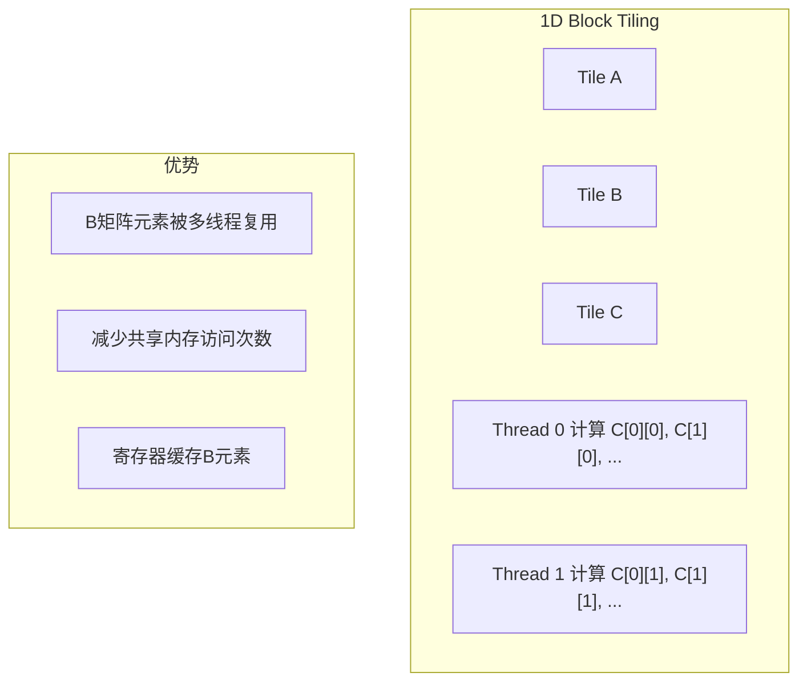

### 3.2 1D Block Tiling实现

```cpp
#define BLOCK_SIZE 32
#define THREAD_M 4  // 每个线程处理M方向的4个元素

// 1D Block Tiling：扩展M方向
__global__ void gemm_1d_blocktiling(float* A, float* B, float* C, int M, int N, int K) {
    __shared__ float As[BLOCK_SIZE][BLOCK_SIZE];
    __shared__ float Bs[BLOCK_SIZE][BLOCK_SIZE];

    int tx = threadIdx.x;
    int ty = threadIdx.y;

    // 每个线程处理THREAD_M个元素
    int row_start = blockIdx.y * BLOCK_SIZE * THREAD_M + ty * THREAD_M;
    int col = blockIdx.x * BLOCK_SIZE + tx;

    // 寄存器缓存累加结果
    float sum[THREAD_M];
    for (int i = 0; i < THREAD_M; i++) {
        sum[i] = 0.0f;
    }

    // 沿K方向迭代
    for (int t = 0; t < (K + BLOCK_SIZE - 1) / BLOCK_SIZE; t++) {
        // 加载B的Tile（与之前相同）
        int b_row = t * BLOCK_SIZE + ty;
        if (b_row < K && col < N) {
            Bs[ty][tx] = B[b_row * N + col];
        } else {
            Bs[ty][tx] = 0.0f;
        }

        // 加载A的Tile（需要加载THREAD_M行）
        for (int i = 0; i < THREAD_M; i++) {
            int row = row_start + i;
            int a_col = t * BLOCK_SIZE + tx;
            if (row < M && a_col < K) {
                As[ty * THREAD_M + i][tx] = A[row * K + a_col];
            } else {
                As[ty * THREAD_M + i][tx] = 0.0f;
            }
        }

        __syncthreads();

        // 计算：从共享内存读取，累加到寄存器
        for (int k = 0; k < BLOCK_SIZE; k++) {
            // B元素缓存到寄存器
            float b_val = Bs[k][tx];

            // 对每个M方向的元素进行累加
            for (int i = 0; i < THREAD_M; i++) {
                sum[i] += As[ty * THREAD_M + i][k] * b_val;
            }
        }

        __syncthreads();
    }

    // 写回结果
    for (int i = 0; i < THREAD_M; i++) {
        int row = row_start + i;
        if (row < M && col < N) {
            C[row * N + col] = sum[i];
        }
    }
}
```

### 3.3 1D Block Tiling分析

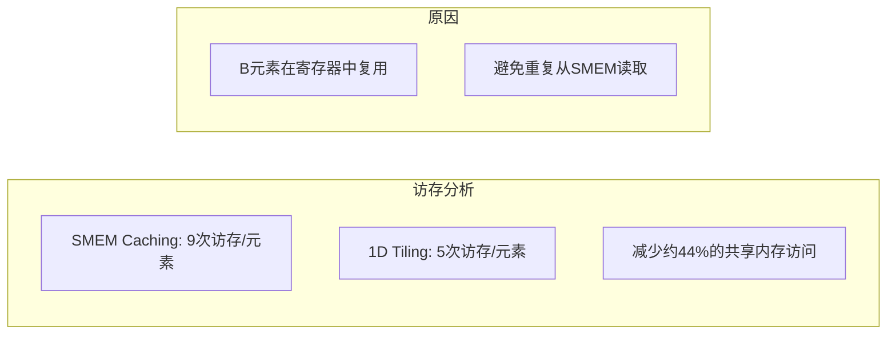

**访存计算**：
- SMEM Caching：每个C元素需要访问As 1次 + Bs 1次 = 2次SMEM读取
- 1D Tiling（THREAD_M=4）：
  - 加载A：4次（每个线程）
  - 加载B：1次（复用）
  - 计算4个元素：每个元素平均 (4+1)/4 = 1.25次SMEM读取

---

## 4. 2D Block Tiling

### 4.1 优化思路

进一步在N方向扩展，让每个线程计算一个小的矩阵块：

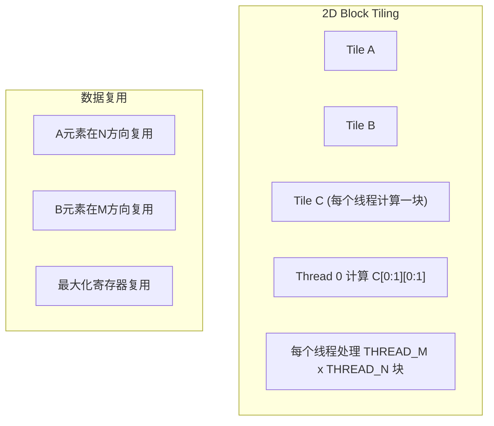

### 4.2 2D Block Tiling实现

```cpp
#define BLOCK_SIZE 32
#define THREAD_M 4
#define THREAD_N 4

// 2D Block Tiling：同时扩展M和N方向
__global__ void gemm_2d_blocktiling(float* A, float* B, float* C, int M, int N, int K) {
    __shared__ float As[BLOCK_SIZE][BLOCK_SIZE];
    __shared__ float Bs[BLOCK_SIZE][BLOCK_SIZE];

    int tx = threadIdx.x;
    int ty = threadIdx.y;

    // 计算线程负责的C矩阵区域
    int row_start = blockIdx.y * BLOCK_SIZE + ty * THREAD_M;
    int col_start = blockIdx.x * BLOCK_SIZE + tx * THREAD_N;

    // 寄存器缓存累加结果
    float sum[THREAD_M][THREAD_N];
    for (int i = 0; i < THREAD_M; i++) {
        for (int j = 0; j < THREAD_N; j++) {
            sum[i][j] = 0.0f;
        }
    }

    // 沿K方向迭代
    for (int t = 0; t < (K + BLOCK_SIZE - 1) / BLOCK_SIZE; t++) {
        // 协作加载Tile到共享内存
        // 每个线程可能需要加载多个元素以确保完整覆盖

        // 加载A的Tile
        int a_col = t * BLOCK_SIZE + tx;
        for (int i = 0; i < THREAD_M; i++) {
            int row = row_start + i;
            if (row < M && a_col < K) {
                As[ty * THREAD_M + i][tx] = A[row * K + a_col];
            } else {
                As[ty * THREAD_M + i][tx] = 0.0f;
            }
        }

        // 加载B的Tile
        int b_row = t * BLOCK_SIZE + ty;
        for (int j = 0; j < THREAD_N; j++) {
            int col = col_start + j;
            if (b_row < K && col < N) {
                Bs[ty][tx * THREAD_N + j] = B[b_row * N + col];
            } else {
                Bs[ty][tx * THREAD_N + j] = 0.0f;
            }
        }

        __syncthreads();

        // 计算：双重循环，利用寄存器缓存
        for (int k = 0; k < BLOCK_SIZE; k++) {
            // 预取A和B的值到寄存器
            float a_vals[THREAD_M];
            float b_vals[THREAD_N];

            for (int i = 0; i < THREAD_M; i++) {
                a_vals[i] = As[ty * THREAD_M + i][k];
            }
            for (int j = 0; j < THREAD_N; j++) {
                b_vals[j] = Bs[k][tx * THREAD_N + j];
            }

            // 累加到寄存器
            for (int i = 0; i < THREAD_M; i++) {
                for (int j = 0; j < THREAD_N; j++) {
                    sum[i][j] += a_vals[i] * b_vals[j];
                }
            }
        }

        __syncthreads();
    }

    // 写回结果
    for (int i = 0; i < THREAD_M; i++) {
        for (int j = 0; j < THREAD_N; j++) {
            int row = row_start + i;
            int col = col_start + j;
            if (row < M && col < N) {
                C[row * N + col] = sum[i][j];
            }
        }
    }
}
```

### 4.3 2D Block Tiling优势

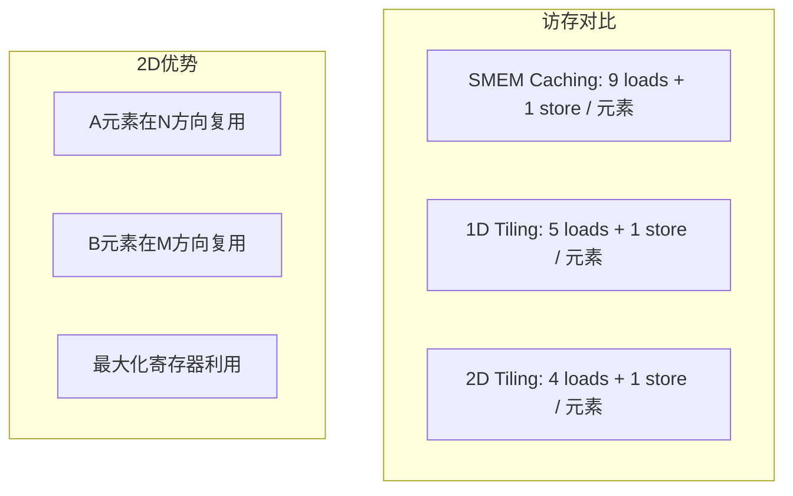

**性能提升分析**：
- THREAD_M = THREAD_N = 4
- 每个线程计算 16 个C元素
- 加载A：4次（在M方向）
- 加载B：4次（在N方向）
- 每元素平均加载：(4+4)/16 = 0.5次SMEM读取

---

## 5. Warp Tiling

### 5.1 层次化分块

Warp Tiling是最优化版本，充分利用GPU的层次结构：

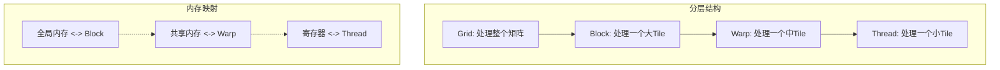

### 5.2 Warp Tiling原理

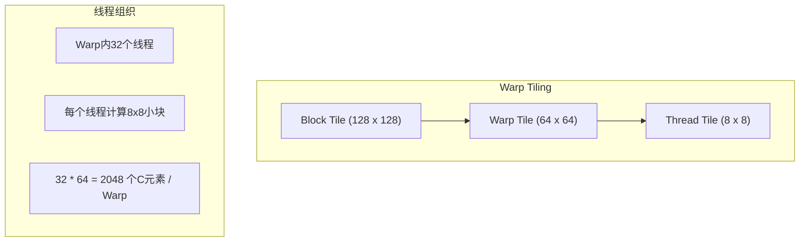

### 5.3 Warp Tiling实现

```cpp
#define BLOCK_SIZE_M 128
#define BLOCK_SIZE_N 128
#define BLOCK_SIZE_K 8

#define WARP_SIZE_M 64
#define WARP_SIZE_N 64

#define THREAD_SIZE_M 8
#define THREAD_SIZE_N 8

// Warp Tiling GEMM
__global__ void gemm_warptiling(float* A, float* B, float* C, int M, int N, int K) {
    // 共享内存缓存
    __shared__ float As[BLOCK_SIZE_M][BLOCK_SIZE_K];
    __shared__ float Bs[BLOCK_SIZE_K][BLOCK_SIZE_N];

    int tx = threadIdx.x;
    int ty = threadIdx.y;
    int tz = threadIdx.z;

    int warp_id = (ty * blockDim.z + tz) / (WARP_SIZE_N / THREAD_SIZE_N);
    int lane_id = tx * THREAD_SIZE_N + tz % (WARP_SIZE_N / THREAD_SIZE_N) * THREAD_SIZE_N;

    // 全局坐标
    int global_m = blockIdx.y * BLOCK_SIZE_M + warp_id * WARP_SIZE_M / (WARP_SIZE_N / THREAD_SIZE_N) + tx;
    int global_n = blockIdx.x * BLOCK_SIZE_N + lane_id;

    // 寄存器缓存
    float frag_a[THREAD_SIZE_M];
    float frag_b[THREAD_SIZE_N];
    float accum[THREAD_SIZE_M][THREAD_SIZE_N];

    // 初始化累加器
    #pragma unroll
    for (int i = 0; i < THREAD_SIZE_M; i++) {
        #pragma unroll
        for (int j = 0; j < THREAD_SIZE_N; j++) {
            accum[i][j] = 0.0f;
        }
    }

    // K方向迭代
    for (int k_step = 0; k_step < (K + BLOCK_SIZE_K - 1) / BLOCK_SIZE_K; k_step++) {
        // 加载A的Tile
        int a_row = blockIdx.y * BLOCK_SIZE_M + ty * 8 + tx;
        int a_col = k_step * BLOCK_SIZE_K + tz;
        if (a_row < M && a_col < K) {
            As[ty * 8 + tx][tz] = A[a_row * K + a_col];
        } else {
            As[ty * 8 + tx][tz] = 0.0f;
        }

        // 加载B的Tile
        int b_row = k_step * BLOCK_SIZE_K + ty;
        int b_col = blockIdx.x * BLOCK_SIZE_N + tx * 8 + tz;
        if (b_row < K && b_col < N) {
            Bs[ty][tx * 8 + tz] = B[b_row * N + b_col];
        } else {
            Bs[ty][tx * 8 + tz] = 0.0f;
        }

        __syncthreads();

        // 计算主循环
        #pragma unroll
        for (int k = 0; k < BLOCK_SIZE_K; k++) {
            // 加载A片段到寄存器
            #pragma unroll
            for (int i = 0; i < THREAD_SIZE_M; i++) {
                frag_a[i] = As[warp_id * (WARP_SIZE_M / 4) + tx * 2 + i / 4][k];
            }

            // 加载B片段到寄存器
            #pragma unroll
            for (int j = 0; j < THREAD_SIZE_N; j++) {
                frag_b[j] = Bs[k][lane_id + j];
            }

            // 累加计算
            #pragma unroll
            for (int i = 0; i < THREAD_SIZE_M; i++) {
                #pragma unroll
                for (int j = 0; j < THREAD_SIZE_N; j++) {
                    accum[i][j] += frag_a[i] * frag_b[j];
                }
            }
        }

        __syncthreads();
    }

    // 写回结果
    #pragma unroll
    for (int i = 0; i < THREAD_SIZE_M; i++) {
        #pragma unroll
        for (int j = 0; j < THREAD_SIZE_N; j++) {
            int row = global_m + i;
            int col = global_n + j;
            if (row < M && col < N) {
                C[row * N + col] = accum[i][j];
            }
        }
    }
}
```

### 5.4 Warp Tiling性能分析

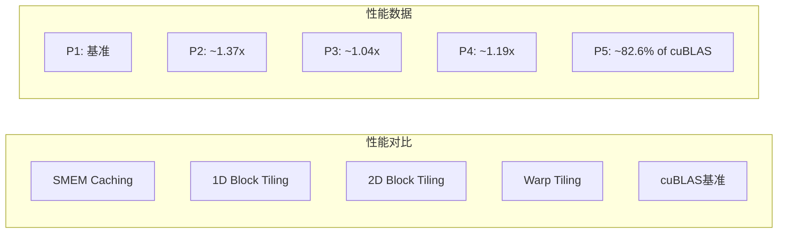

---

## 6. Bank Conflict优化

### 6.1 共享内存Bank Conflict

在分块GEMM中，共享内存访问可能产生Bank Conflict：

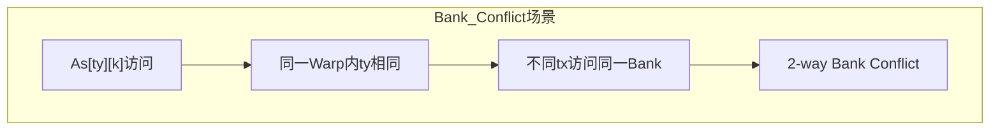

### 6.2 解决方案：Padding

```cpp
// 使用Padding避免Bank Conflict
#define BLOCK_SIZE 32
#define PAD 1  // 填充1个元素

__shared__ float As[BLOCK_SIZE][BLOCK_SIZE + PAD];  // 32 x 33
__shared__ float Bs[BLOCK_SIZE][BLOCK_SIZE + PAD];  // 32 x 33

// 访问方式不变，但由于填充，不同行的元素位于不同Bank
// As[i][j] -> Bank (j % 32)
// As[i][j+1] -> Bank ((j+1) % 32)
// 填充后相邻行的同一列元素位于不同Bank
```

### 6.3 XOR Swizzling

```cpp
// XOR Swizzling解决Bank Conflict
// 索引变换：tx^ty
int smem_row = tx ^ ty;  // XOR映射

// 这样可以将连续的访问模式打乱，避免Bank Conflict
As[smem_row][k] = ...;  // 使用变换后的索引
```

---

## 7. 性能优化总结

### 7.1 优化技术栈

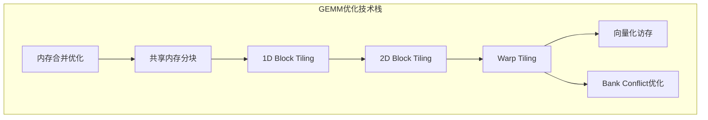

### 7.2 性能对比表

| 优化方法 | 关键技术 | 访存效率 | 性能提升 |
|----------|----------|----------|----------|
| 朴素实现 | 直接计算 | 低 | 1x |
| 内存合并 | 访存模式 | 中 | ~12x |
| SMEM Caching | 共享内存 | 中 | ~15x |
| 1D Block Tiling | M方向扩展 | 高 | ~20x |
| 2D Block Tiling | M+N方向扩展 | 高 | ~21x |
| Warp Tiling | 层次化 | 最高 | ~25x |

### 7.3 接近cuBLAS性能

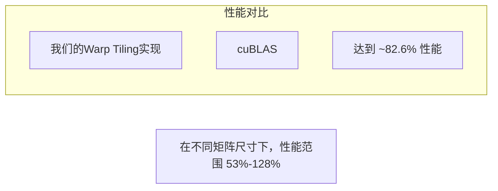

### 7.4 进一步优化方向

1. **Tensor Core**：利用GPU的矩阵计算单元
2. **双缓冲**：隐藏内存延迟
3. **向量化访存**：使用float4/float8
4. **流水线优化**：计算与访存重叠
5. **自动调优**：针对不同GPU架构优化参数

---

## 8. 本章小结

### 8.1 关键概念

| 概念 | 描述 |
|------|------|
| 1D Block Tiling | 在M方向扩展每个线程的计算量 |
| 2D Block Tiling | 在M和N方向同时扩展 |
| Warp Tiling | 分层分块，充分利用GPU层次结构 |
| Bank Conflict | 共享内存访问冲突 |
| XOR Swizzling | 索引变换解决Bank Conflict |

### 8.2 优化要点

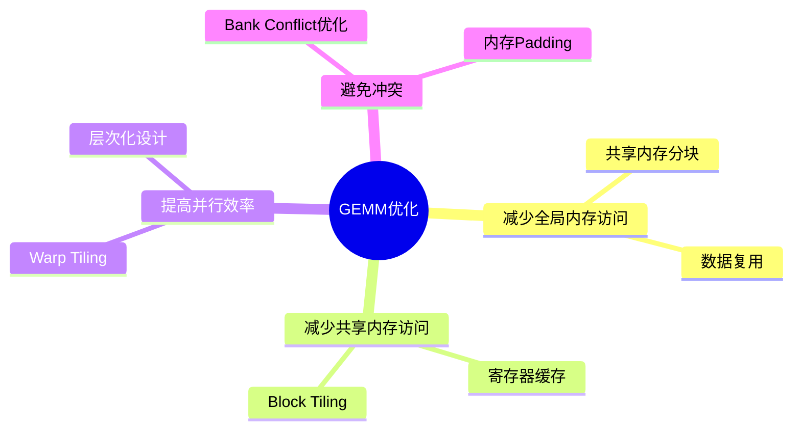

### 8.3 思考题

1. 为什么1D Block Tiling比SMEM Caching性能更好？
2. 2D Block Tiling的THREAD_M和THREAD_N参数如何选择？
3. Warp Tiling如何利用GPU的层次结构？
4. 为什么我们的实现能达到cuBLAS的82.6%性能？

---

*参考资料：*
- *[CUDA C++ Programming Guide - Shared Memory](https://docs.nvidia.com/cuda/cuda-c-programming-guide/index.html#shared-memory)*
- *[CUTLAS: CUDA Templates for Linear Algebra Subroutines](https://github.com/NVIDIA/cutlass)*
- *[Programming Massively Parallel Processers, Chapter 4](https://www.elsevier.com/books/programming-massively-parallel-processors/hwu/978-0-12-811986-0)*
- *[NVIDIA GTC - How CUDA Programming Model Maps to GPU Hardware](https://developer.nvidia.com/gtc)*