# 第十九章：Tensor Core编程

> 学习目标：理解Tensor Core的工作原理，掌握WMMA API和混合精度编程
>
> 预计阅读时间：70 分钟
>
> 前置知识：[第十八章：GEMM分块优化](./18_GEMM分块优化.md) | [第十章：精度与性能](./10_精度与性能.md)

---

## 1. Tensor Core概述

### 1.1 什么是Tensor Core？

**Tensor Core（张量核心）** 是NVIDIA从Volta架构（V100）开始引入的专用矩阵计算单元，专门用于高效执行混合精度的矩阵乘累加（MMA）运算。

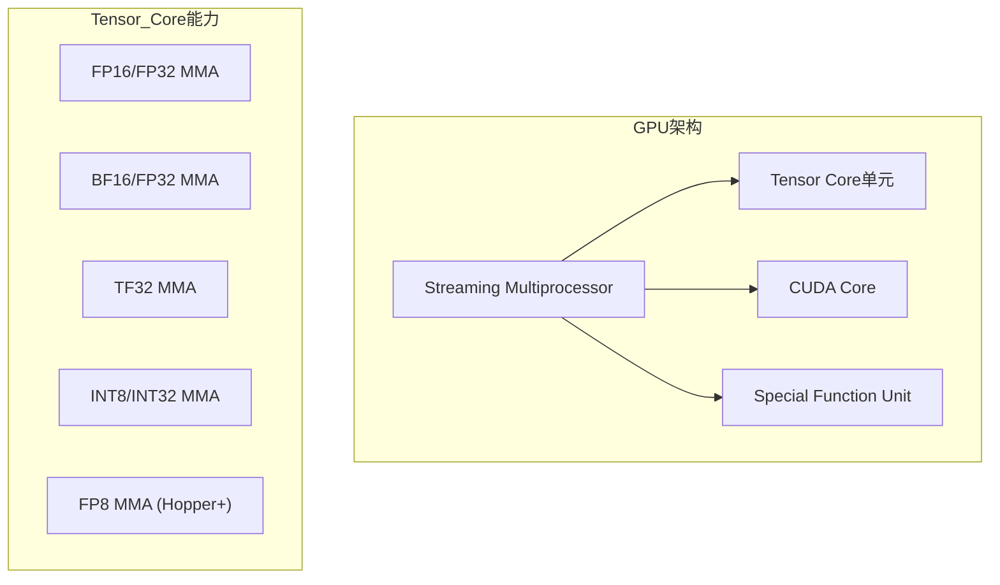

### 1.2 Tensor Core的优势

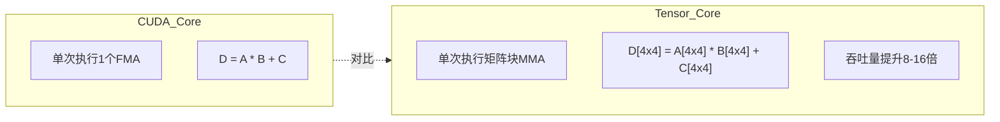

**性能对比（A100）**：

| 计算类型 | CUDA Core | Tensor Core | 加速比 |
|----------|-----------|-------------|--------|
| FP32 FMA | 19.5 TFLOPS | - | 1x |
| FP16/FP32 MMA | - | 312 TFLOPS | 16x |
| BF16/FP32 MMA | - | 312 TFLOPS | 16x |
| INT8 MMA | - | 624 TOPS | 32x |

### 1.3 Tensor Core架构演进

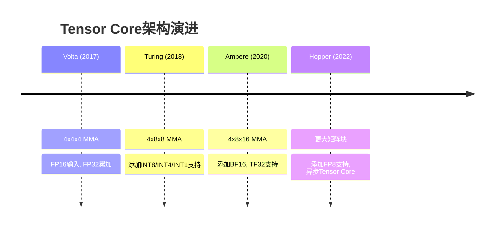

---

## 2. 混合精度计算

### 2.1 为什么需要混合精度？

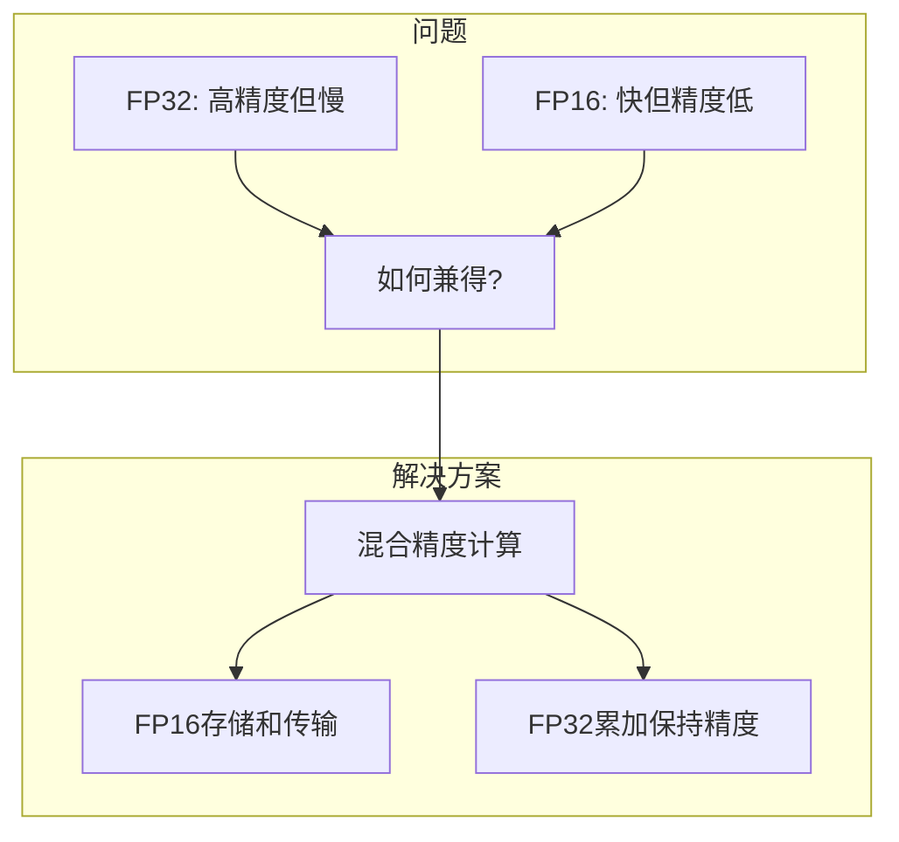

### 2.2 低精度数据类型

#### 2.2.1 FP16（半精度）

```
FP16格式 (IEEE 754-2008):
┌───┬──────┬─────────────┐
│ S │ Exp  │  Mantissa   │
│1bit│5bits│   10bits    │
└───┴──────┴─────────────┘

范围: ~6.5e-5 到 65504
精度: ~3-4位十进制
```

#### 2.2.2 BF16（Brain Float 16）

```
BF16格式 (Google Brain):
┌───┬──────┬─────────────┐
│ S │ Exp  │  Mantissa   │
│1bit│8bits│   7bits     │
└───┴──────┴─────────────┘

范围: 与FP32相同
精度: ~2-3位十进制
```

#### 2.2.3 TF32（Tensor Float 32）

```
TF32格式 (NVIDIA Ampere):
┌───┬──────┬─────────────┐
│ S │ Exp  │  Mantissa   │
│1bit│8bits│   10bits    │
└───┴──────┴─────────────┘

范围: 与FP32相同
精度: 与FP16相同
内部使用，对程序员透明
```

> **关于TF32的重要说明**（来自CUDA官方文档）：
>
> TF32 是 Tensor Core 支持的一种特殊浮点格式，具有与 FP32 相同的范围和降低的精度（>=10位）。其内部布局是实现定义的。
>
> 要在 WMMA 操作中使用 TF32，输入矩阵必须手动转换为 TF32 精度。为此，提供了 `__float_to_tf32` 内置函数。虽然输入和输出参数都是 `float` 类型，但输出在数值上是 `tf32`。
>
> ```cpp
> // TF32 转换示例
> float input = 1.0f;
> float tf32_val = __float_to_tf32(input);  // 转换为 TF32 精度
> ```

### 2.3 混合精度训练流程

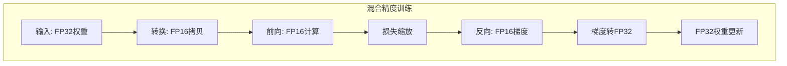

---

## 3. WMMA API编程

### 3.1 WMMA概述

**WMMA（Warp Matrix Multiply Accumulate）** 是CUDA提供的Tensor Core编程接口，让整个Warp协同执行矩阵运算。

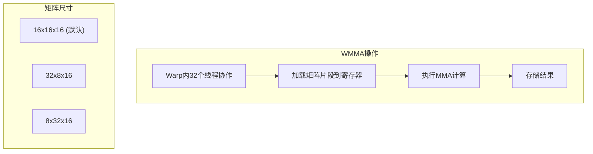

### 3.2 WMMA头文件和命名空间

```cpp
#include <mma.h>  // WMMA头文件

using namespace nvcuda;  // WMMA命名空间
```

### 3.3 基本WMMA类型

```cpp
// 矩阵片段（Fragment）类型
wmma::fragment<wmma::matrix_a, 16, 16, 16, half, wmma::row_major> a_frag;
wmma::fragment<wmma::matrix_b, 16, 16, 16, half, wmma::col_major> b_frag;
wmma::fragment<wmma::accumulator, 16, 16, 16, float> c_frag;

// 模板参数说明:
// - 矩阵角色: matrix_a, matrix_b, accumulator
// - 矩阵尺寸: M, N, K (必须符合Tensor Core支持的组合)
// - 数据类型: half, float, int8_t等
// - 布局: row_major, col_major, mem_row_major
```

### 3.4 WMMA基本操作

```cpp
// 1. 加载矩阵片段
wmma::load_matrix_sync(a_frag, a_ptr, lda);  // 加载A矩阵
wmma::load_matrix_sync(b_frag, b_ptr, ldb);  // 加载B矩阵
wmma::load_matrix_sync(c_frag, c_ptr, ldc, wmma::mem_row_major);  // 加载C矩阵

// 2. 执行MMA计算
wmma::mma_sync(c_frag, a_frag, b_frag, c_frag);  // C = A * B + C

// 3. 存储结果
wmma::store_matrix_sync(c_ptr, c_frag, ldc, wmma::mem_row_major);  // 存储C矩阵
```

### 3.5 完整WMMA GEMM示例

```cpp
#include <mma.h>

using namespace nvcuda;

// WMMA GEMM核函数
// 每个Warp计算C中一个16x16的块
__global__ void wmma_gemm(half* A, half* B, float* C, int M, int N, int K) {
    // Warp索引
    int warpM = (blockIdx.y * blockDim.y + threadIdx.y) / 16;  // 每个Warp处理16行
    int warpN = (blockIdx.x * blockDim.x + threadIdx.x) / 16;  // 每个Warp处理16列

    // 矩阵片段
    wmma::fragment<wmma::matrix_a, 16, 16, 16, half, wmma::row_major> a_frag;
    wmma::fragment<wmma::matrix_b, 16, 16, 16, half, wmma::col_major> b_frag;
    wmma::fragment<wmma::accumulator, 16, 16, 16, float> c_frag;

    // 初始化累加器
    wmma::fill_fragment(c_frag, 0.0f);

    // 沿K方向迭代
    for (int k = 0; k < K; k += 16) {
        // 加载A和B的块
        int aRow = warpM * 16;
        int aCol = k;
        int bRow = k;
        int bCol = warpN * 16;

        if (aRow < M && aCol < K) {
            wmma::load_matrix_sync(a_frag, A + aRow * K + aCol, K);
        }

        if (bRow < K && bCol < N) {
            wmma::load_matrix_sync(b_frag, B + bRow * N + bCol, N);
        }

        // 执行MMA
        wmma::mma_sync(c_frag, a_frag, b_frag, c_frag);
    }

    // 存储结果
    int cRow = warpM * 16;
    int cCol = warpN * 16;

    if (cRow < M && cCol < N) {
        wmma::store_matrix_sync(C + cRow * N + cCol, c_frag, N, wmma::mem_row_major);
    }
}
```

### 3.6 WMMA执行模型

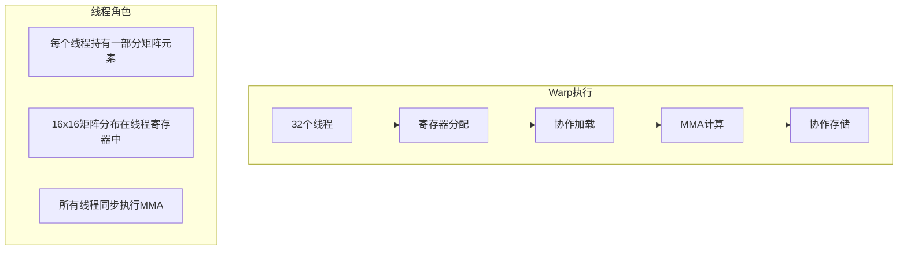

---

## 4. Tensor Core分块策略

### 4.1 分层分块设计

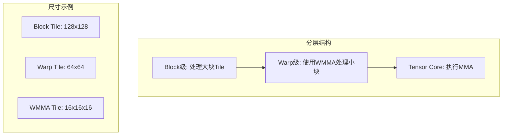

### 4.2 双缓冲优化

```cpp
// 双缓冲WMMA GEMM
__global__ void double_buffer_wmma_gemm(
    half* __restrict__ A, half* __restrict__ B, float* __restrict__ C,
    int M, int N, int K
) {
    __shared__ half sA[2][128][16];  // 双缓冲
    __shared__ half sB[2][16][128];

    // 矩阵片段
    wmma::fragment<wmma::matrix_a, 16, 16, 16, half, wmma::row_major> a_frag;
    wmma::fragment<wmma::matrix_b, 16, 16, 16, half, wmma::col_major> b_frag;
    wmma::fragment<wmma::accumulator, 16, 16, 16, float> c_frag;

    wmma::fill_fragment(c_frag, 0.0f);

    int loadStage = 0;
    int computeStage = 1;

    // 预加载第一个块
    // ...

    for (int k = 0; k < K; k += 16) {
        // 计算和加载重叠
        // 计算上一个块
        wmma::load_matrix_sync(a_frag, sA[computeStage][...], 16);
        wmma::load_matrix_sync(b_frag, sB[computeStage][...], 16);
        wmma::mma_sync(c_frag, a_frag, b_frag, c_frag);

        // 加载下一个块
        // ...

        // 交换缓冲
        int temp = loadStage;
        loadStage = computeStage;
        computeStage = temp;

        __syncthreads();
    }
}
```

### 4.3 共享内存与WMMA结合

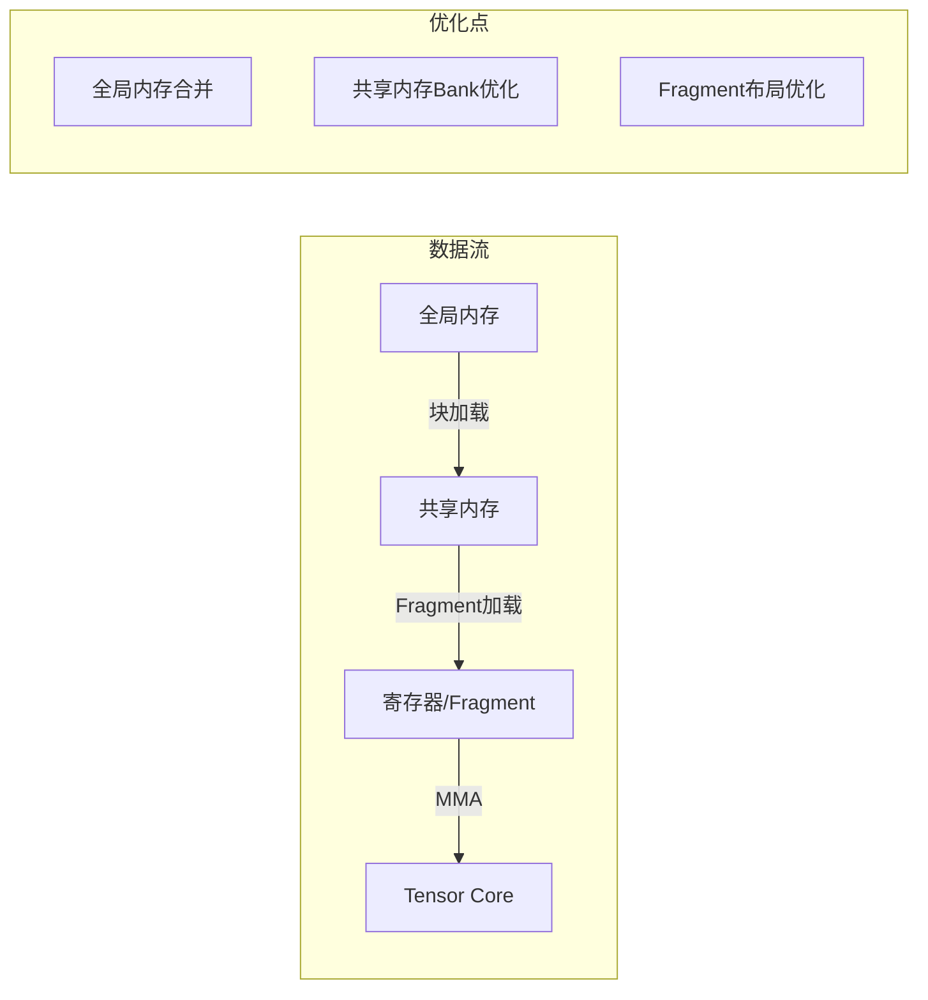

---

## 5. 混合精度编程实践

### 5.1 数据类型转换

```cpp
// FP32 <-> FP16转换
__device__ half float_to_half(float f) {
    return __float2half(f);
}

__device__ float half_to_float(half h) {
    return __half2float(h);
}

// 向量化转换
__device__ half2 float2_to_half2(float2 f) {
    return __float22half2_rn(f);
}
```

### 5.2 损失缩放（Loss Scaling）

```cpp
// 混合精度训练中的损失缩放
__global__ void scale_loss(half* loss, float scale, int n) {
    int idx = blockIdx.x * blockDim.x + threadIdx.x;
    if (idx < n) {
        float l = __half2float(loss[idx]);
        loss[idx] = __float2half(l * scale);
    }
}

// 梯度反缩放
__global__ void unscale_grad(half* grad, float scale, int n) {
    int idx = blockIdx.x * blockDim.x + threadIdx.x;
    if (idx < n) {
        float g = __half2float(grad[idx]);
        grad[idx] = __float2half(g / scale);
    }
}
```

### 5.3 BF16和FP8支持

```cpp
// BF16相关（Ampere+）
#include <cuda_bf16.h>

using bf16 = __nv_bfloat16;

// BF16加法
__device__ bf16 bf16_add(bf16 a, bf16 b) {
    return __hadd(a, b);
}

// FP8相关（Hopper+）
#if __CUDA_ARCH__ >= 900
#include <cuda_fp8.h>

using fp8_e4m3 = __nv_fp8_e4m3;
using fp8_e5m2 = __nv_fp8_e5m2;
#endif
```

---

## 6. 性能优化技巧

### 6.1 WMMA性能考虑

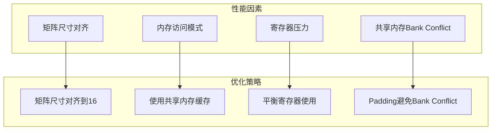

### 6.2 NCU分析Tensor Core

```bash
# 分析Tensor Core利用率
ncu --metrics sm__pipe_fma_cycles_active.avg.pct_of_peak,\
    sm__pipe_tensor_cycles_active.avg.pct_of_peak,\
    sm__sass_thread_inst_executed_op_tensor.sum \
    ./wmma_gemm

# 分析内存性能
ncu --metrics l1tex__t_sectors_pipe_lsu_mem_global_op_ld.sum,\
    l1tex__t_sectors_pipe_lsu_mem_global_op_st.sum \
    ./wmma_gemm
```

### 6.3 性能对比

| 实现方式 | 关键技术 | 性能 |
|----------|----------|------|
| FP32 CUDA Core | 标准GEMM | 基准 |
| FP16 CUDA Core | 半精度计算 | ~2x |
| WMMA FP16/FP32 | Tensor Core | ~8-10x |
| cuBLAS Tensor Core | 高度优化 | ~10-15x |

---

## 7. 完整示例：WMMA GEMM

### 7.1 核函数实现

```cpp
#include <mma.h>

using namespace nvcuda;

#define WMMA_M 16
#define WMMA_N 16
#define WMMA_K 16

#define BLOCK_M 128
#define BLOCK_N 128
#define BLOCK_K 16

// 优化的WMMA GEMM核函数
__global__ void optimized_wmma_gemm(
    const half* __restrict__ A,
    const half* __restrict__ B,
    float* __restrict__ C,
    int M, int N, int K
) {
    // 共享内存Tile（带padding避免Bank Conflict）
    __shared__ half sA[BLOCK_M][BLOCK_K + 8];
    __shared__ half sB[BLOCK_K][BLOCK_N + 8];

    // Warp和线程索引
    int warpIdx = (threadIdx.y * blockDim.x + threadIdx.x) / 32;
    int laneId = (threadIdx.y * blockDim.x + threadIdx.x) % 32;

    // 每个Warp处理的C矩阵块
    int warpM = (blockIdx.y * BLOCK_M / WMMA_M + warpIdx / 4) * WMMA_M;
    int warpN = (blockIdx.x * BLOCK_N / WMMA_N + warpIdx % 4) * WMMA_N;

    // 累加器片段
    wmma::fragment<wmma::accumulator, WMMA_M, WMMA_N, WMMA_K, float> acc_frag;
    wmma::fill_fragment(acc_frag, 0.0f);

    // K方向迭代
    for (int k = 0; k < K; k += BLOCK_K) {
        // 协作加载到共享内存
        // ...（省略加载代码）

        __syncthreads();

        // WMMA计算
        for (int kk = 0; kk < BLOCK_K; kk += WMMA_K) {
            wmma::fragment<wmma::matrix_a, WMMA_M, WMMA_N, WMMA_K, half, wmma::row_major> a_frag;
            wmma::fragment<wmma::matrix_b, WMMA_M, WMMA_N, WMMA_K, half, wmma::col_major> b_frag;

            wmma::load_matrix_sync(a_frag, &sA[warpIdx / 4 * WMMA_M][kk], BLOCK_K + 8);
            wmma::load_matrix_sync(b_frag, &sB[kk][warpIdx % 4 * WMMA_N], BLOCK_N + 8);
            wmma::mma_sync(acc_frag, a_frag, b_frag, acc_frag);
        }

        __syncthreads();
    }

    // 存储结果
    wmma::store_matrix_sync(&C[warpM * N + warpN], acc_frag, N, wmma::mem_row_major);
}
```

---

## 8. 本章小结

### 8.1 关键概念

| 概念 | 描述 |
|------|------|
| Tensor Core | 专用矩阵计算单元，执行混合精度MMA |
| WMMA | Warp Matrix Multiply Accumulate，Tensor Core编程API |
| 混合精度 | 低精度存储/计算，高精度累加 |
| FP16/BF16/TF32 | 常见的低精度数据类型 |
| Fragment | WMMA矩阵片段，存储在寄存器中 |

### 8.2 Tensor Core编程要点

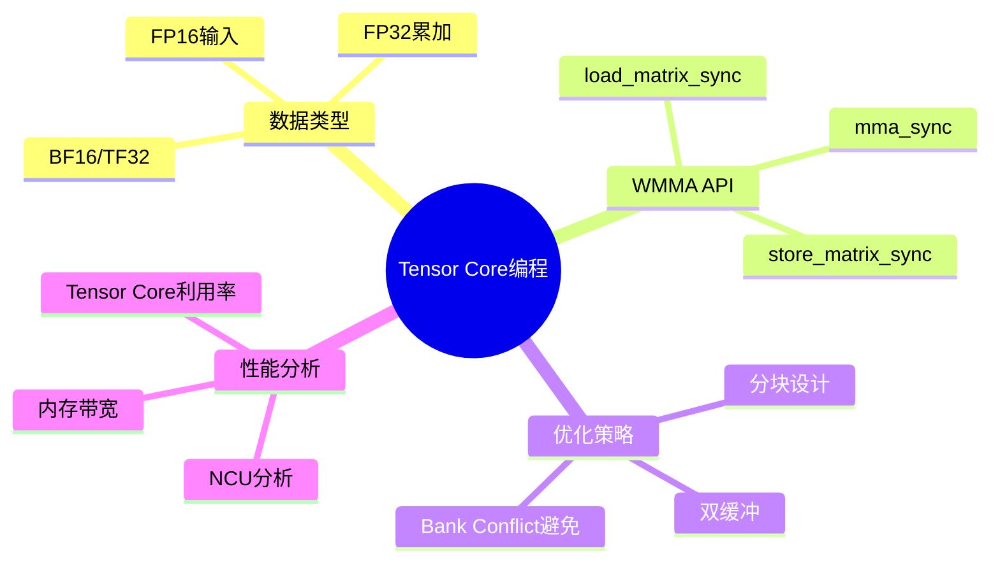

### 8.3 思考题

1. Tensor Core相比CUDA Core有什么优势？
2. 为什么混合精度需要FP32累加？
3. WMMA中Warp内线程如何协作？
4. 如何选择合适的矩阵分块尺寸？

---

## 下一章

[第二十章：卷积算子实现](./20_卷积算子实现.md) - 学习卷积操作的CUDA实现方法

---

*参考资料：*
- *[CUDA C++ Programming Guide - Tensor Cores](https://docs.nvidia.com/cuda/cuda-c-programming-guide/index.html#tensor-cores)*
- *[NVIDIA Tensor Core Documentation](https://docs.nvidia.com/cuda/cuda-c-programming-guide/index.html#wmma)*
- *[Mixed Precision Training](https://arxiv.org/abs/1710.03740)*
- *[CUTLASS: CUDA Templates for Linear Algebra](https://github.com/NVIDIA/cutlass)*