# 第二十章：卷积算子实现

> 学习目标：理解卷积操作的原理，掌握直接卷积和im2col等实现方法
>
> 预计阅读时间：60 分钟
>
> 前置知识：[第十七章：GEMM优化入门](./17_GEMM优化入门.md) | [第十八章：GEMM分块优化](./18_GEMM分块优化.md)

---

## 1. 卷积操作概述

### 1.1 什么是卷积？

**卷积（Convolution）** 是深度学习中最重要的操作之一，是卷积神经网络（CNN）的核心组件。

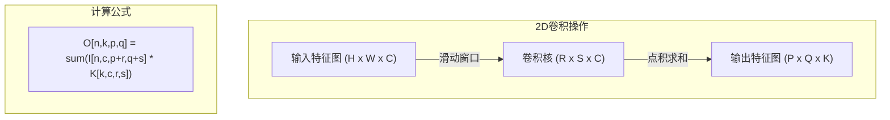

### 1.2 卷积参数说明

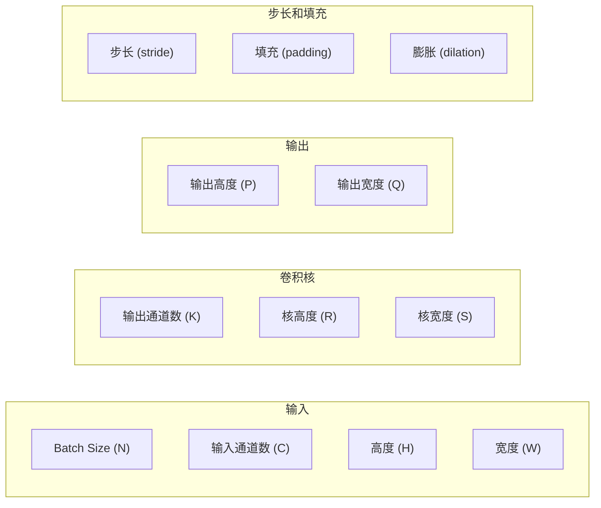

**输出尺寸计算**：
```
P = (H + 2*pad_h - dilation_h * (R - 1) - 1) / stride_h + 1
Q = (W + 2*pad_w - dilation_w * (S - 1) - 1) / stride_w + 1
```

### 1.3 卷积的计算特性

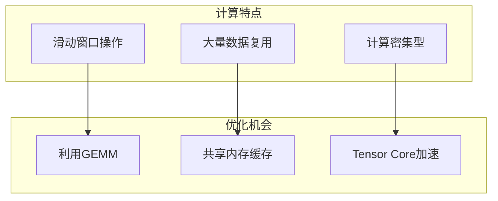

---

## 2. 直接卷积实现

### 2.1 直接卷积原理

直接卷积（Direct Convolution）按照卷积的数学定义直接实现，每个输出元素通过滑动窗口计算。

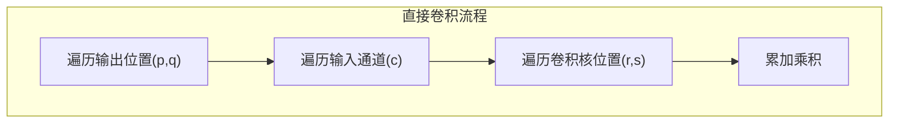

### 2.2 朴素直接卷积实现

```cpp
// 朴素直接卷积核函数
// 输入: (N, C, H, W), 卷积核: (K, C, R, S), 输出: (N, K, P, Q)
__global__ void naive_conv2d(
    const float* __restrict__ input,
    const float* __restrict__ weight,
    float* __restrict__ output,
    int N, int C, int H, int W,
    int K, int R, int S,
    int pad_h, int pad_w,
    int stride_h, int stride_w
) {
    // 计算输出位置
    int n = blockIdx.z;
    int k = blockIdx.y * blockDim.y + threadIdx.y;
    int pq = blockIdx.x * blockDim.x + threadIdx.x;

    int P = (H + 2 * pad_h - R) / stride_h + 1;
    int Q = (W + 2 * pad_w - S) / stride_w + 1;

    int p = pq / Q;
    int q = pq % Q;

    if (n < N && k < K && p < P && q < Q) {
        float sum = 0.0f;

        // 遍历输入通道和卷积核
        for (int c = 0; c < C; c++) {
            for (int r = 0; r < R; r++) {
                for (int s = 0; s < S; s++) {
                    // 计算输入位置
                    int h_in = p * stride_h - pad_h + r;
                    int w_in = q * stride_w - pad_w + s;

                    // 边界检查
                    if (h_in >= 0 && h_in < H && w_in >= 0 && w_in < W) {
                        int input_idx = n * C * H * W + c * H * W + h_in * W + w_in;
                        int weight_idx = k * C * R * S + c * R * S + r * S + s;
                        sum += input[input_idx] * weight[weight_idx];
                    }
                }
            }
        }

        int output_idx = n * K * P * Q + k * P * Q + p * Q + q;
        output[output_idx] = sum;
    }
}
```

### 2.3 直接卷积的问题

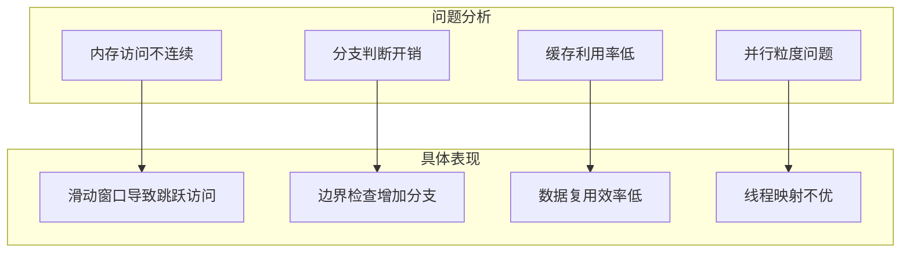

---

## 3. im2col转换方法

### 3.1 im2col原理

**im2col（Image to Column）** 将卷积转换为矩阵乘法，是深度学习框架中常用的卷积实现方法。

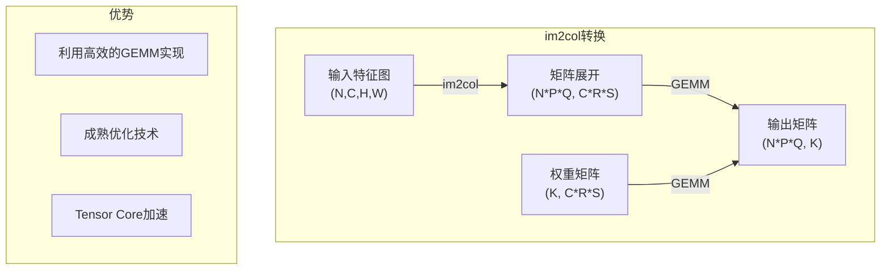

### 3.2 im2col可视化

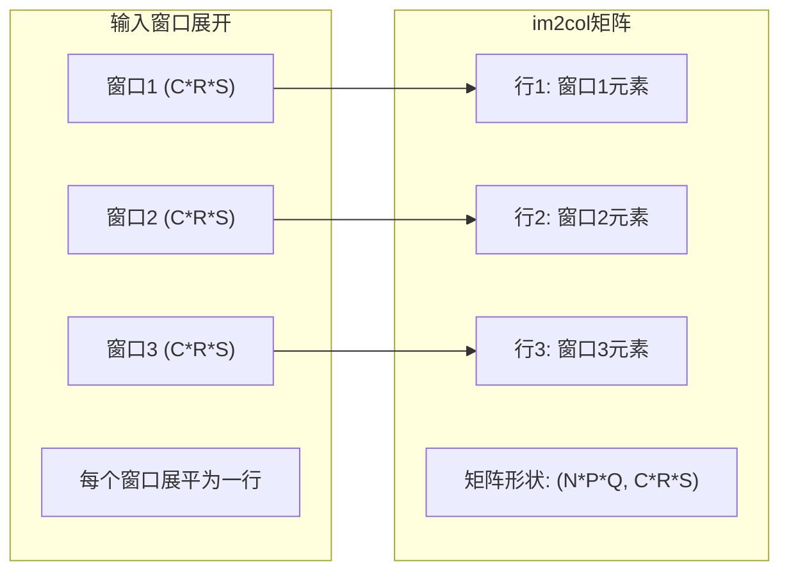

### 3.3 im2col实现

```cpp
// im2col核函数
__global__ void im2col_kernel(
    const float* __restrict__ input,
    float* __restrict__ col,
    int N, int C, int H, int W,
    int R, int S,
    int pad_h, int pad_w,
    int stride_h, int stride_w
) {
    int P = (H + 2 * pad_h - R) / stride_h + 1;
    int Q = (W + 2 * pad_w - S) / stride_w + 1;

    int idx = blockIdx.x * blockDim.x + threadIdx.x;
    int total = N * C * R * S * P * Q;

    if (idx < total) {
        // 解码索引
        int n = idx / (C * R * S * P * Q);
        int c = (idx / (R * S * P * Q)) % C;
        int r = (idx / (S * P * Q)) % R;
        int s = (idx / (P * Q)) % S;
        int p = (idx / Q) % P;
        int q = idx % Q;

        // 计算输入位置
        int h_in = p * stride_h - pad_h + r;
        int w_in = q * stride_w - pad_w + s;

        // 获取输入值
        float val = 0.0f;
        if (h_in >= 0 && h_in < H && w_in >= 0 && w_in < W) {
            val = input[n * C * H * W + c * H * W + h_in * W + w_in];
        }

        // 写入col矩阵
        int col_idx = n * P * Q * C * R * S + p * Q * C * R * S + q * C * R * S
                      + c * R * S + r * S + s;
        col[col_idx] = val;
    }
}

// im2col + GEMM 卷积
void im2col_conv2d(
    const float* d_input,
    const float* d_weight,
    float* d_output,
    float* d_col,
    int N, int C, int H, int W,
    int K, int R, int S,
    int pad_h, int pad_w,
    int stride_h, int stride_w
) {
    int P = (H + 2 * pad_h - R) / stride_h + 1;
    int Q = (W + 2 * pad_w - S) / stride_w + 1;

    // Step 1: im2col转换
    int col_size = N * P * Q * C * R * S;
    int threads = 256;
    int blocks = (col_size + threads - 1) / threads;
    im2col_kernel<<<blocks, threads>>>(
        d_input, d_col, N, C, H, W, R, S, pad_h, pad_w, stride_h, stride_w
    );

    // Step 2: GEMM计算
    // col: (N*P*Q, C*R*S)
    // weight: (K, C*R*S)^T
    // output: (N*P*Q, K)
    float alpha = 1.0f, beta = 0.0f;
    cublasSgemm(
        handle,
        CUBLAS_OP_T,    // weight转置
        CUBLAS_OP_N,    // col不转置
        K, N * P * Q, C * R * S,
        &alpha,
        d_weight, C * R * S,
        d_col, C * R * S,
        &beta,
        d_output, K
    );
}
```

### 3.4 im2col的优缺点

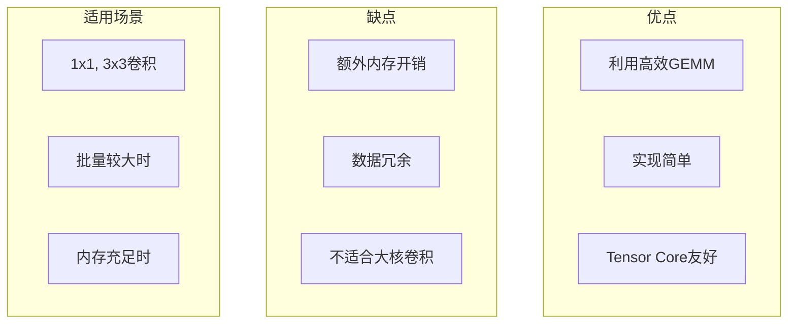

---

## 4. 共享内存优化

### 4.1 共享内存卷积思路

利用共享内存缓存输入数据，减少全局内存访问：

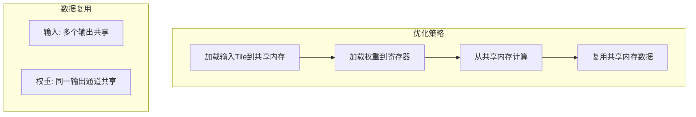

### 4.2 共享内存卷积实现

```cpp
#define TILE_SIZE 16
#define FILTER_SIZE 3
#define PADDING 1
#define STRIDE 1

// 共享内存优化的卷积核
__global__ void smem_conv2d(
    const float* __restrict__ input,
    const float* __restrict__ weight,
    float* __restrict__ output,
    int N, int C, int H, int W,
    int K, int R, int S,
    int pad_h, int pad_w,
    int stride_h, int stride_w
) {
    // 共享内存Tile（包含halo区域）
    __shared__ float s_input[TILE_SIZE + FILTER_SIZE - 1][TILE_SIZE + FILTER_SIZE - 1];

    int P = (H + 2 * pad_h - R) / stride_h + 1;
    int Q = (W + 2 * pad_w - S) / stride_w + 1;

    int n = blockIdx.z;
    int k = blockIdx.y;
    int p = blockIdx.x / (Q / TILE_SIZE + 1) * TILE_SIZE + threadIdx.y;
    int q = (blockIdx.x % (Q / TILE_SIZE + 1)) * TILE_SIZE + threadIdx.x;

    // 加载输入到共享内存（包含halo区域）
    for (int c = 0; c < C; c++) {
        // 计算输入位置
        int h_in = p * stride_h - pad_h;
        int w_in = q * stride_w - pad_w;

        // 加载Tile（包含halo）
        for (int i = threadIdx.y; i < TILE_SIZE + R - 1; i += TILE_SIZE) {
            for (int j = threadIdx.x; j < TILE_SIZE + S - 1; j += TILE_SIZE) {
                int hi = h_in + i;
                int wi = w_in + j;
                float val = 0.0f;
                if (hi >= 0 && hi < H && wi >= 0 && wi < W) {
                    val = input[n * C * H * W + c * H * W + hi * W + wi];
                }
                s_input[i][j] = val;
            }
        }

        __syncthreads();

        // 计算卷积
        if (p < P && q < Q) {
            float sum = 0.0f;
            for (int r = 0; r < R; r++) {
                for (int s = 0; s < S; s++) {
                    int si = threadIdx.y * stride_h + r;
                    int sj = threadIdx.x * stride_w + s;
                    float in_val = s_input[si][sj];
                    float w_val = weight[k * C * R * S + c * R * S + r * S + s];
                    sum += in_val * w_val;
                }
            }

            // 原子累加到输出（多个输入通道）
            if (c == 0) {
                output[n * K * P * Q + k * P * Q + p * Q + q] = sum;
            } else {
                output[n * K * P * Q + k * P * Q + p * Q + q] += sum;
            }
        }

        __syncthreads();
    }
}
```

### 4.3 Halo区域处理

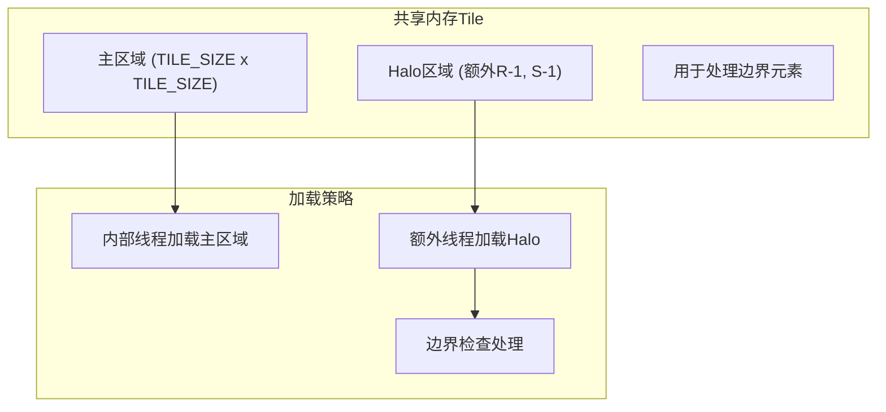

---

## 5. 卷积性能优化

### 5.1 优化技术总结

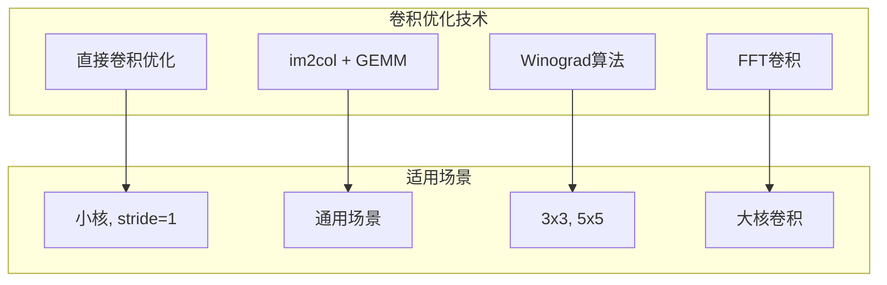

### 5.2 性能对比

| 实现方式 | 内存开销 | 计算效率 | 适用场景 |
|----------|----------|----------|----------|
| 朴素直接卷积 | 低 | 低 | 理解原理 |
| im2col + GEMM | 高 | 高 | 通用场景 |
| 共享内存卷积 | 中 | 中 | 小核卷积 |
| Winograd | 低 | 最高 | 3x3, stride=1 |

### 5.3 NCU分析卷积

```bash
# 分析卷积内核
ncu --set full -o conv_report ./smem_conv

# 关键指标
ncu --metrics smsp__cycles_active.avg.pct_of_peak,\
    smsp__sass_thread_inst_executed_op_fadd_pred_on.sum,\
    smsp__sass_thread_inst_executed_op_fmul_pred_on.sum,\
    l1tex__t_sectors_pipe_lsu_mem_global_op_ld.sum \
    ./smem_conv
```

---

## 6. Winograd算法简介

### 6.1 Winograd原理

Winograd算法通过代数变换减少乘法次数：

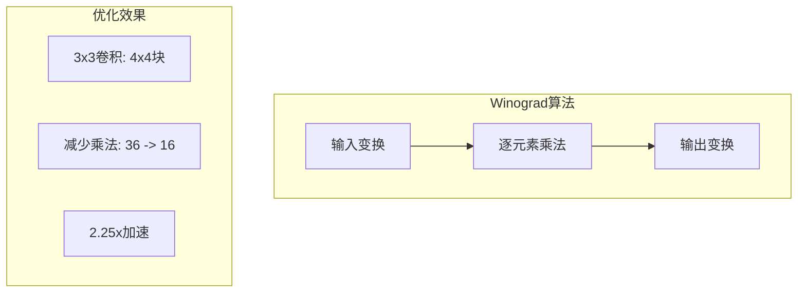

### 6.2 Winograd F(2x2, 3x3)公式

```
输入变换:
d = [d0, d1, d2, d3, d4, d5, d6]^T
g = [g0, g1, g2, g3, g4, g5, g6, g7, g8]^T (卷积核)

变换矩阵:
B^T = [[1, 0, -1, 0],
       [0, 1, 1, 0],
       [0, -1, 1, 0],
       [0, 1, 0, -1]]

G = [[1, 0, 0],
     [1/2, 1/2, 1/2],
     [1/2, -1/2, 1/2],
     [0, 0, 1]]

输出: Y = A^T [(Gg) * (B^T dB)] A
```

---

## 7. 本章小结

### 7.1 关键概念

| 概念 | 描述 |
|------|------|
| 直接卷积 | 按定义直接实现滑动窗口计算 |
| im2col | 将卷积转换为矩阵乘法 |
| 共享内存优化 | 缓存输入数据减少全局内存访问 |
| Winograd | 通过代数变换减少乘法次数 |

### 7.2 实现选择指南

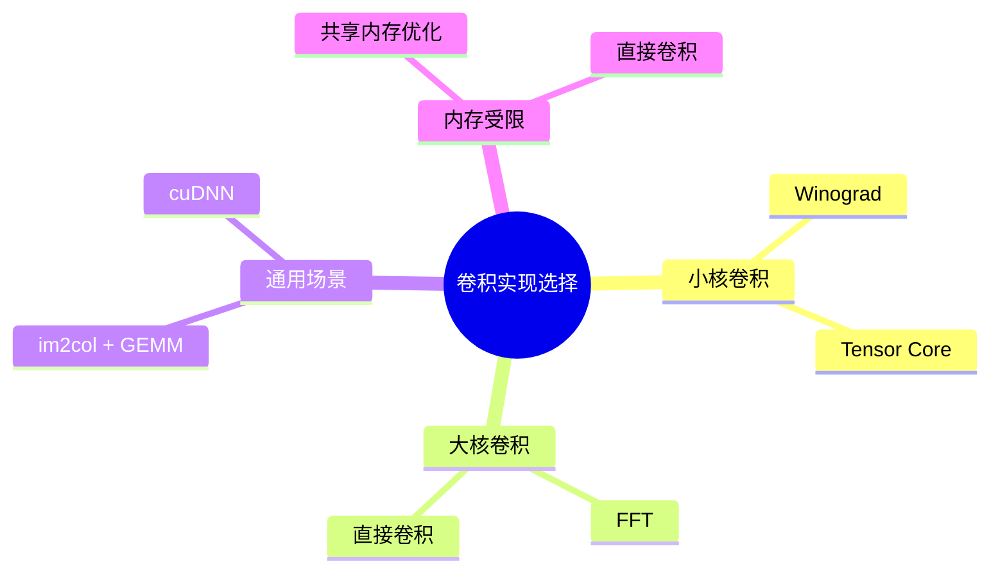

### 7.3 思考题

1. im2col的内存开销如何计算？何时会成为瓶颈？
2. 共享内存卷积如何处理Halo区域？
3. 为什么Winograd算法能减少乘法次数？
4. 实际应用中如何选择合适的卷积实现？

---

*参考资料：*
- *[cuDNN Developer Guide](https://docs.nvidia.com/deeplearning/cudnn/developer-guide/index.html)*
- *[Fast Algorithms for Convolutional Neural Networks](https://arxiv.org/abs/1509.09308)*
- *[CUDA C++ Programming Guide - Shared Memory](https://docs.nvidia.com/cuda/cuda-c-programming-guide/index.html#shared-memory)*