# 第二十一章：异步执行与延迟隐藏

> 学习目标：理解异步执行原理，掌握延迟隐藏技术，学会使用双缓冲、软件流水线和异步拷贝优化内核性能
>
> 预计阅读时间：90 分钟
>
> 前置知识：[第十三章：共享内存深入](./13_共享内存深入.md) | [第十七章：GEMM优化入门](./17_GEMM优化入门.md)

---

## 1. 延迟问题分析

### 1.1 什么是延迟瓶颈？

在前面的GEMM优化中，我们发现即使进行了充分的优化，性能仍然受到延迟限制：

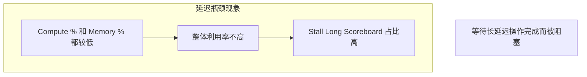

**NCU性能分析中的关键指标**：
- `Stall Long Scoreboard`：等待长延迟操作（如全局内存访问）
- `Compute %`：计算单元利用率
- `Memory %`：内存单元利用率


*GPU内存层次结构：不同层级的延迟差异显著，全局内存访问延迟可达数百个时钟周期*

根据CUDA官方编程指南，GPU内存层次结构展示了从寄存器到全局内存的完整存储层级。每一层都有不同的延迟、带宽和容量特性，理解这些差异对于优化延迟隐藏策略至关重要。

### 1.2 延迟的来源

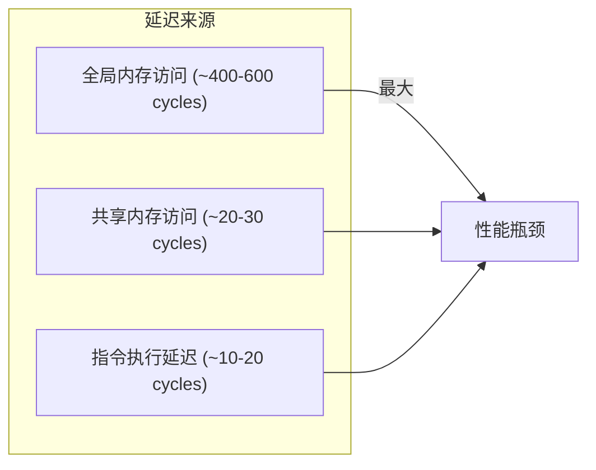

**延迟 vs 带宽**：
| 概念 | 定义 | 影响 |
|------|------|------|
| 延迟 | 操作从发起到完成的时间 | 线程等待时间 |
| 带宽 | 单位时间处理的数据量 | 吞吐量上限 |

**各存储层级延迟对比**：
| 存储类型 | 延迟（周期） | 带宽 | 容量 |
|----------|-------------|------|------|
| 寄存器 | ~1 | 最高 | 最小 |
| 共享内存 | ~20-30 | 高 | 48KB-227KB/SM |
| L1 Cache | ~30-50 | 高 | 128KB/SM |
| L2 Cache | ~100-200 | 中 | 6-50MB |
| 全局内存 | ~400-600 | 低 | GB级 |

### 1.3 延迟隐藏的核心思想

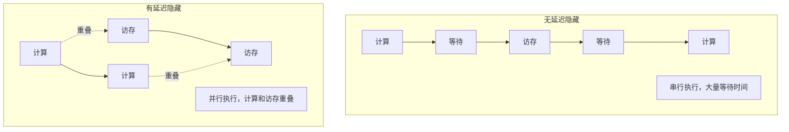

**延迟隐藏的本质**：通过让其他有用的工作来"填充"等待时间

**延迟隐藏的三种主要策略**：

1. **线程级并行（TLP）**：增加线程数量，让多个线程交错执行
2. **指令级并行（ILP）**：单线程内多条指令重叠执行
3. **存算重叠**：计算与访存操作并行执行

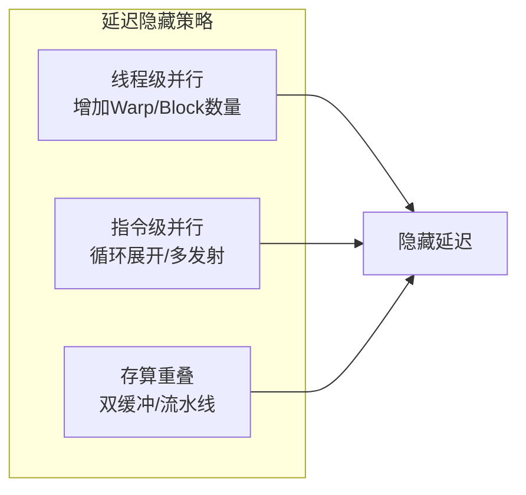

### 1.4 Kernel Launch延迟与Preamble重叠

除了内存访问延迟外，Kernel启动本身也存在延迟。根据CUDA官方编程指南，几乎所有核函数都有一个**Preamble**阶段，在此期间执行诸如清零缓冲区或加载常量值等任务。


*GPU活动时间线：展示kernel执行的时序关系*

上图展示了典型的GPU活动时间线，其中`secondary_kernel`在`primary_kernel`完成执行后才启动。这种串行执行通常是因为`secondary_kernel`依赖于`primary_kernel`产生的结果数据。

然而，即使存在依赖关系，仍有一些并发执行的潜力。官方文档指出，几乎所有的核函数都有某种**Preamble**部分：


*二级核函数的Preamble部分：可以在不影响应用的情况下并发执行*

Preamble部分的特殊之处在于：
- 它不依赖于前一个核函数的输出数据
- 通常执行初始化工作（如清零缓冲区、加载常量）
- 可以与前一个核函数的执行重叠

通过**Programmatic Dependent Launch**（可编程依赖启动，需要Compute Capability 9.0+），可以实现这种重叠执行：


*primary_kernel和secondary_kernel的并发执行：通过Programmatic Dependent Launch实现*

**关键优势**：
1. **隐藏启动延迟**：`secondary_kernel`的启动延迟可以被`primary_kernel`的执行隐藏
2. **利用Preamble**：Preamble部分可以与前一个核函数的尾部重叠
3. **提高整体吞吐量**：减少GPU空闲时间

**Programmatic Dependent Launch API**（Compute Capability 9.0+）：
```cpp
// 主核函数中触发二级核函数启动
cudaTriggerProgrammaticLaunchCompletion();

// 二级核函数使用扩展启动API
cudaLaunchKernelExC(&config, secondary_kernel, args...);
```

---

## 2. 双缓冲技术

### 2.1 双缓冲原理

**双缓冲（Double Buffering）** 使用两个相同的缓冲区，实现计算和访存的重叠：

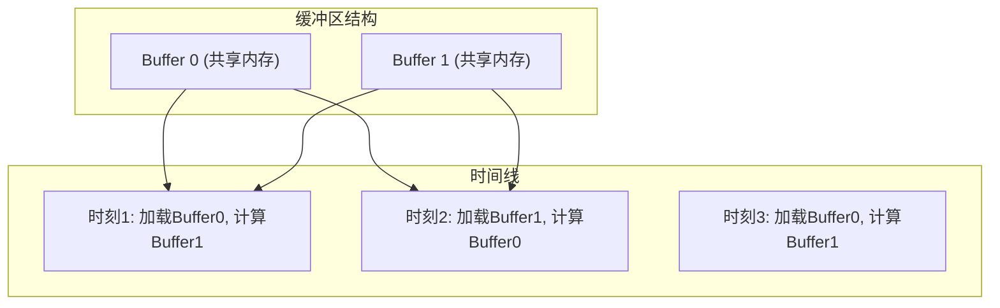

### 2.2 基本双缓冲实现

```cpp
#define BLOCK_SIZE 32
#define TILE_SIZE 16

// 双缓冲GEMM核函数
__global__ void double_buffer_gemm(
    float* A, float* B, float* C,
    int M, int N, int K
) {
    // 双缓冲：两个共享内存块
    __shared__ float As[2][TILE_SIZE][TILE_SIZE];
    __shared__ float Bs[2][TILE_SIZE][TILE_SIZE];

    int tx = threadIdx.x;
    int ty = threadIdx.y;
    int row = blockIdx.y * TILE_SIZE + ty;
    int col = blockIdx.x * TILE_SIZE + tx;

    float sum = 0.0f;
    int num_tiles = (K + TILE_SIZE - 1) / TILE_SIZE;

    // 预加载第一个Tile到Buffer 0
    int load_idx = 0;
    int a_col = load_idx * TILE_SIZE + tx;
    int b_row = load_idx * TILE_SIZE + ty;

    if (row < M && a_col < K)
        As[0][ty][tx] = A[row * K + a_col];
    else
        As[0][ty][tx] = 0.0f;

    if (b_row < K && col < N)
        Bs[0][ty][tx] = B[b_row * N + col];
    else
        Bs[0][ty][tx] = 0.0f;

    __syncthreads();

    // 主循环：交替使用两个缓冲区
    for (int t = 0; t < num_tiles; t++) {
        int compute_buf = t % 2;      // 当前计算使用的缓冲区
        int load_buf = (t + 1) % 2;   // 下一个要加载的缓冲区

        // 预加载下一个Tile（如果存在）
        if (t + 1 < num_tiles) {
            a_col = (t + 1) * TILE_SIZE + tx;
            b_row = (t + 1) * TILE_SIZE + ty;

            if (row < M && a_col < K)
                As[load_buf][ty][tx] = A[row * K + a_col];
            else
                As[load_buf][ty][tx] = 0.0f;

            if (b_row < K && col < N)
                Bs[load_buf][ty][tx] = B[b_row * N + col];
            else
                Bs[load_buf][ty][tx] = 0.0f;
        }

        // 计算当前Tile
        for (int k = 0; k < TILE_SIZE; k++) {
            sum += As[compute_buf][ty][k] * Bs[compute_buf][k][tx];
        }

        __syncthreads();
    }

    if (row < M && col < N) {
        C[row * N + col] = sum;
    }
}
```

### 2.3 双缓冲执行流程

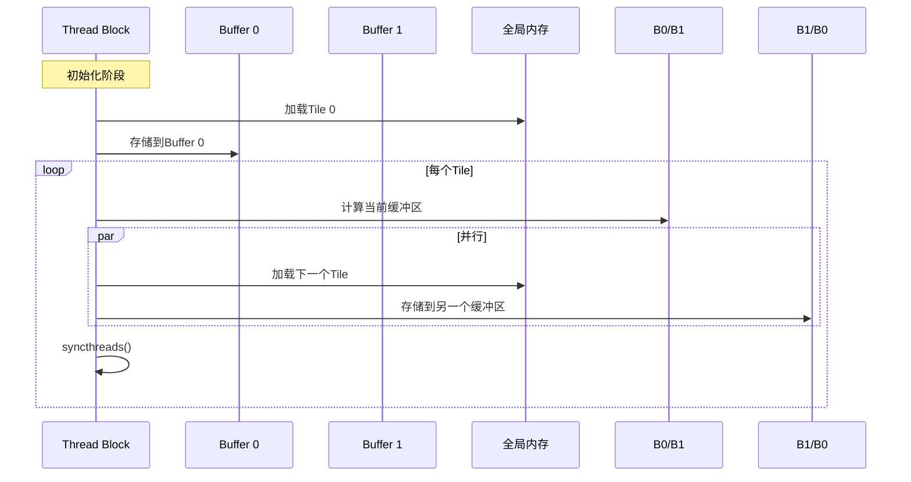

### 2.4 双缓冲的性能收益

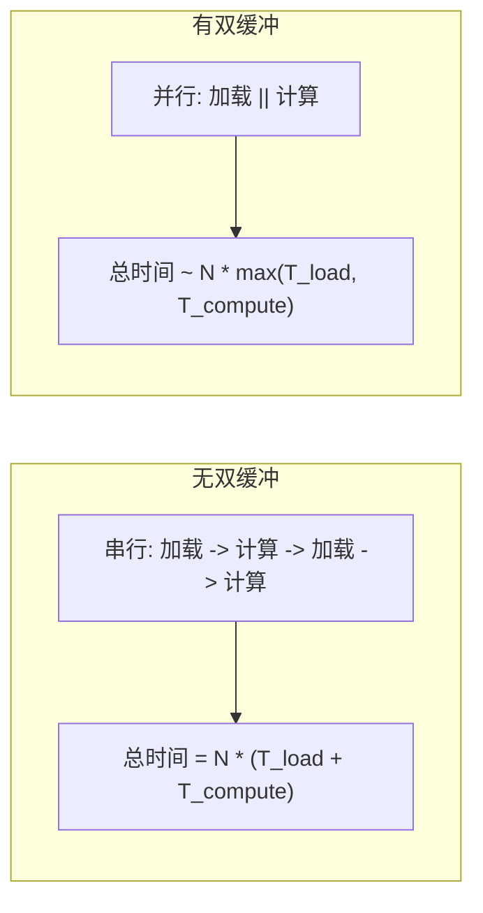

**性能提升条件**：
- T_load 和 T_compute 相近时效果最好
- 需要足够的共享内存空间（双倍）
- 需要适当的同步机制

**双缓冲的代价**：
| 代价 | 说明 |
|------|------|
| 共享内存 | 需要双倍缓冲区空间 |
| 寄存器压力 | 可能需要更多寄存器存储中间结果 |
| 代码复杂度 | 需要管理缓冲区切换逻辑 |

---

## 3. 软件流水线

### 3.1 流水线概念

**软件流水线（Software Pipeline）** 是N级流水线的一种，将任务分成多个阶段并行执行：

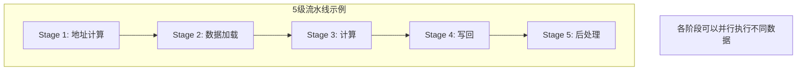

### 3.2 Warp特化

**Warp特化（Warp Specialization）** 让不同的Warp执行不同的任务：

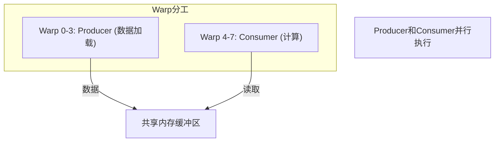

```cpp
// Warp特化示例
__global__ void warp_specialization_kernel(float* data, int n) {
    __shared__ float buffer[BLOCK_SIZE];
    __shared__ volatile int ready;  // 同步标志

    int warp_id = threadIdx.x / 32;
    int lane_id = threadIdx.x % 32;

    if (warp_id < 4) {
        // Producer Warps: 负责加载数据
        for (int i = 0; i < n; i += BLOCK_SIZE) {
            int idx = i + threadIdx.x;
            if (idx < n) {
                buffer[threadIdx.x] = data[idx];
            }
            __syncthreads();
            ready = 1;  // 通知Consumer数据就绪
            while (ready == 1);  // 等待Consumer消费完成
        }
    } else {
        // Consumer Warps: 负责计算
        for (int i = 0; i < n; i += BLOCK_SIZE) {
            while (ready == 0);  // 等待Producer生产完成
            // 计算逻辑...
            __syncthreads();
            ready = 0;  // 通知Producer可以加载下一批
        }
    }
}
```

### 3.3 流水线调度

```mermaid
gantt
    title 软件流水线执行时间线
    dateFormat X
    axisFormat %s

    section Stage 1 (Load)
    Tile 0    :0, 1
    Tile 1    :1, 2
    Tile 2    :2, 3
    Tile 3    :3, 4

    section Stage 2 (Compute)
    Tile 0    :1, 2
    Tile 1    :2, 3
    Tile 2    :3, 4
    Tile 3    :4, 5

    section Stage 3 (Store)
    Tile 0    :2, 3
    Tile 1    :3, 4
    Tile 2    :4, 5
    Tile 3    :5, 6
```

---

## 4. 异步数据拷贝

### 4.1 同步 vs 异步拷贝

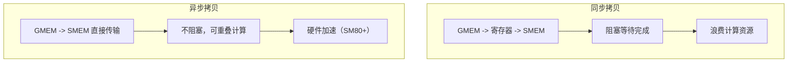

根据CUDA官方编程指南，CUDA 11引入了异步数据操作，通过`memcpy_async` API允许设备代码显式管理数据的异步拷贝。`memcpy_async`功能使CUDA内核能够将计算与数据移动重叠。

**Copy and Compute模式**是CUDA应用程序常用的模式：
1. 从全局内存获取数据
2. 将数据存储到共享内存
3. 对共享内存数据执行计算
4. 将结果写回全局内存

**传统方式**（无`memcpy_async`）：
- 全局内存到共享内存的拷贝被展开为：全局内存读入寄存器 → 寄存器写入共享内存
- 需要在每个批次之间同步，确保所有写入完成
- 无法重叠计算与数据移动

**异步方式**（使用`memcpy_async`）：
- 直接从全局内存拷贝到共享内存，不经过寄存器
- 可以与计算重叠执行
- 在Compute Capability 8.0+上可获得硬件加速

### 4.2 memcpy_async API

CUDA 11.0引入了异步拷贝API：

```cpp
#include <cooperative_groups.h>
#include <cooperative_groups/memcpy_async.h>

namespace cg = cooperative_groups;

__global__ void memcpy_async_example(float* global_in, float* global_out, int n) {
    cg::thread_block block = cg::this_thread_block();
    __shared__ float shared_data[256];

    // 异步拷贝：直接从全局内存到共享内存
    cg::memcpy_async(block, shared_data, global_in, sizeof(float) * 256);

    // 等待拷贝完成
    cg::wait(block);

    // 计算逻辑...
    for (int i = 0; i < 256; i++) {
        shared_data[i] *= 2.0f;
    }

    // 同步后写回
    cg::sync(block);
    memcpy(global_out, shared_data, sizeof(float) * 256);
}
```

### 4.3 cuda::barrier 同步机制详解

`cuda::barrier` 是CUDA 11.0引入的现代C++风格的屏障同步机制，提供了更灵活的同步能力：

```cpp
#include <cuda/barrier>

// cuda::barrier 完整使用示例
__global__ void barrier_complete_example(float* global_in, float* global_out, int n) {
    // 定义屏障，指定作用域为线程块
    __shared__ cuda::barrier<cuda::thread_scope_block> barrier;

    __shared__ float smem[256];

    // 初始化barrier（只需要一个线程执行）
    if (threadIdx.x == 0) {
        // 参数：预期的到达线程数
        init(&barrier, blockDim.x);
    }
    __syncthreads();

    // 使用barrier进行异步拷贝同步
    // 注意：这里使用cuda::memcpy_async配合barrier
    cuda::memcpy_async(block, smem, global_in, sizeof(float) * 256, barrier);

    // 等待拷贝完成
    barrier.arrive_and_wait();

    // 计算阶段...
    if (threadIdx.x < 256) {
        smem[threadIdx.x] *= 2.0f;
    }

    // 再次同步
    barrier.arrive_and_wait();

    // 写回结果
    if (threadIdx.x < 256) {
        global_out[threadIdx.x] = smem[threadIdx.x];
    }
}
```

**cuda::barrier 核心方法**：

| 方法 | 描述 | 使用场景 |
|------|------|----------|
| `init(&barrier, count)` | 初始化屏障，设置预期到达数量 | 必须在使用前调用 |
| `arrive()` | 到达屏障，不等待 | 用于提前释放 |
| `arrive_and_wait()` | 到达并等待所有线程 | 标准同步点 |
| `arrive_and_drop()` | 到达后从屏障中移除 | 动态减少参与者 |

**cuda::barrier 与 __syncthreads() 的对比**：

```cpp
// 传统同步方式
__global__ void traditional_sync(float* data, int n) {
    __shared__ float smem[256];

    // 同步加载
    if (threadIdx.x < 256) {
        smem[threadIdx.x] = data[threadIdx.x];
    }
    __syncthreads();  // 所有线程必须参与

    // 计算...
}

// 使用barrier的异步版本
__global__ void barrier_sync(float* data, int n) {
    __shared__ cuda::barrier<cuda::thread_scope_block> barrier;
    __shared__ float smem[256];

    if (threadIdx.x == 0) {
        init(&barrier, blockDim.x);
    }
    __syncthreads();

    // 异步加载，barrier会跟踪完成状态
    cuda::memcpy_async(block, smem, data, sizeof(float) * 256, barrier);

    // 可以在这里做其他工作...

    barrier.arrive_and_wait();  // 等待拷贝完成

    // 计算...
}
```

**barrier的作用域（thread_scope）**：

| 作用域 | 描述 | 适用场景 |
|--------|------|----------|
| `thread_scope_block` | 线程块内同步 | 最常用，块内协作 |
| `thread_scope_device` | 设备内同步 | 跨块协作（需要grid sync） |
| `thread_scope_system` | 系统内同步 | CPU-GPU协作 |

---

## 5. CUDA Pipeline

### 5.1 Pipeline API概述

CUDA提供了`cuda::pipeline`同步对象来管理和重叠异步数据移动与计算。根据CUDA官方编程指南，pipeline对象是一个双端N阶段队列，具有头部和尾部，用于按先进先出（FIFO）顺序处理工作。

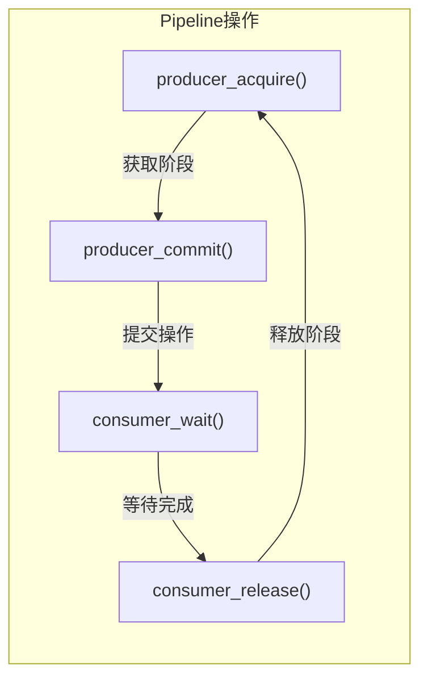

**Pipeline核心成员函数**（官方文档定义）：

| Pipeline类成员函数 | 描述 |
|-------------------|------|
| `producer_acquire` | 获取pipeline内部队列中的可用阶段 |
| `producer_commit` | 提交在当前获取的阶段上，`producer_acquire`调用后发起的异步操作 |
| `consumer_wait` | 等待pipeline最老阶段上的所有异步操作完成 |
| `consumer_release` | 释放pipeline最老阶段供pipeline对象重用。释放的阶段可被生产者获取 |

### 5.2 单阶段Pipeline

```cpp
#include <cuda/pipeline>

__global__ void single_stage_pipeline(
    float* global_in, float* global_out, size_t size, size_t batch_sz
) {
    cg::thread_block block = cg::this_thread_block();
    __shared__ float shared[256];

    // Pipeline共享状态
    __shared__ cuda::pipeline_shared_state<
        cuda::thread_scope_thread, 1  // 单阶段
    > shared_state;
    auto pipeline = cuda::make_pipeline(block, &shared_state);

    for (size_t batch = 0; batch < size; batch += batch_sz) {
        size_t batch_idx = batch + threadIdx.x;
        if (batch_idx >= size) break;

        // Producer: 获取并提交
        pipeline.producer_acquire();
        cuda::memcpy_async(block, shared, global_in + batch_idx,
                          sizeof(float) * block.size(), pipeline);
        pipeline.producer_commit();

        // Consumer: 等待并处理
        pipeline.consumer_wait();

        // 计算逻辑
        shared[threadIdx.x] *= 2.0f;

        pipeline.consumer_release();

        // 写回结果
        global_out[batch_idx] = shared[threadIdx.x];
    }
}
```

### 5.3 多阶段Pipeline

```cpp
__global__ void multi_stage_pipeline(
    float* global_in, float* global_out, size_t size, size_t batch_sz
) {
    cg::thread_block block = cg::this_thread_block();

    // 双缓冲
    __shared__ float shared[2][256];

    // 双阶段Pipeline
    __shared__ cuda::pipeline_shared_state<
        cuda::thread_scope_thread, 2  // 两个阶段
    > shared_state;
    auto pipeline = cuda::make_pipeline(block, &shared_state);

    // 初始化：加载第一个batch到Stage 0
    pipeline.producer_acquire();
    cuda::memcpy_async(block, shared[0], global_in,
                       sizeof(float) * block.size(), pipeline);
    pipeline.producer_commit();

    size_t compute_stage = 0;

    for (size_t batch = batch_sz; batch < size; batch += batch_sz) {
        size_t copy_stage = 1 - compute_stage;

        // 提交下一个batch的拷贝
        pipeline.producer_acquire();
        cuda::memcpy_async(block, shared[copy_stage], global_in + batch,
                          sizeof(float) * block.size(), pipeline);
        pipeline.producer_commit();

        // 等待当前计算阶段的数据
        pipeline.consumer_wait();

        // 计算（与下一次拷贝重叠）
        shared[compute_stage][threadIdx.x] *= 2.0f;

        pipeline.consumer_release();

        // 写回结果
        global_out[batch - batch_sz] = shared[compute_stage][threadIdx.x];

        // 切换阶段
        compute_stage = copy_stage;
    }

    // 处理最后一个batch
    pipeline.consumer_wait();
    shared[compute_stage][threadIdx.x] *= 2.0f;
    pipeline.consumer_release();
    global_out[size - batch_sz + threadIdx.x] = shared[compute_stage][threadIdx.x];
}
```

### 5.4 Pipeline阶段数选择指南

选择合适的Pipeline阶段数是优化性能的关键：

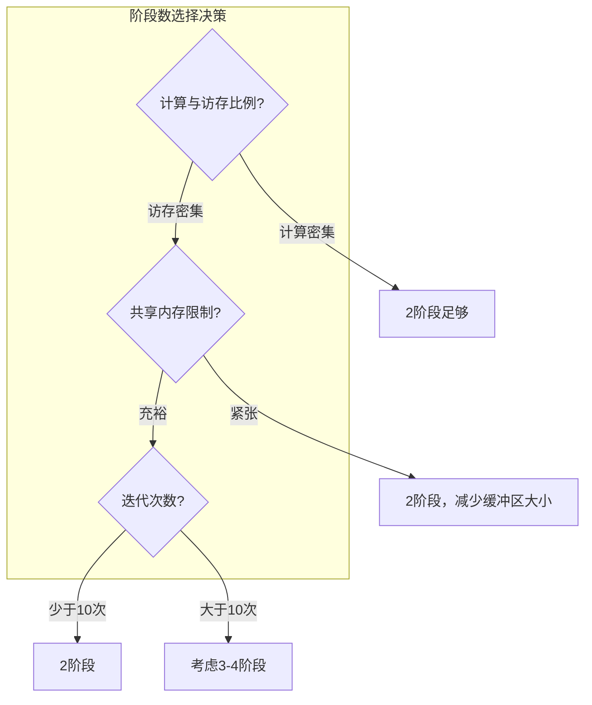

**阶段数选择的具体指导**：

| 场景 | 推荐阶段数 | 原因 |
|------|-----------|------|
| 计算/访存比例约1:1 | 2 | 双缓冲足够实现重叠 |
| 访存延迟远大于计算时间 | 3-4 | 更多阶段可更好隐藏延迟 |
| 共享内存受限 | 2 | 避免内存溢出 |
| 迭代次数少（<10） | 2 | 避免流水线填充开销占比过大 |
| 迭代次数多（>100） | 3-4 | 流水线效率更高 |

**阶段数与性能的关系**：

```cpp
// 计算理论加速比
// 假设：T_load = 100 cycles, T_compute = 80 cycles

// 无流水线：总时间 = N * (T_load + T_compute) = N * 180
// 2阶段流水线：总时间 = T_load + N * max(T_load, T_compute) + T_compute
//             = 100 + N * 100 + 80 = N * 100 + 180
// 加速比 ≈ 180 / 100 = 1.8x

// 3阶段流水线（假设T_load > T_compute > T_store）：
// 如果 T_load > T_compute > T_store
// 总时间 ≈ T_load + T_compute + N * max(T_load, T_compute, T_store) + ...
```

**实际代码示例 - 动态选择阶段数**：

```cpp
template<int STAGES>
__global__ void configurable_pipeline_gemm(
    const float* __restrict__ A,
    const float* __restrict__ B,
    float* __restrict__ C,
    int M, int N, int K
) {
    __shared__ float As[STAGES][TILE_SIZE][TILE_SIZE];
    __shared__ float Bs[STAGES][TILE_SIZE][TILE_SIZE];

    __shared__ cuda::pipeline_shared_state<
        cuda::thread_scope_thread, STAGES
    > pipeline_state;
    auto pipeline = cuda::make_pipeline(cg::this_thread_block(), &pipeline_state);

    // ... 实现细节 ...
}

// 根据问题规模选择阶段数
void launch_gemm(float* A, float* B, float* C, int M, int N, int K) {
    int num_tiles = (K + TILE_SIZE - 1) / TILE_SIZE;

    if (num_tiles < 10) {
        // 少量迭代，使用2阶段
        configurable_pipeline_gemm<2><<<grid, block>>>(A, B, C, M, N, K);
    } else if (shared_memory_available() > 2 * TILE_SIZE * TILE_SIZE * sizeof(float) * 3) {
        // 内存充裕且迭代多，使用3阶段
        configurable_pipeline_gemm<3><<<grid, block>>>(A, B, C, M, N, K);
    } else {
        // 默认使用2阶段
        configurable_pipeline_gemm<2><<<grid, block>>>(A, B, C, M, N, K);
    }
}
```

### 5.5 Pipeline执行流程

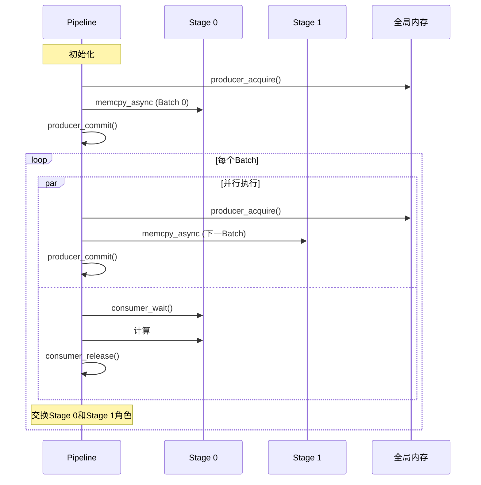

---

## 6. Pipeline Primitives

### 6.1 C风格接口

对于需要更底层控制的场景，CUDA提供了Pipeline Primitives：

```cpp
#include <cuda_pipeline.h>

__global__ void pipeline_primitives_example(
    float* global_in, float* global_out, int n
) {
    __shared__ float smem[2][256];

    int stage = 0;

    // 初始加载
    __pipeline_memcpy_async(
        smem[stage] + threadIdx.x,
        global_in + threadIdx.x,
        sizeof(float)
    );
    __pipeline_commit();

    for (int i = 0; i < n - 256; i += 256) {
        int next_stage = 1 - stage;

        // 提交下一批的异步拷贝
        __pipeline_memcpy_async(
            smem[next_stage] + threadIdx.x,
            global_in + i + 256 + threadIdx.x,
            sizeof(float)
        );
        __pipeline_commit();

        // 等待当前批次的拷贝完成
        __pipeline_wait_prior(0);

        // 计算
        smem[stage][threadIdx.x] *= 2.0f;

        // 写回
        global_out[i + threadIdx.x] = smem[stage][threadIdx.x];

        stage = next_stage;
    }

    // 处理最后一批
    __pipeline_wait_prior(0);
    smem[stage][threadIdx.x] *= 2.0f;
    global_out[n - 256 + threadIdx.x] = smem[stage][threadIdx.x];
}
```

### 6.2 Pipeline Primitives API

| 函数 | 描述 |
|------|------|
| `__pipeline_memcpy_async(dst, src, size)` | 异步内存拷贝 |
| `__pipeline_commit()` | 提交当前批次的异步操作 |
| `__pipeline_wait_prior(N)` | 等待倒数第N+1批次完成 |
| `__pipeline_arrive_on(barrier)` | 在barrier上到达 |

### 6.3 cuda::memcpy_async 与 __pipeline_memcpy_async 对比

两种API各有优劣，选择时需考虑使用场景：

```cpp
// ========== 方式1: C++风格的 cuda::memcpy_async ==========
#include <cooperative_groups.h>
#include <cooperative_groups/memcpy_async.h>
#include <cuda/pipeline>

namespace cg = cooperative_groups;

__global__ void cpp_style_memcpy_async(
    const float* __restrict__ input,
    float* __restrict__ output,
    int n, int batch_size
) {
    cg::thread_block block = cg::this_thread_block();
    __shared__ float smem[2][256];

    __shared__ cuda::pipeline_shared_state<cuda::thread_scope_block, 2> state;
    auto pipeline = cuda::make_pipeline(block, &state);

    int stage = 0;

    // 使用cuda::memcpy_async
    pipeline.producer_acquire();
    cuda::memcpy_async(block, smem[stage], input,
                       cuda::aligned_size_t<128>(batch_size * sizeof(float)),
                       pipeline);
    pipeline.producer_commit();

    for (int batch = 0; batch < n / batch_size - 1; batch++) {
        int next_stage = 1 - stage;

        pipeline.producer_acquire();
        cuda::memcpy_async(block, smem[next_stage],
                           input + (batch + 1) * batch_size,
                           cuda::aligned_size_t<128>(batch_size * sizeof(float)),
                           pipeline);
        pipeline.producer_commit();

        pipeline.consumer_wait();

        // 计算
        for (int i = threadIdx.x; i < batch_size; i += blockDim.x) {
            output[batch * batch_size + i] = smem[stage][i] * 2.0f;
        }

        pipeline.consumer_release();
        stage = next_stage;
    }

    // 处理最后一批
    pipeline.consumer_wait();
    for (int i = threadIdx.x; i < batch_size; i += blockDim.x) {
        output[(n / batch_size - 1) * batch_size + i] = smem[stage][i] * 2.0f;
    }
    pipeline.consumer_release();
}

// ========== 方式2: C风格的 __pipeline_memcpy_async ==========
#include <cuda_pipeline.h>

__global__ void c_style_pipeline_primitives(
    const float* __restrict__ input,
    float* __restrict__ output,
    int n, int batch_size
) {
    __shared__ float smem[2][256];
    int stage = 0;

    // 使用__pipeline_memcpy_async
    if (threadIdx.x < batch_size) {
        __pipeline_memcpy_async(
            smem[stage] + threadIdx.x,
            input + threadIdx.x,
            sizeof(float)
        );
    }
    __pipeline_commit();

    for (int batch = 0; batch < n / batch_size - 1; batch++) {
        int next_stage = 1 - stage;

        // 提交下一批
        if (threadIdx.x < batch_size) {
            __pipeline_memcpy_async(
                smem[next_stage] + threadIdx.x,
                input + (batch + 1) * batch_size + threadIdx.x,
                sizeof(float)
            );
        }
        __pipeline_commit();

        // 等待当前批
        __pipeline_wait_prior(0);

        // 计算
        if (threadIdx.x < batch_size) {
            output[batch * batch_size + threadIdx.x] = smem[stage][threadIdx.x] * 2.0f;
        }

        stage = next_stage;
    }

    __pipeline_wait_prior(0);
    if (threadIdx.x < batch_size) {
        output[(n / batch_size - 1) * batch_size + threadIdx.x] = smem[stage][threadIdx.x] * 2.0f;
    }
}
```

**两种API对比总结**：

| 特性 | cuda::memcpy_async | __pipeline_memcpy_async |
|------|-------------------|------------------------|
| 编程风格 | C++风格，类型安全 | C风格，更底层 |
| 头文件 | `<cooperative_groups/memcpy_async.h>` | `<cuda_pipeline.h>` |
| 同步机制 | pipeline对象管理 | 手动commit/wait |
| 线程协作 | 自动处理块级同步 | 需手动确保所有线程调用 |
| 对齐支持 | `cuda::aligned_size_t<N>` | 需手动确保对齐 |
| 代码复杂度 | 较高但更安全 | 较低但需注意细节 |
| 调试难度 | 较易 | 较难 |
| 适用场景 | 复杂流水线、需要类型安全 | 简单场景、追求极致性能 |

**选择建议**：

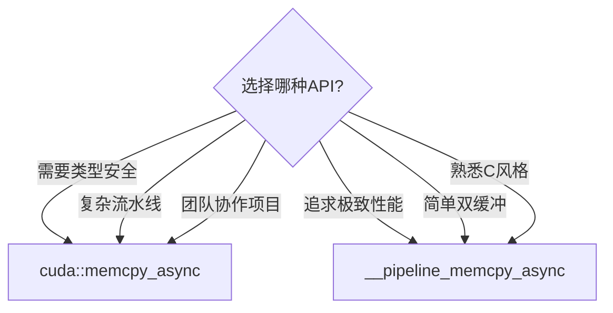

### 6.4 使用注意事项

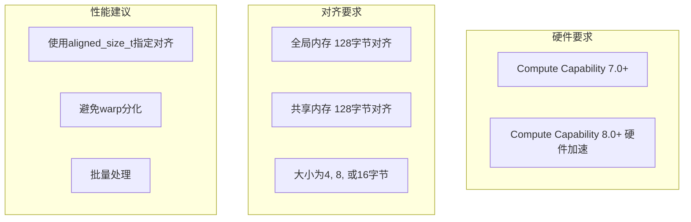

```cpp
// 使用对齐提示优化性能
cuda::memcpy_async(
    block,
    smem,
    global_in,
    cuda::aligned_size_t<16>(sizeof(float) * block.size()),
    pipeline
);
```

---

## 7. Ampere架构异步拷贝硬件加速原理

### 7.1 传统拷贝路径 vs Ampere异步拷贝

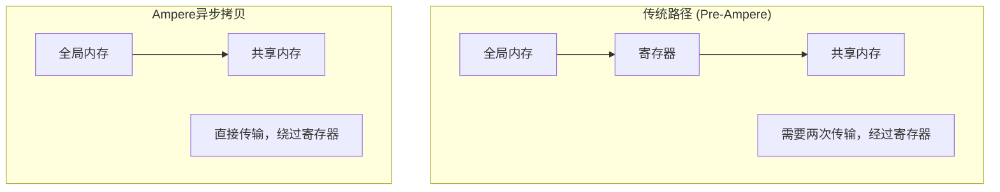

### 7.2 硬件实现细节

Ampere架构（SM 8.0+）引入了专门的异步拷贝硬件单元：

**新增硬件组件**：

| 组件 | 功能 | 优势 |
|------|------|------|
| **异步拷贝引擎** | 处理GMEM到SMEM的直接传输 | 释放计算资源 |
| **共享内存屏障** | 硬件级屏障同步 | 更低的同步开销 |
| **事务性内存** | 支持批量异步操作 | 更高的带宽利用率 |

**Ampere异步拷贝的工作原理**：

```
1. 线程发起异步拷贝请求
2. 拷贝引擎接管，线程可继续执行其他指令
3. 数据直接从GMEM传输到SMEM（不经过寄存器）
4. 通过barrier或pipeline同步确认传输完成
```

### 7.3 性能优势分析

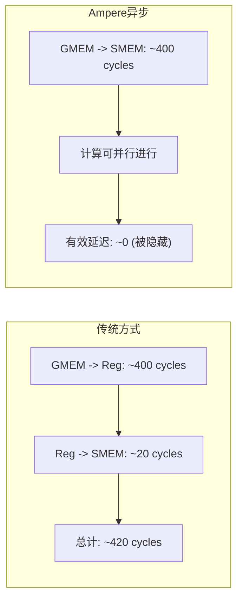

**关键性能指标对比**：

| 指标 | 传统同步拷贝 | Ampere异步拷贝 |
|------|-------------|---------------|
| 寄存器使用 | 每线程需存储临时数据 | 不占用寄存器 |
| 延迟隐藏 | 需要大量线程 | 硬件自动处理 |
| 带宽利用 | 受限于寄存器带宽 | 直接利用GMEM带宽 |
| 功耗 | 较高（数据经过ALU） | 较低（专用通路） |

### 7.4 实际代码示例

```cpp
// 检测硬件是否支持异步拷贝加速
bool check_async_copy_support() {
    int device;
    cudaGetDevice(&device);
    cudaDeviceProp prop;
    cudaGetDeviceProperties(&prop, device);
    return prop.major >= 8;  // Ampere or newer
}

// 针对Ampere优化的异步GEMM
__global__ void ampere_async_gemm(
    const float* __restrict__ A,
    const float* __restrict__ B,
    float* __restrict__ C,
    int M, int N, int K
) {
#if __CUDA_ARCH__ >= 800
    // Ampere专用优化路径
    __shared__ float As[2][32][32];  // 双缓冲
    __shared__ float Bs[2][32][32];

    // 使用异步拷贝硬件加速
    // 硬件会自动优化GMEM到SMEM的传输
#else
    // Pre-Ampere回退路径
    __shared__ float As[32][32];
    __shared__ float Bs[32][32];
#endif

    // ... 核心计算逻辑 ...
}
```

---

## 8. Asynchronous SIMT Programming Model (CUDA 12.1+)

### 8.1 异步SIMT编程模型概述

CUDA 12.1引入了**Asynchronous SIMT Programming Model**，这是对传统SIMT模型的重大扩展，允许线程在warp内以更灵活的方式协作。根据CUDA官方编程指南，从基于NVIDIA Ampere GPU架构的设备开始，CUDA编程模型通过异步编程模型为内存操作提供加速。


**官方定义的异步操作**：

根据CUDA官方编程指南，异步操作定义为：
> 由CUDA线程发起，并异步执行的操作，如同由另一个线程执行。在格式良好的程序中，一个或多个CUDA线程与异步操作同步。发起异步操作的CUDA线程不一定是同步线程之一。

**异步编程模型的核心组件**：
1. **Asynchronous Barrier**：用于CUDA线程之间的同步
2. **cuda::memcpy_async**：在GPU计算时异步地从全局内存移动数据

**线程作用域（Thread Scope）**（官方文档定义）：

| Thread Scope | 描述 |
|--------------|------|
| `cuda::thread_scope::thread_scope_thread` | 只有发起异步操作的CUDA线程同步 |
| `cuda::thread_scope::thread_scope_block` | 同一线程块内的所有或任意CUDA线程同步 |
| `cuda::thread_scope::thread_scope_device` | 同一GPU设备内的所有或任意CUDA线程同步 |
| `cuda::thread_scope::thread_scope_system` | 同一系统内的所有或任意CUDA或CPU线程同步 |

### 8.2 核心概念与API

**cuda::async_contract** 和相关异步操作：

```cpp
#include <cuda/async>

// 异步SIMT编程示例
__global__ void async_simt_example(float* data, int n) {
    // 定义异步barrier
    __shared__ cuda::barrier<cuda::thread_scope_block> barrier;

    // 初始化
    if (threadIdx.x == 0) {
        init(&barrier, blockDim.x);
    }
    __syncthreads();

    // 异步到达模式
    // 线程可以在完成工作后立即到达barrier
    // 而不需要等待所有线程完成相同阶段

    auto token = barrier.arrive();  // 异步到达，获取token

    // 执行本地工作
    int idx = blockIdx.x * blockDim.x + threadIdx.x;
    if (idx < n) {
        data[idx] *= 2.0f;
    }

    // 使用token等待
    barrier.wait(std::move(token));
}
```

### 8.3 Producer-Consumer模式实现

异步SIMT模型特别适合Producer-Consumer模式：

```cpp
#include <cuda/barrier>
#include <cuda/pipeline>

__global__ void producer_consumer_async(
    const float* __restrict__ input,
    float* __restrict__ output,
    int n, int batch_size
) {
    __shared__ float smem[2][256];
    __shared__ cuda::barrier<cuda::thread_scope_block> barriers[2];

    // 初始化barriers
    if (threadIdx.x == 0) {
        for (int i = 0; i < 2; i++) {
            init(&barriers[i], blockDim.x);
        }
    }
    __syncthreads();

    int warp_id = threadIdx.x / 32;
    int lane_id = threadIdx.x % 32;
    bool is_producer = (warp_id == 0);

    if (is_producer) {
        // Producer warp
        for (int batch = 0; batch < n; batch += batch_size) {
            int stage = (batch / batch_size) % 2;

            // 异步加载数据
            if (lane_id < batch_size) {
                smem[stage][lane_id] = input[batch + lane_id];
            }

            // 到达并通知consumer
            barriers[stage].arrive();
        }
    } else {
        // Consumer warps
        for (int batch = 0; batch < n; batch += batch_size) {
            int stage = (batch / batch_size) % 2;

            // 等待producer完成加载
            barriers[stage].arrive_and_wait();

            // 消费数据
            if (lane_id < batch_size) {
                output[batch + lane_id] = smem[stage][lane_id] * 2.0f;
            }
        }
    }
}
```

### 8.4 异步操作的正确性与同步

**关键同步原则**：

1. **确保所有到达都有对应的等待**
2. **避免死锁：保证到达顺序正确**
3. **内存可见性：使用适当的内存屏障**

```cpp
// 正确的异步同步模式
__global__ void correct_async_pattern(float* data, int n) {
    __shared__ cuda::barrier<cuda::thread_scope_block> barrier;

    if (threadIdx.x == 0) {
        init(&barrier, blockDim.x);
    }
    __syncthreads();

    // 正确：arrive和wait配对
    auto token = barrier.arrive();
    // ... 本地工作 ...
    barrier.wait(std::move(token));

    // 错误示例：忘记wait导致资源泄漏
    // barrier.arrive();  // 没有对应的wait!
}
```

---

## 9. 性能分析

### 9.1 同步加载 vs 异步加载

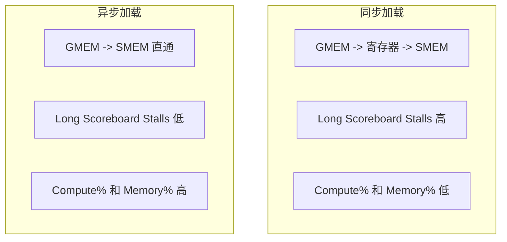

### 9.2 NCU性能指标对比

```bash
# 分析同步版本
ncu --metrics smsp__warp_issue_stall_long_scoreboard_per_warp_active.pct \
    ./sync_version

# 分析异步版本
ncu --metrics smsp__warp_issue_stall_long_scoreboard_per_warp_active.pct \
    ./async_version
```

| 指标 | 同步版本 | 异步版本 |
|------|----------|----------|
| Long Scoreboard Stalls | 高 (>30%) | 低 (<10%) |
| Compute % | 低 | 高 |
| Memory % | 低 | 高 |
| 总执行时间 | 长 | 短 |

### 9.3 使用Nsight Compute分析延迟隐藏效果

**详细的NCU分析流程**：

```bash
# 步骤1: 收集关键延迟指标
ncu --set full \
    --metrics smsp__warp_issue_stall_long_scoreboard_per_warp_active.pct,\
smsp__warp_issue_stall_short_scoreboard_per_warp_active.pct,\
smsp__warp_issue_stall_misc_per_warp_active.pct,\
smsp__cycles_active.avg.pct_of_peak_sustained_elapsed,\
l1tex__t_sectors_pipe_lsu_mem_global_op_ld.sum,\
l1tex__t_requests_pipe_lsu_mem_global_op_ld.sum \
    -o profile_report \
    ./your_kernel

# 步骤2: 分析共享内存使用
ncu --metrics \
    l1tex__data_bank_conflicts_pipe_lsu_mem_shared_op_ld.sum,\
l1tex__data_bank_conflicts_pipe_lsu_mem_shared_op_st.sum \
    ./your_kernel

# 步骤3: 分析内存吞吐量
ncu --metrics \
    dram__throughput.avg.pct_of_peak_sustained_elapsed,\
lts__t_sectors_op_read.sum,\
lts__t_sectors_op_write.sum \
    ./your_kernel
```

**关键指标解读**：

| 指标 | 含义 | 理想值 | 延迟问题诊断 |
|------|------|--------|-------------|
| `smsp__warp_issue_stall_long_scoreboard_per_warp_active.pct` | 长延迟等待百分比 | < 10% | 高值表示内存延迟未隐藏 |
| `smsp__warp_issue_stall_short_scoreboard_per_warp_active.pct` | 短延迟等待百分比 | < 5% | 高值表示共享内存延迟 |
| `smsp__cycles_active.avg.pct_of_peak_sustained_elapsed` | 活跃周期比例 | > 70% | 低值表示整体效率低 |
| `dram__throughput.avg.pct_of_peak_sustained_elapsed` | DRAM带宽利用率 | > 60% | 内存带宽瓶颈指标 |

**Nsight Compute GUI分析步骤**：

```mermaid
graph TB
    S1["启动ncu-gui"] --> S2["打开报告文件"]
    S2 --> S3["查看Warp State分析"]
    S3 --> S4["检查Stall原因分布"]
    S4 --> S5["分析Memory Throughput"]
    S5 --> S6["对比优化前后"]

    subgraph 分析要点
        A["Long Scoreboard > 20%: 考虑异步拷贝"]
        B["Short Scoreboard > 10%: 优化共享内存"]
        C["吞吐量低: 检查带宽利用率"]
    end
```

**实际分析示例**：

```cpp
// 在代码中标记分析区域
__global__ void analyzed_kernel(float* data, int n) {
    // NCU会自动识别关键区域

    // 同步加载部分（高Long Scoreboard）
    __shared__ float smem_sync[256];
    if (threadIdx.x < 256) {
        smem_sync[threadIdx.x] = data[threadIdx.x];  // 同步加载
    }
    __syncthreads();

    // 异步加载部分（低Long Scoreboard）
    __shared__ float smem_async[256];
    cg::memcpy_async(cg::this_thread_block(),
                     smem_async, data + 256, sizeof(float) * 256);
    cg::wait(cg::this_thread_block());  // 异步加载
}
```

### 9.4 性能优化建议

```mermaid
graph LR
    subgraph 优化步骤
        S1["1. 分析Stall原因"]
        S2["2. 确定延迟来源"]
        S3["3. 选择合适的延迟隐藏技术"]
        S4["4. 验证性能提升"]
    end

    S1 --> S2 --> S3 --> S4
```

**技术选择指南**：

| 场景 | 推荐技术 |
|------|----------|
| 简单内核，单次加载 | Barrier + memcpy_async |
| 多次迭代，需要重叠 | Pipeline (多阶段) |
| 复杂场景，细粒度控制 | Pipeline Primitives |
| Warp分工明确 | Warp特化 |

---

## 10. 实践案例

### 10.1 完整的异步GEMM实现

```cpp
#include <cuda/pipeline>
#include <cooperative_groups.h>
#include <cooperative_groups/memcpy_async.h>

namespace cg = cooperative_groups;

#define TILE_SIZE 32

// 完整的异步GEMM实现（双缓冲 + Pipeline）
__global__ void async_gemm_complete(
    const float* __restrict__ A,
    const float* __restrict__ B,
    float* __restrict__ C,
    int M, int N, int K
) {
    cg::thread_block block = cg::this_thread_block();

    // 双缓冲共享内存
    __shared__ float As[2][TILE_SIZE][TILE_SIZE];
    __shared__ float Bs[2][TILE_SIZE][TILE_SIZE];

    // Pipeline状态（双阶段）
    __shared__ cuda::pipeline_shared_state<
        cuda::thread_scope_thread, 2
    > pipeline_state;
    auto pipeline = cuda::make_pipeline(block, &pipeline_state);

    int tx = threadIdx.x;
    int ty = threadIdx.y;
    int row = blockIdx.y * TILE_SIZE + ty;
    int col = blockIdx.x * TILE_SIZE + tx;

    float sum = 0.0f;
    int num_tiles = (K + TILE_SIZE - 1) / TILE_SIZE;

    // 预加载第一个Tile
    pipeline.producer_acquire();

    int a_col = tx;
    int b_row = ty;
    if (row < M && a_col < K)
        cuda::memcpy_async(block, &As[0][ty][tx], &A[row * K + a_col],
                          sizeof(float), pipeline);
    if (b_row < K && col < N)
        cuda::memcpy_async(block, &Bs[0][ty][tx], &B[b_row * N + col],
                          sizeof(float), pipeline);

    pipeline.producer_commit();

    int stage = 0;

    for (int t = 0; t < num_tiles; t++) {
        int next_stage = 1 - stage;
        int next_tile = t + 1;

        // 异步加载下一个Tile
        if (next_tile < num_tiles) {
            pipeline.producer_acquire();

            a_col = next_tile * TILE_SIZE + tx;
            b_row = next_tile * TILE_SIZE + ty;

            if (row < M && a_col < K)
                cuda::memcpy_async(block, &As[next_stage][ty][tx],
                                  &A[row * K + a_col], sizeof(float), pipeline);
            if (b_row < K && col < N)
                cuda::memcpy_async(block, &Bs[next_stage][ty][tx],
                                  &B[b_row * N + col], sizeof(float), pipeline);

            pipeline.producer_commit();
        }

        // 等待当前Tile加载完成
        pipeline.consumer_wait();

        // 计算（与下一次加载重叠）
        #pragma unroll
        for (int k = 0; k < TILE_SIZE; k++) {
            sum += As[stage][ty][k] * Bs[stage][k][tx];
        }

        pipeline.consumer_release();
        stage = next_stage;
    }

    if (row < M && col < N) {
        C[row * N + col] = sum;
    }
}

// 使用Pipeline Primitives的异步GEMM
__global__ void async_gemm_primitives(
    const float* __restrict__ A,
    const float* __restrict__ B,
    float* __restrict__ C,
    int M, int N, int K
) {
    __shared__ float As[2][TILE_SIZE][TILE_SIZE];
    __shared__ float Bs[2][TILE_SIZE][TILE_SIZE];

    int tx = threadIdx.x;
    int ty = threadIdx.y;
    int row = blockIdx.y * TILE_SIZE + ty;
    int col = blockIdx.x * TILE_SIZE + tx;

    float sum = 0.0f;
    int num_tiles = (K + TILE_SIZE - 1) / TILE_SIZE;
    int stage = 0;

    // 预加载第一个Tile
    int a_col = tx;
    int b_row = ty;

    if (row < M && a_col < K) {
        __pipeline_memcpy_async(&As[0][ty][tx], &A[row * K + a_col], sizeof(float));
    }
    if (b_row < K && col < N) {
        __pipeline_memcpy_async(&Bs[0][ty][tx], &B[b_row * N + col], sizeof(float));
    }
    __pipeline_commit();

    for (int t = 0; t < num_tiles; t++) {
        int next_stage = 1 - stage;
        int next_tile = t + 1;

        // 预加载下一个Tile
        if (next_tile < num_tiles) {
            a_col = next_tile * TILE_SIZE + tx;
            b_row = next_tile * TILE_SIZE + ty;

            if (row < M && a_col < K) {
                __pipeline_memcpy_async(&As[next_stage][ty][tx],
                                        &A[row * K + a_col], sizeof(float));
            }
            if (b_row < K && col < N) {
                __pipeline_memcpy_async(&Bs[next_stage][ty][tx],
                                        &B[b_row * N + col], sizeof(float));
            }
            __pipeline_commit();
        }

        // 等待当前Tile
        __pipeline_wait_prior(0);

        // 计算
        #pragma unroll
        for (int k = 0; k < TILE_SIZE; k++) {
            sum += As[stage][ty][k] * Bs[stage][k][tx];
        }

        stage = next_stage;
    }

    if (row < M && col < N) {
        C[row * N + col] = sum;
    }
}
```

### 10.2 性能测试框架

```cpp
// 性能测试辅助函数
void benchmark_async_gemm(int M, int N, int K, int warmup = 10, int repeat = 100) {
    // 分配内存
    float *d_A, *d_B, *d_C;
    cudaMalloc(&d_A, M * K * sizeof(float));
    cudaMalloc(&d_B, K * N * sizeof(float));
    cudaMalloc(&d_C, M * N * sizeof(float));

    // 创建CUDA事件用于计时
    cudaEvent_t start, stop;
    cudaEventCreate(&start);
    cudaEventCreate(&stop);

    dim3 blockDim(TILE_SIZE, TILE_SIZE);
    dim3 gridDim((N + TILE_SIZE - 1) / TILE_SIZE,
                 (M + TILE_SIZE - 1) / TILE_SIZE);

    // 预热
    for (int i = 0; i < warmup; i++) {
        async_gemm_complete<<<gridDim, blockDim>>>(d_A, d_B, d_C, M, N, K);
    }
    cudaDeviceSynchronize();

    // 计时
    cudaEventRecord(start);
    for (int i = 0; i < repeat; i++) {
        async_gemm_complete<<<gridDim, blockDim>>>(d_A, d_B, d_C, M, N, K);
    }
    cudaEventRecord(stop);
    cudaEventSynchronize(stop);

    float ms;
    cudaEventElapsedTime(&ms, start, stop);

    // 计算GFLOPS
    double flops = 2.0 * M * N * K * repeat;
    double gflops = flops / (ms * 1e6);

    printf("Size: %dx%dx%d, Time: %.3f ms, Performance: %.2f GFLOPS\n",
           M, N, K, ms / repeat, gflops);

    // 清理
    cudaFree(d_A);
    cudaFree(d_B);
    cudaFree(d_C);
    cudaEventDestroy(start);
    cudaEventDestroy(stop);
}

// 使用NCU进行详细性能分析
void profile_with_ncu() {
    printf("\n=== NCU性能分析命令 ===\n");
    printf("分析延迟瓶颈:\n");
    printf("  ncu --set full -o async_gemm_profile ./your_binary\n\n");

    printf("关键指标:\n");
    printf("  ncu --metrics smsp__warp_issue_stall_long_scoreboard_per_warp_active.pct \\\n");
    printf("        ./your_binary\n\n");

    printf("对比同步与异步版本:\n");
    printf("  ncu --metrics smsp__warp_issue_stall_long_scoreboard_per_warp_active.pct,\\\n");
    printf("        smsp__cycles_active.avg.pct_of_peak_sustained_elapsed \\\n");
    printf("        ./your_binary\n");
}
```

---

## 11. 本章小结

### 11.1 关键概念

| 概念 | 描述 |
|------|------|
| 延迟隐藏 | 通过重叠操作来减少等待时间 |
| 双缓冲 | 使用两个缓冲区实现计算与访存重叠 |
| 软件流水线 | 将任务分成多个阶段并行执行 |
| 异步拷贝 | 直接从全局内存到共享内存的异步传输 |
| Pipeline | CUDA提供的管理多阶段异步操作的API |
| cuda::barrier | 现代C++风格的屏障同步机制 |
| Asynchronous SIMT | CUDA 12.1+的异步编程模型 |
| Preamble | 核函数执行前的初始化阶段（清零缓冲区、加载常量等） |
| Programmatic Dependent Launch | 允许二级核函数在主核函数完成前启动其Preamble部分（SM 9.0+） |
| Launch Latency | 核函数启动延迟，可通过Preamble重叠来隐藏 |
| Thread Scope | 异步操作的同步作用域（thread/block/device/system） |

### 11.2 技术选择指南

```mermaid
graph TB
    Q{"是否需要延迟隐藏?"}
    Q -->|"否"| N["使用同步操作"]
    Q -->|"是"| Q2{"计算与访存比例?"}

    Q2 -->|"相近"| D["双缓冲"]
    Q2 -->|"差异大"| Q3{"复杂度?"}

    Q3 -->|"简单"| M["memcpy_async + barrier"]
    Q3 -->|"复杂"| P["Pipeline"]

    Q4{"需要细粒度控制?"}
    Q4 -->|"是"| PP["Pipeline Primitives"]
    Q4 -->|"否"| WS["Warp特化"]

    Q5{"有Kernel链依赖?<br/>(SM 9.0+)"}
    Q5 -->|"是"| PDL["Programmatic Dependent Launch"]
    Q5 -->|"否"| Q6{"其他方法"}
```

### 11.3 API选择速查表

| 需求 | 推荐API | 头文件 |
|------|---------|--------|
| 简单块级异步拷贝 | `cg::memcpy_async` + `cg::wait` | `<cooperative_groups/memcpy_async.h>` |
| 需要精确同步 | `cuda::barrier` | `<cuda/barrier>` |
| 多阶段流水线 | `cuda::pipeline` | `<cuda/pipeline>` |
| C风格底层控制 | `__pipeline_*` | `<cuda_pipeline.h>` |
| Ampere硬件加速 | 上述任意（硬件自动优化） | - |

### 11.4 常见陷阱与解决方案

| 陷阱 | 症状 | 解决方案 |
|------|------|----------|
| 忘记等待异步操作 | 数据竞争、结果错误 | 确保`wait()`或`consumer_wait()`在访问数据前调用 |
| barrier初始化问题 | 死锁或崩溃 | 只让一个线程初始化，然后同步 |
| 共享内存不足 | 启动失败 | 减少阶段数或使用更小的TILE |
| 内存对齐问题 | 性能下降或错误 | 使用`cuda::aligned_size_t<N>` |

### 11.5 思考题

1. 双缓冲需要额外的共享内存，如何在内存受限的场景下权衡？
2. 为什么异步拷贝在Compute Capability 8.0+上可以获得硬件加速？
3. 如何确定最佳的Pipeline阶段数？
4. Warp特化与Pipeline技术可以结合使用吗？
5. cuda::barrier与__syncthreads()有什么本质区别？
6. 在什么情况下应该使用cuda::memcpy_async而不是__pipeline_memcpy_async？

---

## 下一章

[第二十二章：CUDA流与并发](./22_CUDA流与并发.md) - 深入理解CUDA流的执行模型和多流并发编程

---

*参考资料：*
- *[CUDA C++ Programming Guide - Asynchronous Data Copies](https://docs.nvidia.com/cuda/cuda-c-programming-guide/index.html#asynchronous-data-copies)*
- *[CUDA C++ Programming Guide - Pipeline Interface](https://docs.nvidia.com/cuda/cuda-c-programming-guide/index.html#pipeline-interface)*
- *[CUDA C++ Programming Guide - Barrier Interface](https://docs.nvidia.com/cuda/cuda-c-programming-guide/index.html#barrier-interface)*
- *[NVIDIA Developer Blog - Leveraging CUDA Async Copy](https://developer.nvidia.com/blog/)*
- *[CUDA 12.1 Release Notes - Asynchronous SIMT Programming Model](https://docs.nvidia.com/cuda/cuda-toolkit-release-notes/index.html)*
