# 第二十二章：CUDA流与并发

> 学习目标：深入理解CUDA流的执行模型，掌握多流并发编程技术，学会使用CUDA事件进行同步和计时
>
> 预计阅读时间：60 分钟
>
> 前置知识：[第五章：第一个CUDA程序](./05_第一个CUDA程序.md) | [第二十一章：异步执行与延迟隐藏](./21_异步执行与延迟隐藏.md)

---

## 1. CUDA流基础

### 1.1 什么是CUDA流？

**CUDA流（Stream）** 是CUDA中的一个执行队列，用于管理GPU操作的顺序执行：

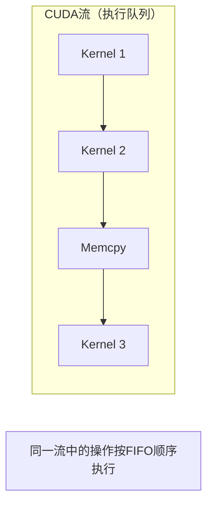

**流的特点**：
- 同一个流中的操作按FIFO（先进先出）顺序执行
- 不同流中的操作可以并发执行
- 流是管理GPU任务调度的基本单位

### 1.2 默认流与命名流

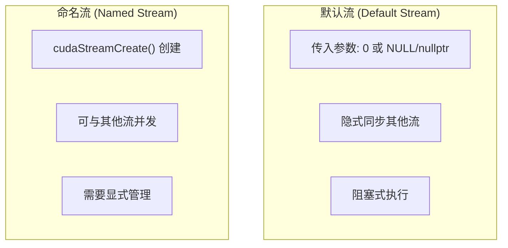

```cpp
// 默认流的使用
kernel<<<grid, block>>>(...);           // 使用默认流
kernel<<<grid, block, 0, 0>>>(...);     // 显式指定默认流
kernel<<<grid, block, 0, NULL>>>(...);  // 同上
kernel<<<grid, block, 0, nullptr>>>(...); // 同上

// 命名流的创建和使用
cudaStream_t stream;
cudaStreamCreate(&stream);               // 创建命名流
kernel<<<grid, block, 0, stream>>>(...); // 在命名流中执行
cudaStreamDestroy(stream);               // 销毁流
```

### 1.3 流的基本操作

| 函数 | 描述 |
|------|------|
| `cudaStreamCreate()` | 创建流 |
| `cudaStreamDestroy()` | 销毁流 |
| `cudaStreamSynchronize()` | 同步流 |
| `cudaStreamWaitEvent()` | 等待事件 |
| `cudaStreamQuery()` | 查询流状态 |
| `cudaStreamAddCallback()` | 添加回调 |

---

## 2. 多流并发

### 2.1 为什么需要多流？

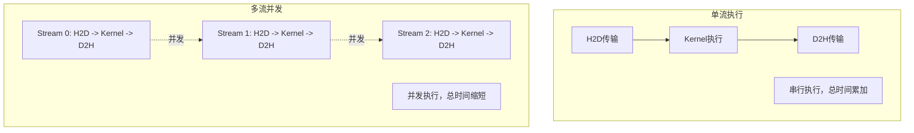

**多流的优势**：
1. 隐藏数据传输延迟
2. 提高GPU利用率
3. 实现计算与传输重叠

### 2.2 多流编程模型

```cpp
// 多流示例
const int N_STREAMS = 4;
cudaStream_t streams[N_STREAMS];

// 创建多个流
for (int i = 0; i < N_STREAMS; i++) {
    cudaStreamCreate(&streams[i]);
}

// 在多个流中分发任务
for (int i = 0; i < N_STREAMS; i++) {
    int offset = i * chunk_size;

    // 异步数据传输
    cudaMemcpyAsync(d_data + offset, h_data + offset,
                    chunk_bytes, cudaMemcpyHostToDevice, streams[i]);

    // 在同一流中执行核函数
    kernel<<<grid, block, 0, streams[i]>>>(d_data + offset, chunk_size);

    // 异步写回
    cudaMemcpyAsync(h_result + offset, d_data + offset,
                    chunk_bytes, cudaMemcpyDeviceToHost, streams[i]);
}

// 同步所有流
for (int i = 0; i < N_STREAMS; i++) {
    cudaStreamSynchronize(streams[i]);
}

// 销毁流
for (int i = 0; i < N_STREAMS; i++) {
    cudaStreamDestroy(streams[i]);
}
```

### 2.3 流的执行顺序

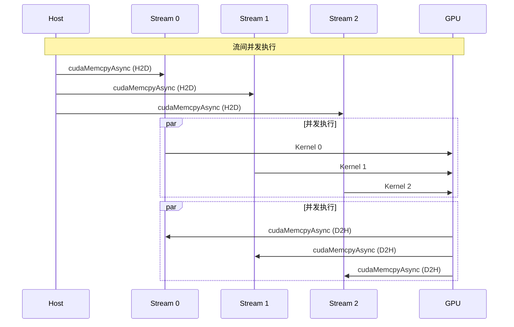

### 2.4 默认流的同步行为

**重要提示**：默认流会与所有命名流隐式同步！

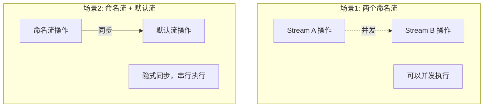

**解决方案**：创建非阻塞流

```cpp
// 创建非阻塞流（不与默认流同步）
cudaStream_t stream;
cudaStreamCreateWithFlags(&stream, cudaStreamNonBlocking);

// 此流可以与默认流并发执行
```

---

## 3. Stream Dependency深度解析

### 3.1 什么是流依赖？

**Stream Dependency（流依赖）** 描述了CUDA操作之间的执行顺序约束关系。理解流依赖是编写正确且高效并发程序的关键。

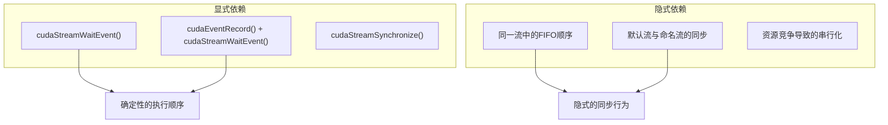

### 3.2 流依赖的类型

#### 3.2.1 流内依赖（Intra-Stream Dependency）

同一个流中的操作自动形成依赖链：

```cpp
cudaStream_t stream;
cudaStreamCreate(&stream);

// 这些操作有隐式的顺序依赖
cudaMemcpyAsync(d_a, h_a, size, cudaMemcpyHostToDevice, stream);  // Op1
kernel1<<<grid, block, 0, stream>>>(d_a);                          // Op2: 依赖Op1
kernel2<<<grid, block, 0, stream>>>(d_a);                          // Op3: 依赖Op2
cudaMemcpyAsync(h_a, d_a, size, cudaMemcpyDeviceToHost, stream);  // Op4: 依赖Op3

// 执行顺序: Op1 -> Op2 -> Op3 -> Op4 (严格FIFO)
```

#### 3.2.2 流间依赖（Inter-Stream Dependency）

使用事件在不同流之间建立依赖关系：

```cpp
cudaStream_t stream1, stream2;
cudaStreamCreate(&stream1);
cudaStreamCreate(&stream2);

cudaEvent_t event;
cudaEventCreate(&event);

// Stream1 生产数据
producer_kernel<<<grid, block, 0, stream1>>>(d_data);
cudaEventRecord(event, stream1);  // 标记生产完成

// Stream2 消费数据，必须等待Stream1
cudaStreamWaitEvent(stream2, event, 0);  // 建立依赖
consumer_kernel<<<grid, block, 0, stream2>>>(d_data);

// 其他流中的操作仍然可以与stream1和stream2并发执行
```

#### 3.2.3 依赖传递性

流依赖具有传递性，可以构建复杂的依赖图：

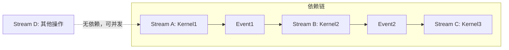

```cpp
// 依赖链示例
cudaStream_t streamA, streamB, streamC;
cudaEvent_t event1, event2;

// Stream A -> Event1 -> Stream B -> Event2 -> Stream C
kernelA<<<grid, block, 0, streamA>>>(dataA);
cudaEventRecord(event1, streamA);

cudaStreamWaitEvent(streamB, event1, 0);
kernelB<<<grid, block, 0, streamB>>>(dataB);
cudaEventRecord(event2, streamB);

cudaStreamWaitEvent(streamC, event2, 0);
kernelC<<<grid, block, 0, streamC>>>(dataC);
```

### 3.3 CUDA流调度器行为

#### 3.3.1 硬件调度模型

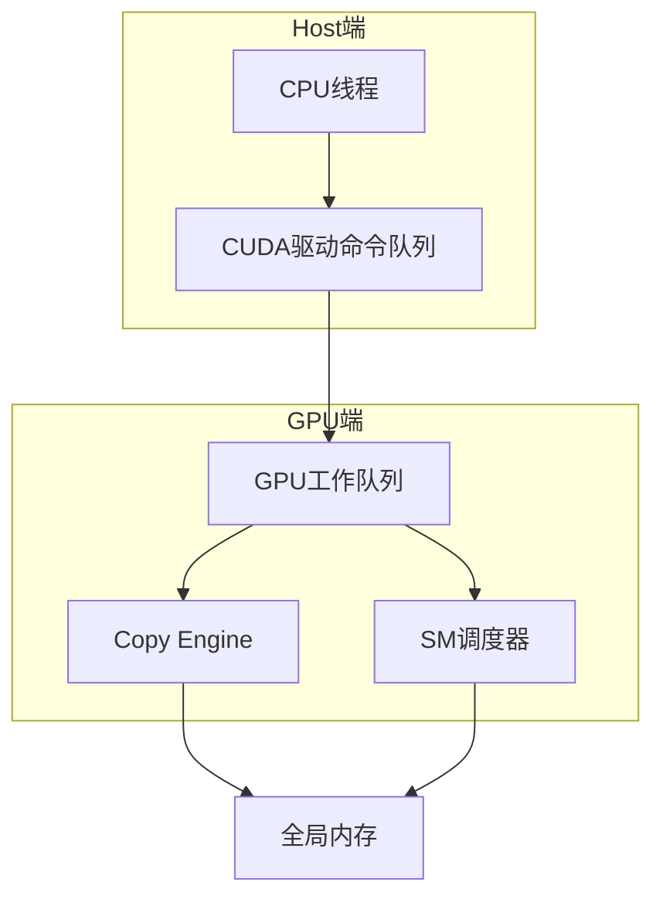

**关键组件**：
1. **Host端命令队列**：CPU提交的CUDA命令首先进入这里
2. **GPU工作队列**：驱动将命令推送到GPU的硬件队列
3. **Copy Engine**：负责DMA传输的硬件单元
4. **SM调度器**：调度block到SM执行

#### 3.3.2 调度优先级

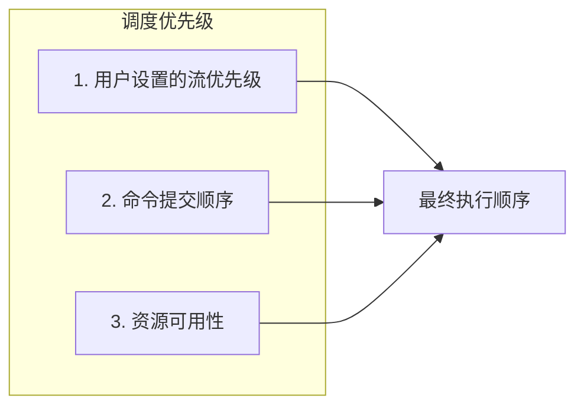

**调度器行为细节**：

```cpp
// 查询设备调度能力
cudaDeviceProp prop;
cudaGetDeviceProperties(&prop, 0);

printf("并发核函数数: %d\n", prop.concurrentKernels);
printf("每SM最大线程: %d\n", prop.maxThreadsPerMultiProcessor);

// 不同架构的调度行为不同
// Fermi: 16路并发kernel
// Kepler: 32路并发kernel
// Maxwell/Pascal: 32路或更多
// Volta+: 128路并发kernel
```

#### 3.3.3 硬件队列深度

```cpp
// 每个流对应GPU端的硬件队列
// 队列深度有限，过多未完成的操作可能导致阻塞

// 良好实践：控制每个流的待处理操作数量
const int MAX_PENDING_OPS = 32;  // 经验值

for (int i = 0; i < num_chunks; i++) {
    if (i >= MAX_PENDING_OPS) {
        // 等待一部分操作完成
        cudaStreamSynchronize(streams[i % num_streams]);
    }

    // 提交新操作
    launch_work(streams[i % num_streams], chunk[i]);
}
```

### 3.4 依赖管理最佳实践

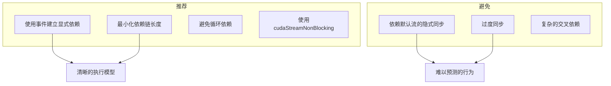

---

## 4. 阻塞流与非阻塞流深度对比

### 4.1 核心区别

| 特性 | 阻塞流（默认命名流） | 非阻塞流 |
|------|---------------------|----------|
| 与默认流同步 | 是 | 否 |
| 创建方式 | `cudaStreamCreate()` | `cudaStreamCreateWithFlags(..., cudaStreamNonBlocking)` |
| 并发能力 | 与默认流互斥 | 可与默认流并发 |
| 适用场景 | 兼容旧代码 | 需要最大并发 |

### 4.2 行为对比图解

```mermaid
gantt
    title 阻塞流 vs 非阻塞流执行时间线
    dateFormat X
    axisFormat %s

    section 阻塞流模式
    Default Stream    :0, 2
    Named Stream      :2, 4

    section 非阻塞流模式
    Default Stream    :0, 2
    NonBlocking Stream:0, 2
```

### 4.3 详细代码对比

```cpp
// ========== 阻塞流示例 ==========
void blocking_stream_demo() {
    cudaStream_t blocking_stream;
    cudaStreamCreate(&blocking_stream);  // 默认行为

    // 场景：默认流和命名流交替执行
    kernel_default<<<grid, block>>>(data);         // 使用默认流
    kernel_named<<<grid, block, 0, blocking_stream>>>(data);  // 等待默认流完成

    // 实际执行顺序：串行！
    // 原因：命名流与默认流有隐式同步
}

// ========== 非阻塞流示例 ==========
void nonblocking_stream_demo() {
    cudaStream_t nonblock_stream;
    cudaStreamCreateWithFlags(&nonblock_stream, cudaStreamNonBlocking);

    // 场景：默认流和非阻塞流
    kernel_default<<<grid, block>>>(data);         // 使用默认流
    kernel_nonblock<<<grid, block, 0, nonblock_stream>>>(data);  // 不等待！

    // 实际执行顺序：可能并发！
    // 原因：非阻塞流不与默认流同步
}
```

### 4.4 性能影响分析

```cpp
// 性能测试：阻塞流 vs 非阻塞流
void compare_stream_types() {
    const int N = 1024 * 1024;
    const int ITERATIONS = 100;

    float *d_data;
    cudaMalloc(&d_data, N * sizeof(float));

    // 创建不同类型的流
    cudaStream_t blocking_stream, nonblock_stream;
    cudaStreamCreate(&blocking_stream);
    cudaStreamCreateWithFlags(&nonblock_stream, cudaStreamNonBlocking);

    cudaEvent_t start, stop;
    cudaEventCreate(&start);
    cudaEventCreate(&stop);

    // 测试阻塞流
    cudaEventRecord(start);
    for (int i = 0; i < ITERATIONS; i++) {
        // 交替使用默认流和阻塞流
        kernel<<<grid, block>>>(d_data);  // 默认流
        kernel<<<grid, block, 0, blocking_stream>>>(d_data);  // 等待默认流
    }
    cudaEventRecord(stop);
    cudaEventSynchronize(stop);

    float blocking_time;
    cudaEventElapsedTime(&blocking_time, start, stop);

    // 测试非阻塞流
    cudaEventRecord(start);
    for (int i = 0; i < ITERATIONS; i++) {
        kernel<<<grid, block>>>(d_data);  // 默认流
        kernel<<<grid, block, 0, nonblock_stream>>>(d_data);  // 可能并发
    }
    cudaEventRecord(stop);
    cudaEventSynchronize(stop);

    float nonblock_time;
    cudaEventElapsedTime(&nonblock_time, start, stop);

    printf("阻塞流时间:   %.3f ms\n", blocking_time);
    printf("非阻塞流时间: %.3f ms\n", nonblock_time);
    printf("加速比:       %.2fx\n", blocking_time / nonblock_time);

    cudaStreamDestroy(blocking_stream);
    cudaStreamDestroy(nonblock_stream);
    cudaEventDestroy(start);
    cudaEventDestroy(stop);
    cudaFree(d_data);
}
```

---

## 5. Stream Memory Operations

### 5.1 概念介绍

**Stream Memory Operations（流内存操作）** 是CUDA提供的一组API，允许更细粒度地控制内存操作与流的关联。

### 5.2 核心API

```cpp
// 流内存操作相关API
cudaError_t cudaStreamAttachMemAsync(cudaStream_t stream, void *devPtr, size_t length, unsigned int flags);
cudaError_t cudaMemPrefetchAsync(const void *devPtr, size_t count, int dstDevice, cudaStream_t stream);
cudaError_t cudaMemAdvise(const void *devPtr, size_t count, cudaMemoryAdvise advice, int device);
```

### 5.3 统一内存预取

```cpp
// 使用cudaMemPrefetchAsync优化统一内存访问
void unified_memory_prefetch_example() {
    const int N = 1024 * 1024;
    float *data;

    // 分配统一内存
    cudaMallocManaged(&data, N * sizeof(float));

    // 创建流
    cudaStream_t stream;
    cudaStreamCreate(&stream);

    // 在CPU上初始化数据
    for (int i = 0; i < N; i++) {
        data[i] = (float)i;
    }

    // 异步预取数据到GPU（在特定流中）
    cudaMemPrefetchAsync(data, N * sizeof(float), 0, stream);

    // 在同一流中执行核函数
    // 核函数可以立即访问数据，无需等待页面迁移
    kernel<<<grid, block, 0, stream>>>(data, N);

    // 预取结果回CPU
    cudaMemPrefetchAsync(data, N * sizeof(float), cudaCpuDeviceId, stream);

    cudaStreamSynchronize(stream);

    // CPU访问数据（已经在CPU内存中）
    for (int i = 0; i < 10; i++) {
        printf("%.1f ", data[i]);
    }

    cudaStreamDestroy(stream);
    cudaFree(data);
}
```

### 5.4 内存建议（Memory Advise）

```cpp
// 向CUDA运行时提供内存访问模式提示
void memory_advise_example() {
    const int N = 1024 * 1024;
    float *data;
    cudaMallocManaged(&data, N * sizeof(float));

    // 告诉运行时：数据主要被GPU 0访问
    cudaMemAdvise(data, N * sizeof(float), cudaMemAdviseSetPreferredLocation, 0);

    // 告诉运行时：数据主要被CPU访问
    cudaMemAdvise(data, N * sizeof(float), cudaMemAdviseSetAccessedBy, cudaCpuDeviceId);

    // 告诉运行时：这些数据将被读取，适合预取
    cudaMemAdvise(data, N * sizeof(float), cudaMemAdviseSetReadMostly, 0);

    cudaFree(data);
}
```

### 5.5 流绑定内存

```cpp
// 将统一内存绑定到特定流
void stream_attach_memory_example() {
    const int N = 1024 * 1024;
    float *data;

    // 分配可移植的统一内存
    cudaMallocManaged(&data, N * sizeof(float), cudaMemAttachGlobal);

    cudaStream_t stream;
    cudaStreamCreate(&stream);

    // 将内存绑定到流
    // 这样在流完成之前，其他CUDA上下文无法访问这块内存
    cudaStreamAttachMemAsync(stream, data, N * sizeof(float), cudaMemAttachSingle);

    // 在流中使用这块内存
    kernel<<<grid, block, 0, stream>>>(data, N);

    cudaStreamSynchronize(stream);

    cudaStreamDestroy(stream);
    cudaFree(data);
}
```

### 5.6 性能优势

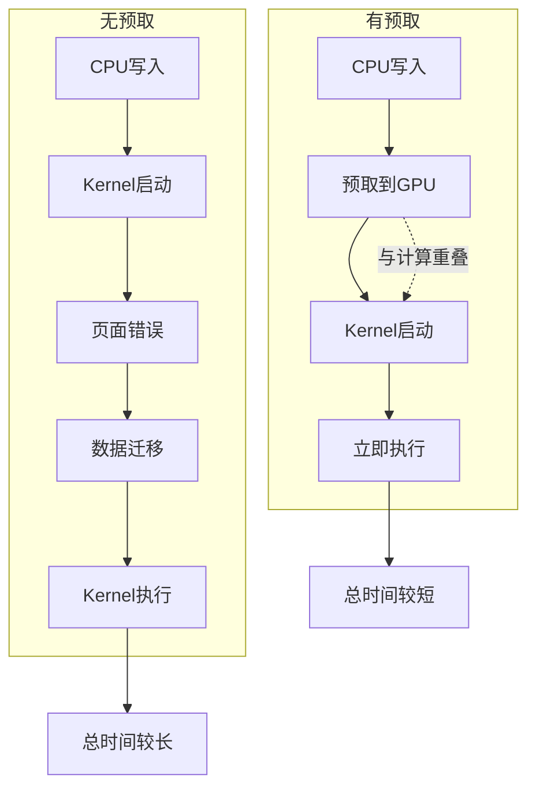

---

## 6. 流同步

### 6.1 同步方式

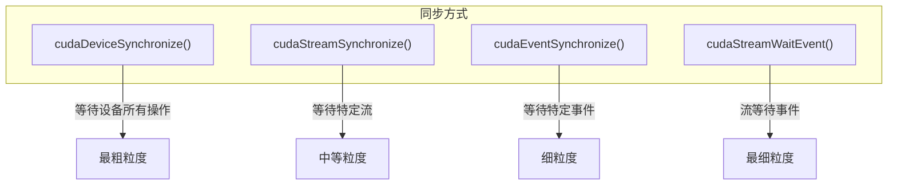

### 6.2 同步API详解

```cpp
// 1. 设备同步：等待GPU上所有操作完成
cudaDeviceSynchronize();

// 2. 流同步：等待特定流中的所有操作完成
cudaStreamSynchronize(stream);

// 3. 流查询：非阻塞检查流是否完成
cudaError_t result = cudaStreamQuery(stream);
if (result == cudaSuccess) {
    // 流已完成
} else if (result == cudaErrorNotReady) {
    // 流尚未完成
}

// 4. 流回调：在流中某个点执行回调函数
void CUDART_CB my_callback(cudaStream_t stream, cudaError_t status, void *data) {
    printf("Callback executed!\n");
}
cudaStreamAddCallback(stream, my_callback, nullptr, 0);
```

### 6.3 同步最佳实践

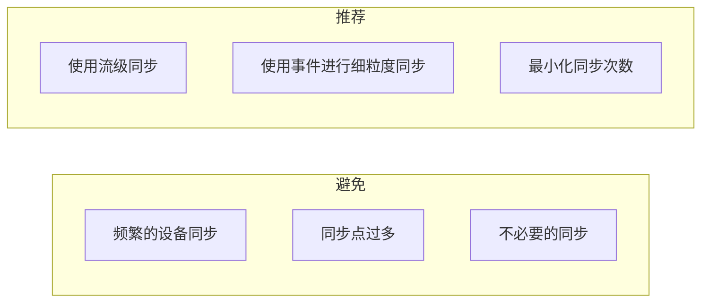

---

## 7. CUDA事件

### 7.1 事件的作用

**CUDA事件（Event）** 提供了更精细的同步和计时控制：

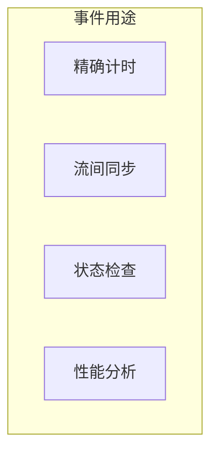

### 7.2 事件API

| 函数 | 描述 |
|------|------|
| `cudaEventCreate()` | 创建事件 |
| `cudaEventDestroy()` | 销毁事件 |
| `cudaEventRecord()` | 记录事件 |
| `cudaEventSynchronize()` | 同步事件 |
| `cudaEventQuery()` | 查询事件状态 |
| `cudaEventElapsedTime()` | 计算两事件间时间 |

### 7.3 使用事件计时

```cpp
// 创建事件
cudaEvent_t start, stop;
cudaEventCreate(&start);
cudaEventCreate(&stop);

// 记录开始时间
cudaEventRecord(start, stream);

// 执行GPU操作
kernel<<<grid, block, 0, stream>>>(...);

// 记录结束时间
cudaEventRecord(stop, stream);
cudaEventSynchronize(stop);

// 计算时间
float milliseconds = 0;
cudaEventElapsedTime(&milliseconds, start, stop);
printf("执行时间: %.3f ms\n", milliseconds);

// 销毁事件
cudaEventDestroy(start);
cudaEventDestroy(stop);
```

### 7.4 使用事件同步流

```cpp
cudaStream_t stream0, stream1;
cudaStreamCreate(&stream0);
cudaStreamCreate(&stream1);

cudaEvent_t event;
cudaEventCreate(&event);

// Stream 0执行操作
kernel0<<<grid, block, 0, stream0>>>(...);
cudaEventRecord(event, stream0);  // 在stream0中记录事件

// Stream 1等待事件
cudaStreamWaitEvent(stream1, event, 0);  // stream1等待event
kernel1<<<grid, block, 0, stream1>>>(...);  // 确保kernel0完成后执行

// 清理
cudaStreamDestroy(stream0);
cudaStreamDestroy(stream1);
cudaEventDestroy(event);
```

### 7.5 事件同步流程

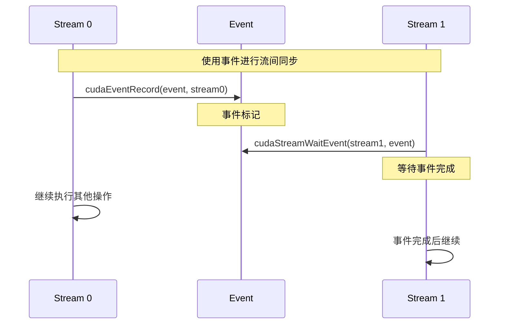

### 7.6 CUDA事件完整示例

下面是一个完整的事件使用示例，涵盖创建、记录、查询、同步和计时等功能：

```cpp
#include <cstdio>
#include <cuda_runtime.h>

#define CHECK_CUDA(call) \
    do { \
        cudaError_t err = call; \
        if (err != cudaSuccess) { \
            printf("CUDA错误 %s:%d: %s\n", __FILE__, __LINE__, \
                   cudaGetErrorString(err)); \
            exit(1); \
        } \
    } while(0)

// 计算核函数
__global__ void compute_kernel(float* data, int n, int iterations) {
    int idx = blockIdx.x * blockDim.x + threadIdx.x;
    if (idx < n) {
        float val = data[idx];
        for (int i = 0; i < iterations; i++) {
            val = val * 1.0001f + 0.0001f;
        }
        data[idx] = val;
    }
}

// 完整的事件使用示例
void event_complete_example() {
    const int N = 1024 * 1024;
    float *d_data;
    CHECK_CUDA(cudaMalloc(&d_data, N * sizeof(float)));

    // ===== 1. 创建事件 =====
    printf("=== 事件创建与配置 ===\n");

    // 默认事件（支持计时）
    cudaEvent_t start, stop;
    CHECK_CUDA(cudaEventCreate(&start));
    CHECK_CUDA(cudaEventCreate(&stop));
    printf("  创建默认事件（支持计时）\n");

    // 禁用计时的事件（开销更小，仅用于同步）
    cudaEvent_t sync_event;
    CHECK_CUDA(cudaEventCreateWithFlags(&sync_event, cudaEventDisableTiming));
    printf("  创建禁用计时事件（仅同步用）\n");

    // 支持IPC的事件（用于多进程同步）
    cudaEvent_t ipc_event;
    CHECK_CUDA(cudaEventCreateWithFlags(&ipc_event, cudaEventInterprocess));
    printf("  创建IPC事件（多进程支持）\n");

    // ===== 2. 创建流 =====
    cudaStream_t stream1, stream2;
    CHECK_CUDA(cudaStreamCreate(&stream1));
    CHECK_CUDA(cudaStreamCreate(&stream2));

    int blockSize = 256;
    int numBlocks = (N + blockSize - 1) / blockSize;

    // ===== 3. 记录事件并计时 =====
    printf("\n=== 事件计时 ===\n");
    CHECK_CUDA(cudaEventRecord(start, stream1));
    compute_kernel<<<numBlocks, blockSize, 0, stream1>>>(d_data, N, 1000);
    CHECK_CUDA(cudaEventRecord(stop, stream1));

    // ===== 4. 等待事件完成 =====
    CHECK_CUDA(cudaEventSynchronize(stop));

    float elapsed_ms;
    CHECK_CUDA(cudaEventElapsedTime(&elapsed_ms, start, stop));
    printf("  核函数执行时间: %.3f ms\n", elapsed_ms);

    // ===== 5. 事件查询（非阻塞） =====
    printf("\n=== 事件查询 ===\n");
    CHECK_CUDA(cudaEventRecord(sync_event, stream1));
    compute_kernel<<<numBlocks, blockSize, 0, stream1>>>(d_data, N, 500);

    cudaError_t status;
    int poll_count = 0;
    while ((status = cudaEventQuery(sync_event)) == cudaErrorNotReady) {
        poll_count++;
        // 可以在这里做其他CPU工作
    }
    printf("  事件完成，轮询次数: %d\n", poll_count);

    // ===== 6. 使用事件进行流间同步 =====
    printf("\n=== 流间同步 ===\n");

    // Stream 1 生产数据
    compute_kernel<<<numBlocks, blockSize, 0, stream1>>>(d_data, N, 1000);
    CHECK_CUDA(cudaEventRecord(sync_event, stream1));  // 标记完成

    // Stream 2 等待 Stream 1
    CHECK_CUDA(cudaStreamWaitEvent(stream2, sync_event, 0));
    compute_kernel<<<numBlocks, blockSize, 0, stream2>>>(d_data, N, 500);

    CHECK_CUDA(cudaStreamSynchronize(stream2));
    printf("  Stream 2 成功等待 Stream 1 完成后执行\n");

    // ===== 7. 多段计时 =====
    printf("\n=== 多段计时 ===\n");
    cudaEvent_t events[4];
    for (int i = 0; i < 4; i++) {
        CHECK_CUDA(cudaEventCreate(&events[i]));
    }

    CHECK_CUDA(cudaEventRecord(events[0]));
    CHECK_CUDA(cudaMemset(d_data, 0, N * sizeof(float)));

    CHECK_CUDA(cudaEventRecord(events[1]));
    compute_kernel<<<numBlocks, blockSize>>>(d_data, N, 500);

    CHECK_CUDA(cudaEventRecord(events[2]));
    compute_kernel<<<numBlocks, blockSize>>>(d_data, N, 1000);

    CHECK_CUDA(cudaEventRecord(events[3]));
    CHECK_CUDA(cudaEventSynchronize(events[3]));

    float times[3];
    for (int i = 0; i < 3; i++) {
        CHECK_CUDA(cudaEventElapsedTime(&times[i], events[i], events[i+1]));
    }
    printf("  Memset时间:   %.3f ms\n", times[0]);
    printf("  Kernel1时间:  %.3f ms\n", times[1]);
    printf("  Kernel2时间:  %.3f ms\n", times[2]);

    // ===== 8. 清理资源 =====
    CHECK_CUDA(cudaStreamDestroy(stream1));
    CHECK_CUDA(cudaStreamDestroy(stream2));
    CHECK_CUDA(cudaEventDestroy(start));
    CHECK_CUDA(cudaEventDestroy(stop));
    CHECK_CUDA(cudaEventDestroy(sync_event));
    CHECK_CUDA(cudaEventDestroy(ipc_event));
    for (int i = 0; i < 4; i++) {
        CHECK_CUDA(cudaEventDestroy(events[i]));
    }
    CHECK_CUDA(cudaFree(d_data));

    printf("\n资源清理完成\n");
}

int main() {
    printf("========================================\n");
    printf("  CUDA事件完整示例\n");
    printf("========================================\n\n");

    event_complete_example();

    printf("\n========================================\n");
    printf("事件API总结:\n");
    printf("  cudaEventCreate:          创建事件\n");
    printf("  cudaEventCreateWithFlags: 创建带标志的事件\n");
    printf("  cudaEventRecord:          在流中记录事件\n");
    printf("  cudaEventSynchronize:     同步等待事件\n");
    printf("  cudaEventQuery:           非阻塞查询事件状态\n");
    printf("  cudaEventElapsedTime:     计算两事件间时间\n");
    printf("  cudaStreamWaitEvent:      流等待事件\n");
    printf("  cudaEventDestroy:         销毁事件\n");
    printf("========================================\n");

    return 0;
}
```

---

## 8. 并发核函数

### 8.1 核函数并发执行条件

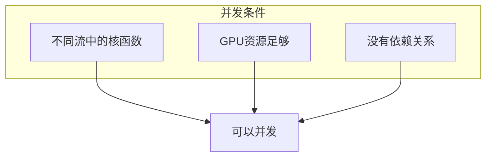

### 8.2 实现并发核函数

```cpp
const int N_KERNELS = 4;
cudaStream_t streams[N_KERNELS];

// 创建流
for (int i = 0; i < N_KERNELS; i++) {
    cudaStreamCreate(&streams[i]);
}

// 并发执行多个核函数
for (int i = 0; i < N_KERNELS; i++) {
    // 每个核函数在不同的流中
    // 且使用不同的数据块
    kernel<<<grid, block, 0, streams[i]>>>(d_data[i], size);
}

// 同步所有流
for (int i = 0; i < N_KERNELS; i++) {
    cudaStreamSynchronize(streams[i]);
}

// 销毁流
for (int i = 0; i < N_KERNELS; i++) {
    cudaStreamDestroy(streams[i]);
}
```

### 8.3 并发核函数的限制

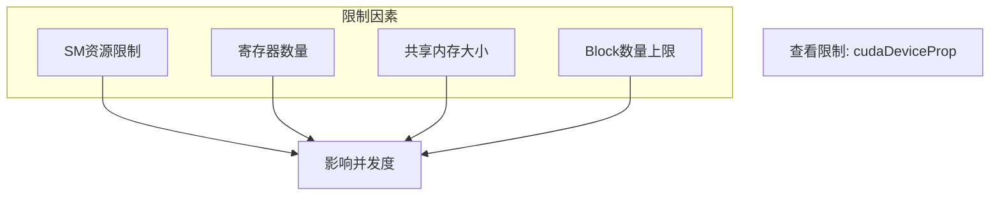

**查询并发限制**：

```cpp
cudaDeviceProp prop;
cudaGetDeviceProperties(&prop, 0);

printf("最大并发核函数数: %d\n", prop.concurrentKernels);
printf("每个SM最大Block数: %d\n", prop.maxBlocksPerMultiprocessor);
printf("SM数量: %d\n", prop.multiProcessorCount);
```

### 8.4 Nsight Systems分析

使用Nsight Systems可视化并发执行：

```bash
# 生成分析报告
nsys profile --stats=true -o concurrent_kernels ./concurrent_kernels

# 使用GUI查看
nsys-ui concurrent_kernels.nsys-rep
```

**Timeline视图解读**：

```mermaid
gantt
    title 多流核函数执行时间线
    dateFormat X
    axisFormat %s

    section Stream 0
    H2D     :0, 1
    Kernel  :1, 3
    D2H     :3, 4

    section Stream 1
    H2D     :0, 1
    Kernel  :1, 3
    D2H     :3, 4

    section Stream 2
    H2D     :0, 1
    Kernel  :1, 3
    D2H     :3, 4
```

---

## 9. 数据传输优化

### 9.1 分页内存 vs 锁页内存

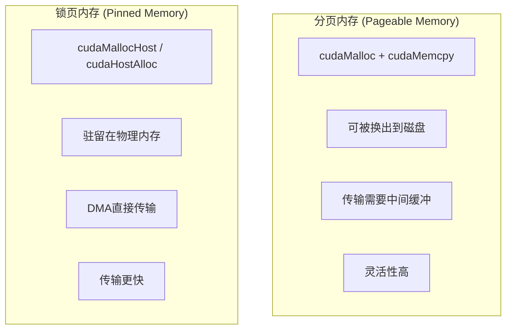

### 9.2 使用锁页内存

```cpp
// 分配锁页内存
float *h_data;
cudaMallocHost(&h_data, size);  // 或 cudaHostAlloc

// 异步传输（需要锁页内存）
cudaMemcpyAsync(d_data, h_data, size, cudaMemcpyHostToDevice, stream);

// 释放锁页内存
cudaFreeHost(h_data);  // 注意：不是cudaFree
```

### 9.3 零拷贝内存

```cpp
// 分配映射到GPU的主机内存
float *h_data;
cudaHostAlloc(&h_data, size, cudaHostAllocMapped);

// 获取设备端指针
float *d_data;
cudaHostGetDevicePointer(&d_data, h_data, 0);

// 核函数可以直接访问主机内存
kernel<<<grid, block>>>(d_data, size);

// 不需要显式的数据传输！

// 释放
cudaFreeHost(h_data);
```

### 9.4 统一内存

```cpp
// 分配统一内存
float *data;
cudaMallocManaged(&data, size);

// CPU和GPU都可以访问
for (int i = 0; i < N; i++) {
    data[i] = i;  // CPU写入
}

kernel<<<grid, block>>>(data, size);  // GPU访问

cudaDeviceSynchronize();

for (int i = 0; i < N; i++) {
    printf("%f ", data[i]);  // CPU读取
}

cudaFree(data);
```

### 9.5 性能对比

```mermaid
graph LR
    subgraph 传输方式对比
        T1["cudaMemcpy: 慢"]
        T2["cudaMemcpyAsync + Pinned: 较快"]
        T3["零拷贝: 小数据快"]
        T4["统一内存: 便捷"]
    end

    T1 --> T2 --> T3
```

| 方式 | 特点 | 适用场景 |
|------|------|----------|
| cudaMemcpy | 同步传输 | 简单场景 |
| cudaMemcpyAsync + Pinned | 异步传输 | 高性能 |
| 零拷贝 | 无传输 | 小数据频繁访问 |
| 统一内存 | 自动迁移 | 便捷开发 |

---

## 10. 流优先级

### 10.1 创建优先级流

```cpp
// 查询优先级范围
int least_priority, greatest_priority;
cudaDeviceGetStreamPriorityRange(&least_priority, &greatest_priority);

// 创建高优先级流
cudaStream_t high_priority_stream;
cudaStreamCreateWithPriority(&high_priority_stream, cudaStreamNonBlocking, greatest_priority);

// 创建低优先级流
cudaStream_t low_priority_stream;
cudaStreamCreateWithPriority(&low_priority_stream, cudaStreamNonBlocking, least_priority);

// 高优先级流中的核函数会被优先调度
kernel_high<<<grid, block, 0, high_priority_stream>>>(...);
kernel_low<<<grid, block, 0, low_priority_stream>>>(...);
```

### 10.2 优先级应用场景

```mermaid
graph TB
    subgraph 应用场景
        A1["实时处理任务"]
        A2["关键路径计算"]
        A3["用户交互响应"]
    end

    A1 --> H["使用高优先级"]
    A2 --> H
    A3 --> H
```

---

## 11. 实践案例

### 11.1 完整的多流示例

```cpp
#include <cstdio>
#include <cuda_runtime.h>

const int N = 1024 * 1024;
const int N_STREAMS = 4;

__global__ void vector_add(float* a, float* b, float* c, int n) {
    int idx = blockIdx.x * blockDim.x + threadIdx.x;
    if (idx < n) {
        c[idx] = a[idx] + b[idx];
    }
}

int main() {
    // 分配锁页内存
    float *h_a, *h_b, *h_c;
    cudaMallocHost(&h_a, N * sizeof(float));
    cudaMallocHost(&h_b, N * sizeof(float));
    cudaMallocHost(&h_c, N * sizeof(float));

    // 初始化数据
    for (int i = 0; i < N; i++) {
        h_a[i] = i;
        h_b[i] = i * 2;
    }

    // 分配设备内存
    float *d_a, *d_b, *d_c;
    cudaMalloc(&d_a, N * sizeof(float));
    cudaMalloc(&d_b, N * sizeof(float));
    cudaMalloc(&d_c, N * sizeof(float));

    // 创建流和事件
    cudaStream_t streams[N_STREAMS];
    cudaEvent_t start, stop;
    cudaEventCreate(&start);
    cudaEventCreate(&stop);

    for (int i = 0; i < N_STREAMS; i++) {
        cudaStreamCreate(&streams[i]);
    }

    int chunk_size = N / N_STREAMS;
    int blockSize = 256;
    int numBlocks = (chunk_size + blockSize - 1) / blockSize;

    // 记录开始时间
    cudaEventRecord(start, streams[0]);

    // 多流并发执行
    for (int i = 0; i < N_STREAMS; i++) {
        int offset = i * chunk_size;

        // H2D传输
        cudaMemcpyAsync(d_a + offset, h_a + offset,
                       chunk_size * sizeof(float), cudaMemcpyHostToDevice, streams[i]);
        cudaMemcpyAsync(d_b + offset, h_b + offset,
                       chunk_size * sizeof(float), cudaMemcpyHostToDevice, streams[i]);

        // 核函数
        vector_add<<<numBlocks, blockSize, 0, streams[i]>>>(
            d_a + offset, d_b + offset, d_c + offset, chunk_size);

        // D2H传输
        cudaMemcpyAsync(h_c + offset, d_c + offset,
                       chunk_size * sizeof(float), cudaMemcpyDeviceToHost, streams[i]);
    }

    // 同步所有流
    for (int i = 0; i < N_STREAMS; i++) {
        cudaStreamSynchronize(streams[i]);
    }

    // 计算时间
    cudaEventRecord(stop, streams[0]);
    cudaEventSynchronize(stop);
    float ms;
    cudaEventElapsedTime(&ms, start, stop);

    printf("多流执行时间: %.3f ms\n", ms);

    // 验证结果
    bool correct = true;
    for (int i = 0; i < 10; i++) {
        if (h_c[i] != h_a[i] + h_b[i]) {
            correct = false;
            break;
        }
    }
    printf("结果验证: %s\n", correct ? "通过" : "失败");

    // 清理
    for (int i = 0; i < N_STREAMS; i++) {
        cudaStreamDestroy(streams[i]);
    }
    cudaEventDestroy(start);
    cudaEventDestroy(stop);
    cudaFree(d_a);
    cudaFree(d_b);
    cudaFree(d_c);
    cudaFreeHost(h_a);
    cudaFreeHost(h_b);
    cudaFreeHost(h_c);

    return 0;
}
```

### 11.2 性能测试框架

```cpp
// 性能对比函数
void benchmark_streams(int n, int n_streams) {
    // ... 分配内存等操作 ...

    // 单流版本
    cudaEventRecord(start);
    cudaMemcpyAsync(d_data, h_data, size, cudaMemcpyHostToDevice, 0);
    kernel<<<grid, block>>>(d_data, n);
    cudaMemcpyAsync(h_result, d_data, size, cudaMemcpyDeviceToHost, 0);
    cudaEventRecord(stop);
    cudaEventSynchronize(stop);
    float single_time;
    cudaEventElapsedTime(&single_time, start, stop);

    // 多流版本
    cudaEventRecord(start);
    for (int i = 0; i < n_streams; i++) {
        // 分发到多个流
    }
    for (int i = 0; i < n_streams; i++) {
        cudaStreamSynchronize(streams[i]);
    }
    cudaEventRecord(stop);
    cudaEventSynchronize(stop);
    float multi_time;
    cudaEventElapsedTime(&multi_time, start, stop);

    printf("单流时间: %.3f ms\n", single_time);
    printf("多流时间: %.3f ms\n", multi_time);
    printf("加速比: %.2fx\n", single_time / multi_time);
}
```

---

## 12. CUDA Graph流捕获

### 12.1 什么是CUDA Graph？

**CUDA Graph** 是CUDA 10引入的特性，允许将一系列CUDA操作捕获为一个工作流图，然后可以多次高效地执行这个图。

```mermaid
graph TB
    subgraph 传统执行
        T1["CPU提交操作1"] --> T2["CPU提交操作2"]
        T2 --> T3["CPU提交操作3"]
        T3 --> T4["...每次都有API开销"]
    end

    subgraph CUDA Graph
        G1["捕获工作流"] --> G2["实例化Graph"]
        G2 --> G3["多次高效执行"]
        G3 --> G4["减少CPU开销"]
    end
```

### 12.2 流捕获API

```cpp
// 核心API
cudaError_t cudaStreamBeginCapture(cudaStream_t stream, enum cudaStreamCaptureMode mode);
cudaError_t cudaStreamEndCapture(cudaStream_t stream, cudaGraph_t *pGraph);
cudaError_t cudaGraphInstantiate(cudaGraphExec_t *pGraphExec, cudaGraph_t graph, ...);
cudaError_t cudaGraphLaunch(cudaGraphExec_t graphExec, cudaStream_t stream);
cudaError_t cudaGraphExecDestroy(cudaGraphExec_t graphExec);
cudaError_t cudaGraphDestroy(cudaGraph_t graph);
```

### 12.3 CUDA Graph捕获完整示例

```cpp
#include <cstdio>
#include <cuda_runtime.h>

#define CHECK_CUDA(call) \
    do { \
        cudaError_t err = call; \
        if (err != cudaSuccess) { \
            printf("CUDA错误 %s:%d: %s\n", __FILE__, __LINE__, \
                   cudaGetErrorString(err)); \
            exit(1); \
        } \
    } while(0)

// 简单的向量操作核函数
__global__ void vector_scale(float* data, int n, float scale) {
    int idx = blockIdx.x * blockDim.x + threadIdx.x;
    if (idx < n) {
        data[idx] *= scale;
    }
}

__global__ void vector_add_const(float* data, int n, float value) {
    int idx = blockIdx.x * blockDim.x + threadIdx.x;
    if (idx < n) {
        data[idx] += value;
    }
}

// CUDA Graph捕获示例
void cuda_graph_capture_example() {
    printf("=== CUDA Graph 捕获示例 ===\n\n");

    const int N = 1024 * 1024;
    const int N_STREAMS = 4;
    const int ITERATIONS = 100;

    // 分配锁页内存
    float *h_data;
    CHECK_CUDA(cudaMallocHost(&h_data, N * sizeof(float)));

    // 初始化数据
    for (int i = 0; i < N; i++) {
        h_data[i] = (float)i;
    }

    // 分配设备内存
    float *d_data;
    CHECK_CUDA(cudaMalloc(&d_data, N * sizeof(float)));

    // 创建流（使用非阻塞流以获得更好的并发性）
    cudaStream_t streams[N_STREAMS];
    for (int i = 0; i < N_STREAMS; i++) {
        CHECK_CUDA(cudaStreamCreateWithFlags(&streams[i], cudaStreamNonBlocking));
    }

    int chunk_size = N / N_STREAMS;
    int blockSize = 256;
    int numBlocks = (chunk_size + blockSize - 1) / blockSize;

    // ===== 步骤1: 开始流捕获 =====
    printf("步骤1: 开始捕获工作流...\n");

    // 使用第一个流进行捕获（捕获模式选择全局模式）
    CHECK_CUDA(cudaStreamBeginCapture(streams[0], cudaStreamCaptureModeGlobal));

    // ===== 步骤2: 录制工作流 =====
    printf("步骤2: 录制操作序列...\n");

    for (int i = 0; i < N_STREAMS; i++) {
        int offset = i * chunk_size;

        // H2D传输
        CHECK_CUDA(cudaMemcpyAsync(d_data + offset, h_data + offset,
                                   chunk_size * sizeof(float),
                                   cudaMemcpyHostToDevice, streams[i]));

        // 核函数操作
        vector_scale<<<numBlocks, blockSize, 0, streams[i]>>>(
            d_data + offset, chunk_size, 2.0f);
        vector_add_const<<<numBlocks, blockSize, 0, streams[i]>>>(
            d_data + offset, chunk_size, 1.0f);

        // D2H传输
        CHECK_CUDA(cudaMemcpyAsync(h_data + offset, d_data + offset,
                                   chunk_size * sizeof(float),
                                   cudaMemcpyDeviceToHost, streams[i]));
    }

    // ===== 步骤3: 结束捕获 =====
    printf("步骤3: 结束捕获，创建Graph...\n");

    cudaGraph_t graph;
    CHECK_CUDA(cudaStreamEndCapture(streams[0], &graph));

    // ===== 步骤4: 实例化Graph =====
    printf("步骤4: 实例化可执行Graph...\n");

    cudaGraphExec_t graph_exec;
    CHECK_CUDA(cudaGraphInstantiate(&graph_exec, graph, NULL, NULL, 0));

    // ===== 性能对比 =====
    printf("\n=== 性能对比测试 ===\n");

    cudaEvent_t start, stop;
    CHECK_CUDA(cudaEventCreate(&start));
    CHECK_CUDA(cudaEventCreate(&stop));

    // 重置数据
    for (int i = 0; i < N; i++) {
        h_data[i] = (float)i;
    }

    // 传统执行方式
    printf("\n传统执行方式 (%d次迭代):\n", ITERATIONS);
    CHECK_CUDA(cudaEventRecord(start));

    for (int iter = 0; iter < ITERATIONS; iter++) {
        for (int i = 0; i < N_STREAMS; i++) {
            int offset = i * chunk_size;
            cudaMemcpyAsync(d_data + offset, h_data + offset,
                           chunk_size * sizeof(float), cudaMemcpyHostToDevice, streams[i]);
            vector_scale<<<numBlocks, blockSize, 0, streams[i]>>>(
                d_data + offset, chunk_size, 2.0f);
            vector_add_const<<<numBlocks, blockSize, 0, streams[i]>>>(
                d_data + offset, chunk_size, 1.0f);
            cudaMemcpyAsync(h_data + offset, d_data + offset,
                           chunk_size * sizeof(float), cudaMemcpyDeviceToHost, streams[i]);
        }
        for (int i = 0; i < N_STREAMS; i++) {
            cudaStreamSynchronize(streams[i]);
        }
    }

    CHECK_CUDA(cudaEventRecord(stop));
    CHECK_CUDA(cudaEventSynchronize(stop));

    float traditional_time;
    CHECK_CUDA(cudaEventElapsedTime(&traditional_time, start, stop));
    printf("  总时间: %.3f ms\n", traditional_time);
    printf("  平均每次: %.3f ms\n", traditional_time / ITERATIONS);

    // 重置数据
    for (int i = 0; i < N; i++) {
        h_data[i] = (float)i;
    }

    // Graph执行方式
    printf("\nCUDA Graph执行方式 (%d次迭代):\n", ITERATIONS);
    CHECK_CUDA(cudaEventRecord(start));

    for (int iter = 0; iter < ITERATIONS; iter++) {
        CHECK_CUDA(cudaGraphLaunch(graph_exec, streams[0]));
    }
    CHECK_CUDA(cudaStreamSynchronize(streams[0]));

    CHECK_CUDA(cudaEventRecord(stop));
    CHECK_CUDA(cudaEventSynchronize(stop));

    float graph_time;
    CHECK_CUDA(cudaEventElapsedTime(&graph_time, start, stop));
    printf("  总时间: %.3f ms\n", graph_time);
    printf("  平均每次: %.3f ms\n", graph_time / ITERATIONS);

    printf("\n加速比: %.2fx\n", traditional_time / graph_time);

    // 验证结果
    bool correct = true;
    for (int i = 0; i < 10; i++) {
        float expected = i * 2.0f + 1.0f;
        if (fabs(h_data[i] - expected) > 1e-5f) {
            correct = false;
            printf("错误: h_data[%d] = %.1f, 期望 %.1f\n", i, h_data[i], expected);
            break;
        }
    }
    printf("结果验证: %s\n", correct ? "通过" : "失败");

    // ===== 清理资源 =====
    CHECK_CUDA(cudaGraphExecDestroy(graph_exec));
    CHECK_CUDA(cudaGraphDestroy(graph));
    CHECK_CUDA(cudaEventDestroy(start));
    CHECK_CUDA(cudaEventDestroy(stop));

    for (int i = 0; i < N_STREAMS; i++) {
        CHECK_CUDA(cudaStreamDestroy(streams[i]));
    }

    CHECK_CUDA(cudaFree(d_data));
    CHECK_CUDA(cudaFreeHost(h_data));

    printf("\n资源清理完成\n");
}

// Graph更新示例
void cuda_graph_update_example() {
    printf("\n=== CUDA Graph 动态更新示例 ===\n\n");

    const int N = 1024 * 1024;
    float *d_data, *h_data;

    CHECK_CUDA(cudaMallocHost(&h_data, N * sizeof(float)));
    CHECK_CUDA(cudaMalloc(&d_data, N * sizeof(float)));

    cudaStream_t stream;
    CHECK_CUDA(cudaStreamCreate(&stream));

    // 捕获Graph
    CHECK_CUDA(cudaStreamBeginCapture(stream, cudaStreamCaptureModeGlobal));
    cudaMemcpyAsync(d_data, h_data, N * sizeof(float), cudaMemcpyHostToDevice, stream);
    vector_scale<<<(N + 255) / 256, 256, 0, stream>>>(d_data, N, 2.0f);
    cudaMemcpyAsync(h_data, d_data, N * sizeof(float), cudaMemcpyDeviceToHost, stream);
    CHECK_CUDA(cudaStreamEndCapture(stream, &graph));

    cudaGraphExec_t graph_exec;
    CHECK_CUDA(cudaGraphInstantiate(&graph_exec, graph, NULL, NULL, 0));

    printf("已创建Graph，现在可以多次高效执行\n");

    // 执行Graph多次
    for (int i = 0; i < 5; i++) {
        CHECK_CUDA(cudaGraphLaunch(graph_exec, stream));
        CHECK_CUDA(cudaStreamSynchronize(stream));
        printf("  第%d次执行完成\n", i + 1);
    }

    // 清理
    CHECK_CUDA(cudaGraphExecDestroy(graph_exec));
    CHECK_CUDA(cudaGraphDestroy(graph));
    CHECK_CUDA(cudaStreamDestroy(stream));
    CHECK_CUDA(cudaFree(d_data));
    CHECK_CUDA(cudaFreeHost(h_data));
}

int main() {
    printf("========================================\n");
    printf("  CUDA Graph 完整示例\n");
    printf("========================================\n\n");

    cuda_graph_capture_example();

    printf("\n========================================\n");
    printf("CUDA Graph API总结:\n");
    printf("  cudaStreamBeginCapture: 开始捕获\n");
    printf("  cudaStreamEndCapture:   结束捕获\n");
    printf("  cudaGraphInstantiate:   实例化Graph\n");
    printf("  cudaGraphLaunch:        执行Graph\n");
    printf("  cudaGraphExecDestroy:   销毁可执行Graph\n");
    printf("  cudaGraphDestroy:       销毁Graph\n");
    printf("========================================\n");

    return 0;
}
```

### 12.4 Graph捕获模式

```cpp
// 捕获模式
cudaStreamCaptureModeGlobal      // 全局模式（默认）
cudaStreamCaptureModeThreadLocal // 线程本地模式
cudaStreamCaptureModeRelaxed     // 宽松模式
```

### 12.5 Graph适用场景

```mermaid
graph TB
    subgraph 适合使用Graph
        S1["重复执行相同操作序列"]
        S2["操作间依赖固定"]
        S3["需要减少CPU开销"]
        S4["深度学习推理"]
    end

    subgraph 不适合使用Graph
        N1["每次操作不同"]
        N2["动态依赖关系"]
        N3["单次执行场景"]
    end

    S1 --> G["性能提升明显"]
    S2 --> G
    S3 --> G
    S4 --> G

    N1 --> B["收益有限"]
    N2 --> B
    N3 --> B
```

---

## 13. 流回调实战

### 13.1 流回调机制

**流回调（Stream Callback）** 允许在流中的特定点执行CPU端函数，常用于：
- 操作完成通知
- 日志记录
- 性能监控
- 与CPU端资源同步

```cpp
// 回调函数签名
void CUDART_CB callback_function(cudaStream_t stream, cudaError_t status, void *userdata);
```

### 13.2 流回调完整示例

```cpp
#include <cstdio>
#include <cstring>
#include <cuda_runtime.h>

#define CHECK_CUDA(call) \
    do { \
        cudaError_t err = call; \
        if (err != cudaSuccess) { \
            printf("CUDA错误 %s:%d: %s\n", __FILE__, __LINE__, \
                   cudaGetErrorString(err)); \
            exit(1); \
        } \
    } while(0)

// 计算核函数
__global__ void compute_kernel(float* data, int n, int work) {
    int idx = blockIdx.x * blockDim.x + threadIdx.x;
    if (idx < n) {
        float val = data[idx];
        for (int i = 0; i < work; i++) {
            val = val * 1.0001f + 0.0001f;
        }
        data[idx] = val;
    }
}

// ===== 回调数据结构 =====
struct CallbackData {
    int stage;
    const char* name;
    double* total_time;
    cudaEvent_t start_event;
};

// ===== 回调函数 =====
void CUDART_CB timing_callback(cudaStream_t stream, cudaError_t status, void *userdata) {
    CallbackData* data = (CallbackData*)userdata;

    cudaEvent_t stop;
    cudaEventCreate(&stop);
    cudaEventRecord(stop, stream);
    cudaEventSynchronize(stop);

    float ms;
    cudaEventElapsedTime(&ms, data->start_event, stop);
    *(data->total_time) += ms;

    printf("  [回调] %s 完成, 状态: %s, 耗时: %.3f ms\n",
           data->name, cudaGetErrorString(status), ms);

    cudaEventDestroy(stop);
}

void CUDART_CB logging_callback(cudaStream_t stream, cudaError_t status, void *userdata) {
    const char* message = (const char*)userdata;
    printf("  [日志] %s - Stream: %p, Status: %s\n",
           message, stream, cudaGetErrorString(status));
}

void CUDART_CB progress_callback(cudaStream_t stream, cudaError_t status, void *userdata) {
    int* counter = (int*)userdata;
    (*counter)++;
    printf("  [进度] 已完成 %d 个阶段\n", *counter);
}

// ===== 示例1: 基本回调 =====
void basic_callback_example() {
    printf("\n=== 示例1: 基本回调 ===\n");

    const int N = 1024 * 1024;
    float *d_data;
    CHECK_CUDA(cudaMalloc(&d_data, N * sizeof(float)));

    cudaStream_t stream;
    CHECK_CUDA(cudaStreamCreate(&stream));

    int blockSize = 256;
    int numBlocks = (N + blockSize - 1) / blockSize;

    // 发射核函数
    compute_kernel<<<numBlocks, blockSize, 0, stream>>>(d_data, N, 1000);

    // 添加回调
    const char* message = "核函数执行完成";
    CHECK_CUDA(cudaStreamAddCallback(stream, logging_callback, (void*)message, 0));

    // 等待完成
    CHECK_CUDA(cudaStreamSynchronize(stream));

    CHECK_CUDA(cudaStreamDestroy(stream));
    CHECK_CUDA(cudaFree(d_data));
}

// ===== 示例2: 多阶段进度追踪 =====
void progress_tracking_example() {
    printf("\n=== 示例2: 多阶段进度追踪 ===\n");

    const int N = 1024 * 1024;
    const int NUM_STAGES = 5;

    float *d_data;
    CHECK_CUDA(cudaMalloc(&d_data, N * sizeof(float)));

    cudaStream_t stream;
    CHECK_CUDA(cudaStreamCreate(&stream));

    int blockSize = 256;
    int numBlocks = (N + blockSize - 1) / blockSize;

    int progress_counter = 0;

    for (int stage = 0; stage < NUM_STAGES; stage++) {
        // 执行操作
        compute_kernel<<<numBlocks, blockSize, 0, stream>>>(d_data, N, 500);

        // 添加进度回调
        CHECK_CUDA(cudaStreamAddCallback(stream, progress_callback,
                                         &progress_counter, 0));
    }

    CHECK_CUDA(cudaStreamSynchronize(stream));

    printf("  总共完成 %d 个阶段\n", progress_counter);

    CHECK_CUDA(cudaStreamDestroy(stream));
    CHECK_CUDA(cudaFree(d_data));
}

// ===== 示例3: 性能计时回调 =====
void timing_callback_example() {
    printf("\n=== 示例3: 性能计时回调 ===\n");

    const int N = 1024 * 1024;
    float *d_data;
    CHECK_CUDA(cudaMalloc(&d_data, N * sizeof(float)));

    cudaStream_t stream;
    CHECK_CUDA(cudaStreamCreate(&stream));

    int blockSize = 256;
    int numBlocks = (N + blockSize - 1) / blockSize;

    cudaEvent_t start_event;
    CHECK_CUDA(cudaEventCreate(&start_event));

    double total_kernel_time = 0.0;

    CallbackData callback_data;
    callback_data.name = "Kernel执行";
    callback_data.total_time = &total_kernel_time;
    callback_data.start_event = start_event;

    // 多次执行并计时
    for (int i = 0; i < 5; i++) {
        CHECK_CUDA(cudaEventRecord(start_event, stream));
        compute_kernel<<<numBlocks, blockSize, 0, stream>>>(d_data, N, 1000);

        char stage_name[64];
        snprintf(stage_name, sizeof(stage_name), "Kernel %d", i + 1);
        callback_data.name = stage_name;

        CHECK_CUDA(cudaStreamAddCallback(stream, timing_callback, &callback_data, 0));
    }

    CHECK_CUDA(cudaStreamSynchronize(stream));

    printf("\n  总核函数时间: %.3f ms\n", total_kernel_time);

    CHECK_CUDA(cudaEventDestroy(start_event));
    CHECK_CUDA(cudaStreamDestroy(stream));
    CHECK_CUDA(cudaFree(d_data));
}

// ===== 示例4: 流间同步回调 =====
void inter_stream_sync_example() {
    printf("\n=== 示例4: 流间同步回调 ===\n");

    const int N = 1024 * 1024;
    float *d_data;
    CHECK_CUDA(cudaMalloc(&d_data, N * sizeof(float)));

    cudaStream_t stream1, stream2;
    CHECK_CUDA(cudaStreamCreate(&stream1));
    CHECK_CUDA(cudaStreamCreate(&stream2));

    int blockSize = 256;
    int numBlocks = (N + blockSize - 1) / blockSize;

    // Stream 1 执行
    compute_kernel<<<numBlocks, blockSize, 0, stream1>>>(d_data, N, 1000);
    CHECK_CUDA(cudaStreamAddCallback(stream1, logging_callback,
                                     (void*)"Stream1 完成，触发Stream2", 0));

    // Stream 2 等待 Stream 1
    cudaEvent_t event;
    CHECK_CUDA(cudaEventCreate(&event));
    CHECK_CUDA(cudaEventRecord(event, stream1));
    CHECK_CUDA(cudaStreamWaitEvent(stream2, event, 0));

    compute_kernel<<<numBlocks, blockSize, 0, stream2>>>(d_data, N, 500);
    CHECK_CUDA(cudaStreamAddCallback(stream2, logging_callback,
                                     (void*)"Stream2 完成", 0));

    CHECK_CUDA(cudaStreamSynchronize(stream2));

    CHECK_CUDA(cudaEventDestroy(event));
    CHECK_CUDA(cudaStreamDestroy(stream1));
    CHECK_CUDA(cudaStreamDestroy(stream2));
    CHECK_CUDA(cudaFree(d_data));
}

// ===== 示例5: 错误处理回调 =====
struct ErrorContext {
    bool* error_occurred;
    const char* operation_name;
};

void CUDART_CB error_handling_callback(cudaStream_t stream, cudaError_t status, void *userdata) {
    ErrorContext* ctx = (ErrorContext*)userdata;

    if (status != cudaSuccess) {
        printf("  [错误] 操作 '%s' 失败: %s\n",
               ctx->operation_name, cudaGetErrorString(status));
        *(ctx->error_occurred) = true;
    } else {
        printf("  [成功] 操作 '%s' 完成\n", ctx->operation_name);
    }
}

void error_handling_example() {
    printf("\n=== 示例5: 错误处理回调 ===\n");

    cudaStream_t stream;
    CHECK_CUDA(cudaStreamCreate(&stream));

    float *d_data;
    CHECK_CUDA(cudaMalloc(&d_data, 1024 * sizeof(float)));

    bool error_occurred = false;

    ErrorContext ctx;
    ctx.error_occurred = &error_occurred;
    ctx.operation_name = "数据初始化";

    compute_kernel<<<4, 256, 0, stream>>>(d_data, 1024, 100);
    CHECK_CUDA(cudaStreamAddCallback(stream, error_handling_callback, &ctx, 0));

    ctx.operation_name = "数据处理";
    compute_kernel<<<4, 256, 0, stream>>>(d_data, 1024, 100);
    CHECK_CUDA(cudaStreamAddCallback(stream, error_handling_callback, &ctx, 0));

    CHECK_CUDA(cudaStreamSynchronize(stream));

    if (!error_occurred) {
        printf("  所有操作成功完成\n");
    }

    CHECK_CUDA(cudaStreamDestroy(stream));
    CHECK_CUDA(cudaFree(d_data));
}

int main() {
    printf("========================================\n");
    printf("  流回调实战示例\n");
    printf("========================================\n");

    basic_callback_example();
    progress_tracking_example();
    timing_callback_example();
    inter_stream_sync_example();
    error_handling_example();

    printf("\n========================================\n");
    printf("流回调API总结:\n");
    printf("  cudaStreamAddCallback: 添加回调函数\n");
    printf("\n注意事项:\n");
    printf("  1. 回调函数不能调用CUDA API（某些除外）\n");
    printf("  2. 回调会阻塞流中的后续操作\n");
    printf("  3. 适合轻量级操作，避免耗时任务\n");
    printf("  4. 可用于日志、进度追踪、计时等\n");
    printf("========================================\n");

    return 0;
}
```

### 13.3 回调注意事项

```mermaid
graph TB
    subgraph 回调限制
        L1["不能调用阻塞CUDA API"]
        L2["不能在回调中同步流"]
        L3["执行时间应尽量短"]
    end

    subgraph 适用操作
        G1["日志记录"]
        G2["状态更新"]
        G3["事件通知"]
        G4["轻量计时"]
    end

    L1 --> W["违反可能导致死锁"]
    L2 --> W
    L3 --> P["影响GPU性能"]

    G1 --> O["安全使用"]
    G2 --> O
    G3 --> O
    G4 --> O
```

---

## 14. 多流与单流性能基准测试

### 14.1 完整性能基准测试代码

```cpp
#include <cstdio>
#include <cstdlib>
#include <cstring>
#include <cuda_runtime.h>

#define CHECK_CUDA(call) \
    do { \
        cudaError_t err = call; \
        if (err != cudaSuccess) { \
            printf("CUDA错误 %s:%d: %s\n", __FILE__, __LINE__, \
                   cudaGetErrorString(err)); \
            exit(1); \
        } \
    } while(0)

// 核函数：向量操作
__global__ void vector_op(float* data, int n, float scale, int iterations) {
    int idx = blockIdx.x * blockDim.x + threadIdx.x;
    if (idx < n) {
        float val = data[idx];
        for (int i = 0; i < iterations; i++) {
            val = val * scale + 1.0f;
        }
        data[idx] = val;
    }
}

// 计时辅助类
class CudaTimer {
public:
    CudaTimer() {
        cudaEventCreate(&start_);
        cudaEventCreate(&stop_);
    }
    ~CudaTimer() {
        cudaEventDestroy(start_);
        cudaEventDestroy(stop_);
    }
    void start(cudaStream_t stream = 0) {
        stream_ = stream;
        cudaEventRecord(start_, stream);
    }
    float stop() {
        cudaEventRecord(stop_, stream_);
        cudaEventSynchronize(stop_);
        float ms;
        cudaEventElapsedTime(&ms, start_, stop_);
        return ms;
    }
private:
    cudaEvent_t start_, stop_;
    cudaStream_t stream_;
};

// 基准测试配置
struct BenchmarkConfig {
    int data_size;          // 数据大小（元素数）
    int num_iterations;     // 重复次数
    int num_streams;        // 流数量
    int kernel_iterations;  // 核函数迭代次数
    bool use_pinned_memory; // 是否使用锁页内存
};

// 基准测试结果
struct BenchmarkResult {
    float total_time_ms;
    float avg_time_ms;
    float bandwidth_gb_s;
    float speedup;
};

// 单流版本
BenchmarkResult single_stream_benchmark(const BenchmarkConfig& config) {
    size_t data_bytes = config.data_size * sizeof(float);

    // 分配内存
    float *h_data, *h_result;
    if (config.use_pinned_memory) {
        CHECK_CUDA(cudaMallocHost(&h_data, data_bytes));
        CHECK_CUDA(cudaMallocHost(&h_result, data_bytes));
    } else {
        h_data = (float*)malloc(data_bytes);
        h_result = (float*)malloc(data_bytes);
    }

    float *d_data;
    CHECK_CUDA(cudaMalloc(&d_data, data_bytes));

    // 初始化数据
    for (int i = 0; i < config.data_size; i++) {
        h_data[i] = (float)i;
    }

    int blockSize = 256;
    int numBlocks = (config.data_size + blockSize - 1) / blockSize;

    // 预热
    for (int i = 0; i < 3; i++) {
        cudaMemcpy(d_data, h_data, data_bytes, cudaMemcpyHostToDevice);
        vector_op<<<numBlocks, blockSize>>>(d_data, config.data_size, 2.0f, config.kernel_iterations);
        cudaMemcpy(h_result, d_data, data_bytes, cudaMemcpyDeviceToHost);
    }
    CHECK_CUDA(cudaDeviceSynchronize());

    // 正式测试
    CudaTimer timer;
    timer.start();

    for (int iter = 0; iter < config.num_iterations; iter++) {
        cudaMemcpy(d_data, h_data, data_bytes, cudaMemcpyHostToDevice);
        vector_op<<<numBlocks, blockSize>>>(d_data, config.data_size, 2.0f, config.kernel_iterations);
        cudaMemcpy(h_result, d_data, data_bytes, cudaMemcpyDeviceToHost);
    }

    float total_time = timer.stop();

    // 清理
    CHECK_CUDA(cudaFree(d_data));
    if (config.use_pinned_memory) {
        CHECK_CUDA(cudaFreeHost(h_data));
        CHECK_CUDA(cudaFreeHost(h_result));
    } else {
        free(h_data);
        free(h_result);
    }

    BenchmarkResult result;
    result.total_time_ms = total_time;
    result.avg_time_ms = total_time / config.num_iterations;
    result.bandwidth_gb_s = (double)config.data_size * sizeof(float) * 3 * config.num_iterations
                            / (total_time * 1e6);
    result.speedup = 1.0f;
    return result;
}

// 多流版本
BenchmarkResult multi_stream_benchmark(const BenchmarkConfig& config) {
    size_t data_bytes = config.data_size * sizeof(float);
    size_t chunk_bytes = data_bytes / config.num_streams;
    int chunk_size = config.data_size / config.num_streams;

    // 分配锁页内存（多流必须使用锁页内存进行异步传输）
    float *h_data, *h_result;
    CHECK_CUDA(cudaMallocHost(&h_data, data_bytes));
    CHECK_CUDA(cudaMallocHost(&h_result, data_bytes));

    float *d_data;
    CHECK_CUDA(cudaMalloc(&d_data, data_bytes));

    // 初始化数据
    for (int i = 0; i < config.data_size; i++) {
        h_data[i] = (float)i;
    }

    // 创建流
    cudaStream_t* streams = new cudaStream_t[config.num_streams];
    for (int i = 0; i < config.num_streams; i++) {
        CHECK_CUDA(cudaStreamCreateWithFlags(&streams[i], cudaStreamNonBlocking));
    }

    int blockSize = 256;
    int numBlocks = (chunk_size + blockSize - 1) / blockSize;

    // 预热
    for (int iter = 0; iter < 3; iter++) {
        for (int i = 0; i < config.num_streams; i++) {
            int offset = i * chunk_size;
            cudaMemcpyAsync(d_data + offset, h_data + offset, chunk_bytes,
                           cudaMemcpyHostToDevice, streams[i]);
            vector_op<<<numBlocks, blockSize, 0, streams[i]>>>(
                d_data + offset, chunk_size, 2.0f, config.kernel_iterations);
            cudaMemcpyAsync(h_result + offset, d_data + offset, chunk_bytes,
                           cudaMemcpyDeviceToHost, streams[i]);
        }
        for (int i = 0; i < config.num_streams; i++) {
            cudaStreamSynchronize(streams[i]);
        }
    }

    // 正式测试
    CudaTimer timer;
    timer.start();

    for (int iter = 0; iter < config.num_iterations; iter++) {
        for (int i = 0; i < config.num_streams; i++) {
            int offset = i * chunk_size;
            cudaMemcpyAsync(d_data + offset, h_data + offset, chunk_bytes,
                           cudaMemcpyHostToDevice, streams[i]);
            vector_op<<<numBlocks, blockSize, 0, streams[i]>>>(
                d_data + offset, chunk_size, 2.0f, config.kernel_iterations);
            cudaMemcpyAsync(h_result + offset, d_data + offset, chunk_bytes,
                           cudaMemcpyDeviceToHost, streams[i]);
        }
        for (int i = 0; i < config.num_streams; i++) {
            cudaStreamSynchronize(streams[i]);
        }
    }

    float total_time = timer.stop();

    // 清理
    for (int i = 0; i < config.num_streams; i++) {
        CHECK_CUDA(cudaStreamDestroy(streams[i]));
    }
    delete[] streams;
    CHECK_CUDA(cudaFree(d_data));
    CHECK_CUDA(cudaFreeHost(h_data));
    CHECK_CUDA(cudaFreeHost(h_result));

    BenchmarkResult result;
    result.total_time_ms = total_time;
    result.avg_time_ms = total_time / config.num_iterations;
    result.bandwidth_gb_s = (double)config.data_size * sizeof(float) * 3 * config.num_iterations
                            / (total_time * 1e6);
    result.speedup = 1.0f;
    return result;
}

// 运行基准测试
void run_benchmark(int data_size, int num_iterations, bool use_pinned) {
    printf("\n========================================\n");
    printf("数据量: %d 元素 (%.2f MB)\n", data_size, data_size * sizeof(float) / 1024.0 / 1024.0);
    printf("迭代次数: %d\n", num_iterations);
    printf("内存类型: %s\n", use_pinned ? "锁页内存" : "分页内存");
    printf("========================================\n");

    BenchmarkConfig config;
    config.data_size = data_size;
    config.num_iterations = num_iterations;
    config.kernel_iterations = 100;
    config.use_pinned_memory = use_pinned;

    // 单流基准
    config.num_streams = 1;
    BenchmarkResult single_result = single_stream_benchmark(config);
    printf("\n单流结果:\n");
    printf("  总时间:     %.3f ms\n", single_result.total_time_ms);
    printf("  平均时间:   %.3f ms\n", single_result.avg_time_ms);
    printf("  带宽:       %.2f GB/s\n", single_result.bandwidth_gb_s);

    // 多流测试（不同流数量）
    printf("\n多流结果:\n");
    printf("%-8s %-12s %-12s %-12s\n", "流数量", "平均时间(ms)", "带宽(GB/s)", "加速比");
    printf("--------------------------------------------\n");

    for (int num_streams = 2; num_streams <= 16; num_streams *= 2) {
        config.num_streams = num_streams;
        config.use_pinned_memory = true;  // 多流必须使用锁页内存

        BenchmarkResult multi_result = multi_stream_benchmark(config);
        multi_result.speedup = single_result.avg_time_ms / multi_result.avg_time_ms;

        printf("%-8d %-12.3f %-12.2f %-12.2fx\n",
               num_streams, multi_result.avg_time_ms, multi_result.bandwidth_gb_s, multi_result.speedup);
    }
}

int main() {
    printf("========================================\n");
    printf("  多流与单流性能基准测试\n");
    printf("========================================\n\n");

    // 获取设备信息
    int device;
    CHECK_CUDA(cudaGetDevice(&device));
    cudaDeviceProp prop;
    CHECK_CUDA(cudaGetDeviceProperties(&prop, device));

    printf("设备: %s\n", prop.name);
    printf("SM数量: %d\n", prop.multiProcessorCount);
    printf("最大并发核函数: %d\n", prop.concurrentKernels);
    printf("内存带宽: %.0f GB/s\n", prop.memoryBusWidth * prop.memoryClockRate * 2 / 8.0 / 1e6);

    // 不同数据量的测试
    run_benchmark(1 * 1024 * 1024, 10, true);    // 4 MB
    run_benchmark(4 * 1024 * 1024, 10, true);    // 16 MB
    run_benchmark(16 * 1024 * 1024, 5, true);    // 64 MB
    run_benchmark(64 * 1024 * 1024, 3, true);    // 256 MB

    printf("\n========================================\n");
    printf("基准测试结论:\n");
    printf("  1. 多流对小数据加速效果明显（隐藏延迟）\n");
    printf("  2. 最佳流数量通常为 4-8 个\n");
    printf("  3. 锁页内存是多流异步传输的前提\n");
    printf("  4. 流数量过多会增加CPU开销\n");
    printf("========================================\n");

    return 0;
}
```

### 14.2 性能分析图表

```mermaid
graph TB
    subgraph 性能影响因素
        F1["数据大小"]
        F2["流数量"]
        F3["核函数计算强度"]
        F4["内存类型"]
    end

    F1 --> R["选择最优配置"]
    F2 --> R
    F3 --> R
    F4 --> R

    subgraph 建议
        S1["小数据: 2-4个流"]
        S2["中等数据: 4-8个流"]
        S3["大数据: 8-16个流"]
        S4["始终使用锁页内存"]
    end

    R --> S1
    R --> S2
    R --> S3
    R --> S4
```

---

## 15. 本章小结

### 15.1 关键概念

| 概念 | 描述 |
|------|------|
| CUDA流 | GPU操作的执行队列 |
| 默认流 | 隐式同步其他流的特殊流 |
| 命名流 | 可并发执行的显式创建流 |
| CUDA事件 | 用于同步和计时的标记点 |
| 锁页内存 | 驻留在物理内存中的主机内存 |

### 15.2 最佳实践

```mermaid
graph TB
    subgraph 多流编程最佳实践
        B1["使用非阻塞流"]
        B2["合理划分数据"]
        B3["最小化同步"]
        B4["使用事件进行细粒度同步"]
    end

    B1 --> R["提高并发度"]
    B2 --> R
    B3 --> R
    B4 --> R
```

### 15.3 思考题

1. 为什么默认流会与其他流隐式同步？如何避免？
2. 多少个流是最佳的？如何确定？
3. 锁页内存有什么限制？什么时候不适合使用？
4. 如何使用Nsight Systems分析和优化多流程序？

---

## 下一章

[第二十三章：数据传输优化](./23_数据传输优化.md) - 深入学习CUDA数据传输的各种优化技术

---

*参考资料：*
- *[CUDA C++ Programming Guide - Streams](https://docs.nvidia.com/cuda/cuda-c-programming-guide/index.html#streams)*
- *[CUDA C++ Programming Guide - Events](https://docs.nvidia.com/cuda/cuda-c-programming-guide/index.html#events)*
- *[CUDA Best Practices Guide - Concurrent Execution](https://docs.nvidia.com/cuda/cuda-c-best-practices-guide/index.html#concurrent-execution)*