# 第二十三章：数据传输优化

> 学习目标：深入理解CUDA数据传输的各种优化技术，掌握锁页内存、零拷贝、统一内存等高级内存管理技术
>
> 预计阅读时间：60 分钟
>
> 前置知识：[第二十一章：异步执行与延迟隐藏](./21_异步执行与延迟隐藏.md) | [第二十二章：CUDA流与并发](./22_CUDA流与并发.md)

---

## 1. 数据传输问题分析

### 1.1 数据传输瓶颈

在CUDA程序中，主机与设备之间的数据传输往往是性能瓶颈：

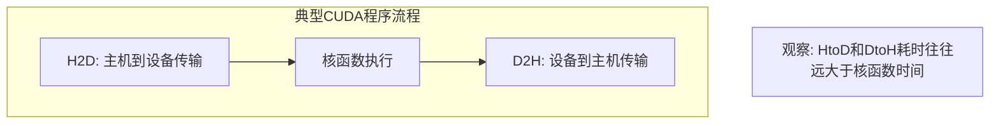

**性能指标分析**：
```
总耗时 = T_H2D + T_kernel + T_D2H

Insight: H↔D 耗时多 → CPU↔GPU通信 → 传输带宽是瓶颈
```

### 1.2 内存类型概述

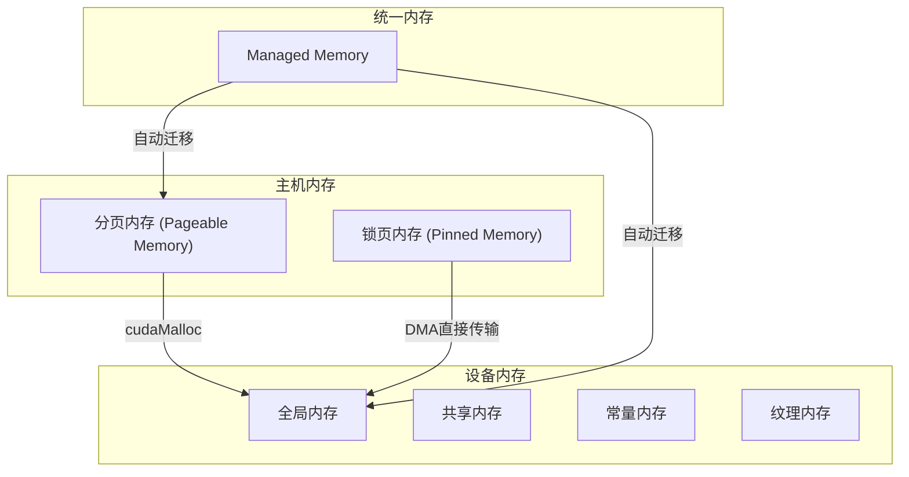

**CUDA内存层次结构**：


上图展示了CUDA的完整内存层次结构，包括：
- **寄存器（Registers）**：最快，线程私有
- **共享内存（Shared Memory）**：块内线程共享，低延迟
- **L1/L2缓存**：硬件管理的缓存
- **全局内存（Global Memory）**：所有线程可访问，高延迟
- **本地内存（Local Memory）**：溢出数据存储

**官方文档说明**（来自CUDA C Programming Guide）：

> CUDA线程在执行过程中可以访问多个内存空间。每个线程拥有私有的本地内存。每个线程块拥有共享内存，该内存对块内所有线程可见，生命周期与块相同。线程块集群中的线程块可以相互读取、写入和执行原子操作。所有线程都可以访问相同的全局内存。

此外，还有两个对所有线程可访问的只读内存空间：**常量内存**和**纹理内存**。全局内存、常量内存和纹理内存针对不同的内存使用场景进行了优化。纹理内存还提供不同的寻址模式以及针对特定数据格式的数据过滤功能。

全局内存、常量内存和纹理内存空间在同一应用程序的核函数启动之间是持久的。

**线程层次结构与内存访问**：


上图展示了CUDA的线程组织结构：Grid包含多个Block，每个Block包含多个Thread。这种层次结构直接影响数据传输和内存访问的模式：

- **线程（Thread）**：最小的执行单元，拥有私有寄存器和本地内存
- **线程块（Block）**：一组协作的线程，共享共享内存，可以通过`__syncthreads()`同步
- **线程块网格（Grid）**：由多个线程块组成，可以并发执行

**数据传输与线程层次结构的关系**：

| 层次 | 数据传输特点 |
|------|-------------|
| Grid级别 | 全局内存分配和传输，通过`cudaMemcpy`系列函数 |
| Block级别 | 共享内存使用，块内数据重用 |
| Thread级别 | 寄存器使用，最快但容量有限 |

### 1.3 数据传输方式对比

| 方式 | 特点 | 适用场景 |
|------|------|----------|
| cudaMemcpy | 同步传输，简单易用 | 简单场景 |
| cudaMemcpyAsync | 异步传输，需要锁页内存 | 高性能场景 |
| 零拷贝 | 无显式传输，直接访问 | 小数据频繁访问 |
| 统一内存 | 自动迁移，编程便捷 | 快速开发 |
| cudaMallocAsync | 异步内存分配 | 现代CUDA程序 |

---

## 2. 锁页内存 (Pinned Memory)

### 2.1 分页内存 vs 锁页内存

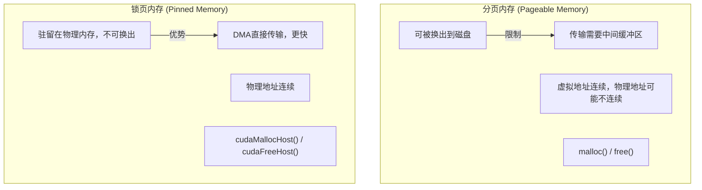

**传输流程对比**：

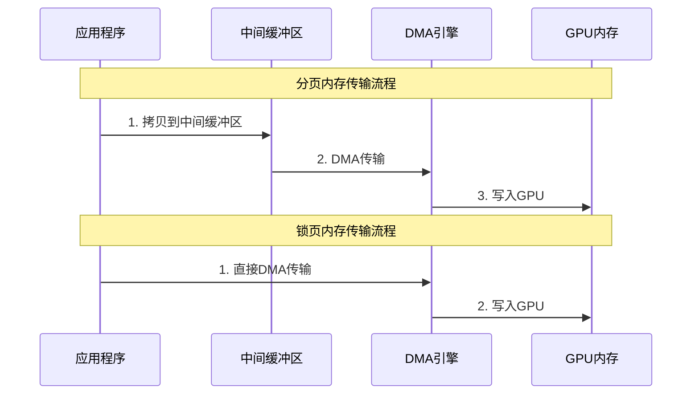

### 2.2 锁页内存API

```cpp
// 分配锁页内存
float *h_data;
cudaMallocHost(&h_data, size);  // 方式1

// 或使用cudaHostAlloc
cudaHostAlloc(&h_data, size, cudaHostAllocDefault);  // 方式2

// 异步传输（需要锁页内存）
cudaMemcpyAsync(d_data, h_data, size, cudaMemcpyHostToDevice, stream);

// 释放锁页内存
cudaFreeHost(h_data);  // 注意：不是free()或cudaFree()
```

### 2.3 锁页内存的优势与限制

**优势**：
- 传输速度更快（DMA直接传输）
- 支持异步传输
- 支持零拷贝

**限制**：
- 分配速度较慢
- 占用物理内存，不可换出
- 数量有限（系统限制）
- 过度使用可能导致系统性能下降

### 2.4 使用建议


---

## 3. 异步数据传输

### 3.1 同步 vs 异步传输


### 3.2 异步传输API

```cpp
// 异步传输需要：
// 1. 锁页内存
// 2. CUDA流

float *h_data;  // 主机数据
float *d_data;  // 设备数据
cudaStream_t stream;

// 分配锁页内存
cudaMallocHost(&h_data, size);

// 创建流
cudaStreamCreate(&stream);

// 异步传输
cudaMemcpyAsync(d_data, h_data, size, cudaMemcpyHostToDevice, stream);

// 在同一流中执行核函数（会等待传输完成）
kernel<<<grid, block, 0, stream>>>(d_data);

// 异步传输结果回主机
cudaMemcpyAsync(h_result, d_data, size, cudaMemcpyDeviceToHost, stream);

// 同步流
cudaStreamSynchronize(stream);

// 清理
cudaStreamDestroy(stream);
cudaFreeHost(h_data);
```

### 3.3 异步内存分配与 Stream Ordered Memory Allocator

#### 3.3.1 Stream Ordered Memory Allocator 概述

CUDA 11.2 引入了 **Stream Ordered Memory Allocator（流有序内存分配器）**，它允许内存分配和释放操作在CUDA流中排序，与其他CUDA操作（如核函数执行、数据传输）建立依赖关系。

**传统内存分配 vs Stream Ordered 分配**：

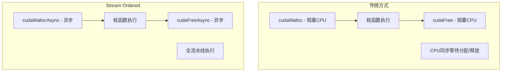

**核心优势**：

| 特性 | 描述 |
|------|------|
| 异步分配 | 不阻塞CPU，可与其他操作重叠 |
| 流有序 | 分配与核函数/传输自动同步 |
| 内存池 | 使用内存池减少实际分配开销 |
| 低延迟 | 从内存池获取内存极快 |

#### 3.3.2 cudaMallocAsync 和 cudaFreeAsync 详细用法

**基本用法**：

```cpp
#include <cuda_runtime.h>

// 1. 创建流
cudaStream_t stream;
cudaStreamCreate(&stream);

// 2. 异步分配设备内存
void *d_data;
size_t size = 1024 * 1024 * sizeof(float);  // 4MB

// cudaMallocAsync 在流中排队分配操作
cudaError_t err = cudaMallocAsync(&d_data, size, stream);
if (err != cudaSuccess) {
    printf("分配失败: %s\n", cudaGetErrorString(err));
    return -1;
}

// 3. 使用内存（自动等待分配完成）
kernel<<<grid, block, 0, stream>>>(d_data, n);

// 4. 异步释放
// cudaFreeAsync 在流中排队释放操作
// 只有当流中之前的操作都完成后才会释放
cudaFreeAsync(d_data, stream);

// 5. 同步流（可选，如果之后不需要CPU访问）
cudaStreamSynchronize(stream);

// 6. 销毁流
cudaStreamDestroy(stream);
```

**内存池机制**：

Stream Ordered Memory Allocator 使用内存池来减少实际的分配开销：

```cpp
// 查询默认内存池
cudaMemPool_t memPool;
cudaDeviceGetDefaultMemPool(&memPool, 0);  // 0 是设备ID

// 配置内存池属性
uint64_t threshold = 1024 * 1024 * 100;  // 100MB
cudaMemPoolSetAttribute(memPool,
                        cudaMemPoolAttrReleaseThreshold,
                        &threshold);

// 内存池会在释放后保留内存，下次分配更快
// 设置释放阈值可以控制保留的内存量
```

**高级用法：自定义内存池**：

```cpp
// 创建自定义内存池
cudaMemPoolProps poolProps = {};
poolProps.allocType = cudaMemAllocationTypePinned;
poolProps.location.id = 0;  // 设备ID
poolProps.location.type = cudaMemLocationTypeDevice;

cudaMemPool_t customPool;
cudaMemPoolCreate(&customPool, &poolProps);

// 使用自定义内存池分配
void *d_data;
cudaMallocFromPoolAsync(&d_data, size, customPool, stream);

// 使用...
kernel<<<grid, block, 0, stream>>>(d_data, n);

// 释放
cudaFreeAsync(d_data, stream);

// 销毁内存池（确保所有使用该池的流已完成）
cudaStreamSynchronize(stream);
cudaMemPoolDestroy(customPool);
```

**跨流内存共享**：

```cpp
cudaStream_t stream1, stream2;
cudaStreamCreate(&stream1);
cudaStreamCreate(&stream2);

// 在 stream1 中分配
void *d_data;
cudaMallocAsync(&d_data, size, stream1);

// 在 stream1 中初始化
init_kernel<<<grid, block, 0, stream1>>>(d_data, n);

// 在 stream2 中使用（需要事件同步）
cudaEvent_t event;
cudaEventCreate(&event);
cudaEventRecord(event, stream1);
cudaStreamWaitEvent(stream2, event);

// stream2 可以安全使用 d_data
process_kernel<<<grid, block, 0, stream2>>>(d_data, n);

// 在 stream2 中释放
cudaFreeAsync(d_data, stream2);

cudaStreamSynchronize(stream1);
cudaStreamSynchronize(stream2);
cudaEventDestroy(event);
cudaStreamDestroy(stream1);
cudaStreamDestroy(stream2);
```

#### 3.3.3 完整的异步内存管理示例

```cpp
#include <cstdio>
#include <cuda_runtime.h>

#define CHECK_CUDA(call) \
    do { \
        cudaError_t err = call; \
        if (err != cudaSuccess) { \
            printf("CUDA错误 [%s:%d]: %s\n", \
                   __FILE__, __LINE__, cudaGetErrorString(err)); \
            exit(1); \
        } \
    } while(0)

__global__ void process_data(float* data, int n) {
    int idx = blockIdx.x * blockDim.x + threadIdx.x;
    if (idx < n) {
        data[idx] = data[idx] * 2.0f + 1.0f;
    }
}

void stream_ordered_memory_example() {
    const int N = 1024 * 1024;  // 1M elements
    const size_t size = N * sizeof(float);

    // 创建流
    cudaStream_t stream;
    CHECK_CUDA(cudaStreamCreate(&stream));

    // 配置内存池
    cudaMemPool_t memPool;
    CHECK_CUDA(cudaDeviceGetDefaultMemPool(&memPool, 0));

    // 设置释放阈值：保留64MB以加速后续分配
    uint64_t releaseThreshold = 64 * 1024 * 1024;
    CHECK_CUDA(cudaMemPoolSetAttribute(memPool,
                                       cudaMemPoolAttrReleaseThreshold,
                                       &releaseThreshold));

    // 查询内存池当前使用量
    uint64_t usedMem;
    CHECK_CUDA(cudaMemPoolGetAttribute(memPool,
                                       cudaMemPoolAttrUsedMemCurrent,
                                       &usedMem));
    printf("内存池当前使用: %lu MB\n", usedMem / (1024 * 1024));

    // 异步分配
    float *d_input;
    float *d_output;
    CHECK_CUDA(cudaMallocAsync(&d_input, size, stream));
    CHECK_CUDA(cudaMallocAsync(&d_output, size, stream));

    // 分配锁页主机内存用于异步传输
    float *h_input;
    float *h_output;
    CHECK_CUDA(cudaMallocHost(&h_input, size));
    CHECK_CUDA(cudaMallocHost(&h_output, size));

    // 初始化主机数据
    for (int i = 0; i < N; i++) {
        h_input[i] = static_cast<float>(i);
    }

    // 创建事件用于计时
    cudaEvent_t start, stop;
    CHECK_CUDA(cudaEventCreate(&start));
    CHECK_CUDA(cudaEventCreate(&stop));

    // 记录开始时间
    CHECK_CUDA(cudaEventRecord(start, stream));

    // H2D 异步传输
    CHECK_CUDA(cudaMemcpyAsync(d_input, h_input, size,
                               cudaMemcpyHostToDevice, stream));

    // 核函数执行
    int blockSize = 256;
    int numBlocks = (N + blockSize - 1) / blockSize;
    process_data<<<numBlocks, blockSize, 0, stream>>>(d_input, N);

    // D2H 异步传输
    CHECK_CUDA(cudaMemcpyAsync(h_output, d_output, size,
                               cudaMemcpyDeviceToHost, stream));

    // 记录结束时间
    CHECK_CUDA(cudaEventRecord(stop, stream));

    // 异步释放设备内存（在流中等待前面的操作完成）
    CHECK_CUDA(cudaFreeAsync(d_input, stream));
    CHECK_CUDA(cudaFreeAsync(d_output, stream));

    // 同步流
    CHECK_CUDA(cudaStreamSynchronize(stream));

    // 计算耗时
    float ms;
    CHECK_CUDA(cudaEventElapsedTime(&ms, start, stop));
    printf("总耗时 (包含分配/传输/计算/释放): %.3f ms\n", ms);

    // 验证结果
    bool success = true;
    for (int i = 0; i < 10; i++) {
        float expected = h_input[i] * 2.0f + 1.0f;
        if (fabs(h_output[i] - expected) > 1e-5) {
            printf("验证失败: h_output[%d] = %f, expected = %f\n",
                   i, h_output[i], expected);
            success = false;
            break;
        }
    }
    if (success) {
        printf("验证成功!\n");
    }

    // 清理资源
    CHECK_CUDA(cudaEventDestroy(start));
    CHECK_CUDA(cudaEventDestroy(stop));
    CHECK_CUDA(cudaFreeHost(h_input));
    CHECK_CUDA(cudaFreeHost(h_output));
    CHECK_CUDA(cudaStreamDestroy(stream));

    printf("Stream Ordered Memory 示例完成\n");
}

int main() {
    stream_ordered_memory_example();
    return 0;
}
```

#### 3.3.4 内存池属性配置

```cpp
// 可配置的内存池属性
typedef enum cudaMemPoolAttr {
    cudaMemPoolAttrReleaseThreshold,      // 释放阈值
    cudaMemPoolAttrReservedMemCurrent,    // 当前保留内存
    cudaMemPoolAttrReservedMemHigh,       // 保留内存峰值
    cudaMemPoolAttrUsedMemCurrent,        // 当前使用内存
    cudaMemPoolAttrUsedMemHigh,           // 使用内存峰值
} cudaMemPoolAttr;

// 设置保留阈值示例
void configure_memory_pool() {
    cudaMemPool_t pool;
    cudaDeviceGetDefaultMemPool(&pool, 0);

    // 设置释放阈值：小于此值的内存会被保留在池中
    uint64_t threshold = 128 * 1024 * 1024;  // 128MB
    cudaMemPoolSetAttribute(pool,
                            cudaMemPoolAttrReleaseThreshold,
                            &threshold);

    // 对于短生命周期、频繁分配的应用，设置较高的阈值
    // 对于内存紧张的应用，设置较低的阈值
}
```

**内存池最佳实践**：

1. **高频分配场景**：设置较高的保留阈值，避免重复分配开销
2. **内存受限场景**：设置较低的保留阈值，及时释放未使用内存
3. **多流场景**：使用默认内存池，自动处理跨流同步
4. **多GPU场景**：考虑创建设备特定的内存池

### 3.4 传输与计算重叠

```mermaid
gantt
    title 数据传输与计算重叠
    dateFormat X
    axisFormat %s

    section 传统方式
    H2D         :0, 2
    Compute     :2, 4
    D2H         :4, 6

    section 多流重叠
    Stream0 H2D :0, 1
    Stream0 Comp:1, 2
    Stream0 D2H :2, 3
    Stream1 H2D :0, 1
    Stream1 Comp:1, 2
    Stream1 D2H :2, 3
```

**实现代码**：

```cpp
const int N_STREAMS = 4;
cudaStream_t streams[N_STREAMS];

// 创建流
for (int i = 0; i < N_STREAMS; i++) {
    cudaStreamCreate(&streams[i]);
}

int chunk_size = total_size / N_STREAMS;

// 分发到多个流
for (int i = 0; i < N_STREAMS; i++) {
    int offset = i * chunk_size;

    // H2D传输
    cudaMemcpyAsync(d_data + offset, h_data + offset,
                   chunk_size * sizeof(float),
                   cudaMemcpyHostToDevice, streams[i]);

    // 核函数执行
    kernel<<<grid, block, 0, streams[i]>>>(d_data + offset, chunk_size);

    // D2H传输
    cudaMemcpyAsync(h_result + offset, d_data + offset,
                   chunk_size * sizeof(float),
                   cudaMemcpyDeviceToHost, streams[i]);
}

// 同步所有流
for (int i = 0; i < N_STREAMS; i++) {
    cudaStreamSynchronize(streams[i]);
}
```

---

## 4. 零拷贝内存

### 4.1 零拷贝原理

**零拷贝（Zero-Copy）** 允许GPU直接访问主机内存，无需显式数据传输：

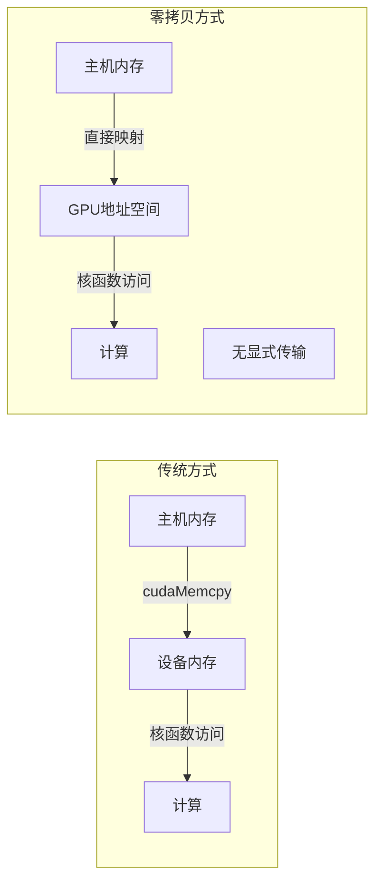

### 4.2 零拷贝API

```cpp
// 分配映射到GPU的主机内存
float *h_data;
cudaHostAlloc(&h_data, size, cudaHostAllocMapped);

// 获取设备端指针
float *d_data;
cudaHostGetDevicePointer(&d_data, h_data, 0);

// 核函数可以直接访问主机内存
kernel<<<grid, block>>>(d_data, n);

// 不需要显式的数据传输！

// 释放
cudaFreeHost(h_data);
```

### 4.3 零拷贝的适用场景

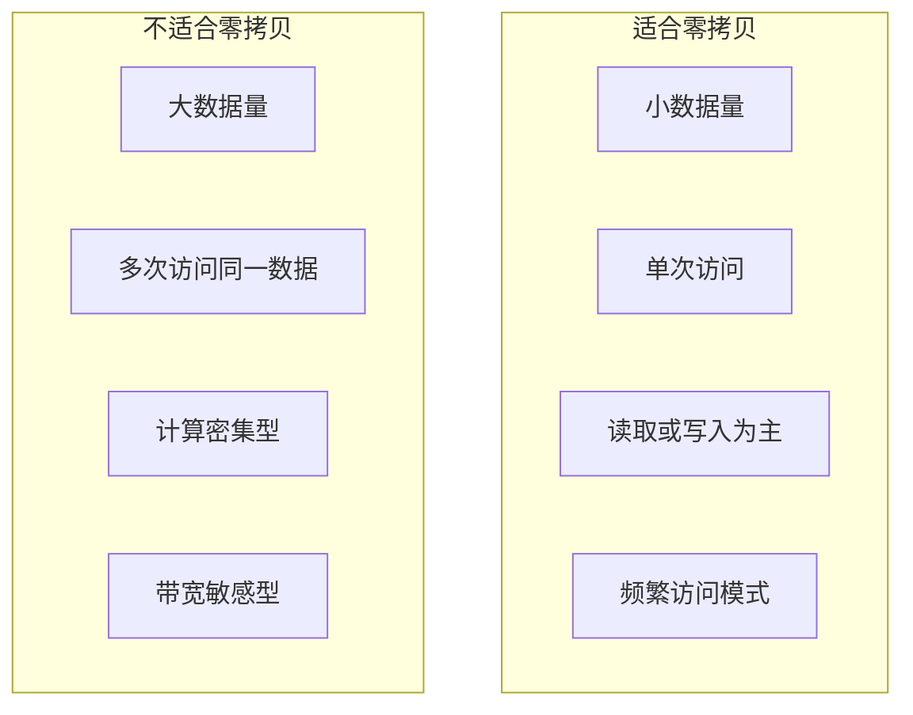

**性能考虑**：
- 零拷贝访问延迟较高（通过PCIe）
- 适合只读或只写的数据
- 不适合多次访问的数据（会重复产生PCIe延迟）

### 4.4 零拷贝性能分析

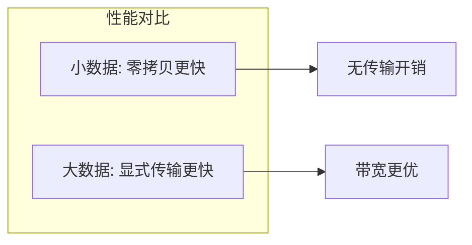

---

## 5. 统一内存

### 5.1 统一内存概述

**统一内存（Unified Memory）** 创建一个CPU和GPU共享的内存池：

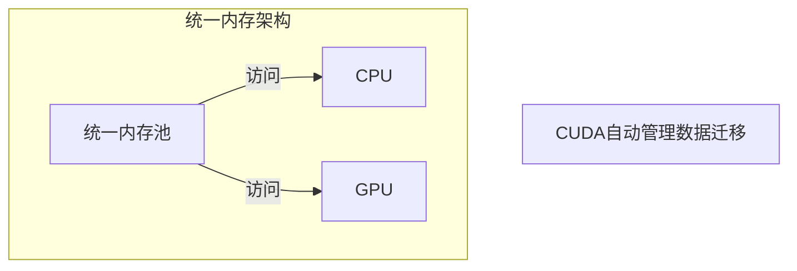

### 5.2 统一内存API

```cpp
// 分配统一内存
float *data;
cudaMallocManaged(&data, size);

// CPU端访问
for (int i = 0; i < n; i++) {
    data[i] = i;  // CPU写入
}

// GPU端访问
kernel<<<grid, block>>>(data, n);  // GPU读取/写入
cudaDeviceSynchronize();

// CPU端读取
for (int i = 0; i < n; i++) {
    printf("%f ", data[i]);  // CPU读取
}

// 释放
cudaFree(data);
```

### 5.3 页错误与数据迁移

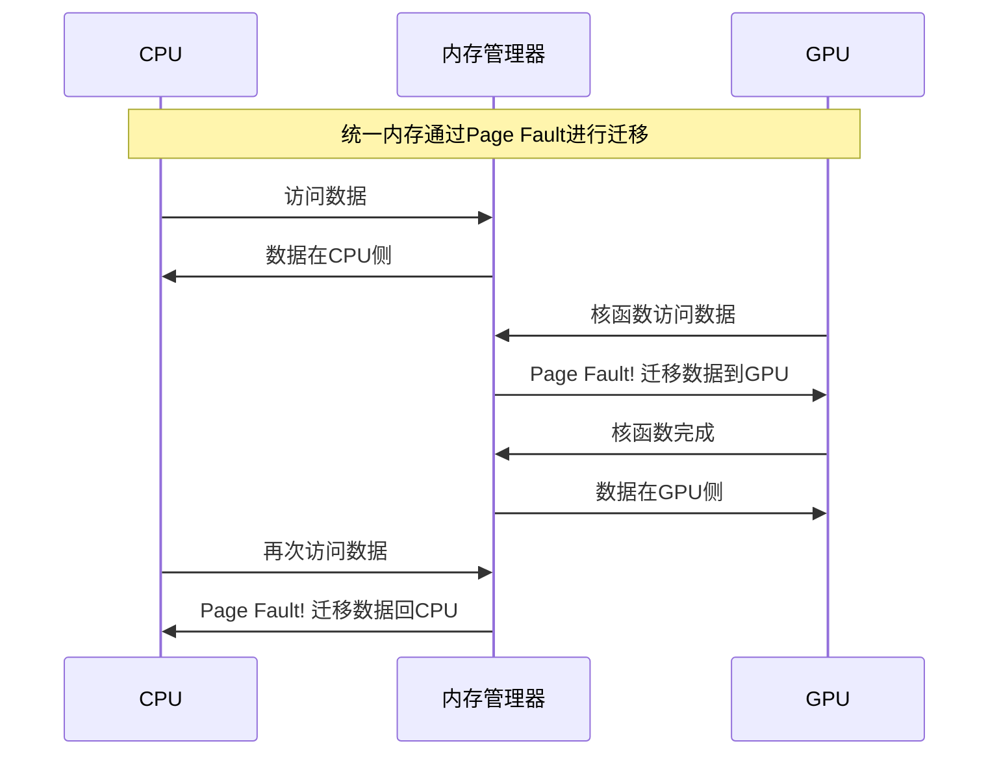

#### 5.3.1 Page Fault 机制详解

**什么是 Page Fault？**

在统一内存中，Page Fault（页错误）是一种按需数据迁移机制。当处理器（CPU或GPU）访问的数据不在其本地内存时，会触发页错误，CUDA运行时随后将所需数据迁移到访问处理器。

**Page Fault 的工作流程**：

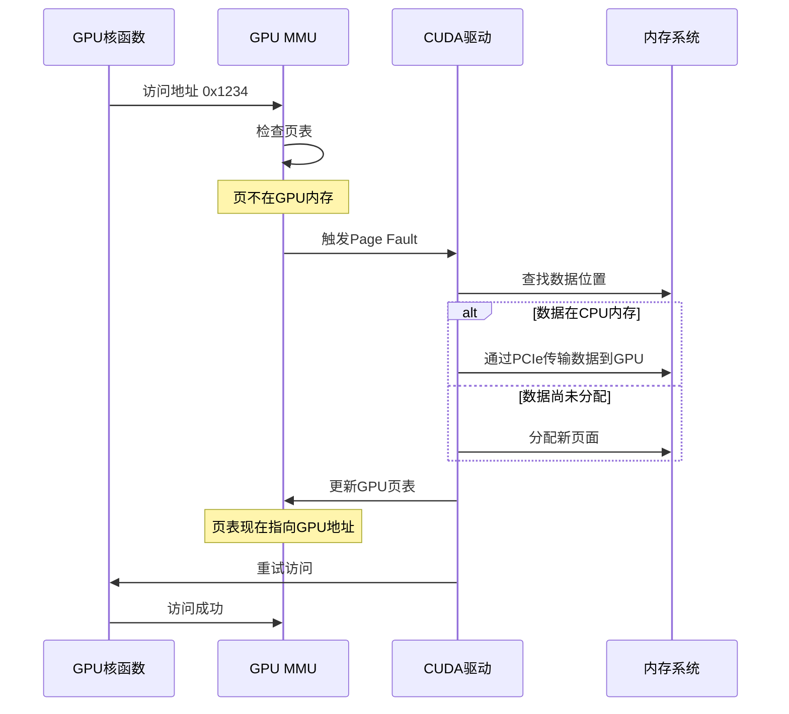

**Page Fault 的性能影响**：

| 影响类型 | 描述 | 优化方法 |
|----------|------|----------|
| 首次访问延迟 | 第一次访问触发迁移，延迟较高 | 使用 `cudaMemPrefetchAsync` 预取 |
| 迁移带宽 | 数据通过PCIe传输 | 批量预取，减少迁移次数 |
| 一致性开销 | 多设备访问需要同步 | 使用 `cudaMemAdvise` 提示 |
| 页面抖动 | 频繁迁移同一页面 | 设置PreferredLocation |

**在 Nsight Systems 中观察 Page Fault**：

```bash
# 使用 Nsight Systems 分析统一内存行为
nsys profile --trace=cuda,nvtx,osrt,cudnn,cublas \
             --sample=cpu \
             --cpuctxsw=none \
             -o unified_memory_profile \
             ./your_program

# 查看报告
nsys-ui unified_memory_profile.nsys-rep
```

在 Nsight Systems 时间线上，Page Fault 会显示为：
- **Unified Memory** 行中的迁移事件
- **CPU** 行中的页错误处理时间
- **GPU** 行中的等待时间

**Page Fault 相关的 CUDA 属性**：

```cpp
// 查询设备是否支持统一内存页错误
int pageableMemoryAccess;
cudaDeviceGetAttribute(&pageableMemoryAccess,
                       cudaDevAttrPageableMemoryAccess, 0);

// 查询设备是否支持并发页错误处理
int concurrentManagedAccess;
cudaDeviceGetAttribute(&concurrentManagedAccess,
                       cudaDevAttrConcurrentManagedAccess, 0);

printf("支持页错误访问: %s\n",
       pageableMemoryAccess ? "是" : "否");
printf("支持并发管理内存访问: %s\n",
       concurrentManagedAccess ? "是" : "否");
```

**Page Fault 的类型**：

1. **迁移型 Page Fault**：数据需要从一个处理器迁移到另一个
2. **原子操作 Page Fault**：原子操作需要的特殊处理
3. **写保护 Page Fault**：写操作触发的页面复制（Copy-on-Write）

**Page Fault对性能的影响**：
- 第一次访问会产生延迟
- Nsys中可以看到Page Fault事件
- 可以通过预取优化

### 5.4 统一内存的优势与限制

**优势**：
- 编程简单，无需手动管理数据传输
- 自动处理数据一致性
- 适合快速原型开发

**限制**：
- 自动迁移有开销
- 首次访问延迟较高
- 可能不如手动优化性能好

---

## 6. 预取与建议

### 6.1 内存预取

使用`cudaMemPrefetchAsync`提前将数据迁移到目标设备：

```cpp
float *data;
cudaMallocManaged(&data, size);

// CPU端初始化
for (int i = 0; i < n; i++) {
    data[i] = i;
}

// 预取到GPU
cudaMemPrefetchAsync(data, size, 0, stream);  // 0是GPU设备ID

// 核函数执行（数据已在GPU）
kernel<<<grid, block, 0, stream>>>(data, n);

// 预取回CPU
cudaMemPrefetchAsync(data, size, cudaCpuDeviceId, stream);

cudaStreamSynchronize(stream);

// CPU读取（数据已在CPU）
```

### 6.2 内存建议

使用`cudaMemAdvise`给CUDA提示数据访问模式：

```cpp
float *data;
cudaMallocManaged(&data, size);

// 建议：数据主要在GPU上访问
cudaMemAdvise(data, size, cudaMemAdviseSetPreferredLocation, 0);

// 建议：数据从GPU读取
cudaMemAdvise(data, size, cudaMemAdviseSetReadMostly, 0);

// 建议：数据被GPU访问
cudaMemAdvise(data, size, cudaMemAdviseSetAccessedBy, 0);
```

**建议类型**：

| 建议类型 | 描述 |
|----------|------|
| `cudaMemAdviseSetReadMostly` | 数据主要被读取 |
| `cudaMemAdviseSetPreferredLocation` | 数据首选位置 |
| `cudaMemAdviseSetAccessedBy` | 数据将被某设备访问 |
| `cudaMemAdviseUnsetReadMostly` | 取消读取建议 |
| `cudaMemAdviseUnsetPreferredLocation` | 取消位置建议 |
| `cudaMemAdviseUnsetAccessedBy` | 取消访问建议 |

### 6.3 预取与建议的组合使用


**完整示例**：

```cpp
// 分配
float *data;
cudaMallocManaged(&data, n * sizeof(float));

// CPU初始化
for (int i = 0; i < n; i++) {
    data[i] = i;
}

// 设置建议
cudaMemAdvise(data, n * sizeof(float),
              cudaMemAdviseSetPreferredLocation, 0);  // 首选GPU

// 预取到GPU
cudaStream_t stream;
cudaStreamCreate(&stream);
cudaMemPrefetchAsync(data, n * sizeof(float), 0, stream);

// 执行核函数
kernel<<<grid, block, 0, stream>>>(data, n);

// 预取回CPU
cudaMemPrefetchAsync(data, n * sizeof(float), cudaCpuDeviceId, stream);

// 同步
cudaStreamSynchronize(stream);

// CPU访问（无Page Fault）
for (int i = 0; i < n; i++) {
    printf("%f\n", data[i]);
}

// 清理
cudaStreamDestroy(stream);
cudaFree(data);
```

---

## 7. 内存带宽优化技巧

### 7.1 带宽基础知识

**PCIe 带宽限制**：

| PCIe版本 | x16 带宽 | 实际有效带宽 |
|----------|----------|-------------|
| PCIe 3.0 | 16 GB/s | ~12-13 GB/s |
| PCIe 4.0 | 32 GB/s | ~26-28 GB/s |
| PCIe 5.0 | 64 GB/s | ~50-55 GB/s |

**GPU 内存带宽对比**：

| GPU型号 | 内存类型 | 带宽 |
|---------|----------|------|
| RTX 4090 | GDDR6X | 1008 GB/s |
| A100 40GB | HBM2e | 1555 GB/s |
| A100 80GB | HBM2e | 2039 GB/s |
| H100 | HBM3 | 3352 GB/s |

可以看到，GPU 内存带宽远超 PCIe 带宽，因此数据传输往往是性能瓶颈。

### 7.2 带宽优化策略

#### 7.2.1 传输大小优化

```cpp
// 错误示例：多次小传输
for (int i = 0; i < n; i++) {
    cudaMemcpy(&d_data[i], &h_data[i], sizeof(float), cudaMemcpyHostToDevice);
}
// 性能：每次传输有固定开销，小传输效率极低

// 正确示例：单次大传输
cudaMemcpy(d_data, h_data, n * sizeof(float), cudaMemcpyHostToDevice);
// 性能：一次传输，效率最高
```

**传输开销分析**：
- 每次传输有固定启动开销（约 5-10 微秒）
- 小传输的带宽利用率很低
- 建议：合并小传输为大批量传输

#### 7.2.2 数据对齐优化

```cpp
// 对齐到256字节可以获得最佳传输性能
#define ALIGNMENT 256

// 使用posix_memalign分配对齐内存
void *h_data;
posix_memalign(&h_data, ALIGNMENT, size);

// 或使用cudaMallocHost（自动对齐）
float *h_data_aligned;
cudaMallocHost(&h_data_aligned, size);  // 自动对齐

// 使用cudaMallocPitch处理2D数据
size_t pitch;
float *d_2d_data;
cudaMallocPitch(&d_2d_data, &pitch, width * sizeof(float), height);
// pitch会被对齐到最佳值
```

#### 7.2.3 传输方向优化

```cpp
// PCIe传输特性：
// - Host to Device (H2D): 通常更快，DMA写入
// - Device to Host (D2H): 稍慢，需要CPU参与

// 优化策略：
// 1. 减少D2H传输量
// 2. 在GPU上完成尽可能多的计算
// 3. 只传输必要的结果数据

// 示例：在GPU上完成归约，只传输一个结果
__global__ void reduce_sum(float* data, float* result, int n) {
    __shared__ float sdata[256];
    int tid = threadIdx.x;
    int idx = blockIdx.x * blockDim.x + threadIdx.x;

    sdata[tid] = (idx < n) ? data[idx] : 0.0f;
    __syncthreads();

    // 归约
    for (int s = blockDim.x / 2; s > 0; s >>= 1) {
        if (tid < s) {
            sdata[tid] += sdata[tid + s];
        }
        __syncthreads();
    }

    if (tid == 0) {
        atomicAdd(result, sdata[0]);
    }
}

// 只需要传输一个float结果回主机
```

**共享内存访问模式优化**：

在GPU内部数据传输中，共享内存的使用对带宽有重大影响。共享内存位于芯片上，比本地或全局内存具有更高的带宽和更低的延迟。

**共享内存Bank结构**：

官方文档说明：
> 共享内存被划分为大小相等的内存模块，称为**bank**，可以同时访问。任何由*n*个地址组成且这*n*个地址位于*n*个不同内存bank中的内存读写请求都可以同时被服务，从而产生比单个模块带宽高*n*倍的总带宽。

然而，如果内存请求的两个地址落在同一个内存bank中，就会发生**bank conflict**，访问必须被串行化。

**步进共享内存访问示例**：


上图展示了不同步进访问模式：
- **左侧**：步进为1个32位字的线性寻址（无bank conflict）
- **中间**：步进为2个32位字的线性寻址（双向bank conflict）
- **右侧**：步进为3个32位字的线性寻址（无bank conflict）

**不规则共享内存访问示例**：


上图展示了不规则访问模式：
- **左侧**：通过随机排列实现无冲突访问
- **中间**：无冲突访问，因为线程3、4、6、7和9访问bank 5中的同一个字
- **右侧**：无冲突广播访问（线程访问bank中的同一个字）

**Bank Conflict对带宽的影响**：

| 访问模式 | Bank Conflict情况 | 相对带宽 |
|----------|------------------|----------|
| 步进=1 | 无冲突 | 100% |
| 步进=2 | 2-way冲突 | 50% |
| 步进=4 | 4-way冲突 | 25% |
| 步进=32 | 32-way冲突 | ~3% |
| 广播访问 | 无冲突（广播） | 100% |

**优化建议**：
- 避免步进为2的幂次的访问模式
- 使用padding技术消除bank conflict
- 利用广播机制处理多线程读取同一地址的情况

#### 7.2.4 重叠传输与计算

```cpp
// 双缓冲技术实现传输与计算重叠
void double_buffer_example(float* h_input, float* h_output, int n, int batch_size) {
    const int N_BATCHES = 2;
    float *d_input[N_BATCHES], *d_output[N_BATCHES];
    cudaStream_t streams[N_BATCHES];
    cudaEvent_t events[N_BATCHES];

    size_t batch_bytes = batch_size * sizeof(float);

    // 初始化
    for (int i = 0; i < N_BATCHES; i++) {
        cudaMalloc(&d_input[i], batch_bytes);
        cudaMalloc(&d_output[i], batch_bytes);
        cudaStreamCreate(&streams[i]);
        cudaEventCreate(&events[i]);
    }

    int num_batches = (n + batch_size - 1) / batch_size;

    for (int batch = 0; batch < num_batches; batch++) {
        int cur = batch % N_BATCHES;
        int prev = (batch - 1 + N_BATCHES) % N_BATCHES;
        int offset = batch * batch_size;
        int current_batch_size = min(batch_size, n - offset);

        // 等待上一个计算完成
        if (batch >= N_BATCHES) {
            cudaEventSynchronize(events[cur]);
            // 拷贝上一批的结果
            cudaMemcpyAsync(h_output + prev * batch_size, d_output[cur],
                          batch_bytes, cudaMemcpyDeviceToHost, streams[cur]);
        }

        // H2D传输
        cudaMemcpyAsync(d_input[cur], h_input + offset,
                       current_batch_size * sizeof(float),
                       cudaMemcpyHostToDevice, streams[cur]);

        // 计算
        kernel<<<grid, block, 0, streams[cur]>>>(d_input[cur], d_output[cur],
                                                  current_batch_size);

        // 记录事件
        cudaEventRecord(events[cur], streams[cur]);
    }

    // 处理最后一批结果
    for (int i = 0; i < N_BATCHES; i++) {
        cudaEventSynchronize(events[i]);
    }

    // 清理
    for (int i = 0; i < N_BATCHES; i++) {
        cudaFree(d_input[i]);
        cudaFree(d_output[i]);
        cudaStreamDestroy(streams[i]);
        cudaEventDestroy(events[i]);
    }
}
```

### 7.3 带宽测量与监控

```cpp
// 带宽计算函数
float calculate_bandwidth(size_t bytes, float ms) {
    // 返回 GB/s
    return (bytes / (1024.0 * 1024.0 * 1024.0)) / (ms / 1000.0);
}

// 带宽测试函数
void bandwidth_test() {
    const size_t SIZE = 256 * 1024 * 1024;  // 256MB
    const int ITERATIONS = 10;

    float *h_data, *d_data;
    cudaMallocHost(&h_data, SIZE);
    cudaMalloc(&d_data, SIZE);

    // 初始化数据
    memset(h_data, 0xAA, SIZE);

    cudaEvent_t start, stop;
    cudaEventCreate(&start);
    cudaEventCreate(&stop);

    // H2D 带宽测试
    cudaEventRecord(start);
    for (int i = 0; i < ITERATIONS; i++) {
        cudaMemcpy(d_data, h_data, SIZE, cudaMemcpyHostToDevice);
    }
    cudaEventRecord(stop);
    cudaEventSynchronize(stop);

    float ms;
    cudaEventElapsedTime(&ms, start, stop);
    float h2d_bw = calculate_bandwidth(SIZE * ITERATIONS, ms);
    printf("H2D 带宽: %.2f GB/s\n", h2d_bw);

    // D2H 带宽测试
    cudaEventRecord(start);
    for (int i = 0; i < ITERATIONS; i++) {
        cudaMemcpy(h_data, d_data, SIZE, cudaMemcpyDeviceToHost);
    }
    cudaEventRecord(stop);
    cudaEventSynchronize(stop);

    cudaEventElapsedTime(&ms, start, stop);
    float d2h_bw = calculate_bandwidth(SIZE * ITERATIONS, ms);
    printf("D2H 带宽: %.2f GB/s\n", d2h_bw);

    // 清理
    cudaFreeHost(h_data);
    cudaFree(d_data);
    cudaEventDestroy(start);
    cudaEventDestroy(stop);
}
```

### 7.4 各方法性能对比

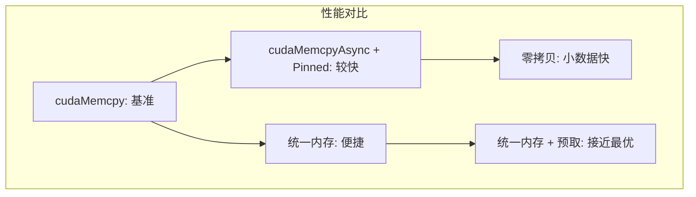

### 7.2 选择指南

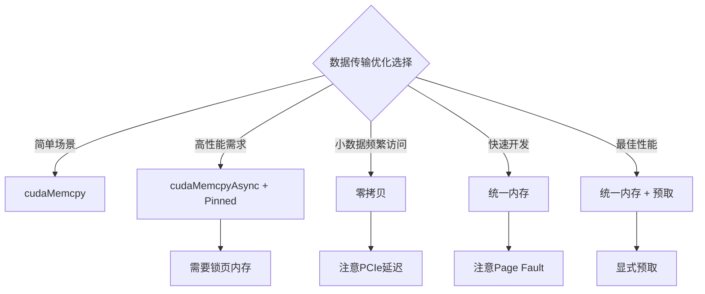

### 7.3 性能测试结果

| 方法 | 传输时间 | 特点 |
|------|----------|------|
| cudaMemcpy | 基准 | 简单，同步 |
| cudaMemcpyAsync + Pinned | ~10-20%提升 | 异步，需锁页内存 |
| 零拷贝 | 无传输时间 | 小数据优，大数据差 |
| 统一内存 | 首次慢 | 便捷，有Page Fault |
| 统一内存 + 预取 | 接近最优 | 最佳实践 |

---

## 8. 实践案例

### 8.1 完整的统一内存性能优化示例

以下示例展示了如何使用 `cudaMemPrefetchAsync` 和 `cudaMemAdvise` 优化统一内存性能：

```cpp
#include <cstdio>
#include <cuda_runtime.h>

#define CHECK_CUDA(call) \
    do { \
        cudaError_t err = call; \
        if (err != cudaSuccess) { \
            printf("CUDA错误 [%s:%d]: %s\n", \
                   __FILE__, __LINE__, cudaGetErrorString(err)); \
            exit(1); \
        } \
    } while(0)

// 向量加法核函数
__global__ void vector_add(const float* a, const float* b, float* c, int n) {
    int idx = blockIdx.x * blockDim.x + threadIdx.x;
    if (idx < n) {
        c[idx] = a[idx] + b[idx];
    }
}

// 向量乘法核函数
__global__ void vector_mul(const float* a, const float* b, float* c, int n) {
    int idx = blockIdx.x * blockDim.x + threadIdx.x;
    if (idx < n) {
        c[idx] = a[idx] * b[idx];
    }
}

// 归约核函数
__global__ void reduce_sum(const float* data, float* result, int n) {
    __shared__ float sdata[256];
    int tid = threadIdx.x;
    int idx = blockIdx.x * blockDim.x + threadIdx.x;

    sdata[tid] = (idx < n) ? data[idx] : 0.0f;
    __syncthreads();

    for (int s = blockDim.x / 2; s > 0; s >>= 1) {
        if (tid < s) {
            sdata[tid] += sdata[tid + s];
        }
        __syncthreads();
    }

    if (tid == 0) {
        atomicAdd(result, sdata[0]);
    }
}

//============================================================
// 方法1: 基本统一内存（无优化）- 会有大量Page Fault
//============================================================
void unified_memory_basic(int n) {
    printf("\n--- 方法1: 基本统一内存（无优化） ---\n");

    float *a, *b, *c, *temp;
    size_t size = n * sizeof(float);

    CHECK_CUDA(cudaMallocManaged(&a, size));
    CHECK_CUDA(cudaMallocManaged(&b, size));
    CHECK_CUDA(cudaMallocManaged(&c, size));
    CHECK_CUDA(cudaMallocManaged(&temp, size));

    // CPU初始化（数据在CPU侧）
    for (int i = 0; i < n; i++) {
        a[i] = static_cast<float>(i);
        b[i] = static_cast<float>(i * 2);
    }

    cudaEvent_t start, stop;
    CHECK_CUDA(cudaEventCreate(&start));
    CHECK_CUDA(cudaEventCreate(&stop));

    CHECK_CUDA(cudaEventRecord(start));

    // 核函数会触发Page Fault，数据迁移到GPU
    int blockSize = 256;
    int numBlocks = (n + blockSize - 1) / blockSize;

    vector_add<<<numBlocks, blockSize>>>(a, b, temp, n);
    vector_mul<<<numBlocks, blockSize>>>(temp, b, c, n);

    CHECK_CUDA(cudaGetLastError());
    CHECK_CUDA(cudaDeviceSynchronize());

    CHECK_CUDA(cudaEventRecord(stop));
    CHECK_CUDA(cudaEventSynchronize(stop));

    float ms;
    CHECK_CUDA(cudaEventElapsedTime(&ms, start, stop));
    printf("执行时间: %.3f ms\n", ms);
    printf("结果验证: c[0]=%.1f (期望 %.1f)\n", c[0], 0.0f + 0.0f * 2.0f);

    CHECK_CUDA(cudaFree(a));
    CHECK_CUDA(cudaFree(b));
    CHECK_CUDA(cudaFree(c));
    CHECK_CUDA(cudaFree(temp));
    CHECK_CUDA(cudaEventDestroy(start));
    CHECK_CUDA(cudaEventDestroy(stop));
}

//============================================================
// 方法2: 统一内存 + 预取 - 避免Page Fault延迟
//============================================================
void unified_memory_prefetch(int n) {
    printf("\n--- 方法2: 统一内存 + 预取 ---\n");

    float *a, *b, *c, *temp;
    size_t size = n * sizeof(float);

    CHECK_CUDA(cudaMallocManaged(&a, size));
    CHECK_CUDA(cudaMallocManaged(&b, size));
    CHECK_CUDA(cudaMallocManaged(&c, size));
    CHECK_CUDA(cudaMallocManaged(&temp, size));

    // CPU初始化（数据在CPU侧）
    for (int i = 0; i < n; i++) {
        a[i] = static_cast<float>(i);
        b[i] = static_cast<float>(i * 2);
    }

    cudaStream_t stream;
    CHECK_CUDA(cudaStreamCreate(&stream));

    cudaEvent_t start, stop;
    CHECK_CUDA(cudaEventCreate(&start));
    CHECK_CUDA(cudaEventCreate(&stop));

    CHECK_CUDA(cudaEventRecord(start, stream));

    // 预取数据到GPU（避免核函数执行时的Page Fault）
    CHECK_CUDA(cudaMemPrefetchAsync(a, size, 0, stream));  // 0 = GPU设备ID
    CHECK_CUDA(cudaMemPrefetchAsync(b, size, 0, stream));
    CHECK_CUDA(cudaMemPrefetchAsync(c, size, 0, stream));
    CHECK_CUDA(cudaMemPrefetchAsync(temp, size, 0, stream));

    int blockSize = 256;
    int numBlocks = (n + blockSize - 1) / blockSize;

    vector_add<<<numBlocks, blockSize, 0, stream>>>(a, b, temp, n);
    vector_mul<<<numBlocks, blockSize, 0, stream>>>(temp, b, c, n);

    // 预取结果回CPU
    CHECK_CUDA(cudaMemPrefetchAsync(c, size, cudaCpuDeviceId, stream));

    CHECK_CUDA(cudaEventRecord(stop, stream));
    CHECK_CUDA(cudaEventSynchronize(stop));

    float ms;
    CHECK_CUDA(cudaEventElapsedTime(&ms, start, stop));
    printf("执行时间: %.3f ms\n", ms);
    printf("结果验证: c[0]=%.1f (期望 %.1f)\n", c[0], 0.0f + 0.0f * 2.0f);

    CHECK_CUDA(cudaStreamDestroy(stream));
    CHECK_CUDA(cudaFree(a));
    CHECK_CUDA(cudaFree(b));
    CHECK_CUDA(cudaFree(c));
    CHECK_CUDA(cudaFree(temp));
    CHECK_CUDA(cudaEventDestroy(start));
    CHECK_CUDA(cudaEventDestroy(stop));
}

//============================================================
// 方法3: 统一内存 + 预取 + 内存建议 - 最佳性能
//============================================================
void unified_memory_optimized(int n) {
    printf("\n--- 方法3: 统一内存 + 预取 + 内存建议 ---\n");

    float *a, *b, *c, *temp;
    size_t size = n * sizeof(float);

    CHECK_CUDA(cudaMallocManaged(&a, size));
    CHECK_CUDA(cudaMallocManaged(&b, size));
    CHECK_CUDA(cudaMallocManaged(&c, size));
    CHECK_CUDA(cudaMallocManaged(&temp, size));

    // CPU初始化
    for (int i = 0; i < n; i++) {
        a[i] = static_cast<float>(i);
        b[i] = static_cast<float>(i * 2);
    }

    // 设置内存建议
    // 告诉CUDA这些数据的首选位置是GPU
    CHECK_CUDA(cudaMemAdvise(a, size, cudaMemAdviseSetPreferredLocation, 0));
    CHECK_CUDA(cudaMemAdvise(b, size, cudaMemAdviseSetPreferredLocation, 0));
    CHECK_CUDA(cudaMemAdvise(c, size, cudaMemAdviseSetPreferredLocation, 0));
    CHECK_CUDA(cudaMemAdvise(temp, size, cudaMemAdviseSetPreferredLocation, 0));

    // 如果数据主要被GPU读取，设置ReadMostly可以创建只读副本
    // CHECK_CUDA(cudaMemAdvise(a, size, cudaMemAdviseSetReadMostly, 0));
    // CHECK_CUDA(cudaMemAdvise(b, size, cudaMemAdviseSetReadMostly, 0));

    cudaStream_t stream;
    CHECK_CUDA(cudaStreamCreate(&stream));

    cudaEvent_t start, stop;
    CHECK_CUDA(cudaEventCreate(&start));
    CHECK_CUDA(cudaEventCreate(&stop));

    CHECK_CUDA(cudaEventRecord(start, stream));

    // 预取到GPU
    CHECK_CUDA(cudaMemPrefetchAsync(a, size, 0, stream));
    CHECK_CUDA(cudaMemPrefetchAsync(b, size, 0, stream));
    CHECK_CUDA(cudaMemPrefetchAsync(temp, size, 0, stream));

    int blockSize = 256;
    int numBlocks = (n + blockSize - 1) / blockSize;

    vector_add<<<numBlocks, blockSize, 0, stream>>>(a, b, temp, n);
    vector_mul<<<numBlocks, blockSize, 0, stream>>>(temp, b, c, n);

    // 预取结果回CPU
    CHECK_CUDA(cudaMemPrefetchAsync(c, size, cudaCpuDeviceId, stream));

    CHECK_CUDA(cudaEventRecord(stop, stream));
    CHECK_CUDA(cudaEventSynchronize(stop));

    float ms;
    CHECK_CUDA(cudaEventElapsedTime(&ms, start, stop));
    printf("执行时间: %.3f ms\n", ms);
    printf("结果验证: c[0]=%.1f (期望 %.1f)\n", c[0], 0.0f + 0.0f * 2.0f);

    CHECK_CUDA(cudaStreamDestroy(stream));
    CHECK_CUDA(cudaFree(a));
    CHECK_CUDA(cudaFree(b));
    CHECK_CUDA(cudaFree(c));
    CHECK_CUDA(cudaFree(temp));
    CHECK_CUDA(cudaEventDestroy(start));
    CHECK_CUDA(cudaEventDestroy(stop));
}

//============================================================
// 方法4: cudaMallocAsync 流有序内存分配
//============================================================
void stream_ordered_example(int n) {
    printf("\n--- 方法4: Stream Ordered Memory (cudaMallocAsync) ---\n");

    float *a, *b, *c, *temp;
    size_t size = n * sizeof(float);

    cudaStream_t stream;
    CHECK_CUDA(cudaStreamCreate(&stream));

    // 使用异步分配
    CHECK_CUDA(cudaMallocAsync(&a, size, stream));
    CHECK_CUDA(cudaMallocAsync(&b, size, stream));
    CHECK_CUDA(cudaMallocAsync(&c, size, stream));
    CHECK_CUDA(cudaMallocAsync(&temp, size, stream));

    // 分配锁页内存用于主机数据
    float *h_a, *h_b, *h_c;
    CHECK_CUDA(cudaMallocHost(&h_a, size));
    CHECK_CUDA(cudaMallocHost(&h_b, size));
    CHECK_CUDA(cudaMallocHost(&h_c, size));

    // 初始化主机数据
    for (int i = 0; i < n; i++) {
        h_a[i] = static_cast<float>(i);
        h_b[i] = static_cast<float>(i * 2);
    }

    cudaEvent_t start, stop;
    CHECK_CUDA(cudaEventCreate(&start));
    CHECK_CUDA(cudaEventCreate(&stop));

    CHECK_CUDA(cudaEventRecord(start, stream));

    // H2D 异步传输
    CHECK_CUDA(cudaMemcpyAsync(a, h_a, size, cudaMemcpyHostToDevice, stream));
    CHECK_CUDA(cudaMemcpyAsync(b, h_b, size, cudaMemcpyHostToDevice, stream));

    int blockSize = 256;
    int numBlocks = (n + blockSize - 1) / blockSize;

    vector_add<<<numBlocks, blockSize, 0, stream>>>(a, b, temp, n);
    vector_mul<<<numBlocks, blockSize, 0, stream>>>(temp, b, c, n);

    // D2H 异步传输
    CHECK_CUDA(cudaMemcpyAsync(h_c, c, size, cudaMemcpyDeviceToHost, stream));

    CHECK_CUDA(cudaEventRecord(stop, stream));
    CHECK_CUDA(cudaEventSynchronize(stop));

    // 异步释放
    CHECK_CUDA(cudaFreeAsync(a, stream));
    CHECK_CUDA(cudaFreeAsync(b, stream));
    CHECK_CUDA(cudaFreeAsync(c, stream));
    CHECK_CUDA(cudaFreeAsync(temp, stream));

    CHECK_CUDA(cudaStreamSynchronize(stream));

    float ms;
    CHECK_CUDA(cudaEventElapsedTime(&ms, start, stop));
    printf("执行时间: %.3f ms\n", ms);
    printf("结果验证: h_c[0]=%.1f (期望 %.1f)\n", h_c[0], 0.0f + 0.0f * 2.0f);

    CHECK_CUDA(cudaFreeHost(h_a));
    CHECK_CUDA(cudaFreeHost(h_b));
    CHECK_CUDA(cudaFreeHost(h_c));
    CHECK_CUDA(cudaStreamDestroy(stream));
    CHECK_CUDA(cudaEventDestroy(start));
    CHECK_CUDA(cudaEventDestroy(stop));
}

//============================================================
// 性能对比基准测试主函数
//============================================================
int main() {
    printf("========================================\n");
    printf("  数据传输优化性能对比 - 第二十三章\n");
    printf("========================================\n");

    // 查询设备信息
    int device;
    cudaGetDevice(&device);
    cudaDeviceProp prop;
    cudaGetDeviceProperties(&prop, device);
    printf("\nGPU: %s\n", prop.name);
    printf("计算能力: %d.%d\n", prop.major, prop.minor);
    printf("全局内存: %.2f GB\n", prop.totalGlobalMem / 1e9);

    // 检查统一内存支持
    int managedMemory;
    cudaDeviceGetAttribute(&managedMemory, cudaDevAttrManagedMemory, device);
    printf("支持统一内存: %s\n", managedMemory ? "是" : "否");

    int concurrentManagedAccess;
    cudaDeviceGetAttribute(&concurrentManagedAccess,
                          cudaDevAttrConcurrentManagedAccess, device);
    printf("支持并发统一内存访问: %s\n",
           concurrentManagedAccess ? "是" : "否");

    // 测试不同大小的数据
    int n = 16 * 1024 * 1024;  // 16M elements = 64MB per array

    printf("\n数据大小: %d 个浮点数 (%.2f MB per 数组)\n",
           n, n * sizeof(float) / (1024.0 * 1024.0));

    // 运行各种方法的测试
    unified_memory_basic(n);
    unified_memory_prefetch(n);
    unified_memory_optimized(n);
    stream_ordered_example(n);

    printf("\n========================================\n");
    printf("  性能对比总结:\n");
    printf("  - 基本统一内存: 有Page Fault开销\n");
    printf("  - +预取: 消除Page Fault延迟\n");
    printf("  - +内存建议: 进一步优化迁移策略\n");
    printf("  - cudaMallocAsync: 最佳吞吐量\n");
    printf("========================================\n");

    return 0;
}
```

### 8.2 不同传输方式性能对比基准测试

```cpp
#include <cstdio>
#include <cuda_runtime.h>

#define CHECK_CUDA(call) \
    do { \
        cudaError_t err = call; \
        if (err != cudaSuccess) { \
            printf("CUDA错误: %s\n", cudaGetErrorString(err)); \
            exit(1); \
        } \
    } while(0)

// 核函数
__global__ void vector_mult(float* a, float* b, float* c, int n) {
    int idx = blockIdx.x * blockDim.x + threadIdx.x;
    if (idx < n) {
        c[idx] = a[idx] * b[idx];
    }
}

// 方法1: 同步传输
void sync_transfer_test(int n) {
    float *h_a, *h_b, *h_c;
    float *d_a, *d_b, *d_c;
    size_t size = n * sizeof(float);

    // 分配
    h_a = (float*)malloc(size);
    h_b = (float*)malloc(size);
    h_c = (float*)malloc(size);
    CHECK_CUDA(cudaMalloc(&d_a, size));
    CHECK_CUDA(cudaMalloc(&d_b, size));
    CHECK_CUDA(cudaMalloc(&d_c, size));

    // 初始化
    for (int i = 0; i < n; i++) {
        h_a[i] = i;
        h_b[i] = i * 2;
    }

    // 计时
    cudaEvent_t start, stop;
    CHECK_CUDA(cudaEventCreate(&start));
    CHECK_CUDA(cudaEventCreate(&stop));
    CHECK_CUDA(cudaEventRecord(start));

    // 同步传输
    CHECK_CUDA(cudaMemcpy(d_a, h_a, size, cudaMemcpyHostToDevice));
    CHECK_CUDA(cudaMemcpy(d_b, h_b, size, cudaMemcpyHostToDevice));

    // 核函数
    int blockSize = 256;
    int numBlocks = (n + blockSize - 1) / blockSize;
    vector_mult<<<numBlocks, blockSize>>>(d_a, d_b, d_c, n);

    // 传回
    CHECK_CUDA(cudaMemcpy(h_c, d_c, size, cudaMemcpyDeviceToHost));

    CHECK_CUDA(cudaEventRecord(stop));
    CHECK_CUDA(cudaEventSynchronize(stop));

    float ms;
    CHECK_CUDA(cudaEventElapsedTime(&ms, start, stop));
    printf("同步传输: %.3f ms\n", ms);

    // 清理
    free(h_a); free(h_b); free(h_c);
    CHECK_CUDA(cudaFree(d_a));
    CHECK_CUDA(cudaFree(d_b));
    CHECK_CUDA(cudaFree(d_c));
    CHECK_CUDA(cudaEventDestroy(start));
    CHECK_CUDA(cudaEventDestroy(stop));
}

// 方法2: 异步传输 + 锁页内存
void async_transfer_test(int n) {
    float *h_a, *h_b, *h_c;
    float *d_a, *d_b, *d_c;
    size_t size = n * sizeof(float);

    // 分配锁页内存
    CHECK_CUDA(cudaMallocHost(&h_a, size));
    CHECK_CUDA(cudaMallocHost(&h_b, size));
    CHECK_CUDA(cudaMallocHost(&h_c, size));
    CHECK_CUDA(cudaMalloc(&d_a, size));
    CHECK_CUDA(cudaMalloc(&d_b, size));
    CHECK_CUDA(cudaMalloc(&d_c, size));

    // 初始化
    for (int i = 0; i < n; i++) {
        h_a[i] = i;
        h_b[i] = i * 2;
    }

    // 创建流
    cudaStream_t stream;
    CHECK_CUDA(cudaStreamCreate(&stream));

    // 计时
    cudaEvent_t start, stop;
    CHECK_CUDA(cudaEventCreate(&start));
    CHECK_CUDA(cudaEventCreate(&stop));
    CHECK_CUDA(cudaEventRecord(start, stream));

    // 异步传输
    CHECK_CUDA(cudaMemcpyAsync(d_a, h_a, size, cudaMemcpyHostToDevice, stream));
    CHECK_CUDA(cudaMemcpyAsync(d_b, h_b, size, cudaMemcpyHostToDevice, stream));

    // 核函数
    int blockSize = 256;
    int numBlocks = (n + blockSize - 1) / blockSize;
    vector_mult<<<numBlocks, blockSize, 0, stream>>>(d_a, d_b, d_c, n);

    // 异步传回
    CHECK_CUDA(cudaMemcpyAsync(h_c, d_c, size, cudaMemcpyDeviceToHost, stream));

    CHECK_CUDA(cudaEventRecord(stop, stream));
    CHECK_CUDA(cudaEventSynchronize(stop));

    float ms;
    CHECK_CUDA(cudaEventElapsedTime(&ms, start, stop));
    printf("异步传输 + 锁页内存: %.3f ms\n", ms);

    // 清理
    CHECK_CUDA(cudaFreeHost(h_a));
    CHECK_CUDA(cudaFreeHost(h_b));
    CHECK_CUDA(cudaFreeHost(h_c));
    CHECK_CUDA(cudaFree(d_a));
    CHECK_CUDA(cudaFree(d_b));
    CHECK_CUDA(cudaFree(d_c));
    CHECK_CUDA(cudaStreamDestroy(stream));
    CHECK_CUDA(cudaEventDestroy(start));
    CHECK_CUDA(cudaEventDestroy(stop));
}

// 方法3: 统一内存 + 预取
void unified_memory_test(int n) {
    float *a, *b, *c;
    size_t size = n * sizeof(float);

    // 分配统一内存
    CHECK_CUDA(cudaMallocManaged(&a, size));
    CHECK_CUDA(cudaMallocManaged(&b, size));
    CHECK_CUDA(cudaMallocManaged(&c, size));

    // CPU初始化
    for (int i = 0; i < n; i++) {
        a[i] = i;
        b[i] = i * 2;
    }

    // 创建流
    cudaStream_t stream;
    CHECK_CUDA(cudaStreamCreate(&stream));

    // 计时
    cudaEvent_t start, stop;
    CHECK_CUDA(cudaEventCreate(&start));
    CHECK_CUDA(cudaEventCreate(&stop));
    CHECK_CUDA(cudaEventRecord(start, stream));

    // 预取到GPU
    CHECK_CUDA(cudaMemPrefetchAsync(a, size, 0, stream));
    CHECK_CUDA(cudaMemPrefetchAsync(b, size, 0, stream));
    CHECK_CUDA(cudaMemPrefetchAsync(c, size, 0, stream));

    // 核函数
    int blockSize = 256;
    int numBlocks = (n + blockSize - 1) / blockSize;
    vector_mult<<<numBlocks, blockSize, 0, stream>>>(a, b, c, n);

    // 预取回CPU
    CHECK_CUDA(cudaMemPrefetchAsync(c, size, cudaCpuDeviceId, stream));

    CHECK_CUDA(cudaEventRecord(stop, stream));
    CHECK_CUDA(cudaEventSynchronize(stop));

    float ms;
    CHECK_CUDA(cudaEventElapsedTime(&ms, start, stop));
    printf("统一内存 + 预取: %.3f ms\n", ms);

    // 清理
    CHECK_CUDA(cudaFree(a));
    CHECK_CUDA(cudaFree(b));
    CHECK_CUDA(cudaFree(c));
    CHECK_CUDA(cudaStreamDestroy(stream));
    CHECK_CUDA(cudaEventDestroy(start));
    CHECK_CUDA(cudaEventDestroy(stop));
}

int main() {
    printf("========================================\n");
    printf("  数据传输优化性能对比 - 第二十三章\n");
    printf("========================================\n\n");

    int n = 1024 * 1024 * 16;  // 16M elements

    sync_transfer_test(n);
    async_transfer_test(n);
    unified_memory_test(n);

    return 0;
}
```

### 8.2 Nsight Systems分析

```bash
# 分析数据传输
nsys profile --stats=true -o data_transfer ./01_pinned_memory

# 查看时间线
nsys-ui data_transfer.nsys-rep
```

**关键观察点**：
- H2D/D2H传输时间
- 核函数与传输的重叠
- Page Fault事件（统一内存）

---

## 9. 本章小结

### 9.1 关键概念

| 概念 | 描述 |
|------|------|
| 锁页内存 | 驻留在物理内存中，支持DMA传输 |
| 异步传输 | 非阻塞传输，可与其他操作重叠 |
| 零拷贝 | GPU直接访问主机内存 |
| 统一内存 | CPU和GPU共享的内存池 |
| 预取 | 提前迁移数据避免Page Fault |
| 内存建议 | 给CUDA提示数据访问模式 |

### 9.2 最佳实践

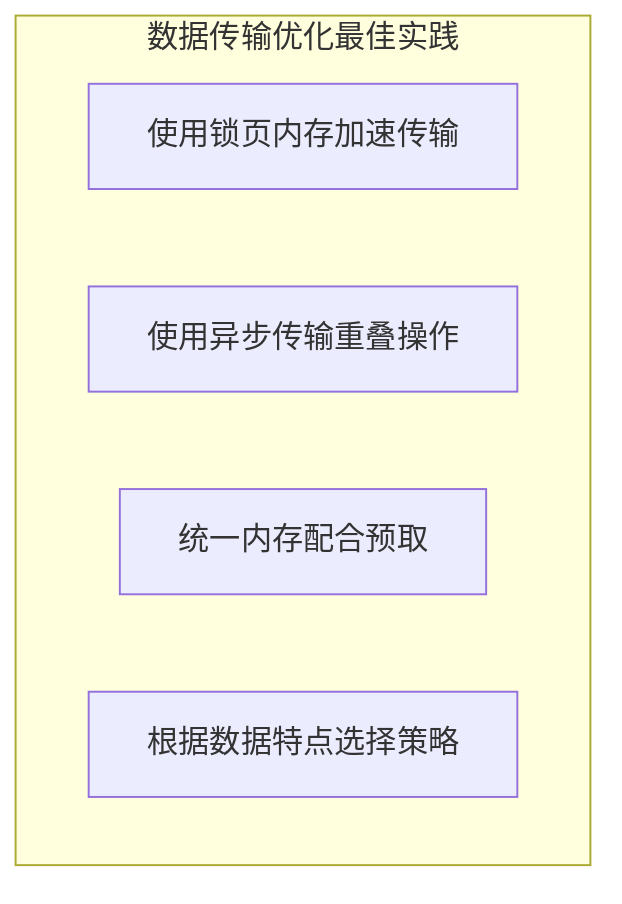

### 9.3 思考题

1. 锁页内存有什么限制？什么时候不适合使用？
2. 零拷贝为什么适合小数据而不适合大数据？
3. 统一内存的Page Fault对性能有什么影响？如何优化？
4. 如何使用Nsight Systems分析数据传输瓶颈？

---

## 下一章

[第二十四章：CUDA Graph](./24_CUDA_Graph.md) - 学习如何使用CUDA Graph减少核函数启动开销

---

*参考资料：*
- *[CUDA C++ Programming Guide - Memory Management](https://docs.nvidia.com/cuda/cuda-c-programming-guide/index.html#memory-management)*
- *[CUDA C++ Programming Guide - Unified Memory](https://docs.nvidia.com/cuda/cuda-c-programming-guide/index.html#unified-memory)*
- *[CUDA Best Practices Guide - Data Transfer](https://docs.nvidia.com/cuda/cuda-c-best-practices-guide/index.html#data-transfer)*