# 第二十四章：CUDA Graph

> 学习目标：理解CUDA Graph的原理和优势，掌握图的创建、实例化和执行方法，学会使用CUDA Graph优化核函数启动开销
>
> 预计阅读时间：60 分钟
>
> 前置知识：[第二十二章：CUDA流与并发](./22_CUDA流与并发.md) | [第二十三章：数据传输优化](./23_数据传输优化.md)

---

## 1. CUDA Graph概述

### 1.1 核函数启动开销问题

在深度学习等场景中，一个模型可能包含数百个核函数，每个核函数的启动都会产生开销：

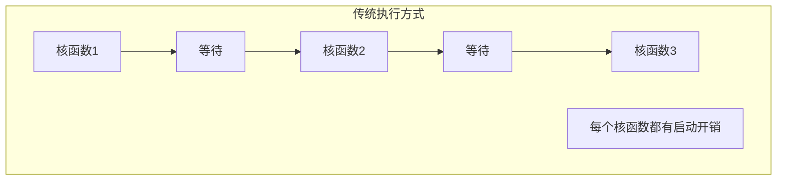

**启动开销来源**：
- CPU到GPU的命令提交
- 驱动层处理
- GPU调度延迟

### 1.2 CUDA Graph的优势

**CUDA Graph** 将一系列CUDA操作组织成有向图结构：

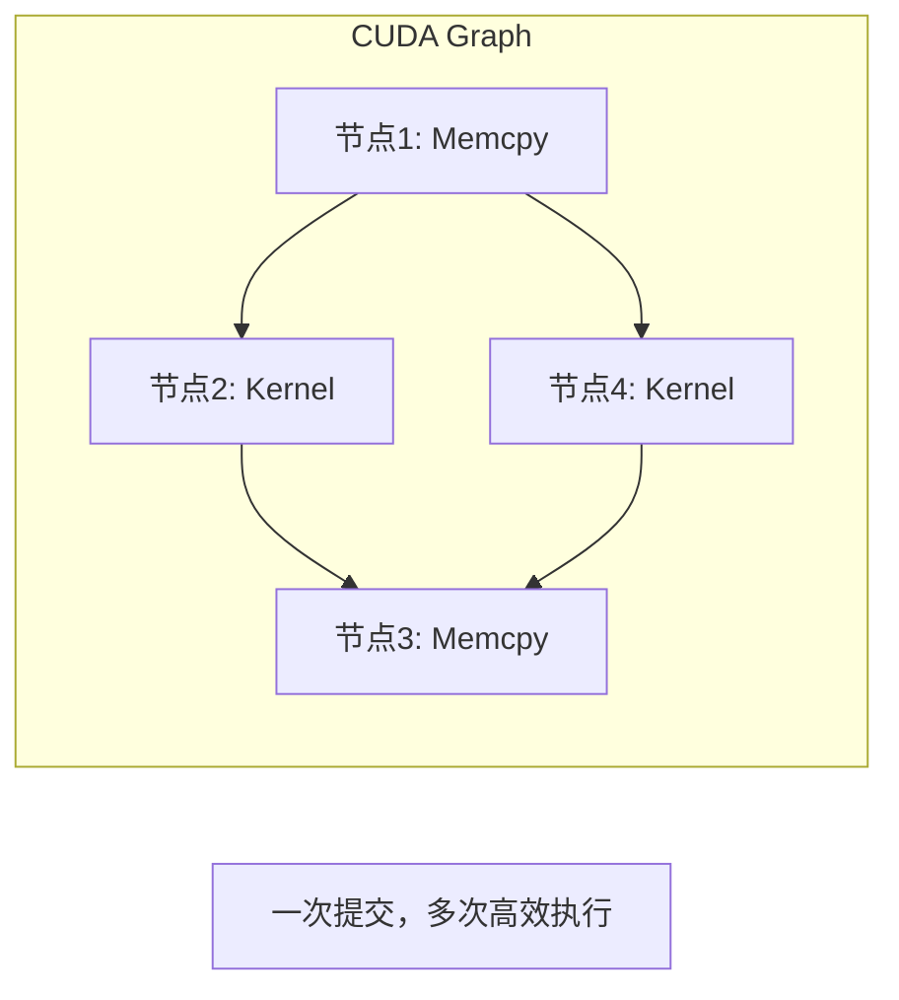

**优势**：
- **减少启动开销**：批量提交操作，将多次启动的开销合并为一次
- **增强并行性**：图结构明确任务间的依赖关系，调度器能更好地识别可并行执行的任务
- **避免重复工作**：对于重复执行的相同操作序列，图只需构建一次，便可多次执行

### 1.3 CUDA Graph执行流程

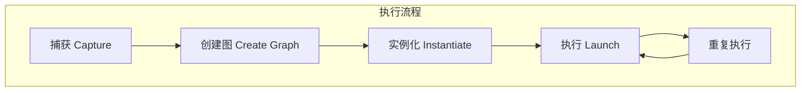

**执行步骤**：
1. **捕获**：通过流捕获或显式节点创建记录操作
2. **创建图**：将捕获的操作转换为图结构
3. **实例化**：创建可执行的图实例
4. **执行**：启动图执行
5. **重复执行**：多次执行同一图实例


上图展示了CUDA Graph的典型创建流程：通过流捕获记录一系列CUDA操作，然后将其转换为可重复执行的图结构。

---

## 2. CUDA Graph基础

### 2.1 流捕获方式创建图

流捕获是最常用的创建CUDA Graph的方式：

```cpp
cudaGraph_t graph;
cudaStream_t stream;

// 创建流
cudaStreamCreate(&stream);

// 开始捕获
cudaStreamBeginCapture(stream, cudaStreamCaptureModeGlobal);

// 在流中执行操作（会被记录到图中）
cudaMemcpyAsync(d_data, h_data, size, cudaMemcpyHostToDevice, stream);
kernel<<<grid, block, 0, stream>>>(d_data, n);
cudaMemcpyAsync(h_result, d_data, size, cudaMemcpyDeviceToHost, stream);

// 结束捕获，创建图
cudaStreamEndCapture(stream, &graph);

// 实例化图
cudaGraphExec_t graphExec;
cudaGraphInstantiate(&graphExec, graph, NULL, NULL, 0);

// 执行图
cudaGraphLaunch(graphExec, stream);

// 同步
cudaStreamSynchronize(stream);

// 清理
cudaGraphExecDestroy(graphExec);
cudaGraphDestroy(graph);
cudaStreamDestroy(stream);
```

### 2.2 CUDA Graph API

| 函数 | 描述 |
|------|------|
| `cudaStreamBeginCapture()` | 开始流捕获 |
| `cudaStreamEndCapture()` | 结束流捕获，返回图 |
| `cudaGraphInstantiate()` | 实例化图 |
| `cudaGraphLaunch()` | 执行图 |
| `cudaGraphExecDestroy()` | 销毁图实例 |
| `cudaGraphDestroy()` | 销毁图 |

### 2.3 捕获模式

```cpp
// 全局捕获模式
cudaStreamBeginCapture(stream, cudaStreamCaptureModeGlobal);

// 线程本地捕获模式
cudaStreamBeginCapture(stream, cudaStreamCaptureModeThreadLocal);

// 区域捕获模式（Relaxed同步语义）
cudaStreamBeginCapture(stream, cudaStreamCaptureModeRelaxed);
```

**捕获模式对比**：

| 模式 | 描述 |
|------|------|
| `cudaStreamCaptureModeGlobal` | 全局捕获，同步语义严格 |
| `cudaStreamCaptureModeThreadLocal` | 线程本地捕获 |
| `cudaStreamCaptureModeRelaxed` | 放松同步语义 |

---

## 3. 显式节点创建

### 3.1 手动创建图节点

除了流捕获，还可以显式创建图节点：

```cpp
cudaGraph_t graph;
cudaGraphCreate(&graph, 0);

// 创建内核节点
cudaKernelNodeParams kernelParams = {};
kernelParams.func = (void*)kernel;
kernelParams.gridDim = grid;
kernelParams.blockDim = block;
kernelParams.kernelParams = (void**)&args;
kernelParams.sharedMemBytes = 0;

cudaGraphNode_t kernelNode;
cudaGraphAddKernelNode(&kernelNode, graph, NULL, 0, &kernelParams);

// 创建内存拷贝节点
cudaMemcpy3DParms memcpyParams = {};
memcpyParams.srcPtr = make_cudaPitchedPtr(h_data, size, size, 1);
memcpyParams.dstPtr = make_cudaPitchedPtr(d_data, size, size, 1);
memcpyParams.extent = make_cudaExtent(size, 1, 1);
memcpyParams.kind = cudaMemcpyHostToDevice;

cudaGraphNode_t memcpyNode;
cudaGraphAddMemcpyNode(&memcpyNode, graph, NULL, 0, &memcpyParams);

// 创建依赖关系
cudaGraphAddDependencies(graph, &memcpyNode, &kernelNode, 1);

// 实例化和执行...
```

### 3.2 节点类型

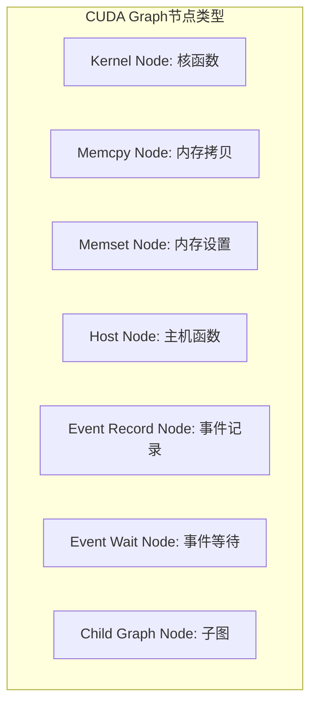

**节点类型说明**：

| 节点类型 | API | 描述 |
|----------|-----|------|
| Kernel | `cudaGraphAddKernelNode()` | 核函数执行 |
| Memcpy | `cudaGraphAddMemcpyNode()` | 内存拷贝 |
| Memset | `cudaGraphAddMemsetNode()` | 内存设置 |
| Host | `cudaGraphAddHostNode()` | CPU回调函数 |
| Event | `cudaGraphAddEventRecordNode()` | 事件记录 |
| Wait | `cudaGraphAddEventWaitNode()` | 事件等待 |
| Child | `cudaGraphAddChildGraphNode()` | 嵌套子图 |

**CUDA Graph节点结构示意**：


上图展示了CUDA Graph中的核函数节点结构，包括输入输出依赖关系以及参数配置。

### 3.3 节点依赖关系

```cpp
// 创建节点
cudaGraphNode_t node1, node2, node3;
cudaGraphAddKernelNode(&node1, graph, NULL, 0, &params1);
cudaGraphAddKernelNode(&node2, graph, NULL, 0, &params2);
cudaGraphAddKernelNode(&node3, graph, NULL, 0, &params3);

// 设置依赖关系: node1 -> node3, node2 -> node3
cudaGraphNode_t dependencies[] = {node1, node2};
cudaGraphAddDependencies(graph, dependencies, &node3, 2);
```

---

## 4. 图实例化与执行

### 4.1 图实例化

```cpp
cudaGraphExec_t graphExec;
cudaGraphInstantiate(&graphExec, graph, NULL, NULL, 0);
```

**实例化选项**：
- 实例化将图转换为可执行形式
- 进行优化和验证
- 只需执行一次

### 4.2 图执行

```cpp
// 在流中执行图
cudaGraphLaunch(graphExec, stream);

// 同步等待完成
cudaStreamSynchronize(stream);
```

### 4.3 图更新

当参数变化时，可以更新图实例而不需要重新实例化：

```cpp
// 更新内核节点参数
cudaKernelNodeParams newParams = {};
newParams.func = (void*)kernel;
newParams.gridDim = newGrid;
newParams.blockDim = block;
newParams.kernelParams = (void**)&newArgs;

// 更新图实例中的节点
cudaGraphExecKernelNodeSetParams(graphExec, kernelNode, &newParams);

// 再次执行图
cudaGraphLaunch(graphExec, stream);
```

### 4.4 图执行流程

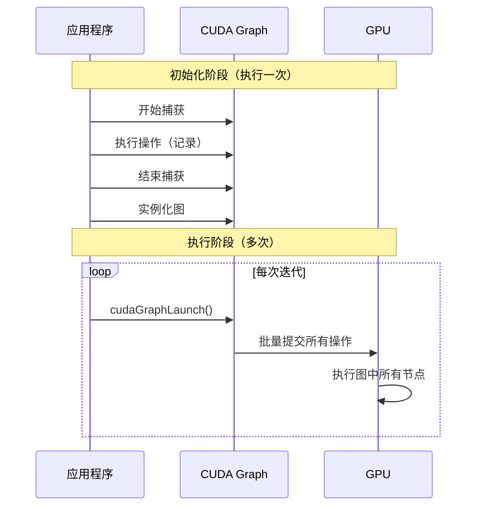

---

## 5. 图优化技术

### 5.1 减少启动开销

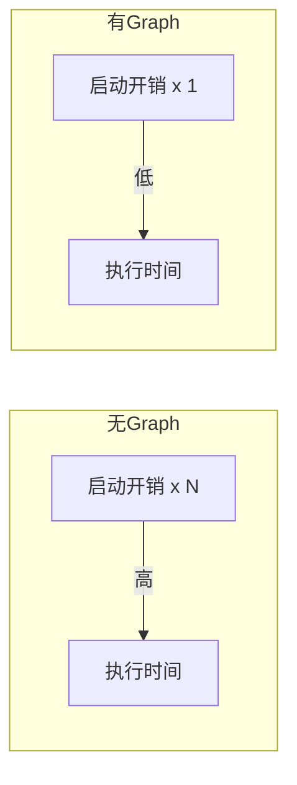

**性能提升来源**：
- 单次CPU到GPU命令提交
- GPU驱动优化调度
- 减少API调用开销

### 5.2 增强并行性

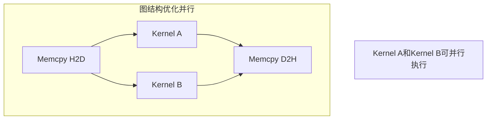

**并行优化**：
- 图结构明确依赖关系
- GPU调度器识别独立任务
- 自动并行调度

### 5.3 参数更新

```cpp
// 演示参数更新
void update_graph_params_example() {
    cudaGraph_t graph;
    cudaGraphExec_t graphExec;
    cudaGraphNode_t kernelNode;

    // ... 创建图 ...

    // 不同参数多次执行
    for (int i = 0; i < iterations; i++) {
        // 更新参数
        int newArg = i;
        cudaKernelNodeParams params = {};
        params.func = (void*)kernel;
        params.kernelParams = (void**)&newArg;
        // ... 设置其他参数 ...

        // 更新节点
        cudaGraphExecKernelNodeSetParams(graphExec, kernelNode, &params);

        // 执行更新后的图
        cudaGraphLaunch(graphExec, stream);
    }
}
```

### 5.4 子图嵌套

```cpp
// 创建子图
cudaGraph_t childGraph;
cudaGraphCreate(&childGraph, 0);
// ... 添加节点到子图 ...

// 创建父图
cudaGraph_t parentGraph;
cudaGraphCreate(&parentGraph, 0);

// 将子图作为节点添加到父图
cudaGraphNode_t childNode;
cudaGraphAddChildGraphNode(&childNode, parentGraph, NULL, 0, childGraph);
```

**子图嵌套结构示意**：


上图展示了父子图的嵌套结构，子图作为父图的一个节点，可以实现更复杂的执行流程封装。

---

## 6. 性能分析

### 6.1 启动开销对比

```mermaid
gantt
    title 无Graph vs 有Graph执行时间线
    dateFormat X
    axisFormat %s

    section 无Graph
    启动K1    :0, 1
    执行K1    :1, 2
    启动K2    :2, 3
    执行K2    :3, 4
    启动K3    :4, 5
    执行K3    :5, 6

    section 有Graph
    图启动    :0, 1
    执行K1    :1, 2
    执行K2    :1, 2
    执行K3    :2, 3
```

### 6.2 Nsight Systems分析

```bash
# 分析CUDA Graph性能
nsys profile --stats=true -o graph_analysis ./04_graph_optimize

# 查看时间线
nsys-ui graph_analysis.nsys-rep
```

**关键观察点**：
- 图启动时间
- 节点执行时间
- 节点间是否有空泡
- 并行执行情况

### 6.3 性能测试结果

| 场景 | 无Graph | 有Graph | 提升 |
|------|---------|---------|------|
| 10个核函数 | 基准 | ~20-30%快 | 中等 |
| 100个核函数 | 基准 | ~50-70%快 | 显著 |
| 1000个核函数 | 基准 | ~80-90%快 | 非常显著 |

**性能提升因素**：
- 核函数数量越多，提升越大
- 与CPU性能相关
- 与GPU调度能力相关

---

## 7. 实践案例

### 7.1 完整的CUDA Graph示例

```cpp
#include <cstdio>
#include <cuda_runtime.h>

#define CHECK_CUDA(call) \
    do { \
        cudaError_t err = call; \
        if (err != cudaSuccess) { \
            printf("CUDA错误: %s\n", cudaGetErrorString(err)); \
            exit(1); \
        } \
    } while(0)

// 简单核函数
__global__ void kernel1(float* data, int n) {
    int idx = blockIdx.x * blockDim.x + threadIdx.x;
    if (idx < n) data[idx] += 1.0f;
}

__global__ void kernel2(float* data, int n) {
    int idx = blockIdx.x * blockDim.x + threadIdx.x;
    if (idx < n) data[idx] *= 2.0f;
}

int main() {
    int n = 1024 * 1024;
    size_t size = n * sizeof(float);

    // 分配内存
    float *h_data, *d_data;
    cudaMallocHost(&h_data, size);
    cudaMalloc(&d_data, size);

    // 初始化
    for (int i = 0; i < n; i++) h_data[i] = i;

    // 创建流
    cudaStream_t stream;
    cudaStreamCreate(&stream);

    // === 创建CUDA Graph ===
    cudaGraph_t graph;

    // 开始捕获
    cudaStreamBeginCapture(stream, cudaStreamCaptureModeGlobal);

    // 记录操作
    cudaMemcpyAsync(d_data, h_data, size, cudaMemcpyHostToDevice, stream);
    kernel1<<<(n+255)/256, 256, 0, stream>>>(d_data, n);
    kernel2<<<(n+255)/256, 256, 0, stream>>>(d_data, n);
    cudaMemcpyAsync(h_data, d_data, size, cudaMemcpyDeviceToHost, stream);

    // 结束捕获
    cudaStreamEndCapture(stream, &graph);

    // 实例化
    cudaGraphExec_t graphExec;
    cudaGraphInstantiate(&graphExec, graph, NULL, NULL, 0);

    // === 性能对比 ===
    cudaEvent_t start, stop;
    cudaEventCreate(&start);
    cudaEventCreate(&stop);

    // 无Graph执行
    cudaEventRecord(start);
    for (int i = 0; i < 100; i++) {
        cudaMemcpyAsync(d_data, h_data, size, cudaMemcpyHostToDevice, stream);
        kernel1<<<(n+255)/256, 256, 0, stream>>>(d_data, n);
        kernel2<<<(n+255)/256, 256, 0, stream>>>(d_data, n);
        cudaMemcpyAsync(h_data, d_data, size, cudaMemcpyDeviceToHost, stream);
        cudaStreamSynchronize(stream);
    }
    cudaEventRecord(stop);
    cudaEventSynchronize(stop);

    float ms_no_graph;
    cudaEventElapsedTime(&ms_no_graph, start, stop);

    // 有Graph执行
    cudaEventRecord(start);
    for (int i = 0; i < 100; i++) {
        cudaGraphLaunch(graphExec, stream);
        cudaStreamSynchronize(stream);
    }
    cudaEventRecord(stop);
    cudaEventSynchronize(stop);

    float ms_with_graph;
    cudaEventElapsedTime(&ms_with_graph, start, stop);

    printf("无Graph: %.3f ms\n", ms_no_graph);
    printf("有Graph: %.3f ms\n", ms_with_graph);
    printf("提升: %.1f%%\n", (ms_no_graph - ms_with_graph) / ms_no_graph * 100);

    // 清理
    cudaGraphExecDestroy(graphExec);
    cudaGraphDestroy(graph);
    cudaStreamDestroy(stream);
    cudaFreeHost(h_data);
    cudaFree(d_data);
    cudaEventDestroy(start);
    cudaEventDestroy(stop);

    return 0;
}
```

### 7.2 图更新示例

```cpp
void graph_update_example() {
    cudaGraph_t graph;
    cudaGraphExec_t graphExec;
    cudaGraphNode_t kernelNode;

    // ... 创建图并获取kernelNode ...

    // 多次执行，更新参数
    for (int i = 0; i < iterations; i++) {
        // 更新内核参数
        void* args[] = {&d_data, &n, &i};  // 添加迭代参数

        cudaKernelNodeParams params = {};
        params.func = (void*)kernel;
        params.gridDim = grid;
        params.blockDim = block;
        params.kernelParams = args;

        // 更新节点
        cudaGraphExecKernelNodeSetParams(graphExec, kernelNode, &params);

        // 执行
        cudaGraphLaunch(graphExec, stream);
        cudaStreamSynchronize(stream);
    }
}
```

---

## 8. 使用注意事项

### 8.1 捕获限制

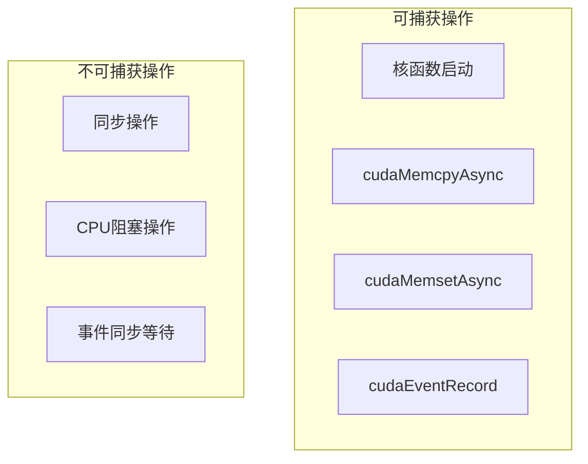

### 8.2 最佳实践

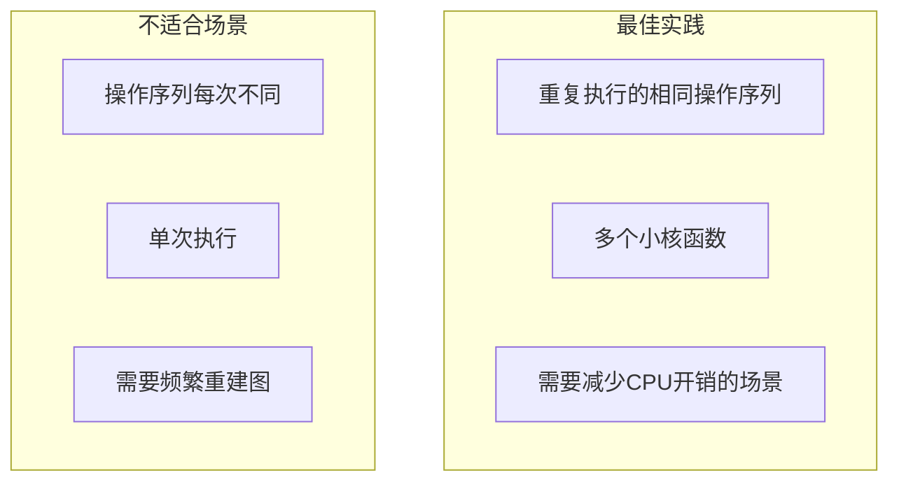

**最佳实践**：
1. 图创建和实例化只需一次
2. 多次执行同一图实例
3. 使用参数更新适应变化
4. 核函数数量越多效果越明显

### 8.3 调试技巧

```cpp
// 打印图信息
void print_graph_info(cudaGraph_t graph) {
    size_t numNodes;
    cudaGraphGetNodes(graph, NULL, &numNodes);
    printf("图节点数量: %zu\n", numNodes);

    size_t numEdges;
    cudaGraphGetEdges(graph, NULL, NULL, &numEdges);
    printf("图边数量: %zu\n", numEdges);
}
```

---

## 9. 本章小结

### 9.1 关键概念

| 概念 | 描述 |
|------|------|
| CUDA Graph | 有向图结构组织CUDA操作 |
| 流捕获 | 通过流执行记录创建图 |
| 图实例化 | 将图转换为可执行形式 |
| 图执行 | 启动图执行所有节点 |
| 图更新 | 修改已实例化图的参数 |

### 9.2 核心优势

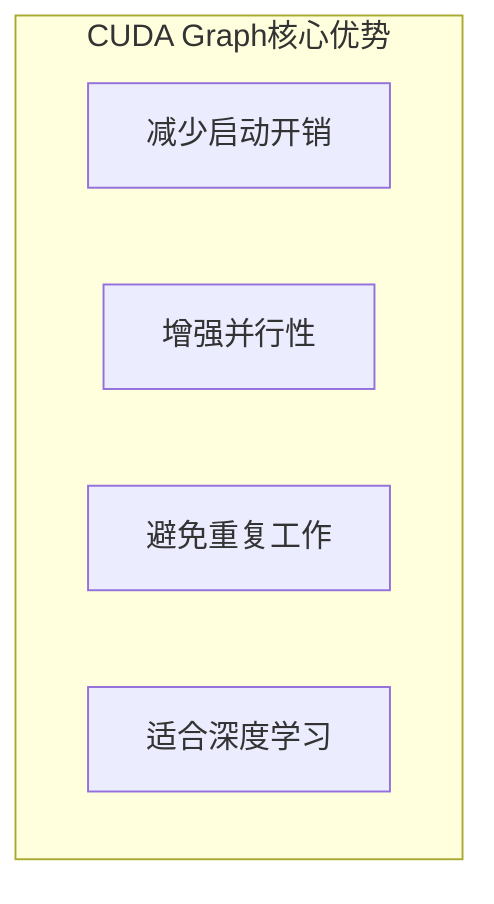

### 9.3 思考题

1. CUDA Graph在什么场景下收益最大？
2. 流捕获和显式节点创建各有什么优缺点？
3. 如何处理需要动态变化的操作序列？
4. 如何使用Nsight Systems分析CUDA Graph的性能？

---

## 下一章

[第二十五章：多GPU编程](./25_多GPU编程.md) - 学习如何使用多个GPU进行并行计算

---

*参考资料：*
- *[CUDA C++ Programming Guide - CUDA Graphs](https://docs.nvidia.com/cuda/cuda-c-programming-guide/index.html#cuda-graphs)*
- *[CUDA Graphs API](https://docs.nvidia.com/cuda/cuda-driver-api/group__CUDA__GRAPH.html)*
- *[GTC Talk - CUDA Graphs](https://developer.nvidia.com/gtc)*