# 第二十五章：多GPU编程

> 学习目标：理解多GPU系统的拓扑结构，掌握设备选择和P2P传输技术，学会使用NCCL进行高效的多GPU通信
>
> 预计阅读时间：90 分钟
>
> 前置知识：[第二十二章：CUDA流与并发](./22_CUDA流与并发.md) | [第二十四章：CUDA Graph](./24_CUDA_Graph.md)

---

## 1. 多GPU系统概述

### 1.1 为什么需要多GPU

在深度学习和高性能计算领域，单个GPU往往无法满足需求：

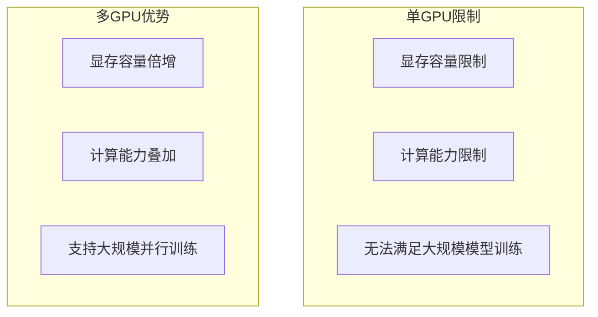

**多GPU应用场景**：
- **数据并行训练**：每个GPU处理不同数据批次
- **模型并行训练**：将大模型分割到多个GPU
- **推理服务**：同时服务多个请求
- **科学计算**：大规模数值模拟

### 1.2 自动可扩展性（Automatic Scalability）

CUDA编程模型的核心设计理念之一是**自动可扩展性**。通过三个关键抽象——线程组层次结构、共享内存和屏障同步——CUDA程序能够自动适应不同规模的GPU硬件。


**自动可扩展性原理**：

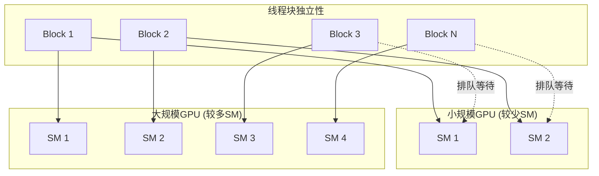

**可扩展性的关键约束**：

| 约束 | 说明 |
|------|------|
| 线程块独立执行 | 各Block必须能以任意顺序、并行或串行执行 |
| 无全局同步 | Block之间不能直接同步（需通过全局屏障） |
| 资源需求固定 | 每个Block的寄存器、共享内存需求在编译时确定 |

**为什么这对多GPU编程重要**：

1. **相同的代码，不同的硬件**：一份CUDA代码可在任意数量的GPU上运行
2. **透明调度**：运行时自动将Block分配到可用的SM
3. **性能线性扩展**：更多GPU = 更多SM = 更高吞吐量
4. **简化编程**：程序员只需关注线程块内的逻辑，无需关心硬件拓扑

```cpp
// 同一个核函数可以高效运行在1个GPU或100个GPU上
__global__ void scalable_kernel(float* data, int n) {
    int idx = blockIdx.x * blockDim.x + threadIdx.x;
    if (idx < n) {
        // 每个线程独立处理一个元素
        // 无需关心是在哪个GPU、哪个SM上执行
        data[idx] = process(data[idx]);
    }
}

// 启动时根据数据规模自动调整Grid大小
int blockSize = 256;
int gridSize = (n + blockSize - 1) / blockSize;
// 无论是1个GPU还是多个GPU，代码完全相同
scalable_kernel<<<gridSize, blockSize>>>(d_data, n);
```

> **编程提示**：设计CUDA程序时，确保线程块之间没有隐式依赖关系，这是实现多GPU自动扩展的基础。

### 1.3 多GPU硬件拓扑


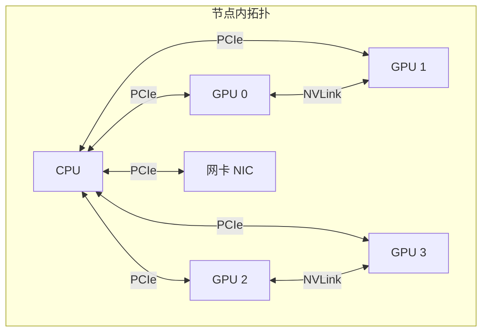

**互联技术对比**：

| 互联方式 | 带宽 | 延迟 | 适用场景 |
|----------|------|------|----------|
| PCIe 4.0 x16 | ~32 GB/s | 较高 | 通用GPU连接 |
| PCIe 5.0 x16 | ~64 GB/s | 中等 | 新一代服务器 |
| NVLink 2.0 | ~300 GB/s | 低 | V100互联 |
| NVLink 3.0 | ~600 GB/s | 极低 | A100互联 |
| NVLink 4.0 | ~900 GB/s | 极低 | H100互联 |
| InfiniBand NDR | ~400 Gb/s | 低 | 节点间通信 |

### 1.4 查看系统拓扑

```bash
# 查看GPU拓扑信息
nvidia-smi topo -m

# 示例输出
#   GPU0  GPU1  GPU2  GPU3  CPU Affinity
# GPU0   X   NV2   NV2   SYS   0-15
# GPU1  NV2    X   NV2   SYS   0-15
# GPU2  NV2   NV2    X   SYS   16-31
# GPU3  SYS   SYS   SYS    X    16-31

# Legend:
#   NV#: NVLink连接，数字表示连接数
#   SYS: 通过PCIe和系统总线连接
#   NODE: 同一NUMA节点
#   PHB: 同一PCIe主机桥
```

**拓扑关系解读**：
- `NV1/NV2`：NVLink直接连接，通信效率最高
- `PIX`：同一PCIe交换机
- `PHB`：同一PCIe主机桥
- `NODE`：同一NUMA节点
- `SYS`：跨系统总线，通信最慢

### 1.5 NVLink技术详解

NVLink是NVIDIA开发的高带宽GPU互联技术，相比传统PCIe有显著优势：

**NVLink发展历程**：

| 版本 | GPU代际 | 单链带宽 | 总带宽 | 链路数 |
|------|---------|----------|--------|--------|
| NVLink 1.0 | Pascal (P100) | 40 GB/s | 160 GB/s | 4 |
| NVLink 2.0 | Volta (V100) | 50 GB/s | 300 GB/s | 6 |
| NVLink 3.0 | Ampere (A100) | 50 GB/s | 600 GB/s | 12 |
| NVLink 4.0 | Hopper (H100) | 112.5 GB/s | 900 GB/s | 18 |

**NVLink核心优势**：

1. **高带宽**：NVLink 4.0提供900 GB/s双向带宽，是PCIe 5.0的14倍
2. **低延迟**：直接GPU间通信，无需通过CPU/内存
3. **内存池化**：多GPU显存可被视为统一内存池
4. **一致性访问**：支持缓存一致性协议

**NVLink拓扑示例**：

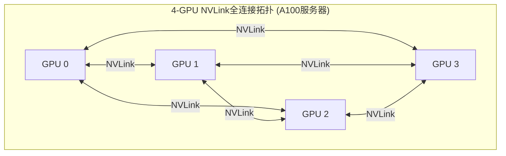

**检查NVLink状态**：

```bash
# 查看NVLink连接状态
nvidia-smi nvlink --status

# 查看NVLink统计信息
nvidia-smi nvlink --stats

# 查看NVLink能力
nvidia-smi -q | grep -A 10 "NVLink"
```

### 1.6 Thread Block Clusters（计算能力 9.0+）

Thread Block Clusters是Hopper架构（H100/H200，CC 9.0+）引入的新特性，允许多个线程块组成一个Cluster进行协作。


**Cluster核心概念**：

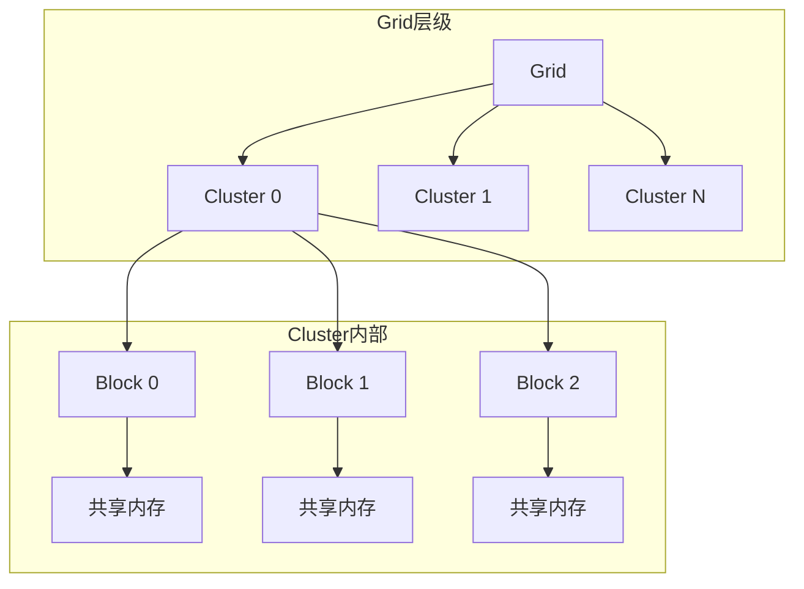

**Cluster特性**：

| 特性 | 描述 |
|------|------|
| 分布式共享内存 | Cluster内的Block可直接访问彼此的共享内存 |
| Cluster同步 | 支持Cluster级别的屏障同步 |
| 协作执行 | 多Block可协同完成单个任务 |
| 高效通信 | 无需通过全局内存即可共享数据 |

**Cluster编程示例**：

```cpp
#include <cooperative_groups.h>
namespace cg = cooperative_groups;

// 使用 __cluster_dims__ 属性指定Cluster大小
// 2x1x1 表示每个Cluster包含2个Block
__cluster_dims__(2, 1, 1)
__global__ void cluster_kernel(int* input, int* output, int N) {
    // 获取Cluster组
    cg::cluster_group cluster = cg::this_cluster();

    // 获取当前Block在Cluster内的rank
    unsigned int block_rank = cluster.block_rank();
    unsigned int num_blocks = cluster.num_blocks();

    // 声明共享内存
    extern __shared__ int shared_data[];

    // 加载数据到共享内存
    int tid = blockIdx.x * blockDim.x + threadIdx.x;
    if (tid < N) {
        shared_data[threadIdx.x] = input[tid];
    }

    // Block内同步
    cg::this_thread_block().sync();

    // 访问其他Block的共享内存（分布式共享内存）
    int neighbor_rank = (block_rank + 1) % num_blocks;
    int* neighbor_smem = cluster.map_shared_rank(shared_data, neighbor_rank);

    // 读取邻居Block的数据
    int result = shared_data[threadIdx.x] + neighbor_smem[threadIdx.x];

    // Cluster级同步
    cluster.sync();

    if (tid < N) {
        output[tid] = result;
    }
}

// 启动Cluster核函数（运行时指定Cluster维度）
void launch_cluster_kernel(int* d_input, int* d_output, int N) {
    int blocks = 8;
    int threads = 256;

    // CUDA 12+ 使用 cudaLaunchKernelEx
    cudaLaunchConfig_t config = {
        .gridDim = dim3(blocks),
        .blockDim = dim3(threads),
    };

    cudaLaunchAttribute attrs[1];
    attrs[0].id = cudaLaunchAttributeClusterDimension;
    attrs[0].val.clusterDim = {2, 1, 1};  // 2x1x1 Cluster

    config.attrs = attrs;
    config.numAttrs = 1;

    size_t shared_mem_size = threads * sizeof(int);
    cudaLaunchKernelEx(&config, cluster_kernel, d_input, d_output, N);
}
```

**Cluster应用场景**：

- **大型矩阵运算**：将矩阵分块分配给Cluster内多个Block
- **图算法**：跨Block共享图数据结构
- **深度学习**：Transformer等大模型的分块计算
- **科学计算**：需要跨Block协作的迭代算法

> **注意**：Thread Block Clusters需要Hopper架构（H100/H200）或更新的GPU。在旧架构上代码可编译但无法运行。

---

## 2. 设备管理与选择

### 2.1 设备枚举与属性

```cpp
#include <cuda_runtime.h>
#include <cstdio>

void enumerate_devices() {
    int deviceCount;
    cudaGetDeviceCount(&deviceCount);

    printf("发现 %d 个CUDA设备\n\n", deviceCount);

    for (int dev = 0; dev < deviceCount; dev++) {
        cudaDeviceProp prop;
        cudaGetDeviceProperties(&prop, dev);

        printf("设备 %d: %s\n", dev, prop.name);
        printf("  计算能力: %d.%d\n", prop.major, prop.minor);
        printf("  全局显存: %.2f GB\n", prop.totalGlobalMem / 1e9);
        printf("  SM数量: %d\n", prop.multiProcessorCount);
        printf("  时钟频率: %.2f MHz\n", prop.clockRate / 1000.0);
        printf("  内存带宽: %.2f GB/s\n",
               2.0 * prop.memoryBusWidth * prop.memoryClockRate / 8.0 / 1e6);
        printf("\n");
    }
}
```

### 2.2 设备选择

```cpp
// 设置当前设备
cudaSetDevice(int device);

// 获取当前设备
int device;
cudaGetDevice(&device);

// 设备选择策略
int select_best_device() {
    int deviceCount;
    cudaGetDeviceCount(&deviceCount);

    int bestDevice = 0;
    size_t maxMemory = 0;

    for (int dev = 0; dev < deviceCount; dev++) {
        cudaDeviceProp prop;
        cudaGetDeviceProperties(&prop, dev);

        if (prop.totalGlobalMem > maxMemory) {
            maxMemory = prop.totalGlobalMem;
            bestDevice = dev;
        }
    }

    return bestDevice;
}
```

### 2.3 设备属性详解

```cpp
typedef struct cudaDeviceProp {
    char name[256];                   // 设备名称
    size_t totalGlobalMem;            // 全局显存大小
    size_t sharedMemPerBlock;         // 每个Block共享内存
    int regsPerBlock;                 // 每个Block寄存器数量
    int warpSize;                     // Warp大小(通常为32)
    size_t memPitch;                  // 内存对齐
    int maxThreadsPerBlock;           // 每个Block最大线程数
    int maxThreadsDim[3];             // Block维度限制
    int maxGridSize[3];               // Grid维度限制
    size_t totalConstMem;             // 常量内存大小
    int major, minor;                 // 计算能力版本
    int clockRate;                    // 时钟频率(kHz)
    int multiProcessorCount;          // SM数量
    int memoryClockRate;              // 显存时钟(kHz)
    int memoryBusWidth;               // 显存总线位宽
    // ... 更多属性
} cudaDeviceProp;
```

### 2.4 多线程设备管理

```cpp
#include <thread>
#include <vector>

void worker_thread(int device_id, int task_id) {
    // 每个线程设置自己的设备
    cudaSetDevice(device_id);

    // 执行任务
    float *d_data;
    cudaMalloc(&d_data, 1024 * sizeof(float));

    // ... 计算任务 ...

    cudaFree(d_data);
}

void multi_thread_example() {
    int num_devices;
    cudaGetDeviceCount(&num_devices);

    std::vector<std::thread> threads;

    for (int dev = 0; dev < num_devices; dev++) {
        threads.emplace_back(worker_thread, dev, dev);
    }

    for (auto& t : threads) {
        t.join();
    }
}
```

---

## 3. 点对点传输（P2P）

### 3.1 P2P访问概念

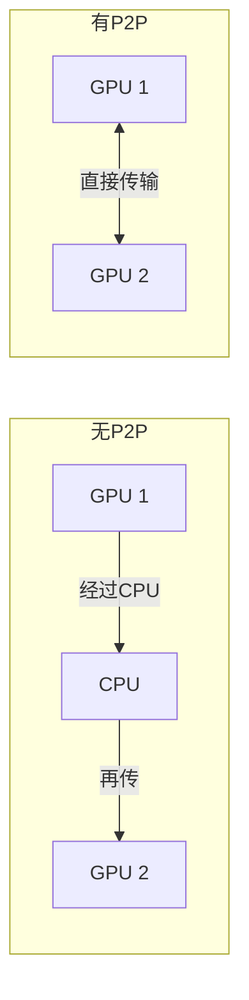

**P2P优势**：
- 跳过CPU中转，降低延迟
- 利用NVLink高带宽
- 支持直接内存访问

### 3.2 检测P2P能力

```cpp
void check_p2p_capability() {
    int deviceCount;
    cudaGetDeviceCount(&deviceCount);

    printf("P2P访问能力矩阵:\n");
    printf("     ");
    for (int i = 0; i < deviceCount; i++) {
        printf("GPU%d  ", i);
    }
    printf("\n");

    for (int i = 0; i < deviceCount; i++) {
        printf("GPU%d  ", i);
        for (int j = 0; j < deviceCount; j++) {
            if (i == j) {
                printf("  -   ");
            } else {
                int canAccess;
                cudaDeviceCanAccessPeer(&canAccess, i, j);
                printf("%s  ", canAccess ? "Yes" : " No");
            }
        }
        printf("\n");
    }
}
```

### 3.3 启用P2P访问

```cpp
void enable_p2p(int gpu0, int gpu1) {
    int canAccessPeer_01, canAccessPeer_10;

    // 检查GPU0能否访问GPU1
    cudaDeviceCanAccessPeer(&canAccessPeer_01, gpu0, gpu1);

    // 检查GPU1能否访问GPU0
    cudaDeviceCanAccessPeer(&canAccessPeer_10, gpu1, gpu0);

    if (canAccessPeer_01) {
        cudaSetDevice(gpu0);
        cudaDeviceEnablePeerAccess(gpu1, 0);
        printf("GPU %d -> GPU %d P2P已启用\n", gpu0, gpu1);
    }

    if (canAccessPeer_10) {
        cudaSetDevice(gpu1);
        cudaDeviceEnablePeerAccess(gpu0, 0);
        printf("GPU %d -> GPU %d P2P已启用\n", gpu1, gpu0);
    }
}
```

### 3.4 P2P数据传输

```cpp
// 同步P2P传输
void p2p_memcpy_sync(int src_gpu, int dst_gpu, float* src, float* dst, size_t size) {
    cudaMemcpyPeer(dst, dst_gpu, src, src_gpu, size);
}

// 异步P2P传输
void p2p_memcpy_async(int src_gpu, int dst_gpu, float* src, float* dst,
                      size_t size, cudaStream_t stream) {
    cudaMemcpyPeerAsync(dst, dst_gpu, src, src_gpu, size, stream);
}

// 使用cudaMemcpyDeviceToDevice（UVA支持）
void p2p_memcpy_uva(float* src, float* dst, size_t size, cudaStream_t stream) {
    cudaMemcpyAsync(dst, src, size, cudaMemcpyDeviceToDevice, stream);
}
```

### 3.5 P2P性能测试

```cpp
void benchmark_p2p_transfer(int gpu0, int gpu1) {
    const int N = 256 * 1024 * 1024;  // 256M元素
    const size_t size = N * sizeof(float);

    // 在两个GPU上分配内存
    float *d_src, *d_dst;
    cudaSetDevice(gpu0);
    cudaMalloc(&d_src, size);
    cudaSetDevice(gpu1);
    cudaMalloc(&d_dst, size);

    // 创建事件计时
    cudaEvent_t start, stop;
    cudaEventCreate(&start);
    cudaEventCreate(&stop);

    // 测试P2P传输
    cudaEventRecord(start);
    cudaMemcpyPeer(d_dst, gpu1, d_src, gpu0, size);
    cudaEventRecord(stop);
    cudaEventSynchronize(stop);

    float ms;
    cudaEventElapsedTime(&ms, start, stop);

    float bandwidth = size / ms / 1e6;  // GB/s
    printf("P2P传输: %.2f GB/s (%.2f ms)\n", bandwidth, ms);

    // 清理
    cudaSetDevice(gpu0);
    cudaFree(d_src);
    cudaSetDevice(gpu1);
    cudaFree(d_dst);
    cudaEventDestroy(start);
    cudaEventDestroy(stop);
}
```

### 3.6 跨设备核函数访问

```cpp
// 启用P2P后，可以直接在核函数中访问其他GPU的内存
__global__ void cross_device_kernel(float* dst, float* src, int n) {
    int idx = blockIdx.x * blockDim.x + threadIdx.x;
    if (idx < n) {
        dst[idx] = src[idx] * 2.0f;  // src可能在另一个GPU上
    }
}
```

---

## 4. Unified Memory多GPU编程

### 4.1 统一内存概述

Unified Memory（统一内存）在多GPU场景下提供了简化的编程模型，自动管理数据迁移。

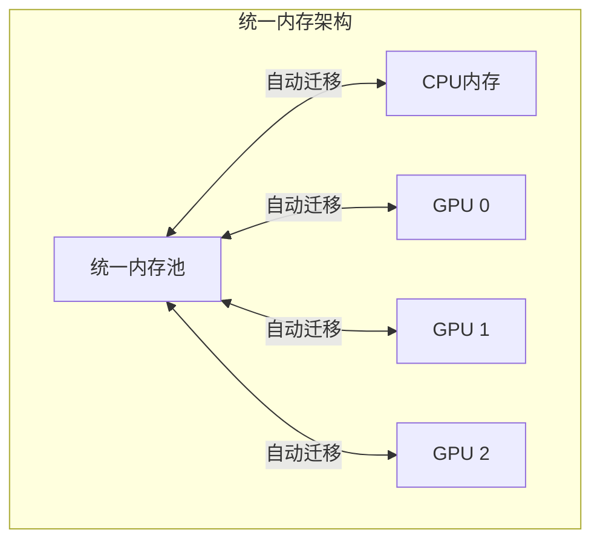

**统一内存优势**：
- 简化多GPU编程，无需手动管理数据传输
- 自动数据迁移，优化内存带宽利用
- 支持超额分配，突破单GPU显存限制
- 页面粒度迁移，按需移动数据

### 4.2 多GPU统一内存分配

```cpp
#include <cuda_runtime.h>

void multi_gpu_unified_memory_example() {
    int num_gpus;
    cudaGetDeviceCount(&num_gpus);

    const size_t N = 1024 * 1024 * 256;  // 256M 元素
    size_t size = N * sizeof(float);

    // 分配统一内存
    float* data;
    cudaMallocManaged(&data, size);

    // CPU初始化
    for (size_t i = 0; i < N; i++) {
        data[i] = static_cast<float>(i);
    }

    // 在每个GPU上启动核函数
    size_t chunk_size = N / num_gpus;
    for (int gpu = 0; gpu < num_gpus; gpu++) {
        cudaSetDevice(gpu);
        size_t offset = gpu * chunk_size;

        // 设置内存建议：数据将被该GPU访问
        cudaMemLocation loc = {cudaMemLocationTypeDevice, gpu};
        cudaMemAdvise(data + offset, chunk_size * sizeof(float),
                      cudaMemAdviseSetPreferredLocation, loc);
        cudaMemAdvise(data + offset, chunk_size * sizeof(float),
                      cudaMemAdviseSetAccessedBy, loc);
    }

    // 并行执行计算
    for (int gpu = 0; gpu < num_gpus; gpu++) {
        cudaSetDevice(gpu);
        size_t offset = gpu * chunk_size;
        process_kernel<<<grid, block>>>(data + offset, chunk_size);
    }

    // 同步所有GPU
    for (int gpu = 0; gpu < num_gpus; gpu++) {
        cudaSetDevice(gpu);
        cudaDeviceSynchronize();
    }

    cudaFree(data);
}
```

### 4.3 cudaMemPrefetchAsync多GPU预取

使用`cudaMemPrefetchAsync`可以主动将统一内存数据预取到指定GPU，避免Page Fault延迟：

```cpp
/**
 * 多GPU统一内存预取示例
 * 演示如何使用cudaMemPrefetchAsync在多GPU场景优化数据迁移
 */
void multi_gpu_prefetch_example(int num_gpus) {
    const size_t N = 1024 * 1024 * 128;  // 128M 元素
    size_t size = N * sizeof(float);

    // 分配统一内存
    float* d_data;
    cudaMallocManaged(&d_data, size);

    // CPU初始化数据
    printf("CPU初始化数据...\n");
    for (size_t i = 0; i < N; i++) {
        d_data[i] = static_cast<float>(i % 1000);
    }

    // 创建流（每个GPU一个流）
    cudaStream_t* streams = new cudaStream_t[num_gpus];
    for (int gpu = 0; gpu < num_gpus; gpu++) {
        cudaSetDevice(gpu);
        cudaStreamCreate(&streams[gpu]);
    }

    // 分块处理
    size_t chunk_size = N / num_gpus;

    // 预取数据到各GPU
    printf("预取数据到各GPU...\n");
    for (int gpu = 0; gpu < num_gpus; gpu++) {
        cudaMemLocation gpu_loc = {cudaMemLocationTypeDevice, gpu};
        size_t offset = gpu * chunk_size;

        // 异步预取到指定GPU
        cudaMemPrefetchAsync(d_data + offset, chunk_size * sizeof(float),
                             gpu_loc, 0, streams[gpu]);
    }

    // 等待预取完成
    for (int gpu = 0; gpu < num_gpus; gpu++) {
        cudaSetDevice(gpu);
        cudaStreamSynchronize(streams[gpu]);
    }

    // 创建计时事件
    cudaSetDevice(0);
    cudaEvent_t start, stop;
    cudaEventCreate(&start);
    cudaEventCreate(&stop);

    // 执行计算（数据已在GPU上，无Page Fault）
    printf("执行计算...\n");
    cudaEventRecord(start);
    for (int gpu = 0; gpu < num_gpus; gpu++) {
        cudaSetDevice(gpu);
        size_t offset = gpu * chunk_size;
        compute_kernel<<<grid, block, 0, streams[gpu]>>>(
            d_data + offset, chunk_size);
    }

    // 同步所有GPU
    for (int gpu = 0; gpu < num_gpus; gpu++) {
        cudaSetDevice(gpu);
        cudaStreamSynchronize(streams[gpu]);
    }

    cudaSetDevice(0);
    cudaEventRecord(stop);
    cudaEventSynchronize(stop);

    float ms;
    cudaEventElapsedTime(&ms, start, stop);
    printf("计算时间: %.3f ms\n", ms);

    // 预取结果回CPU
    printf("预取结果回CPU...\n");
    cudaMemLocation cpu_loc = {cudaMemLocationTypeHost, 0};
    cudaStream_t host_stream;
    cudaStreamCreate(&host_stream);
    cudaMemPrefetchAsync(d_data, size, cpu_loc, 0, host_stream);
    cudaStreamSynchronize(host_stream);

    // 清理
    for (int gpu = 0; gpu < num_gpus; gpu++) {
        cudaSetDevice(gpu);
        cudaStreamDestroy(streams[gpu]);
    }
    cudaStreamDestroy(host_stream);
    delete[] streams;
    cudaFree(d_data);
    cudaEventDestroy(start);
    cudaEventDestroy(stop);
}
```

### 4.4 内存建议（Memory Advise）详解

`cudaMemAdvise`提供数据迁移提示，帮助驱动程序优化统一内存性能：

```cpp
// 多GPU内存建议示例
void memory_advise_multi_gpu(float* data, size_t size, int num_gpus) {
    size_t chunk_size = size / num_gpus;

    for (int gpu = 0; gpu < num_gpus; gpu++) {
        cudaMemLocation gpu_loc = {cudaMemLocationTypeDevice, gpu};
        size_t offset = gpu * chunk_size;
        float* chunk_ptr = data + offset;

        // 设置建议：数据首选位置在该GPU
        cudaMemAdvise(chunk_ptr, chunk_size * sizeof(float),
                      cudaMemAdviseSetPreferredLocation, gpu_loc);

        // 设置建议：数据将被该GPU访问
        cudaMemAdvise(chunk_ptr, chunk_size * sizeof(float),
                      cudaMemAdviseSetAccessedBy, gpu_loc);
    }
}

// 内存建议类型说明
/*
cudaMemAdviseSetReadMostly:
    - 提示数据主要被读取
    - 驱动会在各GPU创建只读副本
    - 适用于模型参数等只读数据

cudaMemAdviseSetPreferredLocation:
    - 设置数据的首选位置
    - 驱动优先将数据保持在该位置
    - 减少不必要的迁移

cudaMemAdviseSetAccessedBy:
    - 提示数据将被指定设备访问
    - 驱动预建立映射关系
    - 减少首次访问延迟

cudaMemAdviseUnsetReadMostly:
cudaMemAdviseUnsetPreferredLocation:
cudaMemAdviseUnsetAccessedBy:
    - 取消相应的建议
*/
```

### 4.5 多GPU负载均衡示例

```cpp
/**
 * 多GPU动态负载均衡示例
 * 根据GPU性能动态分配任务
 */
#include <cuda_runtime.h>
#include <vector>
#include <algorithm>

// GPU性能信息结构
struct GPUInfo {
    int device_id;
    size_t total_memory;
    int compute_capability;
    int sm_count;
    float performance_score;  // 综合性能评分
};

// 评估GPU性能
std::vector<GPUInfo> evaluate_gpu_performance(int num_gpus) {
    std::vector<GPUInfo> gpu_infos(num_gpus);

    for (int gpu = 0; gpu < num_gpus; gpu++) {
        cudaDeviceProp prop;
        cudaGetDeviceProperties(&prop, gpu);

        gpu_infos[gpu].device_id = gpu;
        gpu_infos[gpu].total_memory = prop.totalGlobalMem;
        gpu_infos[gpu].compute_capability = prop.major * 10 + prop.minor;
        gpu_infos[gpu].sm_count = prop.multiProcessorCount;

        // 简单的性能评分模型
        // 可根据实际应用调整权重
        gpu_infos[gpu].performance_score =
            static_cast<float>(prop.multiProcessorCount) * 10.0f +
            static_cast<float>(prop.totalGlobalMem) / 1e9f * 5.0f +
            static_cast<float>(gpu_infos[gpu].compute_capability);
    }

    // 按性能评分排序
    std::sort(gpu_infos.begin(), gpu_infos.end(),
              [](const GPUInfo& a, const GPUInfo& b) {
                  return a.performance_score > b.performance_score;
              });

    return gpu_infos;
}

// 计算每个GPU的工作负载比例
std::vector<float> calculate_work_distribution(
        const std::vector<GPUInfo>& gpu_infos) {

    float total_score = 0;
    for (const auto& info : gpu_infos) {
        total_score += info.performance_score;
    }

    std::vector<float> distribution(gpu_infos.size());
    for (size_t i = 0; i < gpu_infos.size(); i++) {
        distribution[i] = gpu_infos[i].performance_score / total_score;
    }

    return distribution;
}

// 动态负载均衡执行
void dynamic_load_balanced_execution(int num_gpus, size_t total_elements) {
    // 评估GPU性能
    auto gpu_infos = evaluate_gpu_performance(num_gpus);
    auto distribution = calculate_work_distribution(gpu_infos);

    printf("GPU工作负载分配:\n");
    for (size_t i = 0; i < gpu_infos.size(); i++) {
        printf("  GPU %d: %.1f%% (%zu 元素)\n",
               gpu_infos[i].device_id,
               distribution[i] * 100,
               static_cast<size_t>(total_elements * distribution[i]));
    }

    // 分配统一内存
    float* d_input;
    float* d_output;
    cudaMallocManaged(&d_input, total_elements * sizeof(float));
    cudaMallocManaged(&d_output, total_elements * sizeof(float));

    // 初始化数据
    for (size_t i = 0; i < total_elements; i++) {
        d_input[i] = static_cast<float>(i);
    }

    // 创建流和事件
    std::vector<cudaStream_t> streams(num_gpus);
    std::vector<cudaEvent_t> events(num_gpus);
    for (int gpu = 0; gpu < num_gpus; gpu++) {
        cudaSetDevice(gpu);
        cudaStreamCreate(&streams[gpu]);
        cudaEventCreate(&events[gpu]);
    }

    // 按负载分配执行任务
    size_t offset = 0;
    for (size_t i = 0; i < gpu_infos.size(); i++) {
        int gpu = gpu_infos[i].device_id;
        size_t chunk_size = static_cast<size_t>(total_elements * distribution[i]);

        cudaSetDevice(gpu);

        // 预取数据
        cudaMemLocation gpu_loc = {cudaMemLocationTypeDevice, gpu};
        cudaMemPrefetchAsync(d_input + offset, chunk_size * sizeof(float),
                             gpu_loc, 0, streams[gpu]);
        cudaMemPrefetchAsync(d_output + offset, chunk_size * sizeof(float),
                             gpu_loc, 0, streams[gpu]);

        // 执行核函数
        int block_size = 256;
        int grid_size = (chunk_size + block_size - 1) / block_size;
        compute_kernel<<<grid_size, block_size, 0, streams[gpu]>>>(
            d_input + offset, d_output + offset, chunk_size);

        // 记录完成事件
        cudaEventRecord(events[gpu], streams[gpu]);

        offset += chunk_size;
    }

    // 等待所有GPU完成
    for (int gpu = 0; gpu < num_gpus; gpu++) {
        cudaEventSynchronize(events[gpu]);
    }

    printf("所有GPU计算完成\n");

    // 清理
    for (int gpu = 0; gpu < num_gpus; gpu++) {
        cudaSetDevice(gpu);
        cudaStreamDestroy(streams[gpu]);
        cudaEventDestroy(events[gpu]);
    }
    cudaFree(d_input);
    cudaFree(d_output);
}
```

---

## 5. CUDA事件与多GPU同步

### 4.1 CUDA事件基础

```cpp
// 创建事件
cudaEvent_t event;
cudaEventCreate(&event);

// 记录事件
cudaEventRecord(event, stream);

// 等待事件
cudaEventSynchronize(event);

// 计算时间
cudaEventElapsedTime(&ms, start, stop);

// 销毁事件
cudaEventDestroy(event);
```

### 4.2 跨GPU事件同步

```cpp
void multi_gpu_sync_example(int gpu0, int gpu1) {
    cudaStream_t stream0, stream1;
    cudaEvent_t event0;

    // 创建流和事件
    cudaSetDevice(gpu0);
    cudaStreamCreate(&stream0);
    cudaEventCreate(&event0);

    cudaSetDevice(gpu1);
    cudaStreamCreate(&stream1);

    // 在GPU0上执行任务并记录事件
    cudaSetDevice(gpu0);
    kernel0<<<grid, block, 0, stream0>>>(...);
    cudaEventRecord(event0, stream0);

    // GPU1等待GPU0完成
    cudaSetDevice(gpu1);
    cudaStreamWaitEvent(stream1, event0, 0);
    kernel1<<<grid, block, 0, stream1>>>(...);

    // 同步
    cudaStreamSynchronize(stream1);

    // 清理
    cudaSetDevice(gpu0);
    cudaStreamDestroy(stream0);
    cudaEventDestroy(event0);
    cudaSetDevice(gpu1);
    cudaStreamDestroy(stream1);
}
```

### 4.3 多GPU流水线执行

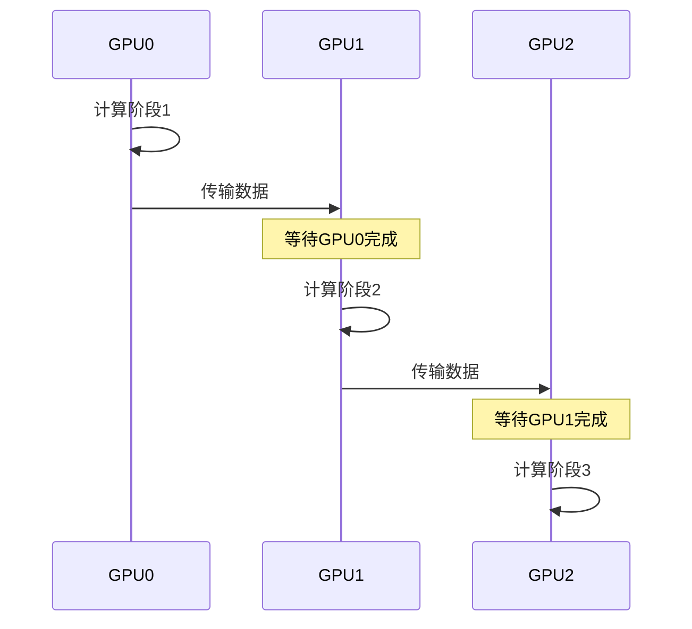

```cpp
void pipeline_multi_gpu() {
    const int num_gpus = 3;
    cudaStream_t streams[num_gpus];
    cudaEvent_t events[num_gpus];

    // 初始化
    for (int i = 0; i < num_gpus; i++) {
        cudaSetDevice(i);
        cudaStreamCreate(&streams[i]);
        cudaEventCreate(&events[i]);
    }

    // 流水线执行
    for (int stage = 0; stage < num_gpus; stage++) {
        cudaSetDevice(stage);

        if (stage > 0) {
            // 等待前一个阶段完成
            cudaStreamWaitEvent(streams[stage], events[stage - 1], 0);
        }

        // 执行计算
        kernel<<<grid, block, 0, streams[stage]>>>(...);

        // 记录完成事件
        cudaEventRecord(events[stage], streams[stage]);

        if (stage < num_gpus - 1) {
            // 传输到下一个GPU
            cudaMemcpyPeerAsync(d_next, stage + 1, d_curr, stage, size, streams[stage]);
        }
    }

    // 最终同步
    cudaSetDevice(num_gpus - 1);
    cudaStreamSynchronize(streams[num_gpus - 1]);
}
```

---

## 5. NCCL概述

### 5.1 什么是NCCL

**NCCL (NVIDIA Collective Communications Library)** 是NVIDIA提供的多GPU通信库：

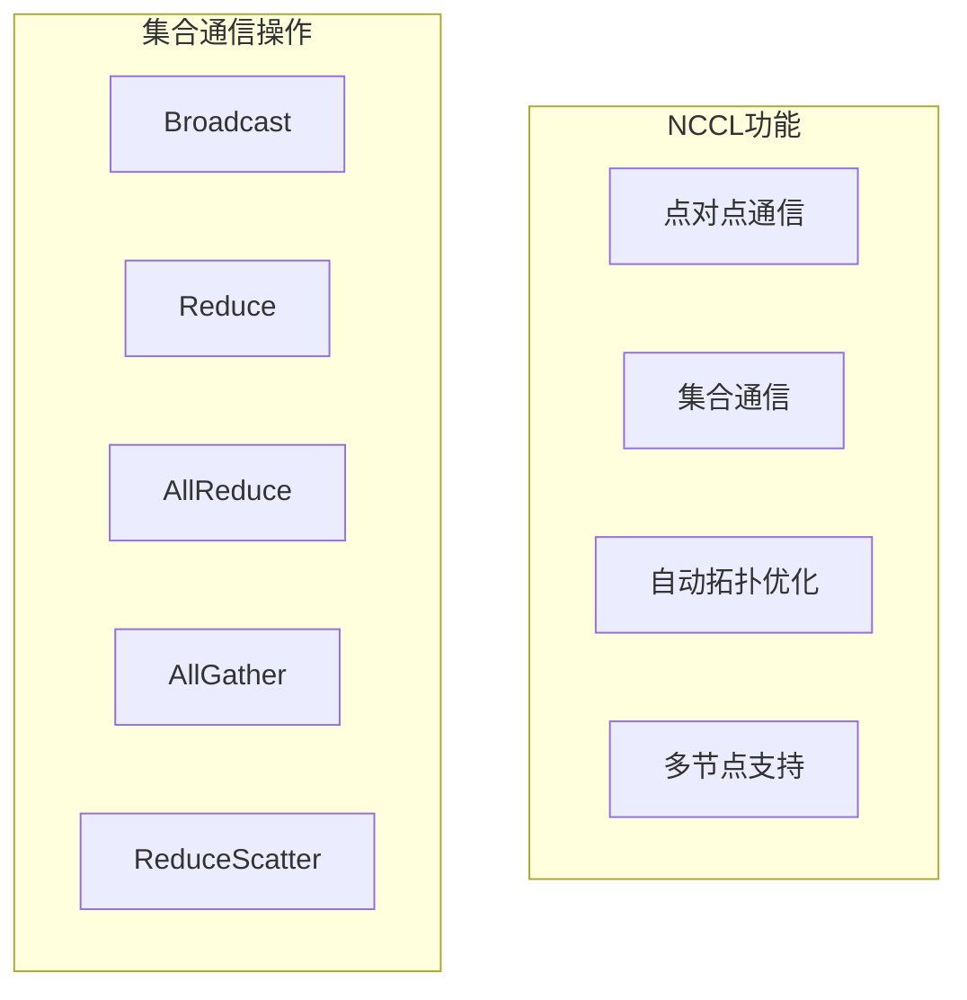

**NCCL优势**：
- 支持节点内和节点间通信
- 自动选择最优通信路径
- 支持多种并行模式
- 与深度学习框架深度集成

### 5.2 NCCL通信操作

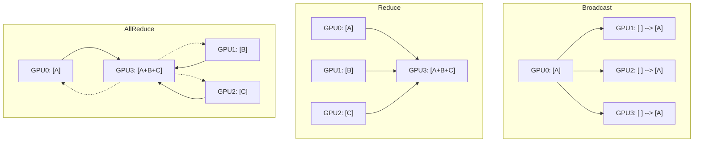

**集合通信操作说明**：

| 操作 | 描述 | 典型应用 |
|------|------|----------|
| Broadcast | 一对多广播 | 参数初始化 |
| Reduce | 多对一规约 | 梯度聚合 |
| AllReduce | 全规约 | 分布式训练梯度同步 |
| AllGather | 全收集 | 数据聚合 |
| ReduceScatter | 规约分散 | 模型并行 |

### 5.3 NCCL基础使用

```cpp
#include <nccl.h>
#include <cuda_runtime.h>

#define NCCL_CHECK(call) \
    do { \
        ncclResult_t res = call; \
        if (res != ncclSuccess) { \
            printf("NCCL错误: %s\n", ncclGetErrorString(res)); \
            exit(1); \
        } \
    } while(0)

void nccl_basic_example() {
    int num_gpus;
    cudaGetDeviceCount(&num_gpus);

    // 创建通信组
    ncclComm_t comms[num_gpus];
    NCCL_CHECK(ncclCommInitAll(comms, num_gpus, NULL));

    // 每个GPU分配缓冲区
    float* d_send[num_gpus];
    float* d_recv[num_gpus];
    size_t size = 1024 * 1024;  // 1M元素

    for (int i = 0; i < num_gpus; i++) {
        cudaSetDevice(i);
        cudaMalloc(&d_send[i], size * sizeof(float));
        cudaMalloc(&d_recv[i], size * sizeof(float));
    }

    // 创建流
    cudaStream_t stream;
    cudaStreamCreate(&stream);

    // 执行AllReduce
    NCCL_CHECK(ncclAllReduce(
        d_send[0], d_recv[0], size,
        ncclFloat, ncclSum,
        comms[0], stream
    ));

    // 同步
    cudaStreamSynchronize(stream);

    // 清理
    for (int i = 0; i < num_gpus; i++) {
        cudaSetDevice(i);
        cudaFree(d_send[i]);
        cudaFree(d_recv[i]);
        ncclCommDestroy(comms[i]);
    }
}
```

---

## 6. NCCL点对点通信

### 6.1 Send/Recv操作

```cpp
void nccl_p2p_example(int num_gpus) {
    ncclComm_t comms[num_gpus];
    ncclCommInitAll(comms, num_gpus, NULL);

    float* d_data[num_gpus];
    size_t size = 1024;

    for (int i = 0; i < num_gpus; i++) {
        cudaSetDevice(i);
        cudaMalloc(&d_data[i], size * sizeof(float));
    }

    cudaStream_t stream;
    cudaStreamCreate(&stream);

    // GPU 0 发送数据给 GPU 1
    ncclGroupStart();
    if (num_gpus >= 2) {
        cudaSetDevice(0);
        ncclSend(d_data[0], size, ncclFloat, 1, comms[0], stream);

        cudaSetDevice(1);
        ncclRecv(d_data[1], size, ncclFloat, 0, comms[1], stream);
    }
    ncclGroupEnd();

    cudaStreamSynchronize(stream);

    // 清理...
}
```

### 6.2 ncclGroup使用

```cpp
// ncclGroup将多个通信操作打包
// 组内操作可以并行执行，提高效率

ncclGroupStart();
for (int i = 0; i < num_gpus; i++) {
    ncclSend(send_buf[i], size, ncclFloat, dest[i], comms[i], streams[i]);
    ncclRecv(recv_buf[i], size, ncclFloat, src[i], comms[i], streams[i]);
}
ncclGroupEnd();
```

---

## 7. NCCL集合通信详解

### 7.1 AllReduce详解

AllReduce是最常用的集合通信操作，广泛应用于分布式训练：

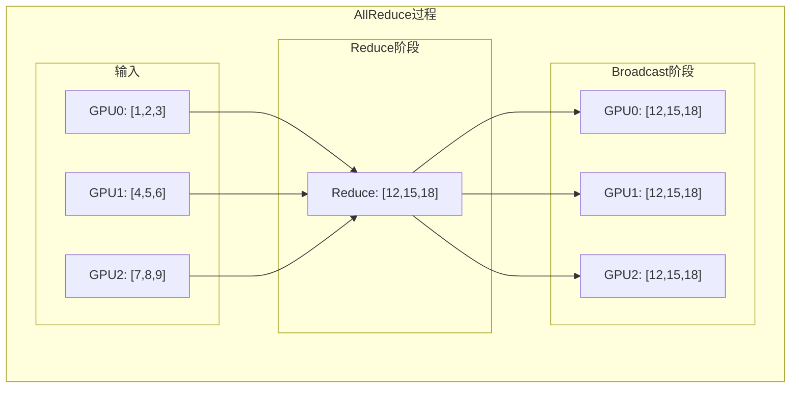

```cpp
void nccl_allreduce_example(int rank, int num_ranks, ncclComm_t comm) {
    const int N = 1024 * 1024;
    float* d_data;
    cudaMalloc(&d_data, N * sizeof(float));

    // 初始化数据
    cudaSetDevice(rank);
    cudaMemset(d_data, rank, N * sizeof(float));

    cudaStream_t stream;
    cudaStreamCreate(&stream);

    // AllReduce求和
    ncclAllReduce(
        d_data,          // 发送缓冲区
        d_data,          // 接收缓冲区（in-place）
        N,               // 元素数量
        ncclFloat,       // 数据类型
        ncclSum,         // 规约操作
        comm,            // 通信组
        stream           // CUDA流
    );

    cudaStreamSynchronize(stream);

    // 验证结果
    float h_result;
    cudaMemcpy(&h_result, d_data, sizeof(float), cudaMemcpyDeviceToHost);
    printf("Rank %d: result = %f\n", rank, h_result);

    cudaFree(d_data);
    cudaStreamDestroy(stream);
}
```

### 7.2 其他集合操作

```cpp
// Broadcast: 从root广播到所有GPU
ncclBroadcast(sendbuf, recvbuf, count, ncclFloat, root, comm, stream);

// Reduce: 所有GPU规约到root
ncclReduce(sendbuf, recvbuf, count, ncclFloat, ncclSum, root, comm, stream);

// AllGather: 每个GPU收集所有GPU的数据
ncclAllGather(sendbuf, recvbuf, count, ncclFloat, comm, stream);

// ReduceScatter: 规约后分散
ncclReduceScatter(sendbuf, recvbuf, count, ncclFloat, ncclSum, comm, stream);
```

### 7.3 NCCL数据类型和操作

```cpp
// NCCL支持的数据类型
ncclInt8      // 8位整数
ncclChar      // 字符
ncclUint8     // 无符号8位整数
ncclInt32     // 32位整数
ncclInt       // 整数
ncclUint32    // 无符号32位整数
ncclInt64     // 64位整数
ncclUint64    // 无符号64位整数
ncclFloat16   // 半精度浮点
ncclHalf      // 半精度浮点
ncclFloat32   // 单精度浮点
ncclFloat     // 单精度浮点
ncclFloat64   // 双精度浮点
ncclDouble    // 双精度浮点
ncclBfloat16  // BF16

// NCCL支持的规约操作
ncclSum       // 求和
ncclProd      // 求积
ncclMax       // 最大值
ncclMin       // 最小值
ncclAvg       // 平均值
```

---

## 8. 多GPU编程模式

### 8.1 数据并行模式

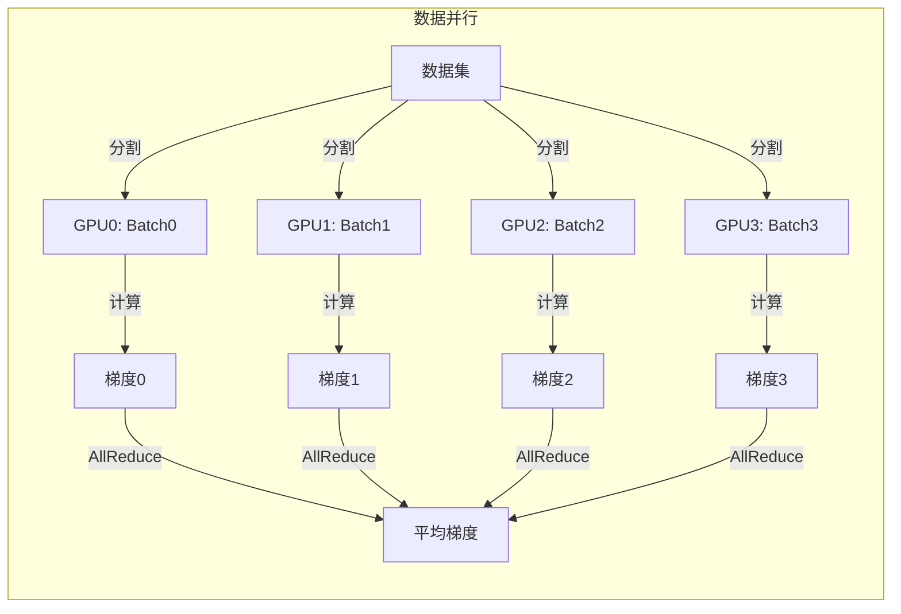

```cpp
void data_parallel_train(float* model_params, int param_size, int num_gpus) {
    // 每个GPU有模型副本
    float* d_params[num_gpus];
    float* d_gradients[num_gpus];

    for (int i = 0; i < num_gpus; i++) {
        cudaSetDevice(i);
        cudaMalloc(&d_params[i], param_size * sizeof(float));
        cudaMalloc(&d_gradients[i], param_size * sizeof(float));

        // 复制模型参数
        cudaMemcpy(d_params[i], model_params, param_size * sizeof(float),
                   cudaMemcpyHostToDevice);
    }

    // 初始化NCCL
    ncclComm_t comms[num_gpus];
    ncclCommInitAll(comms, num_gpus, NULL);

    // 训练循环
    for (int iter = 0; iter < iterations; iter++) {
        // 每个GPU计算梯度
        for (int i = 0; i < num_gpus; i++) {
            cudaSetDevice(i);
            compute_gradients<<<...>>>(d_gradients[i], d_params[i], data[i]);
        }

        // AllReduce同步梯度
        for (int i = 0; i < num_gpus; i++) {
            ncclAllReduce(d_gradients[i], d_gradients[i], param_size,
                          ncclFloat, ncclAvg, comms[i], streams[i]);
        }

        // 更新参数
        for (int i = 0; i < num_gpus; i++) {
            cudaSetDevice(i);
            update_params<<<...>>>(d_params[i], d_gradients[i]);
        }
    }
}
```

### 8.2 模型并行模式

```cpp
// 模型并行：将模型分割到多个GPU
void model_parallel_forward(float* input, float* output, int num_gpus) {
    cudaStream_t streams[num_gpus];
    cudaEvent_t events[num_gpus];

    // 初始化
    for (int i = 0; i < num_gpus; i++) {
        cudaSetDevice(i);
        cudaStreamCreate(&streams[i]);
        cudaEventCreate(&events[i]);
    }

    // 流水线前向传播
    for (int i = 0; i < num_gpus; i++) {
        cudaSetDevice(i);

        if (i > 0) {
            // 等待前一阶段完成
            cudaStreamWaitEvent(streams[i], events[i-1], 0);
        }

        // 执行本阶段计算
        layer_forward<<<...>>>(d_input[i], d_output[i]);

        // 记录完成事件
        cudaEventRecord(events[i], streams[i]);

        if (i < num_gpus - 1) {
            // 传输到下一阶段
            cudaMemcpyPeerAsync(d_input[i+1], i+1, d_output[i], i,
                                size, streams[i]);
        }
    }
}
```

### 8.3 流水线并行

```cpp
// 简化的流水线并行示例
void pipeline_parallel() {
    const int num_stages = 4;
    const int num_micro_batches = 8;

    float* d_data[num_stages][num_micro_batches];

    // 按时间步执行
    for (int t = 0; t < num_stages + num_micro_batches - 1; t++) {
        for (int s = 0; s < num_stages; s++) {
            int mb = t - s;  // 微批次索引
            if (mb >= 0 && mb < num_micro_batches) {
                cudaSetDevice(s);
                // 执行该阶段该微批次的计算
                stage_kernel<<<...>>>(d_data[s][mb]);
            }
        }
    }
}
```

---

## 9. 性能优化

### 9.1 通信与计算重叠

```cpp
void overlap_comm_compute(int num_gpus, ncclComm_t* comms) {
    float* d_activations[num_gpus];
    float* d_gradients[num_gpus];

    for (int iter = 0; iter < iterations; iter++) {
        // 前向传播（计算）
        for (int i = 0; i < num_gpus; i++) {
            cudaSetDevice(i);
            forward_kernel<<<...>>>(d_activations[i]);
        }

        // 反向传播与梯度同步重叠
        for (int i = 0; i < num_gpus; i++) {
            cudaSetDevice(i);

            // 在计算梯度的同时启动通信
            cudaStream_t compute_stream, comm_stream;
            cudaStreamCreate(&compute_stream);
            cudaStreamCreate(&comm_stream);

            // 计算梯度
            backward_kernel<<<..., compute_stream>>>(d_gradients[i]);

            // 异步AllReduce（等待梯度计算完成）
            cudaEvent_t grad_ready;
            cudaEventCreate(&grad_ready);
            cudaEventRecord(grad_ready, compute_stream);
            cudaStreamWaitEvent(comm_stream, grad_ready, 0);

            ncclAllReduce(d_gradients[i], d_gradients[i], size,
                          ncclFloat, ncclAvg, comms[i], comm_stream);
        }
    }
}
```

### 9.2 通信优化策略

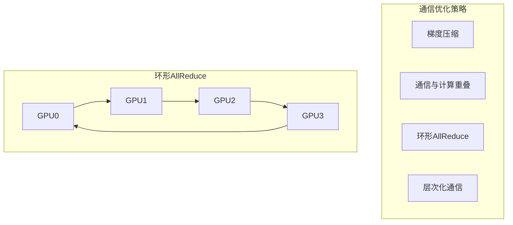

**优化建议**：
1. **批量通信**：减少通信次数，增大每次通信量
2. **通信隐藏**：与计算流水线化
3. **拓扑感知**：利用NVLink高速互联
4. **梯度压缩**：减少传输数据量

### 9.3 NCCL环境变量

```bash
# 设置NCCL调试级别
export NCCL_DEBUG=INFO

# 设置NCCL使用的网络接口
export NCCL_SOCKET_IFNAME=eth0

# 设置NCCL超时
export NCCL_COMM_BLOCKING=1

# 指定NCCL使用的GPU数量
export NCCL_MAX_NRINGS=4

# 禁用P2P（调试用）
export NCCL_P2P_DISABLE=1
```

---

## 10. 实践案例

### 10.1 多GPU向量加法

```cpp
// 完整示例见 examples/25_multi_gpu/01_device_selection.cu

#include <cuda_runtime.h>
#include <cstdio>

__global__ void vector_add(float* a, float* b, float* c, int n) {
    int idx = blockIdx.x * blockDim.x + threadIdx.x;
    if (idx < n) {
        c[idx] = a[idx] + b[idx];
    }
}

void multi_gpu_vector_add(int num_gpus) {
    const int N = 1024 * 1024;
    const int chunk_size = N / num_gpus;

    float* d_a[num_gpus], * d_b[num_gpus], * d_c[num_gpus];

    // 分配和初始化
    for (int i = 0; i < num_gpus; i++) {
        cudaSetDevice(i);
        cudaMalloc(&d_a[i], chunk_size * sizeof(float));
        cudaMalloc(&d_b[i], chunk_size * sizeof(float));
        cudaMalloc(&d_c[i], chunk_size * sizeof(float));
    }

    // 并行计算
    for (int i = 0; i < num_gpus; i++) {
        cudaSetDevice(i);
        int blocks = (chunk_size + 255) / 256;
        vector_add<<<blocks, 256>>>(d_a[i], d_b[i], d_c[i], chunk_size);
    }

    // 同步
    for (int i = 0; i < num_gpus; i++) {
        cudaSetDevice(i);
        cudaDeviceSynchronize();
    }
}
```

---

## 11. 本章小结

### 11.1 关键概念

| 概念 | 描述 |
|------|------|
| 设备选择 | cudaSetDevice选择GPU |
| P2P传输 | GPU间直接数据传输 |
| NCCL | NVIDIA集合通信库 |
| AllReduce | 全规约操作 |
| 数据并行 | 数据分割到多个GPU |

### 11.2 核心API

```cpp
// 设备管理
cudaGetDeviceCount()      // 获取设备数量
cudaSetDevice()           // 选择设备
cudaGetDeviceProperties() // 获取设备属性

// P2P传输
cudaDeviceCanAccessPeer()   // 检查P2P能力
cudaDeviceEnablePeerAccess() // 启用P2P
cudaMemcpyPeer()            // P2P传输

// NCCL
ncclCommInitAll()   // 初始化通信组
ncclAllReduce()     // AllReduce
ncclSend()/ncclRecv() // 点对点通信
```

### 11.3 思考题

1. 如何选择数据并行还是模型并行？
2. P2P传输和通过CPU中转传输的性能差异有多大？
3. 如何优化多GPU训练的通信开销？
4. NCCL的AllReduce内部是如何实现的？

---

## 下一章

[第二十六章：低精度与量化](./26_低精度与量化.md) - 学习FP16、BF16、INT8等低精度类型和量化技术

---

*参考资料：*
- *[CUDA C++ Programming Guide - Multi-Device System](https://docs.nvidia.com/cuda/cuda-c-programming-guide/index.html#multi-device-system)*
- *[NCCL Documentation](https://docs.nvidia.com/deeplearning/nccl/user-guide/docs/)*
- *[NVIDIA NVLink Technology](https://www.nvidia.com/en-us/data-center/nvlink/)*