# 第二十六章：低精度与量化

> 学习目标：理解FP16、BF16、TF32等低精度浮点类型，掌握INT8量化原理与实现，学会使用低精度加速计算
>
> 预计阅读时间：90 分钟
>
> 前置知识：[第十章：精度与数值](./10_精度与数值.md) | [第十一章：Roofline模型](./11_Roofline模型.md)

---

## 1. 低精度概述

### 1.1 为什么需要低精度

在深度学习和高性能计算中，降低精度可以带来显著的性能提升：

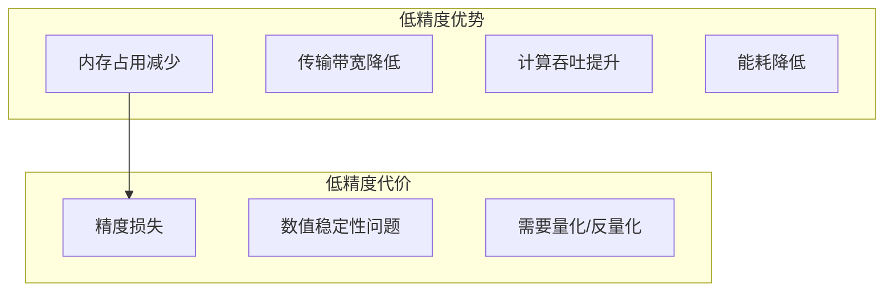

**性能提升来源**：
- **存储减半**：FP16相比FP32存储减半，带宽压力降低
- **计算加速**：Tensor Core专为低精度设计
- **并行度提高**：同样寄存器数量可处理更多数据

**GPU计算架构优势**：


上图展示了GPU将更多晶体管用于数据处理的设计理念，这也是低精度计算能够带来巨大性能提升的硬件基础。Tensor Core等专用计算单元在处理低精度数据时效率更高。

### 1.2 浮点数表示

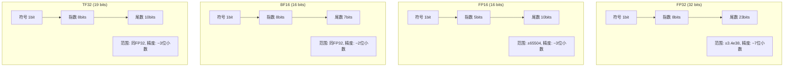

### 1.3 精度类型对比

| 类型 | 位宽 | 指数位 | 尾数位 | 数值范围 | 精度 |
|------|------|--------|--------|----------|------|
| FP32 | 32 | 8 | 23 | ±3.4e38 | ~7位 |
| FP16 | 16 | 5 | 10 | ±65504 | ~3位 |
| BF16 | 16 | 8 | 7 | ±3.4e38 | ~2位 |
| TF32 | 19 | 8 | 10 | ±3.4e38 | ~3位 |
| INT8 | 8 | - | - | -128~127 | 整数 |

---

## 2. FP16半精度浮点

### 2.1 FP16在CUDA中的使用

```cpp
#include <cuda_fp16.h>

// FP16类型定义
__half h;              // 半精度浮点
__half2 h2;            // 半精度浮点对（SIMD）

// FP16与FP32转换
float f = __half2float(h);
h = __float2half(f);

// FP16运算
__half a = __float2half(1.5f);
__half b = __float2half(2.5f);
__half c = __hadd(a, b);  // FP16加法
```

### 2.2 FP16向量化操作

```cpp
// 使用__half2进行向量化运算（2个FP16同时处理）
__global__ void fp16_vector_add(const __half2* a, const __half2* b,
                                  __half2* c, int n) {
    int idx = blockIdx.x * blockDim.x + threadIdx.x;
    if (idx < n / 2) {  // 注意: __half2处理两个元素
        c[idx] = __hadd2(a[idx], b[idx]);
    }
}
```

### 2.3 FP16性能优势

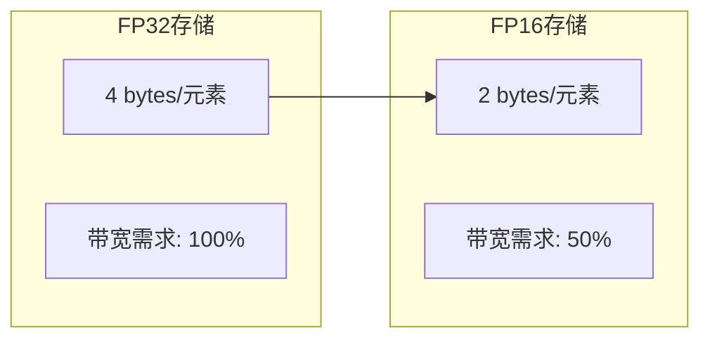

**FP16优势**：
- 存储和带宽减半
- Tensor Core加速
- Warp级别向量化（`__half2`）

### 2.4 FP16的注意事项

```cpp
// FP16动态范围有限，需要注意溢出
__half large_val = __float2half(70000.0f);  // 会溢出！

// 使用混合精度计算避免精度损失
__half a = __float2half(0.001f);
__half b = __float2half(0.002f);

// 方式1: 直接FP16计算（可能有精度损失）
__half c = __hadd(a, b);

// 方式2: 混合精度（转FP32计算后再转回）
__half c_precise = __float2half(__half2float(a) + __half2float(b));
```

---

## 3. BF16与TF32

### 3.1 BF16 (Brain Floating Point)

BF16由Google Brain发明，专为深度学习设计：

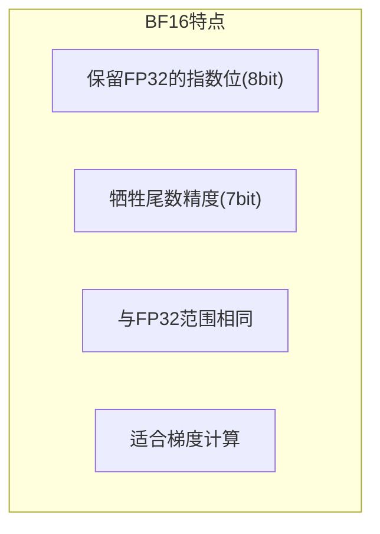

```cpp
// BF16在CUDA中的使用
#include <cuda_bf16.h>

__nv_bfloat16 bf;      // BF16类型
__nv_bfloat162 bf2;    // BF16对

// 类型转换
float f = __bfloat162float(bf);
bf = __float2bfloat16(f);

// BF16运算
__nv_bfloat16 a = __float2bfloat16(1.5f);
__nv_bfloat16 b = __float2bfloat16(2.5f);
__nv_bfloat16 c = __hadd(a, b);
```

**BF16 vs FP16**：

| 特性 | FP16 | BF16 |
|------|------|------|
| 数值范围 | ±65504 | ±3.4e38 |
| 精度 | ~3位小数 | ~2位小数 |
| 溢出风险 | 高 | 低 |
| 硬件支持 | 广泛 | Ampere+ |

### 3.2 TF32 (Tensor Float 32)

TF32是NVIDIA Ampere架构引入的内部格式：

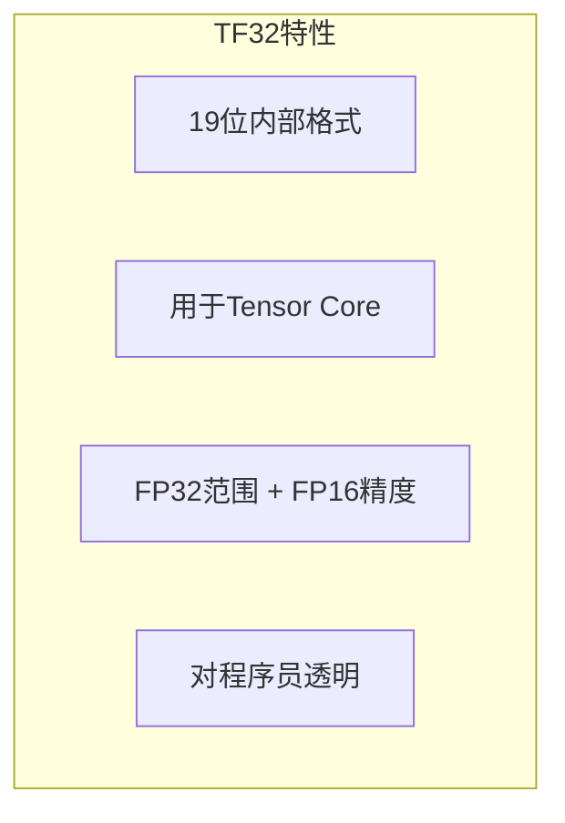

```cpp
// TF32由Tensor Core自动使用
// 在cuBLAS中启用TF32
#include <cublas_v2.h>

cublasHandle_t handle;
cublasCreate(&handle);

// 启用TF32加速
cublasSetMathMode(handle, CUBLAS_TF32_TENSOR_OP_MATH);

// 执行GEMM时自动使用TF32
cublasSgemm(handle, ...);  // 内部使用TF32 Tensor Core
```

**TF32使用要点**：
- 自动应用于FP32 GEMM
- 无需代码修改
- Ampere及更新架构支持
- 适合训练和推理

---

## 4. INT8量化

### 4.1 量化原理

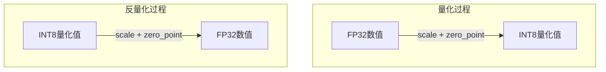

**量化公式**（线性对称量化）：
```
Q = round(x / scale)
x' = Q * scale
```

**量化公式**（线性非对称量化）：
```
Q = round(x / scale) + zero_point
x' = (Q - zero_point) * scale
```

### 4.2 量化类型

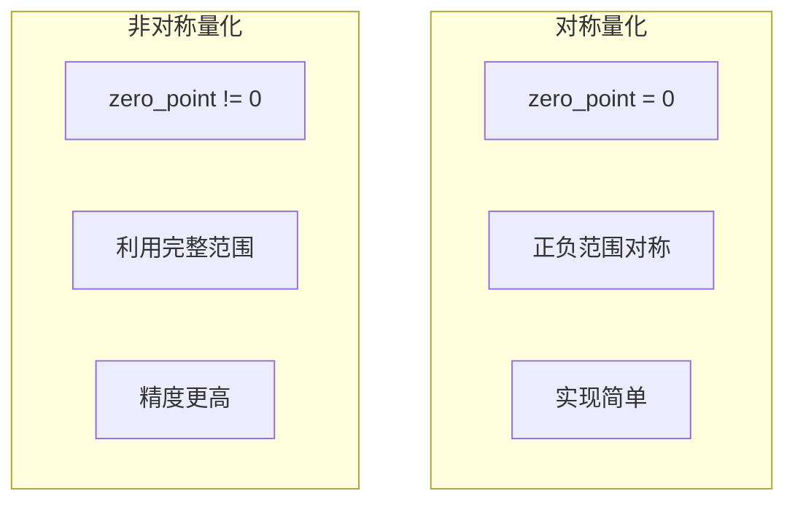

### 4.3 量化粒度

| 粒度 | 描述 | 精度 | 开销 |
|------|------|------|------|
| 张量级 | 整个张量一个scale | 较低 | 最低 |
| 通道级 | 每个通道一个scale | 中等 | 中等 |
| 组级 | 每组元素一个scale | 较高 | 较高 |

### 4.4 INT8量化实现

```cpp
// 对称量化
void quantize_symmetric(const float* src, int8_t* dst, int n, float scale) {
    for (int i = 0; i < n; i++) {
        float q = roundf(src[i] / scale);
        // 钳制到INT8范围
        q = fmaxf(fminf(q, 127.0f), -128.0f);
        dst[i] = (int8_t)q;
    }
}

// 反量化
void dequantize(const int8_t* src, float* dst, int n, float scale) {
    for (int i = 0; i < n; i++) {
        dst[i] = (float)src[i] * scale;
    }
}

// 计算scale
float compute_scale(float min_val, float max_val) {
    float abs_max = fmaxf(fabsf(min_val), fabsf(max_val));
    return abs_max / 127.0f;  // 对称量化
}
```

### 4.5 CUDA INT8向量加法

```cpp
__global__ void int8_vector_add(const int8_t* a, const int8_t* b,
                                  int8_t* c, int n,
                                  float scale_a, float scale_b, float scale_c) {
    int idx = blockIdx.x * blockDim.x + threadIdx.x;
    if (idx < n) {
        // 反量化
        float fa = (float)a[idx] * scale_a;
        float fb = (float)b[idx] * scale_b;

        // 计算
        float fc = fa + fb;

        // 量化
        float q = roundf(fc / scale_c);
        q = fmaxf(fminf(q, 127.0f), -128.0f);
        c[idx] = (int8_t)q;
    }
}
```

### 4.6 INT8向量化操作

```cpp
// 使用char4进行向量化访存
__global__ void int8_vector_add_vec4(const char4* a, const char4* b,
                                       char4* c, int n,
                                       float scale_a, float scale_b, float scale_c) {
    int idx = blockIdx.x * blockDim.x + threadIdx.x;
    if (idx < n / 4) {
        char4 va = a[idx];
        char4 vb = b[idx];
        char4 vc;

        // 反量化并计算
        vc.x = (int8_t)fmaxf(fminf(roundf((va.x * scale_a + vb.x * scale_b) / scale_c), 127.0f), -128.0f);
        vc.y = (int8_t)fmaxf(fminf(roundf((va.y * scale_a + vb.y * scale_b) / scale_c), 127.0f), -128.0f);
        vc.z = (int8_t)fmaxf(fminf(roundf((va.z * scale_a + vb.z * scale_b) / scale_c), 127.0f), -128.0f);
        vc.w = (int8_t)fmaxf(fminf(roundf((va.w * scale_a + vb.w * scale_b) / scale_c), 127.0f), -128.0f);

        c[idx] = vc;
    }
}
```

---

## 5. Tensor Core与混合精度

### 5.1 Tensor Core原理

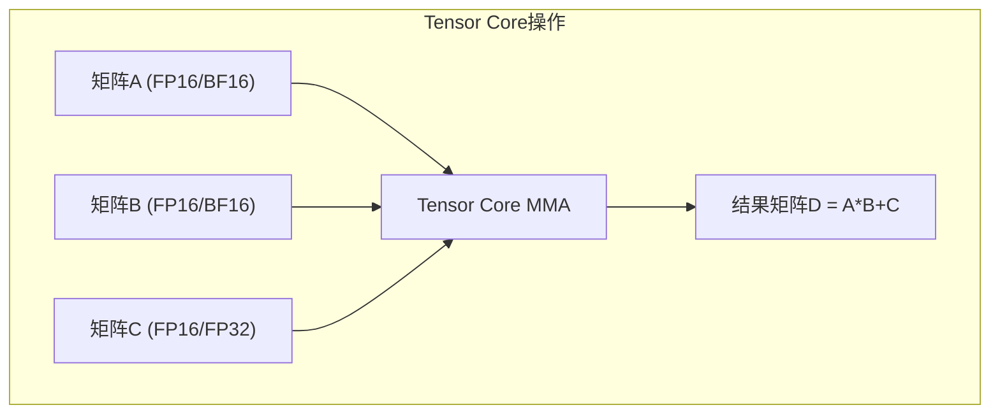

**Tensor Core特点**：
- 单周期完成小矩阵MMA（如4x4x4）
- 输入FP16/BF16，累加FP32
- 极高计算吞吐量

### 5.2 使用WMMA API

```cpp
#include <mma.h>

using namespace nvcuda;

// WMMA矩阵乘法
__global__ void wmma_gemm(half* a, half* b, float* c, int M, int N, int K) {
    // 定义WMMA分块大小
    const int WMMA_M = 16;
    const int WMMA_N = 16;
    const int WMMA_K = 16;

    // 索引
    int warpM = (blockIdx.x * blockDim.x + threadIdx.x) / warpSize;
    int warpN = (blockIdx.y * blockDim.y + threadIdx.y) / warpSize;

    if (warpM * WMMA_M >= M || warpN * WMMA_N >= N) return;

    // 声明WMMA片段
    wmma::fragment<wmma::matrix_a, WMMA_M, WMMA_N, WMMA_K, half, wmma::col_major> a_frag;
    wmma::fragment<wmma::matrix_b, WMMA_M, WMMA_N, WMMA_K, half, wmma::row_major> b_frag;
    wmma::fragment<wmma::accumulator, WMMA_M, WMMA_N, WMMA_K, float> c_frag;

    // 初始化累加器
    wmma::fill_fragment(c_frag, 0.0f);

    // 循环计算
    for (int k = 0; k < K; k += WMMA_K) {
        // 加载矩阵片段
        wmma::load_matrix_sync(a_frag, a + warpM * WMMA_M * K + k, K);
        wmma::load_matrix_sync(b_frag, b + k * N + warpN * WMMA_N, N);

        // 执行MMA
        wmma::mma_sync(c_frag, a_frag, b_frag, c_frag);
    }

    // 存储结果
    wmma::store_matrix_sync(c + warpM * WMMA_M * N + warpN * WMMA_N,
                             c_frag, N, wmma::mem_row_major);
}
```

### 5.3 使用cuBLAS混合精度

```cpp
#include <cublas_v2.h>

// 使用FP16 Tensor Core GEMM
void cublas_hgemm(cublasHandle_t handle,
                  int M, int N, int K,
                  const half* A, const half* B, half* C) {
    half alpha = __float2half(1.0f);
    half beta = __float2half(0.0f);

    // 设置使用Tensor Core
    cublasSetMathMode(handle, CUBLAS_TENSOR_OP_MATH);

    // 执行FP16 GEMM
    cublasHgemm(handle,
                CUBLAS_OP_N, CUBLAS_OP_N,
                M, N, K,
                &alpha,
                A, M,
                B, K,
                &beta,
                C, M);
}

// 使用BF16 Tensor Core GEMM (Ampere+)
void cublas_bf16gemm(cublasHandle_t handle,
                     int M, int N, int K,
                     const __nv_bfloat16* A, const __nv_bfloat16* B, __nv_bfloat16* C) {
    __nv_bfloat16 alpha = __float2bfloat16(1.0f);
    __nv_bfloat16 beta = __float2bfloat16(0.0f);

    cublasSetMathMode(handle, CUBLAS_TENSOR_OP_MATH);

    cublasGemmEx(handle,
                 CUBLAS_OP_N, CUBLAS_OP_N,
                 M, N, K,
                 &alpha,
                 A, CUDA_R_16BF, M,
                 B, CUDA_R_16BF, K,
                 &beta,
                 C, CUDA_R_16BF, M,
                 CUBLAS_COMPUTE_32F,  // FP32累加
                 CUBLAS_GEMM_DEFAULT_TENSOR_OP);
}
```

---

## 6. 量化GEMM

### 6.1 INT8 GEMM原理

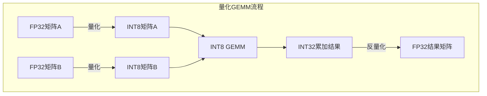

### 6.2 INT8 GEMM实现

```cpp
// 使用cuBLAS INT8 GEMM
#include <cublas_v2.h>

void cublas_int8_gemm(cublasHandle_t handle,
                       int M, int N, int K,
                       const int8_t* A, const int8_t* B, int32_t* C,
                       int lda, int ldb, int ldc) {
    int32_t alpha = 1;
    int32_t beta = 0;

    cublasGemmEx(handle,
                 CUBLAS_OP_T, CUBLAS_OP_N,  // 注意转置
                 M, N, K,
                 &alpha,
                 A, CUDA_R_8I, lda,
                 B, CUDA_R_8I, ldb,
                 &beta,
                 C, CUDA_R_32I, ldc,  // INT32累加
                 CUBLAS_COMPUTE_32I,
                 CUBLAS_GEMM_DEFAULT);
}

// 完整的量化GEMM流程
void quantized_gemm_example(const float* A_fp32, const float* B_fp32, float* C_fp32,
                             int M, int N, int K) {
    // 1. 计算scale
    float scale_a = compute_scale(find_abs_max(A_fp32, M * K));
    float scale_b = compute_scale(find_abs_max(B_fp32, K * N));

    // 2. 量化
    int8_t* A_int8 = quantize(A_fp32, M * K, scale_a);
    int8_t* B_int8 = quantize(B_fp32, K * N, scale_b);

    // 3. INT8 GEMM
    int32_t* C_int32 = int8_gemm(A_int8, B_int8, M, N, K);

    // 4. 反量化
    float scale_c = scale_a * scale_b;
    dequantize(C_int32, C_fp32, M * N, scale_c);
}
```

### 6.3 量化精度损失分析

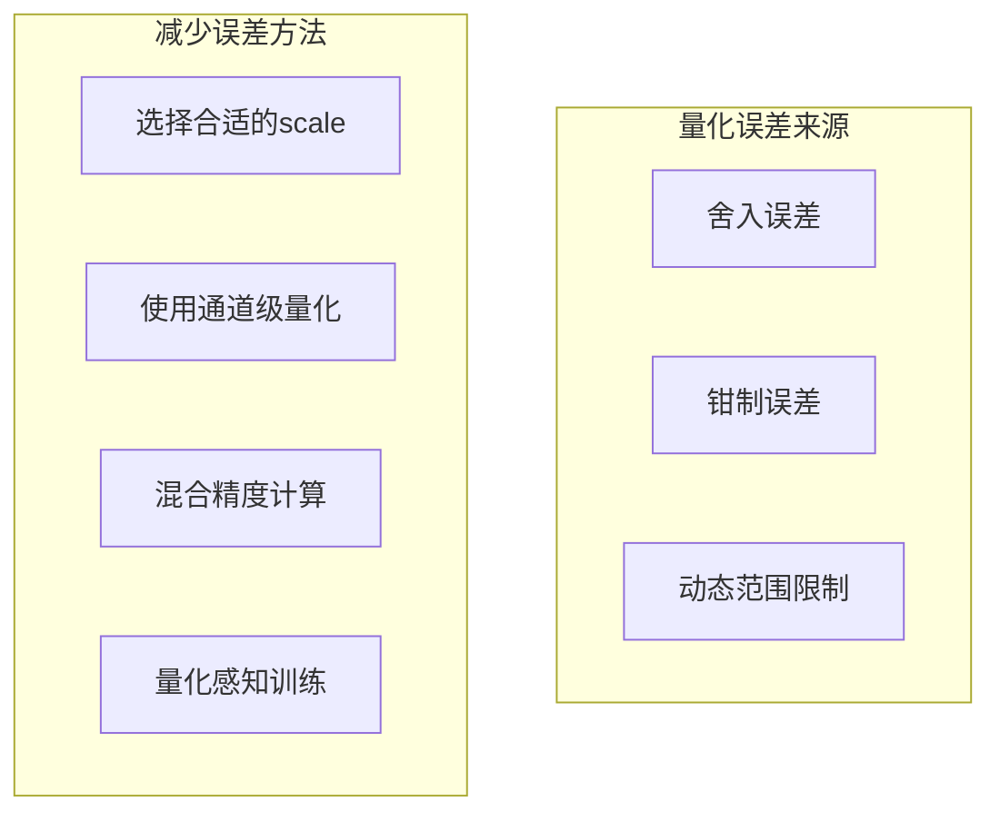

---

## 7. FP8精度

### 7.1 FP8格式

Hopper架构引入FP8支持：

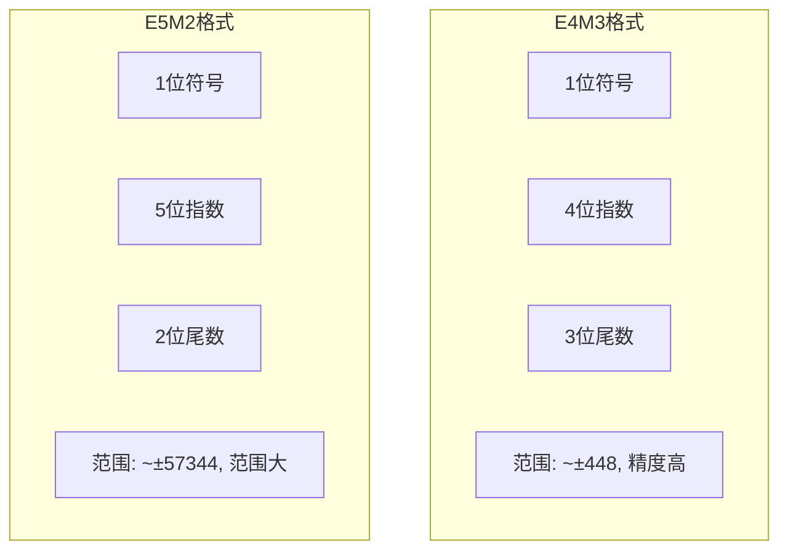

```cpp
// FP8在CUDA中的使用 (Hopper+)
#include <cuda_fp8.h>

// E4M3格式
__nv_fp8_e4m3 fp8_e4m3;
// E5M2格式
__nv_fp8_e5m2 fp8_e5m2;

// 类型转换
fp8_e4m3 = __nv_cvt_float_to_fp8(my_float, __NV_SATFINITE, __NV_E4M3);
fp8_e5m2 = __nv_cvt_float_to_fp8(my_float, __NV_SATFINITE, __NV_E5M2);
```

---

## 8. 精度选择指南

### 8.1 不同场景的精度选择

| 场景 | 推荐精度 | 原因 |
|------|----------|------|
| 模型训练 | BF16/FP16混合 | 平衡精度与速度 |
| 模型推理 | INT8量化 | 内存小、速度快 |
| 科学计算 | FP64/FP32 | 精度要求高 |
| 边缘部署 | INT8/INT4 | 资源受限 |

### 8.2 精度与性能权衡

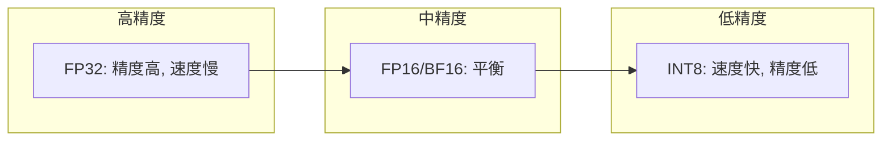

### 8.3 最佳实践

1. **训练**：使用BF16或FP16混合精度
2. **推理**：使用INT8量化（量化感知训练更佳）
3. **验证**：低精度结果与FP32对比
4. **监控**：检查梯度是否溢出（FP16）

---

## 9. 本章小结

### 9.1 关键概念

| 概念 | 描述 |
|------|------|
| FP16 | 半精度浮点，存储减半 |
| BF16 | 保留FP32范围，精度降低 |
| TF32 | Tensor Core内部格式 |
| INT8量化 | FP32转INT8的映射 |
| Tensor Core | 混合精度矩阵加速单元 |

### 9.2 核心API

```cpp
// FP16
#include <cuda_fp16.h>
__half, __half2
__float2half(), __half2float()

// BF16
#include <cuda_bf16.h>
__nv_bfloat16, __nv_bfloat162

// Tensor Core
#include <mma.h>
wmma::fragment, wmma::mma_sync()

// cuBLAS混合精度
cublasSetMathMode(handle, CUBLAS_TENSOR_OP_MATH);
cublasGemmEx(...);
```

### 9.3 思考题

1. FP16和BF16各有什么优缺点？如何选择？
2. INT8量化的scale如何计算？
3. Tensor Core如何加速矩阵乘法？
4. 量化训练和训练后量化有什么区别？

---

## 下一章

[第二十七章：PTX与底层优化](./27_PTX与底层优化.md) - 学习PTX指令集和底层优化技术

---

*参考资料：*
- *[CUDA C++ Programming Guide - Half Precision](https://docs.nvidia.com/cuda/cuda-c-programming-guide/index.html#half-precision-arithmetic)*
- *[NVIDIA Tensor Core Documentation](https://docs.nvidia.com/cuda/cuda-c-programming-guide/index.html#wmma)*
- *[Quantization and Deep Learning](https://arxiv.org/abs/2103.13657)*
