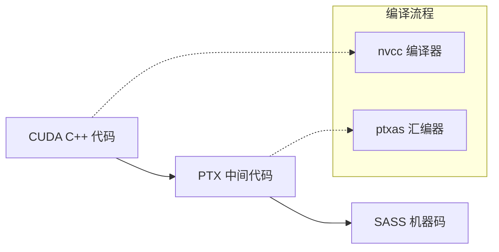
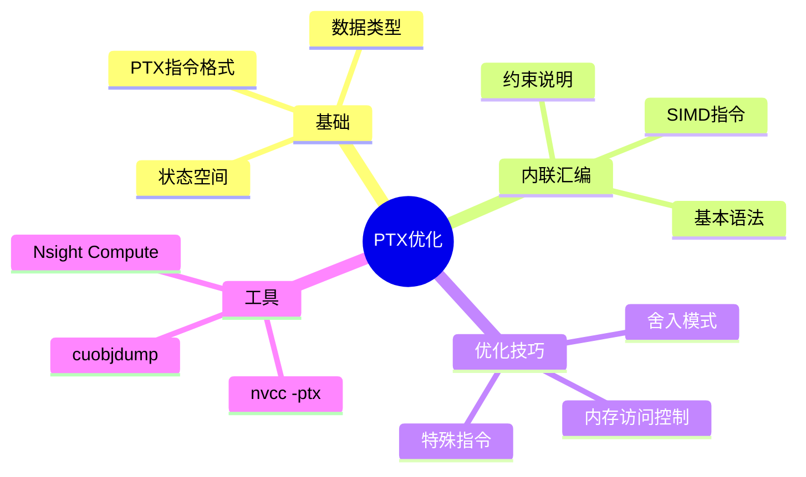

# 第二十七章：PTX与底层优化

> 学习目标：理解PTX指令集架构，掌握内联PTX汇编的使用方法，能够进行底层性能优化
>
> 预计阅读时间：45 分钟
>
> 前置知识：[第十四章：规约算法优化](./14_规约算法优化.md) | [第十五章：Bank Conflict优化](./15_Bank_Conflict优化.md)

---

## 1. 为什么需要PTX？

### 1.1 GPU架构背景

GPU与CPU的设计理念有着根本性的不同。GPU专为高度并行计算而设计，将更多晶体管用于数据处理，而非数据缓存和流程控制。


这种设计理念的核心在于：
- **CPU**：追求单线程性能最大化，投入大量晶体管用于缓存和分支预测
- **GPU**：追求吞吐量最大化，将更多晶体管用于计算单元（如浮点运算）

GPU能够通过计算来隐藏内存访问延迟，而不是依赖大型数据缓存和复杂的流程控制来避免长内存访问延迟——这两者在晶体管消耗上都非常昂贵。


CUDA作为通用并行计算平台，支持多种编程语言和接口，PTX则是其中的关键中间表示层。

### 1.2 从高级语言到机器码



**PTX (Parallel Thread Execution)** 是NVIDIA定义的并行线程执行指令集架构，是一种中间表示形式。

### 1.3 PTX的优势

| 优势 | 说明 |
|------|------|
| 更接近底层 | 提供更细粒度的操作和指令控制 |
| 跨代兼容 | PTX代码可以在不同架构的GPU上运行 |
| 功能扩展 | 一些高级功能只有PTX才能实现 |
| 精确控制 | 绕过编译器优化，实现特定性能目标 |

**跨代兼容性是PTX最重要的特性之一**。CUDA程序需要关注两个版本号：
- **计算能力（Compute Capability）**：描述计算设备的一般规格和特性
- **CUDA驱动API版本**：描述驱动API支持的功能


根据官方文档，版本混用有以下限制：
- 系统上只能安装一个版本的CUDA驱动，安装的驱动版本必须与应用程序、插件或库编译时所用的驱动API版本相同或更高
- 应用程序使用的所有插件和库必须使用相同版本的CUDA运行时（除非静态链接运行时）

对于Tesla GPU产品，CUDA 10引入了驱动用户模式组件的前向兼容升级路径，详见[CUDA Compatibility](https://docs.nvidia.com/deploy/cuda-compatibility/index.html)。

PTX作为中间表示，正是实现这种跨代兼容性的关键机制。编译后的PTX代码可以在不同架构的GPU上通过JIT编译器生成对应的SASS机器码运行。

### 1.4 实际应用案例

许多高性能CUDA库都使用PTX进行底层优化：

- **DeepEP**：DeepSeek的MoE通信库
- **DeepGEMM**：DeepSeek的FP8矩阵乘法库
- **NVIDIA Fuser**：NVIDIA的算子融合器
- **FlashLLM**：大语言模型推理优化

---

## 2. PTX概述与结构

### 2.1 PTX指令格式

PTX指令的基本格式：

```
opcode.type operand1, operand2, ...;
```

示例：
```ptx
add.f32 %f1, %f2, %f3;    // 浮点加法
mul.s32 %r1, %r2, %r3;    // 整数乘法
ld.global.f32 %f1, [%r1]; // 从全局内存加载
st.global.f32 [%r1], %f2; // 存储到全局内存
```

### 2.2 数据类型

| PTX类型 | 说明 | C/C++对应 |
|---------|------|-----------|
| `.s8`, `.u8` | 8位有符号/无符号整数 | int8_t, uint8_t |
| `.s16`, `.u16` | 16位有符号/无符号整数 | int16_t, uint16_t |
| `.s32`, `.u32` | 32位有符号/无符号整数 | int32_t, uint32_t |
| `.s64`, `.u64` | 64位有符号/无符号整数 | int64_t, uint64_t |
| `.f16` | 半精度浮点 | half |
| `.f32` | 单精度浮点 | float |
| `.f64` | 双精度浮点 | double |

### 2.3 状态空间

PTX定义了多种状态空间（内存空间）：

```ptx
.reg     .f32 %f1;     // 寄存器
.shared  .f32 sdata[]; // 共享内存
.global  .f32 gdata[]; // 全局内存
.const   .f32 cdata[]; // 常量内存
.local   .f32 ldata[]; // 本地内存
.param   .f32 pdata;   // 参数空间
```

### 2.4 常用PTX指令

#### 算术指令

```ptx
// 加法
add.f32 d, a, b;         // d = a + b
add.sat.f32 d, a, b;     // 饱和加法，结果限制在[0,1]

// 乘法
mul.f32 d, a, b;         // d = a * b
mul.wide.u32 d, a, b;    // 宽乘法，32位输入，64位输出

// 乘加
mad.f32 d, a, b, c;      // d = a * b + c
fma.rn.f32 d, a, b, c;   // 融合乘加，舍入到最近偶数
```

#### 内存访问指令

```ptx
// 加载
ld.global.f32 %f1, [%r1];        // 普通加载
ld.global.ca.f32 %f1, [%r1];     // 缓存到L1
ld.global.cg.f32 %f1, [%r1];     // 只缓存到L2
ld.global.lu.f32 %f1, [%r1];     // 最后使用，不缓存

// 存储
st.global.f32 [%r1], %f2;        // 普通存储
st.global.wb.f32 [%r1], %f2;     // 写回缓存
```

#### 控制流指令

```ptx
// 分支
bra label;                // 无条件跳转
@p bra label;            // 条件跳转（谓词寄存器p为真时跳转）

// 谓词设置
setp.lt.f32 %p1, %f1, %f2;  // 如果%f1 < %f2，设置%p1为真
setp.eq.s32 %p2, %r1, 0;    // 如果%r1 == 0，设置%p2为真
```

---

## 3. 内联PTX汇编

### 3.1 基本语法

在CUDA代码中使用内联PTX汇编：

```cpp
asm("ptx_instruction" : "constraint"(output) : "constraint"(input));
```

### 3.2 约束说明

| 约束 | 说明 |
|------|------|
| `"=r"` | 输出操作数，使用通用寄存器 |
| `"=f"` | 输出操作数，使用浮点寄存器 |
| `"r"` | 输入操作数，使用通用寄存器 |
| `"f"` | 输入操作数，使用浮点寄存器 |
| `"l"` | 64位操作数 |
| `"h"` | 16位操作数 |

### 3.3 简单示例

```cpp
// 使用PTX计算两个数的和
__device__ float add_ptx(float a, float b) {
    float result;
    asm("add.f32 %0, %1, %2;" : "=f"(result) : "f"(a), "f"(b));
    return result;
}

// 使用PTX获取线程索引
__device__ int get_tid_ptx() {
    int tid;
    asm("mov.u32 %0, %tid.x;" : "=r"(tid));
    return tid;
}
```

### 3.4 SIMD视频指令示例

```cpp
// 使用vabsdiff4计算4字节绝对差之和
__device__ unsigned int vabsdiff4_sum(unsigned int A, unsigned int B) {
    unsigned int result;
    // 计算4个字节的绝对差并求和
    asm("vabsdiff4.u32.u32.u32.add %0, %1, %2, %3;"
        : "=r"(result)
        : "r"(A), "r"(B), "r"(0));
    return result;
}

// vadd4: 4字节SIMD加法
__device__ unsigned int vadd4(unsigned int A, unsigned int B) {
    unsigned int result;
    asm("vadd4.u32.u32.u32.add %0, %1, %2, %3;"
        : "=r"(result)
        : "r"(A), "r"(B), "r"(0));
    return result;
}
```

### 3.5 谓词寄存器

PTX使用谓词寄存器实现条件执行：

```cpp
// 使用谓词寄存器实现条件选择
__device__ float select_ptx(float a, float b, bool cond) {
    float result;
    unsigned int p;

    // 设置谓词寄存器
    asm("setp.ne.b32 %0, %1, 0;" : "=r"(p) : "r"((unsigned int)cond));

    // 根据谓词选择结果
    asm("selp.f32 %0, %1, %2, %3;" : "=f"(result) : "f"(a), "f"(b), "r"(p));

    return result;
}
```

---

## 4. PTX优化技巧

### 4.1 内存访问优化

通过PTX可以精确控制缓存行为：

```cpp
// 强制使用只读缓存（纹理缓存）加载
__device__ float load_via_readonly(const float* ptr) {
    float val;
    // ld.global.nc 使用纹理缓存路径
    asm("ld.global.nc.f32 %0, [%1];" : "=f"(val) : "l"(ptr));
    return val;
}

// 指定为流式访问（减少缓存污染）
__device__ float load_streaming(const float* ptr) {
    float val;
    // .lu 表示"last use"，提示硬件数据不会再次使用
    asm("ld.global.lu.f32 %0, [%1];" : "=f"(val) : "l"(ptr));
    return val;
}
```

### 4.2 舍入模式控制

PTX支持多种舍入模式：

```cpp
// 不同舍入模式的除法
__device__ float div_rn(float a, float b) {
    float result;
    asm("div.rn.f32 %0, %1, %2;" : "=f"(result) : "f"(a), "f"(b));
    return result;  // 舍入到最近偶数
}

__device__ float div_rz(float a, float b) {
    float result;
    asm("div.rz.f32 %0, %1, %2;" : "=f"(result) : "f"(a), "f"(b));
    return result;  // 向零舍入
}

__device__ float div_ru(float a, float b) {
    float result;
    asm("div.ru.f32 %0, %1, %2;" : "=f"(result) : "f"(a), "f"(b));
    return result;  // 向上舍入
}

__device__ float div_rd(float a, float b) {
    float result;
    asm("div.rd.f32 %0, %1, %2;" : "=f"(result) : "f"(a), "f"(b));
    return result;  // 向下舍入
}
```

### 4.3 特殊功能实现

#### Brev指令：位反转

```cpp
__device__ unsigned int bit_reverse(unsigned int x) {
    unsigned int result;
    asm("brev.b32 %0, %1;" : "=r"(result) : "r"(x));
    return result;
}
```

#### Prmt指令：字节重排

```cpp
__device__ unsigned int permute_bytes(unsigned int a, unsigned int b, unsigned int selector) {
    unsigned int result;
    asm("prmt.b32 %0, %1, %2, %3;" : "=r"(result) : "r"(a), "r"(b), "r"(selector));
    return result;
}
```

### 4.4 同步优化

```cpp
// 使用membar确保内存可见性
__device__ void memory_barrier() {
    asm("membar.gl;");
}

// Warp级别屏障
__device__ void warp_sync() {
    asm("bar.warp.sync 0xffffffff;");
}
```

---

## 5. 查看PTX代码的方法

### 5.1 使用nvcc生成PTX

```bash
# 生成PTX文件
nvcc -ptx -arch=sm_80 kernel.cu -o kernel.ptx

# 同时生成PTX和SASS
nvcc -x cu -arch=sm_80 -keep kernel.cu
# 会生成 kernel.ptx 和 kernel.sass 文件
```

### 5.2 使用cuobjdump

```bash
# 查看PTX代码
cuobjdump -ptx kernel.exe

# 查看SASS代码
cuobjdump -sass kernel.exe

# 同时查看PTX和SASS
cuobjdump -ptx -sass kernel.exe
```

### 5.3 使用nvdisasm

```bash
# 反汇编cubin文件
nvdisasm -b SM_80 kernel.cubin
```

### 5.4 Nsight Compute

Nsight Compute可以直接显示PTX和SASS代码：

```bash
ncu --set basic -k my_kernel ./my_program
```

在分析报告中可以查看：
- Source View: 源代码与PTX/SASS对应
- Assembly View: 汇编代码详情

---

## 6. PTX优化实例：Warp Divergence处理

### 6.1 问题：分支导致的性能下降

```cpp
// 普通条件分支 - 可能导致warp divergence
__global__ void kernel_with_divergence(float* data, int* flags, int N) {
    int idx = blockIdx.x * blockDim.x + threadIdx.x;
    if (idx < N) {
        if (flags[idx] > 0) {
            data[idx] = data[idx] * 2.0f;  // true分支
        } else {
            data[idx] = data[idx] + 1.0f;  // false分支
        }
    }
}
```

### 6.2 PTX解决方案：使用谓词寄存器

```cpp
// 使用PTX谓词寄存器避免分支
__global__ void kernel_predicate(float* data, int* flags, int N) {
    int idx = blockIdx.x * blockDim.x + threadIdx.x;
    if (idx < N) {
        float val = data[idx];
        int flag = flags[idx];

        float true_val = val * 2.0f;
        float false_val = val + 1.0f;

        // 使用PTX谓词选择结果
        unsigned int pred;
        float result;

        asm("setp.gt.s32 %0, %1, 0;" : "=r"(pred) : "r"(flag));
        asm("selp.f32 %0, %1, %2, %3;" : "=f"(result) : "f"(true_val), "f"(false_val), "r"(pred));

        data[idx] = result;
    }
}
```

---

## 7. 本章小结

### 7.1 关键概念

| 概念 | 描述 |
|------|------|
| PTX | Parallel Thread Execution，并行线程执行指令集 |
| 内联汇编 | 在CUDA代码中直接嵌入PTX指令 |
| 谓词寄存器 | 用于条件执行的特殊寄存器 |
| 状态空间 | PTX中的内存空间分类 |

### 7.2 核心要点



### 7.3 使用建议

1. **谨慎使用**：PTX优化应该是最后的手段，优先使用高层优化
2. **保持可读性**：添加详细注释说明PTX代码的用途
3. **验证正确性**：PTX代码更难调试，需要仔细验证
4. **关注可移植性**：PTX代码可能在不同架构上有不同表现

### 7.4 思考题

1. PTX和SASS的区别是什么？为什么需要PTX作为中间表示？
2. 什么情况下应该考虑使用内联PTX汇编？
3. 如何使用PTX实现一个高效的warp级别规约？

---

## 下一章

[第二十八章：微指令级调优](./28_微指令级调优.md) - 学习编译器指令和内存对齐优化技巧

---

*参考资料：*
- *[CUDA C++ Programming Guide - Inline Assembly](https://docs.nvidia.com/cuda/cuda-c-programming-guide/index.html#inline-assembly)*
- *[PTX ISA Reference Manual](https://docs.nvidia.com/cuda/parallel-thread-execution/)*
- *[Using Inline PTX Assembly in CUDA](https://docs.nvidia.com/cuda/inline-ptx-assembly-guide/)*