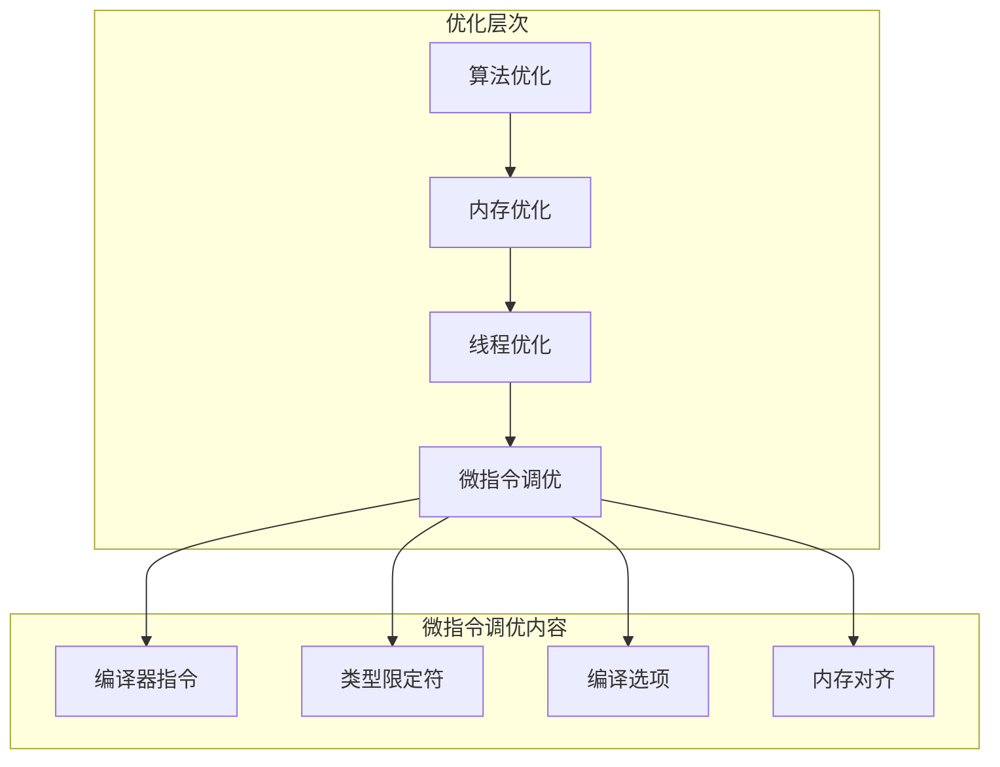
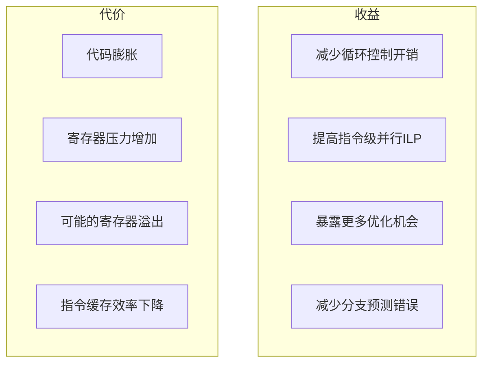
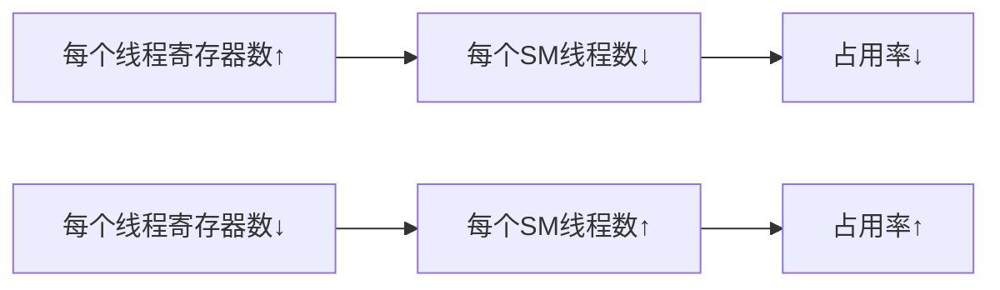
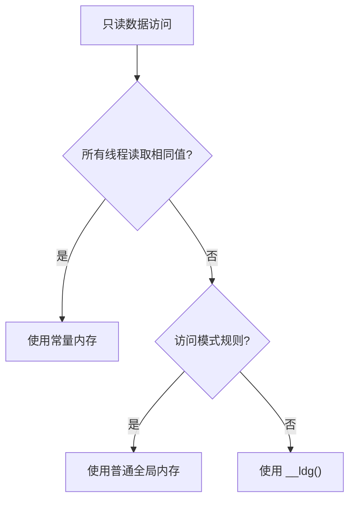

# 第二十八章：微指令级调优

> 学习目标：掌握编译器指令、限定符和编译选项的使用，通过微指令级优化提升内核性能
>
> 预计阅读时间：40 分钟
>
> 前置知识：[第二十七章：PTX与底层优化](./27_PTX与底层优化.md) | [第九章：内存访问优化](./09_内存访问优化.md)

---

## 1. 微指令级调优概述

### 1.1 什么是微指令级调优？

微指令级调优是指在编译器层面通过指令、限定符和选项来影响生成的机器码，从而提升性能的优化方法。



### 1.2 为什么需要微指令级调优？

| 原因 | 说明 |
|------|------|
| 绕过编译器保守优化 | 编译器无法确定某些条件时会选择保守策略 |
| 提供额外信息 | 向编译器提供它无法推断的信息 |
| 精确控制 | 对特定代码路径进行精细优化 |
| 解决性能瓶颈 | 消除微小的性能瓶颈 |

**GPU架构与优化层次**：


上图展示了GPU的架构设计理念——将更多晶体管用于数据处理。微指令级调优正是充分利用这种架构优势的最后一步优化，通过精确控制指令生成来最大化计算单元的利用率。

---

## 2. #pragma unroll 循环展开

### 2.1 什么是循环展开？

循环展开是一种编译优化技术，通过减少循环迭代次数和循环控制开销来提升性能。

```cpp
// 原始循环
for (int i = 0; i < 4; i++) {
    sum += data[i];
}

// 展开后
sum += data[0];
sum += data[1];
sum += data[2];
sum += data[3];
```

### 2.2 #pragma unroll 语法

```cpp
#pragma unroll            // 完全展开
#pragma unroll N          // 展开N次
#pragma unroll 1          // 不展开
```

### 2.3 使用示例

#### 完全展开小循环

```cpp
__global__ void dot_product_unroll(float* a, float* b, float* result, int N) {
    __shared__ float partial_sum[256];

    int tid = threadIdx.x;
    int idx = blockIdx.x * blockDim.x + threadIdx.x;

    float sum = 0.0f;

    // 每个线程处理多个元素
    #pragma unroll
    for (int i = 0; i < 4; i++) {
        int data_idx = idx + i * blockDim.x * gridDim.x;
        if (data_idx < N) {
            sum += a[data_idx] * b[data_idx];
        }
    }

    partial_sum[tid] = sum;
    __syncthreads();

    // 规约...
}
```

#### 部分展开大循环

```cpp
__global__ void vector_add_unroll(float* a, float* b, float* c, int N) {
    int idx = blockIdx.x * blockDim.x + threadIdx.x;
    int stride = blockDim.x * gridDim.x;

    // 展开4次
    #pragma unroll 4
    for (int i = idx; i < N; i += stride) {
        c[i] = a[i] + b[i];
    }
}
```

### 2.4 展开的收益与代价



### 2.5 最佳实践

```cpp
// 好的做法：小循环完全展开
#pragma unroll
for (int i = 0; i < 32; i++) { ... }

// 好的做法：大循环部分展开
#pragma unroll 4
for (int i = 0; i < 1024; i++) { ... }

// 避免：大循环完全展开可能导致寄存器溢出
// #pragma unroll  // 不推荐，循环次数太大
// for (int i = 0; i < 1024; i++) { ... }
```

---

## 3. __restrict__ 限定符

### 3.1 指针别名问题

当编译器无法确定两个指针是否指向同一内存时，会产生别名问题：

```cpp
// 编译器无法确定a和c是否指向同一位置
__global__ void add_kernel(float* a, float* b, float* c, int N) {
    int idx = blockIdx.x * blockDim.x + threadIdx.x;
    if (idx < N) {
        a[idx] = b[idx] + c[idx];
        // 编译器必须保守处理，不能优化掉重复加载
    }
}
```

### 3.2 __restrict__ 的作用

`__restrict__` 告诉编译器：该指针是访问相应数据的唯一途径。

```cpp
// 使用 __restrict__ 声明无别名
__global__ void add_kernel_restrict(
    float* __restrict__ a,
    const float* __restrict__ b,
    const float* __restrict__ c,
    int N)
{
    int idx = blockIdx.x * blockDim.x + threadIdx.x;
    if (idx < N) {
        a[idx] = b[idx] + c[idx];
        // 编译器可以安全地进行优化
    }
}
```

### 3.3 优化效果示例

```cpp
// 不使用 __restrict__：可能需要多次加载
__global__ void vec_add_no_restrict(float* a, float* b, float* c, int N) {
    int idx = blockIdx.x * blockDim.x + threadIdx.x;
    if (idx < N) {
        // 编译器可能生成：
        // load b[idx]
        // load c[idx]
        // store a[idx]
        // load b[idx] again! (因为a可能指向b)
        a[idx] = b[idx] + c[idx];
    }
}

// 使用 __restrict__：消除冗余加载
__global__ void vec_add_with_restrict(
    float* __restrict__ a,
    float* __restrict__ b,
    float* __restrict__ c,
    int N)
{
    int idx = blockIdx.x * blockDim.x + threadIdx.x;
    if (idx < N) {
        // 编译器可以优化为：
        // load b[idx]
        // load c[idx]
        // store a[idx]
        a[idx] = b[idx] + c[idx];
    }
}
```

### 3.4 使用建议

1. **对所有无别名的指针参数使用 `__restrict__`**
2. **确保确实无别名**：违反会导致未定义行为
3. **特别是只读输入指针**：`const float* __restrict__ input`

---

## 4. 编译器选项调优

### 4.1 优化级别选项

| 选项 | 说明 | 使用场景 |
|------|------|----------|
| `-O0` | 不优化 | 调试 |
| `-O1` | 基本优化 | 快速编译 |
| `-O2` | 标准优化 | 默认选择 |
| `-O3` | 激进优化 | 性能关键代码 |

### 4.2 精度与速度选项

```bash
# 快速除法（降低精度）
nvcc -prec-div=false ...

# 非规格化数flush为零
nvcc -ftz=true ...

# 快速数学库
nvcc -use_fast_math ...
```

**`-use_fast_math` 包含以下优化：**
- 使用 `__sinf()` 代替 `sinf()`
- 使用 `__cosf()` 代替 `cosf()`
- 使用 `__expf()` 代替 `expf()`
- 使用 `__logf()` 代替 `logf()`

### 4.3 寄存器控制选项

```bash
# 限制每个线程的寄存器数量
nvcc -maxrregcount=32 ...

# 查看编译详情（寄存器使用量等）
nvcc -Xptxas -v ...
```

**寄存器使用与占用率的关系：**



### 4.4 缓存控制选项

```bash
# L1缓存行为控制
nvcc -Xptxas -dlcm=ca  # Cache All（默认）
nvcc -Xptxas -dlcm=cg  # Cache Global（绕过L1）
nvcc -Xptxas -dlcm=cs  # Cache Streaming
```

**选择建议：**

| 选项 | 适用场景 |
|------|----------|
| `ca` | 数据会被多次访问 |
| `cg` | 数据只访问一次，或L1对SMEM有影响 |
| `cs` | 流式访问，数据访问后不再使用 |

### 4.5 实际编译示例

```bash
# 高性能编译配置
nvcc -O3 \
     -arch=sm_80 \
     -use_fast_math \
     -maxrregcount=64 \
     -Xptxas -v \
     kernel.cu -o kernel

# 编译输出示例
# ptxas info    : 0 bytes gmem, 32 bytes cmem[0], 8 bytes cmem[2]
# ptxas info    : Compiling entry function '_Z6kernelPfS_i' for 'sm_80'
# ptxas info    : Function properties for _Z6kernelPfS_i
# ptxas         .     64 registers, 0 bytes smem, 32 bytes cmem[0]
```

---

## 5. 内存对齐优化

### 5.1 为什么对齐重要？


### 5.2 __align__ 属性

```cpp
// 强制16字节对齐
struct __align__(16) float4_aligned {
    float x, y, z, w;
};

// 强制32字节对齐（适合向量加载）
struct __align__(32) float8_aligned {
    float data[8];
};
```

### 5.3 对齐内存分配

```cpp
// 主机端对齐分配
float* h_data;
cudaMallocHost(&h_data, N * sizeof(float));  // CUDA保证对齐

// 设备端对齐分配
float* d_data;
cudaMalloc(&d_data, N * sizeof(float));  // CUDA保证对齐

// 共享内存对齐
__global__ void kernel() {
    // 静态共享内存自动对齐
    __shared__ float sdata[256];  // 自动对齐到4字节

    // 动态共享内存需要注意对齐
    extern __shared__ char shared_buffer[];
    // 使用时强制对齐
    float* float_buffer = (float*)shared_buffer;
}
```

### 5.4 向量化访问的对齐要求

```cpp
// float4加载要求16字节对齐
__global__ void vectorized_load(float4* data, int N) {
    int idx = blockIdx.x * blockDim.x + threadIdx.x;
    if (idx < N) {
        // data必须16字节对齐
        float4 val = data[idx];
        // ...
    }
}

// 确保对齐的分配
float4* d_data;
cudaMalloc(&d_data, N * sizeof(float4));  // 自动16字节对齐
```

---

## 6. __ldg 与常量内存

### 6.1 __ldg 内置函数

`__ldg()` 强制通过只读数据缓存（纹理缓存）加载数据：

```cpp
// 使用 __ldg 加载只读数据
__global__ void kernel_ldg(const float* __restrict__ input, float* output, int N) {
    int idx = blockIdx.x * blockDim.x + threadIdx.x;
    if (idx < N) {
        // 通过只读缓存加载
        float val = __ldg(&input[idx]);
        output[idx] = val * 2.0f;
    }
}
```

**适用场景：**
- 数据只读，不会被修改
- 访问模式不规则
- 需要利用纹理缓存的特性

### 6.2 常量内存

常量内存有特殊的硬件支持：

```cpp
// 声明常量内存（最大64KB）
__constant__ float const_data[1024];

// 从主机复制到常量内存
cudaMemcpyToSymbol(const_data, host_data, size);

// 在内核中使用
__global__ void kernel_const(float* output, int N) {
    int idx = blockIdx.x * blockDim.x + threadIdx.x;
    if (idx < N) {
        // 常量内存读取会被广播到warp内所有线程
        output[idx] = const_data[idx % 1024];
    }
}
```

**常量内存特点：**
- 容量限制：64KB
- 广播机制：warp内线程读取相同地址时，只需一次内存访问
- 适合场景：所有线程读取相同值

### 6.3 选择指南



---

## 7. __builtin_assume 辅助优化

### 7.1 __builtin_assume

向编译器提供运行时必定成立的条件：

```cpp
__global__ void kernel_assume(float* data, int N) {
    int idx = blockIdx.x * blockDim.x + threadIdx.x;

    // 告诉编译器N一定是256的倍数
    __builtin_assume(N % 256 == 0);

    // 编译器可以据此优化循环展开等
    for (int i = 0; i < N; i += blockDim.x) {
        // ...
    }
}
```

### 7.2 __builtin_assume_aligned

告知编译器指针的对齐情况：

```cpp
__global__ void kernel_aligned(float* __restrict__ data, int N) {
    // 告诉编译器data是16字节对齐的
    data = (float*)__builtin_assume_aligned(data, 16);

    int idx = blockIdx.x * blockDim.x + threadIdx.x;
    if (idx < N) {
        // 编译器可以使用向量化加载
        data[idx] *= 2.0f;
    }
}
```

---

## 8. 综合优化示例

### 8.1 优化前的基础版本

```cpp
__global__ void saxpy_basic(float* a, float* b, float* c, float alpha, int N) {
    int i = blockIdx.x * blockDim.x + threadIdx.x;
    if (i < N) {
        c[i] = alpha * a[i] + b[i];
    }
}
```

### 8.2 应用所有微指令优化

```cpp
__global__ void saxpy_optimized(
    float* __restrict__ c,
    const float* __restrict__ a,
    const float* __restrict__ b,
    float alpha,
    int N)
{
    // 告诉编译器N是blockDim.x的倍数
    __builtin_assume(N % blockDim.x == 0);

    // 假设指针对齐
    c = (float*)__builtin_assume_aligned(c, 16);
    a = (const float*)__builtin_assume_aligned(a, 16);
    b = (const float*)__builtin_assume_aligned(b, 16);

    int i = blockIdx.x * blockDim.x + threadIdx.x;

    // 展开循环以处理多个元素
    #pragma unroll 4
    for (int j = 0; j < 4; j++) {
        int idx = i + j * blockDim.x * gridDim.x;
        if (idx < N) {
            c[idx] = alpha * a[idx] + b[idx];
        }
    }
}
```

### 8.3 编译命令

```bash
nvcc -O3 \
     -arch=sm_80 \
     -use_fast_math \
     -Xptxas -dlcm=ca \
     -maxrregcount=64 \
     -Xptxas -v \
     saxpy.cu -o saxpy
```

---

## 9. 本章小结

### 9.1 关键概念

| 技术 | 作用 | 使用场景 |
|------|------|----------|
| `#pragma unroll` | 循环展开 | 减少循环开销，提高ILP |
| `__restrict__` | 消除别名假设 | 指针参数无别名时 |
| `-use_fast_math` | 快速数学函数 | 可接受精度损失时 |
| `-maxrregcount` | 限制寄存器使用 | 控制占用率 |
| `__align__` | 内存对齐 | 向量化访问 |
| `__ldg()` | 只读缓存加载 | 不规则只读访问 |
| 常量内存 | 广播机制 | 所有线程读取相同值 |

### 9.2 优化检查清单

```
微指令优化检查清单：
[ ] 是否对无别名指针使用 __restrict__？
[ ] 小循环是否使用 #pragma unroll 展开？
[ ] 是否选择了合适的缓存策略？
[ ] 内存访问是否对齐？
[ ] 只读数据是否使用 __ldg 或常量内存？
[ ] 是否根据需要调整寄存器限制？
```

### 9.3 思考题

1. 为什么 `__restrict__` 可以提升性能？如果违反会有什么后果？
2. 什么情况下应该限制寄存器数量？如何确定最优值？
3. 常量内存和 `__ldg()` 有什么区别？各自的适用场景是什么？

---

## 下一章

[第二十九章：ILP与Warp Divergence](./29_ILP与Warp_Divergence.md) - 深入理解指令级并行和分支发散优化

---

*参考资料：*
- *[CUDA C++ Programming Guide - Optimization](https://docs.nvidia.com/cuda/cuda-c-programming-guide/index.html#optimization)*
- *[CUDA Best Practices Guide](https://docs.nvidia.com/cuda/cuda-c-best-practices-guide/)*
- *[NVCC Compiler Options](https://docs.nvidia.com/cuda/compiler-driver-nvcc/)*