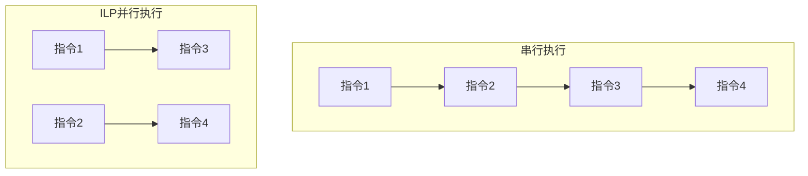
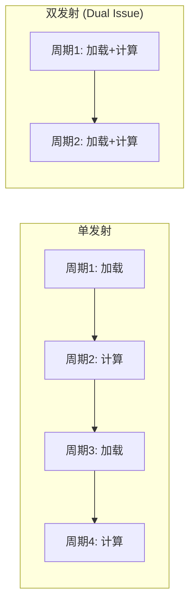
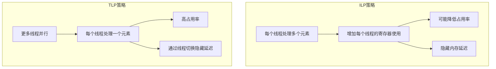
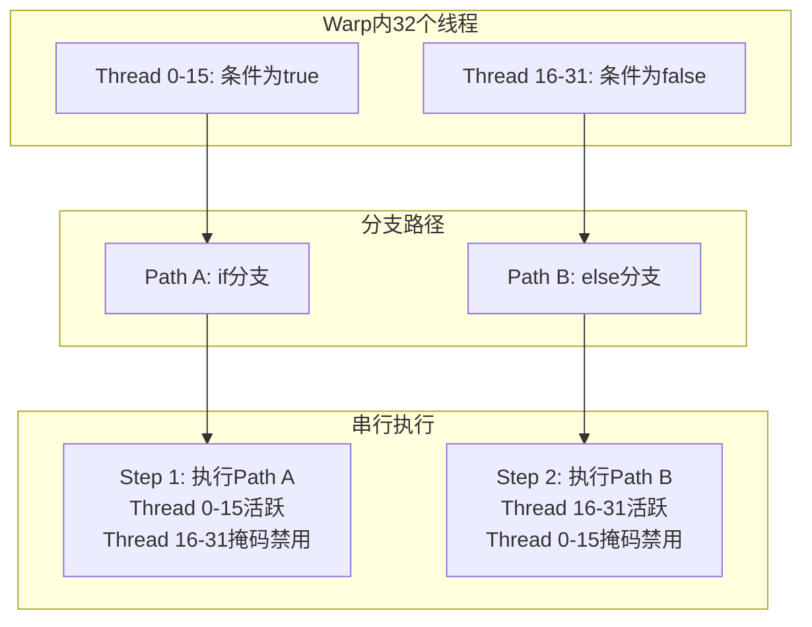
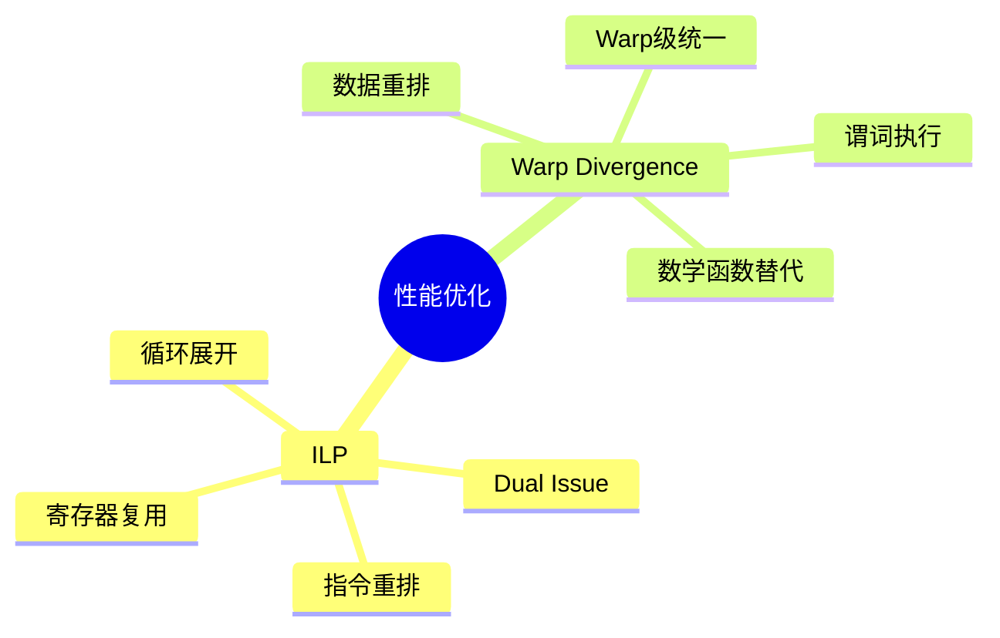

# 第二十九章：ILP与Warp Divergence

> 学习目标：理解指令级并行（ILP）原理，掌握Warp Divergence问题的识别与优化方法
>
> 预计阅读时间：40 分钟
>
> 前置知识：[第十四章：规约算法优化](./14_规约算法优化.md) | [第十六章：Cooperative Groups](./16_Cooperative_Groups.md)

---

## 1. 指令级并行（ILP）基础

### 1.1 什么是ILP？

**指令级并行（Instruction-Level Parallelism, ILP）** 是指程序指令流中存在的潜在并行性。在不改变程序逻辑的前提下，通过硬件或编译器技术让多条相互独立的指令同时执行（或在流水线的不同阶段重叠执行），从而提升性能。



### 1.2 为什么GPU需要ILP？

GPU的SIMT架构中，一个Warp内的32个线程执行相同的指令。当一条指令需要等待（如内存访问）时，如果没有其他独立指令可以执行，整个Warp就会停滞。

**GPU架构优势**：


上图展示了GPU将更多晶体管用于数据处理而非缓存的架构设计，这使得GPU能够通过大量并行线程来隐藏延迟，而ILP是充分利用这种架构的关键。

```
时间轴示例：向量加法 kernel

串行版本（无ILP）:
时刻1:     Load a[0]     |----等待----|
时刻1001:  Load b[0]     |----等待----|
时刻2001:  FMA c[0]      |--|
时刻2005:  Store c[0]    |----等待----|

ILP x2 版本:
时刻1:     Load a[0], Load a[1]  (重叠)
时刻501:   Load b[0], Load b[1]  (重叠)
时刻1001:  FMA c[0], FMA c[1]    (重叠)
...
总时间接近减半！
```

### 1.3 ILP的硬件支持

CUDA Core的流水线设计允许：
- **指令发射**：每个周期可以发射多条独立指令
- **指令执行**：不同类型的指令可以在不同的功能单元上并行执行
- **内存访问隐藏**：计算指令可以与内存访问指令重叠

#### 1.3.1 GPU流水线深度详解

GPU的流水线深度是指一条指令从取指到完成所需的时钟周期数。理解流水线深度对于优化ILP至关重要。

```
典型CUDA Core流水线阶段（以Ampere架构为例）：

┌─────────────────────────────────────────────────────────────────┐
│  取指(IF) → 译码(ID) → 发射(IS) → 读操作数(OF) → 执行(EX) → 写回(WB)  │
└─────────────────────────────────────────────────────────────────┘

各阶段详细说明：
- 取指(Instruction Fetch)：从指令缓存获取指令，约4-8周期
- 译码(Instruction Decode)：解析指令类型和操作数，约2-4周期
- 发射(Instruction Issue)：将指令分配到执行单元，约1-2周期
- 读操作数(Operand Fetch)：从寄存器文件读取操作数，约2-4周期
- 执行(Execute)：实际计算，ALU约6-8周期，FPU约12-16周期
- 写回(Write Back)：结果写回寄存器文件，约2-4周期

总流水线深度：约20-40周期（取决于指令类型）
```

**关键理解**：当一条指令在流水线中执行时，后续独立指令可以进入流水线的其他阶段，这就是ILP的基础。

```cpp
// 流水线可视化示例
__global__ void pipeline_demo(float* a, float* b, float* c, int N) {
    int idx = blockIdx.x * blockDim.x + threadIdx.x;
    if (idx < N) {
        // 第1条指令：加载a（进入取指阶段）
        float va = a[idx];      // 周期1-8：取指到写回

        // 第2条指令：加载b（可以与第1条指令的后续阶段重叠）
        float vb = b[idx];      // 周期2-9：与va的执行阶段并行

        // 第3条指令：计算（等待前两条指令完成）
        c[idx] = va + vb;       // 周期9开始执行
    }
}
```

**不同功能单元的流水线深度**：

| 功能单元 | 典型深度 | 说明 |
|----------|----------|------|
| 整数ALU | 6-8周期 | 整数加减运算 |
| 浮点FMA | 12-16周期 | 融合乘加运算 |
| SFU | 16-32周期 | 特殊函数（sin, cos, sqrt等） |
| 加载/存储单元 | 200-400+周期 | 全局内存访问（不含缓存命中） |
| 纹理单元 | 80-200周期 | 纹理内存访问 |

#### 1.3.2 Warp调度器行为细节

现代GPU每个SM包含多个Warp调度器（Volta及之后架构通常有4个），每个调度器负责管理一组Warp的执行。

```
SM内部调度器架构（以Ampere为例）：

┌─────────────────────────────────────────────────────────────────┐
│                            SM                                    │
│  ┌─────────────┐  ┌─────────────┐  ┌─────────────┐  ┌────────┐ │
│  │ Scheduler 0 │  │ Scheduler 1 │  │ Scheduler 2 │  │Scheduler│ │
│  │ Warp 0-7    │  │ Warp 8-15   │  │ Warp 16-23  │  │24-31   │ │
│  └──────┬──────┘  └──────┬──────┘  └──────┬──────┘  └───┬────┘ │
│         │                │                │              │      │
│         ▼                ▼                ▼              ▼      │
│  ┌──────────────────────────────────────────────────────────┐  │
│  │              功能单元池（CUDA Cores, FP32, INT32, etc.）  │  │
│  └──────────────────────────────────────────────────────────┘  │
└─────────────────────────────────────────────────────────────────┘

调度策略：
1. 每周期选择指令就绪的Warp
2. 就绪条件：操作数就绪、功能单元可用、无资源冲突
3. 优先级：通常采用轮询（Round-Robin）或年龄优先策略
```

**调度器关键行为**：

```cpp
// 调度器如何利用ILP
__global__ void scheduler_behavior(float* a, float* b, float* c, float* d, int N) {
    int idx = blockIdx.x * blockDim.x + threadIdx.x;
    if (idx < N) {
        // 以下四个加载指令可以由调度器交替调度到不同Warp
        // 当一个Warp等待内存时，调度器切换到其他就绪Warp
        float v0 = a[idx];        // Warp 0: 发射加载，等待
        float v1 = b[idx];        // Warp 0: 发射第二个加载
        // 调度器可能切换到其他Warp（如果存在）
        float v2 = c[idx];        // Warp 0: 继续发射
        float v3 = d[idx];

        // 编译器可能重排以下计算指令与加载重叠
        float sum = v0 + v1 + v2 + v3;  // 等待所有加载完成
        c[idx] = sum;
    }
}
```

**Warp调度与延迟隐藏**：

```
场景：4个Warp，每个Warp执行：加载(400周期) → 计算(20周期)

时间轴：
周期0-400：   Warp0: 加载
              Warp1: 加载（调度器切换）
              Warp2: 加载（调度器切换）
              Warp3: 加载（调度器切换）
周期100-400： Warp0-3轮流在加载阶段，调度器不停切换
周期400-420： Warp0: 计算
周期420-440： Warp1: 计算
...
总时间：约480周期（而非 4 * 420 = 1680周期）

关键：足够的Warp可以隐藏内存延迟
```

---

## 2. Dual Issue（双发射）

### 2.1 Dual Issue原理

**Dual Issue（双发射）** 是ILP的一种具体实现形式。当两条指令满足以下条件时，可以在同一个时钟周期内发射：

1. **类型独立**：一条算术指令 + 一条内存指令（或其他不冲突的组合）
2. **无数据依赖**：两条指令之间没有写后读（RAW）、读后写（WAR）或写后写（WAW）依赖
3. **无资源冲突**：不竞争相同的功能单元



### 2.2 Dual Issue示例

```cpp
// 无Dual Issue的版本
__global__ void add_no_ilp(float* a, float* b, float* c, int N) {
    int idx = blockIdx.x * blockDim.x + threadIdx.x;
    if (idx < N) {
        float va = a[idx];     // 周期1: 加载
        float vb = b[idx];     // 周期2: 加载
        c[idx] = va + vb;      // 周期3: 计算 + 存储
    }
}

// 有Dual Issue潜力的版本
__global__ void add_with_ilp(float* a, float* b, float* c, int N) {
    int idx = blockIdx.x * blockDim.x + threadIdx.x;
    if (idx < N) {
        // 加载两个连续元素，编译器可能重排实现双发射
        float va0 = a[idx];
        float vb0 = b[idx];
        float va1 = a[idx + blockDim.x];  // 独立加载
        float vb1 = b[idx + blockDim.x];
        c[idx] = va0 + vb0;
        c[idx + blockDim.x] = va1 + vb1;
    }
}
```

### 2.3 编译器与手动优化

现代CUDA编译器（nvcc）会自动尝试指令调度来实现ILP，但有时需要手动干预：

```cpp
// 使用 volatile 阻止编译器重排
volatile float va = a[idx];
float vb = b[idx];  // 这个加载可能被调度与下面的计算并行

// 使用内联PTX更精确控制
__global__ void add_dual_issue_ptx(float* a, float* b, float* c, int N) {
    int idx = blockIdx.x * blockDim.x + threadIdx.x;
    if (idx < N) {
        float va, vb, vc;
        // 使用PTX内联实现精确的指令调度
        asm("ld.global.f32 %0, [%1];" : "=f"(va) : "l"(a + idx));
        asm("ld.global.f32 %0, [%1];" : "=f"(vb) : "l"(b + idx));
        vc = va + vb;
        asm("st.global.f32 [%0], %1;" : : "l"(c + idx), "f"(vc));
    }
}
```

### 2.4 Dual Issue性能验证

使用Nsight Compute分析Dual Issue效果：

```bash
ncu --set full --metrics smsp__inst_issued.sum ./dual_issue_demo
```

**关键指标**：
- `smsp__inst_issued.sum`：发射的指令总数
- `smsp__inst_executed.sum`：执行的指令总数
- 如果发射数约为执行数的2倍，说明Dual Issue有效工作

#### 2.4.1 Nsight Compute分析ILP完整流程

**步骤1：编译带调试信息的程序**

```bash
# 编译时保留调试信息和行号信息
nvcc -lineinfo -g -G -O2 -o ilp_demo ilp_demo.cu

# 或者使用Release模式获得更真实的性能数据
nvcc -lineinfo -O3 -o ilp_demo ilp_demo.cu
```

**步骤2：使用Nsight Compute收集详细指标**

```bash
# 收集ILP相关指标
ncu --set full \
    --metrics \
    smsp__inst_issued.sum,\
    smsp__inst_executed.sum,\
    smsp__inst_issued.avg.pct_of_peak_sustained_elapsed,\
    smsp__inst_executed.avg.pct_of_peak_sustained_elapsed,\
    smsp__issue_active.avg.per_cycle_active,\
    smsp__issue_inst0.avg.pct_of_peak_sustained_active,\
    smsp__issue_inst1.avg.pct_of_peak_sustained_active,\
    smsp__warp_cycles_per_issue_inst.sum,\
    smsp__cycles_active.avg \
    -o ilp_analysis ./ilp_demo
```

**步骤3：指标解读**

```python
# 使用Python脚本分析ncu导出的数据
import nsysui

# 关键ILP指标解释
"""
ILP分析关键指标：

1. smsp__inst_issued.sum
   - 发射的指令总数
   - 如果此值接近 smsp__inst_executed.sum 的2倍，说明双发射有效

2. smsp__issue_inst1.avg.pct_of_peak_sustained_active
   - 第二条指令发射的百分比
   - 越高说明双发射效率越好

3. smsp__warp_cycles_per_issue_inst.sum
   - 每发射一条指令所需的平均周期
   - 越低说明ILP越好

4. 双发射率 = smsp__inst_issued.sum / smsp__inst_executed.sum
   - 理想值：2.0（100%双发射）
   - 实际值：1.0-2.0之间
"""
```

**步骤4：使用Nsight Compute GUI可视化**

```bash
# 启动GUI分析
ncu-ui ilp_analysis.ncu-rep
```

**步骤5：对照分析示例**

```cpp
// ilp_demo.cu - 用于对比分析的示例程序
#include <cstdio>

// 版本1：无ILP优化
__global__ void kernel_no_ilp(float* a, float* b, float* c, int N) {
    int idx = blockIdx.x * blockDim.x + threadIdx.x;
    if (idx < N) {
        float va = a[idx];          // Load 1
        float vb = b[idx];          // Load 2
        c[idx] = va + vb;           // Store
    }
}

// 版本2：循环展开增加ILP
__global__ void kernel_with_ilp(float* a, float* b, float* c, int N) {
    int base = blockIdx.x * blockDim.x * 4 + threadIdx.x * 4;

    #pragma unroll
    for (int i = 0; i < 4; i++) {
        int idx = base + i;
        if (idx < N) {
            float va = a[idx];
            float vb = b[idx];
            c[idx] = va + vb;
        }
    }
}

// 版本3：显式分离内存和计算指令
__global__ void kernel_explicit_ilp(float* a, float* b, float* c, int N) {
    int base = blockIdx.x * blockDim.x * 4 + threadIdx.x * 4;

    // 先加载所有数据
    float va[4], vb[4];
    #pragma unroll
    for (int i = 0; i < 4; i++) {
        int idx = base + i;
        if (idx < N) {
            va[i] = a[idx];
            vb[i] = b[idx];
        }
    }

    // 再执行所有计算
    #pragma unroll
    for (int i = 0; i < 4; i++) {
        int idx = base + i;
        if (idx < N) {
            c[idx] = va[i] + vb[i];
        }
    }
}

int main() {
    const int N = 1024 * 1024;
    float *d_a, *d_b, *d_c;

    cudaMalloc(&d_a, N * sizeof(float));
    cudaMalloc(&d_b, N * sizeof(float));
    cudaMalloc(&d_c, N * sizeof(float));

    int blockSize = 256;
    int gridSize = (N + blockSize - 1) / blockSize;

    // 预热
    kernel_no_ilp<<<gridSize, blockSize>>>(d_a, d_b, d_c, N);
    cudaDeviceSynchronize();

    // 创建事件计时
    cudaEvent_t start, stop;
    cudaEventCreate(&start);
    cudaEventCreate(&stop);

    // 测试无ILP版本
    cudaEventRecord(start);
    for (int i = 0; i < 100; i++) {
        kernel_no_ilp<<<gridSize, blockSize>>>(d_a, d_b, d_c, N);
    }
    cudaEventRecord(stop);
    cudaEventSynchronize(stop);
    float ms_no_ilp;
    cudaEventElapsedTime(&ms_no_ilp, start, stop);
    printf("No ILP: %.3f ms\n", ms_no_ilp / 100);

    // 测试有ILP版本
    cudaEventRecord(start);
    for (int i = 0; i < 100; i++) {
        kernel_with_ilp<<<gridSize / 4, blockSize>>>(d_a, d_b, d_c, N);
    }
    cudaEventRecord(stop);
    cudaEventSynchronize(stop);
    float ms_with_ilp;
    cudaEventElapsedTime(&ms_with_ilp, start, stop);
    printf("With ILP: %.3f ms\n", ms_with_ilp / 100);

    // 测试显式ILP版本
    cudaEventRecord(start);
    for (int i = 0; i < 100; i++) {
        kernel_explicit_ilp<<<gridSize / 4, blockSize>>>(d_a, d_b, d_c, N);
    }
    cudaEventRecord(stop);
    cudaEventSynchronize(stop);
    float ms_explicit;
    cudaEventElapsedTime(&ms_explicit, start, stop);
    printf("Explicit ILP: %.3f ms\n", ms_explicit / 100);

    cudaEventDestroy(start);
    cudaEventDestroy(stop);
    cudaFree(d_a);
    cudaFree(d_b);
    cudaFree(d_c);

    return 0;
}
```

**步骤6：分析SASS汇编**

```bash
# 查看编译后的SASS汇编
cuobjdump -sass ilp_demo > sass_output.txt

# 分析双发射机会
# 寻找可以配对的指令（如 LDG.F32 + IADD3）
```

**典型分析结果解读**：

```
ILP分析报告示例：

Kernel: kernel_no_ilp
├── 双发射率: 1.23 (23%的指令双发射)
├── 平均每指令周期: 2.4 cycles
├── 内存吞吐量: 78% of peak
└── 分析: 内存访问主导，ILP机会有限

Kernel: kernel_with_ilp
├── 双发射率: 1.45 (45%的指令双发射)
├── 平均每指令周期: 1.8 cycles
├── 内存吞吐量: 89% of peak
└── 分析: 循环展开增加了独立指令，提高了双发射率

Kernel: kernel_explicit_ilp
├── 双发射率: 1.62 (62%的指令双发射)
├── 平均每指令周期: 1.5 cycles
├── 内存吞吐量: 92% of peak
└── 分析: 显式分离加载和计算，最大化双发射机会
```

---

## 3. ILP vs TLP

### 3.1 两种并行策略对比

| 特性 | ILP（指令级并行） | TLP（线程级并行） |
|------|-------------------|-------------------|
| 思路 | 每个线程做更多工作 | 更多线程并行 |
| 资源使用 | 每个线程更多寄存器 | 每个线程较少寄存器 |
| 占用率 | 可能降低 | 可能提高 |
| 适用场景 | 内存延迟敏感 | 计算密集型 |

### 3.2 平衡选择



### 3.3 选择建议

```cpp
// 内存密集型：优先ILP
// 例：向量加法，内存带宽是瓶颈
__global__ void vector_add_ilp(float* a, float* b, float* c, int N) {
    int idx = blockIdx.x * blockDim.x * 4 + threadIdx.x;

    // 每个线程处理4个元素，增加ILP
    #pragma unroll
    for (int i = 0; i < 4; i++) {
        int gi = idx + i * blockDim.x;
        if (gi < N) {
            c[gi] = a[gi] + b[gi];
        }
    }
}

// 计算密集型：优先TLP
// 例：矩阵乘法，计算是瓶颈
__global__ void gemm_tlp(float* A, float* B, float* C, int M, int N, int K) {
    // 每个线程处理一个输出元素
    // 大量线程并行，充分利用计算资源
    int row = blockIdx.y * blockDim.y + threadIdx.y;
    int col = blockIdx.x * blockDim.x + threadIdx.x;

    if (row < M && col < N) {
        float sum = 0.0f;
        for (int k = 0; k < K; k++) {
            sum += A[row * K + k] * B[k * N + col];
        }
        C[row * N + col] = sum;
    }
}
```

---

## 4. Warp Divergence（线程束发散）

### 4.1 问题背景

CUDA采用SIMT（Single Instruction Multiple Threads）架构，一个Warp内的32个线程同时执行相同的指令。当遇到条件分支时，如果同一Warp内的线程走向不同的路径，就会发生**Warp Divergence**。



### 4.2 Divergence示例

```cpp
// 有Warp Divergence的kernel
__global__ void divergence_demo(int* data, int* even_count, int* odd_count, int N) {
    int idx = blockIdx.x * blockDim.x + threadIdx.x;

    if (idx < N) {
        // 危险！同一Warp内的线程可能走不同分支
        if (data[idx] % 2 == 0) {
            atomicAdd(even_count, 1);  // 偶数
        } else {
            atomicAdd(odd_count, 1);   // 奇数
        }
    }
}
```

**问题分析**：
- 如果一个Warp内既有偶数又有奇数索引，两条分支都需要执行
- 有效吞吐量减半

### 4.3 Divergence的硬件处理

GPU使用**谓词寄存器（Predicate Register）**和**活跃掩码（Active Mask）**来处理分支：

#### 4.3.1 谓词寄存器详解

谓词寄存器是GPU中的一种特殊寄存器，用于条件执行。每个SM有一组谓词寄存器（通常为4-8个），每个谓词寄存器只有1位，存储布尔值。

```
谓词寄存器工作原理：

1. 比较操作设置谓词寄存器
   setp.lt.f32 %p1, %f1, 0.0;  // 如果f1 < 0，设置p1 = true

2. 谓词控制指令执行
   @%p1 add.f32 %f2, %f2, 1.0;  // 如果p1为true，执行加法
   @!%p1 mul.f32 %f2, %f2, 2.0; // 如果p1为false，执行乘法

3. 活跃掩码与谓词组合
   活跃掩码（Active Mask）决定哪些线程参与执行
   谓词寄存器（Predicate）决定单个线程是否执行指令
   最终执行 = 活跃掩码 AND 谓词值
```

**谓词寄存器 vs 分支跳转**：

```cpp
// 短分支：使用谓词寄存器更高效
__device__ float abs_with_predicate(float x) {
    float result;
    // 编译器生成谓词指令（无跳转）
    // @p mov result, x; @!p mov result, -x
    result = (x >= 0) ? x : -x;
    return result;
}

// 长分支：跳转可能更高效
__device__ void long_branch_example(float* data, int idx, float threshold) {
    // 如果分支很长，跳转可以避免执行不需要的指令
    if (data[idx] > threshold) {
        // 很多指令...
        data[idx] = complex_computation_1(data[idx]);
        data[idx] = complex_computation_2(data[idx]);
        // ...更多指令
    } else {
        // 另一组很多指令...
        data[idx] = other_computation_1(data[idx]);
        data[idx] = other_computation_2(data[idx]);
        // ...更多指令
    }
}
```

**谓词寄存器的PTX视图**：

```cpp
// C++ 代码
__device__ int conditional_add(int a, int b, int c, bool flag) {
    return flag ? (a + b) : (a + c);
}

// 对应的PTX汇编（简化）
//
// .reg .pred %p<2>;
// .reg .s32 %r<5>;
//
// setp.ne.b32 %p1, %rd_flag, 0;    // 设置谓词寄存器
// add.s32 %r1, %r_a, %r_b;          // 计算a+b
// add.s32 %r2, %r_a, %r_c;          // 计算a+c
// selp.s32 %r_result, %r1, %r2, %p1; // 根据谓词选择结果
//
// 注意：两个加法都执行了！谓词只是选择结果
```

**谓词寄存器使用指南**：

| 场景 | 推荐方式 | 原因 |
|------|----------|------|
| 短分支（<10条指令） | 谓词/三元运算符 | 避免跳转开销 |
| 长分支（>10条指令） | 正常分支 | 避免执行无效指令 |
| 分支内部有副作用 | 正常分支 | 避免副作用被执行 |
| 嵌套分支 | 混合使用 | 外层用跳转，内层用谓词 |

#### 4.3.2 活跃掩码（Active Mask）

活跃掩码是一个32位的值，每一位对应Warp中的一个线程。当活跃掩码中某位为1时，对应线程参与当前指令执行。

```
Warp活跃掩码示例：

Warp中的线程：   T0  T1  T2  T3  T4  T5  T6  T7  ... T31
条件判断结果：   Y   Y   N   N   Y   N   Y   N   ... N
活跃掩码(二进制): 1   1   0   0   1   0   1   0   ... 0
活跃掩码(十六进制):              0x00000055

if分支执行时：活跃掩码 = 0x00000055（只有条件为true的线程活跃）
else分支执行时：活跃掩码 = 0xFFFFFFAA（只有条件为false的线程活跃）
```

**活跃掩码在CUDA中的访问**：

```cpp
// Volta及之后架构支持
#include <cuda/__ptx>

__global__ void active_mask_demo(int* output) {
    int lane = threadIdx.x % 32;

    // 获取当前活跃掩码
    unsigned mask = __activemask();

    // 获取warp中条件为true的线程掩码
    unsigned true_mask = __ballot_sync(0xffffffff, lane < 16);

    printf("Lane %d: active_mask=0x%08x, true_mask=0x%08x\n",
           lane, mask, true_mask);
}
```

#### 4.3.3 独立线程调度（Independent Thread Scheduling）

从Volta架构开始，NVIDIA引入了**独立线程调度（Independent Thread Scheduling, ITS）**，显著改变了Warp Divergence的行为。

**传统调度（Pre-Volta）**：

```
传统SIMT执行模型：
- 整个Warp同时执行同一条指令
- 遇到分支时，两个路径串行执行
- 分支汇合后，继续统一执行

if (condition) {
    // Path A: 所有condition为true的线程执行
} else {
    // Path B: 所有condition为false的线程执行
}
// 汇合点：所有线程在此同步

问题：
1. 汇合点是隐式的，编译器自动插入
2. 如果分支内部有同步操作，可能导致死锁
```

**独立线程调度（Volta及之后）**：

```
独立线程调度：
- 每个线程有独立的程序计数器（PC）和栈
- 调度器可以选择性地执行某些线程
- 分支执行更加灵活

优势：
1. 更好的分支处理：可以更细粒度地调度
2. 支持更多编程模式：如细粒度同步
3. 减少Divergence影响：更智能的调度

注意事项：
1. 同步行为改变：__syncthreads()语义更强
2. 潜在新问题：数据竞争更难检测
```

**ITS示例代码**：

```cpp
// Volta之前：可能死锁
__global__ void potential_deadlock_pre_volta(int* data, int* lock) {
    int idx = blockIdx.x * blockDim.x + threadIdx.x;

    if (idx < 16) {
        // 前一半线程尝试获取锁
        while (atomicCAS(&lock[0], 0, 1) != 0) {
            // 自旋等待
        }
        // 临界区
        data[0]++;
        atomicExch(&lock[0], 0);
    } else {
        // 后一半线程释放锁（永远不会执行！）
        // 因为前16个线程在自旋，后16个线程被掩码禁用
        atomicExch(&lock[0], 0);
    }
}

// Volta及之后：行为不同，但仍需小心
__global__ void its_behavior(int* flag) {
    int lane = threadIdx.x % 32;

    if (lane < 16) {
        // Volta: 这16个线程可以独立执行
        // 调度器可能会调度其他线程
        *flag = 1;  // 可能与else分支竞争！
    } else {
        // 这16个线程也可能被调度
        *flag = 0;  // 数据竞争！
    }
}
```

**ITS对性能的影响**：

```cpp
// 测试ITS对Divergence的影响
__global__ void test_its_impact(int* data, int N) {
    int idx = blockIdx.x * blockDim.x + threadIdx.x;
    if (idx >= N) return;

    // 复杂分支结构
    if (data[idx] % 4 == 0) {
        // Path A
        data[idx] = path_a_computation(data[idx]);
    } else if (data[idx] % 4 == 1) {
        // Path B
        data[idx] = path_b_computation(data[idx]);
    } else if (data[idx] % 4 == 2) {
        // Path C
        data[idx] = path_c_computation(data[idx]);
    } else {
        // Path D
        data[idx] = path_d_computation(data[idx]);
    }
}

/*
传统架构（Pre-Volta）：
- 四条路径串行执行
- 每条路径执行时，其他线程被掩码禁用
- 效率：25%（最坏情况）

Volta及之后：
- 调度器可以更灵活地调度
- 相同路径的线程可能被批量执行
- 效率提升：约30-50%（取决于分支分布）

关键改进：
调度器可以"合并"执行相同路径的线程
*/
```

**ITS最佳实践**：

```cpp
// 推荐：显式同步点
__global__ void recommended_pattern(int* data, int N) {
    int idx = blockIdx.x * blockDim.x + threadIdx.x;
    if (idx >= N) return;

    // 使用__syncwarp()确保warp内同步
    unsigned mask = __activemask();

    if (some_condition) {
        // 分支代码
    }
    __syncwarp(mask);  // 显式同步点

    // 后续代码：所有活跃线程同步执行
}

// 不推荐：依赖隐式同步
__global__ void not_recommended(int* shared_data) {
    int lane = threadIdx.x % 32;

    if (lane == 0) {
        shared_data[0] = 123;
    }
    // Volta之前：隐式同步，lane 0写完成后其他线程才读
    // Volta之后：没有隐式同步，其他线程可能读到旧值！

    int val = shared_data[0];  // 危险！
}
```

### 4.4 Nsight Compute分析

使用`ncu`检测Warp Divergence：

```bash
ncu --set full --metrics smsp__sass_branch_targets.sum ./divergence_demo
```

**关键指标**：
- `smsp__sass_branch_targets.sum`：分支目标数量
- `smsp__average_branch_targets_threads_uniform.pct`：均匀分支百分比（越高越好）

---

## 5. 分支优化策略

### 5.1 策略一：重排数据

```cpp
// 优化前：数据随机分布，导致Divergence
__global__ void process_random(int* data, int N) {
    int idx = blockIdx.x * blockDim.x + threadIdx.x;
    if (idx < N) {
        if (data[idx] > 0) {
            // 正数处理
            data[idx] = data[idx] * 2;
        } else {
            // 负数处理
            data[idx] = data[idx] * -1;
        }
    }
}

// 优化后：数据按条件重排
__global__ void process_sorted(int* positive_data, int* negative_data,
                               int pos_count, int neg_count) {
    int idx = blockIdx.x * blockDim.x + threadIdx.x;

    // 一个kernel只处理正数
    if (idx < pos_count) {
        positive_data[idx] = positive_data[idx] * 2;
    }
}

__global__ void process_negative(int* negative_data, int neg_count) {
    int idx = blockIdx.x * blockDim.x + threadIdx.x;

    // 另一个kernel只处理负数
    if (idx < neg_count) {
        negative_data[idx] = negative_data[idx] * -1;
    }
}
```

### 5.2 策略二：Warp级条件判断

```cpp
// 使用Warp级别的条件统一
__global__ void process_warp_uniform(int* data, int N) {
    int idx = blockIdx.x * blockDim.x + threadIdx.x;
    int warp_id = idx / 32;
    int lane = idx % 32;

    if (idx < N) {
        // 检查整个warp是否走同一分支
        int is_positive = data[idx] > 0 ? 1 : 0;
        int warp_positive_count = __popc(__ballot_sync(0xffffffff, is_positive));

        if (warp_positive_count == 32) {
            // 整个warp都是正数，无divergence
            data[idx] = data[idx] * 2;
        } else if (warp_positive_count == 0) {
            // 整个warp都是非正数，无divergence
            data[idx] = data[idx] * -1;
        } else {
            // 有divergence，使用masking
            data[idx] = is_positive ? data[idx] * 2 : data[idx] * -1;
        }
    }
}
```

### 5.3 策略三：谓词/Masking（短分支）

对于简单的短分支，可以使用谓词或显式掩码来避免分支跳转：

```cpp
// 使用条件表达式替代分支
__global__ void masking_approach(int* data, int N) {
    int idx = blockIdx.x * blockDim.x + threadIdx.x;

    if (idx < N) {
        // 使用三元运算符，编译器可能生成谓词指令
        data[idx] = (data[idx] > 0) ? (data[idx] * 2) : (data[idx] * -1);
    }
}

// 显式使用PTX谓词
__device__ __forceinline__ int conditional_process(int val) {
    int result;
    // PTX内联，使用谓词寄存器
    asm(
        "{\n\t"
        " .reg .pred p;\n\t"
        " setp.gt.s32 p, %1, 0;\n\t"
        " selp.s32 %0, %2, %3, p;\n\t"
        "}"
        : "=r"(result)
        : "r"(val), "r"(val * 2), "r"(-val)
    );
    return result;
}
```

#### 5.3.1 __branchless编程技巧详解

**什么是无分支编程**？

无分支编程（Branchless Programming）是一种通过数学运算、位操作和条件移动来消除条件跳转的技术。在GPU上，这可以显著减少Warp Divergence。

**技巧1：使用条件选择指令**

```cpp
// 传统分支写法
__device__ float branch_traditional(float x, float threshold) {
    float result;
    if (x > threshold) {
        result = x * 2.0f;
    } else {
        result = x * 0.5f;
    }
    return result;
}

// 无分支写法：使用三元运算符
// 编译器会生成 SELP (Select Predicate) 指令
__device__ float branchless_ternary(float x, float threshold) {
    return (x > threshold) ? (x * 2.0f) : (x * 0.5f);
}

// 无分支写法：使用数学公式
__device__ float branchless_math(float x, float threshold) {
    // condition为0或1
    float condition = (x > threshold) ? 1.0f : 0.0f;

    // result = condition * (x * 2.0f) + (1 - condition) * (x * 0.5f)
    //        = condition * x * 2.0f + x * 0.5f - condition * x * 0.5f
    //        = condition * x * 1.5f + x * 0.5f
    return condition * x * 1.5f + x * 0.5f;
}
```

**技巧2：使用位操作消除分支**

```cpp
// 无分支的绝对值
__device__ int branchless_abs(int x) {
    // 方法1：利用符号位
    int mask = x >> 31;  // 获取符号位（0或-1）
    return (x + mask) ^ mask;

    // 方法2：使用CUDA内置函数
    // return abs(x);
}

// 无分支的最大值/最小值
__device__ int branchless_max(int a, int b) {
    // 方法1：使用位操作
    int diff = a - b;
    int mask = diff >> 31;  // 如果a < b，mask = -1，否则mask = 0
    return b + (diff & ~mask);

    // 方法2：使用CUDA内置函数
    // return max(a, b);
}

// 无分支的条件赋值
__device__ void branchless_conditional_assign(int* dst, int src, bool condition) {
    // 传统写法
    // if (condition) *dst = src;

    // 无分支写法
    *dst = condition ? src : *dst;  // 编译器生成条件移动指令
}
```

**技巧3：使用SELECT指令**

```cpp
// 使用PTX的SLCT指令进行无分支选择
__device__ float select_gt(float a, float b, float val_if_gt, float val_if_le) {
    float result;
    // SLCT: 如果a > b，选择val_if_gt，否则选择val_if_le
    asm("slct.f32.s32 %0, %1, %2, %3;" : "=f"(result) : "f"(val_if_gt), "f"(val_if_le), "r"(*(int*)&a - *(int*)&b > 0 ? 1 : 0));
    return result;
}

// 更实用的例子：Clamp操作
__device__ float branchless_clamp(float x, float lo, float hi) {
    // 传统写法
    // if (x < lo) x = lo;
    // if (x > hi) x = hi;
    // return x;

    // 无分支写法（使用内置函数）
    return fminf(fmaxf(x, lo), hi);
}
```

**技巧4：无分支的分类处理**

```cpp
// 问题：根据数值范围分类处理
__device__ float classify_traditional(float x) {
    if (x < 0.0f) return 0.0f;
    else if (x < 1.0f) return 1.0f;
    else if (x < 2.0f) return 2.0f;
    else return 3.0f;
}

// 无分支版本：使用数学计算
__device__ float classify_branchless(float x) {
    // 方法：将x转换为整数索引，然后用数组查找
    // 注意：需要处理边界情况

    // 计算类别索引（0-3）
    float clamped = fminf(fmaxf(x, 0.0f), 2.999f);
    int index = (int)clamped;  // 0, 1, 或 2

    // x >= 3 的情况
    index = (x >= 3.0f) ? 3 : index;

    // 使用查找表
    //（实际使用时可以用常量数组）
    return (float)index;
}

// 使用查找表的无分支版本
__device__ float classify_lut(float x) {
    // 预定义查找表
    const float lut[] = {0.0f, 1.0f, 2.0f, 3.0f};

    // 计算索引（使用无分支技术）
    float clamped = fminf(fmaxf(x, 0.0f), 3.0f);
    int index = (int)clamped;
    index = (index > 3) ? 3 : index;

    return lut[index];
}
```

**技巧5：无分支的标志处理**

```cpp
// 问题：根据多个条件设置标志位
__device__ int compute_flags_traditional(int value) {
    int flags = 0;

    if (value > 100) flags |= 0x01;  // 标志1
    if (value < 0)    flags |= 0x02;  // 标志2
    if (value % 2)    flags |= 0x04;  // 标志3

    return flags;
}

// 无分支版本
__device__ int compute_flags_branchless(int value) {
    // 每个条件生成0或对应标志位
    int flag1 = (value > 100) ? 0x01 : 0x00;
    int flag2 = (value < 0)    ? 0x02 : 0x00;
    int flag3 = (value % 2)    ? 0x04 : 0x00;

    // 位或操作合并所有标志
    return flag1 | flag2 | flag3;
}
```

**技巧6：无分支的循环终止**

```cpp
// 传统写法：使用break
__device__ int find_first_traditional(int* arr, int N, int target) {
    int result = -1;
    for (int i = 0; i < N; i++) {
        if (arr[i] == target) {
            result = i;
            break;  // 分支！
        }
    }
    return result;
}

// 无分支版本：使用条件更新
__device__ int find_first_branchless(int* arr, int N, int target) {
    int result = -1;
    bool found = false;

    for (int i = 0; i < N; i++) {
        // 只在未找到时更新
        bool match = (arr[i] == target) && !found;
        result = match ? i : result;
        found = found || match;
    }

    return result;
}

// 更高效的无分支版本（利用Warp操作）
__device__ int find_first_warp(int* arr, int N, int target) {
    // 使用__any_sync检测warp内是否找到
    // 可以提前退出整个warp

    for (int i = 0; i < N; i++) {
        bool found = (arr[i] == target);

        // 检查warp内是否有人找到
        if (__any_sync(0xffffffff, found)) {
            // 使用 ballot 找到最小索引
            unsigned mask = __ballot_sync(0xffffffff, found);
            int first_lane = __ffs(mask) - 1;  // 第一个找到的lane

            if (threadIdx.x % 32 == first_lane) {
                return i;
            }
        }
    }
    return -1;
}
```

**无分支编程性能对比**：

```cpp
// 完整的性能测试示例
#include <cuda_runtime.h>
#include <stdio.h>

// 有分支版本
__global__ void kernel_with_branch(float* data, int N, float threshold) {
    int idx = blockIdx.x * blockDim.x + threadIdx.x;
    if (idx >= N) return;

    float x = data[idx];
    if (x > threshold) {
        data[idx] = x * x;
    } else {
        data[idx] = sqrtf(fabsf(x));
    }
}

// 无分支版本
__global__ void kernel_branchless(float* data, int N, float threshold) {
    int idx = blockIdx.x * blockDim.x + threadIdx.x;
    if (idx >= N) return;

    float x = data[idx];

    // 使用条件选择
    float branch_val = x * x;
    float else_val = sqrtf(fabsf(x));
    data[idx] = (x > threshold) ? branch_val : else_val;
}

// 性能测试
void benchmark_branchless() {
    const int N = 1024 * 1024;
    float *d_data;
    cudaMalloc(&d_data, N * sizeof(float));

    // 初始化数据（随机分布，会导致divergence）
    // ...

    cudaEvent_t start, stop;
    cudaEventCreate(&start);
    cudaEventCreate(&stop);

    // 测试有分支版本
    cudaEventRecord(start);
    kernel_with_branch<<<N/256, 256>>>(d_data, N, 0.5f);
    cudaEventRecord(stop);
    cudaEventSynchronize(stop);

    float ms_branch;
    cudaEventElapsedTime(&ms_branch, start, stop);

    // 测试无分支版本
    cudaEventRecord(start);
    kernel_branchless<<<N/256, 256>>>(d_data, N, 0.5f);
    cudaEventRecord(stop);
    cudaEventSynchronize(stop);

    float ms_branchless;
    cudaEventElapsedTime(&ms_branchless, start, stop);

    printf("With branch:    %.3f ms\n", ms_branch);
    printf("Branchless:     %.3f ms\n", ms_branchless);
    printf("Speedup:        %.2fx\n", ms_branch / ms_branchless);

    cudaEventDestroy(start);
    cudaEventDestroy(stop);
    cudaFree(d_data);
}
```

### 5.4 策略四：循环展开消除分支

```cpp
// 使用#pragma unroll和编译器提示
__global__ void process_unrolled(int* data, int N) {
    int idx = blockIdx.x * blockDim.x + threadIdx.x;

    #pragma unroll
    for (int i = 0; i < 4; i++) {
        int gi = idx * 4 + i;
        if (gi < N) {
            // 编译器可以更好地优化展开后的代码
            data[gi] = (data[gi] > 0) ? (data[gi] * 2) : (data[gi] * -1);
        }
    }
}
```

### 5.5 性能对比

| 优化策略 | 适用场景 | 效果 | 复杂度 |
|----------|----------|------|--------|
| 数据重排 | 可预处理的数据 | 最好 | 高 |
| Warp级统一 | 可预判的场景 | 好 | 中 |
| 谓词/Masking | 短简单分支 | 好 | 低 |
| 循环展开 | 固定迭代次数 | 中 | 低 |

---

## 6. 实战案例分析

### 6.1 案例一：条件过滤

```cpp
// 问题：过滤数组中满足条件的元素
// 朴素实现有严重divergence

__global__ void filter_naive(int* input, int* output, int* count, int N, int threshold) {
    int idx = blockIdx.x * blockDim.x + threadIdx.x;

    if (idx < N) {
        if (input[idx] > threshold) {
            int pos = atomicAdd(count, 1);
            output[pos] = input[idx];
        }
    }
}

// 优化：使用Warp级Stream Compaction
__global__ void filter_optimized(int* input, int* output, int* count, int N, int threshold) {
    int idx = blockIdx.x * blockDim.x + threadIdx.x;
    int lane = threadIdx.x % 32;

    // Warp级别操作
    int valid = 0;
    int val = 0;

    if (idx < N) {
        val = input[idx];
        valid = (val > threshold) ? 1 : 0;
    }

    // 计算Warp内前缀和
    int mask = __ballot_sync(0xffffffff, valid);
    int warp_offset = __popc(mask & ((1 << lane) - 1));
    int warp_count = __popc(mask);

    // Warp内只有一个线程写入全局计数
    __shared__ int block_offset;
    if (threadIdx.x == 0) {
        block_offset = atomicAdd(count, warp_count);
    }
    __syncthreads();

    // 写入结果
    if (valid) {
        output[block_offset + warp_offset] = val;
    }
}
```

### 6.2 案例二：分段函数

```cpp
// 问题：根据值范围执行不同操作
__global__ void piecewise_function(float* data, int N) {
    int idx = blockIdx.x * blockDim.x + threadIdx.x;

    if (idx < N) {
        float x = data[idx];

        // 多重分支，可能多次divergence
        if (x < 0.0f) {
            data[idx] = 0.0f;
        } else if (x < 1.0f) {
            data[idx] = x * x;
        } else if (x < 2.0f) {
            data[idx] = 2.0f - x;
        } else {
            data[idx] = 0.0f;
        }
    }
}

// 优化：使用数学函数消除分支
__device__ __forceinline__ float piecewise_value(float x) {
    // 使用fmaxf/fminf等函数
    return fmaxf(0.0f, fminf(1.0f, x) * fminf(1.0f, x) +
                 fminf(1.0f, fmaxf(0.0f, 2.0f - x))));
}

__global__ void piecewise_optimized(float* data, int N) {
    int idx = blockIdx.x * blockDim.x + threadIdx.x;

    if (idx < N) {
        data[idx] = piecewise_value(data[idx]);
    }
}
```

---

## 7. ILP与Divergence的综合优化

### 7.1 同时考虑两者

实际优化中，ILP和Divergence往往需要同时考虑：

```cpp
// 综合优化示例：向量处理
__global__ void vector_process_combined(float* data, int N, float threshold) {
    // ILP: 每个线程处理多个元素
    int base = blockIdx.x * blockDim.x * 4 + threadIdx.x * 4;

    // 寄存器存储多个值，增加ILP机会
    float vals[4];
    int valid_mask = 0;

    #pragma unroll
    for (int i = 0; i < 4; i++) {
        int gi = base + i;
        if (gi < N) {
            vals[i] = data[gi];
            // 使用无分支的方式计算条件
            valid_mask |= ((vals[i] > threshold) << i);
        }
    }

    // 无分支处理
    #pragma unroll
    for (int i = 0; i < 4; i++) {
        int gi = base + i;
        if (gi < N) {
            // 谓词式处理
            float result = vals[i];
            result = (vals[i] > threshold) ? result * 2.0f : result;
            data[gi] = result;
        }
    }
}
```

### 7.2 性能分析工具

使用Nsight Compute进行综合分析：

```bash
# 分析ILP
ncu --set full --metrics \
    smsp__inst_issued.avg.pct_of_peak_sustained_elapsed,\
    smsp__pipelined.avg.pct_of_peak_sustained_elapsed \
    ./your_kernel

# 分析Divergence
ncu --set full --metrics \
    smsp__sass_branch_targets.sum,\
    smsp__average_branch_targets_threads_uniform.pct \
    ./your_kernel
```

---

## 8. 本章小结

### 8.1 关键概念

| 概念 | 描述 | 优化要点 |
|------|------|----------|
| ILP | 指令级并行 | 增加独立指令数量 |
| Dual Issue | 双发射 | 算术+内存指令配对 |
| TLP | 线程级并行 | 增加并行线程数 |
| Warp Divergence | 线程束发散 | 减少分支分化 |

### 8.2 优化策略总结



### 8.3 最佳实践

1. **分析先行**：使用Nsight Compute确定瓶颈是ILP还是Divergence
2. **数据布局**：考虑数据的内存布局对分支的影响
3. **算法设计**：在算法层面减少条件判断
4. **编译器利用**：利用`#pragma unroll`等编译器指令
5. **权衡取舍**：ILP和TLP需要平衡，根据具体场景选择

### 8.4 思考题

1. 为什么ILP对内存密集型kernel特别有效？
2. Dual Issue的条件是什么？如何检查kernel是否有效利用了Dual Issue？
3. 除了本章提到的方法，还有哪些减少Warp Divergence的方法？

---

## 下一章

[第三十章：CUDA官方库实战](./30_CUDA官方库实战.md) - 学习cuBLAS、cuDNN、CUB、CUTLASS等官方库的使用

---

*参考资料：*
- *[CUDA C++ Programming Guide - 5.2.3. Multiprocessor Level](https://docs.nvidia.com/cuda/cuda-c-programming-guide/index.html#multiprocessor-level)*
- *[CUDA Best Practices Guide - Instruction Optimization](https://docs.nvidia.com/cuda/cuda-c-best-practices-guide/index.html#instruction-optimization)*