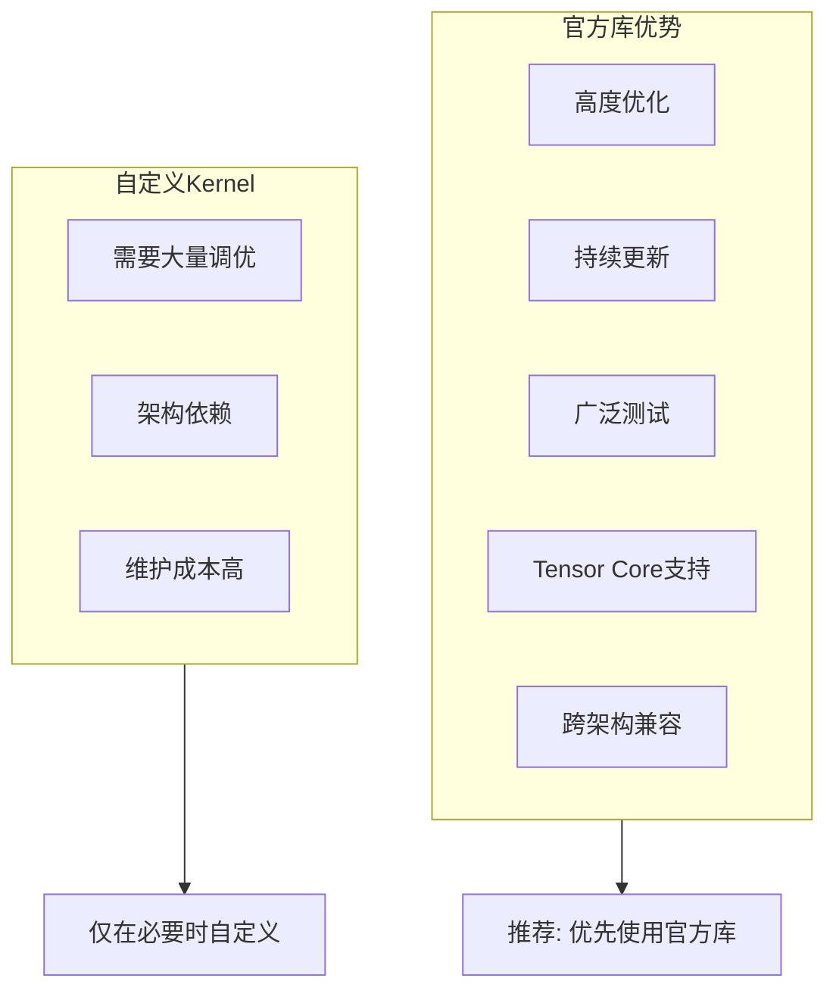
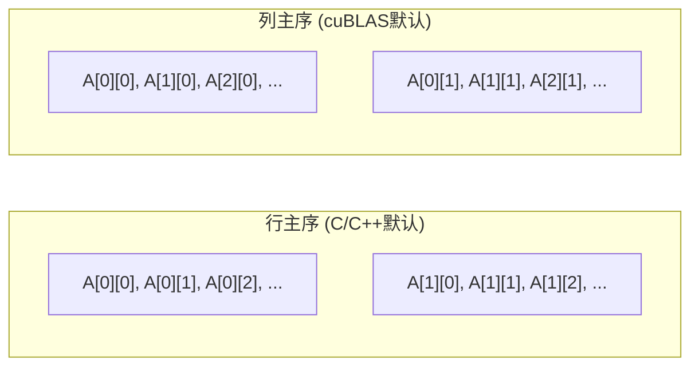
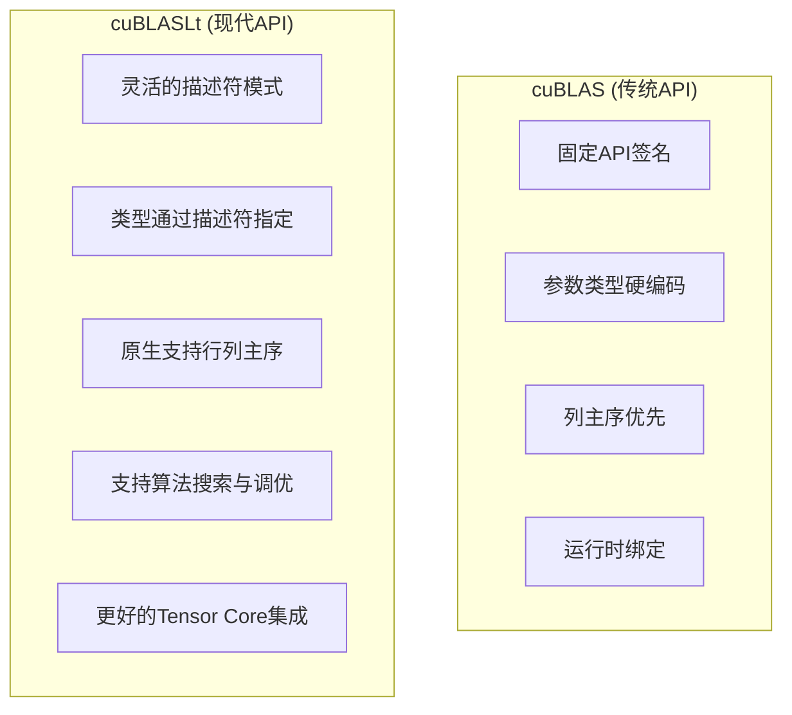
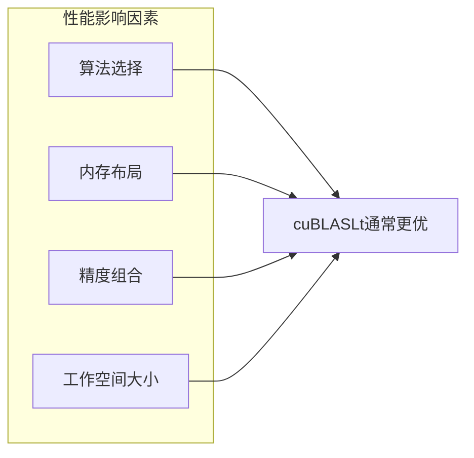
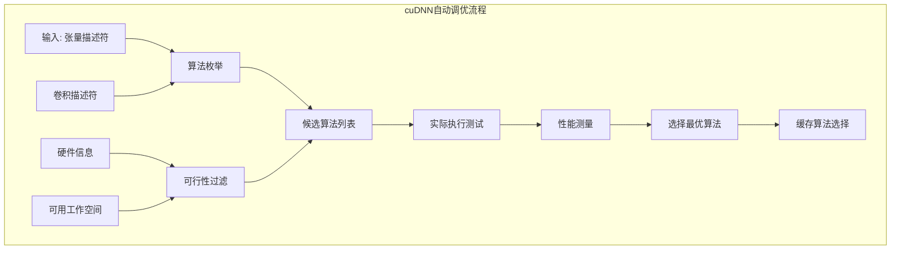
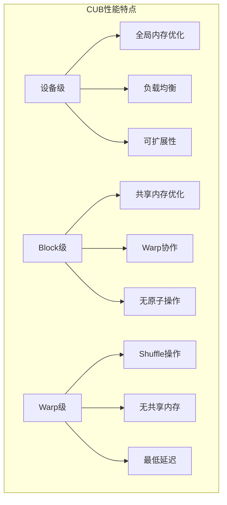
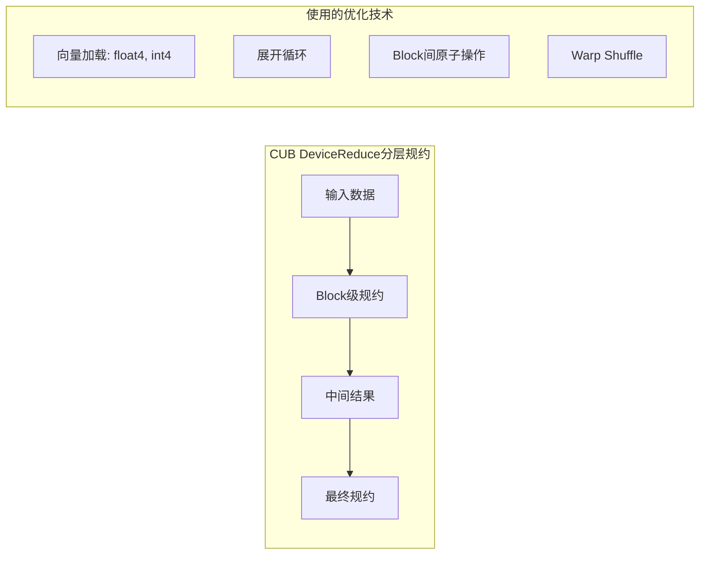
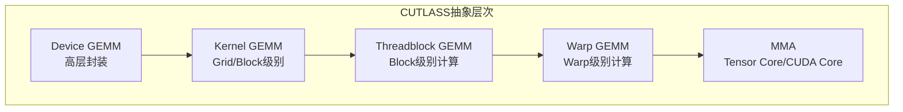
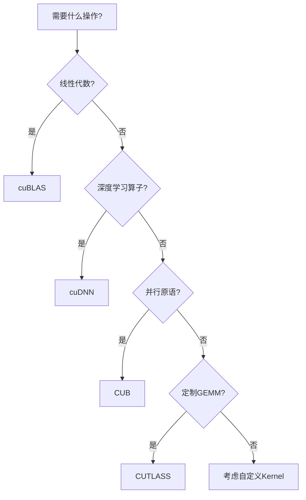
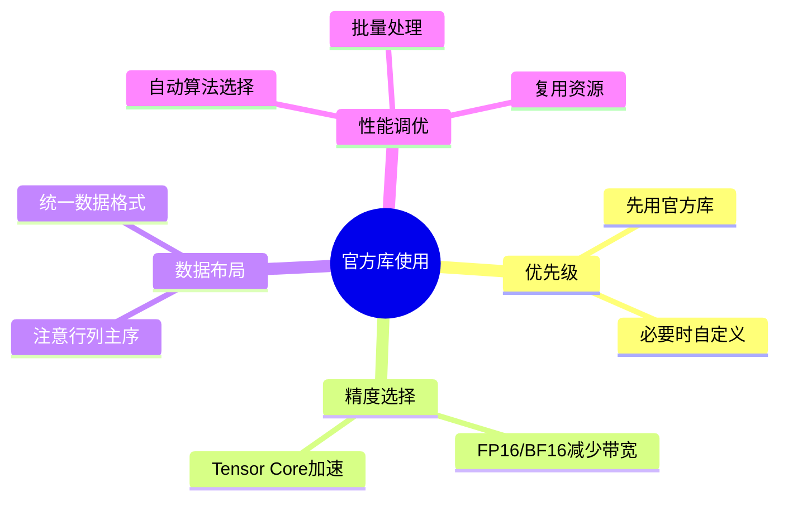

# 第三十章：CUDA官方库实战

> 学习目标：掌握cuBLAS、cuDNN、CUB、CUTLASS等CUDA官方库的使用方法
>
> 预计阅读时间：45 分钟
>
> 前置知识：[第十四章：规约算法优化](./14_规约算法优化.md) | [第二十九章：ILP与Warp Divergence](./29_ILP与Warp_Divergence.md)

---

## 1. 为什么使用官方库？

### 1.1 官方库的优势

CUDA 提供了丰富的官方库，支持多种编程语言和应用编程接口：


> **图片来源**：CUDA C++ Programming Guide - GPU Computing Applications

根据 NVIDIA 官方文档，GPU 相比 CPU 在相同价格和功耗范围内提供更高的指令吞吐量和内存带宽。GPU 专为高度并行计算而设计，将更多晶体管用于数据处理而非数据缓存和流控制。这种设计理念使得 GPU 非常适合处理大规模并行计算任务，也解释了为什么官方库能够提供如此高的性能。

**官方库的核心优势**：



### 1.2 主要官方库概览

| 库名 | 用途 | 关键特性 |
|------|------|----------|
| cuBLAS | 线性代数运算 | GEMM、向量运算、Tensor Core |
| cuDNN | 深度学习算子 | 卷积、池化、归一化、自动调优 |
| CUB | 并行原语 | 排序、规约、扫描、直方图 |
| CUTLASS | GEMM模板库 | 可定制GEMM、支持多种精度 |
| cuSPARSE | 稀疏矩阵 | SpMM、SpMV |
| cuFFT | 快速傅里叶变换 | 1D/2D/3D FFT |

---

## 2. cuBLAS：线性代数库

### 2.1 cuBLAS简介

cuBLAS（CUDA Basic Linear Algebra Subroutines）是NVIDIA提供的GPU加速线性代数库，支持：

- **Level 1**：向量-向量运算（如向量加法、点积）
- **Level 2**：矩阵-向量运算（如矩阵-向量乘法）
- **Level 3**：矩阵-矩阵运算（如GEMM）

### 2.2 GEMM基础

GEMM（General Matrix Multiply）是最核心的操作：
```
C = alpha * A * B + beta * C
```

其中：
- A: M x K 矩阵
- B: K x N 矩阵
- C: M x N 矩阵
- alpha, beta: 标量系数

**矩阵乘法计算示意**：


上图展示了矩阵乘法的基本计算方式：矩阵A的行与矩阵B的列进行点积运算。


上图展示了使用共享内存进行分块优化的矩阵乘法，这是cuBLAS内部优化的核心思想之一。

### 2.3 cuBLAS GEMM示例

```cpp
#include <cublas_v2.h>

// 基本GEMM示例
void cublas_gemm_example() {
    int M = 1024, N = 1024, K = 1024;
    float alpha = 1.0f, beta = 0.0f;

    // 分配设备内存
    float *d_A, *d_B, *d_C;
    cudaMalloc(&d_A, M * K * sizeof(float));
    cudaMalloc(&d_B, K * N * sizeof(float));
    cudaMalloc(&d_C, M * N * sizeof(float));

    // 创建cuBLAS句柄
    cublasHandle_t handle;
    cublasCreate(&handle);

    // 执行SGEMM (单精度GEMM)
    // 注意：cuBLAS使用列主序，需要调整或使用转置标志
    cublasSgemm(handle,
                CUBLAS_OP_N, CUBLAS_OP_N,  // 不转置
                M, N, K,                    // 维度
                &alpha,
                d_A, M,                     // A矩阵及其leading dimension
                d_B, K,                     // B矩阵及其leading dimension
                &beta,
                d_C, M);                    // C矩阵及其leading dimension

    // 销毁句柄
    cublasDestroy(handle);
    cudaFree(d_A);
    cudaFree(d_B);
    cudaFree(d_C);
}
```

### 2.4 cuBLAS关键概念

#### 2.4.1 句柄与上下文管理

CUDA 库使用**句柄（Handle）**来封装库的状态和上下文。根据 CUDA 官方文档，CUDA Context 类似于 CPU 进程，所有资源和操作都封装在 Context 内部。当 Context 被销毁时，系统会自动清理这些资源。


> **图片来源**：CUDA C++ Programming Guide - Library Context Management

**上下文管理的工作机制**：

- 每个主机线程在任意时刻只能有一个当前设备上下文
- 使用计数机制支持多个库共享同一上下文
- 库通过 `cuCtxAttach()` 增加使用计数，`cuCtxDetach()` 减少使用计数
- 使用计数归零时，上下文被销毁

**最佳实践**：

```cpp
// 推荐：应用程序创建上下文，库直接使用
// 这样应用程序可以用自己的启发式方法创建上下文

// 如果库需要创建自己的上下文（对API用户透明）
// 应使用 cuCtxPushCurrent() 和 cuCtxPopCurrent()
// 如上图所示的库上下文管理模式
```

#### 2.4.2 行主序 vs 列主序



**处理方法**：

```cpp
// 方法1：使用CUBLAS_OP_T转置
// 对于行主序矩阵A (M x K)，传入时转置，相当于列主序的K x M
cublasSgemm(handle,
            CUBLAS_OP_T, CUBLAS_OP_T,  // 转置A和B
            N, M, K,                    // 注意维度顺序变化
            &alpha,
            d_A, K,                     // lda = K (原列数)
            d_B, N,                     // ldb = N
            &beta,
            d_C, N);                    // ldc = N

// 方法2：使用cuBLASLt（轻量级API，支持行主序）
```

### 2.5 cuBLASLt vs cuBLAS详细对比

#### 2.5.1 API设计理念



#### 2.5.2 功能对比

| 特性 | cuBLAS | cuBLASLt |
|------|--------|----------|
| 行主序支持 | 需要转置技巧 | 原生支持 |
| 精度配置 | 通过函数名选择 | 描述符灵活配置 |
| 算法选择 | 有限选项 | 支持算法搜索 |
| Tensor Core | 需要特殊标志 | 自动检测与使用 |
| 批量矩阵支持 | 批量API | 统一接口 |
| 内存布局 | 列主序为主 | 完全灵活 |
| 工作空间 | 部分API需要 | 统一的工作空间机制 |

#### 2.5.3 性能差异



cuBLASLt的主要优势：
- **自动算法搜索**：`cublasLtMatmulAlgoGetHeuristic`可找到最优算法
- **更大的工作空间**：更多空间意味着更多优化可能
- **减少数据转换**：原生支持各种内存布局

#### 2.5.4 cuBLASLt FP16 GEMM完整示例

```cpp
#include <cublasLt.h>
#include <cuda_fp16.h>
#include <stdio.h>
#include <stdlib.h>

#define CHECK_CUDA(call)                                                        \
    do {                                                                         \
        cudaError_t err = call;                                                 \
        if (err != cudaSuccess) {                                               \
            fprintf(stderr, "CUDA error at %s:%d: %s\n",                       \
                    __FILE__, __LINE__, cudaGetErrorString(err));              \
            exit(EXIT_FAILURE);                                                 \
        }                                                                        \
    } while (0)

#define CHECK_CUBLAS(call)                                                      \
    do {                                                                         \
        cublasStatus_t err = call;                                             \
        if (err != CUBLAS_STATUS_SUCCESS) {                                    \
            fprintf(stderr, "cuBLAS error at %s:%d: %d\n",                     \
                    __FILE__, __LINE__, err);                                  \
            exit(EXIT_FAILURE);                                                 \
        }                                                                        \
    } while (0)

/**
 * 完整的cuBLASLt FP16 GEMM示例
 * 计算 C = alpha * A * B + beta * C
 * 使用FP16输入和输出，FP32累加，自动利用Tensor Core
 */
void cublaslt_fp16_gemm_complete(
    int M, int N, int K,
    const half* d_A, int lda,
    const half* d_B, int ldb,
    half* d_C, int ldc,
    float alpha, float beta,
    bool row_major = true)                     // 默认行主序
{
    cublasLtHandle_t ltHandle;
    CHECK_CUBLAS(cublasLtCreate(&ltHandle));

    // 1. 创建矩阵布局描述符
    // 行主序: leading dimension = 行数 (元素在一列中连续存储)
    // 列主序: leading dimension = 列数 (元素在一行中连续存储)
    cublasLtMatrixLayout_t Adesc = nullptr, Bdesc = nullptr, Cdesc = nullptr;

    if (row_major) {
        // 行主序布局: 使用CUBLASLT_ORDER_ROW
        CHECK_CUBLAS(cublasLtMatrixLayoutCreate(&Adesc, CUDA_R_16F, M, K, lda));
        CHECK_CUBLAS(cublasLtMatrixLayoutCreate(&Bdesc, CUDA_R_16F, K, N, ldb));
        CHECK_CUBLAS(cublasLtMatrixLayoutCreate(&Cdesc, CUDA_R_16F, M, N, ldc));
    } else {
        // 列主序布局
        CHECK_CUBLAS(cublasLtMatrixLayoutCreate(&Adesc, CUDA_R_16F, M, K, lda));
        CHECK_CUBLAS(cublasLtMatrixLayoutCreate(&Bdesc, CUDA_R_16F, K, N, ldb));
        CHECK_CUBLAS(cublasLtMatrixLayoutCreate(&Cdesc, CUDA_R_16F, M, N, ldc));
    }

    // 2. 创建矩阵乘法描述符
    cublasLtMatmulDesc_t matmulDesc = nullptr;
    // 使用FP32进行累加，提高精度
    CHECK_CUBLAS(cublasLtMatmulDescCreate(&matmulDesc, CUBLAS_COMPUTE_32F, CUDA_R_32F));

    // 3. 设置矩阵乘法属性（可选）
    // 启用Tensor Core（如果可用）
    int8_t fastAccum = 1;  // 快速累加模式
    CHECK_CUBLAS(cublasLtMatmulDescSetAttribute(
        matmulDesc, CUBLASLT_MATMUL_DESC_FAST_ACCUM, &fastAccum, sizeof(fastAccum)));

    // 4. 分配工作空间
    // 更大的工作空间可能带来更好的性能
    size_t workspaceSize = 32 * 1024 * 1024;  // 32MB工作空间
    void* d_workspace = nullptr;
    CHECK_CUDA(cudaMalloc(&d_workspace, workspaceSize));

    // 5. 算法搜索：找到最优算法
    cublasLtMatmulHeuristicResult_t heuristicResult = {};
    cublasLtMatmulPreference_t preference = nullptr;
    CHECK_CUBLAS(cublasLtMatmulPreferenceCreate(&preference));
    CHECK_CUBLAS(cublasLtMatmulPreferenceSetAttribute(
        preference, CUBLASLT_MATMUL_PREF_MAX_WORKSPACE_BYTES,
        &workspaceSize, sizeof(workspaceSize)));

    // 搜索算法
    int returnedResults = 0;
    CHECK_CUBLAS(cublasLtMatmulAlgoGetHeuristic(
        ltHandle, matmulDesc, Adesc, Bdesc, Cdesc, Cdesc,
        preference, 1, &heuristicResult, &returnedResults));

    if (returnedResults == 0) {
        fprintf(stderr, "No suitable algorithm found!\n");
        // 回退到默认算法
        CHECK_CUBLAS(cublasLtMatmul(
            ltHandle, matmulDesc,
            &alpha, d_A, Adesc, d_B, Bdesc,
            &beta, d_C, Cdesc, d_C, Cdesc,
            nullptr, d_workspace, workspaceSize, 0));
    } else {
        // 使用找到的最优算法
        CHECK_CUBLAS(cublasLtMatmul(
            ltHandle, matmulDesc,
            &alpha, d_A, Adesc, d_B, Bdesc,
            &beta, d_C, Cdesc, d_C, Cdesc,
            &heuristicResult.algo,
            d_workspace, heuristicResult.workspaceSize,
            0));
    }

    // 6. 清理资源
    CHECK_CUDA(cudaFree(d_workspace));
    CHECK_CUBLAS(cublasLtMatmulPreferenceDestroy(preference));
    CHECK_CUBLAS(cublasLtMatmulDescDestroy(matmulDesc));
    CHECK_CUBLAS(cublasLtMatrixLayoutDestroy(Adesc));
    CHECK_CUBLAS(cublasLtMatrixLayoutDestroy(Bdesc));
    CHECK_CUBLAS(cublasLtMatrixLayoutDestroy(Cdesc));
    CHECK_CUBLAS(cublasLtDestroy(ltHandle));
}

/**
 * 使用示例
 */
int main() {
    const int M = 1024, N = 1024, K = 1024;

    // 分配主机内存
    size_t size_A = M * K * sizeof(half);
    size_t size_B = K * N * sizeof(half);
    size_t size_C = M * N * sizeof(half);

    half* h_A = (half*)malloc(size_A);
    half* h_B = (half*)malloc(size_B);
    half* h_C = (half*)malloc(size_C);

    // 初始化数据（省略）

    // 分配设备内存
    half *d_A, *d_B, *d_C;
    CHECK_CUDA(cudaMalloc(&d_A, size_A));
    CHECK_CUDA(cudaMalloc(&d_B, size_B));
    CHECK_CUDA(cudaMalloc(&d_C, size_C));

    // 复制数据到设备
    CHECK_CUDA(cudaMemcpy(d_A, h_A, size_A, cudaMemcpyHostToDevice));
    CHECK_CUDA(cudaMemcpy(d_B, h_B, size_B, cudaMemcpyHostToDevice));

    // 执行FP16 GEMM（行主序）
    cublaslt_fp16_gemm_complete(M, N, K, d_A, K, d_B, N, d_C, N, 1.0f, 0.0f, true);

    // 复制结果回主机
    CHECK_CUDA(cudaMemcpy(h_C, d_C, size_C, cudaMemcpyDeviceToHost));

    // 清理
    CHECK_CUDA(cudaFree(d_A));
    CHECK_CUDA(cudaFree(d_B));
    CHECK_CUDA(cudaFree(d_C));
    free(h_A);
    free(h_B);
    free(h_C);

    return 0;
}
```

#### 2.5.5 选择建议

| 场景 | 推荐API | 原因 |
|------|---------|------|
| 简单GEMM | cuBLAS | API简单，易于使用 |
| 高性能需求 | cuBLASLt | 算法搜索，更好的优化 |
| FP16/BF16 | cuBLASLt | 更好的精度控制 |
| 行主序数据 | cuBLASLt | 原生支持，无需转置 |
| 动态shape | cuBLASLt | 描述符更灵活 |
| 已有cuBLAS代码 | cuBLAS | 兼容性，无需重写 |

### 2.6 混合精度GEMM

```cpp
// FP16输入，FP32累加
cublasGemmEx(handle,
             CUBLAS_OP_N, CUBLAS_OP_N,
             M, N, K,
             &alpha,
             d_A, CUDA_R_16F, M,      // FP16矩阵A
             d_B, CUDA_R_16F, K,      // FP16矩阵B
             &beta,
             d_C, CUDA_R_32F, M,      // FP32矩阵C
             CUDA_R_32F,              // 计算精度
             CUBLAS_GEMM_DEFAULT_TENSOR_OP);  // 使用Tensor Core
```

---

## 3. cuDNN：深度学习库

### 3.1 cuDNN简介

cuDNN（CUDA Deep Neural Network Library）专为深度神经网络设计，提供：

- 卷积操作（前向和反向）
- 池化操作
- 激活函数
- 归一化（BatchNorm、LRN）
- RNN操作

### 3.2 卷积操作示例

```cpp
#include <cudnn.h>

void cudnn_conv_example() {
    cudnnHandle_t cudnn;
    cudnnCreate(&cudnn);

    // 输入张量: N x C x H x W
    int N = 32, C = 64, H = 28, W = 28;
    int K = 128;  // 输出通道数
    int kH = 3, kW = 3;  // 卷积核大小

    // 创建张量描述符
    cudnnTensorDescriptor_t inputDesc, outputDesc;
    cudnnCreateTensorDescriptor(&inputDesc);
    cudnnSetTensor4dDescriptor(inputDesc, CUDNN_TENSOR_NCHW,
                               CUDNN_DATA_FLOAT, N, C, H, W);

    // 创建卷积核描述符
    cudnnFilterDescriptor_t filterDesc;
    cudnnCreateFilterDescriptor(&filterDesc);
    cudnnSetFilter4dDescriptor(filterDesc, CUDNN_DATA_FLOAT,
                               CUDNN_TENSOR_NCHW, K, C, kH, kW);

    // 创建卷积描述符
    cudnnConvolutionDescriptor_t convDesc;
    cudnnCreateConvolutionDescriptor(&convDesc);
    cudnnSetConvolution2dDescriptor(convDesc,
                                    1, 1,  // padding
                                    1, 1,  // stride
                                    1, 1,  // dilation
                                    CUDNN_CROSS_CORRELATION,
                                    CUDNN_DATA_FLOAT);

    // 获取输出维度
    int outN, outC, outH, outW;
    cudnnGetConvolution2dForwardOutputDim(convDesc, inputDesc, filterDesc,
                                          &outN, &outC, &outH, &outW);

    // 创建输出张量描述符
    cudnnCreateTensorDescriptor(&outputDesc);
    cudnnSetTensor4dDescriptor(outputDesc, CUDNN_TENSOR_NCHW,
                               CUDNN_DATA_FLOAT, outN, outC, outH, outW);

    // 选择算法
    cudnnConvolutionFwdAlgo_t algo;
    cudnnGetConvolutionForwardAlgorithm(cudnn, inputDesc, filterDesc,
                                        convDesc, outputDesc,
                                        CUDNN_CONVOLUTION_FWD_PREFER_FASTEST,
                                        0, &algo);

    // 分配工作空间
    size_t workspaceSize;
    cudnnGetConvolutionForwardWorkspaceSize(cudnn, inputDesc, filterDesc,
                                            convDesc, outputDesc,
                                            algo, &workspaceSize);
    void* workspace;
    cudaMalloc(&workspace, workspaceSize);

    // 执行卷积
    float alpha = 1.0f, beta = 0.0f;
    cudnnConvolutionForward(cudnn, &alpha,
                            inputDesc, d_input,
                            filterDesc, d_filter,
                            convDesc, algo,
                            workspace, workspaceSize,
                            &beta,
                            outputDesc, d_output);

    // 清理
    cudaFree(workspace);
    cudnnDestroyTensorDescriptor(inputDesc);
    cudnnDestroyTensorDescriptor(outputDesc);
    cudnnDestroyFilterDescriptor(filterDesc);
    cudnnDestroyConvolutionDescriptor(convDesc);
    cudnnDestroy(cudnn);
}
```

### 3.3 cuDNN自动调优原理

#### 3.3.1 工作机制



#### 3.3.2 算法类型与选择

cuDNN支持多种卷积算法，各有特点：

| 算法 | 描述 | 适用场景 |
|------|------|----------|
| `CUDNN_CONVOLUTION_FWD_ALGO_IMPLICIT_GEMM` | 隐式GEMM | 通用场景 |
| `CUDNN_CONVOLUTION_FWD_ALGO_IMPLICIT_PRECOMP_GEMM` | 预计算GEMM | 需要更多内存但更快 |
| `CUDNN_CONVOLUTION_FWD_ALGO_GEMM` | 显式GEMM | 小卷积核 |
| `CUDNN_CONVOLUTION_FWD_ALGO_DIRECT` | 直接卷积 | 特殊尺寸 |
| `CUDNN_CONVOLUTION_FWD_ALGO_FFT` | FFT方法 | 大卷积核 |
| `CUDNN_CONVOLUTION_FWD_ALGO_FFT_TILING` | FFT分块 | 大卷积核+大图像 |
| `CUDNN_CONVOLUTION_FWD_ALGO_WINOGRAD` | Winograd | 3x3卷积 |
| `CUDNN_CONVOLUTION_FWD_ALGO_WINOGRAD_NONFUSED` | 非融合Winograd | 更灵活的Winograd |

#### 3.3.3 自动调优最佳实践

```cpp
/**
 * cuDNN卷积算法自动调优封装
 * 自动选择最优算法并缓存结果
 */
class CudnnConvolutionAutotuner {
private:
    cudnnHandle_t cudnn_;
    cudnnConvolutionFwdAlgoPerf_t best_algo_;
    size_t workspace_size_;
    void* d_workspace_;

public:
    CudnnConvolutionAutotuner() : cudnn_(nullptr), d_workspace_(nullptr) {
        CHECK_CUDNN(cudnnCreate(&cudnn_));
    }

    ~CudnnConvolutionAutotuner() {
        if (d_workspace_) {
            cudaFree(d_workspace_);
        }
        if (cudnn_) {
            cudnnDestroy(cudnn_);
        }
    }

    /**
     * 执行自动调优，选择最优算法
     * @param inputDesc 输入张量描述符
     * @param filterDesc 卷积核描述符
     * @param convDesc 卷积描述符
     * @param outputDesc 输出张量描述符
     * @param max_workspace_size 最大可用工作空间
     */
    void Autotune(
        cudnnTensorDescriptor_t inputDesc,
        cudnnFilterDescriptor_t filterDesc,
        cudnnConvolutionDescriptor_t convDesc,
        cudnnTensorDescriptor_t outputDesc,
        size_t max_workspace_size = 256 * 1024 * 1024)  // 默认256MB
    {
        const int kMaxAlgoCount = 10;
        cudnnConvolutionFwdAlgoPerf_t algo_perfs[kMaxAlgoCount];
        int returned_algo_count = 0;

        // 使用FindEx进行实际运行测试
        CHECK_CUDNN(cudnnFindConvolutionForwardAlgorithmEx(
            cudnn_,
            inputDesc, nullptr,          // 需要实际数据
            filterDesc, nullptr,
            convDesc,
            outputDesc, nullptr,
            kMaxAlgoCount,
            &returned_algo_count,
            algo_perfs,
            nullptr,                      // 工作空间
            max_workspace_size));

        // 选择第一个成功的算法
        for (int i = 0; i < returned_algo_count; ++i) {
            if (algo_perfs[i].status == CUDNN_STATUS_SUCCESS &&
                algo_perfs[i].memory <= max_workspace_size) {
                best_algo_ = algo_perfs[i];
                workspace_size_ = algo_perfs[i].memory;
                break;
            }
        }

        // 分配工作空间
        if (d_workspace_) {
            cudaFree(d_workspace_);
        }
        if (workspace_size_ > 0) {
            CHECK_CUDA(cudaMalloc(&d_workspace_, workspace_size_));
        }
    }

    /**
     * 使用已选择的算法执行卷积
     */
    cudnnStatus_t Execute(
        const void* d_input,
        const void* d_filter,
        void* d_output,
        cudnnTensorDescriptor_t inputDesc,
        cudnnFilterDescriptor_t filterDesc,
        cudnnConvolutionDescriptor_t convDesc,
        cudnnTensorDescriptor_t outputDesc,
        float alpha = 1.0f, float beta = 0.0f)
    {
        return cudnnConvolutionForward(
            cudnn_, &alpha,
            inputDesc, d_input,
            filterDesc, d_filter,
            convDesc,
            best_algo_.algo,
            d_workspace_, workspace_size_,
            &beta,
            outputDesc, d_output);
    }
};
```

#### 3.3.4 完整的cuDNN卷积前向传播示例（含错误处理）

```cpp
#include <cudnn.h>
#include <cuda_runtime.h>
#include <stdio.h>
#include <stdlib.h>
#include <string.h>

#define CHECK_CUDA(call)                                                        \
    do {                                                                         \
        cudaError_t err = call;                                                 \
        if (err != cudaSuccess) {                                               \
            fprintf(stderr, "CUDA error at %s:%d: %s\n",                       \
                    __FILE__, __LINE__, cudaGetErrorString(err));              \
            return EXIT_FAILURE;                                                 \
        }                                                                        \
    } while (0)

#define CHECK_CUDNN(call)                                                       \
    do {                                                                         \
        cudnnStatus_t err = call;                                               \
        if (err != CUDNN_STATUS_SUCCESS) {                                     \
            fprintf(stderr, "cuDNN error at %s:%d: %s\n",                      \
                    __FILE__, __LINE__, cudnnGetErrorString(err));             \
            return EXIT_FAILURE;                                                 \
        }                                                                        \
    } while (0)

/**
 * 完整的cuDNN卷积前向传播示例
 * 包含完整的错误处理和资源管理
 */
int cudnn_conv_forward_complete(
    int batch_size, int in_channels, int in_height, int in_width,
    int out_channels, int kernel_h, int kernel_w,
    int stride_h, int stride_w,
    int pad_h, int pad_w,
    int dilation_h, int dilation_w)
{
    // ========== 1. 创建cuDNN句柄 ==========
    cudnnHandle_t cudnn;
    CHECK_CUDNN(cudnnCreate(&cudnn));
    printf("cuDNN handle created successfully\n");

    // ========== 2. 计算输出尺寸 ==========
    int out_height = (in_height + 2 * pad_h - dilation_h * (kernel_h - 1) - 1) / stride_h + 1;
    int out_width = (in_width + 2 * pad_w - dilation_w * (kernel_w - 1) - 1) / stride_w + 1;

    printf("Input:  (%d, %d, %d, %d)\n", batch_size, in_channels, in_height, in_width);
    printf("Kernel: (%d, %d, %d, %d)\n", out_channels, in_channels, kernel_h, kernel_w);
    printf("Output: (%d, %d, %d, %d)\n", batch_size, out_channels, out_height, out_width);

    // ========== 3. 创建张量描述符 ==========
    cudnnTensorDescriptor_t input_desc = nullptr;
    cudnnTensorDescriptor_t output_desc = nullptr;
    cudnnFilterDescriptor_t filter_desc = nullptr;
    cudnnConvolutionDescriptor_t conv_desc = nullptr;

    CHECK_CUDNN(cudnnCreateTensorDescriptor(&input_desc));
    CHECK_CUDNN(cudnnCreateTensorDescriptor(&output_desc));
    CHECK_CUDNN(cudnnCreateFilterDescriptor(&filter_desc));
    CHECK_CUDNN(cudnnCreateConvolutionDescriptor(&conv_desc));

    // 设置输入张量描述符 (NCHW格式)
    CHECK_CUDNN(cudnnSetTensor4dDescriptor(
        input_desc, CUDNN_TENSOR_NCHW, CUDNN_DATA_FLOAT,
        batch_size, in_channels, in_height, in_width));

    // 设置卷积核描述符
    CHECK_CUDNN(cudnnSetFilter4dDescriptor(
        filter_desc, CUDNN_DATA_FLOAT, CUDNN_TENSOR_NCHW,
        out_channels, in_channels, kernel_h, kernel_w));

    // 设置卷积描述符
    CHECK_CUDNN(cudnnSetConvolution2dDescriptor(
        conv_desc,
        pad_h, pad_w,           // padding
        stride_h, stride_w,      // stride
        dilation_h, dilation_w,  // dilation
        CUDNN_CROSS_CORRELATION, // 卷积类型
        CUDNN_DATA_FLOAT));      // 数据类型

    // 设置输出张量描述符
    CHECK_CUDNN(cudnnSetTensor4dDescriptor(
        output_desc, CUDNN_TENSOR_NCHW, CUDNN_DATA_FLOAT,
        batch_size, out_channels, out_height, out_width));

    // ========== 4. 验证输出尺寸 ==========
    int verify_n, verify_c, verify_h, verify_w;
    CHECK_CUDNN(cudnnGetConvolution2dForwardOutputDim(
        conv_desc, input_desc, filter_desc,
        &verify_n, &verify_c, &verify_h, &verify_w));

    if (verify_n != batch_size || verify_c != out_channels ||
        verify_h != out_height || verify_w != out_width) {
        fprintf(stderr, "Output dimension mismatch!\n");
        fprintf(stderr, "Expected: (%d, %d, %d, %d), Got: (%d, %d, %d, %d)\n",
                batch_size, out_channels, out_height, out_width,
                verify_n, verify_c, verify_h, verify_w);
        return EXIT_FAILURE;
    }

    // ========== 5. 分配设备内存 ==========
    size_t input_size = batch_size * in_channels * in_height * in_width * sizeof(float);
    size_t filter_size = out_channels * in_channels * kernel_h * kernel_w * sizeof(float);
    size_t output_size = batch_size * out_channels * out_height * out_width * sizeof(float);

    float* d_input = nullptr;
    float* d_filter = nullptr;
    float* d_output = nullptr;

    CHECK_CUDA(cudaMalloc(&d_input, input_size));
    CHECK_CUDA(cudaMalloc(&d_filter, filter_size));
    CHECK_CUDA(cudaMalloc(&d_output, output_size));

    printf("Device memory allocated: input=%zuMB, filter=%zuMB, output=%zuMB\n",
           input_size / (1024 * 1024), filter_size / (1024 * 1024), output_size / (1024 * 1024));

    // ========== 6. 初始化输入数据 ==========
    CHECK_CUDA(cudaMemset(d_input, 0, input_size));
    CHECK_CUDA(cudaMemset(d_filter, 0, filter_size));
    CHECK_CUDA(cudaMemset(d_output, 0, output_size));

    // ========== 7. 选择最优算法 ==========
    // 首先使用Get获取算法，快速但不精确
    cudnnConvolutionFwdAlgo_t algo;
    CHECK_CUDNN(cudnnGetConvolutionForwardAlgorithm(
        cudnn, input_desc, filter_desc, conv_desc, output_desc,
        CUDNN_CONVOLUTION_FWD_PREFER_FASTEST, 0, &algo));

    const char* algo_names[] = {
        "IMPLICIT_GEMM", "IMPLICIT_PRECOMP_GEMM", "GEMM", "DIRECT",
        "FFT", "FFT_TILING", "WINOGRAD", "WINOGRAD_NONFUSED",
        "COUNT"
    };
    printf("Selected algorithm: %s\n", algo_names[algo]);

    // 获取工作空间大小
    size_t workspace_size = 0;
    CHECK_CUDNN(cudnnGetConvolutionForwardWorkspaceSize(
        cudnn, input_desc, filter_desc, conv_desc, output_desc, algo, &workspace_size));

    printf("Workspace size required: %zu MB\n", workspace_size / (1024 * 1024));

    // 分配工作空间
    void* d_workspace = nullptr;
    if (workspace_size > 0) {
        CHECK_CUDA(cudaMalloc(&d_workspace, workspace_size));
    }

    // ========== 8. 创建CUDA事件用于计时 ==========
    cudaEvent_t start, stop;
    CHECK_CUDA(cudaEventCreate(&start));
    CHECK_CUDA(cudaEventCreate(&stop));

    // 预热运行
    float alpha = 1.0f, beta = 0.0f;
    CHECK_CUDNN(cudnnConvolutionForward(
        cudnn, &alpha, input_desc, d_input, filter_desc, d_filter,
        conv_desc, algo, d_workspace, workspace_size,
        &beta, output_desc, d_output));

    CHECK_CUDA(cudaDeviceSynchronize());

    // 正式计时运行
    const int kNumIterations = 10;
    float total_time_ms = 0.0f;

    for (int i = 0; i < kNumIterations; ++i) {
        CHECK_CUDA(cudaEventRecord(start));
        CHECK_CUDNN(cudnnConvolutionForward(
            cudnn, &alpha, input_desc, d_input, filter_desc, d_filter,
            conv_desc, algo, d_workspace, workspace_size,
            &beta, output_desc, d_output));
        CHECK_CUDA(cudaEventRecord(stop));
        CHECK_CUDA(cudaEventSynchronize(stop));

        float elapsed_ms;
        CHECK_CUDA(cudaEventElapsedTime(&elapsed_ms, start, stop));
        total_time_ms += elapsed_ms;
    }

    printf("Average convolution time: %.3f ms\n", total_time_ms / kNumIterations);

    // ========== 9. 清理资源 ==========
    CHECK_CUDA(cudaEventDestroy(start));
    CHECK_CUDA(cudaEventDestroy(stop));
    CHECK_CUDA(cudaFree(d_workspace));
    CHECK_CUDA(cudaFree(d_input));
    CHECK_CUDA(cudaFree(d_filter));
    CHECK_CUDA(cudaFree(d_output));
    CHECK_CUDNN(cudnnDestroyTensorDescriptor(input_desc));
    CHECK_CUDNN(cudnnDestroyTensorDescriptor(output_desc));
    CHECK_CUDNN(cudnnDestroyFilterDescriptor(filter_desc));
    CHECK_CUDNN(cudnnDestroyConvolutionDescriptor(conv_desc));
    CHECK_CUDNN(cudnnDestroy(cudnn));

    printf("Resources cleaned up successfully\n");
    return EXIT_SUCCESS;
}

int main() {
    // 典型的ResNet卷积层配置
    return cudnn_conv_forward_complete(
        32,      // batch_size
        64,      // in_channels
        56,      // in_height
        56,      // in_width
        128,     // out_channels
        3,       // kernel_h
        3,       // kernel_w
        1,       // stride_h
        1,       // stride_w
        1,       // pad_h
        1,       // pad_w
        1,       // dilation_h
        1        // dilation_w
    );
}
```

#### 3.3.5 性能优化建议

1. **算法选择**：使用`cudnnFindConvolutionForwardAlgorithm`自动选择最优算法
2. **工作空间**：大工作空间可能获得更好的性能
3. **Tensor Core**：使用FP16/BF16输入启用Tensor Core
4. **批处理**：大batch通常有更好的性能
5. **算法缓存**：对于固定shape的卷积，缓存选择的算法避免重复调优

---

## 4. CUB：并行原语库

### 4.1 CUB简介

CUB（CUDA Unbound）提供跨层次的并行原语：

- **Warp级**：shuffle、reduce、scan
- **Block级**：reduce、scan、histogram
- **Device级**：sort、reduce、scan、histogram、select

### 4.2 Device级操作

```cpp
#include <cub/cub.cuh>

// 设备级规约
void cub_reduce_example(float* d_in, float* d_out, int N) {
    // 确定临时存储大小
    void* d_temp_storage = NULL;
    size_t temp_storage_bytes = 0;
    cub::DeviceReduce::Sum(d_temp_storage, temp_storage_bytes,
                           d_in, d_out, N);

    // 分配临时存储
    cudaMalloc(&d_temp_storage, temp_storage_bytes);

    // 执行规约
    cub::DeviceReduce::Sum(d_temp_storage, temp_storage_bytes,
                           d_in, d_out, N);

    cudaFree(d_temp_storage);
}

// 设备级排序
void cub_sort_example(int* d_keys_in, int* d_keys_out, int N) {
    void* d_temp_storage = NULL;
    size_t temp_storage_bytes = 0;
    cub::DeviceRadixSort::SortKeys(d_temp_storage, temp_storage_bytes,
                                   d_keys_in, d_keys_out, N);

    cudaMalloc(&d_temp_storage, temp_storage_bytes);
    cub::DeviceRadixSort::SortKeys(d_temp_storage, temp_storage_bytes,
                                   d_keys_in, d_keys_out, N);
    cudaFree(d_temp_storage);
}

// 设备级扫描（前缀和）
void cub_scan_example(int* d_in, int* d_out, int N) {
    void* d_temp_storage = NULL;
    size_t temp_storage_bytes = 0;
    cub::DeviceScan::ExclusiveSum(d_temp_storage, temp_storage_bytes,
                                  d_in, d_out, N);

    cudaMalloc(&d_temp_storage, temp_storage_bytes);
    cub::DeviceScan::ExclusiveSum(d_temp_storage, temp_storage_bytes,
                                  d_in, d_out, N);
    cudaFree(d_temp_storage);
}
```

### 4.3 Block级操作

```cpp
#include <cub/cub.cuh>

// Block级规约
__global__ void block_reduce_kernel(float* d_in, float* d_out, int N) {
    // 特殊存储类型用于Block级规约
    typedef cub::BlockReduce<float, 256> BlockReduce;

    // 共享内存分配
    __shared__ typename BlockReduce::TempStorage temp_storage;

    int tid = threadIdx.x;
    int gid = blockIdx.x * blockDim.x + threadIdx.x;

    // 每个线程读取一个元素
    float val = (gid < N) ? d_in[gid] : 0.0f;

    // Block级规约
    float block_sum = BlockReduce(temp_storage).Sum(val);

    // 每个Block的第一个线程写入结果
    if (tid == 0) {
        d_out[blockIdx.x] = block_sum;
    }
}

// Block级扫描
__global__ void block_scan_kernel(int* d_in, int* d_out, int N) {
    typedef cub::BlockScan<int, 256> BlockScan;
    __shared__ typename BlockScan::TempStorage temp_storage;

    int tid = threadIdx.x;
    int gid = blockIdx.x * blockDim.x + threadIdx.x;

    int val = (gid < N) ? d_in[gid] : 0;
    int prefix_sum;

    // Block级扫描
    BlockScan(temp_storage).ExclusiveSum(val, prefix_sum);

    if (gid < N) {
        d_out[gid] = prefix_sum;
    }
}
```

### 4.4 Warp级操作

```cpp
#include <cub/cub.cuh>

__global__ void warp_reduce_kernel(float* d_in, float* d_out, int N) {
    int gid = blockIdx.x * blockDim.x + threadIdx.x;
    int lane = threadIdx.x % 32;

    float val = (gid < N) ? d_in[gid] : 0.0f;

    // Warp级规约
    float warp_sum = cub::WarpReduce(val).Sum();

    // 每个Warp的第一个lane写入结果
    if (lane == 0) {
        int warp_id = gid / 32;
        d_out[warp_id] = warp_sum;
    }
}
```

### 4.5 CUB性能特点详细分析

#### 4.5.1 性能特性分析



#### 4.5.2 各操作性能对比

| 操作 | CUB性能特点 | 自定义实现难点 | 性能差距 |
|------|-------------|----------------|----------|
| Reduce | 分层规约、向量化加载 | 分段优化、避免bank conflict | 2-5x |
| Sort | 基数排序、并行分箱 | 分桶策略、负载均衡 | 3-10x |
| Scan | Work-efficient算法 | 双缓冲、避免shared memory bank conflict | 2-4x |
| Histogram | 原子操作聚合 | 全局原子操作瓶颈 | 1.5-3x |
| Select | 两遍扫描策略 | 压缩存储优化 | 2-4x |

#### 4.5.3 CUB实现细节

**Device级Reduce实现原理**：



**Sort性能分析**：

CUB的基数排序采用以下优化：
1. **并行分箱**：每个线程处理多个元素，减少同步开销
2. **全局内存重用**：减少内存分配次数
3. **两遍扫描**：避免额外的工作空间

#### 4.5.4 CUB DeviceReduce完整示例

```cpp
#include <cub/cub.cuh>
#include <cuda_runtime.h>
#include <stdio.h>
#include <stdlib.h>
#include <algorithm>
#include <random>
#include <numeric>

#define CHECK_CUDA(call)                                                        \
    do {                                                                         \
        cudaError_t err = call;                                                 \
        if (err != cudaSuccess) {                                               \
            fprintf(stderr, "CUDA error at %s:%d: %s\n",                       \
                    __FILE__, __LINE__, cudaGetErrorString(err));              \
            exit(EXIT_FAILURE);                                                 \
        }                                                                        \
    } while (0)

/**
 * CUB DeviceReduce完整使用示例
 * 支持多种规约操作：Sum, Max, Min, ArgMax, ArgMin
 */
class CubReduceExample {
private:
    void* d_temp_storage_;
    size_t temp_storage_bytes_;
    int num_items_;

public:
    CubReduceExample() : d_temp_storage_(nullptr), temp_storage_bytes_(0), num_items_(0) {}

    ~CubReduceExample() {
        if (d_temp_storage_) {
            cudaFree(d_temp_storage_);
            d_temp_storage_ = nullptr;
        }
    }

    /**
     * 初始化：确定临时存储大小
     */
    void Initialize(int num_items) {
        num_items_ = num_items;

        // 第一次调用确定临时存储大小
        cub::DeviceReduce::Sum(d_temp_storage_, temp_storage_bytes_,
                               (float*)nullptr, (float*)nullptr, num_items_);

        // 分配临时存储
        CHECK_CUDA(cudaMalloc(&d_temp_storage_, temp_storage_bytes_));
        printf("DeviceReduce::Sum temp storage: %zu bytes (%.2f MB)\n",
               temp_storage_bytes_, temp_storage_bytes_ / (1024.0 * 1024.0));
    }

    /**
     * 规约求和
     */
    float ReduceSum(const float* d_in, float* d_out) {
        CHECK_CUDA(cub::DeviceReduce::Sum(d_temp_storage_, temp_storage_bytes_,
                                          d_in, d_out, num_items_));

        float result;
        CHECK_CUDA(cudaMemcpy(&result, d_out, sizeof(float), cudaMemcpyDeviceToHost));
        return result;
    }

    /**
     * 规约求最大值
     */
    float ReduceMax(const float* d_in, float* d_out) {
        CHECK_CUDA(cub::DeviceReduce::Max(d_temp_storage_, temp_storage_bytes_,
                                          d_in, d_out, num_items_));

        float result;
        CHECK_CUDA(cudaMemcpy(&result, d_out, sizeof(float), cudaMemcpyDeviceToHost));
        return result;
    }

    /**
     * 规约求最小值
     */
    float ReduceMin(const float* d_in, float* d_out) {
        CHECK_CUDA(cub::DeviceReduce::Min(d_temp_storage_, temp_storage_bytes_,
                                          d_in, d_out, num_items_));

        float result;
        CHECK_CUDA(cudaMemcpy(&result, d_out, sizeof(float), cudaMemcpyDeviceToHost));
        return result;
    }

    /**
     * 规约求最大值及其索引（ArgMax）
     */
    void ReduceArgMax(const float* d_in, float* d_out_value, int* d_out_index) {
        cub::KeyValuePair<int, float> *d_out_pair;
        CHECK_CUDA(cudaMalloc(&d_out_pair, sizeof(cub::KeyValuePair<int, float>)));

        CHECK_CUDA(cub::DeviceReduce::ArgMax(d_temp_storage_, temp_storage_bytes_,
                                             d_in, d_out_pair, num_items_));

        cub::KeyValuePair<int, float> h_pair;
        CHECK_CUDA(cudaMemcpy(&h_pair, d_out_pair, sizeof(cub::KeyValuePair<int, float>),
                              cudaMemcpyDeviceToHost));

        CHECK_CUDA(cudaFree(d_out_pair));

        // h_pair.key是索引，h_pair.value是最大值
        CHECK_CUDA(cudaMemcpy(d_out_value, &h_pair.value, sizeof(float), cudaMemcpyHostToDevice));
        CHECK_CUDA(cudaMemcpy(d_out_index, &h_pair.key, sizeof(int), cudaMemcpyHostToDevice));
    }

    /**
     * 自定义规约操作（使用自定义操作符）
     */
    template <typename Op>
    void ReduceCustom(const float* d_in, float* d_out, Op op, float init_value) {
        CHECK_CUDA(cub::DeviceReduce::Reduce(d_temp_storage_, temp_storage_bytes_,
                                             d_in, d_out, num_items_, op, init_value));
    }
};

// 自定义操作符：计算绝对值最大
struct AbsMaxOp {
    __host__ __device__ float operator()(const float& a, const float& b) const {
        return (fabsf(a) > fabsf(b)) ? a : b;
    }
};

int main() {
    const int N = 10000000;  // 10M元素
    printf("Testing CUB DeviceReduce with %d elements\n", N);

    // 分配主机内存
    std::vector<float> h_data(N);
    std::random_device rd;
    std::mt19937 gen(rd());
    std::uniform_real_distribution<float> dis(-1000.0f, 1000.0f);
    for (int i = 0; i < N; ++i) {
        h_data[i] = dis(gen);
    }

    // 计算CPU参考结果
    float cpu_sum = std::accumulate(h_data.begin(), h_data.end(), 0.0f);
    float cpu_max = *std::max_element(h_data.begin(), h_data.end());
    float cpu_min = *std::min_element(h_data.begin(), h_data.end());

    // 分配设备内存
    float* d_in;
    float* d_out;
    CHECK_CUDA(cudaMalloc(&d_in, N * sizeof(float)));
    CHECK_CUDA(cudaMalloc(&d_out, sizeof(float)));

    // 复制数据到设备
    CHECK_CUDA(cudaMemcpy(d_in, h_data.data(), N * sizeof(float), cudaMemcpyHostToDevice));

    // 创建并初始化规约对象
    CubReduceExample reducer;
    reducer.Initialize(N);

    // 创建CUDA事件计时
    cudaEvent_t start, stop;
    CHECK_CUDA(cudaEventCreate(&start));
    CHECK_CUDA(cudaEventCreate(&stop));

    // 测试Sum
    CHECK_CUDA(cudaEventRecord(start));
    float gpu_sum = reducer.ReduceSum(d_in, d_out);
    CHECK_CUDA(cudaEventRecord(stop));
    CHECK_CUDA(cudaEventSynchronize(stop));
    float sum_time;
    CHECK_CUDA(cudaEventElapsedTime(&sum_time, start, stop));

    printf("\n=== ReduceSum ===\n");
    printf("GPU result: %.4f, CPU result: %.4f, Error: %.6f%%\n",
           gpu_sum, cpu_sum, fabsf(gpu_sum - cpu_sum) / fabsf(cpu_sum) * 100);
    printf("Time: %.3f ms, Throughput: %.2f GB/s\n",
           sum_time, N * sizeof(float) / (sum_time * 1e6));

    // 测试Max
    float gpu_max = reducer.ReduceMax(d_in, d_out);
    printf("\n=== ReduceMax ===\n");
    printf("GPU result: %.4f, CPU result: %.4f\n", gpu_max, cpu_max);

    // 测试Min
    float gpu_min = reducer.ReduceMin(d_in, d_out);
    printf("\n=== ReduceMin ===\n");
    printf("GPU result: %.4f, CPU result: %.4f\n", gpu_min, cpu_min);

    // 测试自定义规约（绝对值最大）
    reducer.ReduceCustom(d_in, d_out, AbsMaxOp(), 0.0f);
    float abs_max;
    CHECK_CUDA(cudaMemcpy(&abs_max, d_out, sizeof(float), cudaMemcpyDeviceToHost));
    printf("\n=== ReduceCustom (AbsMax) ===\n");
    printf("Result: %.4f\n", abs_max);

    // 清理
    CHECK_CUDA(cudaEventDestroy(start));
    CHECK_CUDA(cudaEventDestroy(stop));
    CHECK_CUDA(cudaFree(d_in));
    CHECK_CUDA(cudaFree(d_out));

    return 0;
}
```

#### 4.5.5 CUB DeviceSort完整示例

```cpp
#include <cub/cub.cuh>
#include <cuda_runtime.h>
#include <stdio.h>
#include <stdlib.h>
#include <algorithm>
#include <random>
#include <vector>

#define CHECK_CUDA(call)                                                        \
    do {                                                                         \
        cudaError_t err = call;                                                 \
        if (err != cudaSuccess) {                                               \
            fprintf(stderr, "CUDA error at %s:%d: %s\n",                       \
                    __FILE__, __LINE__, cudaGetErrorString(err));              \
            exit(EXIT_FAILURE);                                                 \
        }                                                                        \
    } while (0)

/**
 * CUB排序完整示例
 * 包括：键排序、键值对排序、双缓冲排序
 */
class CubSortExample {
private:
    void* d_temp_storage_;
    size_t temp_storage_bytes_;
    int num_items_;

public:
    CubSortExample() : d_temp_storage_(nullptr), temp_storage_bytes_(0), num_items_(0) {}

    ~CubSortExample() {
        if (d_temp_storage_) {
            cudaFree(d_temp_storage_);
        }
    }

    void Initialize(int num_items) {
        num_items_ = num_items;
        // 确定临时存储大小
        cub::DeviceRadixSort::SortKeys(d_temp_storage_, temp_storage_bytes_,
                                       (int*)nullptr, (int*)nullptr, num_items_);
        CHECK_CUDA(cudaMalloc(&d_temp_storage_, temp_storage_bytes_));
        printf("DeviceRadixSort temp storage: %zu bytes (%.2f MB)\n",
               temp_storage_bytes_, temp_storage_bytes_ / (1024.0 * 1024.0));
    }

    /**
     * 键排序（升序）
     */
    void SortKeysAscending(const int* d_keys_in, int* d_keys_out) {
        CHECK_CUDA(cub::DeviceRadixSort::SortKeys(
            d_temp_storage_, temp_storage_bytes_,
            d_keys_in, d_keys_out, num_items_));
    }

    /**
     * 键排序（降序）
     */
    void SortKeysDescending(const int* d_keys_in, int* d_keys_out) {
        CHECK_CUDA(cub::DeviceRadixSort::SortKeysDescending(
            d_temp_storage_, temp_storage_bytes_,
            d_keys_in, d_keys_out, num_items_));
    }

    /**
     * 键值对排序（升序）
     * 键决定排序顺序，值跟随键一起移动
     */
    void SortPairsAscending(const int* d_keys_in, int* d_keys_out,
                            const float* d_values_in, float* d_values_out) {
        CHECK_CUDA(cub::DeviceRadixSort::SortPairs(
            d_temp_storage_, temp_storage_bytes_,
            d_keys_in, d_keys_out,
            d_values_in, d_values_out, num_items_));
    }

    /**
     * 双缓冲排序（原地排序，减少内存）
     */
    void SortKeysDoubleBuffer(int* d_keys) {
        // 创建双缓冲描述符
        cub::DoubleBuffer<int> d_keys_buffer(d_keys, d_keys);
        CHECK_CUDA(cub::DeviceRadixSort::SortKeys(
            d_temp_storage_, temp_storage_bytes_, d_keys_buffer, num_items_));
        // 注意：结果可能在d_keys或d_keys + num_items中
        // 需要检查d_keys_buffer.Current()确定结果位置
    }
};

int main() {
    const int N = 1000000;  // 1M元素
    printf("Testing CUB DeviceSort with %d elements\n", N);

    // 准备测试数据
    std::vector<int> h_keys(N);
    std::vector<float> h_values(N);
    std::random_device rd;
    std::mt19937 gen(rd());
    std::uniform_int_distribution<int> key_dis(0, 1000000);
    std::uniform_real_distribution<float> value_dis(0.0f, 1.0f);

    for (int i = 0; i < N; ++i) {
        h_keys[i] = key_dis(gen);
        h_values[i] = value_dis(gen);
    }

    // CPU排序参考
    std::vector<int> h_keys_sorted = h_keys;
    std::sort(h_keys_sorted.begin(), h_keys_sorted.end());

    // 分配设备内存
    int* d_keys_in;
    int* d_keys_out;
    float* d_values_in;
    float* d_values_out;
    CHECK_CUDA(cudaMalloc(&d_keys_in, N * sizeof(int)));
    CHECK_CUDA(cudaMalloc(&d_keys_out, N * sizeof(int)));
    CHECK_CUDA(cudaMalloc(&d_values_in, N * sizeof(float)));
    CHECK_CUDA(cudaMalloc(&d_values_out, N * sizeof(float)));

    // 复制数据到设备
    CHECK_CUDA(cudaMemcpy(d_keys_in, h_keys.data(), N * sizeof(int), cudaMemcpyHostToDevice));
    CHECK_CUDA(cudaMemcpy(d_values_in, h_values.data(), N * sizeof(float), cudaMemcpyHostToDevice));

    // 初始化排序器
    CubSortExample sorter;
    sorter.Initialize(N);

    // 创建CUDA事件计时
    cudaEvent_t start, stop;
    CHECK_CUDA(cudaEventCreate(&start));
    CHECK_CUDA(cudaEventCreate(&stop));

    // 测试键排序（升序）
    CHECK_CUDA(cudaEventRecord(start));
    sorter.SortKeysAscending(d_keys_in, d_keys_out);
    CHECK_CUDA(cudaEventRecord(stop));
    CHECK_CUDA(cudaEventSynchronize(stop));

    float sort_time;
    CHECK_CUDA(cudaEventElapsedTime(&sort_time, start, stop));
    printf("\n=== SortKeys Ascending ===\n");
    printf("Time: %.3f ms, Throughput: %.2f M elements/s\n",
           sort_time, N / (sort_time * 1000));

    // 验证结果
    std::vector<int> h_result(N);
    CHECK_CUDA(cudaMemcpy(h_result.data(), d_keys_out, N * sizeof(int), cudaMemcpyDeviceToHost));

    bool correct = (h_result == h_keys_sorted);
    printf("Validation: %s\n", correct ? "PASSED" : "FAILED");

    // 测试键值对排序
    CHECK_CUDA(cudaEventRecord(start));
    sorter.SortPairsAscending(d_keys_in, d_keys_out, d_values_in, d_values_out);
    CHECK_CUDA(cudaEventRecord(stop));
    CHECK_CUDA(cudaEventSynchronize(stop));
    CHECK_CUDA(cudaEventElapsedTime(&sort_time, start, stop));

    printf("\n=== SortPairs Ascending ===\n");
    printf("Time: %.3f ms, Throughput: %.2f M pairs/s\n",
           sort_time, N / (sort_time * 1000));

    // 验证键值对关系
    std::vector<int> h_result_keys(N);
    std::vector<float> h_result_values(N);
    CHECK_CUDA(cudaMemcpy(h_result_keys.data(), d_keys_out, N * sizeof(int), cudaMemcpyDeviceToHost));
    CHECK_CUDA(cudaMemcpy(h_result_values.data(), d_values_out, N * sizeof(float), cudaMemcpyDeviceToHost));

    // 检查是否升序
    bool is_sorted = std::is_sorted(h_result_keys.begin(), h_result_keys.end());
    printf("Keys sorted: %s\n", is_sorted ? "YES" : "NO");

    // 清理
    CHECK_CUDA(cudaEventDestroy(start));
    CHECK_CUDA(cudaEventDestroy(stop));
    CHECK_CUDA(cudaFree(d_keys_in));
    CHECK_CUDA(cudaFree(d_keys_out));
    CHECK_CUDA(cudaFree(d_values_in));
    CHECK_CUDA(cudaFree(d_values_out));

    return 0;
}
```

#### 4.5.6 性能优化建议

1. **临时存储复用**：对于多次调用，可以预分配临时存储并复用
2. **选择正确的操作层级**：
   - 小数据量：使用Block级或Warp级操作
   - 大数据量：使用Device级操作
3. **内存对齐**：确保输入数据对齐以获得最佳性能
4. **异步执行**：CUB操作支持CUDA流，可与其他操作并行

---

## 5. CUTLASS：GEMM模板库

### 5.1 CUTLASS简介

CUTLASS（CUDA Templates for Linear Algebra Subroutines）是开源的C++模板库，用于实现高性能GEMM和卷积。

**特点**：
- 可定制的GEMM实现
- 支持多种精度（FP64/FP32/FP16/BF16/INT8/INT4）
- 利用Tensor Core
- 清晰的抽象层次

### 5.2 CUTLASS GEMM示例

```cpp
#include <cutlass/gemm/device/gemm.h>

void cutlass_gemm_example() {
    int M = 1024, N = 1024, K = 1024;

    // 定义GEMM类型
    using Gemm = cutlass::gemm::device::Gemm<
        float,                          // ElementA
        cutlass::layout::RowMajor,      // LayoutA
        float,                          // ElementB
        cutlass::layout::RowMajor,      // LayoutB
        float,                          // ElementC
        cutlass::layout::RowMajor,      // LayoutC
        float,                          // ElementAccumulator
        cutlass::arch::OpClassTensorOp, // OpClass
        cutlass::arch::Sm80             // ArchTag
    >;

    // 创建GEMM对象
    Gemm gemm_op;

    // 设置参数
    float alpha = 1.0f;
    float beta = 0.0f;

    // 创建张量视图
    cutlass::TensorRef<float, cutlass::layout::RowMajor> a_ref(d_A, K);
    cutlass::TensorRef<float, cutlass::layout::RowMajor> b_ref(d_B, N);
    cutlass::TensorRef<float, cutlass::layout::RowMajor> c_ref(d_C, N);

    // 执行GEMM
    cutlass::Status status = gemm_op({
        {M, N, K},
        {d_A, K},      // A矩阵
        {d_B, N},      // B矩阵
        {d_C, N},      // C源矩阵
        {d_C, N},      // C目标矩阵
        {alpha, beta}
    });

    if (status != cutlass::Status::kSuccess) {
        printf("GEMM failed: %d\n", status);
    }
}
```

### 5.3 FP16 Tensor Core GEMM

```cpp
#include <cutlass/gemm/device/gemm.h>

void cutlass_fp16_gemm() {
    using Gemm = cutlass::gemm::device::Gemm<
        cutlass::half_t,                // ElementA
        cutlass::layout::RowMajor,      // LayoutA
        cutlass::half_t,                // ElementB
        cutlass::layout::RowMajor,      // LayoutB
        cutlass::half_t,                // ElementC
        cutlass::layout::RowMajor,      // LayoutC
        float,                          // ElementAccumulator (FP32累加)
        cutlass::arch::OpClassTensorOp,
        cutlass::arch::Sm80,
        cutlass::gemm::GemmShape<128, 128, 32>,    // ThreadblockShape
        cutlass::gemm::GemmShape<64, 64, 32>,      // WarpShape
        cutlass::gemm::GemmShape<16, 8, 16>        // InstructionShape (Tensor Core)
    >;

    Gemm gemm_op;
    // ... 执行GEMM
}
```

### 5.4 CUTLASS抽象层次



---

## 6. 官方库使用建议

### 6.1 选择指南



### 6.2 性能优化检查清单

1. **精度选择**
   - 使用FP16/BF16减少内存带宽
   - 使用Tensor Core加速矩阵运算

2. **数据布局**
   - 注意行主序/列主序
   - 考虑NHWC vs NCHW

3. **批处理**
   - 大batch提高GPU利用率
   - 考虑批量操作API

4. **算法选择**
   - 使用自动调优功能
   - 缓存选择的算法

### 6.3 常见问题

**Q: cuBLAS GEMM结果不对？**
A: 检查矩阵布局（行主序 vs 列主序）和leading dimension

**Q: 如何选择cuDNN卷积算法？**
A: 使用`cudnnFindConvolutionForwardAlgorithm`自动选择

**Q: CUB临时存储太大？**
A: 可以复用临时存储，或考虑Block级操作

**Q: CUTLASS编译报错？**
A: 检查CUDA版本和架构设置，确保匹配

---

## 7. 本章小结

### 7.1 关键概念

| 库 | 核心功能 | 使用场景 |
|---|---------|----------|
| cuBLAS | 线性代数 | GEMM、向量运算 |
| cuDNN | 深度学习 | 卷积、池化、激活 |
| CUB | 并行原语 | 排序、规约、扫描 |
| CUTLASS | GEMM模板 | 定制GEMM实现 |

### 7.2 最佳实践



### 7.3 思考题

1. 为什么cuBLAS默认使用列主序？如何处理行主序数据？
2. cuDNN如何选择最优的卷积算法？
3. CUB的Device级和Block级操作有什么区别？何时选择哪一个？
4. CUTLASS相比cuBLAS的优势是什么？

---

*参考资料：*
- *[cuBLAS Documentation](https://docs.nvidia.com/cuda/cublas/)*
- *[cuDNN Developer Guide](https://docs.nvidia.com/deeplearning/cudnn/developer-guide/)*
- *[CUB Documentation](https://nvlabs.github.io/cub/)*
- *[CUTLASS Documentation](https://github.com/NVIDIA/cutlass)*